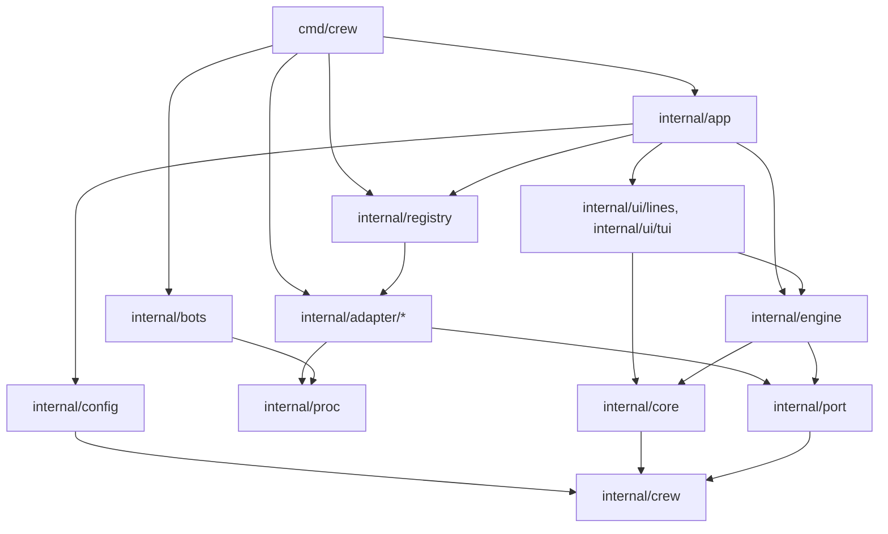
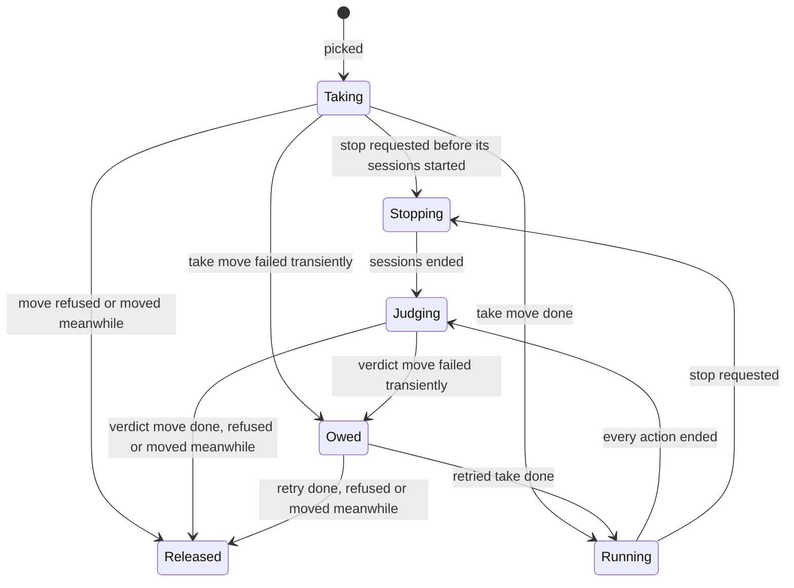
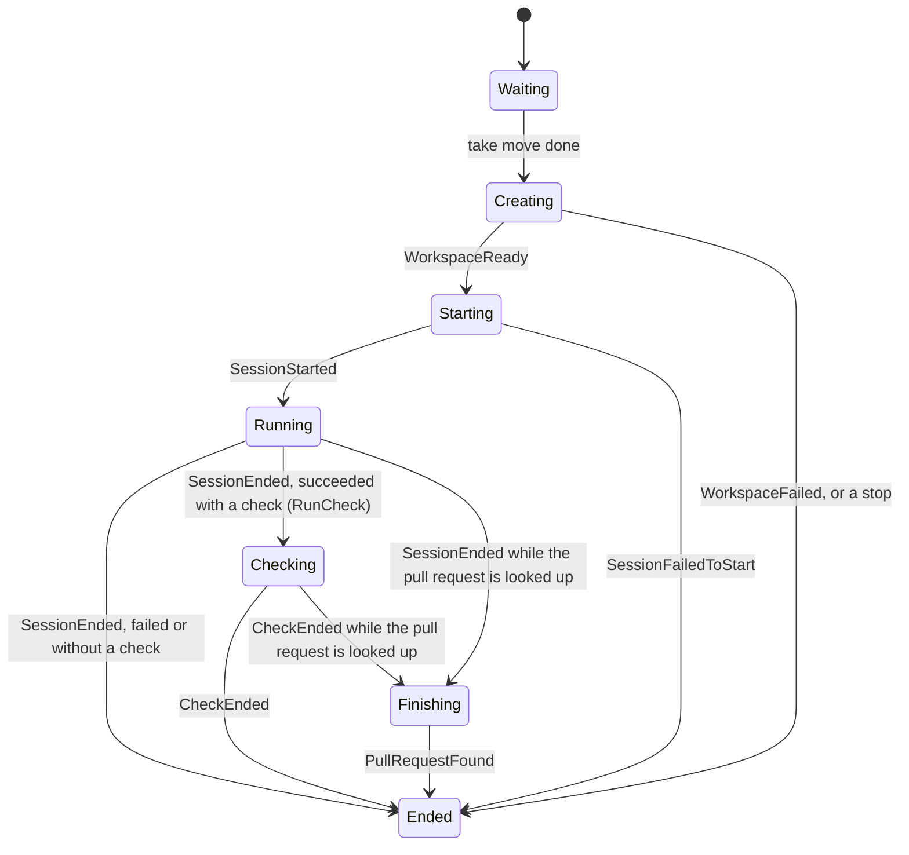

# Architecture

crew is one Go module, `github.com/thatsnotmynameio/crew`. Its engine is built as ports and adapters:

- a **pure core** decides everything, and performs no I/O;
- an **engine loop** runs what the core decides through three **ports**, Tracker, Harness and Workspace, and feeds the results back;
- **adapters** implement the ports: `github`, `claude` and `git` today;
- **renderers**, the TUI and the line printer, only consume the updates the engine publishes.

A new tracker or coding agent is one new adapter package plus one line in the registry. The engine, the renderers and the other adapters do not change.

## Packages

| Package | What it holds |
| --- | --- |
| `cmd/crew` | The binary: flags, signals, the repository root, the `git` workspace, the `shell` checker, and `app.Options.Bots`, which makes the configured bots act through `internal/bots`. It calls `app.Run`, or the bots flow for `crew bots create`. |
| `internal/app` | The wiring: config, registry, engine, renderer, and the stop signals. Returns the exit code. |
| `internal/crew` | The domain: states as the rules write them, the rules' states (`RuleStates`), issues, rules with their labels, actions and queues, board columns, outcomes, failure reports, statuses and pull request reports. |
| `internal/config` | Loads `.crew/config.yaml`: the refusal of old keys (`legacy.go`), strict decoding, the engine's defaults, and one file per section: rules and their label checks, agents, checks, queues and the board. It resolves every name an action gives, its agent, its check's script and its bot, so nothing past it looks a name up. |
| `internal/port` | The port interfaces, the optional `Preparer`, `StatusReporter`, `PullRequestReporter`, `Acting`, `CodeOwnerFinder`, `LoginFinder`, `WriterReporter`, `BoardLister`, `Narrator`, `Reopener`, `UsageReporter` and `PullRequestFinder`, the `Checker`, `Identity`, the sentinel errors and the factory types. |
| `internal/registry` | Maps adapter names to factories. `default.go` is the production list. |
| `internal/core` | The pure reducer: model, inputs, commands and events. |
| `internal/engine` | The loop, command execution, crew's files under `.crew/`, and the update stream. |
| `internal/proc` | The one way to start a child process: its own process group, stop with a deadline, kill all. `StartDetached` starts one crew does not wait for, such as the browser opener. |
| `internal/bots` | `crew bots create`: bot names, the app manifest, the loopback page for GitHub's manifest flow, GitHub's API signed as the bot, and the bots' files under the user config directory, in `crew/bots/`, read from the older `crew/mates/` as well. `Act` makes the configured bots act: their tokens, renewed while crew runs, in private gh config directories, and the git environment of the co-author hook. The engine never imports it: `cmd/crew` hands its result to `app` as plain values. |
| `internal/adapter/github` | Tracker over `gh`, with status comments and pull request reports. |
| `internal/adapter/claude` | Harness over `claude -p`. |
| `internal/adapter/git` | Workspace over `git worktree`. |
| `internal/adapter/shell` | Checker over `sh -c`. |
| `internal/ui/lines` | The timestamped line renderer. |
| `internal/ui/tui` | The live view, built with Bubble Tea, Lip Gloss and Bubbles. |
| `internal/fake` | An in-memory tracker, a scripted harness, a temp-dir workspace and a scripted checker, for tests. |

## Layering

Imports point inward. Arrows mean "imports":



golangci-lint's `depguard` (`.golangci.yml`) breaks the build when one of these rules does not hold:

- `internal/crew` imports nothing of crew's.
- `internal/port` imports none of `core`, `engine`, `config`, the adapters or the UI.
- `internal/core` imports only `internal/crew`.
- `internal/engine` imports no adapter and no UI package.
- Adapters import none of `core`, `engine` or the UI.
- Adapters never import each other, and their non-test code never imports `config`: an adapter gets its section through `port.Decode`.
- Only tests import `internal/fake`.
- Only `internal/ui/tui` imports Bubble Tea, Lip Gloss and Bubbles.
- `internal/bots` imports none of `core`, `engine`, `config`, `port`, `registry`, `app`, the adapters or the UI, and only `cmd/crew` imports it.

## Startup

1. `cmd/crew` parses `--plain` and `--version`, starts catching SIGINT, SIGTERM and SIGHUP, ignores SIGPIPE so a closed output fails the renderer's write instead of killing crew, and finds the repository root with `git rev-parse --show-toplevel`.
2. `app.Run` prints the first line of the boot log, `loading .crew/config.yaml`, to the output, then loads the config. A first pass over the raw YAML reports every old key with its replacement (`legacy.go`) and stops there, since the strict decode would stop at the first. The engine's keys are decoded next; each adapter's section is handed on, undecoded, as a `port.Decode`: `tracker` without `name` and `bot`, and each agent's `harness` without `name`, `model` included. Config resolves each action's agent, check script and bot (its agent's `bot`, else `tracker.bot`), defaults each rule's `notify` to whether it has actions, and builds the default board when the file writes none.
3. The registry builds the tracker from its name and section, and hands it the rules' states, `crew.RuleStates`. It builds a harness for every agent, so a harness name no adapter has stops crew with the key `agents.<name>.harness.name`, and `app` keeps only the agents some action names, as `engine.AgentHarness` values. `cmd/crew` builds the `git` workspace and the `shell` checker directly: there is only one of each, and no key selects them. A written board needs a tracker that implements `BoardLister`.
4. Within 10 minutes, which a first signal cuts short, `app` calls `Options.Bots` when the config names a bot, with `tracker.bot` and every bot crew makes act, builds the engine with the bots' identities, and the engine hands a tracker that implements `Acting` its writer, the zero `Identity` when `tracker.bot` is unset, runs the `Preparer` of the tracker, of each agent's harness in config order, and of the workspace, reads the code owners from a tracker that implements `CodeOwnerFinder` and the `gh` login from one that implements `LoginFinder`, and reads the run journal. It builds the core with the configured bots, the short reason of each that cannot act, which `bots.Act` records in `Acting.Unable`, and that login. It stops at the first port whose `Preparer` fails, naming it, or the agent of a harness, so a later port is not checked. These checks run on a context that `port.WithSteps` gives the boot log's printer: each check calls `port.Step` on it as it starts, and `bots.Act`, which cannot import `port`, calls `ActOptions.Step`, which `cmd/crew` forwards to `port.Step`. The printer writes each step to the output as an event line, so its last line names the step crew is waiting on. A step reported once the context is done, after a signal or the timeout, prints nothing, and a call outside the checks, such as `Create` resolving the default branch, finds no printer on its context. `app` defers the bots' `Close` as soon as they resolved, so it runs after the engine's stop sequence on every way out. Any error so far exits with 2, before the TUI starts. A timeout or a signal there also kills every process in the group first, since a check's process may still run.
5. `app` starts the engine and one renderer, the TUI on a terminal and the line printer otherwise, handing it the bots' startup warnings (and the TUI the rules, the board and the repository's directory name). Warnings about a bot that stops acting later reach the renderers through the engine instead, and handles the stop signals until both return. The first signal stops the engine cleanly, a signal that came as the checks succeeded included; the second kills every process in the group and exits with 1. A renderer that fails, such as on a closed output, stops the engine cleanly and exits with 1.

`crew bots create <name>` takes none of these steps. When `bots` is the first argument, `cmd/crew` hands the rest to the bots command before it parses crew's flags, so every other argument list is parsed as before. The command checks the name, finds the repository root the same way, catches SIGINT, SIGTERM and SIGHUP into a cancelled context, and runs `bots.Flow` with a `proc.Group`, the bots' store and a client of GitHub's API. It loads no config and starts no engine. The store writes under `crew/bots/` and reads a bot from the older `crew/mates/` when `crew/bots/` lacks it, returning the path it read, so a bot created before the rename is installed, never created again, and every message that names a file to delete names the one crew read. An `*bots.EnvError`, found before anything was asked of GitHub's pages, exits with 2, any later error with 1. The guide's [Bots](/guide/bots) page describes the flow.

## The core

`core.Model.Update(input)` returns the commands to run and the events to publish. It never touches a process, the network, a file or the clock: the engine stamps every input with its arrival time. Its tests are tables, with no goroutines.

- **Inputs:** `Tick`, `StopRequested`, `TimeUp`, `BotsChecked`, and the results of commands: `IssuesListed`, `ListFailed`, `BoardListed`, `BoardListFailed`, `CallResult`, `StatusResult`, `PullRequestsResult`, `WorkspaceReady`, `WorkspaceGone`, `WorkspaceFailed`, `RecordFailed`, `SessionStarted`, `SessionFailedToStart`, `SessionEnded`, `CheckEnded`, `PullRequestFound`.
- **Commands:** `ListIssues`, `ListBoard`, `Move`, `ReportFailure`, `ReportStatus`, `ReportPullRequests`, `CreateWorkspace`, `ReopenWorkspace`, `RecordRun`, `StartSession`, `StopSession`, `RunCheck`, `StopCheck`, `FindPullRequest`.
- **Events:** `IssueTaken`, `ActionStarted`, `WorkspaceMissing`, `RunNotRecorded`, `ActionEnded`, `IssueMoved`, `FailureReported`, `IssueSkipped`, `IssueOfOtherKind`, `PollDone`, `PollSkipped`, `ListingFailed`, `CallOwed`, `CallDropped`, `StatusFailed`, `WindingDown`, `Stopped`, `BotStopped`, `BotActsAgain`.

Each issue the core holds has a claim, kept apart from the tracker's states:



Each action of a held issue has a phase:



An action is judged by its session's outcome, and, when it has a check, by its check's. A checking action has not ended, so its issue is not judged and a wind-down waits for it. A stop sends `StopCheck` for every checking action, which then ends as stopped whatever the check returned; a session that succeeds after a stop starts no check. An ended action keeps what made it fail, its cause, which the status carries in place of the session's words.

`SessionEnded` also carries what the harness reported the session used, a `crew.Usage`, which the core keeps on the action rather than in its outcome, since a check's verdict or a stop replaces the outcome. When the tracker can find pull requests, the core sends `FindPullRequest` for the action's branch as the session ends, next to its check, and the action ends only once both its verdict and `PullRequestFound` are in. The outcome and cause are decided when the session or the check ends, as without a lookup, so a stop during the lookup changes neither; a finishing action is still running for the renderers and gets no `StopSession`.

At a tick, the core lists issues unless a listing is outstanding, the run time is up or crew is stopping. `ListIssues` asks for every rule's `ready` and `running` labels: the core takes only from `ready`, and the `running` labels feed the default board. While the issues it holds reach `max_parallel_issues`, or every queue a rule runs in is full, it lists nothing: it counts the skipped tick and emits `PollSkipped` with the issues held and the slots the rules can use, the sum of the slots of the queues they run in, at most `max_parallel_issues`. The rest of the tick runs as usual. A held issue keeps its slot in every claim state, owed included, until the core releases it. When the core releases an issue after at least one skipped tick, and the same three conditions allow a listing, it issues `ListIssues` in that same step, so a freed slot does not wait for the next tick; without a skipped tick, the next listing waits for the next tick. Every `ListIssues` sets the count of skipped ticks back to zero.

The board is one model: columns of labels, each with the kind of item it shows (`crew.BoardColumn.Takes`). A `board` the config writes gives columns of issues; without one, config builds a column per rule that has actions, with its `ready` and `running` labels and its kind. The engine gives the core one of two options:

- **A written board,** `ListingBoard`, needs a tracker that implements `BoardLister`. The core reads the board at every tick: it issues `ListBoard` with the board's labels whether or not every slot is busy, and after the run time is up, unless a board read is outstanding or crew is stopping. `BoardListed` replaces the board's issues and `BoardListFailed` keeps them, setting `View.BoardFailure`.
- **The default board,** `BoardFromListings`, needs no extra query and no `BoardLister`. The core fills it from each `IssuesListed`, keeping each listed item in the columns of its kind whose labels it carries, and a failed listing sets `View.BoardFailure`. Each `ListIssues` counts as a board read. A skipped tick lists nothing, so a label changed on the tracker shows at the next listing.

On both, when a held issue's take or verdict move lands, the core applies it to the board at once: the issue loses every rule state and gains the move's target when a column of its kind names it; a held issue that is not on the board joins it then. Board reads are numbered, and a move remembers the latest read requested when it landed, since that read may predate it: after replacing the board, the core applies again the moves that landed while the answered read was outstanding, and forgets the older ones. `View.Board` holds the board's issues, oldest first. The TUI draws a card in every column whose labels and kind an item matches, with its claim when the core holds it and `○ idle` otherwise; no card waits for the next rule.

The core picks the highest priority first, an issue without one last; then, at the same priority, the rule later in the file first; then the oldest issue. It takes an issue only while its rule's queue holds fewer issues than its slots, passing over the rest, and stops once it holds `max_parallel_issues`. The priority is a rank the tracker sets (`crew.Issue.Priority`, 1 the highest, 0 none), which the `github` adapter fills from the organization's issue field `Priority`. It reports nothing for the issues it leaves, which a later listing can take; `PollDone` counts the listed and the taken issues. It never takes an issue it already holds, nor one the tracker lists as blocked (`crew.Issue.Blocked`, which the `github` adapter fills from GitHub's issue dependencies). A rule takes only the items of its kind: `crew.Rule.Takes`, from the rule's `takes`, must equal `crew.Issue.Kind`, which the `github` adapter sets to `crew.KindPullRequest` on every pull request it lists. The zero value of both is an issue. An item in one state, the `ready` label of a rule of the other kind, is not taken; the core emits `IssueOfOtherKind` for it once, remembering by item key the label it reported, and forgets every item the latest listing did not find in such a state, so the event comes again after the label was taken off and put back. A failed or skipped listing changes nothing. An item in two states gets `IssueSkipped` alone. A call that fails transiently stays owed and is retried at every tick, and once more at stop. A refusal or a "moved meanwhile" is dropped and reported, never retried.

Queues come from the config, not from the engine. `config` sets `crew.Rule.Queue` on every rule: the queue the rule names under `queues`, or `default` with the slots the other queues leave (`max_parallel_issues` minus the slots under `queues`). crew knows no other queue name. The core counts a queue's held issues from the issues it holds, by each one's rule, and never lends a queue's idle slot to another. `max_parallel_issues` still reaches the core as the global limit: a rule with the zero `Queue`, which only tests build, is limited by it alone, shared with every other such rule.

A rule without actions holds a slot like any other. When its take move lands, `taken` finds that every action has ended, vacuously, and judges the issue at once, on the stopping branch too, so the issue moves on to `success` and the engine can stop. Its verdict writes a status entry with no action lines and mirrors the labels on pull requests, with no `End`, so no stop comment.

With status reporting on, the core also keeps a status slot per issue key, apart from the issues it holds, so a status write never holds a slot of `max_parallel_issues`. It reports an issue as running once its take lands and at every tick, and as ended when it is judged and again once the verdict move settles. Each status carries the id of its rule run: a run starts with the issue's first running status for a rule, and with the first status after an ended one, and ids differ across crew processes. Each slot has at most one `ReportStatus` in flight; the newest status of each run waits for it, oldest run first, so an earlier run's ended status lands before the next run's. An ended status is sent only when it differs from the last one, ignoring its time. A failed running status is written again at the next tick. A failed ended status is retried at every tick, and once more at stop. Successful writes emit no event; the first failure after a success emits `StatusFailed`.

With pull request reports on, every move that lands is followed by a `ReportPullRequests`: a take's with the rule's `running` label, a verdict's with its state and, for a rule with actions, how the rule ended, each action as its ended status shows it. A verdict move that is given up sends none. The core keeps a pull request slot per issue key, apart from the issues it holds, so a report never holds the issue, changes its claim, or takes a slot of `max_parallel_issues`. Each slot has at most one report in flight and sends them in the order their moves landed, so a verdict's label never lands before the take's. Each report has an id, unique in the process and kept across retries, so the tracker can tell a retry from a new report. A report that fails transiently is owed: it holds back the issue's later reports, is retried at every tick, and gets one more try at stop. A refusal, a "moved meanwhile" or a failed final try drops it. Owed and dropped reports emit `CallOwed` and `CallDropped` with the kind `CallPullRequests`, and owed ones show in `View.Owed`; a report that lands emits no event.

`View.Queues` holds each queue some rule runs in, in the order of the first rule that runs in each, with its slots and its busy count: the held issues, in any claim, whose rule runs in it. `queueFull` uses the same count, so the TUI shows the count the core takes by. Rules with the zero `crew.Queue` share one unnamed queue of `max_parallel_issues` slots. Each `IssueView` names its rule's queue in `Queue`.

When the core releases an issue whose rule ended, it keeps a handled entry for it in `View.Handled`: the rule, the state the verdict moved it to, the failed actions, each action's spend (a `crew.Spend`, which sums no session for an action that never had one) and pull request, whether the verdict move landed or was given up, and the time from the take to the verdict. The entry replaces the issue's earlier one, except that a rule without actions that ends well keeps an earlier entry that ended well too and marks it `Gone`, since its move took the issue out of the entry's state; without such an entry, it adds its own. While a rule holds the issue again, the view keeps the entry and names that rule in `HeldBy`; the TUI then does not count a failed entry as needing you. A take that is given up keeps no entry. The entries last as long as the `Model`, so one run. Each listing asked for after an entry's verdict move landed decides its `Gone`: whether the issue left the state the move put it in, when that state is one of the rules' states. A counter of listings tells a listing in flight when the move landed from a later one. `View.Spent` sums the spend of every session that ended this run, entries no longer shown included.

The core also keeps the last run record of each issue, rule and action, seeded from the run journal and updated by every `RecordRun` it issues: a start once the action's workspace is ready, and an end when the action ends, with the session's start, usage and pull request. The end of an action that never got a workspace is written but not kept, so it cannot replace a failed run's record. When a rule takes an issue, an action whose last record is a failed end, or a start with no end, gets `ReopenWorkspace` for that run's workspace instead of `CreateWorkspace`, when the workspace can reopen. `WorkspaceReady` with `Resumed` appends the resume paragraph to the action's prompt. `WorkspaceGone` emits `WorkspaceMissing` and creates a fresh workspace, unless crew is stopping. A start in a workspace retires any other key's record naming it, since names repeat once a workspace is gone. A run whose session never started keeps the reason of the last session in its workspace.

`TimeUp` starts a wind-down. The core takes no new issue and stops listing, but keeps retrying owed calls, statuses and pull request reports at each tick and lets every held issue run and be judged. Once no held issue has an action left to end, it enters the stop sequence, so owed calls, statuses and pull request reports get their final try. `View.Stopping` stays false unless a stop was requested; `View.TimeUp` tells the renderers why crew is ending.

## The engine loop

`engine.Engine.Run` is the only caller of the core, on one goroutine.

- Every result reaches the loop through one inbox. A ticker selected in the loop polls every `poll_interval_seconds`, so a slow step coalesces ticks instead of queueing them.
- With `run_time_limit_seconds`, a timer started just before the first poll sends the core `TimeUp`, so the environment checks do not count.
- Each command runs in its own goroutine. Tracker and workspace calls get a 10-minute deadline; a timeout is a transient failure.
- Commands run on their own context, which a stop request does not cancel. A first Ctrl-C therefore never cancels the verdict moves it waits for.
- A stop gives each running session 10 seconds: the engine owns the deadline, and the adapter owns the signals.
- Each session's output goes to `.crew/logs/<workspace>.log`, so a resumed session's goes after the failed run's, following a `{"type":"crew","subtype":"resumed"}` line. Before a reason reaches the core, the engine redacts GitHub tokens and private keys and writes the repository root as `.` and the home directory as `~`.
- Each `StartSession` names the action's agent, and the engine starts the session on that agent's harness, `Config.Harnesses`, so actions on different harnesses run at once. A session and its check get the `port.Identity` of their action's bot, the zero `Identity`, you, when it does not act, and the code owners' and the bots' logins, which the claude and shell adapters export as `CREW_CODE_OWNERS` and `CREW_BOTS`. They add the identity's environment and remove the variables it names, through `proc.Command.Unset`.
- The run journal, `.crew/logs/runs.jsonl`, is read by `Prepare`, which builds the core from it. The loop writes each `RecordRun` itself rather than in a goroutine, so a run's end never lands before its start, and each append starts on a fresh line after a write cut short by a crash. Each line carries the crew run's id, the time `Run` started, and the rule's name under the key `stage`, the wire name earlier versions wrote, so their journals still resume. A usage value the harness did not report is left out of the line rather than written as zero.
- Once a session's `Wait` returns, the engine reads its usage when the session implements `UsageReporter`, and posts it on `SessionEnded`. A `FindPullRequest` runs through the tracker's `PullRequestFinder` within 15 seconds, even during a stop; a failure or a timeout answers "not looked up".
- A `RunCheck` runs through the `Checker` within a fixed 10 minutes, its output appended to the action's log. The engine words the verdict: the check passed, failed with the last line it printed, printed nothing, ran out of time, or could not start. A `StopCheck` cancels the check's context.
- At each tick, the engine asks every running session that implements `Narrator` what it last said, shortens its paths the same way, and passes the texts on the `Tick`. Every 2 seconds it asks again for the snapshot alone: when the texts changed, it publishes an update without events to the latest-wins subscribers, without stepping the core.
- Right after the core is built, and every 2 seconds after, the engine reads the bots' live state: the warning of a tracker that implements `WriterReporter`, set once its writes went back to you, and the bots' failed renewals, through the `Bots.Failing` func that `cmd/crew` takes from `bots.Acting`. When the reading changed, it steps the core with `BotsChecked`, which emits `BotStopped` or `BotActsAgain` on a change of state. Polling catches a change made before `Run`, such as a write that fell back while `Prepare` created labels, and never blocks the renewal loop.
- `Run` returns once the core holds no issue, no owed call, no status write and no pull request report, and no command goroutine is left.

## The update stream

After every step the engine publishes an `engine.Update`: that step's events plus a `Snapshot`, a deep copy of the core's view, its bots' entries included, with the last 100 events, the time of the first poll, the run time limit and what the running sessions last said. Publishing never blocks the engine, and each subscriber decides what it can lose:

- `SubscribeLatest` keeps only the newest update. The TUI uses it: every update carries the full view, so it loses no state it renders. It can lose a transition: the TUI notifies a rule's end from a Handled entry it has not seen, when the rule's `Notify` is set, so an entry replaced between two updates it received sends no notification. A take no longer removes an entry, so this needs a rule to start and end between two updates. It also gets the said-only updates.
- `SubscribeQueue` keeps updates in order up to a capacity. Past it, new updates are dropped and counted, and the line renderer prints the count.

The engine never imports Bubble Tea. Only `internal/ui/tui` does, with Lip Gloss and Bubbles, and it starts with Bubble Tea's signal handler off, so crew's handler is the only one.

## Ports and capabilities

`internal/port` holds three small interfaces, with only what every adapter must provide:

- `Tracker`: `List` the open issues in some states (on GitHub, the issues and pull requests alike, each with its `crew.Kind`), `Move` an issue from one state to another, `ReportFailure` from a structured report the adapter formats in its own markup, as a new comment. `Move` and `ReportFailure` wrap `port.ErrMovedMeanwhile` or `port.ErrRefused`; any other error is transient. A state is free text, written in the rules as the tracker shows it: a label's name on GitHub. The tracker is built knowing the rules' states, `crew.RuleStates`, which are crew's states and its only labels. `List` reports only the states. `Move` touches only the states: it removes every state but its target and leaves every other label alone.
- `Harness`: `Start` a session in a directory with a prompt and an output writer. crew holds one harness per agent in use. The `Session` can be waited on for a `crew.Outcome` and stopped within the caller's deadline.
- `Workspace`: `Create` a fresh workspace for an issue and an action, and return its name, directory and branch.

A fourth port, `Checker`, runs an action's check: a shell command, in the action's workspace, with the issue's ref, key and URL and the branch in its environment. It returns nil when the command exited 0, an error wrapping `port.ErrCheckFailed` when it exited otherwise, and the context's error when the context ended first. `cmd/crew` builds it like the workspace.

Anything an adapter may or may not support is a separate, optional interface. Today there are twelve:

- `Preparer`, on any adapter: it checks the adapter's tools before the first poll, and receives the rules' states, `crew.RuleStates`. A tracker creates the ones the repository lacks, and no other label. Each agent's harness is prepared once, in config order. It reports each of its steps with `port.Step` on the context it receives, as it starts, for the boot log.
- `StatusReporter`, on a tracker: `ReportStatus` writes a structured `crew.Status` to the issue's status comment, in the tracker's own markup. The comment keeps one entry per rule run: the tracker edits the latest entry when the status is of its run, or when it is a queued entry an earlier crew version wrote for the status's rule, appends one otherwise, marking each entry with the rule's name under the wire name `stage=`, and continues a full comment in a new one. Its errors are classified as `Move`'s are. Without it, the core reports no status.
- `PullRequestReporter`, on a tracker: `ReportPullRequests` shows a `crew.PullRequestReport` on the open pull requests that close the issue. It puts each in the report's state, removing every other rule state, as `Move` does on the issue, and, when the report ends a rule with actions, posts a new stop comment on each. A retry of the same report, by its id, posts no comment twice. Its errors are classified as `Move`'s are. Without it, crew writes nothing to pull requests.
- `Acting`, on a tracker: `ActAs` makes the tracker's own writes act as a `port.Identity`, `tracker.bot`'s, or the zero `Identity`, you, when it is unset, and has it take the items the bots' logins opened. The engine calls it before `Prepare`, and only when the config names a bot. `github` reads as you and writes through the identity's gh config directory, falling back to you for the rest of the run when the bot cannot write. Without it, the tracker acts as you.
- `WriterReporter`, on a tracker: `WriterLost` returns the warning the tracker wrote when its writes went back to you for the rest of the run, worded by what GitHub refused, and "" before. The engine polls it for the live view's Bots section.
- `LoginFinder`, on a tracker: `Login` returns the login the tracker acts as when it acts as you, once `Prepare` found it. The live view labels your row with it. Without it, the row reads `you` alone.
- `CodeOwnerFinder`, on a tracker: `CodeOwners` returns the code owners' logins once `Prepare` found them, which the engine passes to every session and check as `CREW_CODE_OWNERS`. `github` reads them from CODEOWNERS' `*` rule, or takes the `gh` login without one. Without it, crew names no code owner.
- `BoardLister`, on a tracker: `ListBoard` returns the open issues a code owner or a bot opened that carry any of the board's labels, never a pull request, oldest first, each with the board labels it carries, matched ignoring case and spelled as the board spells them. `github` runs `List`'s query without its pull requests, at most 100 issues per author. crew refuses a config that writes a `board` when its tracker lacks it, with exit code 2. The default board does not need it.
- `Narrator`, on a harness's `Session`: `Said` returns what the session last said, on one line, and may be called while the session runs.
- `UsageReporter`, on a harness's `Session`: `Usage` returns what the session used, a `crew.Usage` whose cost, tokens and turns are each optional, once `Wait` has returned. A session that was stopped, killed or crashed before its final result reports nothing. `claude` reads the last `result` event's `total_cost_usd` and `modelUsage`, which cover the whole session, and adds up `num_turns` over every result. Without it, crew shows the usage as not reported.
- `PullRequestFinder`, on a tracker: `FindPullRequest` returns the pull request opened from a branch: an open one first, otherwise the newest closed or merged one created at or after a time, which is zero for a resumed workspace. `github` makes one `gh pr list --head` call and skips forks. Without it, every pull request is not looked up.
- `Reopener`, on a workspace: `Reopen` returns a workspace it created before, as it is now, or an error wrapping `port.ErrWorkspaceGone` when it no longer exists. `git` reads `git worktree list` and changes nothing. Without it, a failed action starts over in a fresh workspace.

The engine finds optional interfaces by type assertion, so it never wraps an adapter value, which would hide them. An adapter carries no "not implemented" stubs. Each one has compile-time guards:

```go
var (
	_ port.Harness  = (*harness)(nil)
	_ port.Preparer = (*harness)(nil)
)
```

An issue's identity is an opaque `Key` plus a display `Ref`, both set by the tracker (`42` and `#42` on GitHub). Nothing outside the `github` adapter assumes an issue number.

## The registry

`registry.Registry` is a value, not a global: no `init()` registers anything. `registry.Default` in `internal/registry/default.go` is the production list, and `cmd/crew` passes it to `app`. Tests build their own registry holding the fakes, so the fakes go through the same lookup and validation as the real adapters.

A factory receives a `port.Decode` for its config section, so no adapter imports the YAML library. A tracker factory also receives the rules' states. The decoder rejects unknown keys with the key path and line. A factory sets its defaults on the target before decoding, because a key the section leaves out keeps the target's value. A factory validates; it never runs a tool or reaches the network. That is the `Preparer`'s job.

| Port | Selected by | Factory's section |
| --- | --- | --- |
| Tracker | `tracker.name` | every key under `tracker:` except `name` and `bot` |
| Harness | `agents.<name>.harness.name`, once per agent | every key of the agent's `harness:` except `name`, `model` included |

The registry's lookup error names the key that selected the missing name, such as `agents.developer.harness.name`, and lists the registered adapters. `app` builds a harness for every agent, so an unused agent's name is checked too, but keeps, prepares and runs only the agents some action names.

## Adding an adapter

Take a hypothetical Codex harness. Everything it needs is one new package, `internal/adapter/codex/`, plus one entry in `internal/registry/default.go`. The `claude` adapter is the model to follow.

### `internal/adapter/codex/command.go`

A pure function from prompt, model and directory to a `proc.Command` that runs Codex headless. Keep it apart from the parsing, as `claude` does, so a declarative preset could replace it later.

### `internal/adapter/codex/stream.go`

An `io.Writer` that parses Codex's output as it is printed, plus the verdict: when the session succeeded, and its one-line reason. A session that ends cleanly succeeded; one that fails, dies or is stopped did not.

### `internal/adapter/codex/harness.go`

The adapter itself:

```go
package codex

// Compile-time guards: the engine finds Preparer by type assertion.
var (
	_ port.Harness  = (*harness)(nil)
	_ port.Preparer = (*harness)(nil)
	_ port.Session  = (*session)(nil)
)

// settings is the adapter's section: an agent's harness keys but name,
// model included, plus any key it wants.
type settings struct {
	Model string `yaml:"model"`
}

// Factory returns the codex harness factory. Every session runs through
// group, so a forced exit kills it.
func Factory(group *proc.Group) port.HarnessFactory {
	return func(decode port.Decode) (port.Harness, error) {
		s := settings{Model: "..."} // the default model belongs to the adapter
		if err := decode(&s); err != nil {
			return nil, err
		}
		return &harness{group: group, model: s.Model}, nil
	}
}
```

- `Start` builds the command, starts it with `group.Start`, sends its output to `run.Output` and through the parser, and returns a session.
- The session's `Wait` returns the verdict once the process has exited. Its `Stop` calls the process's `Stop(ctx)`, which sends SIGTERM to the process group, then SIGKILL when `ctx` ends.
- `Prepare`, the optional `Preparer`, checks that `codex` is on `PATH`. Leave it out if there is nothing to check.
- `Said`, the optional `Narrator` on the session, returns the last thing the session said, for the issue's status comment. Leave it out if the output does not tell.
- `Usage`, the optional `UsageReporter` on the session, returns the cost, tokens, turns and models the output reports, each optional. Leave it out if the output tells none of them.

### `internal/adapter/codex/harness_test.go` and `testdata/`

Script the process behind a small interface, as `claude` does with its `spawner`, and parse recorded output from `testdata/`: a success, an error, and output with no verdict.

### `internal/registry/default.go`

The only existing file that changes. Add the entry to the harness map, with the import it needs:

```go
map[string]port.HarnessFactory{
	"claude": claude.Factory(group),
	"codex":  codex.Factory(group),
},
```

No other Go file changes: not the engine, not the core, not the config, not the renderers, not the other adapters. An agent then selects it with `harness: {name: codex}`, and other agents keep running on `claude` beside it. Document the new name and its keys on the Guide page in the same pull request, and add its keys under `agents.*.harness` in `schema/config.schema.json`, with a schema test in the adapter, as `claude` has, that fails when the schema and its `settings` disagree.

A tracker adapter has the same shape: a package with `Factory(group) port.TrackerFactory`, an entry in the tracker map, and its own way of finding the rules' states, which its factory receives, among the tracker's statuses or labels.
