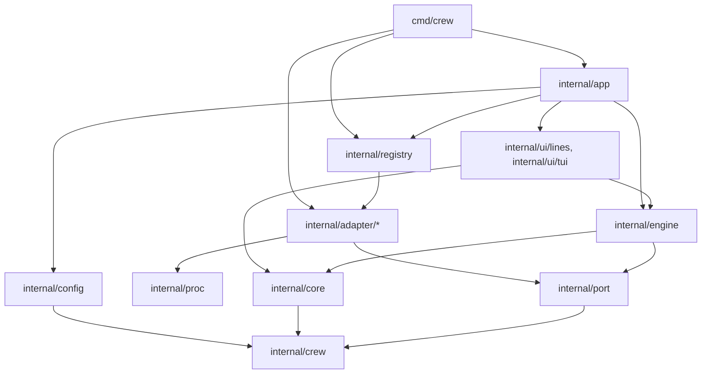
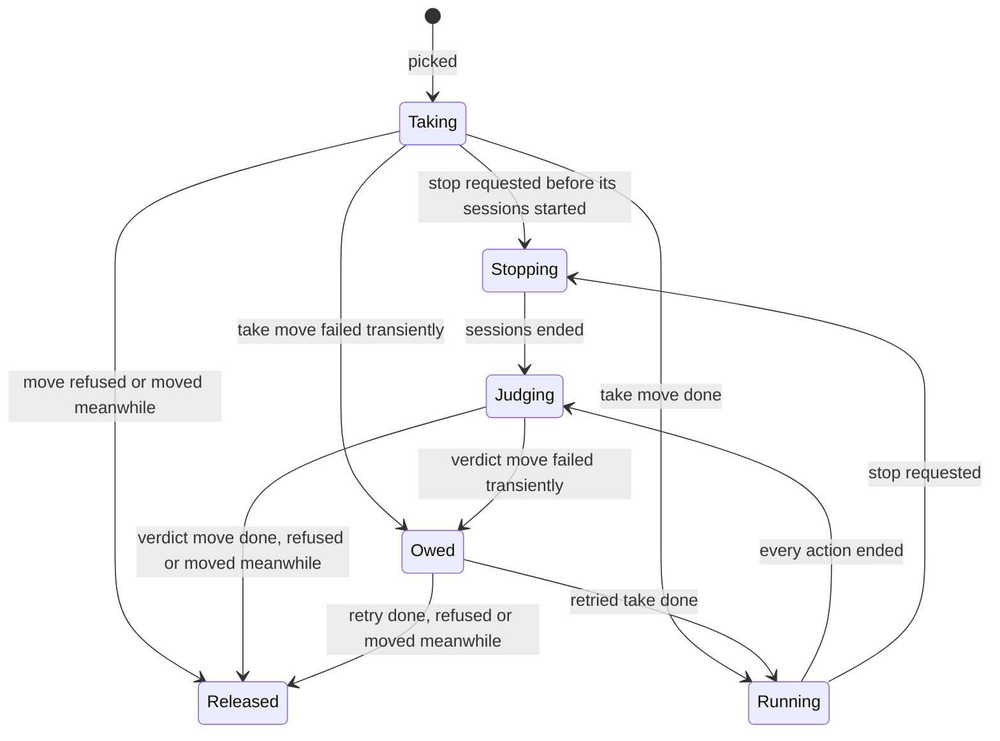

# Architecture

crew is one Go module, `github.com/thatsnotmynameio/crew`. Its engine is built as ports and adapters:

- a **pure core** decides everything, and performs no I/O;
- an **engine loop** runs what the core decides through three **ports**, Tracker, Harness and Workspace, and feeds the results back;
- **adapters** implement the ports: `github`, `claude` and `git` today;
- **renderers**, the TUI and the line printer, only consume the updates the engine publishes.

A new tracker or coding agent is one new adapter package plus one line in the registry. The engine, the renderers and the other adapters do not change.

## Packages

| Package | What it holds |
| --- | --- |
| `cmd/crew` | The binary: flags, signals, the repository root, and the `git` workspace. It calls `app.Run`. |
| `internal/app` | The wiring: config, registry, engine, renderer, and the stop signals. Returns the exit code. |
| `internal/crew` | The domain: the eight states, issues, stages, actions, outcomes, failure reports and statuses. |
| `internal/config` | Loads `.crew/config.yaml`: strict decoding, the engine's defaults, workflow checks, prompt templates. |
| `internal/port` | The port interfaces, the optional `Preparer`, `StatusReporter` and `Narrator`, the sentinel errors and the factory types. |
| `internal/registry` | Maps adapter names to factories. `default.go` is the production list. |
| `internal/core` | The pure reducer: model, inputs, commands and events. |
| `internal/engine` | The loop, command execution, crew's files under `.crew/`, and the update stream. |
| `internal/proc` | The one way to start a child process: its own process group, stop with a deadline, kill all. |
| `internal/adapter/github` | Tracker over `gh`. |
| `internal/adapter/claude` | Harness over `claude -p`. |
| `internal/adapter/git` | Workspace over `git worktree`. |
| `internal/ui/lines` | The timestamped line renderer. |
| `internal/ui/tui` | The Bubble Tea TUI. |
| `internal/fake` | An in-memory tracker, a scripted harness and a temp-dir workspace, for tests. |

## Layering

Imports point inward. Arrows mean "imports":



golangci-lint's `depguard` (`.golangci.yml`) breaks the build when one of these rules does not hold:

- `internal/crew` imports nothing of crew's.
- `internal/port` imports none of `core`, `engine`, `config`, the adapters or the UI.
- `internal/core` imports only `internal/crew`.
- `internal/engine` imports no adapter and no UI package.
- Adapters import none of `core`, `engine` or the UI.
- Adapters never import each other, and their non-test code never imports `config`: an adapter gets its section through `port.Decode`.
- Only tests import `internal/fake`.
- Only `internal/ui/tui` imports Bubble Tea.

## Startup

1. `cmd/crew` parses `--plain` and `--version`, starts catching SIGINT, SIGTERM and SIGHUP, ignores SIGPIPE so a closed output fails the renderer's write instead of killing crew, and finds the repository root with `git rev-parse --show-toplevel`.
2. `app.Run` loads the config. The engine's keys are decoded there; each adapter's section is handed on, undecoded, as a `port.Decode`.
3. The registry builds the tracker and the harness from their names and sections. `cmd/crew` builds the `git` workspace directly: there is only one, and no key selects it.
4. The engine runs every adapter's `Preparer`, within 10 minutes, which a first signal cuts short. Any error so far exits with 2, before the TUI starts. A timeout or a signal there also kills every process in the group first, since a check's process may still run.
5. `app` starts the engine and one renderer, the TUI on a terminal and the line printer otherwise, and handles the stop signals until both return. The first signal stops the engine cleanly, a signal that came as the checks succeeded included; the second kills every process in the group and exits with 1. A renderer that fails, such as on a closed output, stops the engine cleanly and exits with 1.

## The core

`core.Model.Update(input)` returns the commands to run and the events to publish. It never touches a process, the network, a file or the clock: the engine stamps every input with its arrival time. Its tests are tables, with no goroutines.

- **Inputs:** `Tick`, `StopRequested`, `TimeUp`, and the results of commands: `IssuesListed`, `ListFailed`, `CallResult`, `StatusResult`, `WorkspaceReady`, `WorkspaceFailed`, `SessionStarted`, `SessionFailedToStart`, `SessionEnded`.
- **Commands:** `ListIssues`, `Move`, `ReportFailure`, `ReportStatus`, `CreateWorkspace`, `StartSession`, `StopSession`.
- **Events:** `IssueTaken`, `ActionStarted`, `ActionEnded`, `IssueMoved`, `FailureReported`, `IssueSkipped`, `PollDone`, `ListingFailed`, `CallOwed`, `CallDropped`, `StatusFailed`, `WindingDown`, `Stopped`.

Each issue the core holds has a claim, kept apart from the tracker's states:



The core picks later stages first, then the oldest issue. It never takes an issue it already holds. A call that fails transiently stays owed and is retried at every tick, and once more at stop. A refusal or a "moved meanwhile" is dropped and reported, never retried.

With status reporting on, the core also keeps a status slot per issue key, apart from the issues it holds, so a queued issue has one and a status write never holds a slot of `max_parallel_issues`. It reports an issue as queued when a listing leaves it waiting, as running once its take lands and at every tick, and as ended when it is judged and again once the verdict move settles. Each slot has at most one `ReportStatus` in flight, and the newest status waits for it. A queued or ended status is sent only when it differs from the last one, ignoring its time. A failed queued or running status is written again at the next poll. A failed ended status is retried at every tick, and once more at stop. Successful writes emit no event; the first failure after a success emits `StatusFailed`.

`TimeUp` starts a wind-down. The core takes no new issue and stops listing, but keeps retrying owed calls and statuses at each tick and lets every held issue run and be judged. Once no held issue has an action left to end, it enters the stop sequence, so owed calls and statuses get their final try. `View.Stopping` stays false unless a stop was requested; `View.TimeUp` tells the renderers why crew is ending.

## The engine loop

`engine.Engine.Run` is the only caller of the core, on one goroutine.

- Every result reaches the loop through one inbox. A ticker selected in the loop polls every `poll_interval_seconds`, so a slow step coalesces ticks instead of queueing them.
- With `run_time_limit_seconds`, a timer started just before the first poll sends the core `TimeUp`, so the environment checks do not count.
- Each command runs in its own goroutine. Tracker and workspace calls get a 10-minute deadline; a timeout is a transient failure.
- Commands run on their own context, which a stop request does not cancel. A first Ctrl-C therefore never cancels the verdict moves it waits for.
- A stop gives each running session 10 seconds: the engine owns the deadline, and the adapter owns the signals.
- Each session's output goes to `.crew/logs/<workspace>.log`. Before a reason reaches the core, the engine writes the repository root as `.` and the home directory as `~`.
- At each tick, the engine asks every running session that implements `Narrator` what it last said, shortens its paths the same way, and passes the texts on the `Tick`.
- `Run` returns once the core holds no issue, no owed call and no status write, and no command goroutine is left.

## The update stream

After every step the engine publishes an `engine.Update`: that step's events plus a `Snapshot`, a deep copy of the core's view with the last 20 events. Publishing never blocks the engine, and each subscriber decides what it can lose:

- `SubscribeLatest` keeps only the newest update. The TUI uses it: every update carries the full view, so it loses nothing it renders.
- `SubscribeQueue` keeps updates in order up to a capacity. Past it, new updates are dropped and counted, and the line renderer prints the count.

The engine never imports Bubble Tea. Only `internal/ui/tui` does, and it starts with Bubble Tea's signal handler off, so crew's handler is the only one.

## Ports and capabilities

`internal/port` holds three small interfaces, with only what every adapter must provide:

- `Tracker`: `List` the open issues in some states, `Move` an issue from one state to another, `ReportFailure` from a structured report the adapter formats in its own markup. `Move` and `ReportFailure` wrap `port.ErrMovedMeanwhile` or `port.ErrRefused`; any other error is transient.
- `Harness`: `Start` a session in a directory with a prompt and an output writer. The `Session` can be waited on for a `crew.Outcome` and stopped within the caller's deadline.
- `Workspace`: `Create` a fresh workspace for an issue and an action, and return its name, directory and branch.

Anything an adapter may or may not support is a separate, optional interface. Today there are three:

- `Preparer`, on any adapter: it checks the adapter's tools before the first poll, and receives the states the workflow uses.
- `StatusReporter`, on a tracker: `ReportStatus` writes a structured `crew.Status` to the issue's one status comment, created once and edited in place, in the tracker's own markup. Its errors are classified as `Move`'s are. Without it, the core reports no status.
- `Narrator`, on a harness's `Session`: `Said` returns what the session last said, on one line, and may be called while the session runs.

The engine finds optional interfaces by type assertion, so it never wraps an adapter value, which would hide them. An adapter carries no "not implemented" stubs. Each one has compile-time guards:

```go
var (
	_ port.Harness  = (*harness)(nil)
	_ port.Preparer = (*harness)(nil)
)
```

An issue's identity is an opaque `Key` plus a display `Ref`, both set by the tracker (`42` and `#42` on GitHub). Nothing outside the `github` adapter assumes an issue number.

## The registry

`registry.Registry` is a value, not a global: no `init()` registers anything. `registry.Default` in `internal/registry/default.go` is the production list, and `cmd/crew` passes it to `app`. Tests build their own registry holding the fakes, so the fakes go through the same lookup and validation as the real adapters.

A factory receives a `port.Decode` for its config section, so no adapter imports the YAML library. The decoder rejects unknown keys with the key path and line. A factory sets its defaults on the target before decoding, because a key the section leaves out keeps the target's value. A factory validates; it never runs a tool or reaches the network. That is the `Preparer`'s job.

| Port | Selected by | Factory's section |
| --- | --- | --- |
| Tracker | `tracker.name` | every key under `tracker:` except `name` |
| Harness | `config.harness` | `config.model` plus the keys of the top-level `harness:` section |

## Adding an adapter

Take a hypothetical Codex harness. Everything it needs is one new package, `internal/adapter/codex/`, plus one entry in `internal/registry/default.go`. The `claude` adapter is the model to follow.

### `internal/adapter/codex/command.go`

A pure function from prompt, model and directory to a `proc.Command` that runs Codex headless. Keep it apart from the parsing, as `claude` does, so a declarative preset could replace it later.

### `internal/adapter/codex/stream.go`

An `io.Writer` that parses Codex's output as it is printed, plus the verdict: when the session succeeded, and its one-line reason. A session that ends cleanly succeeded; one that fails, dies or is stopped did not.

### `internal/adapter/codex/harness.go`

The adapter itself:

```go
package codex

// Compile-time guards: the engine finds Preparer by type assertion.
var (
	_ port.Harness  = (*harness)(nil)
	_ port.Preparer = (*harness)(nil)
	_ port.Session  = (*session)(nil)
)

// settings is the adapter's section: config.model, plus any key it wants
// under the top-level harness: section.
type settings struct {
	Model string `yaml:"model"`
}

// Factory returns the codex harness factory. Every session runs through
// group, so a forced exit kills it.
func Factory(group *proc.Group) port.HarnessFactory {
	return func(decode port.Decode) (port.Harness, error) {
		s := settings{Model: "..."} // the default model belongs to the adapter
		if err := decode(&s); err != nil {
			return nil, err
		}
		return &harness{group: group, model: s.Model}, nil
	}
}
```

- `Start` builds the command, starts it with `group.Start`, sends its output to `run.Output` and through the parser, and returns a session.
- The session's `Wait` returns the verdict once the process has exited. Its `Stop` calls the process's `Stop(ctx)`, which sends SIGTERM to the process group, then SIGKILL when `ctx` ends.
- `Prepare`, the optional `Preparer`, checks that `codex` is on `PATH`. Leave it out if there is nothing to check.
- `Said`, the optional `Narrator` on the session, returns the last thing the session said, for the issue's status comment. Leave it out if the output does not tell.

### `internal/adapter/codex/harness_test.go` and `testdata/`

Script the process behind a small interface, as `claude` does with its `spawner`, and parse recorded output from `testdata/`: a success, an error, and output with no verdict.

### `internal/registry/default.go`

The only existing file that changes. Add the entry to the harness map, with the import it needs:

```go
map[string]port.HarnessFactory{
	"claude": claude.Factory(group),
	"codex":  codex.Factory(group),
},
```

No other Go file changes: not the engine, not the core, not the config, not the renderers, not the other adapters. The boss then selects it with `config.harness: codex`. Document the new name and its keys on the Guide page in the same pull request.

A tracker adapter has the same shape: a package with `Factory(group) port.TrackerFactory`, an entry in the tracker map, and its own mapping from crew's eight states to the tracker's statuses or labels.
