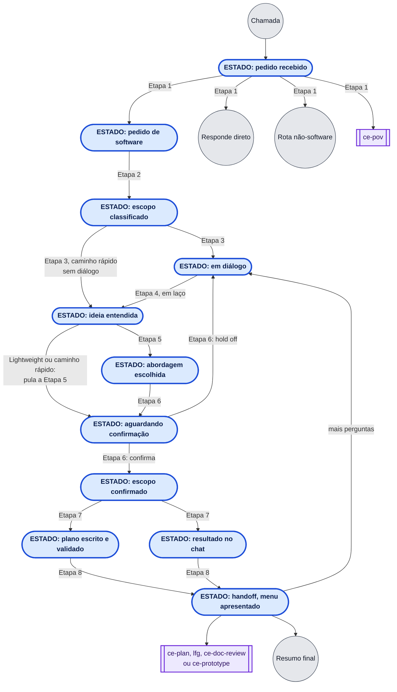
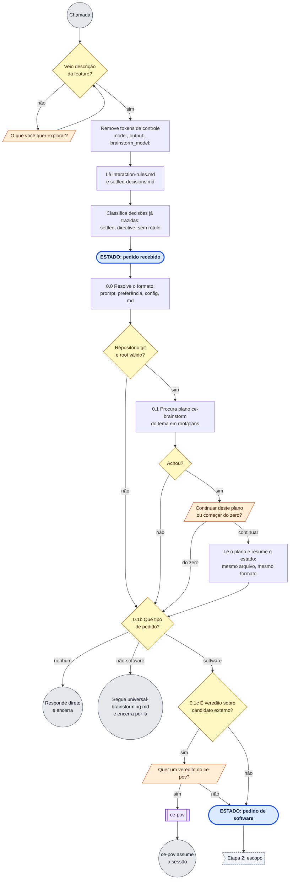
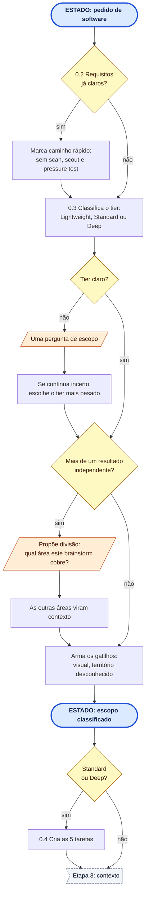
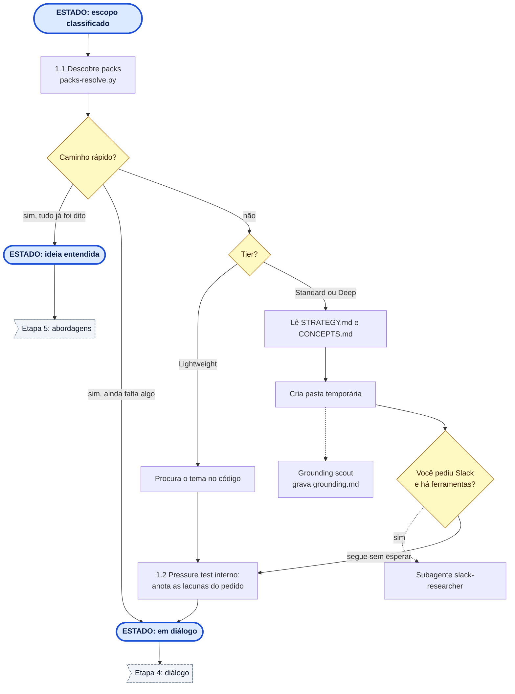
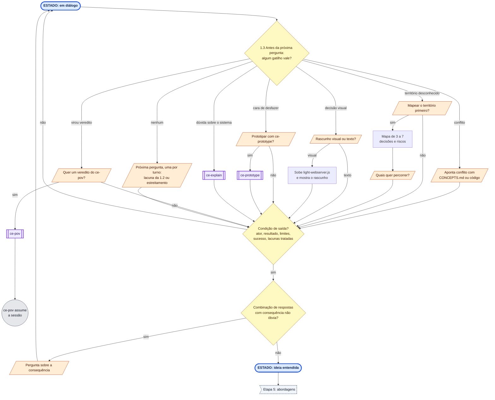
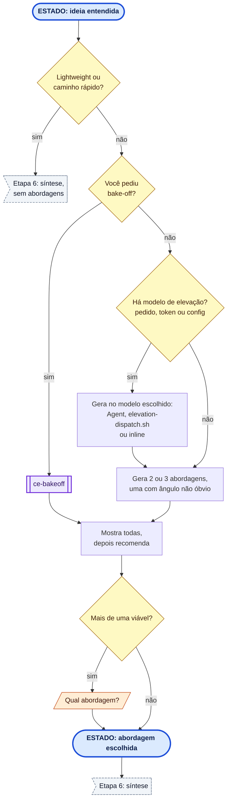
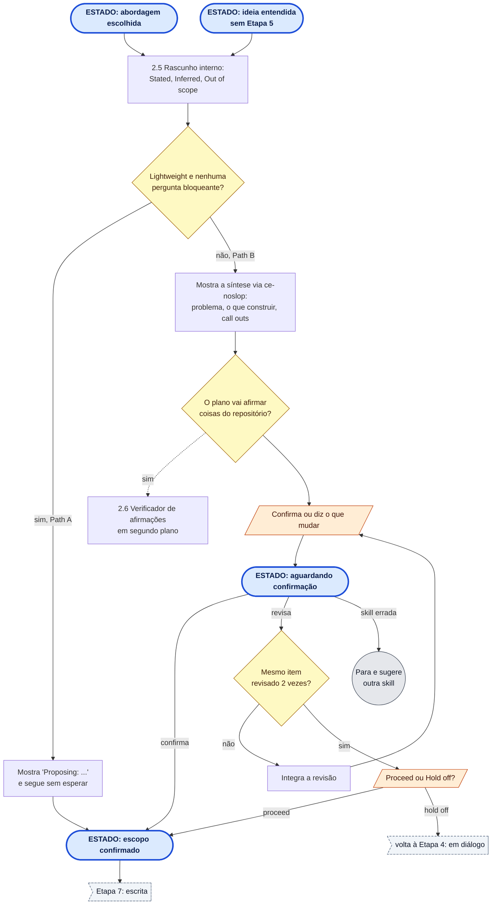
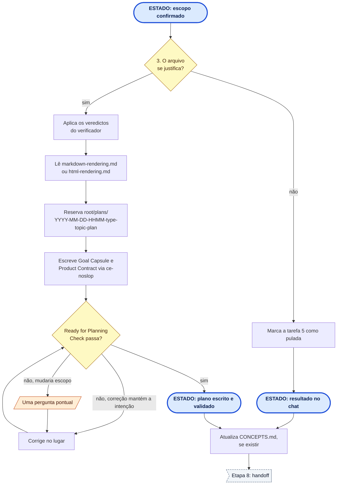
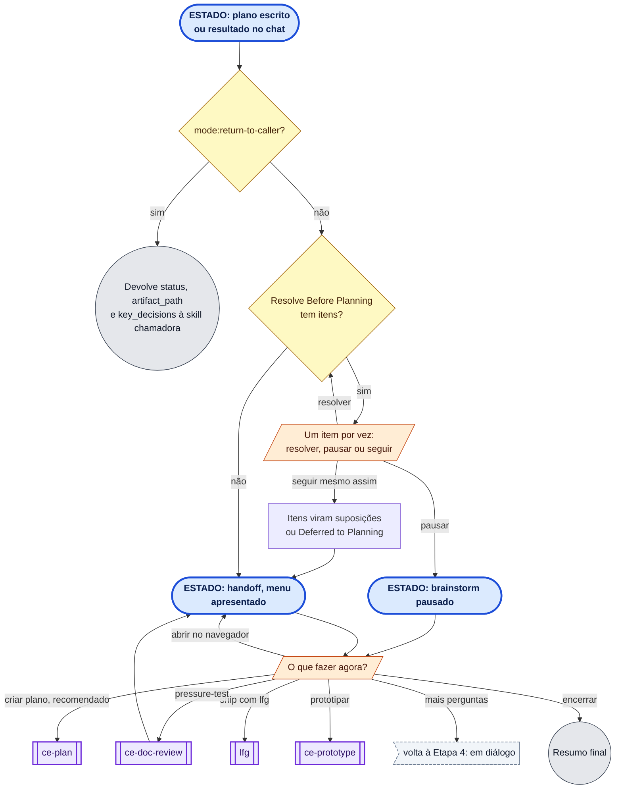

# ce-brainstorm como fluxo

O fluxo de [ce-brainstorm-steps.md](ce-brainstorm-steps.md) desenhado como uma máquina de estados com passos entre os estados.
Cobre da chamada até o menu de handoff. Quando o fluxo sai para outra skill, o diagrama só aponta para ela.
O fluxo está quebrado em uma visão geral e 8 etapas. Cada etapa começa no estado em que a anterior termina.
Cada diagrama também está renderizado em PNG em [`ce-brainstorm-flow/`](ce-brainstorm-flow/), um arquivo por etapa.

## Legenda

| Forma | Cor | Significa |
|---|---|---|
| Retângulo arredondado nas pontas, `ESTADO:` | azul | Estado: um ponto estável onde a skill chega depois de alguns passos |
| Retângulo | branco | Passo: uma ação da skill |
| Losango | amarelo | Decisão da skill, sem perguntar a você |
| Paralelogramo | laranja | Pergunta a você, e o fluxo espera a resposta |
| Retângulo com barras laterais | roxo | Outra skill: o fluxo vai para ela |
| Círculo | cinza | Fim da skill |
| Bandeira tracejada | cinza claro | Continua em outra etapa |

Setas tracejadas são trabalho em segundo plano: a skill dispara e segue sem esperar.

## Visão geral

Só os estados e as etapas que levam de um a outro.

## Etapa 1: entrada e rota

Da chamada até saber que é um pedido de software (fase 0.0 a 0.1c).

## Etapa 2: escopo

Do pedido de software até o escopo classificado (fase 0.2 a 0.4).

## Etapa 3: contexto

Do escopo classificado até o diálogo (fase 1.1 e 1.2).

## Etapa 4: diálogo

O laço de perguntas até a ideia entendida (fase 1.3).

## Etapa 5: abordagens

Da ideia entendida até a abordagem escolhida (fase 2).

## Etapa 6: síntese

Da abordagem escolhida até o escopo confirmado (fase 2.5 e 2.6).

## Etapa 7: escrita

Do escopo confirmado até o plano escrito ou o resultado no chat (fase 3).

## Etapa 8: handoff

Do resultado até o menu e as skills seguintes (fase 4).

## Notas

- **Caminho rápido (0.2).** Com requisitos já claros, a skill pula o scan, o scout e o pressure test. A descoberta de packs ainda roda, e ela vai para o diálogo ou direto para a síntese.
- **Lightweight.** Pula as abordagens (fase 2), o verificador (2.6) e quase sempre o arquivo (fase 3). Termina com o resultado no chat.
- **Gatilhos da 1.3.** São checados antes de cada pergunta do diálogo, não uma vez só. O de território desconhecido e o visual só valem se a 0.3 os armou, ou se o diálogo os revelou.
- **`ce-pov` aceito.** O `ce-pov` assume a sessão e o brainstorm termina.
- **`ce-prototype` durante o diálogo.** Volta para o brainstorm com a decisão tomada. No menu do handoff, ele substitui a opção de pressure-test quando sobra uma pergunta que só um protótipo resolve.
- **Opções do menu.** Algumas ficam escondidas. `ce-plan` e `lfg` somem enquanto há itens em Resolve Before Planning. `lfg` e pressure-test só aparecem com um arquivo escrito. "Abrir no navegador" só aparece com HTML.
