# ce-brainstorm como fluxo

O fluxo de [ce-brainstorm-steps.md](ce-brainstorm-steps.md) desenhado como uma máquina de estados com passos entre os estados.
Cobre da chamada até o menu de handoff. Quando o fluxo sai para outra skill, o diagrama só aponta para ela.

## Legenda

| Forma | Cor | Significa |
|---|---|---|
| Retângulo arredondado nas pontas, `ESTADO:` | azul | Estado: um ponto estável onde a skill chega depois de alguns passos |
| Retângulo | branco | Passo: uma ação da skill |
| Losango | amarelo | Decisão da skill, sem perguntar a você |
| Paralelogramo | laranja | Pergunta a você, e o fluxo espera a resposta |
| Retângulo com barras laterais | roxo | Outra skill: o fluxo vai para ela |
| Círculo | cinza | Fim da skill |

Setas tracejadas são trabalho em segundo plano: a skill dispara e segue sem esperar.

## Fluxo

```mermaid
flowchart TD
  classDef state fill:#dbeafe,stroke:#1d4ed8,stroke-width:3px,color:#0b1f4d,font-weight:bold
  classDef decision fill:#fef9c3,stroke:#a16207,color:#422006
  classDef ask fill:#ffedd5,stroke:#c2410c,color:#431407
  classDef ext fill:#ede9fe,stroke:#6d28d9,stroke-width:2px,color:#2e1065
  classDef stop fill:#e5e7eb,stroke:#374151,color:#111827

  START(("Chamada")) --> D_ARG{"Veio descrição<br/>da feature?"}
  D_ARG -- não --> Q_ARG[/"O que você quer explorar?"/]
  Q_ARG --> D_ARG
  D_ARG -- sim --> A_TOK["Remove tokens de controle<br/>mode:, output:, brainstorm_model:"]
  A_TOK --> A_RULES["Lê interaction-rules.md<br/>e settled-decisions.md"]
  A_RULES --> A_SETTLED["Classifica decisões já trazidas:<br/>settled, directive, sem rótulo"]
  A_SETTLED --> S_IN(["ESTADO: pedido recebido"])

  subgraph F0 ["Fase 0: retomar, classificar, rotear"]
    S_IN --> A_FMT["0.0 Resolve o formato<br/>prompt, preferência, config, md"]
    A_FMT --> D_REPO{"Repositório git<br/>e root válido?"}
    D_REPO -- sim --> A_SCAN["Procura plano ce-brainstorm<br/>do tema em root/plans"]
    A_SCAN --> D_FOUND{"Achou?"}
    D_FOUND -- sim --> Q_RESUME[/"Continuar deste plano<br/>ou começar do zero?"/]
    Q_RESUME -- continuar --> A_RESUME["Lê o plano e resume o estado<br/>mesmo arquivo, mesmo formato"]
    Q_RESUME -- do zero --> D_DOMAIN
    A_RESUME --> D_DOMAIN
    D_FOUND -- não --> D_DOMAIN
    D_REPO -- não --> D_DOMAIN

    D_DOMAIN{"0.1b Que tipo<br/>de pedido?"}
    D_DOMAIN -- software --> D_VERDICT{"0.1c É veredito sobre<br/>candidato externo?"}
    D_VERDICT -- sim --> Q_POV[/"Quer um veredito do ce-pov?"/]
    Q_POV -- não --> D_CLEAR
    D_VERDICT -- não --> D_CLEAR{"0.2 Requisitos<br/>já claros?"}
    D_CLEAR -- sim --> A_FAST["Marca caminho rápido:<br/>sem scan, scout e pressure test"]
    A_FAST --> A_TIER
    D_CLEAR -- não --> A_TIER["0.3 Classifica o tier"]
    A_TIER --> D_TIER{"Tier claro?"}
    D_TIER -- não --> Q_TIER[/"Uma pergunta de escopo"/]
    Q_TIER --> A_HEAVY["Se continua incerto,<br/>escolhe o tier mais pesado"]
    A_HEAVY --> D_SPLIT
    D_TIER -- sim --> D_SPLIT{"Mais de um resultado<br/>independente?"}
    D_SPLIT -- sim --> Q_SPLIT[/"Propõe divisão:<br/>qual área este brainstorm cobre?"/]
    Q_SPLIT --> A_CTX["As outras áreas viram contexto"]
    A_CTX --> A_TRIP
    D_SPLIT -- não --> A_TRIP["Arma os gatilhos:<br/>visual, território desconhecido"]
    A_TRIP --> S_TIER(["ESTADO: escopo classificado<br/>Lightweight, Standard ou Deep"])
    S_TIER --> D_TASKS{"Standard<br/>ou Deep?"}
    D_TASKS -- sim --> A_TASKS["0.4 Cria as 5 tarefas"]
  end

  D_DOMAIN -- nenhum --> END_DIRECT(("Responde direto<br/>e encerra"))
  D_DOMAIN -- não-software --> END_UNIV(("Segue universal-brainstorming.md<br/>e encerra por lá"))
  Q_POV -- sim --> POV[["ce-pov"]]
  POV --> END_POV(("ce-pov assume<br/>a sessão"))

  subgraph F1 ["Fase 1: entender a ideia"]
    A_PACKS["1.1 Descobre packs<br/>packs-resolve.py"]
    A_PACKS --> D_FASTP{"Caminho rápido?"}
    D_FASTP -- não --> D_DEPTH{"Tier?"}
    D_DEPTH -- Lightweight --> A_LSEARCH["Procura o tema no código"]
    D_DEPTH -- "Standard ou Deep" --> A_CONSTR["Lê STRATEGY.md e CONCEPTS.md"]
    A_CONSTR --> A_SCRATCH["Cria pasta temporária"]
    A_SCRATCH -.-> A_SCOUT["Grounding scout<br/>grava grounding.md"]
    A_SCRATCH --> D_SLACK{"Você pediu Slack<br/>e há ferramentas?"}
    D_SLACK -.->|sim| A_SLACK["Subagente slack-researcher"]
    D_SLACK -- "segue sem esperar" --> A_PRESS
    A_LSEARCH --> A_PRESS["1.2 Pressure test interno:<br/>anota as lacunas do pedido"]
    A_PRESS --> S_DIALOG

    S_DIALOG(["ESTADO: em diálogo"])
    S_DIALOG --> D_GATE{"1.3 Antes da próxima pergunta:<br/>algum gatilho vale?"}
    D_GATE -- conflito --> Q_CONFLICT[/"Aponta conflito com<br/>CONCEPTS.md ou código"/]
    D_GATE -- território desconhecido --> Q_BLIND[/"Mapear o território primeiro?"/]
    Q_BLIND -- sim --> A_MAP["Mapa de 3 a 7 decisões e riscos"]
    A_MAP --> Q_WALK[/"Quais quer percorrer?"/]
    D_GATE -- decisão visual --> Q_VISUAL[/"Rascunho visual ou texto?"/]
    Q_VISUAL -- visual --> A_SKETCH["Sobe light-webserver.js<br/>e mostra o rascunho"]
    D_GATE -- "cara de desfazer" --> Q_PROTO[/"Prototipar com ce-prototype?"/]
    D_GATE -- dúvida sobre o sistema --> EXPLAIN[["ce-explain"]]
    D_GATE -- virou veredito --> Q_POV2[/"Quer um veredito do ce-pov?"/]
    D_GATE -- nenhum --> Q_NEXT[/"Próxima pergunta, uma por turno:<br/>lacuna da 1.2 ou estreitamento"/]

    Q_CONFLICT --> D_EXIT
    Q_BLIND -- não --> D_EXIT
    Q_WALK --> D_EXIT
    Q_VISUAL -- texto --> D_EXIT
    A_SKETCH --> D_EXIT
    Q_PROTO -- não --> D_EXIT
    EXPLAIN --> D_EXIT
    Q_POV2 -- não --> D_EXIT
    Q_NEXT --> D_EXIT

    D_EXIT{"Condição de saída da 1.3?<br/>ator, resultado, limites,<br/>sucesso, lacunas tratadas"}
    D_EXIT -- não --> S_DIALOG
    D_EXIT -- sim --> D_INTEG{"Combinação de respostas<br/>com consequência não óbvia?"}
    D_INTEG -- sim --> Q_INTEG[/"Pergunta sobre a consequência"/]
    Q_INTEG --> S_DIALOG
    D_INTEG -- não --> S_READY(["ESTADO: ideia entendida"])
  end

  Q_PROTO -- sim --> PROTO[["ce-prototype"]]
  PROTO --> D_EXIT
  Q_POV2 -- sim --> POV

  subgraph F2 ["Fase 2: abordagens"]
    D_LIGHT{"Lightweight?"}
    D_LIGHT -- não --> D_BAKE{"Você pediu<br/>bake-off?"}
    D_BAKE -- não --> A_ELEV["Resolve elevação de modelo:<br/>Agent, elevation-dispatch.sh ou inline"]
    A_ELEV --> A_GEN["Gera 2 ou 3 abordagens,<br/>uma com ângulo não óbvio"]
    A_GEN --> A_PRESENT["Mostra todas,<br/>depois recomenda"]
    A_PRESENT --> D_VIABLE{"Mais de uma viável?"}
    D_VIABLE -- sim --> Q_APPROACH[/"Qual abordagem?"/]
    Q_APPROACH --> S_APPROACH
    D_VIABLE -- não --> S_APPROACH(["ESTADO: abordagem escolhida"])
  end

  D_BAKE -- sim --> BAKE[["ce-bakeoff"]]
  BAKE --> A_PRESENT

  subgraph F25 ["Fase 2.5: síntese"]
    A_DRAFT["Rascunho interno:<br/>Stated, Inferred, Out of scope"]
    A_DRAFT --> D_PATH{"Lightweight e nenhuma<br/>pergunta bloqueante?"}
    D_PATH -- "sim, Path A" --> A_PATHA["Mostra 'Proposing: ...'<br/>e segue sem esperar"]
    D_PATH -- "não, Path B" --> A_PATHB["Mostra a síntese via ce-noslop:<br/>problema, o que construir, call outs"]
    A_PATHB --> D_CLAIMS{"O plano vai afirmar<br/>coisas do repositório?"}
    D_CLAIMS -.->|sim| A_VERIFY["2.6 Verificador de afirmações<br/>em segundo plano"]
    D_CLAIMS --> Q_CONFIRM[/"Confirma ou diz o que mudar"/]
    Q_CONFIRM --> S_WAIT(["ESTADO: aguardando confirmação"])
    S_WAIT -- revisa --> D_TWICE{"Mesmo item<br/>revisado 2 vezes?"}
    D_TWICE -- não --> A_INTEGRATE["Integra a revisão"]
    A_INTEGRATE --> Q_CONFIRM
    D_TWICE -- sim --> Q_PROCEED[/"Proceed ou Hold off?"/]
  end

  S_READY --> D_LIGHT
  D_LIGHT -- sim --> A_DRAFT
  S_APPROACH --> A_DRAFT
  A_TASKS --> A_PACKS
  D_TASKS -- não --> A_PACKS
  D_FASTP -- "sim, precisa de diálogo" --> S_DIALOG
  D_FASTP -- "sim, já está tudo dito" --> A_DRAFT
  Q_PROCEED -- hold off --> S_DIALOG
  S_WAIT -- skill errada --> END_REDIRECT(("Para e sugere<br/>outra skill"))

  subgraph F3 ["Fase 3: escrever o plano"]
    S_CONFIRMED(["ESTADO: escopo confirmado"])
    S_CONFIRMED --> D_DOC{"O arquivo<br/>se justifica?"}
    D_DOC -- não --> A_SKIP5["Marca a tarefa 5 como pulada"]
    A_SKIP5 --> S_CHAT(["ESTADO: resultado no chat"])
    D_DOC -- sim --> A_APPLY["Aplica os veredictos do verificador"]
    A_APPLY --> A_RENDER["Lê markdown-rendering.md<br/>ou html-rendering.md"]
    A_RENDER --> A_PATH["Reserva root/plans/<br/>YYYY-MM-DD-HHMM-type-topic-plan"]
    A_PATH --> A_WRITE["Escreve Goal Capsule e<br/>Product Contract via ce-noslop"]
    A_WRITE --> D_CHECK{"Ready for Planning<br/>Check passa?"}
    D_CHECK -- "não, correção mantém a intenção" --> A_FIX["Corrige no lugar"]
    D_CHECK -- "não, mudaria escopo" --> Q_FIX[/"Uma pergunta pontual"/]
    Q_FIX --> A_FIX
    A_FIX --> D_CHECK
    D_CHECK -- sim --> S_PLAN(["ESTADO: plano escrito e validado"])
    S_CHAT --> A_VOCAB["Atualiza CONCEPTS.md,<br/>se existir"]
    S_PLAN --> A_VOCAB
  end

  S_WAIT -- confirma --> S_CONFIRMED
  A_PATHA --> S_CONFIRMED
  Q_PROCEED -- proceed --> S_CONFIRMED

  subgraph F4 ["Fase 4: handoff"]
    D_CALLER{"mode:return-to-caller?"}
    D_CALLER -- não --> D_RBP{"Resolve Before Planning<br/>tem itens?"}
    D_RBP -- sim --> Q_RBP[/"Pergunta um item por vez:<br/>resolver, pausar ou seguir"/]
    Q_RBP -- resolver --> D_RBP
    Q_RBP -- "seguir mesmo assim" --> A_ASSUME["Itens viram suposições<br/>ou Deferred to Planning"]
    A_ASSUME --> S_MENU
    Q_RBP -- pausar --> S_PAUSED(["ESTADO: brainstorm pausado"])
    D_RBP -- não --> S_MENU(["ESTADO: handoff<br/>menu apresentado"])
    S_MENU --> Q_MENU[/"O que fazer agora?"/]
  end

  A_VOCAB --> D_CALLER
  D_CALLER -- sim --> END_CALLER(("Devolve status, artifact_path,<br/>key_decisions à skill chamadora"))
  S_PAUSED --> Q_MENU
  Q_MENU -- "criar plano (recomendado)" --> PLAN[["ce-plan"]]
  Q_MENU -- "ship com lfg" --> LFG[["lfg"]]
  Q_MENU -- pressure-test --> DOCREVIEW[["ce-doc-review"]]
  Q_MENU -- prototipar --> PROTO2[["ce-prototype"]]
  Q_MENU -- abrir no navegador --> S_MENU
  Q_MENU -- mais perguntas --> S_DIALOG
  Q_MENU -- encerrar --> END_SUMMARY(("Resumo final"))
  DOCREVIEW --> S_MENU

  class S_IN,S_TIER,S_DIALOG,S_READY,S_APPROACH,S_WAIT,S_CONFIRMED,S_CHAT,S_PLAN,S_MENU,S_PAUSED state
  class D_ARG,D_REPO,D_FOUND,D_DOMAIN,D_VERDICT,D_CLEAR,D_TIER,D_SPLIT,D_TASKS,D_FASTP,D_DEPTH,D_SLACK,D_GATE,D_EXIT,D_INTEG,D_LIGHT,D_BAKE,D_VIABLE,D_PATH,D_CLAIMS,D_TWICE,D_DOC,D_CHECK,D_CALLER,D_RBP decision
  class Q_ARG,Q_RESUME,Q_POV,Q_TIER,Q_SPLIT,Q_CONFLICT,Q_BLIND,Q_WALK,Q_VISUAL,Q_PROTO,Q_POV2,Q_NEXT,Q_INTEG,Q_APPROACH,Q_CONFIRM,Q_PROCEED,Q_FIX,Q_RBP,Q_MENU ask
  class POV,EXPLAIN,PROTO,PROTO2,BAKE,PLAN,LFG,DOCREVIEW ext
  style F0 fill:#f8fafc,stroke:#94a3b8
  style F1 fill:#f8fafc,stroke:#94a3b8
  style F2 fill:#f8fafc,stroke:#94a3b8
  style F25 fill:#f8fafc,stroke:#94a3b8
  style F3 fill:#f8fafc,stroke:#94a3b8
  style F4 fill:#f8fafc,stroke:#94a3b8
  class START,END_POV,END_DIRECT,END_UNIV,END_REDIRECT,END_CALLER,END_SUMMARY stop
```

## Notas

- **Caminho rápido (0.2).** Com requisitos já claros, a skill pula o scan, o scout e o pressure test. A descoberta de packs ainda roda, e ela vai para o diálogo ou direto para a síntese.
- **Lightweight.** Pula as abordagens (fase 2), o verificador (2.6) e quase sempre o arquivo (fase 3). Termina com o resultado no chat.
- **Gatilhos da 1.3.** São checados antes de cada pergunta do diálogo, não uma vez só. O de território desconhecido e o visual só valem se a 0.3 os armou, ou se o diálogo os revelou.
- **`ce-pov` aceito.** O `ce-pov` assume a sessão e o brainstorm termina.
- **`ce-prototype` durante o diálogo.** Volta para o brainstorm com a decisão tomada. No menu do handoff, ele substitui a opção de pressure-test quando sobra uma pergunta que só um protótipo resolve.
- **Opções do menu.** Algumas ficam escondidas. `ce-plan` e `lfg` somem enquanto há itens em Resolve Before Planning. `lfg` e pressure-test só aparecem com um arquivo escrito. "Abrir no navegador" só aparece com HTML.
