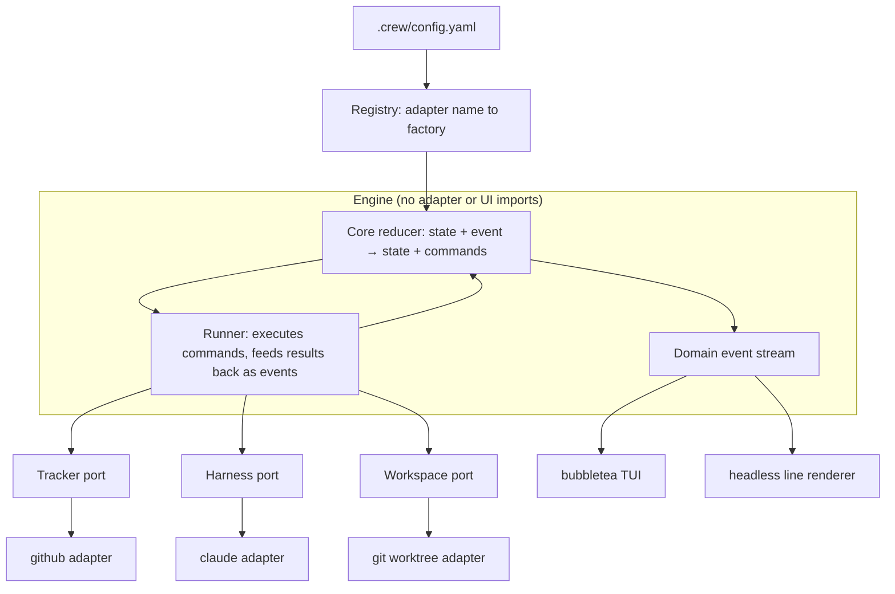
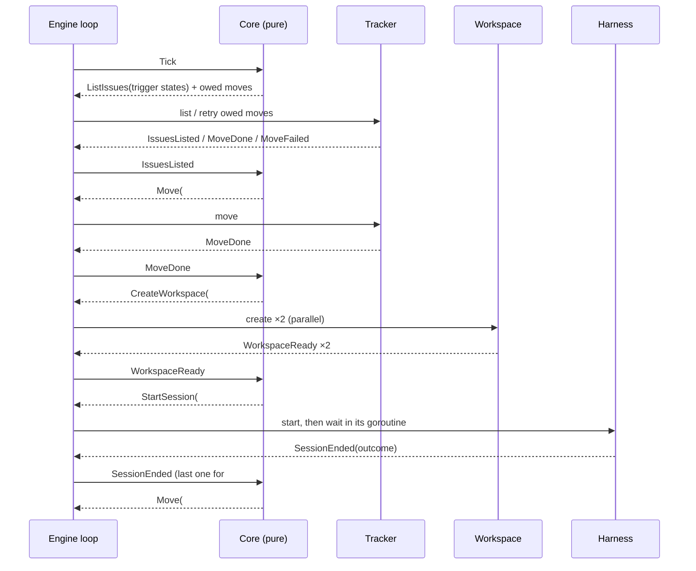
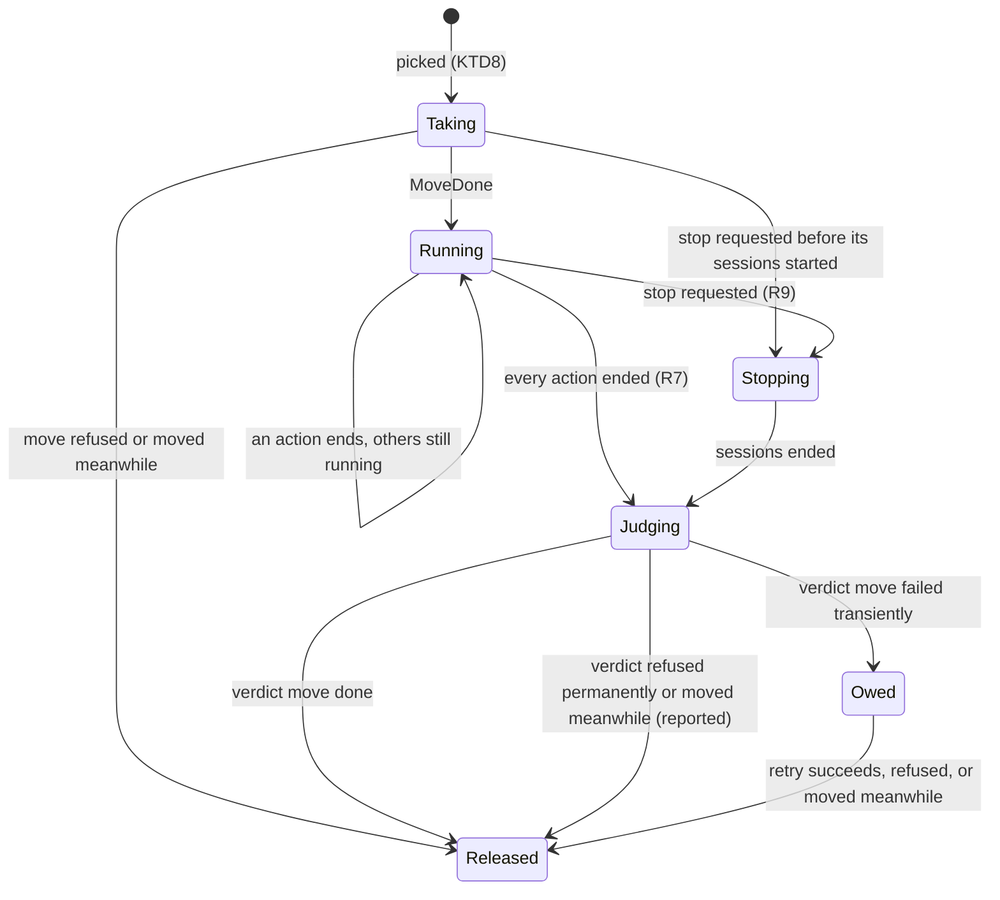
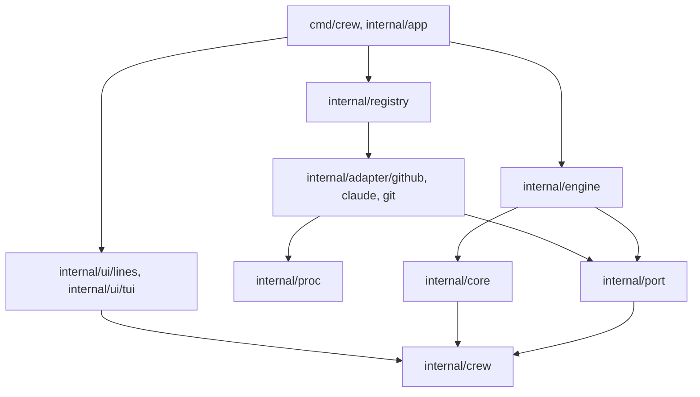

# crew Engine Architecture - Plan

## Goal Capsule

- **Objective:** The boss runs `crew` in any of their repositories, configured by that repository's `.crew/config.yaml`, and it moves issues through the configured workflow by running coding-agent sessions. Supporting another harness (Codex) or tracker (Jira) later means writing one adapter, with no change to the engine, the TUI or the existing adapters.
- **Means:** a Go engine built as ports and adapters, with a pure core and a stream of domain events consumed by a bubbletea TUI and a headless renderer (Key Decisions; KTD2, KTD3). The first adapters are `github`, `claude` and `git`.
- **Product authority:** this Product Contract, within the boundaries of `STRATEGY.md`, ranks above the Planning Contract. KTDs own mechanism within the Requirements, and a unit overrides neither. Not active scope: porting the behaviors of the pururu-ha dispatcher (they get a place in this architecture, see Scope Boundaries), switching pururu-ha over to crew, and interactive sessions.
- **Execution profile:** a new Go module with application code (U1–U10), plus docs (U11). Proof is the Go test suite, with the core and an end-to-end run against fake adapters, plus `pnpm docs:check`.
- **Who finishes:** an implementer lands U1–U11 in one pull request. Afterwards the boss adds the `go` check to the `checks` ruleset (`bootstrap.sh --checks`, in `thatsnotmynameio/.github`) and decides when to bump `VERSION`. The only tag, `v0.1.0`, predates the Go module, so until that first bump crew installs from `@main` (KTD1).
- **Stop conditions:** stop and ask the boss if:
  - `claude -p --output-format stream-json` no longer ends with a `result` event, because that breaks KTD10's success detection;
  - the module cannot be named `github.com/thatsnotmynameio/crew`, because KTD1's install path depends on it;
  - bubbletea v2 cannot take events from another goroutine through `Program.Send`, because that breaks KTD7.
- **Open blockers:** none.

---

## Product Contract

Product Contract preservation: changed R2, R9, R15 and R21, and added AE7–AE9. These are clarifications the boss confirmed at plan time (looping workflows and a broken environment are refused, a move leaves exactly one crew state, a stop judges finished issues first, issues come only from the boss's own account). Also changed R1 and R3 so that the default model belongs to the harness and an issue's identity is not GitHub-shaped. Both came from the architecture review: without them, a Codex or Jira adapter would have to change the engine. R5 now says "that action's prompt", matching the boss's draft, where prompts belong to actions. The rest is unchanged.

### Summary

crew gets its engine: a Go program that reads `.crew/config.yaml`, polls the tracker, and runs each workflow stage's actions in parallel, each one in its own worktree and its own harness session. The engine reaches the outside world only through three ports, Tracker, Harness and Workspace. The first adapters are compiled in, and the bubbletea TUI only renders the events the engine publishes.

### Problem Frame

The boss's issue dispatcher lives in `thatsnotmynameio/pururu-ha` as `tools/dispatcher/dispatcher.py`, 1349 lines of standard-library Python with 2439 lines of tests. It works, but it is welded to one stack.

- **Claude:** it runs `claude -p` with Claude-specific flags and reads usage limits from Claude's `stream-json` events.
- **GitHub:** it uses `gh` with GraphQL queries, labels and comment markers.
- **`lfg`:** its status checklist maps compound-engineering skill names to stages.

Its workflow is fixed: one `lfg` session per issue, with the labels hard-coded.

crew needs the same loop in every repository, with a workflow each repository declares, and without a rewrite when Codex or Jira arrives. The dispatcher's pure functions (`pick`, `tick`, `judge`, `restore`, `orphans`) already do no I/O, which shows the seam exists; it just isn't an interface yet.

### Key Decisions

- **Ports and adapters, compiled into the binary.** The engine depends on three small interfaces. Each adapter is a package selected by its name in the config, through one explicit registry. Governs R10–R14. (session-settled: user-directed — chosen over out-of-process plugin executables and over harness presets declared in YAML: none of the researched orchestrators (Symphony, Vibe Kanban, Gas Town, Crush) or multi-backend tools (Renovate, git-bug, Atlantis) uses binary plugins for agents or trackers, and a preset or an `exec` adapter can be added later as one more adapter)
- **Pure core, events out.** The core is a reducer, (state, event) → (state, commands). Adapters run the commands and report the results back as events. The TUI and the headless renderer are subscribers. Governs R11, R16–R18. (session-settled: user-approved — chosen over a TUI that drives sessions directly: the headless mode and the tests stay free of bubbletea)
- **One branch and one pull request per action.** Actions never share a branch; the work comes together in review, not in the engine. Governs R5. (session-settled: user-directed — chosen over a shared issue branch, over a primary action that the others feed, and over the agent applying the next label itself)
- **An action succeeds when its session ends cleanly.** The engine trusts the harness's verdict. Opening a pull request is the prompt's job. Governs R7. (session-settled: user-directed — chosen over a per-action `expects` key and over requiring a pull request from every action: it keeps the engine generic and lets the `review` stage work like any other)
  - Known gap, kept as settled: a session can end cleanly without doing its work, for example when `--permission-mode auto` denies a tool and the agent gives up politely. The old dispatcher judged by the pull request for that reason. Here `needs_attention` is reached only through failures the harness reports, so R7's comment carries the session's last message and the Guide says what `on_success` means.
- **Stages declare where a successful issue goes.** The user's draft config gains `on_success`. Governs R4, R7. (session-settled: user-approved — the draft named the state during a run but not the one after it)
- **crew's states are the engine's vocabulary.** The engine speaks the eight state keys of `tracker.labels` (`ready`, `in_progress`, `ready_to_review`, `in_review`, `needs_attention`, `paused`, `ready_to_merge`, `done`). Each tracker adapter maps them to its own representation. Governs R15. (session-settled: user-approved)
- **Go, because of bubbletea.** The TUI library the boss chose is Go-only, so the engine is rewritten in Go rather than ported line by line from Python.

### Architecture

```mermaid
stateDiagram-v2
  [*] --> trigger: issue in the stage's state (label)
  trigger --> running: slot free; issue moved to moves_to
  running --> judged: every action's session ended
  judged --> on_success: all actions succeeded
  judged --> needs_attention: any action failed
  running --> needs_attention: crew stopped
```





### Requirements

**Configuration**

- R1. crew reads `.crew/config.yaml` from the root of the repository it runs in. `poll_interval_seconds` defaults to 300, `max_parallel_issues` to 2, `harness` to `claude` and `tracker.name` to `github`. `model` defaults to the harness's own default, which is `claude-opus-5-5` for `claude`.
- R2. Before polling, crew validates the whole config and its environment, and it stops with a message naming the offending key or tool when:
  - a harness or tracker name is not registered;
  - a key is unknown;
  - a stage references a state outside the eight keys;
  - the workflow would loop or double-take (two stages share a `label`, a `moves_to` is any stage's `label`, or an `on_success` is the stage's own `label`);
  - an adapter's own check of its tools fails.
- R3. Action prompts are templates over the issue's data, replacing the draft's `#XXX`. The data is at least its reference as the tracker writes it (`#42` on GitHub, `PROJ-123` on Jira), its key, its title and its URL.

**Workflow**

- R4. A stage takes an issue that is in the stage's `label` state. Taking it moves the issue to the stage's `moves_to` state. The stage's `on_success` names the state the issue moves to after it succeeds.
- R5. Each action of a stage runs in parallel, in its own workspace (a new branch from the default branch) and its own harness session, using that action's prompt rendered for the issue.
- R6. `max_parallel_issues` counts issues, not sessions: an issue whose stage has two actions takes one slot.
- R7. The engine judges a stage once every one of its actions has ended. If all succeeded, the issue moves to `on_success`; otherwise it moves to `needs_attention`, with a comment naming each failed action, its workspace and its log.
- R8. crew polls every `poll_interval_seconds` until stopped.
- R9. On stop (Ctrl-C, `q` in the TUI, or SIGTERM), crew first judges the issues whose actions have all ended (R7), then ends the running sessions and moves their issues to `needs_attention`.

**Engine boundaries**

- R10. The engine reaches the outside world only through the Tracker, Harness and Workspace ports. It holds no name, flag, label or API detail of any adapter.
- R11. The core is pure: it never performs I/O. Every side effect is a command run by the runner through a port, and every result comes back as an event. The core is the only place state changes.
- R12. Each port is a minimal interface holding what every adapter must provide. Anything an adapter may or may not support (resuming a session, detecting a usage limit, issue dependencies, pull request checks, status comments) is a separate optional interface. The engine detects it and degrades when it is absent. No adapter carries "not implemented" stubs.
- R13. Adapters are registered in one explicit list, not through `init()` side effects. Adding an adapter means one new package plus one line in that list.
- R14. Each adapter validates its own config section (for example `tracker.labels` for `github`) and reports errors through R2.
- R15. The Tracker port speaks crew's eight states. Mapping a state to a label, a status or a column is the tracker adapter's job. A move leaves the issue in exactly one crew state. An issue found in two crew states is skipped and reported, never taken.

**Observation**

- R16. The engine publishes domain events typed by crew: issue taken, action started, action ended, issue moved, poll done, errors. The engine never imports bubbletea.
- R17. On a terminal, crew shows a bubbletea TUI built only from those events: the issues in each stage and state, the running actions with their elapsed time, and the recent events. In this work the TUI only displays; it takes no actions on issues.
- R18. Without a terminal, or with a flag, crew prints the same events as timestamped lines instead of the TUI.
- R19. Each action's session output goes to its own log file, not to the TUI or the line output.

**First adapters**

- R20. `claude`: runs Claude Code headless in the action's workspace with the configured model. Building the command and parsing its output stream are kept apart, so that a declarative preset can later replace the first part.
- R21. `github`: lists the open issues the authenticated `gh` user opened, by state. It moves states through labels, creates the missing labels from `tracker.labels`, and comments.
- R22. `git`: creates each action's worktree and branch from the latest default branch, never reusing a name that exists.

**Docs**

- R23. The Guide documents `.crew/config.yaml` and running crew. The Develop tab documents the architecture and how to add an adapter. `AGENTS.md` fills its Architecture, Commands and Tests sections.

### Acceptance Examples

- AE1. **Covers R4, R5, R6.** Given `max_parallel_issues: 2`, the `implement` stage from the draft config, and issues #1, #2 and #3 in `ready`, when crew polls, then #1 and #2 move to `in_progress`, four sessions start (`acceptance` and `development` for each issue, each in its own worktree), and #3 waits.
- AE2. **Covers R7.** Given #1's `acceptance` session ended cleanly and its `development` session is still running, when crew polls, #1 stays `in_progress`. When `development` then ends cleanly, #1 moves to the stage's `on_success` state.
- AE3. **Covers R7.** Given #1's `development` session failed and its `acceptance` session is still running, crew waits for `acceptance` to end. #1 then moves to `needs_attention` with a comment naming `development`, its worktree and its log.
- AE4. **Covers R2.** Given `harness: codex` and no `codex` adapter registered, crew stops before polling with a message naming `harness` and the registered names.
- AE5. **Covers R12.** Given a harness adapter that does not implement usage-limit detection, a session it runs that ends on a usage limit counts as an ordinary failure (R7), and the engine runs unchanged.
- AE6. **Covers R17, R18.** Given stdout is not a terminal, crew prints timestamped event lines and starts no TUI; given a terminal, the TUI shows the same issues and actions.
- AE7. **Covers R2.** Given a stage whose `on_success` equals its own `label`, crew stops before polling with a message naming that stage's `on_success`.
- AE8. **Covers R15.** Given issue #4 carries both the `ready` and `needs attention` labels, crew does not take #4 and reports it as being in two states. Once the boss removes `needs attention`, a later poll takes it.
- AE9. **Covers R9.** Given #1's actions have all ended cleanly and #2's are still running, when the boss presses Ctrl-C, #1 moves to `on_success` and #2 moves to `needs_attention`.

### Success Criteria

- The test suite drives the engine through an in-memory tracker, a scripted harness and a temporary-directory workspace. Each is registered and validated like a real adapter, which proves the seams before Codex or Jira exist.
- The core's tests need no process, network or filesystem.
- A reader of the Develop page can say which files a Codex harness adapter would add, and that none of the existing files would change.

### Scope Boundaries

Deferred, each with its place in this architecture:

| Dispatcher behavior | Where it lands |
|---|---|
| Usage-limit pause and resume (`paused`) | Optional harness capabilities for limit detection and resume; a hold in the core's state |
| Status comment edited in place | Optional tracker capability, fed by domain events |
| Blocked-by skipping | Optional tracker capability, consulted when picking issues |
| `ready_to_merge` promotion and `Closes #N` | Optional tracker capability for an issue's pull requests and their checks. When ported, the rule is that the required checks of all the issue's pull requests pass (session-settled: user-approved). Open before porting: the acceptance tester's pull request is red by design until the implementation lands, so that rule never holds for the draft `implement` stage as it stands |
| `lfg` stage checklist | Progress events emitted by the harness's stream parser |
| Restart recovery and single-instance lock | Startup reconciliation in the engine and a process lock. Until then, an issue left in a `moves_to` state by a crash stays there until the boss relabels it |

Also out of scope:

- Interactive sessions, questions to the boss, and messages between actions.
- Codex, Jira or any second adapter.
- Harness presets in YAML.
- Actions taken from the TUI.
- Switching pururu-ha to crew and removing its dispatcher.

#### Deferred to Follow-Up Work

- Prebuilt binaries attached to each release (GoReleaser inside the Release workflow, since tags pushed with `GITHUB_TOKEN` trigger no other workflow).

#### Considered and not built

- **Removing worktrees after a stage.** The old dispatcher never removed them either. They are the boss's evidence when an issue needs attention. Revisit when disk use becomes a complaint.
- **Retry of a failed action.** It is not built, as in the old dispatcher: re-adding the stage's `label` is the retry. Revisit if flaky starts become common.

### Sources / Research

- `thatsnotmynameio/pururu-ha`: `tools/dispatcher/dispatcher.py`, with its pure core at lines 261–365, Claude usage-limit parsing at 799, the skill-to-stage map at 56, and process flags at 754. Also `tools/dispatcher/tests/test_dispatcher.py` (fakes at 304–565) and `docs/develop/dispatcher.mdx`.
- OpenAI Symphony `SPEC.md` (github.com/openai/symphony): the closest prior art, polling a tracker and dispatching agents into per-issue workspaces. Ideas worth borrowing:
  - the orchestrator is the only mutator of scheduling state;
  - internal claim states are kept separate from tracker states;
  - recovery comes from the tracker and the filesystem, not a database;
  - reconciliation runs before dispatch on every tick.
- Optional capabilities and registration: Go's `database/sql` drivers and optional driver interfaces; Caddy modules; git-bug's `bridge/core/interfaces.go`, where `NewExporter()` returns nil when export is unsupported. The anti-pattern is Atlantis's fat VCS `Client` with "not (yet) implemented" stubs. On preferring explicit registration to `init()`: Peter Bourgon, "A Theory of Modern Go".
- Engine and UI separation: Crush's `internal/pubsub` broker fed into `tea.Program`, and its non-interactive `crush run` over the same events. Crush types its broker as `tea.Msg`, which couples the app to bubbletea; R16 avoids that.
- Plugins and presets: the hashicorp/go-plugin README and Terraform's plugin protocol docs describe the costs of out-of-process plugins (versioned protocol, handshake, discovery), and Packer's 1.11 post reports the installation and local-testing pain that came back. Gas Town's `docs/agent-provider-integration.md` and Vibe Kanban's `profiles.json` are the case for later presets.

---

## Planning Contract

### Key Technical Decisions

- KTD1. **One Go module, `github.com/thatsnotmynameio/crew`, at the repo root, with `go 1.27`.** The binary is `cmd/crew`, installed with `go install github.com/thatsnotmynameio/crew/cmd/crew@vX.Y.Z` from the tags the Release workflow already creates. The existing `v0.1.0` tag predates the module, so `@main` is the install path until the first release after this work. Go 1.27.1 is the current stable release and the local toolchain is 1.27.0. `VERSION` is not bumped in this work, because releases are the boss's call (`STRATEGY.md`).
- KTD2. **One goroutine owns the core.** The engine loop is the only caller of the reducer, and the reducer returns the new model, the commands to run and the domain events.
  - Every input reaches the loop through one inbox, stamped by the engine with the time it arrived: command results, session ends and stop requests. Start and elapsed times stay pure in the core.
  - Ticks come from a ticker selected directly in the loop, so a slow step coalesces ticks instead of queueing them. The core keeps at most one issue listing outstanding.
  - Each command runs in its own goroutine and posts its result with a blocking send. The senders are bounded (running sessions plus a few commands), so a buffered inbox cannot deadlock as long as the loop drains it.
  - The engine counts its in-flight goroutines, and it returns only when that count is zero and the core holds no issue.

  Implements the pure-core Key Decision (R11, R16).
- KTD3. **The three ports are small, and capabilities are separate interfaces.** Directional shapes, not signatures:
  - Tracker:
    - list the open issues in given states, each with its states;
    - move an issue from one state to another;
    - report a failure on an issue, from a structured report (actions, reasons, workspaces, logs) that the adapter formats in its own markup.
  - Harness: start a session in a directory with a prompt and an output writer. The session can be waited on for an outcome (succeeded, plus a one-line reason) and stopped within a deadline the caller sets.
  - Workspace: create a workspace for an issue and action, and return its name, directory and branch.
  - Optional `Preparer` (any port): checks tools and prepares the adapter before the first poll. It receives the set of states the workflow can request, so the github adapter creates only the labels the workflow uses and a Jira adapter can check its transitions at startup. It is how R2's environment check and R21's label creation run.
  - Move results are distinct: done, "moved meanwhile" (the issue is closed or no longer in the expected state), refused permanently, or failed transiently.
  - Each implementation carries a compile-time interface guard. The engine detects optional interfaces by type assertion and never wraps an adapter value, because a wrapper hides them (the `http.Flusher` pitfall).

  Implements R10, R12, R15.
- KTD4. **Factories live in `port`, and the registry is a value.**
  - A factory receives a strict decode function for its own config section. The decoder rejects unknown keys and prefixes errors with the key path and line, so no adapter imports the YAML library or re-implements line-numbered errors (R14).
  - `yaml.Node.Decode` ignores known-fields checking, which only the stream `Decoder` has. So the decode function first walks the section's mapping keys against the target's `yaml` tags, recursing into nested structs, and rejects an unknown key with its path and the node's own line. Only then does it decode the node.
  - `internal/registry` maps names to tracker and harness factories. `cmd/crew` uses the production list, which is the one file a new adapter adds a line to (R13).
  - Tests build their own registry holding the fakes, so the fakes go through the same lookup and validation path as real adapters (Success Criteria).
  - The workspace is not in the registry. There is one and no config key selects it, so `app` constructs the `git` workspace directly until a second one exists.
- KTD5. **The config schema mirrors the boss's draft, and decoding is strict.**
  - Top-level keys are `config:`, `tracker:` and `workflow:`, plus an optional `harness:` section reserved for harness-specific keys (empty for `claude`).
  - Decoding uses `go.yaml.in/yaml/v3` with known-fields checking, so unknown keys fail with a line number. `gopkg.in/yaml.v3` is archived.
  - The engine decodes the workflow, `config.poll_interval_seconds`, `config.max_parallel_issues`, `config.harness` and `tracker.name`.
  - `config.model` and the `harness:` section go to the harness factory, which owns the default and validation of `model` (R1). The rest of `tracker:`, including `labels` and its defaults, goes to the tracker factory.
  - Prompts are `text/template` over `.Issue.Ref`, `.Issue.Key`, `.Issue.Title` and `.Issue.URL` (KTD15). Missing keys are errors, and every prompt is rendered against a sample issue at load, so a bad template fails R2 rather than mid-run.
  - The workflow-graph checks of R2 live here.
  - The boss's draft, with `#XXX` written as a template and `on_success` added, is the schema's reference and U2's first test fixture. Each stage has `name`, `label`, `moves_to`, `on_success` and `actions`. Each action has `name` and `prompt`. Prompts belong to actions.

    ```yaml
    config:
      poll_interval_seconds: 300
      max_parallel_issues: 2
      harness: claude
      model: claude-opus-5-5
    tracker:
      name: github
      labels:
        ready: ready
        in_progress: in progress
        ready_to_review: ready to review
        in_review: in review
        needs_attention: needs attention
        paused: paused
        ready_to_merge: ready to merge
        done: done
    workflow:
      - name: implement
        label: ready
        moves_to: in_progress
        on_success: ready_to_review
        actions:
          - name: acceptance
            prompt: "Implement test acceptance for issue {{.Issue.Ref}}"
          - name: development
            prompt: "Implement development for issue {{.Issue.Ref}}"
      - name: review
        label: ready_to_review
        moves_to: in_review
        on_success: ready_to_merge
        actions:
          - name: custom_review
            prompt: "Review implementation for issue {{.Issue.Ref}}"
    ```

    The `review` stage's `on_success: ready_to_merge` is this example's choice, not a default. With `ready_to_merge` promotion deferred, it means "reviewed", and the Guide says so.
- KTD6. **One update per reducer step, and each subscriber decides what it can lose.**
  - The core returns plain events. After each step, the engine publishes one update holding that step's events plus a snapshot of the engine's view: issues by stage and state, running actions with start times, owed moves, and the last 20 events. The snapshot is a fresh deep copy, so no subscriber can alias the model.
  - The TUI subscriber is latest-wins: one slot that each publish replaces, forwarded through `Program.Send`. It loses nothing it renders, because every update carries the full view.
  - The line subscriber is a bounded queue. Past capacity it drops new events and counts them, and the count is printed when the queue drains. Its capacity sits far above crew's rate of a few events per poll.
  - Publishing never blocks the engine.
- KTD7. **Stopping is a request, and the commands keep their own context.**
  - The TUI starts only when stdout is a terminal and `--plain` is absent (`golang.org/x/term`); otherwise the line renderer runs.
  - In the TUI, Ctrl-C and `q` are key presses: the TUI posts a stop request and quits once the engine reports it has stopped.
  - SIGINT and SIGTERM also only post a stop request. Commands run on a separate context, cancelled only after the engine returns or on a second signal. A first Ctrl-C therefore never cancels the verdict moves that R9 promises.
  - The TUI program starts with Bubble Tea's own signal handler disabled (`tea.WithoutSignalHandler()`), so crew's handler is the only one. Otherwise Bubble Tea turns SIGTERM into a quit and the TUI exits mid-stop. `app` returns only after the engine has returned, with either renderer.
  - A second signal, or a second Ctrl-C or `q` in the TUI while stopping, forces the exit: `proc` kills every live process group it started (KTD16), and crew exits non-zero.
  - Every tracker and workspace command runs with a 10-minute deadline, and a timeout is a transient failure, which the owed-move and next-tick logic already handle. A hung `gh` or `git` call therefore cannot stall polling or stop.
  - The engine gives each session a 10-second deadline to stop, as the old dispatcher's `GRACE` did. The adapter terminates its process and kills it when the deadline passes; the engine owns the duration and the adapter owns the signals.
  - Bubble Tea v2 (`charm.land/bubbletea/v2`, with `lipgloss/v2` and `bubbles/v2`). The TUI runs its own 1-second tick for elapsed times, because engine updates arrive only a few times per poll.
- KTD8. **The core picks deterministically and owes its moves.**
  - Order: stages in reverse config order (later stages first, so `review` is not starved behind `implement`), then the oldest issue first.
  - An issue the core already holds is never taken again, whatever its labels.
  - A move or failure report that fails transiently stays owed in the model. It is retried at every poll and once more at stop, so an issue is never silently stranded in `in_progress` (the old dispatcher's pending list).
  - A "moved meanwhile" result or a permanent refusal is not retried. The core drops it and reports it, so a missing Jira transition cannot loop forever.
- KTD9. **The `github` adapter shells out to `gh`,** like the old dispatcher.
  - Calls are `gh api graphql` for listing and `gh issue edit` / `gh issue comment` for writes. They go through the shared exec helper (KTD16), behind an injected runner, so tests script `gh` as `FakeGh` did.
  - Listing is filtered to issues authored by the authenticated login. An issue's key is its number and its reference is `#<number>` (KTD15).
  - A move removes every other crew label it maps, comparing names case-insensitively as GitHub does, and adds the target's label. Non-crew labels are untouched.
  - The adapter owns `tracker.labels`: each state's label defaults to its key with `_` replaced by a space (`in_progress` → `in progress`). It rejects two states mapping to the same name, case-insensitively.
  - A failure report becomes one Markdown comment, with reasons inside a code block so nothing in them renders or mentions anyone.
  - Its `Preparer` checks `gh auth status` and the repository, then creates the missing labels among the states the workflow uses.
- KTD10. **The `claude` adapter has a pure command builder and a stream parser.**
  - The builder produces `claude -p <prompt> --model <model> --permission-mode auto --output-format stream-json --verbose`. It runs in the workspace directory with stdin closed, through the shared exec helper (KTD16).
  - Stdout is teed to the output writer the engine passes and through the parser, so the parser reads the stream as it happens and never re-reads a file.
  - The session succeeded when its last `result` event is not an error. A missing `result` event, an error result, or a non-zero exit is a failure.
  - The reason is the result's text cut to 200 characters on one line, as the old dispatcher's `LATEST` did.
  - Its factory owns `model` (default `claude-opus-5-5`), and its `Preparer` checks that `claude` is on `PATH`.
  - Implements the clean-session-end Key Decision (R7, R20).
- KTD11. **The `git` adapter creates worktrees under `.crew/worktrees/`.**
  - Before each creation it runs `git fetch origin <default>`. The workspace name is `issue-<key>-<action>`, with the key sanitized to `[a-z0-9-]`. It becomes the folder `.crew/worktrees/<name>` and the branch `crew/<name>`, from `origin/<default>`.
  - It suffixes `-2`, `-3`… while the folder or branch exists.
  - The default branch comes from `origin/HEAD`, or from `ls-remote --symref origin HEAD` when that ref is missing. Only a clone sets `origin/HEAD`, so it is missing in a repository whose `origin` was added by hand.
  - Creations run one at a time behind one lock per repository. Concurrent fetches race on `origin/<default>`'s ref lock, and a creation takes seconds next to a session's minutes.
  - Its `Preparer` checks it is inside a git checkout with an `origin`.
  - Worktrees are never removed (Considered and not built).
- KTD12. **The engine owns crew's local files under `.crew/`.**
  - Each session's log is `.crew/logs/<workspace name>.log`. Workspace names are unique (KTD11), so a log holds exactly one session.
  - The engine passes the core repo-relative paths as event data, and the core never builds paths. Before a reason enters the core, the engine replaces the repository root with `.` and the home directory with `~`, because a tool's stderr and a session's last message often name absolute paths. Failure reports therefore never show the boss's home directory on a public issue; the old dispatcher posted absolute paths.
  - The Guide tells the boss to ignore `.crew/logs/` and `.crew/worktrees/`, while `.crew/config.yaml` stays committed.
- KTD13. **Tests follow the old dispatcher's injected fakes.**
  - The core gets table tests, with no goroutines.
  - The engine loop is tested under `testing/synctest` (GA since Go 1.25), with fake time and the fake adapters. `synctest` also catches goroutines leaked after `Run` returns.
  - Adapters are tested with scripted `gh` and `git` runners and recorded `stream-json` fixtures. The `git` adapter also gets one test against a real temporary repository with a local bare `origin`.
  - The TUI gets direct `Update`/`View` tests with golden files, because `teatest` has no tagged v2 release.
- KTD14. **CI adds one `go` job to `.github/workflows/ci.yml`.**
  - It runs `gofmt` (fails on any diff), `go vet`, golangci-lint v2, `go test -race ./...` and `govulncheck`.
  - `actions/setup-go` and `golangci/golangci-lint-action` are pinned by SHA with the version as a comment. setup-go reads the Go version from `go.mod`.
  - golangci-lint's `depguard` enforces the layering of KTD17, so the architecture's rules break the build rather than relying on review.
  - Dependabot gains the `gomod` ecosystem.
  - The job is local, not a shared workflow, because nothing in `thatsnotmynameio/.github` builds Go yet.
- KTD15. **An issue's identity is an opaque key plus a display reference, both set by the tracker.**
  - The key is a string: `42` on GitHub, `PROJ-123` on Jira. The reference is how humans write it: `#42`, `PROJ-123`.
  - The core, templates, workspace names and logs use only these two. No integer issue number exists outside the `github` adapter, so a Jira adapter changes no domain type, branch name or prompt (R3).
- KTD16. **One shared exec helper starts every child process in its own process group.**
  - `claude`, `gh` and `git` all go through it. A terminal's Ctrl-C reaches crew's process group only, and never kills the sessions before R9's stop sequence runs.
  - Its terminate and kill signals go to the child's whole process group, so the tools and servers an agent spawned stop with it.
  - It records every live process group it started. The forced exit of KTD7, and any path where `app` exits without the engine's stop sequence (a recovered panic included), kills them all before crew exits, so no `--permission-mode auto` session outlives crew.
  - It sets `GIT_TERMINAL_PROMPT=0` and `GH_PROMPT_DISABLED=1` in every child's environment. A child in a background process group that reads the terminal would otherwise stop forever.
  - Adapters reuse it rather than each solving signals and process groups again.
- KTD17. **Packages are layered, and imports point inward.**
  - `internal/crew` holds the domain: State, Issue, Stage, Action, Outcome and the failure report. It imports nothing of crew's.
  - `internal/port` holds the interfaces, sentinel errors and factory types, and imports only `crew`.
  - `internal/core` imports only `crew`. The engine translates port errors into core events (moved meanwhile, refused, failed).
  - `internal/engine` imports `crew`, `core` and `port`, and never an adapter or UI package.
  - `internal/fake` is imported only by tests.
  - Adapters import `crew`, `port` and `proc`, never each other.
  - Only `internal/ui/tui` imports bubbletea.

### High-Level Technical Design

One poll, from tick to judgment. This shows how the loop, the core and the ports exchange events and commands (KTD2).



Each issue the core holds moves through internal claim states, kept apart from the tracker's states as Symphony does:



A workspace or session that fails to start counts as that action ending in failure. Its sibling actions keep running, and the issue is judged when they end (R7).

Once stop is requested, the core starts no workspace and no session. An action not yet started counts as failed with the reason "crew stopped", so an issue whose take or setup finishes during stop moves to `needs_attention` (R9).

Package layering (KTD17), with the arrows meaning "imports":



### Output Structure

```text
go.mod
go.sum
.golangci.yml
cmd/crew/main.go
internal/
  crew/          domain: states, issues, stages, actions, outcomes, failure reports
  config/        load, strict decode, engine-owned defaults, workflow validation, templates
  port/          Tracker, Harness, Workspace, Preparer, factories, sentinel errors
  registry/      name → factory lists for trackers and harnesses; the production list
  core/          the pure reducer: model, events, commands
  engine/        the loop, command execution, paths under .crew/, the update stream
  proc/          the shared exec helper (process groups, stop with deadline)
  fake/          in-memory tracker, scripted harness, temp-dir workspace
  adapter/
    github/      Tracker over gh
    claude/      Harness over claude -p
    git/         Workspace over git worktree
  ui/
    lines/       timestamped line renderer
    tui/         bubbletea v2 model
  app/           wiring: config → registry → engine → renderer
```

### Alternatives Considered

- **A shared state struct behind a mutex, with goroutines per issue.** Rejected for KTD2's single loop. Ordering bugs between moves and session ends are exactly what the old dispatcher's pure `tick` avoided, and a reducer keeps every transition testable without timing.
- **go-github instead of `gh`.** It would add a token-management problem the boss's `gh` login already solves, and the old dispatcher's `gh` patterns carry over unchanged. Revisit when the `github` adapter needs an endpoint `gh api` cannot reach.

### Risks & Dependencies

- **`stream-json` drift.** Claude Code's event format is not a published contract. The fixtures pin today's shape, and a format change shows up as every session failing, which R7's report makes visible at once. A Goal Capsule stop condition covers it.
- **The `go` check is not required until the boss runs `bootstrap.sh --checks` in `thatsnotmynameio/.github`.** Until then a red `go` job does not block merging.
- **The acceptance tester is interactive-only today** (`docs/guide/acceptance-tester.mdx`, Limits), and interactive sessions are out of scope here. Run headless, it ends "cleanly" after asking a question, and that counts as success. The Guide's example `acceptance` prompt therefore tells the agent to take the acceptance examples from the issue and ask nothing.
- **Two crews in one repository would both take the same `ready` issue,** because the lock is deferred. The Guide says to run one crew per repository.

---

## Implementation Units

| U-ID | Title | Files touched | Depends on |
|---|---|---|---|
| U1 | Go module, lint and CI | `go.mod`, `.golangci.yml`, `.github/workflows/ci.yml`, `.github/dependabot.yml` | — |
| U2 | Domain and config | `internal/crew/`, `internal/config/` | U1 |
| U3 | Ports, registry, exec helper and fakes | `internal/port/`, `internal/registry/`, `internal/proc/`, `internal/fake/` | U2 |
| U4 | Core reducer | `internal/core/` | U3 |
| U5 | Engine loop and update stream | `internal/engine/` | U4 |
| U6 | git workspace adapter | `internal/adapter/git/` | U3 |
| U7 | github tracker adapter | `internal/adapter/github/` | U3 |
| U8 | claude harness adapter | `internal/adapter/claude/` | U3 |
| U9 | Line renderer and TUI | `internal/ui/` | U5 |
| U10 | Wiring and end-to-end | `cmd/crew/`, `internal/app/`, `internal/registry/` | U5–U9 |
| U11 | Docs | `docs/`, `docs.json`, `AGENTS.md`, `README.md` | U10 |

### U1. Go module, lint and CI

**Goal:** an empty but buildable Go module whose checks run on every pull request.

**Requirements:** KTD1, KTD14.

**Dependencies:** none.

**Files:**
- `go.mod`
- `cmd/crew/main.go` (prints its version and exits, until U10)
- `.golangci.yml`
- `.github/workflows/ci.yml`
- `.github/dependabot.yml`
- `.gitignore` (the built `crew` binary)

**Approach:**
1. Create the module per KTD1.
2. Configure golangci-lint v2 with its standard linters plus `errorlint`, `gocritic`, `revive`, `misspell`, and `depguard` rules for KTD17.
3. Add the `go` job per KTD14, mirroring the existing jobs: `permissions: contents: read`, a `timeout-minutes`, and checkout with `persist-credentials: false`.
4. Add the `gomod` ecosystem to Dependabot, weekly like the others.

**Patterns to follow:** the SHA-pinned actions and the comments in `.github/workflows/ci.yml`.

**Test scenarios:** Test expectation: none -- scaffolding. The proof is the `go` job passing, and `actionlint` passing on the edited workflow.

**Verification:** the `go` job and `actionlint` pass on the pull request.

### U2. Domain and config

**Goal:** crew's vocabulary as types, and a config that loads, defaults and validates the whole file before anything runs.

**Requirements:** R1, R2 (config and workflow-graph parts), R3, R15 (states), KTD5, KTD15, KTD17.

**Dependencies:** U1.

**Files:**
- `internal/crew/state.go`
- `internal/crew/issue.go`
- `internal/crew/workflow.go`
- `internal/config/config.go`
- `internal/config/validate.go`
- `internal/config/config_test.go`
- `internal/config/testdata/`

**Approach:**
- `crew.State` is the closed set of eight keys. An issue carries its key, reference, title, URL, creation time and states (KTD15). Stages, actions, outcomes and the failure report are plain values.
- The loader reads `.crew/config.yaml`, decodes strictly, applies the engine-owned defaults (R1), and checks the workflow graph (R2). It parses and sample-renders every prompt.
- It does not resolve adapter names: U3's registry does that, so config stays free of adapter knowledge (R10).
- It returns the raw sections each factory decodes: `config.model` plus the `harness:` section for the harness, and the rest of `tracker:` for the tracker.
- Error messages name the key path (`workflow[1].on_success`) and the YAML line. The same path-prefixing strict decoder is what factories receive (KTD4).

**Test scenarios:**
- The boss's draft config, with `#XXX` replaced by `{{.Issue.Ref}}` and `on_success` added, loads with every value as written.
- A file holding only `workflow:` gets R1's engine-owned defaults for every omitted setting.
- An unknown key `config.pol_interval_seconds` fails, naming the key and its line.
- A stage with `label: redy` fails, naming `workflow[0].label` and the eight valid states.
- Covers AE7. A stage whose `on_success` equals its own `label` fails, naming that stage's `on_success`.
- Two stages with the same `label` fail, naming both stages.
- A `moves_to` equal to another stage's `label` fails, naming it.
- A prompt using `{{.Issue.Numbr}}` fails at load, naming the action.
- A prompt `Implement {{.Issue.Ref}}` renders `Implement #42` for a sample issue with reference `#42`.
- A missing `.crew/config.yaml` fails with a message saying where crew looked.

**Verification:** every R2 configuration error in the scenarios above is caught by `config` before any adapter is built.

### U3. Ports, registry, exec helper and fakes

**Goal:** the three ports and their optional `Preparer`, a registry that resolves config names to adapters, the shared exec helper, and the fakes that prove the seams.

**Requirements:** R2 (unregistered names, adapter checks), R10, R12, R13, R14, KTD3, KTD4, KTD16, KTD17.

**Dependencies:** U2.

**Files:**
- `internal/port/port.go`
- `internal/port/factory.go`
- `internal/registry/registry.go`
- `internal/registry/registry_test.go`
- `internal/proc/proc.go`
- `internal/proc/proc_test.go`
- `internal/fake/tracker.go`
- `internal/fake/harness.go`
- `internal/fake/workspace.go`
- `internal/fake/fake_test.go`

**Approach:**
- Ports and factory types per KTD3 and KTD4, each with doc comments stating the contract an adapter must keep.
- The registry resolves `config.harness` and `tracker.name`. On an unknown name it returns an error listing the registered names (AE4).
- `proc` starts a command in its own process group, with stdout and stderr going to given writers. It stops the command by terminating it, then killing it when the caller's deadline passes (KTD7, KTD16).
- The fakes:
  - The in-memory tracker holds issues and their states, enforces one state per move (R15), records failure reports, and can be told to fail a move transiently or refuse it permanently.
  - The scripted harness ends each session with a scripted outcome when the test releases it, and can be told to ignore stop.
  - The temp-dir workspace creates plain directories with unique names.
  - Both the tracker and the harness fake have a factory and validate their config section like real adapters (Success Criteria).

**Patterns to follow:** git-bug's optional halves and `database/sql`'s optional interfaces (Sources / Research). Compile-time interface guards in each implementation.

**Test scenarios:**
- Covers AE4. Resolving harness `codex` in a registry holding only `claude` returns an error naming `harness` and `claude`.
- A factory's validation error, for example an unknown key in the fake tracker's section, comes back naming `tracker.<key>` and its line.
- An adapter that implements `Preparer` is detected; one that doesn't is skipped without error.
- The fake tracker's move from `ready` to `in_progress`, on an issue that is in `needs_attention`, returns "moved meanwhile".
- `proc` stopping a child that traps SIGTERM kills it once the deadline passes, and a SIGINT sent to the test's own process group does not reach the child.
- Stopping a child that spawned a grandchild ends both.
- After the kill-all call, every started child is gone, including one that traps SIGTERM.

**Verification:** the fakes are built only through the registry (tracker, harness) or directly (workspace) in every later test, and `depguard` passes.

### U4. Core reducer

**Goal:** all workflow behavior as a pure function of model and event.

**Requirements:** R4–R7, R9, R11, R15 (skip on two states), R16 (event contents), KTD2, KTD8, KTD17. Implements the Key Decisions on success, `on_success` and one branch per action (governing R5, R7).

**Dependencies:** U3.

**Files:**
- `internal/core/model.go`
- `internal/core/event.go`
- `internal/core/command.go`
- `internal/core/update.go`
- `internal/core/update_test.go`

**Approach:**
- Inputs: tick, issues listed, move done / moved meanwhile / refused / failed, report done / failed, workspace ready / failed, session started / failed to start / ended, and stop requested. Every input carries its arrival time (KTD2).
- Outputs: list issues, move, report failure, create workspace, start session, stop session. The reducer also emits plain domain events (KTD6).
- Claim states follow the HTD diagram.
- Slots count held issues (R6).
- The failure report of R7 is structured: each failed action with its reason, workspace name and log path, as received in events. The tracker formats it (KTD3), and the core builds no path and no markup (KTD12).

**Execution note:** test-first. These tests are the executable form of AE1–AE3, AE5, AE8 and AE9.

**Test scenarios:**
- Covers AE1. With two slots, the draft `implement` stage, and #1, #2, #3 in `ready`:
  - a tick, then an issues-listed result, yields moves for #1 and #2 only;
  - each move-done yields two create-workspace commands;
  - #3 is not touched.
- Covers AE2. With #1 running two actions, `acceptance` ending well leaves #1 running and issues no move. `development` then ending well yields a move from `in_progress` to `on_success`.
- Covers AE3. `development` failing while `acceptance` runs issues nothing. When `acceptance` ends, the reducer yields a move to `needs_attention` plus a failure report naming `development`, its workspace, its log and its reason.
- Covers AE5. A session ending with outcome "failed: usage limit" is judged like any failure.
- Covers AE8. An issue listed with states `ready` and `needs_attention` is not taken, and an error event names it. The next listing, with only `ready`, takes it.
- Covers AE9. On stop with #1 fully ended and #2 running:
  - #1 is judged to `on_success`;
  - #2's sessions get stop commands;
  - when they end, #2 moves to `needs_attention`.
- A workspace failing to create for `acceptance` counts as `acceptance` failing, while `development` still starts.
- A verdict move that fails transiently stays owed and is retried at the next tick.
- A "moved meanwhile" verdict and a permanently refused one are both dropped, each with an event naming the issue.
- With `review` after `implement` in config and one free slot, an issue in `ready_to_review` is taken before one in `ready` (KTD8).
- An issue already held is not taken again when it is listed in its trigger state.
- A second tick while a listing is outstanding issues no new listing.
- Stop arrives while #1's take move is in flight. MoveDone follows, no workspace or session starts, and #1 moves to `needs_attention` with the reason "crew stopped".

**Verification:** the core package imports only the standard library and `internal/crew`, which `depguard` enforces. Its tests start no goroutine.

### U5. Engine loop and update stream

**Goal:** the loop that owns the core, runs its commands through the ports, ticks on the poll interval, owns crew's local paths, and publishes updates.

**Requirements:** R8, R9, R11, R16, R19, KTD2, KTD6, KTD7, KTD12.

**Dependencies:** U4.

**Files:**
- `internal/engine/engine.go`
- `internal/engine/exec.go`
- `internal/engine/paths.go`
- `internal/engine/stream.go`
- `internal/engine/engine_test.go`
- `internal/engine/stream_test.go`

**Approach:**
- The engine starts by running every adapter's `Preparer` with the workflow's states (R2). It fails before the first tick if any of them fails.
- It ticks at once, then on its ticker (KTD2), and stamps every inbox event with its arrival time.
- Commands run on the command context of KTD7 and translate port results into core events. A started session's output goes to its log under `.crew/logs/` (KTD12), and its wait runs in its own goroutine.
- Stop:
  - A stop request enters the inbox.
  - Sessions get the 10-second deadline (KTD7).
  - The engine returns once its in-flight count is zero, the core holds no issue, and every owed move has had its final try.
- The stream publishes one update per step, with the subscriber policies of KTD6.

**Patterns to follow:** the old dispatcher's `serve` (stop on signal, then stop sessions) and `Sessions` (terminate, wait, kill).

**Test scenarios:**
- Under `synctest`, with fakes and a 300-second interval, ticks happen at 0, 300 and 600 seconds and the fake tracker sees three listings.
- Under `synctest`, a listing that takes 400 fake seconds coalesces the missed tick: the tracker sees no overlapping listings.
- Covers AE1 end to end through the loop: four fake sessions start, each with its own workspace and its own log file named after the workspace.
- A fake `Preparer` returning an error stops the engine before any listing, and the error names the adapter.
- A stop request while a verdict move is in flight lets the move finish: the issue still reaches `on_success`.
- Stop with one running fake session that ignores stop: the session is stopped with a 10-second deadline, the issue moves to `needs_attention`, and `Run` returns with no goroutine left (`synctest` fails otherwise).
- A fake tracker failing every move transiently during stop: the engine still returns after one final try, and the owed move is reported in the last update.
- With a line subscriber that never reads, publishing never blocks: ten thousand events complete, and the drop count is reported.
- A listing that never returns times out after 10 fake minutes, and a later tick lists again.
- A workspace failure whose stderr contains the absolute worktree path reaches the failure report with a repo-relative path.

**Verification:** the engine package imports no adapter and no UI package, which `depguard` enforces.

### U6. git workspace adapter

**Goal:** a real Workspace port over `git worktree`.

**Requirements:** R5, R22, KTD11, KTD16.

**Dependencies:** U3.

**Files:**
- `internal/adapter/git/workspace.go`
- `internal/adapter/git/workspace_test.go`

**Approach:** commands go through `proc` behind an injected runner per KTD13. The `Preparer` resolves the repository root and the default branch once.

**Patterns to follow:** the old dispatcher's `Sessions.start` and `_name` (fetch, then name with suffix, then `worktree add`).

**Test scenarios:**
- With a scripted runner, creating key `7`'s `development` workspace fetches the default branch, then adds `.crew/worktrees/issue-7-development` on `crew/issue-7-development` from `origin/main`.
- Key `PROJ-123` becomes the workspace name `issue-proj-123-development`.
- When branch `crew/issue-7-development` exists, the name becomes `issue-7-development-2`.
- Two creations run concurrently against the real temporary repository after its `origin` advanced, and both succeed.
- In a repository whose `origin` was added by hand rather than cloned, the default branch is found through `ls-remote`.
- A failing `worktree add` returns an error carrying git's stderr.
- With a real temporary repository and a local bare `origin` whose default branch is `trunk`, the worktree is created from `origin/trunk`.
- The `Preparer` outside a git checkout fails, naming the directory.

**Verification:** a created worktree's `HEAD` equals the latest `origin/<default>`.

### U7. github tracker adapter

**Goal:** a real Tracker port over `gh`.

**Requirements:** R14, R15, R21, KTD9, KTD15.

**Dependencies:** U3.

**Files:**
- `internal/adapter/github/tracker.go`
- `internal/adapter/github/gh.go`
- `internal/adapter/github/config.go`
- `internal/adapter/github/report.go`
- `internal/adapter/github/tracker_test.go`

**Approach:**
- Listing is one GraphQL query per poll: open issues created by the login, carrying any of the requested labels, oldest first. Each issue returns all its crew-mapped labels as states, with key `<number>` and reference `#<number>`.
- A move reads the issue's current labels. If the issue is closed or not in the expected state, it returns "moved meanwhile". Otherwise it edits the labels in one `gh issue edit` call. A `gh` error naming a missing label is a permanent refusal; other errors are transient.
- The failure report renders per KTD9.

**Patterns to follow:** the old dispatcher's `GitHub` class (`run_gh`, `ISSUES` query, `move`) and its `FakeGh` script of argument prefixes.

**Test scenarios:**
- Listing `ready` and `ready_to_review` with the default labels sends one GraphQL query filtered by the login and both label names. It returns issues with key `12`, reference `#12` and their states.
- An issue labelled `ready` and `Needs Attention` (different case) is returned with both states.
- Moving #3 from `ready` to `in_progress` sends one edit that removes `ready` and adds `in progress`, and leaves the label `bug` alone.
- Moving #3 when it is closed, or no longer `ready`, returns "moved meanwhile" and sends no edit.
- A `labels` section mapping `done` and `in_review` both to `Review` fails validation, naming both keys.
- An unknown key `tracker.lables` fails validation, naming it.
- A failure report with a reason containing `@someone` and a backtick renders that reason inside a code block, mentioning no one.
- The `Preparer` with `gh auth status` failing returns an error telling the boss to run `gh auth login`.
- The `Preparer`, given a workflow that uses five states of which two have no label, creates exactly those two.
- A `gh` call exiting non-zero returns a transient error carrying its stderr.

**Verification:** no call to `gh` happens outside the injected runner.

### U8. claude harness adapter

**Goal:** a real Harness port over `claude -p`.

**Requirements:** R1 (model default), R19, R20, KTD10, KTD16. Implements the clean-session-end Key Decision (R7).

**Dependencies:** U3.

**Files:**
- `internal/adapter/claude/harness.go`
- `internal/adapter/claude/command.go`
- `internal/adapter/claude/stream.go`
- `internal/adapter/claude/harness_test.go`
- `internal/adapter/claude/testdata/`

**Approach:**
- The command builder is a pure function of prompt, model and directory.
- The process runs through `proc`, behind an injected spawner as the old dispatcher's `spawn` was.
- Stdout is teed to the engine's writer and the stream parser (KTD10). Stop delegates to `proc` with the caller's deadline.

**Patterns to follow:** the old dispatcher's `Sessions._run`, `reason_of` and `limit_of` (top-level events only, never text inside them), and its `FakeSpawn` / `FakeProcess`.

**Test scenarios:**
- The builder for prompt `Implement #4` and model `claude-opus-5-5` yields `-p`, the prompt, `--model claude-opus-5-5`, `--permission-mode auto`, `--output-format stream-json` and `--verbose`.
- A factory given no `model` uses `claude-opus-5-5`; one given an unknown key in `harness:` fails, naming it.
- A fixture ending in a `result` event that is not an error parses as succeeded, with the result's text as the reason.
- A fixture whose final `result` is an error parses as failed, with its text cut to 200 characters on one line.
- A fixture with no `result` event and exit code 1 parses as failed with reason "exit code 1".
- A fixture whose assistant text quotes `"is_error": true` inside a message still parses as succeeded.
- The bytes the engine's writer receives equal the fixture byte for byte.
- The `Preparer` with no `claude` on `PATH` fails, naming the binary.

**Verification:** the adapter never opens a file; its output reaches disk only through the engine's writer.

### U9. Line renderer and TUI

**Goal:** the two subscribers of the update stream.

**Requirements:** R9 (keys), R16, R17, R18, KTD6, KTD7.

**Dependencies:** U5.

**Files:**
- `internal/ui/lines/lines.go`
- `internal/ui/lines/lines_test.go`
- `internal/ui/tui/model.go`
- `internal/ui/tui/view.go`
- `internal/ui/tui/model_test.go`
- `internal/ui/tui/testdata/`

**Approach:**
- Lines are `HH:MM:SS crew: <text>`, as the old dispatcher's `stamp` printed. One line per event, and a summary line per poll.
- The TUI renders three regions from the latest update's snapshot:
  - issues grouped by stage and state;
  - running actions with elapsed time, refreshed by its own 1-second tick;
  - the last 20 events.
- Ctrl-C and `q` post a stop request and show "stopping…" until the engine reports it has stopped.

**Test scenarios:**
- A taken, started, ended, moved sequence of events prints four lines, in order, each starting with a timestamp.
- A drop count prints one line saying how many events were dropped.
- Covers AE6 (TUI side). Feeding a snapshot with #1 running two actions, at 5 and 7 minutes elapsed, renders a view matching the golden file.
- A tick one second later, with no new update, advances both elapsed times.
- A Ctrl-C key press posts one stop request, and the model keeps running until the engine-stopped message arrives.
- A window narrower than 60 columns renders without panicking and truncates titles.

**Verification:** the `lines` package does not import bubbletea, and the `tui` package imports no adapter.

### U10. Wiring and end-to-end

**Goal:** `crew` runs in a repository: it loads the config, builds the adapters, starts the engine and the chosen renderer, and stops cleanly.

**Requirements:** R1, R2, R8, R9, R13, R18, KTD4, KTD7.

**Dependencies:** U5, U6, U7, U8, U9.

**Files:**
- `cmd/crew/main.go`
- `internal/app/app.go`
- `internal/app/app_test.go`
- `internal/registry/default.go`

**Approach:**
- `internal/registry/default.go` is the production list: `github` and `claude`. `app` builds the `git` workspace itself (KTD4).
- `app` takes the registry, a workspace constructor, a working directory, the output streams and a terminal flag as inputs, so tests run it whole with the fakes.
- Flags: `--plain` and `--version`.
- Exit codes:
  - 0: a clean stop.
  - 1: a runtime failure.
  - 2: a config or environment error, printed to stderr before any TUI starts.

**Test scenarios:**
- Covers AE6 (lines side). `app` with a fake registry, a non-terminal stdout and one `ready` issue prints the take, start and end lines. The fake issue ends in `on_success`.
- Covers AE4. `app` with config `harness: codex` exits 2 before any listing. Stderr names `harness` and the registered names.
- The draft config with the fakes runs `implement`, then `review` on the issue `implement` moved to `ready_to_review`, across two ticks.
- A stop request, standing in for SIGTERM, ends `app` with exit 0 after the stop sequence.

**Verification:** `go run ./cmd/crew --plain` in a scratch repository with a valid config reaches its first poll. The boss runs this smoke check after merge, because it needs a real `gh` login and `claude`.

### U11. Docs

**Goal:** the boss and contributors can use and extend crew from the docs alone.

**Requirements:** R23, Success Criteria (third item).

**Dependencies:** U10.

**Files:**
- `docs/guide/crew.mdx`
- `docs/develop/architecture.mdx`
- `docs/develop/index.mdx`
- `docs.json`
- `AGENTS.md`
- `README.md`

**Approach:**
- The Guide page covers:
  - install with `go install …/cmd/crew@main`, noting that `@vX.Y.Z` works from the first release after `v0.1.0` (KTD1);
  - `.crew/config.yaml`, with the boss's draft as the example, the template fields, `on_success`, and what "succeeded" means (the clean-session-end Key Decision and its known gap);
  - what to ignore in git (KTD12);
  - one crew per repository.
- The Develop architecture page covers the ports, the reducer, the update stream and the layering (KTD17). Its "Adding an adapter" section is a file-by-file walk-through for a hypothetical Codex harness: one package, one line in `internal/registry/default.go`.
- `docs/develop/index.mdx` gains the Go commands.
- `AGENTS.md` fills Commands, Architecture and Tests.
- The `README.md` table gains `cmd/crew` and `internal/`.
- MDX keeps `{` and `<` in backticks (`AGENTS.md`).

**Test scenarios:** Test expectation: none -- docs. The proof is `pnpm docs:check`.

**Verification:** `pnpm docs:check` passes, and the Develop page names exactly the files a Codex adapter adds.

---

## Verification Contract

| Gate | Command | Applies to |
|---|---|---|
| Format | `gofmt -l .` prints nothing | U1–U10 |
| Vet | `go vet ./...` | U1–U10 |
| Lint, including the layering rules | `golangci-lint run` | U1–U10 |
| Tests | `go test -race ./...` | U2–U10 |
| Vulnerabilities | `govulncheck ./...` | U1–U10 |
| Workflows | the `actionlint` job | U1 |
| Docs | `pnpm docs:check` | U11 |

The acceptance examples are proven by the scenarios marked `Covers AE…`:

| Acceptance example | Proven in |
|---|---|
| AE1, AE2, AE3, AE5, AE8, AE9 | U4 |
| AE1 | U5 |
| AE4 | U3, U10 |
| AE6 | U9, U10 |
| AE7 | U2 |

The Success Criteria's seam proof is U10's end-to-end tests running only through the registry with the fakes.

---

## Definition of Done

- Every gate in the Verification Contract passes locally and in CI.
- Every unit's Verification holds.
- `depguard` enforces KTD17's layering.
- The docs describe the code as merged: config keys, defaults, file locations and exit codes match.
- No dead-end or experimental code from abandoned approaches is left in the diff.
- `VERSION` is unchanged.
