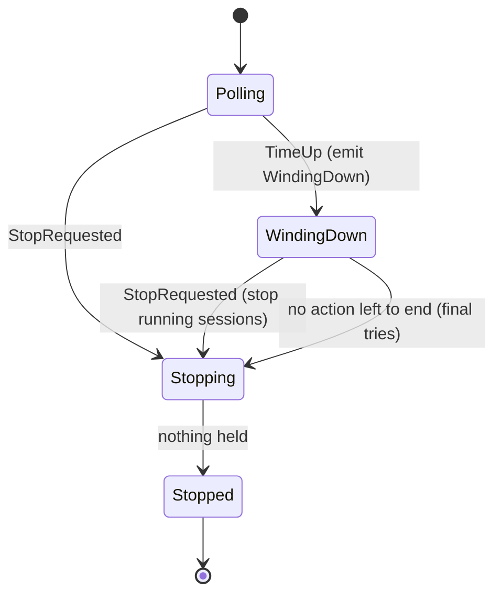

# Run Time Limit - Plan

## Goal Capsule

- **Objective:** The boss can start crew for a set amount of time, such as overnight, and it winds down by itself when that time is up, without losing work in progress.
- **Means:** the engine times the run and hands the core a "time is up" input (KTD2). The core stops taking issues, then enters the existing stop sequence once no action is left to end (KTD3, KTD4).
- **Product authority:** this Product Contract, within `STRATEGY.md`. Stopping on idleness, at a clock time, or through a CLI flag is not active scope.
- **Stop conditions:** stop and report if wind-down cannot reuse the stop sequence without putting an issue in `needs attention` because of the limit, which would break the second Key Decision.
- **Execution profile:** Standard. Five units in dependency order, one pull request.
- **Open blockers:** none.
- **Product Contract preservation:** Product Contract unchanged. The two questions deferred to planning are answered by KTD1 and KTD3.

---

## Product Contract

### Summary

A new optional key in `config` limits how long crew runs. Without it, crew polls until it is stopped, as it does today. When the time is up, crew takes no new issues, lets the running sessions finish, and exits with `0`.

### Key Decisions

- **The limit counts total run time.** Governs R2. (session-settled: user-directed — chosen over a limit on idle time and over a clock end time)
- **When the time is up, running sessions are left to finish.** No issue lands in `needs attention` because of the limit, even if crew then runs well past it. Governs R4, R5. (session-settled: user-directed — chosen over stopping like Ctrl-C, which kills sessions after 10 seconds and moves their issues to `needs attention`)
- **The value is in seconds.** It matches `config.poll_interval_seconds`, so 8 hours is `28800`. Governs R3.
- **The clock starts at the first poll, not at launch.** The startup checks can take up to 10 minutes and should not use up the run time. Governs R2.

### Requirements

**Configuration**

- R1. The limit is optional, and without it crew runs until it is stopped, exactly as today.
- R2. When the limit is set, crew stops taking new issues once that many seconds have passed since its first poll.
- R3. A limit that is not a positive whole number of seconds is a config error. crew refuses to start and exits with `2`, naming the key and its line, like every other config error.

**Winding down**

- R4. After the limit, sessions already running go on until they end, and their issues are judged as usual.
- R5. Moves and comments still owed get their usual last try, and crew then exits with `0`.
- R6. crew says that it is winding down because the run time is up, both in the live view and in `--plain` output, so this end is not mistaken for a crash or a manual stop.
- R7. Ctrl-C, SIGTERM or SIGHUP while crew winds down stops it the usual way, and a second one forces the exit.

**Docs**

- R8. `docs/guide/crew.mdx` lists the key in its config table and describes the wind-down next to "Stop it". The "No time limit on a session" limit stays, since this limit applies to crew and not to a single session.

### Acceptance Examples

- AE1. **Covers R1.** **Given** a config without the limit, **when** crew runs for days, **then** it keeps polling until someone stops it.
- AE2. **Covers R2, R5.** **Given** a limit of `3600` and no running session when the hour is up, **when** the hour passes, **then** crew takes no more issues and exits with `0` once owed calls have had their last try.
- AE3. **Covers R2, R4, R6.** **Given** a limit of `3600` and issue #42's session still running when the hour is up, **when** the hour passes, **then** crew says it is winding down and takes no new issue, even if one is `ready`. #42's session runs to its end, and #42 moves to its `on_success` state (or to `needs attention` if the action failed), as it would without the limit.
- AE4. **Covers R7.** **Given** crew winding down with #42's session running, **when** the boss presses Ctrl-C, **then** #42's session gets 10 seconds to stop, #42 moves to `needs attention`, and crew stops as it does on any Ctrl-C.
- AE5. **Covers R3.** **Given** a limit of `0`, `-5` or `"8h"`, **when** crew starts, **then** it exits with `2` before its first poll, and the message names the key and its line.

### Scope Boundaries

- Stopping after a stretch with no ready issue and no running session.
- Stopping at a clock time, such as 07:00.
- A CLI flag that sets or overrides the limit.
- A limit on a single session's run time.
- Durations written as `8h` or `90m`.

### Outstanding Questions

None. The key's name is settled by KTD1. Whether crew keeps polling while it winds down is settled by KTD3.

### Sources

- `internal/engine/engine.go` (`Engine.Run`): the poll loop and the stop sequence that the wind-down sits next to.
- `internal/config/config.go`: `poll_interval_seconds`, its default and its validation, the pattern for the new key.
- `docs/guide/crew.mdx`: the config table, "Stop it", "Exit codes" and "Limits".

---

## Planning Contract

### Key Technical Decisions

- KTD1. **The key is `config.run_time_limit_seconds`.** It sits next to `poll_interval_seconds` and is read and checked the same way: a located integer, positive when present, with errors naming the key and its line (R3). An empty value counts as left out, as it does for every engine key. The loaded config carries it as a duration, where zero means no limit (R1).
- KTD2. **The engine times the run; the core never reads a clock.** `Engine.Run` starts a one-shot timer just before its first tick, so the environment checks do not count (R2). When the timer fires, the loop feeds the core a new input, `core.TimeUp`, carrying the limit. Without a limit there is no timer, and the loop is unchanged (R1). This keeps the core pure, which KTD2 of the engine plan requires (`docs/plans/2026-10-01-2202-feat-crew-engine-architecture-plan.md`).
- KTD3. **While winding down, ticks still retry owed calls but no longer list issues.** A listing still out when time is up is ignored when it returns. Every issue already held runs to its end and is judged as usual (R4). That includes an issue whose take move is in flight or owed, since crew took it before the limit and stopping it would put it in `needs attention`. Keeping the ticks keeps the usual retry of owed verdicts while sessions are still running (R5).
- KTD4. **Once time is up and no held issue has an action left to end, the core enters the existing stop sequence.** Each owed call gets its one final try, and the core stops once it holds nothing (R5). This reuses the stop's last-try rule rather than retrying owed calls at every tick indefinitely, so crew ends even if GitHub is down, once every taken issue's actions have ended. With nothing held when time is up, crew stops at once, and the engine exits with `0` as it does after a clean stop (AE2).
- KTD5. **The view tells a requested stop from a wind-down.** `core.View` gains `TimeUp`, true once time is up. `View.Stopping` stays "a stop was requested", so entering the stop sequence by itself under KTD4 does not set it. Inside the core, a separate flag records the request. A stop request while winding down runs the usual stop: running sessions get their 10 seconds and their issues go to `needs attention` (R7, AE4).
- KTD6. **One event, `WindingDown`, carries the reason.** The core emits it once, when time is up and no stop was requested before. It carries the limit, so the line renderer prints `run time of 1h0m0s is up: taking no new issues, winding down`. The TUI's header says the same while `TimeUp` holds and no stop was requested (R6). `TimeUp` after a stop request changes nothing and emits nothing.
- KTD7. **`app` needs no new exit path.** `Engine.Run` returns nil after a wind-down, which `app.run` already maps to `0` (R5). Signals and the TUI's stop keys already call `Engine.Stop` and force on the second request (R7). `app.build` only passes the new config field to the engine.

### High-Level Technical Design

How the core's run-level state moves. The per-issue claim states do not change.

- **Polling:** lists at each tick, takes issues, and retries owed calls.
- **WindingDown:** takes nothing, does not list, retries owed calls at each tick, and lets held issues run and be judged.
- **Stopping:** the existing stop sequence (R9 of the engine plan). `View.Stopping` is true only when a stop was requested.

### Assumptions

- An issue whose take move was sent before the limit counts as taken before it: its actions start and run, even if they start after the limit (KTD3).
- The final-try semantics of the stop sequence are the "usual last try" R5 means. Under KTD4, an owed verdict gets its final try when the last action anywhere ends, not when crew would otherwise give up.
- The limit is printed with Go's duration format (`8h0m0s`), as no other part of crew formats durations for a whole run.

### Risks & Dependencies

- **A session that never ends keeps crew running past the limit.** This is accepted by the second Key Decision, and "No time limit on a session" in the guide's Limits stays true (R8). Ctrl-C is the way out (R7).
- **An owed take keeps crew running past the limit.** If a take move in flight at the limit fails transiently, its issue still counts as taken (KTD3). The move is retried at every tick until it lands or is dropped, so crew winds down only once GitHub answers. Giving the take a final try instead would end its actions with "crew stopped" and move it to `needs attention`, which the second Key Decision rules out. Ctrl-C is the way out (R7).

---

## Implementation Units

### U1. Config key

- **Goal:** load `config.run_time_limit_seconds` as an optional, positive number of seconds.
- **Requirements:** R1, R3; AE5.
- **Dependencies:** none.
- **Files:** `internal/config/config.go`, `internal/config/config_test.go`.
- **Approach:**
  1. Add the key to `settings` as `located[int]`.
  2. In `parse`, check it as `poll_interval_seconds` is checked, with the message "must be a positive number of seconds".
  3. Expose it on `Config` as `RunTimeLimit`, a `time.Duration`, zero when left out (KTD1).
- **Patterns to follow:** `PollIntervalSeconds` in `parse`, and the `keyError` shape.
- **Test scenarios:**
  - A config without the key loads with a zero limit.
  - `run_time_limit_seconds: 28800` loads as 8 hours.
  - Covers AE5. `0` and `-5` are each rejected, and the error names `config.run_time_limit_seconds` and its line.
  - Covers AE5. `"8h"` is rejected as a type error naming the key and its line.
  - An empty value (`run_time_limit_seconds:`) loads as no limit.
- **Verification:** the config tests pass, and existing configs load unchanged.

### U2. Wind-down in the core

- **Goal:** the core winds down on `TimeUp`: it takes nothing more, lets held issues end and be judged, then gives owed calls their final try and stops.
- **Requirements:** R2, R4, R5, R6, R7; AE2, AE3, AE4.
- **Dependencies:** none.
- **Files:** `internal/core/input.go`, `internal/core/event.go`, `internal/core/model.go`, `internal/core/update.go`, `internal/core/update_test.go`.
- **Approach:**
  1. Add the input `TimeUp` with a `Limit`, and the event `WindingDown` with `At` and `Limit` (KTD2, KTD6).
  2. Add a time-is-up flag and a stop-requested flag to `Model`. Expose `TimeUp` on `View`, and back `View.Stopping` with the stop-requested flag (KTD5).
  3. `TimeUp` does nothing after a stop request or a first `TimeUp`. Otherwise it sets the flag and emits `WindingDown`.
  4. `tick` skips the listing while time is up but still retries owed calls. `listed` takes nothing while time is up (KTD3).
  5. After every input, if time is up, no stop sequence is running and no held issue has an action not yet ended, run the existing `stop` (KTD4).
  6. `StopRequested` records the request even when the stop sequence is already running.
- **Execution note:** write the table tests first. The core is pure, so every scenario is a sequence of inputs and expected commands and events.
- **Patterns to follow:** the `StopRequested` cases in `internal/core/update_test.go`, and `step.stop` in `internal/core/update.go`.
- **Test scenarios:**
  - Covers AE2. `TimeUp` with nothing held emits `WindingDown` then `Stopped`, and `Stopped()` is true.
  - Covers AE2. `TimeUp` while a listing is out stops at once, and the late `IssuesListed` takes nothing.
  - Covers AE3. With #42 running, `TimeUp` emits `WindingDown` and no `StopSession`. A tick then lists nothing, and an `IssuesListed` with a `ready` issue takes nothing.
  - Covers AE3. #42's session then succeeds: the core moves it to `on_success`. When the move is done, it emits `IssueMoved` then `Stopped`.
  - Covers AE3. #42's session fails instead: the core moves it to `needs_attention` and reports the failure, then stops once both calls are done.
  - With #42's take move in flight at `TimeUp`, the take's success starts its actions rather than ending them with "crew stopped".
  - With #42's take owed at `TimeUp`, a tick retries the take and no `Stopped` is emitted. Once the retried take is done, #42's actions start.
  - With #7 judged and its verdict move owed while #42 still runs, a tick retries #7's move. When #42's last action ends, any owed call gets its final try, and a second transient failure drops it.
  - Covers AE4. While winding down with #42 running, `StopRequested` sends `StopSession` for #42. Its stopped session moves #42 to `needs_attention`, and `View.Stopping` is true.
  - `TimeUp` after `StopRequested` emits nothing and changes nothing. A second `TimeUp` emits nothing.
  - `View.TimeUp` is true after `TimeUp`, and `View.Stopping` stays false while the wind-down runs its own stop sequence.
- **Verification:** the core tests pass with no goroutine, clock or I/O. Every existing core test passes unchanged.

### U3. Engine timer and wiring

- **Goal:** the engine feeds `TimeUp` when the limit has passed since its first poll, and `app` passes the limit through.
- **Requirements:** R1, R2, R4, R5; AE1, AE2, AE3.
- **Dependencies:** U1, U2.
- **Files:** `internal/engine/engine.go`, `internal/engine/engine_test.go`, `internal/app/app.go`, `internal/app/app_test.go`.
- **Approach:**
  1. Add `RunTimeLimit` to `engine.Config`, where zero means no limit.
  2. In `Run`, create the timer just before the first tick, and select on its channel in the loop, nil when there is no limit (KTD2).
  3. Set the channel to nil after it fires, as the stop and done channels are.
  4. `app.build` passes `cfg.RunTimeLimit` (KTD7).
- **Patterns to follow:** the ticker and the `stop`/`done` channels in `Engine.Run`. Engine tests run under `testing/synctest` with the fakes.
- **Test scenarios:**
  - Covers AE1. With no limit and a 5-minute poll interval, the engine still lists after 72 hours of fake time and returns only on `Stop`.
  - Covers AE2. With a limit of 3600 seconds, a 300-second poll interval and no ready issue, `Run` returns nil about an hour after the first listing, which comes after a slow preparer (the clock starts at the first poll, R2).
  - Covers AE3. With a limit of 3600 seconds, #42's session running past the hour and #43 labeled `ready` at the hour, #43 is never taken. #42 moves to `on_success` when its session ends at 90 minutes, and `Run` returns nil after it.
  - Covers AE2. Through `app.Run` with the fakes and `--plain`, a config with `run_time_limit_seconds: 3600` and no issues exits `0` and prints the wind-down line.
- **Verification:** engine and app tests pass under `-race`, with no leaked goroutine reported by `synctest`.

### U4. Renderers

- **Goal:** both renderers say crew is winding down because time is up.
- **Requirements:** R6; AE3.
- **Dependencies:** U2.
- **Files:** `internal/ui/lines/lines.go`, `internal/ui/lines/lines_test.go`, `internal/ui/tui/view.go`, `internal/ui/tui/model_test.go`, `internal/ui/tui/testdata/winding-down.golden`.
- **Approach:**
  1. `lines.Text` describes `WindingDown` with its limit (KTD6).
  2. The TUI header, in order: the boss pressed stop, then `Stopping`, then `TimeUp`, then the default. The `TimeUp` line keeps the held count and the hint that q or ctrl+c stops.
- **Patterns to follow:** `TestEveryEventPrintsAnEnglishSentence` and the `running` golden test.
- **Test scenarios:**
  - `WindingDown` with a one-hour limit reads `run time of 1h0m0s is up: taking no new issues, winding down`.
  - Covers AE3. A snapshot with `TimeUp` and #42 running renders the `winding-down` golden header: `crew: run time is up, winding down: 1 issue held (q or ctrl+c stops)`.
  - A snapshot with both `TimeUp` and `Stopping` shows the stopping header.
- **Verification:** lines and TUI tests pass, and the new golden file is reviewed.

### U5. Docs

- **Goal:** the guide documents the key and the wind-down, and the architecture page lists the new input and event.
- **Requirements:** R8.
- **Dependencies:** U1–U4.
- **Files:** `docs/guide/crew.mdx`, `docs/develop/architecture.mdx`.
- **Approach:**
  1. Add `config.run_time_limit_seconds` to the Keys table: no default, positive seconds, with `28800` for 8 hours.
  2. Add a short section after "Stop it" describing the wind-down and its message, and that Ctrl-C during it stops crew the usual way.
  3. Make the `0` exit code row cover a wind-down.
  4. Keep "No time limit on a session" in Limits, and add a clause that the run time limit does not cut sessions short.
  5. In the architecture page, add `TimeUp` to the inputs and `WindingDown` to the events, with one sentence on wind-down.
- **Test expectation:** none -- documentation only, checked by `pnpm docs:check`.
- **Verification:** `pnpm docs:check` passes, and the guide's messages match the code.

---

## Verification Contract

| Gate | Command | Applies to |
|---|---|---|
| Format | `gofmt -l cmd internal` prints nothing | U1–U4 |
| Vet | `go vet ./...` | U1–U4 |
| Lint and layering | `go run github.com/golangci/golangci-lint/v2/cmd/golangci-lint@v2.14.0 run` | U1–U4 |
| Tests | `go test -race ./...` | U1–U4 |
| Vulnerabilities | `go run golang.org/x/vuln/cmd/govulncheck@v1.8.0 ./...` | U1–U4 |
| Docs | `pnpm docs:check` | U5 |

The acceptance examples are proven by the scenarios marked `Covers AE…`:

| Acceptance example | Proven in |
|---|---|
| AE1 | U3 |
| AE2 | U2, U3 |
| AE3 | U2, U3, U4 |
| AE4 | U2 |
| AE5 | U1 |

---

## Definition of Done

- Every gate in the Verification Contract passes locally and in CI.
- Every unit's Verification holds.
- No issue lands in `needs attention` because of the limit alone, as U2's and U3's tests show.
- The guide's key table, wind-down text, exit codes and limits match the code.
- No dead-end or experimental code from abandoned approaches is left in the diff.
- `VERSION` is unchanged.
