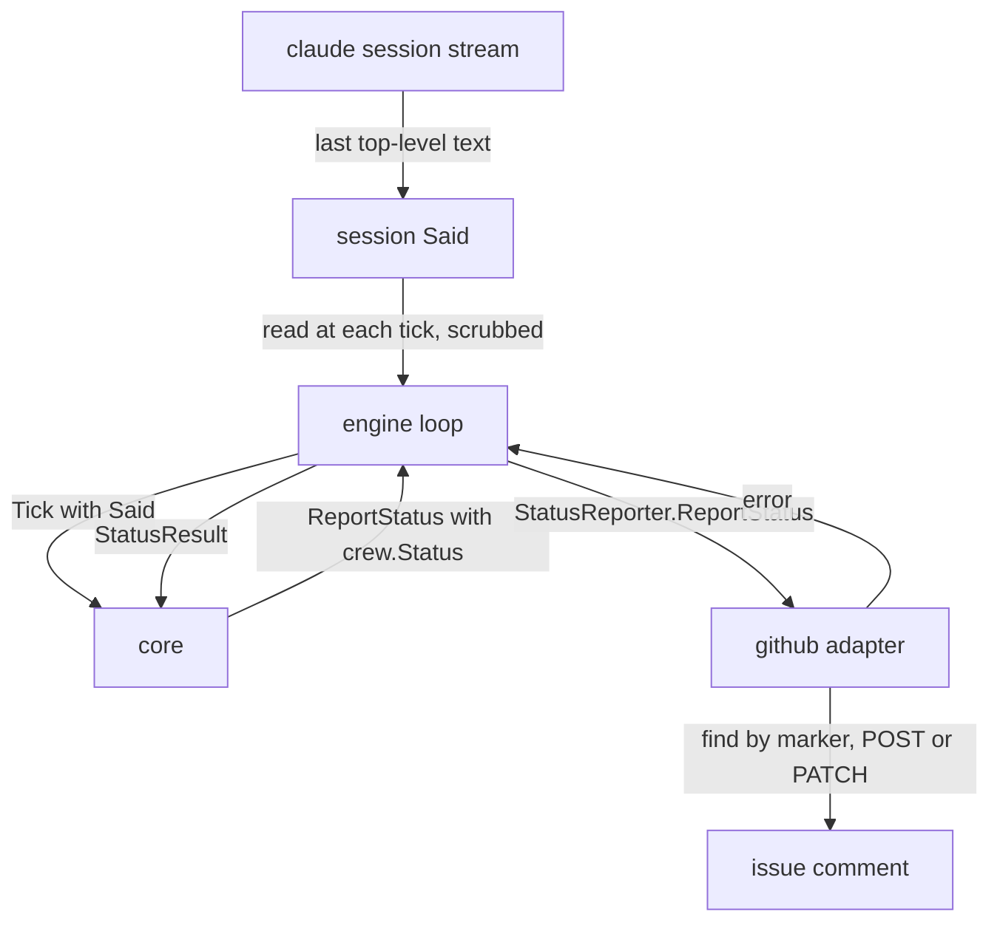
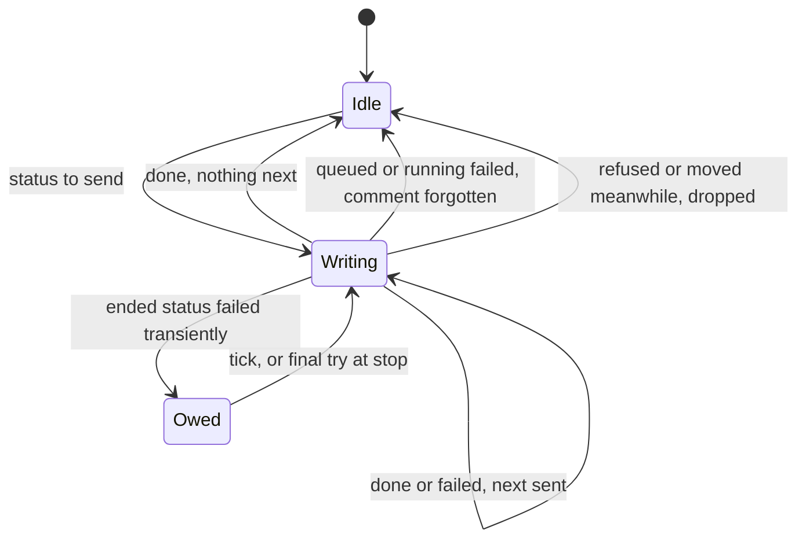

# Status Comment - Plan

> **Superseded in part:** `docs/plans/2026-10-02-1810-feat-action-check-status-history-plan.md` (#14) replaces "one comment, edited in place" (R1 and its Key Decision): the status comment now keeps one entry per stage run and edits only the latest. A failed action's status says why in crew's words, never in the session's. The rest of this plan stands.

## Goal Capsule

- **Objective:** The boss opens any issue crew handles and sees where it stands in one comment: queued and why it waits, which stage and actions are running and what each session last said, or how it ended. They do not have to open a session log or the live view on the machine running crew.
- **Product authority:** this Product Contract, within `STRATEGY.md` and the engine's architecture plan (`docs/plans/2026-10-01-2202-feat-crew-engine-architecture-plan.md`). It is adapted from pururu-ha's dispatcher status report (`thatsnotmynameio/pururu-ha`, `docs/plans/2026-10-01-1853-feat-dispatcher-status-report-plan.md`). Progress inside a session, such as lfg's own phases, the usage-limit pause, blocked issues and promotion to `ready to merge` are not active scope.
- **Means:** the core builds a structured status per issue and keeps at most one write of it in flight (KTD2, KTD3). An optional tracker capability writes it (KTD1), and `github` finds its comment again by a hidden marker (KTD6). The session's last words come from an optional harness capability that the engine polls at each tick (KTD4).
- **Open blockers:** none.
- **Stop conditions:** stop and report if keeping the core pure requires the core to read a clock or build markup, or if `depguard` rejects a layering the plan relies on.
- **Execution profile:** Go only, in the existing packages, plus the docs pages. No new dependency, no config key, no change to `.crew/config.yaml`.
- **Finishes and ships:** `ce-work` implements U1 to U6 on this branch. The lfg run that invoked planning reviews the change and opens the pull request, whose body closes #7.

---

## Product Contract

### Summary

Each issue crew takes gets a single status comment, always the same one, edited in place. While the issue is queued, the comment says why it waits. While its stage runs, the comment shows the stage, each action's state and running time, and each session's last sentence. After the stage ends, it shows how the stage ended.

### Problem Frame

Today crew comments on an issue only when it moves to `needs attention`, with the failure report. While sessions run, which is most of an issue's time in crew, the issue shows only its `moves_to` label, such as `in progress`. To know what a session is doing, the boss has to read `.crew/logs/issue-<N>-<action>.log` or watch the live view on the machine running crew. pururu-ha's dispatcher solved the same problem with a status comment. That behavior is listed in `docs/guide/crew.mdx` under "Not built yet from the old dispatcher".

### Key Decisions

- **One comment, edited in place, not a new comment per change.** Governs R1. (session-settled: user-directed — chosen over a new comment at each status change: the issue keeps one place to look instead of a growing history; carried from pururu-ha's plan at the boss's request)
- **The failure report stays a separate comment.** Editing a comment notifies no one, so the comments that should notify keep being posted. Governs R2. (session-settled: user-directed — chosen over folding it into the status comment, which would stop its notification; carried from pururu-ha's plan)
- **The comment starts in the queue, not when the issue is taken.** Governs R3, R4. (session-settled: user-directed — chosen over commenting only once sessions run; carried from pururu-ha's plan)
- **crew reads what the session already writes; the session is not asked to report.** This keeps working when a session hangs or dies, which is when the status matters most. Governs R9. (session-settled: user-approved — chosen over telling the session in its prompt to edit the comment; carried from pururu-ha's plan)
- **A comment left behind when the boss removes the label stays as it was.** See Scope Boundaries. (session-settled: user-approved — chosen over an extra search each poll to mark such issues "not queued"; carried from pururu-ha's plan)
- **The comment shows crew's stages and actions, not lfg's phases.** crew's workflow and prompts are configurable, and lfg is one prompt among others. A checklist of lfg's skills is the "per-stage progress" item, left for later. Governs R7, R8. (session-settled: user-approved — chosen over pururu-ha's checklist of lfg's phases, which ties the comment to one prompt and one harness's log format)
- **The status comment is an optional tracker capability.** Following the engine's R12, crew works as it does today with a tracker that lacks it. Governs R13.
- **English text, matching crew's other comments and labels.** Governs R12.

### Requirements

**One comment per issue**

- R1. crew keeps exactly one status comment per issue. It is created the first time crew reports on the issue, then edited in place across stages, crew restarts and re-queues after `needs attention`.
- R2. The failure report crew posts on a move to `needs attention` is still posted as a new comment, unchanged.
- R3. Only queuing or taking an issue creates its status comment. Every later report edits an existing one, so an issue crew handled before this feature never gets one.

**In the queue**

- R4. An issue that carries a stage's `label` and is listed but not taken in a poll gets the comment saying it is queued for that stage, waiting for a free slot (`config.max_parallel_issues`).
- R5. Outside running sessions, the comment is edited only when its text changes.

**While a stage runs**

- R6. At every poll while any of the issue's actions runs, the comment is updated with the time it was updated.
- R7. The comment names the stage and lists each of its actions as running, succeeded or failed, with each running action's elapsed time.
- R8. Each running action shows the last sentence its session narrated, once it has one.
- R9. That sentence comes from the session's own output; the session is not asked to report anything. With a harness that cannot provide it, the comment shows the rest without it.
- R10. The sentence goes through the same cleaning as the failure report: the repository's path shows as `.` and the home directory as `~`, and it sits in a code block, so nothing in it renders or mentions anyone.

**After a stage**

- R11. When the stage ends, the comment shows each action's final state and where the issue went: the next state on success, or `needs attention` on failure, including when crew stopped the sessions. When a later stage takes the issue from that state, the same comment shows the new stage.

**Text and trackers**

- R12. The comment is written in English.
- R13. A tracker adapter without status comments leaves crew working as it does today, with no status reported and no error. `github` provides them.

### Acceptance Examples

- AE1. **Covers R1, R3, R4, R5.** **Given** `max_parallel_issues: 2`, two issues running and #74 newly labelled `ready`, **when** a poll lists #74, **then** crew creates #74's comment saying it is queued for `implement`, waiting for a free slot. The next poll, with nothing changed, does not edit it.
- AE2. **Covers R6, R7, R8.** **Given** #74 was taken by `implement`, whose action `lfg` has run for 42 minutes and last wrote "U1 committed: 168 tests pass. Starting U2.", **when** a poll runs, **then** the comment shows `implement`, `lfg` running for 42 minutes with that sentence, and the update time.
- AE3. **Covers R7, R11.** **Given** a stage with two actions, `development` and `acceptance`, where `acceptance` has succeeded and `development` still runs, **when** a poll runs, **then** the comment shows `acceptance` succeeded and `development` running. When `development` fails, the comment shows both final states and that #74 moved to `needs attention`, and the failure report is posted as a separate comment (R2).
- AE4. **Covers R2, R11.** **Given** the boss stops crew with Ctrl-C while #74's `lfg` runs, **when** crew stops the session and moves #74 to `needs attention`, **then** the comment shows `lfg` failed and the move, and the failure report is posted as today.
- AE5. **Covers R1.** **Given** crew restarts after #74 moved to `in review`, **when** a later stage takes #74, **then** crew edits #74's existing comment, and no second status comment appears.
- AE6. **Covers R10.** **Given** a session's last sentence names `/Users/boss/Projects/crew/internal/core/update.go` and contains `@someone`, **when** the comment shows it, **then** the path reads `./internal/core/update.go`, and the sentence sits in a code block that mentions no one.
- AE7. **Covers R3.** **Given** #60 was already `in review` before this feature, with no status comment, **when** polls run, **then** crew never creates one for it.

### Scope Boundaries

- An issue whose label the boss removes while it is queued keeps its last status comment. crew does not look for it again.
- An issue skipped for carrying two crew labels gets no status comment; crew reports it as it does today.
- Edits notify no one. Notification stays with the failure report (R2).
- No progress inside a session, such as lfg's phases or "unit 2 of 5". The session's last sentence carries whatever it says. This is the "per-stage progress" item.
- The usage-limit pause, blocked issues and promotion to `ready to merge` are not built in crew, so the comment has no wording for them yet.
- Nothing moves to the issue's body or to the pull request.
- Deleting or collapsing duplicate status comments is not built. A duplicate exists only when a create succeeded but its reply was lost.
- Considered and not built: a status for a take that was refused or moved meanwhile. It happens only when someone relabels or closes the issue during the take, and the comment then keeps its last queued text. Build it if dropped takes turn out to be common.
- Considered and not built: an event for every successful status write. It would print a line per issue at every poll in `--plain` and push other events out of the TUI's recent list. Failures emit `StatusFailed` (KTD5).

#### Deferred to Follow-Up Work

- Showing each running session's last words in the TUI's Actions region. Once U2 lands the core holds them, but no requirement asks for them there.
- Interaction with the run-time-limit plan (`docs/plans/2026-10-02-0140-feat-run-time-limit-plan.md`, not yet built): while crew winds down, issues left in the queue must not be told they wait for a free slot, and running statuses must keep refreshing. Whichever plan lands second handles it.

### Dependencies / Assumptions

- The repository is public. The session's last sentence is posted as written, after the cleaning in R10.
- Only issues the boss opened are listed (`docs/guide/crew.mdx`, "What crew does on each poll"), so only they get a status comment.

### Outstanding Questions

The three questions deferred to planning are resolved in the Planning Contract: finding the comment again after a restart (KTD6), how a running session's last sentence reaches the core (KTD4), and how a failed status write is retried (KTD5).

### Sources

- `thatsnotmynameio/pururu-ha`, `docs/plans/2026-10-01-1853-feat-dispatcher-status-report-plan.md`: the source plan, its KTD1 (finding the comment by a hidden marker) and KTD6 ("the text changes" ignores the update time).
- `docs/plans/2026-10-01-2202-feat-crew-engine-architecture-plan.md`: R12 (optional capabilities) and its table of behaviors to port ("Status comment edited in place: optional tracker capability, fed by domain events").
- `docs/develop/architecture.mdx`: the core's events (`IssueTaken`, `ActionStarted`, `ActionEnded`, `IssueMoved`, `FailureReported`, `PollDone`) and the `Tracker` port.
- `docs/guide/crew.mdx`: the failure report, path cleaning, "Stop it" and "Limits".

---

## Planning Contract

**Product Contract preservation:** Product Contract unchanged. The three questions deferred to planning are now answered by KTD4, KTD5 and KTD6.

### Key Technical Decisions

- KTD1. **Two optional capabilities, one per port.** The tracker may implement `port.StatusReporter`, whose one method writes a `crew.Status` and classifies its errors as `Move`'s are. A harness's `port.Session` may implement `port.Narrator`, whose one method returns what the session last said, or the empty string. The engine checks the tracker once, when it is built, and checks each session when it starts. Without `StatusReporter`, the core is built with status reporting off and issues no status command (R13). Without `Narrator`, the status has no sentence (R9). This follows the port package's rule: optional capabilities are separate interfaces found by type assertion, with no wrappers and no stubs.
- KTD2. **The status is structured domain data, and the adapter renders it.** `crew.Status` sits in `internal/crew` next to `crew.FailureReport`. It holds the issue's key and reference, the stage, and one of three kinds: queued, running or ended. It also carries the free-slot limit (for queued), each action's name, state, session start time and last words, the destination state and whether the move landed (for ended), and the update time. The core reads no clock: the start times and the update time come from input times, and the github adapter computes the elapsed time and writes the Markdown. This is the architecture plan's KTD12, where the core builds no markup.
- KTD3. **The core keeps one status slot per issue, apart from the issues it holds.** A slot remembers what the comment shows, has at most one write in flight and keeps only the newest status not yet sent. Slots are keyed by issue key, so a queued issue that is not held still has one (R5), and a status write never occupies one of the `max_parallel_issues` slots. Statuses are compared without their update time (R5). Running statuses skip that comparison and are sent at every tick (R6). `core.New` gains a way to turn status reporting on, so every existing core test runs unchanged with it off. Serializing writes per issue is what keeps one comment per issue (R1): two creates in flight at once would make two comments.
- KTD4. **The session's last words come from the harness, read by the engine at each tick.** The claude adapter's stream parser also keeps the last `text` block of the last top-level `assistant` event (`parent_tool_use_id` null, so subagent text is ignored). It keeps that block whole, on one line. A mutex guards it, because it is now read while the session runs. At each tick, the engine loop reads `Said` from every session in its own `sessions` map, without a new goroutine, cleans the paths with `scrub` (`internal/engine/paths.go`), then keeps the last 200 characters after `…`, and passes the texts on the `core.Tick` input. Cutting after cleaning keeps the end of a cut path out of the comment. The engine never parses session output, and `scrub` can only run in the engine (R9, R10).
- KTD5. **Running and queued writes are not retried. An ended status is retried until it lands.** When a queued or running write fails, the slot forgets what the comment shows, so the next poll writes again. An ended status that fails transiently is retried at each tick and gets one final try when crew stops, as owed verdict calls do (`docs/guide/crew.mdx`, "A move or comment that fails ... is retried at every poll and once more when crew stops"). A status refused, or whose issue moved meanwhile, is dropped. The first failure after a write that succeeded emits one `StatusFailed` event. A successful write emits none, so `--plain` does not print a line per issue at every poll. `Model.Stopped` also waits for every status write in flight or owed to finish.
- KTD6. **`github` finds its comment by a hidden marker and remembers it.** The comment body ends with the line `<!-- crew:status -->`. The adapter lists the issue's comments through the REST API, keeps those by the authenticated `gh` login (`gh.viewer`) whose body ends with the marker, and the newest one wins. It caches comment ids by issue key, so the lookup runs once per issue per run. It creates with a REST `POST` that prints the new id (`gh issue comment` prints only a URL) and edits with a `PATCH`. A `PATCH` that gets 404 means the comment was deleted: the adapter forgets the id, looks again, then creates. Its errors: the issue gone (404 or 410) is `port.ErrMovedMeanwhile`, a locked issue (403) is `port.ErrRefused`, and anything else is transient. This adapts pururu-ha's KTD1.
- KTD7. **When the core writes a status.** It writes a queued status when a listing has a single-state issue under a stage's `label` that it neither holds nor takes (R4). It writes a running status once the take move lands, in `taken`, and at each tick while the issue's claim is `ClaimRunning` (R6). When the issue is judged, it writes an ended status saying "moving to X", and once the verdict move settles it writes "moved to X", or "could not move it to X" when the move was dropped (R11). A take is only reported once it lands, so a dropped take never leaves a wrong comment. Ticks do nothing after a stop, but results still arrive, so the ended status after Ctrl-C comes from them (AE4).
- KTD8. **Each action is shown in one of R7's three states.** An action whose session has not started yet, because its workspace is being created or its session is starting, shows as running, with no elapsed time and no sentence. An ended action shows as succeeded or failed, from its outcome.

### High-Level Technical Design

How a status reaches the issue, and where the session's words come from:

One issue's status slot in the core (KTD3, KTD5):

### Assumptions

- A comment the boss deleted is created again by the next write. R3 still holds, because the core writes only about issues it queued or took in this run.
- The update time is written in UTC. The elapsed time is in whole minutes ("less than a minute" below one, then "1 hour 5 minutes" style).
- States in the comment use the tracker's label names, such as `needs attention`, which the boss sees on the issue.
- The queued text names the limit: crew runs at most `max_parallel_issues` issues at once.
- After a crash or a forced exit, the comment keeps saying "running" until the issue is relabeled and taken again. crew does not re-take an issue in a `moves_to` state. The guide says so.

### Risks

- **GitHub API use.** Each running issue costs one `PATCH` per poll, at most `max_parallel_issues` every `poll_interval_seconds`, and each issue costs one comment listing per run. Both are far below GitHub's rate limits.
- **What gets posted.** A session's last words go to a public issue after path cleaning (Dependencies / Assumptions). The fence keeps them from rendering or mentioning anyone. It does not remove secrets a session prints, as is already true of the failure report.
- **Changing `Stopped`.** `Run` now also waits for status writes. Each one is bounded by `callTimeout` and gets at most one final try after a stop, so a stop still ends.

### Sequencing

U1 first. U2, U3 and U5 depend only on U1 and can run in any order. U4 wires them together, and U6 documents the result.

---

## Implementation Units

### U1. Status domain type and the two optional port interfaces

- **Goal:** `crew.Status` and its parts exist, and `port.StatusReporter` and `port.Narrator` are declared and documented.
- **Requirements:** R9, R13. Implements KTD1 and KTD2.
- **Dependencies:** none.
- **Files:** `internal/crew/status.go` (new), `internal/crew/status_test.go` (new), `internal/port/port.go`.
- **Approach:**
  1. In `internal/crew`, add the status kind (queued, running, ended) and the action state (running, succeeded, failed), and a `Status` with the fields KTD2 lists. Give `Status` a `Clone` that copies its actions, like `Issue.Clone`.
  2. In `internal/port`, add `StatusReporter` and `Narrator`. Their doc comments say when each method is called, that `Said` may be called while the session runs and from another goroutine, and how `ReportStatus` classifies errors. Update the package doc, which today names only `Preparer`.
- **Patterns to follow:** `crew.FailureReport` and `crew.Issue.Clone`, and `port.Preparer` with its doc comment.
- **Test scenarios:**
  - `Clone` of a status with two actions returns a copy, and changing the copy's actions leaves the original unchanged.
- **Verification:** both packages build. `depguard` passes: `crew` imports nothing of crew's, and `port` imports only `crew`.

### U2. Core: status slots, emission and retry

- **Goal:** with status reporting on, the core emits a `ReportStatus` command per KTD7, keeps at most one in flight per issue, and handles results per KTD5.
- **Requirements:** R1, R3, R4, R5, R6, R7, R8, R11. Implements KTD3, KTD5, KTD7 and KTD8.
- **Dependencies:** U1.
- **Files:** `internal/core/model.go`, `internal/core/update.go`, `internal/core/status.go` (new, the slot logic), `internal/core/command.go`, `internal/core/input.go`, `internal/core/event.go`, `internal/core/status_test.go` (new).
- **Approach:**
  1. Add the `ReportStatus` command, carrying the status. Add the `StatusResult` input, carrying the issue key, a `Result` and a reason. Add a `Said` list to `Tick`, each entry an issue key, an action and its text. Add the `StatusFailed` event.
  2. Add the switch on `core.New` and the slots map to `Model`. Give `actionRun` a `said` field, which a tick sets for its running actions.
  3. `listed`: after taking, build a queued status for each single-state candidate under a stage label that is neither held nor taken, and send it only when it differs from the slot's (KTD3). Do nothing while stopping, as today.
  4. `taken`: send a running status once the actions have their phases. `tick`: record the `Said` texts, then send a running status for each `ClaimRunning` issue.
  5. `judge`: send the ended status saying "moving". `callResult` on the verdict move: send it again with whether the move landed. The take move is not the verdict move.
  6. `stop`: give each owed ended status its final try. `Stopped` also needs no status write in flight, waiting to be sent, or owed.
  7. Clone each status that leaves the core in a command.
- **Execution note:** write the core tests first, through the existing `driver` helper, named after the acceptance examples, as `TestAE3AE5…` tests are today.
- **Patterns to follow:** `listing bool` for the one-in-flight guard, `call{owed, inFlight, final}` and `callResult` for retry and the final try, `cloneReport`. In `update_test.go`: `newDriver`, `send`, `poll`, `settle` and `hasEvent`.
- **Test scenarios:**
  - Covers AE1. With `max_parallel_issues: 2`, two issues running and #74 listed in `ready`, the poll emits one `ReportStatus` for #74: queued for `implement`, limit 2. The next poll with nothing changed emits none for #74.
  - A queued issue listed under another stage's label at the next poll gets a new queued status.
  - An issue taken in the poll that first lists it gets no queued status. Its first status comes once the take move is done: running `implement`, with each action running and no start time.
  - Covers AE2. A tick whose `Said` holds "U1 committed: 168 tests pass. Starting U2." for #74's running `lfg` emits a running status: `lfg` running, with its start time, that sentence, and the tick's time as the update time.
  - Covers AE3. With `acceptance` succeeded and `development` running, a tick's status shows both. When `development` fails, the ended status says "moving to `needs_attention`" with both final states. Once the move is done, a second ended status says it moved, and `ReportFailure` is still issued as its own command (R2).
  - Covers AE4. A stop while `lfg` runs gives `StopSession`. The session's failed end gives the move to `needs_attention`, the failure report and the "moving" status. The move's result gives the "moved" status, and only then is the core stopped.
  - While a status write for #74 is in flight, ticks emit no second write for #74. When it returns, the newest status not yet sent is emitted once.
  - A running write that fails emits `StatusFailed` once. The next tick writes again, and a second failure in a row emits no second event.
  - An ended status that fails is retried at the next tick. After a stop it gets one final try, and the core is stopped once that try returns, even if it failed.
  - An ended status refused, or whose issue moved meanwhile, is dropped and not retried.
  - Ticks after a stop emit no running status.
  - An owed take emits no status until its retry lands. A take that is refused or moved meanwhile emits none.
  - With status reporting off, the same flows emit no `ReportStatus`, and the existing core tests pass unchanged (R13).
  - Covers AE7. An issue whose only state is not any stage's label, such as `in_review` here, never gets a status. An issue skipped for carrying two states gets none either.
- **Verification:** `go test -race ./internal/core` passes, with the new tests and the existing ones unchanged. The core still imports only `crew` and reads no clock.

### U3. Claude: the session's last words

- **Goal:** a claude session implements `port.Narrator` and returns its last top-level text, per KTD4.
- **Requirements:** R8, R9. Implements KTD4.
- **Dependencies:** U1.
- **Files:** `internal/adapter/claude/stream.go`, `internal/adapter/claude/harness.go`, `internal/adapter/claude/harness_test.go`, `internal/adapter/claude/testdata/subagent.jsonl` (new).
- **Approach:**
  1. `stream.line` also decodes `type`, `parent_tool_use_id` and the message's `content`. For a top-level `assistant` event with a `text` block, it keeps the last block's text whole, on one line. The engine cuts it after cleaning its paths (KTD4).
  2. Guard the kept text with a mutex, because `Said` reads it while `Write` runs. Update the doc comment that says the stream is read only once the writes are over.
  3. `session` holds its stream and implements `Said`. Add a compile-time guard.
- **Patterns to follow:** `oneLine` and `maxReason` in `stream.go`, the `result` struct, which decodes only top-level keys, and the `fixture` and `runSession` helpers.
- **Test scenarios:**
  - Fed `success.jsonl` up to the first assistant line, `Said` returns "I'll start by reading the issue and the failing test.". Fed the whole file, it returns "The tests pass. I opened the pull request.".
  - An assistant event whose only content is a `tool_use` leaves the previous text in place.
  - In `subagent.jsonl`, an assistant text with a non-null `parent_tool_use_id` is ignored, and `Said` keeps the top-level text before it.
  - A text block of several lines comes back on one line. One longer than 200 characters comes back whole.
  - Before any assistant text, `Said` returns "".
  - `Said` called from another goroutine while the session's output is written passes under `-race`.
- **Verification:** `go test -race ./internal/adapter/claude` passes, and the verdict tests are unchanged.

### U4. Engine wiring, fakes and the line renderer

- **Goal:** the engine detects the capabilities, runs `ReportStatus` commands, feeds the scrubbed `Said` texts to the core at each tick, and the fakes and renderers cover the new types.
- **Requirements:** R9, R10, R13, and R1 to R11 end to end. Implements KTD1 and KTD4, and the engine side of KTD5.
- **Dependencies:** U1, U2, U3 (U3 only for the end-to-end shape; the engine tests use fakes).
- **Files:** `internal/engine/engine.go`, `internal/engine/exec.go`, `internal/engine/engine_test.go`, `internal/fake/tracker.go`, `internal/fake/harness.go`, `internal/fake/fake_test.go`, `internal/ui/lines/lines.go`, `internal/ui/lines/lines_test.go`.
- **Approach:**
  1. `engine.New`: check whether `cfg.Tracker` implements `port.StatusReporter`, and build the core with status reporting on only when it does.
  2. On each ticker tick, but not the first tick at start, build the `Said` list from `e.sessions`: for each session that implements `port.Narrator` and returns a non-empty text, pass the text through `scrub`. Then step the `Tick`.
  3. `launch`: add the `ReportStatus` case, a goroutine bounded by `callTimeout`. It maps the error as `callResult` does and posts `core.StatusResult`.
  4. Fakes: give the fake tracker a status capability by composition, like `PreparingTracker{*Tracker; *Preparation}`. It records each status by issue key and can be scripted to fail. Let the fake harness make sessions with and without `Narrator`, with a way to set what a session says.
  5. `lines.Text` gets wording for `StatusFailed`, such as "could not update the status comment on #74: <reason>".
- **Patterns to follow:** `Engine.prepare` and `port.Prepare` for detection, `move` and `report` in `exec.go`, and `paths.go`'s `scrub`. The engine tests' `rig`, `config` and `synctest` setup: Root `.../home/repo` and Home its parent make path cleaning testable.
- **Test scenarios:**
  - R13. With the plain fake tracker, a full stage runs and ends exactly as before, and nothing asks for a status.
  - Covers AE2 and AE6. A session saying "Edited /…/home/repo/internal/core/update.go for @someone" reaches the tracker's recorded running status as "Edited ./internal/core/update.go for @someone", with the action's start time.
  - R9. With a session that does not implement `Narrator`, the running status has no sentence and the rest is unchanged.
  - Covers AE4 end to end. `Stop` while a session runs ends with the tracker holding an ended status for the issue that says it moved to `needs_attention`, plus the failure report. `Run` returns only after that write.
  - An ended status whose write returns an error wrapping `port.ErrRefused` is not retried at the next tick, and the core does not wait for it at stop.
  - Covers AE3. A failed stage leaves both the failure report and the status recorded as separate writes.
  - The fake tracker and harness tests cover the new capability fakes.
  - `lines.Text(StatusFailed{…})` names the issue and the reason.
- **Verification:** `go test -race ./internal/engine ./internal/fake ./internal/ui/...` passes. No new goroutine leaks under `synctest`.

### U5. GitHub: find, create, edit and render the status comment

- **Goal:** the github `Tracker` implements `port.StatusReporter`. It renders the status as Markdown with the marker and writes it to the one comment it finds or creates, per KTD6.
- **Requirements:** R1, R3, R4, R7, R8, R10, R11, R12, R13. Implements KTD2 (rendering) and KTD6.
- **Dependencies:** U1.
- **Files:** `internal/adapter/github/status.go` (new), `internal/adapter/github/status_test.go` (new), `internal/adapter/github/tracker.go` (compile-time guard, the comment-id cache).
- **Approach:**
  1. `renderStatus` writes, in English:
     - Queued: the stage, that the issue waits for a free slot, and the limit.
     - Running: the stage, then each action with its state. A running action with a start time gets its elapsed time, computed as the update time minus the start time. Its last words go in a fenced `text` block sized like `renderReport`'s.
     - Ended: the stage, each action's final state, and "moving to", "moved to" or "could not move it to" the destination's label name.
     - Last: the update time in UTC, then the marker line.
  2. `ReportStatus`:
     1. Use the cached comment id. Without one, list the issue's comments with `gh api --paginate`, filtered to the viewer's login and the marker, and take the newest.
     2. If there is still none, `POST` and cache the id.
     3. Otherwise `PATCH`. A 404 there clears the cache and retries the lookup once.
     4. Classify the errors per KTD6.
  3. A mutex guards the cache. The core already serializes writes per issue.
- **Patterns to follow:** `renderReport`, `codeSpan` and `longestBacktickRun` in `report.go`, `gh.viewer` and `gh.decode`, and `missingLabel` for classifying stderr. `List` passes `{owner}` and `{repo}` for gh to fill. In the tests: the `fakeGh` script with prefix matching, `build`, `callsTo`, `fenced` and the `login` reply.
- **Test scenarios:**
  - A first write on #74, whose comments hold none with the marker, lists them, `POST`s a body that ends with the marker line, and caches the id. A second write only `PATCH`es that id.
  - Covers AE5. A new `Tracker`, as after a restart, finds three comments with the marker: one by another login and two by the viewer. It `PATCH`es the viewer's newer one and creates nothing.
  - A `PATCH` answered with 404 lists again and `POST`s a new comment.
  - Covers AE6. A running action whose words contain `@someone` and three backticks is rendered in a fence of four backticks with the `text` info string, and `fenced` returns the words unchanged.
  - Covers AE2. A running status with a start 42 minutes before the update time renders "42 minutes". Under one minute, it renders "less than a minute".
  - Covers AE1. A queued status names `implement`, the free slot and the limit.
  - Covers AE3 and AE4. An ended status with `development` failed and `acceptance` succeeded, which moved to `needs_attention`, renders both states and the label name `needs attention`.
  - A comment `POST` answered with HTTP 404 for the issue returns an error wrapping `port.ErrMovedMeanwhile`. HTTP 403 on a locked issue wraps `port.ErrRefused`. A network failure wraps neither.
- **Verification:** `go test -race ./internal/adapter/github` passes, and every scripted `gh` call is matched.

### U6. Documentation

- **Goal:** the guide and the contributor docs describe the status comment as built.
- **Requirements:** every requirement, as the docs describe them. AGENTS.md's rule "Keep it true".
- **Dependencies:** U2, U4, U5.
- **Files:** `docs/guide/crew.mdx`, `docs/develop/architecture.mdx`, `AGENTS.md`.
- **Approach:**
  1. `docs/guide/crew.mdx`:
     - "What crew does on each poll": the queued and running status comments.
     - A sample comment in a code block, so the marker's `<` is not read as JSX.
     - The failure report paragraph: it stays a separate comment that notifies.
     - The retry sentence: which status writes are retried.
     - "Stop it": the comment shows the stop.
     - Limits: a forced exit leaves the comment saying "running". Remove "a status comment kept up to date" from "Not built yet from the old dispatcher".
  2. `docs/develop/architecture.mdx`:
     - The core's lists of inputs, commands and events.
     - "The engine loop": `Said` gathered at each tick.
     - "Ports and capabilities": `StatusReporter` and `Narrator` join `Preparer`.
     - The `internal/crew` row: statuses.
  3. `AGENTS.md`: the `internal/port` and `internal/crew` bullets name the new interfaces and the status.
- **Test expectation:** none, because this unit only changes docs. `pnpm docs:check` covers links and MDX.
- **Verification:** `pnpm docs:check` passes, and every page that mentions the status comment or the optional interfaces matches the code.

---

## Verification Contract

| Gate | Command | Proves |
|---|---|---|
| Tests | `go test -race ./...` | U1 to U5 scenarios, and every existing test unchanged |
| Format | `gofmt -l cmd internal` prints nothing | formatting |
| Vet | `go vet ./...` | vet |
| Lint and layering | `go run github.com/golangci/golangci-lint/v2/cmd/golangci-lint@v2.14.0 run` | `depguard`: `crew` and `port` stay inward, and the core imports only `crew` |
| Vulnerabilities | `go run golang.org/x/vuln/cmd/govulncheck@v1.8.0 ./...` | no new finding |
| Docs | `pnpm install` once, then `pnpm docs:check` | U6's links and MDX |

The TUI goldens (`internal/ui/tui/testdata/`) should not change. If they do, the view changed and that change is out of scope.

---

## Definition of Done

- Every scenario in U1 to U5 has a passing test, and AE1 to AE7 are each covered by at least one test named after them or listed under them.
- Every gate in the Verification Contract passes.
- With a tracker that lacks `StatusReporter`, crew's behavior and the existing tests are unchanged (R13).
- The docs pages in U6 describe the status comment as built, and "Not built yet" no longer lists it.
- No dead code from abandoned attempts is left in the diff, and no TODO is left for this feature.
