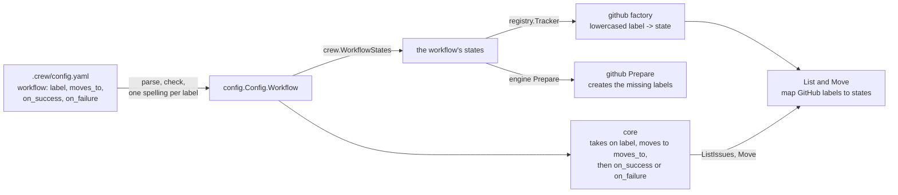

# Workflow Labels - Plan

## Goal Capsule

- **Objective:** The boss reads `.crew/config.yaml` and sees the exact labels each issue moves through, with no second table that maps names to labels.
- **Means:** the workflow writes GitHub label text directly. `tracker.labels` and crew's fixed set of eight states go away, and each stage names its own failure label. The tracker learns the workflow's labels when it is built (KTD3).
- **Product authority:** this Product Contract, within `STRATEGY.md`. Behavior for the reserved states (`paused`, `ready_to_merge`, `done`) is not active scope. The Planning Contract decides how; it never changes an R.
- **Stop conditions:** stop and report if a requirement turns out to need a new tracker capability beyond List, Move, ReportFailure and Prepare, or if the case rule of R5 cannot hold without crew comparing labels case-insensitively outside `internal/config` and the GitHub adapter.
- **Execution profile:** code change in one pull request: domain, config, core, port, GitHub adapter, fake, engine, app, renderers, docs and this repository's `.crew/config.yaml`.
- **Who finishes:** `ce-work` implements and verifies locally. The pull request is opened by the calling pipeline, and the boss merges it.
- **Open blockers:** none.

---

## Product Contract

### Summary

A stage's `label`, `moves_to`, `on_success` and a new required `on_failure` hold the label text as it appears on GitHub, such as `moves_to: in progress`. `tracker.labels` and the eight fixed states are removed. crew's labels are exactly the ones the workflow names.

### Problem Frame

Today the workflow names crew states (`in_progress`), and `tracker.labels` maps each of the eight states to a GitHub label (`in progress`). To know which label an issue gets, the boss has to read two places. Three of the eight states (`paused`, `ready_to_merge`, `done`) have no behavior: they only exist so the mapping is complete. Failure is the one destination outside the workflow, hardcoded to `needs_attention`.

### Key Decisions

- **The workflow writes label text, and crew has no fixed states.** The indirection added nothing the boss needed. A future tracker would have the workflow name its own statuses the same way. Governs R1, R3, R4. (session-settled: user-directed — chosen over keeping `tracker.labels` with the eight state keys: the mapping is not needed)
- **Each stage declares `on_failure`, and the key is required.** Every label crew touches is then written in the workflow, at the cost of one line per stage. Governs R2, R8. (session-settled: user-directed — chosen over a fixed `needs attention` label and over an optional `on_failure` defaulting to `needs attention`: no label should be hidden from the workflow)
- **crew's labels are the labels the workflow names.** A label no stage names is the boss's, not crew's. Governs R7. (session-settled: user-approved — consequence shown: an issue with `paused` and `ready` is now taken instead of skipped)
- **`on_failure` follows the rules of `on_success`.** It may be another stage's `label`, which allows a stage that picks up failures and also an automatic retry loop. Governs R6. (session-settled: user-approved — chosen over forbidding a stage's label as a failure destination)
- **Output shows label text.** Event lines and the live view show what the boss sees on GitHub (`ready -> in progress`). Governs R9. (session-settled: user-approved)

### Requirements

**Workflow**

- R1. Each stage's `label`, `moves_to`, `on_success` and `on_failure` hold label text exactly as it is written on the tracker, such as `in progress`.
- R2. `on_failure` is required on every stage: it is the label an issue moves to when any of the stage's actions failed, with crew's failure comment as today.
- R3. `tracker.labels` is no longer a key. A config that has it is refused like any unknown key, naming the key and its line, and crew exits with `2`.
- R4. Any non-empty label text is accepted. There is no list of valid states to match.

**Validation**

- R5. Label texts that differ only in case are the same label in every workflow check, because GitHub does not tell them apart. The current rules stay: two stages cannot take the same label, `moves_to` cannot be any stage's `label`, and `on_success` cannot be the stage's own `label`.
- R6. `on_failure` cannot be the stage's own `label`, and it may be any other stage's `label`.

**crew's labels on GitHub**

- R7. crew's labels are the labels any stage names in its four keys, and no others. An issue carrying two of them is skipped and reported. A move removes the other crew labels and leaves every other label alone.
- R8. At startup crew creates the workflow's labels that the repository lacks, each `on_failure` label included. It creates no label the workflow does not name, so `needs attention` is no longer created unless a stage names it.

**Output**

- R9. Event lines and the live view show labels as written in the workflow, such as `implement took #42 "Add login form" (ready -> in progress)`.

**Docs and crew's own config**

- R10. `docs/guide/crew.mdx`, `docs/develop/architecture.mdx` and this repository's `.crew/config.yaml` follow the new shape in the same pull request. The guide's "Limits" no longer says the `paused` state is reserved.

### Acceptance Examples

- AE1. **Covers R1, R2, R7.** **Given** a stage with `label: ready`, `moves_to: in progress`, `on_success: in review` and `on_failure: needs attention`, **when** issue #42 is labeled `ready`, **then** crew takes it and #42 carries `in progress` and none of the other three. If an action fails, #42 moves to `needs attention` and gets crew's failure comment.
- AE2. **Covers R2.** **Given** a stage without `on_failure`, **when** crew starts, **then** it exits with `2` and the message names the stage's `on_failure` key and the stage's line.
- AE3. **Covers R3.** **Given** a config that still has `tracker.labels`, **when** crew starts, **then** it exits with `2` and the message names `tracker.labels` and its line.
- AE4. **Covers R5.** **Given** two stages with `label: Ready` and `label: ready`, **when** crew starts, **then** it exits with `2` because both stages take the same label.
- AE5. **Covers R6.** **Given** stage `review` with `label: ready to review` and `on_failure: ready to review`, **when** crew starts, **then** it exits with `2`. **Given** instead `on_failure: ready`, the label of stage `implement`, **then** crew starts, and a failed review goes back to `implement`.
- AE6. **Covers R7.** **Given** no stage names `paused` and issue #7 carries `paused` and `ready`, **when** crew polls, **then** it takes #7, and after the move #7 carries `paused` and `in progress`.
- AE7. **Covers R8.** **Given** a repository with only `ready`, and a workflow naming `ready`, `in progress`, `in review` and `needs attention`, **when** crew starts, **then** it creates `in progress`, `in review` and `needs attention`, and nothing else.

### Scope Boundaries

- Behavior for `paused` (usage-limit pause), `ready_to_merge` and `done`. Each comes back as a label the workflow names when its feature is built.
- Migrating old configs. An old config fails at startup (R2, R3), and the boss rewrites it by hand.
- Per-stage label colors or descriptions on GitHub.

### Outstanding Questions

Both questions deferred to planning are answered in the Planning Contract:

- What the domain calls a workflow label once it is free text, and whether the tracker port keeps the word "state": KTD1.
- How a move from a label to the same label behaves, and whether the workflow checks refuse it: KTD5.

### Sources

- `internal/crew/state.go`: the eight states, `States()` and `Valid()`.
- `internal/adapter/github/config.go`: `tracker.labels`, its defaults and the case-insensitive duplicate check.
- `internal/config/validate.go`: `checkGraph` and `state`, the workflow rules R5 and R6 extend.
- `internal/core/update.go` (the failed-stage move) and `internal/engine/engine.go` (`workflowStates`): the two places `needs_attention` is fixed today.
- `internal/fake/tracker.go`: accepts and ignores a `labels` section.
- `docs/plans/2026-10-01-2202-feat-crew-engine-architecture-plan.md`: the decision "crew's states are the engine's vocabulary" and R15, which this plan replaces.

---

## Planning Contract

**Product Contract preservation:** Product Contract unchanged. Its two Deferred-to-Planning questions now point to KTD1 and KTD5.

### Key Technical Decisions

- KTD1. **The domain keeps `crew.State`, as free text.** A `State` becomes the text the workflow writes, which the tracker shows: a label's text on GitHub, a status on a future tracker. The eight constants, `States()` and `Valid()` go away, and the `Tracker` port keeps the word "state". Renaming the type to `Label` would touch every layer and every test for no change in behavior, and "label" is GitHub's word, not the port's. Governs R1, R4.
- KTD2. **One spelling per label: config rewrites later case variants to the first spelling in file order.** After parsing, `config` walks the stages in file order, over `label`, `moves_to`, `on_success` and `on_failure`, and gives every text that matches an earlier one apart from case that earlier spelling. The graph checks then compare exactly. The core, the engine and the renderers stay case-blind, and only `config` and the GitHub adapter know R5's rule. Rejected: refusing two spellings of one label. That adds a refusal the Product Contract did not ask for, and AE4 would get two errors for one mistake. Governs R5, R9.
- KTD3. **The tracker is built knowing the workflow's states.** `port.TrackerFactory` takes the workflow's states besides its `Decode`, and `registry.Registry.Tracker` passes them on. The GitHub adapter keeps them as its case-insensitive map from a label to the workflow's spelling, which `List` and `Move` need to know crew's labels (R7). Rejected: learning them in `Prepare`, which is an optional interface and would make `List` depend on an earlier call. Also rejected: passing them on every `List` and `Move`, which widens two methods for one constant fact. Governs R7.
- KTD4. **`crew.WorkflowStates(workflow)` is the one definition of crew's labels.** It returns every state any stage names in its four keys, stage by stage in file order (`label`, `moves_to`, `on_success`, `on_failure`), each once. The app passes it to the tracker factory, and the engine passes it to every `Preparer`. It replaces the engine's `workflowStates`, which added `needs_attention` and kept canonical order. Governs R7, R8.
- KTD5. **A move to the same state is allowed, and no new check refuses it.** A stage whose `on_success` or `on_failure` equals its own `moves_to` leaves the issue in `moves_to` when it ends. The failure comment is still posted on failure. Both trackers already make such a move a successful no-op: the GitHub adapter removes the other crew labels and adds a label the issue has, and the fake sets the state it has. Rejected: refusing it in the workflow checks, a rule R5 and R6 do not list. The guide states the behavior instead.
- KTD6. **Errors reuse the existing config shapes.** A stage without `on_failure` is `workflow[N].on_failure (line L): required`, with L the stage's own line, from the existing `required` helper (AE2). `tracker.labels` is refused by the strict decoder as `tracker.labels (line L): unknown key`, because the GitHub adapter's settings struct, and the fake's, no longer has the field (AE3). Governs R2, R3.
- KTD7. **The skipped-issue line says "crew labels".** `skipped #7: it carries 2 crew labels (ready, in review)`, in the guide's own words ("carries two crew labels"). Every other line already prints `From` and `To` as they are, so label text reaches the output with no renderer change. Governs R7, R9.

### High-Level Technical Design

Where the workflow's labels flow once `tracker.labels` is gone:

### Assumptions

- The first spelling of a label in file order is the one crew uses for it everywhere, including event lines (KTD2).
- A stage may move an issue to its own `moves_to` on success or failure (KTD5).
- The fake tracker refuses `tracker.labels` like the GitHub adapter, so a test config written for GitHub keeps running with the fake (R3).

### System-Wide Impact

- **Every config in use breaks on upgrade.** It has `tracker.labels`, and its stages lack `on_failure`. Both are refused at startup with exit code `2`, as the Product Contract chose (Scope Boundaries). This repository's `.crew/config.yaml` changes in the same pull request (R10).
- **Labels on GitHub.** crew no longer creates `needs attention`, `paused`, `ready to merge` or `done` unless the workflow names them. Labels crew created before stay on the repository, and crew ignores them unless a stage names them.
- **Port contract.** `port.TrackerFactory` changes signature (KTD3). Every factory, the registry and its tests change with it.

### Sources

- `internal/adapter/github/config.go`: the mapping to delete, and the case-insensitive lookup to keep (`labels.stateOf`).
- `internal/adapter/github/tracker.go`: `List`, `Move` and `Prepare` read `t.labels`.
- `internal/config/validate.go`: `parseStage`, `checkGraph`, `required` and `state`.
- `internal/core/update.go`: `judge`, the one place a failed issue moves to `crew.NeedsAttention`.
- `internal/engine/engine.go`: `prepare` and `workflowStates`.
- `internal/registry/registry.go`: the generic `build` over `func(port.Decode) (A, error)` that the tracker's new factory shape no longer fits.

---

## Implementation Units

### U1. Domain: free-text states, `on_failure`, the workflow's states

- **Goal:** `crew` describes a state as free text, a stage has `OnFailure`, and `crew.WorkflowStates` lists crew's labels.
- **Requirements:** R1, R2, R4, R7; KTD1, KTD4.
- **Dependencies:** none.
- **Files:** `internal/crew/state.go`, `internal/crew/workflow.go`, `internal/crew/state_test.go` (new).
- **Approach:**
  1. Rewrite `State`'s doc comment per KTD1. Keep the eight constants, `States()` and `Valid()` until U6 removes them, so the tree builds after this unit.
  2. Add `OnFailure State` to `Stage`, documented beside `OnSuccess`. Update `Stage`'s doc comment, which names `NeedsAttention`.
  3. Add `WorkflowStates(workflow []Stage) []State` per KTD4, returning a new slice.
  4. Update the package comment, which speaks of "the states an issue moves through" as a fixed set.
- **Patterns to follow:** `Issue.Clone` for fresh slices, and the doc-comment style of `internal/crew`.
- **Test scenarios:**
  - Two stages `ready -> in progress -> in review / needs attention` and `in review -> reviewing -> done / needs attention` give `ready, in progress, in review, needs attention, reviewing, done`, in that order with each state once.
  - A stage whose `on_failure` is another stage's `label` lists that label once.
  - An empty workflow gives an empty list.
- **Verification:** `go test -race ./internal/crew` passes.

### U2. Config: free-text keys, required `on_failure`, R5 and R6

- **Goal:** `config.Load` accepts any non-empty label text, requires `on_failure`, gives each label one spelling, and applies the case-blind graph rules.
- **Requirements:** R1, R2, R3, R4, R5, R6; KTD2, KTD5, KTD6. Covers AE2, AE3, AE4, AE5.
- **Dependencies:** U1.
- **Files:** `internal/config/validate.go`, `internal/config/config.go`, `internal/config/decode.go`, `internal/config/config_test.go`, `internal/config/testdata/draft/.crew/config.yaml`.
- **Approach:**
  1. Add `on_failure` to `stageDoc`, and parse it like `on_success`.
  2. Replace `state()` with `required()` plus a conversion: any non-empty text is a state (R4).
  3. Before `checkGraph`, give each label its first spelling in file order (KTD2), so `checkGraph` compares exactly.
  4. In `checkGraph`, refuse `on_failure` equal to the stage's own `label`, worded like the `on_success` rule (R6). Do not check `on_failure` against other stages' labels.
  5. Update the wording that names the eight states: the `parseStage` "must be a stage with ..." message (add `on_failure`), the "two stages cannot take the same state" message (say "label"), the `Config.Workflow` doc, the `config.go` comment on `tracker.labels`' defaults, and the `decode.go` doc example `tracker.labels.ready`.
  6. Rewrite the draft testdata config in the new shape: label text in the four keys, `on_failure: needs attention` on both stages, no `tracker.labels`.
- **Patterns to follow:** the existing `checkGraph` errors and `keyError`, and the table tests in `internal/config/config_test.go` that assert a message and a line.
- **Test scenarios:**
  - The draft config loads, with `MovesTo` `in progress` and `OnFailure` `needs attention` on its first stage.
  - Covers AE2. A stage without `on_failure` fails, and the error names `workflow[0].on_failure` and the stage's line.
  - Covers AE3. A config with `tracker.labels` fails, and the error names `tracker.labels` and its line. This needs a tracker factory that decodes, so assert it in U4's app or registry tests if `config.Load` alone does not decode the tracker section.
  - Covers AE4. Two stages with `label: Ready` and `label: ready` fail once, with the "two stages take the same label" error on the second stage's `label` line.
  - Covers AE5. `label: ready to review` with `on_failure: ready to review` fails on the `on_failure` line. With `on_failure: ready`, the label of another stage, the config loads.
  - `on_failure: Ready to Review` against `label: ready to review` fails the same way: the rule compares case-blind.
  - `moves_to: In Progress` in one stage and `on_success: in progress` in another load, and both stages hold `In Progress` (KTD2).
  - `moves_to: Ready` where another stage's label is `ready` fails, as the existing `moves_to` rule does for exact text.
  - `on_failure` equal to the stage's own `moves_to` loads (KTD5).
  - A label with spaces and capitals, such as `Needs Attention`, loads unchanged (R4).
  - An empty `on_failure: ""` fails as required, as an empty `on_success` does today.
- **Verification:** `go test -race ./internal/config` passes. No test or message in `internal/config` names one of the eight states as a rule.

### U3. Core: failed stages move to `on_failure`

- **Goal:** A stage with a failed action moves its issue to the stage's `on_failure`, with the failure report as today.
- **Requirements:** R2; covers AE1's failure path and AE5's retry loop.
- **Dependencies:** U1.
- **Files:** `internal/core/update.go`, `internal/core/update_test.go`, and the hand-built workflows in `internal/engine/engine_test.go`, which need an `OnFailure` once the core moves to it.
- **Approach:** In `judge`, move to `stage.OnFailure` in place of `crew.NeedsAttention`, and update its doc comment and the `taken` comment that says "needs attention". Nothing else in the core names a state. Give the test workflow an `OnFailure` on every stage.
- **Patterns to follow:** the existing `judge` table tests in `internal/core/update_test.go`.
- **Test scenarios:**
  - Covers AE1. A stage with `OnFailure: needs attention` whose action fails emits `Move{From: in progress, To: needs attention}` and a `ReportFailure`.
  - Two stages with different `OnFailure` values each move a failed issue to their own.
  - Covers AE5. A `review` stage whose `OnFailure` is `implement`'s label moves a failed issue to `ready`. On the next listing, `implement` takes it.
  - An action stopped by a stop request moves its issue to `OnFailure` with the reason `crew stopped`.
- **Verification:** `go test -race ./internal/core` passes, and `update.go` no longer references `crew.NeedsAttention`.

### U4. Tracker port, registry, GitHub adapter and fake take the workflow's states

- **Goal:** The tracker is built with the workflow's states, the GitHub adapter maps labels to them with no `tracker.labels`, and the app wires it.
- **Requirements:** R3, R7, R8; KTD3, KTD4, KTD6. Covers AE1, AE3, AE6, AE7.
- **Dependencies:** U1, U2.
- **Files:**
  - `internal/port/factory.go`, `internal/port/port.go`, `internal/port/port_test.go`
  - `internal/registry/registry.go`, `internal/registry/registry_test.go`
  - `internal/adapter/github/config.go`, `internal/adapter/github/tracker.go`, `internal/adapter/github/tracker_test.go`
  - `internal/fake/tracker.go`, `internal/fake/fake_test.go`
  - `internal/app/app.go`, `internal/app/app_test.go`
  - `internal/engine/engine.go`, `internal/engine/engine_test.go`
- **Approach:**
  1. Change `port.TrackerFactory` to take the workflow's states after `Decode` (KTD3). Rewrite the `Tracker` and `Preparer` doc comments, which speak of "crew's eight states", per KTD1.
  2. In `registry`, give `Tracker` a `states []crew.State` parameter. Adapt `build` so the tracker path still names `tracker.name`, the registered trackers, and wraps factory errors with the adapter's name.
  3. In the GitHub adapter, `settings` becomes an empty struct, still decoded, so `labels` is an unknown key (KTD6). `decodeLabels` becomes a builder over the states, keyed by the lowercased text. `List` sends each state's text as a label filter, and maps each issue label to its state case-insensitively. `Move` and `Prepare` use the state's text as the label name. Rewrite the package and `Factory` doc comments.
  4. The fake's `TrackerSettings` loses `Labels`, and `TrackerFactory` takes and ignores the states.
  5. In `app`, pass `crew.WorkflowStates(cfg.Workflow)` to `Registry.Tracker`. In `engine`, `prepare` passes `crew.WorkflowStates` to `port.Prepare`. Delete `workflowStates`.
- **Patterns to follow:** the scripted `gh` runner tests in `internal/adapter/github/tracker_test.go`, and the registry's existing error tests.
- **Test scenarios:**
  - Covers AE1. A Move of #42 from `ready` to `in progress`, whose labels are `ready` and `bug`, edits with `--remove-label=ready --add-label=in progress` and leaves `bug`.
  - Covers AE6. With no stage naming `paused`, List maps an issue labeled `paused` and `ready` to the one state `ready`. Its Move to `in progress` does not remove `paused`.
  - An issue labeled `Ready` on GitHub is listed in the state `ready`, the workflow's spelling.
  - An issue labeled `ready` and `needs attention`, both named by the workflow, is listed in both states.
  - List's GraphQL arguments carry `labels[]=` the take states' text, such as `labels[]=ready to review`.
  - Covers AE7. Prepare on a repository with only `ready`, for the states `ready, in progress, in review, needs attention`, runs `gh label create` for the other three and for nothing else.
  - Prepare on a repository with `In Progress` does not create `in progress`.
  - Covers AE3. `tracker.labels` in a GitHub config is refused through the factory as `tracker.labels (line L): unknown key`. The same holds for the fake factory.
  - A Move to a missing label is still `ErrRefused`.
  - The registry passes the states it gets to the factory, and still names `tracker.name` for an unknown tracker.
  - The engine prepares every adapter with `crew.WorkflowStates` of its workflow, `needs attention` only when a stage names it.
  - The app starts with a config in the new shape and exits `2` for one with `tracker.labels`.
- **Verification:** `go test -race ./internal/port ./internal/registry ./internal/adapter/github ./internal/fake ./internal/engine ./internal/app` passes. `go run github.com/golangci/golangci-lint/v2/cmd/golangci-lint@v2.14.0 run` reports no depguard violation: `port` still imports no `core`, `engine`, `config`, adapter or UI package.

### U5. Renderers show label text

- **Goal:** Event lines and the live view show the workflow's label text, and the skipped line speaks of crew labels.
- **Requirements:** R9; KTD7.
- **Dependencies:** U1.
- **Files:** `internal/ui/lines/lines.go`, `internal/ui/lines/lines_test.go`, `internal/ui/tui/model_test.go`, `internal/ui/tui/testdata/running.golden`.
- **Approach:** Change the `IssueSkipped` text per KTD7. Change the fixtures from the state keys to label text, and rewrite the golden file with `-update`.
- **Patterns to follow:** the table of events in `internal/ui/lines/lines_test.go`.
- **Test scenarios:**
  - `IssueTaken` from `ready` to `in progress` reads `implement took #42 "Add login form" (ready -> in progress)`.
  - `IssueMoved` reads `#42 moved from ready to in progress`.
  - `IssueSkipped` with `ready` and `in review` reads `skipped #7: it carries 2 crew labels (ready, in review)`.
  - `CallOwed` for a move reads `moving #42 from in progress to needs attention failed, ...`.
  - The golden live view shows `(ready -> in progress)`.
- **Verification:** `go test -race ./internal/ui/...` passes, and the golden diff only changes state keys to label text.

### U6. Remove the eight states, update docs and crew's own config

- **Goal:** No code names the eight states, and the docs and `.crew/config.yaml` show the new shape.
- **Requirements:** R1, R2, R3, R8, R10.
- **Dependencies:** U2, U3, U4, U5.
- **Files:**
  - `internal/crew/state.go`
  - every remaining test that uses a constant: `internal/adapter/claude/harness_test.go`, `internal/engine/engine_test.go`, `internal/app/app_test.go`, `internal/fake/fake_test.go`, `internal/port/port_test.go`, `internal/core/update_test.go`, `internal/ui/tui/model_test.go`, `internal/ui/lines/lines_test.go`, `internal/adapter/github/tracker_test.go`
  - `.crew/config.yaml`, `docs/guide/crew.mdx`, `docs/develop/architecture.mdx`
- **Approach:**
  1. Delete the eight constants, `States()` and `Valid()`. Tests use label text, through test-local constants where a file repeats them.
  2. In `.crew/config.yaml`, drop `tracker.labels`, and give the `implement` stage `moves_to: in progress`, `on_success: in review` and `on_failure: needs attention`.
  3. In `docs/guide/crew.mdx`:
     - the example config and the paragraph after it
     - remove the `tracker.labels.STATE` row, and add `on_failure` to the stage table
     - replace the "Every state is one of the eight keys" paragraph with R1, R4 and R5's rules, and add KTD5's same-label behavior
     - the startup checks: no "a state is not one of the eight", the rules now cover `on_failure`, and only the workflow's labels are created (R8)
     - the polling steps: R7's definition of crew's labels and AE6's case, failure moves to `on_failure`, and retry by swapping the `on_failure` label for the stage's `label`
     - the event-line examples in label text
     - the stop section: stopped sessions move to their stage's `on_failure`
     - Limits: no "the `paused` state is reserved for it" (R10)
  4. In `docs/develop/architecture.mdx`, rewrite the `internal/crew` row, the `Tracker` and `Preparer` port lines, and the new-tracker paragraph per KTD1 and KTD3.
- **Patterns to follow:** the guide's existing tables and the AGENTS.md MDX rule: `{` and `<` outside code go in backticks.
- **Test expectation:** none beyond the suites. Removing the constants is proven by the build, and the docs by `pnpm docs:check`.
- **Verification:**
  - `go build ./...` passes, and `grep` finds no `crew.Ready`, `crew.NeedsAttention`, `States()` or `Valid()` in `internal` or `cmd`.
  - `pnpm docs:check` passes.
  - `go run ./cmd/crew` loads this repository's `.crew/config.yaml` past the config check.

---

## Verification Contract

| Gate | Command | Proves |
|---|---|---|
| Tests | `go test -race ./...` | every unit's scenarios, AE1 to AE7 |
| Format | `gofmt -l cmd internal` prints nothing | formatting |
| Vet | `go vet ./...` | static checks |
| Lint and layering | `go run github.com/golangci/golangci-lint/v2/cmd/golangci-lint@v2.14.0 run` | depguard: `port` imports no `core`, `engine`, `config`, adapter or UI package, and adapters import no `config` outside tests |
| Vulnerabilities | `go run golang.org/x/vuln/cmd/govulncheck@v1.8.0 ./...` | no new findings |
| Docs | `pnpm install` once, then `pnpm docs:check` | the guide and architecture pages' links and MDX |
| Golden | `go test ./internal/ui/tui -update`, then review the diff | the live view shows label text |

---

## Definition of Done

- Every R1 to R10 holds, and AE1 to AE7 each have a passing test that names them.
- Every gate in the Verification Contract passes.
- No code, test, doc or message refers to the eight states or `tracker.labels` as current behavior. The plans under `docs/plans/` are history and stay as they are.
- This repository's `.crew/config.yaml` uses the new shape and loads.
- Code from abandoned approaches is removed from the diff.
