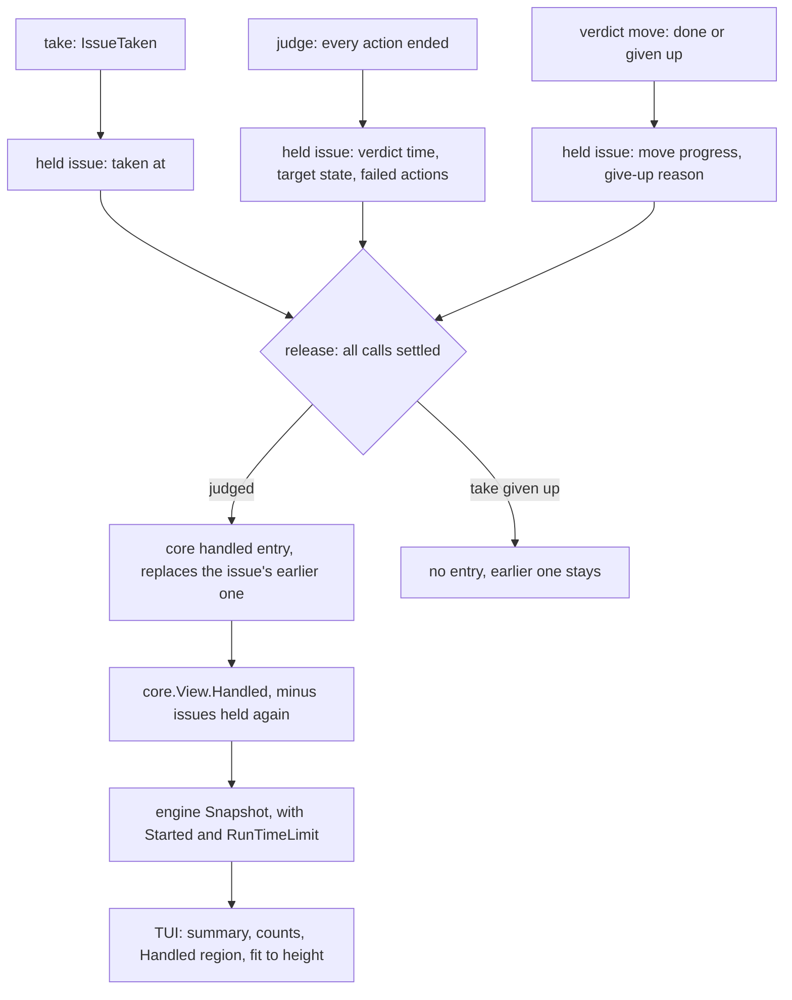

# Live View Handled History - Plan

## Goal Capsule

- **Objective:** The boss comes back to a crew that ran for hours and, from the live view alone, knows which issues crew finished this run, which of them need them and why, how long crew has been up and how much run time is left. They open only the issues that need them.
- **Means:** the core keeps one handled entry per issue in its `View`, which every engine snapshot already carries (KTD1, KTD2). The engine adds the run's start and limit to the snapshot (KTD4). The TUI renders a summary and a Handled region and fits them to the window's height (KTD5, KTD6).
- **Product authority:** this Product Contract, within `STRATEGY.md` and the engine's architecture plan (`docs/plans/2026-10-01-2202-feat-crew-engine-architecture-plan.md`). It covers #23, one part of the epic #16. Cost, token usage and pull requests (#24), scrolling and selecting an issue (#25), and `--plain` output (#26) are not active scope.
- **Stop conditions:** stop and report if the record cannot be kept without the core reading a clock or doing I/O.
- **Execution profile:** Standard. Five units in dependency order, one pull request that closes #23.
- **Open blockers:** none.
- **Product Contract preservation:** Product Contract unchanged. Its two questions deferred to planning are answered by KTD1: where the record lives (in the core's view, not beside `Recent` in the engine's snapshot), and how crew tells a given-up verdict move from a given-up take move or failure report, when `CallDropped` fires for all three (the core knows which call it dropped). The origin file lives on the unmerged PR #28; issue #23 carries the same contract.

---

## Product Contract

### Summary

The live view gets a summary at the top: uptime, the time left when a run limit is set, and how many issues crew finished, counted by the state each went to. A new **Handled** region lists each issue crew finished this run on one line, with failures first and each failed action's reason under its issue. The view fits the window height: Recent events gives up its rows before Handled does.

### Problem Frame

The live view shows only the present (`internal/ui/tui/view.go`). Once a stage's verdict is in, the issue leaves the issues crew holds, and so the view's Issues and Actions regions. Recent events keeps the last 20 events (`recentEvents`, `internal/engine/stream.go`), so after 20 more events nothing on screen says the issue was ever handled.

Today the boss opens each issue on GitHub and reads its status comment (#7). That works for one issue. After hours away, they first have to know which issues to open, and nothing on screen points to a failure. Issue #9 went to `in review` without a pull request (#13), and the view never showed it.

### Key Decisions

- **Handled is an index, not a full record.** One line per issue, plus each failed action's reason; the status comment on GitHub keeps the detail. Governs R9, R10. (session-settled: user-directed — chosen over full per-action detail with label moves and log paths, and over an index with the reason cut into the issue's line, after seeing all three on screen: the view's job is to say which issues to open)
- **One entry per issue, holding its latest stage.** Counts are counts of issues. Governs R2, R3. (session-settled: user-directed — chosen over one line per stage run: an append-only log would list an issue twice and mix issues with stage runs in the counts)
- **The history covers this run only.** The status comments on GitHub are the record across runs. Governs R4. (session-settled: user-directed — chosen over writing the history under `.crew/` and reloading it on start, which needs retention and pruning rules)
- **Handled keeps its rows before Recent events does.** The boss comes back for what happened, and Recent events is the live feed. Governs R13, R14. (session-settled: user-directed — chosen over keeping 3 lines of Recent events, and over cutting the screen at the bottom, which can hide a failure when many issues are held)
- **Needing attention follows the stage's outcome, not a label's name.** Each stage names its own `on_failure` state, and crew's own workflow uses `crew:failed`, not `needs attention`. Governs R6, R8. (session-settled: user-directed — chosen over keying on the `needs attention` label: labels are configurable per stage)
- **A verdict move crew gave up on needs attention too.** The issue did not end up where crew meant it to. Governs R6, R10. (session-settled: user-approved — chosen over counting only failed stages: a given-up move also leaves the issue somewhere crew did not mean)
- **An issue's time is its last stage's, from the take to the verdict.** Governs R1. (session-settled: user-approved — chosen over adding up every stage's time: the line describes the last stage)
- **The engine keeps the record, not the TUI.** The TUI's subscription is latest-wins and drops the events of updates it skipped, and #25 and #26 need the same record. Governs R5.

### Requirements

**The record**

- R1. For each issue whose stage ended this run, crew records: the issue's ref and title, the stage, the state the issue was moved to, whether the stage failed, the stage's duration from the take to the verdict, and each failed action's name and reason.
- R2. The record holds one entry per issue. When another stage ends for the same issue, that stage's entry replaces the earlier one.
- R3. While a stage holds an issue again, the issue shows under Issues and not under Handled. It returns to Handled when that stage ends.
- R4. The record lasts for the run: it is empty when crew starts, and nothing of it is written to disk.
- R5. The live view always shows the whole record, including entries whose events arrived in updates the view skipped.

**Needing attention**

- R6. An entry needs attention when its stage failed, so the issue went to that stage's `on_failure` state, or when crew gave up the stage's verdict move (the issue was closed or moved meanwhile, or the tracker refused).

**The summary**

- R7. The view's top line also shows the uptime since crew started and, when a run time limit is set, the time left. Without a limit it shows no time left. Once time is up, it keeps today's winding-down wording.
- R8. A second line counts the entries: the total, then one count per state the issues went to, named as the workflow names them (for crew's own workflow, `crew:waiting review` and `crew:failed`). Given-up verdict moves get their own count.

**The Handled region**

- R9. A Handled region sits between Actions and Recent events. Each entry takes one line: the state the issue went to, the issue's ref and title, the stage and its duration.
- R10. An entry that needs attention adds one line per failed action, with the action's name and reason. A given-up verdict move adds one line with the reason crew gave it up.
- R11. Entries that need attention come first, then the rest; within each group, the most recently ended comes first.
- R12. With no entry, Handled shows `none`, like the other regions.

**Fitting the window**

- R13. The view fits the window's height. When rows run out, Recent events gives up its rows first. Then the oldest entries that do not need attention collapse, one line per state, such as `… and 3 more in crew:waiting review`.
- R14. Entries that need attention, and their reason lines, never collapse. When even they do not fit, the view is cut at the bottom with a line saying how many lines were cut.
- R15. Every line is still cut to the window's width, as today.

**Docs**

- R16. The live view's description in `docs/guide/crew.mdx` is updated to cover the summary and Handled.

An example at 80 columns and 24 rows, for crew's own workflow (illustrative, not a layout commitment):

```text
crew: 2 issues held, up 3h12m, 48m left (q or ctrl+c stops)
handled 10: 8 crew:waiting review, 2 crew:failed

Issues
  development
    running   #31 Add retry to the poller
  fix
    taking    #32 Rename the status kinds

Actions
  #31 development/lfg  running 12m03s
  #32 fix/lfg          waiting

Handled
  crew:failed          #28 Parse the config once      development 41m10s
    lfg failed: exited 1: "tests fail on Go 1.27"
  crew:failed          #27 Drop the old --dry flag    fix 0m02s
    lfg failed: prompt did not render: no field "Body"
  crew:waiting review  #36 Log the poll interval      development 8m12s
  crew:waiting review  #35 Trim the README            knowledge base 4m40s
  crew:waiting review  #34 Show the uptime            development 22m48s
  crew:waiting review  #33 Add a --version flag       development 9m15s
  crew:waiting review  #30 Plain summary              development 18m40s
  … and 3 more in crew:waiting review
```

### Acceptance Examples

- AE1. **Covers R2, R3.** **Given** #30's `development` stage ended in `crew:waiting review`, **when** another stage takes #30, **then** #30 leaves Handled and shows under Issues; **when** that stage ends in `crew:failed`, **then** #30's single Handled entry shows `crew:failed`, that stage, its duration and its failed actions.
- AE2. **Covers R6, R10.** **Given** a stage with actions `code` and `tests`, where `tests` failed, **when** the stage ends, **then** the issue's entry needs attention and shows one reason line, for `tests` only.
- AE3. **Covers R6, R8, R10.** **Given** a stage succeeded, **when** the issue is closed before crew moves it and crew gives the move up, **then** the entry needs attention, shows the reason crew gave the move up, and is counted as a given-up move, not under the stage's `on_success` state.
- AE4. **Covers R13, R14.** **Given** a 24-row window, 2 held issues and 10 entries, 2 of them failed, **when** the view renders, **then** Recent events shows no rows, both failed entries show with their reason lines, and the successes that do not fit collapse into one line per state.
- AE5. **Covers R7.** **Given** no run time limit, **when** the view renders, **then** the top line shows the uptime and no time left.
- AE6. **Covers R4.** **Given** crew handled 6 issues and was stopped, **when** it starts again, **then** Handled shows `none` and the counts line shows no entries.

### Scope Boundaries

- No change to the status comment, the failure report, or `--plain` output.
- No cost, token usage or pull request in Handled (#24).
- No scrolling, selection or detail view (#25).
- No record across restarts, and nothing printed when the live view exits.
- Considered and not built: a cap on the number of entries. One entry per issue bounds the record by the issues crew finishes in one run, and the snapshot copies it once per step; a run handling thousands of issues would change the call.

<!-- ce-section: work-relationships -->
### How This Work Fits Together

This plan covers #23, the record and the summary. The rest of the epic #16 is the current breakdown, not a committed roadmap:

- #24, cost, token usage and pull requests: can proceed independently of this plan. Its data would add to Handled's entries. It shares the pull request check with #14's outcome verification.
- #25, scrolling and selecting an issue: depends on this plan's record. It would lift the collapse in R13.
- #26, `--plain` output: depends on this plan's record. Still to decide: whether it prints a summary when the run ends.

### Dependencies / Assumptions

- The engine records no start time today: the run limit is counted by a timer started at the first poll (`internal/engine/engine.go`). The run limit reaches the view only as the `TimeUp` flag, and its value only in the `WindingDown` event after it has passed. R7 needs both published (KTD4).
- The view ignores the window's height today; it stores only the width (`internal/ui/tui/model.go`). R13 and R14 need the height (KTD6).
- An issue leaves the core's view only after all its calls settle, including a failed stage's failure report, so an entry may appear in Handled a little after the stage ended.
- The domain events already carry what R1 needs: the take with the issue's title and stage, each action's end with its outcome and reason, and the moves with their states (`internal/core/event.go`).

### Sources

- Issue #16 (epic) and #23; #7 (status comment); #13 and #14 (the #9 failure).
- `internal/ui/tui/view.go`, `internal/ui/tui/model.go`: today's regions and window handling.
- `internal/engine/stream.go`, `internal/engine/engine.go`: `Snapshot`, `recentEvents`, `SubscribeLatest`, the run limit timer.
- `internal/core/event.go`, `internal/core/update.go`: the events and when an issue is released.
- `.crew/config.yaml`: crew's own workflow and its `on_success` and `on_failure` labels.

---

## Planning Contract

### Key Technical Decisions

- KTD1. **The record lives in the core's `View`, as `View.Handled`.** The core already tells a verdict move from a take move and a failure report (`call.take`, `call.kind` in `internal/core/update.go`), so telling a given-up verdict move from a given-up take or report, which `CallDropped` alone cannot answer, never reaches the TUI. Every engine snapshot embeds `core.View`, so the latest-wins TUI always holds the whole record (R5), and the record lives exactly as long as the `core.Model`, one per run (R4). This instantiates the Key Decision "The engine keeps the record, not the TUI": the engine owns the core and publishes the record, and the TUI only reads it. Keeping it beside `Recent` in the engine would mean rebuilding verdicts from events and facing that ambiguity.
- KTD2. **One entry per issue key, written when the issue is released after a verdict.** A held issue remembers its take time, its verdict (the time all actions ended, the target state, the failed actions) and how its verdict move ended. When `release` forgets an issue that was judged, the core writes its entry, replacing any earlier entry for the same key (R2). An issue released without a verdict, because its take was given up, writes nothing, so its earlier entry stays. `View` omits the entry of an issue the core holds again (R3). The entry is a deep copy, so the view still shares no memory with the model.
- KTD3. **Needing attention is a method on the entry: a failed action, or a verdict move given up.** The entry carries the failed actions (name and reason, as in `crew.ActionFailure`) and the verdict move's progress as a `crew.MoveProgress` (`MoveDone` or `MoveDropped`) with the give-up reason. A dropped failure report changes nothing, since the move landed. Renderers and the later #25/#26 call one method instead of repeating the rule (R6).
- KTD4. **The engine publishes the run's start and limit in the `Snapshot`.** `Snapshot` gains the time of the first poll, the moment the run-limit timer starts, and the configured run time limit. Uptime and time left are then both computed from one start, so they always add up to the limit. The core stays clock-free; before the first poll the start is zero and the TUI shows no uptime.
- KTD5. **The TUI derives the summary and the Handled lines from the snapshot alone.** Counts go per target state, with given-up moves counted on their own (R8). The given-up count comes first, then the states of entries that need attention, then the rest, each group by highest count then by name, so a narrow window cuts the counts of successes before those of failures. Ordering per R11 sorts on the verdict time, newest first. Reasons are flattened to one line (runs of whitespace, newlines included, become one space) before they are drawn, so each reason takes exactly the one row the fitting counts. Durations use the existing `elapsed` format, and uptime and time left a shorter hours-and-minutes form.
- KTD6. **Fitting is a pure function of the built regions and the window's height.** The model keeps the height from `tea.WindowSizeMsg`; a height of zero, before the first size message, means no limit. The view builds Issues, Actions and Handled first, gives Recent events only the rows left, then collapses the oldest entries that need no attention, then cuts at the bottom (R13, R14). Keeping it a function of lines in and lines out makes it table-testable without Bubble Tea.

### High-Level Technical Design

Where each part of the record comes from and who reads it:



How the view spends the window's rows (directional):

```text
fixed   = top line, counts line, Issues, Actions, Handled header, attention entries and reason lines
rest    = non-attention entries, newest first
recent  = Recent events header and rows

if no height: render everything
rows left after fixed + all of rest  -> Recent events gets them (header only when at least one row fits; otherwise the region is left out)
else collapse the oldest k of rest, smallest k that fits, adding one "… and N more in <state>" line per collapsed state
if even k = all of rest does not fit -> keep the first height-1 lines, then "… N lines cut"
```

### Assumptions

- The Handled line reads state, ref, stage and duration, then title, so a narrow window cuts the title first, as the Issues lines do today, and never the ref the boss needs to open the issue. The contract's example is illustrative and puts the title in the middle.
- A given-up entry shows `move given up` where the state would be, and its reason line reads `move to <state> given up: <reason>`. This holds for a failed stage too: it counts as given up, not under its on_failure state, and shows its failed actions' reason lines first, then the give-up line.
- A failed action's reason line reads `<action> failed: <reason>`.
- The duration ends at the verdict, the moment every action of the stage ended, not when the move landed: an owed move can take hours and is not the stage's work.
- When Recent events has no row left, its blank line and header go too. AE4's "shows no rows" is read this way.
- The winding-down top line keeps today's words and adds the uptime, and drops the time left.
- The cut line reads `… N lines cut`.

### Sequencing

U2 (engine snapshot) follows U1 (core record), since its integration test reads the record. U3 (summary and Handled in the TUI) needs both. U4 (fitting) builds on U3's regions. U5 (docs) comes last, once the wording is final.

---

## Implementation Units

### U1. Keep the handled record in the core

- **Goal:** `core.View` carries one entry per issue whose stage ended this run, with what R1 lists and whether it needs attention.
- **Requirements:** R1, R2, R3, R4, R6; KTD1, KTD2, KTD3.
- **Dependencies:** none.
- **Files:**
  - `internal/core/model.go` (new `HandledView` type and `View.Handled`, the model's record, held-issue fields)
  - `internal/core/update.go` (take time at `take`, verdict at `judge`, move result at the verdict move's done and dropped paths, entry at release)
  - `internal/core/update_test.go`
- **Approach:**
  1. Add to `heldIssue` the take time, the verdict time, the verdict's target state, the failed actions and the verdict move's progress with its give-up reason. `judge` already builds the failed actions for the report; reuse that list.
  2. Set the move result where `callResult` handles a done verdict move and where `dropped` handles a dropped one (`c.kind == CallMove && !c.take`).
  3. When `callResult` releases an issue with a verdict, write the entry into the model's record, keyed by issue key, replacing an earlier entry.
  4. `View` copies the entries, skipping keys the core holds, and clones each entry's issue and failures.
  5. Add a `NeedsAttention` method on the entry (KTD3) and keep the duration computable from the entry's two times.
- **Patterns to follow:** `View` and `describe` in `internal/core/model.go` for deep copies; `ended` and `status` in `internal/core/status.go` for where the verdict is already known; the `driver` helpers in `internal/core/update_test.go`.
- **Test scenarios:**
  - A stage whose actions all succeed, taken at minute 0 and judged at minute 8, writes one entry once the verdict move is done: on_success state, stage name, ref and title, no failures, an 8-minute duration, no attention.
  - Covers AE2. A stage with `code` succeeded and `tests` failed writes an entry with one failure, for `tests`, that needs attention; the entry appears only after the failure report settles too.
  - Covers AE3. A successful stage whose verdict move returns moved-meanwhile writes an entry with the move given up, its reason, and needing attention.
  - A failed stage whose failure report is refused but whose move landed writes an entry needing attention for its failure, with the move done.
  - A failed stage whose move to on_failure is refused writes an entry with both its failures and the move given up.
  - Covers AE1. An issue with an entry is taken again: `View.Handled` no longer lists it while it is held; when the new stage ends failed, there is still a single entry for it, holding the new stage, state, duration and failures.
  - An issue with an entry is taken again and the take is refused: the earlier entry shows again.
  - A take given up on an issue never handled writes no entry.
  - A verdict move that is owed, then retried and done at a later tick, writes the entry at that tick, its duration still ending at the verdict.
  - An action ended by a stop (`crew stopped`) produces a failed entry like any failure.
  - Covers AE6. A new model's `View.Handled` is empty.
  - Changing a returned view's entry (its failures slice) does not change the next view.
- **Verification:** the core tests pass under `-race`; the core still imports only `crew` and reads no clock.

### U2. Publish the run's start and limit in the snapshot

- **Goal:** every snapshot says when the run's clock started and what the run time limit is.
- **Requirements:** R7; KTD4.
- **Dependencies:** U1.
- **Files:**
  - `internal/engine/stream.go` (`Snapshot` fields)
  - `internal/engine/engine.go` (record the start just before the first poll, put both in each snapshot)
  - `internal/engine/engine_test.go`
- **Approach:** the loop records the start where it starts the run-limit timer, before the first `step`, and `step` copies the start and `cfg.RunTimeLimit` into every `Snapshot`. Update the `Snapshot` doc comment.
- **Patterns to follow:** `TestTheRunTimeLimitCountsFromTheFirstPollAndStopsAnIdleEngine` under `testing/synctest` for asserting times on a fake clock.
- **Test scenarios:**
  - With a 1-hour limit, the first update's snapshot carries the first poll's time as start and the 1-hour limit, and a later update carries the same start.
  - Without a limit, the snapshot's limit is zero and the start is still set.
  - Integration: an engine run with the fake tracker and a scripted harness that fails one action ends with a final snapshot whose handled record lists that issue as needing attention, with the failed action's reason (R5 through the real loop).
- **Verification:** engine tests pass under `-race` and `synctest`.

### U3. Render the summary and the Handled region

- **Goal:** the live view shows uptime and time left on the top line, the counts line, and the Handled region between Actions and Recent events.
- **Requirements:** R7, R8, R9, R10, R11, R12, R15; KTD5.
- **Dependencies:** U1, U2.
- **Files:**
  - `internal/ui/tui/view.go`
  - `internal/ui/tui/model_test.go`
  - `internal/ui/tui/testdata/running.golden`, `internal/ui/tui/testdata/winding-down.golden` (rewritten)
  - `internal/ui/tui/testdata/handled.golden` (new)
- **Approach:**
  1. Top line: add `up <uptime>` after the held count, and `<left> left` when the snapshot has a limit and time is not up; leave the stopping lines as they are. Omit the uptime while the start is zero.
  2. Counts line under it: `handled <total>: <count> <state>, …, <n> move(s) given up`; with no entry, `handled 0`.
  3. Handled region per R9 to R12 and the Assumptions' line shapes, with state and stage-and-duration columns padded like the Actions region.
  4. Keep `fit` on every line (R15).
- **Patterns to follow:** the Actions region's padding in `view.go`; `lines.Plural` for `move`/`moves`; the golden-file helper in `model_test.go`.
- **Test scenarios:**
  - Golden: a snapshot with a 1-hour limit started 12 minutes ago, two held issues and four entries (one failed with two failed actions, one given-up move, two successes in different states) renders the summary, counts and Handled in R11's order.
  - Covers AE5. Without a limit, the top line shows `up 12m` and no `left`.
  - With time up, the top line keeps the winding-down words and shows no time left.
  - Covers AE3. The given-up entry is counted under `1 move given up`, not under its stage's on_success state, and shows its reason line.
  - A failed stage whose move was given up shows `move given up`, its failed action's reason line, then the give-up line, and counts as given up.
  - In a window narrower than the counts line, the given-up and failure counts still show; the success counts are cut.
  - Covers AE6. A snapshot with no entries shows `handled 0` and `none` under Handled.
  - Before the first update (zero start), the top line shows no uptime.
  - A tick a minute later advances the uptime and lowers the time left.
- **Verification:** golden files rewritten with `-update` and their diff reviewed; tests pass.

### U4. Fit the view to the window's height

- **Goal:** the view never exceeds the window's height, giving up Recent events first, then collapsing old entries that need no attention, then cutting at the bottom.
- **Requirements:** R13, R14, R15; KTD6.
- **Dependencies:** U3.
- **Files:**
  - `internal/ui/tui/model.go` (keep the height)
  - `internal/ui/tui/view.go` (fitting)
  - `internal/ui/tui/model_test.go`
  - `internal/ui/tui/testdata/fit-24-rows.golden` (new)
- **Approach:** build the regions as line lists, then apply the High-Level Technical Design's row budget. Collapsed entries add one `… and N more in <state>` line per state, in the order of each state's newest collapsed entry. Recent events, when trimmed, keeps its newest rows.
- **Patterns to follow:** `fit` and `byStage` as small pure helpers in `view.go`.
- **Test scenarios:**
  - Covers AE4. Golden at 80×24: two held issues and ten entries, two failed: Recent events is gone, both failed entries and their reason lines show, five successes show and three collapse into `… and 3 more in crew:waiting review`, and the view has 24 lines.
  - Successes in two states collapse into two summary lines.
  - A window tall enough for everything shows every entry and as many recent events as fit, newest kept.
  - A window too short for the entries that need attention ends in `… N lines cut` and is exactly the window's height.
  - A height of zero renders everything, as before any size message.
  - A narrow and short window still renders without panicking, every line within the width.
  - A failed action whose reason holds newlines shows it on one line, and the view still fits the height.
- **Verification:** for every test snapshot, the rendered line count is at most the height and no line is wider than the width.

### U5. Describe the summary and Handled in the docs

- **Goal:** the guide and the architecture page describe what the live view now shows and where the record comes from.
- **Requirements:** R16.
- **Dependencies:** U3, U4.
- **Files:**
  - `docs/guide/crew.mdx` (the live view paragraph under "Run it")
  - `docs/develop/architecture.mdx` (the update stream: the snapshot's handled record, start and limit)
- **Approach:** describe the summary, the counts line, the Handled region with what needs attention, that it lasts for the run, and the order in which rows give way. Keep `{` and `<` out of MDX prose.
- **Test expectation:** none -- documentation only; `pnpm docs:check` covers links and MDX.
- **Verification:** `pnpm docs:check` passes.

---

## Verification Contract

| Gate | Command | Proves |
| --- | --- | --- |
| Tests | `go test -race ./...` | U1 to U4, including goldens and the engine loop under `synctest` |
| Format | `gofmt -l cmd internal` prints nothing | formatting |
| Vet | `go vet ./...` | vet |
| Lint and layering | `go run github.com/golangci/golangci-lint/v2/cmd/golangci-lint@v2.14.0 run` | depguard: core imports only `crew`, only `ui/tui` imports Bubble Tea |
| Vulnerabilities | `go run golang.org/x/vuln/cmd/govulncheck@v1.8.0 ./...` | no new findings |
| Docs | `pnpm docs:check` | the MDX pages render and link |

Golden files change in U3 and U4; rewrite them with `go test ./internal/ui/tui -update` and review the diff.

---

## Definition of Done

- Every R1 to R16 is met and AE1 to AE6 each have a test that covers them.
- The core stays pure: no clock, no I/O, no new import.
- `--plain` output, status comments and failure reports are unchanged.
- Every gate in the Verification Contract passes.
- No abandoned-attempt or dead code is left in the diff.
- The pull request body contains `Closes #23`.
