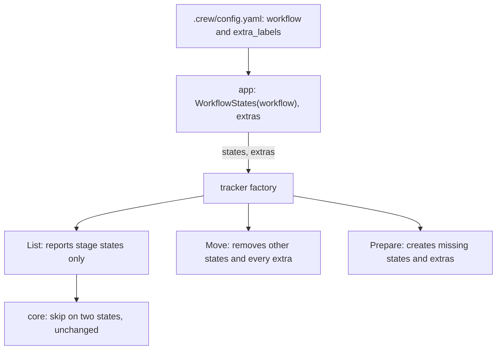
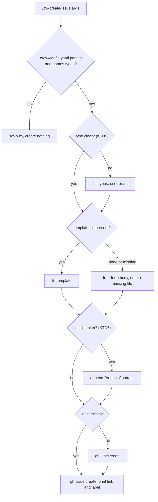

# Create Issue Skill - Plan

## Goal Capsule

- **Objective:** The boss records any piece of work with one command: a raw idea to brainstorm later, a feature already brainstormed, a bug, or an audit. The issue lands in the place of the workflow that the repository's `.crew/config.yaml` declares, with its body following that kind of work's template.
- **Means:** a `/cw-create-issue` skill reads the workflow and fills the GitHub issue template of the chosen type. crew accepts a description and a template on each stage, plus extra labels for parked work that no stage takes.
- **Product authority:** this Product Contract, within `STRATEGY.md` (the Backlog & tracking track). The Planning Contract decides how, and never changes an R.
- **Open blockers:** none.
- **Stop conditions:** stop and report if extras cannot be kept out of what `List` reports without changing the core, or if a requirement needs crew to read template files at run time.
- **Execution profile:** one pull request: config, port, registry, GitHub adapter, fake, app, the skill, this repository's `.crew/config.yaml` and issue templates, and docs. The code and the config change ship together, because a crew binary without the new keys refuses this repository's new config.
- **Who finishes:** `ce-work` implements and verifies locally. The calling pipeline opens the pull request, and the boss merges it.

---

## Product Contract

### Summary

A `/cw-create-issue` skill creates a GitHub issue of a type taken from `.crew/config.yaml`. Each stage is a type, and so is each extra label the config declares, such as `crew:waiting brainstorm` for an idea parked until someone brainstorms it. The skill fills the type's template from `.github/ISSUE_TEMPLATE/` and creates the issue with the type's label, without a preview. crew creates the extra labels, takes them off when a stage picks the issue up, and does not let them block a stage.

### Problem Frame

To put work in crew's queue today, the boss opens the issue by hand and has to remember each stage's exact label (`crew:ready for fix`, `crew:ready for ci audit`, and the rest). The body has no agreed shape, so the session crew runs starts from whatever the boss happened to write. Nothing marks an idea that still needs a brainstorm: a label no stage names is not crew's (`docs/guide/crew.mdx`), so crew neither creates it nor clears it.

When a brainstorm has already happened in a local session, its plan sits in the boss's checkout. The session crew runs starts in a fresh worktree from `main` and cannot see that file.

### Key Decisions

- **Types are the workflow's stages plus extra labels from the config.** No second list repeats the stages, so the menu cannot drift from the workflow. Governs R1, R3, R11. (session-settled: user-directed — chosen over a separate list of issue types in the config, and over stages only with no new keys: one source, and parked work needs its own label)
- **Templates are GitHub issue templates referenced from the config.** The same file serves the skill and anyone opening an issue on the web. Governs R2, R13, R19. (session-settled: user-directed — chosen over template text inline in the config and over templates bundled in the skill: the web sees them, and the boss edits them in the repository)
- **The skill creates the issue directly, with no preview.** A mistake is fixed by editing the issue on GitHub. Governs R14. (session-settled: user-directed — chosen over drafting and confirming, and over an interview per template section)
- **A finished brainstorm travels in the issue body.** The issue then holds everything the crew session needs, with no file outside it. Governs R15. (session-settled: user-directed — chosen over committing the plan and linking it, and over leaving it to the boss)
- **Extra labels are crew's to create and clear, but never block.** This matches the boss's model that labels change as the workflow moves. Parking and later promoting an issue only takes adding the stage's label. Governs R5, R6, R7, R8. (session-settled: user-approved — chosen over extras counting as full crew labels, where an issue with an extra and a stage label is skipped, and over extras crew ignores)
- **This repository keeps its current labels.** The one new label is the extra `crew:waiting brainstorm`. Governs R20. (session-settled: user-directed — chosen over renaming to a `crew:<subject>:<state>` scheme such as `crew:brainstorm:done` and `crew:bug`)
- **The skill is distributed like the acceptance-tester agent.** It is source in this repository and linked into the user's Claude Code directory, so the command stays `/cw-create-issue` in any repository. Governs R18. (session-settled: user-directed — chosen over a Claude Code plugin, which would namespace the command, and over this repository only)
- **The skill reads `.crew/config.yaml` itself.** It works without the crew binary installed. Governs R11. (session-settled: user-approved — chosen over a crew subcommand that prints the validated types)

### Requirements

**Workflow configuration**

- R1. A stage may declare an optional description of the work it takes, which the skill shows when it lists types.
- R2. A stage may declare an optional issue template: the name of a Markdown template file in `.github/ISSUE_TEMPLATE/`.
- R3. The config may declare extra labels that no stage takes. Each extra has its label text and may have a description and an issue template, as R1 and R2 define.
- R4. An extra's label cannot be any label a stage names in `label`, `moves_to`, `on_success` or `on_failure`, and two extras cannot share a label. Comparisons ignore case, as for stage labels. crew refuses such a config like any other config error, and exits with `2`.

**Extra labels at run time**

- R5. At startup crew creates the extra labels the repository lacks, as it does for stage labels.
- R6. An extra label does not count toward the rule that skips an issue carrying two crew labels. An issue with an extra and one stage's `label` is taken by that stage.
- R7. When a stage takes an issue, the move removes every extra label on it, together with the other crew labels.
- R8. No stage takes an issue whose only crew label is an extra.

**The skill**

- R9. `/cw-create-issue` creates one issue in the current repository's GitHub project, with a title drawn from what the user wrote.
- R10. The issue carries exactly the chosen type's label. Labels listed in a template's frontmatter are not applied.
- R11. The types the skill offers are every stage, shown by its description or by its name when it has none, and every extra, all read from the repository's `.crew/config.yaml`.
- R12. The skill infers the type from what the user wrote. It asks only when the type is not clear, and then lists the types.
- R13. The body follows the type's template, filled from what the user wrote and from the session's context. Without a template, because none is declared or its file is missing, the body is free-form, and the skill's result names a missing file.
- R14. The skill creates the issue without a preview or a confirmation, then reports the issue's link and label.
- R15. When the session wrote a requirements plan, the skill puts that plan's Product Contract in the body, so the crew session that takes the issue needs no file outside it.
- R16. When the type's label does not exist in the repository yet, the skill creates it before creating the issue.
- R17. Without `.crew/config.yaml` at the repository root, the skill stops, says so and creates nothing.

**Distribution**

- R18. The skill's source lives in this repository under `.agents/`, with `.claude/` linking to it, as the agents do. The Guide tells users how to link it into `~/.claude/skills/` to use it in any repository.

**This repository**

- R19. `.github/ISSUE_TEMPLATE/` gets one Markdown template per type. Each template's frontmatter names the type's label, so an issue opened on the web lands in the same place.
- R20. This repository's `.crew/config.yaml` gets the extra `crew:waiting brainstorm`, plus a description and a template for every stage and for the extra. Stage labels keep their current text.
- R21. `docs/guide/crew.mdx` documents the new keys and how crew treats extra labels, and a Guide page documents the skill and how to install it.

### Key Flows

- F1. Park an idea, then promote it
  - **Trigger:** the boss has an idea that is not ready to build.
  - **Steps:** the boss runs `/cw-create-issue` with a line about the idea, and the skill creates the issue with `crew:waiting brainstorm`. crew leaves it alone. Later the boss brainstorms it, then either runs `/cw-create-issue` again from that session or adds `crew:ready for development` to the parked issue. On the next poll the development stage takes it, and the move clears `crew:waiting brainstorm`.
  - **Covered by:** R3, R6, R7, R8, R12, R15

### Acceptance Examples

- AE1. **Covers R12, R14.** **Given** this repository's config, **when** the boss runs `/cw-create-issue the poll loop crashes when gh is missing from PATH`, **then** the skill infers the fix stage without asking, creates an issue labeled `crew:ready for fix` whose body follows the fix stage's template, and prints the issue's link.
- AE2. **Covers R11, R12.** **When** the boss runs `/cw-create-issue look into caching`, **then** the skill lists the types, including `crew:waiting brainstorm`. The boss picks it, and the issue carries only that label.
- AE3. **Covers R15.** **Given** a session that wrote a requirements plan in `docs/plans/`, **when** the boss runs `/cw-create-issue` and the type is the development stage, **then** the body carries the plan's Product Contract.
- AE4. **Covers R6, R7.** **Given** an open issue labeled `crew:waiting brainstorm`, **when** the boss adds `crew:ready for development`, **then** on the next poll the development stage takes it, and the issue ends with `crew:in progress` and no `crew:waiting brainstorm`.
- AE5. **Covers R13.** **Given** a stage whose template names a file absent from `.github/ISSUE_TEMPLATE/`, **when** the skill creates an issue of that type, **then** the issue gets a free-form body and the skill's result says the template was missing.
- AE6. **Covers R17.** **When** the boss runs `/cw-create-issue` in a repository without `.crew/config.yaml`, **then** the skill says crew is not configured there and creates no issue.
- AE7. **Covers R4.** **When** an extra's label is `crew:failed`, which a stage names in `on_failure`, **then** crew refuses the config, names the key and its line, and exits with `2`.

### Scope Boundaries

- Renaming this repository's labels.
- The skill editing, relabeling or promoting existing issues.
- Packaging the skill as a Claude Code plugin.
- A stage where crew runs a brainstorm by itself.
- crew checking at startup that each named template file exists.
- GitHub issue forms (`.yml`): templates are Markdown only.
- A crew subcommand that prints the types.
- Showing extra labels in crew's live view or event lines.

### Dependencies / Assumptions

- The user has `gh` installed and authenticated for the repository, as crew already requires.
- The skill is authored with the `anthropic-skills:skill-creator` skill. The compound-engineering plugin, used as the reference for skill structure, has no skill for writing skills.

### Sources / Research

- `docs/plans/2026-10-02-0159-feat-workflow-labels-plan.md`: crew's labels are exactly the ones the workflow names (its R7, R8), which R4 to R8 extend.
- `internal/config/validate.go:14` and `internal/config/decode.go:82`: a stage's keys, and the strict decoding that refuses any unknown key, so R1 to R3 need a code change.
- `internal/adapter/github/tracker.go:136` (`Move`) and `:214` (`Prepare`): the move that removes other crew labels, and label creation at startup.
- `internal/core/update.go:168`: the skip on two crew labels that R6 relaxes for extras.
- `docs/guide/acceptance-tester.mdx:17`: the linking pattern R18 follows.

---

## Planning Contract

**Product Contract preservation:** the Requirements, Key Decisions, Key Flows, Acceptance Examples and Scope Boundaries are unchanged. Its three Outstanding Questions, all deferred to planning, are answered by KTD1, KTD6 and KTD8, so that section was removed.

### Key Technical Decisions

- KTD1. **Config shape: `description` and `issue_template` on a stage, and a top-level `extra_labels` list.** Each extra is a mapping with `label` (required), `description` and `issue_template`. crew validates these keys but does not carry `description` or `issue_template` into `crew.Stage`, because nothing in crew reads them at run time. The extras reach `app.Config` as a list of `crew.State`. Governs R1, R2, R3.
- KTD2. **`issue_template` is a bare file name ending in `.md`.** A value with a path separator, or that is `.` or `..`, is refused. crew does not check that the file exists (Scope Boundaries). The skill resolves the name against `.github/ISSUE_TEMPLATE/`. Governs R2, R13.
- KTD3. **The tracker gets the extras separately from the workflow's states, and the core is not changed.** `List` keeps reporting only stage states, so R6 needs no core change, and event lines never show an extra. `Move` removes extras together with the other crew labels, but leaves them out of the check that makes a retried move safe. `Prepare` creates the missing labels among the states and the extras. Route chosen over passing every label to the tracker and having the core filter extras out of the skip count: that would break the port's "List reports only crew states" contract and put extras in the core's model. Governs R5, R6, R7, R8.
- KTD4. **Every move removes extras, not only the move into `moves_to`.** `Move` is one operation for the moves to `moves_to`, `on_success` and `on_failure`. An extra added to an issue while crew runs on it is removed by the next move. R7 asks for this on the first move, and the later moves follow from the same operation.
- KTD5. **R12's bar: the type is clear when the user named it, or when exactly one type's name, label or description fits the request.** Session context also counts: a requirements plan from the session points to the type whose description names finished brainstorms. In any other case, including two types that fit, the skill asks. A wrong stage label starts an unattended crew run within one poll, so the skill asks whenever it doubts.
- KTD6. **The session's plan is the most recent `ce-unified-plan/v1` file this session wrote or enriched under `<root>/plans/`, unless the user passes a plan path. `<root>` is the compound-engineering artifact root: `docs_root` from the repository's `.compound-engineering/config.yaml` when set, otherwise `docs`.** The skill appends that plan's whole `## Product Contract` section to the body, after the filled template, under its own heading. An HTML plan's section is converted to Markdown. A plan with no Product Contract section counts as no plan. Governs R15.
- KTD7. **The skill shells out to `gh` and reads files with its own tools.** It reads `.crew/config.yaml` and the template itself. It checks labels with `gh label list --limit 1000 --json name`, as the tracker's `Prepare` does, comparing case-insensitively. It creates a missing one with `gh label create` without `--force`, which would overwrite an existing label's color and description. A create error saying the label already exists counts as the label being present. It creates the issue with `gh issue create`, passing the body from a temporary file. A YAML file that does not parse, or a config with no types, stops the skill like R17. A `gh` failure is reported with its error text and is not retried. Governs R9, R10, R14, R16, R17.
- KTD8. **The skill is `cw-create-issue/SKILL.md` under `.agents/skills/`, and `.claude/skills` is a relative symlink to `../.agents/skills`.** The `cw-` prefix names the family for later crew skills, as `ce-` does for compound-engineering. Users link the directory, not the file, into `~/.claude/skills/`. The skill's frontmatter takes `name`, `description` and `argument-hint`. Governs R18.
- KTD9. **A repository test keeps this repository's templates and config in step.** Next to `TestTheRepositorysOwnConfigLoads`, a test checks that every `issue_template` the repository's config names exists in `.github/ISSUE_TEMPLATE/`. It also checks that each template's frontmatter `labels` holds exactly the label of the type that names it. After `config.Load` validates the file, the test reads the `issue_template` values by decoding `.crew/config.yaml` itself with `go.yaml.in/yaml/v3` into a small struct, so `Config` carries no template fields (KTD1). Governs R19, R20.

### High-Level Technical Design

How the extras flow through crew (KTD3). The core and `List` never see them.

The skill's decisions (R9 to R17, KTD5 to KTD7).

### Assumptions

- If the boss declares a label already in use, such as `bug`, as an extra, crew removes it from every issue it moves. The guide warns about this and crew does not refuse it, because the boss chose that label.
- crew lists only issues the `gh` user opened, so issues others open from the web templates are ignored. The skill runs as the boss, so the issues it creates are taken.
- A template's frontmatter `title` and `assignees` are ignored. The skill takes the title from what the user wrote.
- With no arguments, the skill describes the session's work, such as a plan just written. If the session has nothing to record, it asks what to record. That is the only question besides the type.

### Scope Boundaries (planning)

Considered and not built:

- **Truncating a body over GitHub's size limit.** `gh` rejects it with a visible error, and the boss can shorten it. Build this if large Product Contracts start failing often.
- **Label colors and descriptions from the config.** No requirement asks for them, and `Prepare` creates labels with GitHub's defaults today.
- **Refusing an extra that matches a common GitHub label.** The boss names extras on purpose, and the guide's warning covers it (Assumptions).

---

## Implementation Units

### U1. Config keys for descriptions, templates and extra labels

- **Goal:** `.crew/config.yaml` accepts a stage's `description` and `issue_template`, and a top-level `extra_labels`, all validated and refused with the key and its line when wrong.
- **Requirements:** R1, R2, R3, R4; KTD1, KTD2; AE7.
- **Dependencies:** none.
- **Files:**
  - `internal/config/validate.go`
  - `internal/config/config.go`
  - `internal/config/config_test.go`
- **Approach:**
  1. Add optional `located[string]` fields for `description` and `issue_template` to `stageDoc`, and update the "must be a stage with ..." text.
  2. Add `extra_labels` to `document`, with the same strict decoding per item as stages, and update the "the config must be a mapping with ..." text.
  3. After `spellOnce` and `checkGraph`, check each extra against a lowercase set of `crew.WorkflowStates` and against the earlier extras (R4), reporting with `keyError` and paths like `extra_labels[0].label`.
  4. Expose the extras on `Config` as `[]crew.State`.
- **Patterns to follow:** the optional `config.harness` read (`config.go`), `parseStage` and the `required` helper (`validate.go`), and the case-insensitive cases of `TestLoadRejectsInvalidConfig`.
- **Test scenarios:**
  - A stage with `description: Bugs to fix` and `issue_template: bug.md` loads, and the workflow equals one without them.
  - A config with `extra_labels: [{label: "crew:waiting brainstorm", description: ..., issue_template: idea.md}]` loads, and `Extras` holds that label.
  - A config with no `extra_labels` loads with no extras.
  - Covers AE7. An extra labeled `crew:failed`, which a stage's `on_failure` names, is refused with `extra_labels[0].label` and its line.
  - An extra labeled `CREW:READY FOR FIX` while a stage's `label` is `crew:ready for fix` is refused.
  - Two extras labeled `crew:parked` and `Crew:Parked` are refused, naming the second.
  - An extra with no `label`, or an empty one, is refused.
  - An unknown key inside an extra, such as `labels:`, is refused as an unknown key.
  - `issue_template: templates/bug.md`, `issue_template: ../bug.md` and `issue_template: bug.txt` are each refused (KTD2).
  - An empty `description` is refused like other empty strings.
- **Verification:** the new cases pass, and `TestTheRepositorysOwnConfigLoads` still passes against the unchanged repository config.

### U2. The tracker learns the extras

- **Goal:** crew creates extra labels at startup, removes them on every move, and never counts them as crew states.
- **Requirements:** R5, R6, R7, R8; KTD3, KTD4; AE4.
- **Dependencies:** U1.
- **Files:**
  - `internal/port/factory.go`
  - `internal/port/port.go`
  - `internal/registry/registry.go`
  - `internal/registry/registry_test.go`
  - `internal/registry/default_test.go`
  - `internal/app/app.go`
  - `internal/app/app_test.go`
  - `internal/adapter/github/config.go`
  - `internal/adapter/github/tracker.go`
  - `internal/adapter/github/tracker_test.go`
  - `internal/fake/tracker.go`
  - `internal/fake/fake_test.go`
- **Approach:**
  1. Extend `TrackerFactory` and `registry.Tracker` so the factory also receives the extras. Document in the port that `List` never reports them, `Move` removes them, and `Prepare` creates them.
  2. In the GitHub tracker, keep `stateOf` for stage states only. Add a removable set holding the extras. `Move` removes them in the same `gh issue edit`, and they are left out of the already-moved check.
  3. `Prepare` creates the missing labels among the states it receives plus the extras the tracker was built with. The engine's `prepare` is unchanged.
  4. `app` passes `cfg.Extras` to the registry.
  5. Give the fake tracker's issues a separate set of extra labels that `List` does not report and `Move` clears.
- **Patterns to follow:** `newLabels`/`stateOf` in `internal/adapter/github/config.go`, and the table tests `TestListReturnsEveryCrewStateOfAnIssueInTheWorkflowsSpelling`, `TestMoveSwapsTheCrewLabelsInOneEdit` and `TestPrepareCreatesOnlyTheMissingLabels`.
- **Test scenarios:**
  - `List` on an issue labeled `crew:waiting brainstorm` and `crew:ready for development` reports only `crew:ready for development`.
  - `Move` from `crew:ready for development` to `crew:in progress` on an issue that also has `crew:waiting brainstorm` and `bug` removes the first two and keeps `bug`, in one edit.
  - A retried `Move`, finding the issue at `crew:in progress` with an extra added since, returns success and does not report a move made meanwhile.
  - `Prepare` with the repository missing `crew:waiting brainstorm` creates it. With the repository having it as `Crew:Waiting Brainstorm`, it creates nothing.
  - The registry passes the extras through to the factory.
  - Covers AE4. In an app or engine test with the fake tracker, an issue with `crew:waiting brainstorm` and a stage's label is taken by that stage, and ends with no extra.
  - Covers R8. An issue whose only crew label is an extra is never taken.
- **Verification:** the adapter, registry, fake and app tests pass, and core tests pass unchanged.

### U3. The `/cw-create-issue` skill

- **Goal:** the boss runs `/cw-create-issue <what to record>` in any repository with a crew config and gets an issue of the right type, with its template filled.
- **Requirements:** R9 to R17, R18; KTD5, KTD6, KTD7, KTD8; AE1, AE2, AE3, AE5, AE6.
- **Dependencies:** U1 (key names).
- **Files:**
  - `.agents/skills/cw-create-issue/SKILL.md`
  - `.claude/skills` (a symlink to `../.agents/skills`)
- **Approach:**
  1. Write the skill as a short procedure following the second diagram in High-Level Technical Design. Its steps: find the repository root, read the config and build the types, decide the type, read and fill the template, append the plan's Product Contract, ensure the label exists, create the issue, report.
  2. Give each rule its owner in the skill (KTD5 to KTD7), and keep the skill free of crew-repository specifics, because it runs in the boss's other repositories.
- **Execution note:** Author it with the `anthropic-skills:skill-creator` skill, using compound-engineering skills such as `ce-commit` as structural references. Skip any evaluation that creates real GitHub issues.
- **Patterns to follow:** `.agents/agents/acceptance-tester.md` for the repository's agent prose, and how `.claude/agents` links to `.agents/agents`.
- **Test expectation:** none -- a Markdown skill with no Go code. Verify by walking AE1, AE2, AE3, AE5 and AE6 through the skill's text and confirming each step is stated.
- **Verification:** each requirement from R9 to R17 maps to a step in `SKILL.md`, and `.claude/skills/cw-create-issue/SKILL.md` resolves through the symlink.

### U4. This repository's templates and config

- **Goal:** this repository uses the feature: one issue template per type, and a config that names them and the parked-idea extra.
- **Requirements:** R19, R20; KTD9.
- **Dependencies:** U1.
- **Files:**
  - `.github/ISSUE_TEMPLATE/idea.md` (extra `crew:waiting brainstorm`)
  - `.github/ISSUE_TEMPLATE/feature.md` (development)
  - `.github/ISSUE_TEMPLATE/bug.md` (fix)
  - `.github/ISSUE_TEMPLATE/knowledge-base.md` (knowledge base)
  - `.github/ISSUE_TEMPLATE/triage.md` (triage)
  - `.github/ISSUE_TEMPLATE/ci-audit.md` (audit ci)
  - `.crew/config.yaml`
  - `internal/config/config_test.go`
- **Approach:**
  1. Each template's frontmatter has `name`, `about` and `labels` (the type's label), and its body has the sections that kind of issue needs. For example, `bug.md` asks for what happened, what was expected and the steps to reproduce. `feature.md` leaves room for the Product Contract.
  2. Add `description` and `issue_template` to each stage, add `extra_labels` with `crew:waiting brainstorm`, and mention the extra in the file's header comment.
  3. Add KTD9's test.
- **Test scenarios:**
  - The repository's config loads, and every `issue_template` it names exists.
  - Each template's frontmatter `labels` equals exactly the label of the type that names it. Changing one label in `.crew/config.yaml` fails the test, naming the template.
- **Verification:** `TestTheRepositorysOwnConfigLoads` and the new test pass. The web chooser shows the six templates once this merges.

### U5. Docs

- **Goal:** the guide documents the new keys, how crew treats extras, and how to install and use the skill. The developer docs match the new tracker contract.
- **Requirements:** R21, R18.
- **Dependencies:** U1, U2, U3.
- **Files:**
  - `docs/guide/crew.mdx`
  - `docs/guide/create-issue.mdx` (new)
  - `docs.json`
  - `docs/develop/architecture.mdx`
  - `AGENTS.md`
- **Approach:**
  1. In `crew.mdx`, update the keys tables for the new stage keys and `extra_labels`. Rewrite the "crew's labels" paragraph to cover extras and the warning in Assumptions. Add R4's refusals to "When crew refuses to start", extras to the startup label creation, and extras to poll steps 2 and 4.
  2. The new page covers what the skill does, installing it by linking the directory into `~/.claude/skills/` and keeping the crew checkout on `main` (as `acceptance-tester.mdx` does), usage examples, and that crew ignores issues opened by others.
  3. Add the page to the Guide's "Getting started" group in `docs.json`.
  4. Update the tracker factory and `Prepare` descriptions in `architecture.mdx`, and name `.agents/skills` and `.claude/skills` in AGENTS.md's Agents section.
- **Test expectation:** none -- documentation; `pnpm docs:check` covers links and MDX.
- **Verification:** `pnpm docs:check` passes, and every behavior in R1 to R8 and R18 is stated in the guide.

---

## Verification Contract

| Check | Command | Applies to |
|---|---|---|
| Format | `gofmt -l cmd internal` prints nothing | U1, U2, U4 |
| Vet | `go vet ./...` | U1, U2, U4 |
| Tests | `go test -race ./...` | U1, U2, U4 |
| Lint and layering | `go run github.com/golangci/golangci-lint/v2/cmd/golangci-lint@v2.14.0 run` | U1, U2 |
| Vulnerabilities | `go run golang.org/x/vuln/cmd/govulncheck@v1.8.0 ./...` | all Go changes |
| Docs | `pnpm install` once, then `pnpm docs:check` | U5 |
| Skill walk-through | AE1, AE2, AE3, AE5 and AE6 traced through `SKILL.md` | U3 |

No unit runs the skill against GitHub, because that would create real issues.

## Definition of Done

- Every check in the Verification Contract passes.
- R1 to R21 are each covered by a unit, and AE1 to AE7 by a test scenario or the skill walk-through.
- The core package is unchanged (KTD3).
- `.claude/skills` is committed as a relative symlink, and the skill resolves through it.
- No experimental or abandoned code is left in the diff.
