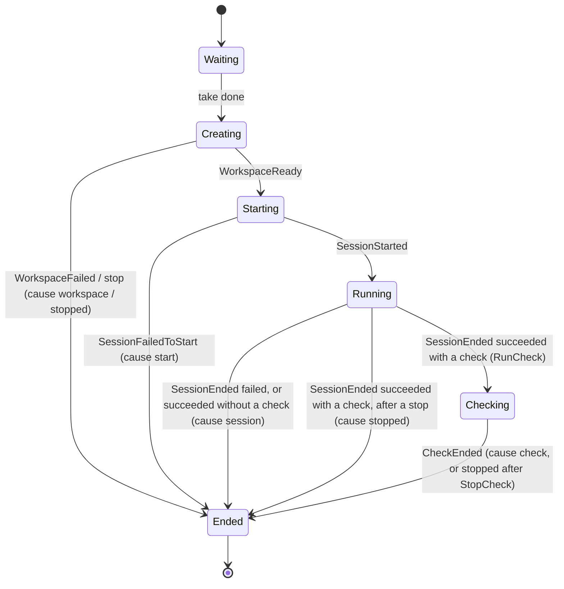
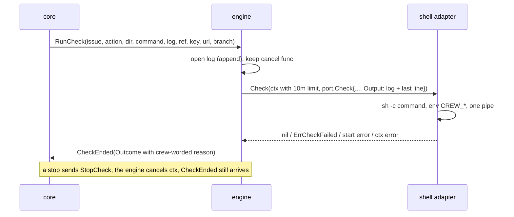

# Verify a stage's outcome before applying on_success - Plan

## Goal Capsule

- **Objective:** An issue reaches its stage's `on_success` only when the work the stage should have produced exists, such as a pull request that closes the issue. When that work is missing, the issue goes to the stage's `on_failure`, and the reason says what is missing. The issue's status comment keeps how each earlier stage ended and why, so later stages do not erase it.
- **Means:** an optional check command on each action, run by crew in the action's worktree after a session that succeeded (R1 to R9, KTD1 to KTD4). The status comment grows by one entry per stage run instead of being rewritten (R10 to R14, KTD5 to KTD7).
- **Product authority:** this Product Contract (issue #14), within `STRATEGY.md`, the engine's architecture plan (`docs/plans/2026-10-01-2202-feat-crew-engine-architecture-plan.md`), the status comment plan (`docs/plans/2026-10-02-0152-feat-status-comment-plan.md`) and the workflow labels plan (`docs/plans/2026-10-02-0159-feat-workflow-labels-plan.md`). This plan revises the status comment plan's "one comment, edited in place" decision and its R1. `docs/solutions/security-issues/session-text-in-public-tracker-comments.md` (#44, #46) outranks the older plans on what a public comment may carry.
- **Stop conditions:** stop and report if the check cannot run without the engine importing an adapter, or if the status comment cannot keep earlier entries without reading the comment back on every write (crew reads it only when its cache is empty, from the comments `findStatus` already lists, per KTD6).
- **Execution profile:** one pull request, units in dependency order, `go test -race ./...` green after each unit.
- **Who finishes:** `ce-work` implements, the pipeline reviews and opens the pull request; the boss merges.

---

## Product Contract

Product Contract preservation: changed: R12, AE1 — a status entry and the failure comment never carry a session's or tool's own words; the reason shown is crew's own wording, plus the check's last line for a failed check. The reason: #44/#46, merged after this contract was written, made that the rule for public comments. See the conflict note on the Key Decision it touches.

### Summary

An action can name a check command next to its prompt. After the action's session ends in a success, crew runs the command in the action's worktree. Exit 0 keeps the success, and anything else fails the action, with the check's last line of output as the reason. The status comment keeps one entry per stage run, and an entry with a failed action shows why that action failed.

### Problem Frame

crew judges an action only by what the session says about itself: a last `result` that is not an error, and exit code 0 (`judge` in `internal/adapter/claude/stream.go`). `claude -p` exits 0 with `success` whenever the model ends its turn, including when it stops halfway. Issue #9's `lfg` session ended while waiting on a background shell, with two commits, the rest uncommitted, nothing pushed and no pull request. crew moved #9 to `in review` anyway (#13 has the full chain).

#13 made an early end less likely. It does not catch the next way a session ends early: from the stream alone, crew cannot tell "finished" from "stopped early".

The reason for a failure is also hard to find. The status comment says only "**`lfg`** failed.", and it is rewritten when the issue enters its next stage, so the record of an earlier stage disappears.

### Key Decisions

- **The check is a shell command the boss writes, not a built-in check type.** Governs R1, R3. (session-settled: user-directed — chosen over a built-in "open pull request" check for PR stages only, and over a fixed set of outcome types each stage declares: a command covers any stage without crew knowing what it produces)
- **A failed check fails the action; crew does not retry.** Governs R4. (session-settled: user-directed — chosen over resuming the same session once with the check's output, which needs a resume capability the harness port lacks, and over rerunning the action in a fresh session)
- **The check belongs to the action, not the stage.** Governs R1, R2. (session-settled: user-approved — chosen over one check per stage, which would have no single worktree to run in)
- **The command reads the issue from environment variables, not from `{{.Issue...}}` templates.** Governs R6. (session-settled: user-approved — chosen over rendering the check with the prompt's template data: an issue title substituted into a shell command can run code)
- **The check's time limit is fixed, not configurable.** Governs R3. (session-settled: user-approved — chosen over a configurable limit, which nothing needs yet)
- **The check catches a session that stopped early. It does not defend against a session that tries to fool it.** Governs R16. (session-settled: user-approved — chosen over running checks outside the worktree: accepted as the trust boundary)
- **The status comment grows by one entry per stage run, instead of being rewritten.** Governs R10, R11. (session-settled: user-directed — chosen over the status comment plan's "one comment, edited in place", which erases each earlier stage's result)
- **A failed action's reason shows in the status comment for every kind of failure, not only failed checks.** Governs R12. (session-settled: user-approved — chosen over showing only check reasons)
  - **Conflict:** #46 (merged 2026-10-02 20:54 UTC, after this decision) keeps a session's and a tool's own words out of public comments, because they can hold commands, output and secrets. R12 is planned so every kind of failure still shows a reason, in crew's words: "its session failed" with the log path, "crew stopped it", "its workspace could not be created". Only a failed check shows text crew did not write: its last line, printed by the boss's check command or a tool it ran (R5, AE1).
- **The comment grows without a limit of crew's own.** Governs R10. (session-settled: user-approved — chosen over capping or summarizing old entries)
- **A full comment is continued in a new one, not trimmed.** Governs R14. (session-settled: user-directed — chosen over dropping the oldest entries to stay in one comment)

### Requirements

**The check**

- R1. An action may declare a check command next to its prompt in `.crew/config.yaml`. An action without one is judged exactly as it is today.
- R2. crew runs an action's check only when the action's session ended in a success. It runs the check in that action's worktree, after the session has ended.
- R3. A check passes when it exits 0. It fails when it exits non-zero, cannot start, or runs past a fixed time limit.
- R4. A failed check makes the action failed, and from there it follows the path of any failed action: the issue moves to the stage's `on_failure`, and the failure report lists the action with its reason, workspace and log.
- R5. A failed check's reason says the check failed, followed by the last non-empty line the check printed. A check that could not start, or ran out of time, has a reason saying so instead. The check's full output goes into the action's log after the session's output.
- R6. The check receives the issue's ref, key and URL as environment variables. No issue text is substituted into the command.
- R7. A check present in the config but blank is a config error, reported at startup like the other workflow checks.
- R8. When a stop ends running sessions, it also ends a running check, and the action counts as failed for being stopped. When crew winds down at its time limit, a check of an issue it still holds runs as usual.
- R9. Until its check ends, an action stays running in the TUI, the lines renderer and the status comment, and the stage does not end.

**The status comment**

- R10. The status comment holds one entry per stage run, oldest first. A stage run starts when crew first reports the issue as queued for a stage, or takes it for a stage, and ends when the next one starts.
- R11. Only the latest entry changes: it is edited in place as the stage moves from queued to running to ended. Earlier entries keep the text they had when their stage run ended.
- R12. In an ended entry, each failed action shows a one-line reason, whatever made it fail: the session, its check, a stop or a failure to start. The reason is crew's own wording, except that a failed check's reason ends with the check's last line (R5); a session's or a tool's own words never appear. Reasons are rendered so they cannot format, link or mention anyone.
- R13. Earlier entries survive crew restarts. After a restart, crew keeps what the comment already holds and changes only the latest entry, or appends a new one.
- R14. When the next write would exceed GitHub's comment size limit, crew leaves the full comment as it is and continues in a new status comment, which says it continues the earlier one. From then on, crew writes only to the new comment.

**crew's own workflow and docs**

- R15. In crew's own `.crew/config.yaml`, the `lfg` actions of `development` and `fix` get a check that an open pull request exists from the worktree's branch and that its body closes the issue. `knowledge base`, `triage` and `audit ci` get no check.
- R16. `docs/guide/crew.mdx` documents the check: where it goes, what it receives, how it passes or fails, its time limit, where its output goes, that its last line can reach the public status comment, and the trust boundary in Key Decisions. It also documents the growing status comment. `docs/develop/architecture.mdx` changes wherever it describes judging an action, the ports or the status comment.

### Acceptance Examples

- AE1. **Covers R2, R3, R4, R5, R12.** **Given** `development`'s `lfg` action has the R15 check, **when** its session ends with `success` and exit 0 but nothing was pushed, **then** the check exits 1 after printing that no open pull request exists for the branch. The issue moves to `crew:failed`. The failure report lists `lfg` with a reason that says the check failed and quotes that line (crew's output shows it; the GitHub failure comment points to the log, per #46), and the status comment's latest entry shows `lfg` failed with the same reason.
- AE2. **Covers R2, R3.** **Given** the same action, **when** its session ends with `success` and the branch has an open pull request whose body has `Closes #N`, **then** the check exits 0 and the issue moves to `crew:waiting review`.
- AE3. **Covers R2.** **Given** an action with a check, **when** its session ends in a failure, **then** the check does not run, and the reason is the session's own.
- AE4. **Covers R3, R5.** **Given** a check that never exits, **when** it reaches the time limit, **then** crew ends it, the action fails, and the reason says the check ran out of time.
- AE5. **Covers R1, R4.** **Given** a stage with two actions where only one has a check, **when** both sessions succeed and that check fails, **then** the issue moves to `on_failure`, and the failure report lists only the action whose check failed.
- AE6. **Covers R6.** **Given** an issue titled `` $(touch pwned) ``, **when** its action's check runs, **then** the title is not part of the command, and nothing runs other than the configured command.
- AE7. **Covers R10, R11, R12.** **Given** an issue whose `development` stage failed on its check, **when** the boss labels it `crew:ready for fix` and the `fix` stage runs, **then** the status comment shows the `development` entry with `lfg`'s failure reason, followed by a `fix` entry that is updated as the stage runs.
- AE8. **Covers R13.** **Given** the comment in AE7, **when** crew restarts while `fix` runs, **then** the `development` entry is still there after crew's next write.
- AE9. **Covers R8.** **Given** a check that is running, **when** the boss stops crew in a way that stops running sessions, **then** the check is ended too, and the action counts as failed for being stopped.

### Scope Boundaries

- Resuming or rerunning a session whose check failed.
- Built-in check types, such as "a pull request exists", in place of a command.
- Checking an action whose session failed, or overriding a session's failure with a passing check.
- A per-action or configurable check time limit.
- Defending against a session that edits what its check reads.
- Telling "finished" from "stopped early" in the session's stream.
- Checks for `knowledge base`, `triage` and `audit ci`.
- Recovering #9 itself.
- Preserving edits the boss makes by hand inside the status comment.
- The running entry's "It last said:" block, which still posts a running session's last words (open since #46). This plan does not widen it and does not remove it.
- Considered and not built: a separate event or status flag for a check in progress. The action already shows as running until it ends (R9); a renderer can tell it apart by its phase.
- Considered and not built: a separate check output file. The action's log already holds the session's output, and appending the check there keeps one file per action.

### Dependencies / Assumptions

- The check runs with the boss's environment and credentials, so `gh` in a check sees what the boss's `gh` sees.
- GitHub rejects a comment body over 65,536 characters (the REST API's `Body is too long (maximum is 65536 characters)`). crew measures bytes, which are never fewer than characters, so it errs on the safe side.
- crew never removes an action's worktree (`port.Workspace` has only `Create`), so the worktree is still there when the check runs.
- The config is decoded strictly (`internal/config/decode.go`), so the new key has to be added to `actionDoc`.

### Sources / Research

- #14 (this work), #13 (the early-ending session), #44 and #46 (session words out of public comments).
- `docs/solutions/security-issues/session-text-in-public-tracker-comments.md`: a fence or a scrub is a rendering control, not a disclosure control.
- `internal/core/update.go` (`end`, `judge`, `stop`, `windDown`), `internal/core/status.go` (`report`, `sameStatus`), `internal/engine/exec.go` (`startSession`, `stopSession`), `internal/adapter/github/status.go` (`ReportStatus`, `findStatus`, `renderStatus`), `internal/proc/proc.go` (`Group.Start`, `Process.Stop`), `internal/adapter/git/workspace.go` (branch `crew/<workspace>`).

---

## Planning Contract

### Key Technical Decisions

- KTD1. **A new port, `port.Checker`, runs checks; a new adapter, `internal/adapter/shell`, implements it with `sh -c` through `proc.Group`.** The engine already reaches every side effect through a port, and a port lets engine tests use a fake under `testing/synctest`, where a real process would not advance the fake clock. `cmd/crew` builds it next to the git workspace and `app.Options` carries it to `engine.Config`, as `Workspace` is today. It needs no registry entry: like the workspace, there is one implementation and no config key selects it. Running `sh` from the engine through `internal/proc` directly was the close alternative; depguard allows it, but it would leave the engine's check path testable only with real processes.
- KTD2. **The check's interface to the boss is four environment variables: `CREW_ISSUE_REF`, `CREW_ISSUE_KEY`, `CREW_ISSUE_URL` and `CREW_BRANCH`** (Governs R6). `CREW_BRANCH` is the worktree's branch (`port.Space.Branch`, such as `crew/issue-14-lfg`), which R15's check needs for `gh pr list --head`. The title is never passed. The command is run as one `sh -c` argument, never rendered as a template, so AE6 holds by construction.
- KTD3. **The time limit is 10 minutes, and the reason's last line comes from stdout and stderr together** (Governs R3, R5). Ten minutes matches `callTimeout`, so a check may call `gh` or `git` as the engine does. The adapter gives the child one pipe for both streams (`proc.Group.Start` with the same writer twice), so the log keeps them interleaved and "last line" means the last line the check printed, wherever it went. The engine tees that writer into the action's log and a small last-line tracker, then scrubs local paths and cuts the line as it does a session's words (`scrub`, `lastWords`).
- KTD4. **The core gets a new action phase, `PhaseChecking`, between `PhaseRunning` and `PhaseEnded`, with one command pair: `RunCheck` and `StopCheck`, answered by a `CheckEnded` input** (Governs R2, R8, R9). An action in `PhaseChecking` has not ended, so `heldIssue.ended` stays false, the stage is not judged and a wind-down waits for it, which gives R9 and R8's wind-down half for free. On a stop, the core sends `StopCheck` for every checking action and records that it did; the `CheckEnded` that follows ends the action with the stop reason whatever the check returned. A session that succeeds after a stop request starts no check and ends with the stop reason, as an action whose workspace is ready after a stop does today. The engine keeps a cancel function per running check, keyed like `sessions`, and `StopCheck` cancels it; the adapter then stops the process group (SIGTERM, then SIGKILL after `stopTimeout`).
- KTD5. **Each status names its stage run, and the GitHub adapter decides from that whether to edit the latest entry or append one** (Governs R10, R11). `crew.Status` gets a `Run` field. The core's status slot starts a new run when the slot has none, when the last reported status ended and the new one is not an ended status, or when the stage changes; otherwise it keeps the current run. The run ID is the run's start time and a per-model sequence number, so it differs across crew processes. The adapter replaces the latest entry when its run ID matches, or when the latest entry is a queued entry of the same stage (a queued entry holds nothing worth keeping, so a restart that queues or takes the issue again does not leave a stale duplicate). Otherwise it appends. Before appending after a latest entry that is still running from another run (crew was killed or crashed before that run ended), the adapter replaces that entry with one line in crew's words saying crew stopped following that stage before it ended, so its elapsed time and its "It last said:" block do not stay in the history.
- KTD6. **The adapter keeps each entry's text verbatim and finds the entries by a hidden marker line** (Governs R11, R13). Each entry starts with an HTML comment such as `<!-- crew:entry run=... kind=running stage=... -->`, with the stage URL-query-escaped so it cannot close the comment. The comment still ends with `<!-- crew:status -->`, so `findStatus` keeps working. The adapter caches each issue's comment ID with its last written body. On a restart it takes the body `findStatus` already reads. A body with no entry markers is a comment written before this change: it becomes one earlier entry, kept as it is. A marker counts only at the start of the body (after a continuation preamble) or right after the entry separator, so a marker-shaped line inside an entry, such as a session's last words in a running entry's fence, is entry text.
- KTD7. **Over 65,536 bytes, the adapter creates a new status comment holding a line that says it continues the earlier one, then the entry being written** (Governs R14). The cache then points to the new comment, and after a restart `findStatus` picks it as the newest comment with the marker. A continuation comment's opening line has its own hidden marker, so parsing keeps it as a preamble rather than an entry.
- KTD8. **Status entries say why an action failed through a cause the core sets, not through `Outcome.Reason`** (Governs R12). `crew.ActionStatus` gets `Cause` (session, check, stopped, workspace, start, prompt), `Reason` (set only for a check, as its outcome's reason) and `Log`. The core knows the cause from which input ended the action. The adapter words each cause itself, as `renderReport` does. A session's own reason stays in `Outcome.Reason`, so crew's output, the TUI and the failure report keep it, but no status carries it.
- KTD9. **The failure comment stays as #46 left it.** `ActionFailure.Reason` carries the check's reason, so `ui/lines` and the TUI show AE1's reason, and the GitHub failure comment keeps pointing to the log, where the check's output is.

### High-Level Technical Design

An action's phases with a check:



The check's round trip:



How the adapter builds the next body (directional):

```text
entries, preamble = parse(cached or fetched body)      # legacy body -> one entry
entry = render(status)                                 # marker line + today's text + reasons
if latest.run == status.Run or (latest.kind == queued and latest.stage == status.Stage):
    entries[last] = entry
else:
    entries.append(entry)
body = join(preamble, entries, statusMarker)
if len(body) > 65536 and the comment holds more than this entry:
    create new comment(continuation line + entry + statusMarker); cache it
else:
    edit (or create) the comment with body; cache it
```

### Assumptions

- The check reason formats are: `the check failed: <last line>`, `the check failed and printed nothing (exit status N)`, `the check ran out of time after 10m0s` and `the check could not start: <error>`.
- An entry is the text `renderStatus` writes today, plus the reasons, without the trailing marker. Entries are separated by a blank line and a horizontal rule.
- `CREW_BRANCH` is the local branch name. The `lfg` session pushes that branch under the same name.

### Sequencing

U1 (domain and config) comes first. U2 (core) and U3 (port, adapter, fake) both build on U1 and on nothing else. U4 (engine and wiring) needs U2 and U3. U5 (status comment history) needs U1 and U2's status fields. U6 (renderers) needs U2. U7 (crew's own config and docs) comes last.

---

## Implementation Units

### U1. The `check` key and the domain fields

- **Goal:** an action carries an optional check, and statuses carry what R10 to R12 need.
- **Requirements:** R1, R7, R10, R12; KTD5, KTD8.
- **Dependencies:** none.
- **Files:** `internal/crew/workflow.go`, `internal/crew/status.go`, `internal/config/validate.go`, `internal/config/config_test.go`.
- **Approach:**
  1. Add `Check string` to `crew.Action`, documented as a shell command run in the action's workspace after a successful session, never a template.
  2. Add `Run string` to `crew.Status`, and `Cause`, `Reason` and `Log` to `crew.ActionStatus`, with a `FailureCause` type whose zero value means "not failed".
  3. Add `Check located[string]` to `actionDoc`. A present key whose value is empty or only whitespace is `must not be empty` at its line. An absent key leaves `Check` empty.
- **Patterns to follow:** `required` and `keyError` in `internal/config/validate.go`; the doc-comment style of `internal/crew/status.go`.
- **Test scenarios:**
  - An action with `check: "true"` loads with `Check` set.
  - An action without `check` loads with `Check` empty, and its other fields as before.
  - `check: ""` and `check: "   "` fail with an error naming `workflow[0].actions[0].check` and its line.
  - `check: 42` is still reported as a wrong type by strict decoding.
  - `check` with `{{.Issue.Title}}` loads as is: it is not rendered, so it is not a template error.
- **Verification:** the config tests pass, and an unknown key under an action is still an error.

### U2. The core: checking phase, stop handling, causes and stage runs

- **Goal:** the reducer runs a check after a successful session, judges the stage only after it, and gives each status its run and each failed action its cause.
- **Requirements:** R2, R3, R4, R8, R9, R10, R12; KTD4, KTD5, KTD8. Covers AE1, AE3, AE5, AE9 at the core level.
- **Dependencies:** U1.
- **Files:** `internal/core/model.go`, `internal/core/input.go`, `internal/core/command.go`, `internal/core/event.go`, `internal/core/update.go`, `internal/core/status.go`, `internal/core/update_test.go`, `internal/core/status_test.go`.
- **Approach:**
  1. Carry `check` and the failure cause on `actionRun`, copied from the stage's action at take.
  2. Add `PhaseChecking` (named "checking") before `PhaseEnded`, `RunCheck` and `StopCheck` commands, and a `CheckEnded` input carrying an `Outcome`.
  3. In the `SessionEnded` case: a failed session, or one without a check, ends as today with cause session. A successful one with a check ends with the stop reason and cause stopped when the core is stopping, and otherwise moves to `PhaseChecking` and sends `RunCheck` with the workspace's dir, branch, log and the issue's ref, key and URL.
  4. In `stop`, send `StopCheck` for each checking action and mark it, so its `CheckEnded` ends it with `stoppedReason` and cause stopped (KTD4).
  5. Give `end` the cause. `WorkspaceFailed`, `SessionFailedToStart`, a prompt that does not render and an action ended unstarted by a stop pass their own causes.
  6. In `status`, a checking action is `ActionRunning` with its `Started` kept. An ended failed action carries its cause, its log and, for cause check, its outcome's reason. `sameStatus` compares the new fields.
  7. In `report`, assign the run ID per KTD5 before the duplicate check. A status that starts a new run never displaces an unsent or owed ended status of the previous run: that one is written first, owed retries included, then the new run's status.
- **Patterns to follow:** `workspaceReady` for "after a stop, end without starting"; `sessionStarted` for the stop race; table tests in `internal/core/update_test.go`.
- **Test scenarios:**
  - Covers AE3. A session ending failed on an action with a check ends the action at once with the session's reason; no `RunCheck` is issued.
  - A session ending successfully on an action with a check issues one `RunCheck` with the action's dir, branch, log, the issue's ref, key and URL, and the check command; the issue is not judged.
  - `CheckEnded` with a success ends the action succeeded; once every action ended, the verdict moves to `on_success`.
  - Covers AE1. `CheckEnded` with a failure and the reason `the check failed: no open pull request` ends the action failed; the verdict moves to `on_failure` and the failure report holds that reason.
  - Covers AE5. Two actions, one with a check: both sessions succeed, the check fails; the report lists only the checked action, and the issue is judged only after `CheckEnded`.
  - Covers AE9. A stop while checking issues `StopCheck`; a later `CheckEnded` with a success still ends the action failed with `crew stopped`.
  - A stop request, then a successful `SessionEnded` on an action with a check: no `RunCheck`, the action ends with `crew stopped`.
  - Time up while a check runs: no `StopCheck`, the stop sequence starts only after `CheckEnded`.
  - A running status while checking shows the action as running.
  - An ended status whose write failed transiently, then a queued status for another stage: the ended status is sent again before the queued one.
  - An ended status shows each failed action's cause: session, check (with reason), stopped, workspace, start and prompt; a session's own reason never appears in a status.
  - Run IDs: queued then running for one stage share a run; ended then queued for another stage starts a new run; ended then running for the same stage (a retry) starts a new run; the second ended status (move done) keeps the run.
  - A queued status write that fails and is sent again at the next tick keeps its run ID.
- **Verification:** core tests pass with no goroutine, process or clock, and existing core tests pass unchanged apart from the new status fields.

### U3. The `Checker` port, the `shell` adapter and the fake

- **Goal:** a port the engine runs checks through, a real implementation, and a scripted fake.
- **Requirements:** R3, R5, R6; KTD1, KTD2, KTD3. Covers AE6.
- **Dependencies:** U1.
- **Files:** `internal/port/port.go`, `internal/adapter/shell/check.go` (new), `internal/adapter/shell/check_test.go` (new), `internal/fake/checker.go` (new), `internal/fake/fake_test.go`, `.golangci.yml` only if a rule needs the new package named.
- **Approach:**
  1. In `port`: a `Checker` interface with one method that runs a `Check` (dir, command, issue ref, key and URL, branch, output writer) to its end. It returns nil on exit 0, an error wrapping a new `ErrCheckFailed` sentinel with the exit status on a non-zero exit, an error wrapping the context's error when ctx ended first, and any other error when it could not start.
  2. In `shell`: run `sh -c <command>` with `proc.Group.Start`, `Dir` set to the workspace, the four `CREW_*` variables in `Env`, and the same writer for stdout and stderr. On ctx done, stop the process (`Process.Stop` with a short deadline) and return the ctx error.
  3. In `fake`: a checker scripted per action name, recording each `Check` it got, able to pass, fail with a printed line, block until ctx ends, or fail to start.
- **Patterns to follow:** `internal/adapter/git/workspace.go` (constructor taking a `*proc.Group`, compile-time guards); `internal/fake/harness.go` for scripting.
- **Test scenarios:**
  - `exit 0` returns nil.
  - `echo one; echo two >&2; exit 3` returns an error wrapping `ErrCheckFailed`, and the output writer received both lines in order.
  - The command sees `CREW_ISSUE_REF`, `CREW_ISSUE_KEY`, `CREW_ISSUE_URL` and `CREW_BRANCH` and runs in the given dir (`pwd`).
  - Covers AE6. With an issue whose title is `$(touch pwned)`, the check `true` runs and no file `pwned` appears in the dir; the title is in no variable the command sees.
  - `sleep 60` with a ctx that ends returns an error wrapping the ctx error, and the process group is gone.
  - A dir that does not exist returns a start error that does not wrap `ErrCheckFailed`.
- **Verification:** the adapter tests pass with real `sh` in `t.TempDir()`, and depguard passes.

### U4. The engine runs checks, and the app wires the checker

- **Goal:** `RunCheck` runs through the port with the time limit, the output lands in the log, and `CheckEnded` carries a crew-worded reason.
- **Requirements:** R3, R5, R8; KTD1, KTD3, KTD4. Covers AE1, AE2, AE4, AE9 end to end with fakes.
- **Dependencies:** U2, U3.
- **Files:** `internal/engine/engine.go`, `internal/engine/exec.go`, `internal/engine/paths.go`, `internal/engine/engine_test.go`, `internal/app/app.go`, `internal/app/app_test.go`, `cmd/crew/main.go`.
- **Approach:**
  1. `engine.Config` gets `Checker port.Checker`. `app.Options` gets `Checker` and passes it on. `cmd/crew` passes `shell.New(&group)`.
  2. Launching `RunCheck` creates a ctx from the command context with a 10-minute `checkTimeout`, stores its cancel func keyed like `sessions`, and runs the job. `StopCheck` cancels it. `receive` drops the key on `CheckEnded`.
  3. The job opens the action's log with `openLog` (append), writes a line saying crew runs the check, tees output into the log and a last-line tracker, then maps the result to an `Outcome` with the KTD3 reason formats. It tells a timeout (deadline exceeded on its own ctx) from a stop (cancelled). A nil `Checker` with a check fails the action with a reason naming the missing checker.
  4. The last line is the last non-empty line, scrubbed and cut with `lastWords`, held in bounded memory.
- **Execution note:** run the engine tests under `testing/synctest`, as the existing ones do; AE4's 10 minutes then costs nothing.
- **Patterns to follow:** `startSession` and `stopSession` in `internal/engine/exec.go`; the `sessions` map and its cleanup in `receive`.
- **Test scenarios:**
  - Covers AE2. Fake session succeeds, fake check passes: the issue moves to `on_success`.
  - Covers AE1. Fake check prints `no open pull request from crew/issue-1-a` and fails: the issue moves to `on_failure`, the report's reason is `the check failed: no open pull request from crew/issue-1-a`, and the log holds the session's output, then the check's.
  - Covers AE4. Fake check blocks until ctx ends: after 10 minutes the action fails with `the check ran out of time after 10m0s`.
  - Covers AE9. Stop while the fake check blocks: the check's ctx is cancelled, the action fails with `crew stopped`, and `Run` returns.
  - A check that prints only blank lines and fails gets `the check failed and printed nothing (exit status 1)`.
  - A reason holding the repository root shows it as `.`.
  - Time up while a check runs: the check finishes and its verdict is applied before `Run` returns.
- **Verification:** engine tests pass under `-race` with no leaked goroutine, and `go build ./cmd/crew` succeeds.

### U5. The growing status comment

- **Goal:** the GitHub status comment keeps one entry per stage run, survives restarts, and continues in a new comment when full.
- **Requirements:** R10, R11, R12, R13, R14; KTD5, KTD6, KTD7, KTD8. Covers AE7, AE8.
- **Dependencies:** U1, U2.
- **Files:** `internal/adapter/github/status.go`, `internal/adapter/github/tracker.go` (the comment cache), `internal/adapter/github/status_test.go`, `internal/port/port.go` (the `StatusReporter` doc comment).
- **Approach:**
  1. Cache each issue's comment ID with its last written body. `findStatus` returns the newest marked comment's body with its ID.
  2. Split a body into preamble and entries by the entry marker, anchored as KTD6 says. A body without entry markers is one legacy entry.
  3. Render an entry as today's status text, with each failed action's reason worded from its cause, then decide replace or append per KTD5 and join.
  4. Over the limit, create a continuation comment (KTD7); otherwise edit, or create when there is none. Update the cache only after the write succeeds.
  5. The edit-of-a-deleted-comment path keeps its one retry, starting from a fresh `findStatus`.
- **Patterns to follow:** the scripted `gh` runner in `internal/adapter/github/status_test.go`; `codeSpan` and fenced blocks for anything crew did not write.
- **Test scenarios:**
  - A first queued status creates a comment with one entry and the trailing marker.
  - Queued then running for the same run edits one entry in place.
  - Covers AE7. An ended `development` entry with `lfg` failed on its check, then a queued `fix` status: the body holds the `development` entry, byte for byte, then the `fix` entry.
  - The failed `lfg` line reads that its check failed, with the check's line in a code span. A failed session's line names its log and holds no text from `Outcome.Reason`.
  - Covers AE8. A fresh tracker (no cache) and an existing comment with an ended `development` entry and a running `fix` entry whose run is the current one: a running `fix` status with that run ID edits the `fix` entry; the `development` entry is unchanged byte for byte.
  - A running `fix` entry from an earlier crew process (another run ID), then a running `fix` status for a new run: the old entry becomes crew's one line saying it stopped following that stage, without its last words, and the new entry is appended.
  - A running entry whose last words are exactly an entry marker line: the next write still edits that entry and adds no entry.
  - After a restart, a queued status for the stage whose queued entry is latest replaces that entry instead of appending.
  - A legacy single-entry comment (marker only): the next status keeps the old text as the first entry and appends the new one.
  - A stage name containing `-->` round-trips through the entry marker.
  - Over 65,536 bytes: a new comment is created holding the continuation line and the entry, the old comment is not edited, and the next status edits the new comment.
  - An edit failing with HTTP 404 forgets the cache, finds the comment again, and writes once more.
  - A failed write leaves the cache as it was, so the retry computes the same body.
- **Verification:** GitHub adapter tests pass, and `TestReportFailurePointsToEachLogWithoutTheSessionsWords` still passes.

### U6. The TUI and the lines renderer keep a checking action running

- **Goal:** while a check runs, the renderers keep showing the action as running.
- **Requirements:** R9.
- **Dependencies:** U2.
- **Files:** `internal/ui/lines/lines_test.go`, `internal/ui/tui/view.go`, `internal/ui/tui/model_test.go`, `internal/ui/tui/testdata/` (only if a golden changes).
- **Approach:** no new event or field. `lines` already prints nothing between `ActionStarted` and `ActionEnded`. The TUI shows `PhaseChecking` by its name; keep its elapsed time from the session's start, as for `PhaseRunning`, so it still reads as running.
- **Patterns to follow:** the existing `PhaseRunning` row in `internal/ui/tui/view.go`; the golden files and `-update` flow.
- **Test scenarios:**
  - `ActionEnded` after a failed check prints the check's reason in `lines`.
  - The TUI shows a checking action among the running ones, with its elapsed time.
- **Verification:** renderer tests pass; any golden diff shows only the checking row.

### U7. crew's own config and the docs

- **Goal:** crew checks its own `lfg` stages, and the docs describe the check and the growing comment.
- **Requirements:** R15, R16.
- **Dependencies:** U1 to U6.
- **Files:** `.crew/config.yaml`, `docs/guide/crew.mdx`, `docs/develop/architecture.mdx`, `docs/plans/2026-10-02-0152-feat-status-comment-plan.md` (a one-line note that this plan revises its "one comment, edited in place" decision).
- **Approach:**
  1. In `.crew/config.yaml`, give the `lfg` actions of `development` and `fix` a check. It reads the open pull requests from `gh pr list --head "$CREW_BRANCH" --state open --json isCrossRepository,body` and keeps only those whose `isCrossRepository` is false, so a fork's pull request on a same-named branch does not count. It fails with `no open pull request from $CREW_BRANCH` when none is left, and fails with `the pull request from $CREW_BRANCH does not close $CREW_ISSUE_REF` unless a line of the body, with carriage returns removed, is exactly `Closes $CREW_ISSUE_REF`.
  2. In the guide: add `check` to the action keys, a section on checks (where it runs, the four variables, pass and fail, 10 minutes, log, the last line, from stdout or stderr, going to the public status comment, so a check should keep its tools' output out of its last line and end by echoing its own one-line reason, and the trust boundary), rewrite "What succeeded means", and rewrite "The status comment" for entries, restarts and continuation.
  3. In the architecture page: the checking phase in the core's state diagram, `Checker` among the ports, the `shell` adapter among the packages, and the status comment's entries.
- **Test scenarios:**
  - The repository's own `.crew/config.yaml` loads with the new checks (an existing config-load test, or a new one that loads it).
  - Test expectation for the docs: none -- prose, checked by `pnpm docs:check`.
- **Verification:** `pnpm docs:check` passes, and running the R15 check by hand in this branch's worktree, after its pull request exists, exits 0.

---

## Verification Contract

| Gate | Command | Proves |
|---|---|---|
| Tests | `go test -race ./...` | U1 to U7 scenarios, AE1 to AE9 |
| Format | `gofmt -l cmd internal` prints nothing | formatting |
| Vet | `go vet ./...` | vet |
| Lint and layering | `go run github.com/golangci/golangci-lint/v2/cmd/golangci-lint@v2.14.0 run` | depguard: engine imports no adapter, core no port |
| Vulnerabilities | `go run golang.org/x/vuln/cmd/govulncheck@v1.8.0 ./...` | no new advisories |
| Docs | `pnpm install` then `pnpm docs:check` | MDX and links |
| TUI goldens | `go test ./internal/ui/tui -update`, then review the diff | only the checking row changes |

---

## Definition of Done

- Every gate in the Verification Contract passes.
- AE1 to AE9 each have a test named in U2 to U5.
- A status comment never carries `Outcome.Reason` of a session, and the failure comment is unchanged from #46.
- `docs/guide/crew.mdx` and `docs/develop/architecture.mdx` match the behaviour.
- No experimental or abandoned code is left in the diff.

---

## Open Questions

### For the requester

- R12 and AE1 now show crew-worded reasons instead of a session's own words, because of #46. If the boss wants a failed session's own last line in the status comment after all, that reverses #46's rule for the status comment and needs its own decision.
- A failed check's last line reaches a public comment. A check that prints a secret posts it. The guide warns about this; the boss may prefer that only crew's words appear, which would drop R5's quoted line from the comment.
- A retried issue gets a new worktree and branch (such as `crew/issue-14-lfg-2`). If its session pushes to the earlier run's open pull request instead of opening one from its own branch, R15's check fails work that is done. The `lfg` prompt asks for a pull request from the session's branch, so this needs a session to go against it; the boss may want the check to accept any open pull request that closes the issue.

### Deferred to implementation

- The exact names of the new types and fields (`FailureCause` values, the run ID format).
