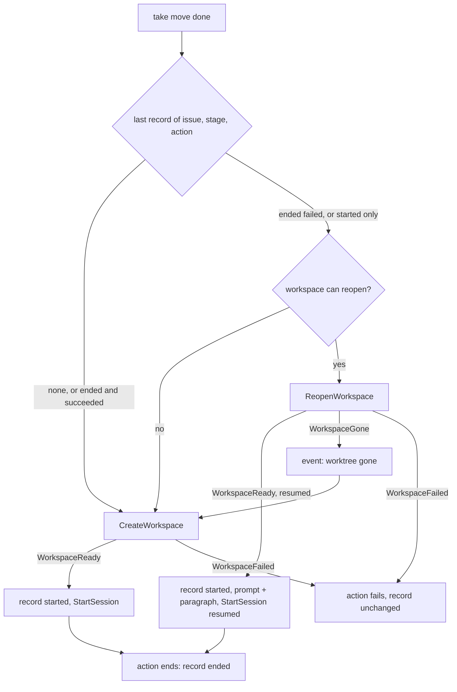
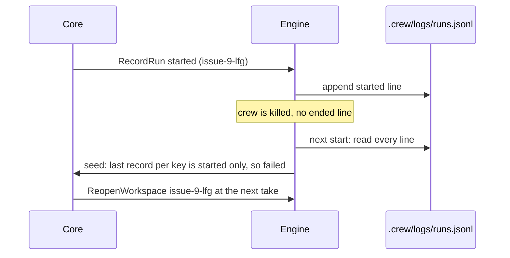

# Resume an Action That Stopped Partway - Plan

## Goal Capsule

- **Objective:** When an action stops partway, the boss relabels the issue and the work picks up where it stopped, with the earlier commits and files still there. The issue's labels, status comment and logs keep following it.
- **Means:** crew records how each run ends in a local journal. When the last run of an action failed, it reopens that run's worktree and branch, and appends a fixed paragraph to the new session's prompt (KTD1, KTD2, KTD4).
- **Product authority:** this Product Contract, copied from #15's body, within `STRATEGY.md`, the engine's architecture plan (`docs/plans/2026-10-01-2202-feat-crew-engine-architecture-plan.md`) and #14's Product Contract. Giving the issue back its stage's label stays the retry. This plan changes what that retry does after a failed run.
- **Open blockers:** none. #14 is not merged; this plan builds on `main` and works without it (see Risks).
- **Stop conditions:** stop and report if keeping the core pure requires it to read a clock, open a file or build a path, if `depguard` rejects a layering the plan relies on, or if a headless session cannot read a file outside its worktree (U3's execution note).
- **Execution profile:** Go only, in the existing packages, plus the docs pages and `AGENTS.md`. No new dependency, no config key, no change to `.crew/config.yaml`.
- **Finishes and ships:** `ce-work` implements U1 to U6 on this branch. The lfg run that invoked planning reviews the change and opens the pull request, whose body contains `Closes #15`.

---

## Product Contract

Product Contract preservation: unchanged from #15's body (R1 to R13, AE1 to AE8, Key Decisions, Scope Boundaries). The Key Decision on resume limits gains a conflict call-out from planning research.

### Summary

When a stage's label goes back on an issue whose last run of an action failed, crew reopens that run's worktree and branch instead of making new ones. The new session gets its usual prompt plus a fixed paragraph from crew: it continues an earlier session's work, the reason that session ended, and where its log is. To start over, the boss removes the worktree before relabeling.

### Problem Frame

When an action stops partway, crew can only start it over. Issue #9's `lfg` session committed the deepened plan and U1, left U2 uncommitted, and never started U3 to U6 (#13 has why). Relabeling the issue made a fresh worktree from `origin/main` (`issue-9-lfg-2`), because `Create` (`internal/adapter/git/workspace.go`) never reuses a worktree. The new session's prompt was only `/lfg #9`, so it knew nothing of the old branch and redid the work, for about USD 7.

The other way out is opening `claude` in `.crew/worktrees/issue-9-lfg` by hand. That happens outside crew, so the issue's labels, status comment and logs stop following the work.

#14 makes a session that stops early fail its check, so the issue lands in `on_failure` with a reason. It leaves resuming out of scope, and it decides that crew never retries on its own. After #14 the boss can see why an action failed, but the only retry still throws its work away.

### Key Decisions

- **A resume reuses the old worktree and branch with a new session, not the old conversation.** The worktree already holds the work, and a new session can read it with `git`. Governs R1, R5. (session-settled: user-directed — chosen over continuing the old conversation with `claude --resume`, over crew resuming on its own up to N times, and over a clean restart that removes the old worktree: the worktree already holds the work)
- **The stage's own label triggers the resume.** There is no new label. Governs R1. (session-settled: user-approved — chosen over a dedicated resume label, and over a per-stage config field that picks resume or restart: relabeling is already the retry)
- **Starting over means the boss removes the worktree.** crew adds no restart label and removes nothing. Governs R4. (session-settled: user-approved — chosen over a restart label, and over crew removing the old worktree and branch when it restarts: crew never removes worktrees)
- **crew appends a fixed paragraph to the prompt instead of offering template fields.** No prompt in a config has to change. Governs R5. (session-settled: user-approved — chosen over `{{.Previous...}}` template fields the boss writes into each prompt, and over both together: no config prompt has to change)
- **Only a failed run resumes.** crew never removes a worktree, so resuming whenever one exists would run actions such as `triage` and `audit ci` on a stale checkout, told they continue someone else's work. Governs R2. (session-settled: user-approved — chosen over resuming whenever the action's worktree exists: such actions would run on stale checkouts)
- **A run is resumed only by the same action in the same stage.** A different stage means a different prompt and different work, even when its action has the same name. Governs R3.
- **Resumes have no limit.** Each one needs the boss to relabel the issue. Governs R9.
  - Conflict call-out: the premise "crew cannot loop on its own" does not hold for every config. Validation forbids only a stage's `on_failure` equal to its own `label` (`internal/config/validate.go`), so two stages that fail into each other's label would hand the issue back and forth with no boss. Each stage resumes only its own runs, so this loop exists today with fresh restarts too. The plan keeps "no limit" and documents the loop (U6).

### Requirements

**Resuming**

- R1. When an issue gets a stage's label and the last run of one of that stage's actions on that issue failed, crew runs that action in the failed run's worktree, on its branch, instead of creating new ones.
- R2. A run counts as failed when its action failed for any reason (the session, its check from #14, a stop, a failure to start), and when it never recorded an end because crew crashed or was killed. A run that succeeded is never resumed.
- R3. The last run is the last run of the same action, in the same stage, on the same issue. An action with the same name in another stage does not share it.
- R4. When the failed run's worktree no longer exists, crew creates a new one as it does today. The old branch, and any pull request from it, are left as they are.
- R5. A resumed session gets the action's rendered prompt followed by a fixed paragraph from crew. The paragraph says that the session continues an earlier session's work in this worktree, gives that session's one-line reason and the path of its log, and tells it to check the worktree's state with `git`.
- R6. crew leaves a resumed worktree as it is: it does not fetch, merge or rebase the default branch into it.
- R7. In a stage with several actions, each action is decided on its own: those whose last run failed resume, and the others start fresh.
- R8. crew still knows how each run ended after it restarts, so R1 and R2 hold across restarts.
- R9. An action may be resumed any number of times.

**What the boss sees**

- R10. A resumed session's output goes into the same log as the run it continues, after that run's output.
- R11. The event lines, the TUI and the status comment say that the action resumed, and name its worktree.
- R12. A resumed run is judged like any other run, check included. When it fails, it becomes the last run, so the next relabel resumes it again.

**Docs**

- R13. `docs/guide/crew.mdx` documents the resume: when it happens, what the session is told, how to start over (with the command that removes a worktree), and that old branches and pull requests are the boss's to clean up. Its retry text changes to match. `docs/develop/` changes wherever its pages describe the retry or the workspace.

### Acceptance Examples

- AE1. **Covers R1, R2, R5, R10.** **Given** `development`'s `lfg` failed on #9 because its check found no pull request, leaving `.crew/worktrees/issue-9-lfg` with two commits and uncommitted files, **when** the boss swaps `crew:failed` for `crew:ready for development`, **then** `lfg` runs in that worktree on `crew/issue-9-lfg` with the commits and files intact. Its prompt ends with the paragraph, which quotes the check's reason and gives the log `.crew/logs/issue-9-lfg.log`, and the new session's output is appended to that log.
- AE2. **Covers R2.** **Given** `development`'s `lfg` succeeded on an issue, **when** the boss later puts `crew:ready for development` back on it, **then** `lfg` starts in a new worktree from origin's default branch, and its prompt has no paragraph.
- AE3. **Covers R4.** **Given** a failed run whose worktree the boss removed, **when** the boss relabels the issue, **then** crew creates a new worktree as today, with no paragraph, and leaves the old branch alone.
- AE4. **Covers R3.** **Given** `development`'s `lfg` failed on an issue, **when** the boss labels it `crew:ready for fix`, **then** `fix`'s `lfg` starts in a new worktree.
- AE5. **Covers R2, R8.** **Given** crew was killed while `lfg` ran, leaving the issue in `crew:in progress`, **when** crew starts again and the boss swaps `crew:in progress` for `crew:ready for development`, **then** `lfg` resumes in the worktree it was killed in.
- AE6. **Covers R7.** **Given** a stage with two actions where one succeeded and one failed, **when** the boss relabels the issue with that stage's label, **then** the failed action resumes in its worktree and the other starts in a new one.
- AE7. **Covers R9, R12.** **Given** a resumed `lfg` that fails again, **when** the boss relabels the issue, **then** `lfg` resumes once more in the same worktree, and the paragraph gives the latest run's reason.
- AE8. **Covers R6.** **Given** the default branch moved on since the failed run, **when** the action resumes, **then** the worktree's branch has the same commits it had when the run ended.

### Scope Boundaries

- Continuing the old session's conversation (`claude --resume`).
- crew resuming or retrying on its own.
- A restart label, or crew removing worktrees, branches or pull requests.
- Resuming after a success, such as working on review feedback in the same branch.
- Carrying a run's work into another stage, such as from `development` to `fix`.
- Template fields about the previous run.
- Bringing a resumed worktree up to date with the default branch.
- A limit on resumes, or measuring progress between attempts.
- Telling "finished" from "stopped early" in the session's stream (out of scope in #13 and #14 too).

Considered and not built:

- **Detecting a session that outlived crew.** After a SIGKILL or an OOM kill of crew, a `claude` process in its own group can outlive it, and a quick relabel could put two sessions in one worktree. crew already kills its process group on a forced exit and on a panic in `app.Run`, so only an outside kill leaves one behind. The guide warns about it (U6). Evidence that would change this: a report of two sessions writing one worktree.
- **A config check for `on_failure` cycles between stages.** The loop exists today without resume (see the Key Decision call-out). Evidence that would change this: an issue looping between two stages in practice.
- **Retrying a failed journal write.** A failed write is shown as an event line (KTD3). An unrecorded success then resumes after a restart, which the boss sees in the event line and the paragraph. Evidence that would change this: journal writes failing in practice.

### Dependencies / Assumptions

- #9's exact case needs #14. Without the check, a session that stops early is judged a success, so nothing resumes. Failures of the session itself, stops and crashes resume without #14.
- crew never removes a worktree: `port.Workspace` has only `Create`, and nothing in `internal/` removes a worktree or branch.
- Today crew records how a run ended only on the tracker (the failure report and the status comment). The session log is its only local file. R8 needs more than that, so this plan adds the run journal (KTD1).
- This has happened once (#9). It is worth building because each start-over costs a full session.

### Sources / Research

- #15 (this work), #13 (why #9's session stopped), #14 (the check, and "crew does not retry"), #9, #24 (a local per-run file; its triage asks whichever lands first to let the other reuse its record), #34 (removing worktrees of successful runs only).
- `internal/adapter/git/workspace.go` (`Create`, `free`: names and the `-2`, `-3` suffixes), `internal/port/port.go` (`Workspace` has only `Create`; optional capabilities by type assertion), `internal/engine/paths.go` (logs named after the workspace, opened for append), `internal/core/update.go` (`taken`, `workspaceReady`, `end`, `judge`), `internal/config/validate.go` (stage names unique; action names unique within a stage), `internal/adapter/claude/stream.go` (a session's reason is one line of at most 200 characters).
- `docs/solutions/security-issues/session-text-in-public-tracker-comments.md`: a session's words never go into a tracker comment. The paragraph carries the reason into the local prompt only, and the status comment gains only the worktree's name.
- A headless session started by crew reads files outside its worktree: this planning session, run by crew from `.crew/worktrees/issue-15-lfg`, listed `../../logs/` and read files under `/tmp`.

---

## Planning Contract

### Key Technical Decisions

- KTD1. **A run journal at `.crew/logs/runs.jsonl` is crew's record of how runs ended (R8).** The engine appends one JSON line when an action's workspace is ready (`"event": "started"`) and one when the action ends (`"event": "ended"`, with `succeeded` and `reason`). Each line also carries a format version, the time, the issue key and ref, the stage, the action, the workspace name, the branch and the log path. `.crew/logs/` is already in crew's `.gitignore` and in the guide's ignore rules, so no user edits a `.gitignore`. The format is documented in the guide so #24 can read the same file instead of adding its own. Rejected: reading outcomes back from the tracker, since a crashed run never posted one and the failure comment no longer carries a reason. Rejected: one file per run, which needs a name built from three free-text keys.
- KTD2. **The core decides; the engine stores.** The core holds the last record of each (issue key, stage, action), seeded from the journal before the first poll and updated by every record it asks the engine to write. At a take it chooses, per action, between reopening and creating. It never reads a file. The pure reducer stays the one place workflow decisions live (`internal/core/model.go`'s package doc).
- KTD3. **Journal writes run in the engine's loop, in order.** A `RecordRun` command is written synchronously when the loop launches it, not in a goroutine, so a run's "ended" line can never land before its "started" line. Each append starts on a fresh line: when the file does not end in a newline, as after a crash mid-write, the writer adds one first. A failed write comes back to the core as an input and is shown once as an event line. An unreadable journal at start is an environment error naming the file, before any poll (exit 2). A malformed line is skipped.
- KTD4. **Reopening is an optional `port.Reopener` capability of the workspace, found by type assertion.** `Reopen` takes the recorded workspace and returns it as it is now, or an error wrapping a new sentinel when its directory is gone. The core issues `ReopenWorkspace` only when the engine says the workspace can reopen (a `core.Option`, as `ReportingStatus` does for status comments). A workspace without the capability keeps today's behavior. This follows `AGENTS.md`: optional capabilities are separate interfaces, never stubs.
- KTD5. **A record names a workspace, and a newer start in that workspace retires every other key's record that names it.** Names repeat once a folder and its branch are gone (`free()`), so `fix/lfg` could get the name of `development/lfg`'s removed worktree. Without this rule the next `development` relabel would reopen `fix`'s work, against R3. The rule applies both when the journal is replayed and in memory.
- KTD6. **A run that never started a session keeps the reason of the last session in that workspace.** A run whose session never started (a stop while its workspace was reopened, a session that failed to start, a log that failed to open) still records "started" and "ended", so R2's "a failure to start" resumes. When the key's previous record names the same workspace, the ended line keeps that record's reason. The paragraph then quotes what the last session said, not "crew stopped". A run with only a "started" line gets the fixed reason "crew stopped before the run ended: it crashed or was killed".
- KTD7. **The paragraph is built in the core from data the engine supplies.** Its fixed text, the one-line reason and the log path go after the rendered prompt and a blank line. The log path is given twice: as `.crew/logs/<name>.log` in the main checkout (R5, AE1), and relative to the worktree (`../../logs/<name>.log`). The engine computes the second path, so the core builds none. The paragraph names the branch. It also says where the earlier output ends: before the resume marker line (KTD8).
- KTD8. **The log gets a JSON marker line before a resumed session's output (R10).** The engine writes `{"type":"crew","subtype":"resumed",...}` with the time before handing the log to the harness. Logs are stream-json from `claude`, so a JSON line keeps `jq` over a log working and is easy to find. A fresh session gets no marker, so today's logs are unchanged.
- KTD9. **The git adapter's `Reopen` inspects and never changes the checkout (R6).** It reads `git worktree list --porcelain` from the root. A missing directory, or one git lists as prunable, is gone. A directory git does not list is an error telling the boss to remove the folder, so work in it is never silently abandoned. Paths are compared after resolving symlinks on both sides. The branch is the one checked out, or the recorded one when HEAD is detached, as in the middle of a rebase. It does not fetch.
- KTD10. **Reopening has its own phase, "reopening workspace", and a gone worktree is an event.** The TUI does not say "creating workspace" while crew reopens one. When the worktree is gone, an event line says so before crew creates a new one (R4), so a `-2` worktree is never a surprise.

### High-Level Technical Design

The take of an issue, per action:

The journal across a crash (AE5):

### Assumptions

- Runs that ended before this version have no journal lines, so they never resume. Existing failed worktrees, such as #9's, start fresh on their next relabel. The guide says so.
- Renaming a stage or an action in the config orphans its records: the next run starts fresh.
- One crew runs per repository. A second crew on the same repository reads the journal only at its start.
- The paragraph follows a slash command in crew's own `development` and `fix` prompts, so it reaches `lfg` as part of its arguments. How `lfg` uses it is lfg's concern.

### Risks & Dependencies

- **#14 is being built in parallel.** It adds a check after the session, adds output to the log, and rewrites the status comment into per-stage-run entries. Whichever lands second rebases. Where this plan touches the same code: the ended record is written from the core's `end`, which #14's check also goes through, and the status comment's resumed wording sits on each action's line.
- **#24 is ready for development.** KTD1 documents the journal so #24 reuses it. If #24 lands first with its own file, this plan adopts that file's location and adds its "started" event instead of making a second one.

---

## Implementation Units

### U1. Port, domain and core types for resuming

- **Goal:** the types every later unit uses: the reopen capability, the run record, the new commands, inputs, events, phase and status fields.
- **Requirements:** R1, R4, R11 (types only).
- **Dependencies:** none.
- **Files:** `internal/port/port.go`, `internal/crew/status.go`, `internal/core/command.go`, `internal/core/input.go`, `internal/core/event.go`, `internal/core/model.go`, `internal/crew/status_test.go`.
- **Approach:**
  1. `port.Reopener` with `Reopen`, and a sentinel error for a gone workspace (KTD4). Fix `Space.Name`'s doc: a name is unique among the workspaces that exist, and a log may hold several sessions of one workspace.
  2. A run record type in `core` with the fields KTD1 lists, plus whether it ended and how.
  3. Commands `ReopenWorkspace` and `RecordRun`. Inputs `WorkspaceGone` and `RecordFailed`. `WorkspaceReady` gains `Resumed` and the log path from the workspace directory (KTD7). `StartSession` gains `Resumed`.
  4. Events: `ActionStarted` gains `Resumed`. New `WorkspaceGone` and `RunNotRecorded` events.
  5. `PhaseReopening` (KTD10). `ActionView` gains `Resumed`.
  6. `crew.ActionStatus` gains the worktree's name, set when the action resumed. It stays comparable, so `sameStatus` keeps working.
- **Patterns to follow:** the closed command, input and event sets in `internal/core`; `port.StatusReporter` and `port.Narrator` for an optional interface's doc.
- **Test scenarios:**
  - `crew.Status.Clone` copies an action's worktree name and shares no slice.
- **Verification:** the module builds and `depguard` passes with the new types.

### U2. Core: records, the resume decision and the paragraph

- **Goal:** the core holds each key's last run, reopens failed ones, appends the paragraph, and asks the engine to record every run.
- **Requirements:** R1, R2, R3, R4, R5, R7, R9, R11, R12.
- **Dependencies:** U1.
- **Files:** `internal/core/update.go`, `internal/core/model.go`, `internal/core/status.go`, `internal/core/resume.go` (new: records and the paragraph), `internal/core/resume_test.go` (new), `internal/core/update_test.go`, `internal/core/status_test.go`.
- **Approach:**
  1. Options: one seeds past records, replaying them in order with KTD5's rule. One says the workspace can reopen (KTD4).
  2. `taken`: per action, a failed or started-only last record and a workspace that can reopen give `ReopenWorkspace` and `PhaseReopening`. Anything else gives `CreateWorkspace`, as today. The rendered prompt is kept as now.
  3. `WorkspaceGone` emits the event and issues `CreateWorkspace` for that action (KTD10). After a stop, it ends the action with "crew stopped" instead and records nothing, as the core starts nothing new once stopping. `WorkspaceFailed` for a reopen fails the action as a create failure does, and records nothing.
  4. `WorkspaceReady`: record "started", applying KTD5 in memory. When resumed, append the paragraph (KTD7) to the prompt and pass `Resumed` on `StartSession`. After a stop, the action still ends with "crew stopped" as today, and its ended record follows KTD6.
  5. `end`: when the action has a workspace, record "ended" with its outcome, applying KTD6's reason carry-over. An action that never got a workspace records nothing, so an older failed record stays resumable.
  6. `RecordFailed` emits `RunNotRecorded` once per failure.
  7. `ActionStarted`, the view and the running and ended statuses carry the resumed flag and the worktree's name.
  8. The paragraph's fixed wording, roughly: this session continues the work of an earlier session on this action, in this worktree, on branch B; that session ended because "reason"; its output is in `.crew/logs/N.log` in the main checkout (`../../logs/N.log` from here), above the line crew wrote when this session started; check the worktree's state with `git status` and `git log` before going on, and continue from where it stopped. The reason is flattened to one line.
- **Execution note:** implement the decision table test-first, as the core's other behavior is.
- **Patterns to follow:** table tests in `internal/core/update_test.go`; `ReportingStatus` for an option; `cloneReport` for copying out.
- **Test scenarios:**
  - Covers AE1. A seeded record "ended, failed, reason R, workspace issue-9-lfg" for (9, development, lfg) and a reopen-capable model: the take gives `ReopenWorkspace` for issue-9-lfg. `WorkspaceReady{Resumed}` gives a `RecordRun` "started" and a `StartSession` whose prompt is the rendered prompt, a blank line, then the paragraph naming R, `.crew/logs/issue-9-lfg.log` and the branch.
  - Covers AE2. A seeded "ended, succeeded" record: the take gives `CreateWorkspace`, and the session's prompt has no paragraph.
  - Covers AE3. `WorkspaceGone` after `ReopenWorkspace`: a `WorkspaceGone` event, then `CreateWorkspace`. The fresh session's prompt has no paragraph.
  - Covers AE4. A failed record for (9, development, lfg), and the issue taken by `fix`: `fix`'s `lfg` gets `CreateWorkspace`.
  - Covers AE5. A seeded "started"-only record: the take reopens it, and the paragraph gives the fixed crashed-or-killed reason.
  - Covers AE6. A stage with actions a and b, a seeded as failed and b as succeeded: a gets `ReopenWorkspace`, b gets `CreateWorkspace`.
  - Covers AE7. A resumed run that ends failed with reason R2 records "ended, failed, R2". A second take of the same issue in the same model reopens the same workspace with R2 in the paragraph.
  - A model built without the reopen option issues `CreateWorkspace` even for a failed record.
  - KTD5: records for (9, development, lfg) and (9, fix, lfg) both naming issue-9-lfg, the fix one newer: the development take creates instead of reopening. The same holds after a fresh `WorkspaceReady` naming that workspace in memory.
  - KTD6: a resumed run whose session fails to start records "ended, failed" with the previous reason, and the next take's paragraph quotes it. The same holds for a stop that arrives while the workspace is reopened.
  - A render error or a `WorkspaceFailed` records nothing, and a seeded failed record stays resumable.
  - A stop, then `WorkspaceGone`: the action ends with "crew stopped", no `CreateWorkspace` is issued, and the seeded failed record stays.
  - `RecordFailed` emits one `RunNotRecorded` event naming the issue, stage and action.
  - The running status of a resumed action carries its worktree's name. A fresh action's carries none.
  - `ActionStarted` for a resumed action has `Resumed` set.
- **Verification:** every AE has a passing core test, and `go test -race ./internal/core` passes.

### U3. Engine: the journal, reopening and the log marker

- **Goal:** the engine loads and appends the journal, runs `ReopenWorkspace` through the workspace's capability, and marks resumed sessions in their log.
- **Requirements:** R1, R4, R8, R10.
- **Dependencies:** U1, U2.
- **Files:** `internal/engine/journal.go` (new), `internal/engine/journal_test.go` (new), `internal/engine/engine.go`, `internal/engine/exec.go`, `internal/engine/paths.go`, `internal/engine/engine_test.go`, `internal/fake/workspace.go`, `internal/app/app_test.go`.
- **Approach:**
  1. The journal (KTD1, KTD3): read the whole file into records in order, skipping malformed and empty lines. Append one record per call, adding a newline first when the file does not end in one. Paths are relative to the root.
  2. `Prepare` reads the journal after the ports' preparers and fails, naming the file, when it cannot be read. A missing file is no records. The core is seeded before the first tick.
  3. `New` passes the reopen option when the workspace implements `port.Reopener`.
  4. `launch` writes `RecordRun` synchronously. On error it posts `RecordFailed` from a goroutine counted as in flight, so the loop never blocks on its own inbox.
  5. `ReopenWorkspace` runs `Reopen` under the call timeout. The gone sentinel posts `WorkspaceGone`, any other error `WorkspaceFailed`, and success `WorkspaceReady{Resumed}`. `WorkspaceReady` also carries the log path relative to the workspace directory.
  6. `startSession` writes the marker line (KTD8) before starting a resumed session.
  7. Update `paths.go`'s comment: a log holds every session of one workspace.
  8. The fake workspace implements `Reopen`: gone when its directory is missing, the recorded space otherwise.
- **Execution note:** before relying on the worktree-relative log path, confirm once by hand that a headless `claude -p` session in a worktree reads `../../logs/<name>.log`. If it cannot, stop and report (Goal Capsule stop condition).
- **Patterns to follow:** `openLog` for files under `.crew/`; the synctest engine tests in `internal/engine/engine_test.go`; `app_test.go`'s whole-crew tests with the fakes.
- **Test scenarios:**
  - Journal round trip: started and ended lines written for two keys read back in order with every field.
  - A journal whose last line is cut mid-record: the next append starts on its own line, and reading skips only the cut line.
  - An unreadable journal path makes `Prepare` fail naming `.crew/logs/runs.jsonl`. A missing journal gives no records.
  - Covers AE1. Engine with the fake tracker, a scripted harness that fails `lfg` once, then succeeds, and the fake workspace: after a relabel, the second session runs in the first session's directory, its prompt ends with the paragraph, and the log holds the first output, the marker, then the second output.
  - Covers AE5. A first engine run whose journal holds only a "started" line for the action (written directly to the temp root), then a new engine on the same root: the relabeled action reopens that workspace.
  - Covers AE3. The fake workspace's directory removed between runs: the relabel emits a `WorkspaceGone` event, creates a new workspace (the fake's `Spaces()` gains an entry), and the session's prompt has no paragraph. The `-2` name is U4's to test, with real git.
  - A journal write failure (`.crew/logs/runs.jsonl` created read-only before the engine starts, so `Prepare` reads it but appends fail) gives a `RunNotRecorded` event, and the run goes on.
  - A workspace without `Reopen` (a wrapper type in the test exposing only `Create`) never reopens.
- **Verification:** `go test -race ./internal/engine ./internal/app` passes, and a crew run on a test repository writes `.crew/logs/runs.jsonl`.

### U4. git adapter: Reopen

- **Goal:** the `git` workspace reopens a recorded worktree without changing it.
- **Requirements:** R1, R4, R6.
- **Dependencies:** U1.
- **Files:** `internal/adapter/git/workspace.go`, `internal/adapter/git/workspace_test.go`.
- **Approach:** implement `port.Reopener` per KTD9. The directory is `.crew/worktrees/<name>` under the root, so a moved repository still finds it. Take the workspace lock, as `Create` does, so it never races a creation.
- **Patterns to follow:** `Create` and `free` in the same file; the real-git tests with a local bare origin and `GIT_CONFIG_GLOBAL`/`GIT_CONFIG_NOSYSTEM` set.
- **Test scenarios:**
  - Covers AE8. Create a worktree, commit in it, leave an uncommitted file, then push a new commit to origin's default branch: `Reopen` returns the same directory and branch, the worktree's HEAD is its own commit, and the uncommitted file is still there.
  - A worktree removed with `git worktree remove --force`: `Reopen` returns the gone sentinel.
  - A worktree whose folder was deleted without git (prunable): the gone sentinel.
  - A folder under `.crew/worktrees/` that git does not list: an error that names the folder and says to remove it.
  - A worktree with a detached HEAD: `Reopen` returns the recorded branch.
  - A root reached through a symlink (the temp root behind one): `Reopen` still matches the worktree.
- **Verification:** `go test -race ./internal/adapter/git` passes.

### U5. Renderers: event lines, TUI and status comment

- **Goal:** the boss sees that an action resumed and in which worktree (R11).
- **Requirements:** R4, R11.
- **Dependencies:** U1, U2.
- **Files:** `internal/ui/lines/lines.go`, `internal/ui/lines/lines_test.go`, `internal/ui/tui/view.go`, `internal/ui/tui/testdata/` (golden files), `internal/ui/tui/view_test.go`, `internal/adapter/github/status.go`, `internal/adapter/github/status_test.go`.
- **Approach:**
  1. Lines: a resumed `ActionStarted` reads like "#9 development/lfg resumed in worktree issue-9-lfg on branch crew/issue-9-lfg, log .crew/logs/issue-9-lfg.log". `WorkspaceGone` says the worktree is gone and crew creates a new one. `RunNotRecorded` says the run was not recorded and a restart may not resume it, with the reason.
  2. TUI: the Actions region shows "reopening workspace", and a resumed running action reads "resumed in issue-9-lfg, running 3m".
  3. Status comment: a resumed action's line names its worktree in a code span, for example "**`lfg`** resumed in worktree `issue-9-lfg` and has been running for 5 minutes." Ended lines keep saying it resumed. Nothing a session said is added (see the learning in Sources).
- **Patterns to follow:** `lines.Text`; the TUI's golden tests; `renderStatus` and its tests.
- **Test scenarios:**
  - `lines.Text` for a resumed and a fresh `ActionStarted`, `WorkspaceGone` and `RunNotRecorded`.
  - TUI golden: one action reopening, one resumed and running, one fresh and running.
  - Status comment: a resumed running action with and without what it last said, and a resumed action that failed. A fresh action's text is unchanged.
- **Verification:** `go test -race ./internal/ui/... ./internal/adapter/github` passes, and the golden diff shows only the new wording.

### U6. Docs and agent guidance

- **Goal:** the guide and the contributor pages describe the resume as built (R13).
- **Requirements:** R13.
- **Dependencies:** U2, U3, U4, U5.
- **Files:** `docs/guide/crew.mdx`, `docs/develop/architecture.mdx`, `AGENTS.md`.
- **Approach:**
  1. Guide: the retry section says a relabel after a failed run resumes it, what the session is told, and that output goes on in the same log after a marker line. Starting over is `git worktree remove --force .crew/worktrees/<name>` before relabeling. Old branches and pull requests are the boss's to clean up.
  2. Guide: the naming section lists `.crew/logs/runs.jsonl` and its line format. "No recovery after a crash" becomes: relabel the issue and the run resumes. "No retries" says crew never retries on its own.
  3. Guide: state that runs from before this version do not resume, that stages failing into each other's labels loop, and that a session left running after crew was killed must be stopped before relabeling.
  4. Develop: the inputs, commands and phases lists, the Workspace port's optional `Reopener`, and the engine's journal.
  5. `AGENTS.md`: the `port` bullet names `Reopener` among the optional interfaces.
- **Test scenarios:** Test expectation: none -- documentation only; `pnpm docs:check` validates links and MDX.
- **Verification:** `pnpm docs:check` passes, and no page still says a relabel always starts fresh.

---

## Verification Contract

| Gate | Command | Applies to |
| --- | --- | --- |
| Tests | `go test -race ./...` | U1 to U5 |
| Format | `gofmt -l cmd internal` prints nothing | U1 to U5 |
| Vet | `go vet ./...` | U1 to U5 |
| Lint and layering | `go run github.com/golangci/golangci-lint/v2/cmd/golangci-lint@v2.14.0 run` | U1 to U5 |
| Vulnerabilities | `go run golang.org/x/vuln/cmd/govulncheck@v1.8.0 ./...` | U1 to U5 |
| TUI goldens | `go test ./internal/ui/tui -update`, then review the diff | U5 |
| Docs | `pnpm install`, then `pnpm docs:check` | U6 |

---

## Definition of Done

- Every acceptance example AE1 to AE8 has a passing test: AE1 to AE7 in the core and AE1, AE3 and AE5 again through the engine, AE8 in the git adapter.
- Every gate in the Verification Contract passes.
- The guide, the develop pages and `AGENTS.md` match the behavior, and no doc says a relabel always starts fresh.
- The pull request body contains `Closes #15`.
- No abandoned-attempt code, stray debug output or unused type remains in the diff.
