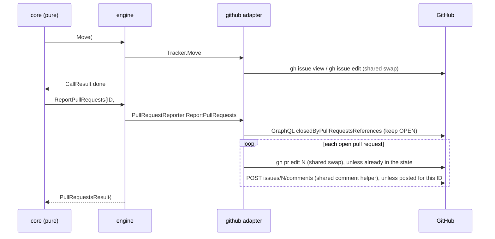
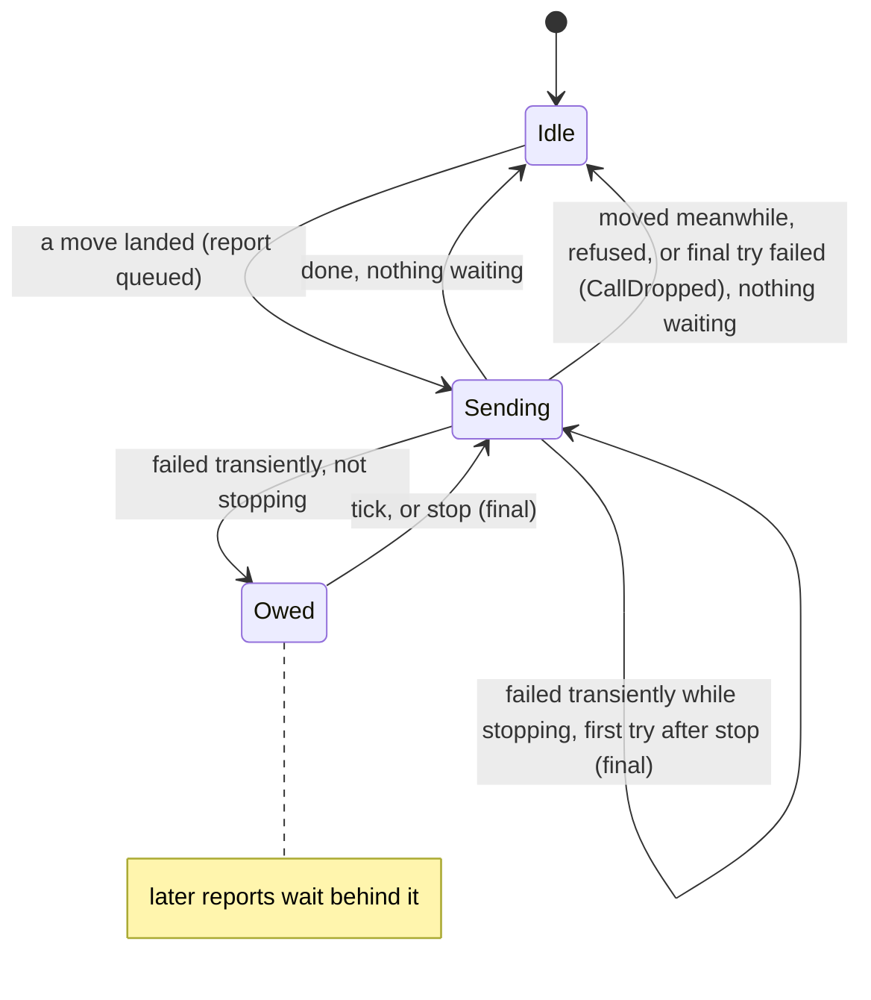

# The Pull Request Shows crew's State - Plan

## Goal Capsule

- **Objective:** Looking at a pull request that crew's session opened, without opening its issue, the boss can tell what state crew holds the work in and whether anyone still watches the pull request.
- **Means:** each move crew makes is followed by one pull request report through a new optional tracker interface. The report mirrors the issue's crew label onto the issue's open closing pull requests and, when the move ended a stage, posts a stop comment on them (KTD1, KTD2, KTD3).
- **Product authority:** this Product Contract, copied from #31's body, within `STRATEGY.md` and the engine's architecture plan (`docs/plans/2026-10-01-2202-feat-crew-engine-architecture-plan.md`). #44, which kept the session's words out of crew's comments, is merged, and the stop comment follows the same rule.
- **Open blockers:** none.
- **Stop conditions:** stop and report if keeping the core pure requires it to do I/O or read a clock, if `depguard` rejects a layering the plan relies on, or if, once this branch's pull request is open, GitHub's `closedByPullRequestsReferences` on #31 does not list it with state `OPEN` (U5's execution note).
- **Execution profile:** Go only, in the existing packages, plus the docs pages, `AGENTS.md` and `CONCEPTS.md`. No new dependency, no config key, no change to `.crew/config.yaml`.
- **Finishes and ships:** `ce-work` implements U1 to U6 on this branch. The lfg run that invoked planning reviews the change and opens the pull request, whose body contains `Closes #31`.

---

## Product Contract

Product Contract preservation: unchanged from #31's body (R1 to R10, F1 and F2, AE1 to AE5, Key Decisions, Scope Boundaries). The deferred questions are answered in the Planning Contract (KTD2, KTD4, KTD8). Assumptions records how planning reads R4 and AE5.

### Summary

Each time crew moves an issue, it also finds the issue's open pull requests and gives them the same `crew:` label, removing the old one. When a stage ends, crew posts a new comment on each of them saying nobody watches the pull request any more, with the stage's outcome. crew writes both. The session does not.

### Problem Frame

In a crew session, `lfg` runs `ce-babysit-pr` in pipeline mode as a bounded step. The babysit fixes CI, answers review comments, and stops when CI is decided, at its budget (3 fix rounds by default), or when only items needing a person are left. Then `lfg` writes its close-out, the turn ends, and the session ends with it. Nothing restarts the watch. So the babysit stopping and the session ending are in practice the same moment.

Nothing on the pull request shows that moment. The babysit sometimes leaves a run-report comment for unfixable CI or for residuals with no review thread, but never one saying it stopped watching. The boss cannot tell from the pull request whether new review comments and CI failures will still be handled or now need a person.

The issue's state lives only in the issue's labels. crew does not look at pull requests today (`docs/guide/crew.mdx`, its opening and "What succeeded means"), so the pull request list shows nothing of where crew is.

### Key Decisions

- **Both ideas in one plan, framed as "the pull request shows crew's state".** Both need the same thing: knowing which pull requests belong to the issue. (session-settled: user-directed — chosen over brainstorming the stop comment and the mirrored labels separately: they are one outcome for the boss.)
- **crew writes to the pull request, on its own transitions.** Only crew sees every stage end, including a session that crashed, timed out or was stopped, and only crew sets the label after the session exits. Governs R3, R5. (session-settled: user-directed — chosen over the session writing through the action prompt, and over crew labelling while the session comments: a crashed or stopped session writes nothing, and a session cannot apply the label crew sets after it exits.)
- **Exact mirror of the issue's `crew:` label.** One rule, no list of states to keep. Governs R3. (session-settled: user-directed — chosen over mirroring only the end states, and over also detecting a new pull request while the session runs.)
- **A new comment at each stage end.** GitHub notifies on a new comment, and a rerun leaves a visible trail. Governs R5, R6. (session-settled: user-directed — chosen over one comment edited in place, which notifies nobody, and over a watching/stopped pair of comments, which adds noise.)
- **One commenting implementation.** Commenting on an issue and on a pull request may be two methods, but they share one implementation, with no duplicated code. Governs R8. (session-settled: user-directed — chosen over a separate commenting function for pull requests: on GitHub both are the same comment.)
- **The issue's pull requests are the open ones GitHub links as closing it.** The prompts already require the `Closes #N` line. Matching the session's branch would miss a rerun, which works on a new branch (`crew/<name>-2`). Governs R1.
- **The mirror reuses crew's existing label swap.** Same rule as the comments: no second copy. Governs R9.

### Requirements

**Finding the pull requests**

- R1. The issue's pull requests are the open pull requests GitHub links as closing the issue, whoever opened them. Merged and closed pull requests are left alone.
- R2. When the issue has no such pull request, crew writes to no pull request, and the issue's own handling is unchanged.

**Mirrored labels**

- R3. Each time crew moves an issue to a `crew:` label, it gives each of the issue's pull requests that label and removes every other `crew:` label from them. Labels that are not crew's stay.
- R4. The mirror goes from issue to pull request only. crew never reads a pull request's labels, and a `crew:` label put on a pull request by hand is replaced at the issue's next move.

**Stop comment**

- R5. When a stage ends on an issue, whether it succeeded, failed or was stopped with crew, crew posts a new comment on each of the issue's pull requests after moving the issue.
- R6. The comment says that nobody watches the pull request any more, so review comments and CI failures now need a person. It also gives the stage, its outcome, the issue's new label, the failure reason when the stage failed, and a link to the issue's status comment.

**Errors**

- R7. A write to a pull request that fails never blocks or undoes the issue's move. It follows the rule moves and comments already follow (`docs/guide/crew.mdx`, the paragraph after the failure report): retried at every poll and once more when crew stops, or dropped and reported when it cannot work.

**Code shape**

- R8. Commenting on an issue and commenting on a pull request share one implementation, which both the issue's failure report and the pull request's stop comment go through. The status comment, which is edited in place, stays as it is.
- R9. Mirroring labels onto a pull request reuses the label swap crew already does on the issue.

**Docs**

- R10. The guide says what crew writes to pull requests, and its statements that crew does not look at pull requests are rewritten. An action's success is still decided by how its session ended, not by the pull request.

### Key Flows

- F1. A stage ends with a pull request open.
  - **Trigger:** the last session of the stage ends, for example after `lfg`'s babysit returned.
  - **Steps:** crew moves the issue to the stage's `on_success` or `on_failure`. It finds the issue's open pull requests and gives each the same `crew:` label. It posts the stop comment on each.
  - **Covers R1, R3, R5, R6.**
- F2. A rerun.
  - **Trigger:** the boss puts a stage's label back on an issue whose pull request is still open.
  - **Steps:** the boss's relabel is not a crew move, so the pull request keeps its old label until crew takes the issue. Then crew mirrors `moves_to` onto it, and at the stage's end the end label with a new stop comment (F1).
  - **Covers R3, R5.**

### Acceptance Examples

- AE1. **Covers R3, R5, R6.** Given #42 in `crew:in progress` and open pull request #50 whose body says `Closes #42`, when the development stage succeeds, then #42 and #50 both carry `crew:waiting review` and neither carries `crew:in progress`. #50 also gets a new comment saying nobody watches it, with the stage `development`, its success, the label `crew:waiting review` and a link to #42's status comment.
- AE2. **Covers R5, R6.** Given the same, when the boss stops crew while the session runs, then #50 carries `crew:failed`, and its new comment says the stage failed because crew stopped the session.
- AE3. **Covers R1, R2.** Given #42 with merged pull request #48 and open pull request #50, both closing it, when the stage ends, then only #50 is labelled and commented. Given #43 in the triage stage with no linked pull request, when triage ends, then no pull request is labelled or commented.
- AE4. **Covers R4.** Given #42 in `crew:waiting review` and its pull request #50, when the boss adds `crew:ready for fix` to #50 by hand, then crew takes no work from it. When #42 next moves, #50's `crew:` labels are replaced by #42's.
- AE5. **Covers R7.** Given GitHub refuses the label edit on #50, when the stage ends, then #42 still moves to its end label, and the edit on #50 is retried at the next poll.

### Scope Boundaries

- `ce-babysit-pr` is unchanged. The comment does not give the babysit's own reason (merge-ready, needs-human, out of budget), because crew does not see it.
- crew does not watch pull requests or restart the babysit.
- crew does not look for a new pull request while a session runs. A pull request first gets a label at the issue's next move.
- A pull request's labels or state never decide an action's success.
- A merged pull request keeps the last label it got, usually `crew:waiting review`, the same as the closed issue. crew does not clean it up.
- No mirroring from pull request to issue, and no mirroring of labels that are not crew's.
- No config switch to turn the mirror or the comment off.
- Considered and not built: a pull request report after a verdict move that crew gave up. The issue is then not in the state the report would mirror, and the status comment already says the move was given up. Evidence that would change this: bosses finding pull requests with no stop comment after a stop whose final move failed.
- Considered and not built: deduplicating stop comments across crew processes. An owed report dies with its process, as owed moves do, so no later process retries it.

### Dependencies / Assumptions

- The stage prompts that open a pull request keep requiring `Closes {{.Issue.Ref}}` (development, fix and knowledge base in `.crew/config.yaml`). crew does not find a pull request without that line.
- In a crew session the babysit stops before the session ends, and nothing restarts it, so at a stage's end nobody watches the pull request.
- crew lists work through issues only (`internal/adapter/github/tracker.go`, `issuesQuery`), so a `crew:` label on a pull request never becomes work.
- A pull request that closes several issues carries the label of the issue crew moved last.

### Sources / Research

- `docs/guide/crew.mdx`: crew does not open or look at pull requests (opening paragraph, "What succeeded means"). The retry rule for moves and comments follows the failure report. Stopping crew moves running issues to `on_failure` ("Stop it").
- `internal/adapter/github/tracker.go`: `issuesQuery`, the issues-only listing; `Move`, the label swap; `ReportFailure`.
- `internal/adapter/github/status.go`, `report.go`: the status comment, edited in place, and the separate failure report.
- `internal/adapter/git/workspace.go`: each action's branch is `crew/<name>`, with `-2`, `-3` for a taken name.
- `.crew/config.yaml`: the `Closes {{.Issue.Ref}}` line in the development, fix and knowledge base prompts.
- compound-engineering plugin 3.30.3, `skills/lfg/references/shipping.md`: the bounded babysit step, and the note that pipeline mode stops at "CI decided", not "merged". `skills/ce-babysit-pr/references/pipeline.md`: the run-report comment.
- `docs/plans/2026-10-02-0152-feat-status-comment-plan.md`, `docs/plans/2026-10-02-0159-feat-workflow-labels-plan.md`: the status comment and workflow labels this builds on.

---

## Planning Contract

### Key Technical Decisions

- KTD1. **One optional tracker interface, `port.PullRequestReporter`, with one method, `ReportPullRequests(ctx, crew.PullRequestReport)`.** A report names the issue, the state it moved to and, when the move ended a stage, the stage's end. The adapter finds the pull requests, mirrors the label and posts the stop comment in one call, so one lookup serves both. The engine finds it by type assertion, as it finds `StatusReporter`, and without it the core makes no pull request report. Rejected: mirroring inside `Tracker.Move`, because a failed pull request edit would then fail the move, which R7 forbids. Also rejected: separate mirror and comment methods, which need two lookups and an order between them. Governs the mechanism of R3, R5, R7.
- KTD2. **A report follows every move that landed.** When a take's `Move` comes back done, the core sends a report with the stage's `moves_to` and no end. When a verdict `Move` comes back done, the report carries `on_success` or `on_failure` and the stage's end. A verdict move crew gave up sends no report (Scope Boundaries). This answers when crew looks the pull requests up: at each report, with no cache, so a pull request opened while a stage ran gets its label at the next move. Rejected: caching the pull requests per stage, which would miss that pull request.
- KTD3. **The core keeps a pull request slot per issue key, apart from the held issues, on the status slot's pattern (`internal/core/status.go`).** A slot sends one report at a time, in the order the moves landed, so the verdict's label can never land before the take's. A report that fails transiently is owed: it is retried at every tick and once more at stop, and it holds back the issue's later reports until it lands or is dropped. A report answered `ResultMovedMeanwhile` or `ResultRefused`, or failing its one try after a stop, is dropped. Reports never hold an issue or one of `max_parallel_issues`'s slots, and never change a held issue's claim. `Model.Stopped` waits for the slots as it waits for statuses. This answers the deferred question: the pull request report is owed apart from the issue's move. Rejected: a third kind of call on the held issue, because an owed take mirror would turn a running issue's claim to `ClaimOwed` and keep the issue held. Governs R7.
- KTD4. **The adapter finds the pull requests with one GraphQL query on the issue's `closedByPullRequestsReferences`, keeping the nodes whose `state` is `OPEN` and whose `repository { nameWithOwner }` is the issue's.** The same query returns the issue's URL and each pull request's number and labels. GitHub returns merged pull requests even with `includeClosedPrs: false`, as checked on #44 (it lists merged #46 and #53), so the `OPEN` filter is what enforces R1. A pull request in another repository can close the issue with `Closes owner/repo#N`, but `gh pr edit <number>` and the comment call work on crew's repository. The repository filter keeps crew from writing to an unrelated pull request or issue that has the same number. An issue GitHub cannot resolve is `port.ErrMovedMeanwhile`, and other errors are transient. Governs R1, R2.
- KTD5. **The label swap is one function shared by `Move` and the mirror (R9).** Given a labelable's current labels and the target state, it returns the `--remove-label` arguments for every crew label other than the target, extras included, and the states found. `Move` keeps its `from` check and its `gh issue edit`. The mirror runs `gh pr edit <number>` with the same arguments plus `--add-label`, and edits nothing when the pull request's only crew label is already the target. A missing label is `port.ErrRefused`, as in `Move`. Reading the pull request's labels serves only this swap (Assumptions on R4).
- KTD6. **One comment helper posts every new comment (R8).** It posts through `gh api --method POST repos/{owner}/{repo}/issues/<number>/comments`, which GitHub serves for issues and pull requests alike, returns the new comment's id, and classifies errors with `classify(err, out, true)`. `ReportFailure`, the stop comment and `createStatus` all post through it. `ReportFailure` therefore moves from `gh issue comment` to the REST call, and its errors become classified as the port already documents: 404 or 410 is moved meanwhile, a 403 that is not a rate limit is refused. The status comment's in-place edit (`PATCH`) stays as it is. Rejected: a second, pull-request-only comment function (the Key Decision on one commenting implementation).
- KTD7. **A retried report never posts the same stop comment twice.** Each report carries an `ID` the core assigns, unique within a crew process and kept across retries. The adapter remembers, per report ID, the pull requests it already commented on, skips them on a retry, and forgets the ID once the report succeeds. The label swap needs no memory, since it is idempotent. The adapter writes every pull request even when one fails. It returns a transient error when any write failed transiently, so the report is retried. Otherwise it returns the first refusal or moved-meanwhile error. Rejected: a hidden marker searched for in each pull request's comments, which costs a listing per pull request per report.
- KTD8. **The stop comment is crew's own words, rendered by the GitHub adapter (R6).** It names the stage in a code span, says it succeeded or failed on the issue, and gives the label the issue and this pull request moved to. It says that nobody watches the pull request any more, so new review comments and CI failures need a person. It links the issue's status comment. A failed stage lists each failed action with its cause and log, in the words of the status comment's failure line, which this work moves into one helper used by both. Like the status comment, it carries no session text (`docs/solutions/security-issues/session-text-in-public-tracker-comments.md`), and the only outside text is a check's reason, already stripped of control characters by the engine. The link is `<issue URL>#issuecomment-<id>`, taken from the tracker's cached status comment, or found with `findStatus` when nothing is cached. Without a status comment, the comment links the issue itself.
- KTD9. **Owed and dropped reports reuse the `CallOwed` and `CallDropped` events, with a new `CallKind`, `CallPullRequests`, whose `To` is the report's state.** The event lines render it as "updating the pull requests of #42 to `<state>`", and `View.Owed` lists owed reports like owed moves. A report that lands emits no event, as a status write emits none, because the core does not know whether the issue had any pull request.

### High-Level Technical Design

The flow of one verdict, from the core to GitHub. The take follows the same path with no stop comment.

The pull request slot of one issue, in the core. "send next" takes the oldest waiting report.

### Assumptions

- R4's "crew never reads a pull request's labels" means crew takes nothing from them: no work, no mirror back to the issue. The swap reads them only to know which crew labels to remove, exactly as `Move` reads the issue's (KTD5).
- AE5's "GitHub refuses the label edit" is a failed edit, retried at the next poll. A refusal for good, such as a missing label or a 403 that is not a rate limit, is dropped and reported, under R7's "dropped and reported when it cannot work".
- `gh pr edit` with only label flags works with the scopes `gh auth status` already requires. The adapter tests script gh, so the first live run confirms it.
- A pull request links as closing an issue only when it targets the default branch, which is how crew's prompts open them.

### Risks & Dependencies

| Risk | Mitigation |
| --- | --- |
| A stop comment posted twice when gh reports an error although the comment landed. | The same risk already exists for the failure report. KTD7 covers the common case, a later pull request failing. |
| One extra GraphQL query per move, two edits and a comment per pull request at a stage end. | crew moves an issue twice per stage. The cost is small next to the status comment's writes at every poll. |
| Retrying a report holds back the issue's later reports while GitHub fails. | Same rule as an ended status (KTD3). The event lines report each failure, and stop gives it one final try. |

---

## Implementation Units

### U1. Domain, port and fakes

**Goal:** the types every layer shares: the report, the optional interface, and fakes that implement it.

**Requirements:** R3, R5, R6 (KTD1, KTD7).

**Dependencies:** none.

**Files:**
- `internal/crew/pullrequest.go` (new): `PullRequestReport` (`ID`, `IssueKey`, `IssueRef`, `State`, `End`) and `StageEnd` (`Stage`, `Actions []ActionStatus`), with `Clone`.
- `internal/crew/pullrequest_test.go` (new).
- `internal/port/port.go`: `PullRequestReporter`, documented like `StatusReporter`, with its errors classified as `Move`'s are. Update the package comment's list of optional interfaces.
- `internal/fake/tracker.go`: a `PullRequestBoard` recording reports by issue key, with scripted failures, and a tracker type that embeds `ReportingTracker` and the board, with compile-time guards.

**Approach:** `StageEnd` reuses `crew.ActionStatus` so a stage end carries the same per-action state, cause, check reason and log as an ended status. Only ended values are set. A stage failed when any action failed. The plain `fake.Tracker` and `ReportingTracker` must not gain the interface, so existing tests keep their command sequences.

**Patterns to follow:** `crew.Status` and `Clone` in `internal/crew/status.go`; `StatusBoard` and `ReportingTracker` in `internal/fake/tracker.go`.

**Test scenarios:**
- `Clone` of a report with an end returns a copy whose `End` and `Actions` share no memory with the original.
- `Clone` of a report without an end keeps `End` nil.

**Verification:** the packages build, `depguard` passes, and the fake satisfies `port.PullRequestReporter` at compile time.

### U2. Core: the pull request slot

**Goal:** the core sends one report per landed move, in order, and owes, retries and drops them under R7 without touching the issue's move.

**Requirements:** R2, R3, R5, R7 (KTD2, KTD3, KTD9); F1, F2; AE2, AE5.

**Dependencies:** U1.

**Files:**
- `internal/core/pullrequest.go` (new): the slot, queueing, sending, results, retries and the busy check.
- `internal/core/model.go`: the `ReportingPullRequests()` option, the slots map (nil when off), `Stopped` waiting for busy slots, `View.Owed` listing owed reports.
- `internal/core/command.go`: `ReportPullRequests{Report}`.
- `internal/core/input.go`: `PullRequestsResult{IssueKey, Result, Reason}`, stamped like `StatusResult`.
- `internal/core/event.go`: `CallPullRequests` and its `String`; `Call.To` carries the report's state.
- `internal/core/update.go`: queue a report in `callResult` when a move is done: the take with `moves_to`, the verdict with its end. Retry owed reports in `tick`, give them their final try in `stop`, and dispatch `PullRequestsResult`.
- `internal/core/pullrequest_test.go` (new).

**Approach:**
1. The stage end is built from `s.status(h, crew.StatusEnded).Actions`, so it carries exactly what the ended status carries, with no session text (R12 of the status comment).
2. The report ID comes from the model's existing `lastID` counter, formatted as text, so it is unique in the process and fixed for the report's life (KTD7).
3. Queueing a report never adds a call to `h.calls`, so the held issue is released and its handled entry is kept exactly as today.
4. Each queued report keeps its own `final` flag, because several reports of one issue can each need their one try after a stop.

**Patterns to follow:** `statusSlot`, `pump`, `send`, `statusResult`, `retryStatuses` and `statusesBusy` in `internal/core/status.go`; the table tests in `internal/core/status_test.go`.

**Test scenarios:**
- Without `ReportingPullRequests`, a full stage emits no `ReportPullRequests` command.
- A take whose move is done sends a report with the stage's `moves_to` and no end.
- A take whose move fails sends no report.
- Covers AE1. A stage whose actions all succeed sends, after the verdict move is done, a report with `on_success` and an end naming the stage with every action succeeded.
- A failed stage's report carries `on_failure` and the failed action with its cause and log. A failed check's action carries the check's reason.
- Covers AE2. After a stop while the session runs, the verdict report carries `on_failure`, with the action failed and its cause `CauseStopped`.
- A verdict move answered `ResultMovedMeanwhile` sends no report.
- The verdict report waits while the take report is in flight, and is sent once the take report's result arrives.
- Covers AE5. A report failing transiently emits `CallOwed` with kind `CallPullRequests`, leaves the issue's handled entry with `MoveDone`, and is resent with the same ID at the next tick.
- An owed report shows in `View.Owed`, and a later report of the same issue waits until it lands.
- A report answered `ResultRefused` or `ResultMovedMeanwhile` emits `CallDropped` and the next waiting report is sent.
- At stop, an owed report is sent once more. If it fails again, it is dropped and `Stopped` is emitted once nothing else is busy.
- `Stopped` stays false while a report is in flight, even when no issue is held.
- A running issue whose take report is owed keeps `ClaimRunning`, and its actions start as usual.
- Two reports of different issues have different IDs, and a retried report keeps its ID.

**Verification:** `go test -race ./internal/core` passes. The core still imports only `crew`.

### U3. Engine and event lines

**Goal:** the engine runs reports through the tracker's `PullRequestReporter` and feeds results back. The event lines name owed and dropped reports.

**Requirements:** R7 (KTD1, KTD9).

**Dependencies:** U1, U2.

**Files:**
- `internal/engine/engine.go`: detect the interface in `New`, keep it in a field, add the core option.
- `internal/engine/exec.go`: launch `ReportPullRequests`, call the reporter under `callContext`, map the error with `classify` and post `PullRequestsResult`.
- `internal/engine/engine_test.go` (or a new `pullrequest_test.go` in the package).
- `internal/ui/lines/lines.go`, `internal/ui/lines/lines_test.go`: the `call` text for `CallPullRequests`.

**Approach:** mirror `reportStatus` in `exec.go`. Check whether the TUI renders owed calls by kind. Today it does not, so no golden file should change. If one does, review the diff before `-update`.

**Patterns to follow:** `reportStatus` and the `StatusReporter` detection in `internal/engine`; the engine tests about status comments, under `testing/synctest`.

**Test scenarios:**
- Covers F1. With the fake pull request tracker, an issue taken and succeeding records two reports in order: `moves_to` without an end, then `on_success` with the stage's end.
- With a plain `ReportingTracker`, the same run records statuses and no report, and the engine still stops cleanly.
- A report failing with a transient error is retried at the next poll and recorded once it succeeds, while the issue already shows its verdict state.
- A report failing with `port.ErrRefused` is not retried.
- Stopping crew while a report is owed gives it one final try before `Run` returns.
- The event line for an owed report reads "updating the pull requests of #42 to `<state>` failed, retrying at the next tick", with its reason.

**Verification:** `go test -race ./internal/engine ./internal/ui/...` passes with no goroutine leak under `synctest`.

### U4. GitHub adapter: one comment helper

**Goal:** every new comment crew posts goes through one helper (R8), before the stop comment exists.

**Requirements:** R8 (KTD6).

**Dependencies:** none.

**Files:**
- `internal/adapter/github/tracker.go` or a new `comment.go`: the helper, and `ReportFailure` through it.
- `internal/adapter/github/status.go`: `createStatus` through it, with the same error wording and caching.
- `internal/adapter/github/tracker_test.go`, `internal/adapter/github/status_test.go`: the scripted gh calls updated to the REST form.

**Approach:** the helper takes the issue or pull request number and the body, returns the comment id, and classifies with `classify(err, out, true)`. Callers that do not need the id ignore it.

**Patterns to follow:** `createStatus` today, which already posts this way; the scripted runner in the adapter's tests.

**Test scenarios:**
- `ReportFailure` posts one `POST repos/{owner}/{repo}/issues/42/comments` call carrying the rendered report as `body`.
- `ReportFailure` answered with HTTP 404 returns an error wrapping `port.ErrMovedMeanwhile`.
- `ReportFailure` answered with HTTP 403 and no rate-limit text returns an error wrapping `port.ErrRefused`.
- `ReportFailure` answered with an HTTP 403 rate limit, or with no HTTP status, returns a transient error.
- The existing `createStatus` tests pass with the same requests, ids and cache behavior.

**Verification:** `go test -race ./internal/adapter/github` passes. No gh call outside the helper posts a new comment.

### U5. GitHub adapter: ReportPullRequests

**Goal:** the GitHub tracker implements `port.PullRequestReporter`: find the open closing pull requests, mirror the label, post the stop comment.

**Requirements:** R1, R2, R3, R4, R5, R6, R7, R9 (KTD4, KTD5, KTD7, KTD8); AE1 to AE5.

**Dependencies:** U1, U4.

**Files:**
- `internal/adapter/github/pullrequest.go` (new): the query, `ReportPullRequests`, the per-ID memory of posted comments.
- `internal/adapter/github/tracker.go`: the shared swap extracted from `Move`, the compile-time guard, and the package comment.
- `internal/adapter/github/report.go` or `status.go`: the stop comment's renderer, and the failed-action line shared with `renderStatus`.
- `internal/adapter/github/pullrequest_test.go` (new).

**Approach:**
1. One GraphQL query by issue number returns the issue's `url` and `repository { nameWithOwner }`, and its `closedByPullRequestsReferences(first: 100)` nodes with `number`, `state`, `repository { nameWithOwner }` and `labels(first: 100)`. Keep the `OPEN` nodes in the issue's repository (KTD4).
2. For each pull request in number order, compute the swap (KTD5), edit with `gh pr edit` unless nothing changes, then, when the report has an end and this ID has not commented on this pull request, render and post the stop comment through U4's helper (KTD7, KTD8).
3. The memory of posted comments sits beside the status comment cache, under the tracker's mutex.

**Execution note:** verify the query's shape read-only against #44, which lists merged #46 and #53 with `state` and `repository`. The repository has no open pull request now, so the check that an open closing pull request is listed with state `OPEN` runs once this branch's pull request, with `Closes #31`, is open (Verification Contract).

**Patterns to follow:** `List`'s GraphQL call and `-F owner={owner}` arguments; `Move` and its tests for label arguments, `labelArg` quoting and `missingLabel`; `renderStatus` and `renderReport` for Markdown and `codeSpan`.

**Test scenarios:**
- Covers AE1. Issue #42 with open #50 carrying `crew:in progress` and `bug`: a report to `crew:waiting review` with a successful `development` end runs `gh pr edit 50 --remove-label=crew:in progress --add-label=crew:waiting review` and posts one comment on 50. The comment names `development`, says it succeeded, gives `crew:waiting review`, says nobody watches the pull request, and links `https://github.com/o/r/issues/42#issuecomment-<cached id>`.
- Covers AE2. A report to `crew:failed` whose end has `lfg` failed with `CauseStopped` posts a comment saying `development` failed and `lfg` failed because crew stopped it, with its log path.
- Covers AE3. With merged #48 and open #50 in the query's reply, only #50 is edited and commented.
- Covers AE3. With no closing pull request, the report makes only the query, and returns nil.
- An open closing pull request from another repository in the query's reply is neither edited nor commented.
- Covers AE4. #50 carrying `crew:waiting review`, `crew:ready for fix` and an extra label is edited to remove both other crew labels and the extra and to add the target. A non-crew label stays.
- A pull request whose only crew label is already the target gets no edit, and still gets the stop comment when the report has an end.
- A report without an end posts no comment.
- The status comment not cached: the adapter finds it with `findStatus` for the link. With none, the link is the issue's URL.
- Covers AE5. The edit on #50 failing transiently returns a transient error. The retry with the same ID edits again but does not comment twice on a pull request already commented.
- Two open pull requests, the comment on the second failing: the first still got its edit and comment, the error is transient, and the retry comments only on the second.
- `gh pr edit` saying the label does not exist returns an error wrapping `port.ErrRefused`.
- The GraphQL reply saying the issue cannot be resolved returns an error wrapping `port.ErrMovedMeanwhile`.
- A failed check's reason with backticks renders inside a code span that it cannot close, as in the status comment.
- The existing `Move` tests pass unchanged after the swap is extracted.

**Verification:** `go test -race ./internal/adapter/github` passes, and the adapter's test files are the only ones that import `config` among the adapter's imports.

### U6. Docs, agent guidance and glossary

**Goal:** the guide and the contributor docs say what crew writes to pull requests (R10).

**Requirements:** R10.

**Dependencies:** U2, U5.

**Files:**
- `docs/guide/crew.mdx`: the opening paragraph and "What succeeded means" (crew now writes to pull requests but still judges an action only by its session and check). A new subsection, "The pull requests", next to "The status comment", covering what crew finds, the mirror, a sample stop comment and what crew leaves alone (Scope Boundaries). The retry paragraph after the failure report gains the pull request writes. "Stop it" mentions the stop comment.
- `docs/develop/architecture.mdx`: the port table entry, optional interfaces (five), the commands list, the core's pull request slot next to the status slot paragraph, and `Run`'s return condition.
- `AGENTS.md`: the `internal/port` line lists `PullRequestReporter`.
- `CONCEPTS.md`: a "Stop comment" entry and a "Mirrored label" entry under Reporting.

**Approach:** keep `{` and `<` in backticks in MDX. Sample comments come from U5's renderer output, not from memory.

**Test expectation:** none -- docs only. `pnpm docs:check` is the gate.

**Verification:** `pnpm docs:check` passes. Each statement in the guide matches U5's tests.

---

## Verification Contract

Run from the repository root:

- `gofmt -l cmd internal` prints nothing.
- `go vet ./...` passes.
- `go test -race ./...` passes, including the new tests in `internal/core`, `internal/engine`, `internal/adapter/github`, `internal/crew` and `internal/ui/lines`.
- `go run github.com/golangci/golangci-lint/v2/cmd/golangci-lint@v2.14.0 run` passes, `depguard` included.
- `go run golang.org/x/vuln/cmd/govulncheck@v1.8.0 ./...` passes.
- `pnpm install` once, then `pnpm docs:check` passes.
- U5's execution note: the query's shape checks out read-only against #44. After the pull request with `Closes #31` is opened, the same read-only query on #31 lists it with state `OPEN`.

## Definition of Done

- U1 to U6 are implemented, and every test scenario above exists and passes.
- AE1 to AE5 each have at least one test that names them.
- A tracker without `PullRequestReporter` behaves exactly as before: the existing core and engine tests pass unchanged.
- `ReportFailure`, `createStatus` and the stop comment post through one helper, and `Move` and the mirror through one swap.
- The guide, the architecture page, `AGENTS.md` and `CONCEPTS.md` match the behavior.
- No dead-end or experimental code from abandoned approaches is left in the diff.
