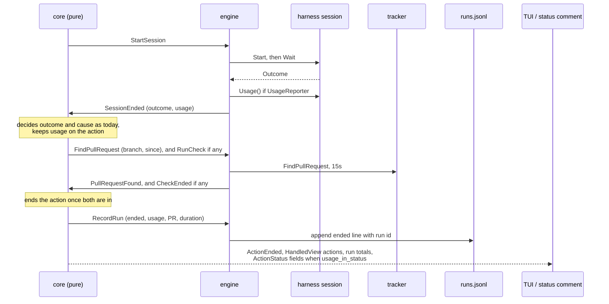

# Record Each Session's Cost, Token Usage and Pull Request - Plan

## Goal Capsule

- **Objective:** The boss knows what each action cost, in dollars and tokens, and which pull request it opened. They see it for the current run in the live view, and they can compare stages, actions and prompts across runs from a local record crew keeps.
- **Means:** the harness reports usage through a new optional session capability, the tracker finds the pull request through a new optional tracker capability, and the existing run journal `.crew/logs/runs.jsonl` gains the numbers on its `ended` lines (KTD1, KTD2, KTD3).
- **Product authority:** this Product Contract, copied from #24's body, within `STRATEGY.md` and the engine's architecture plan (`docs/plans/2026-10-01-2202-feat-crew-engine-architecture-plan.md`). It covers #24, one part of the epic #16. History and summary (#23), navigation (#25) and `--plain` output (#26) are not active scope. Failing an action that opened no pull request is #14's check, already on `main` as a boss-written check command.
- **Open blockers:** none. The issue's note that this worktree is behind `main` is out of date: the branch is level with `main` and holds #29 (Handled), #51 (checks, status entries) and #54 (resume, run journal).
- **Stop conditions:** stop and report if keeping the core pure requires it to read a clock or do I/O, if `depguard` rejects a layering the plan relies on, or if keeping `crew.ActionStatus` comparable proves impossible with the status fields R16 needs.
- **Execution profile:** Go only, in the existing packages, plus the docs pages. No new dependency. One new config key, `config.usage_in_status`.
- **Finishes and ships:** `ce-work` implements U1 to U9 on this branch. The lfg run that invoked planning reviews the change and opens the pull request, whose body contains `Closes #24`.

---

## Product Contract

Product Contract preservation: restructured, no scope change. R4 is restated to name which fields of the stream carry session totals, after planning checked it against real logs (see Dependencies / Assumptions). The Key Decision on the local file gains a conflict call-out. Everything else is unchanged from #24's body.

### Summary

When an action ends, crew records its cost, its token usage and the pull request it opened. Cost and usage come from the session, through the harness. The pull request comes from the tracker, looked up by the action's branch. Each ended action adds one line to a local file under `.crew/` that grows across runs. The live view shows the numbers for the current run, and the status comment shows them when a setting turns them on.

### Problem Frame

`lfg` sessions on this repository cost $6.77 (#13), $6.89 (#9), $15.59 (#5), $19.95 (#23) and $39.74 (#7). Those numbers exist only inside each session's log in `.crew/logs/`, among the rest of the stream. Each run of an action gets its own log, so finding what a stage costs means reading several logs by hand. crew reads none of it: the claude adapter takes only the `result` event's text, and `crew.Outcome` carries only `Succeeded` and `Reason`. The boss cannot see what a run cost, or compare stages, actions and prompts over time to tune the workflow.

Nothing records the pull request an action opened either. #9's session ended halfway with no pull request, crew moved #9 to `in review` (#13), and nothing in crew showed that the pull request was missing.

### Key Decisions

- **The cross-run record is a local file under `.crew/`; the status comment shows the numbers only when a setting turns them on.** Governs R8, R16. (session-settled: user-directed — chosen over the local file plus an always-on status comment, over the status comments alone as the record across runs, and over crew computing historical totals itself)
  - Conflict call-out: #54 shipped the run journal, `.crew/logs/runs.jsonl`, after this decision was made. It is local, append-only, git-ignored and documented, and already holds one `ended` line per run. The plan extends it rather than adding a second file (KTD1). Its `started` lines sit beside the `ended` ones, so "one line per ended action" (R8) reads as one `ended` line per action, and the boss filters with `select(.event == "ended")`.
- **crew computes no historical totals.** The boss reads the file with their own tools. Governs R8. (session-settled: user-directed — chosen over a crew command or view that totals by stage and action)
- **The pull request is in this plan, recorded on the same line as cost and tokens.** Governs R5, R9. (session-settled: user-approved — chosen over a separate issue: it is written at the same moment and shown in the same places)
- **crew shows the dollar figure exactly as the harness reports it, always next to the tokens.** crew does not say whether it is money spent or an estimate, since the boss may pay per use or by subscription. Governs R1, R12. (session-settled: user-approved — chosen over making either dollars or tokens the main figure)
- **A value the harness does not report is shown as not reported, never as zero.** A zero would understate what a run cost. Governs R2, R3.
- **The pull request comes from the tracker, not from what the session said.** The branch is known, and the model's last words are not reliable (#13). Governs R5.
- **A missing pull request is recorded, not judged.** Failing the action is #14's check. Governs R7.

### Requirements

**What a session reports**

- R1. When a session ends, the harness may report the session's cost in US dollars, its token usage (input, output, cache read, cache write), its number of turns and the models it used.
- R2. Each of R1's values is optional. A harness that cannot tell leaves it out, and crew records and shows it as not reported.
- R3. A session that ends without a final result (stopped by crew, killed, crashed) reports none of R1's values.
- R4. The claude harness reports R1's values from the session's stream. Cost, tokens and models come from the last `result` event's `total_cost_usd` and `modelUsage`, which include the session's subagents and resumed turns. Turns are the `num_turns` of all its `result` events added up, since each counts only its own query.

**The pull request**

- R5. After an action's session ends, whatever its outcome, crew looks up the pull request opened from the branch that action worked on, and records its number and link, or that there is none.
- R6. Finding a pull request is an optional tracker capability, which `github` provides. With a tracker that lacks it, the pull request is recorded as not looked up.
- R7. Neither a missing pull request nor a failed lookup changes the action's outcome.

**The local record**

- R8. crew appends one line per ended action to a file under `.crew/`. The file lasts across runs, and crew never rewrites or trims it.
- R9. Each line holds: when the action ended, which crew run it belongs to, the issue's ref, the stage, the action, its outcome, its duration, R1's values and R5's pull request.
- R10. Every action that ended gets a line, whatever its outcome, including an action stopped when crew stops.
- R11. The file is in a format the boss can read with common tools (a spreadsheet, `jq`), and git ignores it like crew's other local files.

**The live view**

- R12. Each Handled entry shows the total cost and tokens of its stage's actions, and the pull request of each action, or that it opened none.
- R13. When some of a stage's actions have no cost reported, the entry shows the known total marked as partial.
- R14. The summary line shows the cost and tokens of every action that ended this run.
- R15. A running action shows no cost: the numbers appear when it ends.

**The status comment**

- R16. A setting in `.crew/config.yaml`, off by default, adds each ended action's cost, tokens and pull request to the status comment. With it off, the status comment is as it is today.

**Docs**

- R17. `docs/guide/crew.mdx` documents the file (where it is, what each line holds, that crew never trims it), the setting, and what the live view shows. `docs/develop/` changes wherever it describes the harness port, an action's outcome or the tracker's optional capabilities.

### Acceptance Examples

- AE1. **Covers R4, R5, R8, R9, R12.** **Given** `development`'s `lfg` action on #31, **when** its session ends with `success`, its last `result` reports $12.40, and pull request #45 is open from its branch, **then** the file gains one line for #31 `development/lfg` with $12.40, the tokens and #45, and #31's Handled entry shows $12.40 and #45.
- AE2. **Covers R5, R7.** **Given** a session that ends with `success` and opened no pull request, as #9's did, **when** the action ends, **then** its line and its Handled entry say it opened no pull request, and the action still succeeds.
- AE3. **Covers R5.** **Given** an action run a second time, whose branch is `crew/issue-9-lfg-2`, **when** it ends, **then** crew looks up the pull request from `crew/issue-9-lfg-2`.
- AE4. **Covers R3, R10, R13.** **Given** a stage with two actions, **when** one session is killed before its final result and the other ends normally, **then** the killed action's line has no cost or tokens, not zero, and the stage's Handled entry shows the other action's cost marked as partial.
- AE5. **Covers R3, R10.** **Given** an action running, **when** the boss stops crew, **then** the file still gains that action's line, with no cost or tokens.
- AE6. **Covers R2.** **Given** a harness that reports no cost, **when** its action ends, **then** the line and the live view say the cost was not reported.
- AE7. **Covers R8, R14.** **Given** the file holds lines from an earlier run, **when** crew starts again and an action ends, **then** a line is appended and the earlier lines are unchanged, and the summary line counts only the actions of this run.
- AE8. **Covers R16.** **Given** the setting is off, **when** a stage ends, **then** the status comment is as it is today; **given** it is on, **then** each ended action in the comment shows its cost, tokens and pull request.

### Scope Boundaries

- Historical totals or reports inside crew.
- A spending cap, or pausing on cost or usage limits.
- Cost while an action runs.
- Failing an action that opened no pull request (#14).
- Cost and pull request in the failure report.
- Cost and pull request in `--plain` output (#26).
- Rotating or trimming the file.
- A per-model breakdown in the live view or the status comment.

**Considered and not built**

- A line for an action whose crew was force-killed (second signal, SIGKILL) or crashed. The journal already reads a start without an end as a crashed run (`internal/core/resume.go`), and writing on a forced exit would need a path that skips the engine's stop sequence. Evidence that would change this: boss reports of missing lines after ordinary stops.
- Looking up the pull request in the session's goroutine before `SessionEnded`. The core would still see the action as running during the lookup, so a stop arriving then would mark a session that already ended as stopped and skip its check (KTD3).
- Looking up the pull request from the branch checked out when the session ends rather than the workspace's branch. A session that pushes from another branch is recorded as having opened none. Evidence that would change this: such sessions in real runs.
- Keeping, across restarts, when a resumed worktree was first created, to reject an older merged pull request from a reused branch name. A resumed worktree accepts any pull request from its branch instead (KTD6).
- Counting a cost a stopped or killed session reported in an intermediate `result` event. R3 says none, and an intermediate total is not the session's.

<!-- ce-section: work-relationships -->
### How This Work Fits Together

This plan covers #24, cost, token usage and pull requests. The rest of the epic #16 is the current breakdown, not a committed roadmap:

- #23, history and summary (built in #29): this plan adds its numbers to #23's Handled entries and summary line.
- #14, verifying a stage's outcome: built as boss-written checks (#51). It shares the pull request with this plan only through the boss's check command; this plan only records it.
- #15, resume (built in #54): owns the run journal this plan extends.
- #25, navigation: still to decide whether an issue's detail shows each action's cost.
- #26, `--plain` output: still to decide whether it prints cost and pull requests.

### Dependencies / Assumptions

- Checked against the session logs in this repository's `.crew/logs/` (issues 5, 7, 9, 13, 14, 15, 23, 44, 50 and the triage logs): a session emits up to 33 `result` events. In every log the last `total_cost_usd` is the largest, and it equals the sum of the last `modelUsage[*].costUSD`. `usage`, `num_turns` and `duration_ms` cover only the last query of the main agent, even in a session with one result. R4 is restated accordingly.
- `total_cost_usd` is Claude Code's figure at API prices. On a subscription it is an estimate.
- A rerun's branch gets a suffix (`crew/issue-9-lfg-2`, from `internal/adapter/git/workspace.go`), and a resumed run keeps its branch. The core already holds the branch the workspace actually has (`WorkspaceReady.Branch`).
- A resumed run starts a new `claude` process without `--resume` (`internal/adapter/claude/command.go`), so its cost does not include the earlier run's.

### Sources / Research

- #16 (epic), #23 and #29 (Handled), #14 and #51 (checks), #15 and #54 (resume, run journal), #13 and #9 (the session without a pull request), #7 (status comment).
- `internal/adapter/claude/stream.go`: the `result` struct decodes only type, subtype, `is_error` and the text; the last `result` wins.
- `internal/adapter/claude/testdata/success.jsonl`: a `result` with `total_cost_usd`, `usage`, `modelUsage`, `num_turns` and `duration_ms`. `quoted.jsonl`'s cost does not match its `modelUsage`.
- `internal/engine/journal.go`: the run journal, its line format and its reader, which skips unknown fields and lines without a workspace.
- `internal/core/update.go` (`sessionEnded`, `end`, `judge`, `release`), `internal/core/resume.go` (`record`, `remember`), `internal/core/status.go` (`sameStatus`).
- `internal/port/port.go` (`Harness`, `Narrator`, `StatusReporter`), `internal/engine/exec.go` (`startSession`), `internal/engine/engine.go` (`said`, capability assertions).
- `docs/solutions/security-issues/session-text-in-public-tracker-comments.md`: harness text stays out of public comments. Numbers, model names kept local, and a tracker-sourced pull request link are crew's own data.

---

## Planning Contract

### Key Technical Decisions

- KTD1. **The record is the run journal's `ended` line, extended with flat optional keys.** `.crew/logs/runs.jsonl` already is local, append-only, git-ignored and documented, and its reader ignores unknown keys, so resume keeps working. New keys on `ended` lines: `run`, `duration_ms`, `cost_usd`, `input_tokens`, `output_tokens`, `cache_read_tokens`, `cache_write_tokens`, `turns`, `models`, `pull_request`, `pull_request_url`, `pull_request_lookup`. Every line also gains `run`. Keys are flat so `jq -r '[...] | @csv'` and spreadsheets read them without unnesting. The journal version stays `1`, because old readers ignore the new keys. Governs R8, R9, R11.
- KTD2. **A reported value is present in the line, a value not reported is absent.** The JSON line uses pointer fields, so a reported $0.00 stays `0` and is not dropped as empty. Domain and core types stay pointer-free and comparable: each optional value is a value plus a "reported" flag. Tokens are one group: reported together or not at all. `models` is a list of names only, sorted; the per-model figures stay in the session log. Governs R2, R3, R9.
- KTD3. **The core asks for the pull request with a `FindPullRequest` command once the session has ended, and ends the action only when both its verdict and the lookup are in.** `sessionEnded` decides the outcome and its cause exactly as today, so a stop that arrives during the lookup cannot change it. The lookup runs beside the check when there is one. The engine runs the command in its own goroutine with a 15-second timeout, even while crew stops, and answers with `PullRequestFound`. An error, a timeout, or a tracker without the capability answers "not looked up"; the core issues no command when the engine reports no finder. Governs R5, R6, R7.
- KTD4. **Usage is a session capability, `port.UsageReporter`, found by type assertion like `port.Narrator`.** A harness that lacks it reports nothing (R2). It is read once after `Wait`. It does not go into `crew.Outcome`, because the core replaces an action's outcome after the session ends (a check's verdict, a stop) and the usage must survive that. Governs R1, R2.
- KTD5. **Claude reports usage only when the session ended on its own with a result.** A session crew stopped, a process that ended by a signal, or a stream with no `result` reports none. An error result that ended the process on its own still reports the cost it carries. Tokens are the last `modelUsage` summed over models for each kind. An empty `modelUsage` means tokens not reported, with no fallback to `usage`, which undercounts. Governs R3, R4.
- KTD6. **The pull request is the newest one from the branch, from this repository, that this worktree could have opened.** The github lookup lists pull requests with head equal to the branch in any state and keeps those with `isCrossRepository` false. An open one wins. Otherwise the newest closed or merged one created at or after `since` counts. `since` is when this action run's new worktree was made, the time of its `WorkspaceReady` input. A resumed worktree has no `since` and accepts any closed or merged pull request from its branch. This matters because git reuses `crew/issue-N-lfg` once its old branch is deleted, and that old branch's merged pull request must not count. Governs R5.
- KTD7. **An action without a workspace gets an `ended` line, but the model does not remember it.** Remembering it would replace a failed run's record and stop that run from resuming, while the reader skips such lines on the next start anyway. Governs R10.
- KTD8. **The duration is from the session's start to the action's end, check included, in milliseconds.** An action whose session never started has no `duration_ms`, which is also how the line says the action never had a session. Such an action adds nothing to totals and does not make them partial. Governs R9, R13.
- KTD9. **The live view and the status comment show one token figure: all four kinds added up.** The file keeps each kind. Governs R12, R14, R16.
- KTD10. **The crew run (one crew process, not one action run) is the process's start time, `run` on every journal line, made by the engine.** The core has no clock, and the engine already writes journal lines. The format is RFC 3339 in UTC with nanoseconds, so runs sort as text. Governs R9.
- KTD11. **`config.usage_in_status`, a boolean in the `config:` section, default false.** It is the engine's setting, not the github adapter's: the core decides what an `ActionStatus` holds, and only fills the new fields when the setting is on, so with it off every status is the same value it is today and the comment is byte-identical. Governs R16.
- KTD12. **Formatting lives in `crew`.** The dollar figure, the token count and the pull request's words are needed by both the TUI and the github adapter, which cannot import each other. Dollars show with two decimals (`$12.40`); tokens show compact (`950`, `48.2K`, `17.2M`). Governs R12, R16.

### High-Level Technical Design

How one action's numbers travel:

Which pull request the github lookup records (KTD6):

| Pull requests from the branch, not cross-repository | Recorded |
| --- | --- |
| One or more open | the newest open one |
| None open, one or more closed or merged created at or after `since` | the newest of those |
| None open, only older closed or merged ones, or none at all | none |
| The lookup failed, timed out, or the tracker cannot look up | not looked up |

What a value looks like in each place:

| Value | Journal `ended` line | Handled entry and summary | Status comment (setting on) |
| --- | --- | --- | --- |
| Reported cost | `"cost_usd": 12.4` | `$12.40` | `$12.40` |
| Cost not reported | key absent | `cost not reported`, or the known total marked partial | `cost not reported` |
| Action had no session | no `duration_ms`, no usage keys | adds nothing, not partial | no usage words |
| Pull request found | `pull_request`, `pull_request_url`, `"pull_request_lookup": "found"` | `#45` | linked `#45` |
| No pull request | `"pull_request_lookup": "none"` | `no pull request` | `no pull request` |
| Not looked up | `"pull_request_lookup": "not looked up"` | `pull request not looked up` | `pull request not looked up` |

### Assumptions

- Headless planning: the scoping confirmation was skipped. The bets below are the ones the boss may want to correct.
- One token figure in the view, all four kinds added (KTD9). Cache reads dominate it: #14's session read 129M cache tokens against 409K output.
- A stopped action's pull request is still looked up (KTD3). The lookups run in parallel, so a stop can take up to 15 seconds longer.
- Turns count the main session's turns only; a subagent's turns are not in `num_turns`.

### Sequencing

U1 first. U2 and U3 depend only on U1 and can go in either order. U4 needs U1. U5 needs U2 to U4 for its integration tests. U6 wires the setting. U7 renders the status comment and needs U4 and U6. U8 renders the live view and needs U4. U9 documents what U1 to U8 settled.

---

## Implementation Units

### U1. Domain values and port capabilities

**Goal:** the types every later unit uses: a session's usage, a pull request lookup result, their formatting, and the two optional capabilities.

**Requirements:** R1, R2, R5, R6; KTD2, KTD4, KTD12.

**Dependencies:** none.

**Files:**
- `internal/crew/usage.go` (new), `internal/crew/usage_test.go` (new)
- `internal/port/port.go`

**Approach:**
1. In `crew`: a usage value (cost, the four token kinds, turns, each optional per KTD2, plus the model names) and a pull request value (lookup state found / none / not looked up, number, URL). Keep a comparable part of the usage, cost and tokens, that `crew.ActionStatus` can hold later without breaking `sameStatus`.
2. Add helpers for summing usages with a partial flag for cost and for tokens separately, for the total token figure (KTD9), and for formatting dollars, tokens and the pull request's words (KTD12).
3. In `port`: `UsageReporter` on a `Session` (read after `Wait`) and `PullRequestFinder` on a `Tracker` (branch and `since` in, a pull request value or an error out), each with a doc comment in the style of `Narrator` and `StatusReporter`.

**Patterns to follow:** `crew.Outcome` and `crew.ActionStatus` (`internal/crew/workflow.go`, `internal/crew/status.go`); `port.Narrator`, `port.StatusReporter`.

**Test scenarios:**
- Summing two usages with costs $1.20 and $3.05 gives $4.25, not partial.
- Summing a usage with a cost and one without gives the known cost, marked partial.
- Summing usages none of which reports a cost gives "not reported", not $0.00.
- A reported cost of $0 stays reported and formats as `$0.00`.
- Cost partial and tokens complete are tracked independently.
- Token formatting: 950 → `950`, 48 210 → `48.2K`, 17 213 000 → `17.2M`.
- Dollar formatting: 12.4 → `$12.40`, 0.004 → `$0.00`.
- The pull request words for found #45, none and not looked up.

**Verification:** the types compile into `crew.ActionStatus` comparisons unchanged, and the formatting tests pass.

### U2. Claude reports usage

**Goal:** the claude session implements `UsageReporter` from its stream (R4, KTD5).

**Requirements:** R1, R2, R3, R4; KTD4, KTD5.

**Dependencies:** U1.

**Files:**
- `internal/adapter/claude/stream.go`, `internal/adapter/claude/harness.go`, `internal/adapter/claude/harness_test.go`
- `internal/adapter/claude/testdata/multiresult.jsonl` (new), `internal/adapter/claude/testdata/quoted.jsonl`

**Approach:**
1. Extend the decoded `result` with `total_cost_usd` (as a presence-aware value), `num_turns` and `modelUsage` (per model: input, output, cache read, cache creation tokens). Keep decoding top-level keys only, as today.
2. The stream keeps the last result as now and adds up `num_turns` over every result.
3. The session builds its usage in `reap`, next to the outcome: none when crew stopped it, when the process ended by a signal, or when there was no result (KTD5).
4. Add the compile-time guard for `port.UsageReporter`.
5. New fixture: a trimmed real session with at least three `result` events whose `usage` differs from `modelUsage` and two models, result texts scrubbed. Fix `quoted.jsonl` so its cost matches its `modelUsage`.

**Patterns to follow:** `stream.said` and `session.Said` for a capability read from the stream; the scripted spawner in `harness_test.go`.

**Test scenarios:**
- Covers AE1. `success.jsonl`: cost $0.4182, tokens summed from `modelUsage`, turns 3, models `claude-opus-5-5`.
- The multi-result fixture: cost is the last `total_cost_usd`, tokens are the last `modelUsage` summed over both models (not the last `usage`), turns are all `num_turns` added up, models sorted.
- `error.jsonl` (error result, empty `modelUsage`): the cost is reported, tokens are not.
- Covers AE4. `noresult.jsonl`: nothing reported.
- Covers AE5. A session crew stopped after an intermediate result: nothing reported.
- A process ended by a signal after a result: nothing reported.
- A result with `total_cost_usd: 0`: cost reported as $0.

**Verification:** every fixture's usage matches the numbers in the file, and the outcome tests still pass unchanged.

### U3. GitHub finds the pull request

**Goal:** the github tracker implements `PullRequestFinder` (KTD6), and the fakes can stand in for it.

**Requirements:** R5, R6, R7; KTD6.

**Dependencies:** U1.

**Files:**
- `internal/adapter/github/pullrequest.go` (new), `internal/adapter/github/pullrequest_test.go` (new), `internal/adapter/github/tracker.go`
- `internal/fake/tracker.go`, `internal/fake/harness.go`

**Approach:**
1. One `gh pr list --head <branch> --state all` call asking for number, URL, state, creation time and `isCrossRepository`, through the existing `gh` runner and `decode`.
2. Apply KTD6's table. Classify errors as the other calls do.
3. Add the compile-time guard.
4. Fakes: an embeddable pull request finder for the fake tracker, scripted per branch, and a usage-reporting fake session in the style of `NarratingSession`.

**Patterns to follow:** `internal/adapter/github/status.go` (`gh` calls, `classify`); `fake.ReportingTracker` and `fake.NarratingSession` for composition by embedding.

**Test scenarios:**
- Covers AE1. One open pull request #45 from the branch: found #45 with its URL.
- Covers AE2. No pull request from the branch: none.
- Covers AE3. The branch `crew/issue-9-lfg-2` is passed as given to `--head`.
- An open and a newer merged pull request: the open one.
- Only a merged pull request created before `since`: none.
- A merged pull request created after `since`: found.
- Only a cross-repository pull request: none.
- `gh` fails: an error, which the caller records as not looked up.

**Verification:** the scripted runner sees exactly one `gh` call per lookup, and each table row has a test.

### U4. The core keeps, records and totals the numbers

**Goal:** the core carries usage and the pull request from `SessionEnded` to the record, the events, Handled, the run totals and the status (R9 to R16).

**Requirements:** R3, R5, R9, R10, R12, R13, R14, R15, R16; KTD6, KTD7, KTD8, KTD11.

**Dependencies:** U1.

**Files:**
- `internal/core/input.go`, `internal/core/command.go`, `internal/core/event.go`, `internal/core/model.go`, `internal/core/update.go`, `internal/core/resume.go`, `internal/core/status.go`
- `internal/core/usage_test.go` (new), `internal/core/resume_test.go`, `internal/core/handled_test.go`, `internal/core/status_test.go`

**Approach:**
1. The action keeps `since`: the `At` of its `WorkspaceReady` for a new worktree, zero for a resumed one (KTD6).
2. `SessionEnded` gains the usage, which `sessionEnded` stores on the action. It still decides the outcome and cause as today.
3. A new option, set when the engine has a finder, has `sessionEnded` also command `FindPullRequest` (key, action, branch, `since`) and mark the lookup pending. A new input, `PullRequestFound`, stores the result. Where `sessionEnded` or `checkEnded` would call `end` while the lookup is pending, the action keeps its outcome and cause and ends when `PullRequestFound` arrives; whichever arrives last ends it (KTD3). Without the option the pull request is "not looked up".
4. `end` puts usage, pull request and duration (KTD8) on the `ended` record, and on `ActionEnded`. An action without a workspace now records too, through a path that sends `RecordRun` without `remember` (KTD7).
5. `judge` gives `HandledView` one entry per action: name, usage, pull request, whether it had a session. `clone` deep-copies it.
6. The model adds every ended action to a run total (count, summed usage with partial flags) that the `View` exposes for the summary line. It is never reset by `release`.
7. A new option, set when the setting is on, has `core/status.go` fill the comparable usage and the pull request into each ended action's `ActionStatus`. Running and checking actions get nothing (R15).

**Patterns to follow:** `RecordingRuns` and `Reopening` options; `RunCheck` and `CheckEnded` for a command with its answer, including the closed command and input sets; `HandledView.Failures` and its clone; the table and driver tests in `handled_test.go` and `resume_test.go`.

**Test scenarios:**
- Covers AE1. A session ends with $12.40 and #45: the `ended` record, `ActionEnded` and the Handled entry carry both.
- A session succeeds with a usage, then its check fails: the action fails and keeps the usage.
- Covers AE5. A stop during a session: the record has no usage, the pull request as the engine reported it.
- Covers AE4. A stage of two actions, one with a cost and one without: the Handled entry's total is the known cost, marked partial.
- An action whose prompt does not render: an `ended` record without workspace is commanded, and a failed earlier run of the same key stays resumable (KTD7).
- Covers AE7. Two stage runs of one issue end in one model: the run total counts both, and Handled shows only the second.
- A fresh run's `FindPullRequest` carries its `WorkspaceReady` time as `since`; a resumed run's carries none.
- The lookup answers after a check that passed: the action ends then, succeeded, with the pull request.
- The lookup answers before the session's failure is known, then the session fails: the action ends failed with the pull request.
- A stop arrives after the session ended on its own and while the lookup runs: the outcome and cause are the session's, not "stopped", and the check still runs.
- Without the finder option, no `FindPullRequest` is commanded and the record says "not looked up".
- With the option off, each `ActionStatus` equals today's value; with it on, an ended action holds its usage and pull request and a running one holds none.
- While an action runs or its check runs, `ActionView` and its status show no usage (R15).

**Verification:** the core stays free of clocks and I/O, and the existing core tests pass unchanged.

### U5. The engine reads, looks up and writes

**Goal:** the engine fills `SessionEnded` from the capabilities and writes the new journal keys (KTD1, KTD3, KTD10).

**Requirements:** R5, R6, R7, R8, R9, R10, R11; KTD1, KTD2, KTD3, KTD10.

**Dependencies:** U2, U3, U4.

**Files:**
- `internal/engine/exec.go`, `internal/engine/engine.go`, `internal/engine/journal.go`
- `internal/engine/journal_test.go`, `internal/engine/engine_test.go` (or the existing loop test file that drives sessions)

**Approach:**
1. `New` asserts `port.PullRequestFinder` on the tracker, keeps it, and passes the core's finder option, as it does for `StatusReporter`.
2. `startSession`, after `Wait`: read the usage when the session is a `UsageReporter` and post it on `SessionEnded`.
3. `FindPullRequest` runs in its own goroutine under a 15-second context (KTD3) and posts `PullRequestFound`; an error or timeout posts "not looked up".
4. The journal line gains the keys of KTD1 as pointer fields, written only when reported (KTD2); `run` is the engine's start time (KTD10).

**Patterns to follow:** `engine.said` for the session assertion; `lineOf` and `record` in `journal.go`; the synctest loop tests.

**Test scenarios:**
- Covers AE1. A fake session reporting $12.40 and a fake finder returning #45: the journal's `ended` line has `cost_usd` 12.4, the token keys, `pull_request` 45, its URL, `"pull_request_lookup": "found"`, `run` and `duration_ms`.
- Covers AE6. A session without `UsageReporter`: the line has no cost or token keys.
- A reported cost of $0: the line has `"cost_usd": 0`.
- A tracker without `PullRequestFinder`: `"pull_request_lookup": "not looked up"`.
- A finder that blocks: after 15 seconds of fake time the line says not looked up, and the action's outcome is unchanged.
- Covers AE7. A journal holding lines from an earlier run: new lines are appended, old bytes are unchanged, and the new lines carry a different `run`.
- A stop while a lookup runs: crew still waits for the lookup, at most 15 seconds, and writes the line.
- An `ended` line without workspace is written and skipped on the next read, as today.

**Verification:** `go test -race ./internal/engine` passes under `synctest`, and a written line parses with `jq`.

### U6. The setting

**Goal:** `config.usage_in_status` decodes, defaults to false, and reaches the core (KTD11).

**Requirements:** R16; KTD11.

**Dependencies:** U4.

**Files:**
- `internal/config/config.go`, `internal/config/config_test.go`
- `internal/app/app.go`, `internal/engine/engine.go`

**Approach:** add the key to `settings` as a `located[bool]`, a field on `Config`, a field on `engine.Config`, and pass the core option from U4 when it is true and the tracker reports statuses.

**Patterns to follow:** `run_time_limit_seconds` from decoding to `engine.Config`.

**Test scenarios:**
- Left out: false.
- `usage_in_status: true`: true.
- `usage_in_status: maybe`: an error naming the key and its line.

**Verification:** the config tests pass, and an unknown key next to it is still refused.

### U7. The status comment shows the numbers

**Goal:** the github status comment renders each ended action's cost, tokens and pull request when its status holds them (AE8).

**Requirements:** R16; KTD9, KTD11, KTD12.

**Dependencies:** U4, U6.

**Files:**
- `internal/adapter/github/status.go`, `internal/adapter/github/status_test.go`

**Approach:** in `renderStatus`, an ended action whose status holds usage or a pull request gets one more clause after its state, using the `crew` formatting helpers, such as "**`lfg`** succeeded: $12.40, 17.2M tokens, pull request #45." A status without them renders exactly as today.

**Patterns to follow:** the existing per-action lines in `renderStatus`; its exact-body tests.

**Test scenarios:**
- Covers AE8. An ended entry whose action statuses hold no usage: the body is byte-identical to today's golden body.
- Covers AE8. An ended entry with $12.40, tokens and #45: the action's line shows all three.
- An action with the cost not reported and no pull request: the line says so in words, with no `$0.00`.
- A failed action with usage keeps its failure wording and log pointer, and gains the clause.

**Verification:** the existing status tests pass unchanged, and no session text appears in the new clause.

### U8. The live view shows the numbers

**Goal:** Handled entries and the summary line show cost, tokens and pull requests (R12 to R15).

**Requirements:** R12, R13, R14, R15; KTD9, KTD12.

**Dependencies:** U4.

**Files:**
- `internal/ui/tui/view.go`, `internal/ui/tui/handled_test.go`, `internal/ui/tui/model_test.go`
- `internal/ui/tui/testdata/*.golden`

**Approach:**
1. A Handled entry's line gains a column with the stage's cost and tokens, partial or not reported as U1's helpers word it.
2. Each action's pull request shows in the entry: on the entry's line when the stage has one action, and on one indented line per action otherwise, like the failure reasons.
3. The counts line (`handled N: …`) gains this run's cost and tokens right after `handled N` and before the per-state counts, so a narrow window cuts the state counts first.
4. Fitting still collapses old successes first, counting the new rows.

**Execution note:** settle the exact layout in the golden files, then review the diff by eye at 80 columns.

**Patterns to follow:** `columns.line` and `reasons` in `view.go`; the golden test flow with `-update`.

**Test scenarios:**
- Covers AE1. An entry for #31 with $12.40 and #45 shows both.
- Covers AE2. An entry whose action opened no pull request says so.
- Covers AE4. A two-action entry with one cost not reported shows the known cost marked partial, and each action's pull request on its own line.
- Covers AE6. An entry with no cost reported says the cost was not reported.
- Covers AE7. The summary line shows this run's total, including an issue whose earlier Handled entry was replaced.
- Running actions show no cost (R15): `running.golden` is unchanged except for the summary line.
- `fit-24-rows.golden` still fits 24 rows.

**Verification:** the golden diffs show only the new columns and lines, and nothing is cut mid-number at 80 columns.

### U9. Docs

**Goal:** the guide and the develop pages say what this change does (R17).

**Requirements:** R17.

**Dependencies:** U1 to U8.

**Files:**
- `docs/guide/crew.mdx`
- `docs/develop/architecture.mdx`, and any other page under `docs/develop/` that describes the harness port, an action's outcome or the tracker's optional capabilities

**Approach:**
1. Guide: the run journal section shows a new `ended` line and lists each new key, that a missing key means not reported, that crew never trims the file, that a force-killed crew writes no `ended` line, and a `jq` example that selects `ended` lines into CSV. The keys table gains `config.usage_in_status`. The status comment section shows an ended action with the clause. The live view section says what Handled and the summary line show.
2. Develop: `UsageReporter` and `PullRequestFinder` in the port list and the adapter guide, the journal's new keys, and that usage rides beside the outcome, not in it.

**Test expectation:** none -- documentation; `pnpm docs:check` verifies links and MDX.

**Verification:** `pnpm docs:check` passes, and every key the engine writes is in the guide.

---

## Verification Contract

Run from the repository root:

- `go build ./cmd/crew`
- `go test -race ./...`
- `gofmt -l cmd internal` prints nothing
- `go vet ./...`
- `go run github.com/golangci/golangci-lint/v2/cmd/golangci-lint@v2.14.0 run` (includes the `depguard` layering)
- `go run golang.org/x/vuln/cmd/govulncheck@v1.8.0 ./...`
- `pnpm install` once, then `pnpm docs:check`
- TUI golden files rewritten with `go test ./internal/ui/tui -update` and their diff reviewed.

---

## Definition of Done

- Every acceptance example AE1 to AE8 has a test that names it.
- A real `crew` run is not required; the claude fixtures come from real logs.
- With `config.usage_in_status` absent, the status comment tests pass without changing their expected bodies.
- The journal's existing resume tests pass unchanged, and a workspace-less `ended` line never makes a failed run stop resuming.
- No pointer, map or slice is added to `crew.Outcome` or `crew.ActionStatus`.
- The guide and develop pages match what the code writes and shows.
- Code from abandoned approaches is removed from the diff.
- Every command in the Verification Contract passes.
