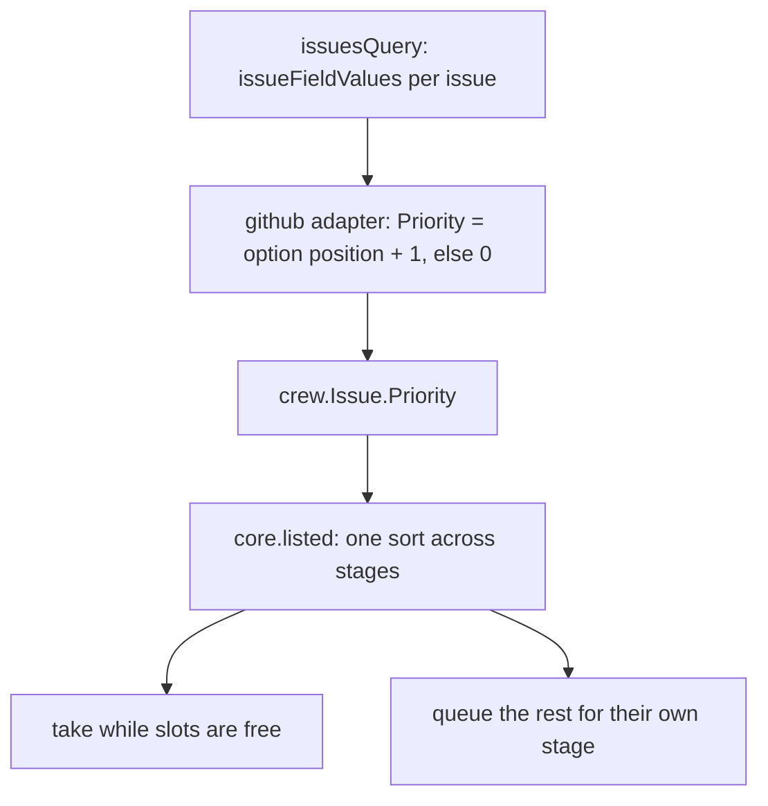

# Dispatch Issues by Priority - Plan

## Goal Capsule

- **Objective:** the boss puts an issue ahead of crew's queue by setting its GitHub Priority, without touching `.crew/config.yaml`, and crew takes the higher-priority issues first.
- **Means:** the tracker sets a generic rank on each listed issue (KTD1), the core orders candidates by that rank, then stage, then age (KTD2), and the `github` adapter fills the rank from the issue field `Priority` in the query it already makes (KTD3).
- **Product authority:** this Product Contract, copied from #41's body, within `STRATEGY.md` and the engine's architecture plan (`docs/plans/2026-10-01-2202-feat-crew-engine-architecture-plan.md`).
- **Open blockers:** none.
- **Stop conditions:** stop and report if the listing query with issue field values fails on a user-owned repository or on thatsnotmynameio/crew (U3's verification), or if keeping the core pure or `depguard` happy needs the core or port to know GitHub's field.
- **Execution profile:** Go only, in existing packages, plus `.crew/config.yaml`, the docs pages and `CONCEPTS.md`. No new dependency, no new config key, no new port interface.
- **Finishes and ships:** `ce-work` implements U1 to U5 on this branch. The lfg run that invoked planning reviews the change and opens the pull request, whose body contains `Closes #41`.

---

## Product Contract

Product Contract preservation: unchanged from #41's body (R1 to R9, AE1 to AE5, Key Decisions, Scope Boundaries). Its deferred question is answered by KTD1.

### Summary

crew picks the next issue by the tracker's priority, ahead of stage and creation time (R1). On GitHub the priority is the native issue field `Priority`, which the existing `github` adapter reads (R4). crew's own `.crew/config.yaml` lists its stages in flow order (R7).

### Problem Frame

The core takes issues while slots are free: later stages first, then the oldest issue (`internal/core/update.go`, `listed`). The only way to put an issue ahead of the queue is to reorder the stages in the config or to wait until it is the oldest. Reordering the config to jump one issue ahead changes the order of every issue, for good.

GitHub has a native priority for issues: the issue field `Priority`, defined on the organization. In thatsnotmynameio it is a single select with the options Urgent, High, Medium and Low. It is neither a label nor a Projects field.

Separately, crew's own config lists `triage` after `development`, so the core takes triage before development. Triage happens before development in the flow, so the list is in the wrong order.

### Key Decisions

- **Priority outranks stage.** Changing the config to jump the queue makes no sense: the issue's priority does that. Governs R1. (session-settled: user-directed — chosen over priority only inside a stage: an Urgent issue must pass a lower-priority issue of a later stage.)
- **GitHub's native issue field is the only priority source.** It is the priority GitHub itself offers, and labels or a Projects field would be a second place to keep it. Governs R4. (session-settled: user-directed — chosen over labels and Projects fields: GitHub has a native priority field.)
- **The core sees a generic rank, not GitHub's priority.** Priority is a tracker's concept: another tracker may have none, or a different scale. Governs R3, R5.
- **The field's own option order sets the rank.** An organization whose options differ from Urgent, High, Medium and Low still gets an order, with no mapping to keep. Governs R4.
- **An unset priority ranks last.** Setting a priority is the boss saying the issue matters; an issue without one makes no such claim. Governs R2, R6.
- **The field's name, `Priority`, is fixed, not configurable.** Nothing asks for another name yet. Governs R4, R6.

### Requirements

**Dispatch order**

- R1. When slots are free, crew takes the candidates by priority, the highest first; then, at the same priority, the later stage first; then, at the same stage, the oldest issue first.
- R2. An issue without a priority ranks after the lowest priority.
- R3. The core orders by a rank the tracker sets on each issue, and knows nothing of GitHub's field, its options or its names.

**GitHub**

- R4. The `github` adapter reads each listed issue's native issue field `Priority` in the query that lists the issues. The rank is the position of the value among the field's options, the first option being the highest. A value the adapter cannot place among the options counts as no priority.
- R5. A tracker that sets no rank leaves every issue without a priority, so crew orders them by stage and creation time, as today.
- R6. In a repository without issue fields, such as one a user owns, or in an organization without a field named `Priority`, crew lists the issues as it does today, every one without a priority.

**crew's own config**

- R7. crew's `.crew/config.yaml` lists its stages in flow order: triage, development, fix, audit ci, knowledge base.

**Docs**

- R8. `docs/guide/crew.mdx` and `docs/develop/architecture.mdx` describe the order of R1 where they now say "later stages first, then the oldest issue".
- R9. `docs/guide/crew.mdx` says that on GitHub the priority is the organization's issue field `Priority`, and what happens without it (R6).

### Acceptance Examples

- AE1. Covers R1. Given a triage issue with no priority and a development issue set to Urgent, both waiting, and one free slot, when crew polls, it takes the development issue.
- AE2. Covers R1. Given two development issues set to High, the older opened Monday and the newer Tuesday, and one free slot, when crew polls, it takes Monday's.
- AE3. Covers R1, R7. Given a triage issue and a development issue, both set to Medium, and one free slot, when crew polls, it takes the development issue, the later stage in crew's config.
- AE4. Covers R2. Given an issue set to Low and an older issue without a priority, in the same stage, and one free slot, when crew polls, it takes the Low issue.
- AE5. Covers R6. Given a repository a user owns, with no issue fields, when crew polls, it orders its issues by stage and creation time and reports no error.

### Scope Boundaries

- Priority does not stop or preempt a running session. It decides only who takes the next free slot.
- The live view and the status comment do not show the priority.
- The list still holds at most the 100 oldest matching issues per poll. With more than 100 waiting, a newer Urgent issue can be left out; this limit is documented, not removed.
- No configurable field name, and no other priority source (labels, Projects fields).
- Considered and not built: a separate query for `Organization.issueFields` to learn the option order. The value's own `field` carries its options (KTD3), so a second call per poll adds nothing; reconsider only if GitHub stops resolving `field` on a value.
- Considered and not built: a fallback when the schema lacks `issueFieldValues`, as on an older GitHub Enterprise Server. `List` then fails loudly every poll (`ListingFailed`), as it already does there for `issueDependenciesSummary` (`docs/solutions/integration-issues/blocked-issues-dispatched-by-github-tracker.md`). Only `github` on github.com is supported today.

### Dependencies / Assumptions

- The `gh` login used in the brainstorm, with the scopes `repo`, `read:org`, `gist` and `workflow`, read thatsnotmynameio's issue fields and an issue's field values. A login without `read:org` was not tried.

### Sources / Research

- `internal/core/update.go`: `listed` sorts each stage's candidates by `Created` only.
- `internal/adapter/github/tracker.go`: `issuesQuery` lists `first: 100`, ordered by `CREATED_AT`, ascending.
- GitHub GraphQL: `Issue.issueFieldValues` (an `IssueFieldSingleSelectValue` carries the option's `name` and `optionId`) and `Organization.issueFields`; thatsnotmynameio's `Priority` field has the options Urgent, High, Medium, Low.

---

## Planning Contract

### Key Technical Decisions

- KTD1. **The rank is a field on `crew.Issue`: `Priority int`, where 0 means no priority and 1 is the highest.** It travels with the listing, exactly as `Blocked` does, and the zero value means "none", so the fake tracker and any tracker that knows no priority satisfy R5 with no code (R3, R5). A separate optional port interface would need its own command, goroutine and input to carry one integer the existing call already returns; `docs/solutions/integration-issues/blocked-issues-dispatched-by-github-tracker.md` made the same call for `Blocked` and records why. Lower numbers rank higher so the GitHub option position maps directly (KTD3).
- KTD2. **`listed` sorts every stage's candidates together by one key: priority, then stage, then age.** Today it walks stages from last to first and sorts each by `Created`. It collects all candidates across stages, each with its stage index, and sorts them stably by: has a priority before has none; lower `Priority` first; higher stage index first; older `Created` first (R1, R2). It takes in that order while slots are free, then reports the rest as queued for their own stage. The issue keys' order in the listing never matters, so the result is deterministic, as KTD8 of the architecture plan requires.
- KTD3. **The adapter reads the value and its field's options from one selection on each issue, in `issuesQuery`.** Each issue node asks for `issueFieldValues(first: N) { nodes { ... on IssueFieldSingleSelectValue { optionId field { ... on IssueFieldSingleSelect { name options { id } } } } } }`. The value whose field is named `Priority` gets the rank of the position of its `optionId` among that field's `options` ids, plus one (R4). A missing field, a field of another type, a value whose `field` does not resolve, or an `optionId` not among the options gives 0 (R4, R6). Live checks on 2026-10-02: thatsnotmynameio's `Priority` options come in the order Urgent, High, Medium, Low; on the closed thatsnotmynameio/crew#14, set to Medium, the value's `field` resolves to that field and its `optionId` equals the third option's `id`; the query returns empty `nodes` on the user-owned mguilarducci/tantamore.
- KTD4. **The query never asks for `totalCount` on `issueFieldValues`.** On the user-owned mguilarducci/tantamore, `issueFieldValues(first: 20) { totalCount }` failed the whole query with GitHub's "Something went wrong while executing your query", while `nodes` alone returned empty lists. Asking for `totalCount` would break `List` on every user-owned repository (R6, AE5). The adapter test pins its absence.
- KTD5. **The field name compares ignoring case; the option is matched by id, not name.** The adapter already compares labels ignoring case as GitHub does. Matching `optionId` to the option's `id` keeps the rank right when the boss renames an option, and the live check on #14 showed the two are the same identifier.

### High-Level Technical Design

The candidate order of KTD2, as a sort key compared field by field (directional):

| Field | Order | Requirement |
|---|---|---|
| has a priority (`Priority > 0`) | with first | R2 |
| `Priority` | ascending (1 is the highest) | R1 |
| stage index in the workflow | descending (later stage first) | R1 |
| `Created` | ascending (oldest first) | R1 |

### Assumptions

- `issueFieldValues(first: 25)` covers every value an issue can hold. An organization with more fields than that, set on one issue, could push `Priority` off the page and leave the issue without a priority. The implementer picks N from GitHub's documented field limit when one is found.
- An issue's field values come back for the same `gh` login and scopes that list the issues today (Dependencies / Assumptions above).

### Sequencing

U1 first, then U2 and U3 in either order, then U4 and U5.

---

## Implementation Units

### U1. The issue carries a priority

- **Goal:** `crew.Issue` has the generic rank of KTD1.
- **Requirements:** R3, R5.
- **Dependencies:** none.
- **Files:** `internal/crew/issue.go`.
- **Approach:**
  1. Add `Priority int` with a doc comment: set by the tracker, 1 the highest, larger numbers lower, 0 no priority, which ranks after every priority; a tracker that knows no priority leaves it 0.
  2. Update the `Created` comment, which now says "the oldest issue is taken first", so it points to the full order instead.
- **Patterns to follow:** the `Blocked` field and its comment.
- **Test expectation:** none -- a data field with no behavior; U2 and U3 test it.
- **Verification:** the package builds and `Clone` still copies the field (plain value).

### U2. The core takes candidates by priority, then stage, then age

- **Goal:** `listed` orders candidates by the key of KTD2.
- **Requirements:** R1, R2, R3, R5.
- **Dependencies:** U1.
- **Files:** `internal/core/update.go`, `internal/core/update_test.go`.
- **Approach:**
  1. In `listed`, gather the candidates of every stage (single state, that stage's label, not blocked) with their stage index into one slice.
  2. Sort it stably by KTD2's key, then take while slots are free, skipping held issues as today.
  3. Report each candidate left unheld as queued for its own stage.
  4. Update `listed`'s doc comment to state the new order.
- **Patterns to follow:** the table test `TestPicksLaterStagesFirstThenTheOldestIssue`, the `issue` helper and `draft()` workflow in `internal/core/update_test.go`. Rename the test to name the new order and add rows; set `Priority` on the helper's result, as `TestBlockedIssueIsNotTakenUntilNothingBlocksIt` sets `Blocked`.
- **Test scenarios:**
  - Covers AE1. An implement issue with priority 1 and a review issue with no priority, max parallel 1: the implement issue is taken.
  - Covers AE2. Two implement issues with priority 2, opened minute 1 and minute 2: the minute-1 issue is taken.
  - Covers AE3. An implement issue and a review issue, both priority 3: the review issue, the later stage, is taken.
  - Covers AE4. An implement issue with priority 4 opened minute 9 and one with no priority opened minute 1: the priority-4 issue is taken.
  - Priority 1 beats priority 2 in the same stage when the priority-2 issue is older.
  - Existing rows still hold with no priority set: review before implement, oldest first within a stage (R5).
  - With max parallel 2 and three candidates (priority 1 implement, none review, priority 2 implement), the two priority issues are taken and the review issue gets a queued status for the `review` stage.
  - A blocked issue with priority 1 is still neither taken nor queued.
- **Verification:** `go test -race ./internal/core` passes, and the core still imports only `crew`.

### U3. The github adapter reads the issue field Priority

- **Goal:** `List` fills `Priority` from the issue field `Priority` as KTD3 to KTD5 decide.
- **Requirements:** R4, R6.
- **Dependencies:** U1.
- **Files:** `internal/adapter/github/tracker.go`, `internal/adapter/github/tracker_test.go`.
- **Approach:**
  1. Add the `issueFieldValues` selection of KTD3 to each node in `issuesQuery`, without `totalCount` (KTD4), and extend the comment above the query.
  2. Decode the value nodes into the reply struct; GraphQL returns an empty object for a union member of another type, so decode by the fields present rather than by `__typename` unless the implementer finds that clearer.
  3. Add a small function that returns the rank of an issue's values: the first value whose field is named `Priority` (KTD5), placed among its options, else 0.
  4. Set `Priority` on each `crew.Issue`, and update the package and `List` doc comments.
- **Patterns to follow:** `TestListMarksAnIssueBlockedOnlyWhileAnOpenIssueBlocksIt` and its `blockedNode` helper, which wrap an `issueNode` with extra JSON; add a similar helper for field values.
- **Test scenarios:**
  - The query asks for `issueFieldValues` and its field's `options`, and does not contain `totalCount`.
  - Options Urgent, High, Medium, Low with values Urgent, Low and High on three issues give priorities 1, 4 and 2. Model the value nodes on the real reply for thatsnotmynameio/crew#14 (`optionId` plus `field { name options { id } }`).
  - An issue whose `Priority` value has an `optionId` not among the field's option ids gets 0.
  - An issue with only an `Effort` single select set gets 0.
  - An issue with a field named `priority` (lower case) is read as `Priority` (KTD5).
  - Covers AE5. A reply whose `issueFieldValues.nodes` is empty for every issue, as on a user-owned repository, gives 0 for all and no error.
  - A value node of another type (an empty object, such as a date value) next to the `Priority` value does not hide it.
- **Verification:** `go test -race ./internal/adapter/github` passes. Then, once, run the new `issuesQuery` through `gh api graphql` against thatsnotmynameio/crew and against a user-owned repository such as mguilarducci/tantamore; both must return data and no error (Goal Capsule stop condition). Run the same selection on thatsnotmynameio/crew#14, whose Priority is Medium, and confirm the adapter's logic gives it rank 3.

### U4. crew's own stages in flow order

- **Goal:** `.crew/config.yaml` lists its stages as R7 orders them.
- **Requirements:** R7 (and AE3 in crew's own repository).
- **Dependencies:** none.
- **Files:** `.crew/config.yaml`.
- **Approach:** move the `triage` stage block to the top of `workflow`, then `development`, `fix`, `audit ci`, `knowledge base`, keeping each block's content byte for byte.
- **Test expectation:** none -- config order only; `TestTheRepositorysOwnConfigLoads` and `TestTheRepositorysIssueTemplatesMatchItsConfig` in `internal/config/config_test.go` keep it valid.
- **Verification:** `go test -race ./internal/config` passes and the diff only moves blocks.

### U5. Docs and concepts describe the order and the GitHub field

- **Goal:** the docs say what R8 and R9 require.
- **Requirements:** R8, R9.
- **Dependencies:** U2, U3.
- **Files:** `docs/guide/crew.mdx`, `docs/develop/architecture.mdx`, `CONCEPTS.md`.
- **Approach:**
  1. `docs/guide/crew.mdx`, "What crew does on each poll", step 4: priority first, then later stages, then the oldest issue; say that on GitHub the priority is the organization's issue field `Priority`, ranked by its options' order, and that an issue without it, or a repository without issue fields, ranks after every priority (R6).
  2. `docs/guide/crew.mdx`, Limits: next to "At most 100 issues per poll, the oldest first", say a newer high-priority issue beyond the 100 oldest is not seen that poll.
  3. `docs/develop/architecture.mdx`: the "The core picks later stages first, then the oldest issue" sentence states the order of R1 and names `crew.Issue.Priority`, which the `github` adapter fills from the issue field `Priority`.
  4. `CONCEPTS.md` already has a Priority entry under Workflow, added at plan time; adjust it if the shipped behavior differs.
- **Test expectation:** none -- docs only.
- **Verification:** `pnpm docs:check` passes, and no page still says only "later stages first, then the oldest issue".

---

## Verification Contract

| Gate | Command | Applies to |
|---|---|---|
| Format | `gofmt -l cmd internal` prints nothing | U1 to U3 |
| Vet | `go vet ./...` | U1 to U3 |
| Tests | `go test -race ./...` | all units |
| Lint and layering | `go run github.com/golangci/golangci-lint/v2/cmd/golangci-lint@v2.14.0 run` | U1 to U3 |
| Vulnerabilities | `go run golang.org/x/vuln/cmd/govulncheck@v1.8.0 ./...` | whole change |
| Docs | `pnpm install`, then `pnpm docs:check` | U5 |
| Live query | the new `issuesQuery` through `gh api graphql` on thatsnotmynameio/crew and on a user-owned repository returns data with no `errors`; crew#14 (Priority Medium) ranks 3 | U3 |

## Definition of Done

- Every gate in the Verification Contract passes.
- AE1 to AE4 have core tests and AE5 has an adapter test, each named or commented with its AE.
- `crew.Issue.Priority` is the only new surface; no port interface, config key or dependency was added.
- No page or doc comment still describes the order as only "later stages first, then the oldest issue".
- No dead or experimental code from abandoned attempts is left in the diff.
