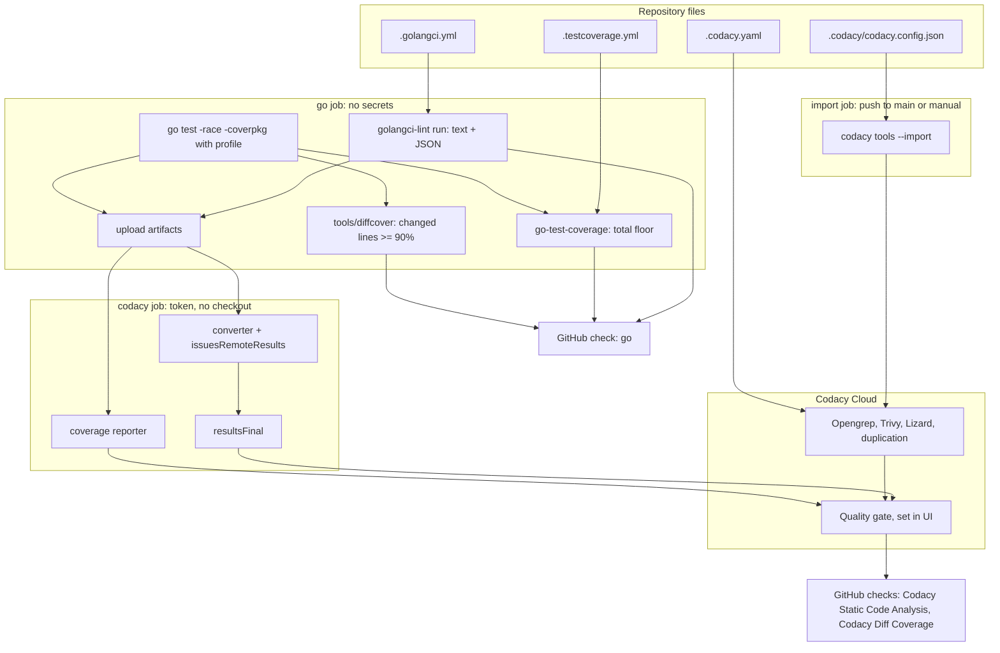
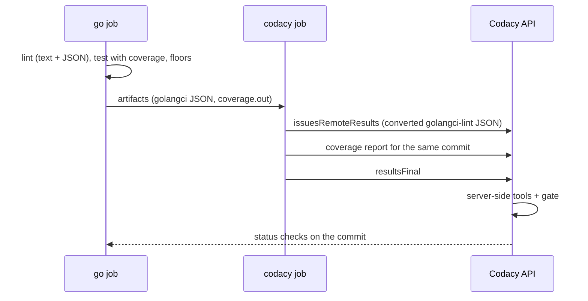

# Strict Codacy Configuration - Plan

## Goal Capsule

- **Objective:** Every pull request to crew meets one strict quality bar on complexity, quality, security and code standards, and nothing merges below it. Each rule in the bar is one we would act on, it holds for the whole repository from the day it is switched on, and an agent can check it locally before pushing.
- **Means:** Codacy Cloud. Its rules are kept in files in the repository and applied to Codacy on merge (KTD5). Go is analysed in CI's `go` job, and a separate job uploads the results (KTD1, KTD4). The quality gates are set in the Codacy UI and recorded in the docs (KTD8).
- **Product authority:** this Product Contract, within `STRATEGY.md`. Shared workflows in `thatsnotmynameio/.github` and organization-wide Codacy policies are not active scope.
- **Stop conditions:** stop and report if the debt pass (U2) can only reach zero findings by disabling a rule whose findings we would fix, or by excluding first-party source. That would break R2 and R4. Also stop if Codacy cannot accept the uploaded golangci-lint results or the tool-configuration import at all, which would break KTD1 or KTD5.
- **Execution profile:** Standard. Seven units in the order of Sequencing, one pull request. U2 is the large one.
- **Who finishes:** the implementer ships U1–U7 in one pull request. The boss then does the manual Codacy and GitHub setup that U7's page lists, and only after that makes the checks required (R9). Merging stays with the boss.
- **Open blockers:** none.
- **Product Contract preservation:** Product Contract unchanged, except that the Deferred to Planning questions are removed because KTD1–KTD9 answer them. The license-scanning part of R1 depends on the organization's plan (see Assumptions).

---

## Product Contract

### Summary

crew gets a strict Codacy setup. A tool or rule is enabled only when its findings are ones we would fix, and everything enabled is enforced with zero tolerance on every pull request. Tools, rules and thresholds are versioned in the repository. Only the quality gates live in the Codacy UI, and a docs page records their values. SonarQube is removed.

### Problem Frame

crew writes its own code through agent sessions. Today a pull request must pass gofmt, `go vet`, golangci-lint with five linters (depguard, errorlint, gocritic, misspell, revive), `go test -race` and govulncheck. Nothing checks complexity or duplication. Nothing runs static security analysis or scans for secrets. Coverage is never measured, even though the suite reaches 92.6% of statements with `-coverpkg=./...`. SonarQube is wired in but has never been switched on, and its properties file still names the template project.

The strategy rests on quality coming from checks by someone other than the author. An agent that writes a pull request cannot be trusted to judge its own complexity or security. The boss wants these four areas enforced: complexity, quality, security and code standards.

### Key Decisions

- **Existing findings go to zero before the gate is enforced.** The bar applies to the whole repository from day one. Governs R14. (session-settled: user-directed — chosen over gating only new code and over gating new code now with the debt planned as a later delivery: the standard should hold everywhere, not only on new lines)
- **Rigor that makes sense: a rule earns its place.** A tool, linter or pattern is enabled only if we would fix what it reports. Whatever is left out is listed with its reason. Governs R2, R3. (session-settled: user-directed — chosen over enabling everything, over adopting a community golden config as it stands, and over only extending the five current linters: "rigor, but rigor that makes sense")
- **Coverage: 90% of new lines, and the total never below 90%.** Governs R10, R11. (session-settled: user-directed — chosen over 100% of new lines, which breeds tests written for the number, and over only forbidding a drop in total coverage, which blocks refactors that delete tested code)
- **Codacy's rules are versioned in the repository, and the gates are set in the UI.** Codacy's own configuration file plus its Cloud CLI import make tools, patterns and parameters versionable. Quality gates have no file or CLI command. Governs R5, R6, R7. (session-settled: user-directed — chosen over configuring everything in the UI and over a custom script that calls the Codacy API)
- **CI analyses Go, and Codacy's server runs everything else.** golangci-lint, with its security, static-analysis and complexity linters, runs in CI against the repository's own config and uploads its results. Codacy's server runs the scanners that need no build. Governs R1. (session-settled: user-approved — chosen over letting Codacy's server run only its own Go tools next to an independent CI lint, which splits the rules across two places, and over using Codacy only to aggregate CI results, which loses its secret, SAST and dependency scanning)
- **The Codacy config is applied on merge to `main`, not by hand.** The file and Codacy cannot drift apart through changes made in the repository. Governs R6. (session-settled: user-approved — chosen over the boss running the import after each change)
- **Only crew, for now.** Once it works here, it can be promoted to the shared `.github` repository as a separate delivery. (session-settled: user-directed — chosen over shared workflows from the start and over an organization-wide gate policy and coding standard)
- **SonarQube is removed.** One analysis tool, one place to suppress a finding. Governs R16. (session-settled: user-directed — chosen over leaving it switched off and over running both)

### Requirements

**Rules and ownership**

- R1. Each kind of finding has one owner. CI owns Go static analysis: style, correctness, security (gosec), staticcheck and per-function complexity. Codacy's server owns these:
  - SAST and secrets (Opengrep);
  - dependency vulnerabilities, malicious packages and secrets (Trivy);
  - duplication;
  - complexity metrics (Lizard);
  - license scanning.

  Where two tools measure the same thing, such as function complexity in golangci-lint and Lizard, their thresholds match, so local lint and the Codacy gate never disagree.
- R2. Every enabled tool, linter and pattern is one whose findings we would fix. Every one left disabled is listed with a written reason next to where it is configured.
- R3. Every threshold, such as complexity, function length, nesting, duplication or line length, is set in a versioned file with the reason for its value.
- R4. A suppression is narrow and explained. An inline suppression names the specific rule and gives a reason, and lint fails on one that does not. A path excluded from analysis carries its reason in the scope file. First-party source is never excluded to hide a finding.

**Configuration in the repository**

- R5. The repository holds every Codacy setting that has a file form:
  - which Codacy tools run, with their patterns and parameters (Codacy's tool configuration file);
  - each tool's own configuration file where Codacy reads one (`.golangci.yml`, and Opengrep's rules file if Opengrep's defaults are not enough);
  - the analysis scope (`.codacy.yaml`).
- R6. A merge to `main` that changes the Codacy tool configuration applies it to Codacy automatically, with no step in the UI.
- R7. Some settings have no file form: the quality gates, "Run analysis on your build server" and the GitHub integration settings. The boss sets them in the Codacy UI. A page in `docs/develop/` records each value and its reason. A change in rigor is proposed as a pull request to that page.

**The gate**

- R8. The pull request gate fails on any of these:
  - a new issue of any severity, Info and up;
  - a new security issue of any severity;
  - new duplication;
  - diff coverage below the R10 floor.

  The commit gate on `main` uses the same thresholds where Codacy offers them.
- R9. Codacy's status checks are required in the `checks` ruleset, next to `go`. They become required only after they have reported the expected result on real pull requests.
- R10. Diff coverage, the share of the lines a pull request adds or changes that tests cover, must be at least 90%.
- R11. Total coverage never drops below 90%. CI checks this on every pull request, because Codacy gates only coverage changes, not absolute totals.
- R12. Every pull request gets a verdict on its merits. One that cannot upload results, such as a Dependabot pull request without repository secrets, does not leave a Codacy check pending forever. One with no coverable lines, such as a docs-only change, does not fail on coverage.
- R13. The golangci-lint version is pinned in one place, so a new release cannot add rules or move the bar silently.

**The debt pass**

- R14. Before R9 makes the checks required, the repository has zero findings under the final configuration. Each finding is fixed, or suppressed per R4 when it is a false positive. Total coverage meets R11.

**Working locally**

- R15. Everything the gate enforces can be run locally with commands listed in `AGENTS.md` and `docs/develop/index.mdx`:
  - Go lint;
  - Codacy's server-side tools, through the Codacy Analysis CLI;
  - coverage with the 90% floor.

  An agent sees the same failure before it pushes.

**SonarQube and docs**

- R16. SonarQube is removed: its workflow, its properties file, the `SONAR_ENABLED` instructions and every mention in `AGENTS.md`, `README.md` and the coverage comment in `.gitignore`.
- R17. `AGENTS.md`, `README.md` and `docs/develop/index.mdx` describe the new checks, the commands and where each kind of rule is configured, and `pnpm docs:check` passes.

### Acceptance Examples

- AE1. **Covers R1, R8, R15.** **Given** a pull request that builds a shell command from user input, **when** the agent runs the local commands, **then** gosec reports it. **When** the pull request is pushed, **then** `Codacy Static Code Analysis` fails on the same finding.
- AE2. **Covers R8, R10.** **Given** a pull request whose changed lines are 85% covered while the total stays at 92%, **when** Codacy analyses it, **then** the diff coverage check fails.
- AE3. **Covers R11.** **Given** a pull request that deletes tests and drops total coverage to 89%, **when** CI runs, **then** the coverage floor fails, even if every changed line is covered.
- AE4. **Covers R12.** **Given** a Dependabot pull request bumping a Go module, **when** CI runs without repository secrets, **then** every Codacy check still reaches a verdict and none waits forever for an upload.
- AE5. **Covers R12.** **Given** a pull request that only changes `docs/**/*.mdx`, **when** Codacy analyses it, **then** no coverage check blocks it.
- AE6. **Covers R6.** **Given** a merged pull request that disables a pattern in the Codacy tool configuration file, **when** the next analysis runs, **then** Codacy no longer reports that pattern, and nobody touched the UI.
- AE7. **Covers R4.** **Given** a `//nolint:gosec` with no reason, **when** lint runs, **then** it fails and asks for the specific rule and a reason.

### Success Criteria

- A red Codacy check on a crew pull request points at something its author agrees to fix. A check that is red on almost every pull request means R2 failed, and the rule behind it is revisited rather than suppressed case by case.
- The checks hold for agent-written pull requests: a crew session finds the same failures locally (R15) and fixes them before pushing.

### Scope Boundaries

**Deferred for later**

- Promoting the workflow and configuration to `thatsnotmynameio/.github`, and organization-wide Codacy gate policies and coding standards.
- Detecting a gate loosened in the Codacy UI without a pull request.
- Codacy's AI features (AI Reviewer, pull request summary, AI false-positive triage).

**Not in this work**

- Container, IaC and DAST scanning: crew ships a binary, not images or infrastructure.
- Fixing the debt by lowering the bar. A threshold changes only through R2 or R3, with a reason.

### Dependencies / Assumptions

- The organization's Codacy plan is Team or higher, which covers private repositories, gates and coverage. crew is private. The boss confirmed the plan.
- The Codacy GitHub app (`codacy-production`) is installed on the organization. The boss adds crew in Codacy and creates the repository token that CI stores as a secret.
- A repository admin can always bypass Codacy's status checks, and that bypass is audited. Codacy offers no setting to disable it.
- Codacy reads `.codacy.yaml` from the default branch only. A change to the analysis scope takes effect after it merges.

### Sources / Research

- Codacy docs, from the `codacy/docs` repository at `248bb9a` (2026-10-02):
  - `docs/getting-started/supported-languages-and-tools.md`: the Go tools, and which of them run client-side;
  - `docs/repositories-configure/configuring-code-patterns.md`: tool configuration files; Opengrep reads `.semgrep.yaml`, revive reads `revive.toml`, and Gosec, Staticcheck, Lizard and Trivy read none;
  - `docs/repositories-configure/codacy-configuration-file.md`: `.codacy.yaml` holds the scope and some engine options, such as the duplication engine's `minTokenMatch`, but it cannot enable tools or set gates;
  - `docs/codacy-analysis-cli/index.md`: `.codacy/codacy.config.json`, local analysis and SARIF upload;
  - `docs/codacy-cloud-cli/index.md`: `codacy tools ... --import`;
  - `docs/repositories-configure/adjusting-quality-gates.md` and `docs/repositories-configure/local-analysis/client-side-tools.md`.
- Codacy Cloud CLI, `codacy/codacy-cloud-cli` `CHANGELOG.md`: `tools --import` works with a repository token, while `--force` needs an account token.
- Starting thresholds for strict golangci-lint v2 setups, where maratori's golden config (`maratori/golangci-lint-config`), traefik and golangci-lint's own config agree: gocognit 15–20, gocyclo about 15, funlen at 50 statements with lines off, nestif 4–5, dupl 100, line length 120. Codacy's Lizard defaults flag CCN above 10 and functions over 50 lines.
- Coverage practice: the Google Testing Blog, "Code Coverage Best Practices" (2020), calls 90% a good per-commit floor. Measured on this repository on 2026-10-02: 92.6% with `go test -coverpkg=./... ./...`.
- A known risk with strict gates: a gate that is red on every pull request stops meaning anything (`Ciemaar/PrintQueueManager#106`). This is the reason for R2 and the first Success Criterion.

---

## Planning Contract

### Key Technical Decisions

- KTD1. **golangci-lint reaches Codacy through Codacy's converter and its results API.** The `go` job runs golangci-lint once, writing text for the log and JSON to a file. A separate `codacy` job (KTD4) turns the JSON into Codacy's format with the `codacy-golangci-lint` converter (release `0.0.9`, a pinned binary checked against its published sha256). It posts the result to `/2.0/commit/<sha>/issuesRemoteResults`, then calls `/resultsFinal`. The Codacy Analysis CLI's SARIF upload was not chosen because that CLI does not run golangci-lint and its upload accepts only its own reports. Governs R1. (session-settled: user-approved — chosen over Codacy's server running only its own Go tools next to an independent CI lint: one owner per finding type)
- KTD2. **`.golangci.yml` uses `linters.default: all`, and every disabled linter carries a comment with its reason.** A linter is on unless the file says why it is off, so R2 holds by construction. The golangci-lint version is pinned (R13), so a release cannot switch new linters on unseen. `nolintlint` requires a specific linter and an explanation (R4, AE7). Thresholds start from the consensus values in Sources and are tuned against crew's code in U2 (R3). Governs R2, R3, R4, R13.
- KTD3. **Each metric has exactly one owner, and where Codacy's server measures something the local lint also measures, the thresholds are equal.**
  - Duplication belongs to Codacy's duplication engine. golangci-lint's `dupl` is disabled with that reason, and the engine's `minTokenMatch` is set in `.codacy.yaml` (R3).
  - Cyclomatic complexity is measured by `cyclop` locally and by Lizard's CCN in Codacy, at the same value. `gocyclo` is disabled because it measures the same thing.
  - Function length is measured by `funlen` in non-comment lines (`lines` with `ignore-comments`, statements off), because Lizard counts lines, not statements. Lizard's NLOC threshold is set to the same value.
  - Every enabled Lizard pattern, including parameter count, has a golangci-lint counterpart at the same threshold (`revive`'s `argument-limit` for parameters), or is disabled in the tool configuration with its reason.
  - Under R8's Info-and-up gate, Lizard's lowest tier is the one that applies. That is the one matched, with the higher tiers set no lower.

  Governs R1, R3.
- KTD4. **The `go` job produces the results and the separate `codacy` job holds the token.** This keeps the token away from dependency code: on a Dependabot pull request, the bumped module runs during `go test`, so the job that runs repository code never sees `CODACY_PROJECT_TOKEN`.
  - The `go` job runs on pull requests and on pushes to `main`. It checks out the pull request's head commit, so line numbers match the commit Codacy analyses, and it uploads the golangci-lint JSON and `coverage.out` as artifacts.
  - The trade-off of the head checkout: `go` no longer tests the merge of the pull request into `main`.
  - The `codacy` job (`needs: go`, `if: always()` and `CODACY_ENABLED`, `permissions: contents: read`) never checks out or runs repository code. It downloads the artifacts, runs the pinned converter and coverage reporter, posts both and calls `resultsFinal`, even when `go` failed.
  - Push runs get a concurrency group of their own per commit, and only pull-request runs cancel in progress. A cancelled or replaced `main` run would leave that commit waiting for `resultsFinal` forever.
  - The `version` job runs on pull requests only.
- KTD5. **An `import` job runs `pnpm exec codacy tools gh thatsnotmynameio crew --import --skip-approval` with the repository token.** It runs on pushes to `main` that change `.codacy/codacy.config.json`, and on a manual `workflow_dispatch` on `main`, which applies the file the first time after the boss's setup. It runs through pnpm so that `codacy-analysis` is on its PATH, which the import needs in order to disable the tools the file leaves out. It never passes `--force`, which needs an account token. Governs R6. (session-settled: user-approved — chosen over the boss running the import by hand: file and Codacy cannot drift through changes made in the repository)
- KTD6. **The Codacy CLIs are dev dependencies in `package.json`, pinned by hash in `pnpm-lock.yaml`.** These are `@codacy/analysis-cli` (0.24.0) and `@codacy/codacy-cloud-cli` (1.14.0). This follows the repository's rule that pnpm packages are pinned by hash, and Dependabot's npm entry already updates them. The binaries that are not on npm (the converter and the coverage reporter) are downloaded from their GitHub releases at a pinned version and verified against a checksum, never through `curl | bash`.
- KTD7. **Coverage goes to Codacy through the coverage reporter binary (`14.1.3`) with `--force-coverage-parser go` and `--commit-uuid` set to the analysed commit.** The total floor (R11) is checked by `go-test-coverage` (`v2.19.0`, run with `go run` like golangci-lint) with a `total: 90` threshold and no per-file or per-package floors. The profile uses `-coverpkg=./...`, which is how the 92.6% was measured. The GitHub Action wrapper was not used, because it fetches `get.sh` unpinned and cannot set the commit.
- KTD8. **The Codacy side is switched on by the repository variable `CODACY_ENABLED`, the same pattern `SONAR_ENABLED` used.** Until the boss has done the manual setup, the `codacy` and `import` jobs are skipped. Once the variable is `true`, a missing or expired `CODACY_PROJECT_TOKEN` fails the `codacy` job with a message pointing to the rotation steps. A Dependabot pull request reaches a verdict (R12, AE4) under two conditions: the token is also a Dependabot secret, and Dependabot's commit identity is a committer in the Codacy organization. Codacy analyses a private repository's commits only from its organization's members. The gates are set in the UI as a gate policy applied only to crew, which is how Codacy sets per-repository gates.
- KTD9. **R10 is enforced by a changed-lines coverage check in the `go` job. `Codacy Diff Coverage` becomes required only if it passes on a pull request with no coverable lines.**
  - Codacy's docs say the diff-coverage gate fails when the value is `∅`, which is what a docs, workflow or dependency-only pull request gets.
  - The check is a small Go command in `tools/diffcover`. It reads `coverage.out` and the pull request's `git diff` against its base, counts coverable changed lines and the covered ones, fails below 90%, and passes when no coverable line changed. It is exercised by its own tests.
  - No existing tool does this: `go-test-coverage`'s diff mode compares totals with the base, not changed lines.
  - The complexity gate stays off. Per-function thresholds (R3) already flag complex code as issues, and an aggregate "complexity is over N" with N=0 would fail any pull request that adds a function.

### High-Level Technical Design

Where each kind of finding is produced, and how it reaches the gate:

The upload sequence for one commit, with "Run analysis on your build server" on:

### Assumptions

- License scanning is listed under the Business plan on Codacy's pricing page. If the organization's plan does not include it, the license-scanning part of R1 is inactive and the docs page says so.
- Codacy imports a GolangCI-Lint entry from `.codacy/codacy.config.json` even though the local Codacy Analysis CLI does not run that tool. If the import rejects it, the implementer enables the tool and its patterns once with `codacy tool` / `codacy patterns`, records that in the docs page, and keeps the file for the rest.
- Codacy counts the uploaded gosec findings as security issues, because the converter's patterns mark gosec as `Security` / `SAST`.
- No fork pull requests are expected: crew is private.

### Deferred to Implementation

- The final linter set and thresholds after U2 meets crew's code (R2, R3). Each change from the starting values gets its reason in `.golangci.yml`, and KTD3's matched Codacy thresholds move with it.
- Whether `_test.go` files need per-linter relaxations, such as `funlen` for table tests. Each relaxation is allowed only as a reasoned `exclusions.rules` entry (R4), mirrored for the same metric as a reasoned per-engine `exclude_paths` entry in `.codacy.yaml`.
- The exact `.codacy/codacy.config.json` shape. It is generated with `codacy-analysis init --auto` after `.codacy.yaml` exists, then edited, not hand-written. Every later change to `.codacy.yaml` is followed by `codacy-analysis update-config`, and both files are committed together.
- Whether the local Codacy Analysis CLI can run Opengrep, Trivy, Lizard and duplication from the committed config. If one cannot run locally, the docs say which, and R15's exception is that tool.

### Risks

- **The debt pass is larger than one pull request can review well.** `default: all` and Lizard, on code written against five linters, may produce hundreds of findings. Mitigation: per-linter commits (U2), and the Goal Capsule's stop condition when reaching zero would break R2.
- **A commit that never gets `resultsFinal` leaves Codacy waiting.** This applies once "Run analysis on your build server" is on. Mitigations: the `codacy` job runs even after `go` fails, `main` runs are never cancelled (KTD4), and Dependabot has the secret and committer membership (KTD8).
- **Codacy's Go coverage parser may misread a `-coverpkg=./...` profile.** Such a profile repeats blocks once per test binary and names files by module path. If Codacy's numbers disagree with `go tool cover`, the boss's verification step catches it before R9. The fix is then to merge or rewrite the profile in the `codacy` job. R10 itself does not depend on Codacy (KTD9).
- **Codacy docs and CLIs move fast.** `@codacy/analysis-cli` is at 0.x, and the GolangCI-Lint integration is from 2026. Mitigation: everything is pinned (KTD6, KTD7), and the docs page links the Codacy docs it relies on.

### Sequencing

U1 → U4 → U2 → U3 → U5, then U6 and U7.
- U2 runs against both U1's lint and U4's Codacy configuration, and must reach zero before U5 wires the uploads.
- U3 needs U2's final code for the total floor.
- U6 and U7 can follow in any order.

---

## Implementation Units

### U1. Strict golangci-lint configuration

**Goal:** `.golangci.yml` enforces the strict rule set with every exception explained.

**Requirements:** R1, R2, R3, R4, R13. KTD2, KTD3.

**Dependencies:** none.

**Files:**
- `.golangci.yml`

**Approach:**
1. Switch to `linters.default: all`. Keep `depguard` and its layering rules unchanged.
2. Add a `disable` list where every entry has a reason comment.
   - Required by KTD3: `dupl` (Codacy owns duplication) and `gocyclo` (`cyclop` measures the same thing).
   - Expected candidates, each to be judged against R2: `wsl`/`wsl_v5`, `nlreturn`, `varnamelen`, `exhaustruct`, `ireturn`, `wrapcheck`, `err113`, `paralleltest`, `testpackage`, `lll` (if `golines` covers line length), `gochecknoglobals` (if the registry pattern needs globals).
3. Set the starting thresholds:
   - cyclop 15;
   - gocognit 15;
   - funlen at 50 non-comment lines, with statements off;
   - nestif 4;
   - line length 120;
   - `revive`'s `argument-limit` at Lizard's parameter threshold;
   - `nolintlint` with `require-explanation` and `require-specific`.
4. Keep the exclusion presets that only remove known false positives (`std-error-handling`, `common-false-positives`), each with a comment.

**Patterns to follow:** the current `.golangci.yml` header comment style. maratori's golden config for the reasons it gives for disabled linters.

**Test scenarios:**
- Covers AE7. A scratch file with `//nolint:gosec` and no explanation makes lint fail with a nolintlint finding.
- A scratch file with a function of cognitive complexity above the threshold makes lint fail on gocognit.
- `golangci-lint config verify` accepts the file.

**Verification:** the config verifies at v2.14.0. Every disabled linter and every relaxed threshold has a reason next to it.

### U4. Codacy configuration files and CLIs

**Goal:** every Codacy setting that has a file form lives in the repository, and Codacy's server-side tools run locally with the same configuration.

**Requirements:** R1, R3, R5, R15. KTD3, KTD6.

**Dependencies:** U1.

**Files:**
- `.codacy.yaml`
- `.codacy/codacy.config.json`
- `.codacy/codacy.config.baseline.json`
- `.codacy/.gitignore`
- `package.json`
- `pnpm-lock.yaml`

**Approach:**
1. Add `@codacy/analysis-cli` and `@codacy/codacy-cloud-cli` as dev dependencies at KTD6's versions, with pnpm, never npm.
2. Write `.codacy.yaml` first, starting with `---`:
   - top-level `exclude_paths` only for material that is not source (`node_modules/**`), with a reason comment;
   - TUI golden files (`internal/ui/tui/testdata/**`) and recorded fixtures (`internal/adapter/claude/testdata/**`) excluded per engine, from duplication and complexity, with reasons (R4);
   - `engines.duplication.minTokenMatch` set with its reason (KTD3, R3).
3. Generate the tool configuration with `codacy-analysis init --auto`. That writes `.codacy/codacy.config.json`, the baseline file and `.codacy/.gitignore`, and copies the exclusions. Commit both JSON files.
4. Edit `.codacy/codacy.config.json` per KTD3:
   - Opengrep (`Semgrep` ID), Trivy, Lizard and duplication are on.
   - GolangCI-Lint is on, with all of its patterns.
   - Revive, Staticcheck and Gosec (Codacy's own runs) are off.
   - Lizard's patterns match U1's thresholds or are off with a reason.
5. Validate `.codacy.yaml` the way Codacy documents.

**Patterns to follow:** `package.json`'s existing devDependency and the pnpm lockfile rule in `AGENTS.md`.

**Test scenarios:**
- Test expectation: none, because this is configuration. U2's local analysis exercises it, and U5's import plus the first Codacy analysis prove it.

**Verification:** `pnpm install --frozen-lockfile` succeeds. `pnpm exec codacy-analysis analyze` runs with the committed config, or the tools it cannot run are listed for U7.

### U2. Debt pass to zero findings

**Goal:** the repository has zero findings under U1's golangci-lint configuration and U4's Codacy configuration, and the code is better for it.

**Requirements:** R14, R2, R4. Key Decision "existing findings go to zero".

**Dependencies:** U1, U4.

**Files:**
- `cmd/crew/**`, `internal/**` (production and test code, wherever findings land)
- `.golangci.yml`, `.codacy/codacy.config.json` (only for R2 decisions, each with its reason)

**Approach:**
1. Run the full lint and `pnpm exec codacy-analysis analyze`, and group the findings by linter or pattern.
2. For each linter or pattern, decide per R2. Fix the findings when we would fix them. When its findings are mostly false positives or would make the code worse, disable it with the reason in the file that owns it (KTD2, KTD3), and say why in the commit message.
3. Suppress a single finding inline only when it is a real false positive, with the specific rule and a reason (R4).
4. Refactor complex functions into smaller ones without changing behaviour. The existing tests are the safety net, and they keep passing with `-race`.
5. Commit per linter or per package, so each commit is reviewable.

**Execution note:** behaviour must not change. Run the full test suite after each refactor batch. Where a refactor touches code with thin coverage, add characterization tests first.

**Patterns to follow:** package layering in `docs/develop/architecture.mdx`. Table-driven tests as in `internal/core`.

**Test scenarios:**
- The full suite passes with `-race` after the pass.
- Every new helper split out of a complex function is covered, directly or through its caller's existing tests, so total coverage stays ≥ 90% (R11).
- Test expectation for pure renames and comment fixes: none, because behaviour is unchanged and covered by the existing suite.

**Verification:** golangci-lint reports zero issues, and the local Codacy analysis reports zero issues for every tool it can run. The suite passes with `-race`. govulncheck is clean. No suppression lacks a rule and a reason.

### U3. Coverage profile, total floor and changed-lines check

**Goal:** CI measures coverage on every pull request and fails when the total drops below 90%, or when the pull request's changed coverable lines are less than 90% covered.

**Requirements:** R10, R11, R12, AE2, AE3, AE5. KTD7, KTD9.

**Dependencies:** U2.

**Files:**
- `.testcoverage.yml`
- `tools/diffcover/main.go`
- `tools/diffcover/main_test.go`
- `.github/workflows/ci.yml`
- `.gitignore`

**Approach:**
1. Add `.testcoverage.yml` with the profile path and `threshold.total: 90`.
2. Write `tools/diffcover`, a `main` package in the same module. It reads a coverage profile and a unified diff (`git diff -U0 <base>...HEAD`), maps the changed lines to profile blocks, de-duplicates the blocks that `-coverpkg` repeats per test binary, and prints the changed-lines coverage. It exits non-zero below the threshold and zero when no coverable line changed.
3. In the `go` job, run the tests with `-race -covermode=atomic -coverpkg=./... -coverprofile=coverage.out`. Then run go-test-coverage at `v2.19.0` through `go run`, and on pull requests run `go run ./tools/diffcover` against the base branch.
4. Ignore `coverage.out` in `.gitignore`, replacing the Sonar coverage comment.
5. Extend the gofmt step in `ci.yml` and the gofmt line in `AGENTS.md` to `tools`.

**Patterns to follow:** the `go run …@version` style of golangci-lint and govulncheck in `ci.yml` and `AGENTS.md`. Table-driven tests as in `internal/core`.

**Test scenarios:**
- Covers AE2. A diff touching 20 coverable lines, of which 17 are covered (85%), exits non-zero and prints 85%.
- A diff with 18 of 20 covered lines (90%) passes.
- Covers AE5. A diff that touches only `.mdx` and `.yml` files passes with "no coverable lines changed".
- A diff that only deletes Go lines passes the same way.
- A profile in which `-coverpkg` lists the same block twice, once with count 0 and once with count 3, counts the block as covered.
- A changed line outside any profile block (a comment or blank line) is not coverable.
- Malformed profile input fails with a message naming the file.
- Covers AE3. Locally, with the total threshold set above the measured total, go-test-coverage fails and names the total.

**Verification:** `tools/diffcover` tests pass. The `go` job runs both checks, and the same commands pass locally.

### U5. CI wiring: artifacts, uploads and import

**Goal:** every pull request and every push to `main` reaches Codacy with lint results and coverage, without exposing the token to repository code, and merged tool-config changes reach Codacy without the UI.

**Requirements:** R6, R8, R12, R13, AE1, AE4, AE6. KTD1, KTD4, KTD5, KTD7, KTD8.

**Dependencies:** U3, U4.

**Files:**
- `.github/workflows/ci.yml`

**Approach:**
1. Triggers and concurrency:
   - add `push` to `main`;
   - restrict `version` to pull requests;
   - give push runs a per-commit concurrency group, and cancel in progress only for pull requests (KTD4).
2. In the `go` job:
   - check out the pull request's head SHA, or `github.sha` on push;
   - run golangci-lint through the pinned action, with text output plus a JSON output file (one version, R13);
   - upload the JSON and `coverage.out` as artifacts with `if: always()`.
3. Add the `codacy` job:
   - `needs: go`, `if: always()` and `vars.CODACY_ENABLED == 'true'`, `permissions: contents: read`, no checkout;
   - fail with a rotation hint if `CODACY_PROJECT_TOKEN` is empty;
   - download the artifacts, plus the converter and coverage reporter at their pinned versions, and verify the checksums;
   - post the results, then the coverage, for the analysed SHA, then call `resultsFinal`.
4. Add the `import` job, gated on `CODACY_ENABLED`, for pushes to `main` that change `.codacy/codacy.config.json` and for `workflow_dispatch` on `main`. It installs with pnpm and runs the import through `pnpm exec` (KTD5).
5. Pin every new action by SHA, with the version as a comment.

**Patterns to follow:** the existing `ci.yml` header and step style, SHA pinning, `persist-credentials: false`, and `SONAR_ENABLED` gating in the old `sonar.yml`.

**Test scenarios:**
- actionlint passes on the workflow.
- With `CODACY_ENABLED` unset, a pull request run skips the `codacy` and `import` jobs. The `go` result depends only on fmt, vet, lint, tests, coverage checks and govulncheck.
- With `CODACY_ENABLED` true and no token, the `codacy` job fails with a message naming the missing or expired secret and the rotation section.
- No step of the `go` job references `CODACY_PROJECT_TOKEN`.
- Covers AE1. After the boss's setup, a pull request with a gosec finding fails `Codacy Static Code Analysis`.
- Covers AE4. After the boss's setup, a Dependabot pull request uploads and gets a verdict.
- Covers AE6. After the boss's setup, merging a change that disables one pattern in `.codacy/codacy.config.json` runs the import job, and the pattern shows as disabled in Codacy.

**Verification:** the workflow passes actionlint. The pull request's own run shows the `codacy` and `import` jobs skipped, because the variable is not set yet.

### U6. Remove SonarQube

**Goal:** no trace of SonarQube remains.

**Requirements:** R16. Key Decision "SonarQube is removed".

**Dependencies:** none.

**Files:**
- `.github/workflows/sonar.yml` (delete)
- `sonar-project.properties` (delete)
- `.gitignore`

**Approach:** delete both files. Replace the Sonar coverage block in `.gitignore` with the U3 entry. The mentions in `AGENTS.md` and `README.md` are rewritten in U7.

**Test scenarios:**
- Test expectation: none, because files are removed. A grep for `sonar` (case-insensitive) outside `docs/plans/` returns nothing after U7.

**Verification:** grep is clean, and the pull request's checks no longer list SonarQube.

### U7. Docs, quality page and manual setup

**Goal:** contributors and agents know every check, where its rules live, how to run it locally, and what the boss sets by hand.

**Requirements:** R7, R9, R14, R15, R17. KTD5, KTD8, KTD9.

**Dependencies:** U1–U6.

**Files:**
- `docs/develop/quality.mdx` (new)
- `docs.json`
- `docs/develop/index.mdx`
- `AGENTS.md`
- `README.md`

**Approach:**
1. Write `docs/develop/quality.mdx` with:
   - where each kind of rule lives (golangci-lint, Codacy tool configuration, `.codacy.yaml`, coverage checks) and the one owner per metric (KTD3);
   - the UI-only settings and their values with reasons: the gate policy for crew (R8, complexity gate off per KTD9), "Run analysis on your build server" on, and the GitHub integration status checks on;
   - the local commands (R15), including `codacy-analysis update-config` after any `.codacy.yaml` edit;
   - how to propose a change in rigor (R7);
   - rotating the Codacy token: create a new repository token, replace the Actions and Dependabot secrets, then delete the old token;
   - the boss's one-time setup, in order:
     1. add crew in Codacy;
     2. add Dependabot's commit identity as a committer in the Codacy organization;
     3. create the repository token with the longest allowed expiry, and record that date on the page;
     4. add `CODACY_PROJECT_TOKEN` as an Actions secret and as a Dependabot secret;
     5. turn on "Run analysis on your build server";
     6. create the gate policy and apply it to crew;
     7. set `CODACY_ENABLED` to `true`;
     8. run the CI workflow by hand on `main`, so the import applies the tool configuration;
     9. compare `codacy tools gh thatsnotmynameio crew` with the file, and disable, with a recorded reason, any tool the import left on;
     10. confirm that the first analysis of `main` shows zero issues and zero duplication (R14), fixing any remainder in a follow-up pull request;
     11. watch a code pull request and a docs-only pull request, deciding whether `Codacy Diff Coverage` can be required (KTD9);
     12. add the Codacy checks to the `checks` ruleset with `bootstrap.sh --checks` (R9).
2. Add the page to the Develop sidebar in `docs.json`.
3. Update the Commands block and the CI paragraph in `docs/develop/index.mdx` and `AGENTS.md`: coverage, both floors and the Codacy CLI. Replace the Sonar bullet in `AGENTS.md` with a Codacy bullet giving the suppression rule (R4).
4. Update `README.md`'s workflow table: remove the `sonar.yml` row and describe `ci.yml`'s new jobs.

**Patterns to follow:** `docs/develop/index.mdx` tone. MDX rule: braces and angle brackets go inside code.

**Test scenarios:**
- Test expectation: none, because this is documentation. `pnpm docs:check` is the check.

**Verification:** `pnpm docs:check` passes. Every command in the page runs as written.

---

## Verification Contract

| Gate | Command (from the repository root) | Proves |
|---|---|---|
| Format | `gofmt -l cmd internal tools` prints nothing | unchanged rule, plus `tools/` |
| Vet | `go vet ./...` | unchanged rule |
| Lint | `go run github.com/golangci/golangci-lint/v2/cmd/golangci-lint@v2.14.0 run` reports 0 issues | U1, U2, R14 |
| Lint config | `go run github.com/golangci/golangci-lint/v2/cmd/golangci-lint@v2.14.0 config verify` | U1 |
| Codacy server tools, locally | `pnpm exec codacy-analysis analyze` reports 0 issues | U2, U4, R14, R15 |
| Tests and coverage | `go test -race -covermode=atomic -coverpkg=./... -coverprofile=coverage.out ./...` | U2, U3 |
| Total floor | `go run github.com/vladopajic/go-test-coverage/v2@v2.19.0 --config=.testcoverage.yml` | R11, AE3 |
| Changed-lines floor | `go run ./tools/diffcover` against `origin/main` | R10, AE2, AE5 |
| Vulnerabilities | `go run golang.org/x/vuln/cmd/govulncheck@v1.8.0 ./...` | unchanged rule |
| Docs | `pnpm docs:check` | R17 |
| Workflows | actionlint, in CI's `actionlint / actionlint` | U5 |
| Sonar gone | case-insensitive grep for `sonar` outside `docs/plans/` is empty | R16 |

These are checked after the boss's setup, not in this pull request: AE1, AE4 and AE6 on real pull requests, the first analysis of `main` showing zero, and then R9.

---

## Definition of Done

- U1–U7 are done, and each unit's Verification holds.
- Every gate in the Verification Contract passes locally and in CI.
- golangci-lint and the local Codacy analysis report zero issues, and every disabled linter or pattern, relaxed threshold, exclusion and suppression carries its reason.
- Total coverage is ≥ 90%, and the changed-lines check passes on this pull request.
- No step that runs repository code can read `CODACY_PROJECT_TOKEN`.
- With `CODACY_ENABLED` unset, the pull request's CI is green, and no Codacy job ran.
- `docs/develop/quality.mdx` lists the boss's manual setup and token rotation. The pull request body repeats the setup as the remaining steps.
- No abandoned experiments are left in the diff: scratch lint files, temporary thresholds or debug steps.
