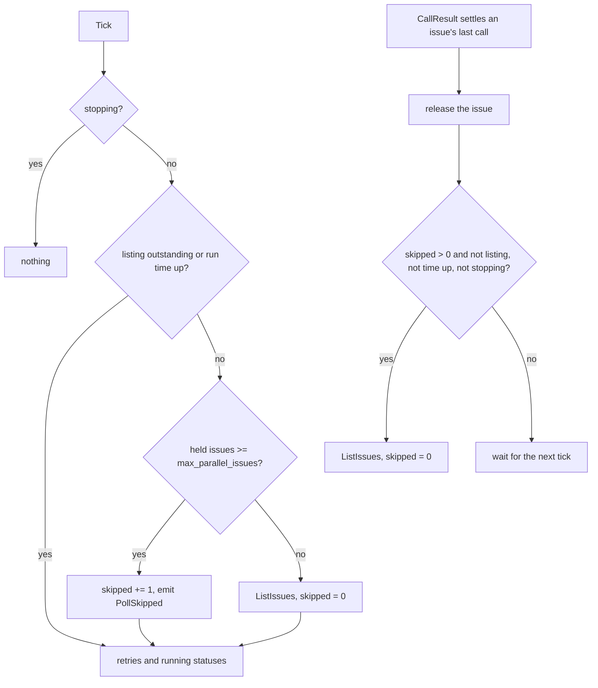

# Skip the poll while every slot is busy - Plan

## Goal Capsule

- **Objective:** crew spends GitHub requests only on work it can start. It does not list issues while it has no slot to give them, and it writes nothing on an issue it does not take.
- **Means:** a tick skips its listing while every slot is busy and says so in one line. A freed slot triggers an immediate listing only after a skipped tick. The queued status goes away: issues a listing cannot take are ignored until a later listing takes them (KTD1, KTD2, KTD3).
- **Product authority:** the Product Contract below, carried unchanged from issue #43, within `STRATEGY.md` (the Coordination track). The Planning Contract decides how, and never changes an R.
- **Stop conditions:** stop and report if a requirement turns out to need an engine-stepped tick (KTD1), or if removing the queued status breaks a status comment written by an earlier crew version beyond what R13 allows.
- **Execution profile:** one pull request: core, the domain's status kinds, the GitHub adapter's status comment, the lines renderer, their tests, and the docs.
- **Who finishes:** `ce-work` implements and verifies locally. The calling pipeline opens the pull request, and the boss merges it.

---

## Product Contract

Product Contract preservation: Product Contract unchanged (carried from the body of issue #43).

### Summary

While every slot is busy, a tick keeps updating running issues and retrying owed calls, but does not list issues, and leaves a line such as `poll: skipped, 2 of 2 slots busy`. When a slot frees after at least one skipped listing, crew lists at once. A listing takes issues while slots are free and ignores the rest: crew no longer writes a queued status comment.

### Problem Frame

Every tick lists the open issues carrying a stage's label, one GraphQL query (`internal/adapter/github/tracker.go`), and nothing else gates it but an outstanding listing and the run time (`internal/core/update.go`, `tick`). The slot limit applies only after the listing returns, when crew decides what to take (`listed`). With every slot busy, the listing cannot take anything: its result only refreshes the queued status comments of the issues left waiting.

Each issue a listing leaves waiting costs a status comment write when its queued status changes (`internal/core/status.go`, `queued`). So a busy crew with a long backlog writes comments on issues it is not working on.

No incident prompted this: crew has not hit GitHub's rate limit. At the default `poll_interval_seconds: 300` the listings cost about 12 queries an hour. The change is preventive: crew should not spend requests on work it cannot start now.

### Key Decisions

- **Skip the listing, not the tick.** The tick also reports each running issue's status and retries owed calls and statuses; those keep their pace. Governs R1, R2.
- **"Busy" is the rule that already limits taking.** A held issue keeps its slot until crew releases it, so a listing in that state could take nothing. Governs R1, R7.
- **List at once on a freed slot only after a skipped listing.** Governs R4, R5, R6. (session-settled: user-directed — chosen over listing at once on every freed slot: actions that end quickly would trigger one listing after another)
- **One line per skipped tick.** It shows crew is alive and why it did not list. Governs R3. (session-settled: user-directed — chosen over one line when skipping starts, and over no line)
- **Drop the queued status.** An issue a listing cannot take is ignored as if the listing had not returned it; its stage label already shows it waits. Governs R9, R10, R13. (session-settled: user-directed — chosen over keeping queued comments on issues left waiting: crew writes only on issues it takes)
- **No config switch.** The behaviour holds in every run; nobody asked to turn it off.

### Requirements

**Skipping the listing**

- R1. When the issues crew holds reach `max_parallel_issues`, a tick does not list issues.
- R2. The rest of a skipped tick runs as today: running issues' status reports, owed call retries and status retries.
- R3. Each tick that skips its listing because every slot is busy leaves one line in the log and live view, naming the busy and total slots, such as `poll: skipped, 2 of 2 slots busy`.
- R4. When crew releases an issue and at least one tick skipped its listing since the last listing, crew lists at once, without waiting for the next tick.
- R5. When crew releases an issue and no tick skipped its listing since the last listing, the next listing waits for the next tick, as today.
- R6. Any listing, at a tick or at once, starts the count of skipped ticks again from zero.
- R7. A held issue occupies its slot until crew releases it, in any claim state, including one whose actions ended and whose calls are still owed.
- R8. A tick that does not list because the run time is up or crew is stopping leaves no skip line; that gate is unchanged.

**What a listing does with the issues it returns**

- R9. A listing takes issues while slots are free, in today's order: later stages first, then the oldest issue. It ignores the other issues as if it had not returned them: no status, no event per issue, no retry.
- R10. crew no longer reports a queued status. An issue's status comment is created when crew takes it.
- R11. The poll line still counts every issue the listing returned and the ones it took: `poll: listed N issues, took M`.
- R12. An issue found in two or more crew states is still reported at every listing, as today.
- R13. A queued comment left by an earlier crew version shows the running status once crew takes that issue. crew does not touch comments on issues it never takes.

**Docs**

- R14. The docs describe the new behaviour wherever they mention polling, the queued status or "next poll": `docs/guide/crew.mdx`, `docs/guide/create-issue.mdx` and `docs/develop/architecture.mdx`.

### Acceptance Examples

`max_parallel_issues: 2` throughout.

- AE1. Busy tick
  - **Covers R1, R2, R3.**
  - **Given** crew holds 2 running issues.
  - **When** the ticker fires.
  - **Then** crew does not list, writes `poll: skipped, 2 of 2 slots busy`, and updates both running issues' status comments.
- AE2. Freed slot after a skipped tick
  - **Covers R4, R6.**
  - **Given** crew holds 2 issues and the last tick skipped its listing.
  - **When** crew releases one of them between ticks.
  - **Then** crew lists at once, and the count of skipped ticks is zero.
- AE3. Freed slot with no skipped tick
  - **Covers R5.**
  - **Given** crew held 1 issue, the last tick listed and took a second one, and no tick has run since.
  - **When** crew releases one of them.
  - **Then** crew does not list until the next tick.
- AE4. Second release after an immediate listing
  - **Covers R4, R5, R6.**
  - **Given** a freed slot triggered an immediate listing, which took a new issue.
  - **When** crew releases another issue before the next tick.
  - **Then** crew waits for the next tick.
- AE5. More ready issues than free slots
  - **Covers R9, R10, R11.**
  - **Given** crew holds 1 issue and 3 issues carry stage labels.
  - **When** a tick lists.
  - **Then** crew takes one by today's order and writes `poll: listed 3 issues, took 1`. The other 2 get no status comment and no line of their own; a later listing with a free slot can take them.
- AE6. Owed calls keep the slot
  - **Covers R1, R7.**
  - **Given** crew holds 2 issues, one with its actions ended and its verdict move owed after a GitHub error.
  - **When** the ticker fires.
  - **Then** crew does not list, and retries the owed move.
- AE7. Run time up
  - **Covers R8.**
  - **Given** the run time is up and crew holds 2 issues.
  - **When** the ticker fires.
  - **Then** crew does not list and writes no skip line.

### Scope Boundaries

- Fewer status writes for running issues: they keep one `PATCH` per tick.
- A smaller listing query, such as asking GitHub for only as many issues as there are free slots.
- Cleaning up queued comments that earlier versions left on issues crew never takes.
- A config switch, or a different interval while slots are busy.

### Dependencies / Assumptions

- GitHub's rate limit has not been hit; the saving is preventive, and its size is not a success criterion.
- With the queued status gone, the status-comment rule that a failed queued status is rewritten by the next poll (`docs/guide/crew.mdx`, "What crew does on each poll") goes with it.

### Sources

- Issue #43 (this Product Contract) and its triage comment: #40 and #14 depend on it; #41 and #45 touch `listed` and the skip rule.
- `internal/core/update.go` (`tick`, `listed`, `callResult`, `release`), `internal/core/status.go` (`report`, `queued`, `sameStatus`), `internal/engine/engine.go` (the ticker), `internal/ui/lines/lines.go` (the poll line), `internal/adapter/github/status.go` (`nextStatus`, `kindName`, `renderStatus`).

---

## Planning Contract

### Key Technical Decisions

- KTD1. The immediate listing is a `ListIssues` command the core emits in the same `Update` that releases an issue, not an engine-stepped tick. The core already owns every listing gate (outstanding listing, run time, stop) and is the one that knows the skip count. A tick would also retry owed calls and rewrite every running status early, adding the writes this work removes. The engine needs no change: it launches `ListIssues` from any step. Governs R4, R5.
- KTD2. The skip line comes from a new domain event, `PollSkipped`, carrying the busy and total slot counts; `lines.Text` renders it as `poll: skipped, B of S slots busy`. `PollDone` keeps its meaning, "a listing the core acted on", so R11's line is unchanged and nothing that reads `PollDone` has to tell a listing from a skip. The TUI shows it with no change, as its recent-events list renders every event through `lines.Text`. Governs R3.
- KTD3. The queued status is removed, not left unused: `crew.StatusQueued`, `crew.Status.Slots`, the core's `queued` report and the adapter's queued rendering all go. Dead kinds keep the docs and comments describing behaviour crew no longer has, and invite #40 and #14 to build on them (issue #43's triage). The GitHub adapter keeps recognizing an entry marked `kind=queued` as a legacy entry, through a local name rather than the domain kind, so R13 holds. Governs R10, R13.
- KTD4. One predicate decides "every slot is busy" for both the skip and the take: the held-issue count against `max_parallel_issues`, the expression `listed` already uses. The model gains a count of ticks skipped since the last listing. It goes up at each skipped tick and back to zero whenever the core issues `ListIssues`, at a tick or at once. Sharing the predicate keeps R1 and R7 from drifting apart, and #45 (dynamic slot count) then changes one place. Governs R1, R6, R7.
- KTD5. The skip decision sits where the listing decision sits today, at the top of `tick` after the stop guard. The skip emits `PollSkipped` only when no listing is outstanding and the run time is not up, so R8's gate is unchanged. The rest of `tick` runs as before. Governs R2, R8.

### High-Level Technical Design

The listing decision at a tick and at a release, as directional guidance:

`listed` keeps its order and its two-states reporting (R12), takes while a slot is free, and no longer reports anything for the issues it leaves.

### Assumptions

- A comment written before status entries existed (unmarked text, as on issue #43 itself) keeps its old queued text above the running entry crew appends, as the adapter does today. R13 is met because the comment then shows the running status. Rewriting unmarked text is out of scope.
- Removing `StatusQueued` renumbers `crew.StatusKind`. No stored data holds the number: the comment marker writes the kind by name, and the run journal records no status.
- The immediate listing runs whenever its gate holds, even when the listing that ended the skip streak was itself just issued and returned. The skip count, not timing, decides (R6).

### Implementation Constraints

- Layering stays as `AGENTS.md` states: core imports only `crew`; the adapter imports no `core`.
- Core tests stay table-style with no goroutines; the engine test runs under `testing/synctest` with the fake tracker.
- Existing core tests that poll while every slot is busy now see a skipped tick instead of a listing. Update each to the new behaviour rather than working around the skip. The `driver.poll` helper sends `IssuesListed` whether or not the tick listed, so such tests still pass silently; check each one's intent.

---

## Implementation Units

### U1. Skip the listing while every slot is busy, and list at once on a freed slot

**Goal:** a busy tick does not list and emits a skip event; a release after a skipped tick lists at once.

**Requirements:** R1, R2, R3, R4, R5, R6, R7, R8; KTD1, KTD2, KTD4, KTD5.

**Dependencies:** none.

**Files:**
- `internal/core/model.go` (the skip count; the shared busy predicate)
- `internal/core/update.go` (`tick`, `callResult` after `release`, `listed` using the shared predicate)
- `internal/core/event.go` (`PollSkipped`)
- `internal/core/input.go`, `internal/core/command.go` (doc comments on `Tick` and `ListIssues`)
- `internal/core/update_test.go`

**Approach:**
1. Add the skip count and the busy predicate to the model (KTD4).
2. In `tick`, inside the existing gate, branch on the predicate: list and reset the count, or count and emit `PollSkipped` with the held count and `max_parallel_issues` (KTD5).
3. Factor the listing command into one helper used by `tick` and the release path, so both reset the count (R6).
4. In `callResult`, after `release`, emit the immediate listing when the count is above zero and no listing is outstanding, the run time is not up and crew is not stopping (KTD1).

**Patterns to follow:** `tick`'s existing `!m.listing && !m.timeUp` gate; `WindingDown` and `PollDone` for event shape and `Time()`/`event()` methods.

**Test scenarios:**
- Covers AE1. Two running issues with `max_parallel_issues: 2`: a tick issues no `ListIssues`, emits one `PollSkipped` with 2 busy of 2, and still reports both running statuses.
- A tick with one held issue of two lists as today and emits no `PollSkipped`.
- Covers AE2. After a skipped tick, the last call of one issue settles: the same `Update` issues `ListIssues`; a following release before any tick issues none, which shows the count is zero.
- Covers AE3. A tick lists and takes a second issue, then one issue is released before the next tick: no `ListIssues`.
- Covers AE4. A release after a skipped tick lists at once; the listing takes a new issue; another release before the next tick issues no `ListIssues`.
- Covers AE6. Two held issues, one in `ClaimOwed` with its verdict move owed: a tick skips the listing and retries the owed move.
- Covers AE7. Run time up with two held issues: a tick issues no `ListIssues` and emits no `PollSkipped`.
- A tick while a listing is outstanding and every slot is busy emits no `PollSkipped`.
- A release after a skipped tick while a stop is under way issues no `ListIssues`.
- A release after a skipped tick once the run time is up issues no `ListIssues`.
- Three ticks skipped in a row emit three `PollSkipped` events.

**Verification:** the core tests above pass, and no existing core test relies on a listing while every slot is busy.

### U2. Drop the queued status from the domain and the core

**Goal:** a listing reports nothing for the issues it does not take, and the domain has no queued kind.

**Requirements:** R9, R10, R11, R12; KTD3.

**Dependencies:** U1 (both edit `listed` and `update.go`).

**Files:**
- `internal/crew/status.go` (remove `StatusQueued` and `Slots`; reword the `Status`, `Stage` and `Run` comments)
- `internal/core/status.go` (remove `queued`; drop `Slots` from `sameStatus`; reword the `statusSlot` comment, which says a queued issue has a slot)
- `internal/core/update.go` (`listed` stops calling `queued`; reword its comment)
- `internal/core/event.go` (`StatusFailed`'s comment: only a running status is written again at the next tick)
- `internal/core/status_test.go`, `internal/core/update_test.go`, `internal/core/pullrequest_test.go` if it relies on a queued status
- `internal/fake/fake_test.go` (its status test uses a queued status)

**Approach:** remove the queued path and its tests. Keep a stage run starting at the issue's first running status, which `assignRun` already does once no queued status precedes it.

**Patterns to follow:** existing `TestTakenIssueGetsItsFirstStatusOnceItsTakeLands` in `internal/core/status_test.go`.

**Test scenarios:**
- Covers AE5. One held issue of two and three ready issues listed: one is taken by today's order, `PollDone` says listed 3, took 1, and no `ReportStatus` or event names the other two.
- A listed issue that is blocked or left waiting gets no `ReportStatus`, at this listing or the next.
- An issue in two crew states is still reported with `IssueSkipped` at every listing (R12).
- A taken issue's first status is the running one, and its stage run starts there: the running, ended and done statuses share one run id.
- Replace the queued-status tests (`TestAE1QueuedIssue…`, `TestQueuedIssueUnderAnotherStage…`, `TestFailedQueuedWrite…`, `TestQueuedStatusWrittenAgainKeepsItsRun`) with the scenarios above, or delete them where the behaviour no longer exists.

**Verification:** `go test ./internal/crew ./internal/core ./internal/fake` passes, and no `StatusQueued` or `Slots` remains in `internal/crew` or `internal/core`. The adapter still uses both until U3, so the repository-wide build is U3's check.

### U3. Keep the GitHub status comment working without a queued kind

**Goal:** the adapter renders running and ended entries only, and still replaces an earlier version's queued entry when crew takes that issue.

**Requirements:** R10, R13; KTD3.

**Dependencies:** U2.

**Files:**
- `internal/adapter/github/status.go` (`kindName`, `renderStatus`, `nextStatus`; a local name for the legacy `queued` marker kind)
- `internal/adapter/github/status_test.go`

**Approach:** `nextStatus` keeps its rule that a latest entry marked `kind=queued` for the same stage is replaced in place. It matches the legacy name instead of `kindName(crew.StatusQueued)`. Tests that built a queued entry through `renderStatus` build its marked text directly instead. Tests that use the queued fixture (`queued74`) only to exercise comment creation and editing switch to a running status.

**Patterns to follow:** existing comment-fixture tests in `internal/adapter/github/status_test.go`.

**Test scenarios:**
- Covers R13. A comment whose latest entry is an earlier version's queued entry for `development`: writing a running status for `development` replaces that entry, and the comment holds one entry.
- A comment whose latest entry is a legacy queued entry for another stage: the running status appends a new entry and leaves the queued one as it is.
- A running entry then an ended entry for the same run still edit one entry, as today.
- `renderStatus` has no queued branch left, and every remaining kind renders as before.

**Verification:** `go build ./...` passes with no use of `crew.StatusQueued` or `Slots` left; adapter tests pass; `grep` finds `queued` in `internal/adapter/github` only on the legacy marker name, its comment and its tests.

### U4. Render the skip line

**Goal:** the log and the live view show `poll: skipped, B of S slots busy`.

**Requirements:** R3, R11; KTD2.

**Dependencies:** U1.

**Files:**
- `internal/ui/lines/lines.go`
- `internal/ui/lines/lines_test.go`

**Approach:** add a `PollSkipped` case next to `PollDone` in `Text`. The TUI's recent-events panel uses `lines.Text`, so it needs no change; refresh a golden file only if one turns out to include a poll event.

**Patterns to follow:** the `PollDone` case and its test row.

**Test scenarios:**
- `PollSkipped` with 2 busy of 2 renders `poll: skipped, 2 of 2 slots busy`.
- `PollSkipped` with 1 busy of 1 renders `poll: skipped, 1 of 1 slot busy`: the noun follows the total, through `Plural`, as the `PollDone` line does.
- `PollDone` still renders `poll: listed 3 issues, took 1`.

**Verification:** lines tests pass.

### U5. Prove the timing through the engine

**Goal:** the engine, with the fake tracker and harness, skips listings while busy and lists at once when a slot frees after a skip.

**Requirements:** R1, R4, R5; AE1, AE2.

**Dependencies:** U1, U2.

**Files:**
- `internal/engine/engine_test.go`

**Approach:** under `testing/synctest`, use the `slowTracker` listing spans already in `engine_test.go` to record when listings start. Run with `max_parallel_issues` equal to the ready issues and sessions that end at a scripted time.

**Patterns to follow:** `TestTicksAtOnceThenEveryPollInterval`, `TestWhenTheRunTimeIsUpARunningSessionFinishesAndNothingNewIsTaken`.

**Test scenarios:**
- Covers AE1. Two sessions run past two poll intervals: listings start only at 0, and the published events include one `PollSkipped` per skipped tick.
- Covers AE2. A session ends and its verdict move lands between ticks after a skipped tick: a listing starts at that moment, not at the next tick.
- Covers AE3. A session ends before any tick skipped: the next listing starts at the next tick.

**Verification:** engine tests pass under `go test -race ./internal/engine`.

### U6. Update the docs

**Goal:** the guide and the architecture page describe skipped polls, the immediate listing and the missing queued status.

**Requirements:** R14.

**Dependencies:** U1 to U4.

**Files:**
- `docs/guide/crew.mdx`: "What crew does on each poll" (a busy tick skips the listing and says so, a freed slot after a skip lists at once, issues left waiting get nothing), the blocked-issue step (no "one queued before it became blocked"), the retry paragraph (only a running status is rewritten), "The status comment" (no Queued entry; an entry starts when crew takes the issue; an earlier version's queued entry turns into the running one), the sample log if it shows a busy period, and every "next poll" that now means "next poll with a free slot".
- `docs/guide/create-issue.mdx`: the three "next poll" sentences (lines 12, 77 and 81 today).
- `docs/develop/architecture.mdx`: the core's tick and status-slot paragraphs (no queued status; `PollSkipped`; the release-time `ListIssues`).

**Approach:** edit in the docs' existing voice; keep `{` and `<` in backticks for MDX.

**Test expectation:** none -- docs only; `pnpm docs:check` validates links and MDX.

**Verification:** `pnpm docs:check` passes; `grep -n -i queued docs/guide docs/develop` finds only the sentence about earlier versions' comments.

---

## Verification Contract

From the repository root:

- `go build ./cmd/crew`
- `go test -race ./...`
- `gofmt -l cmd internal` prints nothing
- `go vet ./...`
- `go run github.com/golangci/golangci-lint/v2/cmd/golangci-lint@v2.14.0 run` (lint and layering)
- `pnpm install` once, then `pnpm docs:check`

---

## Definition of Done

- Every R1 to R14 is met, and AE1 to AE7 each have a test that names them.
- No `StatusQueued`, `Slots` or `queued` report remains in `internal/crew` or `internal/core`; the adapter keeps only the legacy marker name.
- The Verification Contract passes in full.
- Docs match the behaviour (R14).
- No dead code or abandoned attempts remain in the diff.
