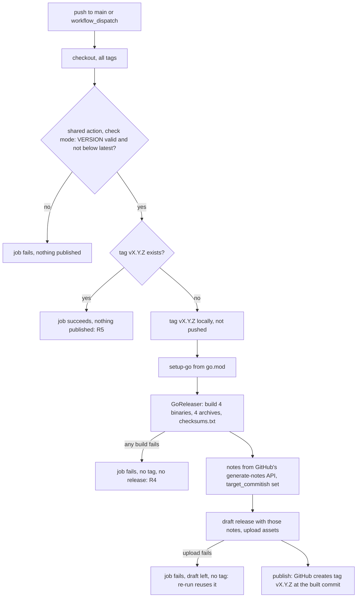

# Release binaries, checksums and version - Plan

## Goal Capsule

- **Objective:** anyone on macOS or Linux can install a released crew without a Go toolchain, and `crew --version` prints that release's version.
- **Means:** GoReleaser builds and publishes each release from crew's own Release workflow (KTD1, KTD2).
- **Product authority:** the boss, through the brainstorm of #36. STRATEGY.md's boundary holds: a release still happens only when the boss merges a pull request that bumps `VERSION`.
- **Stop conditions:** stop and report if GoReleaser cannot keep the tag off GitHub until every asset has uploaded (KTD2), or if any of the four targets fails to cross-compile from Linux.
- **Execution profile:** mostly packaging, workflow and docs; one small Go change with unit tests (U1). Verification is a local GoReleaser build plus the first real release.
- **Who finishes:** the implementer opens the pull request. The first release with binaries is the boss's own later `VERSION` bump, outside this work.
- **Open blockers:** none.

---

## Product Contract

Product Contract preservation: unchanged, except that the five "Deferred to Planning" questions are answered by KTD3–KTD7 and leave Outstanding Questions.

### Summary

Each release of crew ships four prebuilt binaries (macOS and Linux, amd64 and arm64) and a checksums file, with the version stamped into the binary. GoReleaser builds and publishes them in crew's Release workflow, and no tag or release appears unless every binary built. The install docs lead with downloading the binary, and `go install …@vX.Y.Z` stays as the second option, also reporting the right version.

### Problem Frame

Today crew installs only with `go install github.com/thatsnotmynameio/crew/cmd/crew@main`. That needs a Go 1.27 toolchain, and the resulting build prints `crew dev` for `crew --version`. The only release, `v0.1.0`, has no assets, and it predates crew's Go code, so no release can be installed at all. The Release workflow only creates the tag and the GitHub release; its header comment says build jobs should be added and `publish` made to need them.

The boss is crew's only user so far. The goal is for releases to be ready before anyone else installs crew, not to unblock someone waiting now.

### Key Decisions

- **This plan covers prebuilt binaries, checksums and the version, nothing else from #36.** Release notes, signing and more install channels can each ship on their own later. (session-settled: user-directed — chosen over binaries plus release notes, the whole release pipeline at once, or release notes only: each piece can ship alone, and signing and channels need the binaries first.) Governs R1–R3.
- **Prebuilt binaries are the deliverable, not just a versioned `go install`.** (session-settled: user-directed — chosen over only making `go install …@vX.Y.Z` report its module version, with no build jobs: the boss wants the CLI released as a binary.) Governs R1, R3.
- **GoReleaser builds and publishes the release in crew's Release workflow.** crew stops calling the shared release action's `publish` mode, which `.github/workflows/release.yml` uses today. (session-settled: user-directed — chosen over build jobs in crew plus a new attach-files input on the shared action in thatsnotmynameio/.github, and over GoReleaser only building while the shared action publishes: GoReleaser makes signing, SBOMs and a Homebrew tap cheap later.) This departs from the repository's rule to change shared behaviour in thatsnotmynameio/.github. The boss chose it with that cost shown. Governs R4, R5.
- **No binary, no release.** (session-settled: user-directed — chosen over publishing the release anyway and attaching missing assets on a re-run, or publishing with whichever binaries built: a release without its binaries is the failure this work removes.) Governs R4.
- **Install docs lead with the binary, then `go install`.** (session-settled: user-directed — chosen over `go install` first with binaries as the alternative, or binaries only.) Governs R9.
- **Four platforms: darwin and linux, amd64 and arm64.** crew does not run on Windows: `internal/proc` starts every tool in its own Unix process group. Governs R1.
- **`go install` builds report their module version too.** The docs keep `go install` as the second option, so it must stop printing `dev` (#36 names this). Governs R8.
- **Release notes stay as they are.** GitHub's generated notes keep being used, and GoReleaser's own changelog is not. Better notes are a separate piece of work. Governs R6.

### Requirements

**Release assets**

- R1. Every release publishes a prebuilt crew binary for each of darwin/amd64, darwin/arm64, linux/amd64 and linux/arm64. No Windows binary.
- R2. Every release publishes one checksums file that covers every binary asset of that release.
- R3. A release's binaries print that release's version: `crew --version` prints `crew vX.Y.Z`.

**Release behaviour**

- R4. A release is published only when every binary asset and the checksums file built. When any of them fails, neither the tag `vX.Y.Z` nor the GitHub release is created, the Release workflow fails, and a later run (a re-run or the next push to `main`) retries the whole release.
- R5. The Release workflow keeps today's rule: a push to `main` publishes the version in `VERSION` as tag `vX.Y.Z` and a GitHub release, unless that version already has its tag. In that case it publishes nothing and succeeds.
- R6. Release notes stay GitHub's generated notes from the merged pull requests, as `--generate-notes` produces them today.
- R7. The pull-request version check, the shared release action in `check` mode, stays unchanged.

**go install**

- R8. A crew built by `go install github.com/thatsnotmynameio/crew/cmd/crew@vX.Y.Z`, with no `-ldflags`, prints `crew vX.Y.Z`. A build that carries no version information still prints `crew dev`.

**Docs**

- R9. The Install section of `docs/guide/crew.mdx` and the README first give a copy-paste terminal command that downloads the binary for the user's platform, checks it against the checksums file, and puts it on the `PATH`. Then they give `go install …@vX.Y.Z` as the alternative for users with Go.
- R10. No page still says to install from `@main` or that a `go install` build prints `dev`: `README.md:14`, `docs/guide/crew.mdx:17`, `docs/guide/crew.mdx:20`, `docs/guide/crew.mdx:416` and `docs/develop/index.mdx:50-52` change with this work.

### Key Flows

- F1. Releasing a version
  - **Trigger:** a pull request that bumps `VERSION` merges to `main`.
  - **Steps:** the Release workflow finds the version's tag missing (R5), builds the four binaries with the version stamped in (R1, R3), and writes the checksums file (R2). With everything built, it creates the tag and the GitHub release with generated notes (R6) and attaches the binaries and the checksums file. If any build fails, nothing is published (R4).
  - **Covers R1–R6.**

### Acceptance Examples

- AE1. **Covers R1, R2, R3, R6.** Given `VERSION` reads `0.2.0` and merges to `main` with no `v0.2.0` tag, when the Release workflow runs, then release `v0.2.0` exists with GitHub's generated notes, assets for darwin/amd64, darwin/arm64, linux/amd64 and linux/arm64, and one checksums file. The linux/arm64 binary, downloaded and run, prints `crew v0.2.0` for `crew --version`.
- AE2. **Covers R4.** Given the darwin/arm64 build fails during the run for `0.2.0`, then the workflow fails, and no `v0.2.0` tag and no `v0.2.0` release exist. After the cause is fixed, re-running the workflow publishes `v0.2.0` as in AE1.
- AE3. **Covers R5.** Given a push to `main` leaves `VERSION` at `0.2.0` and `v0.2.0` already exists, when the Release workflow runs, then it publishes nothing and succeeds.
- AE4. **Covers R8.** Given `v0.2.0` is released, when a user runs `go install github.com/thatsnotmynameio/crew/cmd/crew@v0.2.0`, then `crew --version` prints `crew v0.2.0`.
- AE5. **Covers R9.** Given a Linux arm64 machine with no Go toolchain, when the user runs the Install section's command, then `crew` is on the `PATH`, its checksum was verified, and `crew --version` prints the latest release's version.

### Scope Boundaries

- Release notes beyond GitHub's generated ones: curated or grouped notes (#36, piece 2).
- Signatures, notarization, SBOMs and GitHub artifact attestations (#36, piece 3). macOS binaries ship unsigned. The terminal download in R9 runs them, but a binary downloaded through a browser is blocked by Gatekeeper.
- A Homebrew tap, an install script, and other channels (#36, piece 4).
- Windows builds.
- Changes to the shared release action in thatsnotmynameio/.github.
- Bumping `VERSION`. The first release with binaries is the boss's own release pull request, as every release is.
- A pull-request check that runs the release build. Without it, a broken GoReleaser configuration shows up only when a release runs. R4 then keeps it from publishing anything.
- Considered and not built: cleaning up a draft release left behind when `VERSION` moves on before a failed release is re-run. The next run for the new version does not see it, and the boss sees the draft on the releases page. Build it if stale drafts start to accumulate.
- Considered and not built: Dependabot updates for the GoReleaser binary version. Dependabot bumps the pinned `goreleaser-action`, not the `version` input it installs. Revisit if GoReleaser falls far behind.

### Dependencies / Assumptions

- The boss is crew's only user today. The work prepares releases for later adopters, and nobody external is waiting on it.
- crew is pure Go: `go.mod` has no cgo dependency and no file imports `"C"`, so one Linux runner can cross-compile all four binaries. U2's local build confirms it.
- The R9 command works only once a release with binaries exists. Until the first one, the documented command fails (KTD7).

### Sources / Research

- `.github/workflows/release.yml`: the single `publish` job, its header comment, and the call to `thatsnotmynameio/.github/actions/release` with `mode: publish`.
- `thatsnotmynameio/.github` `actions/release/action.yml` and `release.py` at `684e957`: `check` validates `MAJOR.MINOR.PATCH` and refuses a version below the latest tag, succeeding with "already released" when the tag exists. `publish` runs `release.py next`, then `gh release create "$TAG" --target "$GITHUB_SHA" --title "$TAG" --generate-notes`.
- `.github/workflows/ci.yml`: the same action in `check` mode for the pull-request `version` job.
- `cmd/crew/main.go`: `var version = "dev"`, set with `-ldflags "-X main.version=vX.Y.Z"`, with no `runtime/debug.ReadBuildInfo` fallback. `cmd/crew/main_test.go` checks only the `--version` exit code.
- `internal/proc/proc.go`: `Setpgid: true`, the reason crew does not run on Windows.
- GoReleaser docs, `www/content/customization/publish/scm/_index.md`: "all GitHub releases start as drafts while artifacts are uploaded"; `use_existing_draft` (v2.5+); `replace_existing_artifacts`; `target_commitish` "to delay the creation of the tag in the remote: create the tag locally, but not push it". GoReleaser v2.18.2 source, `internal/client/github.go`: `GenerateReleaseNotes` sends only `TagName` and `PreviousTagName` (no `target_commitish`), which rules out `github-native` with an unpushed tag (KTD6); release creation always starts as a draft and `PublishRelease` undrafts it (KTD2).
- Latest versions on 2026-10-03: GoReleaser `v2.18.2`; `goreleaser/goreleaser-action` `v7.2.3` at commit `f06c13b6b1a9625abc9e6e439d9c05a8f2190e94`.

<!-- ce-section: work-relationships -->
### How This Work Fits Together

This plan covers release binaries, checksums and the version. The rest of #36 is the current understanding of the remaining work, not a committed roadmap:

- Release notes that say what a release brings.
  - Can proceed independently of this plan.
- Signatures, SBOMs and artifact attestations.
  - Depends on this plan's binaries. GoReleaser was chosen partly so this comes cheap.
- A Homebrew tap and an install script.
  - Depends on this plan's binaries, and shares its checksums file.
  - Still to decide: whether these replace the R9 command as the recommended install.

---

## Planning Contract

### Key Technical Decisions

- KTD1. **One `publish` job: validate, skip if tagged, tag locally, GoReleaser.** The job checks out with every tag and runs the shared action in `check` mode, which keeps the refusal of an invalid or below-latest `VERSION` that `publish` mode gave. A shell step then reads `VERSION`, and when `refs/tags/vX.Y.Z` already exists it ends the job successfully with nothing published (R5). Otherwise it creates the tag locally, unpushed, sets up Go from `go.mod`, and runs GoReleaser's `release --clean`. Reusing `check` mode avoids copying `release.py`'s version rules into crew. Instantiates the GoReleaser Key Decision; governs R4, R5, R7.
- KTD2. **The tag reaches GitHub only when the release is published, after every asset uploaded.** GoReleaser builds every binary, archive and the checksums file before its release step, so a build failure publishes nothing. Its GitHub release starts as a draft while assets upload and is published last. `release.target_commitish: "{{ .Commit }}"` makes GitHub create the tag at the built commit at that moment, never earlier. `use_existing_draft: true` and `replace_existing_artifacts: true` let a re-run finish a draft left by a failed upload instead of failing on it, and `mode: replace` gives that draft the notes the re-run generated rather than the first attempt's. This is how R4 holds for upload failures as well as build failures; governs R4.
- KTD3. **Assets are one `tar.gz` per platform plus `checksums.txt`, with no version in the names.** Names are `crew_<os>_<arch>.tar.gz` (for example `crew_linux_arm64.tar.gz`), each holding `crew`, `LICENSE` and `README.md`. The checksums file is `checksums.txt`, SHA-256. Version-free names make `https://github.com/thatsnotmynameio/crew/releases/latest/download/<name>` a stable URL, so the R9 command needs no lookup of the latest version. Archives keep the executable bit and are the layout a later Homebrew tap consumes. Resolves the "asset format and names" question; governs R1, R2.
- KTD4. **The binary is stamped with the v-prefixed tag.** GoReleaser builds `./cmd/crew` for `darwin` and `linux` × `amd64` and `arm64`, with `CGO_ENABLED=0`, `-trimpath`, `-ldflags "-s -w -X main.version={{ .Tag }}"` and `mod_timestamp: "{{ .CommitTimestamp }}"`. `{{ .Tag }}` keeps the `v`, so the output is `crew v0.2.0`; `{{ .Version }}` would drop it. Governs R1, R3.
- KTD5. **`crew --version` falls back to Go's build info.** The printed version is the `-ldflags` value when one was stamped. Otherwise it is `runtime/debug.ReadBuildInfo`'s `Main.Version` when that is neither empty nor `(devel)`. Otherwise it is `dev`. `go install …@vX.Y.Z` records `vX.Y.Z` there (R8). Resolves "what a plain `go build` prints": since Go 1.24, a `go build` in a git checkout records a version derived from the checkout (a pseudo-version such as `v0.1.1-0.20261003…-abcdef123456+dirty`), and crew prints it as is because it names the commit. `go run` and test binaries record `(devel)` or nothing and print `dev`. Governs R8.
- KTD6. **The workflow asks GitHub for the notes and hands them to GoReleaser.** A workflow step calls GitHub's release-notes API (`repos/{owner}/{repo}/releases/generate-notes`, the generator `gh release create --generate-notes` uses) with `tag_name` set to the new tag and `target_commitish` set to `$GITHUB_SHA`, and writes the body to a file under `$RUNNER_TEMP`. GoReleaser runs with `--release-notes` pointing at that file, which skips its own changelog step. GoReleaser's `github-native` changelog cannot be used: v2.18.2's `GenerateReleaseNotes` sends no `target_commitish`, and GitHub requires one when the tag does not exist yet, which KTD2 guarantees. `release.name_template` stays `{{ .Tag }}`, the title the shared action set. Governs R6.
- KTD7. **The docs change ships in this pull request.** AGENTS.md requires that a change in behaviour updates the matching pages in the same pull request. The R9 command and `go install …@vX.Y.Z` fail until the boss's next `VERSION` bump publishes the first release with binaries. The pull request body says so, and the boss is the only user in that window. Resolves the "when the docs change merges" question; governs R9, R10.
- KTD8. **The install command is one POSIX `sh` block.** It maps `uname -s` to `linux` or `darwin` and `uname -m` to `amd64` (`x86_64`) or `arm64` (`aarch64`, `arm64`), downloads the archive and `checksums.txt` from `releases/latest/download/` into a temporary directory, checks the archive's line of `checksums.txt` with `sha256sum` or, where that is missing (macOS before it shipped one), `shasum -a 256`, then extracts `crew`, creates `/usr/local/bin` if it is missing (`sudo install -d`; a Mac without Homebrew may not have it) and installs `crew` there with `sudo`. `/usr/local/bin` is on the default `PATH` of both systems. `curl` sets no quarantine attribute, so Gatekeeper lets the unsigned macOS binary run. Governs R9.
- KTD9. **Pins follow the repository's rule.** `goreleaser/goreleaser-action` is pinned by commit SHA with its version as a comment, and its `version` input pins GoReleaser to `v2.18.2` exactly, never `~> v2` or `latest`. `dist/`, GoReleaser's output directory, goes into `.gitignore`.

### High-Level Technical Design

The Release workflow on a push to `main`, and where each requirement is enforced:

### Assumptions

- GoReleaser's GitHub publisher keeps the release a draft until every asset has uploaded, and with `use_existing_draft` a re-run reuses that draft. GoReleaser v2.18.2's `internal/client/github.go` shows both (`CreateRelease` always starts a draft, `PublishRelease` undrafts it, `findRelease` looks up drafts by name); the first real release confirms it end to end.
- The release-notes API, called with the new tag, the previous tag it infers and `target_commitish`, gives the same notes `gh release create --generate-notes` gave.
- The first published GoReleaser release becomes the repository's "latest" release, so `releases/latest/download/` resolves to it. GoReleaser's `make_latest` defaults to true.

### Sequencing

U1 and U2 are independent. U3 needs U2's configuration. U4 documents what U1–U3 produce and goes last.

---

## Implementation Units

### U1. Version from Go's build info

- **Goal:** `crew --version` prints the module version for `go install …@vX.Y.Z` builds and `dev` when no version is known.
- **Requirements:** R8, R3; KTD5.
- **Dependencies:** none.
- **Files:**
  - Modify: `cmd/crew/main.go`
  - Test: `cmd/crew/main_test.go`
- **Approach:**
  1. Make "no `-ldflags` value" distinguishable from a stamped one, for example by leaving `version` empty by default, and update its doc comment to say what is printed in each case.
  2. Add one small pure function that takes the stamped value and the build info (and whether it was available) and returns the version to print, per KTD5. `run` passes it `debug.ReadBuildInfo()`'s results.
- **Patterns to follow:** the table tests in `cmd/crew/main_test.go`; doc comments on every declaration, as in `main.go`.
- **Test scenarios:**
  - A stamped value `v0.2.0` with build info reporting `v0.1.0` gives `v0.2.0`.
  - No stamped value, build info `Main.Version` `v0.2.0` gives `v0.2.0`. Covers AE4.
  - No stamped value, build info `(devel)` gives `dev`.
  - No stamped value, build info with an empty `Main.Version` gives `dev`.
  - No stamped value and no build info available gives `dev`.
  - No stamped value, a pseudo-version such as `v0.1.1-0.20261003000000-abcdef123456+dirty` is printed unchanged.
  - `run([]string{"--version"})` still returns `app.ExitClean` (existing test).
- **Verification:** the new tests pass. A `go build ./cmd/crew` in the checkout prints a checkout-derived version, and `go build -buildvcs=false ./cmd/crew` prints `crew dev`.

### U2. GoReleaser configuration

- **Goal:** one GoReleaser configuration builds the four binaries with the version stamped in, packs them, writes the checksums and publishes them as KTD2–KTD6 describe.
- **Requirements:** R1, R2, R3, R4, R6; KTD2, KTD3, KTD4, KTD6, KTD9.
- **Dependencies:** none.
- **Files:**
  - Create: `.goreleaser.yaml`
  - Modify: `.gitignore`
- **Approach:**
  1. `version: 2` configuration with a header comment, in the style of the workflows' headers, saying what a release builds and that the Release workflow runs it.
  2. One build per KTD4, archives and checksums per KTD3, release settings per KTD2 (`target_commitish`, `use_existing_draft`, `replace_existing_artifacts`, `mode: replace`, `name_template: "{{ .Tag }}"`). No `changelog.use: github-native` (KTD6).
  3. No `before` hooks: a hook that rewrites files would leave the tree dirty, which GoReleaser refuses.
  4. Add `dist/` to `.gitignore` with a one-line comment, as the other entries have.
- **Execution note:** this is packaging; prove it with GoReleaser's own check and a local build, not unit tests.
- **Test expectation:** none -- configuration only; U2's verification and AE1 cover it.
- **Verification:**
  - GoReleaser's `check` command, run at the pinned `v2.18.2`, reports the configuration valid.
  - A snapshot build produces exactly `crew_darwin_amd64.tar.gz`, `crew_darwin_arm64.tar.gz`, `crew_linux_amd64.tar.gz`, `crew_linux_arm64.tar.gz` and `checksums.txt`, with no Windows asset, and `checksums.txt` has one line per archive that `sha256sum -c` accepts.
  - In a throwaway clone with a local tag such as `v9.9.9`, a GoReleaser release with publishing skipped and `--release-notes` pointing at a placeholder file (so no step calls GitHub) builds a `linux/amd64` binary that prints `crew v9.9.9`, and `file` reports the darwin binaries as Mach-O for the right architectures. Covers AE1 short of publishing.

### U3. Release workflow on GoReleaser

- **Goal:** the Release workflow publishes through GoReleaser as KTD1 describes, keeping R5's skip and R4's no-binary-no-release.
- **Requirements:** R4, R5, R7; KTD1, KTD2, KTD9.
- **Dependencies:** U2.
- **Files:**
  - Modify: `.github/workflows/release.yml`
- **Approach:**
  1. Rewrite the header comment: what triggers a release, that GoReleaser builds and publishes it, that nothing is published unless every asset built, and that a version that already has its tag publishes nothing.
  2. Keep the triggers, `permissions: contents: read` at the top, the `release` concurrency group and `contents: write` on the job.
  3. Steps per KTD1: checkout (`fetch-depth: 0`, `persist-credentials: false`); the shared action at its current pin in `check` mode; a step that sets a step output for the tag and whether it is new; then, only when it is new, the local tag, `actions/setup-go` with `go-version-file: go.mod` at the SHA `ci.yml` uses, the notes step per KTD6 (with `GH_TOKEN` from the job token), and `goreleaser/goreleaser-action` per KTD9 with `release --clean --release-notes <the notes file>` and `GITHUB_TOKEN` in its environment.
  4. Pass `VERSION`'s contents and the tag through `env` and step outputs, never interpolated into `run` scripts, as `ci.yml` does with `BASE_REF`.
  5. Raise `timeout-minutes` from 5 to fit four cross-builds; 15 matches the `go` job.
  6. Leave `ci.yml`'s `version` job untouched (R7).
- **Patterns to follow:** `.github/workflows/ci.yml` for pinned actions with version comments, `env`-passed values and comment style.
- **Test scenarios:**
  - Covers AE3. With `VERSION` at `0.1.0` and `v0.1.0` present, the tag step reports the version as released and every later step is skipped.
  - With `VERSION` at a version that has no tag, the tag step reports it as new and the notes and GoReleaser steps run.
- **Verification:**
  - actionlint, as the shared `actionlint` workflow runs it, reports nothing on `release.yml`.
  - The tag step's script, run locally against this repository's tags with `VERSION` at `0.1.0` and then at an untagged version, gives the two outcomes above.
  - Codacy's local analysis reports no new finding on the workflow or `.goreleaser.yaml`.
  - The real proof is the boss's next release (AE1, AE2); this pull request does not release.

### U4. Install docs and release docs

- **Goal:** the README and the docs lead with the binary download and describe the new release process, with no page left saying `@main` or `dev`.
- **Requirements:** R9, R10; KTD3, KTD7, KTD8.
- **Dependencies:** U1, U2, U3.
- **Files:**
  - Modify: `README.md`
  - Modify: `docs/guide/crew.mdx`
  - Modify: `docs/develop/index.mdx`
  - Modify: `AGENTS.md`
- **Approach:**
  1. `docs/guide/crew.mdx` Install: the KTD8 command first, saying it installs the latest release for macOS or Linux on amd64 or arm64 into `/usr/local/bin`; then `go install github.com/thatsnotmynameio/crew/cmd/crew@vX.Y.Z` for users with Go 1.27, with `vX.Y.Z` explained as a release's tag. Remove the `@main` sentence (line 20).
  2. `docs/guide/crew.mdx` line 416: say `crew --version` prints the release's version, the module version for a `go install` build, and `dev` only when the build carries none.
  3. `README.md` Quick start: the same order as the guide. The README may carry the same command or point to the guide's Install section; keep its "On macOS or Linux, with `gh` and `claude`…" prerequisites true now that Go is optional. Update the `.github/workflows/release.yml` row of "What's inside" and add a `.goreleaser.yaml` row.
  4. `docs/develop/index.mdx` Releases: the Release workflow builds and publishes with GoReleaser from `.goreleaser.yaml`; the four platforms and asset names; nothing is published unless every asset built, and a re-run finishes a failed one; how to try the configuration locally with a snapshot build; replace the `@main` paragraph with the `go install …@vX.Y.Z` line.
  5. `AGENTS.md` Releases bullet: add that the Release workflow publishes binaries and checksums through GoReleaser, and that crew's release no longer calls the shared action's `publish` mode, a deliberate exception to the shared-workflows rule.
- **Patterns to follow:** the docs' plain, short sentences; MDX rule in AGENTS.md (`{` and `<` outside code go in backticks).
- **Test expectation:** none -- documentation; the checks below cover it.
- **Verification:**
  - `pnpm docs:check` passes.
  - A search for `@main` and for `` `dev` for a `go install` `` finds no install instruction in `README.md`, `docs/guide/` or `docs/develop/`.
  - The KTD8 command passes `shellcheck` as POSIX `sh`. Run against U2's snapshot `dist/` (by pointing its download base at the local files), it verifies the checksum, refuses a corrupted archive, and installs a `crew` that runs, into a temporary directory standing in for `/usr/local/bin`. Covers AE5 short of a real release.

---

## Verification Contract

| Gate | Command or check | Applies to |
| --- | --- | --- |
| Tests | `go test -race ./...` | U1 |
| Format, vet, lint | `gofmt -l cmd internal tools` prints nothing; `go vet ./...`; `go run github.com/golangci/golangci-lint/v2/cmd/golangci-lint@v2.14.0 run` | U1 |
| Coverage | the coverage profile, `go run github.com/vladopajic/go-test-coverage/v2@v2.19.0 --config=.testcoverage.yml`, and `git diff -U0 origin/main...HEAD \| go run ./tools/diffcover -profile coverage.out` (changed lines ≥ 90%) | U1 |
| Vulnerabilities | `go run golang.org/x/vuln/cmd/govulncheck@v1.8.0 ./...` | U1 |
| GoReleaser | `go run github.com/goreleaser/goreleaser/v2@v2.18.2 check`, a snapshot build, and a publish-skipped release with a placeholder `--release-notes` file in a throwaway clone, as U2's verification lists | U2 |
| Workflows | actionlint on `.github/workflows/release.yml` | U3 |
| Codacy | `pnpm exec codacy-analysis analyze --install-dependencies` reports no new finding | U2, U3 |
| Docs | `pnpm docs:check`; `shellcheck` and the local dry run of the install command | U4 |

The first release with binaries (the boss's next `VERSION` bump) is the end-to-end proof of AE1–AE5; it is outside this pull request.

## Definition of Done

- Every Verification Contract gate passes.
- U1: `crew --version` follows KTD5, with the U1 test scenarios in `cmd/crew/main_test.go`.
- U2: `.goreleaser.yaml` produces exactly the four archives and `checksums.txt`, and a tagged local build prints the tag.
- U3: `release.yml` validates, skips a tagged version, and otherwise runs GoReleaser on a local tag; `ci.yml` is unchanged.
- U4: README, guide, develop page and AGENTS.md match the new behaviour, with no `@main` install instruction left.
- The pull request body says the install command works only after the next `VERSION` bump (KTD7), and contains `Closes #36`.
- No `dist/`, throwaway clone, local test tag or experimental code is left in the repository or the diff.
