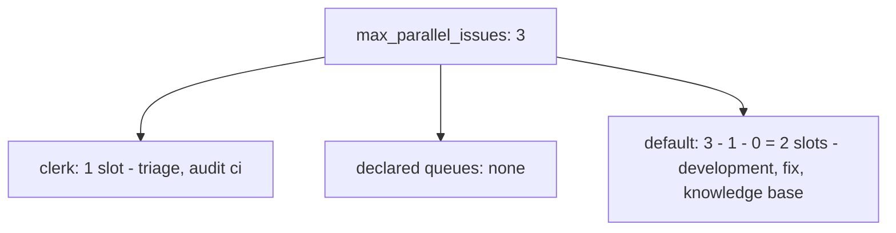
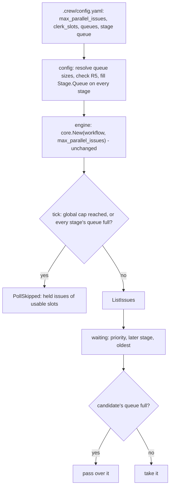

# Queues under the global session limit - Plan

## Goal Capsule

- **Objective:** crew's bookkeeping work, such as finding an issue's blockers, has slots that development work can never take, so it no longer waits for a long session to end.
- **Means:** split `max_parallel_issues` into fixed-size queues, with `clerk` and `default` built into crew, carried on each stage so the core enforces them without a new port or an engine change (KTD1, KTD2).
- **Product authority:** the boss, in the brainstorm of issue #40. The Product Contract below is carried from the body of #40; the Planning Contract decides how and never changes an R.
- **Stop conditions:** stop and report if enforcing queues turns out to need an engine change or a new port, or if a config that names no queue and sets `max_parallel_issues` of 2 or more stops loading.
- **Execution profile:** one pull request: the domain's stage type, config, core, docs, `.crew/config.yaml`, and their tests.
- **Who finishes:** `ce-work` implements and verifies locally. The calling pipeline opens the pull request, and the boss merges it.

---

## Product Contract

Product Contract preservation: changed: R9, AE9 — the queued status comment that R9 renamed no longer exists: #65 removed it (session-settled there, user-directed: crew writes only on issues it takes). R9 now governs the one place crew still reports a slot count, the skip line #65 added, keeping R9's intent: the count speaks of the queues, not of the global limit. Also restructured, no scope change: the Problem Frame and Sources no longer say crew ignores blocked issues, since it now skips them, and the scope boundary "Skipping issues blocked by other issues" is dropped for the same reason.

### Summary

crew splits `max_parallel_issues` into fixed-size queues. Two are built in: `clerk`, for bookkeeping, and `default`, which takes the slots left over. The repository can declare more. Each stage runs in one queue, and a queue never uses another queue's slots.

### Problem Frame

Today one limit, `config.max_parallel_issues`, covers every stage. Each poll fills free slots by priority, then later stages first, then the oldest issue first. But a slot frees only when its issue's actions end, and an `lfg` session holds its slot for hours. A triage that finds an issue's blockers waits for that slot. crew skips an issue GitHub lists as blocked, but only once the triage has recorded the dependency, so when the triage comes late, a development session may already have started on an issue that had a blocker.

### Key Decisions

- **Queues partition the global limit, and an idle slot is never lent.** A slot is guaranteed only when nothing else can take it; the cost is an idle slot while another queue waits. Governs R1, R6, R7. (session-settled: user-directed — chosen over per-queue maximums that compete for the global limit, and over reserved minimums with a separate maximum: the config alone guarantees a slot)
- **`clerk` and `default` are built into crew, not declared by the repository.** Every repository gets a bookkeeping queue without inventing one. Governs R2, R3, R4. (session-settled: user-directed — chosen over a clerk declared like any other queue, and over a clerk outside the global limit: the total stays within `max_parallel_issues`)
- **A stage without a queue runs in `default`, which may have 0 slots.** Governs R4, R8. (session-settled: user-directed — chosen over a config error for every stage without a queue: configs that name no queue stay valid)
- **`clerk` has 1 slot when the config omits it.** Every repository has a clerk; a config that sets only `max_parallel_issues` gives one slot less to its stages until the boss raises the limit. Governs R2, R5. (session-settled: user-directed — chosen over a required clerk size, which would break every existing config, and over a clerk of 0 by default)
  - **Conflict call-out:** with R5's rule that `clerk` must be below `max_parallel_issues`, a config with `max_parallel_issues: 1` and no clerk size no longer loads. No config in this repository or its docs sets 1. KTD5 reports it on the `max_parallel_issues` line with the fix.
- **Queues count issues, as `max_parallel_issues` does.** An issue's actions start and end together, so they share one slot. Governs R6.
- **The order inside a queue stays as today.** Later stages first keeps reviews from starving behind new work. Governs R7.
- **Slot counts speak of the queues.** A busy crew tells the boss how many of the slots its stages can use are held, not the global limit. Governs R9.
- **The change stays small.** The boss asked for high quality without heavy engineering; see Success Criteria.

### Requirements

**Configuration**

- R1. The config sets the global limit (`max_parallel_issues`, as today), the size of `clerk`, and any number of named queues with a size each.
- R2. `clerk` has 1 slot when the config omits its size.
- R3. `default` has `max_parallel_issues − clerk − the sum of the declared queue sizes` slots.
- R4. A stage may name its queue (`clerk`, `default` or a declared queue); a stage that names none runs in `default`.
- R5. crew does not start, and reports a config error with its line and exit code 2, when:
  - `clerk` is below 1, or not below `max_parallel_issues`;
  - `default` would have fewer than 0 slots;
  - a declared queue has a size below 1;
  - a declared queue is named `clerk` or `default`;
  - a stage names a queue that does not exist.

With this repository's config after R11, the split is:

**Taking issues**

- R6. crew takes an issue for a stage only while the stage's queue holds fewer issues than its size; an issue holds one slot whatever its number of actions.
- R7. Each poll keeps today's order (priority, then later stages first, then the oldest issue), and a full queue does not stop crew from taking issues for stages in other queues.
- R8. When `default` has 0 slots, the issues of its stages are never taken.

**Status, docs and this repository**

- R9. A tick skips its listing only when no stage's queue has a free slot, and its skip line counts the held issues against the slots of the queues the workflow's stages run in, instead of `max_parallel_issues`.
- R10. `docs/guide/crew.mdx` and `docs/develop/architecture.mdx` describe the queues, `clerk`, `default`, the config errors of R5, and that only queue sizes guarantee a slot.
- R11. This repository's `.crew/config.yaml` sets `max_parallel_issues` to 3 and puts `triage` and `audit ci` in `clerk`, which leaves 2 slots in `default` for `development`, `fix` and `knowledge base`.

### Key Flows

- F1. A poll takes issues
  - **Trigger:** a tick finds at least one stage whose queue has a free slot, and lists the open issues that carry a stage's label.
  - **Steps:** crew walks the waiting issues in R7's order. It takes an issue while its stage's queue has a free slot, and passes over it otherwise. It writes nothing on an issue it does not take.
  - **Covers:** R6, R7, R8, R9

### Acceptance Examples

- AE1. **Covers R6, R7.** Given `max_parallel_issues` 3, `clerk` 1 and `triage` in `clerk`, when two development issues are running and a triage issue appears, crew takes the triage issue at the next poll.
- AE2. **Covers R6, R7.** Given `max_parallel_issues` 3 and `clerk` 1, when two development issues are running and a third is labeled, the third waits although the `clerk` slot is free.
- AE3. **Covers R2, R3.** Given a config that sets only `max_parallel_issues: 2`, `clerk` has 1 slot and `default` has 1.
- AE4. **Covers R3, R8.** Given `max_parallel_issues` 3, `clerk` 1 and a declared queue of size 2, `default` has 0 slots, and an issue for a stage without a queue stays waiting.
- AE5. **Covers R5.** Given `max_parallel_issues` 3, `clerk` 2 and a declared queue of size 2, crew does not start: a config error with the line, exit code 2.
- AE6. **Covers R5.** Given `clerk` 3 and `max_parallel_issues` 3, crew does not start: a config error, exit code 2.
- AE7. **Covers R5.** Given a stage with the queue `review` and no queue `review` declared, crew does not start: a config error, exit code 2.
- AE8. **Covers R6.** Given an issue whose stage has two actions, it holds one slot of its queue.
- AE9. **Covers R9.** Given `max_parallel_issues` 3, `clerk` 1 with `triage` in it, and `default` 2 holding two development issues, a tick lists while the `clerk` slot is free; once a triage issue also runs, the tick skips with `poll: skipped, 3 of 3 slots busy`. Given a config that sets only `max_parallel_issues: 2` and names no queue, one running issue makes the tick skip with `poll: skipped, 1 of 1 slots busy`.

### Scope Boundaries

- Lending an idle slot to another queue.
- Changing queue sizes while crew runs: crew reads the config at start, as today.
- Showing queues or free slots in the live view or the line renderer beyond the counts of R9.
- A warning at load when `default` has 0 slots, or when a declared queue or `clerk` has no stage. Such slots stay idle; the docs say so (R10). Evidence that bosses misconfigure this would justify a warning later.

### Dependencies / Assumptions

- `max_parallel_issues` keeps its key and its meaning as the total.
- A held issue keeps its slot until its actions end and its verdict calls settle, as today, so a long session holds its queue's slot for its whole run.

### Sources / Research

- The take loop is `takeWaiting` in `internal/core/update.go`: it stops at the first candidate once `m.full()` holds. `waiting` sorts by priority, then later stages, then age (#41).
- `full()` (`len(m.issues) >= m.maxParallel`) also gates the tick's listing and feeds `PollSkipped{Busy, Slots}` (#65, `internal/core/update.go`, `internal/core/event.go`), which `internal/ui/lines/lines.go` renders as `poll: skipped, B of S slots busy`.
- The queued status is gone: `internal/adapter/github/status.go` keeps only `legacyQueuedKind` to replace a queued entry an earlier crew wrote. Nothing in the core sends a queued status.
- `max_parallel_issues` defaults to 2 and counts issues (`internal/config/config.go`). A non-positive value is a config error with its line (`engineSettings`, `positive`), and a config error exits 2 (`internal/app/app.go`).
- Decoding is strict (`internal/config/decode.go`): a `queue` key on a stage (`stageDoc` in `internal/config/validate.go`) or a queue key under `config` (`settings` in `config.go`) is an unknown key today.
- The engine builds the core with `core.New(e.cfg.Workflow, e.cfg.MaxParallelIssues, …)` (`internal/engine/engine.go`), so whatever the stages carry reaches the core unchanged.
- Docs that describe the limit and the order: `docs/guide/crew.mdx` (the config table, the stage key table, the poll section, the limitations list) and `docs/develop/architecture.mdx` (the tick and take paragraphs).

### Success Criteria

- The core's table tests cover the split of slots across queues, including a full queue next to a free one and `default` with 0 slots.
- The config tests have one case per error in R5.
- The docs of R10 match the behaviour.
- The change touches only the domain's stage type, the config, the core, the docs, `CONCEPTS.md` and `.crew/config.yaml`: no new port, no engine change, no abstraction for queue policies.

---

## Planning Contract

### Key Technical Decisions

- KTD1. **Config keys: `config.clerk_slots`, `config.queues`, and a stage's `queue`.** `clerk_slots` is an integer, 1 when omitted (R2). `queues` is a mapping from a queue name to its slots, such as `queues: {review: 2}`, in file order. A stage's optional `queue` names `clerk`, `default` or a key of `queues` (R4). A mapping reads as the boss thinks of it ("review has 2 slots") and gets duplicate-key errors for free from the decode pattern `prompts` already uses; a list of `{name, slots}` items would add a shape and a name check for no gain. `clerk` lives outside `queues` because R5 forbids declaring it there.
- KTD2. **The queue travels on the stage.** `crew.Stage` gains a `Queue` value holding the queue's name and slots. Config fills it on every stage, `default` with its computed slots included. The core reads queues from the stages it already receives, so the engine and `core.New`'s signature stay as they are. `max_parallel_issues` stays the core's global cap: the core never holds more issues than that, whatever the stages say. A stage with the zero `Queue`, which config never produces, is limited only by the global cap, so every stage without one shares it as today; this keeps the existing core tests and any caller that sets no queue on today's behaviour.
- KTD3. **Taking passes over a full queue instead of stopping.** `takeWaiting` keeps R7's order and, for each candidate, skips it when its stage's queue is full, and stops only when the global cap is reached. An issue's slot belongs to the queue of the stage that took it, counted over every held issue in any claim, as `full()` counts today.
- KTD4. **"Every slot busy" means no stage's queue has a free slot.** The tick skips its listing when the global cap is reached or every queue some stage runs in is full; a queue no stage runs in, such as `clerk` in a config that names no queue, never keeps the tick listing. `PollSkipped.Slots` becomes the slots the stages can use: the sum of the distinct queues the stages run in, capped at `max_parallel_issues`. `Busy` stays the held issues. The line renderer's text is unchanged (R9, AE9).
- KTD5. **Each R5 error names the key that causes it.**
  - `clerk_slots` below 1 or not below the limit: on `config.clerk_slots`; when `clerk_slots` is omitted, on `config.max_parallel_issues`, saying the limit must leave room for the 1-slot `clerk`.
  - `default` below 0: on `config.queues`, giving the sum that leaves it negative.
  - A queue size below 1, or a queue named `clerk` or `default` (ignoring case, as labels are compared): on that queue's key.
  - A stage naming a missing queue: on the stage's `queue`, naming the queues that exist. A `queue` present but empty: "must not be empty", as `description` does.
  - When `max_parallel_issues` is itself invalid, the clerk and `default` sums are not checked, so one mistake gives one error.

### Implementation Constraints

- Function length and complexity stay within `funlen` 50, `cyclop` 15 and revive's argument and file limits, which Codacy's Lizard mirrors (`docs/solutions/tooling-decisions/codacy-lizard-and-golangci-lint-limits.md`). Queue parsing goes in its own functions, likely its own file, rather than growing `parse` or `engineSettings`.
- Layering is unchanged: `crew` imports nothing of crew's, `core` only `crew`.

### High-Level Technical Design

How a loaded config reaches the take decision:

---

## Implementation Units

### U1. Queues in the config

- **Goal:** load `clerk_slots`, `queues` and each stage's `queue`, reject R5's errors, and give every stage its queue.
- **Requirements:** R1, R2, R3, R4, R5; AE3, AE5, AE6, AE7; KTD1, KTD2, KTD5.
- **Dependencies:** none.
- **Files:**
  - `internal/crew/` (the file that defines `Stage`): the queue value on `Stage`.
  - `internal/config/config.go`: the new `settings` keys, the call that resolves queues.
  - `internal/config/validate.go`: `queue` on `stageDoc`, and the stage's queue checked and filled.
  - `internal/config/queue.go` (new, if it keeps functions within the limits): resolving and checking queue sizes.
  - `internal/config/config_test.go`, `internal/config/config_workflow_test.go`, `internal/config/config_reject_test.go`, `internal/config/config_reject_workflow_test.go`: tests.
- **Approach:**
  1. Resolve the queue table from `config:` after the engine settings: `clerk`, the declared queues in file order, and `default` with R3's slots.
  2. Check each stage's `queue` against that table while the workflow is parsed, where the stage's key lines are still known, and set `Stage.Queue` on every stage.
  3. Keep reporting every error together, as `parse` does today.
- **Patterns to follow:** `prompts` in `validate.go` for walking a mapping with duplicate-key errors; `located` and `keyError` for lines; `described` for an optional key present but empty.
- **Test scenarios:**
  - Covers AE3. A config with only `max_parallel_issues: 2`: every stage's queue is `default` with 1 slot, and `clerk` has 1.
  - A config with no `config:` section: the default limit 2 gives `default` 1 slot.
  - `max_parallel_issues: 4`, `clerk_slots: 1`, `queues: {review: 2}`, one stage in `review`, one in `clerk`, one naming none: their queues are `review` 2, `clerk` 1 and `default` 1.
  - A stage with `queue: default` explicitly runs in `default`.
  - `max_parallel_issues: 3`, `clerk_slots: 1`, `queues: {review: 2}`: `default` has 0 slots and the config loads (AE4's config).
  - Covers AE5. `max_parallel_issues: 3`, `clerk_slots: 2`, `queues: {review: 2}`: error on `config.queues` with its line.
  - Covers AE6. `max_parallel_issues: 3`, `clerk_slots: 3`: error on `config.clerk_slots` with its line.
  - `clerk_slots: 0`: error on `config.clerk_slots`.
  - `max_parallel_issues: 1` and no `clerk_slots`: error on `config.max_parallel_issues` that names the 1-slot `clerk`.
  - `queues: {review: 0}`: error on `config.queues.review`.
  - `queues: {clerk: 1}` and `queues: {Default: 1}`: each an error on that queue's key.
  - `queues` given twice with the same name: duplicate-key error with both lines.
  - `queues: [review]`: "must be a mapping".
  - `queues: {review: two}`: a type error naming `config.queues.review`.
  - Covers AE7. A stage with `queue: review` and no queue `review`: error on `workflow[i].queue` with its line, naming the queues that exist.
  - A stage with `queue: ""`: "must not be empty".
  - `max_parallel_issues: 0` with `clerk_slots: 1`: only the `max_parallel_issues` error.
- **Verification:** every R5 case has its own test, and an existing config without queue keys and a limit of 2 or more loads. The existing config tests pass; the only ones that change are the expected stages of `TestLoadDraftConfig` and `acceptedWorkflows`, which compare whole stages and now gain each stage's queue (`default` with 1 slot at the default limit of 2). Leaving a stage's queue unset to keep them unchanged would break R3.

### U2. Taking issues by queue in the core

- **Goal:** hold each queue to its size, keep the take order, and skip a tick's listing only when no stage's queue has room.
- **Requirements:** R6, R7, R8, R9; AE1, AE2, AE4, AE8, AE9; KTD2, KTD3, KTD4.
- **Dependencies:** U1 (the queue value on `Stage`).
- **Files:**
  - `internal/core/model.go`: queue bookkeeping derived from the stages in `New`.
  - `internal/core/update.go`: `takeWaiting`, `full`, the `PollSkipped` slots.
  - `internal/core/event.go`: `PollSkipped` field docs.
  - `internal/core/queue_test.go` (new): table tests.
- **Approach:**
  1. In `New`, derive each stage's queue, giving a stage with the zero `Queue` the global cap (KTD2), and the usable slots of KTD4.
  2. Count a queue's held issues from `m.issues` by each held issue's stage, so no counter can drift from the issues held.
  3. Change `takeWaiting` and `full` per KTD3 and KTD4, and fill `PollSkipped.Slots` with the usable slots.
- **Execution note:** write the queue table tests first; they are the Success Criteria's proof.
- **Patterns to follow:** the table tests and `driver` helpers in `internal/core/driver_test.go` and `update_test.go`; `skip_test.go` for `PollSkipped` assertions.
- **Test scenarios:**
  - Covers AE1. Limit 3, `clerk` 1 with `triage`, `default` 2 holding two development issues; a listing returns a triage issue: it is taken.
  - Covers AE2. Same queues, two development issues held, a listing returns a third development issue: it is not taken, though `clerk` is free.
  - A listing returns a development issue and a triage issue while `default` is full, with the development issue first in order: the triage issue is still taken (a full queue does not stop the walk).
  - Covers AE4. `default` 0 slots: a listing returns an issue for a stage in `default`; nothing is taken, and an issue for a stage in another free queue is taken.
  - Covers AE8. A stage with two actions in a 1-slot queue: one issue taken fills the queue; a second issue for that stage waits.
  - Order inside a queue: two waiting issues for one 1-slot queue, the higher-priority one is taken; with equal priority, the later stage's, then the older one.
  - A held issue whose verdict move is owed still holds its queue's slot.
  - Global cap: stages with the zero `Queue` and limit 2 behave as today (existing tests stay green).
  - Covers AE9. Limit 3, `clerk` 1 with `triage`, `default` 2: with two development issues held, a tick lists; with a triage issue also held, a tick emits `PollSkipped{Busy: 3, Slots: 3}`.
  - Covers AE9. Limit 2, every stage in `default` 1, `clerk` without stages: one held issue makes the tick emit `PollSkipped{Busy: 1, Slots: 1}`.
  - A freed slot after a skipped tick lists at once, as today, when the freed issue's queue regains room.
- **Verification:** the new table tests pass, every existing core test passes unchanged, and the engine and `app` tests pass without edits to `internal/engine`.

### U3. Docs and this repository's config

- **Goal:** document the queues and run this repository with them.
- **Requirements:** R10, R11.
- **Dependencies:** U1, U2.
- **Files:**
  - `docs/guide/crew.mdx`: the config table rows for `clerk_slots` and `queues`, a `queue` row in the stage key table, a short section on queues (what `clerk` and `default` are, the split with an example, the R5 errors, that only queue sizes guarantee a slot, idle slots are never lent, a queue no stage uses stays idle), the poll section's skip and take steps, and the `max_parallel_issues` row.
  - `docs/develop/architecture.mdx`: the tick paragraph (skip when no stage's queue has room, `PollSkipped`'s usable slots) and the take paragraph (per-queue check, global cap), and where config fills `Stage.Queue`.
  - `.crew/config.yaml`: `max_parallel_issues: 3`, `queue: clerk` on `triage` and `audit ci` (R11), and a header comment line on the queues.
- **Approach:** keep MDX rules (`{` and `<` in backticks); cite the config keys of KTD1 exactly.
- **Test expectation:** none -- docs and config. `internal/app` or config template tests that load `.crew/config.yaml`, if any, must still pass, and `pnpm docs:check` must pass.
- **Verification:** the docs match U1's keys and errors and U2's behaviour, and this repository's config loads with `clerk` 1 and `default` 2.

---

## Verification Contract

| Gate | Command | Applies to |
| --- | --- | --- |
| Tests | `go test -race ./...` | U1, U2 |
| Format | `gofmt -l cmd internal tools` prints nothing | U1, U2 |
| Vet | `go vet ./...` | U1, U2 |
| Lint and layering | `go run github.com/golangci/golangci-lint/v2/cmd/golangci-lint@v2.14.0 run` | U1, U2 |
| Coverage | the coverage profile, then `go-test-coverage` (total >= 90%) and `tools/diffcover` on the branch diff (changed lines >= 90%), as AGENTS.md lists | U1, U2 |
| Docs | `pnpm docs:check` | U3 |
| Config smoke | `go build ./cmd/crew`, then load this repository's config (any command path that loads it without polling, or a config test reading `.crew/config.yaml`) | U3 |

---

## Definition of Done

- Every R5 error has a config test, and the core's queue table tests cover AE1, AE2, AE4, AE8 and AE9.
- `internal/engine` and `internal/port` have no diff.
- Existing configs that name no queue and set a limit of 2 or more load and behave as before, with one slot fewer for their stages (R2).
- The docs of R10 and the `Queue` entry in `CONCEPTS.md` describe the shipped keys and behaviour; `.crew/config.yaml` follows R11.
- All gates in the Verification Contract pass.
- No dead code or abandoned attempt is left in the diff.
