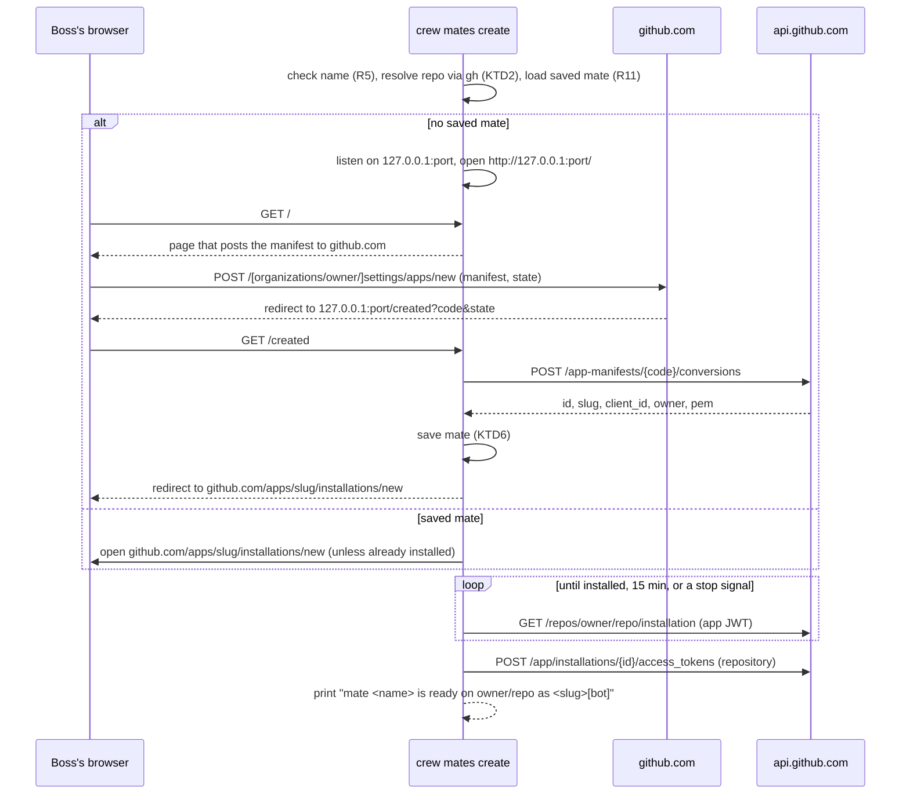

# crew mates - Plan

## Goal Capsule

- **Objective:** the boss can give crew GitHub identities of its own, called mates, each ready to act on the boss's repository, while crew keeps behaving exactly as it does today.
- **Means:** a new subcommand, `crew mates create <name>`, which creates a private GitHub App through GitHub's manifest flow and installs it on the current repository (KTD3, KTD4).
- **Product authority:** the boss, through the brainstorm of #60. Making crew act as its mates is #80, not this work.
- **Stop conditions:** stop and report if GitHub's manifest flow cannot hand the result back to a command running on the boss's machine (R3), or if a mate's saved key cannot mint an installation token for the repository (R7).
- **Open blockers:** none.
- **Execution profile:** Go, test-first for the create flow (U4). No test reaches the real GitHub; the boss runs the real browser flow once before merging.
- **Who finishes:** an implementing agent lands U1–U6 in one pull request that closes #60. The boss reviews, runs it by hand, and merges.

---

## Product Contract

### Summary

`crew mates create <name>` becomes crew's first subcommand. It creates a mate, a private GitHub App owned by the account that owns the current repository, through GitHub's manifest flow in the browser, and then has the boss install it on that repository. crew keeps the mate's key on the boss's machine and confirms the mate can act on the repository. Nothing in crew acts as a mate yet.

### Problem Frame

crew reaches GitHub through `gh`, logged in as the boss (`docs/guide/crew.mdx:56`). So every label, comment, pull request and commit crew or its sessions make appears as the boss. The boss cannot tell their own actions from crew's. GitHub does not notify you in its web inbox about your own activity, so crew's failure reports, which exist to notify the boss, reach them only if they opted in to email for their own updates. And GitHub does not let a pull request's author approve it, so the boss cannot approve a pull request crew opened.

A GitHub App gives crew an identity of its own (`<slug>[bot]`). GitHub's rules shape which kind:

- A public app installed by other people would need its private key, which grants access to every installation, on each boss's machine. GitHub forbids shipping the key in a client: *"If your app is a native client, client-side app, or runs on a user device (as opposed to running on your servers), you must never ship your private key with your app."* A public crew app therefore needs a server, which crew does not have.
- A private app can be installed only on the account that owns it. Each boss creates their own, and the key never leaves the machine of the person who owns the app.

The brainstorm checked that crew can later use such an identity inside a session that runs longer than an installation token's one hour. See Sources.

### Key Decisions

- **A mate is a private GitHub App, owned by the account that owns the repository.** (session-settled: user-directed — chosen over one official public crew app: GitHub forbids shipping its key to other people's machines, so a public app needs a server holding the key.) Governs R1, R2.
- **A boss can have many mates.** Later, each part of crew can act as a different mate, and a mate is only an identity: no model, prompt or settings of its own. (session-settled: user-directed — chosen over a single app for all of crew: the boss wants one identity per role, such as a developer and a tester.) Governs R1, R9.
- **The name is "mate", and the command is `crew mates create <name>`.** (session-settled: user-directed — chosen over `crew hire <name>`, `crew members create <name>` and `crew hands add <name>`.) Governs R1.
- **A crew command creates the app, rather than manual steps in the docs.** (session-settled: user-directed — chosen over documenting how to create the app by hand in GitHub's settings: less work for the boss.) Governs R2, R3.
- **The command creates the mate and installs it on the current repository.** (session-settled: user-approved — chosen over only creating the app and leaving installation to the boss: the mate is ready for when crew starts using it.) Governs R6, R7.
- **This work only creates identities; crew does not act as them.** Today's behaviour must not change. (session-settled: user-directed — chosen over wiring mates into sessions, checks and crew's own GitHub writes now: that is #80, after its own feasibility work.) Governs R13.
- **The suggested app name is `crew-<name>`, and GitHub's page lets the boss change it.** App names are unique across GitHub, at most 34 characters, and lose characters other than letters, digits and hyphens. `crew`, `crew-dev` and `crewdev` are already taken by GitHub accounts. A `crew_` or `crew:` prefix would not survive. Governs R4, R5.
- **Every mate asks for the same permissions, and none for pushing code.** Under #80, commits stay authored and pushed by the boss. Governs R2.

### Requirements

**Creating a mate**

- R1. `crew mates create <name>` creates a mate called `<name>` for the GitHub repository of the git repository it runs in, owned by that repository's owner, whether an organization or a user.
- R2. The mate is a private GitHub App with no webhook. It requests the permissions crew and its sessions will need on GitHub once they act as mates, without write access to code.
- R3. crew opens the boss's browser on GitHub's page for creating the app, with everything filled in, and the boss confirms the creation there. crew also prints the URL it opens.
- R4. The page suggests the name `crew-<name>`. crew records the name and bot login GitHub actually created, including when the boss changed the name.
- R5. crew rejects a `<name>` that cannot form a valid app name before opening the browser, saying why.

**Installing and confirming**

- R6. Once the app exists, crew opens the page to install it, and the boss installs it on the current repository. crew prints that URL too.
- R7. crew reports success only once the mate's saved key has minted an installation token for the current repository. Its last message names the mate and its bot login, such as `crew-tester[bot]`.
- R8. When the app was created but the installation did not cover the repository, crew keeps the mate, exits with a failure, and prints the URL to install it. Running the command again finishes the installation (R11).

**Keeping mates**

- R9. crew saves each mate's identity and private key on the boss's machine, outside any repository, readable only by the boss's own OS user, keyed by owner account and mate name.
- R10. crew never prints, logs or writes into a repository a mate's private key.
- R11. When the owner already has a mate of that name on this machine, `crew mates create` creates no new app and goes straight to installing that mate on the current repository (R6–R8).
- R12. When the boss cancels on GitHub's page, or the creation does not finish, crew saves nothing and exits with a failure.

**Today's behaviour**

- R13. Running `crew`, `crew --plain` and `crew --version` behaves exactly as before: crew, its sessions and its checks keep acting on GitHub as the boss's `gh` login, whether or not mates exist.

**Docs**

- R14. The guide documents mates:
  - what a mate is, and what creating one needs (rights to create and install apps for the owner account);
  - `crew mates create`, and where the key lives;
  - that crew does not act as its mates yet.

### Key Flows

- F1. Creating a mate
  - **Trigger:** the boss runs `crew mates create tester` in a clone of `thatsnotmynameio/crew`.
  - **Steps:**
    - crew checks the name (R5, R11).
    - crew opens GitHub's create-app page for the `thatsnotmynameio` organization with `crew-tester` suggested (R3, R4).
    - The boss confirms, and crew saves the mate (R9).
    - crew opens the install page, and the boss installs the app on the repository (R6).
    - crew mints a token with the saved key and reports `crew-tester[bot]` (R7).
  - **Covers R1–R7, R9.**

### Acceptance Examples

- AE1. **Covers R1.** Given a repository owned by the organization `thatsnotmynameio`, when the boss creates a mate, the app belongs to `thatsnotmynameio`. Given a repository on the boss's personal account, the app belongs to that account.
- AE2. **Covers R4.** Given GitHub already has an account named `crew-dev`, when the boss runs `crew mates create dev` and renames the app to `thatsnotmyname-crew-dev` on GitHub's page, crew records the mate `dev` with the bot login `thatsnotmyname-crew-dev[bot]`.
- AE3. **Covers R8.** Given the boss created the app but closed the install page, crew exits with a failure, keeps the mate, and prints the install URL.
- AE4. **Covers R11.** Given the boss already has a mate `tester` for `thatsnotmynameio` on this machine, `crew mates create tester` in another `thatsnotmynameio` repository creates no app: it opens the install page for that repository and confirms as in R7. In a repository of the boss's personal account, it creates a new app for that account.
- AE5. **Covers R12.** Given the boss closes GitHub's create-app page without creating the app, crew saves nothing and exits with a failure.
- AE6. **Covers R13.** Given the boss has a mate installed on the repository, running `crew` labels, comments and starts sessions as the boss's `gh` login, as before.

### Scope Boundaries

- **Acting as mates is #80.** That covers sessions, checks and crew's own GitHub writes acting as a mate; declaring in `.crew/config.yaml` which mate acts where; refreshing tokens during a session; and adding the mate as co-author of commits.
- **No other mate commands.** Listing, removing or renaming mates, and copying a mate to another machine.
- **No permissions per mate.**
- **No official public crew app,** no server holding a key, and no hosted crew.

#### Considered and not built

- **Pasting the redirect URL by hand.** Over SSH the browser cannot reach crew's loopback page, and it cannot load the page that posts the manifest either, so a paste alone would not help. The boss forwards the printed port instead (KTD3). A request from someone running crew over SSH without port forwarding would change this.
- **A `setup_url` redirect after installing.** It would be baked into the app with one run's port, and later runs (R11) listen on another. crew polls instead (KTD4).
- **Preselecting the repository on the install page** (`target_id`, `repository_ids[]`). GitHub does not document these parameters. A private app offers only its owner's account anyway. Documented parameters would change this.
- **Organization permissions** (issue types, issue fields). crew sets issue field values through the issue, and the organization permissions need an owner's approval and have undocumented manifest keys (KTD5). #80 adds them if acting as a mate needs them.

<!-- ce-section: work-relationships -->
### How This Work Fits Together

This plan covers creating mates. The breakdown below is the current understanding, not a committed roadmap.

- #80, crew acting as its mates. Depends on this work.
  - Its rule, from this brainstorm: once a mate exists, everything crew does on GitHub goes through a mate, and the boss's own login is used only when there are none.
  - Its split: on GitHub the mate acts (comments, labels, issues, pull requests); in git the boss stays the author, with the mate as co-author.
  - Still to decide there: how crew finds "the boss's issues" once `@me` means a mate, probably from `CODEOWNERS`.
- An official public crew app with a server that holds its key, so people can install crew the way they install Codacy or Claude. Not planned; mates do not block it.

### Dependencies / Assumptions

- The boss can create and install GitHub Apps for the repository's owner account. On an organization, that means an owner or an app manager.
- GitHub's manifest flow can return its result to a command running on the boss's machine. Probot's local setup does this through a `localhost` redirect, but GitHub's docs do not state that `localhost` is accepted. Other CLIs (fixowl, propr, smithers) use an `http://127.0.0.1:<port>/...` `redirect_url`, and GitHub redirects there with the `code`.

### Outstanding Questions

**Deferred to Planning** (all resolved in the Planning Contract)

- The exact permission set (R2): KTD5.
- How crew learns that the boss finished creating the app and installing it: KTD3 (creation) and KTD4 (installation).
- Where and in what form crew keeps a mate on disk (R9): KTD6.
- Whether `crew mates create` needs `.crew/config.yaml`, or only a git repository with a GitHub remote: KTD2.
- crew's exit code for each failure, within the existing 0, 1 and 2: KTD8.
- Whether the boss can paste the URL GitHub redirected to, when the browser cannot reach crew, such as with crew on a remote machine over SSH (R3): KTD3 and Scope Boundaries.

### Sources / Research

- GitHub Apps:
  - [Best practices](https://docs.github.com/en/apps/creating-github-apps/about-creating-github-apps/best-practices-for-creating-a-github-app): never ship the private key with a client; installation tokens last one hour.
  - [Public or private](https://docs.github.com/en/apps/creating-github-apps/registering-a-github-app/making-a-github-app-public-or-private): a private app installs only on its owner's account.
  - [Registering a GitHub App](https://docs.github.com/en/apps/creating-github-apps/registering-a-github-app/registering-a-github-app): up to 100 apps per account; names unique, at most 34 characters.
  - [Manifest flow](https://docs.github.com/en/apps/sharing-github-apps/registering-a-github-app-from-a-manifest): the name is editable on GitHub's page; `public`; the code exchanged within one hour returns `id` and `pem`.
  - [Installation tokens](https://docs.github.com/en/apps/creating-github-apps/authenticating-with-a-github-app/authenticating-as-a-github-app-installation): `GET /repos/{owner}/{repo}/installation`; tokens limited to repositories and permissions.
  - [Probot development](https://probot.github.io/docs/development/): the manifest flow run locally, with a `localhost` redirect.
- Feasibility for #80, tested in the brainstorm:
  - `gh` reads its token on every call from `GH_CONFIG_DIR/hosts.yml`, written in its multi-account format next to `config.yml` with `version: "1"`. In a headless `claude -p` session, rewriting the file mid-session changed the token of the session's next `gh` call.
  - `GH_TOKEN` and `GITHUB_TOKEN` take precedence over the file ([gh environment](https://cli.github.com/manual/gh_help_environment)).
- Code today:
  - `cmd/crew/main.go:6` and `cmd/crew/main.go:56-67`: crew has only `--plain` and `--version`, and rejects any argument with exit 2.
  - `internal/proc/proc.go:80`: child processes inherit crew's environment.
  - `internal/adapter/github/tracker.go:271-275`: startup requires `gh auth status`.

---

## Planning Contract

Product Contract preservation: Product Contract unchanged. The deferred questions now point to the KTDs that resolve them, and Scope Boundaries lists what was considered and not built.

### Key Technical Decisions

- KTD1. **One new package, `internal/mates`, imports only the standard library and `internal/proc`.** `internal/proc` gains one detached start for the browser opener (U4). A mate is not a tracker, harness, workspace or checker, so it is no port and no adapter, and nothing in the engine sees it (R13). A new `depguard` rule in `.golangci.yml` keeps `internal/mates` free of `core`, `engine`, `config`, `port`, `registry`, `app`, the adapters and the UI, and keeps everything except `cmd/crew` from importing it.
- KTD2. **`crew mates create` needs a git repository whose GitHub repository `gh` resolves, and no `.crew/config.yaml`.** crew asks `gh api repos/{owner}/{repo}`, run from the repository's root, for the repository's name, owner login, owner type (`Organization` or `User`) and owner id. `gh` already resolves the remote and the default repository, and it reads private repositories. A repository without a resolvable GitHub remote, or `gh` missing or logged out, is an environment error (KTD8). Mates exist before any workflow does: nothing about creating one depends on the workflow.
- KTD3. **crew learns that the app exists through the manifest's `redirect_url`, on a loopback server.** crew listens on `127.0.0.1` on a free port and opens `http://127.0.0.1:<port>/` in the browser. That page holds a form that posts the manifest to GitHub's create page and submits itself: GitHub accepts the manifest only as a form POST from the browser. The org page is `https://github.com/organizations/<owner>/settings/apps/new`, and a user's is `https://github.com/settings/apps/new`. GitHub redirects to `http://127.0.0.1:<port>/created?code=…&state=…`. crew checks `state`, a random value made for this run, and exchanges the code once at `POST /app-manifests/{code}/conversions`. The conversion needs no authentication. Then crew answers the browser with a redirect to the install page (R6). crew prints the loopback URL; over SSH the boss forwards that port, as the guide says.
- KTD4. **crew learns that the app is installed by polling `GET /repos/{owner}/{repo}/installation` with the mate's app JWT,** every few seconds, until it stops answering 404. crew mints a fresh app JWT for every API request, each poll and the token call, because one JWT lives under 10 minutes and the wait can last 15 (KTD11). Then crew mints a token at `POST /app/installations/{id}/access_tokens`, limited to the repository by name, which proves R7. crew neither prints nor keeps the token. When the repository is already installed, crew opens no install page and only confirms. When opening the install page, crew tells the boss to choose "Only select repositories" with the current repository. When the installation it finds has `repository_selection: all`, crew still succeeds but warns that the mate can act on every repository of the owner.
- KTD5. **Every mate asks for these repository permissions: `issues: write`, `pull_requests: write`, `contents: read`, `checks: read`, `statuses: read`, `actions: read`, plus `metadata: read`, which GitHub always grants.** They cover what crew does through `gh` today: labels, comments, issues, issue dependencies (which need `issues`), pull requests, and reading code, checks and runs. No `contents: write` and no `workflows`, so a mate cannot push (R2). The manifest has no `hook_attributes` and no `default_events` (no webhook), `public: false`, and `url: https://github.com/thatsnotmynameio/crew`, the one required key.
- KTD6. **A mate is one JSON file at `<user config dir>/crew/mates/<owner>/<name>.json`, mode 0600, in directories of mode 0700.** The user config dir is Go's `os.UserConfigDir()`: `$XDG_CONFIG_HOME` or `~/.config` on Linux, and `~/Library/Application Support` on macOS. `<owner>` is the owner's login in lower case, because GitHub logins ignore case. The file holds the mate's name, the owner's login and id, the app's id, client id, slug, name, HTML URL, bot login, creation time and private key. It does not hold the client secret or the webhook secret, which nothing uses. crew writes a temporary file in the same directory, then links it into place only when no mate of that name exists. A crash then leaves no half-written mate, and a second run cannot overwrite the first.
- KTD7. **The private key's type redacts itself.** The key is held as a string type whose `String` and `GoString` print `[private key]`, so `%v` of a mate or an error never shows it. JSON still writes the key to the mate's file (R10). The app JWT is signed with RS256 using the standard library, with `iss` set to the client id, `iat` 60 seconds back and `exp` 9 minutes ahead. It reads PKCS#1 first and then PKCS#8.
- KTD8. **Exit codes keep crew's meanings.**
  - 0: the mate is ready (R7).
  - 2: nothing was created and nothing was asked of GitHub's pages. Covers a usage error, an invalid name (R5), no git repository, no GitHub repository `gh` resolves, `gh` missing or logged out, an unreadable saved mate, and no loopback port.
  - 1: everything after the browser opens. Covers a cancel or timeout (R12), a GitHub error, a failed save, an installation that did not cover the repository (R8), a failed token, and a Ctrl-C, SIGTERM or SIGHUP.
- KTD9. **The subcommand is chosen before crew's own flags are parsed.** When the first argument is `mates`, `cmd/crew` hands the rest to the mates command, which takes exactly `create <name>`. Every other argument list goes through today's parsing unchanged (R13). The usage text adds the `crew mates create <name>` line.
- KTD10. **A mate's name is 1 to 29 characters: lowercase letters, digits and single hyphens, starting and ending with a letter or digit.** `crew-<name>` then fits GitHub's 34 characters and survives GitHub's slugging unchanged. The name is also a safe file name (R5, R9).
- KTD11. **Waits are bounded.** crew waits up to 15 minutes for GitHub's redirect after creation and up to 15 minutes for the installation. Each GitHub API call has a 30-second timeout. A stop signal ends either wait at once. GitHub never redirects when the boss abandons its page, so the timeout is what makes R12 and R8 happen without a Ctrl-C.

### High-Level Technical Design



The flow's states, and how each ends:

| Stage | Done when | Ends early with |
| --- | --- | --- |
| Checks | name valid, repository resolved, saved mate read | exit 2 |
| Creating | conversion answered and mate saved | exit 1, nothing saved (R12) |
| Installing | installation found for the repository | exit 1, mate kept, install URL printed (R8) |
| Confirming | token minted for the repository | exit 1, mate kept, install URL printed |

### Assumptions

These are planning bets the boss has not confirmed.

- **A mate created for another account is kept under that account.** For a user-owned repository, GitHub creates the app for whoever is signed in to the browser. When the conversion's owner is not the repository's owner, crew saves the mate under the owner GitHub reports, then exits 1 saying which account it was created for. The app's key is not lost, and a later run in that account's repository uses it (R11).
- **`{slug}[bot]` is the bot login.** It matches how GitHub names app bots, though GitHub documents it only by example. crew records it as `slug + "[bot]"` (R4).
- **A browser that cannot be opened is not a failure.** crew starts `open` (macOS) or `xdg-open` (Linux) detached through `internal/proc` (U4). When that fails to start, crew says so and waits on the printed URL.
- **Creation and installation each time out after 15 minutes** (KTD11). That is long enough to read GitHub's page and short enough that an abandoned run ends.

### Sequencing

U1 and U2 come first and do not depend on each other. U3 builds on U2. U4 brings U1–U3 together. U5 wires the command into the binary. U6 documents it.

---

## Output Structure

```text
internal/mates/
  name.go         name rules, app name (U1)
  manifest.go     manifest and permissions (U1)
  store.go        a mate on disk (U2)
  key.go          private key type, app JWT (U2)
  github.go       api.github.com calls (U3)
  repo.go         repository resolution through gh (U3)
  server.go       loopback page and redirect (U4)
  create.go       the create flow (U4)
  browser.go      opening the browser through proc (U4)
  *_test.go
```

The per-unit **Files** lists are authoritative; the implementer may merge small files.

---

## Implementation Units

### U1. Mate names and the manifest

- **Goal:** turn a mate's name into a valid app name and build the manifest crew posts.
- **Requirements:** R2, R4, R5; KTD5, KTD10.
- **Dependencies:** none.
- **Files:** `internal/mates/name.go`, `internal/mates/manifest.go`, `internal/mates/name_test.go`, `internal/mates/manifest_test.go`.
- **Approach:**
  1. The name check returns an error that says which rule failed: empty, too long (naming the 29-character limit), a character not allowed, or a leading, trailing or double hyphen.
  2. The manifest is a struct marshalled to JSON. It takes the app name, the `redirect_url` and a description naming the mate and the owner.
- **Patterns to follow:** table tests as in `internal/config`, with error messages that name the bad value.
- **Test scenarios:**
  - `tester`, `dev`, `a`, `qa-2` and a 29-character name are accepted, and `tester` gives the app name `crew-tester`.
  - A 30-character name is rejected with the limit in the message.
  - `Tester`, `te_ster`, `te ster`, `-dev`, `dev-`, `de--v` and the empty name are each rejected with their rule.
  - The manifest's JSON has `name`, `url`, `redirect_url`, `public: false` and exactly the KTD5 permissions. It has no `hook_attributes` and no `default_events`, and no permission is `contents: write` or `workflows`.
- **Verification:** the name and manifest tests pass, and the manifest carries no code-write permission.

### U2. Keeping a mate and signing as it

- **Goal:** save and load mates safely, and mint an app JWT from a saved key.
- **Requirements:** R9, R10; KTD6, KTD7.
- **Dependencies:** none.
- **Files:** `internal/mates/store.go`, `internal/mates/key.go`, `internal/mates/store_test.go`, `internal/mates/key_test.go`.
- **Approach:**
  1. The store takes its root directory, so tests use `t.TempDir()`. A default constructor uses `os.UserConfigDir()`.
  2. Load reports "no such mate" distinctly from an unreadable or invalid file. A file that lacks the key or app id is invalid.
  3. Save creates directories with 0700 and the file with 0600. It writes a temporary file, then links it to the final name, failing when the final name exists, and removes the temporary file either way.
  4. The JWT parses the PEM, builds header and claims, and signs with RS256 (KTD7).
- **Patterns to follow:** `internal/engine`'s file writing under `.crew/` for error wording; real files in `t.TempDir()` as the engine's tests do.
- **Test scenarios:**
  - A saved mate loads back equal, from `<root>/<owner>/<name>.json`, with file mode 0600 and directory mode 0700.
  - The owner `ThatsNotMyNameIO` is saved and loaded under `thatsnotmynameio`.
  - Loading a mate that does not exist reports "no such mate"; corrupt JSON, or a file with no key, reports the file's path without its contents.
  - Saving a mate whose file already exists fails and leaves the first file unchanged, and no temporary file remains.
  - `fmt.Sprintf("%v", mate)`, `%+v` and `%#v` never contain the PEM's text, and an error that wraps a mate does not either.
  - A JWT built from a generated RSA key verifies against its public key with RS256. Its claims have `iss` set to the client id, `iat` 60 seconds before the given time and `exp` under 10 minutes after it. A PKCS#8 key also signs. A garbage PEM is an error.
- **Verification:** the store and key tests pass; no test output contains a key.

### U3. GitHub calls and the repository

- **Goal:** resolve the current repository through `gh` and talk to api.github.com for conversion, installation and token.
- **Requirements:** R1, R7; KTD2, KTD4, KTD11.
- **Dependencies:** U2 (the JWT).
- **Files:** `internal/mates/github.go`, `internal/mates/repo.go`, `internal/mates/github_test.go`, `internal/mates/repo_test.go`.
- **Approach:**
  1. Repository resolution runs `gh api repos/{owner}/{repo}` through a `proc.Runner` with `Dir` set to the repository's root. It decodes the name, owner login, owner type and owner id. `exec.ErrNotFound` and a `gh` failure become distinct environment errors carrying `gh`'s stderr, worded like the tracker's `Prepare` errors.
  2. The API client takes its base URL and an `*http.Client`, so tests point it at `httptest`. Every request sends `Accept: application/vnd.github+json`, `X-GitHub-Api-Version: 2022-11-28` and a `User-Agent`, and has a 30-second timeout.
  3. Conversion sends no `Authorization` header. The installation lookup tells "not installed" (404) apart from any other failure, so the poll goes on only on 404. A 401 means GitHub rejected the mate's key, for example because the app was deleted, and fails the run at once. U4 words that failure.
  4. A GitHub error message carries the status and GitHub's `message`, never a request body or header.
- **Patterns to follow:** `internal/adapter/github/gh.go` (runner use, decode errors) and the scripted `gh` runners of `internal/adapter/github/*_test.go`.
- **Test scenarios:**
  - Covers AE1. `gh` answering with owner type `Organization` gives an organization owner. Answering `User` gives a user owner.
  - `gh` not on PATH, and `gh` exiting 1 ("not logged in", or "no git remotes"), each give an environment error that names `gh auth login` or the remote.
  - Conversion posts to `/app-manifests/<code>/conversions` with no `Authorization` header and decodes id, slug, client id, name, HTML URL, owner and key. A 404 or 422 gives an error with GitHub's message.
  - The installation lookup sends `Bearer <jwt>` and returns the installation id on 200. It returns "not installed" on 404 and a distinct key-rejected error on 401.
  - The token call posts `{"repositories":["<repo>"]}` to `/app/installations/<id>/access_tokens` and succeeds on 201. A 422 is an error.
- **Verification:** the repository and client tests pass against scripted `gh` and `httptest` servers.

### U4. The create flow

- **Goal:** run R1–R12 end to end: checks, creation through the loopback page, saving, installing, confirming.
- **Requirements:** R1, R3, R4, R6, R7, R8, R11, R12; KTD3, KTD4, KTD8, KTD11; F1.
- **Dependencies:** U1, U2, U3.
- **Files:** `internal/mates/server.go`, `internal/mates/create.go`, `internal/mates/browser.go`, `internal/mates/create_test.go`, `internal/mates/server_test.go`, `internal/mates/browser_test.go`, `internal/proc/proc.go`, `internal/proc/proc_test.go`.
- **Approach:**
  1. The flow takes its dependencies as fields: the `gh` runner, the browser opener, the store, the API client, the GitHub web base URL, the two timeouts, the poll interval and the output writers. Tests replace each one.
  2. The loopback server answers `GET /` with the self-submitting form and `GET /created` with the exchange. Any other path is 404. A wrong or missing `state` gets 400 and the wait goes on. A second `/created` after a successful exchange is told the mate exists, and no second exchange runs.
  3. Saving happens only after a successful conversion (R12). An owner other than the repository's follows the Assumptions entry. A save that fails after the conversion names the created app's HTML URL and says to delete that app on GitHub before retrying, since its key is lost.
  4. Installing opens and prints the install URL, unless the first lookup already finds the installation, then polls (KTD4). On timeout or stop, the flow returns a failure carrying the install URL (R8). On a key rejection (401), the failure instead names the mate's file, says the app may have been deleted on GitHub, and says that deleting the file and rerunning creates a new mate.
  5. Success prints one last line naming the mate, the repository and the bot login (R7). Output lines say what crew waits for and which URL it opened (R3, R6).
  6. Errors are typed, an environment error or a runtime failure, so `cmd/crew` maps them to exit codes (KTD8).
  7. The browser opener must not be waited on or group-killed: `internal/proc` kills a child's whole process group once the child exits, which would kill a browser that `xdg-open` started, and `xdg-open` can also stay in the foreground until the browser closes. `internal/proc` gains a detached start for this one use: the command runs in its own session, is not recorded in the Group, and is not waited on. Only a failure to start counts as "could not open the browser".
- **Execution note:** drive the flow test-first through a fake "browser" that performs the HTTP requests GitHub would cause: it loads `/`, reads the form's action and `state`, then calls `/created` with a code the `httptest` API accepts.
- **Patterns to follow:** `internal/app`'s options struct for dependencies and its stop-signal handling; `internal/proc` for the opener.
- **Test scenarios:**
  - Covers F1. A new mate `tester` in an organization repository opens the loopback URL, whose form posts to `<web>/organizations/<owner>/settings/apps/new?state=<s>` with a manifest named `crew-tester`. After `/created`, the mate is saved, the browser is redirected to `<web>/apps/crew-tester/installations/new`, and the installation is found on the third poll. A token is minted, and the last line names `crew-tester[bot]`.
  - Covers AE1. For a user-owned repository, the form posts to `<web>/settings/apps/new`.
  - Covers AE2. The conversion answers slug `thatsnotmyname-crew-dev` for `crew mates create dev`. The saved mate `dev` has that slug, and the bot login `thatsnotmyname-crew-dev[bot]`.
  - Covers AE3. The installation never appears before the install timeout. The flow fails, the mate stays saved, and the output holds the install URL.
  - Covers AE4. A saved mate `tester` for the owner means no loopback server, no conversion, and an opened install URL, then confirmation. For another owner, the same name runs the creation.
  - Covers AE5. No redirect arrives before the creation timeout, or the context is cancelled. The flow fails and the store holds nothing.
  - A `/created` with the wrong `state` gets 400, and the flow keeps waiting for the right one.
  - The repository already installed means no install URL is opened, and the flow confirms at once.
  - A browser opener that fails prints that it could not open the browser, and the flow still completes through the printed URL.
  - A conversion owned by another account saves the mate under that account and fails, naming both accounts.
  - The installation lookup answering 401 fails at once, with no further polls, naming the mate's file and the delete-and-rerun recovery.
  - The installation appears only after the fake API has rejected an expired JWT's `exp`, past one JWT lifetime of polling, and the flow still succeeds, because each poll sends a fresh JWT.
  - An installation with `repository_selection: all` succeeds with the warning about every repository. The install step's output tells the boss to choose only the current repository.
  - A save that fails because the mate's file appeared meanwhile fails the run, names the created app's HTML URL, and leaves the existing file unchanged.
  - In `internal/proc`, a grandchild of a detached start outlives the started command's exit, and the Group does not record it.
  - No line of the whole run's output contains the PEM's text (R10).
- **Verification:** every create-flow test passes under `go test -race`, and no goroutine or listener outlives a test.

### U5. The `crew mates create` command

- **Goal:** expose the flow as `crew mates create <name>` without changing anything else `crew` does.
- **Requirements:** R1, R5, R13; KTD8, KTD9.
- **Dependencies:** U4.
- **Files:** `cmd/crew/main.go`, `cmd/crew/mates.go`, `cmd/crew/main_test.go`, `cmd/crew/mates_test.go`, `.golangci.yml`.
- **Approach:**
  1. `run` checks for `mates` as the first argument before parsing its flags (KTD9). The mates command checks `create <name>`, then the name (exit 2 before any process starts), finds the repository root with `git rev-parse --show-toplevel` as `start` does, catches SIGINT, SIGTERM and SIGHUP into a cancelled context, builds the flow with the real `proc.Group`, store, client and opener, and maps its error to an exit code.
  2. The package comment's usage and `flags.Usage` gain the subcommand line.
  3. `.golangci.yml` gains the KTD1 rule.
- **Patterns to follow:** `start` in `cmd/crew/main.go` for the root lookup and signals; `TestRunExitsBeforeStartingOnFlags` for table tests over `run`.
- **Test scenarios:**
  - Covers AE6. `run` with `--version`, `-h`, `--fast` and `now` returns today's codes, and `now` still says "unexpected argument".
  - `mates`, `mates list`, `mates create` and `mates create a b` each return 2 with a usage message.
  - `mates create Bad_Name` returns 2 with the name rule, before looking for git.
  - `mates create tester` outside a git repository returns 2.
  - `--plain mates create x` returns 2 as an unexpected argument.
- **Verification:** the `cmd/crew` tests pass, golangci-lint (with the new depguard rule) reports nothing, and `crew --version` and `crew --plain` behave as before.

### U6. Docs

- **Goal:** document mates for the boss and the new package for contributors.
- **Requirements:** R14; KTD1, KTD3, KTD6, KTD8.
- **Dependencies:** U5.
- **Files:** `docs/guide/mates.mdx` (new), `docs.json`, `docs/guide/crew.mdx`, `docs/develop/architecture.mdx`, `AGENTS.md`, `README.md`.
- **Approach:**
  1. `docs/guide/mates.mdx` covers what a mate is and why. It says what creating one needs: `gh` logged in, and rights to create and install apps for the owner, which on an organization means an owner or app manager. It walks through `crew mates create <name>` step by step, with the permissions a mate asks for and the bot login. It says where the key lives and that it never leaves the machine. It covers choosing only the current repository on the install page, rerunning to finish an installation, and revoking a mate (delete the app or its key in GitHub's settings, then delete the mate's file). It covers the exit codes, and running over SSH by forwarding the printed port, in an open session with the OpenSSH `~C` escape (`-L <port>:127.0.0.1:<port>`). It says that crew does not act as its mates yet (#80).
  2. `docs.json` adds the page to the Guide sidebar. `docs/guide/crew.mdx` links to it from Exit codes or Limits.
  3. `docs/develop/architecture.mdx` adds the `internal/mates` row, the layering rule and the arrow `cmd/crew --> internal/mates --> internal/proc`. Its `internal/proc` row mentions the detached start.
  4. `AGENTS.md`'s architecture list and layering bullet, and `README.md`'s layout table, name `internal/mates`.
- **Patterns to follow:** the voice and structure of `docs/guide/crew.mdx`, with `{` and `<` kept in backticks (MDX).
- **Test expectation:** none -- docs only; `pnpm docs:check` is the check.
- **Verification:** `pnpm docs:check` passes, and every claim in the page matches U1–U5's behaviour.

---

## Verification Contract

| Gate | Command | Applies to |
| --- | --- | --- |
| Format | `gofmt -l cmd internal tools` prints nothing | U1–U5 |
| Vet | `go vet ./...` | U1–U5 |
| Lint and layering | `go run github.com/golangci/golangci-lint/v2/cmd/golangci-lint@v2.14.0 run` | U1–U5, including the KTD1 depguard rule |
| Tests | `go test -race ./...` | U1–U5 |
| Coverage | `go test -race -covermode=atomic -coverpkg=./... -coverprofile=coverage.out ./...`, then `go run github.com/vladopajic/go-test-coverage/v2@v2.19.0 --config=.testcoverage.yml` (total >= 90%) and `git diff -U0 origin/main...HEAD \| go run ./tools/diffcover -profile coverage.out` (changed lines >= 90%) | U1–U5 |
| Vulnerabilities | `go run golang.org/x/vuln/cmd/govulncheck@v1.8.0 ./...` | U1–U5 |
| Docs | `pnpm docs:check` | U6 |

No test touches the real GitHub: GitHub's pages and API are `httptest` servers, `gh` is a scripted runner, and the store is a `t.TempDir()`. The real browser flow against github.com can only be checked by hand, so the pull request asks the boss to run `crew mates create <name>` once before merging (see Risks).

---

## Risks

| Risk | Mitigation |
| --- | --- |
| GitHub rejects a loopback `redirect_url`, the stop condition for R3. | Evidence from three other CLIs says it works. The boss's manual run before merge is the proof. If it fails, stop and report, as the Goal Capsule says. |
| A manifest key or permission name GitHub does not accept fails the creation page. | KTD5 uses only long-standing repository permission names. The manual run checks it. |
| A leaked private key gives anyone the mate's access to the owner's installations. | KTD6 file modes, KTD7 redaction, and a test that scans the whole run's output for the key. The client and webhook secrets are never kept. |

---

## Definition of Done

- `crew mates create <name>` meets R1–R12 as U4's and U5's scenarios show, and R13 holds: no existing test changed its expectation.
- The guide page and the developer docs describe the behaviour that shipped (R14).
- Every gate in the Verification Contract passes.
- No key, token or secret appears in any output, log or committed file.
- No dead code, debugging aids or abandoned approaches remain in the diff.
