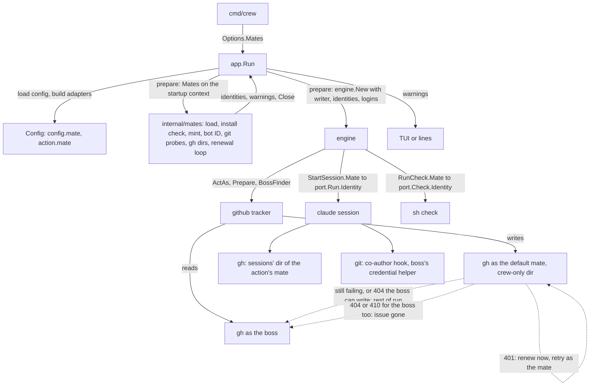
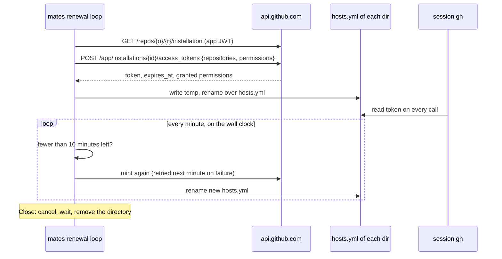

# crew acts as its mates - Plan

## Goal Capsule

- **Objective:** on GitHub, the boss can tell crew's work from their own. crew's labels, comments, issues and pull requests appear as its mates, so crew's failure reports notify the boss and the boss can approve the pull requests crew opens.
- **Means:** `.crew/config.yaml` names the mates that act (KTD1). crew's own GitHub writes, each action's session and its check reach GitHub through a private gh config directory holding the mate's installation token, which crew renews during the run (KTD2). Commits stay the boss's, with the mate as co-author (KTD7).
- **Product authority:** the boss, through the brainstorm of #80. Creating mates is #60 (merged in #87).
- **Open blockers:** none. Live checks with a real installation token need a mate on the boss's machine, and none exists where this plan was written; they are verification steps after merge (Verification Contract), not blockers.
- **Execution profile:** seven units. U1 and U2 change the domain, the config, the core and the ports. U3 builds acting as a mate in `internal/mates`. U4 changes the GitHub tracker. U5 wires everything through `app`, the engine and `cmd/crew`. U6 shows the warnings. U7 updates the docs and this repository's config.
- **Stop conditions:** stop and report if gh does not read a rewritten `hosts.yml` on each call (KTD2), if git's config-based hooks cannot receive the commit message path as an argument (KTD7), or if the layering in `.golangci.yml` cannot hold the design without a new exception (KTD3). Planning probed the first two on gh 2.100 and git 2.55, and both held.
- **Who ships:** the implementer opens one pull request that closes #80. Merging is the boss's.

---

## Product Contract

Product Contract unchanged. The issue body of #80 is its source.

### Summary

`.crew/config.yaml` names a default mate and, optionally, another mate for any action. A named mate acts for crew's own writes on GitHub and for every session and check that uses it, in every repository of its owner where it is installed. Commits stay the boss's, with the mate as co-author. crew learns who the boss is from CODEOWNERS and takes issues opened by the boss or by the mates.

### Problem Frame

Today crew, its sessions and its checks reach GitHub through the boss's `gh` login (`docs/guide/crew.mdx`), so everything crew does appears as the boss. GitHub does not notify you about your own activity, so a failure report rarely reaches the boss. GitHub also does not let the author of a pull request approve it, so the boss cannot approve the pull requests crew opens. #60 added mates, GitHub Apps of crew's own, but nothing acts as one yet.

Acting as a mate also changes who `@me` is. The poll takes only the issues and pull requests opened by the login `gh api user` returns (`internal/adapter/github/tracker.go`, `List`). This repository's triage prompt lists "the issues you opened" with `gh issue list --author @me` (`.crew/config.yaml`). Under a mate, both would mean the mate.

### Key Decisions

- **On GitHub the mate acts. In git the boss stays the author, with the mate as co-author.** Decided in the brainstorm of #60: a mate asks for no permission to push code (`internal/mates/manifest.go` grants `contents: read`). Governs R6, R8–R14.
- **One plan for all of #80.** (session-settled: user-directed — chosen over planning crew's own writes and the sessions separately: the config, the tokens and the rule for an unusable mate are designed once.)
- **A default mate, plus an optional mate per action.** (session-settled: user-directed — chosen over one mate per stage and over a single mate: two actions of the same stage, such as a developer and a reviewer, can act as different mates, and one mate cannot approve its own pull request.) Governs R1–R3.
- **One mate serves every repository of its owner.** GitHub limits a private app to its owner's account, so a mate cannot span an organization and the boss's personal account. Governs R4.
- **A mate crew cannot use falls back to the boss's `gh` login, with a warning.** (session-settled: user-directed — chosen over exit 2 at startup and over exit 2 with a flag to run as the boss: the boss can run crew on a machine without the keys.) Governs R19, R20.
- **The boss is every user on CODEOWNERS' catch-all `*` rule.** (session-settled: user-directed — chosen over crew's own `gh` login and over a config key: the repository states who owns it.) Governs R15, R16.
- **crew takes issues opened by the boss or by the configured mates.** (session-settled: user-directed — chosen over the boss's issues only and over any author: an issue a session opened as a mate, such as one from the audit ci stage, can still be handed to crew with a label.) Governs R17.
- **A mate's key stays a file a session could read; the risk is documented.** (session-settled: user-directed — chosen over moving keys to the OS keychain and over hiding the boss's own credentials from sessions: a session already runs as the boss's OS user and can reach the boss's own `gh` token, which is broader than any mate's.) Governs R23.

### Requirements

**Declaring mates**

- R1. `.crew/config.yaml` can name a default mate, which acts for crew's own writes on GitHub and for every action that names no mate of its own.
- R2. An action can name its own mate, which acts for that action's session and check.
- R3. A config where an action names a mate but no default mate is named is a config error (exit 2).
- R4. The config names a mate by its name, and crew finds it among the mates stored on this machine for the owner of the repository crew runs in. The same config line works in every repository of that owner.
- R5. A config that names no mate keeps today's behaviour: crew, its sessions and its checks act as the boss's `gh` login.

**crew's own writes**

- R6. With a default mate, every write crew makes on GitHub acts as that mate: creating missing labels, label moves, the status comment, the failure report, the stop comment and the mirrored label.
- R7. crew still requires `gh` logged in as the boss at startup. It uses that login wherever a mate cannot act (R19) and as the boss when CODEOWNERS names none (R15).

**Sessions and checks**

- R8. Every `gh` call in a session acts as the session's mate for as long as the session runs, past a token's one-hour life, without restarting the session.
- R9. The action's check acts as the same mate as its session.
- R10. A session or check acts as its mate even when the boss's shell sets `GH_TOKEN` or `GITHUB_TOKEN`.
- R11. A session or check gets only a token limited to the repository crew runs in, never a mate's key.
- R12. A pull request a session opens has the session's mate as its author.

**Commits**

- R13. Commits in an action's workspace stay authored by the boss and pushed with the boss's own git credentials, as today.
- R14. When a mate acts for an action, every commit made in its workspace carries the mate as co-author, including commits that skills such as `lfg` make with their own `git commit`. The trailer is GitHub's form for a bot, `Co-authored-by: <slug>[bot] <BOT_USER_ID+<slug>[bot]@users.noreply.github.com>`, with the bot user's ID, so GitHub shows the bot as a co-author.

**Who the boss is**

- R15. The boss is every user that the `*` rule of the repository's CODEOWNERS names. With no CODEOWNERS, or a `*` rule that names no user, the boss is crew's `gh` login, as today.
- R16. CODEOWNERS decides the boss whether or not the config names a mate.
- R17. crew's poll takes the open issues that carry a stage's label and were opened by the boss or by any mate the config names.
- R18. Sessions and checks can learn who the boss is and which mates the config names, so a prompt can list the issues crew takes without `@me`. This repository's triage prompt uses that instead of `--author @me`.

**When a mate cannot act**

- R19. When crew cannot use a mate the config names (its key is not on this machine, its app was uninstalled, or it is not installed on this repository), crew still starts and acts as the boss's `gh` login wherever that mate would act.
- R20. crew warns at startup, in the live view and in `--plain` output, naming the mate, what is wrong and the fix, such as `crew mates create <name>` in this repository.

**Status comment**

- R21. When the identity that writes an issue's status comment changes, crew keeps reporting that issue's stage runs. If it cannot edit the comment the earlier identity wrote, it continues in a new comment.

**Key and docs**

- R22. crew never puts a mate's key in a session's or check's environment, prompt or logs.
- R23. The guide says that a session runs as the boss's OS user and could read a mate's key file, that a leaked key reaches every repository of the owner where the mate is installed, and how to revoke a key on GitHub.
- R24. The guide documents naming mates in the config, the default and per-action rule, the fallback and its warning, the co-author trailer, and how crew finds the boss in CODEOWNERS. `CONCEPTS.md` drops "crew does not act as its mates yet" from Mate, and its Boss entry says how crew finds the boss.

### Key Flows

- F1. An action acting as its mate
  - **Trigger:** a stage takes an issue, and its action names the mate `developer` while the default mate is `ops`.
  - **Steps:**
    - crew moves the issue's label and updates the status comment as `ops` (R6).
    - The session starts with a token for `developer`, limited to this repository (R8, R11).
    - The session commits as the boss with `developer` as co-author (R13, R14) and opens a pull request as `developer` (R12).
    - The check runs as `developer` (R9).
    - The stage ends, and crew moves the labels and posts any failure report or stop comment as `ops` (R6).
  - **Covers R6, R8, R9, R11–R14.**

### Acceptance Examples

- AE1. **Covers R1, R2, R6, R12, R14.** Given a default mate `ops` and the `lfg` action naming `developer`, when the development stage runs on an issue, crew's label moves and status comment are by `crew-ops[bot]`, the pull request is by `crew-developer[bot]`, and its commits are authored by the boss with `crew-developer[bot]` as co-author.
- AE2. **Covers R3.** Given an action naming `developer` and no default mate, crew exits 2 at startup and names the missing default.
- AE3. **Covers R4, R19.** Given the mate `ops` installed on two `thatsnotmynameio` repositories, the same `ops` in both configs acts in both. Given a repository on the boss's personal account whose config names `ops`, and no `ops` mate for that account on this machine, crew warns and acts as the boss there.
- AE4. **Covers R5.** Given a config that names no mate, crew, its sessions and its checks act as the boss's `gh` login, exactly as before.
- AE5. **Covers R8.** Given a session acting as `developer` that runs for three hours, a `gh` call it makes in its third hour still acts as `crew-developer[bot]`.
- AE6. **Covers R10.** Given the boss's shell exports `GH_TOKEN`, a session acting as `developer` still opens its pull request as `crew-developer[bot]`.
- AE7. **Covers R15.** Given a CODEOWNERS whose `*` rule names `@mguilarducci` and `@alice`, crew takes labelled issues opened by either. Given no CODEOWNERS, crew takes the labelled issues opened by its `gh` login.
- AE8. **Covers R17.** Given the audit ci session, acting as `ops`, opens an issue, when the boss puts a stage's label on it, crew takes it at the next poll.
- AE9. **Covers R14.** Given `lfg` commits through its own `git commit` with its own message, the commit still carries the `crew-developer[bot]` co-author trailer.
- AE10. **Covers R19, R20.** Given the default mate's key is not on this machine, crew starts, warns that `ops` has no key here and that `crew mates create ops` fixes it, and moves labels as the boss.

### Scope Boundaries

- Storing mates' keys in the OS keychain.
- Permissions per mate. Every mate keeps the permission set of #60.
- Making a mate's approval count toward a ruleset's required reviews. The boss approves crew's pull requests.
- New mate commands such as listing or removing mates.
- A mate spanning several owner accounts. GitHub does not allow it for a private app.
- A per-action way to act as the boss while a default mate is named. The default applies to every action (R1); an action that needs the boss's wider rights, such as merging, runs in a repository whose config names no mate.

Considered and not built:

- **A warning while crew runs.** Warnings exist at startup only. When a mate's writes start failing mid-run, crew's own writes switch to the boss for the rest of the run (KTD4), which the boss sees on GitHub as their own login. A token renewal that keeps failing leaves sessions' `gh` calls failing until it succeeds. Reports of either going unnoticed would justify a live warning event.
- **Retrying an unusable mate later in the run.** A mate that fails at startup, even on a transient GitHub error, is skipped until crew restarts. Frequent startup flakes would change this.
- **Revoking the run's tokens at exit.** crew removes the token files on every exit it controls; a token a session copied elsewhere expires within the hour.
- **Live re-reading of CODEOWNERS.** crew reads it once at startup.
- **Carrying the boss's gh aliases and settings into a session's gh directory.** The directory holds only what KTD2 writes. Aliases a prompt relies on would change this.
- **Keeping Claude Code's own `Co-Authored-By: Claude` trailer in sync with the mate's.** crew adds the mate's trailer through git (KTD7) and leaves Claude Code's attribution setting alone.

### Sources

- `docs/plans/2026-10-03-1605-feat-crew-mates-plan.md`: the plan of #60, its split between GitHub and git, and its tested feasibility for tokens in a session.
- `docs/solutions/integration-issues/issue-field-total-count-fails-listing-on-user-repositories.md`: one field a token cannot read fails the whole listing, which is why the poll stays on the boss (KTD4).
- `docs/solutions/security-issues/session-text-in-public-tracker-comments.md`: why session text reaching a public comment is scrubbed (KTD12).
- GitHub: [About code owners](https://docs.github.com/en/repositories/managing-your-repositorys-settings-and-features/customizing-your-repository/about-code-owners); [Creating a commit with multiple authors](https://docs.github.com/en/pull-requests/committing-changes-to-your-project/creating-and-editing-commits/creating-a-commit-with-multiple-authors); [Generating an installation access token](https://docs.github.com/en/apps/creating-github-apps/authenticating-with-a-github-app/generating-an-installation-access-token-for-a-github-app).
- Git 2.54: config-based hooks, `hook.<name>.command` and `hook.<name>.event`, which run before the hook in the hooks directory ([git-hook](https://git-scm.com/docs/git-hook), [Highlights from Git 2.54](https://github.blog/open-source/git/highlights-from-git-2-54/)).

---

## Planning Contract

### Key Technical Decisions

- KTD1. **The config keys are `config.mate` and an action's `mate`.** `config.mate` names the default mate. `workflow[].actions[].mate` names an action's own. Config fills every action's `crew.Action.Mate` with its own mate or the default, so the core and the engine never apply the default rule. An action `mate` without `config.mate` is a key error at the action's line (R3). Config does not check the name's spelling: `mates.CheckName` stays the one rule, and the mate resolver turns an invalid name into an error that exits 2 at startup. Governs R1–R3.
- KTD2. **A mate acts through a private gh config directory.** At startup crew creates one temporary directory, mode 0700, under `$XDG_RUNTIME_DIR` when set and the system temporary directory otherwise, and refuses one inside the repository. Each usable mate gets a sessions' directory, and the default mate also gets a second one only crew's own writes use, so a session's `gh auth logout` cannot change who crew writes as. Each directory holds `config.yml` with `version: "1"` and `hosts.yml` in gh's multi-account form (`users:` with the bot login, `user:`, `oauth_token:`), which stops gh from migrating it through `GET /user` (probed on gh 2.100). A child acts as the mate with `GH_CONFIG_DIR` set and `GH_TOKEN`, `GITHUB_TOKEN`, `GH_ENTERPRISE_TOKEN`, `GITHUB_ENTERPRISE_TOKEN` and `GH_HOST` removed (a new `Unset` on `proc.Command`). Each token is minted with the manifest's permissions named explicitly and only the current repository, and crew checks the reply grants no more. A loop checks the wall clock every minute and renews a token once fewer than 10 minutes remain, so a machine waking from sleep renews at once. A renewal writes a temporary file and renames it over `hosts.yml`, so a concurrent gh never reads half a file. A failed renewal is tried again at the next minute. Governs R8–R11, R22.
- KTD3. **Acting lives in `internal/mates`; `cmd/crew` hands it to `app` as a function.** `internal/mates` keeps importing only the standard library and `proc`, and returns plain values. `internal/port` gains `Identity` (mate name, login, environment to add, variables to remove; zero means the boss) and two optional tracker interfaces: `Acting`, which sets the writer, its renew-now function and the mates' logins, and `BossFinder`, which returns the boss's logins once `Prepare` ran. `app.Options.Mates` takes the startup context and the configured names and returns the identities, the warnings, a `Close`, and for the default mate a function that renews its token at once. Startup work runs on that context; the renewal loop runs on a context of its own that only `Close` ends, after which `Close` waits for it and removes the directory. On error the resolver has already removed what it created. No depguard rule changes (`cmd/crew` already imports `port`).
- KTD4. **The tracker reads as the boss and writes as the default mate, and falls back to the boss for the rest of the run when the mate cannot write.** Every read (the poll, `gh issue view` before a move, `gh label list`, the comment list, `gh pr list`, CODEOWNERS) runs as the boss, so a mate's missing organization permissions cannot break the poll. Every write runs as the writer through the crew-only directory, with the `Unset` list applied, so a `GH_TOKEN` in crew's own environment cannot win (R10 for crew's own writes). A write answered `HTTP 401` or `Bad credentials` as the mate first renews the default mate's token at once and retries as the mate, since a machine waking from sleep can hold an expired token for up to a minute. A write that still fails as the mate on authentication or permission (`HTTP 401` or `Bad credentials` on a fresh token, a failed renewal, `Resource not accessible by integration`, gh saying it is not logged in) runs once more as the boss, and every later write of the run goes as the boss: per-call flapping would post a new status comment on every update (KTD10). A write answered 404 or 410 as the mate runs once more as the boss, since a private repository answers 404 to a token that lost access. When the boss's rerun succeeds, the mate has lost access and every later write goes as the boss; when the boss also gets 404 or 410, the issue is gone and the writer stays the mate. Any other 403, such as a locked issue, keeps today's meaning. `gh auth status` and the login lookup always run as the boss (R7). Governs R6, R7, R19.
- KTD5. **The tracker reads CODEOWNERS from the default branch during `Prepare`.** It asks `gh api` for the contents of `.github/CODEOWNERS`, then `CODEOWNERS`, then `docs/CODEOWNERS`, as GitHub searches them, a 404 meaning the next one. Reading through GitHub needs no repository root in the adapter and ignores a local branch or an uncommitted edit, as GitHub does. The last line whose pattern is exactly `*` counts, since a later rule wins. Each `@user` is a boss; each `@org/team` is expanded to its members through the boss's gh (`orgs/<org>/teams/<team>/members`), and a team crew cannot expand fails startup naming the team and `gh auth refresh -s read:org`. Email owners are skipped. Logins are matched ignoring case. No users left means the boss is the gh login (R15). Governs R15, R16.
- KTD6. **The poll keeps filtering issues by author on the server.** Every issue template of this repository applies a crew label, so anyone could fill a 100-item window that ignored authors. The query gets one aliased `issues(filterBy: {createdBy, labels})` per author: each boss login, as today, and each mate's `<slug>[bot]` login, which `createdBy` accepts for a bot (checked with gh 2.100 against `renovate[bot]`). Every alias decodes the same way, and an issue found twice counts once. Pull requests stay one labelled list, filtered by author in Go: outsiders cannot label pull requests. A pull request's GraphQL `author` is `{__typename, login}`, and a `Bot` author is compared as `<login>[bot]`, which also keeps a user called `crew-ops` apart from the bot `crew-ops[bot]`. Governs R17.
- KTD7. **The co-author trailer comes from a config-based git `commit-msg` hook in the session's and check's environment.** The mate's environment adds `GIT_CONFIG_COUNT`, `GIT_CONFIG_KEY_<n>` and `GIT_CONFIG_VALUE_<n>` entries setting `hook.crew-co-author.event=commit-msg` and `hook.crew-co-author.command` to `git interpret-trailers --in-place --if-exists addIfDifferent --trailer '<trailer>'`. Git 2.54 runs config-based hooks before the hooks directory's and appends the message path, so the boss's own hooks, a global `core.hooksPath` included, still run, and `--amend` keeps one trailer (probed on git 2.55). Any `git commit` gets it, `lfg`'s included, whatever the model writes. Entries start after any `GIT_CONFIG_COUNT` crew inherited. The slug must match `[a-z0-9-]+` and the bot ID be a positive integer before either enters a shell string or `hosts.yml`. The bot user's ID comes from `GET /users/<slug>[bot]`, sent with the just-minted installation token, never the app JWT. When crew cannot get the ID, or git is older than 2.54, the mate still acts and crew warns that its commits carry no co-author. Governs R14.
- KTD8. **Pushes keep the boss's git credentials.** When the boss's git config runs `gh auth git-credential` as a credential helper for github.com, under `credential.helper` or `credential.https://github.com.helper`, with or without a leading `!`, a session's `GH_CONFIG_DIR` would make git push as the mate, whose `contents: read` refuses it. So the mate's environment resets `credential.https://github.com.helper` and sets it again to that helper with `GH_CONFIG_DIR` pinned to the boss's own gh config directory: `$GH_CONFIG_DIR`, else `$XDG_CONFIG_HOME/gh`, else `~/.config/gh`, made absolute and single-quoted for the shell. Other helpers and SSH remotes are left alone. Governs R13.
- KTD9. **The engine owns the identities and gives each session and check its action's.** `app` resolves the mates before it builds the engine, so `engine.Config` carries the writer, the identities by mate name and the mates' logins. `engine.prepare` calls the tracker's `ActAs` before the preparers and reads its `BossFinder` after them. The core copies the action's `Mate` into `StartSession` and `RunCheck`; the engine maps it to the mate's identity, the zero identity when the mate is unusable (R19), and passes it in `port.Run` and `port.Check` with the boss's and the mates' logins. The claude and shell adapters apply the identity and set `CREW_BOSS` and `CREW_MATES`, each a space-separated list of logins, a mate's as `<slug>[bot]` (R18). A resumed action gets this run's identity of its mate; the run journal records no mate. Governs R2, R8, R9, R18.
- KTD10. **The status comment follows its author.** `findStatus` takes the newest marked status comment written by any crew identity: the boss's gh login or a configured mate. The cache remembers who wrote it. When that author is not the tracker's current writer, crew does not edit it and continues in a new comment whose preamble says it continues the earlier one, so crew never depends on a mate editing another identity's comment. With KTD4's switch for the rest of the run, the writer changes at most once per run. Governs R21.
- KTD11. **The warnings go from `app` straight to the renderers.** The resolver's warnings (an unusable mate, a missing bot ID, an old git) name the mate, what is wrong and the fix. `app` passes them to `tui.New` and `lines.Run`: the TUI shows them above the stages, and the line renderer prints each once before the first event. The engine never uses them, so it does not carry them. Governs R20.
- KTD12. **No session or check text reaches a comment, the TUI or the lines with a token or a key in it.** `engine.scrub`, which every session and check text already passes before the core cuts it to its last 200 characters, also replaces GitHub token patterns (`ghp_`, `gho_`, `ghu_`, `ghs_`, `ghr_`, `github_pat_`) and PEM private key blocks. Redacting before the cut means no cut can leave a token without the prefix the pattern needs. Governs R22.

### High-Level Technical Design

Startup and who acts as whom:

A token's life:

The startup verdict per named mate:

| Found | Warning | crew acts as |
|---|---|---|
| invalid name | none: exit 2 | nothing, crew stops |
| no file for the owner | `<name>` has no key on this machine; run `crew mates create <name>` here | the boss |
| not installed (404) | `<name>` is not installed on owner/repo; run `crew mates create <name>` here | the boss |
| key rejected (401) | GitHub rejected `<name>`'s key; delete its file and run `crew mates create <name>` | the boss |
| GitHub unreachable or failing, or the token grants more or less than asked | `<name>` could not get a token: the reason; crew acts as the boss this run | the boss |
| token minted, bot ID missing or git older than 2.54 | `<name>`'s commits carry no co-author, and why | the mate |
| token minted, bot ID found, git 2.54 or newer | none | the mate |

### Assumptions

- A bot's GraphQL `author` on a pull request is `__typename: Bot` with a login lacking the `[bot]` suffix that REST shows, while `issues(filterBy: {createdBy})` takes the suffixed login. KTD6 and KTD10 normalise both forms, so either answer works.
- Installation tokens with #60's permissions can create pull requests, issues, labels and comments, and record issue dependencies. Only a live check can confirm it (Verification Contract).
- A mate with no file on this machine has no known login, so the issues it opened elsewhere are not taken this run. That follows R19: crew acts as the boss wherever an unusable mate would act.

### Risks

| Risk | Mitigation |
|---|---|
| A session or a check reads a mate's key file or the boss's gh token, since it runs as the boss's OS user. | Settled and documented (R23). Sessions get only a repository-limited token through crew. |
| Claude Code's shell snapshot re-exports a `GH_TOKEN` the boss sets in their shell profile, overriding the mate in the session's Bash tool. | KTD2 removes the inherited variable. A profile that exports it again is the boss's to change; the guide says so. |
| A boss whose gh login exists only as an exported `GH_TOKEN` loses push in sessions acting as a mate, since the pinned helper sees no stored login. | The guide says to log gh in (`gh auth login`) before naming a mate. |
| `gh pr create` pushing a branch itself uses gh's own credential helper, so the push goes as the mate and is refused. | The skills crew runs push with `git push` first. The guide says to push before `gh pr create`. |
| A commit made with `--no-verify` skips the co-author hook. | Accepted: the skills crew runs do not bypass hooks. |
| SIGKILL or a crash leaves token files in the temporary directory. | The directory is 0700 and outside the repository; tokens expire within the hour. Every other exit runs `Close`. |
| A mate missing a permission makes a session's `gh` call fail. | The session reports the error; crew's own writes fall back to the boss (KTD4). The live check covers the commands crew's prompts use. |

---

## Implementation Units

### U1. The config names mates and the core carries each action's mate

- **Goal:** the config's `config.mate` and an action's `mate` reach every `StartSession` and `RunCheck` the core emits.
- **Requirements:** R1, R2, R3, R5; KTD1, KTD9.
- **Dependencies:** none.
- **Files:**
  - `internal/crew/workflow.go` (`Action.Mate`)
  - `internal/config/config.go`, `internal/config/validate.go` (`config.mate`, `actions[].mate`, the R3 error, `Config.Mate` and the list of named mates)
  - `internal/core/command.go`, `internal/core/action.go`, `internal/core/update.go`, `internal/core/model.go` (the action's mate on the two commands)
  - Tests: `internal/config/config_test.go`, `internal/config/validate_test.go`, the core table tests covering `StartSession` and `RunCheck`
- **Approach:**
  1. `settings` gains `Mate located[string]`; `actionDoc` gains `Mate located[string]`; the shape messages name the new key.
  2. After the workflow parses, each action's `Mate` is its own or `config.mate`. An action naming a mate with no `config.mate` is a `keyError` at that action's `mate` line, joined with the workflow's other errors.
  3. `Config.Mate` holds the default, and the config lists every named mate once, default first, for the resolver.
  4. The core's action state keeps the mate where it is built from `crew.Action`, and `StartSession` and `RunCheck` carry it as `Mate`.
- **Patterns to follow:** `located[T]` and `keyError` in `internal/config`; how `Check` travels from `crew.Action` to `RunCheck`.
- **Test scenarios:**
  - `config.mate: ops`, one action with `mate: developer`, another with none: the first action's `Mate` is `developer`, the second's `ops`.
  - Covers AE2. An action with `mate: developer` and no `config.mate`: `Load` fails naming `workflow[0].actions[0].mate`, its line and the missing `config.mate`.
  - No mate anywhere: every action's `Mate` is empty and the list of named mates is empty (R5).
  - `config.mate: ops` also named by two actions: the list holds `ops` once.
  - A non-string `mate` is a type error with its path.
  - The core emits `StartSession` and, after a successful session, `RunCheck` with the action's `Mate`.
- **Verification:** config and core tests pass; configs without mates load unchanged.

### U2. Ports, proc and the session and check adapters carry an identity

- **Goal:** a session and a check run with their identity's environment and with `CREW_BOSS` and `CREW_MATES`.
- **Requirements:** R8, R9, R10, R11, R18, R22; KTD2, KTD3, KTD9.
- **Dependencies:** none.
- **Files:**
  - `internal/proc/proc.go` (`Command.Unset`, applied in `environ`)
  - `internal/port/port.go` (`Identity`; `Run` and `Check` gain `Identity`, `Boss` and `Mates`; the optional tracker interfaces `Acting` and `BossFinder`)
  - `internal/adapter/claude/command.go`, `internal/adapter/claude/harness.go`
  - `internal/adapter/shell/check.go`
  - `internal/fake/harness.go`, `internal/fake/checker.go` (record the run's and check's identity and logins); `internal/fake/tracker.go` (an `Acting` mixin that records `ActAs` and returns scripted boss logins, composed into a new acting tracker; the plain fake tracker stays without it)
  - Tests: `internal/proc/proc_test.go`, `internal/adapter/claude/command_test.go`, `internal/adapter/shell/check_test.go`
- **Approach:**
  1. `environ` drops every inherited variable named in `Unset` before adding `Env`; `GIT_TERMINAL_PROMPT` and `GH_PROMPT_DISABLED` still win.
  2. `port.Identity` holds the mate's name, its login, `Env` and `Unset`. Its zero value is the boss and changes nothing. Its doc says it never holds a key or a token.
  3. The claude command and the shell check append the identity's `Env`, set its `Unset`, and add `CREW_BOSS` and `CREW_MATES`.
- **Patterns to follow:** the `Env` field of `proc.Command`; the optional-interface comments in `internal/port/port.go`; the mixin trackers in `internal/fake/tracker.go`.
- **Test scenarios:**
  - `environ` with `GH_TOKEN` and `GITHUB_TOKEN` inherited and both in `Unset`: neither is in the result; an `Env` entry for `GH_CONFIG_DIR` is.
  - `Unset` cannot remove `GIT_TERMINAL_PROMPT=0` or `GH_PROMPT_DISABLED=1`.
  - Covers AE6. The claude command for a run with an identity: its `Env` has the identity's `GH_CONFIG_DIR`, `CREW_BOSS` and `CREW_MATES`, and its `Unset` holds `GH_TOKEN` and `GITHUB_TOKEN`.
  - A run with the zero identity: the command is today's plus `CREW_BOSS` and `CREW_MATES`.
  - The shell check with an identity, under a test environment that sets `GH_TOKEN`: a check printing `$GH_CONFIG_DIR`, `$CREW_BOSS` and whether `GH_TOKEN` is set prints the identity's directory, the boss list and "unset".
- **Verification:** tests pass; adapters build with the new port fields; depguard passes.

### U3. internal/mates acts as a mate: tokens, gh directories, git environment

- **Goal:** for the configured names in a repository, crew gets each usable mate's identity values, a warning for each problem, and a renewal loop with its `Close`.
- **Requirements:** R4, R8, R10, R11, R13, R14, R19, R20, R22; KTD2, KTD3, KTD7, KTD8.
- **Dependencies:** none (U5 consumes it).
- **Files:**
  - `internal/mates/github.go` (minting returns the token, its expiry and its grant, with the permissions asked; the bot user lookup sent with an installation token)
  - `internal/mates/act.go` (new: resolve names, the verdicts, the gh directories, the renewal loop, `Close`)
  - `internal/mates/gitenv.go` (new: the git version check, the credential helper pin, the hook entries, shell quoting)
  - `internal/mates/manifest.go` (the permission set shared by the manifest and the token request)
  - `internal/mates/create.go` (adapt to the new minting result)
  - `internal/mates/name.go` (package doc: crew acts as its mates)
  - Tests: `internal/mates/github_test.go`, `internal/mates/act_test.go`, `internal/mates/gitenv_test.go`
- **Approach:**
  1. An invalid name is an error (`CheckName`). Otherwise, per name, in order: load the mate for the repository's owner, find its installation on the repository, mint a token, look up the bot user's ID. Each failure is a verdict of the table in the High-Level Technical Design.
  2. The repository and its owner come from `ResolveRepo`, run as the boss.
  3. A usable mate gets its directories under the run's temporary directory, written as KTD2 says. Its sessions' environment is `GH_CONFIG_DIR`, the git entries of KTD7 and KTD8, and the `Unset` list. The default mate's writer environment points at its crew-only directory and carries no git entries.
  4. The renewal loop checks every minute and renews per KTD2, on its own context (KTD3). The default mate also exposes a renew-now function, which mints and rewrites both its directories at once and reports whether it succeeded. The mint function is injectable, so a `testing/synctest` bubble can drive the loop without the network.
  5. The git side reads `git version` once and `git config --get-regexp` over `credential.` keys, both in the repository root, as the boss.
  6. No error, warning or log line quotes a key or a token; the token's type prints redacted like `PrivateKey`.
- **Execution note:** start with the real-git test of KTD7's hook entries; skip it when git is older than 2.54.
- **Patterns to follow:** `Client.do` and the scripted HTTP servers of `internal/mates/github_test.go`; `PrivateKey`'s redaction; `Store`'s file modes; real-git tests with `GIT_CONFIG_GLOBAL` and `GIT_CONFIG_NOSYSTEM` set.
- **Test scenarios:**
  - Two names, one stored and installed, one with no file: the first yields an identity whose directory holds `hosts.yml` with the token under `users:` and `user:`, and `config.yml` with `version: "1"`, both readable only by the owner. The second yields the "no key on this machine" warning naming `crew mates create <name>`.
  - Covers AE10. The default mate with no file: a warning and no identity.
  - Covers AE3. The installation lookup answers 404: the "not installed on owner/repo" warning.
  - The installation lookup answers 401: the "GitHub rejected the key" warning naming the mate's file.
  - The token call answers 500, or grants a permission not asked for: the "could not get a token" warning.
  - The token request names the repository and the manifest's permissions.
  - An invalid name such as `Ops`: an error, not a warning, and no directory left behind.
  - Covers AE5. Under `synctest`, a token expiring in one hour is renewed after 50 minutes and `hosts.yml` then holds the new token; a renewal that fails is tried again a minute later and succeeds.
  - `Close` ends the loop, waits for it and removes the directory; a second `Close` does nothing.
  - Renew-now on the default mate mints a new token and rewrites both its directories; a failing mint reports the failure and leaves the old files.
  - The bot ID lookup fails, or returns a non-numeric ID: the identity has no hook entries, with the "no co-author" warning.
  - Covers AE9. Real git: in a temporary repository, `git commit -m x` with the identity's environment ends its message with `Co-authored-by: crew-developer[bot] <123+crew-developer[bot]@users.noreply.github.com>`; a hook under `core.hooksPath` still runs; `git commit --amend` keeps one trailer.
  - The boss's config sets `credential.https://github.com.helper` to `!/path/gh auth git-credential`, or `credential.helper` to `/path/gh auth git-credential`: the environment resets the github.com helper and sets it to the same helper with `GH_CONFIG_DIR='<boss dir>'`. With an osxkeychain helper or none, there are no credential entries.
  - A boss gh directory holding a single quote and a space is quoted so the helper runs with that exact directory.
  - An inherited `GIT_CONFIG_COUNT=2`: crew's entries start at index 2 and the count becomes 2 plus crew's.
  - Covers R22. No warning, error or log line the resolver produces contains the key or the token.
- **Verification:** mates tests pass with `-race`; the real-git hook test passes on git 2.54 or newer.

### U4. The GitHub tracker reads as the boss, writes as the mate, and knows the boss

- **Goal:** the tracker implements KTD4, KTD5, KTD6 and KTD10.
- **Requirements:** R6, R7, R15, R16, R17, R19, R21.
- **Dependencies:** U2.
- **Files:**
  - `internal/adapter/github/gh.go` (a read runner and a write runner; the fallback and its switch)
  - `internal/adapter/github/tracker.go` (`ActAs`, `Boss`, the query with per-author aliases, author filtering of pull requests, `Prepare` resolving the boss)
  - `internal/adapter/github/codeowners.go` (new: fetch the file through `gh api`, parse the `*` rule, expand teams)
  - `internal/adapter/github/status.go` (author-aware lookup and cache, continuation on another author)
  - `internal/adapter/github/pullrequest.go`, `internal/adapter/github/report.go` (writes through the write runner)
  - Tests: `internal/adapter/github/tracker_test.go`, `internal/adapter/github/status_test.go`, `internal/adapter/github/codeowners_test.go`, `internal/adapter/github/pullrequest_test.go`
- **Approach:**
  1. `gh` gets `read` (the boss) and `write` (the writer identity, the boss when zero). `write` applies the writer's `Env` and `Unset`, recognises the failures of KTD4 from gh's output, renews and retries on a 401, reruns as the boss, and switches for the rest of the run when KTD4 says so.
  2. `ActAs` stores the writer, its renew-now function and the mates' logins before `Prepare`; without it the tracker writes as the boss, as today.
  3. `Prepare` runs `gh auth status` and the login lookup as the boss, resolves the boss (KTD5), then creates missing labels as the writer.
  4. `List` sends one query with an aliased `issues` per boss login and per mate login; the `issuesReply` decoding handles the aliases and drops duplicates. Pull requests are kept when their author, normalised per KTD6, is a boss or a mate.
  5. `findStatus` lists comments as the boss and keeps the newest marked one by the gh login or a mate; the cached comment carries its author; `writeStatus` continues in a new comment when that author is not the current writer's login.
- **Patterns to follow:** the scripted `gh` runner in the adapter's tests; `classify` and `httpStatus` for gh's stderr; `nextStatus`'s continuation preamble.
- **Test scenarios:**
  - Covers AE1. With a writer: the move's `gh issue edit`, the status `PATCH`, the failure report, the stop comment and `gh label create` run with the writer's directory and `Unset`; `gh issue view`, `gh label list`, the comment list and the poll run with neither.
  - Covers AE4. Without `ActAs`, and with every CODEOWNERS lookup answering 404: every call runs as the boss with no added environment, and the query has one `issues` alias, for the gh login.
  - A move's `gh issue edit` as the mate prints `GraphQL: Resource not accessible by integration`: it reruns as the boss, and the next write runs as the boss without trying the mate.
  - A status `PATCH` as the mate answers `HTTP 401`: crew renews the token, the retry as the mate succeeds, and the next write still goes as the mate.
  - A status `PATCH` as the mate answers `HTTP 401` again after the renewal: it reruns as the boss and the run's later writes go as the boss.
  - A failure report as the mate answers `HTTP 404`: it reruns as the boss, which also answers 404, so the error is `ErrMovedMeanwhile`, and the next write still tries the mate.
  - A status `PATCH` as the mate answers `HTTP 404` and the boss's rerun succeeds: the next two status updates edit that same comment as the boss, with no new comment.
  - A `HTTP 403` that is a rate limit as the mate stays transient and does not switch.
  - Covers AE7. `.github/CODEOWNERS` with `* @mguilarducci @alice`: the query has an `issues` alias for each, and issues by either are listed.
  - `.github/CODEOWNERS` answers 404 and root `CODEOWNERS` exists: the root one counts. Two `*` lines: the last wins. `* @org/devs` expands through `orgs/org/teams/devs/members`; the expansion failing fails `Prepare` naming the team and `gh auth refresh -s read:org`.
  - No CODEOWNERS anywhere, or a `*` rule with only an email: the boss is the gh login.
  - Covers AE8. Mate `crew-ops[bot]`: the query has an `issues` alias with `createdBy: "crew-ops[bot]"`, and an issue it returns is listed, once even when another alias returned it too.
  - A pull request by author `{__typename: Bot, login: crew-developer}` is listed; one by a `User` called `crew-developer` is not; one by an outsider is not.
  - Covers R21. The newest status comment was written by the boss and the writer is `crew-ops[bot]`: crew creates a continuation comment, caches it with its author, and the next status edits the new comment.
  - A writer whose every write fails with a permission error leaves exactly one status comment across three status updates.
  - A comment by an unrelated user ending with the status marker is ignored.
- **Verification:** adapter tests pass; the doc comments of `List`, `Prepare`, `Move` and `ReportStatus` state the new rules.

### U5. app, the engine and cmd/crew wire the mates in, and scrub tokens

- **Goal:** crew resolves the configured mates at startup, builds the engine with their identities, and every session and check gets its action's identity.
- **Requirements:** R1, R2, R4, R5, R7, R8, R9, R18, R19, R22; KTD3, KTD9, KTD12.
- **Dependencies:** U1, U2, U3, U4.
- **Files:**
  - `internal/app/app.go` (`Options.Mates`; `build` split so the engine is built inside `prepare` after resolution; `Close` deferred once resolution succeeded)
  - `internal/engine/engine.go`, `internal/engine/exec.go`, `internal/engine/paths.go` (`Config.Writer`, `Config.Identities`, `Config.MateLogins`; `ActAs` and `BossFinder` in `prepare`; identity and logins in `port.Run` and `port.Check`; token and key patterns in `scrub`)
  - `cmd/crew/main.go`, `cmd/crew/act.go` (new: adapt `internal/mates` to `Options.Mates`)
  - Tests: `internal/app/app_test.go`, `internal/engine/` tests covering sessions, checks and `scrub`, `cmd/crew/act_test.go`
- **Approach:**
  1. `Run` loads the config and builds the adapters as today, then `prepare`, under its one timeout and signal wrapper, calls `Options.Mates` when the config names a mate, builds the engine with the result, and runs `eng.Prepare`. A resolver error is an exit-2 error.
  2. `Run` defers `Close` as soon as resolution succeeds, so it runs after the engine's stop sequence on every way out: a clean stop, a forced exit, an engine failure and a recovered panic.
  3. `engine.prepare` calls `ActAs` with the default mate's identity, the zero identity when it is unusable, and every resolved mate's login, before the preparers; after them it reads the boss from `BossFinder`.
  4. `startSession` and `check` fill `port.Run` and `port.Check` from the command's `Mate`.
  5. `scrub` replaces the token patterns and PEM key blocks of KTD12.
  6. `cmd/crew` builds the resolver from `mates.DefaultStore`, a `mates.Client` on `api.github.com`, the group's runner and the repository root, and turns its result into `port.Identity` values.
- **Patterns to follow:** how `Options.Workspace` and `Options.Checker` are injected; the `synctest` app tests with fakes; `scrub`'s existing tests.
- **Test scenarios:**
  - Covers F1. Default `ops`, action `lfg` naming `developer`, a fake resolver returning both, the acting fake tracker: `ActAs` got `ops`; the fake harness's run and the fake checker's check carry `developer`'s identity, `CREW_BOSS` from the fake tracker and both mates' logins.
  - Covers AE4. No mate in the config: the resolver is never called, `ActAs` is never called, and sessions get the zero identity.
  - Covers AE10. The resolver returns a warning and no identity for `ops`: crew runs, `ActAs` got the zero identity, and the renderer got the warning.
  - The resolver returns an error: `Run` returns exit 2 and prints it.
  - A stop signal during resolution: exit 2, as for any environment check.
  - `Close` runs once after a clean stop, once after a forced exit, and not at all when resolution failed.
  - `scrub` of a 260-character reason with a `ghs_` token whose prefix would fall just before the 200-character cut: the result shows the redaction and no part of the token.
  - `scrub` of a text holding a PEM private key block: the block is replaced.
  - `cmd/crew`'s adapter turns a mates result into `port.Identity` values holding no key or token.
- **Verification:** app and engine tests pass under `synctest`; `go vet` and depguard pass.

### U6. The TUI and the event lines show the warnings

- **Goal:** the boss sees each startup warning in the live view and in `--plain` output.
- **Requirements:** R20; KTD11.
- **Dependencies:** U5.
- **Files:**
  - `internal/ui/tui/model.go`, `internal/ui/tui/view.go`
  - `internal/ui/lines/lines.go`
  - `internal/app/app.go` (pass the warnings to both renderers)
  - Tests: `internal/ui/tui/view_test.go` with a new golden file in `internal/ui/tui/testdata/`, `internal/ui/lines/lines_test.go`
- **Approach:** the TUI renders each warning on its own line above the stages. The line renderer prints each once, stamped with the time it starts, before the first update.
- **Patterns to follow:** the golden tests and `-update`; `lines.Run`'s stamping.
- **Test scenarios:**
  - Covers AE10. The warning "ops has no key on this machine; run `crew mates create ops` here": the golden view shows it; the line output has it once, before the first event.
  - No warnings: the views and lines are unchanged.
- **Verification:** golden diffs reviewed; tests pass.

### U7. The docs, CONCEPTS.md and this repository's config

- **Goal:** the guide and the contributor docs describe crew acting as its mates, and the triage prompt no longer uses `@me`.
- **Requirements:** R18, R23, R24.
- **Dependencies:** U1–U6.
- **Files:**
  - `docs/guide/mates.mdx` (acting as mates; the key's risk and how to revoke it, R23)
  - `docs/guide/crew.mdx` (`config.mate`, an action's `mate`, the fallback and its warnings, `CREW_BOSS` and `CREW_MATES`, the co-author trailer and git 2.54, pushes and the boss's credential helper, CODEOWNERS and the boss, reads as the boss and writes as the mate, the Risks rows a boss must act on)
  - `docs/develop/architecture.mdx` (the new port types, where acting lives)
  - `CONCEPTS.md` (Mate, Boss)
  - `AGENTS.md` (the `internal/mates` line)
  - `.crew/config.yaml` (the triage prompt reads `$CREW_BOSS` and `$CREW_MATES`)
- **Approach:** MDX keeps `{` and `<` in code. The triage prompt lists the open issues of each login in `CREW_BOSS` and in `CREW_MATES` with `--author <login>`, passing a mate's `<slug>[bot]` as given: without a label or search, gh filters by `createdBy`, which takes that form and finds nothing for `app/<slug>`.
- **Test scenarios:** Test expectation: none -- documentation and a prompt; `pnpm docs:check` and the config loading test cover them.
- **Verification:** `pnpm docs:check` passes; `config.Load` still loads `.crew/config.yaml`.

---

## Verification Contract

| Gate | Command | Applies to |
|---|---|---|
| Format | `gofmt -l cmd internal tools` prints nothing | all Go units |
| Vet | `go vet ./...` | all Go units |
| Lint and layering | `go run github.com/golangci/golangci-lint/v2/cmd/golangci-lint@v2.14.0 run` | all Go units |
| Tests | `go test -race ./...` | U1–U6 |
| Coverage | `go test -race -covermode=atomic -coverpkg=./... -coverprofile=coverage.out ./...`, then `go run github.com/vladopajic/go-test-coverage/v2@v2.19.0 --config=.testcoverage.yml` (total at least 90%) and `git diff -U0 origin/main...HEAD \| go run ./tools/diffcover -profile coverage.out` (changed lines at least 90%) | U1–U6 |
| Vulnerabilities | `go run golang.org/x/vuln/cmd/govulncheck@v1.8.0 ./...` | all |
| Docs | `pnpm docs:check` | U7 |

After merge, with a mate on the boss's machine (not possible where this plan was written):

- Run crew with `config.mate` naming a real mate on an organization repository and on a user repository: labels, the status comment and a failure report appear as the bot.
- In a session acting as a mate: `gh pr create`, `gh issue create`, a label edit, a comment and the triage prompt's dependency call succeed as the bot; a commit pushes with the boss's credentials and shows the bot as co-author on GitHub.
- The poll finds an issue the bot opened through `author:app/<slug>`, and a pull request the bot opened.
- A session that outlives one token still runs `gh` as the bot.

## Definition of Done

- Every unit's test scenarios exist and pass, and every gate in the Verification Contract passes.
- AE1–AE10 each map to a passing test, or, for what only GitHub can show (AE1's authorship on github.com, AE5's real hour), to the post-merge checks above.
- A config without mates makes crew, its sessions and its checks act as the boss's `gh` login, as before (AE4); which issues crew takes still follows CODEOWNERS (R15, R16).
- No key and no token appears in any test's captured output, log or committed file.
- The docs, `CONCEPTS.md`, `AGENTS.md` and the package doc of `internal/mates` no longer say crew does not act as its mates.
- No dead code from abandoned approaches remains in the diff.
