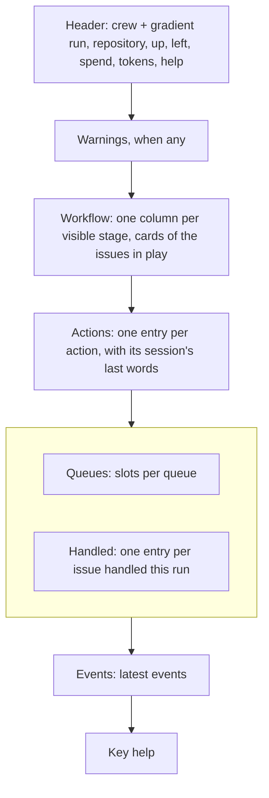
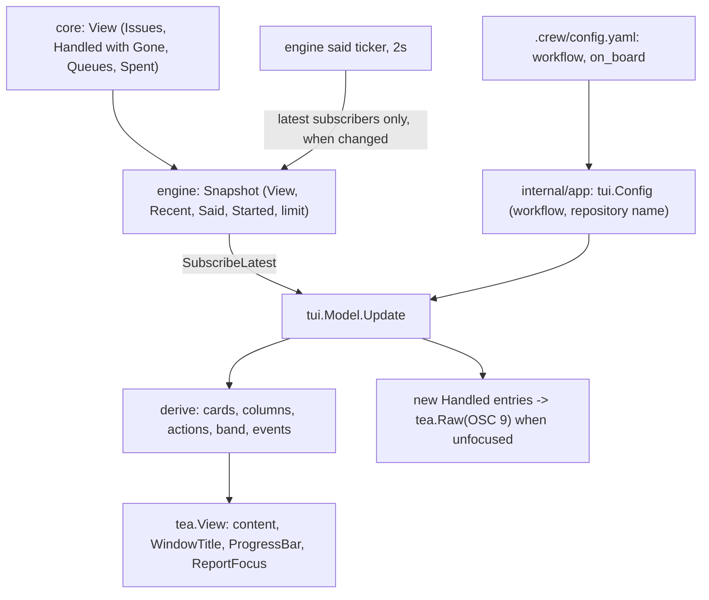
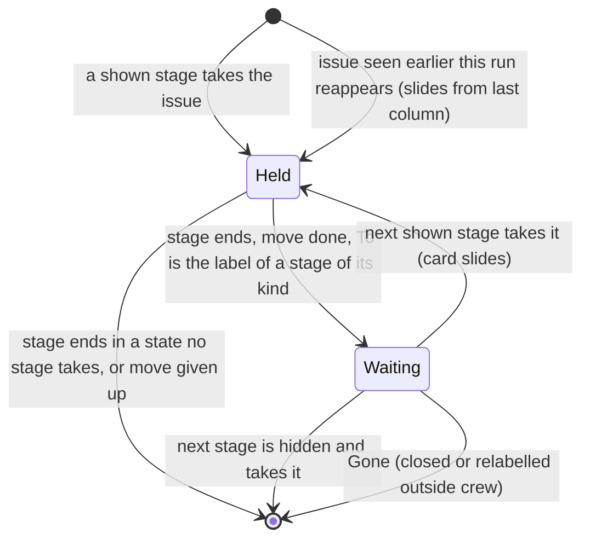
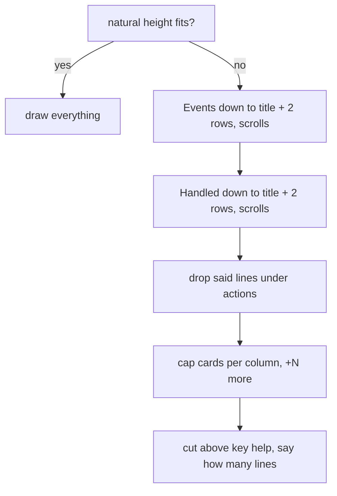

# A live view in Charm's vocabulary - Plan

## Goal Capsule

- **Objective:** while crew runs, the boss can tell at a glance from the terminal what crew is doing, where each issue in play stands in the workflow, what needs them and what it cost, and hears about finished work when the terminal is in the background.
- **Means:** rebuild `internal/ui/tui` with Lip Gloss v2 and Bubbles v2 as one stacked dashboard whose Workflow board is derived from the snapshot and the configured stages (KTD1, KTD3), fed by two small additions below it: a `Gone` mark on handled entries in the core (KTD4) and the sessions' last words in the engine's snapshot (KTD5).
- **Product authority:** the boss, through the brainstorm of #33. The Product Contract below is the body of #33.
- **Open blockers:** none.
- **Execution profile:** one new per-stage config key, one field and one listing rule in the pure core, one ticker and one snapshot field in the engine, then the TUI rewritten across several files, then the docs. No port changes. `--plain` is untouched.
- **Stop conditions:** stop and report if the sessions' last words cannot reach the TUI without stepping the core or flooding the line renderer's queue (KTD5), if Bubble Tea v2.0.10 cannot write a notification sequence between frames (KTD6), or if adding Lip Gloss v2.0.6 and Bubbles v2.2.1 breaks `go test -race ./...` through the forced module upgrades (Risks).
- **Who ships:** the implementer opens one pull request that closes #33. Merging is the boss's.

---

## Product Contract

Product Contract preservation: unchanged, carried from the body of #33, except Outstanding Questions, whose planning questions are now answered by the Planning Contract.

### Summary

The live view becomes one full-width dashboard of stacked sections: a Workflow board, Actions, Queues beside Handled, and Events. It is drawn in the visual vocabulary of Charm's own tools rather than as indented text. The Workflow board has one column per configured stage and shows only the issues crew has in play, and cards slide between columns as issues move. Each running action shows what its session last said. Outside the screen, the terminal's tab title, its tab progress indicator and desktop notifications report crew's state.

### Problem Frame

The live view (`internal/ui/tui`) is what the boss watches while crew runs. Today it is five regions of indented plain text, all at the same weight. A failed issue reads like any other line, the eye has nowhere to land, and nothing shows where an issue sits in the workflow the repository declares. When the terminal is in the background, crew tells the boss nothing.

The TUI depends on Bubble Tea v2 alone. It uses none of the styling, layout and terminal features of Lip Gloss v2 and Bubbles v2, or the parts of Bubble Tea v2 that reach outside the screen.

A first sketch put every section in a bordered panel, a grid in the style of k9s. The boss rejected it as a copy of k9s: the look should come from what the Charm stack offers, as in Charm's own Crush.

### Key Decisions

- **Every section on one screen, stacked full width.** (session-settled: user-directed — chosen over tabs with one section per screen, a sidebar of sections with a main pane, and a main column with a sidebar of run numbers: the boss wants every section visible together.) Governs R1.
- **Charm's own vocabulary, not a grid of boxes.** Sections are titled by a rule rather than enclosed in a border, and states read through icons, spinners and pills. (session-settled: user-directed — chosen over a grid of bordered panels: that look was a copy of k9s.) Governs R3, R4, R5.
- **The board shows only what crew has in play.** (session-settled: user-directed — chosen over a board of every open issue in the workflow read from the tracker: to see everything, the boss goes to the issue tracker.) Governs R9.
- **Columns come from the config; every stage shows by default and each can opt out.** (session-settled: user-directed — chosen over showing only the stages that hold an issue, and over folding the clerk's pass-through stages into arrows between columns.) Governs R8, R12.
- **An issue in a hidden stage leaves the board.** (session-settled: user-directed — chosen over keeping its card on the last visible column with a passing marker.) Governs R13.
- **A card waits in its column between stages, then slides.** Without this, a card would leave the board when its stage ends and come back only at the next poll, so no card would ever be seen moving. (session-settled: user-directed — chosen over leaving the board and re-entering with a slide, and over no motion.) Governs R10, R14.
- **Cards stay short; the per-action detail lives in Actions.** Elapsed time, queue, branch and the session's last words would otherwise show twice. (session-settled: user-approved — proposed in the scoping synthesis and confirmed.) Governs R11, R17.
- **Each running action shows what its session last said.** The core already keeps this line for the status comment, so this extends the engine as well as the TUI. (session-settled: user-directed — chosen over a change to the presentation only, with the line left for another issue.) Governs R18.
- **Read-only, with scrolling.** (session-settled: user-directed — chosen over a view with no scrolling, and over selectable cards with a detail overlay.) Governs R21, R22.
- **The terminal reports crew's state outside the screen.** (session-settled: user-directed — tab title, tab progress and desktop notifications all chosen.) Governs R23, R24, R25.
- **The sketch's colours are the palette.** (session-settled: user-directed — chosen over colour roles whose shades the implementer picks: the boss approved a drawing with these colours.) Governs R27, R28.
- **Hidden stages do not notify.** The clerk's pass-through stages end every few minutes and would flood the boss. (session-settled: user-approved — proposed in the scoping synthesis and confirmed.) Governs R25.

### Requirements

**Screen**

- R1. The live view is one screen that shows every section at once, stacked full width in this order: header, startup warnings, Workflow, Actions, Queues and Handled side by side, Events, and a key-help line.
- R2. The startup warnings stay under the header for as long as crew runs, as today.
- R3. The header is one line: crew's name followed by a run of `╱` in a colour gradient, then the repository, the time up, the time left under the run time limit, the total spend and tokens, and the key for help.
- R4. Each section opens with its title followed by a rule to the window's edge, ending in a muted summary of the section, such as `2 running · 1 waiting`. No section has a border box.
- R5. States read through one consistent vocabulary: a spinner for a running action, an icon for a waiting one, and a pill for how each handled issue ended, in the error colour when it needs attention, the warning colour when its move was given up, and the success colour otherwise (R27).
- R6. Issue and pull request references link to their page on the tracker in terminals that support hyperlinks, and read as plain text elsewhere.
- R7. Colours adapt to a light or a dark terminal background, and the view stays readable without colour (with `NO_COLOR`, or on a terminal without colour support).

**Workflow board**

- R8. The Workflow section is a board with one column per stage in `.crew/config.yaml`, in config order, for whatever workflow the repository declares.
- R9. A column holds a card for each issue crew holds in that stage, whatever its claim. Issues crew has not taken, such as those waiting with a ready label, are not on the board.
- R10. When an issue's stage ends and moves it to a stage's label, its card stays in its column, marked with the label it moved to, until the next stage takes the issue. When it moves to a state that no stage takes, such as a failed or waiting-review label, or its move was given up, the card leaves the board.
- R11. A card shows the issue's reference, its title and its claim, or the label it moved to (R10).
- R12. Each stage has a config key that hides its column from the board. Stages show by default.
- R13. An issue held in a hidden stage has no card. Its actions still show in Actions and its events in Events.
- R14. When an issue that had a card earlier in this run gets a card in another column, the card slides there from its last column in a short animation. The board shows the new state at once; the animation never delays or hides it.
- R15. When the columns do not all fit the window's width, the empty columns drop first, and the board notes how many it dropped. When the columns that hold cards still do not fit, the board scrolls sideways.

**Actions, Queues, Handled, Events**

- R16. Actions, Queues, Handled and Events show the same information they show today (`docs/guide/crew.mdx`, "Run it"), in the vocabulary of R4 and R5.
- R17. Each action entry shows the issue's reference and title, the stage and action, its queue, its state with elapsed time, and its branch.
- R18. Under each running action, one line shows the last thing its session said, cut to the width, with tokens and keys redacted as they are before the status comment.

**Keys**

- R19. `q` and Ctrl-C stop crew as today: the first press asks crew to stop, the second forces it.
- R20. `?` shows the keys over the view and hides them again.
- R21. Handled and Events scroll when they do not fit the height left to them. The key-help line says which keys move focus between them and scroll.
- R22. The view changes nothing outside crew's own process: no key acts on an issue, a pull request, a workspace or a log.

**Outside the screen**

- R23. The terminal's tab title shows crew's state, such as `crew · 2 running · 1 needs attention`.
- R24. In terminals that support a tab progress indicator, it shows activity while actions run and an error state while any handled issue needs attention.
- R25. While the terminal is not focused, crew sends a desktop notification each time an issue ends a stage, saying how it ended. Stages hidden from the board (R12) do not notify.

**Unchanged**

- R26. `--plain` prints the same lines as today.

**Colours**

- R27. Every element takes its colour from one role, and each role has the dark-background value of the sketch:

| Role | Dark value | Used for |
| --- | --- | --- |
| text | `#d8d6e3` | issue titles, event text, values such as spend and tokens |
| title | `#f1effa`, bold | crew's name in the header, section titles |
| muted | `#7d7996` | the header's details, the summary at the end of each rule, the names of empty columns, stage/action in Actions, elapsed times, branches, the session's last line, event times, the key-help line |
| subtle | `#4a4760` | section rules, column underlines, free queue slots, the bar of a card whose issue is not running yet |
| accent | `#b48cff` | the names of columns that hold cards, busy queue slots |
| strong accent | `#6b50ff` | the bar of a running card |
| gradient | `#6b50ff` to `#ff60ff` | the header's `╱` run, left to right |
| success | `#68ffd6` | the running spinner, the green pills |
| warning | `#ffd36b` | the time left, the waiting and taking icons, the label on a waiting card (R10), the amber pills |
| error | `#ff6b8b` | the red pills, the `×` before each failure reason |
| chip | text on `#3a3850` | the queue name in each Actions entry |

- R28. A pill is its role colour as background, with bold text in `#201f2a`. Issue and pull request references are underlined in the muted colour.
- R29. crew does not paint the terminal's background. On a light background each role keeps its meaning with shades that read on light (R7).

### Acceptance Examples

- AE1. **Covers R8, R12, R13.** Given this repository's workflow (promote brainstorm, triage, promote triage, development, fix) with both promote stages hidden, the board has three columns: triage, development and fix. While promote triage runs on #12, #12 has no card, and its `promote` action shows in Actions.
- AE2. **Covers R10, R14.** Given #12 running in triage, when triage succeeds and moves it to `crew:triage:done`, its card stays in the triage column marked `crew:triage:done`. When development later takes #12, the card slides from triage to development.
- AE3. **Covers R10.** Given #5 running in development, when development fails and moves it to `crew:development:failed`, its card leaves the board and #5 shows in Handled as needing attention.
- AE4. **Covers R15.** Given eight visible stages, two holding cards, on an 80-column terminal, the six empty columns drop and the board says six stages are hidden. If two columns still do not fit, the board scrolls sideways.
- AE5. **Covers R25.** Given the terminal is in the background, when triage ends on #12, crew sends one notification. When the hidden promote triage ends on #12, it sends none.
- AE6. **Covers R7.** Given `NO_COLOR` is set, every section is still told apart by its title and rule, and every state by its icon or pill text.

### Scope Boundaries

- Deferred for later: any action from the view (retry, open a log, open an issue), selecting a card, a detail overlay for one issue, mouse input beyond following links, configurable themes.
- Not this view's job: a board of every open issue in the workflow. The issue tracker shows that.
- Not changed: the `--plain` output, and what crew posts on GitHub.

### Dependencies / Assumptions

- Hyperlinks, the tab progress indicator and desktop notifications depend on the terminal. Where one is not supported, the view goes without it and shows no error.
- The Charm v2 stack in use as of 2026-10-03: `charm.land/bubbletea/v2` v2.0.10 (already a dependency), `charm.land/lipgloss/v2` v2.0.6 and `charm.land/bubbles/v2` v2.2.1 (both new).

### Outstanding Questions

**Answered in planning**

- How the TUI gets the stages, their labels and the hide key: KTD1.
- The hide key's name and its place in `docs/guide/crew.mdx`: KTD2, U8.
- How a waiting card learns it will never be taken, and when it leaves: KTD4.
- The minimum column width and sideways scrolling: KTD9.
- The focus and scroll keys: KTD11.
- Whether golden files record colour: KTD12.
- How crew learns the terminal lost focus, and terminals that never report it: KTD6.

### Sources / Research

- Current view and its fit logic: `internal/ui/tui/view.go`. Keys: `internal/ui/tui/model.go`. Golden files: `internal/ui/tui/testdata/`.
- The snapshot the TUI receives: `engine.Snapshot` in `internal/engine/stream.go`, embedding `core.View` from `internal/core/model.go`. `ActionView` has no last-said line, though the core keeps one per running action for the status comment (`internal/core/status.go`).
- What a session last said: the engine reads it through `port.Narrator`, redacts tokens and keys, shortens paths and cuts it (`internal/engine/engine.go`, `said`; `internal/engine/paths.go`, `scrub`).
- Handled entries: `HandledView` carries the issue, stage, the state it moved to, whether the move was given up, and when it ended (`internal/core/model.go`). An issue held again drops out of Handled.
- Stage keys today: `internal/config/validate.go` (`stageDoc`).
- Layering: `.golangci.yml` allows only `internal/ui/tui` to import Bubble Tea. No rule mentions Lip Gloss or Bubbles yet.
- The TUI shares `lines.Plural` and `lines.Text` with the `--plain` renderer (`internal/ui/lines`).
- Live view documentation: `docs/guide/crew.mdx`, "Run it" and "Stop it".
- Earlier live-view plans: `docs/plans/2026-10-02-1437-feat-live-view-handled-history-plan.md`, `docs/plans/2026-10-03-1936-feat-queues-on-screen-plan.md`.
- Charm v2 vocabulary and features: Crush's TUI (header with a gradient `╱` run, ruled section titles, pills, status icons, terminal title and progress, focus-aware notifications); Bubble Tea v2's `tea.View` fields `WindowTitle`, `ProgressBar` and `ReportFocus`; Lip Gloss v2's `Hyperlink`, `LightDark` and `Blend1D`; https://charm.land/blog/v2/.

### Layout

The regions, top to bottom. Queues and Handled share one band.

A directional sketch, on this repository's workflow with every stage shown. Spacing and wording are the implementer's; colours follow R27 to R29.

```text
crew ╱╱╱╱╱╱╱╱╱╱╱╱╱╱╱╱╱╱╱╱ thatsnotmynameio/crew • up 12m • 48m left • $19.86 • 24.1M tokens         ? help

Workflow ──────────────────────────────────────────────────────────────────────── 3 in play · 1 waiting
 promote brainstorm   triage                 promote triage   development           fix
 ──────────────────   ────────────────────   ──────────────   ───────────────────   ───────────────────
                      ▌ #12 Stage labels                      ▌ #1 Add login form   ▌ #2 Flaky stream
                      ▌ ⠋ running                             ▌ ⠋ running           ▌ ◌ taking
                      ▌ #9 Retry the poll
                      ▌ → crew:triage:done

Actions ──────────────────────────────────────────────────────────────────────── 2 running · 1 waiting
 ⠋ #1  Add login form     development/lfg   developer   5m00s   crew/1-lfg
   └ Running go test -race ./internal/core; 2 failures left in model_test.go
 ⠋ #12 Stage labels       triage/triage     clerk       2m10s   crew/12-triage
   └ Recording #12 blocked by #9: both edit internal/config
 ○ #2  Flaky stream       fix/lfg           developer   waiting

Queues ──────────────────── 3 of 5 busy   Handled ──────────────────────────────────────── 3 · $17.04
 clerk       ■    1/1                      NEEDS ATTENTION  #5 Parse the config    development 10m · $0.84
 developer   ■■   2/2                        × tests failed: exited 1: tests fail
 default     □□   0/2                      WAITING REVIEW   #7 Log the poll  PR #45  development 9m · $13.50
                                           DONE             #9 Retry the poll      triage 3m · $2.70

Events ───────────────────────────────────────────────────────────────────────────────────── ↑↓ scroll
 14:25:00 #1 development/lfg started on branch crew/1-lfg
 14:29:50 poll: listed 3 issues, took 2
 14:29:50 triage took #12 "Stage labels" (ready → in progress)

q stop · tab focus · ↑↓ scroll · ? help
```



### Success Criteria

- From one look at the screen, the boss can say what is running, what is waiting, which issues need them and what the run has cost, without reading line by line.
- The view no longer reads as indented text, and does not look like a copy of another tool's panel grid.

---

## Planning Contract

### Key Technical Decisions

- KTD1. **The TUI gets the run's static facts at construction, in one config value.** `tui.New` takes a `tui.Config` holding what it takes today (updates, stop, force, clock, location, warnings) plus the workflow (`[]crew.Stage`, config order) and the repository's name. `internal/app` threads `cfg.Workflow` from `Run` through `run` and `runner` to `renderer`. The repository's name is the base name of the repository root (`o.Root`): nothing in crew knows `owner/name` without a `gh` call, and the root's name is exact for the boss's checkout. The workflow does not ride in `engine.Snapshot`, because it never changes during a run. Governs R3, R8.
- KTD2. **The hide key is `on_board`, a per-stage boolean that defaults to `true`.** It becomes `crew.Stage.OffBoard`, so the zero value shows the stage and every existing `reflect.DeepEqual` on a workflow still holds. The core ignores the field. Only the TUI reads it: for columns (R12), for cards (R13) and for notifications (R25). It is decoded as a `located[bool]` the way `usage_in_status` is, added to `stageDoc`, `stageShape`'s message and `parseStage`. Governs R12, R13, R25.
- KTD3. **Cards are a pure function of the snapshot and the workflow.** A held issue (`IssueView`) whose stage is shown has a card in that stage's column, with its claim. A `HandledView` entry has a waiting card in its own stage's column, marked with `To`, when all of these hold: its move is done (`MoveDone`), `To` is the `Label` of a stage whose `Takes` is the issue's `Kind`, its own stage is shown, and it is not `Gone` (KTD4). Every other issue has no card. This instantiates the Key Decisions on R9, R10 and R13 and inherits their labels. Conflict call-out (session-settled decision, workable): on this repository's workflow, once the hidden promote triage stage takes an issue, the issue has no card until development takes it. Blockers or a full developer queue can hold it in `crew:development:ready` for hours. Handled still shows the promote triage entry with its state, so the boss is not blind. Proceeding as settled. Governs R9, R10, R11, R13.
- KTD4. **The core marks a handled entry `Gone` when a listing no longer finds the issue where its stage left it.** `HandledView.Gone` is set when a listing *requested after the entry's verdict move landed* does not find the issue alone in `To`, and `To` is some stage's `Label` (only those states are listed). A blocked issue stays in its label and stays listed, so its card keeps waiting. An issue found in two crew states counts as gone, since crew skips it. The core keeps a listing generation (a counter bumped by each `ListIssues`, with the generation each entry's move landed in), because `m.listing` is only a bool and a listing in flight when the move lands predates it. No listing runs while every slot is busy or after the run time is up, so nothing is marked then; that is correct, as nothing was observed. Governs R10.
- KTD5. **The engine refreshes the sessions' last words on its own short ticker and puts them in the snapshot.** `engine.Snapshot` gains `Said []core.Said`: what each running session last said, through the same `scrub` and `lastWords` as the status comment. The loop refreshes it every `saidInterval` (2 seconds). When the set changed, it publishes a new update to the latest-wins subscribers only, with no events and without stepping the core. Every publish, these and the ordinary ones, carries the latest `Said`, so a normal step never blanks the line. The ordered queue of `--plain` never receives said-only updates, so they cannot crowd out real events. The core still refreshes its own copy on poll ticks for the status comment, which does not change. The TUI shows a line only under an action in `PhaseRunning`. This instantiates the Key Decision on R18 ("extends the engine as well as the TUI"). A field on `core.ActionView` was rejected: it would only refresh once per poll, 300 seconds by default. Governs R18.
- KTD6. **Notifications come from new Handled entries, sent as OSC 9 between frames while the terminal is unfocused.** On each snapshot, the TUI notifies once for each Handled entry it has not seen before, keyed by issue key, stage and `Ended`, kept in a run-long set. It skips an entry whose stage is hidden (R25), and every entry once the snapshot says a stop was requested, because the boss asked for it and stop-caused failures would flood them. The sequence is `ansi.Notify` from `github.com/charmbracelet/x/ansi`, written through `tea.Raw`, which Bubble Tea flushes before the next frame. `View.ReportFocus` turns on focus reports. The model starts focused and changes on `tea.FocusMsg`/`tea.BlurMsg`, so a terminal that never reports focus never gets a notification and shows no error (Dependencies / Assumptions). Only OSC 9 is sent: kitty without OSC 9 support, Alacritty, and tmux without passthrough show nothing. Accepted gap: the latest-wins subscription can skip a snapshot. An entry that appears and is taken again by the next stage between two received snapshots is never notified. The window is one poll at least, since a take needs a later listing, and the TUI drains updates as they come. Governs R25.
- KTD7. **The tab title and tab progress are functions of the snapshot.** Title: `crew`, then `· N running` (actions not ended and not waiting), `· N waiting`, `· N needs attention` (Handled entries that need attention, hidden stages included), each part only when non-zero; `crew · idle` when none applies; `crew · stopping` once a stop was asked; `crew · winding down` once time is up. Progress: `ProgressBarError` at 100 while any entry needs attention, else `ProgressBarIndeterminate` while any action is not ended, else none. Both are set on `tea.View` (`WindowTitle`, `ProgressBar`), and Bubble Tea resets them on exit. Governs R23, R24.
- KTD8. **Fixed sections take their natural height. Events, then Handled, give rows first.** Order of giving way when the window is short: Events shrinks to its title and two rows, then Handled does the same (both scroll, R21), then the said lines under actions drop, then each board column caps its cards with a `+N more` line, and only then is the view cut above the key-help line, with a line saying how many lines were cut. The key-help line always shows. Queues and Handled share one band side by side at every width: Queues takes its natural width, Handled the rest, and Handled's titles are cut first. Governs R1, R2, R21.
- KTD9. **Columns are at least 18 cells wide, two apart, and spread evenly up to 30.** When the shown stages do not fit, the empty columns drop and the Workflow rule's summary says `N empty stages not shown`. When the columns that hold cards still do not fit, the board shows as many as fit from a column offset, with `◂ N` at the left edge and `N ▸` at the right for the columns off-screen, and `←`/`→` move the offset one column. Labels on waiting cards are cut from the left (`→ …triage:done`), because the end of a crew label tells states apart. Governs R15.
- KTD10. **A slide is a marker that crosses the column underline row; the card itself is already in its new column.** The TUI remembers each issue's last column this run. When a card appears in another column, a slide starts: a short `#12 ▸` marker moves along the underline row from the old column to the new one over 12 frames of 50 ms, with an ease-out. Frame ticks run only while a slide is active. A source column that was dropped or scrolled off starts the marker at that edge. A source column that is now hidden has no position, so that slide starts at the left edge. The model counts frames, so tests step it without a clock. Governs R14.
- KTD11. **Keys.** `q` and `ctrl+c` as today (R19). `?` toggles a help overlay drawn over the view with Lip Gloss's canvas and layers (R20). `tab`/`shift+tab` move focus among Handled and Events, and the board when it scrolls sideways; the focused section's title gets a `▸` before it, so focus reads without colour. `↑`/`↓` (`k`/`j`) scroll the focused section by a row, `pgup`/`pgdown` by a page, `home`/`end` to the ends. `←`/`→` (`h`/`l`) scroll the board whatever has focus. Events follows the newest row until scrolled up, and again once scrolled back to the bottom. The key-help line lists them (R21). No key reaches outside the process (R22). Governs R19, R20, R21, R22.
- KTD12. **Styles are Lip Gloss values built from the palette roles, and golden files store the layout with the escape codes stripped.** One `styles` value holds a style per role in R27, built for a dark or light background. `Init` asks for the background colour (`tea.RequestBackgroundColor`), and the view stays dark until `tea.BackgroundColorMsg` answers. Light shades, proposed under R29 for the boss to correct: text `#2b2938`, title `#16151d`, muted `#6b6785`, subtle `#c9c6d8`, accent `#7a4fd6`, strong accent `#6b50ff`, gradient as dark, success `#0a8f6a`, warning `#9a6a00`, error `#c8264d`, chip text on `#e4e1ef`, pill text `#ffffff`. Lip Gloss always renders truecolor, and Bubble Tea's renderer downsamples per the terminal's profile, `NO_COLOR` included (R7). So golden files hold `ansi.Strip(View().Content)`, which is also AE6's proof: what is left must tell every section and state apart. A few focused tests assert that a span carries its role's colour or a hyperlink. Governs R5, R7, R27, R28, R29, AE6.
- KTD13. **One vocabulary for states.** Actions: the shared spinner for creating, reopening, starting, running, checking and finishing; `○` in warning for waiting. Cards: spinner and `running` or `judging`; `◌ taking` in warning; `! owed` in warning; `■ stopping` in muted; `→ <label>` in warning for a waiting card. Pills: `GIVEN UP` in warning when the move was dropped; `NEEDS ATTENTION` in error when an action failed; otherwise the part of `To` after its last `:` (the whole state when it has none), uppercased, in success. Each failure reason follows on its own line after `×` in error, and a given-up move's reason the same way. Governs R5, R11, R17.
- KTD14. **Every outside string is cleaned before it reaches the terminal.** Issue titles, failure reasons, session words, branch names and event text pass through one helper that strips C0 and C1 control characters and escape sequences and joins whitespace onto one line. The notification body and the window title are also capped at 200 runes. Titles and session text are untrusted, and both reach raw OSC payloads (KTD6, KTD7), where an embedded BEL or ESC would end or hijack the sequence.
- KTD15. **Bubbles for the spinner, key bindings and help; own offsets for scrolling.** One `spinner.Model` animates every running row in step, with its ticks routed to it. `key.Binding` and `help.Model` give the key-help line and the overlay. Scrolling is a small offset type of crew's own, because `viewport`'s default key map clashes with crew's keys and its content model fights the height budget (KTD8). Lip Gloss's `Width`, and `ansi.Truncate`, replace the rune-counting `fit` and `pad`, which miscount styled text.
- KTD16. **Stopping and winding down show in the header and the key-help line.** After the first `q`, the header's last item becomes a `STOPPING` pill in warning and the key-help line reads `q or ctrl+c again forces the exit`. A stop from a signal or the run time limit shows `STOPPING` or `WINDING DOWN` the same way, and the time left goes once time is up. Governs R3, R19.

### High-Level Technical Design

Data flow, from the config and the engine to the terminal.



A card's life on the board (KTD3, KTD4, KTD10).



How a short window gives way (KTD8).



### Assumptions

- The repository name in the header is the repository root's directory name, not `owner/name` (KTD1). The sketch's `thatsnotmynameio/crew` reads `crew`.
- The light-background shades in KTD12 are proposals. R29 asks for shades that read on light and the sketch gives only dark values.
- Notifications use OSC 9 only (KTD6). Terminals that need OSC 99 or OSC 777, and tmux without passthrough, get none.
- No notifications once a stop was requested (KTD6). The boss started the stop and sees its end on screen.
- This repository's `.crew/config.yaml` hides both promote stages, as AE1 describes.
- `recentEvents` grows from 20 to 100, so Events has rows to scroll (R21). The line renderer does not read `Snapshot.Recent`.

### Considered and not built

- **OSC 99 and OSC 777 notifications, and tmux passthrough.** Sending several sequences double-notifies in terminals that read more than one. Evidence that the boss's terminal reads none of OSC 9 would change this.
- **A tracker capability for `owner/name`.** It needs a port interface and a `gh` call at start for one header item. A second user of the repository's full name would change this.
- **Bubbles' `viewport` for Handled and Events.** See KTD15.
- **The alternate screen.** The view stays inline, as today, so the last frame stays in the scrollback after crew exits. A request to clear the screen on exit would change this.
- **An ordered event subscription for notifications.** It would close KTD6's gap, but needs a stage-ended event the core does not have. Notifications missed in practice would change this.

### Risks

| Risk | Mitigation |
| --- | --- |
| Adding Lip Gloss v2.0.6 and Bubbles v2.2.1 upgrades ultraviolet, `x/ansi` (v0.11.7 to v0.11.8), go-colorful, go-runewidth and `x/sync` under Bubble Tea v2.0.10. | U4 bumps them first and runs the whole suite before any view work; a break stops the run (Goal Capsule). |
| Said-only updates change the engine's publish count, and engine tests under `synctest` may count updates. | They go to latest-wins subscribers only and only when the set changes; the fake harness's sessions narrate only when a test asks (`fake.NarratingSession`). |
| A rewritten `view.go` passes 500 lines, or a function passes 50 lines, cyclop 15 or gocognit 15 (`docs/solutions/tooling-decisions/codacy-lizard-and-golangci-lint-limits.md`). | The TUI is split by section into files from the start (U4 to U7); a type switch that confuses Lizard is handled as that learning says. |
| Escape sequences in titles or session words reach the terminal through OSC payloads. | KTD14, with tests that feed BEL and ESC through a title and a said line. |
| The spinner and slide ticks redraw often. | One shared spinner; slide ticks only while a slide runs; the view is rebuilt from a small snapshot. |

---

## Implementation Units

### U1. The `on_board` stage key

- **Goal:** each stage can be hidden from the board with `on_board: false`; stages show by default.
- **Requirements:** R12; KTD2.
- **Dependencies:** none.
- **Files:** `internal/crew/workflow.go`, `internal/config/validate.go`, `internal/config/config_test.go`, `internal/config/config_reject_workflow_test.go`, `.crew/config.yaml`.
- **Approach:**
  1. Add `OffBoard bool` to `crew.Stage`, documented as read only by the live view.
  2. Add `OnBoard located[bool]` to `stageDoc`, the key to the shape message, and set `OffBoard` in `parseStage` when the key is present and false.
  3. Set `on_board: false` on promote brainstorm and promote triage in this repository's `.crew/config.yaml`, and say so in its header comment.
- **Patterns to follow:** `usage_in_status` (`internal/config/config.go`, `TestLoadReadsUsageInStatus`) for the bool; `stageTakes` and `takingStage` for an optional stage key.
- **Test scenarios:**
  - A stage without `on_board` loads with `OffBoard` false.
  - `on_board: true` loads shown; `on_board: false` loads hidden.
  - `on_board: maybe` is refused with `workflow[0].on_board`, its line and the value.
  - The repository's own `.crew/config.yaml` still loads, with both promote stages hidden.
- **Verification:** config tests pass; the stage shape message names `on_board`.

### U2. The core marks handled entries that left their state

- **Goal:** a handled entry says when a later listing no longer finds the issue where its stage left it.
- **Requirements:** R10; KTD4.
- **Dependencies:** none.
- **Files:** `internal/core/model.go`, `internal/core/update.go`, `internal/core/kind.go` or a new `internal/core/gone.go`, `internal/core/gone_test.go`.
- **Approach:**
  1. Add `Gone bool` to `HandledView`, documented with KTD4's rule.
  2. Count listings: bump a generation in `listIssues`, and record on each handled entry the generation current when its verdict move landed (or was given up).
  3. In `listed`, before its early return, for each handled entry not held whose `To` is a stage's `Label` and whose generation is older than this listing's, set `Gone` unless the listing found the issue in exactly that one state.
- **Patterns to follow:** `otherKind` in `internal/core/kind.go` (a per-listing pass over items not held); table tests in `internal/core/*_test.go`.
- **Test scenarios:**
  - An issue moved to the next stage's label and found there by the next listing is not gone.
  - An issue moved there and missing from the next listing (closed or relabelled) is gone.
  - A listing requested before the move landed, whose result arrives after, does not mark the entry gone.
  - A blocked issue still in its label is not gone.
  - An issue found in its label plus another crew state is gone.
  - An entry whose `To` is no stage's label (a failed or waiting-review state) is never marked.
  - An issue taken again drops out of Handled, and its next entry starts not gone.
- **Verification:** core tests pass, with no goroutine, clock or I/O added to the core.

### U3. The sessions' last words in the snapshot

- **Goal:** each snapshot carries what every running session last said, at most a few seconds old.
- **Requirements:** R18; KTD5.
- **Dependencies:** none.
- **Files:** `internal/engine/stream.go`, `internal/engine/engine.go`, `internal/engine/said_test.go`, `internal/engine/snapshot_test.go`.
- **Approach:**
  1. Add `Said []core.Said` to `Snapshot`, and keep the latest set on the engine.
  2. Add a `saidInterval` ticker to the loop. On each tick, compute `said()`; when it differs from the latest set, store it and publish an update without events to the latest subscribers only (a `publishLatest` on the stream).
  3. Have `step` put the latest set in every snapshot it publishes.
  4. Raise `recentEvents` from 20 to 100.
  5. Update the `SubscribeLatest` doc comment.
- **Patterns to follow:** the loop's existing tickers and `synctest` engine tests; `fake.NarratingSession`.
- **Test scenarios:**
  - With a narrating session, a latest subscriber gets a snapshot whose `Said` holds its scrubbed words within `saidInterval`, before any poll tick.
  - A token in the words arrives redacted, and a path arrives shortened.
  - Unchanged words publish nothing on the next said tick.
  - An ordered queue subscriber receives no said-only update.
  - A step after a said refresh carries the same `Said`.
  - Once the session ends, the next refresh drops its words.
  - A snapshot keeps the last 100 events.
- **Verification:** engine tests pass under `synctest` with no leaked goroutine.

### U4. TUI foundations: config, dependencies, styles, text, header and key help

- **Goal:** the TUI is built from a `tui.Config`, styled from the palette, and draws its header, warnings, section rules and key-help line.
- **Requirements:** R2, R3, R4, R6, R7, R27, R28, R29; KTD1, KTD12, KTD14, KTD15, KTD16.
- **Dependencies:** U1.
- **Files:** `go.mod`, `go.sum`, `.golangci.yml`, `internal/app/app.go`, `internal/ui/tui/model.go`, `internal/ui/tui/program.go`, new `internal/ui/tui/styles.go`, `internal/ui/tui/text.go`, `internal/ui/tui/header.go`, `internal/ui/tui/keys.go`, tests `internal/ui/tui/styles_test.go`, `internal/ui/tui/text_test.go`, `internal/ui/tui/header_test.go`, `internal/ui/tui/model_test.go`, `internal/app/app_test.go` where it builds the TUI.
- **Approach:**
  1. Add `charm.land/lipgloss/v2` v2.0.6 and `charm.land/bubbles/v2` v2.2.1, and make `github.com/charmbracelet/x/ansi` direct. Run the whole suite on the bump before anything else.
  2. Extend depguard so only `internal/ui/tui` imports `charm.land/lipgloss` and `charm.land/bubbles`, next to the `bubbletea` rule.
  3. Replace `New`'s parameters with `tui.Config` and thread the workflow and repository name from `internal/app` (KTD1).
  4. Build `styles` for dark and light from the R27 roles and KTD12's light shades; handle `tea.BackgroundColorMsg`.
  5. Add the cleaning helper (KTD14), width-aware fit and pad, the section rule (title, rule to the edge, muted summary, `▸` when focused), the hyperlinked reference (R6, R28), and the pill.
  6. Draw the header: `crew` in title, a gradient `╱` run filling the space, repository, up, left, spend and tokens, `? help`; items drop from the right when narrow; KTD16's pills.
  7. Draw the key-help line from the bindings with `help.Model`.
- **Patterns to follow:** current `top()`, `short()` and `elapsed()` in `internal/ui/tui/view.go`; `lines.Plural`.
- **Test scenarios:**
  - The header at 120 columns reads `crew ╱╱…╱ crew • up 12m • 48m left • $… • … tokens   ? help` once stripped.
  - At 60 columns the header drops tokens, then spend, before the repository.
  - Without a run time limit there is no `left`; after time is up the header shows `WINDING DOWN` and no time left.
  - After the first `q`, the header shows `STOPPING` and the key-help line reads `q or ctrl+c again forces the exit`.
  - A warning shows under the header for as long as the model runs.
  - A title holding ESC, BEL and a newline renders cleaned, on one line.
  - A reference renders an OSC 8 link to its URL, and strips to `#12`.
  - The rule fills the width exactly at 80 and at 120 columns.
  - The pill for each role carries its background colour and bold `#201f2a` text on dark.
  - After `BackgroundColorMsg` with a light colour, the text role uses `#2b2938`.
- **Verification:** `golangci-lint` passes with the new depguard rules; app tests build the TUI through `tui.Config`.

### U5. The Workflow board

- **Goal:** the board shows one column per shown stage, a card per issue in play, waiting cards, column dropping, sideways scrolling and the slide.
- **Requirements:** R8, R9, R10, R11, R13, R14, R15, AE1, AE2, AE3, AE4; KTD3, KTD9, KTD10, KTD13.
- **Dependencies:** U1, U2, U4.
- **Files:** new `internal/ui/tui/board.go`, `internal/ui/tui/slide.go`, tests `internal/ui/tui/board_test.go`, `internal/ui/tui/slide_test.go`, golden files under `internal/ui/tui/testdata/`.
- **Approach:**
  1. Derive cards per KTD3 into columns in config order; within a column, held cards in taken order, then waiting cards by `Ended`.
  2. Lay out columns per KTD9 and draw the header row (accent when holding cards, muted when empty), the underline row, and cards: bar (strong accent when running, subtle otherwise), reference and title, then claim or label (KTD13).
  3. Summarise in the rule: `N in play · M waiting`, plus dropped stages.
  4. On each snapshot, compare each card's column to the remembered one and start slides (KTD10); route frame ticks; draw the marker on the underline row.
- **Patterns to follow:** `byStage` in the current `view.go`, now in config order.
- **Test scenarios:**
  - Covers AE1. With this repository's five stages and both promote stages hidden, the board has three columns, triage, development and fix; while promote triage runs on #12, #12 has no card and its `promote` action shows in Actions.
  - Covers AE2. #12 running in triage, then a snapshot with #12 handled in triage moved to `crew:triage:done`: the card stays in triage marked `→ crew:triage:done`. A later snapshot with development holding #12 puts the card in development at once and starts a slide from triage.
  - Covers AE3. #5 running in development, then handled moved to `crew:development:failed`: no card, and #5 is in Handled as needing attention.
  - Covers AE4. Eight shown stages, two holding cards, at 80 columns: six empty columns drop and the rule says `6 empty stages not shown`; at 30 columns the board shows one column with `1 ▸`, and `→` shows the other with `◂ 1`.
  - A waiting card whose entry is `Gone` leaves the board.
  - A handled entry whose move was given up has no card.
  - A waiting card for a stage that takes the other kind of item has no card.
  - A slide's marker sits at the source column on frame 0, between the columns midway, and is gone after frame 12; no frame tick is scheduled once no slide runs.
  - A slide whose source column was dropped starts at the left edge.
  - No shown stage at all: the board says every stage is hidden.
- **Verification:** golden files for the board at 80 and 120 columns, reviewed as diffs.

### U6. Actions, Queues and Handled, Events, height and keys

- **Goal:** the remaining sections in the new vocabulary, the height budget, focus, scrolling and the help overlay.
- **Requirements:** R1, R5, R16, R17, R18, R19, R20, R21, R22, AE6; KTD8, KTD11, KTD13, KTD15.
- **Dependencies:** U3, U4, U5.
- **Files:** new `internal/ui/tui/actions.go`, `internal/ui/tui/band.go`, `internal/ui/tui/events.go`, `internal/ui/tui/layout.go`, `internal/ui/tui/scroll.go`; `internal/ui/tui/view.go` reduced or removed; `internal/ui/tui/model.go`; tests `internal/ui/tui/actions_test.go`, `internal/ui/tui/handled_test.go`, `internal/ui/tui/queues_test.go`, `internal/ui/tui/events_test.go`, `internal/ui/tui/layout_test.go`, `internal/ui/tui/model_test.go`, golden files.
- **Approach:**
  1. Actions: one entry per action not ended, with icon, reference, title, stage/action, queue chip, state and elapsed time, branch; a resumed one names its workspace; a `└` line with its said words under each action in `PhaseRunning` (R17, R18).
  2. Queues: name, busy slots `■` in accent and free `□` in subtle, `busy/slots`; summary `B of S busy`.
  3. Handled: the current attention-first order, pill, reference, title, stage and duration, spend, pull request; reasons after `×`; summary `N · $spend`. Collapsing gives way to scrolling.
  4. Events: time and `lines.Text` per event, newest at the bottom.
  5. The layout composes the sections (R1) and applies KTD8.
  6. Keys and focus per KTD11; the help overlay over the view.
- **Patterns to follow:** current `actions()`, `actionState()`, `queues()`, `columns`, `reasons`, `pullRequests`, `recent()` in `internal/ui/tui/view.go`; existing helpers in `handled_test.go`.
- **Test scenarios:**
  - Two running actions and one waiting show two spinners and a `○`, with stage/action, queue, elapsed and branch.
  - A running action with said words shows a `└` line cut to the width; the same action in `PhaseChecking` shows none.
  - A resumed action names its workspace.
  - Queues show `■■` and `□□` with `2/2` and `0/2`.
  - Handled puts a failed entry first with `NEEDS ATTENTION` and a `× tests failed: …` line, a given-up move with `GIVEN UP`, and a success with its state's last part.
  - A stage of several actions lists each action's pull request.
  - Events shows the newest rows at the bottom; after `tab` to Events and `↑`, an older row shows; `end` returns to following.
  - At 80×24 with many handled entries, Events and Handled shrink to title plus two rows and scroll, and the view is 24 lines.
  - At 80×12 the said lines drop, then columns cap with `+N more`, then the view is cut with the key-help line kept.
  - `?` shows the help overlay and `?` again hides it.
  - Covers AE6. The stripped golden of a running snapshot tells every section apart by its title and rule and every state by its icon or pill text.
  - `q` asks to stop, a second `q` forces, as today; no key calls anything but `stop` and `force`.
- **Verification:** golden files for running, handled, warning, winding down, resuming and 80×24, regenerated and reviewed.

### U7. Outside the screen: title, progress, focus and notifications

- **Goal:** the tab title and progress follow crew's state, and finished stages notify while the terminal is unfocused.
- **Requirements:** R23, R24, R25, AE5; KTD6, KTD7, KTD14.
- **Dependencies:** U4, U5.
- **Files:** new `internal/ui/tui/outside.go`, `internal/ui/tui/outside_test.go`, `internal/ui/tui/model.go`.
- **Approach:**
  1. Set `WindowTitle`, `ProgressBar` and `ReportFocus` on the `tea.View` per KTD7.
  2. Track focus from `FocusMsg`/`BlurMsg`, starting focused.
  3. On each snapshot, collect new Handled entries per KTD6 and return a `tea.Raw(ansi.Notify(…))` command per entry while unfocused. The body names the stage, the issue and how it ended, cleaned and capped (KTD14). Return them in a `tea.Sequence` ahead of the next `m.wait()`, so the read that finds the closed channel, and with it `tea.Quit`, comes only after every notification was written: Bubble Tea runs a batch's commands concurrently and drops output that arrives after quitting.
- **Patterns to follow:** the command-returning shape of `Model.Update`; `quits(cmd)` in `model_test.go` for inspecting commands.
- **Test scenarios:**
  - Covers AE5. After `BlurMsg`, a snapshot where triage ended on #12 returns one notification command whose sequence is OSC 9 naming triage and #12; a snapshot where hidden promote triage ended on #12 returns none.
  - While focused, a stage end returns no notification.
  - Without any focus message, a stage end returns no notification.
  - The same entry seen in two snapshots notifies once.
  - After `BlurMsg`, a last snapshot with a new entry followed by the closed channel still yields the notification before the model quits (a wind-down's final stage end).
  - Once the snapshot says a stop was requested, no entry notifies.
  - A title with BEL notifies with the BEL removed.
  - The title reads `crew · 2 running · 1 waiting · 1 needs attention`, `crew · idle` with nothing, and `crew · stopping` after a stop; a hidden stage's failure counts as needing attention.
  - Progress is error while an entry needs attention, indeterminate while actions run, and none when idle.
- **Verification:** TUI tests pass; a manual run in a terminal that supports OSC 9 shows a notification when the window is in the background.

### U8. Docs

- **Goal:** the guide and the develop pages describe the new live view, the `on_board` key and the engine's said updates.
- **Requirements:** R26 (unchanged `--plain`, kept in the docs), the repository's "keep it true" rule.
- **Dependencies:** U1 to U7.
- **Files:** `docs/guide/crew.mdx`, `docs/develop/architecture.mdx`.
- **Approach:**
  1. In `docs/guide/crew.mdx`, add `on_board` to the stage-key table after `takes`, and rewrite "Run it" for the dashboard: sections, board and waiting cards, actions with last words, keys, tab title and progress, notifications and their terminal support. Keep the `--plain` example. Check "Stop it" and "Run it for a set time" against KTD16.
  2. In `docs/develop/architecture.mdx`, name Lip Gloss and Bubbles as TUI-only, the said ticker and `Snapshot.Said`, and correct the latest-wins sentence: it loses no state, but the TUI's notifications can miss a short-lived entry.
- **Test expectation:** none -- documentation; `pnpm docs:check` covers links and MDX.
- **Verification:** `pnpm docs:check` passes; every key, label and message quoted matches the code.

---

## Verification Contract

| Gate | Command | Applies to |
| --- | --- | --- |
| Format | `gofmt -l cmd internal tools` prints nothing | every unit |
| Vet | `go vet ./...` | every unit |
| Tests | `go test -race ./...` | every unit; U4 runs it right after the dependency bump |
| Lint and layering | `go run github.com/golangci/golangci-lint/v2/cmd/golangci-lint@v2.14.0 run` | every unit; depguard proves U4's rules |
| Vulnerabilities | `go run golang.org/x/vuln/cmd/govulncheck@v1.8.0 ./...` | U4's new modules |
| Coverage, total | `go test -race -covermode=atomic -coverpkg=./... -coverprofile=coverage.out ./...` then `go run github.com/vladopajic/go-test-coverage/v2@v2.19.0 --config=.testcoverage.yml` (at least 90%) | at the end |
| Coverage, changed lines | `git diff -U0 origin/main...HEAD \| go run ./tools/diffcover -profile coverage.out` (at least 90%) | at the end |
| Golden files | `go test ./internal/ui/tui -update`, then review the diff | U5, U6 |
| Docs | `pnpm docs:check` | U8 |
| Codacy limits | `pnpm exec codacy-analysis analyze --install-dependencies` when available | at the end |

---

## Definition of Done

- Every requirement R1 to R29 is met, and AE1 to AE6 each have a passing test (U5, U6, U7).
- `--plain` prints exactly what it printed before: `internal/ui/lines` is unchanged and its tests pass untouched.
- Every gate in the Verification Contract passes with zero findings.
- The golden files were regenerated and their diffs read; they store stripped layout only.
- `docs/guide/crew.mdx` and `docs/develop/architecture.mdx` match the shipped behaviour.
- No abandoned attempt is left in the diff: no unused helper from the old `view.go`, no commented-out code, no stray test fixture.
- One pull request whose body contains `Closes #33`.
