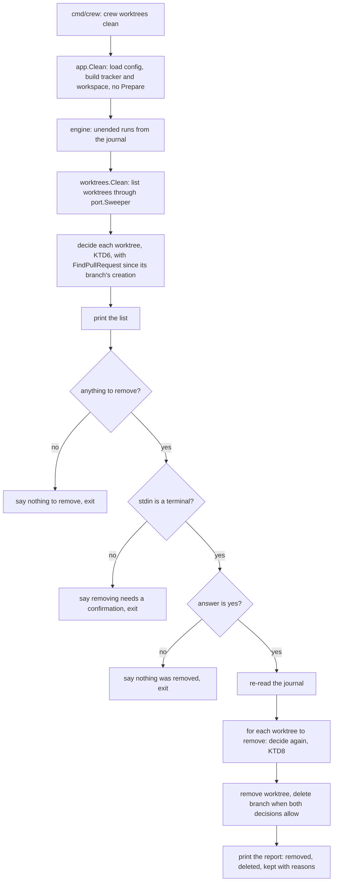

# Clean the worktrees of merged pull requests - Plan

## Goal Capsule

- **Objective:** the boss clears every crew worktree whose work has already landed in one confirmed step, and no worktree that may still matter is lost.
- **Means:** a `crew worktrees clean` command the boss runs by hand. It removes a worktree only when the pull request from its branch is merged, and only after the boss confirms the list it shows (Key Decisions; KTD1).
- **Product authority:** the boss, through the brainstorm of #34. The issue asked for automatic removal behind a config key. The brainstorm replaced that with a manual command and the merged pull request rule. crew itself still never removes a worktree.
- **Open blockers:** none.
- **Execution profile:** two small extensions of existing adapters (the pull request lookup returns its state and head commit; the git workspace lists, inspects and removes its worktrees), one exported journal reader in the engine, a new `internal/worktrees` package holding the rule and the flow, the `app` wiring and the `cmd/crew` subcommand, then the docs.
- **Stop conditions:** stop and report if `gh pr list --json` cannot return `headRefOid` for a merged pull request, or if a removal cannot be made safe without `git worktree remove --force`.
- **Who ships:** the implementer opens one pull request whose body contains the line `Closes #34`. Merging is the boss's.

---

## Product Contract

Product Contract preservation: unchanged, carried from the body of #34.

### Summary

`crew worktrees clean` looks at each worktree crew created and finds the pull request opened from its branch. It lists what it would remove and what it would keep, each with a reason, and asks the boss to confirm. On a yes, it removes the worktrees whose pull request merged, and their local branches when nothing was added after the merge. Every other worktree stays.

### Problem Frame

Each action run leaves a worktree in `.crew/worktrees/` on its own branch, and crew never removes one (`docs/guide/crew.mdx`, the Worktrees section). The boss clears them by hand with `git worktree remove`, one at a time, and has to work out for each one whether it still matters. Once a run's pull request has merged, its work is on the default branch. That worktree is no longer evidence for anything and will not be resumed, but it keeps its disk space, and its branch keeps its name taken. The engine architecture plan deferred removal "when disk use becomes a complaint" (`docs/plans/2026-10-01-2202-feat-crew-engine-architecture-plan.md:186`). This issue is that complaint.

### Key Decisions

- **A command the boss runs, not automatic removal.** Governs R1, R16. (session-settled: user-directed — chosen over removal by crew itself after a configurable wait, set by a `config.remove_worktrees_after_seconds` key: the boss decides when worktrees go, and crew's run loop gains no removal behaviour.)
- **A merged pull request is the only reason to remove a worktree.** Governs R6. (session-settled: user-directed — chosen over "the stage succeeded on the issue": a merged pull request means the work landed, while a successful stage does not, and crew's run journal does not record a stage's success.)
- **Show the list, then ask.** Governs R2, R3, R4, R5. (session-settled: user-directed — chosen over removing straight away with an optional `--dry-run` flag: the boss sees everything before anything is removed.)
- **A worktree with uncommitted work stays.** Governs R7. (session-settled: user-directed — chosen over force-removing it, and over keeping it without saying so.)
- **The local branch goes with the worktree only when nothing was added after the merge.** Governs R11, R12. (session-settled: user-approved — the boss first chose to delete a branch only when its work was safe elsewhere. Under the merged pull request rule, that means the branch has nothing beyond the merged head.)
- **Without a terminal to ask, nothing is removed.** Governs R4. (session-settled: user-approved — a flag that skips the confirmation is deferred until someone needs to run the command unattended.)
- **Worktrees without a pull request stay the boss's to remove.** Governs R6. (session-settled: user-approved — the boss accepted the consequence: in this repository that includes every worktree of `promote brainstorm` and `triage`, and of stages that work on an existing pull request with `--detach`.)

### Requirements

**The command**

- R1. `crew worktrees clean`, run in the repository, considers every worktree crew created under `.crew/worktrees/`, whether or not crew's run journal knows its run.
- R2. Before it changes anything, the command lists each worktree with what it will do: remove the worktree and its branch, remove the worktree and keep its branch, or keep both. Each entry gives its reason.
- R3. After the list, the command asks the boss to confirm. Only an explicit yes removes anything. Any other answer leaves everything as it was.
- R4. When there is no terminal to ask, as under cron or in a script, the command prints the list, removes nothing, and says that removing needs a confirmation.
- R5. A worktree with nothing to remove is not asked about: when no worktree qualifies, the command says so and ends without a question.

**What qualifies**

- R6. A worktree qualifies only when the pull request opened from its branch is merged. A worktree whose pull request is open, closed without merging, or missing stays.
- R7. A worktree with uncommitted changes or untracked files stays with its branch, even when its pull request merged. Files git ignores, such as build output, do not count.
- R8. The command never touches a worktree that an action may still be using, including while crew runs. A worktree whose run has started and not ended stays, with that reason.
- R9. When the command cannot find out whether a worktree's pull request merged, for example because `gh` fails, that worktree stays and the reason gives the error.
- R10. Just before removing each worktree, the command checks it again. One that no longer qualifies stays and is reported. For example, it gained a file or an action started using it after the list was shown.

**The branch**

- R11. The local branch is deleted with its worktree when it has no commits beyond the merged pull request's head.
- R12. A branch with commits beyond the merged head stays, and only its worktree is removed. The reason says so.
- R13. The command never deletes a remote branch and never changes a pull request.

**The result**

- R14. At the end, the command reports each worktree it removed, each branch it deleted, and each one it kept, with the reason.
- R15. The command reads GitHub as the boss, through the boss's own `gh` login.

**Docs**

- R16. The guide and `CONCEPTS.md` say that crew itself never removes a worktree, and point to `crew worktrees clean` as the way to clear the worktrees of merged pull requests. This covers `docs/guide/crew.mdx` (the `--detach` note under the prompt examples, "Start over" under Resume, and the Worktrees section), and the Workspace and Resume entries in `CONCEPTS.md`. The guide documents the command, its rule and what it keeps.

### Actors

- A1. The boss: runs the command, reads the list, confirms or declines.
- A2. crew, the running process: may be working on issues while the command runs, and may create worktrees in the meantime.
- A3. GitHub: says whether a branch's pull request merged.

### Key Flows

- F1. Cleaning up
  - **Trigger:** the boss runs `crew worktrees clean` in the repository.
  - **Actors:** A1, A2, A3
  - **Steps:** the command reads crew's worktrees and finds each one's pull request. It prints the list with a decision and a reason per worktree, then asks. On a yes, it checks each worktree again and removes the ones that still qualify, with their branches when R11 allows. It then prints what it removed and what it kept.
  - **Outcome:** only worktrees whose work landed are gone. Everything kept says why.
  - **Covered by:** R1, R2, R3, R6, R10, R11, R14

### Acceptance Examples

- AE1. **Covers R6, R11.** Given `.crew/worktrees/issue-42-development`, clean, on `crew/issue-42-development`, whose pull request #45 merged with the branch's tip as its head. When the boss runs the command and answers yes, the worktree and the local branch are gone, and the report names both.
- AE2. **Covers R6.** Given a worktree whose pull request is still open, the list shows it kept, naming the open pull request.
- AE3. **Covers R6.** Given `.crew/worktrees/issue-34-triage`, whose branch never had a pull request, the list shows it kept: no pull request.
- AE4. **Covers R7.** Given a worktree whose pull request merged and which holds an untracked `notes.txt`, the list shows it and its branch kept, because of uncommitted files.
- AE5. **Covers R12.** Given a worktree whose pull request merged, and whose branch has one commit made after the merged head, the list shows the worktree removed and the branch kept, and says why.
- AE6. **Covers R3.** Given a list with two worktrees to remove, when the boss answers no, nothing changes.
- AE7. **Covers R4.** Given the command runs from cron with no terminal, it prints the list, removes nothing, and says removing needs a confirmation.
- AE8. **Covers R10.** Given a worktree on the list to remove, when the boss creates a file in it before answering yes, that worktree stays and the report says it changed.
- AE9. **Covers R9.** Given `gh` is not logged in, every worktree stays, each with the lookup error as its reason, and nothing is removed.
- AE10. **Covers R8.** Given crew is running an action in `.crew/worktrees/issue-50-development`, whose earlier pull request merged, that worktree stays: an action may be using it.
- AE11. **Covers R6.** Given a failed action run whose pull request the boss merged anyway, its worktree is removed like any other. A later relabel of that issue starts the action over instead of resuming it, as the guide already describes for a removed worktree.
- AE12. **Covers R5.** Given no worktree qualifies, the command prints the list and says there is nothing to remove, with no question.

### Scope Boundaries

- Automatic removal by crew's run loop, with or without a wait, is not built.
- A flag that skips the confirmation (such as `--yes`) is deferred until someone needs unattended runs.
- Worktrees with no merged pull request, including those of stages that open none, stay the boss's to remove by hand.
- Remote branches, pull requests and issues are never changed.
- How crew keeps and resumes the worktrees of failed runs does not change.
- Cleaning git's records of worktree folders the boss already deleted by hand (`git worktree prune`) is not part of the rule. The command lists such a worktree as kept and names `git worktree prune` (KTD6).

**Considered and not built**

- A lock or pid file that tells a running crew from one that crashed. Without it, a run cut short by a crash or `kill -9` keeps its worktree until the boss removes it by hand, and the reason says so (KTD5). Adding the lock touches the run loop, and crashes are rare: a clean stop writes an `ended` line for every run it stops. Evidence that would change this: crashed runs' worktrees piling up in practice.
- A guard against running the command inside a crew worktree. There the repository root is that worktree, which holds no `.crew/worktrees/`, so the command finds nothing and removes nothing. The first line names the folder it looked in (KTD9), which makes the mistake visible.
- Fetching the pull request's head commit when the local repository lacks it. The branch is kept instead (KTD7), which loses nothing and leaves the boss's repository untouched.

### Dependencies / Assumptions

- crew already finds a run's pull request by branch with `gh pr list --head=<branch> --state=all`, preferring an open one, else the newest closed or merged one created since a given time, and dropping pull requests from forks (`internal/adapter/github/branchpr.go`, `FindPullRequest`). It does not return the state or the head commit yet (U1).
- No crew code removes a worktree or deletes a branch today. `port.Workspace` has only `Create`, and the optional `Reopener` only `Reopen` (`internal/port/port.go`).
- Worktrees are created with `--no-track` from `origin/<default>` (`internal/adapter/git/workspace.go`, `Create`), so a local branch has no upstream to compare with. "Beyond the merged head" (R11) is measured against the pull request's head commit.
- crew's run journal records only a `started` and an `ended` line per action run, with no stage-level event (`internal/engine/journal.go`). A run with `started` and no `ended` is either still running or was cut short by a crash.
- Removing a worktree frees its name only once its branch is gone too (`internal/adapter/git/workspace.go`, `free`). A kept branch means the next run of that action gets a `-2` name, as today.

### Sources / Research

- `docs/guide/crew.mdx`: the `--detach` note under the prompt examples, "Start over" under Resume, and the Worktrees section, which say crew never removes worktrees and how to remove one by hand.
- `CONCEPTS.md`: the Workspace entry (a name is reused only once the earlier workspace and its branch are gone) and the Resume entry (removing a workspace makes the action start over).
- `docs/plans/2026-10-01-2202-feat-crew-engine-architecture-plan.md:186`, `:318`: removal after a stage was considered and not built.
- `internal/core/resume.go`: what counts as a failed run.
- `docs/solutions/integration-issues/moved-repository-unlists-its-worktrees.md`: a folder git does not list may hold the only copy of work; offer `git worktree repair`, never removal.
- `docs/solutions/integration-issues/closing-pull-requests-include-merged-and-foreign-ones.md`: a pull request's number and state only mean something in its own repository, which is why the lookup keeps dropping forks.

---

## Planning Contract

### Key Technical Decisions

- KTD1. **The rule and the flow live in a new package, `internal/worktrees`, reached through `app` and `cmd/crew`.** `cmd/crew` picks `crew worktrees clean` before parsing flags, as it does for `crew mates create`. It calls `app.Clean`, which loads `.crew/config.yaml`, builds the tracker through the registry without calling `Prepare` (Prepare checks and may create labels; the command only reads), builds the workspace through `Options.Workspace`, reads the journal through the engine (KTD5), and runs `worktrees.Clean`. `internal/worktrees` imports only `internal/crew` and `internal/port`, enforced by a new depguard rule. Tests can then drive the whole flow with the fake tracker and the fake workspace through the same registry lookup as production. Rejected: a self-contained package that calls `git` and `gh` itself, as `internal/mates` does. It would copy the worktree-list parser and the pull request lookup rule, and the two copies would drift.
- KTD2. **The existing pull request lookup also returns the state and the head commit.** `crew.PullRequest` gains `State` (open, closed or merged; a new `crew.PullRequestState` whose zero value means unknown) and `Head` (the head commit's id). `FindPullRequest` adds `headRefOid` to its `--json` fields and fills both. Its choice of pull request stays as it is: an open one first, otherwise the newest closed or merged one created at or after `since`, never one from a fork. The engine, the journal and the status comment ignore the new fields. The command needs this exact choice, so reusing it keeps one definition of "the pull request from this branch". A tracker without `port.PullRequestFinder` makes the command an environment error (exit 2) before it lists anything, since no worktree could ever qualify.
- KTD3. **The git workspace gains an optional `port.Sweeper` capability: list, inspect, check ancestry, remove.** Shape (directional): one call lists crew's worktrees with what the rule needs about each, one tells whether a branch tip is the head commit or behind it, and one removes a worktree and, when asked, its branch. The fake workspace implements it from scripted state. Found by type assertion, like `Reopener`, so the engine and its fakes are unaffected.
- KTD4. **A worktree's creation time is the modification time of the `commondir` file in its git admin directory, and it bounds the lookup as `since`.** A name and its branch come back once both are gone, so an old merged pull request from `crew/issue-42-development` would otherwise match a new worktree of the same name. The engine guards this with the action's start time (`internal/core/command.go`, `FindPullRequest.Since`); the command has no action, so it reads when `git worktree add -b` made the worktree and its branch. git writes `<git-dir>/worktrees/<id>/commondir` (found with `git -C <worktree> rev-parse --git-dir`) once at that moment and never again: its time stays the same after commits, `git gc` and `git worktree repair` (checked with git 2.55.0). Rejected: the branch's oldest reflog entry. `git gc` expires every entry of a branch idle past `gc.reflogExpire` (90 days by default), leaving its reflog empty, so the oldest worktrees, the ones the boss most wants gone, could never qualify. When the file cannot be read, the worktree stays with a reason saying crew cannot tell when it was made. A later time can hide the real pull request (the worktree stays) but never matches an older one.
- KTD5. **An unended run is read from the journal by a new exported engine function, and its worktree stays.** The engine owns `.crew/logs/`, so `internal/engine/journal.go` exports a reader that returns, for each workspace name whose latest journal record is `started`, that run's start time. It reuses the existing line parsing. The command reads it once before the list and again before the removals (KTD8). The reason names the start time and says that if crew is not running, the run was cut short, so the boss can remove the worktree by hand (Scope Boundaries). A journal that cannot be read keeps every worktree, with the error as the reason.
- KTD6. **Each worktree gets the first matching decision, local checks before GitHub.** Order:
  1. Its folder is missing, or git lists it as prunable: keep, and name `git worktree prune`.
  2. Its folder exists but git does not list it: keep, and name `git worktree repair` (the moved-repository learning).
  3. HEAD is detached, as in a stage that checked out a pull request with `--detach` or in a rebase: keep, no branch.
  4. The journal shows a run started and not ended in it: keep (R8, KTD5).
  5. It has modified, staged or untracked files that git does not ignore: keep with its branch (R7).
  6. Its creation time is unknown: keep (KTD4).
  7. The lookup fails: keep, with the error (R9).
  8. No pull request, an open one, or one closed without merging: keep, naming it (R6).
  9. Merged: remove the worktree. Delete the branch when its tip is the merged head or behind it (KTD7), otherwise keep the branch and say why (R11, R12).

  Local checks come first because they cost no network call and the reason they give is the one the boss can act on.
- KTD7. **The branch goes only when `git merge-base --is-ancestor <tip> <head>` holds, and is then deleted with `git branch -D`.** `git branch -d` refuses squash-merged branches and branches without an upstream, which every crew branch is (`--no-track`). The ancestry check is the safety `-d` would have given. When the head commit is not in the local repository, the branch stays and the reason says so. The command never fetches. The reason for a branch kept with commits beyond the head gives their count.
- KTD8. **Before each removal the command evaluates that worktree again from scratch and acts only on what both evaluations allow.** It re-reads the journal once before the removals, then runs the KTD6 decision again for each worktree it is about to remove, GitHub lookup included. A worktree that no longer qualifies stays and is reported as changed since the list, with its new reason (R10, AE8). A branch shown as deleted that now has commits beyond the head is kept, and the report says so. `git worktree remove` runs without `--force`, so git itself refuses a worktree that gained files in the last instant, and a refusal is reported as a kept worktree with git's message. A first Ctrl-C, SIGTERM or SIGHUP stops the command before the next removal, never in the middle of one: removals run on a context the signal does not cancel.
- KTD9. **Plain text output, one line per worktree, and a prompt read from standard input.** The command prints the folder it looked in and the count, then one line per worktree with its decision, name and reason, then the question. It asks only when standard input is a terminal (`golang.org/x/term`, which `cmd/crew` already uses). `y` or `yes`, in any case and trimmed, is a yes. Anything else, an empty line or the end of input is a no, and the command prints that nothing was removed. Without a terminal it prints the list and says that removing needs a confirmation at a terminal (R4). With nothing to remove it prints the list and says so, and asks nothing (R5). Directional wording:

  ```text
  4 worktrees in /home/boss/repo/.crew/worktrees:
    remove worktree and branch   issue-42-development   pull request #45 merged
    remove worktree, keep branch issue-43-development   pull request #47 merged; crew/issue-43-development has 1 commit after its head
    keep                         issue-34-triage        no pull request from crew/issue-34-triage
    keep                         issue-50-development   a run started in it at 14:02 and has not ended: an action may be using it
  Remove 2 worktrees and delete 1 branch? [y/N]
  ```

  The exact columns and wording are the implementer's, kept consistent with crew's other messages.
- KTD10. **Exit codes follow crew's convention.** 0 when the command ran to the end and every check, lookup and removal it attempted worked, including a declined answer, no terminal, or nothing to remove. 1 when any worktree was kept because a lookup, a check or a removal failed, or a signal stopped the command. 2 for a wrong argument, no git repository, a config that does not load, a tracker without `port.PullRequestFinder` or a workspace without `port.Sweeper`, or a listing of the worktrees that fails.
- KTD11. **GitHub is read as the boss.** `app.Clean` never calls `Options.Mates`, so the tracker's `gh` runs with the boss's own environment and login, the same as every read crew makes (`internal/adapter/github/gh.go`, `call`) (R15).

### High-Level Technical Design

How one run of the command goes (directional):



### Output Structure

```text
internal/worktrees/
  worktrees.go       Clean: list, ask, re-check, remove, report
  decide.go          the KTD6 rule over one worktree's facts
  render.go          the list, the question and the report as text
  worktrees_test.go  the flow with the fake tracker and workspace
  decide_test.go     table tests of the rule
internal/adapter/git/sweep.go       port.Sweeper over git
internal/adapter/git/sweep_test.go  real git in temporary repositories
internal/app/clean.go               app.Clean
internal/app/app_clean_test.go
cmd/crew/worktrees.go               the subcommand
cmd/crew/worktrees_test.go
```

### Assumptions

- The issue's deferred questions are resolved here as planning decisions: telling a live run from a crashed one (KTD5, with the lock considered and not built), where the command lives (KTD1), exit codes (KTD10), a worktree whose folder is gone (KTD6 step 1), and how the yes is read and what the prompt says (KTD9).
- The command needs a loadable `.crew/config.yaml`, as crew does, because the tracker is built from it (KTD1). A repository whose config is broken fixes it first.
- The journal's `workspace` field holds the worktree's name, the folder under `.crew/worktrees/`, as the journal example in `docs/guide/crew.mdx` shows (`"workspace":"issue-42-development"`).
- A stage that checks out a pull request with `--detach` leaves its worktree detached, so it stays under KTD6 step 3, as the boss accepted for worktrees without a pull request.

### Risks

| Risk | Mitigation |
| --- | --- |
| crew resumes a failed run in a worktree in the instant between the re-check and `git worktree remove`. | The window is milliseconds, and only a relabel of that issue opens it. The worktree is clean and its pull request merged, so its branch, kept or not, holds nothing beyond the merged work (KTD7). |
| `gh pr list` returns at most 100 pull requests per branch. | A crew branch has one or two. The lookup is the engine's own, with the same limit. |
| A copy or restore of the repository that does not keep file times resets `commondir`'s time. | `since` moves later, so such a worktree may show "no pull request" and stay. It never matches an older pull request (KTD4). |
| `internal/adapter/git/workspace.go` and `internal/app/app.go` are near revive's 500-line file limit. | The new code goes in new files: `sweep.go` and `clean.go`. |

---

## Implementation Units

### U1. The pull request's state and head

- **Goal:** the pull request lookup tells whether the pull request merged and which commit was its head.
- **Requirements:** R6, R11, R12 (through KTD2).
- **Dependencies:** none.
- **Files:**
  - `internal/crew/usage.go` (or a new `internal/crew/pullrequest_state.go`), `internal/crew/usage_test.go`
  - `internal/adapter/github/branchpr.go`, `internal/adapter/github/branchpr_test.go`
  - `internal/fake/tracker.go`
- **Approach:**
  1. Add `crew.PullRequestState` (unknown zero value, open, closed, merged) and the `State` and `Head` fields to `crew.PullRequest`, documented like its other fields.
  2. In `FindPullRequest`, request `headRefOid` and map `OPEN`, `CLOSED`, `MERGED` to the new states. An unknown state string leaves the state unknown, which the command treats as not merged.
  3. The fake `PullRequests` already returns a scripted `crew.PullRequest`; it needs no change unless a helper reads better in tests.
- **Patterns to follow:** `ghPullRequest` and its tests in `branchpr_test.go`, which script `gh` output.
- **Test scenarios:**
  - A merged pull request from the branch comes back with state merged and its `headRefOid` as the head.
  - An open one comes back with state open and wins over a newer merged one, as today.
  - A closed one comes back with state closed.
  - A merged pull request from a fork with the same branch name is still dropped.
  - An unrecognised state string comes back as unknown, not merged.
- **Verification:** the engine's tests pass unchanged, and the journal and status comment output are byte-identical.

### U2. The engine reads unended runs

- **Goal:** code outside the engine can learn which workspaces have a run that started and has not ended.
- **Requirements:** R8 (through KTD5).
- **Dependencies:** none.
- **Files:** `internal/engine/journal.go`, `internal/engine/journal_test.go`
- **Approach:** turn the body of `readJournal` into a function of the repository root, keep the method as a thin caller, and export a function that returns workspace name to start time for each workspace whose latest record is `started`. A missing journal returns none, and an unreadable one returns its error, as `readJournal` does.
- **Patterns to follow:** `readJournal` and `record` in `internal/engine/journal.go`.
- **Test scenarios:**
  - A workspace with `started` then `ended` is not returned.
  - A workspace with `started`, `ended`, then `started` again, a resume, is returned with the second start time.
  - A workspace with only `started` is returned.
  - A missing journal returns nothing and no error.
  - A line cut short by a crash is skipped, and the lines around it still count.
- **Verification:** the engine's resume tests pass unchanged.

### U3. The git workspace lists, inspects and removes its worktrees

- **Goal:** the git adapter gives the command every fact KTD6 needs and removes a worktree safely.
- **Requirements:** R1, R7, R10, R11, R12, R13 (through KTD3, KTD4, KTD7).
- **Dependencies:** none.
- **Files:**
  - `internal/port/port.go`
  - `internal/adapter/git/sweep.go`, `internal/adapter/git/sweep_test.go`
  - `internal/fake/workspace.go`, `internal/fake/fake_test.go`
- **Approach:**
  1. Declare `port.Sweeper` and the value it lists in `internal/port/port.go`, next to `Reopener`, with the facts: name, folder, branch (empty when detached), listed by git, prunable or missing, has uncommitted files, branch tip, creation time (zero when unknown).
  2. In `sweep.go`, list from `git worktree list --porcelain` plus the folders under `.crew/worktrees/`, so a folder git does not list is still reported. Reuse `findWorktree`'s parsing and `canonical` from `workspace.go`, generalised to return every entry under the folder.
  3. Uncommitted files: `git status --porcelain` in the worktree, which leaves ignored files out.
  4. Creation time: the modification time of `commondir` in the worktree's git admin directory (KTD4).
  5. Ancestry: `git merge-base --is-ancestor`; a head commit missing locally answers "not behind" without an error the caller has to special-case, or as a distinct result the rule can word (the implementer picks).
  6. Removal: `git worktree remove <dir>` without `--force`, then `git branch -D <branch>` only when asked. Hold the adapter's existing lock around it.
  7. The fake workspace implements `port.Sweeper` from a scripted list and records removals, so `internal/worktrees` tests can script every KTD6 case.
- **Patterns to follow:** `Reopen` and its tests in `workspace_test.go`, which build real temporary repositories with a bare `origin` and isolated git config.
- **Test scenarios:**
  - A worktree made by `Create` is listed with its name, branch, tip and a creation time within the test's run.
  - The creation time is the same after a commit in the worktree and after `git gc` with `gc.reflogExpire=now`.
  - A worktree holding an untracked file is listed with uncommitted files; one holding only an ignored file is not.
  - A worktree whose folder was deleted is listed as missing or prunable.
  - A folder under `.crew/worktrees/` that git does not list is listed as not listed.
  - A detached worktree is listed with no branch.
  - Ancestry: the tip equal to the head, and the tip behind it, both hold; a tip with one more commit does not; a head commit not in the repository is told apart.
  - Removal deletes the folder and git's record and, when asked, the branch; the remote branch in the bare `origin` is untouched.
  - Removal of a worktree that gained an untracked file fails with git's message, and the folder and branch remain.
  - The main checkout and worktrees outside `.crew/worktrees/` are never listed.
- **Verification:** `Create` and `Reopen` tests pass unchanged.

### U4. The rule and the flow

- **Goal:** `internal/worktrees` decides each worktree, prints the list, asks, re-checks, removes and reports.
- **Requirements:** R1 to R12, R14 (through KTD6, KTD8, KTD9, KTD10).
- **Dependencies:** U1, U2, U3.
- **Files:**
  - `internal/worktrees/worktrees.go`, `internal/worktrees/decide.go`, `internal/worktrees/render.go`
  - `internal/worktrees/worktrees_test.go`, `internal/worktrees/decide_test.go`
  - `.golangci.yml` (a depguard rule: `internal/worktrees` imports only `internal/crew` and `internal/port`)
- **Approach:**
  1. `decide.go` holds the KTD6 rule as a pure function over one worktree's facts, the unended runs and the lookup result, returning the decision and its reason.
  2. `worktrees.go` takes the workspace's `port.Sweeper`, the `port.PullRequestFinder`, a function that reads the unended runs, the input, the output, whether the input is a terminal, and a context for stopping. It returns a result `app` maps to an exit code (KTD10).
  3. It reads the answer in a way a signal can interrupt, and runs removals on a context the signal does not cancel (KTD8).
  4. `render.go` words the list, the question and the report (KTD9).
- **Patterns to follow:** the fakes registered as `app` tests do; table tests as in `internal/core`.
- **Test scenarios:**
  - Covers AE1. A clean worktree whose merged pull request's head is its tip: answered yes, the worktree and branch are removed and the report names both.
  - Covers AE2. An open pull request: kept, naming it.
  - Covers AE3. No pull request: kept, "no pull request".
  - Covers AE4. A merged pull request and uncommitted files: kept with its branch, no lookup made.
  - Covers AE5. A merged pull request and a tip one commit past the head: the worktree is removed, the branch kept, and the reason gives the count.
  - Covers AE6. Two to remove, answered `no`: nothing removed, and the report says nothing was removed.
  - Covers AE7. No terminal: the list, no question, nothing removed, and the confirmation line.
  - Covers AE8. A worktree that gains uncommitted files between the list and the yes: kept, reported as changed since the list.
  - Covers AE9. Every lookup fails: every worktree kept with the error, nothing removed, a failure result.
  - Covers AE10. A merged pull request and an unended run in the journal: kept, "an action may be using it".
  - Covers AE11. A worktree whose journal shows a failed `ended` run and whose pull request merged: removed like any other.
  - Covers AE12. Nothing qualifies: the list, "nothing to remove", no question.
  - An empty or missing `.crew/worktrees/`: says there are no crew worktrees, asks nothing.
  - A worktree whose run started between the list and the yes: kept on the re-check.
  - A branch shown for deletion that gained a commit before the yes: worktree removed, branch kept, reported.
  - A removal git refuses: kept with git's message, a failure result, and the other removals still run.
  - The lookup gets the branch and the worktree's creation time as `since`; a worktree with no creation time is kept without a lookup.
  - `Y`, `yes`, ` YES ` are yes; `n`, an empty line and end of input are no.
  - A stop signal while waiting for the answer: nothing removed, a stopped result.
- **Verification:** golangci-lint reports nothing, the new depguard rule included.

### U5. The command

- **Goal:** the boss can run `crew worktrees clean`.
- **Requirements:** R1, R4, R15 (through KTD1, KTD10, KTD11).
- **Dependencies:** U4.
- **Files:**
  - `internal/app/clean.go`, `internal/app/app_clean_test.go`
  - `cmd/crew/main.go`, `cmd/crew/worktrees.go`, `cmd/crew/worktrees_test.go`
- **Approach:**
  1. `app.Clean` loads the config, builds the tracker through the registry, asserts `port.PullRequestFinder` on it and `port.Sweeper` on the workspace, and runs `worktrees.Clean` with the engine's journal reader (U2). It never calls `Prepare` or `Mates`.
  2. In `cmd/crew`, `run` dispatches `worktrees` before parsing flags, as it does `mates`. `runWorktrees` accepts exactly `clean`, finds the root with `repoRoot`, catches SIGINT, SIGTERM and SIGHUP into a context, and passes standard input, standard output, standard error and whether standard input is a terminal.
  3. Update the usage text and the package comment in `cmd/crew/main.go` with the new form and its exit codes.
- **Patterns to follow:** `cmd/crew/mates.go` (`runMates`, `matesExit`) and its tests; `internal/app` tests that build a registry with the fakes.
- **Test scenarios:**
  - `crew worktrees` with no word, with `prune`, or with an extra argument prints the usage and exits 2.
  - Outside a git repository: exits 2 with the message.
  - A repository whose config does not load: exits 2 with the config error.
  - A tracker without `port.PullRequestFinder`: exits 2 and lists nothing.
  - A full run through `app.Clean` with the fakes, answered yes: exits 0 and removes the qualifying worktree.
  - A lookup failure through `app.Clean`: exits 1.
  - The tracker's `Prepare` is never called, and no mate is made to act.
  - `crew --plain` and `crew mates create` still parse as before.
- **Verification:** `go build ./cmd/crew` succeeds, and running the binary in a scratch repository with a merged pull request's worktree removes it after a yes.

### U6. Docs and vocabulary

- **Goal:** the docs say crew never removes a worktree on its own and document `crew worktrees clean`.
- **Requirements:** R16.
- **Dependencies:** U5.
- **Files:**
  - `docs/guide/crew.mdx`
  - `CONCEPTS.md`
  - `AGENTS.md`
  - `docs/develop/architecture.mdx`
  - `README.md`
- **Approach:**
  1. `docs/guide/crew.mdx`: a section on cleaning up worktrees (the command, the rule in R6, what it keeps and why, the confirmation, the exit codes). Point to it from the `--detach` note, from "start over" under Resume, and from the Worktrees section's "crew never removes worktrees".
  2. `CONCEPTS.md`: the Workspace entry says crew never removes a workspace on its own and that `crew worktrees clean` removes the ones whose pull request merged. The Resume entry notes that such a removal makes the action start over.
  3. `AGENTS.md` and `docs/develop/architecture.mdx`: the `cmd/crew` row, a row for `internal/worktrees`, `port.Sweeper` among the optional interfaces, the new layering rule, and a paragraph next to the one on `crew mates create`.
  4. `README.md`: the `internal/` row mentions `worktrees`.
- **Test expectation:** none -- documentation only; `pnpm docs:check` covers links and MDX.
- **Verification:** `pnpm docs:check` passes, and no page still says the only way to remove a crew worktree is by hand.

---

## Verification Contract

| Gate | Command | Applies to |
| --- | --- | --- |
| Tests | `go test -race ./...` | U1-U5 |
| Format | `gofmt -l cmd internal tools` prints nothing | U1-U5 |
| Vet | `go vet ./...` | U1-U5 |
| Lint and layering | `go run github.com/golangci/golangci-lint/v2/cmd/golangci-lint@v2.14.0 run` | U1-U5 |
| Coverage | `go test -race -covermode=atomic -coverpkg=./... -coverprofile=coverage.out ./...`, then `go run github.com/vladopajic/go-test-coverage/v2@v2.19.0 --config=.testcoverage.yml` (total at least 90%) and `git diff -U0 origin/main...HEAD \| go run ./tools/diffcover -profile coverage.out` (changed lines at least 90%) | U1-U5 |
| Vulnerabilities | `go run golang.org/x/vuln/cmd/govulncheck@v1.8.0 ./...` | whole change |
| Docs | `pnpm docs:check` | U6 |

---

## Definition of Done

- AE1 to AE12 each have a named test in `internal/worktrees` (U4), and they pass.
- The git adapter's removal is tested against real git in temporary repositories, including git's refusal of a worktree with untracked files (U3).
- Every gate in the Verification Contract passes with zero findings.
- The engine's journal, status comment and resume behaviour are unchanged (U1, U2).
- The guide, `CONCEPTS.md`, `AGENTS.md`, `docs/develop/architecture.mdx` and `README.md` match the behaviour, per U6.
- No abandoned-attempt code, debug output or unused helper is left in the diff.
