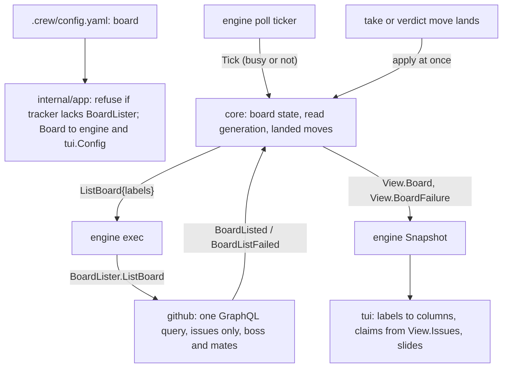
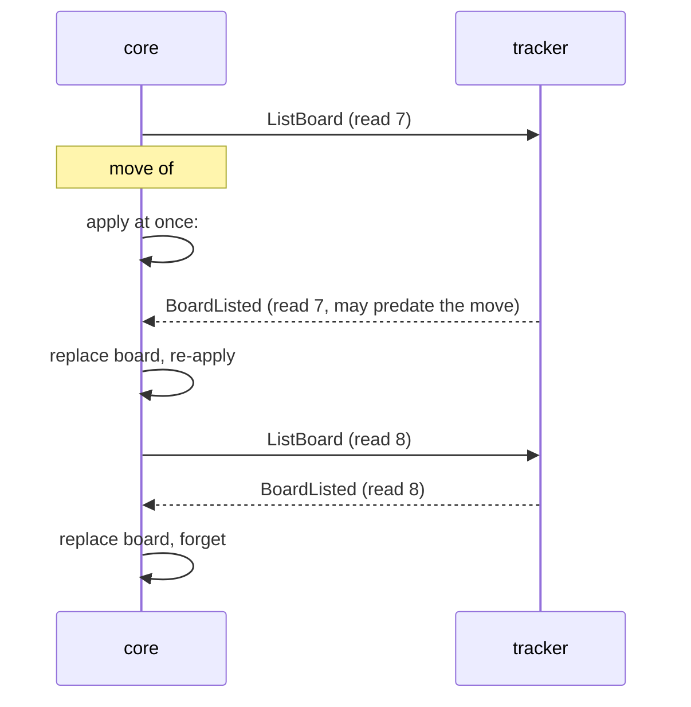

# A board the boss configures - Plan

## Goal Capsule

- **Objective:** while crew runs, the boss sees on the live view's board the issues they care about, such as parked ideas, open bugs and finished work, grouped into columns they chose.
- **Means:** a new top-level `board` key in `.crew/config.yaml` that lists the columns and the labels of each (KTD1), read through a new optional tracker interface (KTD3) by the core at each poll (KTD4).
- **Product authority:** the boss, through the brainstorm of #110. The Product Contract wins on behaviour; the KTDs win on mechanism.
- **Stop conditions:** stop and report when a settled Key Decision proves unworkable, or when a gate in the Verification Contract cannot pass without changing a requirement.
- **Execution profile:** one branch, units in order U1 to U6, one pull request closing #110.
- **Open blockers:** none.

---

## Product Contract

### Summary

`.crew/config.yaml` gets a top-level `board` key: a list of columns, each with a name and one or more GitHub labels. When it is set, the live view's board shows every open issue that carries a column's labels, read from GitHub at each poll, and the stages no longer shape it. When it is not set, the board stays as it is today.

### Problem Frame

The board's columns come from the workflow's stages, and it shows only the issues crew has in play (`docs/guide/crew.mdx`, "Run it"). The boss cannot choose what it shows. Parked ideas waiting in `crew:brainstorm:ready`, open bugs, and finished work waiting for review never reach it. To see them, the boss leaves the terminal for GitHub.

### Key Decisions

- **A configured board lists every open issue with a column's labels.** (session-settled: user-directed — chosen over only the issues crew has in play, the decision of #33, and over the issues crew touched this run: the boss wants columns such as ideas and bugs that crew never takes.) Governs R6.
- **A column names any GitHub label.** (session-settled: user-directed — chosen over only the labels the config already names, which crew could check at load: the boss wants columns such as `bug`.) Governs R3.
- **With `board` set, the board ignores the stages.** (session-settled: user-directed — chosen over keeping `on_board` as a filter on the configured board, over refusing a config with both, and over letting a hidden stage still hide its cards.) Governs R5.
- **`on_board: false` still mutes notifications.** Without it, the clerk's promote stages would notify every few minutes. (session-settled: user-approved — proposed with every stage notifying, and notifications following the board, as alternatives.) Governs R14.
- **An issue shows in every column whose labels it carries.** (session-settled: user-approved — chosen over only the first matching column: a column lists every open issue with one of its labels.) Governs R7.
- **Issues only, no pull requests.** (session-settled: user-directed — chosen over issues and pull requests together, and over a per-column choice like a stage's `takes`.) Governs R6.
- **The board refreshes at each poll.** (session-settled: user-approved — chosen over a refresh interval of its own: no extra GitHub calls between polls.) Governs R9.
- **Cards look as they do today.** (session-settled: user-approved — chosen over reference and title only, and over also showing the issue's labels.) Governs R10, R11.
- **The key is a top-level `board` list.** (session-settled: user-approved — chosen over nesting it as `config.board`.) Governs R1.
- **The board lists the same authors crew lists.** (session-settled: user-approved — proposed after the check found that crew lists only issues opened by the boss and the mates; the boss accepted.) Governs R8.
- **Without `board`, the board is today's.** The issue asked for it; the scoping synthesis named the consequence that `board` changes what a card means, and the boss accepted. (session-settled: user-approved — chosen over making every board label-based.) Governs R4.

### Requirements

**Config**

- R1. `.crew/config.yaml` takes a top-level `board` key: a list of columns, drawn left to right in list order, each with a `name` and `labels`, a list of one or more labels.
- R2. crew refuses to start, as for any config error, when `board` is an empty list, a column has no name or no label, or two columns share a name, and the error names the column.
- R3. A column's labels may be any GitHub label, crew's own or not. crew does not check at load that a label exists on GitHub, so a label no issue carries shows an empty column.
- R4. When the config has no `board`, the board is unchanged: one column per stage, except the stages with `on_board: false`, holding the issues crew has in play.

**What a configured board shows**

- R5. With `board` set, the board's columns are exactly the configured ones. Stages and `on_board` neither add, hide nor order columns.
- R6. A column holds a card for each open issue that carries at least one of its labels. Pull requests never get a card, including those crew gave an issue's label.
- R7. An issue that carries the labels of several columns has a card in each. An issue that carries no column's label has no card, even while crew holds it; its work still shows in Actions.
- R8. The board shows only issues opened by the boss or a mate, the same issues crew takes.
- R9. The board's issues are read from GitHub every `poll_interval_seconds`, including when crew is too busy to take new issues. A move crew makes shows on the board at once; a label changed on GitHub, or an issue closed there, shows after the next read.

**Cards**

- R10. A card shows the issue's reference and title, and crew's claim (`⠋ running`, `◌ taking`, `⠋ judging`, `! owed`, `■ stopping`) while crew holds the issue.
- R11. When an issue's labels move it to another column, its card slides there, as cards slide today.
- R12. A configured board has no waiting card: a card sits wherever the issue's labels put it, and never stays in a column marked `→` and a label.
- R13. A column that does not fit its cards ends in `+N more`, and columns that do not fit the window drop when empty, then scroll sideways, as today.

**Unchanged and documented**

- R14. A stage with `on_board: false` sends no desktop notification, whether or not `board` is set.
- R15. `--plain`, Actions, Queues, Handled and Events are unchanged.
- R16. `docs/guide/crew.mdx` documents the `board` key in its keys and describes the configured board in "Run it", next to today's board.

### Acceptance Examples

- AE1. **Covers R1, R6, R7, R10.** Given a board of `ideas` (`crew:brainstorm:ready`), `bugs` (`bug`) and `done` (`crew:brainstorm:done`, `crew:triage:done`), and #20 open with `bug` and `crew:fix:in progress` while fix runs on it, #20 has one card, in `bugs`, marked `⠋ running`. No column names `crew:fix:in progress`, so #20 has no other card.
- AE2. **Covers R7.** Given the same board, #21 open with both `bug` and `crew:brainstorm:ready` has a card in `ideas` and one in `bugs`.
- AE3. **Covers R9, R11.** Given a board of `triage` (`crew:triage:ready`, `crew:triage:in progress`) and `review` (`crew:development:waiting review`), and #12 in development, when development ends and moves #12 to `crew:development:waiting review`, a card for #12 slides into `review` at once, without waiting for the next poll.
- AE4. **Covers R9.** Given every slot is busy, so crew takes no new issue at this poll, when someone labels #30 `bug` on GitHub, #30 gets a card in `bugs` after the next poll.
- AE5. **Covers R2.** Given a column `bugs` with `labels: []`, crew refuses to start and names `bugs`.
- AE6. **Covers R3.** Given a column whose only label is the typo `bgu`, crew starts and the column is empty.
- AE7. **Covers R8.** Given #40 labeled `bug`, opened by someone who is neither the boss nor a mate, #40 has no card.
- AE8. **Covers R4.** Given this repository's config with no `board`, the board is the one of #33: triage, development and fix columns, holding only the issues crew has in play.
- AE9. **Covers R14.** Given `board` set and the terminal not focused, when promote triage, which has `on_board: false`, ends on #12, crew sends no notification; when triage ends on #12, it sends one.

### Scope Boundaries

- Pull requests on the board.
- Issues opened by anyone other than the boss and the mates.
- Closed issues: a `done` column shows open issues with a done label, not closed ones.
- A refresh interval of the board's own.
- Checking at load that a column's labels exist on GitHub.
- Hiding, ordering or filtering a configured board by stage.
- Any change to `--plain`, Actions, Queues, Handled or Events.

### Outstanding Questions

**Resolved in planning**

- Label case: a column's label matches an issue's label ignoring case, as GitHub does (KTD2).
- Listing open issues by any label: a new optional tracker interface, `port.BoardLister` (KTD3).
- The board read when every slot is busy: the core asks for it on every tick, whether or not it lists for work (KTD4).
- How many issues a column can read: the first 100 open issues per author carrying any of the board's labels, as `List` reads today (KTD3, Risks).
- Slides for an issue with cards in several columns: KTD7.
- The order of a column's cards, and so which ones `+N more` hides: oldest first (KTD6).
- The Workflow section's title and summary on a configured board: KTD8.

### Sources / Research

- Board: `internal/ui/tui/board.go` (`cards`, `waits`, `layout`, `boardRows` with `+N more`).
- Notifications muted by `on_board`: `internal/ui/tui/outside.go:51`.
- `on_board` parsed at `internal/config/validate.go:24` and `:122`, into `crew.Stage.OffBoard` (`internal/crew/workflow.go:36`).
- Top-level keys and strict decoding: `internal/config/config.go:77-84`, `internal/config/decode.go:80-86`.
- Tracker: `port.Tracker.List` (`internal/port/port.go:47-54`) carries only crew states. The GitHub adapter's query filters by label and author, the first 100 per author (`internal/adapter/github/tracker.go:85-95`, `:205-211`, `:434`).
- Poll: `internal/engine/engine.go:198` (ticker), `internal/core/update.go:93-96` (listing skipped when every slot is busy), `internal/core/update.go:112-121` (only the stages' labels are listed).
- Pull requests get their issue's crew label: `internal/adapter/github/pullrequest.go:57`, `:165`; `docs/guide/crew.mdx:10`.
- Board docs: `docs/guide/crew.mdx:144` (`on_board`), `:591` (the board), `:613` (notifications).
- The board's design and the in-play decision this plan reverses: `docs/plans/2026-10-03-2217-feat-live-view-dashboard-plan.md`.

**Product Contract preservation:** Product Contract unchanged. Only Outstanding Questions changed: the questions deferred to planning are answered by the KTDs below.

---

## Planning Contract

### Key Technical Decisions

- KTD1. **`board` becomes `config.Config.Board`, a list of `crew.BoardColumn` (name and labels).** A new `internal/crew` type, because config, core, engine and TUI all read it, and `crew` imports nothing of crew's. `board` joins `document` as a raw node, parsed like `extra_labels`, with every error reported together. Each error names the column by its path and, when it has one, its name: `board[1].labels (line 12): column "bugs" must list one or more labels`. Column names compare exactly. An empty label string is refused as an empty state is. The top-level error message that lists the keys gains `board`. Governs R1, R2, R3.
- KTD2. **Config gives every board label one spelling, and everything after config compares exactly.** A board label that equals a workflow state or an extra ignoring case takes that spelling. Any other label takes the spelling it first has in `board`, in column order. A label written twice in one column counts once. The GitHub adapter matches labels ignoring case and returns them in the asked spelling (KTD3), so the core and the TUI compare strings exactly. This mirrors `spellOnce` and the adapter's `labels.stateOf`.
- KTD3. **A new optional tracker interface, `port.BoardLister`, lists the board's issues.** `ListBoard(ctx, labels)` returns the open issues opened by the boss or a mate that carry any of `labels`, never a pull request, each with the subset of `labels` it carries. The return type is a new `crew.BoardIssue` (a `crew.Issue` and its board labels). `port.Tracker.List` stays crew-states-only, because its contract ("carries nothing that is not a crew state") is what the core's take logic relies on. The GitHub adapter reuses `issuesQuery`, without the pull-request field, and `authors`: one GraphQL call, at most 100 issues per author, oldest first. crew refuses to start, with exit code 2, when `board` is set and the tracker does not implement `BoardLister`. Governs R6, R8.
- KTD4. **The core owns the board's issues: a `ListBoard` command on every tick, and moves applied as they land.** With the `ListingBoard` option, the core sends `ListBoard` on each tick while no board read is outstanding and crew is not stopping. The tick sends it whether or not every slot is busy, and after the run time is up. `BoardListed` replaces the board, and `BoardListFailed` keeps the last one and records the reason. When a held issue's take or verdict move lands, the core applies it to the board at once. The issue loses every crew label (workflow states and extras, as `Tracker.Move` removes them) and gains the move's target, if a column names it. An issue crew moved into a board label that was not on the board joins it from the core's held copy, unless it is a pull request. The core numbers board reads like listings (KTD4 of #33). A read requested before a move landed may return stale labels. This is the common case, not a rare race: the tick that lists for work also reads the board, so a take move usually lands while that read is in flight. After replacing the board the core re-applies the moves that landed at or after that read was requested, and forgets the older ones. `View` gains `Board []crew.BoardIssue` and `BoardFailure string`. The engine is the other candidate owner, but it has no workflow knowledge and its tests run under `synctest`; the core's table tests can pin AE3 directly. Governs R9, R11.
- KTD5. **A board read failure shows in the Workflow summary, not as an event.** The summary adds `· board not read` in warning while `BoardFailure` is set, and drops it after the next successful read. A new event would print a line in `--plain` and a row in Events, which R15 keeps unchanged.
- KTD6. **A column's cards go oldest first, by `Created` and then key.** The order stays stable from one read to the next, a queue column such as `triage` reads top-down in the order crew takes it, and the tracker returns issues in that order. `+N more` therefore hides the newest issues of a long column.
- KTD7. **A slide pairs the columns an issue left with the columns it entered.** The board remembers each issue's last non-empty set of columns this run, as today's board remembers its last column even after the card leaves. When the issue shows in a new set, the k-th column it entered (in board order) gets a slide from the k-th column of its remembered set that it is no longer in. An issue with no card in between slides from its remembered columns, as #12 does in AE3 after development held it without a card. Unpaired entered columns just show the card. Unpaired left columns just lose it. An issue in one column before and after slides exactly as today. A new slide for an issue replaces that issue's running slides. Governs R11.
- KTD8. **The section keeps its title, Workflow, and its summary counts issues.** On a configured board the summary reads `N issues` (distinct issues with a card), then `· N empty columns not shown` when columns drop, then `· board not read` (KTD5). Before the first read it reads `0 issues`. The default board's summary and its `every stage is hidden` line do not change. Governs R13.
- KTD9. **The TUI picks the board's mode once, from `tui.Config.Board`.** With no columns, every board function behaves as today, by workflow index. With columns, a column is an index into `Board`, every column is shown, and the cards come from `View.Board`. A card's claim is the claim of the held issue with the same key, if crew holds it. A card whose issue crew does not hold draws its second row as the subtle bar alone, with no marker or text, so every card keeps two rows; `card` carries whether it is held, because `core.Claim`'s zero value is `ClaimTaking`. There are no waiting cards. Notifications stop reading the board's `shown` and check the stage's `OffBoard` directly, so a configured board cannot change which stages notify. Governs R4, R5, R7, R10, R12, R14.

### High-Level Technical Design

Where the board's issues come from (KTD3, KTD4, KTD9).

How a board read and a move meet (KTD4).

### Assumptions

- The board reads the same authors as `List`: the boss's logins and the configured mates' logins (R8).
- Moves made by a session's own `gh issue edit`, such as the brainstorm prompt's, are not crew's moves. They show after the next read (R9).
- The board is read on every tick, including after the run time is up (the wind-down), and stops being read only once a stop has started, as the work listing does.
- This repository's `.crew/config.yaml` gets no `board` (AE8).

### Considered and not built

- **Paginating past 100 issues per author.** One call per poll matches `List`, and a column that long already ends in `+N more`. A boss with more than 100 open issues of their own on the board's labels would change this.
- **A refresh of the board between polls.** Out of scope (Scope Boundaries).
- **Checking at load that a column's labels exist on GitHub.** Out of scope (R3).

### Risks

| Risk | Mitigation |
| --- | --- |
| A read that predates a landed move shows the card back in its old column until the next read. | KTD4's re-application after each read, pinned by a core test of AE3's interleaving. |
| More than 100 open issues per author on the board's labels drop the newest ones silently. | Documented in the guide's Limits; KTD6 already hides the newest first in a long column. |
| `board.go`, `slide.go` or `update.go` pass Codacy's or golangci-lint's size and complexity limits (`docs/solutions/tooling-decisions/codacy-lizard-and-golangci-lint-limits.md`). | The core's board logic goes in a new `internal/core/board.go`; the TUI's configured-board helpers in their own file if `board.go` grows past the limits. |
| GitHub's issues `labels` filter might fail the query, rather than match nothing, when an asked label does not exist in the repository (AE6). `List` never meets this, because `Prepare` creates its labels, and the scripted-`gh` tests cannot catch it. | U2's implementer runs the board query once against this repository with a label that does not exist; if GitHub fails it, the adapter drops the labels the repository lacks before querying, read from the `label list` that `Prepare` already makes. |
| The GitHub query ORs the label filter and could return an issue carrying none of the asked labels' exact spelling. | The adapter keeps only the labels it matches ignoring case, and drops an issue with none. |

---

## Implementation Units

### U1. The `board` key

**Goal:** `.crew/config.yaml` takes a top-level `board`, validated and respelled, exposed as `config.Config.Board`.

**Requirements:** R1, R2, R3; KTD1, KTD2.

**Dependencies:** none.

**Files:**
- `internal/crew/board.go` (new: `BoardColumn`, `BoardIssue`, and a helper listing a board's labels once, in column order)
- `internal/config/config.go` (`document.Board`, `Config.Board`, the top-level key message)
- `internal/config/board.go` (new: decode and validate `board`)
- `internal/config/config_board_test.go` (new)

**Approach:**
1. Decode `board` as a sequence of `{name, labels}` items, reusing `decodeItem` and `located`, with a shape message like `extraShape`.
2. Validate per KTD1, collecting every error.
3. Respell per KTD2 against the parsed workflow and extras; with an invalid workflow, check `board` on its own, as `extraLabels` does.

**Patterns to follow:** `extraLabels` and `extraLabel` in `internal/config/validate.go`; `spellOnce` for the respelling.

**Test scenarios:**
- A board of three columns decodes into `Config.Board` in file order with their labels.
- No `board` key leaves `Config.Board` nil.
- Covers AE5. A column `bugs` with `labels: []` fails, and the error names `board[1].labels` and `bugs`.
- A column without `labels`, one without `name`, and one with an empty label string each fail with their path.
- `board: []` fails, saying the board must list one or more columns.
- Two columns named `bugs` fail, naming the second and the first.
- `board` that is a mapping, and a column that is a string, fail with the shape message.
- Covers AE6. A column whose only label is `bgu` loads.
- A column label `Crew:Triage:Ready` takes the workflow's spelling `crew:triage:ready`, and `BUG` in a later column takes the first column's `bug`.
- A label written twice in one column appears once.
- Errors in `board` and in `workflow` are reported together.

**Verification:** `go test -race ./internal/config` passes, and loading this repository's own config still succeeds with a nil board.

### U2. Listing the board's issues on GitHub

**Goal:** the GitHub tracker and the fake tracker implement `port.BoardLister`.

**Requirements:** R6, R8; KTD2, KTD3.

**Dependencies:** U1 (for `crew.BoardIssue`).

**Files:**
- `internal/port/port.go` (`BoardLister`, and the package doc's list of optional interfaces)
- `internal/adapter/github/tracker.go` (`issuesQuery` without the pull-request field, `ListBoard`, compile-time guard)
- `internal/adapter/github/board_test.go` (new)
- `internal/fake/tracker.go` (`ListBoard`, and a way to give an issue labels that are not crew's, such as `SetLabels`)
- `internal/fake/tracker_test.go`

**Approach:**
1. Make `issuesQuery` and `issuesArgs` take whether to read pull requests; `List` keeps reading them.
2. `ListBoard` reads `authors`, runs the query with the board's labels, dedupes issues across authors, keeps each issue's labels that match an asked label ignoring case, in the asked spelling, and sorts by `Created`.
3. The fake returns its open issues of kind issue whose states, extras or other labels match, ignoring case.

**Patterns to follow:** `Tracker.List` and its scripted-`gh` tests in `internal/adapter/github/tracker_test.go`.

**Test scenarios:**
- The query has one issues field per author, no `pullRequests` field, and the board's labels as `labels[]` arguments.
- An issue carrying `Bug` and `crew:fix:in progress`, asked for `bug`, comes back with labels `[bug]`.
- An issue in two authors' lists comes back once.
- Covers AE7. Only the boss's and the mates' logins are passed as authors, so an issue another person opened never reaches the reply.
- The reply's issues come back oldest first.
- A `gh` failure returns an error naming the board read.
- Before `Prepare`, the author is gh's login, as in `List`.
- The fake skips pull requests and closed issues, and matches a label set with `SetLabels` ignoring case.

**Verification:** `go test -race ./internal/adapter/github ./internal/fake` passes; `List`'s existing tests pass unchanged.

### U3. The core keeps the board

**Goal:** with `ListingBoard`, the core reads the board each tick, applies crew's moves at once, and shows the board in `View`.

**Requirements:** R6, R7, R9, R11; KTD4.

**Dependencies:** U1.

**Files:**
- `internal/core/board.go` (new: the option, board state, the read generation, applying a move)
- `internal/core/command.go` (`ListBoard`)
- `internal/core/input.go` (`BoardListed`, `BoardListFailed`, their stamping)
- `internal/core/model.go` (`View.Board`, `View.BoardFailure`)
- `internal/core/update.go` (the tick, `runInput`, and the hook where a take or verdict move lands)
- `internal/core/board_test.go` (new)

**Approach:**
1. `ListingBoard(labels, crewLabels)` stores the board's labels and crew's labels (workflow states plus extras).
2. `tick` asks for a board read before its busy check, unless one is outstanding or crew is stopping.
3. `taken` and the verdict branch of `callResult` call one board helper with the held issue and the move's target.
4. `View` clones the board, in KTD6's order.

**Patterns to follow:** the listing generation and `landed` of `internal/core/gone.go` (KTD4 of #33); options in `internal/core/model.go`.

**Test scenarios:**
- The first tick sends `ListIssues` and `ListBoard` with the board's labels.
- Without the option, no tick sends `ListBoard`.
- Covers AE4. With every slot busy, a tick sends `ListBoard` and emits `PollSkipped`, and the next `BoardListed` holding #30 with `bug` puts #30 on `View.Board`.
- A tick while a board read is outstanding sends no second `ListBoard`.
- A tick after the run time is up still sends `ListBoard`; a tick while stopping does not.
- Covers AE3. With #12 held by development and a board read outstanding, the verdict move to `crew:development:waiting review` landing puts #12 on the board with that label at once. The outstanding read then returns #12 without it, and #12 keeps the label. The next read without it removes it.
- A take move from `crew:triage:ready` to `crew:triage:in progress` replaces the first label with the second on the board.
- An issue carrying `bug` and `crew:fix:ready` keeps `bug` when crew moves it to `crew:fix:in progress`, which no column names.
- A move removes a board label that is an extra, such as `crew:brainstorm:ready`.
- A pull request's move never adds it to the board.
- `BoardListFailed` keeps the last board and sets `BoardFailure`; the next `BoardListed` clears it.

**Verification:** `go test -race ./internal/core` passes; the existing core tests pass unchanged.

### U4. The engine and the app wire the board

**Goal:** the engine runs `ListBoard` through the tracker, and the app refuses a board the tracker cannot list and passes the board on.

**Requirements:** R2, R5, R9; KTD3, KTD4.

**Dependencies:** U2, U3.

**Files:**
- `internal/engine/engine.go` (`Config.Board`, `Config.Extras`, the `ListingBoard` option when the tracker is a `BoardLister`)
- `internal/engine/exec.go` (run `ListBoard` within `callTimeout`, post the result)
- `internal/engine/board_test.go` (new)
- `internal/app/app.go` (the capability check at build, the board to the engine and to `tui.Config`)
- `internal/app/app_test.go` or `internal/app/app_startup_test.go`

**Approach:** the check runs in `build`, after the registry built the tracker, and its error is a config error, exit 2. The engine passes `crew.WorkflowStates` plus `Config.Extras` as crew's labels.

**Patterns to follow:** `list` in `internal/engine/exec.go`; the optional-interface detection in `engine.New`; existing startup refusals in `internal/app/app_startup_test.go`.

**Test scenarios:**
- Under `synctest`, with the fake tracker and a board, the first update's snapshot has the board's issues after the read, and each poll interval reads again.
- A failing `ListBoard` gives a snapshot with `BoardFailure` set and crew keeps running.
- Without a board, the fake tracker is never asked for `ListBoard`.
- `app.Run` with a board and a tracker without `BoardLister` exits 2 and names the tracker.
- `app.Run` with a board and the fake tracker starts.

**Verification:** `go test -race ./internal/engine ./internal/app` passes.

### U5. The live view draws a configured board

**Goal:** the TUI draws the configured columns from `View.Board`, keeps today's board without one, and keeps notifications on `on_board`.

**Requirements:** R4, R5, R7, R10, R11, R12, R13, R14, R15; KTD5 to KTD9.

**Dependencies:** U1 (types); U3 (`View.Board`) for the snapshots the tests build.

**Files:**
- `internal/ui/tui/model.go` (`Config.Board`)
- `internal/ui/tui/board.go` (column count, names and shown by mode; cards from `View.Board`; summary)
- `internal/ui/tui/slide.go` (memory of column sets, KTD7; `columnX` by mode)
- `internal/ui/tui/outside.go` (notifications check `OffBoard`)
- `internal/ui/tui/board_test.go`, `internal/ui/tui/slide_test.go`, `internal/ui/tui/outside_test.go`, `internal/ui/tui/view_test.go`
- `internal/ui/tui/testdata/` (new golden files for a configured board)

**Approach:** keep the default board's code path intact and add the configured one beside it, chosen per KTD9. `layout`, `boardRows` and `cardLines` stay shared: a configured card is never waiting, and an unheld one draws no claim (KTD9).

**Patterns to follow:** the existing board and slide tests and goldens; `helpers_test.go` for building snapshots.

**Test scenarios:**
- Covers AE1. Board `ideas`, `bugs`, `done`; #20 with `bug` and `crew:fix:in progress`, held by fix and running: one card, in `bugs`, marked running.
- Covers AE2. #21 with `bug` and `crew:brainstorm:ready` has a card in `ideas` and in `bugs`.
- An issue on no column's label has no card while crew holds it, and its actions still show in Actions.
- Columns are drawn in config order, including empty ones when they fit, and stages with `on_board: false` change nothing.
- Cards in a column go oldest first; a column with more cards than fit ends in `+N more` hiding the newest.
- A narrow window drops empty configured columns with `N empty columns not shown`, then scrolls with `◂ N` and `N ▸`.
- The summary reads `2 issues` for two issues with three cards, and adds `board not read` while `BoardFailure` is set.
- An unheld card next to a held running card shows its reference and title, then the bar alone, with no `◌ taking`.
- Covers AE3. #12 shows in `triage`, then has no card while development holds it, then shows in `review`: one slide starts from `triage` to `review`.
- An issue that enters `bugs` and leaves nothing gets no slide; one in two columns that moves out of one gets none.
- Covers AE8. Without `board`, the existing board goldens pass unchanged.
- Covers AE9. With `board` set and the terminal unfocused, a promote triage end sends no notification and a triage end sends one.

**Verification:** `go test -race ./internal/ui/tui` passes; the new goldens were written with `-update` and their diffs read; `internal/ui/lines` is untouched.

### U6. Docs

**Goal:** the guide and the contributor docs describe the board key and the configured board.

**Requirements:** R16.

**Dependencies:** U1 to U5.

**Files:**
- `docs/guide/crew.mdx` (the `board` key in Keys with an example, the configured board in "Run it", the refusals in "When crew refuses to start", the 100-per-author read in Limits)
- `docs/develop/architecture.mdx` (`BoardLister` in the port table and the optional interfaces; the core's board read)
- `AGENTS.md` (`BoardLister` in the `internal/port` line)

**Approach:** follow the guide's existing voice; keep `{` and `<` in backticks (MDX).

**Test scenarios:** Test expectation: none -- documentation only; `pnpm docs:check` validates links and MDX.

**Verification:** `pnpm docs:check` passes and every statement matches the shipped behaviour.

---

## Verification Contract

| Gate | Command | Applies to |
| --- | --- | --- |
| Format | `gofmt -l cmd internal tools` prints nothing | every unit |
| Vet | `go vet ./...` | every unit |
| Tests | `go test -race ./...` | every unit |
| Lint and layering | `go run github.com/golangci/golangci-lint/v2/cmd/golangci-lint@v2.14.0 run` | every unit |
| Vulnerabilities | `go run golang.org/x/vuln/cmd/govulncheck@v1.8.0 ./...` | at the end |
| Coverage, total | `go test -race -covermode=atomic -coverpkg=./... -coverprofile=coverage.out ./...` then `go run github.com/vladopajic/go-test-coverage/v2@v2.19.0 --config=.testcoverage.yml` (at least 90%) | at the end |
| Coverage, changed lines | `git diff -U0 origin/main...HEAD \| go run ./tools/diffcover -profile coverage.out` (at least 90%) | at the end |
| Golden files | `go test ./internal/ui/tui -update`, then review the diff | U5 |
| Docs | `pnpm docs:check` | U6 |
| Codacy limits | `pnpm exec codacy-analysis analyze --install-dependencies` when available | at the end |

---

## Definition of Done

- Every requirement R1 to R16 is met, and AE1 to AE9 each have a passing test (U1 to U5).
- `--plain` prints exactly what it printed before: `internal/ui/lines` is unchanged and its tests pass untouched.
- Without `board`, the existing board and notification tests and goldens pass unchanged.
- Every gate in the Verification Contract passes with zero findings.
- `docs/guide/crew.mdx`, `docs/develop/architecture.mdx` and `AGENTS.md` match the shipped behaviour.
- No abandoned attempt is left in the diff: no unused helper, no commented-out code, no stray fixture.
- One pull request whose body contains `Closes #110`.
