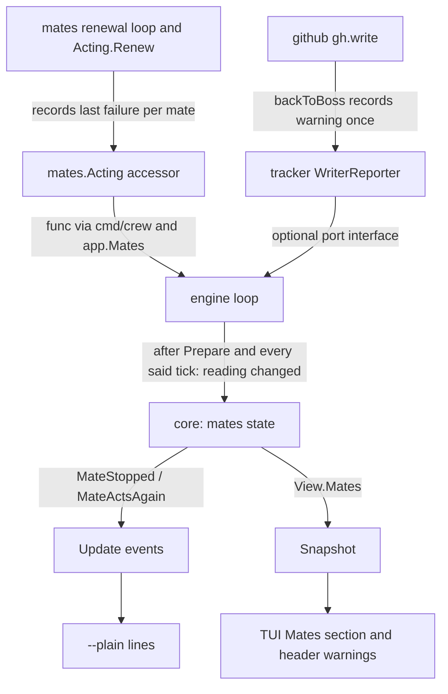
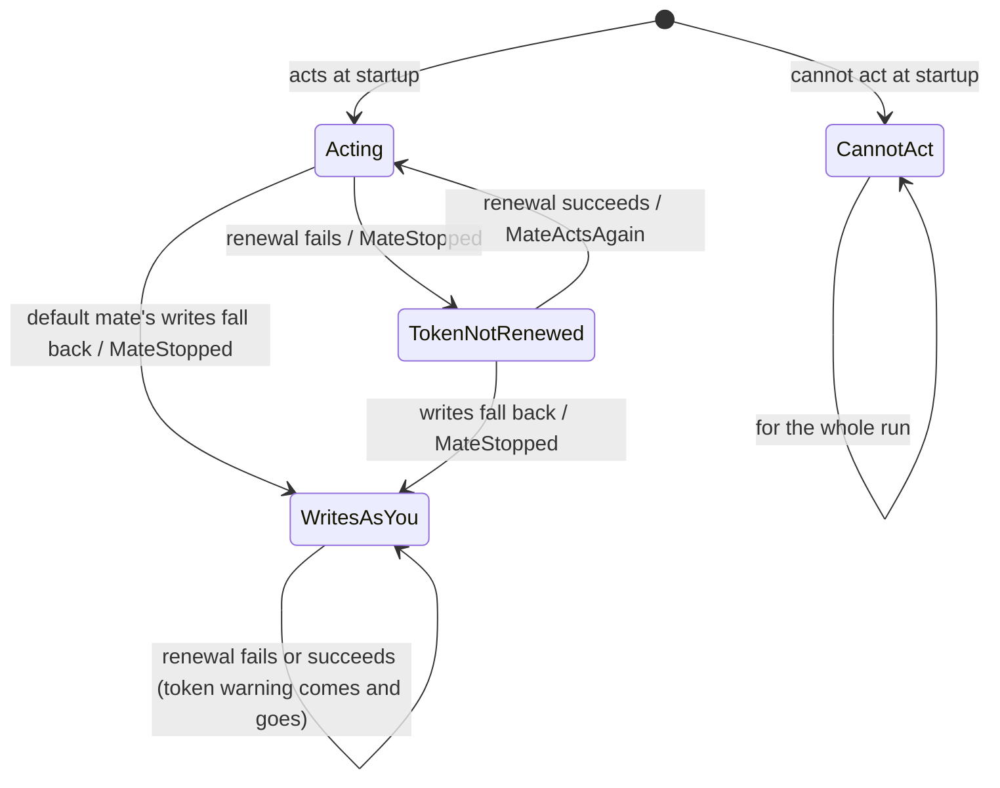

# The mates in a live view section - Plan

## Goal Capsule

- **Objective:** while crew runs, the boss sees in the live view, for each mate and for themselves, whether it can act right now, what acts as it, what runs as it now, and what it cost this run, without leaving the terminal.
- **Means:** a Mates section under the header, drawn from a per-identity view the core keeps (KTD3), fed by the engine polling the mates' live state (KTD1).
- **Product authority:** the boss, through the brainstorm of #114. The Product Contract wins on behaviour; the KTDs win on mechanism.
- **Stop conditions:** stop and report when a settled Key Decision proves unworkable, or when a gate in the Verification Contract cannot pass without changing a requirement.
- **Execution profile:** one branch, units in order U1 to U7, one pull request whose body carries `Closes #114`.
- **Open blockers:** none.

---

## Product Contract

Product Contract from issue #114, updated to match the requirements plan merged meanwhile in #127 (`docs/plans/2026-10-04-1050-feat-mates-section-plan.md`): R5 cuts the stages and actions first, R11 adds a line when a mate acts again, and R14 names the live view's keys. Its deferred-to-planning questions are answered by KTD5 to KTD10, and one case R5 does not name is an assumption (KTD7).

### Summary

The live view gets a Mates section right under the header, with two lines per configured mate and a last row for the boss's own `gh` login. The first line says whether the mate can act and what it cost this run. The second says which stages and actions act as it and what runs as it now. When a mate stops acting during the run, its row, the header and Events say so.

### Problem Frame

The live view never names a mate. The Actions section shows the queue an issue holds a slot in, not the mate it acts as. A mate that cannot act at startup gets one warning line under the header, and nothing more.

During the run, two failures stay silent. When GitHub keeps refusing the default mate, crew's own writes go as the boss until restart, and the docs say so: "crew warns only at startup". When a session's or check's mate token fails to renew, crew drops the error, and once the old token expires the action fails with gh auth errors that look like any other failure. To find out which identity did what, the boss reads GitHub.

### Key Decisions

- **The section answers health, mapping, current work and cost equally.** (session-settled: user-directed — chosen over a section about only one of whether each mate can act, what it is doing, or who acts as whom.) Governs R4, R5, R6, R7.
- **The section follows the mates' live state.** (session-settled: user-approved — chosen over showing only what crew knew at startup: a row saying "acting" while crew's writes go as the boss would mislead.) Governs R8, R9, R10.
- **A session token that fails to renew counts as a mate that stopped acting.** (session-settled: user-approved — proposed after the check found the renewal error is dropped; without it, the row says "acting" while its sessions fail.) Governs R9.
- **The section shows a short state; the header keeps the full reason and fix.** (session-settled: user-directed — chosen over moving the warnings into the section and over showing them in both places in full.) Governs R4, R11.
- **A row shows what runs now plus this run's totals.** (session-settled: user-directed — chosen over only what runs now, and over now plus a count without cost.) Governs R6, R7.
- **The boss gets a row, and the section shows even without mates.** (session-settled: user-directed — chosen over mates-only rows with no section when no mate is configured, and over a boss row only when work acts as the boss.) Governs R2, R3.
- **The section sits at the top, under the header.** (session-settled: user-directed — chosen over a full-width section after Actions and a column in the band beside Queues and Handled.) Governs R1.
- **Two lines per mate.** (session-settled: user-directed — chosen over one truncated line per mate.) Governs R4, R5.
- **Mates gives way last, just before the view is cut.** (session-settled: user-directed — chosen over dropping the second lines first, and over dropping them with Actions' session lines.) Governs R13.
- **An action's totals go to the identity it acted as.** An action that ran as the boss because its mate could not act counts on the boss's row, so each row's cost matches what GitHub shows under that identity. Governs R7.

### Requirements

**The section**

- R1. The live view shows a Mates section directly under the header and its warnings, above Workflow. Its title rule ends in a summary that counts the mates that act and those that do not, such as `2 acting · 1 cannot act`.
- R2. The section has one entry per mate the config names, the default mate first, then the others in the order the config first names them, and a last entry for the boss, labelled `you` with the `gh` login crew acts as when it acts as the boss.
- R3. A config that names no mate still shows the section, with only the `you` entry.

**One entry**

- R4. An entry's first line shows the name, a short state (`acting`, or `cannot act` with a short reason such as `no key`), and this run's totals per R7. The `you` entry has no state.
- R5. An entry's second line lists the stages and actions that act as it, as `stage/action`, marks the default mate's line with crew's own writes, and ends with the actions running as it now, each with its issue reference. When the line does not fit the window, the list of stages and actions is cut with `…` first, so the actions running now stay visible.
- R6. An action counts as running on an entry from when its session starts until it ends, its check included.
- R7. The totals count the actions that ended this run as that identity: how many, their cost and their tokens. Cost and tokens follow the header and Handled: a cost some session did not report is marked `(partial)`, and none at all reads `cost not reported`. The totals start at zero each time crew starts.
- R8. A mate that cannot act at startup shows `cannot act` and its short reason. Its second line says its stages and actions act as `you`, and those actions run and count on the `you` entry.

**Live state**

- R9. A mate stops acting during the run when crew's writes as the default mate fall back to the boss, or when a token of a session or check acting as the mate fails to renew. Its entry's state changes then, with a short reason, such as `writes as you` or `token not renewed`.
- R10. A mate whose token renews after a failure acts again: its entry's state returns to `acting`, and its header warning goes. A writes fallback lasts until crew restarts, as today.
- R11. When a mate stops acting during the run, the header gains a warning with the full reason and the fix, in the words of today's startup warnings. Events gains a line each time a mate stops acting, saying which mate and why, and each time it acts again. `--plain` prints those lines like any event.
- R12. A mate's startup warning stays under the header for the whole run, as today, next to its entry's short state.

**Fit and the rest**

- R13. When rows run out, the existing order holds (Events, then Handled, then Actions' session lines, then board cards), then each Mates entry drops its second line, and only then is the view cut.
- R14. No key of the live view acts on a mate, and the view adds no way to create or fix one: `crew mates create` stays the way.
- R15. `--plain` keeps its startup warning lines, and Actions, Queues, Handled, the board and Events are otherwise unchanged.
- R16. `docs/guide/crew.mdx` documents the section in "Run it", and "When a mate cannot act" no longer says crew warns only at startup and describes the mid-run warnings.

### Acceptance Examples

- AE1. **Covers R2, R4, R5, R7.** Given the default mate `clerk` for triage and `developer` for `implement/development`, when development is running on #1 and three triage actions have ended, `clerk`'s first line shows `acting` and the three actions with their cost and tokens; its second line shows crew's writes and `triage/triage`. `developer`'s second line ends with `#1 development/lfg` as running now.
- AE2. **Covers R3.** Given a config with no `mate`, the section has only the `you` entry, and every action that ends counts on it.
- AE3. **Covers R8, R12.** Given `reviewer` has no key on this machine, its first line shows `cannot act: no key`, its second line says `review/review` acts as `you`, the header keeps the full warning with `crew mates create reviewer`, and a review action that ends counts on `you`.
- AE4. **Covers R9, R11.** Given GitHub keeps refusing the default mate `clerk` mid-run, so crew's writes fall back to the boss, `clerk`'s state changes to `writes as you`, the header gains the full warning, and Events gains a line, which `--plain` prints too.
- AE5. **Covers R9, R10.** Given a renewal of `developer`'s session token fails, `developer`'s state changes to `token not renewed` and the header gains a warning; when the next renewal succeeds, the state returns to `acting` and that warning goes.
- AE6. **Covers R13.** Given a window too short for every section, after Events, Handled, Actions' session lines and board cards have shrunk, each Mates entry drops its second line before the view is cut.

### Scope Boundaries

- Acting on a mate from the live view, or creating or fixing one there.
- Totals that survive a restart.
- Showing a mate on Actions' rows or on board cards.
- Retrying a writes fallback to the mate during the run: it lasts until restart, as today.
- A cost for a running action: it shows once the action ends, as in Handled.

### Dependencies / Assumptions

- crew knows each action's mate from the config, and whether each mate acts at startup, but neither reaches the live view today.
- crew today emits nothing when its writes fall back to the boss or a session token fails to renew. R9 to R11 need crew to report both.

### Outstanding Questions

All deferred-to-planning questions of the issue are answered:

- The `gh` login of the `you` entry: KTD8.
- The 404 or 410 fallback, which goes back to the boss only after the boss's retry succeeds: it reads `writes as you`, with its own reason and fix (KTD9).
- A token that failed to renew but is still valid: the state changes at the failure (KTD9).
- The short reasons and the summary without mates: KTD6 and KTD10.
- The order of a second line, and the default mate no action names: KTD7.

### Sources / Research

- Startup warnings built in `internal/mates/act.go` (`resolver.find`, `resolve`, `tokenWarning`, `mate`), passed through `cmd/crew/act.go` (`appMates`) and `internal/app/app.go` (`Mates.Warnings`, `runner.renderer`), drawn by `internal/ui/tui/layout.go` (`rows`) and printed first by `internal/ui/lines/lines.go` (`Run`, `warn`).
- Writes fallback: `internal/adapter/github/gh.go` (`write`, `backToBoss`). It can fire during `Tracker.Prepare`, which creates missing labels through `gh.write` after `ActAs` and before the core exists.
- Renewal error dropped in `internal/mates/act.go` (`loop`, `_ = a.renew(ctx, s)`); `Acting.Renew`, called by `gh.write` on a 401, goes through the same `renew`.
- Each action's mate: `crew.Action.Mate`, filled for every action once `config.mate` is set (`internal/config/validate.go`, `parseAction`); `config.Config.Mates` lists the default first, then the actions' own in workflow order. The engine picks the identity with `Identities[c.Mate]` in `internal/engine/exec.go`.
- Spend: `step.end` in `internal/core/action.go` adds to `m.spent` at `PhaseEnded`; `crew.Spend` and its `String` in `internal/crew/usage.go`.
- Polling precedent: the engine's said ticker and `port.Narrator` (`internal/engine/engine.go`, `said`, `refreshSaid`).
- Learnings: `docs/solutions/design-patterns/live-view-scroll-sections-take-a-fixed-height.md` (fixed heights, boundary tests move), `docs/solutions/logic-errors/handled-drops-issue-a-stage-holds-again.md` (never sum from Handled), `docs/solutions/tooling-decisions/codacy-lizard-and-golangci-lint-limits.md` (50 lines a function, complexity 15, 500 lines a file, Lizard and type switches), `docs/solutions/runtime-errors/nul-in-gh-argument-freezes-status-comment.md` (outside text).

---

## Planning Contract

### Key Technical Decisions

- KTD1. **The engine polls the mates' live state; nothing pushes it.** The loop reads two sources once right after the core is built and again on every said tick (2 s): the tracker's writes fallback (KTD2) and the mates' renewal failures (KTD2). When the reading differs from the last one, it steps the core with it. Polling catches a change made before `Run`, such as a writes fallback while `Tracker.Prepare` creates labels or a renewal failure right after `mates.Act` starts its loop, needs no buffer, and cannot block a producer once `Run` has returned. A push design would need a mailbox owned by `app`, a signature change to `app.Options.Mates`, and a drain before the first step. It follows the `port.Narrator` precedent.
- KTD2. **Two read-only sources, each set on the transition.**
  - The github tracker gets a new optional interface, `port.WriterReporter` (name final at implementation), whose method returns the warning crew wrote when its writes went back to the boss, or "" while they go as the writer. `gh.backToBoss` records it once, under `g.mu`, only on the false-to-true change, worded per refusal kind (KTD9). A fake implements it for tests.
  - `mates.Acting` records, inside `renew`, each mate's last renewal: a failure stores the mate's warning, a success removes it. So the loop and `Acting.Renew` both report. A mutex-guarded accessor returns a copy. `cmd/crew/appMates` hands that accessor to `app.Mates` as a plain `func() map[string]string`, which `app` passes to `engine.Config`. `mates` keeps importing only the standard library and `proc`.
- KTD3. **The core owns every mate's state, totals and the Events lines.** A new core option gives it the configured mates (default first, config order), the short reason of each that cannot act at startup, and the `gh` login. A new input carries a polled reading (the writes warning and the renewal warnings by mate). The core emits `MateStopped` when an entry gains a problem and `MateActsAgain` when the entry's state returns to `acting`, only on transitions; a renewal problem that clears while the default mate still writes as you drops its warning and emits nothing. `View` gains the entries, `you` last. This sends live warnings through the engine, which reverses KTD11 of `docs/plans/2026-10-03-1824-feat-crew-acts-as-mates-plan.md` ("the engine never carries the warnings") for live warnings only: startup warnings keep their path (R12, R15). Unlike the board's read failure (`docs/plans/2026-10-04-0956-feat-configurable-board-plan.md`, KTD5), a mate that stops acting is an event, because R11 asks `--plain` to print it.
- KTD4. **The identity an action acts as is fixed at startup, and its spend is credited where `m.spent` is.** An action acts as its mate when that mate acts at startup, and as `you` otherwise. This is the choice the engine makes through `Identities[c.Mate]`. A mid-run problem does not move an action to `you`: its session still runs with the mate's gh directory. `step.end` adds the action's spend to its identity's totals on the same line it adds to `m.spent`, so the entries' totals always sum to the header. The count R7 shows is `Spend.Sessions`: an action that never had a session acted as no one and adds nothing.
- KTD5. **Running means `PhaseRunning`, `PhaseChecking` and `PhaseFinishing`.** R6 starts at the session's start, and the spend lands at `PhaseEnded`, after the pull request lookup. Counting `PhaseFinishing` keeps an action on its entry until its totals arrive. A running action shows as `<ref> <stage>/<action>`.
- KTD6. **One short state per entry, by precedence; warnings stay independent.** The state is the first that holds: `cannot act: <startup reason>`, `writes as you`, `token not renewed`, `acting`. The header shows each live problem's warning on its own line, after the startup warnings, so when the default mate has both, its token warning goes once a renewal succeeds while its writes warning stays. The summary counts every mate whose state is not `acting` as `cannot act`, as `2 acting · 1 cannot act`; with no mate configured it reads `no mates`.
- KTD7. **A second line lists `stage/action` pairs in workflow order, and the writes marker goes where the writes go.** `crew's writes` leads the default mate's second line while crew's writes go as it. When they do not, because the default mate cannot act at startup, its writes fell back, or no mate is configured, the marker leads the `you` line. R5 is silent on that case; a marker on a mate that does not write would misstate who writes. A mate that cannot act shows `→ you` with its pairs, and those pairs appear on the `you` line too. A mate no action names shows only the marker, or `none`.
- KTD8. **The `you` login comes from a new optional tracker interface.** `port.BossFinder` returns CODEOWNERS' users, not the login crew acts as. A new interface, such as `port.LoginFinder` with `Login() string`, returns gh's own login, which the github tracker resolves in `Prepare` (`findBoss` calls `viewer`). The engine reads it next to `BossFinder`. Without one, as with the fakes, the entry reads `you` alone.
- KTD9. **The state changes at the failure, and each failure has its own words.** A failed renewal changes the state at once, while the old token may still work for up to ten minutes, so the boss learns before sessions fail. The writes fallback warning is worded by its refusal kind: credentials refused after a renewal (the token was revoked or expired: restart crew, and run `crew mates create <name>` if it persists), a permission refused (the app lacks a permission: run `crew mates create <name>`), and 404 or 410 that the boss got through (the app lost access to the repository: run `crew mates create <name>` to install it). Each ends with "crew writes as you until it restarts". The renewal warning reuses `tokenWarning`'s key-rejected text and otherwise says the mate could not renew its token, that its sessions and checks fail once the current token expires, and that crew tries again every minute.
- KTD10. **Startup short reasons are structured where they are decided.** `resolver.find` and `resolve` return a short reason beside each "cannot act" warning: `no key`, `bad key file` (unreadable file or invalid slug), `not installed`, `key rejected`, `no token`. `mates.Acting` exposes them by mate, and co-author warnings never make one. Nothing parses warning text.
- KTD11. **The section has a fixed height and gives way last.** It takes its rule plus two rows per entry, `you` included. `budget` gains a flag for the second lines, cleared as the last step before the cut, so the rows then drop to one per entry. Live warnings are drawn under the startup warnings from the snapshot. Like startup warnings, they sit outside the budget. A warning added or removed mid-run moves the view by a row; that is rare and accepted.
- KTD12. **Outside text is cleaned where it enters crew.** A renewal warning may quote the API client's error. `mates` cuts it to one line and strips control characters before storing it, because `--plain` prints event text with no TUI cleaning. The writes warning is crew's own words and quotes nothing from gh.
- KTD13. **New core code lives in a new file.** `internal/core/update.go` is near Codacy's 500-line limit and Lizard misreads Go after a type switch, so the mates' state, input handling and view go in `internal/core/mates.go`, with one dispatch line added to `Update`. In `internal/ui/lines`, the two new events get their own text function beside `issueText` and `loopText`, keeping each switch under complexity 15.

### High-Level Technical Design

How a mate's live state reaches the view:



One mate's state, highest precedence first (KTD6):



The section, directional:

```text
Mates ───────────────────────────────────────────── 2 acting · 1 cannot act
 clerk      acting                3 actions · $0.42 · 310k tokens
   crew's writes · triage/triage · promote/promote
 developer  acting                1 action · $3.10 · 2.4M tokens
   implement/development  ▸ #1 implement/development
 reviewer   cannot act: no key
   → you: review/review
 you        octocat               1 action · $0.80 · 600k tokens
   review/review
```

### Assumptions

- The marker for crew's writes moves to `you` whenever the default mate does not write (KTD7). R5 names only the default mate's line.
- When the default mate has both problems, `writes as you` wins on its row, and the summary counts any mate not `acting` as `cannot act` (KTD6).
- Events gains a line when a mate returns to `acting` after a renewal problem (`MateActsAgain`), so `--plain` learns of R10's recovery. R11 names only the stop.

### Considered and not built

- A push mailbox from the producers to the engine: polling covers the same changes with fewer parts (KTD1). Revisit if a 2 s delay ever matters.
- Reserving header rows for live warnings so the view never moves: a mate problem is rare, and reserved blank rows would cost every run a row.
- Moving an action's totals to `you` when its mate's token stops renewing: the session still ran as the mate (KTD4).

### Risks

- **Every golden file and several height-pinned tests move.** All seven files in `internal/ui/tui/testdata/` gain the section, and `TestA24RowWindowShrinksEventsThenHandledToTheirMinimum`, `TestAShortWindowDropsTheSaidLinesThenCutsAboveTheKeyHelp` (`layout_test.go`) and `TestTheCardCapCountsOnlyTheDrawnColumns` (`board_test.go`) pin heights. Re-derive their window heights from the new layout rather than editing expectations until they pass, as the fixed-height learning says.
- **A fallback during `Prepare` must still show.** Covered by reading the sources right after the core is built (KTD1), with a test.
- **Concurrent writes falling back at once** must record one warning: the transition is recorded under `g.mu` (KTD2).

---

## Implementation Units

### U1. Mates report their startup reasons and their renewals

- **Goal:** `mates.Acting` tells, per mate, why it cannot act at startup and whether its last renewal failed.
- **Requirements:** R4, R8, R9, R10, R12; KTD2, KTD9, KTD10, KTD12.
- **Dependencies:** none.
- **Files:** `internal/mates/act.go`, `internal/mates/act_test.go`, `internal/mates/act_helpers_test.go`.
- **Approach:**
  1. `find` and `resolve` return a short reason with each "cannot act" warning (KTD10); `Acting` keeps them by mate name and exposes them.
  2. `renew` records the outcome under a small mutex of its own: a failure stores the renewal warning (KTD9), cleaned to one line (KTD12); a success deletes the entry. The loop keeps ignoring the returned error otherwise.
  3. An accessor returns a copy of the failures map; it is safe from any goroutine while the loop runs.
- **Patterns to follow:** `ActOptions.Step` for outward-facing additions; `tokenWarning` for wording.
- **Test scenarios:**
  - A mate with no key on this machine has short reason `no key`; one not installed `not installed`; one whose key GitHub rejects `key rejected`; one whose mint fails otherwise `no token`; one with an invalid slug `bad key file`.
  - A mate whose co-author lookup fails acts and has no short reason.
  - Covers AE5. In `TestRenewalLoopRenewsBeforeTheTokenExpires`'s sequence, the accessor names the mate with its warning after the failing mint at minute 51 and no longer names it after the success at minute 52.
  - `Acting.Renew` failing records the failure; succeeding clears it.
  - A mint error carrying a newline and a control character yields a one-line warning without them.
  - The accessor's map is a copy: changing it does not change the next reading.
- **Verification:** the mates tests pass under `-race`; depguard still allows `mates` only the standard library and `proc`.

### U2. The tracker reports its writes fallback and its own login

- **Goal:** the github tracker says when and why its writes went back to the boss, and which login it acts as when it acts as the boss.
- **Requirements:** R2, R9, R11; KTD2, KTD8, KTD9.
- **Dependencies:** none.
- **Files:** `internal/port/port.go`, `internal/adapter/github/gh.go`, `internal/adapter/github/tracker.go`, `internal/adapter/github/acting_test.go`, `internal/fake/tracker.go`, `internal/fake/tracker_test.go`.
- **Approach:**
  1. `port` gets the two optional tracker interfaces of KTD2 and KTD8, documented like `BossFinder`, and its package doc lists them.
  2. `gh.backToBoss` takes the refusal kind and the writer's mate name, and records the worded warning only when `asBoss` turns true.
  3. The tracker implements both interfaces: the warning from `gh`, and the login `viewer` resolved, "" before.
  4. `internal/fake` gains a scriptable implementation of both, zero value ready, like `fake.Acting`.
- **Patterns to follow:** `Tracker.Boss`, `fake.Acting` with `SetBoss`.
- **Test scenarios:**
  - Before any write, the fallback warning is "".
  - A permission refusal records the permission warning naming the mate and `crew mates create`.
  - Credentials refused after a renewal record the revoked-or-expired warning.
  - A 404 the boss gets through records the lost-access warning; a 404 the boss also fails records nothing.
  - Two writes falling back keep the first warning.
  - After `Prepare`, the login is gh's login; before, "".
  - The fake returns what its setters set.
- **Verification:** the github and fake tests pass under `-race`.

### U3. The core keeps the mates' state, totals and events

- **Goal:** the core's `View` carries one entry per mate and one for `you`, and its events say when a mate stops acting and acts again.
- **Requirements:** R2 to R10, R11 (events); KTD3 to KTD7, KTD13.
- **Dependencies:** none.
- **Files:** `internal/core/mates.go` (new), `internal/core/model.go`, `internal/core/action.go`, `internal/core/update.go`, `internal/core/input.go`, `internal/core/event.go`, `internal/core/mates_test.go` (new).
- **Approach:**
  1. A new option carries the configured mates, the default mate, the startup short reasons and the login (KTD3). Without it the core still has the `you` entry.
  2. A new input carries a reading: the writes warning and the renewal warnings by mate. Handling diffs it against the stored problems and emits `MateStopped` (mate, short reason, warning) on a new problem and `MateActsAgain` (mate) when the entry's state returns to `acting` (KTD3, KTD6). A writes problem never clears. Readings for mates that cannot act at startup, or names not configured, are ignored.
  3. `step.end` credits the action's spend to its identity beside `m.spent` (KTD4).
  4. `View.Mates` lists each entry: name, whether it is `you`, login, state and short reason, live warnings, whether it carries the writes marker (KTD7), its `stage/action` pairs in workflow order, the actions running as it with issue reference (KTD5), and its `crew.Spend`.
  5. The view shares no memory with the model, as `View` does today.
- **Patterns to follow:** `ListingBoard` and `board.go` for an option with its own file; `step.end` for the spend; table tests in `usage_test.go`.
- **Test scenarios:**
  - Covers AE1. With `clerk` default for triage and `developer` for `implement/development`, three triage actions ended and development running on #1: `clerk` is acting with 3 sessions summed and the writes marker; `developer` lists `#1 implement/development` as running.
  - Covers AE2. Without the option's mates, the view has only `you`, and an ended action's spend lands on it.
  - Covers AE3. With `reviewer` unable to act (`no key`), its entry is `cannot act` with `no key`, its pairs show as acting as `you`, and an ended review action counts on `you`.
  - The default mate unable to act at startup puts the writes marker on `you`.
  - Covers AE4. A reading with a writes warning makes `clerk` `writes as you`, adds the warning, moves the writes marker to `you` and emits one `MateStopped`; the same reading again emits nothing; a later reading without it changes nothing.
  - Covers AE5. A reading with a renewal warning for `developer` makes it `token not renewed` and emits `MateStopped`; a reading without it returns it to `acting`, drops the warning and emits `MateActsAgain`.
  - The default mate with both problems shows `writes as you`; when its renewal recovers, the token warning goes, `writes as you` stays, and no `MateActsAgain` is emitted.
  - An action in `PhaseChecking` and in `PhaseFinishing` is running on its entry; one in `PhaseStarting` is not.
  - An action that ended without a session adds nothing to any entry.
  - The entries' spend always sums to `View.Spent`, including actions of hidden stages and issues whose Handled entry was replaced.
  - A reading naming an unknown mate is ignored.
- **Verification:** core tests pass; `core` still imports only `crew`; `update.go` stays under the file limit.

### U4. The engine, app and cmd/crew wire the mates' state

- **Goal:** the engine builds the core with the mates and polls their live state, and app and cmd/crew hand it everything it needs.
- **Requirements:** R2, R3, R8, R9, R10, R11; KTD1, KTD2, KTD8.
- **Dependencies:** U1, U2, U3.
- **Files:** `internal/engine/engine.go`, `internal/engine/mates_test.go` (new), `internal/app/app.go`, `internal/app/app_mates_test.go`, `cmd/crew/act.go`, `cmd/crew/act_test.go`.
- **Approach:**
  1. `engine.Config` gains the configured mates and default, the startup short reasons, and the renewal-failures func; `prepare` reads the tracker's login interface next to `BossFinder` and passes it all through the new core option.
  2. `Run` reads both sources once after `Prepare` and on each said tick; on a changed reading it steps the core with the new input, which publishes to every subscriber, queues included (KTD1).
  3. `app.Mates` gains the short reasons and the failures func; `built.engine` passes them with `cfg.Mate` and `cfg.Mates`.
  4. `appMates` copies the reasons and the accessor from `mates.Acting`.
- **Patterns to follow:** `said_test.go` for a loop that polls every 2 s under `synctest`, asserting both `SubscribeLatest` and `SubscribeQueue`.
- **Test scenarios:**
  - Covers AE4. A fake tracker whose fallback warning is set during `Prepare` yields, at the first update, a `writes as you` default mate and a `MateStopped` event.
  - A fallback set mid-run shows within one said tick, in the latest snapshot and as an event in the queue.
  - Covers AE5. A failures func that names a mate and then stops naming it yields `MateStopped` then `MateActsAgain`, each once.
  - An unchanged reading steps nothing: no extra update reaches the queue.
  - The `you` entry carries the fake tracker's login; with a tracker without the interface it has none.
  - In app, a config whose mate cannot act gives its entry `cannot act` with the resolver's reason; a config without mates gives only `you`.
  - `appMates` copies the reasons and a working accessor.
- **Verification:** engine and app tests pass under `-race` and `synctest`; no goroutine leaks.

### U5. The live view draws the Mates section

- **Goal:** the TUI shows the section under the header and its warnings, and the live warnings under the startup ones.
- **Requirements:** R1 to R8, R11, R12, R13, R14; KTD6, KTD7, KTD11.
- **Dependencies:** U3, U4.
- **Files:** `internal/ui/tui/mates.go` (new), `internal/ui/tui/layout.go`, `internal/ui/tui/mates_test.go` (new), `internal/ui/tui/layout_test.go`, `internal/ui/tui/board_test.go`, `internal/ui/tui/helpers_test.go`, `internal/ui/tui/model_test.go`, `internal/ui/tui/testdata/*.golden`.
- **Approach:**
  1. `rows` draws the startup warnings, then each entry's live warnings with the same `warning:` style, then the section, then Workflow.
  2. The section: rule with the summary (KTD6); per entry a first line with the name padded to the longest, the state (none for `you`, which shows its login) and the totals in `crew.Spend`'s words with the action count, or no totals while no action has ended on the entry, as the header shows none before the first session ends; a second line indented, whose stages and actions are cut with `…` first when it is too wide, so the running actions stay whole (R5).
  3. `budget` gains the second-lines flag, cleared after the card cap (KTD11).
  4. Rewrite the golden files with `-update` and review each diff; re-derive the pinned window heights.
- **Patterns to follow:** `queuesSection` and `handledSection` for section idioms; `clean` for outside text; `rule`.
- **Test scenarios:**
  - Covers AE1. Two acting mates and `you` render their first and second lines, with the writes marker and the running `#1` reference.
  - Covers AE3. A mate unable to act renders `cannot act: no key` and `→ you`, and its startup warning stays under the header.
  - Covers AE4. A snapshot whose default mate writes as you renders that state and a header warning line.
  - The summary reads `2 acting · 1 cannot act`, and `no mates` with only `you`.
  - A second line wider than the window cuts its stages and actions with `…` and keeps the running actions whole.
  - Covers AE6. With a window short enough, after Events, Handled, the said lines and the cards shrink, the entries lose their second lines before the view is cut.
  - `TestEverySectionShowsInOrder` lists `Mates` between the warnings and Workflow.
- **Verification:** the TUI tests pass, golden diffs show only the new section and the expected shifts, and no key binding changed.

### U6. `--plain` prints the mate events

- **Goal:** the line renderer words `MateStopped` and `MateActsAgain`.
- **Requirements:** R11, R15; KTD13.
- **Dependencies:** U3.
- **Files:** `internal/ui/lines/lines.go`, `internal/ui/lines/lines_test.go`.
- **Approach:** a third text function handles the two events: `mate clerk stopped acting: <warning>` and `mate developer acts again: its token renewed`. The TUI's Events uses the same text.
- **Patterns to follow:** `issueText` and `loopText`; the `sentences` table.
- **Test scenarios:**
  - Covers AE4. `MateStopped` prints one line naming the mate and the full warning.
  - `MateActsAgain` prints its line.
  - Startup warnings still print first, unchanged.
- **Verification:** `TestEveryEventPrintsAnEnglishSentence` covers both events.

### U7. Docs

- **Goal:** the guide and the contributor docs describe the section and the mid-run warnings.
- **Requirements:** R16.
- **Dependencies:** U1 to U6.
- **Files:** `docs/guide/crew.mdx`, `docs/develop/architecture.mdx`, `AGENTS.md`.
- **Approach:**
  1. `docs/guide/crew.mdx`: "Run it" gains the Mates block in the sample view, a paragraph on the section, the live warnings, the new shrink step and the new event line; "When a mate cannot act" drops "crew warns only at startup" and describes the mid-run warnings, the short states and that a token warning goes when the token renews; "What acts as whom" mentions the warning on a fallback.
  2. `docs/develop/architecture.mdx`: the two new optional interfaces and their count, the said ticker also polling the mates, the snapshot's mates, and the startup warnings' path.
  3. `AGENTS.md`: the `internal/port` bullet lists the new interfaces.
- **Test expectation:** none -- documentation; `pnpm docs:check` passes.
- **Verification:** no page still says crew warns only at startup.

---

## Verification Contract

| Gate | Command |
| --- | --- |
| Format | `gofmt -l cmd internal tools` prints nothing |
| Vet | `go vet ./...` |
| Lint and layering | `go run github.com/golangci/golangci-lint/v2/cmd/golangci-lint@v2.14.0 run` |
| Tests | `go test -race ./...` |
| Coverage, total | `go test -race -covermode=atomic -coverpkg=./... -coverprofile=coverage.out ./...` then `go run github.com/vladopajic/go-test-coverage/v2@v2.19.0 --config=.testcoverage.yml` (at least 90%) |
| Coverage, changed lines | `git diff -U0 origin/main...HEAD \| go run ./tools/diffcover -profile coverage.out` (at least 90%) |
| Vulnerabilities | `go run golang.org/x/vuln/cmd/govulncheck@v1.8.0 ./...` |
| Docs | `pnpm docs:check` |
| Golden files | `go test ./internal/ui/tui -update`, then review every diff |

## Definition of Done

- Every unit's verification holds and every gate above passes.
- AE1 to AE6 each have a test that names them.
- The pull request body carries `Closes #114`.
- No code from abandoned approaches is left in the diff.
