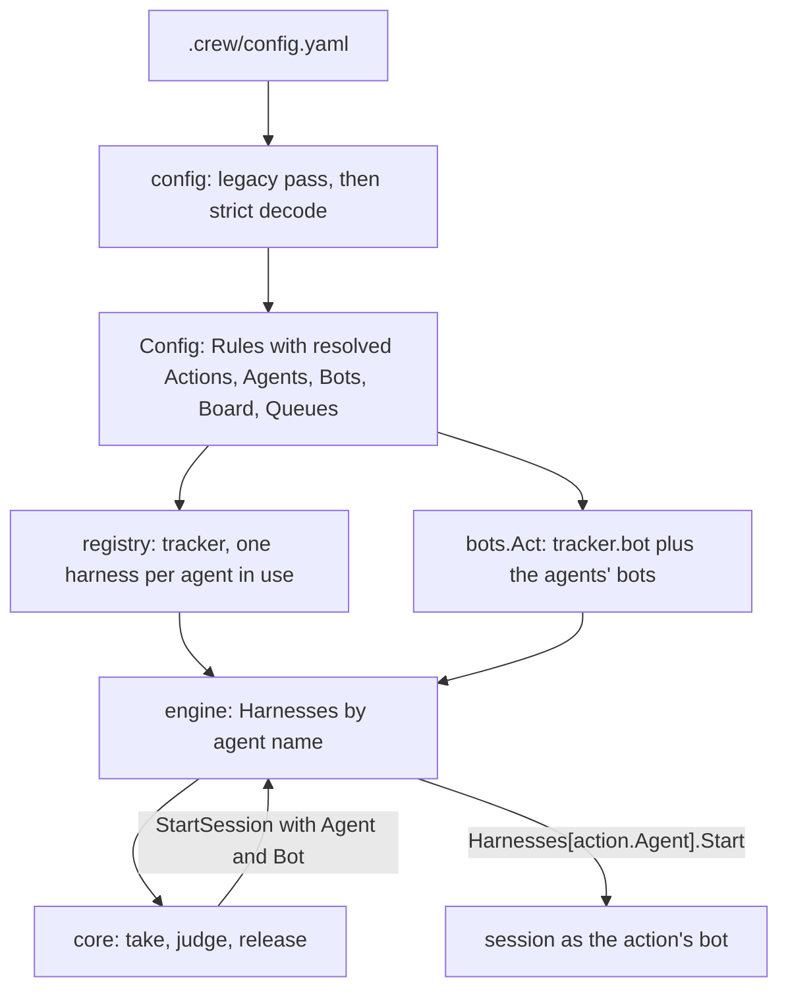
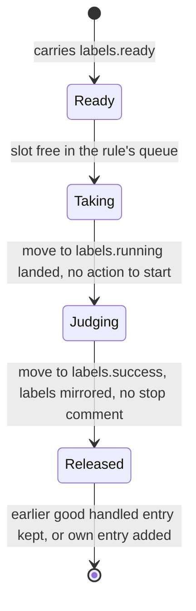

# Keys of .crew/config.yaml for any repository - Plan

## Goal Capsule

- **Objective:** anyone can set crew up in their own repository by writing `.crew/config.yaml` in keys that assume no particular workflow, tracker, coding agent or vocabulary, and every key they write is one crew acts on.
- **Means:** a new key schema with independent rules that react to labels, named agents and named checks, a board made of label columns, and the words code owner, bot and rule throughout crew's interface and code, published with a JSON Schema (R1 to R28; mechanism in KTD1 to KTD14).
- **Product authority:** the code owner, through the brainstorm of #134. The Product Contract wins on behaviour and key names; the KTDs win on mechanism.
- **Stop conditions:** stop and report when a settled Key Decision proves unworkable, or when a gate in the Verification Contract cannot pass without changing a requirement.
- **Execution profile:** one branch, units in the order of the Unit Index, one pull request whose body carries `Closes #134`. U2 to U5 change the shapes the config hands to the rest of crew, so they land together: no commit may leave `go build ./...` failing. Two stopgaps keep that group green until U6 and U7: `crew.Rule.OffBoard` stays, never set, and only written board columns reach app and engine (U2 steps 7 and 8).
- **Open blockers:** none.

---

## Product Contract

Product Contract from issue #134. Planning answers its Outstanding Questions (KTD5, KTD7, KTD9, KTD12, KTD13). Product Contract preservation: unchanged, except that R8's last sentence now states KTD5's answer and F1's article is corrected.

### Summary

crew's config gets a new set of keys. Rules replace the workflow's stages: each rule reacts to one label and has no place in a fixed sequence. Each action picks a named agent (harness, model and bot) and a named check. The board is a set of label columns. The keys speak of code owners and bots instead of the boss and mates. Everything crew does not act on leaves the file, and a JSON Schema gives editors completion and help for every key.

### Problem Frame

The keys grew one feature at a time while crew built itself, and they show it. `config:` is a section inside the config file. The tracker has its own section, while the harness and its model sit among the general settings, so crew can run only one coding agent. A built-in `clerk` queue has a key of its own, `clerk_slots`, beside `queues`. Every stage spells out four labels in four loose keys, and `moves_to` matches no other tool's vocabulary. Stages that only hand an issue on need a session told to do nothing. Two stages carry the same 11-line check. `on_board` hides a stage from the board and also mutes its notifications. `extra_labels`, `description`, `issue_template` and `prompts` exist only for the `cw-*` skills, and crew validates `prompts` but never runs them. The names `boss`, `mate`, `workflow` and `stage` mean something only to someone who has read crew's glossary, and `stage` suggests a chain that crew does not enforce.

None of this stops crew from running here. It does stop the file from reading as a configuration language a stranger could pick up for their own repository.

### Key Decisions

- **The config describes what crew acts on, for any repository.** The values in this repository's config are crew building itself and stay specific; the keys are what must work for anyone. (session-settled: user-directed — chosen over tailoring keys to crew's own workflow: the code owner wants crew usable as an open-source project with each user's own setup.) Governs R1, R24.
- **Rules, not stages.** Each rule reacts to a label on its own, and the order of work comes only from how the code owner chains labels. (session-settled: user-directed — chosen over keeping `workflow` and `stages`, and over `jobs` and `triggers` as names: no forced chaining.) Governs R6, R7.
- **A rule's labels are grouped by state.** One `labels` block names `ready`, `running`, `success` and `failure`. (session-settled: user-approved — chosen over deriving labels from a pattern, which imposes a convention and allows two ways to say one thing, and over four renamed loose keys.) Governs R6.
- **The old keys stop working at once.** crew refuses an old key and names the key that replaces it; there is no deprecation period and no `version` key. (session-settled: user-approved — chosen over accepting old keys with a warning and over adding a required `version`: the code owner is the only user today.) Governs R4.
- **Named agents.** An `agents` map holds harness, model and bot together, and an action names its agent. (session-settled: user-approved — chosen over harness and model keys on each action, and over a `harnesses` map with the bot kept on the action: the code owner wants, say, Claude for development and Codex for review.) Governs R11, R12, R13.
- **Named checks.** A `checks` map defines each check once, and an action names its check. (session-settled: user-approved — chosen over YAML anchors under ignored `x-` keys, which the code owner found unclear, and over no reuse.) Governs R14.
- **The board is made only of label columns.** `on_board` leaves the schema, and muting notifications becomes a key of its own. (session-settled: user-approved — chosen over keeping today's two board modes and over a `dashboard` section that would hold only the board today.) Governs R9, R21, R22, R23.
- **No extra labels.** Labels no rule takes are the code owner's; crew does not need to know them. (session-settled: user-directed — chosen over a label prefix that marks crew's labels and over counting the board's labels as crew's.) Governs R24.
- **The `cw-*` skills are not crew's business.** Their prompts leave the config and live in the skills themselves. Each user writes their own skills with their own labels; crew's are personal aids for building crew. (session-settled: user-directed — chosen over a separate skills file, a marked section in the config, and skills that take their labels as arguments or derive them from templates and rules.) Governs R24, R25.
- **Code owner and bot.** `boss` becomes code owner, after the CODEOWNERS file crew reads it from, kept apart from GitHub's repository owner (`{owner}` in `gh`), and `mate` becomes bot, as GitHub shows it (`developer[bot]`). The identity of crew's own writes moves under `tracker`. (session-settled: user-directed — chosen over plain owner, which reads as the repository's GitHub owner, over owner and identity, and over maintainer and account.) Governs R15, R16, R17, R18.
- **Named things are maps keyed by name.** Rules, actions, agents, checks, queues and board columns are maps, so a duplicate name cannot be written, and file order still counts where order matters. Governs R2.
- **A rule with no actions only moves the label.** It replaces the promote stages' session that does nothing. Governs R8, R10.

### Requirements

**File shape**

- R1. The top level of `.crew/config.yaml` takes `poll_interval_seconds`, `max_parallel_issues`, `run_time_limit_seconds`, `usage_in_status`, `queues`, `tracker`, `agents`, `checks`, `board` and `rules`. There is no `config:` section.
- R2. Rules, a rule's actions, agents, checks, queues and board columns are maps keyed by name. Where order matters, such as the default board (R22), file order decides.
- R3. Decoding stays strict: an unknown or duplicate key stops crew with its path and line, as today.
- R4. A config that uses a key this schema removes or renames stops crew, and the error names the key that replaces it, or says the key is gone.
- R5. crew publishes a JSON Schema for the file, and the example config names it in a `yaml-language-server` modeline. A test fails when the schema and the keys crew accepts disagree.

**Rules**

- R6. A rule takes the items of its kind (`takes`, issues by default) that carry `labels.ready`, moves each to `labels.running`, runs its actions, and moves it to `labels.success` when every action succeeded or to `labels.failure` when any failed.
- R7. Rules form no sequence. crew still refuses two rules with the same `ready` label, a `success` or `failure` equal to the rule's own `ready`, and a `running` equal to any rule's `ready`.
- R8. A rule may have no actions. crew then moves the item to `running` and on to `success` without starting a session, so the rule spends no tokens and no money. It holds a slot of its queue while it moves the label (KTD5).
- R9. `notify` decides whether crew sends a desktop notification when the rule ends. It defaults to on for a rule with actions and off for a rule with none.
- R10. A rule with no actions that ends well leaves the live view's earlier handled entry for the issue in place, when that entry ended well too.

**Agents and checks**

- R11. `agents` maps a name to an agent: a `harness` with its `name`, an optional `model` and the harness adapter's own keys, plus an optional `bot`. A harness without `model` uses its adapter's default.
- R12. An action names its agent with `agent`. An action may leave `agent` out only when exactly one agent is declared.
- R13. One crew process runs actions on different harnesses at the same time, each action on its agent's. A harness name no adapter has stops crew with the registered names, as a tracker name does today.
- R14. `checks` maps a name to a shell script, and an action's `check` names one of them. A name `checks` lacks stops crew. A check runs as today, with the same environment.

**Tracker, code owners and bots**

- R15. `tracker` takes `name`, an optional `bot` and the tracker adapter's own keys. `tracker.bot` is the identity of crew's own writes and the default bot of every agent; without it, they act as the `gh` login crew runs as.
- R16. An action's session and check act as its agent's bot. When the agent has no bot, they act as `tracker.bot`, and as the `gh` login crew runs as only when neither is set.
- R17. Keys, the CLI, the environment, messages, the live view and the docs say code owner, bot, rule and rules instead of boss, mate, stage and workflow. The live view's `Workflow` section, its `stage/action` rows and its Handled and notification text follow. `crew mates create` becomes `crew bots create`; `CREW_BOSS` and `CREW_MATES` become `CREW_CODE_OWNERS` and `CREW_BOTS`.
- R18. crew's code adopts the same model: its domain types, packages, identifiers, tests and fixtures are named after rules, agents, checks, code owners and bots, so the code and the config speak one language.
- R19. Bots created before this change keep acting without being created again.

**Queues**

- R20. `queues` maps a queue name to its slots. Besides `default`, which gets the slots `max_parallel_issues` leaves, crew knows no queue name, and `clerk_slots` is gone. A rule names its queue with `queue`, `default` when it names none.

**Board**

- R21. `board` maps a column name to its labels, one or more. Columns are drawn in file order, and any label works, crew's own or not.
- R22. Without `board`, the board has one column per rule that has actions, in file order, holding the items of the rule's kind, issues or pull requests, that carry its `ready` or `running` label.
- R23. A card sits in every column whose labels the issue carries, and nowhere else. No card waits in a column for the next rule.

**What leaves crew**

- R24. `extra_labels`, `description`, `issue_template` and `prompts` leave the schema. crew creates and removes only the labels its rules name, and never touches any other label.
- R25. The `cw-*` skills are this repository's personal development aids, not crew defaults. They no longer read crew's config: their instructions, issue types and label moves, this repository's labels included, live in the skill files.

**This repository**

- R26. This repository's `.crew/config.example.yaml` is rewritten in the new keys with the same behaviour, and loads.
- R27. `docs/guide/crew.mdx`, `docs/guide/mates.mdx`, `docs/guide/create-issue.mdx`, the `cw-*` skills and their guides, `AGENTS.md`, `README.md` and `CONCEPTS.md` describe the new keys and words.
- R28. The status comment, the failure report and the live view keep their meaning; only the words of R17 change in them. The one exception is the board, per R22 and R23: its waiting card and its count of waiting issues go away.

### Key Flows

- F1. A code owner sets crew up in a new repository
  - **Trigger:** the code owner writes `.crew/config.yaml` from the guide or the example.
  - **Steps:** their editor completes and explains each key from the schema (R5). They declare a tracker, one agent and one rule with one action, and leave `agent` out because there is one agent (R12). crew starts and takes issues carrying the rule's `ready` label.
  - **Outcome:** a working setup with no queue, check, bot or board declared.
  - **Covered by:** R1, R5, R6, R12, R22
- F2. The code owner upgrades crew with an old config
  - **Trigger:** crew starts with `config:`, `workflow:` and `extra_labels:`.
  - **Steps:** crew refuses to start and lists each old key with its replacement (R4). The code owner rewrites the file, and their bots act as before (R19).
  - **Covered by:** R4, R19

### Acceptance Examples

- AE1. **Covers R4.** Given a config with `config.poll_interval_seconds` and a stage with `moves_to`, when crew starts, it stops and says that `config.poll_interval_seconds` is now `poll_interval_seconds` and `moves_to` is now `labels.running`, each with its line.
- AE2. **Covers R8, R10.** Given a rule `promote triage` with no actions, `ready` `crew:triage:done` and `success` `crew:development:ready`, when an issue carries `crew:triage:done`, crew moves it to `crew:triage:promoting` and then to `crew:development:ready` without a session, and Handled still shows triage's entry.
- AE3. **Covers R12.** Given two agents and an action without `agent`, crew refuses the config and names the action. Given one agent, the same action runs on it.
- AE4. **Covers R13.** Given agents `developer` and `reviewer` on two different registered harnesses (in tests, two fake harnesses; a Codex adapter is separate work), when rules `development` and `review` each hold an issue, both sessions run at once, each on its own harness.
- AE5. **Covers R22.** Given no `board` and rules `promote triage` (no actions), `triage` and `development`, the board has two columns, triage and development, in that order.
- AE6. **Covers R24.** Given an issue the code owner moves by hand from `crew:brainstorm:ready`, which no rule names, to `crew:triage:ready`, triage takes it at the next poll. When triage moves it, crew changes only triage's labels and leaves any label no rule names, such as `bug`, on the issue.
- AE7. **Covers R14.** Given an action with `check: pr-closes-issue` and no `pr-closes-issue` under `checks`, crew refuses the config and names the action and the missing check.

### Scope Boundaries

**Deferred for later**

- `defaults` that rules or actions inherit.
- Prompts by name or from a file.
- `enabled: false` to switch a rule off without commenting it out.
- Configuring the live view's other sections (bots, actions, handled).
- Submitting the schema to SchemaStore, so editors pick it up without a modeline.

**Outside this work**

- Any file or key for the `cw-*` skills in crew's config.
- A `version` key or a tool that rewrites old configs.
- New trackers or harnesses: the schema makes room for them, but only GitHub and Claude adapters ship. A second harness adapter, such as Codex, is separate work.

### Dependencies / Assumptions

- R13 changes the engine, not only the config: today it holds one harness for the whole process (`internal/engine/engine.go:63`), and every session starts through it (`internal/engine/exec.go:271`).
- Bot private keys live under the user config directory in `crew/mates/` (`internal/mates/store.go:71`), so R19 must cover that location.

### Outstanding Questions

**Answered in planning**

- A rule with no actions takes a slot in its queue for the moment it moves the label (KTD5).
- An agent's `bot` does not require `tracker.bot` (KTD7).
- R19 is met by reading the old key location as a fallback, without moving anything (KTD9).
- The JSON Schema lives at `schema/config.schema.json` in this repository, and the modeline names its raw URL on `main` (KTD12).
- Messages name the person less often: "code owner" appears only where crew says whose issues it takes (KTD13).

### Sources / Research

- Grounding: every key accepted today is in `internal/config/config.go` (top level and `config:`), `internal/config/validate.go` (stages, actions, extras, graph checks), `internal/config/board.go` and `internal/config/queue.go`. The built-in queue is `internal/crew/workflow.go:42`. Extras are created and removed at run time in `internal/adapter/github/tracker.go:466` and `:544`.
- Earlier decisions this plan changes: `docs/plans/2026-10-04-0956-feat-configurable-board-plan.md` (two board modes, `on_board` muting notifications), `docs/plans/2026-10-02-1440-feat-create-issue-skill-plan.md` (`description`, `issue_template`, `extra_labels`), `docs/plans/2026-10-03-1824-feat-crew-acts-as-mates-plan.md` (`config.mate` and per-action `mate`), `docs/plans/2026-10-03-1813-feat-per-stage-crew-labels-plan.md` (this repository's label values, unchanged).
- Prior art:
  - Docker Compose `x-` extensions, considered and rejected: https://docs.docker.com/reference/compose-file/extension/
  - GitHub Actions `jobs` as a map keyed by id, and `defaults` (deferred): https://docs.github.com/en/actions/reference/workflows-and-actions/workflow-syntax
  - Step Functions' rule that every transition must name an existing state: https://states-language.net/spec.html
  - Linear's statuses inside fixed categories: https://linear.app/docs/configuring-workflows
  - Kubernetes on units in field names and on bool fields: https://github.com/kubernetes/community/blob/master/contributors/devel/sig-architecture/api-conventions.md
  - JSON Schema modelines in yaml-language-server: https://github.com/redhat-developer/yaml-language-server
  - Published schemas: golangci-lint (https://golangci-lint.run/docs/configuration/file/) and Taskfile (https://taskfile.dev/docs/reference/schema)
  - OpenAI Symphony, the nearest issue-to-agent runner: https://github.com/openai/symphony/blob/main/SPEC.md

### Success Criteria

- A fresh agent session given only `docs/guide/crew.mdx` and the JSON Schema, with no access to crew's code, `CONCEPTS.md` or `AGENTS.md`, writes a `.crew/config.yaml` for an empty repository that loads and takes an issue carrying its rule's `ready` label, as in F1.
- Every key in the schema is one crew acts on, and none names GitHub or Claude outside the tracker and the agents.
- This repository's config is shorter and has no do-nothing session, repeated check or repeated bot per action.

---

## Planning Contract

### Key Technical Decisions

- KTD1. **The config keeps its strict decoder and adds map-keyed sections.** Rules, actions, agents, checks, queues and board columns are read with `mapping` and `entries` in `internal/config/decode.go`, which keep file order, plus a manual duplicate-name check as `declaredQueues` does today, since a `yaml.Node` does not refuse duplicate keys. Every error keeps the `keyError` shape (path, line, message), and per-item errors are joined so one load reports them all. The package is split by section (`config.go`, `rules.go`, `agents.go`, `checks.go`, `queue.go`, `board.go`, `legacy.go`) to stay under the 500-line file limit. Governs R1, R2, R3.
- KTD2. **Old keys are found by a pass over the raw YAML before the strict decode.** `decodeFields` stops at the first unknown key, so AE1's several old keys can only be reported by walking the document first. `legacy.go` holds one table from each old key path to its replacement (or "gone"), covering the old top level (`config.*`, `harness`, `workflow[*]` and its actions, `extra_labels`, `prompts`) and old stage or action keys written inside a new rule or action. When the pass finds any, crew stops with all of them and does not decode further. Implements R4 (session-settled: user-approved; governs R4).
- KTD3. **The config resolves names into the domain.** An action leaves config knowing its agent's name, its check's script and its bot, so the core and engine never look a name up. `crew.Rule` replaces `crew.Stage` with `Labels` (`Ready`, `Running`, `Success`, `Failure`), `Actions`, `Queue`, `Takes` and `Notify`; `OffBoard` and `crew.ClerkQueue` go. `crew.Action` gains `Agent`. `Check` keeps the script, and the check's name is kept only for messages.
- KTD4. **The engine holds one harness per agent that some action names.** The registry builds a harness from each such agent's section, and its lookup error names `agents.<name>.harness.name` instead of the hard-coded `config.harness`. `engine.Config.Harnesses` maps agent name to harness. `startSession` uses the action's agent, and Prepare runs each harness's `port.Preparer` once, named after the agent, in file order. `model` reaches the adapter as an ordinary key of its section, so `harnessSection`'s join of `config.model` goes. An agent that no action names is decoded, and its harness name checked against the registry, but it is not built, prepared or made to act, so a missing binary of an unused agent does not stop crew. Governs R11, R12, R13.
- KTD5. **A rule without actions holds a slot and is judged at its take.** At the end of `taken` in `internal/core/update.go`, a held issue whose actions have all ended (vacuously so for none) is judged at once, on the normal branch and on the stopping branch. Without the stopping branch the issue stays held and the engine never stops. It holds a slot of its queue for those two moves, like any rule, so dispatch needs no special case. It writes its status comment entry as today, without action lines. It mirrors its labels onto the issue's pull requests but sends no stop comment (`End` left empty), because nobody stopped watching anything. Taken during a stop, it still moves to `success`. Governs R8.
- KTD6. **Handled and notifications key on rules without actions and on `notify`.** `release` keeps the earlier handled entry, marked `Gone`, when the ended rule has no actions and both its verdict and the earlier entry ended well. This is the `OffBoard` rule of `docs/solutions/logic-errors/handled-drops-issue-a-stage-holds-again.md` with a new predicate. Without an earlier good entry, the rule leaves its own entry, as a hidden stage does today. The TUI's `muted` looks the rule up by name among the rules, never among board columns, and mutes it when `Notify` is false. `Notify` defaults to `len(Actions) > 0`, set in config. A rule muted with `notify: false` is muted on failure too, as `on_board: false` is today. Governs R9, R10.
- KTD7. **Bots resolve in config, and `tracker.bot` is optional.** An action's bot is its agent's `bot`, else `tracker.bot`, else none, which acts as the `gh` login crew runs as. The list of bots crew makes act is `tracker.bot` plus the bots of the agents in use, each once. `internal/bots` `Act` already accepts no default. `app`, `engine.Config` and the core's bots view stop assuming that no default means no bots: `ActAs` holds when any bot is named, and the writer is the zero identity when `tracker.bot` is unset. Governs R15, R16.
- KTD8. **Persisted names keep their wire form.** The status comment marker keeps `stage=` and the run journal keeps its `"stage"` field and `v: 1`, while the Go identifiers that write and read them say rule. Older comments then still parse, older failed runs still resume, and users' `jq` over `runs.jsonl` keeps working. The rule and action names in this repository's new config equal today's stage and action names, so their failed runs keep resuming. Governs R18, R19, R28.
- KTD9. **Bot keys: new ones go under `crew/bots`, old ones are read from `crew/mates`.** `Store.Load` looks in `<UserConfigDir>/crew/bots/<owner>/<name>.json`, then in the old `crew/mates/` path, and returns the path it read. Every message that tells the user which file to delete names that path, so the fallback cannot loop. `crew bots create` checks both places before it creates a GitHub App, so it never duplicates an existing bot's app. Nothing is moved, so an older crew binary still finds its keys. Governs R19.
- KTD10. **One board model: columns of labels, each with a kind.** `crew.BoardColumn` gains `Takes`. A written `board` gives columns that hold issues, filled by `port.BoardLister` as today; a written board still needs a tracker that has one. Without `board`, config builds one column per rule that has actions, named after the rule, with its `ready` and `running` labels and its kind. The core fills those columns from its own listing, plus crew's moves, so the default board needs no extra query and no BoardLister. For that, the listing asks for every rule's `ready` and `running` labels, of both kinds, where today it asks only for `ready` (`listIssues` in `internal/core/update.go`); taking still matches only `ready`, so an item left in a `running` label that crew does not hold gets a card but is never taken. The cost: while every slot is busy crew skips listing, so cards a person moved meanwhile show at the next listing. The stage board, its waiting cards and its waiting count go. Governs R21, R22, R23.
- KTD11. **crew's labels are its rules' labels.** The `extras` parameter leaves `port.TrackerFactory`, `registry.Tracker`, the GitHub tracker, the fake tracker, `engine.Config` and `core.ListingBoard`. Prepare creates only rule labels. A move removes every rule label but the target and keeps every other label, which is today's `swap` without extras. A `failure` label is required on a rule with actions, and optional on one without, since that rule never fails. Governs R6, R24.
- KTD12. **The JSON Schema is a file in the repository, checked by tests from both sides.** `schema/config.schema.json` (draft 2020-12, `additionalProperties: false` at every crew-owned level) is the published schema. The example config's first line is `# yaml-language-server: $schema=https://raw.githubusercontent.com/thatsnotmynameio/crew/main/schema/config.schema.json`. A test in `internal/config` walks the schema's properties and the key tree the decoder accepts, which `export_test.go` exposes through `fieldsByKey` on the document types, and fails on any key in one but not the other. The adapter-owned keys are checked by each adapter's own test: the claude adapter's settings keys against `agents.*.harness` minus `name`, and the GitHub tracker's against `tracker` minus `name` and `bot`. Governs R5.
- KTD13. **Two meanings of "boss" get two names.** The CODEOWNERS meaning becomes code owner (`CodeOwnerFinder`, `CodeOwners()`, `CREW_CODE_OWNERS`). The other meaning is the `gh` login crew runs as, the "you" row, or "needs attention", and gets those names (`login`, `you`, `needsAttention`). Messages say "you" or name the login; "code owner" appears only where crew says whose issues it takes, and in `CREW_CODE_OWNERS`. Governs R17, R18.
- KTD14. **Prompts and checks that still read `$CREW_BOSS` or `$CREW_MATES` are refused.** The old variables would arrive empty without a word, and the triage prompt reads them. Config refuses a prompt or check script that contains either name and names its replacement. A script a check calls is not seen. The docs say so. Governs R17.

### High-Level Technical Design

The key surface, as a directional sketch of this repository's config:

```yaml
# yaml-language-server: $schema=https://raw.githubusercontent.com/thatsnotmynameio/crew/main/schema/config.schema.json
poll_interval_seconds: 300
max_parallel_issues: 4
queues:            # name -> slots; default gets what is left
  clerk: 1
  developer: 2
tracker:
  name: github
  bot: clerk       # crew's own writes, and every agent's default bot
agents:
  product-manager:
    harness: {name: claude, model: claude-opus-5-5}
    bot: product-manager
  developer:
    harness: {name: claude, model: claude-opus-5-5}
    bot: developer
checks:
  pr-closes-issue: |-
    ...
rules:
  promote triage:              # no actions: crew moves the label itself
    queue: clerk
    labels: {ready: "crew:triage:done", running: "crew:triage:promoting", success: "crew:development:ready"}
  development:
    queue: developer
    labels: {ready: ..., running: ..., success: ..., failure: ...}
    actions:
      lfg:
        agent: developer
        check: pr-closes-issue
        prompt: |-
          ...
```

How the config reaches the sessions (KTD3, KTD4, KTD7):



An issue through a rule without actions (KTD5, KTD6):



### Assumptions

- `tracker.name` keeps its default `github`, while `agents.<name>.harness.name` is required, since naming the harness is the point of declaring an agent.
- `agents` is required only when some rule has actions.
- Unused checks and unused agents are allowed. An unused agent's harness name is still checked against the registry (KTD4).
- `notify` on a rule without actions acts on the handled entry the rule leaves. When KTD6 keeps an earlier entry, `notify: true` there sends nothing.
- AE6's "crew changes only triage's labels" is read as "only rule labels": a move still removes another rule's label, which only happens to a label added mid-run (KTD11).
- The take order among rules of equal priority stays "later rule in the file first", so file order still breaks ties, and the guide says so.
- The board of this repository's config looks as today without the promote stages' columns, which `on_board: false` already hid, and without waiting cards (R28).

### Considered and not built

- **A versioned schema URL per release** (GoReleaser `extra_files`): editors on an older binary would see newer keys. With one user today the `main` URL is enough. It would change with a second user or a breaking key change.
- **Exporting `CREW_BOSS` and `CREW_MATES` beside the new names:** old configs are refused anyway (R4), and KTD14 catches literal uses.
- **Moving the key files once from `crew/mates` to `crew/bots`:** an older binary would lose its keys, and the fallback read costs one path (KTD9).
- **Extending `BoardLister` to pull requests:** the core's listing already covers the default columns of both kinds (KTD10). Written columns stay issues-only, so mirrored labels never put an issue's pull request beside it.
- **Never adding a handled entry for a rule without actions:** R10 covers only the case of an earlier good entry, so the other case keeps today's behaviour. It would change if the code owner sees those entries linger.

- **Hints for keys that keep their name but change meaning** (a `check` holding an old inline script, `queue: clerk` with no `clerk` queue) **and for `rules`, `actions` or `board` written as lists:** each already fails loudly with its path and line (a check that does not exist, a queue that does not exist with the list of queues, a mapping expected), and the code owner fixes it at once. A user who stays confused by one of them would change that.
- **A hint for `crew mates create`:** the old subcommand already fails at once as an unknown argument, and the guide names `crew bots create`.
- **Validating the example config with a JSON Schema library:** the two-way key-tree test of KTD12 already guards R5, and a new dependency must pass govulncheck and Codacy. Type and pattern errors in the schema itself would change that.

### Risks

- **Size.** About 1,600 identifier hits in Go and every TUI golden move. U1 renames with gopls (`gopls rename`, or the LSP tool) package by package, with `go build ./... && go test ./...` after each package, before any behaviour changes.
- **Issue #136** rewrites `internal/ui/tui/mates.go` and its goldens. If it merges first, rebase and redo U1's and U8's renames on its version.
- **Quality limits** (`docs/solutions/tooling-decisions/codacy-lizard-and-golangci-lint-limits.md`): functions at most 50 lines and complexity 15, files at most 500 lines, tests included. The legacy table and the new reject tests are split by section from the start. A Lizard false finding after a type switch is suppressed at the finding with a reason, never by rewriting.
- **The running crew.** The code owner's own `.crew/config.yaml` (ignored by git) uses the old keys. After this merges, crew refuses it until it is rewritten from the new example. The pull request body says so.
- **A requirements plan for #134 may land on `main` mid-run.** Before shipping, check `git log HEAD..origin/main -- docs/plans` for one.

---

## Implementation Units

| U-ID | Title | Main files | Depends on |
|---|---|---|---|
| U1 | Rename crew's Go vocabulary | `internal/crew`, `internal/core`, `internal/engine`, `internal/bots` (was `internal/mates`), `internal/ui`, `internal/fake`, `cmd/crew`, `.golangci.yml` | none |
| U2 | New config keys | `internal/config/*`, `internal/crew/rule.go`, `.crew/config.example.yaml` | U1 |
| U3 | Old keys refused | `internal/config/legacy.go` | U2 |
| U4 | One harness per agent, and bots per agent | `internal/registry`, `internal/app`, `internal/engine`, `internal/core`, `internal/fake/harness.go` | U2 |
| U5 | crew touches only its rules' labels | `internal/port/factory.go`, `internal/adapter/github`, `internal/fake/tracker.go`, `internal/engine`, `internal/core/board.go` | U2 |
| U6 | Rules without actions, and `notify` | `internal/core/update.go`, `internal/core/pullrequest.go`, `internal/ui/tui/outside.go` | U2, U4 |
| U7 | A board of label columns | `internal/crew/board.go`, `internal/config/board.go`, `internal/core/board.go`, `internal/ui/tui/board.go`, `configured.go` | U2, U5 |
| U8 | The new words in messages and the live view | `internal/ui/tui`, `internal/ui/lines`, `internal/adapter/github/status.go`, `report.go`, goldens | U1, U6, U7 |
| U9 | Bots: key store, CLI and environment | `internal/bots/store.go`, `create.go`, `act.go`, `cmd/crew`, `internal/adapter/claude/command.go`, `internal/adapter/shell/check.go` | U1, U4 |
| U10 | The JSON Schema | `schema/config.schema.json`, `internal/config/schema_test.go`, adapter tests | U2 |
| U11 | The `cw-*` skills stand alone | `.agents/skills/cw-*/SKILL.md` | U2 |
| U12 | Docs | `docs/guide/*.mdx`, `docs/develop/*.mdx`, `docs.json`, `AGENTS.md`, `README.md`, `CONCEPTS.md` | all |

### U1. Rename crew's Go vocabulary

**Goal:** the code speaks of rules, code owners and bots before any behaviour changes, so later diffs show only behaviour.

**Requirements:** R18 (KTD8, KTD13).

**Dependencies:** none.

**Files:** every Go package that names the old words: `internal/crew/workflow.go` (to `rule.go`), `internal/crew/state.go`, `internal/crew/pullrequest.go`, `internal/core/*` (`mates.go` to `bots.go`), `internal/engine/*`, `internal/app/*` (`app_mates_test.go` to `app_bots_test.go`), `internal/port/port.go`, `internal/mates/` moved to `internal/bots/`, `cmd/crew/mates.go` to `bots.go`, `internal/adapter/github/*` (`acting.go`, `codeowners.go`, `gh.go`), `internal/ui/tui/*` (`mates.go` to `bots.go`), `internal/ui/lines/lines.go`, `internal/fake/*`, `internal/config/*`, `.golangci.yml` (the depguard rules for the package), and their tests.

**Approach:**
1. Rename types and identifiers: `Stage` to `Rule`, `Workflow`/`WorkflowStates` to `Rules`/`RuleStates`, `StageEnd` to `RuleEnd`, `Mate*` to `Bot*`, `MatesConfig` to `BotsConfig`, `BossFinder`/`Boss()` to `CodeOwnerFinder`/`CodeOwners()`, `SetBoss` to `SetCodeOwners`, and the "gh login" meanings of boss per KTD13.
2. Move the package `internal/mates` to `internal/bots` and update its depguard rules and their messages.
3. Rename test functions and helpers the same way.
4. Keep user-visible strings, the marker `stage=`, the journal field `"stage"` and the key directory unchanged; U8, U9 and KTD8 own them.

**Patterns to follow:** gopls rename keeps references whole; the layering rules in `.golangci.yml`.

**Test scenarios:** Test expectation: none -- a rename with no change in behaviour; the whole suite passing unchanged, with only renamed identifiers, is the proof.

**Verification:** `go build ./...`, `go test -race ./...` and golangci-lint pass; `grep -rniw 'mate\|mates\|boss\|stage\|workflow'` over Go identifiers finds only the wire names of KTD8, and the old names that refusals and fallbacks must spell: `internal/config/legacy.go` and its tests (U3), KTD14's refusal of `CREW_BOSS`/`CREW_MATES`, and the `crew/mates` fallback root (KTD9), plus the strings U8 and U9 change.

### U2. New config keys

**Goal:** `config.Load` reads the new keys and hands the rest of crew rules with resolved actions, agents, bots, queues and a board.

**Requirements:** R1, R2, R3, R6, R7, R9 (default), R11, R12, R14, R15, R16 (resolution), R20, R21, R22 (default columns), R24 (config side), R26; F1; AE3, AE5, AE7 (KTD1, KTD3, KTD7, KTD10, KTD11, KTD14).

**Dependencies:** U1. Lands with U3, U4 and U5 (Execution profile).

**Files:** `internal/config/config.go`, `rules.go` (new, from `validate.go`), `agents.go` (new), `checks.go` (new), `queue.go`, `board.go`, `decode.go`; `internal/crew/rule.go`, `internal/crew/board.go`; `.crew/config.example.yaml`; `internal/config/testdata/draft/.crew/config.yaml`; `internal/config/config_templates_test.go` (removed: it reads `issue_template` and `extra_labels`, which go here; U11 moves what it checked into the skills); tests `internal/config/config_test.go`, `config_rules_test.go`, `config_agents_test.go`, `config_checks_test.go`, `config_queue_test.go`, `config_board_test.go`, `config_reject_*_test.go` (each under 500 lines).

**Approach:**
1. `document` gets the R1 top-level keys. `Config` gets `Rules`, `Agents` (name, harness name, harness `Decode`, bot), `Bot` (`tracker.bot`), `Bots`, `Board`, `BoardWritten`, `Tracker`, `TrackerSection`. `Harness`, `Mate`, `Mates`, `Extras` and `HarnessSection` go.
2. Queues: `default` gets `max_parallel_issues` minus the declared queues; `clerk_slots` and the clerk default go; `default` stays a reserved name (R20).
3. Rules: `takes`, `queue`, `notify`, `labels`, `actions`. `labels.ready`, `running` and `success` are required, `failure` too when the rule has actions (KTD11). The R7 checks keep today's `checkGraph` and `spellOnce` with the new paths.
4. Actions: `agent`, `prompt`, `check`. `agent` may be left out only with exactly one agent (R12). `check` must name a key of `checks` (R14). The prompt renders against the sample issue, as today.
5. Agents: `harness` (`name` required, any other key goes to the adapter's `Decode`) and `bot`. `agents` is required when some rule has actions.
6. `tracker`: `name` (default `github`), `bot`, the rest to the adapter.
7. Board: a map from column name to one label or a list; written columns take issues. Without `board`, the default columns of KTD10. Until U7, app and engine get only the written columns (`BoardWritten`), so the stage board keeps drawing.
8. Keep `crew.Rule.OffBoard`, never set, until U6 and U7 remove its readers, so the U2 to U5 group builds and passes on its own.
9. Refuse `$CREW_BOSS`/`$CREW_MATES` in prompts and check scripts (KTD14).
10. Rewrite `.crew/config.example.yaml` in the new keys with the same behaviour, the same rule and action names, and the modeline (R26, KTD8, KTD12).

**Execution note:** start from the example config: write it in the new keys first and make `loadExample` pass, then grow the reject tables.

**Patterns to follow:** `declaredQueues` (map with file order and duplicate check), `parseStage`'s `collect` of every error, `trackerSection`'s split of `name` from the adapter's keys.

**Test scenarios:**
- A config with one tracker, one agent and one rule with one action and no `agent` loads; the action's agent is that agent; there is no queue but `default`, and the board has the rule's column (F1).
- Covers AE3. Two agents and an action without `agent`: refused, naming `rules.<rule>.actions.<action>.agent`. One agent: the same action loads on it.
- Covers AE7. `check: pr-closes-issue` with no such key under `checks`: refused, naming the action and the missing check.
- Covers AE5. No `board`, rules `promote triage` (no actions), `triage` and `development`: columns triage and development, in that order, each with ready and running labels.
- Two rules with the same `ready` label ignoring case, a `success` equal to its own `ready`, and a `running` equal to another rule's `ready`: each refused with its path (R7).
- `notify` left out: true with actions, false without; written either way, kept.
- A rule without actions and without `failure` loads; a rule with actions without `failure` is refused.
- An agent's bot, `tracker.bot`, both, neither: each action's bot resolves per KTD7; `Bots` lists `tracker.bot` first and each bot once; an unused agent's bot is not listed.
- Queues summing above `max_parallel_issues`: refused with the arithmetic; `max_parallel_issues: 1` with no queue loads; a queue named `default` (any case) refused; `queue: nope` refused, listing the queues.
- A duplicate rule, action, agent, check, queue or column name: refused with the first line.
- `board` with a column of one label as a scalar, and one of a list; an empty label and an empty column refused.
- A prompt containing `$CREW_BOSS` and a check containing `CREW_MATES`: refused, naming `CREW_CODE_OWNERS` and `CREW_BOTS`.
- The example config loads, and its rules, actions, queues, bots and board equal the behaviour of today's file: the same names, labels, queues (clerk 1, developer 2, default 1) and bots.

**Verification:** `go test ./internal/config` passes; every error names a path and a line.

### U3. Old keys refused

**Goal:** a config in the old keys stops crew with every old key, its line and its replacement.

**Requirements:** R4; F2; AE1 (KTD2).

**Dependencies:** U2.

**Files:** `internal/config/legacy.go`, `internal/config/legacy_test.go` (split by section if it nears 500 lines).

**Approach:**
1. One table from old path pattern to replacement text, covering the top level, `config.*`, `workflow[*].*`, `workflow[*].actions[*].*`, `extra_labels`, `prompts`, top-level `harness`, and old keys inside new `rules.*` and `rules.*.actions.*`.
2. Run the pass in `parse` before `decodeDocument`, and return all its errors joined.

**Test scenarios:**
- Covers AE1. `config.poll_interval_seconds` and a stage with `moves_to`: two errors, `config.poll_interval_seconds (line N): now poll_interval_seconds` and `workflow[0].moves_to (line M): now labels.running of the rule`.
- Each old key of the table, in a table test: its path, its line and its replacement or "gone".
- `rules.x.label` and `rules.x.actions.y.mate` inside a new-style file: the hint, not a bare "unknown key".
- A new-style config with no old key: the pass reports nothing.

**Verification:** a copy of today's `.crew/config.example.yaml` loads to an error that lists every old key it uses, each once.

### U4. One harness per agent, and bots per agent

**Goal:** each action's session runs on its agent's harness, as its agent's bot, and actions on different harnesses run at once.

**Requirements:** R11, R12, R13, R15, R16; AE4 (KTD4, KTD7).

**Dependencies:** U2.

**Files:** `internal/registry/registry.go` and its test, `internal/app/app.go` and its tests, `internal/engine/engine.go`, `exec.go` and tests, `internal/core/command.go`, `update.go`, `action.go`, `bots.go`, `internal/fake/harness.go`, `internal/adapter/claude/harness.go` (factory doc and its section: `model` as an adapter key).

**Approach:**
1. `registry.Harness` takes the key path for its lookup error.
2. `app.build` builds the tracker and, for each agent some action names, its harness. Errors are joined, and a written `board` without a `BoardLister` is refused as today. Every agent's harness name is checked.
3. `engine.Config.Harnesses` replaces `Harness`. Prepare walks them in agent order, and `startSession` picks `Harnesses[c.Agent]`.
4. `crew.Action.Agent` reaches `core.StartSession` and the action run.
5. Bots: `app` passes `Config.Bot` and `Config.Bots` to `Options.Bots` (renamed in U1); `ActAs` holds when `Bots` is not empty; the writer is the zero identity without `tracker.bot`.

**Test scenarios:**
- Covers AE4. Two fake harnesses registered as `fake` and `fake2`, agents `developer` and `reviewer` on them, rules `development` and `review` each holding an issue: both sessions are running at the same time, each on its own harness, under `synctest`.
- An agent whose harness name no adapter has: crew stops with `agents.<name>.harness.name` and the registered names (R13).
- An agent no action names, on an unregistered harness: refused; on a registered harness that fails Prepare: crew starts.
- Each harness's Prepare runs once, and a failing one names its agent.
- An action whose agent has a bot runs as that bot; one whose agent has none runs as `tracker.bot`; with neither, as the `gh` login; with no `tracker.bot` and an agent bot, crew's own writes go as the `gh` login (R16, KTD7).
- The claude adapter takes `model` from its section and defaults it when left out (R11).

**Verification:** engine, app, registry and claude tests pass with no reference to a single `Harness` field left.

### U5. crew touches only its rules' labels

**Goal:** crew creates, moves and removes only the labels its rules name.

**Requirements:** R24; AE6 (KTD11).

**Dependencies:** U2.

**Files:** `internal/port/factory.go`, `internal/port/port.go` (docs), `internal/registry/registry.go`, `internal/adapter/github/tracker.go`, `config.go`, `pullrequest.go` and tests, `internal/fake/tracker.go` and test, `internal/engine/engine.go`, `internal/core/board.go`, `internal/app/app_test.go`.

**Approach:** remove `extras` from the factory signature, the registry, the GitHub tracker's Prepare and `swap`, the fake tracker (`SetExtras`, `Extras`), `engine.Config.Extras` and the `crewLabels` passed to `core.ListingBoard`, which become the rules' states.

**Test scenarios:**
- Covers AE6. An issue carrying `crew:triage:ready` and `bug`, taken by triage: the move edits only triage's labels, and `bug` and `crew:brainstorm:ready` stay.
- Prepare creates each rule label missing from the repository, and no other.
- A move removes another rule's label the issue carries, and keeps a label no rule names.
- A mirrored move on a closing pull request follows the same rule.

**Verification:** no `extras` or `Extras` identifier is left in Go code.

### U6. Rules without actions, and `notify`

**Goal:** a rule without actions moves the label with no session, and only rules whose `notify` is on send desktop notifications.

**Requirements:** R8, R9, R10; AE2 (KTD5, KTD6).

**Dependencies:** U2, U4.

**Files:** `internal/core/update.go`, `internal/core/pullrequest.go`, `internal/core/status.go`, tests `internal/core/actionless_test.go` (new), `handled_test.go`, `queue_test.go`; `internal/ui/tui/outside.go` and `outside_test.go`.

**Approach:**
1. At the end of `taken`, judge the issue when `h.ended()`, on both branches (KTD5).
2. The verdict's pull request report of a rule without actions mirrors labels and carries no `End`.
3. `release` uses `len(rule.Actions) == 0` where it used `OffBoard`, and `muted` stops reading `OffBoard`.
4. `muted` reads `Notify` of the rule named by the entry.

**Execution note:** write the stopping-branch test first: without the fix it hangs, and `synctest` reports the leak.

**Test scenarios:**
- Covers AE2. Rule `promote triage` with no actions, ready `crew:triage:done`, success `crew:development:ready`, and an issue carrying `crew:triage:done` after triage ended well: crew moves it to `crew:triage:promoting` and then to `crew:development:ready` with no session started, and Handled still shows triage's entry, marked gone.
- A rule without actions and no earlier entry leaves its own entry.
- An earlier failed entry, then a rule without actions ending well: the earlier entry is replaced.
- Taken while crew stops: the issue moves to `success`, is released, and the engine stops.
- The run time limit runs out while the only held issue is in a rule without actions: crew stops after the move.
- It holds a slot of its queue while held: a second issue of the same 1-slot queue waits until it is released.
- A closing pull request of the issue gets the mirrored label and no stop comment.
- The status comment gets the rule's entry with no action lines.
- No journal line is written for it.
- `notify` false on a rule with actions: its failure sends no notification; `notify` true on a rule without actions that leaves its own entry: one notification.
- An entry whose rule is no longer configured: muted.

**Verification:** `go test -race ./internal/core ./internal/ui/tui` passes; no `OffBoard` is left.

### U7. A board of label columns

**Goal:** the live view's board is always label columns, and a card sits in every column whose labels its issue carries.

**Requirements:** R21, R22, R23, R28 (the board exception); AE5 (KTD10).

**Dependencies:** U2, U5.

**Files:** `internal/crew/board.go`, `internal/config/board.go`, `internal/core/board.go` and test, `internal/core/model.go`, `internal/core/update.go` (feeding the default board from listings), `internal/engine/engine.go`, `internal/ui/tui/board.go`, `configured.go`, `model.go` and tests, `internal/app/app.go`.

**Approach:**
1. `crew.BoardColumn` gains `Takes`, and `BoardIssue` carries its `Kind`.
2. With `BoardWritten`, the engine reads the board through `BoardLister` as today. Without it, the core lists every rule's `ready` and `running` labels (KTD10), rebuilds the default columns from each listing, issues and pull requests by column kind, and applies crew's moves. Wire the default columns into app, engine and TUI here, and remove `OffBoard` from `crew.Rule`. A pull request joins only a column of pull-request kind.
3. The TUI draws one mode, the label columns: `cards()`' held and waiting branch, `waits`, the stage `shown`, "in play", "waiting" and "every stage is hidden" go. Its summary is the configured board's: issues, empty columns not shown, and "board not read" when the tracker lists none.
4. `tui.Config` takes the board's columns and the rules (for `notify`), not the stages.

**Test scenarios:**
- Covers AE5. Default board of `promote triage`, `triage` and `development`: two columns, triage then development.
- An issue carrying a column's `ready` label shows in that column; when crew takes it, it moves to the same column's running card without waiting for the next listing.
- An issue that carries labels of two columns shows in both (R23).
- An issue left in a rule's `running` label that crew does not hold shows as an idle card in that rule's column, and crew never takes it.
- An issue whose rule ended in `success` that no column names has no card, and no waiting card appears anywhere (R23, R28).
- A rule taking pull requests: its column shows the pull request carrying its ready label, and an issue-kind column never shows a pull request carrying a mirrored label.
- A written board of a label no rule names, such as `crew:brainstorm:ready`, shows the issues carrying it, read through `BoardLister`.
- A written board on a tracker without `BoardLister`: crew refuses to start. The default board on such a tracker draws its cards from the core's listing.

**Verification:** `go test ./internal/core ./internal/ui/tui` passes, and goldens are rewritten with `-update` and reviewed: no "in play", "waiting" card or "every stage is hidden" is left.

### U8. The new words in messages and the live view

**Goal:** every word a user reads says code owner, bot, rule or rules.

**Requirements:** R17, R28 (KTD8, KTD13).

**Dependencies:** U1, U6, U7.

**Files:** `internal/ui/tui/layout.go` (sections `Mates` to `Bots`, `Workflow` to `Board`), `bots.go`, `actions.go` (`rule/action` rows), `band.go` (Handled), `outside.go` (notification text), `board.go`, `help`/`keys.go` texts, `internal/ui/lines/lines.go`, `internal/adapter/github/status.go`, `report.go`, `gh.go`, `tracker.go` (step texts such as "finding the code owners"), `internal/app/app.go`, `internal/engine/*` messages, `internal/bots/*` messages, `internal/config/*` messages, `internal/ui/tui/testdata/*.golden` and every test that asserts on these texts.

**Approach:** change only words, never what a message reports. The status comment and the failure report keep their structure, and their marker keeps `stage=` (KTD8). Use "you" for the person and the `gh` login, and "code owner" only per KTD13.

**Test scenarios:**
- Golden views show `Bots` and `Board` sections, `rule/action` rows, and no old word.
- A notification reads `crew: <rule> ended on #N ...`.
- The status comment of a rule run reads as before with "rule" where it said "stage", and a comment written by an older crew with `stage=` markers is still parsed and replaced, not appended to.
- A line of `--plain` output for a bot that stops acting says "bot".
- A sweep test over the TUI goldens and the `lines` outputs finds none of `boss`, `mate`, `stage`, `workflow` (whole words).

**Verification:** `grep -rniw 'boss\|mates\?\|stages\?\|workflow'` over Go string literals finds only the wire names of KTD8, and the old names that refusals and fallbacks must spell: `internal/config/legacy.go` and its tests (U3), KTD14's refusal of `CREW_BOSS`/`CREW_MATES`, and the `crew/mates` fallback root (KTD9).

### U9. Bots: key store, CLI and environment

**Goal:** existing bots act without being created again, `crew bots create` makes new ones, and sessions and checks get `CREW_CODE_OWNERS` and `CREW_BOTS`.

**Requirements:** R17 (CLI and environment), R19 (KTD9, KTD14).

**Dependencies:** U1, U4.

**Files:** `internal/bots/store.go`, `create.go`, `act.go` and tests; `cmd/crew/main.go`, `bots.go`, `act.go` and tests; `internal/adapter/claude/command.go`, `internal/adapter/shell/check.go` and tests; `internal/port/port.go` (`Run` and `Check` fields).

**Approach:**
1. `DefaultStore` roots at `crew/bots`, with `crew/mates` as the fallback root. `Load` returns the bot and the path it read, and the messages that name a file to delete use that path.
2. `Save` writes under `crew/bots`, and the create flow's existence check uses `Load`, so a bot under `crew/mates` is only reinstalled.
3. `cmd/crew` switches on `bots` (usage `crew bots create <name>`).
4. Sessions and checks get `CREW_CODE_OWNERS` and `CREW_BOTS`; the old names are not set.

**Test scenarios:**
- A key file only under `crew/mates/<owner>/<name>.json`: `Load` finds it and returns that path; the bot acts (R19).
- The same name under both roots: `crew/bots` wins.
- A bad key file under `crew/mates`: the warning names the `crew/mates` path.
- `crew bots create x` with `x` under `crew/mates`: no new app is created, only the install step runs.
- `crew bots create x` for a new name: saved under `crew/bots`.
- A session's and a check's environment carry `CREW_CODE_OWNERS` and `CREW_BOTS` with space-separated logins, and neither `CREW_BOSS` nor `CREW_MATES`.

**Verification:** `go test -race ./internal/bots ./cmd/crew ./internal/adapter/...` passes.

### U10. The JSON Schema

**Goal:** editors complete and explain every key, and a test fails when the schema and crew disagree.

**Requirements:** R5 (KTD12).

**Dependencies:** U2.

**Files:** `schema/config.schema.json` (new), `internal/config/export_test.go` (new), `internal/config/schema_test.go` (new), `internal/adapter/claude/schema_test.go` (new), `internal/adapter/github/schema_test.go` (new). U2 writes the example config's modeline.

**Approach:**
1. Write the schema with a `description` on every key (the guide's wording), `additionalProperties: false` on crew-owned objects, `patternProperties` or `additionalProperties` schemas for name-keyed maps, and the defaults of R9, R15 and R20.
2. `export_test.go` exposes the decoder's accepted key tree, with `*` for name-keyed maps.
3. The config test compares it with the schema's property tree, excluding the adapter-owned subtrees, in both directions.
4. Each adapter test compares its settings keys with its subtree.
5. A test checks that the example config's modeline names the schema's published URL.

**Test scenarios:**
- A key added to a document struct but not to the schema fails the test, naming the key, and the reverse too.
- The claude adapter's `model` is the only key under `agents.*.harness` besides `name`; the GitHub tracker has none besides `name` and `bot`.
- `.crew/config.example.yaml`'s first line is the modeline of KTD12.

**Verification:** `go test ./internal/config ./internal/adapter/...` passes.

### U11. The `cw-*` skills stand alone

**Goal:** the skills carry this repository's issue types, labels and prompts themselves, and read nothing from crew's config.

**Requirements:** R24, R25.

**Dependencies:** U2.

**Files:** `.agents/skills/cw-create-issue/SKILL.md`, `.agents/skills/cw-update-issue-plan/SKILL.md`, `.agents/skills/cw-brainstorm/SKILL.md`, `.github/ISSUE_TEMPLATE/idea.md`.

**Approach:**
1. Each skill gets a table of this repository's issue types: label, template and description, taken from today's example config (feature, bug, idea; ci audit and knowledge base too).
2. `cw-update-issue-plan` lists crew's labels itself and holds the old `update_issue_plan` prompt.
3. `cw-brainstorm` holds the old `brainstorm` prompt.
4. Say in each that it is this repository's own aid, and that another repository copies and edits it.

**Test scenarios:** Test expectation: none -- skill files are instructions, not code; the docs check and a read-through against today's example config are the proof.

**Verification:** no skill mentions `.crew/config.yaml`, `extra_labels`, `prompts`, `issue_template` or `description` keys.

### U12. Docs

**Goal:** the guide, the develop pages and the repository's own files describe the new keys and words.

**Requirements:** R27 (and R17's docs).

**Dependencies:** all others.

**Files:** `docs/guide/crew.mdx`, `docs/guide/mates.mdx` (to `docs/guide/bots.mdx`), `docs/guide/create-issue.mdx`, `docs/develop/architecture.mdx`, `docs/develop/quality.mdx` if it names the words, `docs.json` (sidebar, description), `AGENTS.md`, `README.md`, `CONCEPTS.md`.

**Approach:**
1. `crew.mdx`: a key reference that follows the schema (top level, queues, tracker, agents, checks, rules, board), the old-key refusal and the upgrade from old keys, rules without actions, `notify`, the board, bots, `CREW_CODE_OWNERS`/`CREW_BOTS` with KTD14's limit, and the journal's `stage` field (KTD8).
2. `bots.mdx` replaces `mates.mdx`, with the key paths of KTD9. Every anchor that moves is fixed where it is linked.
3. `CONCEPTS.md`: Workflow, Boss, Stage, Stage run and Mate become Rules, Code owner, Rule, Rule run and Bot. Hidden stages go, and the rule without actions is added. The Handled entry follows KTD6.
4. `AGENTS.md`: the package list (`internal/bots`), layering, the `cw-*` skills' lines (R25).

**Test scenarios:** Test expectation: none -- documentation; `pnpm docs:check` is the proof.

**Verification:** `pnpm docs:check` passes, and the guide's words match the messages of U8.

---

## Verification Contract

| Gate | Command | Applies to |
|---|---|---|
| Build | `go build ./cmd/crew` | every unit |
| Format | `gofmt -l cmd internal tools` prints nothing | every unit |
| Vet | `go vet ./...` | every unit |
| Lint and layering | `go run github.com/golangci/golangci-lint/v2/cmd/golangci-lint@v2.14.0 run` | every unit |
| Tests | `go test -race ./...` | every unit |
| Goldens | `go test ./internal/ui/tui -update`, then review the diff | U7, U8 |
| Coverage total | `go test -race -covermode=atomic -coverpkg=./... -coverprofile=coverage.out ./...` then `go run github.com/vladopajic/go-test-coverage/v2@v2.19.0 --config=.testcoverage.yml` (90% or more) | end |
| Coverage of changed lines | `git diff -U0 origin/main...HEAD \| go run ./tools/diffcover -profile coverage.out` (90% or more) | end |
| Vulnerabilities | `go run golang.org/x/vuln/cmd/govulncheck@v1.8.0 ./...` | U10 and end |
| Docs | `pnpm docs:check` | U12 |
| Codacy | `pnpm exec codacy-analysis analyze --install-dependencies` | end |

## Definition of Done

- Every unit's verification holds, and every gate above passes.
- AE1 to AE7 each have a test that names them.
- A copy of today's example config is refused with every old key listed, and the new example config loads with the same rules, actions, queues, bots and labels.
- No Go identifier, message, golden or published doc says boss, mate, stage or workflow in crew's sense, except the wire names of KTD8, and the old names that refusals and fallbacks must spell: `internal/config/legacy.go` and its tests (U3), KTD14's refusal of `CREW_BOSS`/`CREW_MATES`, and the `crew/mates` fallback root (KTD9), and the guide's section on upgrading from the old keys.
- No `OffBoard`, `Extras` or `ClerkQueue` remains in Go code, and `clerk_slots`, `prompts` and `extra_labels` appear only in `internal/config/legacy.go` and its tests.
- Code from abandoned approaches is removed, not left in the diff.
- The pull request body carries `Closes #134` and tells the code owner to rewrite their own `.crew/config.yaml` from the new example.
