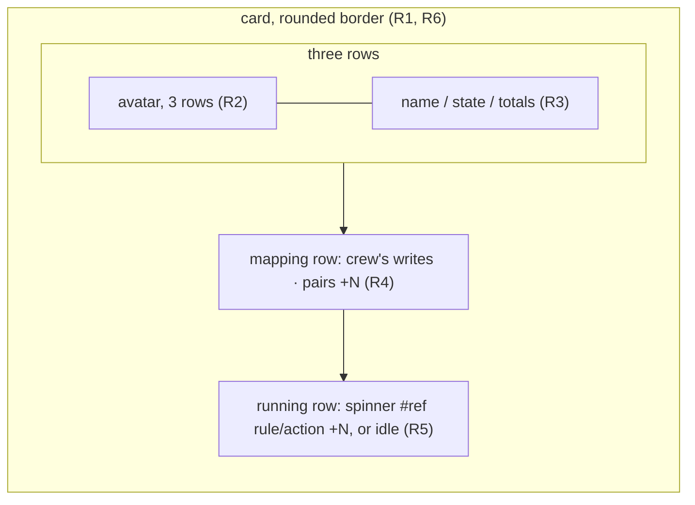

# Bots section as a row of cards - Plan

## Goal Capsule

- **Objective:** while crew runs, the boss tells each bot apart at a glance and reads, from one card per bot, whether it can act, what it cost, what acts as it and what runs as it now, in a section that looks like the rest of the live view.
- **Means:** the live view's Bots section is redrawn as a row of bordered cards with a generated avatar each, from the data the section already has (KTD1 to KTD10).
- **Product authority:** the boss, through the brainstorm of #136 and a terminal prototype in which they picked the card shape. The Product Contract wins on behaviour; the KTDs win on mechanism.
- **Stop conditions:** stop and report when a settled Key Decision proves unworkable, or when a gate in the Verification Contract cannot pass without changing a requirement.
- **Execution profile:** one branch, units in order U1 to U5, one pull request whose body carries `Closes #136`. Only `internal/ui/tui` and the README change.
- **Open blockers:** none.

---

## Product Contract

Product Contract from issue #136. Planning answers its Outstanding Questions (KTD2, KTD3, KTD4, KTD9). Product Contract preservation: changed: R14 — `docs/guide/crew.mdx` was removed with the docs.page site in #141, so the README's live-view paragraph takes its place.

### Summary

The Bots section becomes a row of cards with rounded borders: one card per configured bot, then one for you. Each card holds a pixel avatar generated from the name, the name, the state, this run's totals, what acts as the entry and what runs as it now. Cards that do not fit the width scroll sideways as the board's columns do. In a short window the cards collapse to a one-row strip.

### Problem Frame

#130 added the Bots section under the header. Each entry takes two rows of indented text: a name row with a state and floating totals, then a row three spaces in that lists the rule/action pairs and the running actions after `▸`. The boss called it the old style, out of place in a view that uses gradients, pills and board cards elsewhere.

The section also contradicts itself. With no bot configured, its rule says `no bots` above a `you` entry. Its pair list is cut mid-item (`implement/code · i…`), and its `▸` glyph appears in no other section.

### Key Decisions

- **One bordered card per entry, side by side.** (session-settled: user-directed — chosen over a one-row presence strip with the focused bot spelled out below it, and over a two-row-per-bot profile list with pills and chips: the boss judged all three rendered in the terminal and picked the cards.) Governs R1, R2, R3, R4, R5, R6.
- **Cards that do not fit the width scroll sideways, as the board's columns do.** (session-settled: user-directed — chosen over wrapping to a second row of cards and over shrinking every card to share the width: the height stays fixed and the board already sets the pattern.) Governs R8, R9.
- **The section still gives way last, and then collapses to a one-row strip.** (session-settled: user-directed — chosen over collapsing the cards before any other section shrinks, and over collapsing them right after Events: it keeps #130's order, which put Bots last.) Governs R10.
- **This work covers the Bots section only.** (session-settled: user-directed — chosen over restyling the whole live view in the same card language, and over listing the other indented sections in this plan: another section's restyle gets its own issue.) Governs R11.
- **Bots joins the tab focus cycle, so ←→ can scroll the cards.** (session-settled: user-approved — proposed in the scoping synthesis with the trade-off that ←→ then depends on focus; the boss confirmed.) Governs R9.
- **A card has a minimum width of about 24 columns.** (session-settled: user-approved — proposed in the scoping synthesis with its consequence that at 80 columns three cards fit, so with three bots the `you` card scrolls off; the boss confirmed.) Governs R8.
- **The section's data does not change; only its drawing does.** Each entry's state, totals, pairs, writes marker and running actions keep the meaning #130's plan gives them, so the change stays in the renderer. Governs R12.

### Requirements

**The cards**

- R1. The Bots section shows one card per entry, in a single row under its rule, in today's order: the default bot first, the other bots in config order, and the `you` card last. Each card has a rounded border.
- R2. Each card opens with an avatar: a small, left-right symmetric pixel pattern generated from the entry's name, three rows tall. The same name always gives the same pattern and colour. Colours come from the accent family, never the warning or error colours. A bot's avatar turns grey while its state is not `acting`, like someone offline; the `you` avatar keeps its colour.
- R3. Beside the avatar, the card shows three rows: the name in bold, then the state, then the totals. The state reads `● acting` in the success colour, or `▲` and the short state in the warning colour, such as `▲ no key` or `▲ writes as you`. On the `you` card the state row shows the gh login as `@login`, muted, or nothing when the login is unknown. The totals row shows the longest form of #130's totals that fits the card (`3 actions · $0.42 · 310k tokens` down to `$0.42`), or `no actions yet` in the subtle colour before an action ends.
- R4. Under the avatar, a mapping row shows `crew's writes` in the accent colour on the entry crew writes as. It then lists the rule/action pairs that act as the entry as whole items, ending in `+N` for the pairs that do not fit. A bot that cannot act at startup starts this row with `→ you`.
- R5. The last row lists the actions running as the entry. Each shows the spinner, the issue reference (linked as elsewhere in the view) and the rule/action, as whole items with `+N`. With nothing running, the row reads `idle` in the subtle colour.
- R6. A card's border is in the strong accent colour while at least one action runs as its entry, and in the subtle colour otherwise.

**The rule**

- R7. The section's rule counts the bots as today, such as `2 acting · 1 cannot act`, and reads `only you` when the config names no bot. It never says `no bots` while a card shows.

**Width and scrolling**

- R8. Cards keep a minimum width of about 24 columns and share the window's width up to a maximum. The cards that do not fit are hidden, and the section marks how many are hidden on each side with `◂ N` and `N ▸`, the way the board marks its hidden columns.
- R9. Bots joins the tab focus cycle. While Bots has focus, ←→ scroll its cards. Otherwise ←→ scroll the board, as today. The help names both uses.

**Height**

- R10. The section's height is fixed: its rule plus one row of cards. When the window runs out of rows, the existing order holds: Events shrinks first, then Handled, then Actions' session lines, then board cards. Then the cards collapse to a one-row strip, and only after that is the view cut. In the strip, each entry shows a mark in its avatar's colour, its name, and a glyph: `●` while acting, `▲` while it cannot act, and the spinner with a count while actions run as it.

**Unchanged**

- R11. The header, its warnings, the other sections, Events and `--plain` do not change.
- R12. Each entry's data keeps the meaning it has in `docs/plans/2026-10-04-1217-feat-mates-section-plan.md` (R2 to R12 and KTD4 to KTD9 there): which entries exist and in what order, their states, totals, pairs, writes marker and running actions.
- R13. On a light terminal background, the avatar colours and card borders use shades that read on light backgrounds, like the rest of the palette.
- R14. The README's live-view paragraph describes the cards, their scrolling and Bots' place in the focus cycle.

A card's layout, top to bottom:

### Acceptance Examples

- AE1. **Covers R1, R2, R3, R4, R5, R6.** Given the default bot `clerk` acting with three ended actions, `developer` acting with #1 `development/lfg` running, `reviewer` with no key, and you, at 120 columns, four cards show in that order. `clerk`'s card shows `● acting`, its totals, `crew's writes` and `idle`, with a subtle border. `developer`'s card shows `⠋ #1 development/lfg` and has a strong accent border. `reviewer`'s avatar is grey, its state reads `▲ no key`, its mapping row starts with `→ you`, and its totals read `no actions yet`. The `you` card shows `@` and the login.
- AE2. **Covers R7.** Given a config with no bot, the section shows only the `you` card, and the rule reads `only you`.
- AE3. **Covers R8, R9.** Given three bots at 80 columns, three cards show and the section marks `1 ▸`. After tab gives Bots focus, → shows the `you` card and the section marks `◂ 1`. With Events focused, → scrolls the board instead.
- AE4. **Covers R10.** Given a window too short for every section, once Events, Handled, Actions' session lines and board cards have shrunk, the cards give way to a one-row strip in which `developer` shows the spinner and `1`, and `reviewer` shows `▲`. Only then is the view cut.
- AE5. **Covers R2, R3.** Given the default bot's writes fall back to you mid-run, its avatar turns grey and its state reads `▲ writes as you`. When a bot's failed token renews, its avatar regains its colour and its state reads `● acting` again.

### Scope Boundaries

- Restyling any other section, including Handled's indented reasons: each gets its own issue.
- Changing which entries the section has, their states, totals or warnings.
- Real GitHub avatars or terminal image protocols: the avatar is generated from the name.
- Acting on a bot from its card: #130's rule that no key of the live view acts on a bot holds.
- Motion beyond the existing spinner.

### Dependencies / Assumptions

- The section's data already reaches the renderer: each entry's name, `you` flag, login, state, writes marker, pairs, running actions and totals (`core.BotView` in `internal/core/bots.go`).
- The board's sideways scrolling and its `◂ N` / `N ▸` markers are the pattern R8 and R9 follow.

### Sources / Research

- The prototype the boss judged: `.context/compound-engineering/ce-prototype/2026-10-05-bot-cards/` (ignored by git, in the checkout where the brainstorm ran). `01-card-shape/main.go` variant A is the chosen card; its identicon, state glyphs, totals forms and whole-item `+N` cutting are the reference for R2 to R5. `decisions.md` records the choice.
- Today's section: `internal/ui/tui/bots.go` (`botsSection`, `botsSummary`, `botDetails`), drawn in `internal/ui/tui/testdata/running.golden`, `handled.golden` and `warning.golden`.
- Palette: `internal/ui/tui/styles.go`. Board cards and sideways scrolling: `internal/ui/tui/board.go` (`layout`, `boardLayout`, `boardRow`). Focus cycle: `internal/ui/tui/keys.go` and `focus` in `internal/ui/tui/model.go`. Height budget: `budget` in `internal/ui/tui/layout.go`.
- #130's plan, whose data and order this keeps: `docs/plans/2026-10-04-1217-feat-mates-section-plan.md` (KTD11 there is the "gives way last" rule this plan carries forward).
- Learning: `docs/solutions/design-patterns/live-view-scroll-sections-take-a-fixed-height.md`. A section that changes height moves every test pinned to a window height near a budget boundary.

---

## Planning Contract

### Key Technical Decisions

- KTD1. **Cards are drawn line by line, not with a Lip Gloss border style.** Each card is a list of rows: a top border `╭─…─╮`, five content rows `│ ` + padded content + ` │`, and a bottom border, with the border glyphs from `lipgloss.RoundedBorder()` in the border colour of R6. Cards in a row are joined line by line with one space between them. This matches how `board.go` draws its columns with `pad` and `fit`, keeps every card exactly its computed width, and keeps the content's own styles intact. A card is `botCardRows` (7) rows tall.
- KTD2. **Card sizes: minimum 24 cells, maximum 34, one cell between cards.** The row has `m.width - 1` cells after the leading space every section keeps. When all cards fit at the minimum, they share that width equally, capped at the maximum. Inside the border and its padding a card has `width - 4` cells; the avatar takes 5 of them plus one space. At 120 columns four cards are 29 wide, as in the prototype; at 80 columns three are 25 wide. Governs R8 (with its Key Decision).
- KTD3. **The card row scrolls like the board, one card per step, with its markers in the rule's summary.** A pure layout function, shaped like `layout` in `board.go`, takes the entry count, the width and an offset. When every card fits it shows them all. Otherwise it shows as many as fit at the minimum width from the clamped offset, and counts those hidden before and after. The rule's summary then ends in ` · ◂ N` and/or ` · N ▸` after the counts (`2 acting · 1 cannot act · 1 ▸`), only for a side that hides cards. The Handled rule already carries its scroll hint in its summary (` · ↑↓ scroll`). Edge slots in the card row, as the board uses, would cost 8 cells and leave two cards at 80 columns, which breaks AE3. `Model.botsOffset` holds the offset, clamped through the layout as `scrollBoard` does. Governs R8, R9.
- KTD4. **The avatar is a 5×3-cell identicon from an FNV hash of a seed.** It is 5 pixels wide and 6 tall, drawn with half blocks (`▀`, `▄`, `█`, space), so each cell holds two square pixels. Columns 0 and 1 mirror columns 4 and 3. The pixel bits come from FNV-64a of the seed. The hue is FNV-32a of the seed, modulo the palette's avatar hues. The seed is the entry's name; the `you` card's seed is the gh login when known, so each boss gets their own avatar, and `you` otherwise. Governs R2.
- KTD5. **Avatar colours live in the palette, six hues per background plus an offline grey.** Dark: `#b48cff`, `#8f7bff`, `#ff60ff`, `#68ffd6`, `#5fd7ff`, `#ff9fd2` (the prototype's). Light: `#7a4fd6`, `#5a3fd0`, `#b02fb0`, `#0a8f6a`, `#1a7fb0`, `#c0407f`, darker shades of the same family. The offline grey is `subtle` on dark and `muted` on light, because the light `subtle` (`#c9c6d8`) is too faint for a pixel pattern. Borders use the existing `strongAccent` and `subtle` of each palette. Governs R2, R13.
- KTD6. **The short state comes from `BotView.State` with its `cannot act: ` prefix dropped.** `acting` renders `● acting`, glyph and word in the success colour. Every other state renders `▲ ` plus the short state in the warning colour (`no key`, `writes as you`, `token not renewed`). The core's prefix constant is unexported, so the TUI trims the literal; a test pins it against a state the core produces. The name, state and `@login` rows are cut with an ellipsis at the text column's width (card width less 4 for border and padding, less 6 for the avatar and its space), so a 24-cell card cuts `▲ token not renewed` and long names rather than breaking its border. Governs R3.
- KTD7. **Totals take the longest form that fits, built from the same parts as today.** The parts are the count words (`3 actions`) followed by `spendParts(s)` (cost and tokens, or `cost and tokens not reported`). The forms, in order: every part (`3 actions · $0.42 · 310K tokens`); the count and the first spend part (`3 actions · $0.42`); the spend parts without the count (`$0.42 · 310K tokens`); the first spend part alone (`$0.42`). The first form that fits wins; otherwise the last is cut with an ellipsis. The text column is at most 24 cells (KTD2's maximum less 10), so the full form shows only on a wider card; the count-and-cost form keeps the count on the 29-cell cards of four entries at 120 columns. With no ended action the row reads `no actions yet` in the subtle colour. Governs R3.
- KTD8. **One helper joins whole items and ends in `+N`.** It takes styled items, a separator and a width, and keeps the most leading items that fit together with a muted `+N` for the rest. When not even one item and its `+N` fit, it cuts the first item with an ellipsis. The mapping row, the running row and the strip all use it. Governs R4, R5, R10.
- KTD9. **The strip is one row of whole entries from the first, ending in `+N`.** Each entry reads `■ name glyph`, the mark in the avatar's colour (grey when offline). The glyph: a bot that cannot act shows `▲`, followed by the spinner and the count when actions run as it; a running entry shows the spinner and the count; an acting idle bot shows `●`; the idle `you` entry shows nothing. Entries are separated by two spaces. The strip ignores the scroll offset; ←→ with Bots focused still move the clamped offset, which the cards use once the window has room for them again. Governs R10.
- KTD10. **`budget.botDetails` becomes `budget.botCards`, cleared last, as #130's KTD11 did.** The section is its rule plus `botCardRows` rows with cards, or plus one row as a strip, whatever the entry count. Before the first snapshot there is no entry: the section shows ` none` in the muted colour, padded to the same height. Governs R10.
- KTD11. **Bots is the first section in the focus cycle.** `focusBots` sits between `focusNone` and `focusHandled`, so tab moves top-down: Bots, Handled, Events, none. The Bots rule takes the focus marker like the others. While Bots has focus, ←→ call a `scrollBots` shaped like `scrollBoard`; otherwise they scroll the board. ↑↓ and the page keys do nothing while Bots has focus. The short key help reads `←→ board/bots`, and the overlay's ← and → entries read `board or bots left` and `board or bots right`. Governs R9.

### Assumptions

These are planning choices the brainstorm left open (its Outstanding Questions). No user was present to confirm them.

- The card sizes of KTD2 (24, 34, one-cell gap) and the totals forms of KTD7.
- The `you` avatar seed of KTD4: the login when known, else `you`.
- One card per ←→ step, and the markers in the rule's summary (KTD3).
- The strip's overflow (KTD9): whole entries from the first, then `+N`, not scrolled.
- The light-background avatar shades of KTD5, chosen by eye against `#ffffff`; they may need tuning once seen in a light terminal.
- `● acting` draws its word in the success colour too, as R3 reads; the prototype drew the word in the text colour.
- R14's README description stays one or two sentences, in keeping with the README's single paragraph on the live view.

### Considered and not built

- **Edge slots for the markers, reserved only on the side that hides cards.** It keeps the board's placement, but the number of cards shown then changes as you scroll into the middle of five or more entries, so the row jumps. Revisit if the rule's summary proves too easy to miss.
- **A Lip Gloss `Border` style for each card.** It works, but the box model of Lip Gloss v2 (width counting border and padding) would have to be pinned by tests anyway, and KTD1's line-by-line drawing matches the board's code.

### Risks

- **Every golden file and several height-pinned tests move.** The section grows from its rule plus two rows per entry to its rule plus seven rows. `TestTheCardCapCountsOnlyTheDrawnColumns` and `TestAShortWindowTakesOneCardOffACappedColumn` in `internal/ui/tui/board_test.go`, and `fit-28-rows.golden`, sit on budget boundaries. The learning above says to move the pinned heights, not to bend the budget. Review each golden diff by eye.
- **The cards need about five more rows than today's section.** At 80 columns with only `you`, the view that fits in 28 rows today needs about 33 with cards, so an 80×28 terminal shows the strip. This is the settled order of R10 (the prototype's notes already gave a card seven rows); the strip keeps every entry visible in one row.
- **Lint limits.** `.golangci.yml` turns on almost every linter (magic numbers, function length, cyclomatic complexity), and Codacy's Lizard limits apply. Name the sizes as constants and keep the card, totals, avatar and layout code in small functions.
- **A window narrower than one card.** With fewer than 24 cells the layout still shows one card, at the width available; content rows must clamp to at least zero cells and never panic (`TestANarrowShortWindowRendersWithoutPanicking`).

---

## Implementation Units

### U1. Avatars

- **Goal:** a pure function draws an entry's 5×3 identicon in its hue, or in the offline grey.
- **Requirements:** R2, R13; KTD4, KTD5.
- **Dependencies:** none.
- **Files:** `internal/ui/tui/avatar.go` (new), `internal/ui/tui/styles.go`, `internal/ui/tui/avatar_test.go` (new).
- **Approach:**
  1. Add the avatar hues and the offline grey to `palette` and to `styles` (KTD5).
  2. In `avatar.go`, a function returns the three styled rows of the identicon for a seed and a colour (KTD4), and a function picks the colour: the hue for the seed, or the offline grey for a bot that is not `acting`. The `you` entry always takes its hue.
- **Patterns to follow:** the prototype's `identicon` and `hue`; `styles.gradient` for building styled cells.
- **Test scenarios:**
  - The same seed gives the same three rows and the same hue twice.
  - Each row is 5 cells wide, and each row reads the same backwards (mirror symmetry), after ANSI is stripped.
  - Two different names (`clerk`, `developer`) give different patterns.
  - A bot whose state is not `acting` gets the offline grey; the `you` entry never does.
  - The hue of every seed is one of the palette's avatar hues, for the dark and the light palette, and none equals the warning or error colour.
  - The `you` seed is the login when one is known and `you` otherwise.
- **Verification:** the avatar tests pass, and the hue list holds no warning or error colour.

### U2. The card

- **Goal:** one entry draws as a 7-row bordered card of a given width.
- **Requirements:** R1 to R6, R12; KTD1, KTD6, KTD7, KTD8.
- **Dependencies:** U1.
- **Files:** `internal/ui/tui/bots.go`, `internal/ui/tui/bots_test.go`.
- **Approach:**
  1. Replace `botDetails` and the two-row entry drawing with a card function: the avatar beside the name, state and totals rows, then the mapping row, then the running row, inside the border (KTD1).
  2. The state row follows KTD6, and `@login` muted on the `you` card, or nothing.
  3. The totals row follows KTD7, reusing `spendParts` and the count words of `botTotals`.
  4. The mapping and running rows use the item helper of KTD8. `→ you ` in the warning colour leads the mapping row of an `ActsAsYou` bot. Running items are the spinner (`m.spin()`), the linked reference (`styles.link` with `issueURL`) and the rule/action.
  5. The border is `strongAccent` when `Running` is not empty, `subtle` otherwise.
  6. Every text from the snapshot goes through `clean`, as today.
- **Patterns to follow:** `cardLines` and `boardRow` in `internal/ui/tui/board.go` for padded cells; the prototype's `variantA`, `totals` and `items`.
- **Test scenarios:**
  - Covers AE1. At 120 columns with AE1's four entries, each card's rows (escape codes stripped) show: `clerk`, `● acting`, its totals, `crew's writes` and `idle`; `developer` with `⠋ #1 development/lfg`; `reviewer` with `▲ no key`, `no actions yet` and a mapping row starting `→ you`; `you` with `@octocat`.
  - Covers AE1. The `developer` card's border is drawn in the strong accent and the `clerk` card's in the subtle colour (checked on the styled output, by the border glyph's colour).
  - Covers AE5. A default bot with state `writes as you` shows `▲ writes as you` and a grey avatar; the same bot back at `acting` shows `● acting` and its hue.
  - A state of `cannot act: no key` renders as `▲ no key`, using a `BotView` produced by the core so the prefix stays in step.
  - The totals function, given text widths directly: at 31 cells or more it reads `3 actions · $0.42 · 310K tokens`; at 19 (a 29-cell card) `3 actions · $0.42`; at 14 (a 24-cell card) `$0.42` because `$0.42 · 310K tokens` is 19 cells; under 5 cells it is cut with an ellipsis.
  - A 24-cell card holding a 30-character name and the state `token not renewed` cuts both with an ellipsis and keeps its border whole.
  - Five pairs on a 24-cell card show the leading pairs that fit, whole, then `+N`; no pair is cut mid-word.
  - Three running actions on a narrow card show whole items, then `+N`.
  - A pair holding an escape sequence is drawn clean.
  - Every card row is exactly the card's width in cells.
- **Verification:** the card tests pass; a card's rows always measure the card width.

### U3. The card row, scrolling and focus

- **Goal:** the cards sit side by side under the rule, scroll sideways while Bots has focus, and the rule counts the bots and marks the hidden ones.
- **Requirements:** R1, R7, R8, R9; KTD2, KTD3, KTD11.
- **Dependencies:** U2.
- **Files:** `internal/ui/tui/bots.go`, `internal/ui/tui/keys.go`, `internal/ui/tui/model.go`, `internal/ui/tui/layout.go`, `internal/ui/tui/bots_test.go`, `internal/ui/tui/layout_test.go`.
- **Approach:**
  1. A pure layout function for the card row (KTD2, KTD3) returns the shown entries, the card width and the counts hidden on each side.
  2. `botsSection` draws the shown cards joined line by line after the leading space, and returns the rule's summary.
  3. `botsSummary` returns `only you` when no bot is configured (R7) and appends the markers of KTD3.
  4. Add `focusBots` and `botsOffset` to the model, route ←→ by focus, add `scrollBots`, and pass the focus to the Bots rule (KTD11).
  5. Update the short key help and the overlay's ← and → descriptions (KTD11).
- **Patterns to follow:** `layout`, `boardLayout` and `scrollBoard` in `internal/ui/tui/board.go` and `keys.go`.
- **Test scenarios:**
  - Covers AE2. With only the `you` entry, one card shows and the rule reads `only you`.
  - Covers AE3. With three bots and you at 80 columns, three cards show and the rule ends in `1 ▸`. After tab then →, the `you` card shows, `clerk` is hidden and the rule ends in `◂ 1`.
  - Covers AE3. With Events focused, → moves the board and leaves the Bots row as it was.
  - At 120 columns all four cards show, each 29 cells wide, and the rule has no marker.
  - → past the last card and ← past the first leave the offset clamped.
  - Tab from no focus focuses Bots, and the Bots rule shows the focus marker; shift+tab from Bots goes back to no focus.
  - ↑↓ while Bots has focus change nothing.
  - The help overlay and the key help line name both uses of ←→.
  - The layout function, table-tested: every card fits; one hidden after; one before and one after with five entries and an offset of 1; a width under 24 shows one card at the width available.
- **Verification:** the AE2 and AE3 tests pass. The existing focus tests in `internal/ui/tui/layout_test.go` (`TestFocusAndScrollMoveHandledAndEvents`, `TestPageKeysScrollTheFocusedSectionByAPage` and the Events scroll test near its end) gain one tab press to reach Handled and Events past Bots, and the board-scroll tests pass unchanged.

### U4. Height and the strip

- **Goal:** the section keeps a fixed height and collapses to a one-row strip last, before the cut.
- **Requirements:** R10, R11; KTD9, KTD10.
- **Dependencies:** U3.
- **Files:** `internal/ui/tui/layout.go`, `internal/ui/tui/bots.go`, `internal/ui/tui/bots_test.go`, `internal/ui/tui/layout_test.go`, `internal/ui/tui/board_test.go`, `internal/ui/tui/testdata/*.golden`.
- **Approach:**
  1. Rename `budget.botDetails` to `botCards`. `botsSection` draws the cards or the strip from it, and pads to the fixed height before the first snapshot (KTD10).
  2. Draw the strip per KTD9 with the item helper.
  3. Move the window heights the board-cap tests pin to the new budget boundaries, and rewrite the old two-row Bots tests (`TestASecondLine…`, `TestAE6…`) for the cards and the strip.
  4. Regenerate the golden files with `-update` and review each diff: only the Bots section, the key help line and rows that moved down change.
- **Patterns to follow:** the current `budget` steps and #130's AE6 test.
- **Test scenarios:**
  - Covers AE4. At the tallest window that cannot hold the cards once Events, Handled, the said lines and the board cards have shrunk, the section is its rule plus one strip row, in which `developer` shows the spinner and `1` and `reviewer` shows `▲`, and the view is not cut.
  - Covers AE4. One row shorter than the strip's view, the view is cut.
  - With room for every section, the section is its rule plus seven rows, for one entry and for four.
  - The strip with more entries than fit ends in `+N`, with no entry cut in half.
  - The strip's glyphs: `●` for an acting idle bot, nothing for idle `you`, `▲` then the spinner and count for a bot that cannot act with actions running as it.
  - Before any snapshot, the section shows ` none` and keeps its height.
  - The golden views render with cards; `TestNoGoldenViewSaysAnOldWord` still passes.
- **Verification:** the whole `internal/ui/tui` suite passes, and each golden diff was read.

### U5. README

- **Goal:** the README says what the Bots section shows and how to scroll it.
- **Requirements:** R14.
- **Dependencies:** U4.
- **Files:** `README.md`.
- **Approach:** extend the live-view paragraph under "crew shows a live view…" with one or two sentences: one card per bot and one for you, tab to focus Bots and ←→ to scroll its cards.
- **Test expectation:** none -- documentation only.
- **Verification:** the paragraph matches the behaviour U3 and U4 built.

---

## Verification Contract

| Gate | Command | Proves |
| --- | --- | --- |
| Format | `gofmt -l cmd internal tools` prints nothing | formatting |
| Vet | `go vet ./...` | vet |
| Lint and layering | `go run github.com/golangci/golangci-lint/v2/cmd/golangci-lint@v2.14.0 run` | zero findings, depguard layering |
| Tests | `go test -race ./...` | every unit's scenarios, golden views |
| Coverage | `go test -race -covermode=atomic -coverpkg=./... -coverprofile=coverage.out ./...` then `go run github.com/vladopajic/go-test-coverage/v2@v2.19.0 --config=.testcoverage.yml` | total at least 90% |
| Changed-line coverage | `git diff -U0 origin/main...HEAD \| go run ./tools/diffcover -profile coverage.out` | changed lines at least 90% |
| Vulnerabilities | `go run golang.org/x/vuln/cmd/govulncheck@v1.8.0 ./...` | no new finding |

AE1 to AE5 each have a test that names them in its comment (`Covers AE<N>`).

---

## Definition of Done

- U1 to U5 are built and every gate above passes.
- The golden files were regenerated and each diff read; only the Bots section, the key help and rows that moved changed.
- No code from abandoned attempts is left in the diff, and the old two-row drawing (`botDetails`, `entryRows`) is gone.
- The pull request body carries `Closes #136`.
