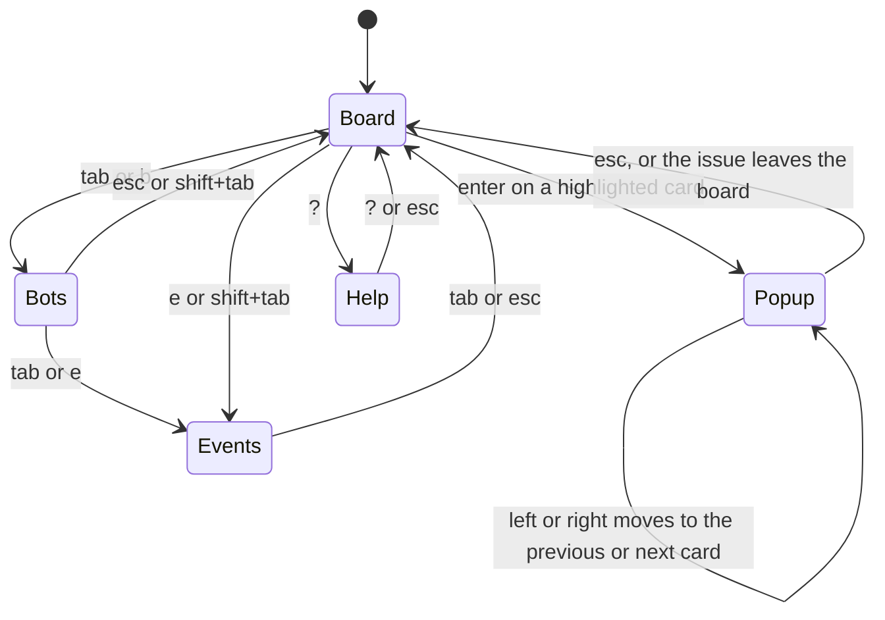
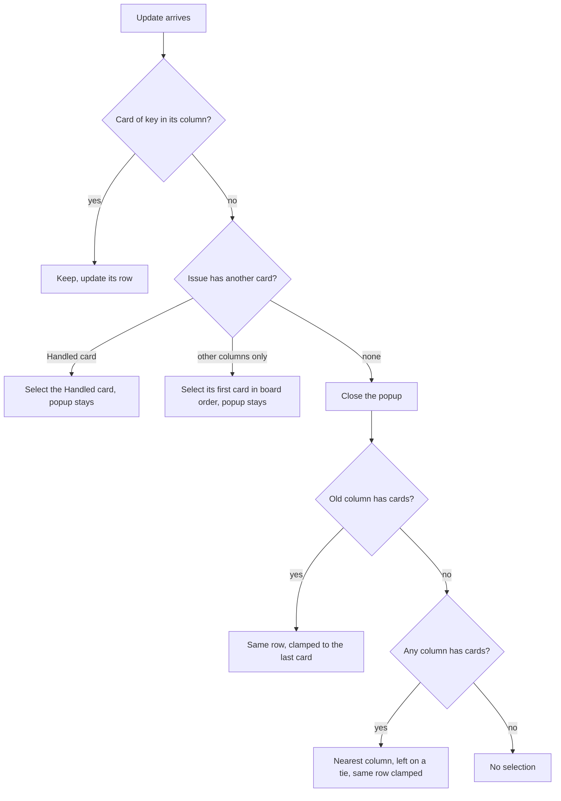
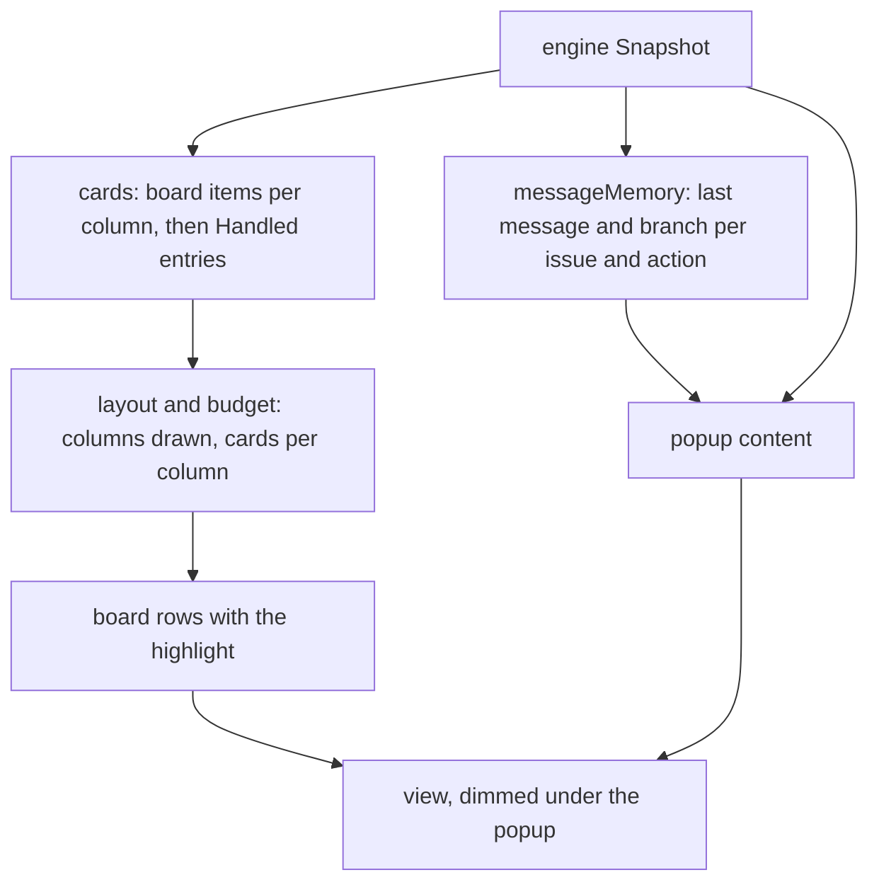

# Board cards, the Handled column and the card popup - Plan

## Goal Capsule

- **Objective:** while crew runs, the boss reads what is happening to each issue from its card on the board, and opens one issue's full detail without leaving the live view, so the view no longer needs sections that repeat the board.
- **Means:** board cards become bordered cards with labelled rows (KTD1, KTD2), the Handled section becomes the board's last column (KTD3), held issues the board cannot show get a column of their own (KTD13), the board takes keyboard focus with a highlighted card (KTD4 to KTD6), and Enter opens a popup over the dimmed view (KTD7 to KTD9). The Actions section goes away and Queues moves beside Events (KTD10).
- **Product authority:** the boss, through the brainstorm of #151 and a browser sketch in which they picked the card face (A2) and the popup placement (X). The Product Contract wins on behaviour; the KTDs win on mechanism. This plan also covers #150.
- **Stop conditions:** stop and report when a settled Key Decision proves unworkable, or when a gate in the Verification Contract cannot pass without changing a requirement.
- **Execution profile:** one branch, units in order U1 to U7, one pull request whose body carries `Closes #151`. Only `internal/ui/tui`, the README and `CONCEPTS.md` change, plus one field the core's `HandledView` gains for the issue's total cost (KTD14); the engine and `--plain` do not.
- **Open blockers:** none.

---

## Product Contract

Product Contract from issue #151. Planning answers its Deferred-to-Planning questions (see the note under Outstanding Questions). Product Contract preservation: Product Contract unchanged.

### Summary

Each board card gets a rounded border like the Bots cards: the issue's reference and title, then three rows each led by a short muted label: `run`, `bots` and `via`. The board has focus from the start. The arrow keys move a highlight from card to card, Enter opens a popup in the middle of the dimmed view with the issue's labels, actions, each action's last message and its events, and Esc closes it. The Actions section is removed, and the Handled section becomes the board's last column.

### Problem Frame

A board card is two rows behind a `▌` bar: the reference and title, then a state such as `⠋ running`. What runs on the issue, as which bot, on which queue and what it last said sits in the Actions section, and why an issue stopped sits in the Handled section. To follow one issue the boss matches rows across three sections by issue number. Those sections also spend rows of the view on what the board could show itself.

The Bots section was redrawn as bordered cards with avatars in #145. The board's cards have not had that pass and look like the old indented rows beside them.

### Key Decisions

- **Card face A2: three rows, each led by a short muted label.** (session-settled: user-directed — chosen over icons per row (A1) and over the rule name on the border (A3), and earlier over a one-row-per-action list (B) and an avatar-led card (C): the boss could not tell what `code` or `default` meant without a label, and words need no legend.) Governs R1, R2, R3, R4, R5.
- **The popup is a centred box over the dimmed view.** (session-settled: user-directed — chosen over a right-hand drawer and over a full-screen detail view: the board stays in sight around it.) Governs R13, R14.
- **Keyboard only.** (session-settled: user-directed — chosen over keyboard and mouse clicks, and over mouse capture as an opt-in: capturing the mouse would stop terminal text selection and the clickable issue links.) Governs R9.
- **The board is the home focus.** (session-settled: user-directed — chosen over typing an issue number to open it and over digit keys per section: the boss does not want to press Tab to reach the cards.) Governs R9, R10, R11.
- **A column shows fewer whole cards and scrolls, rather than shrinking its cards.** (session-settled: user-directed — chosen over dropping every card back to two rows when room runs short, and over dropping rows first and then cards.) Governs R7.
- **Cards and popup show only what crew already knows.** (session-settled: user-directed — chosen over fetching every GitHub label and the pull requests that link to the issue: no change to the tracker or to each poll.) Governs R15, R16.
- **Cost is the issue's, and live issues show none in this work.** (session-settled: user-directed — the boss wants one cost per issue, not per action or pull request. The view has cost and pull requests only for handled issues, so showing them on live cards moves to #161.) Governs R4, R20.
- **The Actions and Handled sections go; Queues and Events stay.** (session-settled: user-directed — the boss chose to absorb Actions and Handled, and to show the per-issue part of Queues and Events on cards and in the popup while keeping both sections for now.) Governs R8, R22. Conflict call-out: the Actions section is today the only place a held issue with no board card shows (a written board need not list a rule's running label, and its columns show issues only, so a rule taking pull requests never has a card there). KTD13 keeps that work visible with a column drawn only while it holds cards; the decision stands.
- **Queues takes the side Handled leaves, beside Events.** (session-settled: user-approved — proposed in the scoping synthesis; the boss confirmed.) Governs R22.
- **Letter keys jump to the other sections.** (session-settled: user-approved — proposed in the scoping synthesis, with the letters left to planning so they avoid the keys in use; the boss confirmed.) Governs R11.

### Requirements

**The card**

- R1. Each issue on the board is a card with a rounded border, as wide as its column. The first row is the issue's reference, linked as elsewhere in the view, and its title, cut to fit.
- R2. The `run` row lists each of the issue's actions as a whole item: a running one with the spinner, its action name and how long it has run; a waiting one with `○`, its name and `waiting`. Items that do not fit end in a muted `+N`. With no action, the row shows the issue's claim state as today (`○ idle`, `◌ taking`, `■ stopping`, `! owed`).
- R3. The `bots` row lists every bot the issue's running actions act as, each as a mark in its avatar colour and its name, the same colour as its card in Bots. An issue can have several bots, so the row ends in `+N` for the ones that do not fit. With no action running, the row reads `none` in the subtle colour.
- R4. The `via` row names the queues of the issue's actions. A live card shows no cost and no pull request (see R20).
- R5. The labels `run`, `bots` and `via` are muted words at the start of their rows, the same width, so the values line up.
- R6. A card's border is in the strong accent colour while one of its actions runs, and in the subtle colour otherwise, as on the Bots cards. The highlighted card's border is in a colour of its own, distinct from both.
- R7. A column shows as many whole cards as fit the room the board has, at most five, then a muted `+N more`. Moving the highlight past the last card shown scrolls the column, so every card can be reached.

**The Handled column**

- R8. The issues crew stopped handling show as cards in the board's last column, titled `Handled`, in today's order (needing attention first). The column's header keeps Handled's count and cost. A Handled card shows the reference and title, then the group as a status line (`▲ needs attention` in the error colour, given up in a muted colour), then the first reason with `+N` for the rest. Its border takes the group's colour.

**Keys**

- R9. The live view takes keyboard input only and does not capture the mouse, so text selection and the issue links keep working.
- R10. The board has focus when the view opens. ←→ move the highlight to the card in the next or previous column, and the board scrolls sideways to keep it in view. ↑↓ move it within a column. Enter opens the highlighted card's popup.
- R11. A letter key jumps focus to each of the other sections that take keys, and Esc returns focus to the board. Tab and shift+Tab still cycle through the board and those sections. The letters do not reuse `q`, `h`, `j`, `k`, `l` or `?`.
- R12. The `?` help lists every key and says what `run`, `bots` and `via` mean.

**The popup**

- R13. The popup is a box in the middle of the view, over the rest of the view drawn dimmed. Its title is the issue's reference and title. Esc closes it, ←→ move it to the previous or next card without closing, and ↑↓ scroll it when its content is taller than the room. `q` still stops crew.
- R14. The popup only shows information. No key in it changes anything on GitHub, opens a browser or starts an action.
- R15. The popup's header shows, each after a muted label: the rule, the issue's crew state label and the board labels it carries (as chips), its kind, its priority, whether it is blocked, and its URL.
- R16. The popup lists the issue's actions in a table with a header row: action, bot, queue, state and branch. The state shows `running` and the time, `waiting`, done or failed.
- R17. Under each action's row, the popup shows the last message that action's session said. A failed action shows why it failed instead, in the error colour. An action with no message yet shows nothing there.
- R18. The view keeps an action's last message after the action ends, for as long as its issue is on the board. Messages said before crew started are not known.
- R19. Under the actions, the popup lists this issue's events from the view's recent events, oldest first, with their times.
- R20. A Handled card's popup also shows the issue's total cost, once, and the pull request each action opened. Showing cost and pull requests for live issues is #161.
- R21. The popup follows its issue as the view updates: it stays open when the issue moves to another column or to Handled. When the issue leaves the board, the popup closes and the highlight moves to the nearest card.

**The rest of the view**

- R22. The Actions section and the Handled section are removed. Queues sits beside Events. Bots, the board, Queues and Events keep their content.
- R23. `--plain` output does not change.
- R24. The README's live-view paragraph describes the cards, the Handled column, the popup and the keys.

### Acceptance Examples

- AE1. **Covers R2, R3, R4.** Given #1 runs `implement/code` as `crew-dev` and `implement/tests` as `crew-qa`, both on queue `default`, its card reads `run ⠋ code 5m · ⠋ tests 7m`, `bots ■ crew-dev ■ crew-qa` and `via default`.
- AE2. **Covers R2, R3.** Given #2 was taken and its only action waits for a slot on queue `clerk`, its card reads `run ○ check waiting`, `bots none` and `via clerk`.
- AE3. **Covers R7.** Given a column holds seven issues and the board has room for three cards, the column shows three cards and `+4 more`. Pressing ↓ on the third card highlights the fourth, and the column scrolls to show it.
- AE4. **Covers R10, R13.** Given the view just opened, pressing → then Enter opens the popup of the first card in the second column. Pressing → in the popup shows the next card's popup, and Esc closes it with that card highlighted.
- AE5. **Covers R17, R18.** Given `implement/code` on #1 said "running the tests now" and then succeeded, its row in #1's popup still shows "running the tests now". Given `implement/docs` failed a check, its row shows the check's reason in the error colour.
- AE6. **Covers R21.** Given #5's popup is open and its rule fails, the popup stays open and #5's card moves to the Handled column, highlighted. Given #6's popup is open and #6 is closed on GitHub and leaves the board, the popup closes and the highlight moves to the nearest card.
- AE7. **Covers R8, R20.** Given #5 needs attention because tests and code failed, its Handled card reads `▲ needs attention` and `× tests failed: exited 1 +1`, and its popup lists both reasons, the issue's total cost and the pull request its actions opened.

### Scope Boundaries

- No mouse support (R9).
- No new data from GitHub: no labels beyond crew states and board labels, and no pull requests other than those crew's actions opened.
- Cost and pull requests on live cards and their popups: #161.
- Removing or restyling Queues and Events, and the polish of the header and the other sections: #148.
- Actions from the popup, such as opening the issue in a browser, retrying, or stopping one action.

### Outstanding Questions

**Deferred to Planning** (answered by the Planning Contract)

- The letter for each section (R11), and whether Queues takes focus at all, since it does not scroll today. Answered by KTD4.
- Where the board falls in the order in which sections give up rows to a short window (R7), and the fewest cards a column shows before the view is cut. Answered by KTD10.
- The highlight colour (R6), and the colour of a given-up Handled card's border (R8), in both the dark and the light palette. Answered by KTD11.
- How the view stores each action's last message (R18), given that the engine sends what a session said only while it runs. Answered by KTD9.
- How a popup taller than a short window lays out its header, table and events before it scrolls (R13). Answered by KTD7.

### Sources / Research

- `docs/plans/2026-10-05-0316-feat-bot-cards-plan.md`: the Bots cards (#145) whose border, colours and `+N` items the board cards follow.
- `docs/plans/2026-10-03-2217-feat-live-view-dashboard-plan.md`: the live view's sections and what a board card shows today.
- `docs/solutions/design-patterns/live-view-scroll-sections-take-a-fixed-height.md`: how sections share the height.
- `internal/ui/tui/keys.go`: the `?` help overlay is drawn as a centred box over the view, the pattern the popup follows.
- `internal/ui/tui/board.go`, `internal/ui/tui/actions.go`, `internal/ui/tui/band.go`: today's cards, the Actions section, and the Queues and Handled sections.
- `internal/core/model.go`: `IssueView` and `ActionView` carry no cost or pull request; `HandledView` does, per action.
- `internal/engine/stream.go`: the snapshot's `Said` (running sessions only) and its 100 recent events, which carry the issue's key and reference.

<!-- ce-section: work-relationships -->
### How This Work Fits Together

This plan covers the board's cards, the popup and the Handled column. The surrounding work is the current understanding, not a committed roadmap.

- #150 (Handled as the board's last column): covered by this plan.
- #161 (each issue's cost and pull requests on its card): depends on this plan's cards and popup.
- #148 (a polish pass over every card and section): can proceed independently of this plan; still to decide what Queues and Events become once their per-issue content is on the cards.

---

## Planning Contract

### Key Technical Decisions

- KTD1. **A board card is six rows drawn line by line, sharing the Bots card's frame.** The frame code in `botCard` (a `╭─╮` top row, `│ ` + padded content + ` │` rows, a `╰─╯` bottom row, glyphs from `lipgloss.RoundedBorder()`) moves into one helper that takes the content rows, the width and the edge style; `botCard` and both board card faces call it. A board card is its column's width and `cardRows` becomes 6: the frame and four content rows. Every card on the board has the same height, so `boardRows` still lines up card k of each column on the same rows, and the budget counts cards in steps of 6 rows. The column bounds rise from 18 and 30 cells to 22 and 34: at 34 a card has 25 cells after its frame and label, room for AE1's `⠋ code 5m · ⠋ tests 7m` (22 cells), and at 22 a narrow card still fits `■ crew-dev`, while three columns still show at 80 columns, scrolled or not. Governs R1, R7.
- KTD2. **A live card's four rows: reference and title, then `run`, `bots` and `via`.** Each labelled row is the label, muted, padded to 4 cells, a space, then whole items through `styles.items`, which ends in a muted `+N`.
  - `run` (R2): one item per action that has not ended, in the rule's action order. An action in `PhaseWaiting` is `○` (warning colour), its name and `waiting`. Any other phase is the spinner, the name and `short(m.at.Sub(Started))` once `Started` is set (`⠋ code 5m`), or the phase word before that (`⠋ code starting`). Items are joined by a muted ` · `. With no such action, the row is the claim state as `cardLines` draws it today, and `○ idle` when crew does not hold the issue. A claim of `ClaimOwed` or `ClaimStopping` comes first as its own item even while actions are listed (`! owed · ○ code waiting`), so the warning is never hidden behind waiting actions.
  - `bots` (R3): the entries of `snap.Bots` whose `Running` names the card's issue reference, each once, in the order of `snap.Bots`; the `you` entry counts like a bot. `Running` covers the running, checking and finishing phases only, so an action still creating its workspace or starting shows in `run` before its bot shows here. Each is `■` in `avatarColour(e)` and the name, joined by a space. With none, the row is `none` in the subtle colour.
  - `via` (R4): the held issue's `IssueView.Queue`. An issue crew does not hold shows `none` in the subtle colour. The core gives one queue per issue (its rule's), so the row holds one name.
  - Border (R6): `strongAccent` while crew holds the issue with `ClaimRunning` (today's bar rule), else `subtle`.
  Governs R2 to R6.
- KTD3. **The Handled column is a column the TUI appends after the configured ones.** Its index is `len(cfg.Board) + 1`, after KTD13's `Not on board` column at `len(cfg.Board)`. `cards()` adds one card per `snap.Handled` entry in `byAttention` order, carrying the entry. The layout treats it like any column: it is drawn when every column fits, dropped while empty when they do not, and scrolled to like the others. Its name cell is `Handled` with the count and the run's cost after it, muted, cut to the column width (R8). A Handled card's four rows:
  1. the reference and title;
  2. the status line: `■ given up` (muted) for a dropped move, `▲ needs attention` (error colour) when `needsAttention(e)`, `× <state>` (error colour) for a failure a rule holds again (#109), else `✓ <state>` (success colour), where `<state>` is the last part of `e.To` as the pill uses today;
  3. the first reason as today's `reasons` words it (`× tests failed: exited 1`), with a muted `+N` for the rest, or empty when there is none;
  4. the rule and its duration, muted, then ` · now in <rule>` while a rule holds the issue again.
  The border takes the group's colour: error for `needs attention`, muted for `given up` and for a failure held again, success for the rest. The slide animation (`boardMemory.moved`) treats the Handled column like any other, so a card sliding into it shows the move. Governs R8.
- KTD4. **Focus: the board is the zero value, Queues takes no focus, and `b` and `e` jump.** `focusNone` and `focusHandled` go. The focus values are `focusBoard` (the zero value, so the view opens on the board), `focusBots` and `focusEvents`. Tab cycles board, Bots, Events and back to the board; shift+Tab goes the other way. `b` focuses Bots, `e` focuses Events, and Esc returns to the board. Queues does not scroll, so it takes no focus and no letter. The board's rule takes the focus marker `▸` while the board has focus, as the other rules do. Neither `b` nor `e` is one of `q`, `h`, `j`, `k`, `l` or `?`. Governs R10, R11.
- KTD5. **The highlight is the selected card, held as the issue's key and its column.** The model keeps the key, the column index and the card's row within its column. Before each frame and after each update, the selection is repaired:
  1. The card of that key in that column still exists: keep it, updating its row.
  2. The issue has a card in another column: select its Handled card when it has one, else its first card in board order. The popup, if open, stays open (R21).
  3. The issue has no card left: close the popup and select the card at the same row in the same column, or its last card when the column is shorter. With that column empty, take the nearest column holding cards, the left one on a tie, at the same row clamped.
  4. No card on the board: no selection, and Enter does nothing.
  With no selection and cards on the board, the first card of the first column holding cards is selected, so a view that opens before the first poll gets its highlight once cards arrive. The highlighted card's border is drawn in the highlight colour (KTD11) in place of KTD2's or KTD3's, whichever section has focus, and its first row starts with `▸ ` before the reference, so the highlight reads without colour too. Governs R6, R10, R21.
- KTD6. **↑↓ move within the column and scroll it; ←→ move between columns holding cards.** While the board has focus:
  - ↑↓ (and `k`/`j`) move the selection one card within its column, clamped at the ends. Only the selected column scrolls: its first shown card is kept so the selected card is among the shown ones. Every other column shows its first cards. The `+N more` row counts the column's cards not shown, above and below.
  - ←→ (and `h`/`l`) move to the next or previous column holding cards, skipping empty ones. The target card is the one at the same shown slot as the current card, clamped to the target column's last card; the target column then shows from its first card. When the target column is scrolled off the board, `boardOffset` moves just enough to draw it, so the board scrolls sideways with the highlight. ←→ at the first or last column holding cards do nothing.
  - While Bots has focus ←→ scroll its cards and ↑↓ do nothing, as today. While Events has focus ↑↓ and the page keys scroll it, and ←→ move the board's highlight, as they moved the board before.
  Governs R7, R10.
- KTD7. **The popup is a box composited over the view drawn dimmed.** It reuses `helpOverlay`'s compositor. The view under it is stripped of its escape codes (`ansi.Strip`) and redrawn line by line in the subtle colour, so it reads as dimmed in both palettes. The box has a rounded border in the highlight colour and one cell of padding. It is `min(m.width - 4, 100)` cells wide and centred. Its first row is the issue's reference (linked) and title in the title style, and it is at most `m.height - 2` rows tall, or its content's height when that is less. Its content is one list of rows, in order: the header rows (R15, and the cost for a Handled card, R20), a blank row, the actions table with each action's message row under it (R16, R17), a blank row, then `Events` and this issue's events (R19). When the rows do not fit, ↑↓, pgup/pgdown and home/end scroll them under the fixed title row, and the bottom border row carries a muted `↑↓ scroll`. Governs R13, R14, R15, R16, R17, R19, R20.
- KTD8. **What the popup reads, field by field.**
  - Header (R15): `rule` is the held issue's `IssueView.Rule`, a Handled card's `HandledView.Rule`, or `none`. `labels` are chips (`styles.chip`): the issue's crew states (`Issue.States`), then the board labels the board item carries (`BoardIssue.Labels`), each once. A Handled card whose issue is no longer on the board shows `e.To` as its one chip. `kind` is `Issue.Kind.String()`. `priority` is `P<n>`, or `none` for 0. `blocked` is `yes` or `no`. `url` is the URL as a link. Every header label is muted and padded to the widest label.
  - Actions table (R16): a header row, then a row per action in the rule's order, columns cut to fit. `action` is the name. `bot` is the entry of `snap.Bots` whose `Running` holds this issue and action, else the first entry whose `Pairs` hold `rule/action`, skipping bots marked `ActsAsYou` (their pairs also sit on the `you` entry), else empty. `queue` is the issue's queue. `state` is `actionState` today's words for an action that has not ended (`running 5m03s`, `waiting`), and `done` or `failed` for one that ended. `branch` is `ActionView.Branch`. An issue crew does not hold has no actions: the table is a single muted `no actions` row. For a Handled card the rows come from `HandledView.Actions`: the queue is the queue of the rule's entry in `cfg.Rules` (`default` for a rule in no queue), the state is `failed` for an action in `Failures`, `no session` for one whose spend counts no session, and `done` otherwise, the branch comes from the message memory (KTD9) when it holds one, and a `pull request` column shows each action's pull request as `pullRequest` draws it today (R20).
  - Message rows (R17): under an action's row, `└ ` and its last message, muted, from the message memory; for a failed action, its failure reason in the error colour instead (`Outcome.Reason` for a live action, the matching `Failures` entry for a Handled one). Nothing when there is neither. A message or reason longer than the popup's inner width is word-wrapped, each continuation row indented under the text after `└ `; the popup's scrolling body (KTD7) takes the extra rows.
  - Cost (R20): a Handled card's header gains `cost`, the issue's total this run through `spendParts`, once: the entry's `Spend()` plus its `Earlier` (KTD14).
  - Events (R19): the events of `snap.Recent` whose issue key is this issue's, oldest first, each with its time as Events draws it and the line renderer's sentence. A small type switch in the TUI reads the key: the `IssueKey` field of the events that have one, `Issue.Key` of `IssueTaken`, and `Call.IssueKey` of `CallOwed` and `CallDropped`. With none, the row reads `none`, muted.
  Every text from the snapshot goes through `clean`. Governs R15 to R17, R19, R20.
- KTD9. **The TUI keeps each action's last message itself, in a memory the model shares across copies.** The engine's `Said` covers running sessions only (`internal/engine/stream.go`), so a new `messageMemory`, a pointer field shaped like `boardMemory`, holds the last non-empty message and the last branch of each (issue key, action). `updated` records every `snap.Said` entry and every held action's branch, then forgets each issue that has no card left on the board, the Handled column included. Each message is stored with its action's `Started`; when a held action shows another non-zero `Started` (the rule took the issue again), its old message and branch are dropped, so a new run never shows the last run's words. Messages said before crew started stay unknown, as R18 allows. The engine and the core do not change. Governs R17, R18.
- KTD10. **The Actions and Handled sections go, Queues sits left of Events, and the budget gives rows up in a new order.** `rows` draws the header, the warnings, Bots, the board, then a band of Queues at its natural width beside Events in the rest, then the key help. The budget gives rows up in this order: Events (from 5 to 2 rows), then board cards (from 5 a column down to 1), then the Bots cards collapse to their strip, then the view is cut. The `said` and `handled` budget fields go. `actions()` and `actionCounts()` stay, because the window title and the tab progress read them (`internal/ui/tui/outside.go`). Governs R7, R22, R23.
- KTD11. **The highlight colour is the title colour; a given-up border is muted.** A new `highlight` style draws the palette's `title` colour (`#f1effa` on dark, `#16151d` on light). It is the brightest colour of each palette on its background, distinct from `strongAccent` (`#6b50ff`), from `subtle`, and from the error, success and muted borders of the Handled cards. A given-up card's border is `muted` in both palettes, the colour R8 gives its status line. Governs R6, R8.
- KTD12. **The keys and their help.** The key map gains `enter` (open), `esc` (back to the board, close the popup or the help), `b` (Bots) and `e` (Events). While the popup is open: Esc closes it, ←→ (and `h`/`l`) move it to the previous or next card in board order (down each column, then on to the next column holding cards, the Handled column last) and move the highlight with it, ↑↓ (and `k`/`j`) and the page keys scroll it, `?` toggles the help over it, `q` stops crew, and every other key does nothing. ←→ stop at the first and last card; they do not wrap. Esc closes the help first when it shows, then the popup. Enter does nothing while Bots or Events has focus, and home/end do nothing on the board. The short key help reads `q stop · tab focus · ←→↑↓ move · enter open · ? help`, or, while the popup is open, `esc close · ←→ card · ↑↓ scroll · q stop`. The help overlay lists every binding and adds a `Cards` group whose three rows say what `run`, `bots` and `via` mean: the issue's actions and how long each has run, the bots its running actions act as, and the queue its actions run in. Governs R9, R11, R12, R13, R14.
- KTD13. **Held issues with no card get one in a `Not on board` column, drawn only while it holds cards.** After the configured columns and before Handled, the TUI adds a column holding a live card (KTD2) for each issue in `snap.Issues` that has no card in a configured column: a pull request on a written board, an issue in a running label the written board does not list, or a held issue before the first board read. Its cards take the highlight and open the popup like any other. The layout leaves the column out whenever it is empty, even when every column fits, so a board that shows every held issue never sees it. Without it, removing the Actions section leaves such a run visible only as a line on a Bots card and in Events, and unopenable until it reaches Handled. Governs R2, R10, R22.
- KTD14. **The core carries an issue's earlier Handled spend.** When `release` replaces an issue's Handled entry with a new verdict (a second rule ended on it this run), the old entry's spend would be lost, so the new `HandledView` gains `Earlier crew.Spend`: the old entry's `Spend()` plus its own `Earlier`. The entry a rule without actions marks `Gone` keeps its spend as it is. Nothing else in the core changes, and `--plain` does not read the field. Governs R20.

### High-Level Technical Design

Where the keys go. A key reaches the popup first, then the help overlay, then the focused section:

How the selection is repaired after an update (KTD5):

What reaches a card and the popup:

### Assumptions

These are planning choices the Product Contract left open (its Deferred-to-Planning questions) or that fill in what it does not say. No user was present to confirm them.

- The letters `b` and `e`, and Queues taking no focus (KTD4).
- The budget order of KTD10: Events, then board cards to 1 a column, then the Bots strip, then the cut. The Bots order (last before the cut) comes from #136's settled decision.
- The highlight colour is the title colour, and a given-up border is muted (KTD11).
- The message memory lives in the TUI (KTD9), not in the engine snapshot.
- The issue's total cost (R20) is its cost this run: the core keeps it across the rules that ended on the issue (KTD14), and knows nothing of runs before crew started.
- The popup's size and scrolling (KTD7): at most 100 cells wide and two rows shorter than the window, scrolling its body under a fixed title row.
- The Handled card's fourth row (rule, duration and `now in <rule>`) and the `✓ <state>` and `× <state>` status lines for the groups R8 does not name (KTD3); R8 names only `needs attention` and `given up`.
- In the popup, ←→ walk the cards in board order, down each column and on to the next, so every card is reachable without closing it (KTD12). AE4's "next card" is read this way.
- ←→ still move the board's highlight while Events has focus, as they scrolled the board before (KTD6).
- The `bots` row matches a running action to its card by issue reference, because `RunningAction` carries the reference and not the key (KTD2).
- AE2's "waits for a slot on queue `clerk`" is read as the take still in flight: `PhaseWaiting` means the issue's take move is in flight or owed (`internal/core/model.go`), and an issue waiting for a full queue is not held at all, so its card reads `○ idle`. The card AE2 gives is what KTD2 draws for the take in flight.
- The column bounds of 22 and 34 cells (KTD1), so AE1 renders whole on a wide column.
- The `Not on board` column of KTD13, which the Product Contract does not name; it carries the Actions section's one job no card covers.
- A live popup follows its issue into the Handled column when its rule ends (KTD5 step 2), and a Handled popup stays on the Handled card when the issue is held again, because the Handled card still exists.

### Considered and not built

- **The message memory in the engine's snapshot.** It would let `--plain` and other renderers read ended actions' messages, but no renderer other than the TUI needs them, and R23 keeps `--plain` as it is. Revisit if `--plain` ever shows the last message.
- **A scroll offset for every column.** Only the selected column scrolls (KTD6); the others show their first cards. Remembering an offset per column keeps a column where you left it, but adds state for a column you are not looking at. Revisit if the boss finds the jump back to the top confusing.
- **Keeping a Handled card's popup in step with the issue's live card.** An issue held again has a live card and a Handled card; each popup shows what its own card shows (R20). Merging them is #161's question.

### Risks

- **Every golden file and the height-pinned tests move.** Cards grow from 2 rows to 6, the Actions and Handled sections go and Events moves into the band. `docs/solutions/design-patterns/live-view-scroll-sections-take-a-fixed-height.md` says to move the pinned heights, not bend the budget. `TestTheCardCapCountsOnlyTheDrawnColumns` and `TestAShortWindowTakesOneCardOffACappedColumn` in `internal/ui/tui/board_test.go`, and `fit-33-rows.golden`, sit on budget boundaries. Review each golden diff by eye.
- **An 80×24 window holds less than before.** With the Bots strip, Events at 2 rows and one card a column, the view is about 21 rows, so an 80×24 window shows one card a column and the Bots strip; the Bots cards come back at about 27 rows with one card. This is the order of KTD10 and the settled "fewer whole cards" decision; the boss can scroll each column and open any card's popup.
- **A narrow column leaves little room for values.** At the minimum column of 22 cells a card has 18 inside its frame and 13 after a label. `styles.items` keeps whole items with `+N`, and cuts the first item only when nothing else fits, so no row breaks its frame.
- **Lint limits.** `.golangci.yml` turns on almost every linter (magic numbers, function length, cyclomatic complexity) and Codacy's Lizard limits apply (`docs/solutions/tooling-decisions/codacy-lizard-and-golangci-lint-limits.md`). Name the sizes as constants and keep the card faces, selection repair, key routing and popup sections in small functions, in files of their own (`card.go`, `selection.go`, `popup.go`, `memory.go`).
- **An action's final words can be missed.** The engine refreshes `Said` every 2 seconds and drops a session when it ends (`internal/engine/engine.go`), so whatever a session says in its last 2 seconds never reaches the TUI, and the popup shows the message before it. Carrying the core's `said` into `ActionView` and `HandledAction` would close that gap but changes the core and the engine, which this plan keeps out of scope; revisit if the boss finds the last message stale.
- **Value receivers with shared memory.** `Model` is copied on every `Update`; the message memory follows `boardMemory`'s pointer pattern, and the selection and popup state are plain values on the model, so no copy shares them by accident.

---

## Implementation Units

### U1. The card frame and the live card face

- **Goal:** a board card is a six-row bordered card with the reference and title, then the `run`, `bots` and `via` rows.
- **Requirements:** R1 to R6; KTD1, KTD2.
- **Dependencies:** none.
- **Files:** `internal/ui/tui/card.go` (new), `internal/ui/tui/board.go`, `internal/ui/tui/bots.go`, `internal/ui/tui/layout.go`, `internal/ui/tui/board_test.go`, `internal/ui/tui/bots_test.go`.
- **Approach:**
  1. Move the frame drawing out of `botCard` into a helper in `card.go`; `botCard` calls it and its tests stay green.
  2. Replace `cardLines` with a live card face that returns the four content rows of KTD2, framed by the helper at the column width.
  3. `cardRows` becomes 6, and `cardRows` in `boardRows` draws each column's card k as six rows.
  4. The border follows KTD2; the highlight comes in U4.
- **Patterns to follow:** `botCard`, `botRunning` and `styles.items` in `internal/ui/tui/bots.go`; `actionState` in `internal/ui/tui/actions.go` for phases.
- **Test scenarios:**
  - Covers AE1. #1 running `implement/code` as `crew-dev` (started 5 minutes ago) and `implement/tests` as `crew-qa` (7 minutes ago), both on queue `default`, gives a card whose rows read `run ⠋ code 5m · ⠋ tests 7m`, `bots ■ crew-dev ■ crew-qa` and `via default`, escape codes stripped, on a 34-cell column.
  - Covers AE2. #2 held with `ClaimTaking` and one action `check` in `PhaseWaiting` on queue `clerk` reads `run ○ check waiting`, `bots none` and `via clerk`.
  - An issue crew does not hold reads `run ○ idle`, `bots none` and `via none`.
  - A held issue whose actions all ended, with `ClaimJudging`, reads its claim state with the spinner; `ClaimStopping` reads `■ stopping`; `ClaimOwed` reads `! owed`.
  - An action in `PhaseStarting` with no `Started` reads `⠋ code starting`.
  - `ClaimOwed` with one waiting action reads `run ! owed · ○ code waiting`.
  - Three running actions on a 22-cell column show the whole items that fit, then `+N`, and every row measures the column width.
  - The `crew-dev` mark is drawn in the colour `avatarColour` gives its Bots entry.
  - The border is drawn in the strong accent while the issue is held with `ClaimRunning`, and in the subtle colour while it waits or is idle.
  - A title holding an escape sequence is drawn clean and cut to the width.
  - The Bots cards render exactly as before the frame helper moved (the existing `bots_test.go` cases).
- **Verification:** the card tests pass and every card row measures its column's width.

### U2. The Handled and Not on board columns

- **Goal:** the issues crew stopped handling show as cards in the board's last column, titled Handled with its count and cost, and held issues with no card show in a `Not on board` column before it.
- **Requirements:** R8, R22; KTD3, KTD11, KTD13.
- **Dependencies:** U1.
- **Files:** `internal/ui/tui/board.go`, `internal/ui/tui/card.go`, `internal/ui/tui/band.go`, `internal/ui/tui/styles.go`, `internal/ui/tui/board_test.go`, `internal/ui/tui/band_test.go`.
- **Approach:**
  1. `card` gains the Handled entry it shows; `cards()` appends a `Not on board` card for each held issue with no card in a configured column (KTD13), then one per `snap.Handled` entry in `byAttention` order, in the column indexes KTD3 and KTD13 give.
  2. `boardLayout` lays out the configured columns, the `Not on board` column only while it holds cards, and the Handled column; `columnNames` names it `Handled` plus the muted count and cost (KTD3).
  3. A Handled card face draws KTD3's four rows with `pill`'s grouping and `reasons`' words, and its border by group.
  4. Add the `highlight` style to `styles` now (KTD11), for U4.
  5. `boardSummary` counts the issues with a card in a configured column, as today.
- **Patterns to follow:** `pill`, `needsAttention`, `reasons` and `byAttention` in `internal/ui/tui/band.go`.
- **Test scenarios:**
  - Covers AE7. #5 needing attention because `tests` failed with `exited 1` and `code` failed reads `▲ needs attention` in the error colour and `× tests failed: exited 1 +1`, with an error-coloured border.
  - A given-up move reads `■ given up` in the muted colour, then `× move to <state> given up: issue closed`, with a muted border.
  - A success reads `✓ <state>` in the success colour, an empty third row and `<rule> <duration>`, with a success border.
  - A failure a rule holds again reads `× <state>` and ends its fourth row in `now in <rule>`, with a muted border, and sorts by when it ended (#109's order).
  - The column's name reads `Handled` with the count and the run's cost.
  - With `handledSnapshot()`, the Handled column holds the four entries in today's order: needing attention first, then the most recently ended.
  - With nothing handled and every column fitting, the Handled column shows with no card; when the columns do not fit, the empty Handled column is dropped and counted in the summary's empty columns.
  - An issue in Handled and also in a configured column has a card in each.
  - A card moving into the Handled column starts a slide (the existing slide test pattern).
  - With a written board whose columns name no running label, a held issue shows as a live card in the `Not on board` column, before Handled; with a board that shows every held issue, the `Not on board` column is not drawn even when every column fits.
  - A pull request held by a rule that takes pull requests shows in the `Not on board` column of a written board.
- **Verification:** the Handled column tests pass, and the `band_test.go` cases that tested the Handled section are rewritten against the column or removed.

### U3. The view without Actions and Handled sections

- **Goal:** the view draws Bots, the board, then Queues beside Events, with the budget giving rows up in KTD10's order.
- **Requirements:** R7, R22, R23; KTD10.
- **Dependencies:** U2.
- **Files:** `internal/ui/tui/layout.go`, `internal/ui/tui/band.go`, `internal/ui/tui/actions.go`, `internal/ui/tui/events.go`, `internal/ui/tui/keys.go`, `internal/ui/tui/model.go`, `internal/ui/tui/layout_test.go`, `internal/ui/tui/actions_test.go`, `internal/ui/tui/board_test.go`, `internal/ui/tui/view_test.go`, `internal/ui/tui/testdata/*.golden`.
- **Approach:**
  1. Remove `actionsSection`, `actionIcon`, `branches`, `said`, `handledSection`, `handledDetails`, `pullRequestOf`, `pullRequests` (unless U6 reuses it), `handledRows`, `handledOffset` and `focusHandled`.
  2. `band` draws Queues at its natural width beside Events (n rows, scrolled, focus marker on its rule) in the rest.
  3. `budget` drops `said` and `handled` and gives rows up per KTD10, card steps of `cardRows`.
  4. Move the heights the board-cap tests pin to the new budget boundaries, and regenerate the golden files with `-update`.
- **Patterns to follow:** today's `band` and `budget`; the fixed-height learning in `docs/solutions/design-patterns/live-view-scroll-sections-take-a-fixed-height.md`.
- **Test scenarios:**
  - Covers AE3. A column of seven issues in a window with room for three cards shows three cards and `+4 more`.
  - The view holds no `Actions` or `Handled` section rule, and Queues and Events share one band, Queues on the left.
  - In a tall window every column shows up to 5 cards and Events 5 rows.
  - Shrinking the window takes Events from 5 rows to 2 first, then board cards one at a time down to 1 a column, then collapses Bots to its strip, then cuts the view, each at the height where the previous step no longer fits.
  - A window shorter than the strip's view is cut with the `… N lines cut` row and the key help.
  - Events still scrolls with ↑↓ while focused, inside the band.
  - The window title and the tab progress still count running and waiting actions (`outside.go`'s tests stay green).
  - `--plain` output does not change (the `internal/ui/lines` tests stay green).
  - The golden views render the new layout; `TestNoGoldenViewSaysAnOldWord` still passes.
- **Verification:** the whole `internal/ui/tui` suite passes, and each golden diff was read: only the board, the removed sections and the band changed.

### U4. Board focus, the highlight and moving it

- **Goal:** the board has focus when the view opens, a highlighted card moves with the arrow keys, columns scroll to show it, and letter keys jump between sections.
- **Requirements:** R6, R7, R9 to R12, R21 (the highlight's part); KTD4, KTD5, KTD6, KTD11, KTD12.
- **Dependencies:** U3.
- **Files:** `internal/ui/tui/selection.go` (new), `internal/ui/tui/keys.go`, `internal/ui/tui/model.go`, `internal/ui/tui/board.go`, `internal/ui/tui/layout.go`, `internal/ui/tui/selection_test.go` (new), `internal/ui/tui/layout_test.go`, `internal/ui/tui/board_test.go`.
- **Approach:**
  1. Replace the focus values per KTD4 and wire Tab, shift+Tab, `b`, `e` and Esc.
  2. Add the selection (key, column, row) and the selected column's first shown card to the model. A repair function implements KTD5 and runs in `updated` and before a key moves the selection.
  3. ↑↓ and ←→ follow KTD6. ←→ adjust `boardOffset` so the target column is drawn, through the layout's clamp as `scrollBoard` does.
  4. `boardRows` draws the selected column from its first shown card, counts `+N more` per KTD6 and draws the highlighted card's border in the highlight style.
  5. Update the short key help and the help overlay per KTD12 (the popup keys come in U6).
- **Patterns to follow:** `scrollBoard`, `scrollBots` and `scrolled` in `internal/ui/tui/keys.go`; `layout` in `internal/ui/tui/board.go`.
- **Test scenarios:**
  - When the first snapshot arrives, the first card of the first column holding cards is highlighted and the board's rule shows `▸`.
  - Covers AE3. With seven issues in a column and room for three, ↓ on the third card highlights the fourth, the column shows cards two to four, and `+4 more` still counts the cards not shown.
  - ↓ on a column's last card and ↑ on its first change nothing.
  - → moves to the first card of the next column holding cards, skipping an empty column; from the second shown slot it lands on the target's second card, or its last when it has one card.
  - → onto a column scrolled off the right edge scrolls the board so it shows, and the `◂ N` marker counts the columns now hidden on the left.
  - Tab from the board focuses Bots, then Events, then the board; shift+Tab goes back; `b` and `e` focus Bots and Events from anywhere; Esc returns to the board.
  - With Bots focused, ←→ scroll the Bots cards and the highlight stays; with Events focused, ↑↓ scroll Events and the highlight stays.
  - The highlighted card's border is drawn in the highlight colour and its first row starts with `▸ `, for a live card and for a Handled card, and no other card's is.
  - Repair: the selected card's issue moves from one column to another and stays highlighted there; it moves into Handled and its Handled card is highlighted; it leaves the board and the card at the same row of the same column is highlighted; its column empties and the nearest column's card is, the left one on a tie; the board empties and nothing is.
  - The help overlay lists `enter`, `esc`, `b`, `e` and the `Cards` group explaining `run`, `bots` and `via`; the short key help reads as KTD12 says.
  - No key binds the mouse, and the view does not ask for mouse reports (R9).
- **Verification:** the selection and key tests pass, and the existing focus tests in `layout_test.go` and `bots_test.go` pass after their Tab counts move to the new cycle.

### U5. The message memory

- **Goal:** the view keeps each action's last message and branch after the action ends, for as long as its issue has a card.
- **Requirements:** R18; KTD9.
- **Dependencies:** U2.
- **Files:** `internal/ui/tui/memory.go` (new), `internal/ui/tui/model.go`, `internal/ui/tui/memory_test.go` (new).
- **Approach:**
  1. A `messageMemory` pointer on the model, created in `New`, keyed by issue key and action name.
  2. `updated` records `snap.Said` (non-empty text only) and the branches of held actions, then forgets every issue with no card in `cards()`.
- **Patterns to follow:** `boardMemory` in `internal/ui/tui/slide.go`.
- **Test scenarios:**
  - Covers AE5. `implement/code` on #1 says "running the tests now" in one update, and the next update has #1's code action ended with no `Said` entry: the memory still returns "running the tests now".
  - A later message replaces the earlier one; an empty `Said` text leaves the earlier one.
  - An issue that leaves the board and Handled is forgotten; an issue that only moves to Handled is kept.
  - A message with escape codes is returned clean.
  - Two issues with an action of the same name keep their messages apart.
- **Verification:** the memory tests pass.

### U6. The card popup

- **Goal:** Enter opens a centred, read-only popup with the highlighted issue's detail over the dimmed view, which follows its issue and closes when the issue leaves the board.
- **Requirements:** R13 to R17, R19 to R21; KTD7, KTD8, KTD12.
- **Dependencies:** U4, U5.
- **Files:** `internal/ui/tui/popup.go` (new), `internal/ui/tui/keys.go`, `internal/ui/tui/layout.go`, `internal/ui/tui/model.go`, `internal/ui/tui/popup_test.go` (new), `internal/core/model.go`, `internal/core/update.go` and its test (KTD14).
- **Approach:**
  1. Model fields: whether the popup is open and its scroll offset, reset when it opens or moves to another card.
  2. `View` composites the popup per KTD7 after the help overlay decision: the popup under the help when both show.
  3. Add `HandledView.Earlier` and set it in `release` (KTD14).
  4. Build the content rows per KTD8: header, actions table with message rows, events. A Handled card's popup adds the cost and the pull request column.
  5. Route keys per KTD12 while the popup is open; ←→ walk the cards in board order and move the selection.
  6. KTD5's repair closes the popup when the issue leaves the board.
- **Patterns to follow:** `helpOverlay` in `internal/ui/tui/keys.go`; `actionState`, `pill`, `reasons` and `pullRequest` for the words; `eventsSection` for event rows.
- **Test scenarios:**
  - Covers AE4. Right after the first snapshot, → then Enter opens the popup of the first card in the second column, titled with its reference and title; → shows the next card's popup; Esc closes it and that card is highlighted.
  - The popup's header shows `rule`, the crew state and board labels as chips, `kind`, `priority` (`P2`, and `none` for 0), `blocked` and `url`.
  - The actions table has a header row and one row per action with its bot, queue, state (`running 5m03s`, `waiting`, `done`, `failed`) and branch.
  - Covers AE5. After `implement/code` on #1 said "running the tests now" and succeeded, its row in #1's popup shows `└ running the tests now`; `implement/docs`, failed by its check, shows the check's reason in the error colour.
  - The events section lists this issue's events oldest first with their times, and not another issue's.
  - Covers AE7. #5's Handled popup lists both reasons, the issue's cost once and the pull request each action opened.
  - Core: an issue that a first rule and then a second rule handled has one Handled entry whose `Earlier` is the first rule's spend; its popup's cost is both rules' spend.
  - A message longer than the popup's inner width wraps onto indented rows and none crosses the border.
  - `h`/`l` move the popup like ←→, and `j`/`k` scroll it like ↓↑.
  - Covers AE6. With #5's popup open, #5's rule fails: the popup stays open and shows #5's Handled card, which is highlighted. With #6's popup open, #6 leaves the board: the popup closes and the nearest card is highlighted.
  - A popup taller than a short window shows its title, as many rows as fit and `↑↓ scroll`; ↓ and end scroll it to its last row, and home back to the top.
  - The view under the popup is drawn without its colours and in the subtle colour; the popup is centred.
  - `q` in the popup stops crew; `?` shows the help over it; Tab, `b`, `e` and Enter change nothing while it is open.
  - No key in the popup calls `Stop` or `Force` except `q`, and the model has no command that opens a browser (R14).
  - An action whose bot cannot act shows the `you` entry as its bot when it is not running.
- **Verification:** the popup tests pass, AE4 to AE7 each have a test that names them.

### U7. README and CONCEPTS

- **Goal:** the README's live-view paragraph and `CONCEPTS.md`'s Board entry describe the cards, the Handled column, the popup and the keys.
- **Requirements:** R24.
- **Dependencies:** U6.
- **Files:** `README.md`, `CONCEPTS.md`.
- **Approach:**
  1. Rewrite the README paragraph that starts "crew shows a live view…": Bots' cards as now; the board's cards with `run`, `bots` and `via`; Handled as the last column; the highlight, Enter for an issue's popup and Esc to close it; Tab, `b` and `e` for the other sections.
  2. Add to `CONCEPTS.md`'s Board entry that its last column, Handled, holds a card per Handled entry.
- **Test expectation:** none -- documentation only.
- **Verification:** the paragraph and the entry match the behaviour U1 to U6 built.

---

## Verification Contract

| Gate | Command | Proves |
| --- | --- | --- |
| Format | `gofmt -l cmd internal tools` prints nothing | formatting |
| Vet | `go vet ./...` | vet |
| Lint and layering | `go run github.com/golangci/golangci-lint/v2/cmd/golangci-lint@v2.14.0 run` | zero findings, depguard layering |
| Tests | `go test -race ./...` | every unit's scenarios, golden views |
| Coverage | `go test -race -covermode=atomic -coverpkg=./... -coverprofile=coverage.out ./...` then `go run github.com/vladopajic/go-test-coverage/v2@v2.19.0 --config=.testcoverage.yml` | total at least 90% |
| Changed-line coverage | `git diff -U0 origin/main...HEAD \| go run ./tools/diffcover -profile coverage.out` | changed lines at least 90% |
| Vulnerabilities | `go run golang.org/x/vuln/cmd/govulncheck@v1.8.0 ./...` | no new finding |

AE1 to AE7 each have a test that names them in its comment (`Covers AE<N>`).

---

## Definition of Done

- U1 to U7 are built and every gate above passes.
- The golden files were regenerated and each diff read.
- No code from abandoned attempts is left in the diff, and the Actions and Handled sections' drawing code (`actionsSection`, `handledSection` and their helpers) is gone.
- The engine and `internal/ui/lines` are unchanged; the core changes only by KTD14.
- The pull request body carries `Closes #151`.
