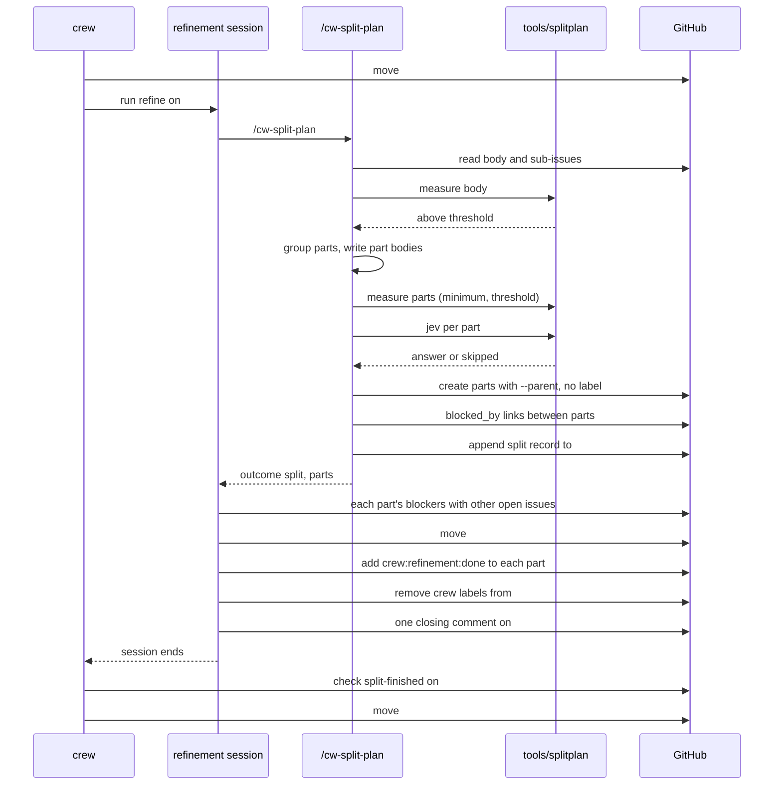

# Refinement rule that splits large plans - Plan

## Goal Capsule

- **Objective:** a large brainstormed plan reaches development as several smaller issues, each mergeable on its own, which crew builds in parallel unless one really needs another, so no lfg session carries the whole plan and the boss never reviews a split or holds a merge.
- **Means:** the triage rule becomes the refinement rule (KTD1, KTD2, KTD10). Its product-manager session runs a new `/cw-split-plan` skill (KTD4, KTD6) that measures the plan with a Go tool (KTD3) and, above the threshold, creates sub-issues, then finds blockers as triage does today.
- **Product authority:** the boss, through the brainstorm of #160. The Product Contract wins on behaviour; the KTDs win on mechanism.
- **Stop conditions:** stop and report when a settled Key Decision proves unworkable, or when a gate in the Verification Contract cannot pass without changing a requirement.
- **Execution profile:** one branch, units U1 to U4 in order, one pull request whose body carries `Closes #160` and the post-merge rollout steps (KTD9). The lfg session renames no GitHub label and does not touch the live `.crew/config.yaml`.
- **Open blockers:** none.

---

## Product Contract

Product Contract from issue #160. Planning answers its Outstanding Questions (KTD5, KTD7, KTD8, KTD9). Product Contract preservation: Product Contract unchanged.

### Summary

The triage rule is renamed refinement, and its product-manager session also splits large plans. A plan above the size threshold is grouped into parts that each ship alone. Each part becomes a sub-issue of the original, with `blocked_by` links only where one part needs another, and goes to development. The original stays open as their parent and records the split. Jev answers, for each part, whether it would leave something half-built on `main`; that answer is only recorded for now.

### Problem Frame

The 34 lfg sessions in this repository's `.crew/logs` cost $731. Two thirds of that is cache reads: the main thread re-reads a context of 600,000 to 770,000 tokens on every turn, and the costliest sessions ran 380 to 550 messages. Over the 18 complete runs that started from a brainstormed plan, cost grew faster than plan size: a log-log fit gives cost ∝ size^1.34 (bootstrap 0.99 to 1.96, above 1 in 94% of resamples). By that fit, splitting a large plan in two saves about 21%. For example, 12,000 characters cost $35.31 as one run and $27.83 as two halves. Every session that cost more than $30 had a plan above about 10,000 characters or 12 requirements.

Today every plan goes whole to one lfg session. Nothing measures a plan or splits it. Triage only records dependencies between whole issues.

The caveats bound the design. 18 runs are few. Larger plans may also be harder work, which splitting does not shrink. Each extra lfg pays its doc review, code review and pull request babysitting again, and plans smaller than the smallest observed (4,127 characters) are outside the data. A split is also worthless when its parts cannot merge alone: if the boss has to hold one pull request until another lands, the split has cost review time and saved nothing.

### Key Decisions

- **Build the split now rather than validate it by hand first.** (session-settled: user-approved — chosen over splitting the next large plan by hand and comparing costs before building: one hand split is a single noisy data point, too weak to confirm a 21% effect.)
- **Nobody approves a split.** (session-settled: user-directed — chosen over the boss approving each split: the boss will not review splits, so the split's own rules must keep its parts safe to build.) Governs R6, R10.
- **The split happens in refinement, the renamed triage rule, run by the product-manager.** (session-settled: user-directed — chosen over a skill the boss runs in the brainstorm session, and over a new rule on a `crew:brainstorm:waiting review` label: one session splits and finds blockers, and the work is a refinement of the plan, not a triage.) Governs R1, R2, R4, R14.
- **The original issue becomes the parent of its parts.** (session-settled: user-directed — chosen over the original taking the first part and over closing it as split.) Governs R12, R13.
- **The split records the `blocked_by` links between its parts when it creates them.** (session-settled: user-approved — chosen over leaving the order to triage: triage could miss an order between siblings, and two dependent parts would then run together.) Governs R10.
- **A part blocks another only when it really has to; otherwise parts run in parallel.** (session-settled: user-directed — the boss: issues that do not need each other can and should run in parallel.) Governs R10.
- **Each part merges alone, leaving `main` whole and releasable.** (session-settled: user-directed — raised by the boss: a split that forces holding merges is worthless.) Governs R7, R9.
- **Size is measured in code; Jev judges delivery, not size.** Size is a number set from cost data, and Jev's docs say it counts badly. With 18 runs, no Jev score could be shown to predict cost better than size, whose correlation is already 0.83. Governs R5.
- **Jev runs in shadow on the delivery judgment.** (session-settled: user-approved — chosen over Jev rejoining flagged parts now, which needs a hand-labelled set of past splits to set its threshold, and over no Jev: the records it leaves become the labelled data.) Governs R15, R16.
- **Jev does not check the blockers between parts.** (session-settled: user-approved — chosen over Jev checking each pair of parts, as the issue first proposed: the LLM that splits already decides the blockers, so there is no LLM call to save, a plan gives one to three pairs, and #153 measured real blockers at only 0.1 to 0.2.)

### Actors

- A1. The boss: brainstorms the idea and runs `/cw-update-issue-plan`, as today. Reviews and merges each part's pull request.
- A2. The product-manager: the agent of the refinement rule's session. Splits large plans and finds blockers.
- A3. crew: moves the labels, runs the session and skips a blocked issue until its blockers close.

### Key Flows

- F1. A plan under the threshold
  - **Trigger:** an issue reaches `crew:refinement:ready`.
  - **Steps:** the session measures the issue's plan; it is under the threshold, so the session finds the issue's blockers as triage does today; crew moves the issue to `crew:refinement:done`, and `promote refinement` moves it to development.
  - **Covered by:** R3, R5
- F2. A plan above the threshold that splits
  - **Trigger:** an issue reaches `crew:refinement:ready` and its plan is above the threshold.
  - **Steps:** the session groups the requirements into parts that each ship alone; creates one sub-issue per part; records the `blocked_by` links between parts, then each part's blockers with the other open issues; asks Jev about each part and records the answers; writes the split record on the original issue; and takes the original issue out of crew. The parts sit in `crew:refinement:done`, so `promote refinement` moves them to development, where crew starts each one once its blockers close.
  - **Covered by:** R4, R6 to R16
- F3. A plan above the threshold that does not split
  - **Trigger:** as F2, but no grouping meets R7 and R8.
  - **Steps:** the session keeps the issue whole, says why in its closing comment and finds its blockers as in F1.
  - **Covered by:** R8, R9

### Requirements

**The refinement rule**

- R1. The triage rule is renamed refinement. Its labels are `crew:refinement:ready`, `crew:refinement:in progress`, `crew:refinement:done` and `crew:refinement:failed`. Its promote rule is `promote refinement`. Its agent is still the product-manager.
- R2. Everything that names the triage rule or its labels names refinement instead: this repository's crew config and the example config, the board, the `cw-*` skills' label tables, the README and the GitHub labels. Renaming a GitHub label keeps it on the issues that carry it.
- R3. Refinement keeps everything triage does today: it finds what blocks the issue and what it blocks among the open issues crew takes, records and removes `blocked_by` links only when it can say why, and ends with one comment on the issue.
- R4. The splitting lives in a `/cw-split-plan` skill, which the refinement prompt runs on the issue before finding blockers. The skill reads the plan from the issue's body and asks nothing.

**When to split**

- R5. The skill measures the plan in code: its length in characters, and its numbers of requirements (`R1`, `R2`, …) and acceptance examples (`AE1`, …). It considers a split when the plan is above 10,000 characters or above 12 requirements. Under both, the issue is not split.
- R6. Above the threshold, the LLM groups the plan's requirements into as few parts as keep each part under the threshold.
- R7. Each part, merged alone into `main`, leaves `main` whole and releasable: no setting without its behaviour, no README text describing what does not exist yet, no half of a flow. A grouping that would break this keeps the requirements together, even if a part then stays above the threshold.
- R8. No part is smaller than about 4,000 characters.
- R9. When no grouping meets R7 and R8, the plan stays whole, and the closing comment says why.

**The parts**

- R10. A part is `blocked_by` another part only when the LLM can say why it needs that part merged first. Without such a reason, both run in parallel.
- R11. Each part is a GitHub sub-issue of the original issue, in `crew:refinement:done`. Its body follows the feature template and holds its own requirements and acceptance examples with their original IDs, plus the goal, decisions and scope boundaries from the plan that it needs, so the lfg session reads only its own issue.
- R12. After its parts exist, the original issue carries no crew label, so no rule takes it again. It stays open until the boss closes it.
- R13. The original issue keeps the whole plan and gains a split record: the plan's size, each part's size, each part's reason for shipping alone, and each `blocked_by` link between parts with its reason.
- R14. Refinement finds each part's blockers with the other open issues, as R3 does for a whole issue.

**Jev in shadow**

- R15. For each part, the skill asks Jev one yes/no question: if only this part merges into `main`, does `main` have something half-built? The answer and its probability go into the split record next to the LLM's reason. The answer never changes the split.
- R16. Without `TYPESAFE_API_KEY` in the session, or when Jev fails, the skill skips the question, the split goes ahead, and the split record says Jev was skipped.

### Acceptance Examples

- AE1. **Covers R5, R3.** Given a plan of 6,000 characters with 7 requirements, when refinement runs, the issue is not split, its blockers are recorded as triage records them today, and it moves to `crew:refinement:done`.
- AE2. **Covers R5, R6, R10, R11.** Given a plan of 14,000 characters with 16 requirements, where R1 to R6 add a config key and its behaviour and R7 to R16 add a live-view section that reads that key, when refinement runs, it creates two sub-issues: the live-view part is `blocked_by` the config part, and both sit in `crew:refinement:done`.
- AE3. **Covers R10.** Given a split into a CLI part and a README-only part that does not describe the CLI part, when refinement runs, neither part blocks the other, and crew can build both at the same time.
- AE4. **Covers R7, R9.** Given a plan of 11,000 characters whose only possible cut leaves a config key without its behaviour in one part, when refinement runs, the plan stays whole, and the closing comment says the only cut would leave a half-built setting on `main`.
- AE5. **Covers R8, R9.** Given a plan of 10,500 characters whose only cut ships alone but gives a part of 2,500 characters, when refinement runs, the plan stays whole.
- AE6. **Covers R12, R13.** Given a split into three parts, after refinement the original issue is open, has no crew label, lists the three parts as sub-issues, and its body holds the whole plan and the split record.
- AE7. **Covers R15, R16.** Given a session without `TYPESAFE_API_KEY`, when refinement splits a plan, the split is the same as with the key, and the split record says Jev was skipped.

### Success Criteria

- No pull request of a part has to wait for another part's pull request before it can merge.
- After enough splits, the split records give a labelled set for Jev's delivery question: parts whose pull request had to wait, and parts whose pull request did not.

### Scope Boundaries

- Jev as a gate on delivery, rejoining a flagged part with its neighbour: a later issue, once the split records give a threshold from held-out data.
- Jev on blockers, between parts or in refinement's search of other issues: #153.
- Comparing a split plan's real cost with what the fit predicted.
- Splitting an issue that has already left refinement.
- Closing the parent when its last part closes.

### Dependencies / Assumptions

- crew does not take an issue while an open issue blocks it, and an issue closes when the pull request that says `Closes` it merges, so a blocked part starts only once the parts it needs are on `main`.
- When the session takes the crew labels off the parent, crew finds the parent out of its running label when the run ends. It drops that move and reports it as moved meanwhile, as when someone moves an issue by hand during a run; it does not count as a failure.
- Closing every sub-issue does not close the parent on GitHub. GitHub's sub-issue docs do not say either way; this is unverified.
- Issues the product-manager bot opens are taken by crew, since it is a configured bot.

### Outstanding Questions

**Deferred to Planning** (each answered in the Planning Contract)

- Whether refinement stays in the 1-slot clerk queue, where a session that splits a plan holds up the promote rules for longer than a triage does. Answered by KTD8.
- How this repository's live crew config, which is not in the worktree, gets the rename alongside `.crew/config.example.yaml`. Answered by KTD9.
- How the split record reaches the parent's body without losing the plan, and in what shape. Answered by KTD7.
- The exact wording of Jev's question and criteria, and where the skill calls Jev from. Answered by KTD5.

### Sources / Research

- Issue #160: the cost analysis of the 34 lfg sessions and the first proposal.
- Issue #153: the pairwise Jev experiment on blockers.
- TypeSafe's SDE cascade cookbook and confidence page: Jev as a verifier whose threshold comes from held-out data.
- `internal/adapter/github/tracker.go`: how crew reads blocked issues and how a move finds an issue moved meanwhile.
- `.crew/config.example.yaml`: the triage and promote rules being renamed.
- `.agents/skills/cw-update-issue-plan/SKILL.md`: the step before refinement, unchanged.

---

## Planning Contract

### Key Technical Decisions

- KTD1. **The rename covers the rule, its promote rule, its labels, its action and its board column; generic test fixtures keep `triage`.** The rule becomes `refinement`, the promote rule `promote refinement`, the action `refine` (so its log is `issue-N-refine.log`), and the board column follows the rule name. Tests in `internal/core`, `internal/ui/tui`, `internal/adapter/github`, `internal/crew/board_test.go` and `internal/config/config_board_test.go` use `triage` only as an arbitrary rule name in their own fixtures; R2 lists what must change, and those fixtures and their golden files are not on it. `internal/config/testdata/old/` is a fixture of the legacy keys and stays as it is. `internal/config/config_example_test.go` tests the example config itself, so it changes with it. Governs R1, R2.
- KTD2. **The refinement prompt runs `/cw-split-plan` first, then finds blockers for whatever came out: the whole issue, or each part.** The prompt keeps triage's steps (reading the issue and its dependencies, listing the open issues crew takes, recording and removing `blocked_by` links with a reason, one closing comment) and adds three things around them. It branches on the skill's outcome. On a split, it moves the parent's existing dependencies to the parts they concern and removes them from the parent. The parent is open but never built, so an issue the parent blocks would otherwise wait until the boss closes it. #160 itself shows the case: it blocks #153. On a split it also finishes the split last (KTD6). It leaves out of every blocker search, this session's and later ones, any open issue whose body carries the split-record marker (KTD7). A split parent is never built, so work it describes is recorded against the part that carries it, never against the parent. It loosens triage's "never add or remove a `crew:` label, do not open, close or edit issues" only for what the skill and that finishing step do. Governs R3, R4, R14.
- KTD3. **A Go tool, `tools/splitplan`, measures plans and asks Jev; the skill runs it with `go run ./tools/splitplan`.** `measure` reads one or more Markdown files and prints, for each, its characters, requirements and acceptance examples. It also prints whether the file is above the split threshold and whether it is below the part minimum. The thresholds are named constants: above 10,000 characters or above 12 requirements, and a part minimum of 4,000 characters (R5, R8). The skill treats the minimum as exact, not "about", so that nobody needs to approve a borderline part. Part sizes are measured on bodies built by U2's fixed copying rule, so a part's size depends on its grouping, not on how much context the LLM chose to copy. Characters are Unicode code points after CRLF becomes LF, the same measure as the cost analysis's issue-body length. A requirement or acceptance example counts once per distinct ID defined at the start of a line (`- R12.`, `- AE3.`), so a mention such as `Covers R5` counts nothing. A Go tool rather than a script in the skill's directory, because `tools/diffcover` sets the pattern, CI's lint, tests and coverage floors already cover `./...`, and the thresholds that decide every split then have table tests. Governs R5, R6, R8.
- KTD4. **`/cw-split-plan` creates its parts without a crew label; the refinement prompt labels them only after their blockers are recorded.** Each part is created with `gh issue create --parent <N>` (gh 2.100 has `--parent`, which makes it a sub-issue) and no label. Its body carries the marker `<!-- cw-split-plan: part of #N -->`. crew takes an issue only by a rule's ready label, so a part cannot be promoted or built before its links to other parts and to other open issues exist. Nothing then depends on which queue refinement runs in. A session that stops halfway leaves unlabeled sub-issues that crew ignores, and crew moves the parent to `crew:refinement:failed` as for any failed run. Governs R10, R11, R14.
- KTD5. **Jev is asked by `go run ./tools/splitplan jev <file>`, one Noul per part, over a focused state; the tool, not the session, reads `TYPESAFE_API_KEY`.** The skill writes one JSON file per part. It holds the part's own body, the titles and summaries of every part it reaches through the `blocked_by` links between parts, transitively (`already_on_main`, since crew starts a part only once those are closed), and the titles and summaries of the other parts (`not_yet_merged`). The tool posts it to `https://api.typesafe.ai/v1/systemone` with model `jev-latest` and this question. Instructions: "`part` merges into main, on top of `already_on_main`, while the parts in `not_yet_merged` have not merged. Does main then have something half-built?" Criteria true: "Something `part` adds is incomplete without a part in `not_yet_merged`: a setting no behaviour reads, a command or flag that does nothing yet, README or docs text describing what does not exist, or one half of a flow whose other half is in a part not yet merged." Criteria false: "Everything `part` adds works, and is documented as it works, with only `already_on_main`; the parts in `not_yet_merged` only add more." The tool prints either the answer (`yes` when the probability is 0.5 or more, the probability, and the model the response names) or `skipped` with the reason: no key, HTTP error, timeout, or a response without the answer. It exits 0 in both cases, so the split goes ahead (R16). It prints only fixed values: `yes` or `no`, the probability as a number, the model name only when it matches `^[A-Za-z0-9._-]{1,64}$` (otherwise `unknown`), and a skip reason from a fixed list (no key, HTTP status code, timeout, invalid response). No response or error body text reaches the session or the split record. It never prints the key, and the key never appears on a command line the session runs. A bad input file is the skill's mistake, not Jev's, and exits non-zero. The 0.5 cut only names the answer; nothing reads it as a gate. Governs R15, R16.
- KTD6. **The order inside a split session keeps every intermediate state safe.** `/cw-split-plan` measures and groups, writes and measures every part body, and asks Jev, all before it creates anything. It then creates the parts, records the `blocked_by` links between them, and appends the split record to the parent's body. The refinement prompt then finds the parts' blockers with the other open issues (R14), adds `crew:refinement:done` to each part, removes the parent's crew labels (R12), and writes its closing comment. When the skill finds that the issue already has a sub-issue carrying the marker, an earlier split stopped halfway. It does not split again. The prompt moves the parent from `crew:refinement:in progress` to `crew:refinement:failed`, lists the parts it found in its comment, and stops, so the boss finishes or cleans up the split. At the end of every split, crew's own move of the parent to `crew:refinement:done` finds it without crew labels and is dropped. The status comment, the TUI's given-up pill and the desktop notification that follow are the expected end of a split. The closing comment and the README say so, so a normal split is not read as a fault. Governs R10, R12, R14.
- KTD7. **The split record is a `## Split` section appended to the parent's body, after the whole plan.** The skill reads the body (`gh issue view --json body`), appends the section, and writes it back with one `gh issue edit --body-file`, so the plan above it is untouched (R13). The section opens with the marker `<!-- cw-split-plan: split record -->`, then one line with the plan's size and the threshold it passed. A table follows, one row per part: the issue, its requirement and acceptance-example IDs, its size, its reason for shipping alone, and Jev's answer with its probability, or `skipped` and why. Last comes a list of the `blocked_by` links between parts with their reasons, or "none: the parts run in parallel". A plan that stays whole above the threshold gets no record; the closing comment says why (R9). Governs R9, R13, R15, R16.
- KTD8. **Refinement leaves the clerk queue for a new 1-slot `product-manager` queue.** A split session may run far longer than a triage, and in the 1-slot clerk queue it would hold `promote brainstorm` and `promote refinement` the whole time. The new queue takes the one slot `default` leaves today (`max_parallel_issues: 4` = clerk 1 + developer 2 + product-manager 1). `default` then has 0 slots, which the config accepts. Refinement sessions still run one at a time, so two of them never miss a dependency between the issues they refine. KTD4 already makes a promote that runs during a split harmless. Governs R1.
- KTD9. **The pull request changes only tracked files; the boss applies the GitHub labels and the live config after it merges.** Renaming the labels or the live, untracked `.crew/config.yaml` before the merge would break the crew that is running: its config would name labels that no longer exist, or a skill not yet on `main`. The pull request body lists the steps, in order:
  1. Stop crew, with no issue in a triage state (none is today).
  2. Rename the six GitHub labels `crew:triage:<state>` to `crew:refinement:<state>` with `gh label edit --name`, for ready, in progress, waiting review, done, failed and promoting. A rename keeps each label on the issues that carry it.
  3. In `.crew/config.yaml`, take the example's queues, `split-finished` check, `refinement` and `promote refinement` rules and `promote brainstorm` success label, and rename the board's `triage` column and its labels.
  4. Start crew.
  Governs R2.
- KTD10. **The refine action has a check, `split-finished`, so a split cut short never reaches development.** A session that ends its turn cleanly after `/cw-split-plan` created parts, but before the prompt finished the split, would otherwise count as a success. crew would move the parent to `crew:refinement:done`, and `promote refinement` would send the whole plan to development next to orphaned parts. The check fails, echoing its reason last as `pr-closes-issue` does, when `$CREW_ISSUE_KEY` still carries `crew:refinement:in progress` and has a sub-issue whose body holds the part marker. crew then moves the parent to `crew:refinement:failed`. A finished split, whose parent carries no crew label, passes. So does an issue that was not split, and one the prompt already moved to failed. Governs R9, R12.

### High-Level Technical Design

One refinement session on an issue above the threshold that splits:

The skill ends in one of four outcomes, and the prompt branches on them:

| Outcome | When | What the prompt does next |
| --- | --- | --- |
| not split | `measure` says the plan is not above the threshold | triage's steps on #N (F1) |
| kept whole | above the threshold, but no grouping meets R7 and R8 | triage's steps on #N, and the comment says why (F3) |
| split | parts created, linked and recorded | blockers for each part, move #N's dependencies, finish the split (F2) |
| earlier split did not finish | #N already has a sub-issue with the part marker | move #N to `crew:refinement:failed`, comment, stop (KTD6) |

### Assumptions

- The product-manager session has `go` on its `PATH` and runs in a worktree of this repository, so `go run ./tools/splitplan` works there, as `go test` works in the developer's sessions.
- `TYPESAFE_API_KEY` reaches the session only when crew itself starts with it, since a session inherits crew's environment (`internal/proc/proc.go`). Without it every split records Jev as skipped (R16).
- Auto permission mode lets the session run `go run`, `gh issue create --parent` and `gh api` calls on this repository, as it already lets triage run `gh api`.
- Parts that run in parallel come from one plan, so they may edit the same files (README tables, `.crew/config.example.yaml`). The second pull request may then need a rebase once the first merges. R10 counts only a real need as a reason to block, so this is accepted, and the split records will show how often it happens.
- The split record holds the prediction (the LLM's reason and Jev's answer), not the outcome. Whether a part's pull request had to wait is read later from the parts' pull requests, by the follow-up issue that turns Jev into a gate.
- An issue body holds at most 65,536 characters on GitHub. The largest plan observed is under 25,000, so plan plus split record fits. A failed `gh issue edit` is reported in the closing comment like any failed command.

### Sequencing

U1 first: the skill (U2) calls the tool. U3 and U4 depend on U2's skill name and outcomes, not on each other.

---

## Implementation Units

### U1. The `splitplan` tool

- **Goal:** `go run ./tools/splitplan measure <file>...` and `go run ./tools/splitplan jev <file>` exist, tested, under CI's lint and coverage floors.
- **Requirements:** R5, R6, R8, R15, R16; KTD3, KTD5.
- **Dependencies:** none.
- **Files:** `tools/splitplan/main.go`, `tools/splitplan/measure.go`, `tools/splitplan/jev.go`, `tools/splitplan/measure_test.go`, `tools/splitplan/jev_test.go`, `tools/splitplan/main_test.go`.
- **Approach:**
  1. `main` dispatches on the subcommand and maps errors to exit codes as `tools/diffcover` does: 0 for success and for a skipped Jev, 2 for usage errors and bad input.
  2. `measure` prints one JSON object per file, so the skill can read it without parsing prose.
  3. `jev` takes its endpoint and HTTP client from its caller, so tests point it at an `httptest` server. It sets a timeout of about a minute and builds the request with a context, as golangci-lint's `noctx` requires.
  4. The key comes from the environment inside the tool and appears in no output and no error.
- **Patterns to follow:** `tools/diffcover/main.go` (package doc with the usage line, named constants, exit codes, `run` taking readers and writers for tests).
- **Test scenarios:**
  - Covers AE1. A plan of 6,000 characters with R1 to R7 is not above the threshold.
  - Covers AE2. A plan of 14,000 characters with R1 to R16 is above the threshold.
  - A plan of exactly 10,000 characters with 12 requirements is not above. 10,001 characters is above. 13 requirements in 5,000 characters is above.
  - Covers AE5. A part of 2,500 characters is below the part minimum. 4,000 is not.
  - `Covers R5, R3.` and `Governs R6, R10.` inside lines count no requirement. `- R3.` defined twice counts once. `- AE1. **Covers R5.**` counts one acceptance example and no requirement.
  - A body with CRLF line ends measures the same as with LF. Multi-byte characters count once each.
  - Several files print one result each, in order. A missing file exits 2 and names it.
  - Covers AE7. `jev` without `TYPESAFE_API_KEY` prints `skipped` with the reason, calls no server, and exits 0.
  - With a key, the server receives `Authorization: Bearer <key>`, model `jev-latest`, and one Noul question whose state holds `part`, `already_on_main` and `not_yet_merged` from the input file. A response of 0.82 prints `yes`, 0.82 and the model.
  - A response of 0.31 prints `no`. A response of exactly 0.5 prints `yes`.
  - HTTP 500, a timeout, invalid JSON, and a response without the answer each print `skipped` with the reason and exit 0. No output or error text contains the key.
  - A response whose model field is multi-line or longer than 64 characters prints `unknown` as the model. An HTTP error whose body holds text prints only the status code. Neither text appears in the output.
  - An input file that is not JSON, or has no `part`, exits 2.
- **Verification:** the tests pass under `-race`. Changed-line coverage is at least 90%. `measure` on #160's own body reports it above the threshold.

### U2. The `/cw-split-plan` skill

- **Goal:** a headless product-manager session that runs `/cw-split-plan #N` ends with #N measured and, when it is above the threshold, either split into recorded, linked, unlabeled sub-issues or kept whole with a reason.
- **Requirements:** R4 to R13, R15, R16; KTD4, KTD5, KTD6, KTD7.
- **Dependencies:** U1.
- **Files:** `.agents/skills/cw-split-plan/SKILL.md`; its shared-contract test lives in `internal/config/config_example_test.go` (U3).
- **Approach:**
  1. Frontmatter and opening as the other `cw-*` skills: this repository's own aid; it reads `.crew/config.yaml` for nothing; it runs `gh` from the repository root; it asks nothing.
  2. Read #N's body and sub-issues (`gh api repos/{owner}/{repo}/issues/N/sub_issues`). Stop with "earlier split did not finish" when a sub-issue carries the part marker (KTD6).
  3. Measure the body with the tool. Stop with "not split" when it is not above the threshold.
  4. Group the requirements under R6 and R7, and give each part its reason for shipping alone. Write each part's body by the feature template (`.github/ISSUE_TEMPLATE/feature.md`) as R11 lists, with the original IDs, a line naming the parent, and the marker. The copying rule is fixed: the Goal Capsule, Problem Frame and Scope Boundaries whole, the Key Decisions whose `Governs` line names one of the part's requirements, and the part's own requirements, flows and acceptance examples. Measure every part with the tool and regroup until R6 and R8 hold. Stop with "kept whole" and the reason when no grouping meets R7 and R8 (R9).
  5. Decide the `blocked_by` links between parts under R10, each with its reason.
  6. Ask Jev about each part through the tool, with `already_on_main` as KTD5 defines it.
  7. Create the parts, record the links, and append the split record (KTD4, KTD7).
  8. Report the outcome on its first line, then the parts with their numbers and the links, so the refinement prompt can act on it.
- **Patterns to follow:** `.agents/skills/cw-update-issue-plan/SKILL.md` (numbered steps, the template rule of its step 5, "when a `gh` command fails, report its error text and stop"); `.agents/skills/cw-create-issue/SKILL.md` (issue creation with `--body-file`).
- **Test scenarios:** the skill is a Markdown prompt with no test harness in this repository, and its thresholds live in U1's tested tool. One Go test pins what the prompt and the skill share. The rest are walk-throughs of the skill's steps.
  - U3's test reads `.agents/skills/cw-split-plan/SKILL.md` and finds the four outcome names the refine prompt branches on (`not split`, `kept whole`, `split`, `earlier split did not finish`) and the part marker, so the two files cannot drift apart.
  - Covers AE2. A 14,000-character plan whose R1 to R6 add a config key and R7 to R16 a view reading it: step 4 gives two parts, and step 5 makes the view part `blocked_by` the config part, with the reason that it reads the key.
  - Covers AE3. A CLI part and a README-only part that does not describe the CLI: step 5 records no link.
  - Covers AE4. The only cut leaves a config key without its behaviour: step 4 stops with `kept whole` and that reason.
  - Covers AE5. The only cut gives a 2,500-character part: `measure` flags it below the minimum, and step 4 stops with `kept whole`.
  - Covers AE6. After step 7 with three parts, #N lists three sub-issues, and its body is the old body followed by `## Split`.
  - Covers AE7. Without the key, step 6 records `skipped` for every part, and steps 7 and 8 run unchanged.
- **Verification:**
  - `measure` on #160's body reports it above the threshold.
  - `measure` on the body of a closed, smaller brainstormed issue reports it under.
  - Walking AE2 to AE7 against the skill's steps finds a step that produces each outcome.
  - No step labels a part.

### U3. The refinement rule in the example config

- **Goal:** `.crew/config.example.yaml` holds the refinement and promote refinement rules, the refinement prompt, and the product-manager queue, and its test pins them.
- **Requirements:** R1, R2, R3, R9, R12, R14; KTD1, KTD2, KTD6, KTD8, KTD10.
- **Dependencies:** U2.
- **Files:** `.crew/config.example.yaml`, `internal/config/config_example_test.go`.
- **Approach:**
  1. Rename the rules and labels (KTD1). `promote brainstorm` succeeds into `crew:refinement:ready`. Add `product-manager: 1` to `queues` and move refinement into it (KTD8).
  2. Rewrite the action as `refine` with the prompt of KTD2 and KTD6, and give it the check `split-finished` (KTD10) under `checks`. It keeps triage's numbered steps and wording where they still hold, and keeps `{{.Issue.Ref}}`/`{{.Issue.Key}}` as the only template fields.
  3. Update the header comment's description of the flow, the board's columns and the queues.
  4. In the test, change the rule names, labels, action name, queue and board columns. Reword the comment that says the names stay the same so failed runs resume: no issue is in a triage state, so no failed run is lost (KTD9).
- **Patterns to follow:** the triage prompt this replaces; the `development` and `fix` rules for queue and agent keys.
- **Test scenarios:**
  - Covers AE1, AE2. The example config loads with rules `promote brainstorm`, `refinement`, `promote refinement`, `development` and `fix`. Refinement's labels are `crew:refinement:{ready,in progress,done,failed}`, in queue `product-manager` with 1 slot. Its action is `refine` with agent and bot `product-manager`. `promote refinement` moves `crew:refinement:done` to `crew:development:ready`.
  - The board's columns are `refinement`, `development` and `fix`.
  - The refine action's prompt runs `/cw-split-plan {{.Issue.Ref}}` before it reads dependencies, adds `crew:refinement:done` to the parts, and removes the parent's crew labels. One assertion on the prompt text pins each of these three, as the existing test pins the check's script.
  - The prompt leaves out of the blocker search every issue whose body carries the split-record marker (KTD2), and its closing comment on a split says crew's dropped move is expected (KTD6).
  - The refine action's check is the script of `split-finished`. It names `crew:refinement:in progress`, the part marker, and the sub-issues API, as the existing test pins the development check.
  - The prompt and `.agents/skills/cw-split-plan/SKILL.md` both name the four outcomes of the High-Level Technical Design's table and the part marker (U2's shared-contract test).
- **Verification:** `go test -race ./internal/config` passes. The schema test still validates the example.

### U4. The rename in the skills and docs

- **Goal:** every tracked text that names the triage rule or its labels names refinement, and the new skill is listed where the others are.
- **Requirements:** R2; KTD1.
- **Dependencies:** U2.
- **Files:** `.agents/skills/cw-create-issue/SKILL.md`, `.agents/skills/cw-update-issue-plan/SKILL.md`, `README.md`, `AGENTS.md`.
- **Approach:**
  1. In both skills' type tables, running labels and crew-label lists: `crew:triage:*` becomes `crew:refinement:*`, and "hand to triage" becomes "hand to refinement". The `crew:refinement:ready` row reads as a brainstormed feature to split when large and whose dependencies to find. Step 8's prompt in `cw-update-issue-plan` says promote brainstorm hands it to refinement.
  2. README's `.crew/config.example.yaml` row says refinement of brainstormed features (splitting large plans into sub-issues and finding their dependencies). It says that a split parent leaves crew, so crew reporting its move to done as given up is expected (KTD6). A new "What's inside" row lists `.agents/skills/cw-split-plan/` with `tools/splitplan`.
  3. AGENTS.md's Agents section gains a `cw-split-plan` entry in the shape of the other three, saying the refinement prompt runs it and that it is not linked into `~/.claude/skills/`, since it needs this repository's `tools/splitplan`.
- **Test expectation:** none -- text only. The rename sweep of the Verification Contract is clean.
- **Verification:** the grep above is clean. README and AGENTS describe what the branch ships.

---

## Verification Contract

| Gate | Command | Applies to |
| --- | --- | --- |
| Format | `gofmt -l cmd internal tools` prints nothing | U1, U3 |
| Vet | `go vet ./...` | U1, U3 |
| Lint and layering | `go run github.com/golangci/golangci-lint/v2/cmd/golangci-lint@v2.14.0 run` | U1, U3 |
| Tests | `go test -race ./...` | U1, U3 |
| Coverage floor | `go test -race -covermode=atomic -coverpkg=./... -coverprofile=coverage.out ./...` then `go run github.com/vladopajic/go-test-coverage/v2@v2.19.0 --config=.testcoverage.yml` | all |
| Changed-line coverage | `git diff -U0 origin/main...HEAD \| go run ./tools/diffcover -profile coverage.out` at 90% or more | U1 |
| Vulnerabilities | `go run golang.org/x/vuln/cmd/govulncheck@v1.8.0 ./...` | U1 |
| Measure on real plans | `gh issue view 160 --json body -q .body` into a file, then `go run ./tools/splitplan measure` on it reports above the threshold | U1, U2 |
| Rename sweep | `git ls-files \| xargs grep -li triage` lists nothing outside `docs/plans`, `docs/solutions`, `internal/config/testdata/old/` and KTD1's generic test fixtures | U3, U4 |

## Definition of Done

- U1 to U4 are done by their Verification lines, and every gate above passes.
- The pull request body carries `Closes #160` and KTD9's post-merge steps, in order.
- The lfg session renamed no GitHub label and left the live `.crew/config.yaml` untouched.
- No dead-end or experimental code from abandoned approaches is left in the diff.
