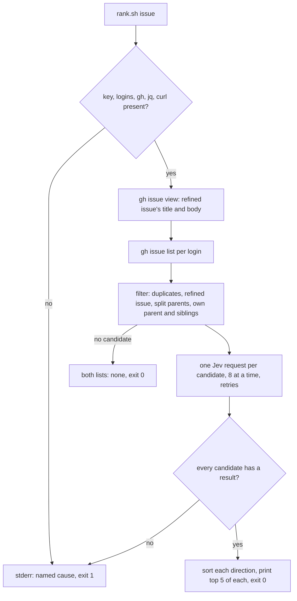

# Skill that ranks likely blockers with Jev - Plan

## Goal Capsule

- **Objective:** for any open issue, someone (a refine session or a person) can get, in one command, the 5 open issues most likely to block it and the 5 it most likely blocks, each with Jev's probability, or a clear error naming why the ranking is unavailable. Nothing on GitHub changes when they run it.
- **Means:** a new repository skill, `/cw-rank-blockers`, whose shell script `rank.sh` lists the candidates with `gh`, asks Jev about each pair with `curl`, and prints the two ranked lists (KTD1, KTD2).
- **Product authority:** the code owner, through #153 and its split into #165. The Product Contract wins on behaviour; the KTDs win on mechanism.
- **Stop conditions:** stop and report when a settled Key Decision proves unworkable, or when a gate in the Verification Contract cannot pass without changing a requirement.
- **Execution profile:** one branch, units U1 to U3 in order, no Go code, and one pull request whose body carries `Closes #165`. The refine prompt in `.crew/config.example.yaml` does not change: that is #166.
- **Open blockers:** none.

---

## Product Contract

Product Contract from issue #165, part 1 of 2 of #153. Planning answers its Outstanding Questions (KTD1, KTD3). Product Contract preservation: Product Contract unchanged.

### Summary

A new skill of this repository carries a script that, for one issue, asks Jev about each open candidate issue in its own request and prints two short ranked lists: the 5 issues most likely to block it and the 5 it most likely blocks. It only ranks, and fails with a named cause when it cannot judge every candidate.

### Problem Frame

Finding dependencies cost $0.496 per session on average: $11.90 across the 24 triage logs in `.crew/logs`. #163 renamed the triage rule to `refinement`, whose `refine` action now also splits large plans with `/cw-split-plan`, but its search for blockers is the same. Step 4 of the refine prompt (`.crew/config.example.yaml`, the `refine` action) runs `gh issue list --state open --author "$login" --limit 500 --json number,title,body,labels` for each code owner and bot, so the session loads the body of every open issue to find the few that relate to the issues it refines. After a split, it compares every part against that whole list. The code owner has seen this search drive the cost, and has also seen triage miss real blockers.

#149's experiment with `jev-1.13.0` measured how well Jev can rank candidates against the 16 `blocked_by` links GitHub records across 15 of this repository's issues. Putting every candidate in one request ranked no better than chance (0.583 where 0.5 is random). One request per pair, holding only the two issues, ranked at 0.933: the real blocker came first for 6 links, in the top 3 for 11 and in the top 5 for 12, for $0.043 across 735 pairs. Real blockers often scored only 0.1 to 0.2, so the answers order candidates but cannot decide on their own. The experiment overstates the result: its candidates included closed issues and issues opened later, and some bodies were rewritten after triage.

### Key Decisions

- **A skill of this repository with a bundled script, not a crew feature.** (session-settled: user-directed — chosen over a `crew related` subcommand and over crew's engine computing the shortlist before the session: the code owner judged it personal tooling that another repository can copy, and a script, rather than a skill of instructions only, keeps the session from spending tokens composing about 50 API calls per issue.) Governs R1, R5, R6.
- **One request per pair, with both directions asked in that request.** The single request over every candidate ranked at chance in #149; TypeSafe documents large state full of irrelevant detail as a Jev weakness; a second question over the same two issues adds little cost. Governs R3.
- **Always the top 5, never a probability cutoff.** Real blockers scored as low as 0.1, so a cutoff would drop them, and the top 5 held the real blocker for 12 of 16 links. Governs R4.
- **Every candidate is judged, with no pre-filter.** At #149's rate ($0.043 for 735 pairs), judging about 50 candidates costs well under a cent per issue refined. Governs R2.

### Requirements

**The shortlist skill**

- R1. A skill of this repository, alongside the `cw-*` skills, carries a script that takes an issue and prints two ranked lists: open issues likely to block it, and open issues it likely blocks.
- R2. The candidates are the issues step 4 of the refine prompt compares against today: open issues opened by the logins in `$CREW_CODE_OWNERS` and `$CREW_BOTS`, without the issue refined, the issue being split and its parts, and split parents (issues whose body holds the `cw-split-plan` split record marker).
- R3. Each candidate is judged in its own Jev request whose state holds only the two issues' titles and bodies. The request asks two yes/no questions: whether the work the refined issue asks for builds on the change the candidate asks for, so the candidate must be done first; and the same question the other way round.
- R4. Each list holds the 5 candidates with the highest probability for its direction, or every candidate when fewer exist. Each entry shows the issue number, its title and Jev's probability.
- R5. The skill only ranks: it never records, removes or edits a dependency, a label or an issue.
- R6. When the script cannot judge every candidate, for example without `TYPESAFE_API_KEY` or after the API keeps failing, it prints no list and exits with an error that names the cause.

### Key Flows

Both flows belong to #153 and are built by #166, whose requirements R7 to R9 they cite. #165 delivers the script they call and its failure contract (R1, R4, R6).

- F1. Refinement with the shortlist
  - **Trigger:** crew starts a `refine` session for an issue in `crew:refinement:ready`, and `/cw-split-plan` reports which issues to refine: the issue itself, or each part it created.
  - **Steps:** for each issue to refine, the session reads it and its recorded dependencies; runs the script; reads that issue's shortlisted candidates in full and the rest by title; opens any title that looks related; decides each dependency and records it with its reason. It then posts its closing comment.
  - **Covered by:** R1, R4, R7, R9
- F2. Refinement when the shortlist is unavailable
  - **Trigger:** the script exits with an error for an issue being refined.
  - **Steps:** the session reads every candidate for that issue as today, decides and records as today, and names the failure in its closing comment.
  - **Covered by:** R6, R8

### Acceptance Examples

- AE2. **Covers R4.** Given only 3 open candidates exist, when the script runs, then each list shows all 3, ordered by probability, even when every probability is below 0.2.

### Success Criteria

- Over the refinements that run after the prompt changes, the average cost per refine session is below the $0.496 triage baseline, compared among refinements that `/cw-split-plan` did not split, since a split session refines several issues.
- Over the same refinements, the number of dependencies a code owner adds or removes by hand afterwards does not rise compared with before the change.

Both are measured after #166 changes the prompt. For #165 alone: the script prints both lists for a real issue when `TYPESAFE_API_KEY` is set, and its stubbed tests pass (Verification Contract).

### Scope Boundaries

- crew's Go code, its config schema and its prompt template fields do not change.
- Deciding and recording each dependency stays with the refine session; the shortlist records nothing.
- `/cw-split-plan` and its Jev shadow question do not change.
- Sharing a TypeSafe adapter or config with the session-outcome judge of #152 is out of scope, since this work adds no crew code.
- A shortlist for other rules, such as brainstorm or development, is not part of this work.
- Part 2 of 2, "Use the Jev shortlist in the refine prompt, behind an offline gate", is built in its own issue (#166).

Considered and not built:

- **A CI job for the script's tests.** CI's required `go` job runs Go only, and a new required job goes through the shared `.github` repository's `bootstrap.sh --checks`. The tests run by hand and in the lfg session. Evidence that would change this: a later change to `rank.sh` breaks it unnoticed.
- **A cache of Jev answers between runs.** A refine session runs the script once per issue; a cache would add stored state for a cost under a cent. Evidence that would change this: #166's offline gate needs repeated runs over the same pairs.

#### Deferred to Follow-Up Work

- The per-issue variant of R3 (one request per refined issue, each candidate in its own question): adopt only if #166's offline run shows equal ranking.

### Dependencies / Assumptions

- `TYPESAFE_API_KEY` is set in the environment where crew runs. Sessions inherit crew's environment (`internal/proc/proc.go`) except for variables a bot identity unsets (`internal/adapter/claude/command.go`), which also sets `CREW_CODE_OWNERS` and `CREW_BOTS`.
- The script pins `jev-1.13.0`, the version #166's 70% gate is measured against, rather than the moving `jev-latest` alias that `/cw-split-plan`'s shadow question uses.
- Refine sessions already run `gh` with access to the repository's issues, and `jq` (a refine session ran it in #153's refinement).

### Sources / Research

Split from #153.

- #153's body and its previous body (first comment): #149's experiment, its numbers, its caveats, and its per-pair state of 3,000 characters of each body.
- `.crew/config.example.yaml`, the `refinement` rule's `refine` prompt: step 4 is the candidate list R2 copies.
- `.agents/skills/cw-split-plan/SKILL.md` and `measure.sh`: the precedent for a skill with a bundled `sh` script, its markers (`<!-- cw-split-plan: part of #N -->`, `<!-- cw-split-plan: split record -->`), and its Jev request shape.
- `docs/solutions/logic-errors/set-e-ignored-left-of-and-in-install-command.md`: `set -e` is silently off in some contexts, which matters for the script's background jobs (KTD5).
- TypeSafe [API reference](https://docs.typesafe.ai/api): `POST https://api.typesafe.ai/v1/systemone`, Noul answers at `answers.<id>.noul`, `401` and `422` for bad keys and requests, `429` and `529` to retry with backoff.

---

## Planning Contract

### Key Technical Decisions

- KTD1. **The skill is `/cw-rank-blockers` in `.agents/skills/cw-rank-blockers/`, and its script is `rank.sh`, a POSIX `sh` script that uses `gh`, `jq` and `curl`.** (session-settled: user-directed — chosen over a Go program under `tools/`: in the #160 run the code owner stopped a Go `tools/splitplan` mid-implementation because this repository's own tooling stays out of crew's Go code.) `jq` builds each request, so issue bodies are escaped correctly, and reads each answer. Usage: `sh .agents/skills/cw-rank-blockers/rank.sh <issue>`, where the issue is `#N` or `N`. Governs R1, R5.
- KTD2. **Candidates come from the same `gh issue list` step 4 runs, filtered in the script.** For each login in `$CREW_CODE_OWNERS` and `$CREW_BOTS`, `gh issue list --state open --author <login> --limit 500 --json number,title,body`; then the script drops duplicates, the refined issue, every issue whose body holds the split record marker, and, when the refined issue's body holds `<!-- cw-split-plan: part of #P -->`, issue `#P` and every issue whose body holds that same marker (its sibling parts). Parts of other parents stay candidates. Governs R2.
- KTD3. **Each request sends titles whole and at most the first 3,000 characters of each body, under model `jev-1.13.0`, with two Noul questions.** 3,000 characters is the state #149 measured at 0.933, and #166's gate checks the script as built. Both limits are named variables at the top of the script so #166 can vary them. The cut is a known risk: issues now carry the unified-plan layout, whose Requirements start after 3,000 characters (at 3,131 in #165, 4,457 in #152, 6,700 in #160), so Jev may judge most pairs from Goal Capsules and Problem Frames. #166's offline run should compare the cut with whole bodies, which cost well under a cent more per issue. An empty body is sent as a fixed placeholder such as `(no description)`, never as empty text. The state names the two issues `issue` (the one ranked for) and `candidate`. The questions, directional guidance rather than final wording:
  - `issue_needs_candidate`: does the work `issue` asks for build on the change `candidate` asks for, so `candidate` must be done first?
  - `candidate_needs_issue`: the same with the two swapped.

  Governs R3.
- KTD4. **Ranking sorts by probability, highest first, ties by issue number, lowest first, and prints the top 5 of each direction.** The lists go to standard output, one entry per line with number, probability to two decimals and title, under a heading per direction that names the issue and the candidate count. With no candidate, each list reads `(none)` and the script exits 0 without calling Jev. Governs R4.
- KTD5. **Requests run concurrently, at most 8 at a time, and every candidate must end with a result before anything prints.** About 50 sequential requests could take minutes, longer than a session's shell tool may wait for one command. Each job writes its result or its failure to its own file in a private temporary directory. After all jobs end, the script checks that every candidate has a result rather than trusting exit statuses, since `set -e` does not reach background jobs. Once a candidate has failed after its last attempt, the script starts no new request, waits for the running ones and exits with that failure: a Jev outage then reports its cause within a few minutes instead of after every candidate's retries. Governs R6.
- KTD6. **A request is retried up to 3 attempts in all, with backoff, on `429`, `529`, other `5xx`, a timeout or a connection failure. `401`, `422` and any other status fail at once.** `curl --max-time 60` bounds each attempt. A response whose answers lack a numeric Noul is an invalid response and fails at once. Governs R6.
- KTD7. **Every failure prints no list, writes one line to standard error naming the cause, and exits 1. Usage errors exit 2**, as `measure.sh` does. Named causes: `TYPESAFE_API_KEY` not set; `CREW_CODE_OWNERS` and `CREW_BOTS` both empty; a required command (`gh`, `jq`, `curl`) missing; a `gh` command failing, with its error; Jev failing for `#N`, with `HTTP <status>`, `timeout`, `connection failed` or `invalid response`, and the number of attempts. The script checks the key and the logins before calling `gh`. Governs R6.
- KTD8. **The API key never appears in a command line, standard output or standard error.** `curl` reads the `Authorization` header from a file in the private temporary directory (`-H @file`), created with `umask 077` and removed on exit. Only the shell's builtin `printf`, redirected into that file, writes the key: it is never passed to an external command such as `jq --arg`, `env` or `/usr/bin/printf`. Response bodies are never printed, so an error message cannot echo request text.

### High-Level Technical Design

### Assumptions

- `gh issue list --author` accepts a bot's `<slug>[bot]` login as the refine prompt passes it today.
- Jev answers within 60 seconds per request and allows 8 concurrent requests; a `429` is retried (KTD6).
- `jq` slices strings by Unicode code point, so the 3,000-character cut does not split a character.
- The skill is not linked into `~/.claude/skills/`: like `cw-split-plan`, it relies on this repository's crew environment (`$CREW_CODE_OWNERS`, `$CREW_BOTS`).

---

## Implementation Units

### U1. The ranking script and its tests

- **Goal:** `sh .agents/skills/cw-rank-blockers/rank.sh <issue>` prints the two ranked lists, or fails with a named cause.
- **Requirements:** R1, R2, R3, R4, R5, R6; AE2.
- **Dependencies:** none.
- **Files:**
  - `.agents/skills/cw-rank-blockers/rank.sh` (new)
  - `.agents/skills/cw-rank-blockers/rank_test.sh` (new)
- **Approach:**
  1. Header comment in the style of `measure.sh`: what it prints, usage, and why one request per pair, the 3,000 characters and the pinned model (cite #149 and #153).
  2. Named variables at the top: model, body limit, concurrency, attempts, list length.
  3. Preconditions in the order KTD7 gives, then the refined issue, then candidates (KTD2), then the requests (KTD3, KTD5, KTD6, KTD8), then ranking and printing (KTD4).
  4. The script calls only read commands: `gh issue view`, `gh issue list` and `curl` to TypeSafe (R5).
- **Execution note:** write `rank_test.sh` first: it is the only proof the script gets, since CI does not run it.
- **Patterns to follow:** `.agents/skills/cw-split-plan/measure.sh` (`set -eu`, named variables, usage exit 2, message prefix `measure.sh:`); the request shape in `.agents/skills/cw-split-plan/SKILL.md` step 6.
- **Technical design:** `rank_test.sh` puts stub `gh` and `curl` executables first on `PATH` in a temporary directory. The `gh` stub serves fixture issues by command. The `curl` stub reads the request file named by `--data @<file>`, answers from a per-candidate table of probabilities or HTTP statuses, honours `-o` and `-w '%{http_code}'`, and logs its arguments so the tests can check them. Each case runs the script and asserts its exit status, standard output and standard error. Directional guidance, not a specification.
- **Test scenarios:**
  - Covers AE2. Three candidates whose blocker probabilities are 0.15, 0.05 and 0.12: the blocker list shows all three in the order 0.15, 0.12, 0.05, and the blocked list shows all three in its own order; exit 0.
  - Seven candidates: each list shows exactly 5, the two lists in different orders taken from the two questions.
  - Two candidates with the same probability: the lower issue number comes first.
  - Each entry shows `#N`, the probability to two decimals and the title.
  - The refined issue appears in its own author's list and on no output list.
  - An issue whose body holds `<!-- cw-split-plan: split record -->` is never sent to Jev.
  - When the refined issue's body holds `<!-- cw-split-plan: part of #P -->`: #P and the other parts of #P are never sent; a part of another parent is.
  - The same issue returned for two logins is judged once.
  - Each request has model `jev-1.13.0`, a state with only the two titles and bodies, a body cut to 3,000 characters when longer, and exactly the two Noul questions.
  - A candidate with an empty body is sent with the placeholder, not empty text.
  - No candidate: both lists read `(none)`, exit 0, and `curl` is never called.
  - `TYPESAFE_API_KEY` unset: standard output is empty, standard error names `TYPESAFE_API_KEY`, exit 1, and neither `gh` nor `curl` is called.
  - `CREW_CODE_OWNERS` and `CREW_BOTS` both empty: no list, an error naming both, exit 1.
  - `gh issue list` fails: no list, an error carrying `gh`'s message, exit 1.
  - Jev answers `401` for one candidate: no list, an error naming that candidate and `HTTP 401`, and that candidate's request is made once.
  - Jev answers `529` twice, then 200: the lists print and exit 0.
  - Jev answers `529` on every attempt: no list, an error naming the candidate, `HTTP 529` and 3 attempts, exit 1.
  - Jev answers 200 without a numeric Noul: no list, an error naming `invalid response`, exit 1.
  - The key's value appears in no argument the `gh` and `curl` stubs log, in no request file, and in neither output stream.
  - Jev times out for every candidate, with more candidates than the concurrency limit: the script exits 1 naming the first failed candidate, and makes no request after that failure beyond those already running.
  - No argument: usage on standard error, exit 2.
- **Verification:** `rank_test.sh` passes, and `shellcheck` reports nothing on both files, which carry `#!/bin/sh` so its non-POSIX checks (SC3xxx) apply. When `dash` is installed, the tests also pass with the script run by `dash`.

### U2. The skill's instructions

- **Goal:** `/cw-rank-blockers #N` runs the script and reports its lists, or its error, as given.
- **Requirements:** R1, R5, R6.
- **Dependencies:** U1.
- **Files:** `.agents/skills/cw-rank-blockers/SKILL.md` (new).
- **Approach:**
  1. Frontmatter: `name`, a `description` saying it ranks likely blockers and blocked issues of one issue with Jev and when to use it, and `argument-hint: "<issue, such as #42>"`, as in `cw-split-plan`.
  2. Body: that it is this repository's own aid; what it needs (`TYPESAFE_API_KEY`, `$CREW_CODE_OWNERS` and `$CREW_BOTS`, `gh`, `jq`, `curl`); to run the script from the repository root; that the lists only order candidates, since real blockers scored as low as 0.1, so the reader still decides; that it records nothing (R5); and that on failure it reports the script's error line and prints no list (R6).
  3. Run the skill's examples against the script's real usage line and output headings, so the two cannot disagree.
- **Patterns to follow:** `.agents/skills/cw-split-plan/SKILL.md` (opening paragraph, working directory, failure reporting).
- **Test expectation:** none -- instructions only. U1's tests cover the behaviour the skill reports.
- **Verification:** every command and output line the skill quotes matches `rank.sh`.

### U3. Repository docs

- **Goal:** the README and AGENTS.md list the new skill where they list the other `cw-*` skills.
- **Requirements:** R1.
- **Dependencies:** U1, U2.
- **Files:** `README.md`, `AGENTS.md`.
- **Approach:**
  1. `README.md`, "What's inside" table: a row for `.agents/skills/cw-rank-blockers/` after `cw-split-plan`'s, saying it ranks with Jev the open issues most likely to block, or be blocked by, an issue, with `rank.sh`, and that it is this repository's own aid.
  2. `AGENTS.md`, Agents section: a bullet after `cw-split-plan`'s naming the skill, what `rank.sh` prints and needs, that it records nothing, that its tests are `rank_test.sh`, run by hand, and that it is not linked into `~/.claude/skills/`.
- **Test expectation:** none -- documentation.
- **Verification:** both entries match the skill's real name, paths and behaviour.

---

## Verification Contract

| Gate | Command or check | Units |
| --- | --- | --- |
| Script tests | `sh .agents/skills/cw-rank-blockers/rank_test.sh` passes | U1 |
| Shell lint | `shellcheck .agents/skills/cw-rank-blockers/rank.sh .agents/skills/cw-rank-blockers/rank_test.sh` reports nothing | U1 |
| POSIX shell | both files carry `#!/bin/sh` and `shellcheck` reports no SC3xxx (non-POSIX) finding; when `dash` is installed, the tests also pass with the script run by `dash`, otherwise record the `dash` run as not run | U1 |
| Go unchanged | `gofmt -l cmd internal tools` prints nothing and `go test -race ./...` passes | all |
| Live run | only when `TYPESAFE_API_KEY` is set: `sh .agents/skills/cw-rank-blockers/rank.sh 166` with `CREW_CODE_OWNERS` set prints both lists, and neither #153 (the split parent) nor #165 (a sibling part) appears on either list, as KTD2 requires. Record both lists in the pull request. Otherwise record the live run as not run | U1 |

---

## Definition of Done

- Every gate above passes, or the live run (no key) or the `dash` run (no `dash`) is recorded as not run.
- `git diff origin/main` changes only `.agents/skills/cw-rank-blockers/`, `README.md`, `AGENTS.md` and this plan, with no Go file.
- No abandoned attempt, debug output or temporary file is left in the diff.
- The pull request body carries `Closes #165` and says that the script's tests run by hand, not in CI.
