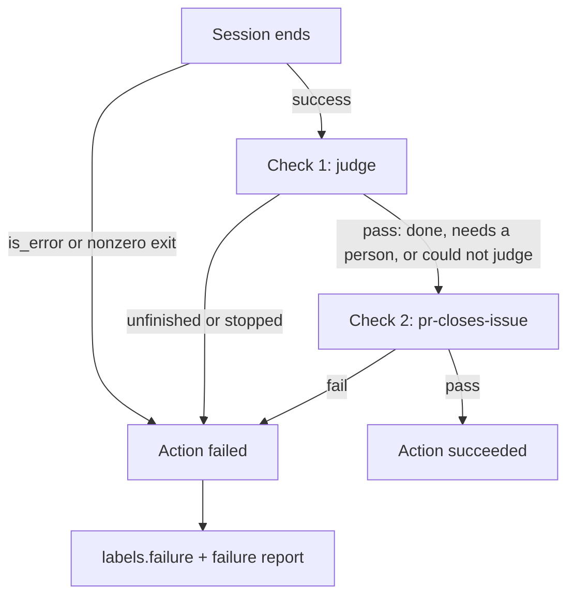
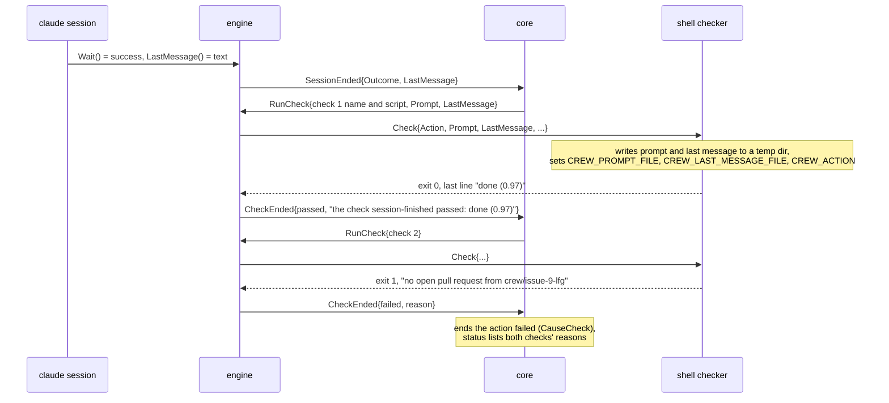
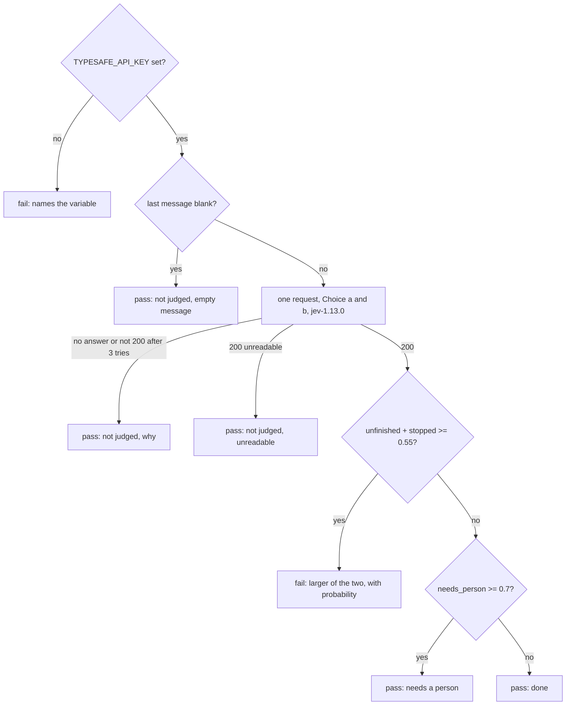

# Judge how a session ended, as a check - Plan

## Goal Capsule

- **Objective:** an action whose session exits cleanly but leaves its work unfinished, or stops without doing it, ends failed, with the failure label and the failure report. The boss no longer finds that out by reading the session's last message.
- **Means:** crew hands each check the session's last message and the prompt its session started with (KTD1, KTD2), runs an action's checks in order (KTD3, KTD4), and shows every check's reason on the status comment (KTD5). The judging itself is a check in this repository's example config, which asks TypeSafe's Jev (KTD6, KTD7). crew carries no TypeSafe code.
- **Product authority:** the boss, through the brainstorm of #152 and an experiment with Jev on this repository's session logs. The Product Contract wins on behaviour; the KTDs win on mechanism.
- **Stop conditions:** stop and report when a settled Key Decision proves unworkable, or when a gate in the Verification Contract cannot pass without changing a requirement.
- **Execution profile:** one branch, units U1 to U6 in order, one pull request whose body carries `Closes #152`. The lfg session does not touch the live `.crew/config.yaml` and does not call TypeSafe.

## Product Contract

### Summary

A check can read the session's last message and the prompt its session started with, an action can name several checks run in order, and the status comment shows the reason of a check that passed. With those, this repository's example config adds a check that asks Jev how the session ended and fails the action when the session says it is still waiting on work or stopped without doing it. Nothing changes for a config that does not use such a check.

### Problem Frame

crew decides that a session succeeded from the stream-json `result` event's `is_error` and the process exit code alone (`judge` in `internal/adapter/claude/stream.go`). The last message becomes the one-line `Reason`, and nothing reads what it says.

All 69 sessions in this repository's `.crew/logs` ended with `is_error: false`, so crew counted each one a success. Read by hand, 12 of them were not done:

| How the session ended | Count | Examples |
| --- | --- | --- |
| Done | 55 | PR open, CI green, merging is yours |
| Unfinished | 5 | #9 "The suite is still running in the background; I'll pick up when it reports back"; #5, #7 and #23 left a watcher armed; #136's first run ended on a review JSON with `pr_url: null` |
| Needs a person | 7 | #110, #113, #136, #34, #92 and #126: review threads the bot cannot resolve; #60: a manual step before merging |
| Stopped without doing the work | 2 | #109 (the bug was the design), #123 (the fix was blocked) |

crew moved each unfinished session to the rule's success label, so the next rule or the boss picked up work that was still running. The checks in use today test the result (an open pull request that closes the issue), not what the session said it left undone.

### Key Decisions

- **Judging how a session ended is a check, not a crew feature.** (session-settled: user-directed — chosen over a judge built into crew as a kind of check with a TypeSafe adapter, and over a `judges:` section beside `checks:`: a check and a judge share every rule, the best measured question shape needs code to combine answers, and crew stays agnostic of any model.) Governs R1, R2, R3, R4, R5, R12.
- **Jev is never a dependency of crew.** (session-settled: user-directed — chosen over a judge crew always runs: the user enables it by naming the check; otherwise crew never calls TypeSafe.) Governs R11, R12.
- **A judgment only passes or fails the action.** (session-settled: user-directed — chosen over an outcome that moves the issue to its own label, and over extra labels on the rule: the rule keeps its four labels, and parallel actions need no precedence between outcomes.) Governs R4, R6.
- **The judge reads the prompt as well as the last message.** (session-settled: user-directed — chosen over the last message alone, and confirmed by the experiment below: with the prompt, held-out failures caught rose from 5/7 to 6/7 and false failures fell from 1/62 to 0/62.) Governs R2, R7.
- **One Choice, asked in two option orders in the same request, decides the failure.** (session-settled: user-approved — chosen over yes/no Nouls, which raised false failures to 4/62 held out: Jev leans toward the first option, and two orders in one request cost nothing extra in latency.) Governs R7, R8.
- **When the judge cannot judge, the session's result stands.** A TypeSafe error or an empty last message passes the check, so `pr-closes-issue` and the other checks still decide. Governs R9.
- **A missing API key fails the check loudly.** (session-settled: user-approved — chosen over passing silently: an action that names the judge check is the user enabling it, and a judge that never runs should not look like one that passed.) Governs R10.

### Requirements

**What crew gives a check**

- R1. A check can read the last message of the session it follows, as the session wrote it, and the rendered prompt that session started with, including the resume note when the action resumed.
- R2. An empty last message reaches the check as empty, so the check can tell it apart from a message.

**Several checks per action**

- R3. An action's `check:` names one check or a list of checks. They run in the listed order, each in the action's workspace, after a successful session.
- R4. The first check that fails, cannot start, runs out of time or is ended by a stop fails the action, and the checks after it do not run. The action then takes the same path as any failed action: the rule's `labels.failure`, the failure report, and a resume when the ready label goes back.
- R5. Each check keeps its own time limit, and the action counts as running until its last check ends.

**What crew shows**

- R6. The status comment shows the reason of every check that ran, passed or failed, next to the action. The reason stays the check's own last line, as today for a failed check; crew still never shows the session's or a tool's own words.

**The judge check in this repository's example config**

- R7. `.crew/config.example.yaml` declares a check that sends TypeSafe one request with the action's name, the rendered prompt and the last message as state, and one Choice with four outcomes asked in two option orders: done, unfinished (still waiting on work it started), needs a person (did its part, but a person must act before the result can be used), and stopped (stopped without doing the work).
- R8. The check fails when the two orders' averaged probabilities of unfinished and stopped add up to at least the threshold, about 0.55, and echoes the outcome and its probability as its reason. Otherwise it passes, and echoes needs a person when that outcome clears a higher threshold, or done.
- R9. The check passes without asking when the last message is empty, and passes when TypeSafe answers with an error after its retries or cannot be reached. Either way it echoes why the judgment did not apply.
- R10. The check fails when `TYPESAFE_API_KEY` is not set, with a reason that names the variable.
- R11. The check pins the model version it was measured on (`jev-1.13.0`), not the moving `jev-latest` alias.
- R12. The development and fix rules' `lfg` actions name the judge check before `pr-closes-issue`. No other part of crew, the schema or the default behaviour refers to TypeSafe.

**Docs**

- R13. The README describes what a check can read (R1, R2), checks as a list (R3 to R5) and the passing check's reason on the status comment (R6). It says that this repository's example sends the prompt and the last message to TypeSafe, and that TypeSafe's zero data retention is offered only on its enterprise plan.
- R14. The JSON schema in `schema/config.schema.json` accepts `check:` as a name or a list of names.

### Acceptance Examples

- AE1. **Covers R4, R8.** The session of #9 ends with "The suite is still running in the background; I'll pick up when it reports back." The judge check fails with `unfinished (1.00)`, `pr-closes-issue` does not run, the issue moves to `crew:development:failed`, crew posts the failure report, and the status comment shows the judge's reason.
- AE2. **Covers R3, R6, R8.** A session ends with "PR #128 is open, CI is green, merging is yours." The judge passes with `done (0.97)`, `pr-closes-issue` passes, the issue moves to the success label, and the status comment shows both reasons.
- AE3. **Covers R4, R7.** #136's first run ends on a review JSON with `"status":"complete"` and `pr_url: null`. The judge passes with `done`, then `pr-closes-issue` fails because no pull request is open, and the action fails.
- AE4. **Covers R6, R8.** A session asks the boss to resolve review threads its bot cannot resolve. The judge passes and the status comment shows `needs a person (0.95)`; the issue moves to the success label.
- AE5. **Covers R9.** TypeSafe answers 429 on every retry. The judge check passes with a reason saying the judgment did not apply, and `pr-closes-issue` decides the action.
- AE6. **Covers R10.** `TYPESAFE_API_KEY` is not set and an `lfg` session succeeds. The judge check fails with a reason naming the variable, and the action fails.
- AE7. **Covers R2, R9.** A session succeeds with an empty last message. The judge check passes without calling TypeSafe and says so.
- AE8. **Covers R3, R12.** A config whose actions name one check, or none, behaves as today, and crew never calls TypeSafe.
- AE9. **Covers R4.** A session fails (`is_error: true`). No check runs, as today.

### Scope Boundaries

**Deferred for later**

- A label, or a board column or card mark, for needs a person.
- Judging a session that failed, or turning a failed session into a success.
- A typed judge in crew's config, validated at startup, or a TypeSafe adapter in crew.

**Outside this work**

- crew quoting what a session said in its own comments: the failure report and the status comment keep showing only a check's own reason.
- Rules without actions, which run no session and so no check.

### Dependencies / Assumptions

- The hand labels of the 69 sessions are one person's, and the samples that should fail are small (5 unfinished, 2 stopped). The 102 resumed turns count as unfinished without a review of each.
- A check runs with the environment crew was started with, so `TYPESAFE_API_KEY` reaches it. Verified in planning: `proc.environ` starts from crew's environment and drops only the variables an identity's `Unset` names, which are GitHub tokens.
- Jev's primary language is English; crew's sessions here end in English.
- TypeSafe's rate limits are adjusting; a 429 after retries falls under R9.

### Outstanding Questions

**Resolved in planning**

- How a check reads the last message and the prompt: files, whose paths are in `CREW_LAST_MESSAGE_FILE` and `CREW_PROMPT_FILE` (KTD2).
- Where the judge check's script lives: inline in `checks:` (KTD6).
- How the status comment lays out several checks' reasons: one line per check that ran, under the action (KTD5).
- How `CONCEPTS.md`'s Check entry changes: U6.

**Deferred to implementation**

- The thresholds of R8 cannot be re-chosen held out in this run: `TYPESAFE_API_KEY` is not set in the session that implements this. The check starts with 0.55 to fail and 0.7 to show needs a person (see Assumptions). Re-measuring them with the final script is follow-up work.

### Sources / Research
- The experiment, run on 2026-10-05 with `jev-1.13.0`: 171 non-empty messages, 342 requests, $0.019, median 0.30 s. Held-out results on the 69 final sessions:

  | State and policy | Should-fail caught | False failures | Resumed turns caught |
  | --- | --- | --- | --- |
  | Choice, last message only | 5/7 | 1/62 | 99/102 |
  | Choice, prompt and last message | 6/7 | 0/62 | 101/102 |
  | Nouls "still waiting" or "did no work", with prompt | 6/7 | 4/62 | 99/102 |
  | Noul "still waiting" alone, with prompt | 4/7 | 2/62 | 97/102 |

  The Choice threshold came out between 0.5 and 0.6 in every fold, and the option order changed the answer on 1 of 171 messages. The prompt fixed #109 (stopped, read as needs a person without it) and a promote session's "Nothing to do here". The Choice picked needs a person for 6 of the 7 sessions labelled so, and also for 3 done sessions, so it is a hint, not a gate. The issue's earlier "Noul at 0.9, no false alarm" was chosen and measured on the same data. The prompts were re-rendered from `runs.jsonl` and the git history of `.crew/config.yaml` and `.crew/config.example.yaml`.
- TypeSafe's docs: [Jev 1.13 jaggedness](https://docs.typesafe.ai/model-jaggedness/jev-1.13) (option order, adversarial content, large state), [Confidence](https://docs.typesafe.ai/confidence), [Models](https://docs.typesafe.ai/models) (aliases move; pin a version once thresholds are tuned; zero data retention on enterprise), [API reference](https://docs.typesafe.ai/api).
- Code: `internal/adapter/claude/stream.go` (`judge`, `maxReason`), `internal/core/action.go` (`sessionEnded` runs the check only after a success), `internal/core/status.go` (only a failed check's reason reaches the status), `internal/config/legacy.go` (`on_failure` is now `labels.failure`).

### Success Criteria

- Run against the 69 sessions and 102 resumed turns of this repository's `.crew/logs`, with each prompt re-rendered from the config of its time and thresholds chosen on data held out by issue, the exact judge check of R7 to R11 catches at least 6 of the 7 final sessions that should fail, fails none of the 62 that should pass, and catches at least 99 of the 102 resumed turns. These are the numbers the experiment below measured.

**Product Contract preservation:** Product Contract unchanged, except the Outstanding Questions, which now say how planning answered the deferred ones, and the Dependencies line on the environment, which records the check planning made.

---

## Planning Contract

### Key Technical Decisions

- **KTD1. The session's last message reaches the core through a new optional session interface.** `port.LastMessageReporter`, with `LastMessage() string`, sits beside `Narrator` and `UsageReporter`. The claude adapter returns the `result` text of the last top-level result event, as written: not cut, not joined onto one line, and not scrubbed, since it goes only to a local check (R1). It returns "" when there was no result or the text is empty (R2). A session without the interface gives "". The engine reads it after `Wait` and posts it in `core.SessionEnded`. The core keeps it on the action and puts it in each `RunCheck`, beside the action's rendered prompt, which the core already holds with its resume paragraph. So the core stays pure and the engine keeps no map of messages. Chosen over adding the text to `crew.Outcome`: `Outcome.Reason` reaches failure reports, the journal and the TUI, which must never carry the session's full words.
- **KTD2. A check reads the prompt and the last message from files, named by `CREW_PROMPT_FILE` and `CREW_LAST_MESSAGE_FILE`.** The shell adapter writes both into a private temporary directory (`0700`, files `0600`) before it starts the check and removes the directory once the check ended, whatever its end. An empty last message is an empty file (R2). It also sets `CREW_ACTION` to the action's name, which R7 sends as state. Chosen over the variables themselves: Linux refuses one environment string over 128 KiB (`MAX_ARG_STRLEN`), so a long message would make the check unable to start and fail the action. A file has no such limit, and `jq --rawfile` reads it as is. `port.Check` gains `Action`, `Prompt` and `LastMessage` fields; the files are the shell adapter's own business.
- **KTD3. An action's checks are a list of named checks.** `crew.Action.Check string` becomes `Checks []crew.Check`, where `crew.Check` has `Name` and `Script`. In the config, `check:` is a name or a sequence of names (R3, R14). Each name resolves as today, with its own line in an error. An empty sequence is an error ("must name at least one check"), as an empty script is. Repeated names are allowed: running a check twice is harmless and needs no rule. `RunCheck` and `port.Check` carry the check's name, which the log marker and the reason use.
- **KTD4. The core runs the checks one by one and stops at the first that does not pass.** The action stays in `PhaseChecking` with the index of the running check and the results so far. A passing check starts the next one; the last passing check ends the action as succeeded. A check that fails, cannot start, runs out of time or is stopped ends the action with `CauseCheck`, or `CauseStopped` when a stop ended it, as today (R4). When crew is stopping as a check passes and checks remain, the action ends stopped without starting the next, as `sessionEnded` does today. Each `RunCheck` gets its own `checkTimeout` context in the engine, so each check keeps its own limit and the action counts as running until its last check ends (R5). A failed session runs no check (AE9).
- **KTD5. Each check's result is crew's one line, which names the check, and the status shows one line per check that ran.** The engine words the reason: `the check pr-closes-issue passed` when it printed nothing, `the check session-finished passed: done (0.97)` when it printed, `the check session-finished failed: unfinished (1.00)`, and the existing wordings for no output, time out, stop and start failure, each with the name after "the check". The part after the colon is the check's last non-empty line, cut and cleaned by `lastLine` and `lastWords` as today (R6). `crew.ActionStatus.Reason` becomes `Checks []crew.CheckResult` (`Name`, `Passed`, `Reason`), filled for every check that ran, passed or failed. The GitHub status writes the action's line as today: `failedAction` still words `CauseCheck` as `: ` plus the failed check's reason in a code span, now taken from the last entry of `Checks`, so the pull request stop comment (`renderStop` in `internal/adapter/github/report.go`), which calls `failedAction`, keeps showing it. After the line, `writeAction` adds one list item per check that passed, its reason in a code span: every check for a succeeded action, the ones before the failed check for a failed action. The failure report keeps showing no reason. `sameStatus` compares actions with `slices.EqualFunc`, since a slice field makes `ActionStatus` no longer comparable, and `Status.Clone` and `PullRequestReport.Clone` copy each action's `Checks`.
- **KTD6. The judge is the check `session-finished`, a shell script inline in `checks:` of `.crew/config.example.yaml`, using `curl` and `jq`.** Inline, because the check runs in the action's worktree: a script file there would be the branch's copy, which the session being judged can edit. The config is read once, from the main checkout, when crew starts. `jq` builds the request from the files (KTD2) and reads the answer, so no text from the session or the issue is ever part of a command. Chosen over a Go program under `tools/`: `go run` would compile on every check, and the script stays readable next to `pr-closes-issue`.
- **KTD7. The judge asks one request with two Choice questions, `a` and `b`, whose four options come in opposite orders, to `jev-1.13.0`.** The state is `{action, prompt, last_message}` (R7, R11). The options are `done`, `unfinished`, `needs_person` and `stopped`, each described by its R7 definition; `b` lists them in reverse. The script averages each option's probability over `a` and `b`. Then:
  1. Unfinished plus stopped at 0.55 or more fails, echoing the larger of the two as `unfinished (1.00)` or `stopped (0.83)`, with the outcome's own averaged probability to two decimals (R8).
  2. Otherwise, needs a person at 0.7 or more passes with `needs a person (0.95)`.
  3. Otherwise it passes with `done (0.97)`.
  4. Each threshold is a variable at the top of the script, so re-measuring changes one line.
- **KTD8. The judge passes when it cannot judge, and fails only for a missing key.** In order:
  1. No `TYPESAFE_API_KEY` fails with `TYPESAFE_API_KEY is not set: the judge cannot ask Jev` (R10).
  2. A last message that is empty or only whitespace passes with `not judged: the session's last message is empty`, without a request (R9, AE7).
  3. `curl` posts with `--max-time 60` and tries at most 3 times, waiting 2 then 4 seconds after a 429 or a 5xx.
  4. A status other than 200 after the tries passes with `not judged: TypeSafe answered HTTP <code>`, and no answer at all with `not judged: TypeSafe could not be reached` (R9, AE5).
  5. A 200 whose answer `jq` cannot read passes with `not judged: TypeSafe's answer could not be read`.
  6. The script never echoes text from TypeSafe's answer or from the session, so the status comment stays free of the session's words. The key stays in the variable and goes to `curl` through a header read from standard input (`-H @-`), never in an argument.

### High-Level Technical Design

The path from a session's end to the action's end, with two checks:

The judge script's decisions, in order (KTD7, KTD8):

### Assumptions

- The thresholds are 0.55 to fail, from the experiment's folds (all between 0.5 and 0.6), and 0.7 to show needs a person, above the fail threshold as R8 asks. Neither is re-measured with the final script here (Outstanding Questions).
- The Choice instructions and option descriptions are written from R7's definitions. The experiment's exact wording is not in the repository, so the success criterion's numbers hold for the experiment, not yet for this script.
- `jq` and `curl` are on the `PATH` of the machine that runs crew on this repository and of CI's `go` job, whose Ubuntu runner ships both. The README names them as the example judge's requirements.
- A config with one check sees the same status line for a failed check as today, with the check's name in its reason, and one more line for a passing check.

### Sequencing

U1 (domain and config) comes first, since every later unit uses `crew.Check` and `Checks`. U2 (the last message from the harness) and U3 (the checker's inputs) are independent of each other. U4 (core and engine) needs U1 to U3. U5 (status) needs U4's results. U6 (example config, schema, docs) needs U1 to U5.

---

## Implementation Units

### U1. Checks as a list, in the domain and the config

**Goal:** an action names one check or a list of checks, each resolved by name.

**Requirements:** R3, R14; KTD3.

**Dependencies:** none.

**Files:**
- `internal/crew/rule.go`, `internal/crew/status.go` (add `Check`, `CheckResult`)
- `internal/config/rules.go`, `internal/config/decode.go` if a helper for "string or sequence" fits there
- `internal/config/config_checks_test.go`, `internal/config/config_rules_test.go`
- `schema/config.schema.json`, `internal/config/schema_test.go`
- `internal/config/config_example_test.go` (follows the field rename)

**Approach:**
1. `actionDoc.Check` becomes a `yaml.Node`; a scalar is one name, a sequence of scalars is a list, anything else is an error worded like the other shape errors.
2. `ruleEnv.check` resolves one located name; a list resolves each, reporting every unknown name with its line.
3. `crew.Action.Checks` holds `crew.Check{Name, Script}` in listed order.
4. The schema's `check` accepts a non-empty string or a non-empty array of non-empty strings.

**Patterns to follow:** `ruleEnv.check` and its errors; how `named` and `decodeItem` report shapes; existing tests in `config_checks_test.go`.

**Test scenarios:**
- `check: pr-closes-issue` loads as one check with its name and script.
- `check: [session-finished, pr-closes-issue]` loads both, in that order.
- `check: []` is an error at the key's line saying it must name at least one check.
- A list with one unknown name reports that name, at its own line, with the declared checks.
- `check: {a: b}` is a shape error.
- The schema test accepts both forms and rejects an empty list.

**Verification:** config and schema tests pass; no other package still reads `Action.Check`.

### U2. The session's last message, from the claude harness

**Goal:** a session that ended reports its last message in full.

**Requirements:** R1, R2; KTD1.

**Dependencies:** none.

**Files:**
- `internal/port/port.go` (`LastMessageReporter`)
- `internal/adapter/claude/harness.go`, `internal/adapter/claude/stream.go`
- `internal/adapter/claude/harness_test.go` (and a fixture in `internal/adapter/claude/testdata/` when none has a multi-line result)
- `internal/fake/harness.go`, `internal/fake/fake_test.go`

**Approach:**
1. The session keeps the last result event's `result` text when it reaps; `LastMessage` returns it once `Wait` returned.
2. The fake harness gets a session kind that implements the interface, set by the test, like `NewUsageHarness`.

**Patterns to follow:** `UsageReporter` and `usage()`; the compile-time guards in `harness.go` and `fake/harness.go`.

**Test scenarios:**
- A stream whose final result text has several lines and more than 200 characters gives exactly that text, newlines kept.
- A stream with no result event gives "".
- A result event with an empty `result` gives "".
- The fake session returns what the test set.

**Verification:** the claude adapter's tests pass against the recorded fixtures.

### U3. The checker hands a check its inputs

**Goal:** a check can read the action's name, the prompt and the last message.

**Requirements:** R1, R2; KTD2.

**Dependencies:** U1 for the check's name on `port.Check`.

**Files:**
- `internal/port/port.go` (`Check` gains `Name`, `Action`, `Prompt`, `LastMessage`)
- `internal/adapter/shell/check.go`, `internal/adapter/shell/check_test.go`
- `internal/fake/checker.go`, `internal/fake/fake_test.go`

**Approach:**
1. Before starting `sh`, the shell checker makes a temp directory with `os.MkdirTemp`, writes `prompt` and `last-message` into it with `0600`, and sets `CREW_PROMPT_FILE`, `CREW_LAST_MESSAGE_FILE` and `CREW_ACTION`.
2. It removes the directory when `Check` returns, on every path, including a start failure and a stop.
3. A failure to write the files is a start failure: the check could not start.
4. The fake checker scripts a check by branch and, when set, by check name, so a test can make the first of two checks pass and the second fail.

**Patterns to follow:** the env list in `Checker.Check`; `proc.Command` with `Dir`, `Env`, `Unset`.

**Test scenarios:**
- A check that runs `cat "$CREW_LAST_MESSAGE_FILE"` prints the multi-line message exactly.
- A check that runs `cat "$CREW_PROMPT_FILE"` prints the prompt exactly, and `echo "$CREW_ACTION"` prints the action's name.
- An empty last message gives a file of size 0 (`test -s` fails).
- After the check ends, passed, failed or stopped, the directory the variable named no longer exists.
- A message over 128 KiB reaches the check whole.

**Verification:** shell adapter tests pass under `-race`.

### U4. The core runs the checks in order; the engine passes the inputs and words each result

**Goal:** an action runs its checks one after another and ends at the first that does not pass.

**Requirements:** R3, R4, R5, AE1, AE3, AE8, AE9; KTD1, KTD4, KTD5.

**Dependencies:** U1, U2, U3.

**Files:**
- `internal/core/input.go` (`SessionEnded.LastMessage`), `internal/core/command.go` (`RunCheck` gains `Check` name, `Prompt`, `LastMessage`), `internal/core/model.go` (`actionRun`: checks, index, results, last message), `internal/core/action.go`, `internal/core/update.go`
- `internal/core/check_test.go`, `internal/core/stop_test.go`
- `internal/engine/exec.go`, `internal/engine/check_test.go`, `internal/engine/engine_test.go` where it builds actions

**Approach:**
1. `sessionEnded` keeps `LastMessage` and starts the first check after a success; no checks or a failed session end the action as today.
2. `checkEnded` appends the result; a pass with checks left starts the next with a fresh `RunCheck`, unless crew is stopping; a stop ends it stopped; the last pass ends it succeeded with that check's outcome.
3. `stopActions` keeps working unchanged: `a.stopped` makes the running check's end count as stopped.
4. The engine's `startSession` reads `LastMessageReporter` after `Wait`; `check` writes `crew: running the check <name>: <script>` to the log and words each outcome per KTD5.

**Patterns to follow:** `sessionEnded`, `checkEnded` and the stop handling in `internal/core/action.go`; table tests in `check_test.go`; synctest engine tests in `internal/engine/check_test.go`.

**Test scenarios:**
- Covers AE1. Two checks, the first fails: the action fails with `CauseCheck`, the second `RunCheck` is never sent, the failure report lists the action.
- Covers AE3. The first passes, the second fails: two `RunCheck`s in order, the action fails, both results kept.
- Covers AE2. Both pass: the action succeeds, both results kept, in order.
- Covers AE9. A failed session with two checks: no `RunCheck`.
- Covers AE8. One check: the same commands and outcome as before this change, apart from the name in the reason.
- A stop while the first of two checks runs: `StopCheck`, then the action ends stopped and the second never runs.
- crew is stopping when the first passes: the action ends stopped, no second `RunCheck`.
- Each `RunCheck` carries the action's rendered prompt, with the resume paragraph when it resumed, and the session's last message.
- Engine: a session whose fake reports a last message leads to a `port.Check` carrying it, the prompt and the action's name.
- Engine: a passing check that printed `done (0.97)` gives `the check session-finished passed: done (0.97)`; one that printed nothing gives `the check pr-closes-issue passed`.
- Engine, under synctest: the second check gets its own 10-minute limit, not what is left of the first's.

**Verification:** `go test -race ./internal/core ./internal/engine` passes; the core tests need no goroutine.

### U5. Every check's reason on the status comment

**Goal:** the status shows each check that ran, passed or failed, with its reason.

**Requirements:** R6, AE1, AE2, AE4; KTD5.

**Dependencies:** U4.

**Files:**
- `internal/crew/status.go` (`ActionStatus.Checks`, `Clone`), `internal/crew/pullrequest.go` (`PullRequestReport.Clone`)
- `internal/core/status.go` (`status`, `sameStatus`)
- `internal/core/status_test.go`
- `internal/adapter/github/status.go`, `internal/adapter/github/status_render_test.go`, `internal/adapter/github/status_entries_test.go` where they build reasons
- `internal/adapter/github/report.go` (unchanged if `failedAction` keeps the failed check's reason), `internal/adapter/github/pullrequest_test.go`
- `internal/ui/tui` and `internal/ui/lines` only if they read `ActionStatus.Reason` (research found they do not)

**Approach:**
1. The core fills `Checks` from the action's results whenever the action is in `PhaseChecking`, `PhaseFinishing` or `PhaseEnded`, so a running action shows the checks that passed so far.
2. `failedAction` reads the failed check's reason from the last entry of `Checks`; `writeAction` writes the checks that passed after the action's line, one list item each, the reason in a code span (KTD5).
3. Nothing from `Outcome.Reason` of a session reaches `Checks`; only check results do.

**Patterns to follow:** `failureCause` and `codeSpan` in `internal/adapter/github/status.go`; golden-style body assertions in `status_render_test.go`.

**Test scenarios:**
- Covers AE2. A succeeded action with two passed checks renders both lines, in order, after `**`lfg`** succeeded.`
- Covers AE1. A failed action whose first check failed renders `failed: ` and that check's reason in a code span, then its log, and no list item.
- Covers AE3. A failed action whose first check passed and second failed renders the second's reason on the action's line and the first's as one list item.
- The pull request stop comment for an action whose judge failed shows `the check session-finished failed: unfinished (1.00)`, as `TestACheckReasonWithBackticksStaysInItsCodeSpan` expects of a check's reason today.
- `PullRequestReport.Clone` gives a report whose actions' `Checks` share no array with the original.
- Covers AE4. A passing judge whose reason is `the check session-finished passed: needs a person (0.95)` shows that line, and the issue moves to the success label.
- A status with checks differs from one without, for `sameStatus`, so a new check result is reported.
- `Clone` gives a status whose `Checks` share no array with the original.
- A session's failure (`CauseSession`) carries no `Checks` and no session text.

**Verification:** github adapter and core status tests pass.

### U6. The judge check in the example config, and the docs

**Goal:** this repository's development and fix rules fail an lfg session that says it is still waiting or did not do the work.

**Requirements:** R7 to R13, AE1, AE4 to AE7; KTD6, KTD7, KTD8.

**Dependencies:** U1 to U5.

**Files:**
- `.crew/config.example.yaml` (the `session-finished` check, the two lfg actions' `check:` lists, the header comment on checks)
- `internal/config/config_example_test.go`
- `README.md`, `CONCEPTS.md`

**Approach:**
1. Write the script per KTD6 to KTD8, with comments saying what it sends and when it passes or fails, as the other checks have.
2. development's and fix's lfg actions name `[session-finished, pr-closes-issue]` (R12).
3. The test runs the script from the loaded config with `sh -c`, in a temp directory, with a stub `curl` first on `PATH`. The stub records its request body and arguments, then answers with a status and body the test chooses.
4. README: a short section on checks, saying what a check reads (`CREW_PROMPT_FILE`, `CREW_LAST_MESSAGE_FILE`, `CREW_ACTION` beside the existing variables), that `check:` takes a list run in order, that the status shows each check's last line, and that this repository's example judge sends the prompt and the last message to TypeSafe, whose zero data retention is offered only on its enterprise plan, and needs `curl` and `jq` (R13).
5. CONCEPTS.md: the Check entry says an action points to one or more checks, run in order until one does not pass, and that a check can read the session's prompt and last message.

**Patterns to follow:** `pr-closes-issue` and `split-finished` in the example config; `TestTheRefinePromptAndTheSplitSkillAgree` for reading a script from the loaded config.

**Test scenarios:**
- Covers AE1. The stub answers `unfinished` at 1.0 in both orders: the script exits non-zero and its last line is `unfinished (1.00)`.
- Covers AE2. `done` at 0.97: exit 0, last line `done (0.97)`.
- Covers AE4. `needs_person` at 0.95: exit 0, `needs a person (0.95)`.
- `stopped` at 0.6 and `unfinished` at 0.1, averaged over both orders: fails with `stopped (0.60)`.
- Unfinished 0.3 plus stopped 0.3 fails, since the sum reaches 0.55; unfinished 0.25 plus stopped 0.25 passes.
- Covers AE5. The stub answers 429 every time: exit 0, a `not judged` line naming HTTP 429, and three requests.
- Covers AE6. No `TYPESAFE_API_KEY`: exit non-zero, the last line names the variable, and the stub was never called.
- Covers AE7. An empty last-message file: exit 0, `not judged` line, the stub never called.
- A 200 with a body that is not JSON: exit 0, `not judged`.
- The recorded request names `jev-1.13.0`, has `action`, `prompt` and `last_message` in its state equal to the files' text, and two Choice questions whose option keys come in opposite orders.
- No argument the stub received contains the key's value.
- Covers R12. The development and fix lfg actions load with checks `session-finished` then `pr-closes-issue`; no other action names `session-finished`.

**Verification:** the example config loads; the script tests pass; README and CONCEPTS describe what shipped.

---

## System-Wide Impact

- **Every config:** `check:` with one name loads and behaves as before, apart from the status wording (KTD5) and the check's name in its reason. crew sends nothing to TypeSafe unless a config names a check that does (AE8).
- **Public text:** the status comment now shows a passing check's last line. That line is the check author's own words, as a failed check's already is; the judge script echoes only an outcome and a number (KTD8).
- **Resume:** a resumed action runs its session and then every check again, with the prompt that includes the resume paragraph.

## Risks & Dependencies

- **A crafted issue can steer the session's last message.** The judge only fails or passes the action, and `pr-closes-issue` still runs after a pass, so steering the judge to pass gains nothing the session could not already get. Steering it to fail costs a failed action.
- **TypeSafe is down or rate-limited.** The judge passes and says so (R9); `pr-closes-issue` decides.
- **Option-order bias.** Two orders averaged (KTD7); the experiment saw the order change the answer on 1 of 171 messages.

## Scope Boundaries (planning)

Considered and not built:
- A per-check time limit setting: R5 asks only that each check keeps its own limit, which the fixed `checkTimeout` per check gives.
- Rejecting repeated check names in a list (KTD3).
- Keeping the prompt and last message files after a check, for debugging: the session's log already holds both.

---

## Verification Contract

From the repository root:

- `go build ./cmd/crew`
- `go test -race ./...`
- `gofmt -l cmd internal tools` prints nothing
- `go vet ./...`
- `go run github.com/golangci/golangci-lint/v2/cmd/golangci-lint@v2.14.0 run`
- `go test -race -covermode=atomic -coverpkg=./... -coverprofile=coverage.out ./...`, then `go run github.com/vladopajic/go-test-coverage/v2@v2.19.0 --config=.testcoverage.yml` (total 90% or more) and `git diff -U0 origin/main...HEAD | go run ./tools/diffcover -profile coverage.out` (changed lines 90% or more)
- `go run golang.org/x/vuln/cmd/govulncheck@v1.8.0 ./...`

## Definition of Done

- Every unit's test scenarios exist and pass, and every gate above passes.
- `crew.Action.Check` and `crew.ActionStatus.Reason` no longer exist; nothing reads them.
- The example config loads, names `session-finished` before `pr-closes-issue` on both lfg actions, and pins `jev-1.13.0`.
- README, CONCEPTS.md and the schema describe checks as shipped.
- No experimental or abandoned code remains in the diff.
- The pull request body carries `Closes #152` and says the thresholds are not yet re-measured with the final script.
