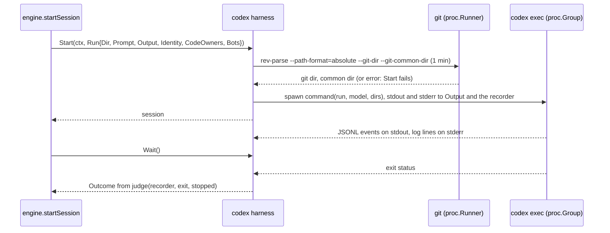

# The codex harness - Plan

## Goal Capsule

- **Objective:** a code owner can run any agent's sessions on Codex instead of Claude Code, in a repository that has only Codex or next to Claude agents in the same config, and those sessions commit, push and comment as the agent's bot.
- **Means:** one new harness adapter, `internal/adapter/codex`, registered next to `claude` (KTD1 to KTD8). The engine, the TUI and the claude adapter do not change.
- **Product authority:** the boss, through the brainstorm of #133. The Product Contract wins on behaviour; the KTDs win on mechanism.
- **Stop conditions:** stop and report when a settled Key Decision proves unworkable, or when a gate in the Verification Contract cannot pass without changing a requirement.
- **Execution profile:** one branch, units in order U1 to U5, one pull request whose body carries `Closes #173`. AE7 needs a run on a machine where Codex is logged in, which this one is not. The pull request body records it as a manual check.
- **Open blockers:** none.

---

## Product Contract

Product Contract from issue #173. Planning answers its Outstanding Questions (KTD2, KTD6, and the token mapping deferred to part 2). Product Contract preservation: Product Contract unchanged.

### Summary

An agent whose harness is `codex` runs its actions' sessions on Codex's headless mode, in a sandbox opened only as far as an action needs; the README and the schema name `codex`.

### Problem Frame

`claude` is the only harness crew ships (`internal/registry/default.go`). The architecture plan built the harness port so that Codex would be one more adapter (`docs/plans/2026-10-01-2202-feat-crew-engine-architecture-plan.md`). The config-keys plan then gave each agent its own harness, so that development could run on Claude and review on Codex (`docs/plans/2026-10-04-2304-feat-config-keys-plan.md`). Neither shipped a second harness, so a boss who uses Codex, or wants Codex to review Claude's work, cannot run crew that way today.

Codex differs from Claude Code in ways crew's reports and safety depend on. `codex exec --json` prints token counts but no dollar cost. Its workspace-write sandbox blocks the network and any write outside the working directory by default. A worktree's git directory lives in the main repository, so with those defaults `git commit`, `git push` and `gh` all fail. Codex also invokes skills its own way, so a prompt such as `/compound-engineering:lfg #42` means nothing to it.

### Key Decisions

- **A Codex-only repository and a mixed Claude and Codex config are both first-class.** (session-settled: user-directed — chosen over starting with mixed agents only, or with a Codex-only crew only: either setup must work from day one.) Governs R1, R10, R12.
- **Prompts reach Codex verbatim, and the code owner writes them for the agent's harness.** (session-settled: user-approved — chosen over crew translating a leading `/plugin:skill` into Codex's skill call, and over a startup warning on Claude-style prompts: crew would have to track both harnesses' invocation syntax.) Governs R5.
- **Codex sessions are guarded the way Claude's auto mode guards Claude sessions.** (session-settled: user-approved — chosen over bypassing Codex's approvals and sandbox, and over a configurable sandbox per agent.) Governs R9.
- **With no `model`, Codex picks the model.** (session-settled: user-approved — chosen over crew pinning a default OpenAI model, as the claude harness pins `claude-opus-5-5`, and over requiring `model`: crew has nothing to bump as models change.) Governs R3.
- **The example config does not change.** (session-settled: user-directed — chosen over a README section on Codex, a commented Codex agent in `.crew/config.example.yaml`, and a second, Codex-shaped example config: an example is an example, and each code owner writes their own.) Governs R13.

### Actors

- A1. The code owner: writes `.crew/config.yaml`, picks each agent's harness and writes each action's prompt for that harness.
- A2. crew: checks the harnesses in use at startup, runs each action's session on its agent's harness and reports what it used.
- A3. Codex: the `codex` CLI, logged in on the machine crew runs on.

### Requirements

**Running a session**

- R1. An agent whose harness name is `codex` runs its actions' sessions with Codex's headless mode, in the action's workspace, with the action's prompt.
- R2. A Codex session succeeds when Codex exits 0 and its last turn did not end in error; otherwise it fails with a one-line reason, as a Claude session does.
- R3. The codex harness section accepts `model` and no other key; without `model`, crew passes none and Codex runs the model its own config or its built-in default names.
- R4. crew stops a Codex session the way it stops a Claude session: the session's whole process group ends, and its outcome is a failure saying crew stopped it.
- R5. crew passes the action's prompt to Codex unchanged, translating no Claude Code slash command.
- R6. A resumed action on a Codex agent starts a new Codex session in the failed action run's workspace with the engine's note that it continues earlier work, as a resumed Claude action does.

**Safety and identity**

- R9. A Codex session runs under Codex's automatic approval review inside its workspace-write sandbox, widened only to network access and the repository's git directory, so that it can commit, push and use `gh` from its worktree.
- R10. A Codex action acts as its agent's bot exactly as a Claude action does: its `gh` calls and commit co-author are the bot's, and the code owners and bots crew names reach the session's commands.
- R11. A Codex session loads the user's own Codex config, such as its MCP servers and skills, as a Claude session loads the user's Claude Code settings.

**Documentation**

- R13. The README's adapter list and the config schema name `codex` as a harness crew ships; `.crew/config.example.yaml` stays as it is.

### Key Flows

- F1. An action on a Codex agent
  - **Trigger:** a rule takes an issue, and one of its actions names an agent whose harness is `codex`.
  - **Steps:** crew prepares the action's workspace, starts Codex headless there with the action's prompt and the agent's identity, and reads Codex's events until it exits. crew judges the session, runs the action's check when the session succeeded, and records the session's tokens, turns and last message.
  - **Covered by:** R1 to R11

### Acceptance Examples

- AE4. **Covers R1, R10.** Given rules `development` on a `developer` agent on `claude` and `review` on a `reviewer` agent on `codex`, each with its own bot, when each holds an issue, both sessions run at once, each on its own harness, and the review session's `gh` comment is posted as the reviewer's bot.
- AE6. **Covers R2.** Given a Codex session whose process exits 0 after a last turn that ended in error, when the session ends, the action fails with that error as its reason.
- AE7. **Covers R9.** Given a Codex action whose prompt asks it to commit, push its branch and open a pull request, when it runs in its worktree, the commit, the push and the pull request all succeed.
- AE8. **Covers R3.** Given a codex harness section with an `effort` key, when crew starts, it refuses the config, naming the key.

### Success Criteria

- An issue taken by a rule whose action runs on a logged-in Codex ends with the work the prompt asked for, such as a pull request opened as the agent's bot, with no change to the engine, the TUI or the claude adapter.
- The adapter's tests run on recorded Codex event fixtures, as the claude adapter's run on recorded stream-json, covering success, a failed last turn, a stop and a process that dies before any event.

### Scope Boundaries

- Codex settings beyond `model`, such as reasoning effort, profiles or the sandbox mode, are deferred.
- No dollar cost for Codex sessions, estimated or configured.
- No translation of prompts between harnesses, and no warning about Claude-style prompts on Codex agents.
- No Codex section in the README and no Codex agent or prompt in the example config.
- No use of Codex's own session resume.
- No other harness.
- Codex's usage, last words and startup check (R7, R8, R12) are part 2 of 2, built in its own issue.

**Considered and not built:**

- A `port.Preparer` that looks for `codex` on PATH. It is part of the startup check, which is R12 and part 2. Without it a missing `codex` fails each action at start with `exec: "codex": executable file not found`, which the boss sees on the first issue taken. Part 2 slipping well behind part 1 would change this call.
- A minimum Codex version. An older Codex refuses an unknown flag on stderr and exits 2, and KTD5 makes that line the reason. Part 2's startup check owns any refusal.
- Re-setting the inherited `GIT_CONFIG_KEY_i`/`VALUE_i` entries below the bot's own when the user's Codex env policy filters them. git then fails loudly (`missing config key GIT_CONFIG_KEY_0`), so the session fails visibly. Evidence of a silent failure would change this call.
- Ending Codex's command children on macOS when a session is stopped (see Risks). R4 holds for the session's process group. Codex puts its commands in their own sessions, which Linux ends with the parent and macOS does not.

### Dependencies / Assumptions

- `codex-cli` 0.154.0 has `exec --json`, `-m`, `--sandbox workspace-write`, `--approve-for-me`, `--add-dir`, `-C` and `--skip-git-repo-check`, and `codex login status` exits 1 when logged out. All of this was checked against the CLI installed here.
- Verified from the 0.154.0 source and a logged-out run: the events that carry the final message, a failed turn and the token usage (KTD5, Appendix).
- Verified from the source: Codex's default environment policy inherits everything and applies no default excludes. A user's own policy can still filter, which KTD3 answers.
- Verified from the source: `codex exec` never waits on a person. It rejects any approval request that would reach one, and that rejection fails the session.

### Outstanding Questions

**Deferred to Planning** (answered)

- Whether crew should refuse an old Codex, and how it would learn the version: not in part 1 (Scope Boundaries). Part 2's startup check owns it.
- How the sandbox is widened to the network and the git directory, and whether the bots' private `gh` config directories need it: KTD2. The `gh` directories need no widening, because the sandbox reads everywhere and crew renews the tokens outside it.
- How Codex's token kinds map onto crew's: part 2. The fields are recorded in the Appendix.

### Sources / Research

Split from #133.

- Harness port and optional capabilities: `internal/port/port.go` (`Harness`, `Run`, `Session`, `Narrator`, `UsageReporter`), `internal/port/factory.go`.
- The claude adapter, the pattern to follow: `internal/adapter/claude/command.go` (flags, environment), `internal/adapter/claude/stream.go` (judging and usage), `internal/adapter/claude/harness.go` (default model, `Prepare`).
- Optional usage values and the "not reported" and partial wording: `internal/crew/usage.go`; the run journal's optional cost and tokens: `internal/engine/journal.go`.
- Only agents in use are built and prepared: `internal/config/agents.go`, `internal/engine/engine.go` (`prepare`).
- Resume is engine-side: `internal/core/resume.go`.
- The status comment quotes a running action's last words: `internal/adapter/github/status.go`; the related learning: `docs/solutions/security-issues/session-text-in-public-tracker-comments.md`.
- The schema's harness name: `schema/config.schema.json`; the README's adapter list: `README.md`.

---

## Planning Contract

### Key Technical Decisions

- KTD1. **The command is `codex exec --json --approve-for-me`, widened with `-c` and `--add-dir`, and the prompt goes last after `--`.** `--approve-for-me` sets the automatic reviewer, `approval_policy="on-request"` and `sandbox_mode="workspace-write"` in one flag, and the CLI refuses it next to `--sandbox`, so crew passes no sandbox flag (`codex-rs/utils/cli/src/shared_options.rs`). Network is `-c sandbox_workspace_write.network_access=true`. `-m <model>` is passed only when the section sets a non-empty `model` (R3). The process runs with `run.Dir` as its working directory and proc's closed stdin, and Codex then appends nothing to the prompt. `--` keeps a prompt that starts with a dash, or that names a subcommand such as `review`, from being read as one (R5). crew passes neither `--ignore-user-config` nor `--ephemeral` (R11). This instantiates the guard Key Decision and inherits its label (session-settled: user-approved — chosen over bypassing Codex's approvals and sandbox, and over a configurable sandbox per agent). Governs R1, R5, R9, R11.
- KTD2. **Both the worktree's git dir and the common git dir are writable roots, found with `git rev-parse` at Start.** Codex makes the git dir a worktree's `.git` file points to read-only unless that exact path is itself a writable root (`codex-rs/protocol/src/permissions.rs`, `default_read_only_subpaths_for_writable_root`). A commit also writes objects and refs in the common dir. Offline probes under `codex sandbox` in a linked worktree failed with either root alone and committed with both. Start runs `git rev-parse --path-format=absolute --git-dir --git-common-dir` in `run.Dir` through the injected `proc.Runner`, under a one-minute timeout, and passes each distinct path as `--add-dir`. A rev-parse failure fails Start, saying the workspace is not in a git repository. Codex would refuse such a directory anyway without `--skip-git-repo-check`, which crew does not pass. The private `gh` config dirs are only read, and reads are allowed everywhere. The common dir includes `hooks/` and `config`, which the Risks table records. Governs R9.
- KTD3. **The bot's environment is pinned inside Codex with `shell_environment_policy.set`, and `include_only` is cleared.** Codex builds a command's environment by inherit, excludes, `set`, then `include_only` (`codex-rs/protocol/src/shell_environment.rs`). A user's policy can therefore drop `GH_CONFIG_DIR` or `GIT_CONFIG_*`, and the session would then push and comment as the code owner without any error. crew passes one `-c shell_environment_policy.set.<NAME>=<value>` per entry of `run.Identity.Env` and for `CREW_CODE_OWNERS` and `CREW_BOTS`, one `-c shell_environment_policy.set.<NAME>=""` per name in `run.Identity.Unset`, and `-c shell_environment_policy.include_only=[]`. `set` survives `inherit` and `exclude`, and clearing `include_only` keeps it from being filtered afterwards. The same entries also go into the codex process's environment, and `run.Identity.Unset` is removed from it, as for claude. The empty `set` entries are needed because Codex's shell snapshot (on by default) sources the user's login-shell exports before each command and then restores only the `set` keys (`codex-rs/core/src/tools/runtimes/mod.rs`, `build_override_exports`). Without them, a `GH_TOKEN` exported by the user's shell profile would come back and win over `GH_CONFIG_DIR`. `gh` treats an empty `GH_TOKEN` as absent; U2 checks this. Clearing `include_only` costs the user's own env filters in crew's sessions. Codex's config merge drops a lower layer's keyed `shell_environment_policy.filters` table when a higher layer sets `include_only` (`codex-rs/config/src/merge.rs`), so a user on that form loses its excludes too. That matches a Claude session, which gets crew's whole environment. Acting as the code owner would instead break R10, so R10's identity wins over R11's letter here. The values are paths, git config entries and logins, never a token (`port.Identity`), so seeing them in `ps` costs nothing. Governs R10.
- KTD4. **`-c` values are written as TOML basic strings by a small encoder in the adapter.** Codex parses each `-c` value as TOML and, when that fails, silently keeps the raw text with its outer quotes stripped. Go's `%q` emits `\x..`, `\a` and `\v`, which TOML rejects. The encoder escapes `\` and `"`, writes control characters as `\uXXXX`, and leaves everything else as UTF-8. Real values include the credential helper `!GH_CONFIG_DIR='<dir>' gh auth git-credential`, the co-author hook's `--trailer 'Co-authored-by: ...'`, an empty value, and space-joined logins. Names come from crew's own identity code and are bare TOML keys. No new dependency. Governs R10.
- KTD5. **The verdict comes from the terminal turn event and the exit code.** `codex exec` runs one turn. It prints `turn.completed` or `turn.failed` at the end, or no turn event when the turn was interrupted. It exits 1 when the turn failed or was interrupted, or after a fatal error, and exits 0 otherwise (`codex-rs/exec/src/lib.rs`). A top-level `error` event is also printed for retries that later recover and does not say which it is. So no `error` event, and no `item.completed` of type `error`, fails a session by itself. The matrix is in the High-Level Technical Design. A success's reason is its last `agent_message` text, as claude's is its result text. When Codex exits non-zero and stdout held no event at all, as when Codex refused its arguments, the last non-empty stderr line is the reason, so that "exit code 2" is not all the boss sees. Every reason is one line, with control characters other than tab dropped, cut to 200 characters. Governs R2.
- KTD6. **Part 1 implements `port.Harness` and `port.Session` only.** No `Preparer` (R12, part 2), no `Narrator` (R8, part 2: last words reach the public status comment, `internal/adapter/github/status.go`), and no `UsageReporter` (R7, part 2), so the view shows usage as not reported. The repository forbids "not implemented" stubs, so these interfaces are absent rather than empty. The parser still reads only what part 1 judges by, and part 2 extends it.
- KTD7. **The codex adapter is its own code, written in its own shape.** depguard forbids one adapter importing another, and the Means keeps the claude adapter unchanged, so no plumbing moves into a shared package. Codacy flags clones of 100 tokens or more outside tests (`.codacy.yaml`). Codex's session, writer and verdict code must therefore not copy claude's line for line: the verdict is keyed on a turn event rather than a result event, and one recorder value holds both the stdout events and the last stderr line, fed by two writers. `internal/adapter/codex/testdata/**` joins the duplication excludes beside claude's, with `.codacy/codacy.config.json` regenerated by `pnpm exec codacy-analysis update-config`.
- KTD8. **Stop is claude's: SIGTERM to the process group, SIGKILL at the caller's deadline, and the outcome `stopped by crew before the session ended`.** `proc.Process.Stop` does it. A stopped session's verdict ignores its events. The core already turns a stop into "crew stopped it" (`internal/core/action.go`). Resume (R6) needs nothing from the adapter, because the core appends the continuation note to the prompt (`internal/core/resume.go`) and Start reads the git dirs again in the reopened worktree. Governs R4, R6.

### High-Level Technical Design

A session's life, from the engine's `Start` to its verdict:



The verdict (KTD5). "Error" is the last top-level `error` event's message, "said" is the last `agent_message` text, and "stderr" is the last non-empty stderr line:

| Stopped by crew | Exit | Terminal turn event | Outcome | Reason |
|---|---|---|---|---|
| yes | any | any | failure | `stopped by crew before the session ended` |
| no | 0 | `turn.completed` | success | said, or empty |
| no | any | `turn.failed` | failure (AE6) | `turn.failed.error.message` |
| no | non-zero | `turn.completed` | failure | `<exit> after: <error, else said>` |
| no | any | none, with an `error` event | failure | error |
| no | non-zero | none, with no stdout event | failure | stderr, else `<exit>` |
| no | 0 | none | failure | `the session ended without a result` |
| no | non-zero | none, other events only | failure | `<exit>` |

`<exit>` is `exit code N`, or the error itself, such as `signal: killed`, when no code applies.

### Output Structure

```text
internal/adapter/codex/
  harness.go         Factory, settings, harness.Start, session (Wait, Stop, reap)
  gitdirs.go         the rev-parse of KTD2
  command.go         command(run, model, dirs): argv and environment (KTD1, KTD3)
  toml.go            the TOML basic-string encoder (KTD4)
  events.go          the JSONL recorder and judge (KTD5)
  *_test.go          one per file, plus schema_test.go
  testdata/*.jsonl   recorded and hand-built Codex runs
```

The per-unit Files lists are authoritative. The implementer may merge small files.

### Assumptions

Headless run: these bets were not confirmed by the boss and are the plan's defaults.

- KTD3 clears the user's `shell_environment_policy.include_only` in crew's Codex sessions. When the user's config uses the keyed `filters` table instead, Codex drops that whole table, excludes included. crew's sessions then filter no variable, as a Claude session does.
- A missing `codex` binary fails each action at start until part 2 adds the startup check.
- The reason falls back to stderr only when Codex exits non-zero and stdout carried no event at all.
- The rev-parse timeout is one minute. A healthy rev-parse takes milliseconds.

### Risks

| Risk | Mitigation |
|---|---|
| Push, `gh` over the network and the whole AE7 flow are unverified, because Codex is logged out on this machine. | The commit half was probed offline (KTD2). The pull request records a manual AE7 run on a logged-in machine, on Linux and on macOS, as a check left to do. |
| On macOS, a stopped Codex session's commands can outlive it. Codex runs them in their own sessions and handles only SIGINT, and macOS has no parent-death signal. | Recorded as a known limit (Scope Boundaries). A follow-up could have proc send SIGINT before SIGTERM. |
| `.agents/` and `.codex/` at the worktree root are read-only to Codex (protected metadata), so a prompt that edits this repository's `.agents/skills` goes to Codex's automatic review or fails. | Codex's own rule, inside the settled sandbox. None in crew. |
| A user's env filters (`include_only`, or the keyed `filters` table with its excludes) do not apply in crew's Codex sessions (KTD3). | Accepted: the same as a Claude session. crew cannot tell which form the user's config uses without parsing it. |
| The writable common git dir lets a session write `hooks/` or `config` (`core.hooksPath`, a `credential.helper`) in the main repository. crew's own `git fetch` and `git worktree add` there would then run that code outside the sandbox, as the code owner. | Accepted: the settled guard widens the sandbox to the repository's git directory, and Claude sessions have no sandbox at all. Narrowing the roots to `objects`, `refs` and `logs` would need `git push -u`'s write to `config` verified first, so it is left as a follow-up. |
| Tools that write outside the worktree, such as Go's build and module caches, are refused inside the sandbox, and each such command depends on Codex's automatic review allowing an escalation. AE7 does not exercise this. | Accepted within the settled sandbox. The manual AE7 run should include the repository's own test command, to show whether review lets it through. |
| Several Codex sessions at once share `~/.codex`, including its token refresh. | Untested. AE4 runs one Codex session beside a Claude one. |
| Codex's JSONL schema changes in a later release. | The recorder ignores unknown event and item types. The fixtures pin 0.154.0's shapes. |

---

## Implementation Units

### U1. The event recorder and the verdict

- **Goal:** read Codex's stdout as it is written and judge the session by the terminal turn event and the exit code (KTD5).
- **Requirements:** R2, AE6.
- **Dependencies:** none.
- **Files:** `internal/adapter/codex/events.go`, `internal/adapter/codex/events_test.go`, `internal/adapter/codex/testdata/success.jsonl`, `testdata/failed.jsonl` (exit 0 after `turn.failed`), `testdata/loggedout.jsonl` (the run recorded in the Appendix), `testdata/retried.jsonl` (`error` events, then `turn.completed`), `testdata/interrupted.jsonl` (no terminal turn event), `testdata/quoted.jsonl` (an `agent_message` whose text holds `"type":"turn.failed"`).
- **Approach:**
  1. An `io.Writer` splits stdout into lines across chunk boundaries and decodes each line's top-level `type`. It dispatches on that string with a plain `switch`: a type switch is what Codacy's Lizard misreads (`docs/solutions/tooling-decisions/codacy-lizard-and-golangci-lint-limits.md`).
  2. It keeps whether any event came, the terminal turn event with its error message, the last top-level `error` message, and the last `agent_message` text from `item.completed`.
  3. A second writer keeps the last non-empty stderr line.
  4. `judge` takes the recorder, the exit error and the stopped flag and applies the matrix. Keep each function under the lint limits (funlen 50, cyclop 15) by splitting the no-turn-event branch out.
  5. Lines that are not JSON objects, unknown types and unknown item types are skipped.
- **Patterns to follow:** `internal/adapter/claude/stream.go` for streaming lines and `exited`; `internal/engine/exec.go` `lastLine` for dropping control characters. Write them in this adapter's own shape (KTD7).
- **Test scenarios:**
  - `success.jsonl`, exit 0: success, the reason is the last `agent_message` on one line.
  - Covers AE6. `failed.jsonl`, exit 0: failure, the reason is `turn.failed.error.message`.
  - `loggedout.jsonl`, exit 1: failure, the reason is the 401 message of `turn.failed`, not a `Reconnecting...` retry.
  - `retried.jsonl`, exit 0: success despite the `error` events before `turn.completed`.
  - `turn.completed` with exit 1 after an `error` event: failure, `exit code 1 after: <that error>`.
  - `interrupted.jsonl`, exit 1: failure, the reason is the last `error` message.
  - No stdout at all, exit 2, stderr ending in `error: unexpected argument '--approve-for-me' found`: failure, that line is the reason.
  - No stdout, exit 0: `the session ended without a result`.
  - Only `thread.started`, killed by a signal: the reason is `signal: killed`.
  - Stopped by crew with `turn.completed` already printed: failure with the stopped reason.
  - `quoted.jsonl`: text inside a message never counts as an event.
  - Output written 7 bytes at a time judges the same as whole lines, and a last line with no newline still counts.
  - A reason holding NUL, ESC, `\r` and 300 characters comes out as one line of at most 200 characters, ending in `…`, with no control characters.
  - An `item.completed` of type `error` alone does not fail a session that ends in `turn.completed`.
- **Verification:** the verdict tests pass under `-race` and cover every row of the matrix.

### U2. The command

- **Goal:** build Codex's argv and environment for one run as a pure function (KTD1, KTD3, KTD4).
- **Requirements:** R1, R3, R5, R9, R10, R11.
- **Dependencies:** none.
- **Files:** `internal/adapter/codex/command.go`, `internal/adapter/codex/command_test.go`, `internal/adapter/codex/toml.go`, `internal/adapter/codex/toml_test.go`.
- **Approach:**
  1. `command(run, model, dirs)` returns a `proc.Command` named `codex` with `Dir: run.Dir`, `Unset: run.Identity.Unset`, and `Env` set to `run.Identity.Env` plus `CREW_CODE_OWNERS` and `CREW_BOTS`, each joined by single spaces.
  2. Its args are `exec --json --approve-for-me -c sandbox_workspace_write.network_access=true`, one `--add-dir` per distinct dir, `-m <model>` only when the model is set, `-c shell_environment_policy.include_only=[]`, one `-c shell_environment_policy.set.<NAME>=<toml>` per environment entry above, one `-c shell_environment_policy.set.<NAME>=""` per name in `run.Identity.Unset`, then `--` and the prompt.
  3. The encoder of KTD4 writes each value.
- **Patterns to follow:** `internal/adapter/claude/command.go` and `command_test.go`.
- **Test scenarios:**
  - A zero Identity: `Env` and the `set` flags hold only `CREW_CODE_OWNERS` and `CREW_BOTS`, and `Unset` is empty.
  - A bot Identity with `GH_CONFIG_DIR`, `GIT_CONFIG_COUNT=3` and keys and values 1 and 2: each entry appears in `Env` and as a `set` flag, and `Unset` is the identity's.
  - The same bot Identity: each `Unset` name (`GH_TOKEN`, `GITHUB_TOKEN`, `GH_ENTERPRISE_TOKEN`, `GITHUB_ENTERPRISE_TOKEN`, `GH_HOST`) appears as a `set` flag with the value `""`.
  - Check once, by hand or in a test with a stub `gh` config, that `gh` with `GH_TOKEN=""` and `GH_HOST=""` uses the token in `GH_CONFIG_DIR`. If it does not, KTD3's empty `set` needs another way to unset the variables.
  - An empty model: no `-m`. `gpt-5.5`: `-m gpt-5.5`.
  - Equal git dir and common dir: one `--add-dir`. Different: two, in a stable order.
  - A prompt `- list files` and a prompt `review`: each is the last argument, right after `--`, unchanged.
  - No argument is `--sandbox`, `--ignore-user-config`, `--ephemeral` or `--skip-git-repo-check`.
  - Encoder: `a"b\c` gives `"a\"b\\c"`. A tab, newline, NUL and ESC become `\u0009`, `\u000A`, `\u0000` and `\u001B`. An empty value gives `""`. Non-ASCII text passes through.
  - Encoder round trip: the credential-helper and co-author-trailer values from `internal/bots/gitenv.go`, encoded, decode back to themselves with a TOML-conformant reading (`strconv.Unquote` agrees on these escapes).
- **Verification:** the command tests pass, and the argv a test builds matches KTD1 flag for flag.

### U3. The harness and its sessions

- **Goal:** the `codex` harness factory, Start with its git dirs, and sessions that wait, stop and judge (KTD2, KTD6, KTD8).
- **Requirements:** R1, R2, R3, R4, R6, R9, AE8.
- **Dependencies:** U1, U2.
- **Files:** `internal/adapter/codex/harness.go`, `internal/adapter/codex/gitdirs.go`, `internal/adapter/codex/harness_test.go`, `internal/adapter/codex/gitdirs_test.go`, `internal/adapter/codex/schema_test.go`.
- **Approach:**
  1. `Factory(group)` returns a `port.HarnessFactory` that decodes `settings{Model}` through `port.Decode`, which already refuses unknown keys. It sets no default model and does no I/O, so an unused codex agent costs nothing.
  2. The harness holds the model, a spawner (`group.Start` behind a small interface, as claude has) and a `proc.Runner` (`group.Run`).
  3. `Start` checks ctx, reads the git dirs (KTD2) under its own one-minute timeout derived from ctx, spawns `command(...)` with stdout teed to `run.Output` and the U1 recorder and stderr teed to `run.Output` and the stderr writer, and returns a session whose reap goroutine judges once the process is reaped.
  4. `run.Output` takes one writer at a time, so both pipes go through one serializing writer that never fails.
  5. `Stop` sets the stopped flag, calls `proc.Process.Stop(ctx)` and waits for the verdict. Stopping an ended session does nothing.
  6. Add compile-time guards for `port.Harness` and `port.Session` only (KTD6).
- **Execution note:** prove KTD2 with the real-git test before relying on the scripted runner.
- **Patterns to follow:** `internal/adapter/claude/harness.go` and `harness_test.go` (`fakeProcess`, `fakeSpawn`, the `load`/`agent` helpers through `config.Load`, the `/bin/sh` stand-in on PATH); `internal/adapter/github/tracker.go` for injecting `proc.Runner`; `internal/adapter/git` tests for temporary repositories with `GIT_CONFIG_GLOBAL` and `GIT_CONFIG_NOSYSTEM`.
- **Test scenarios:**
  - Covers AE8. A config whose codex agent's harness has `effort: high` fails `config.Load`, naming `agents.<name>.harness.effort`.
  - A section with only `model`, and one with nothing, both build a harness. Neither passes `-m` when empty.
  - Start with a scripted runner that answers two dirs spawns `codex` in `run.Dir` with both `--add-dir` flags.
  - Start with a runner that fails: Start returns an error naming the workspace, and nothing is spawned.
  - Start with a runner that hangs: Start returns after the timeout with an error, and nothing is spawned.
  - Start with a ctx already done: an error, with no rev-parse and no spawn.
  - A spawn error (`codex` not on PATH) is Start's error.
  - Wait on a fake process that prints `success.jsonl` and exits 0: a success, and `run.Output` holds stdout and stderr as printed.
  - Covers AE6. Wait on `failed.jsonl` and exit 0: a failure with the turn's error.
  - Stop on a hanging fake process: the process gets Stop with the caller's deadline, Wait returns the stopped reason, and a second Stop returns at once.
  - Wait may be called from two goroutines, and both get the same outcome.
  - A failing `run.Output` does not fail the copy, so the process is never blocked on a full pipe.
  - Real git: in a temporary repository with a linked worktree, the git dirs are the worktree's `.git/worktrees/<name>` and the main `.git`. In the main checkout they are one dir. In a plain directory, an error.
  - Real process: a `/bin/sh` script named `codex` on PATH prints `success.jsonl`, writes its argv to a file and exits 0. Factory's harness runs it to a success, and the recorded argv matches U2's.
  - The schema's harness keys besides `name` equal the codex settings' keys.
- **Verification:** the package's tests pass under `-race`, the package's coverage holds the repository floor, and the whole flow runs against the stand-in without a logged-in Codex.

### U4. Registry and config wiring

- **Goal:** crew builds `codex` agents in production, alone or beside `claude` agents.
- **Requirements:** R1, AE4.
- **Dependencies:** U3.
- **Files:** `internal/registry/default.go`, `internal/registry/default_test.go`, `internal/registry/registry_test.go`, `internal/app/app_agents_test.go`.
- **Approach:**
  1. Add `"codex": codex.Factory(group)` to the harness map in `Default`.
  2. Extend the default-registry test to expect both harness names.
  3. `registry_test.go` and `app_agents_test.go` use `codex` as the example of an unregistered harness. Rename it there to a name crew does not ship, such as `nosuch`.
- **Patterns to follow:** the existing `default_test.go` case for `claude`.
- **Test scenarios:**
  - `Default` resolves both `claude` and `codex`.
  - Covers AE4. A config with a `developer` agent on `claude` and a `reviewer` agent on `codex`, each with its own bot, builds through the default registry into two harnesses of the two adapters.
  - The unregistered-harness tests still refuse their placeholder name, with the same message.
- **Verification:** `go test -race ./internal/registry ./internal/app` passes. golangci-lint passes, depguard included (its globs already cover the new package).

### U5. Docs and analysis config

- **Goal:** the README, the schema and AGENTS.md say crew ships `codex`, and Codacy's duplication engine skips the codex fixtures.
- **Requirements:** R13; KTD7.
- **Dependencies:** U3.
- **Files:** `schema/config.schema.json`, `README.md`, `AGENTS.md`, `.codacy.yaml`, `.codacy/codacy.config.json`.
- **Approach:**
  1. Schema: `name` says `claude` and `codex` are the harnesses crew ships, with `codex` among its examples. `model` says that without it claude runs `claude-opus-5-5` and codex runs the model Codex's own config or default names.
  2. README: line 9 asks for `claude` or `codex` on the PATH, logged in. Line 54 lists `codex` among the adapters. Add no Codex section.
  3. AGENTS.md: the architecture bullet lists `internal/adapter/{github,claude,codex,git,shell}`.
  4. `.codacy.yaml`: add `internal/adapter/codex/testdata/**` to the duplication excludes, with the same comment as claude's. Run `pnpm exec codacy-analysis update-config` and keep both files.
  5. `.crew/config.example.yaml` does not change.
- **Test expectation:** none beyond U3's schema test. These are documentation and analysis config.
- **Verification:** the schema test passes, and `pnpm exec codacy-analysis analyze --install-dependencies` reports no duplication or complexity finding in `internal/adapter/codex`.

---

## Verification Contract

| Gate | Command | Applies to |
|---|---|---|
| Format | `gofmt -l cmd internal tools` prints nothing | all |
| Vet | `go vet ./...` | all |
| Lint and layering | `go run github.com/golangci/golangci-lint/v2/cmd/golangci-lint@v2.14.0 run` | all |
| Tests | `go test -race ./...` | all |
| Coverage | `go test -race -covermode=atomic -coverpkg=./... -coverprofile=coverage.out ./...`, then `go run github.com/vladopajic/go-test-coverage/v2@v2.19.0 --config=.testcoverage.yml` (total at least 90%) | all |
| Changed lines | `git diff -U0 origin/main...HEAD \| go run ./tools/diffcover -profile coverage.out` (at least 90%) | all |
| Vulnerabilities | `go run golang.org/x/vuln/cmd/govulncheck@v1.8.0 ./...` | all |
| Codacy | `pnpm exec codacy-analysis analyze --install-dependencies`, no finding in changed files | U1 to U5 |
| Sandbox probe (local, optional) | `codex sandbox -c sandbox_mode="workspace-write" -c 'sandbox_workspace_write.writable_roots=["<common>","<gitdir>"]' -- git commit ...` in a linked worktree of a repository under `$HOME`, which commits | KTD2 |
| AE7 (manual, logged-in Codex) | crew runs an action on a `codex` agent whose prompt commits, pushes and opens a pull request, on Linux and on macOS | recorded in the pull request as a check left to do |

---

## Definition of Done

- U1 to U5 are in, and every gate above but the manual AE7 run passes.
- The engine, the TUI, `internal/adapter/claude` and `.crew/config.example.yaml` are unchanged in the diff.
- The pull request body carries `Closes #173` and lists the manual AE7 check, the macOS stop limit and the writable `hooks/` and `config` of the common git dir as open items.
- No abandoned attempt's code is left in the diff.

---

## Appendix

### Codex 0.154.0 events part 1 reads

From `codex-rs/exec/src/exec_events.rs`, one JSON object per line on stdout:

- `{"type":"thread.started","thread_id":"..."}`, then `{"type":"turn.started"}`.
- `{"type":"item.started"|"item.updated"|"item.completed","item":{"id":"item_0","type":"agent_message","text":"..."}}`. Other item types: `reasoning`, `command_execution`, `file_change`, `mcp_tool_call`, `collab_tool_call`, `web_search`, `todo_list`, and `error` (`{"message":"..."}`, never fatal).
- `{"type":"turn.completed","usage":{"input_tokens":0,"cached_input_tokens":0,"cache_write_input_tokens":0,"output_tokens":0,"reasoning_output_tokens":0}}`: the usage part 2 maps onto crew's tokens.
- `{"type":"turn.failed","error":{"message":"..."}}`.
- `{"type":"error","message":"..."}`: fatal or a retry, not told apart.

A logged-out run in a linked worktree (`codex exec --json --approve-for-me -c sandbox_workspace_write.network_access=true -- "- list files"`, stdin `/dev/null`) printed `thread.started`, `turn.started`, ten `error` events `Reconnecting... n/5 (unexpected status 401 Unauthorized: ...)`, one `item.completed` of type `error` ("Falling back from WebSockets to HTTPS transport. ..."), a last `error`, then `turn.failed` with `unexpected status 401 Unauthorized: Missing bearer or basic authentication in header, ...`. It exited 1 after about 15 seconds. Its stderr began with `Reading additional input from stdin...` followed by tracing `ERROR` lines. Re-record it as `testdata/loggedout.jsonl` by running that command with Codex logged out, or write it by hand in that shape, dropping request ids.
