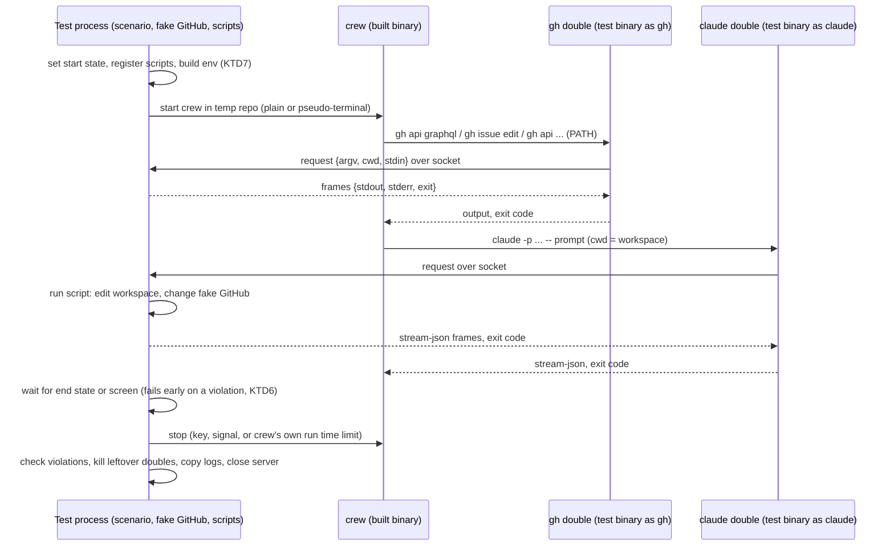
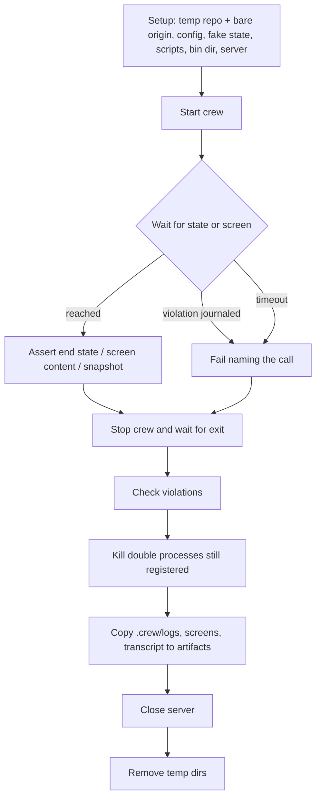

# Acceptance suite with doubles on PATH - Plan

## Goal Capsule

- **Objective:** if a pull request breaks what crew's released binary does on the command line, on GitHub or on the TUI screen, it fails CI before it merges, so the boss no longer has to run crew by hand to trust a build.
- **Means:** a nested Go module `acceptance/` holds doubles for `gh` and `claude`, a scenario harness and a pseudo-terminal screen harness. They run the binary that GoReleaser builds, locally through one command and in a CI job that the `checks` ruleset will require (KTD1 to KTD11).
- **Product authority:** the boss, through the brainstorm of #169, recorded in issue #175. The Product Contract wins on behaviour; the KTDs win on mechanism.
- **Stop conditions:** stop and report when a settled Key Decision proves unworkable, or when a gate in the Verification Contract cannot pass without changing a requirement.
- **Execution profile:** one branch and one pull request whose body carries `Closes #175`, with units U1 to U8 in order. crew's own code (`cmd/`, `internal/`) does not change. The post-merge step that adds `acceptance` to the `checks` ruleset happens in `thatsnotmynameio/.github` and goes in the pull request body.
- **Open blockers:** none.

---

## Product Contract

Product Contract from issue #175, part 1 of 2 of #169. Planning answers its Outstanding Questions (KTD1, KTD5, KTD6). Product Contract preservation: Product Contract unchanged.

### Summary

Test doubles for `gh` and `claude` on `PATH` with documentation of their interface, a black-box suite that reaches crew only through the built binary, with a pseudo-terminal harness for TUI scenarios, one local command that builds the binary and runs the suite, and a required CI job that runs it on the GoReleaser Linux amd64 snapshot.

### Problem Frame

Today the boss learns whether a build works by running crew for real in a repository and watching it. The package tests check each package with in-memory fakes. The TUI's golden files are rendered in-process from the view, not from a terminal. No test builds the `crew` binary and executes it. So a change can break a flag, an exit code, a label move or the screen while every test stays green. The binary that GoReleaser stamps and ships is never exercised before a release.

No concrete escaped bug was named. The cost today is the manual run before trusting a build, and whatever that run misses.

### Key Decisions

- **The binary runs against test doubles on `PATH`, never against real GitHub or Claude Code.** (session-settled: user-directed — chosen over a real test repository with real Claude Code sessions, and over doubles on every pull request plus a real run before each release: doubles are fast, free and repeatable on every pull request.) Governs R10, R11, R12. Conflict call-out: crew's bots mint tokens over HTTPS against a fixed `https://api.github.com` (`internal/bots/github.go:18`), which no `PATH` double reaches. The decision holds for #175 because the harness gives crew an empty config directory (KTD7), so no bot can act. Part 2 cannot cover bots that act or `crew bots create` without a test hook or a network double.
- **A scenario that the binary fails stays red and breaks CI.** (session-settled: user-directed — chosen over marking it a known failure linked to an unlabeled bug issue, and over only reporting the divergence: the tester's pull request merges only after the code or the README is fixed.) Governs R5, R20.
- **The TUI is checked by content and by screen snapshot.** (session-settled: user-approved — chosen over content only, which lets visual changes pass unseen, and over adding a visual judgment of the rendered screen, which is not deterministic.) Governs R18.
- **Only the tester rewrites a TUI snapshot.** (session-settled: user-directed — chosen over letting the pull request that changes the TUI rewrite it: nothing the tester owns is edited by another role.) Governs R8, R14.
- **The doubles are infrastructure that a developer builds, and the tester stays blind to crew.** (session-settled: user-approved — chosen over the tester building the doubles by watching which `gh` calls the binary makes, which is slower and teaches the tester the implementation.) Governs R10, R13, R14, R15.
- **CI tests the binary that the release config builds, on every pull request.** (session-settled: user-approved — chosen over a plain `go build`, which misses the release build flags such as the stamped version, and over running every platform's binary in the release workflow.) Governs R19.
- **crew gains no test hook.** The binary under test is the one users get, so it has no test-only flag, environment variable or build tag. Governs R12.

### Actors

- A1. The boss: runs the skill today, decides whether a red scenario is a bug in the code, in the README or in the tester's judgment, and merges.
- A2. The tester: an agent session that runs the skill. It never reads crew's code.
- A3. The developer: builds and maintains the doubles, and may read crew's code. The same role writes the development pull requests that change crew.
- A4. CI: builds the binary with the release config and runs the suite on every pull request.

### Key Flows

- F2. Accepting an intended TUI change
  - **Trigger:** a development pull request changes the TUI on purpose, and the snapshot scenario fails.
  - **Actors:** A1, A2, A3
  - **Steps:** the boss runs the skill on that pull request's branch. The tester checks the new screen against the README and its content assertions. When they hold, it rewrites the snapshot and pushes it to the branch. When they do not, it leaves the snapshot alone and reports why.
  - **Outcome:** the pull request turns green only when the new screen keeps what the README promises.
  - **Covered by:** R8, R18
- F3. A pull request in CI
  - **Trigger:** any pull request.
  - **Actors:** A4
  - **Steps:** CI builds the binary with the release config and runs every scenario against it.
  - **Outcome:** a failing scenario fails the required job and blocks the merge.
  - **Covered by:** R19, R20

### Requirements

**The test doubles**

- R10. A fake GitHub keeps state: issues with their authors and labels, comments and pull requests. A scenario sets the starting state and asserts on the end state, never on which `gh` calls crew made.
- R11. A fake Claude Code follows a script that each scenario sets: whether the session succeeds or fails, and what it changes in its workspace.
- R12. The doubles reach the binary only through `PATH`, in place of `gh` and `claude`.
- R13. A `gh` call that the fake GitHub does not know fails the scenario and names the call.
- R14. The developer updates the doubles in the same pull request that changes how crew calls `gh` or `claude`. The developer never edits scenarios or snapshots.
- R15. The doubles come with documentation of their interface: how to set the starting state, script a session and read the end state. This documentation never describes crew itself.

**The suite, locally and in CI**

- R16. The suite reaches crew only through the built binary and never imports crew's packages.
- R17. One local command builds the binary and runs the suite.
- R18. A TUI scenario runs the binary in a pseudo-terminal of fixed size. It waits for a state, asserts on the screen's content, and compares the screen with a stored snapshot, with the parts that change on every run, such as times, durations and costs, masked.
- R19. On every pull request, CI builds the binary with the GoReleaser release config as a Linux amd64 snapshot and runs the suite in a job that the `checks` ruleset requires.
- R20. Any failing scenario fails the job.

### Acceptance Examples

- AE4. **Covers R13, R14.** **Given** a change makes crew run a `gh` call that the fake GitHub does not know, **when** the suite runs, **then** the scenario fails and names the call, and the pull request goes green only after the developer teaches the fake that call.

### Success Criteria

- Breaking a README promise in the binary on purpose (for example, changing an exit code) makes the CI job fail before merge.
- Changing the TUI's layout on purpose makes the snapshot scenario fail until a tester session accepts the new screen.
- The tester's scenarios run against a binary whose source the tester never opened.

The first two criteria need the scenarios of part 2. This plan delivers what they rest on: a doubles-fit smoke run (U6) and harness self-tests that prove a failing check fails the job (U4, U5).

### Scope Boundaries

- The crew rule that runs the skill unattended, its label and its trigger, which could be an area issue, a development pull request or a development action.
- Covering the rest of the binary, which follows in area issues, one at a time.
- Running the binary against real GitHub or real Claude Code.
- Testing the macOS and arm64 binaries. CI exercises Linux amd64 only.
- Judging the TUI's look from a rendered image.
- A generic version of the skill for other repositories.
- Changing the `acceptance-tester` agent, which writes behavior tests from a plan before the feature exists.
- The tester skill and the first scenarios per layer (R1 to R9, R21) are part 2 of #169, built in its own issue.

Considered and not built:

- **An HTTPS man-in-the-middle double for the bots' GitHub API.** It would be a network double outside R12, and no scenario needs it in #175. Revisit when part 2 must cover bots that act.
- **Hashing crew's source to skip a rebuild.** The local command always rebuilds (KTD5), which costs seconds. Revisit if the build becomes slow enough to matter.
- **Streaming `claude` output as the script runs, event by event, with timing.** A script emits its events in order and the double prints them as they arrive (KTD3). Scripted delays between events are left to a script that blocks.

### Dependencies / Assumptions

- The README is thin as a specification. It does not describe how crew stops (`q` and `ctrl+c` in the TUI, a second press forcing the exit, SIGINT, SIGTERM and SIGHUP), what crew does on GitHub beyond moving labels and commenting on failures, what happens without `.crew/config.yaml`, or whether output that is not a terminal gets the event lines. The tester is expected to find gaps there (R6).
- crew runs `gh` and `claude` by bare name from `PATH`, and nothing in crew selects another binary, so `PATH` is enough to swap them (R12).
- A new required job joins the `checks` ruleset through `bootstrap.sh --checks` in the shared `.github` repository.
- The skill needs the doubles and the suite to exist before it can write the first scenarios of R21.

### Sources / Research

Split from #169.

- `internal/adapter/github/gh.go:35` and `internal/bots/repo.go:40` run `gh` by bare name. `internal/adapter/claude/command.go:12` declares `const binary = "claude"`, and `internal/adapter/claude/harness.go:88` looks it up on `PATH`.
- `cmd/crew/main.go:71-72` declares the only flags, `--plain` and `--version`. `cmd/crew/main.go:115` handles SIGINT, SIGTERM and SIGHUP. `internal/ui/tui/keys.go:22` binds `q` and `ctrl+c`.
- `.goreleaser.yaml` builds Linux and macOS, amd64 and arm64, with `CGO_ENABLED=0`, and stamps `-X main.version={{ .Tag }}`.
- `.github/workflows/ci.yml:46` is the `go` job: gofmt, vet, golangci-lint, `go test -race` with coverage, both coverage floors and govulncheck.
- `internal/ui/tui/testdata/*.golden` are in-process renders of the view, without a pseudo-terminal.
- `.agents/agents/acceptance-tester.md` and `docs/plans/2026-09-30-1601-feat-acceptance-tester-plan.md`: the existing blind tester, which writes from a plan's acceptance examples and runs interactively.
- Black-box test design: [Testlio](https://www.testlio.com/blog/top-black-box-testing-techniques), [UiO IN3240, specification-based testing](https://www.uio.no/studier/emner/matnat/ifi/IN3240/v25/slides/20250306chapter-4-part-2.pdf).
- Driving a TUI binary in a pseudo-terminal with screen snapshots: [tuitest](https://github.com/Gaurav-Gosain/tuitest), [tuiwright](https://github.com/PandelisZ/tuiwright), [Testing TUI apps (tmux)](https://blog.waleedkhan.name/testing-tui-apps/).

---

## Planning Contract

### Key Technical Decisions

- KTD1. **The suite is a nested Go module, `acceptance/` (`github.com/thatsnotmynameio/crew/acceptance`).** Root `go test ./...`, `go vet ./...`, golangci-lint, both coverage floors and `tools/diffcover` stop at a nested `go.mod`. The pseudo-terminal, emulator, jq and GraphQL dependencies stay out of crew's `go.mod`, and crew's module is never required, so crew's packages cannot be imported. Path-based `internal` rules alone do not stop a `replace ../`. A depguard rule for files under `acceptance/` therefore denies `github.com/thatsnotmynameio/crew/internal` and `github.com/thatsnotmynameio/crew/cmd`, which golangci-lint applies when run inside the module, since it walks up to the root `.golangci.yml` (R16). Rejected: a build tag in crew's module, which pulls the dependencies into crew's `go.mod` and needs `-tags` everywhere, and an untagged directory, which `go test ./...` would run and the coverage floors would count.
- KTD2. **The test binary is the double.** `harness.Main(m)` in each test package's `TestMain` checks `filepath.Base(os.Args[0])`. As `gh` or `claude` it runs the double's client and exits. Otherwise it runs the tests. Each scenario symlinks `gh` and `claude` to `os.Executable()` in a bin directory that comes first on `PATH` (R12). This is testscript's pattern, written in about 15 lines without the dependency. Rejected: separately built double binaries, which need their own build step and cache.
- KTD3. **The fake GitHub and the session scripts live in the test process, behind a Unix socket.** The doubles are thin clients. Each sends its argv, working directory, stdin and the environment variables `GH_CONFIG_DIR` and `CREW_*` as one request to the socket named by `ACCEPTANCE_DOUBLES_SOCKET`. It receives newline-delimited frames (stdout chunk, stderr chunk, exit code) and copies them out. crew starts many `gh` processes at once, parallel `claude` sessions and `sh -c` checks that call `gh`, and all of them share one live state under a mutex. A session script can change that state, for example by opening a pull request. Waits on the fake's state use a condition variable. A data race in the fake shows up as a `-race` test failure instead of a double that exits 66, which crew would treat as a transient `gh` failure. The socket lives in a short `os.MkdirTemp("", "cf")` directory, because Linux limits a socket path to 108 bytes. A client that loses the socket, or gets no exit frame within a hard cap of 120 s, exits non-zero and says why on stderr. A `claude` client that receives SIGTERM closes its connection, which cancels the script's context. Rejected: a state directory locked with flock, which cannot run a session's effects on GitHub live and hides races inside the double processes.
- KTD4. **The fake GitHub models GitHub, not crew, and is strict.** State: repository owner and name, viewer login, label set, files at paths (for CODEOWNERS), org team members, and issues. Each issue has a number, title, author, state, labels, creation time, an optional single-select `Priority` field value, open `blockedBy` issues and comments with author and body. Pull requests have a number, head branch, state, author, labels, cross-repository flag and the issues they close. An empty state boots: viewer `boss`, no labels, no files. Every call is matched against a handler table keyed by subcommand and endpoint pattern, not one large switch, because of Lizard's limits (`docs/solutions/tooling-decisions/codacy-lizard-and-golangci-lint-limits.md`). Behaviour by kind of call:
  - **Unknown subcommand, endpoint or flag:** a violation (R13, KTD6). The double exits 1 with `acceptance: unknown gh call: <argv>` on stderr.
  - **A known call on a missing object:** fails as GitHub does, with stderr naming `HTTP 404`, and is not a violation.
  - **`--jq`:** evaluated with `github.com/itchyny/gojq`, the evaluator `gh` itself uses. Strings print unquoted, as `gh` prints them.
  - **`--paginate`:** returns the whole array.
  - **`gh api graphql`:** parses the query with a GraphQL parser (`github.com/vektah/gqlparser/v2`) and resolves the selected fields from state. A field the fake does not know is a violation naming it.
  - **Errors:** a scenario can make a call fail with a given GitHub error: the HTTP status and message on stderr, as `gh` prints them.
- KTD5. **The local command is a small Go program; CI builds with goreleaser-action and passes the path.** `go -C acceptance run ./cmd/acceptance [go test flags]` does three things in order:
  1. Runs `go run github.com/goreleaser/goreleaser/v2@v2.18.2 build --snapshot --single-target --clean --output <tmp>/crew` from the repository root.
  2. Prints the binary's `--version`.
  3. Runs `go test -race -count=1 -artifacts -outputdir <tmp>/artifacts ./...` in `acceptance/` with `CREW_BIN` set, passing extra flags such as `-run` through. It prints the artifacts directory when a test fails and exits with the test's status. Without `-artifacts`, `t.ArtifactDir()` is a temporary directory removed after the test.

  Tests that need the binary read `CREW_BIN` and fail, never skip, when it is unset, with a message naming the local command. This avoids a build in `TestMain`, where no `-timeout` alarm runs yet. It avoids parallel packages each running `--clean` on `dist/`. And `-count=1` stops a stale cached PASS: GoReleaser stamps `mod_timestamp` from the commit, so a rebuilt binary keeps its mtime. Rejected: building in `TestMain` under a `sync.Once`, which is untimed and races across packages.
- KTD6. **Violations are journaled by the server and fail the scenario at three points.** A scenario fails, naming the call:
  - at the first wait or assertion after the violation, so the cause leads the failure output;
  - when crew exits, before its exit code is checked;
  - at cleanup.

  An unscripted `claude` invocation is a violation too. The call is named as its shell-quoted argv, with any argument longer than 200 characters cut and its length shown. crew mostly retries a failing `gh` call as transient, so its exit code cannot carry R13; the journal does (AE4).
- KTD7. **The harness builds crew's environment from an allowlist, never `os.Environ()`.** `PATH` is the fake bin directory followed by the directories of `git` and `sh` as found when the suite starts. `HOME` and `XDG_CONFIG_HOME` point to temp directories. Then `TZ=UTC` and `LANG=C.UTF-8`. Git gets `GIT_CONFIG_NOSYSTEM=1` and `GIT_CONFIG_GLOBAL` pointing to a temp file with a test identity. `TERM=xterm-256color` is set in the pseudo-terminal only. Finally `ACCEPTANCE_DOUBLES_SOCKET`. No `GH_*` or `GITHUB_*` token is set. Before crew starts, the harness checks that `gh` and `claude` resolve under that `PATH` to the fake bin directory, and fails otherwise. crew passes its whole environment to every child (`internal/proc/proc.go:272-279`), so this is what keeps real GitHub, real Claude Code and the developer's real bot keys out of reach.
- KTD8. **The screen harness pairs `github.com/creack/pty` v1.1.24 with `github.com/charmbracelet/x/vt` (pinned pseudo-version).** These are the facts it rests on:
  - **Start:** `pty.StartWithSize` starts crew at a fixed size (default 120x50, clear of the live view's height budgets) as session leader with the terminal as its controlling terminal.
  - **Replies:** a goroutine copies the emulator's replies back to the master. Without it, the background-colour query that Bubble Tea sends at start blocks the emulator's `Write`.
  - **Exit:** reading the master returns EIO when crew exits, which the harness treats as end of output.
  - **Reading the screen:** `ansi.Strip(emu.Render())`, never `SafeEmulator.String()`, which takes no lock. The emulator is never `Close`d while its reply goroutine reads, which `-race` reports.
  - **Waiting:** crew's clock and spinner tick every second, so "stable" means the masked screen text has not changed for a settle period, not that no bytes arrived.
  - **Keys:** sent only after the first frame, because before raw mode the terminal echoes them and `\x03` raises SIGINT. Signals go to the process group.

  Rejected: `charmbracelet/x/xpty`, which neither starts a session nor closes the slave, so EIO never comes; `teatest`, which runs in-process; and `tuitest`, which is untagged and vendors its own emulator.
- KTD9. **Snapshots are text files compared after masking, rewritten only with `-accept-snapshots`.** A mask is a regular expression whose whole match becomes a placeholder of the same width when the match fits it. A wider match is clipped to the placeholder, so `9s` becoming `10s` does not shift the inline text after it. A layout that sizes a fill from the remaining width, such as crew's header, whose run of `╱` shrinks when a duration grows, needs its own mask: a run of a repeated fill character becomes a placeholder shorter than any real run, so it always clips to the same width. Trailing spaces are trimmed per line. A missing snapshot fails and names the flag. CI never passes the flag. The flag name differs from crew's own `-update` so that rewriting crew's in-process goldens never touches the tester's snapshots (Key Decision on snapshot ownership, R18). Scenario snapshots live in the scenario package's `testdata/`. The harness's own self-test golden lives in `acceptance/harness/testdata/` and belongs to the developer.
- KTD10. **A session script is a Go function keyed by a prompt substring.** A scenario registers scripts on the fake Claude. Each script has a key and returns, in order, the stream-json events to print and an exit code. The key is a substring that must appear in the prompt. The fake matches the first unused script whose key the prompt contains, so repeated invocations take their scripts in order. Writing the prompts is part of writing the scenario's config, so the key never teaches the tester crew's worktree layout. The function receives the session's working directory, prompt and a handle on the fake GitHub, and may write files in the workspace, commit, change GitHub state or block until the scenario releases it. Helpers build the common results: success, failure with a message, no result, and a fixed cost, turn and token usage so screens stay deterministic. The event shapes follow `internal/adapter/claude/testdata/*.jsonl`.
- KTD11. **The CI job `acceptance` builds the binary, then runs the module's own checks and the suite.** It runs on every pull request and every push to `main`, with no `paths:` filter, because a required check that is skipped stays pending. Its steps:
  - Checkout with `fetch-depth: 0` (so the snapshot stamps the real tag) and `persist-credentials: false`.
  - `actions/setup-go` from `go.mod`.
  - `goreleaser/goreleaser-action` at the SHA `release.yml` pins (v7.2.3, GoReleaser v2.18.2), with `build --snapshot --single-target --clean --output ${{ runner.temp }}/crew` and `GOOS=linux GOARCH=amd64`.
  - `go -C acceptance vet ./...`, golangci-lint with `working-directory: acceptance`, and govulncheck in `acceptance/`.
  - `go test -race -count=1 -timeout 10m -artifacts -outputdir ${{ runner.temp }}/acceptance-artifacts ./...` with `CREW_BIN` set.
  - On failure, upload of `${{ runner.temp }}/acceptance-artifacts`.

  The `go` job's gofmt step adds `acceptance`. Dependabot gets a `gomod` entry for `/acceptance`.

### High-Level Technical Design

Processes during a scenario. The test process owns all state. Every double is a short-lived client of it.



Scenario lifecycle and teardown order. `t.Cleanup` runs last-in first-out, so the harness registers these in reverse.



### Output Structure

```text
acceptance/
  go.mod, go.sum
  README.md                 # the doubles' interface (R15), and the developer's part
  cmd/acceptance/main.go    # the one local command (KTD5)
  fakegithub/               # state model, gh handler table, jq, GraphQL (KTD4)
  fakeclaude/               # session scripts and stream-json helpers (KTD10)
  harness/                  # Main, server and clients, env, repo, scenario, screen, snapshots
    testdata/               # the harness's own self-test golden (developer-owned)
  smoke/                    # doubles-fit smoke runs against the built binary (U6)
```

Scenario packages, such as `acceptance/scenarios/<area>/`, are part 2's.

### Assumptions

- The doubles' documentation may list the `gh` subset the fake implements, written in `gh`'s own terms ("the GitHub CLI subset this fake emulates"), because scripts and check commands written by the tester call `gh` too. R15 forbids describing crew, not `gh`.
- Scripted sessions may change the fake GitHub (KTD10). R11 names workspace changes, and a real session also opens pull requests and comments through `gh`.
- A developer-owned smoke run (U6) ships in #175. It asserts only that crew ran its loop against the doubles with no violation and exited 0, never what the README promises. Without it the doubles could be wrong on day one, and the tester of part 2 could not fix them.
- `run_time_limit_seconds` and a short `poll_interval_seconds` in the scenario's config let crew stop by itself and exit 0 (`internal/engine/engine.go:279-303`). This is real configuration, not a test hook. The smoke run confirms it.
- In a shallow, tag-less checkout the snapshot binary prints `crew v0.0.0`. With `fetch-depth: 0` it prints the latest tag, never the `VERSION` file. No test hard-codes a version.

### Risks & Dependencies

| Risk | Decision |
|---|---|
| Timing flakes in CI: crew polls, ticks and runs sessions concurrently | Waits poll state and screen with generous timeouts and fail with the last screen, the violations and crew's logs as artifacts (KTD6, U4). No retries of failed tests. |
| `charmbracelet/x/vt` has only pseudo-versions, so Dependabot may not bump it | Pin one pseudo-version. Bump it by hand when the screen harness needs a fix. Accepted. |
| A query crew sends uses GraphQL syntax the fake's parser handles differently from GitHub | The smoke run exercises both real queries from the built binary (U6). A parse failure is a violation, so it shows up at once. |
| On macOS the pseudo-terminal ends without EIO | CI is Linux-only (Scope Boundaries). The harness treats both EOF and EIO as end of output, and the doc says so. |
| crew changes how it calls `gh` and the smoke run breaks | Intended: R14 makes that pull request's developer teach the fake, guided by the violation's named call (AE4). |

### Sequencing

U1 first, then U2 and U3 (U3 needs U2's state for session effects), then U4, then U5, then U6, which needs U4 and U5 to run against the binary. U7 and U8 come last because they describe what exists.

---

## Implementation Units

### U1. Nested module and its guards

- **Goal:** an `acceptance/` Go module that crew's tooling ignores and that can never import crew.
- **Requirements:** R16; KTD1.
- **Dependencies:** none.
- **Files:**
  - `acceptance/go.mod`
  - `acceptance/doc.go`
  - `.golangci.yml`
  - `AGENTS.md` (Commands: gofmt path list)
  - `.github/workflows/ci.yml` (gofmt step only)
- **Approach:**
  1. Create the module at `go 1.27`, with no `require` of crew's module.
  2. Add a depguard rule in `.golangci.yml` scoped to `**/acceptance/**` that denies crew's `internal` and `cmd` import paths with a reason pointing to R16. Keep the existing layering rules untouched.
  3. Add `acceptance` to the gofmt directory list in CI and in AGENTS.md.
- **Patterns to follow:** existing depguard rules and their `desc` style in `.golangci.yml`.
- **Test scenarios:**
  - A throwaway file under `acceptance/` that imports `github.com/thatsnotmynameio/crew/internal/crew` makes golangci-lint, run in `acceptance/`, report the depguard rule. Check this by hand once and do not commit the file.
  - Root `go list ./...` lists no package under `acceptance/`.
- **Verification:** root `go test ./...`, coverage floors and golangci-lint behave as before. golangci-lint run in `acceptance/` uses the root config.

### U2. The fake GitHub

- **Goal:** a stateful fake GitHub that answers the `gh` calls crew makes, from a model of GitHub, with unknown calls journaled.
- **Requirements:** R10, R13; KTD4, KTD6.
- **Dependencies:** U1.
- **Files:**
  - `acceptance/fakegithub/state.go`: the exported state model, setup and read methods.
  - `acceptance/fakegithub/gh.go`: argv parsing and the handler table.
  - `acceptance/fakegithub/rest.go`: the `gh api` REST endpoints.
  - `acceptance/fakegithub/issues.go`: `gh issue`, `gh pr` and `gh label`.
  - `acceptance/fakegithub/graphql.go`: the two query shapes, resolved field by field.
  - `acceptance/fakegithub/jq.go`
  - `acceptance/fakegithub/*_test.go`
- **Approach:**
  1. Model GitHub's objects as KTD4 lists. The exported API covers setup (add issue, label, comment, pull request, file, team, viewer), reads of the end state (issue labels, comments with author and body, pull requests, labels) and a `Fail(call pattern, status, message)` for scripted GitHub errors. It never exposes a call log to scenarios (R10). The call log goes only to failure artifacts (U4).
  2. Parse argv in `gh`'s grammar: subcommand, flags in `--flag=value` and `--flag value` forms, repeated `-f`/`-F` fields, `{owner}`/`{repo}` placeholders. Dispatch through a table of endpoint patterns.
  3. Cover the calls listed in the repo research inventory: `auth status`, `api user`, contents (raw accept header, 404 when absent), org team members, `label list`/`label create`, `issue view --json`, `issue edit`/`pr edit` with add and remove labels (refuse a missing label the way `gh` does), REST comments POST/PATCH/GET with pagination, `pr list --head --json`, `api repos/{owner}/{repo}`, and the issues/pull-requests and closing-references GraphQL queries.
  4. A mutation that comes from crew's writes records the author as the viewer, or as the identity behind `GH_CONFIG_DIR` when one is set. Bots stay out of #175 scenarios, so the viewer is the case that matters now.
- **Patterns to follow:**
  - `fakeGh` in `internal/adapter/github/tracker_test.go` (unscripted call handling) and its JSON builders for exact shapes.
  - `internal/adapter/github/tracker.go:60-119` for the GraphQL query text the parser must accept. Read it as the developer. It is never quoted in tester docs.
- **Test scenarios:**
  - An issue with labels `ready` and `bug` set up by a test appears in a `gh api graphql` issues query filtered by label `ready`, with its number, title, labels, author and creation time.
  - `gh issue edit 3 --remove-label=ready --add-label=running` moves the labels in state. Adding a label absent from the repository fails with `gh`'s "not found" stderr and leaves state unchanged.
  - `gh api --method POST repos/{owner}/{repo}/issues/3/comments -f body=hi --jq .id` prints a bare integer id. A later PATCH of that id changes the body. A PATCH of an unknown id fails with `HTTP 404`.
  - `gh api -H "Accept: application/vnd.github.raw+json" repos/{owner}/{repo}/contents/CODEOWNERS` with no such file fails with `HTTP 404` on stderr. With the file set, it prints the raw text.
  - `gh api --paginate .../comments?per_page=100` returns every comment of the issue in one JSON array.
  - `--jq '.[].login'` prints one login per line, unquoted.
  - Covers AE4. `gh repo delete x` and `gh issue view 3 --web` (an unknown flag) each journal a violation naming the shell-quoted argv and return exit 1. Neither changes state.
  - A GraphQL query that selects a field the fake does not resolve journals a violation naming the field.
  - An issue with an open `blockedBy` issue reports a blocked count of 1. Closing the blocker brings it to 0.
  - A pull request with a head branch, open state and closing reference to issue 3 appears in `pr list --head=<branch>` and in the closing-references query. A merged one appears with state `MERGED`.
  - `Fail` on a call pattern makes the matching call print the HTTP status and message, then later calls behave normally once the scripted failure count is used up.
  - Concurrent calls from many goroutines leave state consistent under `-race`.
- **Verification:** unit tests pass under `-race`. Every call in the inventory has at least one test.

### U3. The doubles: dispatch, transport and the fake Claude

- **Goal:** `gh` and `claude` on `PATH` that forward to the test process, plus scripted Claude sessions.
- **Requirements:** R11, R12, R13; KTD2, KTD3, KTD6, KTD10.
- **Dependencies:** U2.
- **Files:**
  - `acceptance/harness/main.go`: `Main(m)` and argv[0] dispatch.
  - `acceptance/harness/server.go`: the socket server, request routing and the violation journal.
  - `acceptance/harness/client.go`: the double's client side.
  - `acceptance/fakeclaude/script.go`: the script registry, matching and the result helpers.
  - `acceptance/fakeclaude/stream.go`: stream-json events.
  - `acceptance/harness/server_test.go`, `acceptance/fakeclaude/script_test.go`
- **Approach:**
  1. `Main(m)` runs the client when the base name is `gh` or `claude`, and `m.Run()` otherwise.
  2. The server accepts one connection per invocation. It routes `gh` to the fake GitHub and `claude` to the script registry, passing the request context so a closed connection cancels a script. It journals violations and registers each client's pid so teardown can kill leftovers.
  3. The client sends one JSON request, copies frames to stdout and stderr in arrival order, and exits with the exit frame's code. On SIGTERM it closes the connection and exits 143.
- **Patterns to follow:** argv[0] dispatch as in `rogpeppe/go-internal/testscript` (`exe.go`); event shapes in `internal/adapter/claude/testdata/success.jsonl`, `error.jsonl` and `noresult.jsonl`.
- **Test scenarios:**
  - Run the `gh` symlink, as a subprocess with the scenario's environment, on `api user --jq .login`. It prints the viewer login and exits 0.
  - Run the `gh` symlink with stdin content for a call that reads stdin. The fake receives the bytes.
  - Covers AE4. A self-test opens a scenario with a recording `testing.TB` and runs `gh` with an unknown argv. The recorder holds a failure containing that argv. After a handler for that call is registered, the same run passes with no failure recorded.
  - A `claude` invocation whose prompt contains the script's key prints the script's events in order and exits with its code. A second invocation with the same key takes the next script.
  - A `claude` invocation that matches no script journals a violation naming the prompt's first 200 characters and exits 1.
  - A script that blocks until released keeps the client running. A SIGTERM to the client's process group ends it within a second and cancels the script's context.
  - A script that opens a pull request through the fake GitHub handle makes it visible to a later `gh pr list --head` call.
  - The client exits non-zero with a clear message when `ACCEPTANCE_DOUBLES_SOCKET` is unset or the socket is gone.
- **Verification:** self-tests pass under `-race`, and no double process outlives its test.

### U4. The scenario harness

- **Goal:** one call that gives a scenario an isolated repository, a config, the doubles and a running crew, plus waits, stop and a teardown that leaves nothing behind.
- **Requirements:** R12, R13, R16, R20; KTD5, KTD6, KTD7.
- **Dependencies:** U3.
- **Files:**
  - `acceptance/harness/scenario.go`: `New(t, options)`, the fake GitHub and Claude handles, starting crew plain, `Wait` on fake state, stop and exit status.
  - `acceptance/harness/env.go`: the allowlisted environment and the `PATH` check.
  - `acceptance/harness/repo.go`: the temp repository with a bare origin, under a fixed directory name.
  - `acceptance/harness/binary.go`: `CREW_BIN` lookup.
  - `acceptance/harness/artifacts.go`
  - `acceptance/harness/scenario_test.go`
- **Approach:**
  1. **Repository:** create it under `t.TempDir()/<fixed name>` with a bare origin made by `git init --bare` and a seed commit. Clone it so `origin/HEAD` is set. Write `.crew/config.yaml` from the scenario's text.
  2. **Start:** start the binary from `CREW_BIN` with the environment from KTD7 and the repository as working directory, capturing stdout and stderr.
  3. **Waits:** `Wait(cond, timeout)` checks the condition on every state change and on the journal (KTD6).
  4. **Stop:** `Stop` sends SIGINT to crew's process group. `Exit` waits for crew's exit with a deadline and returns its code and output.
  5. **Teardown:** in the order of the lifecycle diagram, copying `.crew/logs`, crew's output and the fake's call log into `t.ArtifactDir()`.
  6. **Package layout:** keep functions within funlen 50 and files within 500 lines.
- **Patterns to follow:** `isolateGit`, `newRemote` and `gitIn` in `internal/adapter/git/workspace_test.go`, rewritten for the acceptance module, not imported.
- **Test scenarios:**
  - With `CREW_BIN` unset, a test that asks for the binary fails, does not skip, and names the local command.
  - With a fake bin directory missing its `claude` symlink, the `PATH` check fails before any process starts and names `claude`.
  - The environment passed to the child has no variable outside the allowlist, even when the test process has `GH_TOKEN` and `GITHUB_TOKEN` set.
  - R20. The test binary re-runs itself (`os.Executable()`, `-test.run` on a guarded test that triggers a violation) and exits non-zero with the violating argv in its output.
  - A child that ignores SIGINT is killed at the stop deadline, and the test reports the forced kill.
  - Teardown kills a still-held `claude` double, and the temp directory is removed without a "directory not empty" error.
- **Verification:** harness self-tests pass under `-race` with a stand-in child (a small program dispatched by argv[0]) in place of crew, so U4 does not need the built binary.

### U5. The screen harness

- **Goal:** run a program in a fixed-size pseudo-terminal, wait for a screen, assert on its content and compare it with a masked snapshot.
- **Requirements:** R18; KTD8, KTD9.
- **Dependencies:** U4.
- **Files:**
  - `acceptance/harness/screen.go`: start in a pseudo-terminal, the emulator, the reply pump, `WaitFor`, `WaitStable`, `Text`, keys and signals.
  - `acceptance/harness/mask.go`: masks and the default masks for clocks, durations, costs, spinner frames and fill runs (KTD9).
  - `acceptance/harness/snapshot.go`: compare, the `-accept-snapshots` flag.
  - `acceptance/harness/probe.go`: a probe program dispatched by argv[0].
  - `acceptance/harness/screen_test.go`
  - `acceptance/harness/testdata/probe.snapshot`
- **Approach:**
  1. **Start:** the scenario options choose plain or screen mode. Screen mode starts crew with `TERM=xterm-256color` at the requested size (default 120x50).
  2. **Waits:** `WaitFor(substring or predicate, timeout)` polls the masked text. `WaitStable(settle, timeout)` waits until the masked text stops changing. On timeout, both fail with the last screen and any violations.
  3. **The probe:** it writes raw ANSI with cursor positioning, a ticking clock, an OSC 11 query that waits for its reply, and exits on `q` or SIGINT. Testing against it proves the harness without Bubble Tea.
- **Execution note:** prove the reply pump and the EIO handling against the probe before writing waits and snapshots.
- **Patterns to follow:** `golden()` and the `-update` flag in `internal/ui/tui/model_test.go`, with the flag renamed per KTD9.
- **Test scenarios:**
  - The probe's screen at 120x50 has 50 rows and its text at the expected row and column.
  - The probe's OSC 11 query gets an answer and the probe goes on to draw. Without the reply pump, the same test would block, which the probe's own reply timeout reports as a distinct message.
  - With the clock masked, `WaitStable` returns while the probe keeps ticking. With the mask removed, it times out and shows the last screen.
  - A mask turns `9s` and `10s` into the same placeholder without shifting the rest of the line.
  - A probe line with a ticking duration, a fill run sized from the remaining width and a right-aligned item masks to the same text at `9s` and at `10s`.
  - The probe's masked screen equals `testdata/probe.snapshot`. A changed probe line fails with a line diff. A missing snapshot fails and names `-accept-snapshots`. With the flag, the file is written and the test passes.
  - Sending `q` after the first frame makes the probe exit 0, and the harness sees EIO as end of output, not as an error.
  - A signal to the process group ends the probe and the exit status reports the signal.
- **Verification:** screen self-tests pass under `-race` on Linux. The emulator is never closed while its reply goroutine reads.

### U6. The local command and the doubles-fit smoke runs

- **Goal:** one command that builds the release binary and runs the suite, and two smoke runs proving that the built crew runs against the doubles.
- **Requirements:** R14, R16, R17, R19; KTD5, KTD7.
- **Dependencies:** U4, U5.
- **Files:**
  - `acceptance/cmd/acceptance/main.go`
  - `acceptance/smoke/main_test.go`: `TestMain` calls `harness.Main`.
  - `acceptance/smoke/smoke_test.go`
- **Approach:**
  1. The command finds the repository root as the parent of `acceptance/`, creates a temp output directory, runs the pinned GoReleaser build there, and prints the path and `--version`. It then runs `go test -race -count=1` over the module with `CREW_BIN` set and the user's extra arguments, and exits with the test's code. A build failure exits non-zero before any test runs.
  2. **Plain smoke:** one issue in a rule's ready label, a script that succeeds for its prompt, and a second issue whose script fails. The config sets a short poll interval and run time limit. The run asserts only that both scripts were invoked, that no violation was journaled, and that crew exited 0.
  3. **TUI smoke:** the same setup in screen mode. Wait for the fixed repository name on screen, send `q`, then assert exit 0 and no violation.
  4. Neither smoke run asserts labels, comments or screen layout. Those are README promises, and they belong to part 2's scenarios (Key Decision on the developer and the tester).
- **Execution note:** start with the plain smoke run. Its violations list the calls the fake still lacks, and U2 fills them in until the run is clean.
- **Test scenarios:**
  - The plain smoke run passes against the built binary with zero violations.
  - The TUI smoke run passes against the built binary with zero violations.
  - Covers AE4. Removing one handler from the fake's table, for example `issue view`, makes the plain smoke run fail and name that call. Check this by hand once and do not commit the change.
  - The local command with `-run TestNothing` builds, prints the version line, and exits 0. With a deliberately failing test selected, it exits non-zero.
- **Verification:** `go -C acceptance run ./cmd/acceptance` passes locally on Linux, and a second run rebuilds rather than reusing a cached result.

### U7. The CI job and repository wiring

- **Goal:** an `acceptance` job that runs on every pull request against the GoReleaser Linux amd64 snapshot and fails when any test fails.
- **Requirements:** R19, R20; KTD11.
- **Dependencies:** U6.
- **Files:**
  - `.github/workflows/ci.yml`
  - `.github/dependabot.yml`
  - `.codacy.yaml` and the file `pnpm exec codacy-analysis update-config` regenerates
- **Approach:**
  1. Add the job per KTD11, with `name: acceptance` matching its id, `timeout-minutes: 20`, and `CREW_BIN` from `runner.temp`.
  2. Add a header comment that explains why it builds with GoReleaser and why it has no `paths:` filter.
  3. Add a Dependabot `gomod` entry for `/acceptance`.
  4. Add `acceptance/**/testdata/**` to Codacy's duplication-only excludes, beside the TUI goldens. Snapshots repeat by nature, and secret scanning still covers them.
  5. Run actionlint locally on the workflow.
- **Test expectation:** none. This is CI configuration. The pull request's own run of the job is the proof, and it must be green.
- **Verification:** the job runs on this pull request, builds through goreleaser-action, runs the self-tests and the smoke runs, and passes. actionlint passes.

### U8. Documentation

- **Goal:** the doubles' interface documented for the tester without describing crew, and the repository docs kept true.
- **Requirements:** R14, R15, R17; Key Decisions on snapshot ownership and on the developer and the tester.
- **Dependencies:** U7.
- **Files:**
  - `acceptance/README.md`
  - `README.md`: "What's inside" rows for `acceptance/`, and the `ci.yml` row naming the new job.
  - `AGENTS.md`: Commands, Architecture, Tests, Releases and CI.
- **Approach:**
  1. **`acceptance/README.md`, tester-facing part:**
     - starting a scenario, plain or screen;
     - the fake GitHub's state model in GitHub's terms, with setup, end-state reads and scripted errors;
     - the `gh` subset the fake emulates, in `gh`'s terms;
     - scripting a Claude Code session in Claude Code's terms (prompt, working directory, stream-json result, exit code, workspace and GitHub effects);
     - waits, screens, masks, snapshots and `-accept-snapshots`, which only the tester passes;
     - what a violation means;
     - where scenario packages go;
     - that bots that act are out of reach.

     It never names crew's packages, labels, worktree layout or calls.
  2. **`acceptance/README.md`, developer part:** how to teach the fake a new call when crew's use of `gh` or `claude` changes, in the same pull request (R14); that the developer never edits scenarios or snapshots; and the smoke runs.
  3. **AGENTS.md:**
     - Commands: the local command, and `acceptance` in the gofmt list.
     - Architecture: `acceptance/` sits outside the layering, is a nested module, and never imports crew.
     - Tests: doubles on `PATH`, the screen harness, who rewrites snapshots, `-count=1`.
     - Releases and CI: the `acceptance` job, and that it joins the `checks` ruleset through `bootstrap.sh --checks`.
- **Test expectation:** none. Documentation only.
- **Verification:** a reader of `acceptance/README.md` can write a scenario using only it and the exported doc comments. A search of that file for crew's internal paths (`internal/`, `cmd/crew`) finds none.

---

## Verification Contract

| Gate | Command | Applies to |
|---|---|---|
| Format | `gofmt -l cmd internal tools acceptance` prints nothing | all Go |
| Vet | `go vet ./...` and `go -C acceptance vet ./...` | U1-U6 |
| Lint | golangci-lint v2.14.0 via `go run` at the root, and again with `acceptance/` as working directory | U1-U6 |
| Root tests and floors | `go test -race ./...`, `go-test-coverage`, `diffcover` as in AGENTS.md, unchanged | whole repo |
| Suite | `go -C acceptance run ./cmd/acceptance` on Linux: builds with GoReleaser v2.18.2 and passes | U2-U6 |
| Vulnerabilities | `govulncheck ./...` at the root and in `acceptance/` | U1-U6 |
| Workflows | actionlint over `.github/workflows/ci.yml` | U7 |
| Codacy | `pnpm exec codacy-analysis analyze --install-dependencies` reports nothing new | all |
| CI | the pull request's `go` and `acceptance` jobs are green | U7 |

---

## Definition of Done

- Every unit's verification holds, and every gate in the Verification Contract passes.
- `acceptance/` imports nothing from crew's module, and the depguard rule says so.
- The smoke runs pass against the GoReleaser-built binary locally and in CI, with zero violations.
- The pull request body carries `Closes #175` and the post-merge step: add `acceptance` to the `checks` ruleset with `bootstrap.sh --checks` in `thatsnotmynameio/.github`.
- No experimental or abandoned code from approaches that did not pan out is left in the diff.
