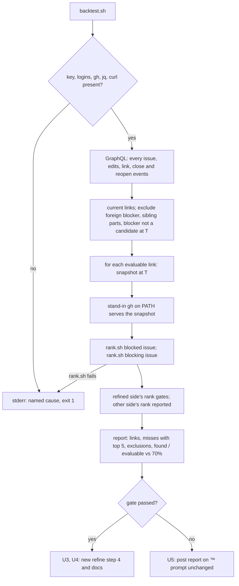

# Use the Jev shortlist in the refine prompt, behind an offline gate - Plan

## Goal Capsule

- **Objective:** crew's refine sessions find an issue's blockers for less than the $0.496 they cost today and miss no more of them. The refine prompt switches to Jev's shortlist only if a replay of this repository's recorded dependencies shows that the shortlist finds the real blocker often enough. Otherwise the code owner gets the measured result on #153 and the prompt stays as it is.
- **Means:** a backtest script that replays `rank.sh` against every `blocked_by` link GitHub records, using the candidates and bodies of the moment each link was recorded (KTD1 to KTD6). Then one of two branches: the refine prompt's new step 4 (KTD7, KTD8) or a comment on #153 (KTD9).
- **Product authority:** the code owner, through #153 and its split into #166. The Product Contract wins on behaviour. The KTDs win on mechanism.
- **Stop conditions:** stop and report if a settled Key Decision proves unworkable, if the backtest cannot judge every evaluable link (KTD5), or if a gate in the Verification Contract cannot pass without changing a requirement.
- **Execution profile:** one branch and no Go code outside `internal/config/config_example_test.go`. U1 and U2 always run. U3 and U4 run only when the gate passes, and U5 only when it fails. One pull request whose body carries `Closes #166` and the backtest's result.
- **Open blockers:** none.

---

## Product Contract

Product Contract from issue #166, part 2 of 2 of #153. Planning answers its Deferred to Planning questions in KTD1 to KTD6 and KTD10. Product Contract preservation: Product Contract unchanged.

### Summary

Runs the shortlist script offline against the dependencies GitHub already records. When the real blocker is in the top 5 for at least 70% of the links, it changes the refine prompt in `.crew/config.example.yaml` to read only the shortlisted candidates in full, with the full read as the fallback when the script fails.

### Problem Frame

Finding dependencies cost $0.496 per session on average: $11.90 across the 24 triage logs in `.crew/logs`. #163 renamed the triage rule to `refinement`, whose `refine` action now also splits large plans with `/cw-split-plan`, but its search for blockers is the same. Step 4 of the refine prompt runs `gh issue list --state open --author "$login" --limit 500 --json number,title,body,labels` for each code owner and bot. The session therefore loads the body of every open issue to find the few that relate to the issues it refines, and after a split it compares every part against that whole list. The code owner has seen this search drive the cost, and has also seen triage miss real blockers.

#149's experiment with `jev-1.13.0` measured how well Jev ranks candidates, against the 16 `blocked_by` links GitHub recorded then across 15 of this repository's issues. One request per pair, holding only the two issues, ranked at 0.933. The real blocker came first for 6 links, in the top 3 for 11 and in the top 5 for 12, for $0.043 across 735 pairs. Real blockers often scored only 0.1 to 0.2, so the answers order candidates but cannot decide on their own. The experiment overstates the result: its candidates included closed issues and issues opened later, and some bodies were rewritten after triage. #165 has since built the script (`.agents/skills/cw-rank-blockers/rank.sh`).

### Key Decisions

- **The shortlist is a filter with an escape.** (session-settled: user-approved — chosen over a hint the session reads beside every issue, which was the issue's first wording, and over a strict filter: a hint leaves the cost that motivates this work untouched, and a strict filter drops the blockers the top 5 misses, 4 of 16 in #149's experiment.) Governs R7, R8.
- **Measure offline before the prompt changes, then live after.** (session-settled: user-approved — chosen over measuring live only, where a regression shows only after wrong refinements, and over measuring offline only, which never checks cost.) Governs R10, R11.

### Requirements

**The refine prompt**

- R7. The refine prompt in `.crew/config.example.yaml` runs the script for each issue it refines before it compares issues. The session reads the full body only of the issues on that issue's lists, sees every other candidate by number and title, and may open any of them whose title suggests a relation.
- R8. When the script fails, the session reads every candidate as step 4 does today, and its closing comment says the shortlist was unavailable and why.
- R9. The prompt's other steps do not change: `/cw-split-plan` still runs first, and the session still records a dependency only when it can say why, never closes a cycle, removes or moves dependencies that no longer hold, touches no `crew:` label beyond what the split needs, and ends with one comment.

**The adoption gate**

- R10. Before the prompt changes, the script runs offline against the `blocked_by` links GitHub records in this repository. Each run limits the candidates to the issues open when the blocked issue was triaged or refined, and uses each issue's body as it read then wherever GitHub's edit history allows.
- R11. The prompt changes only when the real blocker is in the top 5 of its direction for at least 70% of the links. Otherwise the prompt stays as it is, and the result, with the misses, is posted on #153.

### Key Flows

- F1. Refinement with the shortlist
  - **Trigger:** crew starts a `refine` session for an issue in `crew:refinement:ready`, and `/cw-split-plan` reports which issues to refine: the issue itself, or each part it created.
  - **Steps:** for each issue to refine, the session reads it and its recorded dependencies; runs the script; reads that issue's shortlisted candidates in full and the rest by title; opens any title that looks related; decides each dependency and records it with its reason. It then posts its closing comment.
  - **Covered by:** R1, R4, R7, R9
- F2. Refinement when the shortlist is unavailable
  - **Trigger:** the script exits with an error for an issue being refined.
  - **Steps:** the session reads every candidate for that issue as today, decides and records as today, and names the failure in its closing comment.
  - **Covered by:** R6, R8

R1, R2, R4 and R6 are #165's requirements, which `rank.sh` meets (`docs/plans/2026-10-05-1616-feat-rank-blockers-skill-plan.md`).

### Acceptance Examples

- AE1. **Covers R6, R8.** Given crew runs without `TYPESAFE_API_KEY` in its environment, when a refine session runs the script, then the script prints no list and exits with an error naming the missing key, and the session reads every candidate's body and says in its closing comment that the shortlist was unavailable.
- AE3. **Covers R7.** Given a candidate is on neither list but its title names the same subsystem as the refined issue, when the session compares issues, then it may open that candidate, read its body, and record a dependency on it.
- AE4. **Covers R2, R7.** Given `/cw-split-plan` split an issue into 3 parts, when the session compares issues, then it runs the script once for each part, and no part, split parent or the split issue appears on any part's lists.
- AE5. **Covers R11.** Given the offline run puts the real blocker in the top 5 for 10 of 16 links (62.5%), when the gate is checked, then the refine prompt does not change and the result with its 6 misses is posted on #153.

### Success Criteria

- Over the refinements that run after the prompt changes, the average cost per refine session is below the $0.496 triage baseline. The comparison uses only refinements that `/cw-split-plan` did not split, since a split session refines several issues.
- Over the same refinements, the number of dependencies a code owner adds or removes by hand afterwards does not rise compared with before the change. KTD10 defines the count.

### Scope Boundaries

- crew's Go code, its config schema and its prompt template fields do not change.
- Deciding and recording each dependency stays with the refine session; the shortlist records nothing.
- `/cw-split-plan` and its Jev shadow question do not change.
- Sharing a TypeSafe adapter or config with the session-outcome judge of #152 is out of scope, since this work adds no crew code.
- A shortlist for other rules, such as brainstorm or development, is not part of this work.
- Part 1 of 2 (#165) built `rank.sh`. This work does not change its behaviour.

Considered and not built:

- **Variants of the question wording or of the 3,000-character body cut.** About 19 links cannot both choose a variant and judge it, and AGENTS.md asks for thresholds chosen on held-out data. The gate judges the script that ships. What would change this: a failed or narrow gate, after which a follow-up compares variants on links recorded after this one.
- **Titles as they read when each link was recorded.** 7 of 67 issues were renamed, and R10 asks only for bodies. What would change this: a miss whose title changed after the link was recorded.
- **A CI job for the backtest's tests.** CI's required `go` job runs Go only, as for `rank_test.sh`. What would change this: a later change breaking the backtest unnoticed.

#### Deferred to Follow-Up Work

- The live measurement in Success Criteria, after at least 10 refinements that the prompt change covers and `/cw-split-plan` did not split. It runs only when the gate passes. The pull request body records it as a follow-up.

### Dependencies / Assumptions

- `TYPESAFE_API_KEY` is set in the environment where crew runs. Sessions inherit crew's environment (`internal/proc/proc.go`) except for variables a bot identity unsets (`internal/adapter/claude/command.go`).
- The real `.crew/config.yaml` is gitignored, so only `.crew/config.example.yaml` changes in the repository. The code owner copies the new prompt into their own config by hand.
- `internal/config/config_example_test.go` checks the refine prompt for the outcomes and markers `/cw-split-plan` names, so the prompt change keeps them.
- The script pins `jev-1.13.0`, the version the 70% gate is measured against.
- Refine sessions already run `gh` with access to the repository's issues, and `jq`.

### Sources / Research

Split from #153.

- #153's body: #149's experiment, its numbers and its caveats.
- `.crew/config.example.yaml`, the `refinement` rule's `refine` prompt: step 4 is the full read, step 10 the closing comment.
- `.agents/skills/cw-rank-blockers/rank.sh`, `rank_test.sh` and `SKILL.md`: the script the gate measures, its stub-based tests, and its failure contract (one `rank.sh:` line on stderr, exit 1).
- `docs/plans/2026-10-05-1616-feat-rank-blockers-skill-plan.md`: #165's plan, whose KTD3 asks this work to judge the 3,000-character cut.
- GitHub GraphQL, checked against this repository on 2026-10-05: `BlockedByAddedEvent` carries `createdAt`, `actor` and `blockingIssue`; `userContentEdits` lists an issue's edits newest first, each `diff` holding the whole body after that edit and the oldest holding the original; GraphQL gives a bot's login without `[bot]`; `gh issue list --author 'crew-product-manager[bot]'` matches that bot's issues.
- `docs/solutions/logic-errors/set-e-ignored-left-of-and-in-install-command.md`: `set -e` is off left of `&&` and `||`, so a failure there can pass silently.
- `docs/solutions/runtime-errors/nul-in-gh-argument-freezes-status-comment.md`: issue text goes through files, never `gh` arguments.
- `docs/solutions/security-issues/session-text-in-public-tracker-comments.md`: public comments carry computed data, not session or model text.
- `docs/solutions/integration-issues/closing-pull-requests-include-merged-and-foreign-ones.md`: a linked issue can belong to another repository.

---

## Planning Contract

### Key Technical Decisions

- KTD1. **The backtest is `backtest.sh`, a POSIX `sh` script beside `rank.sh` in `.agents/skills/cw-rank-blockers/`, which replays the real `rank.sh` with a stand-in `gh` on `PATH`.** The stand-in answers `rank.sh`'s two read commands, `gh issue view N` and `gh issue list --author L`, from a snapshot of the repository at the moment a link was recorded. `curl` still reaches Jev. The gate therefore measures the shipped script, its candidate filter and its requests, not a copy. Shell and `jq` follow #165's KTD1: this repository's tooling stays out of crew's Go code. Usage: `sh .agents/skills/cw-rank-blockers/backtest.sh`, with the same environment as `rank.sh`. Governs R10.
- KTD2. **History comes from one paginated GraphQL read of every issue in the repository.** For each issue the read takes number, title, author, `createdAt`, `closedAt`, the current body, every `userContentEdits` entry (`editedAt` and `diff`), and its `BlockedByAddedEvent`, `BlockedByRemovedEvent`, `ClosedEvent`, `ReopenedEvent`, `LabeledEvent` and `UnlabeledEvent` timeline items. The link set is the current `blocked_by` links: added and not removed since. A link whose blocking issue belongs to another repository is excluded (KTD4). Every connection is paginated, or the script fails when a page reports more items than it read. The script never silently truncates. Governs R10.
- KTD3. **A link is replayed at the moment it was recorded (T, its `BlockedByAddedEvent.createdAt`).** That moment stands in for "when the issue was triaged or refined": a refine session records its links as it ends, and a hand-recorded link is the code owner's own triage. At T:
  - an issue is open when it was created at or before T and its last close or reopen event before T was not a close;
  - its body is the `diff` of its newest `userContentEdits` entry whose `editedAt` is at or before T, or its current body when it has no entry. The oldest entry holds the original body and its `editedAt` is the issue's creation time; `createdAt` is not used, since on that entry it is the time of the first edit (on #135, 2026-10-05 20:09 against an `editedAt` of 2026-10-04 23:50);
  - the candidates are the open issues whose authors are in `$CREW_CODE_OWNERS` and `$CREW_BOTS`, with GraphQL's bot login matched to its `<slug>[bot]` form. `rank.sh` then applies its own exclusions to those bodies.

  Governs R10.
- KTD4. **The gate scores each link from its refined side: the issue whose refinement recorded it, since that is the only issue the new step 4 runs the script on.** The refined side is whichever of the two issues carried crew's refinement running label at T (`crew:refinement:in progress`, or the older triage running label it replaced), read from the `LabeledEvent` and `UnlabeledEvent` items. A link recorded by hand, or with neither issue in refinement at T, takes the blocked issue as its refined side, the direction #149 measured. A link is found when:
  - the blocked issue was refined and the blocking issue is in the top 5 of its "Likely to block" list;
  - the blocking issue was refined and the blocked issue is in the top 5 of its "Likely blocked by" list.

  The repository's timeline shows why both are needed: #134's refinement on 2026-10-05 recorded that it blocks #45, #49, #52 and #135, and #33's, #151's and #135's refinements each recorded a link from the blocking side. A link is excluded, with its reason, when the shortlist could never show it:
  - the blocking issue was not a candidate at T (closed, opened by a login outside the lists, or in another repository);
  - `rank.sh` leaves it out by design: both issues were parts of the same split at T, which `/cw-split-plan` links itself.

  The gate is found ÷ evaluable ≥ 0.70. The other side's rank is measured for every evaluable link and reported beside it. It does not gate. Governs R11.
- KTD5. **The backtest is all or nothing.** When `rank.sh` exits non-zero for any replay, the backtest prints no result. It writes one `backtest.sh:` line on stderr naming the link and `rank.sh`'s own error line, and exits 1. A failed replay is never counted as a miss, since `set -e` does not reach a command left of `||`. Missing `TYPESAFE_API_KEY`, empty login lists and missing `gh`, `jq` or `curl` fail before any read. Bodies and Jev's answers stay in files under a private temporary directory removed on exit, never in command arguments. Governs R10.
- KTD6. **The result is a markdown report on standard output, made only of computed data.** It has one line per evaluable link: the blocked and blocking issue numbers, T, who recorded it, its refined side, the counterpart's rank in the refined side's list ("not in top 5" when absent), and the other side's rank. Each miss adds the top 5 that was shown instead, by number and probability. The excluded links follow, with reasons, then the summary line: found, evaluable, percentage and `gate passed` or `gate failed` against 70%. The report holds no issue body and no model text, so it can be posted publicly as it is. Exit status is 0 whenever the backtest measured, whatever the gate's outcome. Governs R11.
- KTD7. **On a passing gate, step 4 of the refine prompt becomes: for each issue to refine, run `/cw-rank-blockers N`, list every candidate by number and title only, and read in full only the issues on the two lists plus any other whose title suggests a relation.** The title list uses step 4's own `gh issue list`, still with `body` in `--json`, but a ready `--jq` filter drops split parents and prints `#N title` lines. Bodies never enter the session, and the split-parent exclusion keeps working. This follows #167, which gave `cw-split-plan` a ready `jq` filter. Step 4's other exclusions (other authors, the split issue and its parts) stay as they are. When the script fails for an issue, the session reads every candidate's body for that issue with today's command and keeps the script's error line. Governs R7, R8.
- KTD8. **On a passing gate, step 10's closing comment also says, for each issue refined, whether the shortlist was used or unavailable, quoting the script's error line when unavailable.** Steps 1 to 3 and 5 to 9 keep their text. Governs R8, R9.
- KTD9. **On a failing gate, the report is posted on #153 as a comment, with a short heading naming #166 and the gate, and nothing changes in the prompt.** The comment is the report of KTD6 as printed, so it carries only computed data. Governs R11.
- KTD10. **The hand corrections in the Success Criteria are `BlockedByAddedEvent` and `BlockedByRemovedEvent` items, on an issue refined after the change, whose actor is not one of crew's bots, within 14 days of its refinement, compared with the same count over the refinements before the change.** The same GraphQL read as KTD2 serves it. Measuring is deferred (Scope Boundaries). Governs the Success Criteria.

### High-Level Technical Design

### Assumptions

- Each `userContentEdits` entry's `diff` holds the whole body after that edit. This was checked on #135, whose two entries hold its original 806-character body and its current 11,146-character body.
- The few minutes between a refine session's reading of an issue and T rarely see an edit. Where one happened, the body at T may be slightly newer than the one the session read.
- The gate is narrow: with 19 evaluable links, 14 found passes and 13 fails. The replay's candidate sets are smaller than #149's, which helps ranking, while its older, shorter bodies hurt it. The plan takes neither effect as given; the report shows both counts.
- About 19 evaluable links of about 50 candidates each, in both directions, cost about 1,900 Jev pairs: under $0.15 at #149's rate, and some minutes at `rank.sh`'s 8 concurrent requests.
- `rank.sh`'s output headings (`Likely to block #N (...)` and `Likely blocked by #N (...)`) and its entry lines (`1. #M 0.82 title`) are stable. The backtest parses them, and its tests run the real `rank.sh`, so a change to that format fails them.

---

## Implementation Units

### U1. The backtest script and its tests

- **Goal:** `sh .agents/skills/cw-rank-blockers/backtest.sh` prints the gate report, or fails with a named cause.
- **Requirements:** R10, R11; AE5.
- **Dependencies:** none.
- **Files:**
  - `.agents/skills/cw-rank-blockers/backtest.sh` (new)
  - `.agents/skills/cw-rank-blockers/backtest_test.sh` (new)
- **Approach:**
  1. A header comment in the style of `rank.sh`: what the backtest prints, its usage, and why it replays `rank.sh` with a stand-in `gh` (KTD1), citing #153 and #166.
  2. Preconditions (KTD5), then the history read (KTD2), then the link set and its exclusions (KTD3, KTD4).
  3. For each evaluable link, write the snapshot at T to files (the issue files for `gh issue view`, one list per login for `gh issue list`), point the stand-in `gh` at them, and run `rank.sh` for the blocked issue and for the blocking issue.
  4. Parse each run's two lists, and print the report (KTD6).
  5. The stand-in `gh` is a small script the backtest writes into its temporary directory. It refuses any command other than the two `rank.sh` makes, so a change in `rank.sh`'s reads fails loudly instead of reaching the live repository.
- **Execution note:** write `backtest_test.sh` first. It is the only proof the script gets, since CI does not run it.
- **Patterns to follow:** `.agents/skills/cw-rank-blockers/rank.sh` (`set -eu`, named variables, `fail`, private temporary directory, key kept out of arguments); `.agents/skills/cw-rank-blockers/rank_test.sh` (stub `gh` and `curl` first on `PATH`, fixture issues, per-candidate answers, assertions on exit status and both streams).
- **Technical design:** `backtest_test.sh` puts a stub `gh` first on `PATH` that answers `gh api graphql` with fixture pages, and the stub `curl` of `rank_test.sh`'s kind that answers per candidate pair. The backtest's own stand-in `gh` then sits in front of the test's stub for `rank.sh`'s runs. The real `rank.sh` runs throughout. Directional guidance, not a specification.
- **Test scenarios:**
  - Four evaluable links whose blocking issues rank 1, 3, 5 and 6 in the blocker list: three found, `75%`, `gate passed`, exit 0. The miss shows the top 5 that was shown instead.
  - A link a bot recorded while the blocking issue carried the refinement running label is scored from the blocking issue's "Likely blocked by" list: found when the blocked issue ranks 4 there, even though the blocking issue ranks 8 in the blocked issue's "Likely to block" list.
  - A link recorded by hand is scored from the blocked issue's side.
  - Covers AE5. Sixteen evaluable links, ten found: `62.5%`, `gate failed`, the six misses listed, exit 0.
  - Exactly 70% (7 of 10) passes.
  - An issue created after T is not a candidate in that link's replay. One closed before T is not. One closed after T is.
  - An issue closed before T and reopened before T is a candidate.
  - An issue edited after T is sent to Jev with the body of its newest edit whose `editedAt` is at or before T, including its original body from an entry whose `createdAt` is later than T. An issue never edited is sent with its current body.
  - A bot-authored issue (GraphQL login `crew-product-manager`) is a candidate when `CREW_BOTS` holds `crew-product-manager[bot]`. An issue by a login in neither list is not.
  - A link between two parts of the same split is excluded, with its reason, and not counted.
  - A link whose blocking issue was closed at T is excluded, with its reason.
  - A link whose blocking issue is in another repository is excluded, with its reason.
  - A link added and later removed is not in the link set.
  - The report carries each link's refined side and the other side's rank, and that rank does not change the gate.
  - The report holds no issue body text, checked with a fixture body carrying a distinctive phrase.
  - Jev answers `401` during one replay: no report, a `backtest.sh:` line naming the link and `rank.sh`'s error, exit 1.
  - `TYPESAFE_API_KEY` unset: no report, an error naming it, exit 1, and `gh` never called.
  - A GraphQL page reports more edits than it returned: the script fails naming the issue and does not truncate.
  - A body holding `\r`, a NUL-free escape sequence and backticks reaches Jev's request unchanged.
- **Verification:** `backtest_test.sh` passes, `rank_test.sh` still passes, and `shellcheck` reports nothing on the new files.

### U2. Run the backtest and record the gate

- **Goal:** the real backtest has run against this repository, and its report decides U3 and U4 or U5.
- **Requirements:** R10, R11.
- **Dependencies:** U1.
- **Files:** none in the repository. The report goes into the pull request body.
- **Approach:**
  1. Run `backtest.sh` from the repository root with this session's `TYPESAFE_API_KEY`, `CREW_CODE_OWNERS` and `CREW_BOTS`.
  2. Keep the report as printed for the pull request body, and for #153 if the gate fails.
  3. Read the summary line. `gate passed` continues with U3 and U4. `gate failed` continues with U5.
  4. Before using the result, check the link count against the GraphQL read. 25 links are recorded today: 3 between parts of a split (one each from the splits of #153, #133 and #169) and 3 whose blocking issue was closed at T, leaving about 19 evaluable. About 7 of those were recorded while the blocking issue was refined. A report far from these counts points to a bug, not a result.
- **Test expectation:** none -- this unit runs U1 against live data. U1's tests cover the behaviour.
- **Verification:** the report's summary line exists, its evaluable and excluded links add up to the link set, and every exclusion has a reason.

### U3. The refine prompt reads the shortlist (only when the gate passes)

- **Goal:** a refine session reads in full only the shortlisted candidates of each issue it refines, and falls back to today's full read when the script fails.
- **Requirements:** R7, R8, R9; F1, F2; AE1, AE3, AE4.
- **Dependencies:** U2 with `gate passed`.
- **Files:**
  - `.crew/config.example.yaml`
  - `internal/config/config_example_test.go`
- **Approach:**
  1. Rewrite step 4 of the `refine` prompt per KTD7. Keep its candidate rule and its exclusions word for word where they still apply, including the reason a split parent is excluded.
  2. Extend step 10 per KTD8.
  3. Leave steps 1 to 3 and 5 to 9 untouched (R9).
  4. Run the new step 4's title-list command, filter included, against the live repository once, so the prompt never ships a filter that fails.
- **Patterns to follow:** `TestTheRefineActionSplitsBeforeFindingBlockers` and `TestTheRefinePromptAndTheSplitSkillAgree` in `internal/config/config_example_test.go`, which check the prompt's order and its agreement with a skill file.
- **Test scenarios:**
  - The refine prompt names `/cw-rank-blockers` after `/cw-split-plan {{.Issue.Ref}}` and before the first `dependencies/blocked_by -F` (the recording step).
  - The skill the prompt names exists: `.agents/skills/cw-rank-blockers/SKILL.md` has `name: cw-rank-blockers`.
  - The prompt still holds today's full-read command (`--json number,title,body,labels`) for the fallback, and step 10 asks for the shortlist's availability.
  - The existing tests still pass: the split outcomes, both markers, and the `split-finished` check. `TestTheRefineActionSplitsBeforeFindingBlockers` requires the split record marker in the prompt, and step 4 is where it appears, so the new step 4 keeps it, in its text or in its filter.
- **Verification:** `go test -race ./internal/config` passes, and the live run of the title-list command prints `#N title` lines and no body.

### U4. Docs for the backtest and the new step 4

- **Goal:** the README, AGENTS.md and the skill describe the backtest, and the refine prompt's use of the shortlist when the gate passed.
- **Requirements:** R7, R10.
- **Dependencies:** U1, and U3 for the prompt's lines.
- **Files:**
  - `README.md`
  - `AGENTS.md`
  - `.agents/skills/cw-rank-blockers/SKILL.md`
- **Approach:**
  1. Always: the `cw-rank-blockers` row in the README's "What's inside" table and its bullet in AGENTS.md name `backtest.sh`: it replays `rank.sh` against the links GitHub records and prints the gate's report. Its tests, `backtest_test.sh`, run by hand.
  2. Always: `SKILL.md` gains a short section on the backtest: what it measures, how to run it, and that it records nothing.
  3. Only with U3: the README's `.crew/config.example.yaml` row says refinement reads Jev's shortlist of likely blockers, with the full read as the fallback. AGENTS.md's `cw-rank-blockers` bullet says the refine prompt runs it. `SKILL.md`'s "When it fails" section names the same fallback as step 4: the caller reads every candidate itself, and the skill still never ranks in the script's place.
- **Test expectation:** none -- documentation.
- **Verification:** every name, path and behaviour the docs state matches the scripts and the prompt.

### U5. Post the result on #153 (only when the gate fails)

- **Goal:** the code owner sees on #153 why the prompt did not change.
- **Requirements:** R11; AE5.
- **Dependencies:** U2 with `gate failed`.
- **Files:** none.
- **Approach:** post KTD9's comment on #153 with `gh issue comment`, the body read from a file. Leave `.crew/config.example.yaml` unchanged.
- **Test expectation:** none -- one tracker comment. U1's tests prove the report's content.
- **Verification:** the comment is on #153, holds the summary line and every miss, and `git diff origin/main -- .crew/config.example.yaml` is empty.

---

## Verification Contract

| Gate | Command or check | Units |
| --- | --- | --- |
| Backtest tests | `sh .agents/skills/cw-rank-blockers/backtest_test.sh` passes | U1 |
| Rank tests | `sh .agents/skills/cw-rank-blockers/rank_test.sh` still passes | U1 |
| Shell lint | `shellcheck` reports nothing on `backtest.sh` and `backtest_test.sh`, both `#!/bin/sh` | U1 |
| POSIX shell | when `dash` is installed, the backtest's tests also pass with the script run by `dash`; otherwise record it as not run (it is not installed on the planning machine, where `/bin/sh` is bash) | U1 |
| Live backtest | `backtest.sh` against this repository prints a report whose links add up (U2); the report is in the pull request body | U2 |
| Go | `gofmt -l cmd internal tools` prints nothing, `go vet ./...` and `go test -race ./...` pass, and golangci-lint v2.14.0 reports nothing | U3 |
| Prompt filter | the new step 4's title-list command, run live, prints `#N title` lines without bodies | U3 |
| Gate failed | a comment on #153 holds the report, and `.crew/config.example.yaml` is unchanged | U5 |

---

## Definition of Done

- U1, U2 and U4's always-steps are done. Then either U3 and U4's prompt steps (gate passed) or U5 (gate failed), never both.
- Every applicable gate above passes, or the `dash` run is recorded as not run.
- `git diff origin/main` changes only `.agents/skills/cw-rank-blockers/`, `README.md`, `AGENTS.md`, this plan and, when the gate passed, `.crew/config.example.yaml` and `internal/config/config_example_test.go`.
- No abandoned attempt, debug output or temporary file is left in the diff.
- The pull request body carries `Closes #166`, the backtest's report, the gate's outcome, and that the backtest's tests run by hand, not in CI. When the gate passed, it also says the code owner must copy the new prompt into their `.crew/config.yaml` by hand, and records the live measurement (KTD10) as follow-up work.
