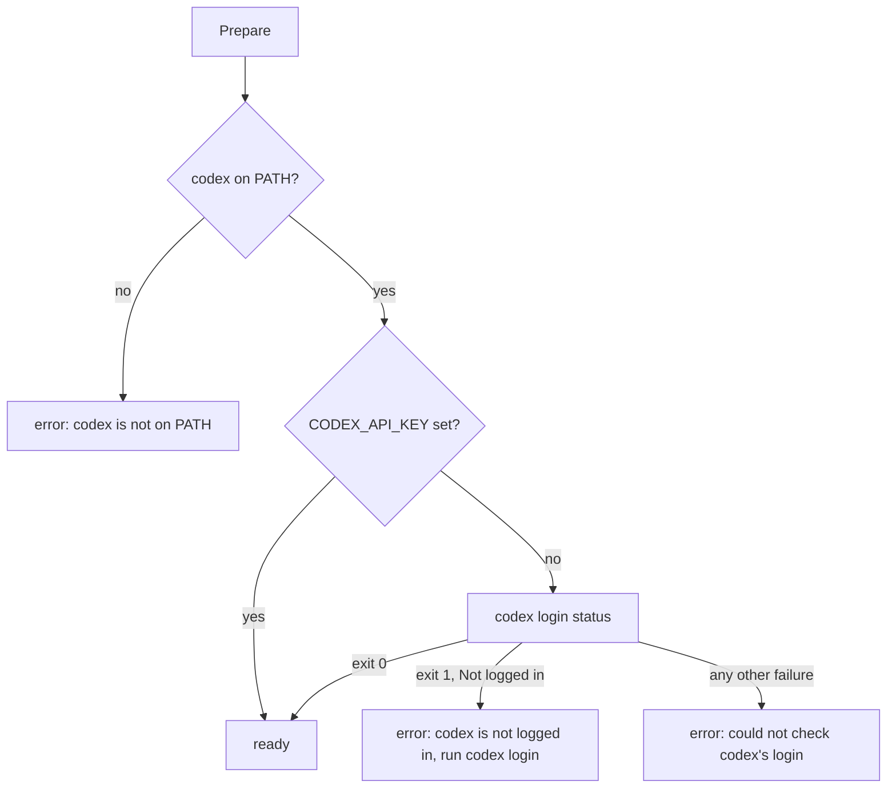

# Codex sessions' usage, last words and startup check - Plan

## Goal Capsule

- **Objective:** a code owner who runs agents on Codex sees each Codex session's tokens and last words where crew shows a Claude session's, and crew refuses to start, naming the agent, when an agent in use runs on a Codex that is missing or logged out.
- **Means:** the `codex` harness adapter gains the optional `port.UsageReporter`, `port.Narrator` and `port.Preparer` capabilities (KTD1 to KTD5). The engine, the TUI, `internal/crew` and the claude adapter do not change.
- **Product authority:** the boss, through the brainstorm of #133. The Product Contract wins on behaviour; the KTDs win on mechanism.
- **Stop conditions:** stop and report when a settled Key Decision proves unworkable, or when a gate in the Verification Contract cannot pass without changing a requirement.
- **Execution profile:** one branch, units U1 to U3 in order, one pull request whose body carries `Closes #174`. Codex is logged out on this machine, so a logged-in run that shows real usage is recorded in the pull request as a manual check.
- **Open blockers:** none.

---

## Product Contract

Product Contract from issue #174. Planning answers its Outstanding Questions in KTD1, KTD4 and Scope Boundaries. Product Contract preservation: Product Contract unchanged.

### Summary

A Codex session reports its tokens, turns and last words, and never a cost. crew checks at startup that `codex` is on PATH and logged in, only when an agent in use runs on it.

### Problem Frame

Part 1 (#173, merged as #180) shipped the `codex` harness with none of the optional capabilities (`docs/plans/2026-10-05-1822-feat-codex-harness-plan.md`, KTD6). A Codex session's usage therefore shows as "cost and tokens not reported". Its last words never reach the log line or the status comment. A missing or logged-out `codex` is found only when the first action fails, and that failure moves the issue to its failure label with a comment.

### Key Decisions

- **A Codex-only repository and a mixed Claude and Codex config are both first-class.** (session-settled: user-directed — chosen over starting with mixed agents only, or with a Codex-only crew only: either setup must work from day one.) Governs R7, R12.
- **A Codex session reports tokens, not a cost.** (session-settled: user-approved — chosen over a per-model price table in crew and over per-token prices in the agent's config: prices drift with every model release.) Governs R7.
- **A harness is checked at startup only when an agent in use runs on it.** (session-settled: user-directed — chosen over checking every registered harness: crew needs neither Claude Code nor Codex installed unless its config uses it.) Governs R12.
- **The startup check covers Codex's login as well as its presence.** (session-settled: user-approved — chosen over a PATH-only check like the claude harness's: without it, every Codex action fails and moves its issue to the failure label with a comment.) Governs R12.

### Actors

- A1. The code owner: writes `.crew/config.yaml` and picks each agent's harness.
- A2. crew: checks the harnesses in use at startup, runs each action's session and reports what it used.
- A3. Codex: the `codex` CLI, logged in on the machine crew runs on.

### Requirements

**Reporting**

- R7. A Codex session reports its tokens and turns, and the models it ran when Codex names them, and never a cost; crew shows its cost as not reported and marks a sum that includes it as partial.
- R8. A Codex session's last message is what crew shows as the session's last words, in the log and in the status comment while the action runs, as a Claude session's is.

**Startup**

- R12. When an agent in use runs on `codex`, crew refuses to start unless `codex` is on PATH and logged in, naming the agent and what is missing; with no Codex agent in use, crew checks nothing about Codex.

### Key Flows

- F1. An action on a Codex agent
  - **Trigger:** a rule takes an issue, and one of its actions names an agent whose harness is `codex`.
  - **Steps:** crew starts Codex headless in the action's workspace and reads its events until it exits. While it runs, crew shows its last message. Once it ends, crew judges it and records its tokens, turns and last message.
  - **Covered by:** R7, R8
- F2. Startup with a Codex agent in use
  - **Trigger:** crew starts, and some action names an agent whose harness is `codex`.
  - **Steps:** before it lists any issue, crew checks that `codex` is on PATH and logged in. When either check fails, it stops with a message naming the agent and what is missing.
  - **Covered by:** R12

### Acceptance Examples

- AE1. **Covers R12.** Given a config whose agents all run on `claude` and a machine without `codex`, when crew starts, it starts.
- AE2. **Covers R12.** Given an agent `reviewer` on `codex` that an action names, and `codex login status` reporting "Not logged in", when crew starts, it exits 2 before listing any issue with a message naming `reviewer` and the missing login.
- AE3. **Covers R12.** Given an agent on `codex` that no action names and a machine without `codex`, when crew starts, it starts.
- AE5. **Covers R7.** Given a rule whose two actions ran on Claude at $3.10 and on Codex at 1.2M tokens, when the rule run ends, its status entry shows the cost marked partial and the tokens of both sessions.

### Success Criteria

- The adapter's tests run on recorded Codex event fixtures, as the claude adapter's run on recorded stream-json, covering success, a failed last turn, a stop and a process that dies before any event.
- No change to the engine, the TUI, `internal/crew` or the claude adapter.

### Scope Boundaries

- No dollar cost for Codex sessions, estimated or configured.
- No Codex section in the README and no Codex agent or prompt in the example config.
- Codex settings beyond `model` are deferred.
- No use of Codex's own session resume, and no other harness.
- Not built: a minimum Codex version check. A Codex too old for a flag crew passes refuses it at once and exits non-zero, and the adapter already makes its last stderr line the action's failure reason (part 1, KTD5). A check would need a version table kept in step with Codex's releases. Revisit if a Codex release accepts an unknown flag silently.
- Not built: reporting the `-m` model as the session's model. Codex's JSON events name no model, and Codex can serve a turn on a different model than the one requested, so crew does not claim one (KTD3).

### Dependencies / Assumptions

- `codex-cli` 0.154.0 prints `turn.completed` with the thread's cumulative `usage` (`codex-rs/exec/src/event_processor_with_jsonl_output.rs`, `usage_from_last_total`).
- `codex login status` prints "Not logged in" on stderr and exits 1 when logged out. It ignores `CODEX_API_KEY`, which `codex exec` uses (checked here: an invalid key in `CODEX_API_KEY` reached the API as a bearer token while `login status` still said "Not logged in").

### Sources / Research

- Part 1 plan: `docs/plans/2026-10-05-1822-feat-codex-harness-plan.md` (KTD5 verdict, KTD6 deferred capabilities, KTD7 no shared code with claude, Appendix with the 0.154.0 events).
- The claude adapter's capabilities, the pattern to mirror in shape but not in text: `internal/adapter/claude/harness.go` (`Prepare`, `Said`, `Usage`, `reap`), `internal/adapter/claude/stream.go` (`said`, `usage`).
- Optional ports: `internal/port/port.go` (`Preparer`, `Narrator`, `UsageReporter`, `port.Step`).
- Already in place, unchanged by this plan: only agents in use are built and prepared (`internal/app/app.go` `build`, `internal/config/agents.go` `agentsInUse`); a prepare failure is wrapped as "prepare the harness of agent <name>" (`internal/engine/engine.go` `prepare`) and exits 2 (`internal/app/app.go` `Run`, `ExitConfig`); `crew.Spend.String` marks a partial cost (`internal/crew/usage.go`); the engine cuts and scrubs last words (`internal/engine/engine.go` `said`).
- Public last words: `docs/solutions/security-issues/session-text-in-public-tracker-comments.md`. R8 takes the status comment's existing running line as it is for Claude.

---

## Planning Contract

### Key Technical Decisions

- KTD1. **Codex's tokens map onto crew's four kinds so that their total equals Codex's input plus output.** In Codex's usage, `cached_input_tokens` and `cache_write_input_tokens` are both parts of `input_tokens`, and `reasoning_output_tokens` is part of `output_tokens` (`codex-rs/codex-api/src/sse/responses.rs`: input 100 = cached 40 + cache write 60). So Input is `input_tokens` minus both cache counts, floored at zero. CacheRead is `cached_input_tokens`, CacheWrite is `cache_write_input_tokens`, and Output is `output_tokens`, with reasoning not added again. A negative count reads as zero. Governs R7.
- KTD2. **Usage comes from the last `turn.completed` event, and a session without one reports nothing.** That event carries the thread's cumulative usage, so the last one is the session's total. Turns is the number of `turn.completed` events, which is Codex's own unit; `codex exec` runs one turn, so it is 1. A session crew stopped, or one whose turn failed or printed no end, reports nothing, as `port.UsageReporter` says of a session without a final result. A completed turn whose `codex` then exited non-zero still reports its usage, since the tokens were spent. Cost is never set (R7's Key Decision). Governs R7.
- KTD3. **Models stay empty.** `codex exec --json` names no model in any event (`codex-rs/exec/src/exec_events.rs`: `thread.started` carries only `thread_id`). The `-m` value is what crew asked for, not what Codex reports it ran. R7 reports models only when Codex names them. Governs R7.
- KTD4. **`Prepare` checks PATH, then the login, and treats a non-empty `CODEX_API_KEY` as logged in.** It reports each step with `port.Step` ("looking for codex on PATH", "checking that codex is logged in"). It finds `codex` with `exec.LookPath`, as claude does. Without `CODEX_API_KEY`, it runs `codex login status` through the harness's `proc.Runner` under a one-minute timeout. Exit status 1 with "Not logged in" in its output means logged out, and the error says so and names `codex login`. Codex also exits 1 when it cannot read its config or its stored login (`codex-rs/cli/src/login.rs`, `run_login_status`), so any other failure, an exit 1 with other output or a timeout included, says the login could not be checked and wraps the cause with Codex's own line. The engine prefixes the agent's name and the app exits 2 (Sources). The `CODEX_API_KEY` case exists because `codex exec` authenticates with that key while `codex login status` ignores it, so checking only `login status` would refuse a working setup, such as a CI machine. This instantiates the login Key Decision and inherits its label (session-settled: user-approved — chosen over a PATH-only check like the claude harness's: without it, every Codex action fails and moves its issue to the failure label with a comment). Governs R12.
- KTD5. **Last words are the text of the last `agent_message` item, kept under a lock and read while the session runs.** The recorder already keeps that text for the success reason. `Said` returns it with its words joined by single spaces, and "" before the first message. The engine cuts and scrubs it, so the adapter does not. Reasoning items, command output and error items never count. The stdout goroutine writes it while the engine's goroutine reads it, so it needs its own mutex. The verdict and usage are read only after the process is reaped. Governs R8.
- KTD6. **The new code is the codex adapter's own, in the recorder's shape.** Part 1's KTD7 still holds: no shared package with claude, and no line-for-line copy that Codacy's duplication check would flag. Usage is decoded from the same `event` struct the recorder already unmarshals, by adding a `usage` field, not by parsing each line a second time.

### High-Level Technical Design

What each recorded ending yields. Rows are evaluated top to bottom; the first match wins.

| Session ended | Verdict (part 1) | Usage (KTD2) | Said (KTD5) |
|---|---|---|---|
| Stopped by crew | failed, stopped by crew | nothing | last `agent_message` text, or "" |
| No turn event (interrupted, or died before any event) | failed | nothing | last `agent_message` text, or "" |
| `turn.failed` | failed with its message | nothing | last `agent_message` text, or "" |
| `turn.completed`, exit non-zero | failed after the turn | tokens and turns | last `agent_message` text |
| `turn.completed`, exit 0 | succeeded | tokens and turns | last `agent_message` text |

Startup, per Codex agent in use:

### Assumptions

Headless run: these defaults were not confirmed by the boss.

- Turns is 1 for a completed `codex exec` session (KTD2). The journal records it next to Claude's `num_turns`, which counts model round trips, so the two harnesses' turn counts are not comparable.
- A non-empty `CODEX_API_KEY` in crew's environment counts as logged in, without checking that the key is valid (KTD4). `login status` does not validate a stored login either.
- The login check's timeout is one minute, as the git-dirs call's is. A healthy `login status` reads a local file.

### Risks

| Risk | Mitigation |
|---|---|
| Real usage numbers are unverified, because Codex is logged out here. The fixtures' usage shapes come from Codex's source at 0.154.0. | The pull request records a manual run on a logged-in machine, checking the journal's tokens against Codex's own totals. |
| `codex login status` changes its exit code or output in a later release. | Only exit 1 with "Not logged in" reads as a logout. Any other failure says the login could not be checked, with Codex's own line, instead of claiming a logout. |
| A Codex agent's last words reach the public status comment, as a Claude agent's do (the learning in Sources). | Unchanged exposure, accepted by R8. The engine scrubs paths and cuts the text. |

---

## Implementation Units

### U1. Usage from the turn's end

- **Goal:** a finished Codex session reports its tokens and turns, and no cost.
- **Requirements:** R7, AE5; KTD1, KTD2, KTD3, KTD6.
- **Dependencies:** none.
- **Files:** `internal/adapter/codex/events.go`, `internal/adapter/codex/harness.go`, `internal/adapter/codex/events_test.go`, `internal/adapter/codex/harness_test.go`, `internal/adapter/codex/testdata/` (a new fixture with non-zero cache read and cache write counts), `.testcoverage.yml` only if a new file needs it.
- **Approach:**
  1. Add the `usage` object to the recorder's `event` and keep the last `turn.completed` usage plus a count of completed turns.
  2. Give the recorder a usage reading that applies KTD1 and KTD2 and returns an empty `crew.Usage` when no turn completed.
  3. The session implements `port.UsageReporter`. `Usage` waits for the verdict and returns nothing when crew stopped the session. Add the compile-time guard and update the guard comment that says the adapter reports no usage.
- **Patterns to follow:** `internal/adapter/claude/harness.go` (`Usage`, `reap`) for the contract; the recorder's existing `event` switch for the shape.
- **Test scenarios:**
  - `success.jsonl`: Input 315 (24763 − 24448 − 0), CacheRead 24448, CacheWrite 0, Output 122, Turns 1, HasTokens and HasTurns true, HasCost false, Models empty.
  - The new fixture with cached 40 and cache write 60 of input 100, output 10 with 5 reasoning: Input 0, CacheRead 40, CacheWrite 60, Output 10, and Total is 110.
  - Negative or inconsistent counts, such as cached above input: no negative kind, and Input floors at zero.
  - `failed.jsonl` (turn failed), `interrupted.jsonl` (no turn event) and stdout with no event at all reports nothing: HasTokens and HasTurns false.
  - `retried.jsonl`: error events before the completed turn do not stop it from reporting its usage.
  - A completed turn whose process exits non-zero reports its usage while its verdict fails.
  - A session crew stopped after a completed turn reports nothing.
  - `quoted.jsonl`: a `turn.completed` quoted inside an agent's message is not counted as a turn.
  - Covers AE5. A Claude-shaped `Usage{Cost: 3.10, HasCost: true, …}` spend added to a Codex session's spend from this adapter words as "$3.10 (partial), … tokens" with no partial mark on the tokens. Put it in the codex adapter's tests, since `internal/crew` stays unchanged.
- **Verification:** the usage tests pass under `-race`, and a fake codex run through `Factory` reports usage only after `Wait`.

### U2. Last words while the session runs

- **Goal:** crew shows a running Codex session's last message as its last words.
- **Requirements:** R8; KTD5, KTD6.
- **Dependencies:** U1, since both edit the recorder in `internal/adapter/codex/events.go`.
- **Files:** `internal/adapter/codex/events.go`, `internal/adapter/codex/harness.go`, `internal/adapter/codex/events_test.go`, `internal/adapter/codex/harness_test.go`.
- **Approach:**
  1. Guard the recorder's last-message text with a mutex, and keep the judge reading it as before.
  2. The session implements `port.Narrator`, returning the text on one line. Add its compile-time guard.
- **Patterns to follow:** `internal/adapter/claude/stream.go` (`assistant`, `said`) for the contract, not the text.
- **Test scenarios:**
  - Before any event, and after only a `reasoning` item, `Said` is "".
  - After `item.completed` of type `agent_message` "Reading issue #4 first.", `Said` returns it. After the later "I fixed the parser.\n\nThe tests pass.", it returns "I fixed the parser. The tests pass.".
  - A `command_execution` item or an `error` item after a message leaves `Said` unchanged.
  - An `item.started` or `item.updated` agent message does not count; only `item.completed` does.
  - `Said` called from another goroutine while stdout is being written, under `-race`, races with nothing.
  - After a stop, `Said` still returns the last message.
- **Verification:** the engine's `port.Narrator` assertion finds the codex session, and the race detector is clean.

### U3. The startup check

- **Goal:** crew refuses to start when a Codex agent in use has no `codex` on PATH or no login, and checks nothing about Codex otherwise.
- **Requirements:** R12, AE1, AE2, AE3; KTD4.
- **Dependencies:** none.
- **Files:** `internal/adapter/codex/harness.go` (or a new `internal/adapter/codex/prepare.go`), `internal/adapter/codex/harness_test.go` (or `prepare_test.go`), `internal/app/app_agents_test.go` only if U3's AE coverage needs an app-level case the fakes do not already give.
- **Approach:**
  1. The harness implements `port.Preparer` per KTD4. Rename its `git` runner field to a neutral name, since it now runs `codex login status` too.
  2. The login command runs through `proc.Runner` with crew's environment, so it reads the same `CODEX_HOME` the sessions do.
  3. Update the package and guard comments that say the adapter checks nothing at startup.
- **Execution note:** test the PATH check by pointing `PATH` at a temporary directory with `t.Setenv`, as the claude harness's test does, and the login check with a scripted runner.
- **Patterns to follow:** `internal/adapter/claude/harness.go` `Prepare` and its test `TestPreparerFailsNamingClaudeWhenItIsNotOnPath`; `internal/adapter/codex/gitdirs.go` for a bounded `proc.Runner` call.
- **Test scenarios:**
  - `codex` not on PATH: the error names `codex` and PATH, and no login command runs.
  - On PATH, `CODEX_API_KEY` non-empty: Prepare succeeds without running `codex login status`.
  - On PATH, `CODEX_API_KEY` empty or unset, and `login status` exits 0: Prepare succeeds, having run `codex login status` with no extra arguments.
  - Covers AE2. `login status` exits 1 with "Not logged in": the error says codex is not logged in and names `codex login`. The existing engine wrapping then names the agent; an app-level case with a preparing fake already shows that wrapping and exit 2.
  - `login status` fails some other way (exit 1 with "Error loading configuration: ...", exit 2, or the runner's context deadline): the error says the login could not be checked, wraps the cause and does not tell the user to run `codex login`.
  - Prepare reports both steps through `port.Step`, in order.
  - Covers AE1 and AE3. `TestAnUnusedAgentIsNeverPrepared` already shows that an unused agent's harness is never prepared. Add an app-level case only if no existing test shows that a config without a Codex agent never builds or prepares a codex harness.
- **Verification:** `go test -race ./internal/adapter/codex ./internal/app` passes, and `crew` built locally with a Codex agent in use exits 2 on this logged-out machine, naming the agent.

---

## Verification Contract

| Gate | Command | Applies to |
|---|---|---|
| Format | `gofmt -l cmd internal tools` prints nothing | all |
| Vet | `go vet ./...` | all |
| Lint and layering | `go run github.com/golangci/golangci-lint/v2/cmd/golangci-lint@v2.14.0 run` | all |
| Tests | `go test -race ./...` | all |
| Coverage | `go test -race -covermode=atomic -coverpkg=./... -coverprofile=coverage.out ./...`, then `go run github.com/vladopajic/go-test-coverage/v2@v2.19.0 --config=.testcoverage.yml` (total at least 90%) | all |
| Changed lines | `git diff -U0 origin/main...HEAD \| go run ./tools/diffcover -profile coverage.out` (at least 90%) | all |
| Vulnerabilities | `go run golang.org/x/vuln/cmd/govulncheck@v1.8.0 ./...` | all |
| Codacy | `pnpm exec codacy-analysis analyze --install-dependencies`, no finding in changed files | U1 to U3 |
| Startup smoke (local) | a built `crew` in a scratch repository whose config names a Codex agent in use exits 2 with the agent's name and the missing login | U3 |
| Real usage (manual, logged-in Codex) | one action on a Codex agent; its journal entry has tokens and turns and no cost | recorded in the pull request as a check left to do |

---

## Definition of Done

- U1 to U3 are in, and every gate above but the manual run passes.
- The engine, the TUI, `internal/crew`, `internal/adapter/claude` and `.crew/config.example.yaml` are unchanged in the diff.
- The codex adapter's comments no longer say it reports no usage or last words, or checks nothing at startup.
- The pull request body carries `Closes #174` and lists the manual logged-in check.
- No abandoned attempt's code is left in the diff.
