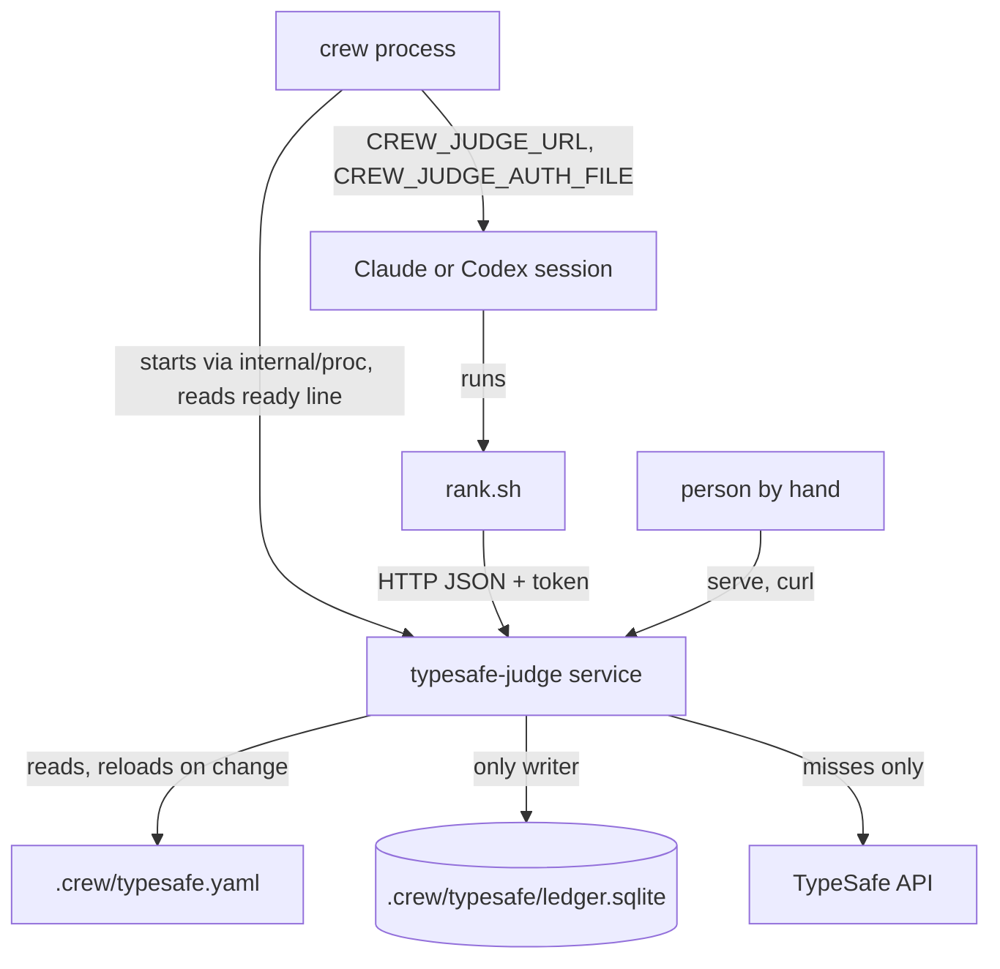
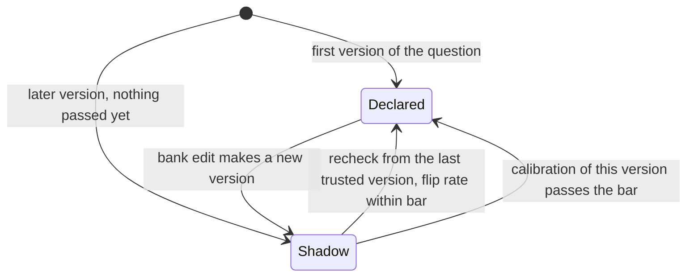

# TypeSafe Ledger - Plan

## Goal Capsule

- **Objective:** every TypeSafe judgment crew asks can be replayed, audited and checked against what really happened, and a judgment gains autonomy only on held-out evidence. This plan delivers crew's judge (a local TypeSafe service with its decision ledger) that crew starts when a repository enables it, proven by `cw-rank-blockers`. crew's engine asking questions itself, rules consuming answers, and packaging the service for other repositories are not active scope.
- **Means:** a Python service (Python because the TypeSafe SDK is Python) behind a new generic `judge` port with a `typesafe` adapter, holding a bank of named questions in `.crew/` and an append-only SQLite ledger (KTD1, KTD2, KTD5).
- **Product authority:** the repository owner, in the #188 brainstorm and planning session. The Product Contract wins on behaviour; the Planning Contract's KTDs win on mechanism within it.
- **Open blockers:** none.
- **Stop conditions:** stop and ask if a requirement turns out infeasible (for example, a Codex or Claude session cannot reach the service on `127.0.0.1`), or if meeting one would make crew depend on the judge.
- **Execution profile:** one pull request; units land in dependency order (U1 through U12); CI must be green, including the new `python` job.
- **Who finishes:** the implementing agent opens the pull request; the repository owner merges it and adds the `python` job to the `checks` ruleset with `bootstrap.sh --checks` in `thatsnotmynameio/.github`.

---

## Product Contract

### Summary

crew gets a judge: a local service, enabled per repository with `judge: {name: typesafe}`, that crew starts with `./crew` and stops with it. Callers ask named questions with a state and their own identifiers; the service answers from its ledger when the same input was asked before, asks Jev when it was not, and records every call, what the caller did with it and, later, what really happened. From that record it rechecks changes to questions, bands and models, and proposes bands from labelled outcomes. crew works the same without it.

### Problem Frame

Jev is not bit-reproducible. Identical requests keep the same winning answer, but probabilities drift by 0.01 to 0.03, and the TypeSafe docs offer no cache, seed or idempotency key. A threshold can therefore flip on a rerun of the same input.

Nothing records the judgments crew's tooling already asks. `cw-rank-blockers` calls Jev with curl and keeps nothing. `cw-split-plan` writes its shadow answers into an issue body, and it asks `jev-latest` instead of a pinned version. Without a record of answers next to real outcomes, no threshold can be chosen on held-out data as TypeSafe recommends, no change to a question or model can be checked before it ships, and no judgment can safely move from shadow to acting.

Both TypeSafe ideation documents merged on 2026-10-05 reached the same piece independently: a ledger that records every call and replays it.

### Key Decisions

- **The judge is a product feature, opt-in.** crew must never depend on it; it makes crew better for those who enable it. (session-settled: user-directed — chosen over keeping TypeSafe as this repository's internal tooling: the user wants it in the product, but not as a dependency.) Governs R22, R23.
- **The ledger is the core of crew's TypeSafe service, not a separate tool.** Python is used only because the TypeSafe SDK is Python. (session-settled: user-directed — chosen over a ledger library for the `cw-*` skills or for the ideated ce-plan/ce-work apps.) Governs R10.
- **The service is a local, long-running process outside any session.** It is the only writer of the ledger, and callers reach it over the local network. (session-settled: user-directed — chosen over a command each caller starts per call, which would inherit the calling session's sandbox.) Governs R10, R11, R13.
- **crew starts and stops the service.** (session-settled: user-directed — chosen over a person starting it by hand, and over leaving its lifecycle to #194.) Governs R23.
- **A generic `judge` section and port; TypeSafe is one adapter.** It is configured like the tracker: `judge: {name: typesafe}`. (session-settled: user-directed — chosen over a TypeSafe-named section, enabling by the bank file's presence, and a command-line flag.) Governs R23.
- **Callers ask named questions with a state; the service owns the questions.** (session-settled: user-directed — chosen over callers sending full TypeSafe requests: keeps questions and thresholds in one reviewable place.) Governs R1, R6.
- **The question bank belongs to the user's repository.** (session-settled: user-directed — chosen over a bank built into crew: each repository writes and calibrates its own questions.) Governs R1, R2.
- **The bank is the TypeSafe adapter's own file in `.crew/`, not part of `.crew/config.yaml`.** `config.yaml` carries only the generic `judge` section; the bank's format is TypeSafe's. (session-settled: user-approved — proposed as a separate file and confirmed in the brainstorm synthesis; the reason was restated when the `judge` port moved into scope.) Governs R1.
- **The service is agnostic.** `cw-rank-blockers` is plugged in only to test it; each new consumer brings its questions and its own outcome script, and the service's code never changes for one. (session-settled: user-directed — "o serviço de app não pode ter que mudar código python toda hora pra cada coisa nova".) Governs R3, R6, R16, R21.
- **A repeated input returns the first recorded answer.** TypeSafe's cookbooks cache by request and force a fresh draw only on purpose, and its guidance absorbs jitter with decision bands rather than re-asking. (session-settled: user-approved — the user asked for TypeSafe's recommendation and accepted it.) Governs R7.
- **A decision ledger, not an answer cache.** It keeps every call, the caller's decision and the outcome, and each question has a stage (shadow, confirm, act). (session-settled: user-directed — chosen over an answer cache, and over an append-only answer log without decisions and stages, which the agent recommended.) Governs R5, R12, R15, R19.
- **Every call is a record, replays included.** (session-settled: user-approved — confirmed in the planning synthesis.) Governs R12, R15.
- **Changing a band makes a new version.** (session-settled: user-approved — confirmed in the planning synthesis.) Governs R4, R5.
- **Callers attach their own identifiers outside the state.** TypeSafe's guidance keeps only what the judgment needs in the state, yet calibration must tie answers to outcomes and split by group. (session-settled: user-approved — explained against the docs and confirmed in the planning synthesis.) Governs R6, R16, R18.
- **Verdict bands, outcomes, recheck and calibration are all in the first version.** (session-settled: user-directed — chosen over record and replay alone.) Governs R8, R16, R17, R18.
- **SQLite, one ledger per repository, in `.crew/`.** SQLite answers recheck and calibration queries with no extra dependency and shortens a later move to a shared database. Sharing across machines must be documented as needed evolution. (session-settled: user-directed — chosen over JSONL, DuckDB and Parquet, and over a ledger committed to git or one with label export; `.crew/` reconfirmed over the git common dir once the service became the only writer.) Governs R11.
- **This repository first.** In this work the adapter runs the service from crew's repository; packaging it for other repositories comes with #194. (session-settled: user-directed — chosen over shipping an installable app now.) Governs R10, R23.
- **`cw-rank-blockers` is the first consumer.** It makes one request per pair, which gives the volume a dev / held-out split needs, and refinement's `blocked_by` links give it outcomes. (session-settled: user-approved — the user asked which consumer TypeSafe's guidance favours and accepted it.) Governs R20, R21.

### Requirements

**Question bank**

- R1. Questions live in a bank file in the repository's `.crew/`, edited by hand and reviewed in pull requests like the config, and separate from `.crew/config.yaml`.
- R2. Each question declares its name, its primitive (Noul, Choice or Score) with instructions and criteria, its pinned model version, its verdict bands, its conservative default, its stage (shadow, confirm or act), and the evidence bar it must pass to move up a stage.
- R3. A new use of TypeSafe needs only new questions in the bank and the consumer's own scripts: the service holds no code specific to any consumer.
- R4. Any change to a question's content, pinned model or bands makes a new version of that question.
- R5. A later version of a question is treated as shadow, whatever stage the bank declares, until a recheck against the last version that held its declared stage passes, or a calibration of the version itself passes its evidence bar; the first version of a question keeps the stage the bank declares.

**Asking**

- R6. A caller asks one or more questions by name over one state, with an optional object of its own identifiers, and gets for each question the verdict, the raw probabilities, the effective stage, the model that answered, and an ask id to attach a decision or an outcome later.
- R7. When the same question content, pinned model and state were asked before, the service returns the first recorded answer without calling TypeSafe; a caller can ask explicitly for a fresh answer, which is recorded and returned without changing which answer later replays serve.
- R8. Verdicts are computed when read, from the recorded probabilities and the question's current bands.
- R9. Without a TypeSafe key, or when TypeSafe fails, the service still serves recorded answers, and for an input never asked it answers "cannot judge" with the reason, the attempts made and the question's conservative default, without failing the caller.
- R10. Callers reach the service over the local network with JSON in and JSON out, so a shell skill, an agent session and, later, crew's engine use the same entry point.

**Ledger**

- R11. Each repository has one SQLite ledger in the `.crew/` of the checkout crew runs in, kept out of git like `.crew/logs/` and written only by the service.
- R12. The ledger only grows: every ask is recorded, replays and "cannot judge" included, and every live answer is recorded with the question version, the model asked and the model that answered, the state, every probability, the usage, the request id and the time.
- R13. Callers asking at the same time, such as parallel crew sessions in different worktrees, lose no records.

**Decisions and outcomes**

- R14. Every ask links to the question version and state that produced it, so any later record can be traced back to the exact judgment.
- R15. A caller records what it did with an answer (acted, sent to a person, or ignored because the question is in shadow), linked to its own ask.
- R16. A caller records the real outcome later as a value with a source and a strength (strong or weak), linked to an ask or matched by its own identifiers; the service reads no external source to find outcomes.

**Recheck and calibration**

- R17. A recheck evaluates the recorded asks of a question's earlier version under its current version and lists the decisions that would flip; a band change needs no TypeSafe call, and a content or model change asks live and records the new answers.
- R18. Calibration takes a question's labelled asks, splits them into dev and held-out by a group the caller names, proposes bands from dev, and reports their held-out performance against the question's evidence bar, or reports that the labels are insufficient.
- R19. The service reports whether a question passes the bar for its next stage, and never changes a stage itself: moving a question up is a person's edit to the bank, reviewed like any change.

**First consumer**

- R20. `cw-rank-blockers` asks both of its blocking questions through the service in one call per pair, with its questions in this repository's bank in shadow, and its printed lists and failure line unchanged.
- R21. The `cw-rank-blockers` side, not the service, records outcomes from the `blocked_by` links refinement registered, and it only reads those links.

**crew with and without the judge**

- R22. crew works as it does today without a `judge` section, Python, uv, the service or a TypeSafe key; when the judge is enabled but its service cannot start, crew says so in its boot log and runs without it.
- R23. When `.crew/config.yaml` has a `judge` section naming an adapter, crew starts that adapter's service before it polls, gives every session the service's address, and stops the service when crew stops.
- R24. A person can find the service crew started, or start one by hand for a repository, and get its address, to use it outside crew.

### Acceptance Examples

- AE1. Replay
  - **Covers R7, R12.**
  - **Given** the ledger holds an answer to question `issue_needs_candidate` on `jev-1.13.0` for state S.
  - **When** a caller asks `issue_needs_candidate` with state S again.
  - **Then** it gets the recorded answer marked as replayed, no TypeSafe request is made, and a new ask record points at the recorded answer.
- AE2. Band change
  - **Covers R4, R8, R17.**
  - **Given** 50 recorded answers to a question.
  - **When** its yes band moves from 0.70 to 0.60 and a recheck runs.
  - **Then** the recheck lists the asks whose verdict flips, without any TypeSafe request.
- AE3. No key
  - **Covers R9.**
  - **Given** the service runs without `TYPESAFE_API_KEY`.
  - **When** a caller asks one recorded input and one input never asked.
  - **Then** the first gets its recorded answer, and the second gets "cannot judge" with the reason `no key` and the question's conservative default; neither call fails.
- AE4. Edited question
  - **Covers R4, R5, R19.**
  - **Given** a question is declared at stage act.
  - **When** its instructions are edited.
  - **Then** answers to the new version report the effective stage shadow until a recheck passes, and the bank file is not changed by the service.
- AE5. Parallel sessions
  - **Covers R11, R13.**
  - **Given** two crew sessions in two worktrees of one repository.
  - **When** both ask at the same moment.
  - **Then** both asks are in the repository's single ledger.
- AE6. Calibration
  - **Covers R16, R18, R19.**
  - **Given** a question with labelled asks.
  - **When** calibration runs.
  - **Then** it reports proposed bands and their held-out result against the question's bar, or that the labels are insufficient, and the bank is unchanged.
- AE7. New consumer
  - **Covers R3.**
  - **Given** a new question added to the bank.
  - **When** a caller asks it by name.
  - **Then** it is answered and recorded with no change to the service's code.
- AE8. Partly recorded call
  - **Covers R6, R7.**
  - **Given** the ledger holds an answer to `issue_needs_candidate` for state S but none to `candidate_needs_issue`.
  - **When** a caller asks both over S in one call.
  - **Then** the first is replayed, only the second goes to TypeSafe, and both come back in one response.
- AE9. Judge off
  - **Covers R22.**
  - **Given** `.crew/config.yaml` has no `judge` section.
  - **When** crew starts.
  - **Then** crew looks for neither Python nor uv, starts no service, and its sessions get no judge address.
- AE10. Judge failing to start
  - **Covers R22, R23.**
  - **Given** `judge: {name: typesafe}` and no `uv` on the `PATH`.
  - **When** crew starts.
  - **Then** the boot log has one line saying the judge did not start and why, and crew polls as usual.

### Success Criteria

- Running `cw-rank-blockers` twice on the same issue under crew gives the same lists, and the second run makes no TypeSafe request.
- After `cw-rank-blockers` has run on real issues and refinement has registered links, calibration produces a held-out report for its questions, or says the labels are insufficient and how many more each side needs.

<!-- ce-section: work-relationships -->
### How This Work Fits Together

This plan covers crew's judge: the `judge` port with its `typesafe` adapter that crew starts and stops, and the service with its question bank, ledger, replay, decisions, outcomes, recheck and calibration. The areas below are the current understanding, not a committed roadmap.

- crew's engine asks questions through the judge itself, and the service is packaged and installed for other repositories (#194).
  - Depends on this plan.
  - Shares R10's entry point and R22's rule that crew works without the judge.
- Questions wired into crew's rules, where a rule uses an answer's verdict and stage to decide what to do (#195).
  - Depends on #194.
  - Shares the stages of R2 and R19.
- `cw-split-plan` asks its shadow question through the service, pinned instead of `jev-latest`.
  - Depends on this plan.
  - Can proceed independently of #194.
- The ledger shared across machines and clones, moving from local SQLite to a shared database.
  - Still to decide.
  - SQLite was chosen to shorten this path.

### Scope Boundaries

**Deferred for later**

- crew's engine asking questions, and packaging and installing the service for other repositories (#194).
- Rules consuming answers, verdicts or stages (#195).
- Migrating `cw-split-plan` and any other consumer beyond `cw-rank-blockers`.
- Sharing the ledger across machines or clones, or exporting labels to commit them.
- Labelling asks by hand.

**Outside this product's identity**

- A proxy for raw TypeSafe requests: callers ask named questions only.
- A general LLM gateway: the judge answers typed judgments and nothing else.
- Deciding for the caller: the service reports verdicts, stages and evidence, and the caller acts.

**Considered and not built**

- Restarting the service when it dies mid-run. A dead service makes each caller fail loudly (`cw-rank-blockers` prints its failure line), which a person sees at once; evidence of frequent crashes would change this.
- Running `rank_test.sh` in CI. It stays a by-hand test as today; the service's own tests carry the request, retry and replay cases it loses.
- A JSON schema for the bank file. The service validates the bank strictly on load; editor completion can follow if hand edits prove error-prone.
- A configurable Python project directory in the `judge` section. Nothing in this work runs the service from anywhere but `<root>/typesafe`; #194's packaging decides where it lives for other repositories.

#### Deferred to Follow-Up Work

- The stale comment in `.crew/.gitignore` ("config.yaml stays committed") is out of this diff unless the unit editing that file fixes it in passing.

### Dependencies / Assumptions

- `typesafe-sdk==0.7.2` and a `TYPESAFE_API_KEY` in crew's environment for live calls; the SDK broke compatibility in 0.6.0 and 0.7.0, so it is pinned exactly.
- `jev-1.13.0` is the current pinned version; `jev-latest` and `jev-preview` both point to it today.
- `cw-rank-blockers` outcomes are noisy and biased: a `blocked_by` link is a positive, a pair refinement saw without linking is only a weak negative, and refinement saw `rank.sh`'s top five, so labels favour what Jev already ranked high.
- With a local ledger, the evidence that justifies a stage change stays on one machine and does not travel with the commit that changes the stage.
- Ledger volume depends on how often `cw-rank-blockers` runs: the refinement prompt does not call it yet.

### Outstanding Questions

**Deferred to Planning**

None remain; the Planning Contract resolves each one the brainstorm deferred.

### Sources / Research

- `docs/ideation/2026-10-05-typesafe-ce-plan-ideation.html`, idea 2 (judgment cassette), and `docs/ideation/2026-10-05-typesafe-ce-work-python-ideation.html`, ideas 1 (ledger and replay) and 7 (gates earn autonomy).
- TypeSafe docs: [Models](https://docs.typesafe.ai/models.md) (pin the version id when thresholds were tuned against it), [API reference](https://docs.typesafe.ai/api.md), [Python SDK responses](https://docs.typesafe.ai/sdk/python/api/types/responses.md) (`model`, `usage`, `request_id`), [self-consistency: nouls](https://docs.typesafe.ai/cookbooks/consistency_noul_cookbook.md) (bands absorb jitter), [autoresearch feature discovery](https://docs.typesafe.ai/cookbooks/autoresearch_feature_discovery.md) (responses cached by call; 1,200 dev and 800 held-out rows).
- `.agents/skills/cw-rank-blockers/rank.sh`: curl at line 131, `jev-1.13.0` at line 22, one request per pair asking both directions at lines 89-117; `docs/plans/2026-10-05-1616-feat-rank-blockers-skill-plan.md` KTD3 (both directions in one request, measured 0.933 in #149).
- `.agents/skills/cw-split-plan/SKILL.md`: shadow answers in the parent issue's split record (lines 89-145), model `jev-latest` (line 91).
- `internal/adapter/codex/gitdirs.go`, `internal/adapter/codex/command.go:41-46`: Codex sessions write only the worktree and the git dirs, which is why the ledger's only writer is a service outside the sessions.
- `.crew/config.example.yaml:99`: refinement records dependencies through the `blocked_by` endpoint.

---

## Planning Contract

**Product Contract preservation:** changed: R4 (bands make a new version), R5 (passing is a recheck against the last trusted version or a passing calibration of the version, so adopting calibrated bands cannot strand a question in shadow and a trivial follow-up edit cannot skip the check), R24 (finding crew's running service), R6 (several questions per call, caller identifiers), R7 (fresh answers do not change replays), R9 (attempts reported), R10 (local service), R11 (ledger in `.crew/`, written only by the service), R12 (every ask recorded), R15 (decision on the caller's own ask), R16 (outcome as value, source and strength), R18 (group split, insufficient labels), R20 (one call per pair; lists and failure line unchanged), R22 (Go now changes; boot-log line when the judge fails); added R23, R24, AE8-AE10 — all from decisions the user made in the planning session (local service, crew starts it, generic `judge` port, agnostic outcomes, caller identifiers, band versions, every call recorded). Key Decisions, Summary, Goal Capsule, scope sections and success criteria updated to match; R1-R3, R8, R13, R14, R17, R19, R21 and AE1-AE7 keep their meaning.

### Key Technical Decisions

- KTD1. **The service is a stdlib HTTP server on `127.0.0.1`, guarded by two per-start bearer tokens kept in files.** `ThreadingHTTPServer` on port 0 (the OS picks), JSON bodies, no web framework; a framework would add dependencies for a handful of JSON endpoints. On start it creates its own instance directory, `.crew/typesafe/run/<instance id>/` (0700), holding an *ask* token file, an *admin* token file and its URL (0600), points `.crew/typesafe/service.json` at the newest instance, prints one JSON ready line (`{"url": ..., "ask_token_file": ..., "admin_token_file": ...}`) to stdout and nothing else there, and removes its instance directory on a clean stop. A second instance therefore never changes the files the first instance's callers read, and a person finds crew's running service through `service.json` instead of starting another. The ask token allows asking, listing questions, looking up asks and recording a decision on an ask; the admin token also allows outcomes, rechecks, calibration and the stage report. Tokens never travel in an environment variable or an argument: the Codex adapter turns session environment entries into command-line arguments (`internal/adapter/codex/command.go:51-53`, #198), where any local process can read them, and `port.Identity` already holds "only where the child finds" a token (`internal/port/port.go:99-101`). The split keeps a session following its prompt from writing labels; it does not stop a same-user process that reads the admin file on purpose, which is stated as a residual risk. Every request is checked for its token in constant time before its body is read, a `Host` header that is not loopback is refused, bodies above 1 MiB get 413, and connections time out. Governs R10, R16, R24.
- KTD2. **A `judge` port with a `typesafe` adapter that runs the service through `internal/proc`.** `port.Judge` starts a judge for a repository root and returns a running judge that yields the environment entries sessions get and a `Stop(ctx)` like a `Session`'s. The adapter runs `uv run --project <root>/typesafe --locked typesafe-judge serve --root <root>` as its own process group (as every `proc` child is), waits for the ready line under a 60-second deadline, and sends the service's stderr to `.crew/logs/judge.log` (0600), keeping its last lines for the boot-log cause. The project directory is always `<root>/typesafe` in this work, so the adapter takes no settings and its decode rejects any key besides `name`; a configurable directory waits for #194's packaging. It follows the tracker's pattern for its section (`internal/config/config.go` `trackerSection`). The registry gains judges through a separate method rather than a third positional argument to `registry.New`, which eight test callers use. Governs R22, R23.
- KTD3. **The judge never stops crew.** The app starts the judge inside its `prepare` closure, after the bots act and before the engine is built, so signals and the startup deadline cover it, and outside `port.Prepare`, whose errors stop crew. Its stop is deferred at once, as the bots' close is, with the engine's 10-second stop timeout; a forced exit kills its process group with the others. A missing adapter name is a config error like any other (exit 2), but every runtime failure (no uv, no Python, a bad bank, no ready line within 60 seconds) becomes one boot-log line, `judge: <cause>; running without it`, carrying only causes the adapter states itself, and crew continues without judge environment. Governs R22.
- KTD4. **Sessions get the judge's address through a new `port.Run.Env`, which holds no secrets.** The engine adds `CREW_JUDGE_URL` and `CREW_JUDGE_AUTH_FILE` (the ask token's file) to every session's `Run`, and the Claude and Codex adapters append them to the session's environment next to `CREW_CODE_OWNERS`. `Identity.Env` was the alternative needing no port change, but it describes who a child acts as, not what it can reach. Checks get nothing, on purpose: no check asks the judge. Governs R23.
- KTD5. **The Python project lives at `typesafe/`, a uv project with a src layout.** Python 3.14, `uv_build`, `uv.lock`, `[tool.uv] required-version`, dependencies pinned exactly: `typesafe-sdk==0.7.2`, `pyyaml`, `rfc8785`; dev: `ruff`, `mypy` (strict, pydantic plugin), `pytest`, `coverage`, `hypothesis`, `diff-cover`. Entry point `typesafe-judge` with argparse (`color=False`). The repository root does not become a Python project. Governs R10.
- KTD6. **Ledger: STRICT tables, append-only triggers, `user_version` migrations, WAL.** Connections use `autocommit=True` with explicit `BEGIN IMMEDIATE`, `busy_timeout` 30 s and `synchronous=FULL`; no transaction is held across a TypeSafe call. The service refuses a ledger whose `user_version` is newer than it knows and SQLite older than 3.51.3 (a WAL-reset corruption fix). The file lives at `.crew/typesafe/ledger.sqlite` in a 0700 directory with 0600 files, as the run journal does. Tables hold states (by hash, stored once), question versions (their full definition, first seen), calls (live answers with the raw response, `model`, `usage`, `request_id`), asks (one per question per caller request, pointing at the call that served it or at a "cannot judge" reason, with the caller's identifiers), decisions, outcomes, rechecks and calibrations. Updates and deletes raise. Governs R11, R12, R13, R14.
- KTD7. **Keys come from what is sent.** The content key is `sha256` of a domain prefix plus the RFC 8785 canonical form of `{model, question in the SDK's wire form}`; the version id adds the bands, the default and the evidence bar to it; the replay key is the content key plus the state's canonical hash. Caller identifiers and bands never enter the replay key. The state must be JSON without floats or integers beyond ±2^53, and the service rejects it otherwise. Governs R4, R7.
- KTD8. **Replay picks the first call per replay key; misses go out together.** For one caller request the service records an ask per question, serves recorded answers from the lowest call id, and sends the questions without one in one SDK request per pinned model, so `cw-rank-blockers`' two directions stay one TypeSafe request. A racing duplicate call is still recorded; replays keep serving the first. `fresh: true` sends every named question live. TypeSafe documents that questions in one request do not see each other's answers, which is what makes per-question replay sound. Governs R6, R7, R12.
- KTD9. **Verdicts by primitive.** Noul: `yes_at` and `no_at`; at or above `yes_at` is yes, at or below `no_at` is no, between is uncertain. Choice and Score: a confidence floor; at or above it the verdict is the chosen option or the rounded level, below it uncertain. Bands are read from the current bank on every read. Governs R2, R8.
- KTD10. **Retries live in the service.** The client uses a 60-second request timeout, as `rank.sh` uses today, and `RetryPolicy(max_retries=2, timeout=None)`, retrying 408, 429, 5xx, connection errors and timeouts for 3 attempts; the SDK's default 30-second total retry budget would stop retrying after one timed-out attempt. A failure maps to one reason from a fixed vocabulary (`no key`, `HTTP <status>`, `timeout`, `unreachable`, `invalid response`) plus the attempt count. `TYPESAFE_LOG_LEVEL` is never raised to debug, which would log request bodies. Governs R9.
- KTD11. **Effective stage and recheck.** A version's effective stage is its declared stage when it is the first version of its question the ledger saw, when a recheck to it from the last trusted version (the latest earlier version whose effective stage was its declared stage) is recorded with a flip rate at or under the evidence bar's `max_flip_rate`, or when a calibration of the version itself is recorded passing its bar for the declared stage; otherwise shadow. Comparing against the last trusted version, not the immediate predecessor, stops a trivial follow-up edit from skipping the check; the calibration path lets a person adopt calibrated bands, which flip verdicts on purpose. A recheck's earlier version defaults to the last trusted version. It takes the distinct states the earlier version answered, recomputes verdicts from stored probabilities when only bands changed, asks live (and records) when content or model changed, and records its flip list and rate. Governs R5, R17.
- KTD12. **Calibration is per side, on dev only, by group.** For a Noul, `yes_at` is the lowest threshold whose upper confidence bound on the false-yes rate stays within the bar's `max_error_yes`, scanned strict to lax and stopping at the first failure (fixed-sequence testing); `no_at` likewise for false noes. Choice and Score calibrate the confidence floor against exact-match correctness. The split is by the caller-identifier key the request names (state hash when none), with a seeded RNG recorded with the result. A side with fewer confident examples than the bar's `min_examples` is reported as insufficient with the count still needed. Labels join asks by question name and state hash, so they carry across versions; for each state and source, the latest outcome counts, and the report shows counts by strength. Exact bounds and the bootstrap use the standard library only. Governs R16, R18, R19.
- KTD13. **Outcome writes are idempotent on value.** An outcome equal to the latest one recorded for the same question, state and source is acknowledged without a new row, so a consumer's import can run again safely. Governs R16, R21.
- KTD14. **The bank reloads on change and fails closed per reload.** The service reads `.crew/typesafe.yaml` at start (an invalid bank there stops the start, which KTD3 turns into a boot-log line) and again whenever its modification time changes; an invalid reload keeps the last valid bank and reports the error on the health endpoint and in every response. Loading uses `yaml.safe_load` and strict Pydantic models (`extra="forbid"`). Governs R1, R2.
- KTD15. **Python quality has its own CI job.** A `python` job runs, with uv pinned: `ruff check` (all rules, each ignore with a reason, complexity mirroring Lizard's limits), `ruff format --check`, `mypy --strict`, `coverage run -m pytest` from the repository root with `relative_files`, `coverage report` at 90%, `diff-cover` at 90% on pull requests, and `pip-audit` over an exported lock. The Codacy job uploads Go and Python coverage as partial reports, and Dependabot gains a `uv` entry. Governs the quality bar in `AGENTS.md`.
- KTD16. **`rank.sh` talks to the service with curl.** It drops `TYPESAFE_API_KEY` and its own retries, reads the token from `$CREW_JUDGE_AUTH_FILE` into a 0600 header file as it does the key today, posts each pair to `$CREW_JUDGE_URL` with a `--max-time` of 200 seconds (above the service's three 60-second attempts) with both question names and `{"issue": N, "candidate": M}` as identifiers, ranks by the returned Noul probabilities as before, reads the pinned model for its headings from the service's question listing, and turns "cannot judge" into its existing failure line. Governs R20.

### High-Level Technical Design

Components and who starts whom:



One ask, partly recorded (AE8):

```mermaid
sequenceDiagram
  participant C as caller
  participant S as service
  participant L as ledger
  participant T as TypeSafe
  C->>S: ask [q1, q2], state, identifiers
  S->>L: first call for (content key q1, state hash)? and q2?
  L-->>S: q1 found, q2 missing
  S->>T: one request with q2 only (no transaction open)
  T-->>S: answer q2, model, usage, request_id
  S->>L: BEGIN IMMEDIATE; insert call q2; insert asks q1 (replayed), q2 (live); COMMIT
  S-->>C: per question: verdict, probabilities, effective stage, model, ask id
```

A question version's effective stage (R5, KTD11):



### Output Structure

```text
typesafe/
  pyproject.toml
  uv.lock
  .python-version
  src/typesafe_judge/
    __init__.py
    cli.py          # serve
    service.py      # HTTP endpoints, token
    bank.py         # load, validate, versions
    keys.py         # canonical JSON, hashes
    ledger.py       # schema, migrations, writes, reads
    asking.py       # replay, live calls, verdicts, effective stage
    records.py      # decisions, outcomes
    recheck.py
    calibrate.py
  tests/
internal/port/port.go               # Judge, JudgeFactory, Run.Env
internal/adapter/typesafe/          # the adapter
.crew/typesafe.yaml                 # this repository's bank
.agents/skills/cw-rank-blockers/outcomes.sh
```

The per-unit **Files** lists are authoritative.

### System-Wide Impact

- **Every session's environment** gains the judge's URL and the path of its ask-token file when the judge runs; no token value enters an environment, an argument, a log, a status comment or the TUI (KTD1, KTD4).
- **Shared state:** the ledger holds issue titles and bodies; it stays out of git and out of anything crew posts. The service's stderr, which a traceback can fill with issue text, goes only to `.crew/logs/judge.log` (KTD2).
- **`TYPESAFE_API_KEY` still reaches sessions,** because `proc` passes crew's environment through and `cw-split-plan` still calls Jev directly; unsetting it in sessions belongs with that skill's migration.
- **Labels need the admin token:** sessions are handed only the ask token, which stops a session following its prompt from writing labels, but any same-user process, sessions included, can read the admin file in `.crew/typesafe/` (KTD1).
- **Boot sequence:** one more step and boot-log line; a slow judge start delays polling by at most its 60-second deadline.
- **Layering:** `internal/adapter/typesafe` imports only `port` and `proc`, like the other adapters; `depguard`'s `**/internal/adapter/**` rules already cover it.
- **A service that dies mid-run** is neither watched nor restarted (Scope Boundaries); each caller reports its own failure.

### Risks

- **SDK churn:** a three-week-old SDK with two breaking releases; mitigated by the exact pin and Dependabot's cooldown.
- **Calibration may never pass for `cw-rank-blockers`:** labels are one-sided and biased (Dependencies / Assumptions); the report says so instead of inventing bands.
- **Sandboxed sessions and the local port:** Codex sessions have network access turned on; if a harness sandbox ever blocks `127.0.0.1`, the stop condition applies.
- **Admin token readable by sessions:** the token split guards against accidental label writes, not a deliberate or prompt-injected session; a passing recheck or calibration remains evidence a person reviews before editing a stage up (R19).
- **`max_flip_rate` set too low** can keep an edited question in shadow until a calibration of the new version passes; the bank author chooses it knowing that.
- **Cold start:** the first `uv run` in a fresh clone resolves and installs the environment, which the 60-second ready deadline must cover; a slower machine shows a boot-log line and runs without the judge.

---

## Implementation Units

| U-ID | Title | Key files | Depends on |
| --- | --- | --- | --- |
| U1 | Python project and CI | `typesafe/pyproject.toml`, `.github/workflows/ci.yml` | none |
| U2 | Question bank and keys | `typesafe/src/typesafe_judge/bank.py`, `keys.py` | U1 |
| U3 | Ledger | `typesafe/src/typesafe_judge/ledger.py` | U2 |
| U4 | Asking | `typesafe/src/typesafe_judge/asking.py` | U3 |
| U5 | HTTP service and `serve` | `typesafe/src/typesafe_judge/service.py`, `cli.py` | U4 |
| U6 | Decisions, outcomes and recheck | `records.py`, `recheck.py` | U5 |
| U7 | Calibration and stage report | `calibrate.py` | U6 |
| U8 | `judge` config section and port | `internal/config/config.go`, `internal/port/port.go` | none |
| U9 | `typesafe` adapter | `internal/adapter/typesafe/` | U5, U8 |
| U10 | crew starts the judge and passes its address | `internal/app/app.go`, `internal/engine/exec.go` | U9 |
| U11 | `cw-rank-blockers` through the judge | `.agents/skills/cw-rank-blockers/` | U6, U10 |
| U12 | Docs | `README.md`, `AGENTS.md`, `CONCEPTS.md` | U11 |

### U1. Python project and CI

**Goal:** a uv project at `typesafe/` that CI lints, type-checks, tests and audits to the repository's bar.

**Requirements:** KTD5, KTD15.

**Dependencies:** none.

**Files:** `typesafe/pyproject.toml`, `typesafe/uv.lock`, `typesafe/.python-version`, `typesafe/src/typesafe_judge/__init__.py`, `typesafe/tests/test_package.py`, `.github/workflows/ci.yml`, `.github/dependabot.yml`, `.gitignore`.

**Approach:**
1. Create the project per KTD5 with ruff, mypy and coverage configured in `pyproject.toml`; mirror `.codacy/codacy.config.json`'s Lizard limits (CCN 15, 8 parameters) in ruff's complexity rules.
2. Add the `python` job to `ci.yml` per KTD15, with `astral-sh/setup-uv` pinned by SHA and `uv sync --locked`; upload `coverage.xml` beside the Go profile and make the `codacy` job send both as partial reports.
3. Add a weekly `uv` Dependabot entry for `/typesafe` with a cooldown.
4. Ignore `.venv/`, `__pycache__/`, `.pytest_cache/`, `.ruff_cache/`, `.mypy_cache/`, `.coverage` and `coverage.xml`.
5. Add Python to Codacy's analysis following the repository's Codacy procedure (edit `.codacy.yaml`, run `pnpm exec codacy-analysis update-config`, commit both).

**Execution note:** mostly configuration; prove it with a green local run of every command the job runs.

**Patterns to follow:** the `go` job in `.github/workflows/ci.yml` (SHA pins, `if: ${{ !cancelled() }}` on test steps, `BASE_REF` for the diff); `docs/solutions/tooling-decisions/codacy-lizard-and-golangci-lint-limits.md` (one owner per metric).

**Test scenarios:**
- The package imports and exposes its version.

**Verification:** every command of the `python` job passes locally from the repository root, and the Go job is unchanged in result.

### U2. Question bank and keys

**Goal:** load and validate `.crew/typesafe.yaml` into typed questions with content keys and version ids.

**Requirements:** R1, R2, R3, R4; KTD7, KTD9, KTD14.

**Dependencies:** U1.

**Files:** `typesafe/src/typesafe_judge/bank.py`, `typesafe/src/typesafe_judge/keys.py`, `typesafe/tests/test_bank.py`, `typesafe/tests/test_keys.py`.

**Approach:**
1. A bank entry holds `primitive`, `instructions`, `criteria`, `model`, `bands`, `default`, `stage` and `bar` (`max_error_yes`, `max_error_no`, `min_examples`, `max_flip_rate`); names are the mapping keys.
2. Build each question's wire form with the SDK's own question classes and serializer, so the key cannot drift from what is sent.
3. Canonicalise with `rfc8785`, reject floats and out-of-range integers in states, prefix every hash with a versioned domain string.

**Patterns to follow:** the instructions and criteria of `rank.sh:99-116`, which become the first bank entries in U11.

**Test scenarios:**
- A valid bank with one Noul, one Choice and one Score loads with each field typed.
- An unknown key, a missing pinned model, `jev-latest` as the model, a Noul without both bands, `yes_at` below `no_at`, or an unknown stage is rejected with a message naming the question and the field.
- Covers AE4. Editing instructions changes the content key and the version id; editing only a band changes the version id and not the content key.
- Key order in the state and in criteria does not change any hash (Hypothesis).
- A state holding a float or `2**60` is rejected; Unicode text is hashed as given, without normalisation.

**Verification:** the bank and key tests pass under `mypy --strict` and the coverage floor.

### U3. Ledger

**Goal:** the append-only SQLite ledger with its schema, migrations and the concurrent-writer recipe.

**Requirements:** R11, R12, R13, R14; KTD6.

**Dependencies:** U2.

**Files:** `typesafe/src/typesafe_judge/ledger.py`, `typesafe/tests/test_ledger.py`, `typesafe/tests/test_ledger_concurrency.py`.

**Approach:**
1. Create `.crew/typesafe/` with 0700 and the database with 0600; set WAL at creation only.
2. Migrations are an ordered tuple of literal SQL steps applied inside `BEGIN IMMEDIATE`, each setting its own `user_version`.
3. Writes take the connection recipe in KTD6; reads never open write transactions.
4. Store question definitions the first time a version is seen, and states once per hash.

**Patterns to follow:** `internal/engine/journal.go` and `internal/engine/paths.go` (versioned append-only record, 0700/0600).

**Test scenarios:**
- A fresh root gets the directory and file with the stated permissions and WAL mode.
- An UPDATE or DELETE on any table raises.
- A ledger with a higher `user_version` than the code knows is refused with a message naming both versions.
- Two processes migrating a fresh ledger at once leave it at the latest version, migrated once.
- Covers AE5. Twelve processes inserting asks for one replay key at once all succeed, and the first call by id stays the one served.
- A SQLite library older than 3.51.3 is refused (version check injected).

**Verification:** the concurrency test runs in under a second and passes repeatedly.

### U4. Asking

**Goal:** answer a caller request for one or more named questions over one state, replaying, calling TypeSafe for misses, and computing verdicts and effective stages.

**Requirements:** R5, R6, R7, R8, R9, R12, R14; KTD8, KTD9, KTD10, KTD11.

**Dependencies:** U3.

**Files:** `typesafe/src/typesafe_judge/asking.py`, `typesafe/tests/test_asking.py`.

**Approach:**
1. Resolve names against the current bank; an unknown name fails the whole request before any call.
2. For each question, look up the first call for its replay key; group the misses by pinned model into one SDK request each, made with no transaction open.
3. Record one ask per question in one transaction after the calls return, pointing at the serving call or at the failure reason.
4. Compute verdicts from the current bands and effective stages from the recorded rechecks (KTD11).
5. Inject the SDK client (or its `transport`) so tests use `httpx2.MockTransport`.

**Test scenarios:**
- Covers AE1. A second identical ask is replayed, makes no request and adds an ask pointing at the first call.
- Covers AE8. With one of two questions recorded, one request carries only the missing question and the response holds both.
- Two questions pinned to different models make two requests.
- `fresh: true` records a new call and returns it, and the next plain ask still replays the first call.
- Covers AE3. Without a key, a recorded input replays and an unrecorded one returns "cannot judge" with reason `no key`, the default and zero attempts.
- A 529 twice then 200 returns the answer and reports three attempts; a 401 is not retried and returns reason `HTTP 401`; a timeout on every attempt returns reason `timeout` and three attempts.
- A Noul at exactly `yes_at` is yes and at exactly `no_at` is no; a Choice below its floor is uncertain.
- Covers AE4. A version without a passing recheck reports effective stage shadow; the first version of a question reports its declared stage.
- Caller identifiers are stored on the ask and do not change the replay key.

**Verification:** every scenario passes with no network access.

### U5. HTTP service and `serve`

**Goal:** the `typesafe-judge serve` process: endpoints, token, ready line and bank reload.

**Requirements:** R9, R10, R24; KTD1, KTD14.

**Dependencies:** U4.

**Files:** `typesafe/src/typesafe_judge/service.py`, `typesafe/src/typesafe_judge/cli.py`, `typesafe/tests/test_service.py`, `typesafe/tests/test_cli.py`.

**Approach:**
1. `serve --root <dir>` loads the bank, opens the ledger, binds `127.0.0.1:0`, prints the ready line and serves until SIGTERM or SIGINT, then closes the ledger.
2. Endpoints: health (bank status), question listing (name, model, stage, effective stage), ask, decision, outcome, asks lookup by question and identifiers, recheck, calibrate, stage report, each with the scope KTD1 gives it. A wrong, missing or under-scoped token is 401 or 403 with no body detail.
3. Errors are one JSON object with a code and a message; a bad request is 400 and never touches the ledger.
4. stdout carries only the ready line; logs go to stderr.

**Patterns to follow:** exit codes 0, 1 and 2 as in `internal/app/app.go`; one-line causes as in `rank.sh`.

**Test scenarios:**
- `serve` prints exactly one ready line with a reachable URL and two 0600 token files in its own instance directory, points `service.json` at itself, and on SIGTERM removes its instance directory and exits 0.
- A second instance started while the first runs leaves the first one's token files and tokens working, both record into the one ledger, and `service.json` names the newer one.
- A request without a token, or with another one, gets 401; the ask token on the outcome, recheck or calibrate endpoint gets 403 and adds no row.
- A request with a non-loopback `Host` header is refused, and a body above 1 MiB gets 413 and adds no row.
- Covers AE7. A question added to the bank file while the service runs is askable on the next request.
- An invalid edit to the bank keeps the last valid bank serving and shows the error on the health endpoint; fixing it clears the error.
- An invalid bank at start makes `serve` exit 2 with one line naming the question and the field.
- Malformed JSON, an unknown question or a state with a float gets 400 and adds no ledger row.

**Verification:** the service tests run a real server on an ephemeral port and pass under the coverage floor.

### U6. Decisions, outcomes and recheck

**Goal:** record decisions and outcomes on asks, and recheck a question's earlier version against its current one.

**Requirements:** R15, R16, R17; KTD11, KTD13.

**Dependencies:** U5.

**Files:** `typesafe/src/typesafe_judge/records.py`, `typesafe/src/typesafe_judge/recheck.py`, `typesafe/tests/test_records.py`, `typesafe/tests/test_recheck.py`.

**Approach:**
1. A decision names an ask id and one of `acted`, `sent to person`, `ignored in shadow`.
2. An outcome names an ask id, or a question name plus identifiers matching its asks, with a value valid for the primitive, a free-text source and a strength.
3. A recheck names a question and, optionally, the earlier version (default: the version before the current one in the ledger), and records its flips and rate.

**Test scenarios:**
- A decision on an unknown ask id is rejected and adds nothing.
- An outcome matched by identifiers labels every matching ask's state; one matching nothing is rejected.
- Re-sending an identical outcome adds no row; a changed value adds one and becomes the latest.
- An outcome value of the wrong type for the primitive is rejected.
- Covers AE2. After a band-only change, a recheck over 50 recorded asks lists the flips and makes no TypeSafe request.
- After an instructions change, a recheck asks live for each distinct earlier state, records the calls under the new version, and records the flip rate.
- A recheck within `max_flip_rate` turns the new version's effective stage to its declared stage; one beyond it leaves shadow.
- Version 1 at act, version 2 fails its recheck, version 3 changes only a band: version 3 stays shadow until a recheck from version 1 to version 3 passes.

**Verification:** recheck and records tests pass with the mocked transport.

### U7. Calibration and stage report

**Goal:** propose bands from labelled asks on a dev split and report held-out performance against the evidence bar.

**Requirements:** R18, R19; KTD12.

**Dependencies:** U6.

**Files:** `typesafe/src/typesafe_judge/calibrate.py`, `typesafe/tests/test_calibrate.py`.

**Approach:**
1. Join asks of the question's current content to the latest outcome per state and source; report counts by strength.
2. Split by the named identifier key with a seeded RNG; select thresholds on dev per KTD12; score held-out once; record the result with its seed.
3. The stage report compares the latest calibration with the bar and names the next stage it would allow; it never writes the bank.

**Test scenarios:**
- Covers AE6. Synthetic labels with a clear separation propose `yes_at` and `no_at` and a held-out report within the bar, and the bank file is unchanged.
- A question with labels on one side only reports that side insufficient and how many more examples it needs.
- Asks sharing one identifier group never land on both sides of the split.
- The same seed gives the same split and thresholds.
- A Choice question calibrates its confidence floor against exact-match labels.
- Adopting calibrated bands with a raised stage gives the new version its declared stage once that version's own calibration passes, even when its recheck flip rate exceeds `max_flip_rate`.

**Verification:** calibration on fixed fixtures is deterministic and passes the coverage floor.

### U8. `judge` config section and port

**Goal:** crew reads an optional `judge` section and has a `Judge` port with a registry entry point.

**Requirements:** R22, R23; KTD2.

**Dependencies:** none.

**Files:** `internal/config/config.go`, `internal/config/config_test.go`, `internal/config/export_test.go`, `schema/config.schema.json`, `internal/config/schema_test.go`, `internal/port/port.go`, `internal/registry/registry.go`, `internal/registry/registry_test.go`, `internal/fake/judge.go`.

**Approach:**
1. Add `judge` as an optional mapping whose `name` crew reads and whose other keys go to the adapter as a `port.Decode`, as `tracker` does.
2. Add `port.Judge`, its running-judge interface and `port.JudgeFactory`; add `Env` to `port.Run`.
3. Let the registry look up judges by name, failing on an unknown name as it does for trackers.
4. Add a fake judge for tests.

**Patterns to follow:** `trackerSection` in `internal/config/config.go`; `Registry.Tracker` in `internal/registry/registry.go`.

**Test scenarios:**
- No `judge` section leaves the judge unset.
- `judge: {name: typesafe}` sets the name and hands the remaining keys, none here, to the adapter's decode.
- A `judge` section without `name`, or with an unknown adapter name, is a config error naming the line.
- The schema accepts the section and the schema test stays green.

**Verification:** `go test -race ./internal/config ./internal/registry` passes and `golangci-lint` reports nothing.

### U9. `typesafe` adapter

**Goal:** start the service with uv through `internal/proc`, read its ready line, expose its environment and stop it.

**Requirements:** R22, R23; KTD2, KTD3.

**Dependencies:** U5, U8.

**Files:** `internal/adapter/typesafe/judge.go`, `internal/adapter/typesafe/judge_test.go`, `internal/registry/default.go`.

**Approach:**
1. Decode the section, rejecting any key.
2. Start `uv run --project <root>/typesafe --locked typesafe-judge serve --root <root>` as its own process group through `proc`; read stdout until the ready line or the 60-second deadline; send stderr to the log file the app hands it, keeping a short tail for the cause.
3. Return `CREW_JUDGE_URL` and `CREW_JUDGE_AUTH_FILE`; stop with the deadline the caller owns, as sessions do, doing nothing when the process already died.
4. Register `typesafe` in `default.go`.

**Patterns to follow:** `internal/adapter/codex` (scripted runner in tests, `proc` usage); `internal/proc` (process groups, stop with deadline).

**Test scenarios:**
- A scripted process that prints a ready line yields both variables with its URL and ask-token file, and no token value.
- A process that exits first, prints garbage, or prints nothing before the deadline returns an error naming the cause, without quoting its stderr beyond the kept tail.
- `uv` missing from the `PATH` returns an error naming `uv`.
- Stopping terminates the process group and waits for it.

**Verification:** adapter tests pass under `-race` and `synctest` where time matters.

### U10. crew starts the judge and passes its address

**Goal:** the app starts the configured judge before polling, logs a failure without stopping, passes its environment to sessions and stops it on exit.

**Requirements:** R22, R23; KTD3, KTD4.

**Dependencies:** U9.

**Files:** `internal/app/app.go`, `internal/app/app_boot_test.go`, `internal/app/app_startup_test.go`, `internal/engine/engine.go`, `internal/engine/exec.go`, `internal/engine/engine_test.go`, `internal/adapter/claude/command.go`, `internal/adapter/claude/command_test.go`, `internal/adapter/codex/command.go`, `internal/adapter/codex/command_test.go`.

**Approach:**
1. Inside the `prepare` closure, after the bots act and before the engine is built, start the judge when the config names one, with `.crew/logs/judge.log` for its stderr; on error, print the boot-log line of KTD3 and continue with none.
2. Defer its stop at once with a 10-second deadline, so every exit path stops it after the sessions.
3. Hand the judge's entries to the engine's config; the engine sets `Run.Env` on every session it starts.
4. The Claude and Codex adapters append `Run.Env` to the session environment.

**Patterns to follow:** how `build` and the boot log run in `internal/app/app.go`; how `CodeOwners` reaches sessions in `internal/engine/exec.go`.

**Test scenarios:**
- Covers AE9. Without a `judge` section the boot log has no judge line, no judge starts and sessions get no judge variables.
- Covers AE10. A fake judge that fails to start leaves one boot-log line naming the cause, and crew polls.
- A fake judge that starts gives every session both variables, and it is stopped when crew stops, also on a forced stop.
- The Claude and Codex command builders include `Run.Env` entries and still unset what they unset today.
- With a judge running, no token value appears in any session command's arguments or environment.
- A signal during the judge's start stops crew without waiting for the 60-second deadline.

**Verification:** `go test -race ./...` passes, coverage floors hold, and the TUI golden files are unchanged.

### U11. `cw-rank-blockers` through the judge

**Goal:** `rank.sh` asks through the service, this repository's bank holds its questions, and an outcome script records `blocked_by` outcomes.

**Requirements:** R20, R21; KTD16.

**Dependencies:** U6, U10.

**Files:** `.crew/typesafe.yaml`, `.crew/.gitignore`, `.crew/config.example.yaml`, `internal/config/config_example_test.go`, `.agents/skills/cw-rank-blockers/rank.sh`, `.agents/skills/cw-rank-blockers/rank_test.sh`, `.agents/skills/cw-rank-blockers/outcomes.sh`, `.agents/skills/cw-rank-blockers/outcomes_test.sh`, `.agents/skills/cw-rank-blockers/backtest.sh`, `.agents/skills/cw-rank-blockers/backtest_test.sh`, `.agents/skills/cw-rank-blockers/SKILL.md`.

**Approach:**
1. Move `issue_needs_candidate` and `candidate_needs_issue` into `.crew/typesafe.yaml` with `rank.sh`'s current instructions and criteria, `jev-1.13.0`, stage shadow, and a conservative default of no.
2. Enable `judge: {name: typesafe}` in `.crew/config.example.yaml` and update its test; ignore `typesafe/` in `.crew/.gitignore`.
3. Change `rank.sh` per KTD16; keep its candidate filtering, state building, concurrency, ranking and output.
4. `outcomes.sh ISSUE`, run by a person by hand (never by a session) against the service `.crew/typesafe/service.json` names, with its admin token file, reads, for an issue past refinement, its `blocked_by` and `blocking` links, looks up the asks recorded for it through the service by identifiers, and posts a strong yes for each linked direction and a weak no for each other recorded pair, with source `blocked_by`.
5. Keep `backtest.sh` (added in #190) working: it runs `rank.sh` against past snapshots, so it now needs the judge's environment instead of `TYPESAFE_API_KEY`, and its replays of unchanged snapshots come from the ledger.
6. Update `SKILL.md`: needs `CREW_JUDGE_URL` and `CREW_JUDGE_AUTH_FILE`, records every judgment through the judge, and how to start the service by hand.

**Execution note:** keep the curl-level cases (request shape, retries, key secrecy) out of `rank_test.sh`; U4 and U5 own them now.

**Patterns to follow:** `rank_test.sh`'s stub-on-`PATH` harness, with a stub service in place of the curl stub; `docs/solutions/logic-errors/set-e-ignored-left-of-and-in-install-command.md` for checking each call's status explicitly.

**Test scenarios:**
- Given fixtures the old tests used, `rank.sh` prints the same two lists, headings and model name.
- Each pair is one service call naming both questions with `{"issue": N, "candidate": M}`.
- A "cannot judge" for one pair prints `rank.sh: Jev failed for #N: <cause> after <k> attempts` and exits 1, starting no new batch.
- Without `CREW_JUDGE_URL`, `rank.sh` prints one line saying the judge is not reachable and exits 1.
- `outcomes.sh` posts a strong yes for a linked pair, a weak no for an unlinked recorded pair, nothing for an issue still in refinement, and nothing new when run twice.
- `outcomes.sh` never writes to GitHub (the `gh` stub log holds only reads).

**Verification:** both shell test files pass by hand with `sh` and `dash`; `go test ./internal/config` passes.

### U12. Docs

**Goal:** the README, AGENTS.md and CONCEPTS.md describe the judge as it now works.

**Requirements:** R22, R23, R24 (documentation of behaviour); AGENTS.md "Keep it true".

**Dependencies:** U11.

**Files:** `README.md`, `AGENTS.md`, `CONCEPTS.md`.

**Approach:**
1. README: the optional `judge` section and what it needs (uv, a `TYPESAFE_API_KEY`), that crew runs without it, the boot-log line, how to start the service by hand, the `typesafe/` directory, the `python` CI job, Dependabot's `uv` entry, and the rank-blockers row.
2. AGENTS.md: commands for the Python project, the `judge` port and the `typesafe` adapter in Architecture and Layering, and the rank-blockers paragraph.
3. CONCEPTS.md: a Judge entry, and the question bank, ledger and question stage entries pointing at it.

**Test expectation:** none -- documentation only; the config example test (U11) guards the example config.

**Verification:** every behaviour this plan changes is described where the README already describes its neighbours, and no doc says rank-blockers "records nothing".

---

## Verification Contract

| What | Command (from the repository root) | Applies to |
| --- | --- | --- |
| Go format | `gofmt -l cmd internal tools` prints nothing | U8-U10 |
| Go vet and lint | `go vet ./...`; `go run github.com/golangci/golangci-lint/v2/cmd/golangci-lint@v2.14.0 run` | U8-U10 |
| Go tests and coverage | `go test -race -covermode=atomic -coverpkg=./... -coverprofile=coverage.out ./...`; `go run github.com/vladopajic/go-test-coverage/v2@v2.19.0 --config=.testcoverage.yml`; `git diff -U0 origin/main...HEAD \| go run ./tools/diffcover -profile coverage.out` | U8-U11 |
| Go vulnerabilities | `go run golang.org/x/vuln/cmd/govulncheck@v1.8.0 ./...` | U8-U10 |
| Python lint and types | `uv run --project typesafe --locked ruff check typesafe`; `ruff format --check typesafe`; `mypy --strict` over `typesafe/src` and `typesafe/tests` | U1-U7 |
| Python tests and coverage | `coverage run -m pytest typesafe/tests` from the root with `relative_files`, then `coverage report` (≥ 90%) and `diff-cover coverage.xml --compare-branch=origin/main --fail-under=90` | U1-U7 |
| Python dependencies | `pip-audit` over the lock exported by `uv export` | U1 |
| Acceptance suite | `go -C acceptance run ./cmd/acceptance` passes unchanged: without a `judge` section crew calls `gh` and `claude` exactly as before (#199) | U8-U10 |
| Shell tests | `sh .agents/skills/cw-rank-blockers/rank_test.sh` and `outcomes_test.sh`, also with `RANK_SHELL=dash` | U11 |
| Codacy | `pnpm exec codacy-analysis analyze --install-dependencies` reports nothing on changed files | all |
| End to end | with `judge: {name: typesafe}` and a key, `./crew` logs the judge started, a session's `rank.sh` run on a real issue prints lists, a second run makes no TypeSafe request (health or ledger shows only replays) | U11 |

---

## Definition of Done

- Every unit's verification holds and every command in the Verification Contract passes.
- AE1-AE10 each have a passing test that names them.
- crew without a `judge` section behaves exactly as before: the existing Go tests and TUI golden files pass unchanged.
- The README, AGENTS.md and CONCEPTS.md describe the judge, and no file still says `cw-rank-blockers` records nothing.
- No abandoned-attempt code, stray fixtures or commented-out code remain in the diff.
- The pull request notes the manual step: add the `python` job to the `checks` ruleset with `bootstrap.sh --checks` in `thatsnotmynameio/.github`.
