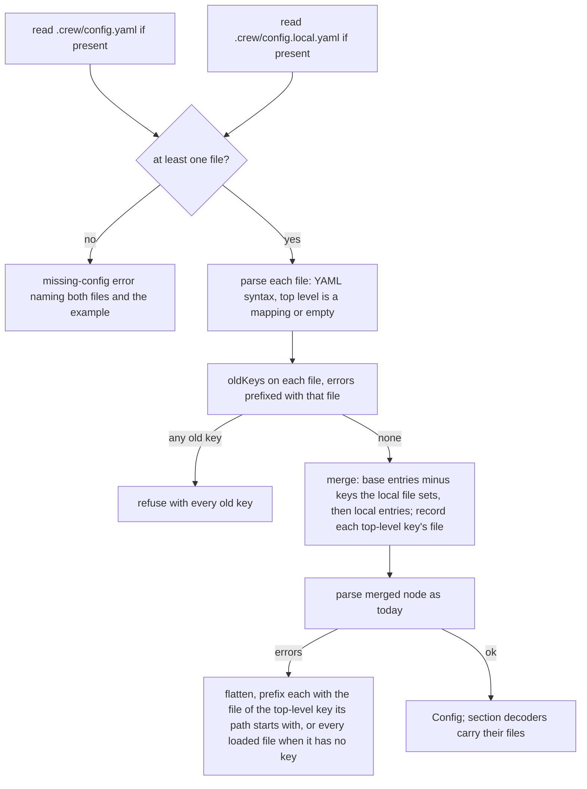

# .crew/config.local.yaml next to config.yaml - Plan

## Goal Capsule

- **Objective:** a boss keeps the repository's shared crew workflow in a committed file and their personal or machine-specific settings in a file git ignores, so a merged change to the shared rules reaches every boss without copying it by hand.
- **Means:** `config.Load` reads `.crew/config.yaml` and `.crew/config.local.yaml`, lets each top-level key of the local file replace that key whole, and names in every error the file its key came from (KTD1 to KTD5). This repository commits its own `.crew/config.yaml` again, and `.crew/config.example.yaml` becomes a commented reference of every key, kept complete by a test (KTD6 to KTD9).
- **Product authority:** the boss, through the brainstorm of #135. The Product Contract wins on behaviour; the KTDs win on mechanism.
- **Stop conditions:** stop and report when a settled Key Decision proves unworkable, or when a gate in the Verification Contract cannot pass without changing a requirement.
- **Execution profile:** one branch, units U1 to U5 in order, one pull request whose body carries `Closes #135` and the rollout step for the boss's ignored `.crew/config.yaml`.

---

## Product Contract

Product Contract preservation: changed: Dependencies / Assumptions — the rollout's failure mode is corrected (git overwrites the ignored file on pull instead of refusing it); the boss's step and every R and AE are unchanged from the body of issue #135.

### Summary

crew loads `.crew/config.yaml`, `.crew/config.local.yaml`, or both, and needs at least one. When both exist, each top-level key the local file sets replaces that whole key from `config.yaml`. This repository goes back to committing its own `.crew/config.yaml`. `.crew/config.example.yaml` becomes a reference that lists every key crew accepts, commented out, with what it does, how to fill it and its default.

### Problem Frame

Since #122, `.crew/config.yaml` is ignored by git, so each boss keeps their own copy, and crew's own rules are committed as `.crew/config.example.yaml`. The shared workflow and the personal settings live in one file. Every merged change to the shared rules has to be copied by hand into each boss's ignored copy, and #163 changed the example's rules again (triage became refinement).

The boss's own copy today differs from the example in two places: `poll_interval_seconds: 60` instead of 300, and a `board:` section the example lacks. Everything else is the shared workflow.

The example also does a second job badly. It is crew's own config, so it shows only the keys crew's rules use, and a user reading it to write their own config does not see the keys left out or their defaults.

### Key Decisions

- **A top-level key in the local file replaces the whole key.** `board:` in the local file replaces the board, `agents:` replaces every agent. Every section then comes from one file, so an error names that file, and the rule fits the boss's real overrides (a poll interval and a board). Changing one agent's model or bot means copying all of `agents:`. (session-settled: user-directed — chosen over a deep merge by key path and over replacing top-level keys while merging named items such as agents and rules one by one: simpler to explain, errors stay tied to one file, and a deep merge cannot remove a board column, rule or agent.) Governs R3, R4.
- **The local file may set any key.** It takes the same keys, schema and checks as `config.yaml`. The boss owns the machine, and whoever can edit the local file can edit `config.yaml` too, so a restriction would protect nothing. (session-settled: user-directed — chosen over allowing only personal keys and refusing a local `rules`, `checks` or `queues`: such a list would need upkeep as keys are added and would protect nothing.) Governs R4.
- **Either file may be missing, but not both.** A repository with only `config.local.yaml` runs from it alone, so a boss can run crew without committing any config. (session-settled: user-directed — chosen over requiring `config.yaml` and treating the local file as overrides only.) Governs R1, R2.
- **The boot line says `loading config` and names no file or key.** (session-settled: user-directed — chosen over a boot line that names the local file and the keys it replaces: the boss does not need to see where each key came from.) Governs R6.
- **This repository commits `.crew/config.yaml` again, and the example becomes a full reference.** (session-settled: user-directed — chosen over keeping crew's own config as the ignored example: the boss's personal settings move to `config.local.yaml`, and the example gets a job of its own.) Governs R9, R10, R11.
- **A test keeps the example complete.** Every key the schema defines appears in the example, so a new key cannot ship without its entry. The goal of an example with every key decays silently without one. Governs R12.

### Requirements

**Loading**

- R1. crew reads `.crew/config.yaml` and `.crew/config.local.yaml` from the repository root; each is optional, and at least one must exist.
- R2. When neither file exists, crew stops with the missing-config error, which names both files and still points to `.crew/config.example.yaml` in the crew repository.
- R3. When both exist, each top-level key set in `config.local.yaml` replaces the value of that key in `config.yaml`, whole; a key the local file leaves out keeps its value from `config.yaml`, and a key neither file sets keeps crew's default.
- R4. `config.local.yaml` accepts every key `config.yaml` accepts, and crew validates the combined config exactly as it validates a single `config.yaml` today.
- R5. An empty `config.local.yaml`, or one holding only comments, changes nothing.
- R6. The boot log's config line reads `loading config`, whichever files exist.

**Errors**

- R7. Every error about a key names the file the key came from, together with its key path and line, as errors name `config.yaml` today; an error about the combined config, such as an action naming an agent neither file defines, is reported at the key that refers to it, in that key's file.
- R8. The refusal of old keys (`legacy.go`) checks both files, and names the file of each old key it finds.

**This repository**

- R9. crew's own config is committed as `.crew/config.yaml`, carrying the rules the example carries today, and `.gitignore` stops ignoring `.crew/config.yaml`; `.crew/config.local.yaml` stays ignored.
- R10. `.crew/config.example.yaml` lists every key crew accepts, adapter keys included, each commented out with what it does, how to fill it and its default, and its comments explain `config.local.yaml` and how its keys replace those of `config.yaml`.
- R11. The tests that check crew's own config (its rules, bots, board and checks, and the refine prompt's agreement with `/cw-split-plan`) load the committed `.crew/config.yaml`, never a developer's `config.local.yaml`.
- R12. A test fails when a key the schema defines is missing from `.crew/config.example.yaml`.

**Docs**

- R13. The README describes both files, how their keys combine, that at least one is needed, and that users should have git ignore `config.local.yaml`; its table lists `.crew/config.yaml` as crew's own rules and `.crew/config.example.yaml` as the reference of every key.
- R14. The schema's description, the missing-config error and `AGENTS.md` name the right file for crew's own rules and for the reference, now that they are two files.

### Acceptance Examples

- AE1. **Covers R3.** **Given** `config.yaml` sets `poll_interval_seconds: 300`, a `rules:` section and no board, and `config.local.yaml` sets `poll_interval_seconds: 60` and a `board:` with six columns, **when** crew starts, **then** it polls every 60 seconds, runs the rules of `config.yaml` and shows the six columns.
- AE2. **Covers R3.** **Given** `config.yaml` defines agents `developer` and `product-manager`, and `config.local.yaml` sets `agents:` with only `developer`, **when** crew loads the config, **then** the only agent is the local `developer`, and an action of `config.yaml` that names `product-manager` is an error at that action's key in `config.yaml` (R7).
- AE3. **Covers R1.** **Given** only `config.local.yaml` exists, with a valid config, **when** crew starts, **then** it runs from that file alone.
- AE4. **Covers R2.** **Given** neither file exists, **when** crew starts, **then** it exits with code 2 and an error naming `.crew/config.yaml` and `.crew/config.local.yaml` that points to `.crew/config.example.yaml`.
- AE5. **Covers R7.** **Given** `config.local.yaml` has an unknown key `board_columns` on line 3, **when** crew loads the config, **then** the error names `.crew/config.local.yaml`, the key `board_columns` and line 3.
- AE6. **Covers R8.** **Given** `config.yaml` uses only current keys and `config.local.yaml` uses an old key, **when** crew loads the config, **then** crew refuses it, naming the old key, its replacement and `.crew/config.local.yaml`.
- AE7. **Covers R5.** **Given** `config.local.yaml` holds only comments, **when** crew loads the config, **then** the result is the same as with `config.yaml` alone.

### Scope Boundaries

- crew does not check whether git ignores `config.local.yaml`, nor warn when it is committed; the README advises ignoring it (R13).
- No merge below the top level: no key path override, no merging of agents, rules, checks, queues or the board item by item.
- No other config files: no user-wide config, no `--config` flag, no environment variable that picks a file.
- No boot line or other output that says which file a key came from (Key Decisions).
- Moving the boss's own poll interval and board out of the ignored `config.yaml` is the boss's own step, not this change's.

### Dependencies / Assumptions

- Rollout in this repository: the boss's main checkout holds an ignored `.crew/config.yaml` today. Once the change merges and `config.yaml` is tracked, git treats that ignored file as expendable, so a `git pull` there silently replaces it with the tracked `.crew/config.yaml`. The boss moves their personal settings (`poll_interval_seconds: 60` and the board) into `.crew/config.local.yaml` before pulling, or loses them. The pull request body states this step.
- Users who already commit `.crew/config.yaml`, as the README tells them to, see no change unless they add a local file.

### Sources / Research

- `internal/config/config.go` (`Load`, `parse`, `decodeDocument`): reads only `root/.crew/config.yaml` and wraps the whole joined error once with the file's path, so today only the first error line names the file.
- `internal/config/decode.go` (`keyError`, `decodeLeaf`, `bind`): every content error is `<path> (line N): <msg>`, and the section decoders adapters receive name no file at all.
- `internal/config/legacy.go` (`oldKeys`): the old-key refusal that runs on the YAML root before decoding.
- `internal/config/agents.go` (`agentsInUse`) and `internal/config/rules.go`: `agents: missing` and `rules: missing` are the only errors with no key behind them.
- `internal/app/app.go` (`Run`): prints the boot line `loading .crew/config.yaml` before `build`.
- `internal/config/config_example_test.go`: loads the example as crew's own config by symlinking it into a temporary root.
- `internal/config/schema_test.go`: `schemaWalk` gathers the schema's key paths with `config.AnyName` for user-chosen names; `TestExampleConfigNamesThePublishedSchema` checks the example's modeline.
- `schema/config.schema.json`: the key set R12 checks against, including the adapters' only key, `agents.*.harness.model` (the github adapter takes no key of its own). Its top level has `"required": ["rules"]`.
- `.gitignore`: ignores `.crew/config.yaml` and `*.local*`; `.crew/.gitignore` already says "config.yaml stays committed".
- `docs/solutions/tooling-decisions/codacy-lizard-and-golangci-lint-limits.md`: functions stay under 50 lines and cyclomatic complexity 15, tests included; split `Load` rather than grow it.

---

## Planning Contract

### Key Technical Decisions

- KTD1. **Merge at the YAML node level, then decode once.** `Load` parses each existing file into a `yaml.Node`, checks that each is a mapping (or empty), and builds one top-level mapping: `config.yaml`'s entries in file order, with every entry whose key the local file sets dropped, then the local file's entries. The merged node goes through today's `parse` unchanged, so R4's "validates the combined config exactly as today" holds by construction. A local key with an empty value (`board:`) replaces the key with nothing, which brings back crew's default for it. Duplicate top-level keys inside one file stay in the merged node, so the strict decoder still reports them.
- KTD2. **Each top-level key has one file, and an error takes the file of the top-level key its path starts with.** `keyError` returns a typed error that keeps its key path. After `parse`, `Load` flattens the joined error and prefixes each leaf with the file of the longest top-level key recorded at merge time that equals the path or is followed in it by `.` or `[`. Splitting on the first dot would be wrong: a top-level key may itself hold dots, such as a mistaken `agents.developer.harness.model:` in the local file. Because KTD1 moves whole top-level values, every line number inside an error belongs to that same file. Errors naming no key (`agents: missing`, `rules: missing`) name every file loaded. This instantiates the Key Decision on whole-key replacement (R3, R7).
- KTD3. **Errors name the file by its repo-relative path, on every line.** Each error line reads `.crew/config.local.yaml: board_columns (line 3): unknown key`. Today the absolute path appears once, before the first of the joined lines. With two files, a reader needs the file on each line. The relative path is shorter and is what the boss sees in the repository. Read and YAML syntax errors keep the operating system's full path, as today.
- KTD4. **The section decoders adapters receive name their file too.** `bind` takes the file of its section's top-level key and prefixes its errors with it, so an unknown key under `tracker:` or `agents.<name>.harness` names its file, as R7 asks of every error about a key. The registry's `tracker <name>: ` and `harness <name>: ` prefixes stay.
- KTD5. **Old keys are refused per file, before the merge.** `oldKeys` runs on each file's root, and its errors carry that file (R8). When either file has old keys, `Load` returns them all and decodes nothing, as today.
- KTD6. **The example is commented YAML whose prose uses `##`.** A config line is `# ` followed by YAML at its own indentation. A prose line starts with `##`. Removing one leading `#` and the space after it from each line, except the `# yaml-language-server:` modeline, gives a YAML document where prose is still comment. R12's test takes that document, walks the schema's key paths with `*` matching any user-chosen name, and fails on each one the example lacks. A second test loads that uncommented document as a `config.yaml` and expects it to load, so the sample stays a valid config. A third test checks that the example as committed sets no key, so copying it changes nothing.
- KTD7. **The example shows each user-named map by sample items holding every key.** One rule takes every rule key (`takes`, `queue`, `notify`, `labels` with all four states, `actions` with `agent`, `prompt` and `check` as a list), and its comments say the one-name form of `check` works too. Two agents show both harnesses, `claude` and `codex`, each with `model` and `bot`. The board shows a column of one label and a column of a list. This resolves the issue's deferred question on user-named items.
- KTD8. **The schema drops its top-level `"required": ["rules"]` and names both files.** Either file may now hold any subset of keys, so a local file with only `poll_interval_seconds` would be flagged by an editor. `Load` still reports `rules: missing` for the combined config. With that change, the same modeline suits `config.local.yaml`, and the README says so. This resolves the issue's deferred question on the modeline.
- KTD9. **crew's own config tests move to `config_own_test.go`, and the example's tests to `config_example_test.go`.** The own tests symlink only the committed `.crew/config.yaml` into a temporary root, so a developer's `config.local.yaml` never reaches them (R11). `TestExampleConfigNamesThePublishedSchema` checks the modeline of both files.

### High-Level Technical Design

How `Load` combines the two files and attributes errors:

### Assumptions

- Prose in the example is written with `##`, the convention Helm's values files use, so the uncommenting rule in KTD6 stays mechanical. A reader copying a key removes one `#` and its space.
- The error format changes from one absolute path before the first line to a relative path on every line (KTD3). Nothing outside crew parses these messages; the tests that cut the path off (`errLines` in `legacy_test.go`) change with it.
- Committing `.crew/config.yaml` changes nothing for crew's own runs on this repository's worktrees, since crew reads the config from the root it runs in.

### Risks

- A `git pull` in the boss's main checkout silently overwrites its ignored `.crew/config.yaml` with the tracked one, losing the personal poll interval and board. The pull request body gives the rollout step from Dependencies / Assumptions as a step to do before pulling, and says why.
- An open pull request or issue that edits `.crew/config.example.yaml` as crew's own rules (the bodies of #133 and #153 still name it) would edit the reference instead after this change. #152 and #166, the blockers refinement recorded, are closed, and their changes are already in the example this change moves. R12's test fails if a later schema key is missing from the example. Nothing to build; the pull request names the move.

---

## Implementation Units

### U1. Load both files, with each error naming its file

- **Goal:** `config.Load` reads either or both files, replaces top-level keys from the local file, and names the file in every error.
- **Requirements:** R1, R2, R3, R4, R5, R7, R8, R14 (the missing-config error). KTD1 to KTD5.
- **Dependencies:** none.
- **Files:** `internal/config/config.go`, `internal/config/decode.go`, `internal/config/legacy.go`, `internal/config/agents.go`, `internal/config/rules.go`, new `internal/config/files.go` (reading, merging and attributing), new `internal/config/config_local_test.go`, `internal/config/config_test.go`, `internal/config/legacy_test.go`.
- **Approach:**
  1. Reading: each file is optional; a read error other than not-found stops with its path. Neither file found is one error wrapping `fs.ErrNotExist`, naming both files and pointing to `.crew/config.example.yaml` in the crew repository (R2).
  2. Per file: YAML syntax and the mapping check of `decodeDocument` run before the merge, prefixed with that file. An empty or comment-only file has no content and merges as no keys (R5).
  3. `oldKeys` per file (KTD5), then the merge of KTD1, recording each top-level key's file.
  4. `keyError` and the non-type-error branch of `decodeLeaf` return a typed key error. After `parse`, attribute every leaf (KTD2, KTD3).
  5. `bind` receives the section's file and prefixes its own errors (KTD4).
  6. Update the package comment, `Config`'s comment and `Load`'s comment to name both files.
- **Patterns to follow:** `writeRoot`, `loadErr` and `testRejects` in `internal/config/config_test.go`; `named` and `entries` in `decode.go` for walking mapping nodes.
- **Test scenarios:**
  - Covers AE1. `config.yaml` with `poll_interval_seconds: 300` and rules, local with `poll_interval_seconds: 60` and a six-column board: `PollInterval` is 60s, the rules are `config.yaml`'s, `Board` has the six columns and `BoardWritten` is true.
  - Covers AE2. `config.yaml` with agents `developer` and `product-manager` and an action naming `product-manager`, local `agents:` with only `developer`: the error names `.crew/config.yaml`, the action's `agent` key path and its line in `config.yaml`.
  - Covers AE3. Only `config.local.yaml`, valid: `Load` succeeds with its rules.
  - Covers AE4 (config level). Neither file: the error is `fs.ErrNotExist`, names both files and `.crew/config.example.yaml`.
  - Covers AE5. Local with `board_columns` on line 3: the error reads `.crew/config.local.yaml: board_columns (line 3): unknown key`.
  - Covers AE6. Clean `config.yaml`, local with `workflow:`: refused, the line names `.crew/config.local.yaml`, `workflow` and its replacement.
  - Old keys in both files: both are reported, each with its own file.
  - Covers AE7. A comment-only local file, and an empty one: the `Config` equals the one from `config.yaml` alone.
  - A key the local file leaves out keeps `config.yaml`'s value; a key neither sets keeps its default (`max_parallel_issues` 2).
  - Local `board:` with no value replaces the written board with the default one (`BoardWritten` false).
  - Two errors from two files in one load: each line names its own file.
  - A local file with the dotted top-level key `agents.developer.harness.model: x`, while `config.yaml` sets `agents:`: the unknown-key error names `.crew/config.local.yaml` and the local line.
  - `rules: missing` when neither file has rules names both files.
  - A YAML syntax error in the local file names the local file; a local file whose top level is a list is refused naming it.
  - A section decoder's unknown key under a local `tracker:` names `.crew/config.local.yaml` (extend `TestSectionDecodersAreStrict` or add beside it).
  - Existing tests: `TestLoadMissingFileSaysWhereItLooked` expects both names; `errLines` in `legacy_test.go` strips the file from every line.
- **Verification:** every scenario passes, and the whole `internal/config` suite passes with the new error format.

### U2. The boot line says `loading config`

- **Goal:** the boot log's config line no longer names a file.
- **Requirements:** R6, AE3 and AE4 at the app level.
- **Dependencies:** U1.
- **Files:** `internal/app/app.go`, `internal/app/app_boot_test.go`, `internal/app/app_stop_test.go`, `internal/app/app_startup_test.go`, `internal/app/app_test.go` (a helper that writes `config.local.yaml` when a test needs it), `cmd/crew/main.go` (package comment).
- **Approach:** change the boot step's text and every test that expects the old line.
- **Patterns to follow:** the existing boot-line assertions with `unstamped` in `internal/app/app_startup_test.go`.
- **Test scenarios:**
  - The boot output starts with `loading config` with only `config.yaml`, with only `config.local.yaml`, and with both.
  - Covers AE4. A root with neither file: `Run` returns `ExitConfig` (2), and stderr names both files and the example.
  - Covers AE3. A root with only a valid `config.local.yaml` gets past the config step.
- **Verification:** `internal/app` passes and no test or code still prints `loading .crew/config.yaml`.

### U3. This repository commits its own `.crew/config.yaml`

- **Goal:** crew's own rules live in a tracked `.crew/config.yaml`, and the tests of crew's own config load it alone.
- **Requirements:** R9, R11. KTD9.
- **Dependencies:** U1.
- **Files:** `.crew/config.yaml` (new, from today's `.crew/config.example.yaml`), `.gitignore`, `.crew/.gitignore`, `internal/config/config_own_test.go` (renamed from `config_example_test.go`), `internal/config/schema_test.go`.
- **Approach:**
  1. Create `.crew/config.yaml` with today's example content, so git history shows the move. Its opening comments stay about crew's own rules.
  2. Remove `.crew/config.yaml` from `.gitignore`. Name `config.local.yaml` in `.crew/.gitignore` with a comment, though `*.local*` already ignores it.
  3. Rename the own-config tests and point `loadOwn` at `.crew/config.yaml`.
- **Test scenarios:**
  - Every existing own-config test (`TestTheRepositorysOwnConfigLoads`, the refine prompt's tests) passes against `.crew/config.yaml`.
  - The modeline test checks `.crew/config.yaml`.
- **Verification:** `git check-ignore .crew/config.yaml` reports nothing; `git check-ignore .crew/config.local.yaml` reports it ignored; the own-config tests pass.

### U4. The example becomes a reference of every key

- **Goal:** `.crew/config.example.yaml` lists every key crew accepts, commented out, with what it does, how to fill it and its default, and a test keeps it complete.
- **Requirements:** R10, R12. KTD6, KTD7, KTD8.
- **Dependencies:** U3.
- **Files:** `.crew/config.example.yaml` (rewritten), `schema/config.schema.json`, `internal/config/config_example_test.go` (new content), `internal/config/schema_test.go` (shares `schemaWalk`).
- **Approach:**
  1. Rewrite the example per KTD6 and KTD7, keeping the modeline first. Opening prose explains the two files, whole-key replacement, that at least one is needed, and that `config.local.yaml` should stay ignored by git.
  2. Take each key's description and default from the schema, so the two agree.
  3. Drop the schema's top-level `required` and update its title and description (KTD8, R14).
  4. Add the three tests of KTD6.
- **Execution note:** write the completeness test first and watch it fail against the U3 copy of the example, so it is known to catch a missing key.
- **Test scenarios:**
  - Every schema key path, with `*` for names, is present in the uncommented example.
  - A synthetic example missing one key (such as `usage_in_status`) makes the matcher report it, through a small table test of the matcher.
  - The uncommented example loads through `config.Load` as a `config.yaml`.
  - The example as committed parses to a document with no keys.
  - The example's first line is the modeline.
- **Verification:** the example tests pass, and `TestSchemaAndConfigTakeTheSameKeys` still passes after the schema edit.

### U5. Docs name the right file

- **Goal:** the README and the agent docs describe both files and name `.crew/config.yaml` as crew's own rules and the example as the reference.
- **Requirements:** R13, R14.
- **Dependencies:** U3, U4.
- **Files:** `README.md`, `AGENTS.md`, `.agents/skills/cw-rank-blockers/SKILL.md`.
- **Approach:**
  1. README Quick start: commit `.crew/config.yaml`, keep personal settings in `.crew/config.local.yaml`, which git should ignore. Each top-level key of the local file replaces that key whole; at least one file must exist; the example lists every key; the schema's modeline works in both files.
  2. README Checks: "this repository's example config" becomes "this repository's own config".
  3. README table: `.crew/config.yaml` is crew's own rules; `.crew/config.example.yaml` is the reference of every key; the schema row names both files.
  4. `AGENTS.md`: the `internal/config` line names both files; the `cw-split-plan` and `cw-rank-blockers` lines say the refine prompt is in `.crew/config.yaml`, and `config_example_test.go` becomes `config_own_test.go`.
  5. `cw-rank-blockers/SKILL.md`: the refine prompt is in `.crew/config.yaml`.
- **Test expectation:** none -- documentation only; the docs-verification of the review checks it.
- **Verification:** `git grep config.example` outside `docs/plans` and `docs/ideation` points only at the reference role.

---

## Verification Contract

| Gate | Command | Applies to |
|---|---|---|
| Format | `gofmt -l cmd internal tools` prints nothing | all |
| Vet | `go vet ./...` | all |
| Lint and layering | `go run github.com/golangci/golangci-lint/v2/cmd/golangci-lint@v2.14.0 run` | all |
| Tests | `go test -race ./...` | all |
| Coverage | `go test -race -covermode=atomic -coverpkg=./... -coverprofile=coverage.out ./...`, then `go run github.com/vladopajic/go-test-coverage/v2@v2.19.0 --config=.testcoverage.yml` (total at least 90%) | all |
| Changed lines | `git diff -U0 origin/main...HEAD \| go run ./tools/diffcover -profile coverage.out` (at least 90%) | all |
| Vulnerabilities | `go run golang.org/x/vuln/cmd/govulncheck@v1.8.0 ./...` | all |
| Codacy | `pnpm exec codacy-analysis analyze --install-dependencies`, no finding in changed files | U1, U2, U4 |
| Smoke | a built `crew` in a scratch repository with only `config.local.yaml` prints `loading config` and gets past it; with neither file it exits 2 naming both files | U1, U2 |

---

## Definition of Done

- U1 to U5 are in, and every gate above passes.
- `.crew/config.yaml` is tracked with crew's own rules, and `.crew/config.example.yaml` sets no key.
- No code, test or doc still calls the example crew's own rules, and nothing prints `loading .crew/config.yaml`.
- The pull request body carries `Closes #135`, the rollout step for the boss's ignored `.crew/config.yaml` as a step to do before pulling (a pull overwrites that file), and the note that later edits to crew's own rules go to `.crew/config.yaml`.
- No abandoned attempt's code is left in the diff.
