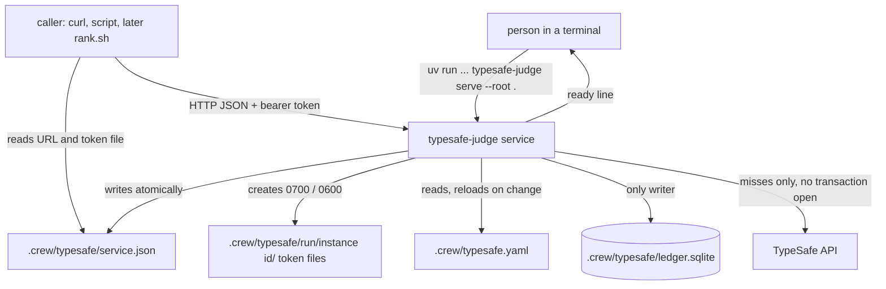
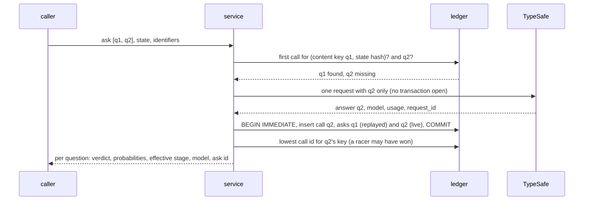
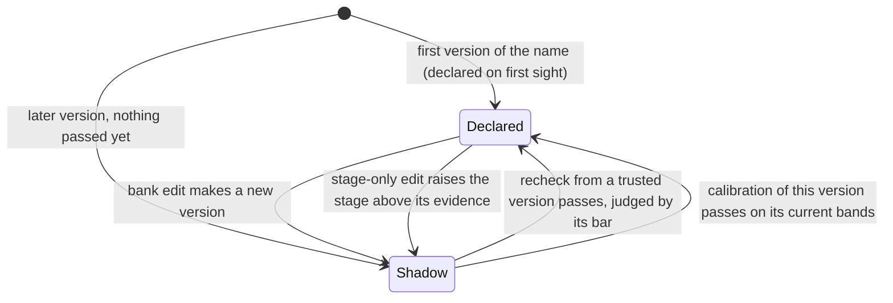

# TypeSafe judge service with its question bank and decision ledger - Plan

## Goal Capsule

- **Objective:** a person can start a local judge for this repository and ask it named TypeSafe questions. The same input gets the same recorded answer, and every ask, decision and outcome stays on record. A changed question gains autonomy only through a recheck or a held-out calibration.
- **Means:** a Python service, `typesafe-judge`, in a uv project at `typesafe/`. It serves a stdlib HTTP API on `127.0.0.1`, reads its bank from `.crew/typesafe.yaml` and writes an append-only SQLite ledger in `.crew/typesafe/` (KTD1, KTD5, KTD6, KTD18).
- **Product authority:** the repository owner, through the #188 brainstorm and planning session, recorded in issue #203. The Product Contract wins on behaviour. The KTDs below win on mechanism within it.
- **Open blockers:** none.
- **Stop conditions:** stop and report if a requirement proves infeasible, if a settled Key Decision proves unworkable, or if meeting a requirement would need a change to crew's Go code.
- **Execution profile:** one branch and one pull request whose body carries `Closes #203`. Units U1 to U8 land in order. crew's Go code (`cmd/`, `internal/`) does not change. The `judge` port, the adapter and crew starting the service are #204. `cw-rank-blockers` through the judge is #205.
- **Who finishes:** the implementing agent opens the pull request. The repository owner merges it, then adds the `python` job to the `checks` ruleset with `bootstrap.sh --checks` in `thatsnotmynameio/.github`. The pull request body names that step.

---

## Product Contract

Product Contract from issue #203, part 1 of 3 of #188. Product Contract preservation: Product Contract unchanged. Gaps it left open are recorded under the Planning Contract's Assumptions. The Key Decisions' links to R21 and R23 point at requirements of #205 and #204, which this part does not carry.

### Summary

A local Python service, `typesafe-judge`, that answers named questions from a bank in `.crew/`, replays recorded answers from an append-only SQLite ledger, records decisions and outcomes, and runs rechecks and calibrations. A person starts it by hand and finds it by its address file; crew does not start it yet.

### Problem Frame

Jev is not bit-reproducible. Identical requests keep the same winning answer, but probabilities drift by 0.01 to 0.03, and the TypeSafe docs offer no cache, seed or idempotency key. A threshold can therefore flip on a rerun of the same input.

Nothing records the judgments crew's tooling already asks. `cw-rank-blockers` calls Jev with curl and keeps nothing. `cw-split-plan` writes its shadow answers into an issue body, and it asks `jev-latest` instead of a pinned version. Without a record of answers next to real outcomes, no threshold can be chosen on held-out data as TypeSafe recommends, no change to a question or model can be checked before it ships, and no judgment can safely move from shadow to acting.

Both TypeSafe ideation documents merged on 2026-10-05 reached the same piece independently: a ledger that records every call and replays it.

### Key Decisions

- **The ledger is the core of crew's TypeSafe service, not a separate tool.** Python is used only because the TypeSafe SDK is Python. (session-settled: user-directed — chosen over a ledger library for the `cw-*` skills or for the ideated ce-plan/ce-work apps.) Governs R10.
- **The service is a local, long-running process outside any session.** It is the only writer of the ledger, and callers reach it over the local network. (session-settled: user-directed — chosen over a command each caller starts per call, which would inherit the calling session's sandbox.) Governs R10, R11, R13.
- **Callers ask named questions with a state; the service owns the questions.** (session-settled: user-directed — chosen over callers sending full TypeSafe requests: keeps questions and thresholds in one reviewable place.) Governs R1, R6.
- **The question bank belongs to the user's repository.** (session-settled: user-directed — chosen over a bank built into crew: each repository writes and calibrates its own questions.) Governs R1, R2.
- **The bank is the TypeSafe adapter's own file in `.crew/`, not part of `.crew/config.yaml`.** `config.yaml` carries only the generic `judge` section; the bank's format is TypeSafe's. (session-settled: user-approved — proposed as a separate file and confirmed in the brainstorm synthesis; the reason was restated when the `judge` port moved into scope.) Governs R1.
- **The service is agnostic.** `cw-rank-blockers` is plugged in only to test it; each new consumer brings its questions and its own outcome script, and the service's code never changes for one. (session-settled: user-directed — "o serviço de app não pode ter que mudar código python toda hora pra cada coisa nova".) Governs R3, R6, R16, R21.
- **A repeated input returns the first recorded answer.** TypeSafe's cookbooks cache by request and force a fresh draw only on purpose, and its guidance absorbs jitter with decision bands rather than re-asking. (session-settled: user-approved — the user asked for TypeSafe's recommendation and accepted it.) Governs R7.
- **A decision ledger, not an answer cache.** It keeps every call, the caller's decision and the outcome, and each question has a stage (shadow, confirm, act). (session-settled: user-directed — chosen over an answer cache, and over an append-only answer log without decisions and stages, which the agent recommended.) Governs R5, R12, R15, R19.
- **Every call is a record, replays included.** (session-settled: user-approved — confirmed in the planning synthesis.) Governs R12, R15.
- **Changing a band makes a new version.** (session-settled: user-approved — confirmed in the planning synthesis.) Governs R4, R5.
- **Callers attach their own identifiers outside the state.** TypeSafe's guidance keeps only what the judgment needs in the state, yet calibration must tie answers to outcomes and split by group. (session-settled: user-approved — explained against the docs and confirmed in the planning synthesis.) Governs R6, R16, R18.
- **Verdict bands, outcomes, recheck and calibration are all in the first version.** (session-settled: user-directed — chosen over record and replay alone.) Governs R8, R16, R17, R18.
- **SQLite, one ledger per repository, in `.crew/`.** SQLite answers recheck and calibration queries with no extra dependency and shortens a later move to a shared database. Sharing across machines must be documented as needed evolution. (session-settled: user-directed — chosen over JSONL, DuckDB and Parquet, and over a ledger committed to git or one with label export; `.crew/` reconfirmed over the git common dir once the service became the only writer.) Governs R11.
- **This repository first.** In this work the adapter runs the service from crew's repository; packaging it for other repositories comes with #194. (session-settled: user-directed — chosen over shipping an installable app now.) Governs R10, R23.

### Requirements

**Question bank**

- R1. Questions live in a bank file in the repository's `.crew/`, edited by hand and reviewed in pull requests like the config, and separate from `.crew/config.yaml`.
- R2. Each question declares its name, its primitive (Noul, Choice or Score) with instructions and criteria, its pinned model version, its verdict bands, its conservative default, its stage (shadow, confirm or act), and the evidence bar it must pass to move up a stage.
- R3. A new use of TypeSafe needs only new questions in the bank and the consumer's own scripts: the service holds no code specific to any consumer.
- R4. Any change to a question's content, pinned model or bands makes a new version of that question.
- R5. A later version of a question is treated as shadow, whatever stage the bank declares, until a recheck against the last version that held its declared stage passes, or a calibration of the version itself passes its evidence bar; the first version of a question keeps the stage the bank declares.

**Asking**

- R6. A caller asks one or more questions by name over one state, with an optional object of its own identifiers, and gets for each question the verdict, the raw probabilities, the effective stage, the model that answered, and an ask id to attach a decision or an outcome later.
- R7. When the same question content, pinned model and state were asked before, the service returns the first recorded answer without calling TypeSafe; a caller can ask explicitly for a fresh answer, which is recorded and returned without changing which answer later replays serve.
- R8. Verdicts are computed when read, from the recorded probabilities and the question's current bands.
- R9. Without a TypeSafe key, or when TypeSafe fails, the service still serves recorded answers, and for an input never asked it answers "cannot judge" with the reason, the attempts made and the question's conservative default, without failing the caller.
- R10. Callers reach the service over the local network with JSON in and JSON out, so a shell skill, an agent session and, later, crew's engine use the same entry point.

**Ledger**

- R11. Each repository has one SQLite ledger in the `.crew/` of the checkout crew runs in, kept out of git like `.crew/logs/` and written only by the service.
- R12. The ledger only grows: every ask is recorded, replays and "cannot judge" included, and every live answer is recorded with the question version, the model asked and the model that answered, the state, every probability, the usage, the request id and the time.
- R13. Callers asking at the same time, such as parallel crew sessions in different worktrees, lose no records.

**Decisions and outcomes**

- R14. Every ask links to the question version and state that produced it, so any later record can be traced back to the exact judgment.
- R15. A caller records what it did with an answer (acted, sent to a person, or ignored because the question is in shadow), linked to its own ask.
- R16. A caller records the real outcome later as a value with a source and a strength (strong or weak), linked to an ask or matched by its own identifiers; the service reads no external source to find outcomes.

**Recheck and calibration**

- R17. A recheck evaluates the recorded asks of a question's earlier version under its current version and lists the decisions that would flip; a band change needs no TypeSafe call, and a content or model change asks live and records the new answers.
- R18. Calibration takes a question's labelled asks, splits them into dev and held-out by a group the caller names, proposes bands from dev, and reports their held-out performance against the question's evidence bar, or reports that the labels are insufficient.
- R19. The service reports whether a question passes the bar for its next stage, and never changes a stage itself: moving a question up is a person's edit to the bank, reviewed like any change.

**crew with and without the judge**

- R24. A person can find the service crew started, or start one by hand for a repository, and get its address, to use it outside crew.

### Acceptance Examples

- AE1. Replay
  - **Covers R7, R12.**
  - **Given** the ledger holds an answer to question `issue_needs_candidate` on `jev-1.13.0` for state S.
  - **When** a caller asks `issue_needs_candidate` with state S again.
  - **Then** it gets the recorded answer marked as replayed, no TypeSafe request is made, and a new ask record points at the recorded answer.
- AE2. Band change
  - **Covers R4, R8, R17.**
  - **Given** 50 recorded answers to a question.
  - **When** its yes band moves from 0.70 to 0.60 and a recheck runs.
  - **Then** the recheck lists the asks whose verdict flips, without any TypeSafe request.
- AE3. No key
  - **Covers R9.**
  - **Given** the service runs without `TYPESAFE_API_KEY`.
  - **When** a caller asks one recorded input and one input never asked.
  - **Then** the first gets its recorded answer, and the second gets "cannot judge" with the reason `no key` and the question's conservative default; neither call fails.
- AE4. Edited question
  - **Covers R4, R5, R19.**
  - **Given** a question is declared at stage act.
  - **When** its instructions are edited.
  - **Then** answers to the new version report the effective stage shadow until a recheck passes, and the bank file is not changed by the service.
- AE5. Parallel sessions
  - **Covers R11, R13.**
  - **Given** two crew sessions in two worktrees of one repository.
  - **When** both ask at the same moment.
  - **Then** both asks are in the repository's single ledger.
- AE6. Calibration
  - **Covers R16, R18, R19.**
  - **Given** a question with labelled asks.
  - **When** calibration runs.
  - **Then** it reports proposed bands and their held-out result against the question's bar, or that the labels are insufficient, and the bank is unchanged.
- AE7. New consumer
  - **Covers R3.**
  - **Given** a new question added to the bank.
  - **When** a caller asks it by name.
  - **Then** it is answered and recorded with no change to the service's code.
- AE8. Partly recorded call
  - **Covers R6, R7.**
  - **Given** the ledger holds an answer to `issue_needs_candidate` for state S but none to `candidate_needs_issue`.
  - **When** a caller asks both over S in one call.
  - **Then** the first is replayed, only the second goes to TypeSafe, and both come back in one response.

### Success Criteria

- Running `cw-rank-blockers` twice on the same issue under crew gives the same lists, and the second run makes no TypeSafe request.
- After `cw-rank-blockers` has run on real issues and refinement has registered links, calibration produces a held-out report for its questions, or says the labels are insufficient and how many more each side needs.

### Scope Boundaries

**Deferred for later**

- crew's engine asking questions, and packaging and installing the service for other repositories (#194).
- Rules consuming answers, verdicts or stages (#195).
- Migrating `cw-split-plan` and any other consumer beyond `cw-rank-blockers`.
- Sharing the ledger across machines or clones, or exporting labels to commit them.
- Labelling asks by hand.

**Outside this product's identity**

- A proxy for raw TypeSafe requests: callers ask named questions only.
- A general LLM gateway: the judge answers typed judgments and nothing else.
- Deciding for the caller: the service reports verdicts, stages and evidence, and the caller acts.

**Considered and not built**

- Restarting the service when it dies mid-run. A dead service makes each caller fail loudly (`cw-rank-blockers` prints its failure line), which a person sees at once; evidence of frequent crashes would change this.
- Running `rank_test.sh` in CI. It stays a by-hand test as today; the service's own tests carry the request, retry and replay cases it loses.
- A JSON schema for the bank file. The service validates the bank strictly on load; editor completion can follow if hand edits prove error-prone.
- A configurable Python project directory in the `judge` section. Nothing in this work runs the service from anywhere but `<root>/typesafe`; #194's packaging decides where it lives for other repositories.

#### Deferred to Follow-Up Work

- The stale comment in `.crew/.gitignore` ("config.yaml stays committed") is out of this diff unless the unit editing that file fixes it in passing.

The other parts of #188, built in their own issues: "crew starts the judge when a repository enables it" and "cw-rank-blockers asks Jev through the judge".

### Dependencies / Assumptions

- `typesafe-sdk==0.7.2` and a `TYPESAFE_API_KEY` in crew's environment for live calls; the SDK broke compatibility in 0.6.0 and 0.7.0, so it is pinned exactly.
- `jev-1.13.0` is the current pinned version; `jev-latest` and `jev-preview` both point to it today.
- `cw-rank-blockers` outcomes are noisy and biased: a `blocked_by` link is a positive, a pair refinement saw without linking is only a weak negative, and refinement saw `rank.sh`'s top five, so labels favour what Jev already ranked high.
- With a local ledger, the evidence that justifies a stage change stays on one machine and does not travel with the commit that changes the stage.
- Ledger volume depends on how often `cw-rank-blockers` runs: the refinement prompt does not call it yet.

### Outstanding Questions

**Deferred to Planning**

None remain; the Planning Contract resolves each one the brainstorm deferred.

### Sources / Research

Split from #188.

- `docs/ideation/2026-10-05-typesafe-ce-plan-ideation.html`, idea 2 (judgment cassette), and `docs/ideation/2026-10-05-typesafe-ce-work-python-ideation.html`, ideas 1 (ledger and replay) and 7 (gates earn autonomy).
- TypeSafe docs: [Models](https://docs.typesafe.ai/models.md) (pin the version id when thresholds were tuned against it), [API reference](https://docs.typesafe.ai/api.md), [Python SDK responses](https://docs.typesafe.ai/sdk/python/api/types/responses.md) (`model`, `usage`, `request_id`), [self-consistency: nouls](https://docs.typesafe.ai/cookbooks/consistency_noul_cookbook.md) (bands absorb jitter), [autoresearch feature discovery](https://docs.typesafe.ai/cookbooks/autoresearch_feature_discovery.md) (responses cached by call; 1,200 dev and 800 held-out rows).
- `.agents/skills/cw-rank-blockers/rank.sh`: curl at line 131, `jev-1.13.0` at line 22, one request per pair asking both directions at lines 89-117; `docs/plans/2026-10-05-1616-feat-rank-blockers-skill-plan.md` KTD3 (both directions in one request, measured 0.933 in #149).
- `.agents/skills/cw-split-plan/SKILL.md`: shadow answers in the parent issue's split record (lines 89-145), model `jev-latest` (line 91).
- `internal/adapter/codex/gitdirs.go`, `internal/adapter/codex/command.go:41-46`: Codex sessions write only the worktree and the git dirs, which is why the ledger's only writer is a service outside the sessions.
- `.crew/config.example.yaml:99`: refinement records dependencies through the `blocked_by` endpoint.

---

## Planning Contract

KTD numbers follow #188's Planning Contract so the three parts can cite one another. KTD2, KTD3, KTD4 and KTD16 belong to #204 and #205 and are not part of this plan. KTD17 to KTD20 are new here.

### Key Technical Decisions

- KTD1. **One stdlib HTTP server on `127.0.0.1`, guarded by two per-start bearer tokens kept in files.**
  - **Server:** `ThreadingHTTPServer` on port 0, so the OS picks the port. JSON bodies, no web framework, because a framework would add dependencies for a handful of endpoints.
  - **Instance files:** on start the service creates `.crew/typesafe/run/<instance id>/` (0700). It holds an *ask* token file and an *admin* token file (0600). It then writes `.crew/typesafe/service.json` atomically (temp file plus `os.replace`) with the instance id, the pid, the URL and both token-file paths. It prints one JSON ready line to stdout with the same fields, and nothing else ever goes to stdout. #204's adapter will read that line.
  - **Token scopes:** the ask token allows health, the question listing, asking, looking up asks and recording a decision. The admin token also allows outcomes, rechecks, calibration and the stage report.
  - **Request checks:** the token is checked in constant time before the body is read. A `Host` header that is not loopback is refused. A body above 1 MiB gets 413. Connections time out.
  - **Tokens live only in files.** They never appear in an environment variable, an argument, a log or a response, because the Codex adapter turns session environment into command-line arguments (`internal/adapter/codex/command.go`).
  - **Tokens inside the repository:** `internal/bots/act.go` refuses to keep bot tokens in a directory inside the repository. The judge differs for two reasons. Its tokens are worthless once the instance stops and reach only a loopback service. Its directory is 0700 and ignored by git (U1).
  - **Limit of the token split:** it keeps a session that follows its prompt from writing labels. It does not stop a same-user process that reads the admin file on purpose (Risks).
  - Governs R10, R16, R24.
- KTD5. **The Python project is a uv project at `typesafe/` with a src layout.**
  - **Toolchain:** Python 3.14 and the `uv_build` backend, with `uv.lock` committed.
  - **uv settings:** `[tool.uv] required-version` is a range (`>=0.12.10,<0.13`), because Dependabot fails on an exact uv mismatch. `python-preference = "only-managed"`, because the python.org 3.14 installers for macOS link SQLite 3.50.4, below KTD6's floor, while uv's managed CPython bundles 3.53.
  - **Runtime dependencies, pinned exactly:** `typesafe-sdk==0.7.2`, plus `pydantic`, `pyyaml` and `rfc8785`. Pydantic is declared directly because the bank models import it; today it only arrives through the SDK.
  - **Dev dependencies:** `ruff`, `mypy` (strict, with the pydantic plugin), `types-PyYAML` (PyYAML ships no type information), `pytest`, `coverage`, `hypothesis`, `diff-cover`, `pip-audit` and `lizard`.
  - **Entry point:** `typesafe-judge`, parsed with argparse.
  - The repository root does not become a Python project.
- KTD6. **The ledger uses STRICT tables, append-only triggers, `user_version` migrations and WAL.**
  - **Connections:** one per thread, opened with `autocommit=True`, `busy_timeout` 30 s and `synchronous=FULL`. In that mode `commit()`, `rollback()` and `with con:` do nothing, so every write transaction runs `BEGIN IMMEDIATE` and `COMMIT` or `ROLLBACK` as SQL. No transaction stays open across a TypeSafe call.
  - **Refusals:** the service refuses a ledger whose `user_version` is newer than the code knows. It also refuses SQLite older than 3.51.3, the release that fixed WAL-reset corruption.
  - **File and permissions:** the ledger is `.crew/typesafe/ledger.sqlite`, in a 0700 directory. The service creates the file 0600 before SQLite opens it, and tightens a directory that already exists, as `internal/engine/paths.go` does for `.crew/logs/`.
  - **Tables:** states (stored once per hash), question versions (full definition, recorded the first time a bank load holds them), stage observations (the declared stage each version had at each bank load and reload where it changed), calls (live answers with the raw response, `model`, `usage` and `request_id`), asks (one per question per caller request, pointing at the serving call or at a "cannot judge" reason, with the caller's identifiers), decisions, outcomes, rechecks and calibrations.
  - **Append-only:** updates and deletes raise.
  - Governs R11, R12, R13, R14.
- KTD7. **Keys come from what is sent.**
  - **Content key:** `sha256` of a domain prefix plus the RFC 8785 form of `{model, question in the SDK's wire form}`, where the wire form is `model_dump(mode="json")` of the SDK's own question object.
  - **Version id:** the content key plus the bands, the default and the bar. The stage is not part of it: a stage-only edit keeps the version and is tracked through stage observations (KTD6, KTD11).
  - **Key stability:** the SDK's wire form can change with an SDK release, which would turn every question into a new version. Golden keys for fixed questions make such a bump fail CI in its own Dependabot pull request.
  - **Replay key:** the content key plus the state's canonical hash. Caller identifiers and bands never enter it.
  - **States:** a state must be JSON without floats and without integers outside ±(2^53−1), the range `rfc8785` accepts. Python's `json` reads `1.0` as a float, so a state holding `1.0` is refused with a message that says why.
  - **Identifiers:** a flat object of strings and integers, validated the same way.
  - Governs R4, R7.
- KTD8. **Replay serves the first call per replay key, and misses go out together.**
  - **Per request:** the service records one ask per question. Recorded answers come from the lowest call id. Questions without one go out in one SDK request per pinned model, so a pair of questions over one state stays one TypeSafe request.
  - **Recording:** each SDK request's call and its asks are recorded in one transaction as soon as it returns.
  - **Races:** a duplicate call that raced is recorded too. After its commit, a plain ask is answered with the lowest call id for its key, so every racer gets the answer later replays serve.
  - **Fresh asks:** `fresh: true` sends every named question live and returns its own new call. A plain ask afterwards still replays the first call.
  - TypeSafe documents that questions in one request do not see each other's answers, which makes per-question replay sound.
  - Governs R6, R7, R12.
- KTD9. **Verdicts depend on the primitive.**
  - **Noul:** `yes_at` and `no_at`. At or above `yes_at` the verdict is yes, at or below `no_at` it is no, and between them it is uncertain.
  - **Choice and Score:** a confidence floor. At or above the floor the verdict is the chosen option, or for a Score the most likely level (the argmax of its probabilities, the level TypeSafe's confidence is measured around). Below the floor it is uncertain.
  - **Bands:** read from the current bank on every read.
  - Governs R2, R8.
- KTD10. **Retries live in the service.**
  - **Client settings:** a 60-second timeout on each connect and read, and `RetryPolicy(max_retries=2, timeout=130.0)`. That gives three attempts on 408, 429, 5xx, connection errors and timeouts, and stops instead of sleeping through a long `Retry-After`. The SDK's default 30-second budget would stop after one timed-out attempt.
  - **Longest ask:** an ask that reaches TypeSafe answers within about 190 seconds. #205's curl budget is set against this figure.
  - **Attempts:** the SDK does not report them. The service counts them through an event hook on the `httpx2` client it hands the SDK.
  - **Failure reasons:** every failure maps to one reason from a fixed vocabulary, `no key`, `HTTP <status>`, `timeout`, `unreachable` or `invalid response`, plus the attempt count.
  - **Fresh asks without an answer:** a fresh ask with no key, or one whose call fails, answers "cannot judge" with `recorded_answer_exists: true` when a recorded answer exists. It never quietly serves a replay in its place.
  - **Logging:** at start the service sets the SDK's logger to INFO or above itself, whatever `TYPESAFE_LOG_LEVEL` it inherits, because debug logs request bodies. The service never logs states or request bodies itself.
  - Governs R9.
- KTD11. **A version's effective stage is earned by a recheck or a calibration.**
  - **Stage order:** shadow, then confirm, then act.
  - **Versions are seen at load:** every bank load and reload records each version it holds, and its declared stage when that changed (KTD6). A version edited before anyone asked it is therefore already a later version.
  - **When a version keeps its declared stage:**
    - it is the first version of its question name the ledger recorded, and its declared stage has not risen since it was first recorded (listed as "declared on first sight");
    - or a passing recheck to it is recorded from a *trusted* version, for a stage at or above the one it now declares;
    - or a calibration of the version itself is recorded passing its bar (KTD12), for a stage at or above the one it now declares.
  - **Otherwise** its effective stage is shadow. A stage-only edit that raises a version's stage therefore needs new evidence for the new stage.
  - **Trusted version:** the latest earlier version whose effective stage, under the last declared stage the ledger recorded for it, was at or above the stage the new version declares. A version cannot borrow trust from a lower stage, so a near-identical edit cannot lift a shadow question to act. Comparing against the last trusted version, not the version just before, stops a trivial follow-up edit from skipping the check.
  - **Recheck scope:** a recheck takes the distinct states the earlier version answered. A band-only change recomputes verdicts from stored probabilities. A content or model change asks live, and each call is recorded as it lands, so a rerun replays what a stopped recheck already paid for.
  - **Flips:** a flip is any change of verdict for a distinct state, uncertain included. Flips are reported by kind, with any decisions on the flipped asks listed beside them.
  - **When a recheck passes:** it is judged by the trusted version's bar, so an edit cannot loosen its own gate. It passes only with a flip rate at or under `max_flip_rate`, at least `min_examples` states compared, and no state left as "cannot judge". It records the stage it was run for. A recheck that fails is still recorded, as `insufficient`, `incomplete` or `failed`, with its counts.
  - Governs R5, R17, R19.
- KTD12. **Calibration counts distinct states, splits by group and selects on dev only.**
  - **Unit:** one row per distinct state of the version's content key, using the first call's probabilities.
  - **Labels:** they join by question name and state hash, so they carry across versions whose primitive and option or level list equal those of the version the outcome matched. Other labels are excluded and counted, because a reordered Score level would otherwise name a different level. Each state takes one label: the latest strong outcome, or the latest weak one when no strong one exists. Labels invalid for the current primitive are excluded and counted. A request can restrict labels to strong ones.
  - **Split:** by the caller-identifier key the request names, or by state hash when it names none. A state whose asks disagree on that key, or lack it, is excluded and counted.
  - **Side of each group:** a keyed hash of the question's seed (derived from its name and recorded) and the group value decides whether the group is dev or held-out. A group keeps its side as labels accumulate, so a held-out state never steers a later threshold choice. The report shows how many calibrations the version has and how many the question name has across its versions, since all of them score the same held-out groups.
  - **Noul thresholds:** on dev, `yes_at` is the lowest threshold whose upper confidence bound on the false-yes rate stays within `max_error_yes`, scanned strict to lax and stopping at the first failure. `no_at` works the same way for false noes.
  - **Choice and Score:** they calibrate the confidence floor against exact-match labels.
  - **Report:** it gives the proposed bands, and the held-out result of the version's *current* bands. The version passes on its current bands, so adopting proposed bands makes a version that can pass its own calibration.
  - **Insufficient labels:** a side with fewer than `min_examples` confident examples is reported insufficient, with the count still needed.
  - **Implementation:** exact bounds and the bootstrap use the standard library only.
  - Governs R16, R18, R19.
- KTD13. **Outcomes match by identifier subset, and writing one twice does nothing.**
  - **Matching:** an outcome names an ask id, or a question name plus identifiers. Identifiers match every ask whose identifiers contain them, with types significant, so `5` is not `"5"`. A match spanning several states labels each state.
  - **Idempotence:** an outcome equal to the latest recorded for the same question, state and source adds no row.
  - **Response:** the counts of rows recorded and acknowledged, so an import can run again safely.
  - Governs R16.
- KTD14. **The bank reloads when it changes and fails closed per reload.**
  - **Loading:** the service reads `.crew/typesafe.yaml` at start, and again whenever its modification time or size changes. Loading uses `yaml.safe_load` and strict Pydantic models (`extra="forbid"`).
  - **Absent file:** an empty valid bank. Health says so, and the bank loads when the file appears.
  - **Invalid bank at start:** exit 2 with one stderr line naming the question and the field.
  - **Invalid reload:** the service keeps the last valid bank and reports the error on health and in every response.
  - Governs R1, R2.
- KTD15. **Python quality gets its own CI job, and Codacy keeps one owner per metric.**
  - **The `python` job:** with `astral-sh/setup-uv` pinned by SHA (v10.2.0, `working-directory: typesafe`), it runs:
    - `ruff check` (all rules, each ignore with a reason, `COM812` off because it conflicts with the formatter);
    - `ruff format --check`;
    - `mypy --strict`;
    - `coverage run -m pytest` from the repository root with `relative_files`, then `coverage report` at 90%;
    - `diff-cover` at 90% on pull requests;
    - `pip-audit` over `uv export`;
    - `lizard` with Codacy's limits (CCN 15, 8 parameters, 50 NLOC per function, 500 per file).
  - **Ruff limits:** mccabe 15, and `max-args` 7 because Lizard counts `self`. Ruff cannot count lines, so the Lizard step owns length.
  - **Codacy coverage:** the job uploads Go's profile and Python's `coverage.xml` as partial reports, each with its own parser, then sends `final`. A missing report never fails it, as today.
  - **Codacy analysis:** `.codacy.yaml` excludes `typesafe/.venv/**`. After `update-config`, the Python linters Codacy proposes (Ruff, Bandit, Pylint, Prospector) are dropped, because the CI job's ruff (including its bandit rules) and mypy own Python linting. Lizard, Semgrep and Trivy keep covering it.
  - **Dependabot:** a weekly `uv` entry for `/typesafe` with a cooldown.
  - Governs the quality bar in `AGENTS.md`.
- KTD17. **Decisions are append-only and record what the caller did, even against the stage.**
  - **Values:** `acted`, `sent_to_person` or `ignored_in_shadow`, on an ask id.
  - **Several decisions:** an ask may get more than one, and the latest counts.
  - **Against the stage:** a decision that contradicts the effective stage, such as `acted` on a shadow ask, is accepted. The stage report counts it, because acting on a shadow answer is the signal R5 exists to surface.
  - Governs R15, R19.
- KTD18. **The HTTP API is versioned under `/v1/` and returns one error shape.**
  - **Ask scope:** `GET /v1/health`, `GET /v1/questions`, `POST /v1/ask`, `GET /v1/asks`, `POST /v1/decisions`.
  - **Admin scope:** `POST /v1/outcomes`, `POST /v1/rechecks`, `POST /v1/calibrations`, `GET /v1/stages`.
  - **Health:** echoes the instance id, so a caller can tell the instance named in `service.json` from a process that took its port after a crash.
  - **Errors:** one JSON object with a code and a message. A bad request is 400 and never touches the ledger. A wrong or missing token is 401 and an under-scoped one is 403, with no detail.
  - #205's `rank.sh` and #204's adapter build on this surface, so it is fixed now.
  - Governs R6, R10, R24.
- KTD19. **The service stops cleanly on SIGTERM, SIGINT and SIGHUP, and leaves `service.json` true.**
  - **SIGHUP:** a person who closes the terminal sends it, and crew treats it as a stop (`cmd/crew/main.go`).
  - **On stop:** the service stops accepting and waits for requests in flight, up to KTD10's longest ask, so a live answer TypeSafe already returned gets recorded (R12). A second signal exits at once. It then closes the ledger and removes its instance directory. If `service.json` names it, the service points the file at the newest remaining live instance, or removes the file when none is left.
  - **Stale instances:** on start, the service removes instance directories whose pid is no longer alive.
  - Governs R24.
- KTD20. **`serve` exits with crew's codes.**
  - **0:** a clean stop.
  - **1:** a runtime failure.
  - **2:** configuration or environment: an invalid bank, a newer ledger, SQLite older than 3.51.3, an unwritable `.crew/`, or a root without `.crew/`.
  - Every failure prints one stderr line naming its cause, matching `internal/app/app.go`.

### Assumptions

These bets filled gaps the Product Contract left open. Each is the conservative default and can be corrected in review.

- **R5's "the last version that held its declared stage"** reads as the last version that held the stage the new version declares. That reading keeps a recheck from lifting a question above the evidence (KTD11).
- **One bar per question** gates any move up a stage. R2 names one bar, so the plan does not add one bar per stage.
- **AE5's "two crew sessions in two worktrees"** is tested in this part as concurrent clients, and as two instances, on one root. crew starts no sessions against the judge until #204.
- **Both Success Criteria** need #204 and #205 to hold under crew. This part proves their mechanism by hand: the same ask twice through `curl`, with the second a replay, and a calibration report on fixture labels.
- **`--root` is used as given.** The README tells a person to pass the main checkout, not one of crew's worktrees, so one repository keeps one ledger.
- **A bank edit is rechecked once it reaches the root's working tree,** that is, after merge. R5 keeps the edited version in shadow until then.
- **No bank ships for this repository in this part.** `cw-rank-blockers`' questions arrive with #205. The README carries an example bank, and tests carry their own.

### High-Level Technical Design

Who starts whom, and who writes what:



The ask exchange, as directional guidance for the JSON shape rather than an exact schema:

```text
POST /v1/ask
  request:  { questions: [name, ...], state: {...}, identifiers?: {key: str|int}, fresh?: bool }
  response: { instance, bank_error?: str,
              answers: { name: { ask_id, version, status: answered | cannot_judge, replayed: bool,
                                 verdict, probabilities, effective_stage, declared_stage,
                                 model_asked, model, reason?, attempts?, default?,
                                 recorded_answer_exists? } } }
```

One ask, partly recorded (AE8):



A question version's effective stage (R5, KTD11):



### Output Structure

```text
typesafe/
  pyproject.toml
  uv.lock
  .python-version
  src/typesafe_judge/
    __init__.py
    cli.py          # serve, exit codes, signals
    service.py      # HTTP endpoints, tokens, instance files
    bank.py         # load, validate, reload, versions
    keys.py         # canonical JSON, hashes
    ledger.py       # schema, migrations, writes, reads
    client.py       # SDK client, retries, attempt count, failure reasons
    asking.py       # replay, live calls, verdicts, effective stage
    records.py      # decisions, outcomes
    recheck.py
    calibrate.py
  tests/
```

The per-unit **Files** lists are authoritative.

### System-Wide Impact

- **Shared state:** the ledger holds whatever states callers send, issue titles and bodies included. It stays out of git (U1) and out of anything crew posts.
- **stderr:** when run by hand, the service's stderr goes to the person's terminal. It never carries states or request bodies at the default level (KTD10).
- **Tokens:** they live only in the 0700 instance directory. Any same-user process can read the admin file (Risks).
- **crew itself:** nothing changes. Without #204, crew neither starts nor reads the judge, and the acceptance suite passes unchanged.
- **CI:** a new `python` job, and a changed `codacy` job, which is a required check today. The `codacy` change must keep it passing when Python's report is missing.

### Risks

- **SDK churn:** the SDK is three weeks old with two breaking releases. The exact pin and Dependabot's cooldown contain it.
- **The required `codacy` job:** a mistake in the partial-report sequence fails every pull request. U1 keeps a missing report non-fatal and proves the job on this pull request.
- **Calibration may never pass for `cw-rank-blockers`:** its labels are one-sided and biased (Dependencies / Assumptions). The report says so instead of inventing bands.
- **The admin token is readable by any same-user process:** the token split guards against accidental label writes, not a deliberate or prompt-injected session. A passing recheck or calibration remains evidence that a person reviews before raising a stage (R19).
- **The ledger's memory is local:** a fresh clone or a renamed question starts with no history, so its first version keeps its declared stage. The listing marks these as "declared on first sight", and the README states the limit.
- **A `max_flip_rate` set too low** can keep an edited question in shadow until a calibration of the new version passes. The bank author chooses it knowing that.

---

## Implementation Units

### U1. Python project, CI and repository plumbing

**Goal:** a uv project at `typesafe/` that CI lints, type-checks, tests and audits, and that leaves no runtime file in git.

**Requirements:** R11; KTD5, KTD15.

**Dependencies:** none.

**Files:** `typesafe/pyproject.toml`, `typesafe/uv.lock`, `typesafe/.python-version`, `typesafe/src/typesafe_judge/__init__.py`, `typesafe/tests/test_package.py`, `.github/workflows/ci.yml`, `.github/dependabot.yml`, `.gitignore`, `.crew/.gitignore`, `.codacy.yaml`, `.codacy/codacy.config.json`.

**Approach:**
1. Create the project per KTD5, with ruff, mypy, pytest and coverage configured in `pyproject.toml`. coverage and mypy need explicit config paths when run from the repository root.
2. Add the `python` job per KTD15, giving its coverage artifact a name of its own. Change the `codacy` job to need `[go, python]`, keeping its `!cancelled()` condition so Go's coverage still goes out when `python` fails, and to download both artifacts without failing on a missing one, send each as a partial report with its own parser, then send `final` when any report went out.
3. Add the weekly `uv` Dependabot entry for `/typesafe` with `cooldown`.
4. Ignore `typesafe/.venv/`, `__pycache__/`, `.pytest_cache/`, `.ruff_cache/`, `.mypy_cache/`, `.hypothesis/`, `.coverage` and `coverage.xml` in `.gitignore`. Add `typesafe/` to `.crew/.gitignore`: the pattern matches only the directory, so the bank `.crew/typesafe.yaml` stays tracked. Fix that file's stale "config.yaml stays committed" comment while there.
5. Exclude `typesafe/.venv/**` in `.codacy.yaml`, run `pnpm exec codacy-analysis update-config`, and drop the proposed Python linters (KTD15). Commit both files.

**Execution note:** mostly configuration. Prove it with a green local run of every command the job runs, and with the job on the pull request.

**Patterns to follow:** the `go` job in `.github/workflows/ci.yml` (SHA pins, `if: ${{ !cancelled() }}` on test steps, the head-commit checkout, `BASE_REF` for the diff); `docs/solutions/tooling-decisions/codacy-lizard-and-golangci-lint-limits.md` (one owner per metric).

**Test scenarios:**
- The package imports and exposes its version.

**Verification:** every command of the `python` job passes locally from the repository root. `git status` after a `serve` run shows nothing under `.crew/typesafe/`. The `go` and `acceptance` jobs are unchanged in result.

### U2. Question bank and keys

**Goal:** load and validate `.crew/typesafe.yaml` into typed questions with content keys and version ids.

**Requirements:** R1, R2, R3, R4; KTD7, KTD9, KTD14.

**Dependencies:** U1.

**Files:** `typesafe/src/typesafe_judge/bank.py`, `typesafe/src/typesafe_judge/keys.py`, `typesafe/tests/test_bank.py`, `typesafe/tests/test_keys.py`.

**Approach:**
1. The bank is a top-level `questions:` mapping, keyed by name, so later top-level keys stay possible. An entry holds `primitive`, `instructions`, `criteria`, `model`, `bands`, `default`, `stage` and `bar` (`max_error_yes`, `max_error_no`, `min_examples`, `max_flip_rate`).
2. Validate the server limits the SDK does not enforce: `instructions` required, Choice up to 255 options, Score 2 to 10 levels. Refuse `jev-latest` and `jev-preview` as a pinned model.
3. Build each question's wire form with the SDK's own classes, so the key cannot drift from what is sent.
4. Hash per KTD7, with a versioned domain prefix on every hash.
5. Reload detection compares modification time and size (KTD14).

**Patterns to follow:** the Noul instructions and criteria in `.agents/skills/cw-rank-blockers/rank.sh`, the shape the first real questions will take in #205.

**Test scenarios:**
- A valid bank with one Noul, one Choice and one Score loads, with each field typed.
- An absent bank file loads as an empty bank.
- Each of these is rejected with a message naming the question and the field:
  - an unknown key;
  - a missing model;
  - `jev-latest` as the model;
  - a Noul without both bands;
  - `yes_at` below `no_at`;
  - an unknown stage;
  - a Score with one level;
  - a Choice with 256 options.
- Covers AE4. Editing instructions changes both the content key and the version id. Editing only a band changes the version id and not the content key.
- Editing only the stage changes neither the content key nor the version id.
- Golden content keys for one fixed Noul, Choice and Score match the values recorded in the test, so an SDK bump that changes the wire form fails.
- Key order in the state and in the criteria changes no hash (Hypothesis).
- A state holding `1.0`, or `2**53`, is rejected. A state holding `2**53 - 1` is accepted. Unicode text hashes as given, without normalisation.
- Identifiers holding a nested object or a float are rejected.

**Verification:** the bank and key tests pass under `mypy --strict` and the coverage floor.

### U3. Ledger

**Goal:** the append-only SQLite ledger, with its schema, its migrations and safe concurrent writers.

**Requirements:** R11, R12, R13, R14; KTD6.

**Dependencies:** U2.

**Files:** `typesafe/src/typesafe_judge/ledger.py`, `typesafe/tests/test_ledger.py`, `typesafe/tests/test_ledger_concurrency.py`.

**Approach:**
1. Create `.crew/typesafe/` at 0700, tightening it if it exists, and the database file at 0600 before SQLite opens it. Set WAL at creation.
2. Migrations are an ordered tuple of literal SQL steps, each applied inside `BEGIN IMMEDIATE` and setting its own `user_version`.
3. Writes follow KTD6's connection recipe, with explicit SQL `COMMIT` and `ROLLBACK`. Reads never open a write transaction.
4. Store each question version the first time a bank load or reload holds it, and a stage observation whenever a version's declared stage differs from the last one recorded. Store each state once per hash.

**Patterns to follow:** `internal/engine/journal.go` and `internal/engine/paths.go` (a versioned append-only record, 0700 and 0600).

**Test scenarios:**
- A fresh root gets the directory and the file with the stated permissions, in WAL mode. A pre-existing 0755 directory is tightened to 0700.
- An UPDATE or DELETE on any table raises.
- A ledger with a higher `user_version` than the code knows is refused, with a message naming both versions.
- Two processes migrating a fresh ledger at once leave it at the latest version, migrated once.
- Covers AE5. Twelve processes inserting asks for one replay key at once all succeed, and the first call by id stays the one served.
- A SQLite library older than 3.51.3 is refused, with the version check injected.
- Loading one bank twice records each version and its stage once. Changing only a stage records one new stage observation and no new version.

**Verification:** the concurrency test runs in under a second and passes repeatedly.

### U4. Asking

**Goal:** answer a caller request for one or more named questions over one state. Replay what is recorded, call TypeSafe for the misses, and compute verdicts and effective stages.

**Requirements:** R5, R6, R7, R8, R9, R12, R14; KTD8, KTD9, KTD10, KTD11.

**Dependencies:** U3.

**Files:** `typesafe/src/typesafe_judge/client.py`, `typesafe/src/typesafe_judge/asking.py`, `typesafe/tests/test_client.py`, `typesafe/tests/test_asking.py`.

**Approach:**
1. Resolve names against the current bank. An unknown name fails the whole request before any call.
2. For each question, look up the first call for its replay key. Group the misses by pinned model into one SDK request each, made with no transaction open.
3. Record each SDK request's call and the asks it serves in one transaction as it returns. Record replayed and "cannot judge" asks the same way.
4. Answer plain asks with the lowest call id after the commit (KTD8).
5. Compute verdicts from the current bands, and effective stages from recorded rechecks and calibrations (KTD11).
6. Build the SDK client with an injected `httpx2` client, which carries the attempt-counting hook and, in tests, a `MockTransport`.

**Test scenarios:**
- Covers AE1. A second identical ask is replayed, makes no request, and adds an ask pointing at the first call.
- Covers AE8. With one of two questions recorded, one request carries only the missing question, and the response holds both.
- Two questions pinned to different models make two requests.
- `fresh: true` records a new call and returns it, and the next plain ask still replays the first call.
- Covers AE3. Without a key, a recorded input replays. An unrecorded input returns "cannot judge" with reason `no key`, the question's default and zero attempts. Neither call raises.
- Without a key, a fresh ask of a recorded input returns "cannot judge" with `recorded_answer_exists: true`.
- Failures and retries:
  - a 529 twice then a 200 returns the answer and reports three attempts;
  - a 401 is not retried and returns reason `HTTP 401` with one attempt;
  - a timeout on every attempt returns reason `timeout` and three attempts;
  - a 429 with `Retry-After: 600` stops within the 130-second retry budget.
- Verdict boundaries:
  - a Noul at exactly `yes_at` is yes, and at exactly `no_at` is no;
  - a Choice below its floor is uncertain;
  - a Score with probabilities (0, 0, 0.6, 0, 0.4) has verdict level 2, not 3.
- Covers AE4. A later version without a passing recheck reports effective stage shadow. The first version of a name reports its declared stage.
- A bank at act is loaded, then its instructions are edited before any ask. The new version reports effective stage shadow.
- With `TYPESAFE_LOG_LEVEL=debug` inherited, a live ask writes no state or request body to stderr.
- Two plain asks racing on one replay key both return the lowest call id.
- Caller identifiers are stored on the ask and do not change the replay key.

**Verification:** every scenario passes with no network access.

### U5. HTTP service and `serve`

**Goal:** the `typesafe-judge serve` process, with its endpoints, tokens, instance files, ready line, bank reload and clean stop.

**Requirements:** R9, R10, R24; KTD1, KTD14, KTD18, KTD19, KTD20.

**Dependencies:** U4.

**Files:** `typesafe/src/typesafe_judge/service.py`, `typesafe/src/typesafe_judge/cli.py`, `typesafe/tests/test_service.py`, `typesafe/tests/test_cli.py`.

**Approach:**
1. `serve --root <dir>` validates the root, loads the bank and opens the ledger. It removes stale instance directories, binds `127.0.0.1:0`, writes the instance files and `service.json`, prints the ready line, then serves until a stop signal (KTD19).
2. Register KTD18's endpoints with KTD1's scopes. Every handler reads the bank through the reload check (KTD14).
3. stdout carries only the ready line. Logs go to stderr without states or bodies.

**Patterns to follow:** exit codes in `internal/app/app.go`, and the one-line causes of `rank.sh`.

**Test scenarios:**
- `serve` prints exactly one ready line with a reachable URL and two 0600 token files in its own 0700 instance directory. `service.json` names that instance, and health returns the same instance id.
- On SIGTERM, SIGINT or SIGHUP, `serve` removes its instance directory, removes `service.json`, and exits 0.
- A SIGTERM during a slow live ask lets the ask finish and record its call before `serve` exits. A second SIGTERM exits at once.
- A second instance started while the first runs leaves the first one's token files working. Both record into the one ledger, and `service.json` names the newer one.
- When the newer instance stops, `service.json` names the older one again. When the older one then stops, the file is gone.
- An instance directory left by a killed process is removed when the next instance starts.
- Token checks:
  - no token, or a wrong one, gets 401;
  - the ask token on the outcomes, rechecks, calibrations or stages endpoint gets 403 and adds no row.
- A non-loopback `Host` header is refused. A body above 1 MiB gets 413 and adds no row.
- Covers AE7. A question added to the bank file while the service runs can be asked on the next request, and is answered and recorded.
- An invalid bank edit keeps the last valid bank serving, and shows the error on health and in the next ask's response. Fixing it clears the error.
- An invalid bank at start makes `serve` exit 2, with one line naming the question and the field. A root without `.crew/` also exits 2.
- Malformed JSON, an unknown question, or a state with a float gets 400 and adds no ledger row.

**Verification:** the service tests run a real server on an ephemeral port, and signals against a real child process, and pass under the coverage floor.

### U6. Decisions, outcomes and recheck

**Goal:** record decisions and outcomes on asks, and recheck a question's version against its last trusted version.

**Requirements:** R15, R16, R17, R19; KTD11, KTD13, KTD17.

**Dependencies:** U5.

**Files:** `typesafe/src/typesafe_judge/records.py`, `typesafe/src/typesafe_judge/recheck.py`, `typesafe/tests/test_records.py`, `typesafe/tests/test_recheck.py`.

**Approach:**
1. Decisions and outcomes follow KTD17 and KTD13. An outcome carries a value valid for the primitive (a boolean, an option or a level index), a free-text source and a strength (`strong` or `weak`).
2. A recheck names a question and optionally the earlier version, which defaults to the last trusted version. It records its flips, counts and result (KTD11).
3. Wire both through U5's endpoints.

**Test scenarios:**
- A decision on an unknown ask id is rejected and adds nothing.
- A second decision on one ask is recorded and becomes the latest. An `acted` decision on a shadow ask is accepted and counted.
- Outcome matching:
  - an outcome matched by identifiers labels every matching ask's state;
  - one matching nothing is rejected;
  - `{"issue": 5}` does not match an ask with `{"issue": "5"}`.
- Re-sending an identical outcome adds no row and reports one acknowledged. A changed value adds a row and becomes the latest.
- An outcome value of the wrong type for the primitive is rejected.
- Covers AE2. After a yes band moves from 0.70 to 0.60, a recheck over 50 recorded states lists the flips and makes no TypeSafe request.
- After an instructions change, a recheck asks live once per distinct earlier state, records the calls under the new version, and records the flip rate.
- Recheck results:
  - within `max_flip_rate` over at least `min_examples` states, the new version takes its declared stage;
  - beyond it, the version stays shadow;
  - over fewer than `min_examples` states, it is recorded `insufficient` and stays shadow;
  - with any state left "cannot judge", it is recorded `incomplete` and stays shadow.
- A version that raises `max_flip_rate` is judged by the trusted version's bar.
- Version 1 at act, version 2 fails its recheck, version 3 changes only a band. Version 3 stays shadow until a recheck from version 1 to version 3 passes.
- Version 1 declared shadow, version 2 changes the instructions and declares act. A recheck from version 1 cannot make version 2 act.
- Version 1 first loaded at shadow, then raised to confirm by a stage-only edit, reports shadow. Version 2 declaring confirm cannot pass a recheck from version 1 until version 1 has evidence for confirm.
- Version 2 passes its recheck at confirm, then a stage-only edit raises it to act. It reports shadow until a recheck or calibration for act passes.
- A recheck stopped midway and rerun replays the calls it already made.

**Verification:** the records and recheck tests pass with the mocked transport.

### U7. Calibration and stage report

**Goal:** propose bands from labelled asks on a dev split, report held-out performance against the bar, and report what each question has earned.

**Requirements:** R16, R18, R19; KTD12, KTD17.

**Dependencies:** U6.

**Files:** `typesafe/src/typesafe_judge/calibrate.py`, `typesafe/tests/test_calibrate.py`.

**Approach:**
1. Build one row per distinct state of the version's content key, with its label, the exclusions and counts by strength (KTD12).
2. Split by the named key with the question's fixed seed, then select thresholds on dev. Score the proposed bands and the current bands on held-out once, and record the result with its seed.
3. The stage report lists, for each question:
   - the declared and effective stage, and "declared on first sight" where it applies;
   - the latest recheck and calibration;
   - the count of `acted` decisions on shadow asks;
   - the next stage the evidence would allow.
4. Calibration and the stage report never write the bank.

**Test scenarios:**
- Covers AE6. Synthetic labels with a clear separation propose `yes_at` and `no_at` and a held-out result within the bar, and the bank file is unchanged.
- A question with labels on one side only reports that side insufficient and how many more examples it needs.
- Asks sharing one identifier group never land on both sides of the split. A state asked under two group values is excluded and counted.
- Replays and fresh calls of one state count once.
- Calibrating twice gives the same split and thresholds, and the second report shows two runs.
- Adding labelled states and recalibrating leaves every earlier group on the same side.
- After a band edit, the new version's report counts the calibrations of the earlier version under the question name.
- A Score label recorded before a level was inserted is excluded from the edited version's calibration and counted.
- A strong and a weak label on one state resolve to the strong one. A restriction to strong labels drops weak-only states.
- A Choice question calibrates its confidence floor against exact-match labels.
- Adopting calibrated bands with a raised stage gives the new version its declared stage once its own calibration passes on those bands, even when its recheck flip rate exceeds `max_flip_rate`.

**Verification:** calibration on fixed fixtures is deterministic and passes the coverage floor.

### U8. Docs

**Goal:** the README, AGENTS.md and CONCEPTS.md describe the judge as this part ships it.

**Requirements:** R1, R10, R24 (documented behaviour); AGENTS.md "Keep it true".

**Dependencies:** U7.

**Files:** `README.md`, `AGENTS.md`, `CONCEPTS.md`.

**Approach:**
1. README:
   - a section on the judge: what it needs (uv, and `TYPESAFE_API_KEY` for live answers), starting it by hand from the main checkout, finding it through `service.json` and health's instance id, the endpoints and token scopes, the bank format with an example, stages and how a version earns its stage, and the local-ledger limit;
   - a `typesafe/` row in "What's inside", and updated `ci.yml` and `dependabot.yml` rows.
2. AGENTS.md:
   - the Python commands in Commands;
   - the `python` job in the CI bullets, with the required checks as the ruleset holds them today (`codacy` and `codacy gate` included);
   - `typesafe/` in Architecture, outside the Go layering;
   - Python test conventions in Tests.
3. CONCEPTS.md: entries for the Question bank, the Decision ledger and the Question stage. They say how "judge" here differs from the existing judging of how a session ended.

**Test expectation:** none, documentation only.

**Verification:** every behaviour this plan adds is described where the README already describes its neighbours. No doc tells a reader that crew starts the judge yet.

---

## Verification Contract

| What | Command (from the repository root) | Applies to |
| --- | --- | --- |
| Python lint and format | `uv run --project typesafe --locked ruff check typesafe` and `ruff format --check typesafe` | U1-U7 |
| Python types | `mypy --strict` over `typesafe/src` and `typesafe/tests`, with `--config-file typesafe/pyproject.toml` | U1-U7 |
| Python tests and coverage | `coverage run --rcfile=typesafe/pyproject.toml -m pytest typesafe/tests`, then `coverage report` (at least 90%) and `diff-cover coverage.xml --compare-branch=origin/main --fail-under=90` | U1-U7 |
| Python size limits | `lizard` with CCN 15, 8 parameters, 50 NLOC per function, 500 per file, over `typesafe/src` | U1-U7 |
| Python dependencies | `pip-audit` over the lock exported by `uv export` | U1 |
| Go unchanged | `go test -race ./...`, `go vet ./...`, golangci-lint v2.14.0, and `go -C acceptance run ./cmd/acceptance -count=1` all pass as on `main` | all |
| Codacy | `pnpm exec codacy-analysis analyze --install-dependencies` reports nothing on changed files | all |
| CI | the `python`, `go`, `codacy` and `codacy gate` jobs pass on the pull request | U1 |
| By hand, end to end | with `TYPESAFE_API_KEY` set and a scratch bank, `serve` starts. `curl` with the ask token from `service.json` asks one question twice: the second answer is marked replayed, and the ledger holds one call and two asks. Without the key, an unrecorded input answers "cannot judge" with reason `no key` | U5 |

---

## Definition of Done

- Every unit's verification holds, and every command in the Verification Contract passes.
- AE1 to AE8 each have a passing test that names them.
- crew behaves exactly as before: no file under `cmd/` or `internal/` changes, and the Go tests, TUI golden files and acceptance suite pass unchanged.
- Running `serve` in this repository leaves nothing for `git status` to show.
- The README, AGENTS.md and CONCEPTS.md describe the judge as shipped.
- No abandoned-attempt code, stray fixtures or commented-out code remain in the diff.
- The pull request body carries `Closes #203` and names the manual step: add the `python` job to the `checks` ruleset with `bootstrap.sh --checks` in `thatsnotmynameio/.github`.
