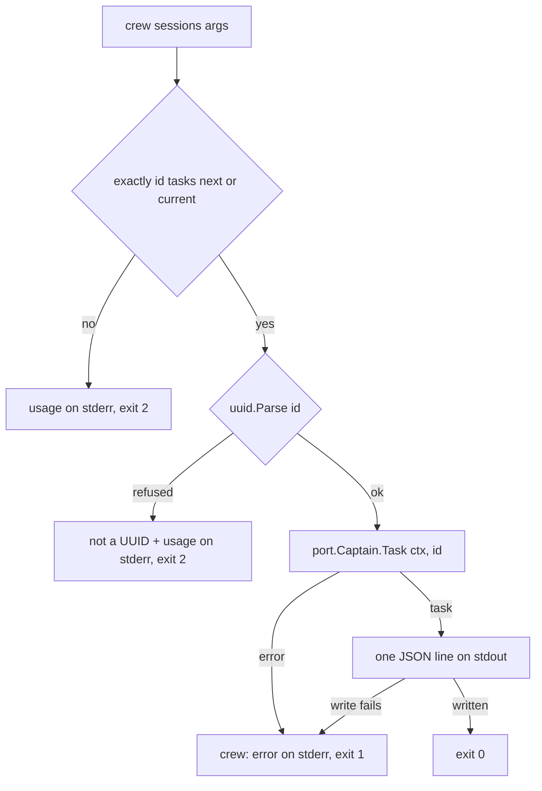

# Captain answers a session's next task - Plan

## Goal Capsule

- **Objective:** anyone with a coding-agent session's id can ask crew from the terminal for that session's task and get a typed answer. Later work then changes only who decides the answer, never the question or the command.
- **Means:** a new capability, the captain: a port next to `Tracker` with one operation, a dumb implementation in a package named `captain`, and the command `crew sessions <session-id> tasks next|current` (KTD1 to KTD6).
- **Product authority:** the user, through the brainstorm of #213. This is the first of several small brainstorms. The surrounding work is context, not active scope. The Product Contract wins on behaviour; the KTDs win on mechanism.
- **Stop conditions:** stop and report when a settled Key Decision proves unworkable, or when a gate in the Verification Contract cannot pass without changing a requirement.
- **Execution profile:** one branch, units U1 to U4 in order, one pull request whose body carries `Closes #213`.
- **Open blockers:** none.

---

## Product Contract

Product Contract preservation: unchanged from the body of issue #213, except that its questions deferred to planning now point to the KTDs that answer them.

### Summary

crew gains a captain: given a context and the id of a coding-agent session, it returns that session's task, which carries the task's id, the session's id and a prompt. Its first implementation is dumb and returns a fixed placeholder task. `crew sessions <session-id> tasks next` and `crew sessions <session-id> tasks current` ask the captain and print the task as JSON.

### Problem Frame

A session crew runs gets its whole job up front, in the prompt of the action that started it. It has no way to ask crew what to do next. The judge that will make that call is still to be designed, and building it together with the question would tie the question's shape to the first judge. This work fixes the question's shape first, with an answer that does nothing.

### Key Decisions

- **The package is named `captain`, and no name says judge.** Session stays the noun: the session is what the command and the task speak of, and the captain is who answers. It is the same split as an issue and the `Tracker`. (session-settled: user-directed — chosen over `judge` and `sessions` as the package name: the captain is the one who hands tasks to the crew, and session already names the thing being asked about.) Governs R1, R3, R5.
- **The session id is the id of a coding-agent session crew runs.** It is a Claude or Codex session, whose ids are UUIDs. (session-settled: user-directed — chosen over a new crew-only session concept and over an id with no meaning yet.) Governs R4.
- **A port with one dumb implementation, called directly by the command.** Nothing goes through the registry or `.crew/config.yaml`. A real captain becomes another implementation later. (session-settled: user-directed — chosen over a full adapter with a registry entry and a config section, and over a plain package with no interface: the port keeps the seam for the judge without paying for configuration nobody can use yet.) Governs R1, R3, R8.
- **The command prints JSON.** (session-settled: user-directed — chosen over printing only the prompt and over human-readable lines: an agent or a script reads all three fields.) Governs R7.
- **`current` and `next` behave the same for now.** The rule that tells them apart is not part of this work. Governs R5.

### Requirements

**The captain**

- R1. crew has a port named for the captain in `internal/port`, beside `Tracker`, with one operation: given a `context.Context` and a session id, it returns that session's next task or an error.
- R2. A task carries exactly three fields: its own id (a UUID), the id of the session it belongs to (a UUID), and a prompt (free text).
- R3. The only implementation lives in a package named `captain`. It is dumb: for any session id, it returns a task with a new id, that session id and a fixed placeholder prompt, and it never fails.
- R4. A session id stands for a coding-agent session crew runs, but nothing checks that such a session exists or ever existed.

**The command**

- R5. `crew sessions <session-id> tasks next` and `crew sessions <session-id> tasks current` both ask the captain for the session's task.
- R6. The command refuses, before asking the captain, a session id that is not a UUID, a missing or unknown word in place of `tasks`, `next` or `current`, and extra arguments. It prints its usage line on stderr and exits 2, as `crew bots` does for a malformed command.
- R7. On success the command prints the task on stdout as one JSON object with the keys `id`, `session_id` and `prompt`, and exits 0.
- R8. The command reads no `.crew/config.yaml` and needs no git repository. It contacts no tracker and starts no agent.
- R9. `crew --help` lists the command, and the README describes it in the same pull request.

### Acceptance Examples

- AE1. **Covers R3, R5, R7.** **Given** the session id `0199b2a4-7c1e-7d3a-9f00-2b6c1e8a4d10`, **when** `crew sessions 0199b2a4-7c1e-7d3a-9f00-2b6c1e8a4d10 tasks next` runs, **then** stdout holds one JSON object whose `session_id` is that id, whose `id` is a UUID, and whose `prompt` is the placeholder, and crew exits 0.
- AE2. **Covers R3, R5.** **Given** the same session id, **when** `tasks current` runs and then `tasks next` runs, **then** both print a task for that session with the same prompt, and each has its own task id.
- AE3. **Covers R6.** **When** `crew sessions not-a-uuid tasks next` runs, **then** stderr holds the usage line, stdout is empty, and crew exits 2.
- AE4. **Covers R6.** **When** `crew sessions 0199b2a4-7c1e-7d3a-9f00-2b6c1e8a4d10 tasks later` or `crew sessions 0199b2a4-7c1e-7d3a-9f00-2b6c1e8a4d10` runs, **then** crew prints the usage line on stderr and exits 2.
- AE5. **Covers R8.** **Given** a directory that is not a git repository and has no `.crew/`, **when** `crew sessions <a valid UUID> tasks next` runs there, **then** it prints the task and exits 0.

### Scope Boundaries

- The rule that makes `current` differ from `next`.
- Any real decision behind the captain, such as a judge, TypeSafe or an LLM.
- crew passing a session's id to its agent, and agents calling the command.
- Choosing a captain through `.crew/config.yaml` or the registry.
- Storing tasks, or remembering which task a session got.
- Checking that a session id belongs to a session crew ran.

Considered and not built:

- Signal handling in `crew sessions`. The dumb captain answers at once, and Go's default SIGINT handling already ends the process. A captain that waits on a network call would need it, and adding it then costs one `signal.NotifyContext` line.
- A depguard rule that only `cmd/crew` may import `captain`. Nothing else would want to today, and the judge work will decide who calls the captain. A second caller appearing in review would change this call.

### Deferred to Follow-Up Work

- Black-box acceptance scenarios for `crew sessions`. The scenarios belong to the tester (`/cw-tester`, area `sessions`), never to the developer, so this pull request adds none. Its README section is what the tester reads.

### Outstanding Questions

**Deferred to Planning (resolved)**

- The names of the port interface and its operation: KTD1.
- Where the task type lives: KTD2.
- The placeholder prompt's text, and which UUID version new task ids use: KTD3.

### Sources / Research

- `internal/port/port.go`: `Tracker` (the port this one sits beside) and `Session` (the existing running-session type whose name the new port avoids).
- `cmd/crew/main.go` and `cmd/crew/bots.go`: how `crew bots` is dispatched before crew's flags and refuses a malformed command with exit 2 (`app.ExitConfig`).
- Go 1.27 standard library `uuid` package: `Parse` (canonical, `{…}`, `urn:uuid:` and 32-hex forms, any case), `New` (equivalent to `NewV4`), `NewV7`, and `UUID.String`, `MarshalText`.

<!-- ce-section: work-relationships -->
### How This Work Fits Together

This plan covers only the question and its dumb answer. The rest is the current understanding, not a committed roadmap:

- A judge that decides a session's task. **Depends on** this captain port and replaces the dumb implementation.
- Telling `current` from `next`. **Depends on** this command and a judge or some stored state. **Still to decide** what each word means.
- crew's agents asking the captain mid-session. **Depends on** crew passing the session id to the agent. **Can proceed independently of** the judge.

---

## Planning Contract

### Key Technical Decisions

- KTD1. **The port is `port.Captain`, with one method, `Task`.** It takes a `context.Context` and the session id as a `uuid.UUID`, and returns a `crew.Task` and an error. A typed id means no implementation ever sees a malformed one: the command parses, the port receives a UUID. `Captain` and `Task` do not collide with `port.Session` or `port.Run`. The doc comment says it answers a session's next task, for R1. (Inherits the settled port decision; Governs R1, R3.)
- KTD2. **`crew.Task` lives in `internal/crew`, with fields `ID`, `Session` and `Prompt`.** The two ids are `uuid.UUID`, the prompt a string. A task is domain vocabulary like an issue, and `internal/crew` may import the standard library. It carries no JSON tags: the command owns the wire format (KTD5), as the GitHub adapter owns how an issue looks on GitHub.
- KTD3. **The dumb captain is the value type `captain.Dumb`, and its prompt is the exported constant `captain.Placeholder`.** Task ids come from `uuid.NewV7`: time-ordered ids sort by creation once a later captain stores tasks, and the standard library already has it. The placeholder tells the agent to carry on with the work its session was started with, which is the only true answer a captain without a judge can give. It is a constant so the tests share it. (Inherits the settled package decision; Governs R3, R4.)
- KTD4. **`run` dispatches `sessions` before crew's flags and hands the port in.** `run` checks `args[0] == "sessions"` next to the `bots` check and calls `runSessions(args[1:], stdout, stderr, captain.Dumb{})`. `runSessions` takes a `port.Captain`, so tests can pass a failing one, and asks it with `context.Background()`. It builds no registry, workspace or git runner, which keeps R8 true by construction. (Inherits the settled direct-call decision; Governs R5, R8.)
- KTD5. **The command checks the shape first, then the id, and prints the canonical id.**
  1. Anything but exactly three arguments, `<id> tasks next` or `<id> tasks current` with case-sensitive words, prints `crew: usage: crew sessions <session-id> tasks next|current` on stderr and exits 2. `crew sessions -h` is such a command.
  2. An id `uuid.Parse` refuses prints `crew: session id "<arg>" is not a UUID`, then the usage line, and exits 2.
  3. Any form `uuid.Parse` accepts is a session id. The output carries its canonical lowercase form (`UUID.String`), never the argument's text.
  (Governs R6, R7.)
- KTD6. **One JSON line on stdout, written by an encoder that leaves HTML characters alone.** A struct local to `cmd/crew` with the tags `id`, `session_id` and `prompt`, in that order, is encoded by `json.NewEncoder(stdout)` with `SetEscapeHTML(false)`, so a later prompt's `<`, `>` and `&` stay readable. A captain error prints `crew: <error>` on stderr and exits 1 with nothing on stdout. A failed write to stdout does the same. Both follow the README's "1 when it failed while running". (Governs R7.)
- KTD7. **depguard gains a `captain` rule: it imports only the domain and the ports.** It denies `core`, `engine`, `config`, `adapter`, `ui`, `registry`, `app`, `proc` and `bots`, which keeps the package a pure implementation of `port.Captain` that a judge can replace. AGENTS.md's layering line names the rule.

### Assumptions

- The placeholder text is crew's choice. The issue fixed only that a fixed placeholder exists (KTD3).
- `0199B2A4-…`, `{…}`, `urn:uuid:…` and 32-hex ids are accepted and printed canonically. The issue said only "a UUID" (KTD5).
- A failing captain exits 1. The dumb captain never fails, so only a test sees this path today (KTD6).

### High-Level Technical Design

---

## Implementation Units

### U1. The task and the captain port

- **Goal:** the domain has a task and the ports have a captain, so the command and the dumb captain share one contract.
- **Requirements:** R1, R2 (KTD1, KTD2).
- **Dependencies:** none.
- **Files:**
  - `internal/crew/task.go` (new)
  - `internal/port/port.go`
  - `internal/port/port_test.go` if a compile-time check fits there
- **Approach:**
  1. Add `crew.Task` per KTD2, with a doc comment that names the session as a coding-agent session crew runs (R4).
  2. Add `port.Captain` per KTD1 beside `Tracker`, and name it in the package comment's list of ports.
- **Patterns to follow:** the doc-comment style of `Tracker` and `Harness` in `internal/port/port.go`; `internal/crew/issue.go` for a plain domain struct.
- **Test expectation:** none -- types and an interface only; U2 and U3 exercise them.
- **Verification:** the module builds, and `go vet` and golangci-lint pass, depguard included.

### U2. The dumb captain

- **Goal:** `captain.Dumb` answers any session with a fresh task carrying the placeholder.
- **Requirements:** R3, R4 (KTD3, KTD7).
- **Dependencies:** U1.
- **Files:**
  - `internal/captain/captain.go` (new)
  - `internal/captain/captain_test.go` (new)
  - `.golangci.yml`
- **Approach:**
  1. `Dumb.Task` returns a `crew.Task` with `uuid.NewV7()` as its id, the given session and `Placeholder`, and a nil error. It ignores the context: it has nothing to wait on.
  2. Add the `captain` depguard rule per KTD7, next to the `bots` rule.
- **Patterns to follow:** `internal/adapter/shell` for a small package that implements one port; the `bots` depguard rule's shape.
- **Test scenarios:**
  - `Dumb{}` satisfies `port.Captain` (compile-time assertion in the test).
  - For a session id, the task's `Session` equals it, its `Prompt` equals `Placeholder`, its `ID` is neither nil nor the session id, and the error is nil.
  - Two calls for the same session return different task ids (AE2's distinct ids).
  - The task id is a version 7 UUID (its version nibble is 7).
  - An already-cancelled context still returns a task and no error (R3: it never fails).
  - The nil UUID as session id returns a task for the nil UUID (R4: nothing checks the session).
- **Verification:** the package's tests pass under `-race`, and its coverage is complete.

### U3. The `crew sessions` command

- **Goal:** `crew sessions <session-id> tasks next|current` prints the captain's task as JSON, refuses malformed command lines with exit 2, and works outside any repository.
- **Requirements:** R5, R6, R7, R8, R9 (`crew --help` part) (KTD4, KTD5, KTD6).
- **Dependencies:** U2.
- **Files:**
  - `cmd/crew/sessions.go` (new)
  - `cmd/crew/sessions_test.go` (new)
  - `cmd/crew/main.go`
  - `cmd/crew/main_test.go`
- **Approach:**
  1. In `run`, dispatch `sessions` per KTD4, next to `bots`.
  2. Add the usage line to the `Usage:` block of the package comment and to `flags.Usage`, so `crew --help` lists it (R9).
  3. Add a sentence to the package comment on what `crew sessions` does and its exit codes.
  4. `runSessions` follows KTD5 for refusals and KTD6 for output and failures.
- **Patterns to follow:** `cmd/crew/bots.go` (`botsUsage` constant, `crew: ` prefix, `app.ExitConfig`); `runCaptured` and `outsideGit` in `cmd/crew/bots_test.go`; the table in `TestRunExitsBeforeStartingOnFlags`.
- **Test scenarios:**
  - Covers AE1. `run` with `sessions 0199b2a4-7c1e-7d3a-9f00-2b6c1e8a4d10 tasks next` exits 0, and stdout is one line that decodes, with unknown fields disallowed, into exactly `id`, `session_id` and `prompt`: `session_id` is that id, `id` parses as a UUID, `prompt` is `captain.Placeholder`. Stderr is empty.
  - Covers AE2. `tasks current` and then `tasks next` for the same id both exit 0 with the same `session_id` and `prompt` and different `id`s.
  - Covers AE3. `sessions not-a-uuid tasks next` exits 2 with empty stdout, and stderr holds the usage line and names `not-a-uuid`.
  - Covers AE4. Table of refusals, each exiting 2 with the usage line on stderr and empty stdout: no argument after `sessions`, the id alone, `<id> tasks`, `<id> tasks later`, `<id> task next`, `<id> tasks NEXT`, `<id> tasks next extra`, `tasks <id> next`, an empty id, and `-h`.
  - Covers AE5. Under `outsideGit`, with no `.crew/`, `sessions <id> tasks next` exits 0 and prints the task.
  - An upper-case id, a braced id and a `urn:uuid:` id each print the canonical lower-case id as `session_id`.
  - A prompt holding `<`, `>` and `&`, from a stub captain passed to `runSessions`, appears unescaped in stdout.
  - A stub captain that returns an error makes `runSessions` exit 1, print `crew: ` and the error on stderr, and print nothing on stdout.
  - A stdout writer that fails makes `runSessions` exit 1 with the error on stderr.
  - A stub captain records that it was never called on any refusal (R6: refused before asking the captain).
  - `run` with `-h` still exits 0, and its usage text names `crew sessions <session-id> tasks next|current`.
- **Verification:** `cmd/crew` tests pass under `-race`, and every changed line in `cmd/crew` is covered.

### U4. The docs

- **Goal:** the README, AGENTS.md and CONCEPTS.md describe the captain and the command.
- **Requirements:** R9 (README part).
- **Dependencies:** U3.
- **Files:**
  - `README.md`
  - `AGENTS.md`
  - `CONCEPTS.md`
- **Approach:**
  1. README: a short section after Checks, such as `## A session's task`. It gives the command and an example of its JSON output, says that `current` and `next` answer the same placeholder for now, and says the command needs no repository or config. It also gives the exit codes 0, 2 and 1. Add `captain` to the `internal/` row of the What's inside table.
  2. AGENTS.md: add `internal/captain` to the architecture list, `Captain` to the `internal/port` list, the `crew sessions` dispatch to the `cmd/crew` entry, and the `captain` rule to the layering line (KTD7).
  3. CONCEPTS.md: add a section with `### Captain` (who answers a session's task) and `### Task` (what a session is asked to do next: its id, its session's id and a prompt), in the voice of the existing entries.
- **Patterns to follow:** the README's Checks section for tone and length; the `internal/bots` lines in AGENTS.md.
- **Test expectation:** none -- documentation only.
- **Verification:** each doc names the command exactly as `crew --help` prints it, and no doc names the package `judge`.

---

## Verification Contract

| Gate | Command | Proves |
| --- | --- | --- |
| Format | `gofmt -l cmd internal tools acceptance` prints nothing | U1 to U3 |
| Vet | `go vet ./...` | U1 to U3 |
| Lint and layering | `go run github.com/golangci/golangci-lint/v2/cmd/golangci-lint@v2.14.0 run` | KTD7, every linter |
| Tests | `go test -race ./...` | U2, U3, AE1 to AE5 |
| Total coverage | `go test -race -covermode=atomic -coverpkg=./... -coverprofile=coverage.out ./...` then `go run github.com/vladopajic/go-test-coverage/v2@v2.19.0 --config=.testcoverage.yml` | total at least 90% |
| Changed-line coverage | `git diff -U0 origin/main...HEAD \| go run ./tools/diffcover -profile coverage.out` | changed lines at least 90% |
| Vulnerabilities | `go run golang.org/x/vuln/cmd/govulncheck@v1.8.0 ./...` | no new findings |
| Smoke | `go build ./cmd/crew`, then `./crew sessions 0199b2a4-7c1e-7d3a-9f00-2b6c1e8a4d10 tasks next` from a directory outside any repository | AE1, AE5 on the real binary |

The acceptance suite (`go -C acceptance run ./cmd/acceptance`) must stay green. Its `TestCLIHelp` checks only `plain` and `version`, so the new usage line breaks nothing.

---

## Definition of Done

- Every gate in the Verification Contract passes.
- U1 to U4 are in the diff, and each AE has a test that names it.
- `crew --help` lists `crew sessions <session-id> tasks next|current`, and the README describes it.
- No name in the new code or docs says judge.
- No acceptance scenario or snapshot was added or changed.
- Abandoned attempts and debugging code are removed from the diff.
