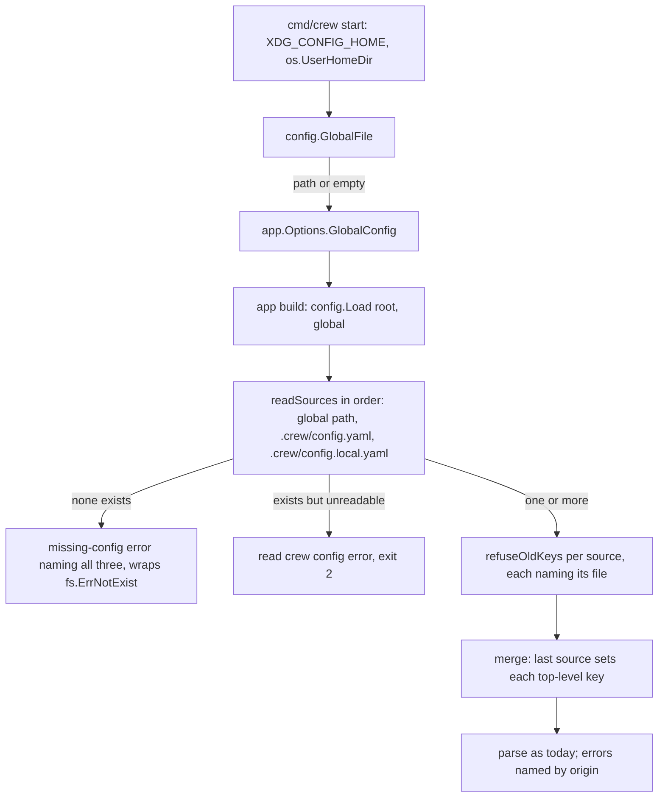

# A global crew config beside the repository's files - Plan

## Goal Capsule

- **Objective:** a boss who runs crew in several repositories writes the settings they share once, in one file outside any repository, and every repository crew runs in picks them up. A repository's own files still win.
- **Means:** `config.Load` reads a third source, the global file, before `.crew/config.yaml` and `.crew/config.local.yaml`, through the same whole-key merge #135 built; `cmd/crew` resolves the global file's path from `XDG_CONFIG_HOME` and the home directory and passes it down through `app.Options` (KTD1 to KTD3).
- **Product authority:** the boss, through the brainstorm of #214. The Product Contract wins on behaviour; the KTDs win on mechanism.
- **Stop conditions:** stop and report when a settled Key Decision proves unworkable, or when a gate in the Verification Contract cannot pass without changing a requirement.
- **Execution profile:** one branch, units U1 to U4 in order, one pull request whose body carries `Closes #214`.

---

## Product Contract

Product Contract preservation: Product Contract unchanged from the body of issue #214, except that its two Deferred-to-Planning questions are now answered by KTD4 and KTD5.

### Summary

crew reads a third config file, `~/.config/crew/config.yaml`, on Linux and macOS, beside the repository's `.crew/config.yaml` and `.crew/config.local.yaml`. The global file takes every key the other two take. A top-level key in `.crew/config.yaml` replaces that key of the global file, and a top-level key in `.crew/config.local.yaml` replaces both. crew needs at least one of the three files.

### Problem Frame

Since #135, crew reads two files, both inside the repository: the shared `.crew/config.yaml` and the ignored `.crew/config.local.yaml`. The boss runs crew in more than one repository and repeats nearly all of their config in each: agents, bots, board and intervals. Every change to those settings has to be copied by hand into each repository.

The #135 plan ruled out a user-wide config file on purpose. This plan reverses that boundary and keeps the rest of #135: whole-key replacement, file-named errors, and the `loading config` boot line.

### Key Decisions

- **Order: global, then `.crew/config.yaml`, then `.crew/config.local.yaml`; a later file's top-level key replaces the earlier ones.** (session-settled: user-directed — chosen over letting the global file replace the repository's `.crew/config.yaml`: the repository's committed workflow wins over the boss's defaults, and the local file wins over both.) Governs R3.
- **A top-level key replaces the whole key, with no deeper merge.** Each section then comes from one file, so each error names one file. (session-settled: user-directed — carried from #135, chosen over a deep merge by key path and over merging agents, rules and other named items one by one.) Governs R3.
- **crew needs at least one of the three files, so the global file alone is enough.** Running `crew` in a repository with no `.crew/` files applies the global file, its `rules` included, to that repository's issues. (session-settled: user-directed — chosen over requiring a file in the repository's `.crew/`, with that risk shown.) Governs R1, R2.
- **The global file takes every key the repository's files take.** No key in crew's config names a repository: the tracker section has only `name` and `bot`, and crew gets the repository from the directory it runs in. (session-settled: user-approved — chosen over a list of personal-only keys: the boss repeats nearly every key across repositories.) Governs R4.
- **The path is `~/.config/crew/config.yaml` on both Linux and macOS, or `$XDG_CONFIG_HOME/crew/config.yaml` when that variable is set.** (session-settled: user-directed — chosen over Go's user config dir, which is `~/Library/Application Support` on macOS.) Honoring `XDG_CONFIG_HOME` follows the convention and lets tests point the global file at an empty directory (session-settled: user-approved — chosen over a fixed `~/.config` path). Governs R5, R6.
- **The boot line stays `loading config` and names no file.** (session-settled: user-directed — carried from #135, chosen over a boot line that names the files and the keys they replace.) Governs R9.

### Requirements

**Loading**

- R1. crew reads `.crew/config.yaml`, `.crew/config.local.yaml` and the global file; each is optional, and at least one must exist.
- R2. When none of the three exists, crew stops with the missing-config error, which names all three files and still points to `.crew/config.example.yaml` in the crew repository.
- R3. Each top-level key set in `.crew/config.yaml` replaces that whole key of the global file, and each top-level key set in `.crew/config.local.yaml` replaces that whole key of both; a key no file sets keeps crew's default.
- R4. The global file accepts every key `.crew/config.yaml` accepts, and crew validates the combined config exactly as it validates the combined config of #135 today.
- R5. The global file is `$XDG_CONFIG_HOME/crew/config.yaml` when `XDG_CONFIG_HOME` is set, and `~/.config/crew/config.yaml` otherwise, on Linux and on macOS.
- R6. crew never reads a config file under `~/Library/Application Support`.
- R7. An empty global file, or one holding only comments, changes nothing.
- R8. When crew cannot find the home directory and `XDG_CONFIG_HOME` is unset, it runs without the global file instead of failing.
- R9. The boot log's config line stays `loading config`, whichever files exist.

**Errors**

- R10. Every error about a key of the global file names the global file by its path, together with the key path and line, as errors name the repository's files today.
- R11. The refusal of old keys checks the global file too, and names it for each old key it finds there.

**Tests**

- R12. crew's own tests and the acceptance suite never read the global file of whoever runs them, including the tests of `internal/app`, which today set neither `HOME` nor `XDG_CONFIG_HOME`.
- R13. The tests that check crew's own config (its rules, bots, board and checks) still load only the committed `.crew/config.yaml`.

**Docs**

- R14. The README describes the global file: where it lives on Linux and macOS, `XDG_CONFIG_HOME`, the order of the three files, and that crew needs at least one.
- R15. The schema's description, `.crew/config.example.yaml`'s comments and `AGENTS.md` name the global file wherever they name the two repository files.

### Acceptance Examples

- AE1. **Covers R3.** **Given** the global file sets `poll_interval_seconds: 60` and a `board:`, `.crew/config.yaml` sets `poll_interval_seconds: 300` and `rules:`, and there is no `.crew/config.local.yaml`, **when** crew starts, **then** it polls every 300 seconds, runs the repository's rules and shows the global board.
- AE2. **Covers R3.** **Given** the same files as AE1 and a `.crew/config.local.yaml` that sets `poll_interval_seconds: 30`, **when** crew starts, **then** it polls every 30 seconds.
- AE3. **Covers R3.** **Given** the global file defines agents `developer` and `reviewer`, and `.crew/config.yaml` sets `agents:` with only `developer`, **when** crew loads the config, **then** the only agent is the repository's `developer`.
- AE4. **Covers R1.** **Given** a repository with no `.crew/` files and a valid global file, **when** crew starts there, **then** it runs from the global file alone.
- AE5. **Covers R2.** **Given** none of the three files exists, **when** crew starts, **then** it exits with code 2 and an error naming the three files that points to `.crew/config.example.yaml`.
- AE6. **Covers R5.** **Given** `XDG_CONFIG_HOME=/tmp/x` and files at both `/tmp/x/crew/config.yaml` and `~/.config/crew/config.yaml`, **when** crew loads the config, **then** it reads `/tmp/x/crew/config.yaml` and not the other.
- AE7. **Covers R5, R6.** **Given** macOS, `XDG_CONFIG_HOME` unset, a config at `~/Library/Application Support/crew/config.yaml` and none at `~/.config/crew/config.yaml`, **when** crew loads the config, **then** it reads no global file.
- AE8. **Covers R10.** **Given** the global file has an unknown key `board_columns` on line 3, **when** crew loads the config, **then** the error names the global file's path, the key `board_columns` and line 3.
- AE9. **Covers R11.** **Given** the repository's files use only current keys and the global file uses an old key, **when** crew loads the config, **then** crew refuses it, naming the old key, its replacement and the global file.
- AE10. **Covers R7.** **Given** the global file holds only comments, **when** crew loads the config, **then** the result is the same as with the repository's files alone.

### Scope Boundaries

- No global `config.local.yaml`, no `--config` flag, and no crew-specific environment variable that picks a file.
- No merge below the top level, as in #135.
- No command that creates or edits the global file.
- No boot line or other output that says which file a key came from.
- Where `crew bots create` saves bots on macOS is #215, not this plan.
- Moving the boss's settings into the global file is the boss's own step. In this repository, the committed `.crew/config.yaml` already sets `poll_interval_seconds`, `max_parallel_issues`, `queues`, `tracker`, `agents`, `checks` and `rules`, so the global file only reaches keys it leaves out, such as `board`; `.crew/config.local.yaml` stays the place to replace the others here.
- Considered and not built: a warning when the global file alone supplies `rules` to a repository with no `.crew/` files. The boss accepted that risk in the Key Decisions, and the boot log already shows the config loading. A report of a run that acted on the wrong repository's issues would change the call.

#### Deferred to Follow-Up Work

- Acceptance scenarios for AE1 to AE10 against the built binary. Scenarios belong to the tester (`/cw-tester`, `acceptance/README.md`); U3 gives them `Options.GlobalConfig` to place a global file.

### Dependencies / Assumptions

- #215 makes `crew bots create` save bots in `~/.config/crew/bots` on macOS too, so the global file and the bots share one directory on both systems. This plan does not depend on #215 to work.
- The acceptance suite already runs crew with its own empty `HOME` and `XDG_CONFIG_HOME` (`acceptance/harness/env.go`, `acceptance/harness/repo.go`), so a scenario can place a global file without touching the developer's.

### Outstanding Questions

**Deferred to Planning (answered)**

- Whether errors show the global file's path with `~` for the home directory or in full: in full (KTD4).
- What crew does when the global path exists but is a directory or cannot be read: the same error a repository file gets today (KTD5).

### Sources / Research

- `internal/config/files.go`: `sharedFile` and `localFile`, `readSources` (reads both from the repository root and holds the missing-config error), `merge` (last source wins, records each top-level key's file in `origin`), `refuseOldKeys` (per source) and `origin.all`, which joins the file names with " and ".
- `internal/config/config.go` (`Load`): calls `readSources(root)`; no config is read from outside the repository today.
- `internal/bots/store.go` (`DefaultStore`): builds the bots' path from `os.UserConfigDir()`, which is `~/Library/Application Support` on macOS (`docs/plans/2026-10-03-1605-feat-crew-mates-plan.md`, KTD6). The global file deliberately does not use it (R5, R6).
- `cmd/crew/main.go` (`start`): already calls `os.UserHomeDir()` for `app.Options.Home`, ignoring its error.
- `internal/app/app.go`: `build` calls `config.Load(o.Root)`; the `loading config` boot line is asserted by `app_boot_test.go` and `app_startup_test.go`.
- `schema/config.schema.json`: its `title` and `description` name `.crew/config.yaml` and `.crew/config.local.yaml`; the tracker section has only `name` and `bot`.
- `internal/config/config_own_test.go` (`loadOwn`): loads only the committed `.crew/config.yaml`, through a symlink in a temporary root.
- `internal/config/config_local_test.go` (`writeFiles`, `noFile`, `loadFiles`, `loadFilesErr`): the helpers the new tests extend.
- `cmd/crew/act_test.go` and `cmd/crew/bots_test.go` set `XDG_CONFIG_HOME` to a temporary directory; `internal/app` tests set neither `HOME` nor `XDG_CONFIG_HOME`.
- `acceptance/harness/scenario.go` (`Options`, `New`) and `acceptance/harness/repo.go` (`newHome`): the scenario's `XDG_CONFIG_HOME` is an empty directory; `acceptance/README.md` lists `harness.Options`' fields.
- `docs/plans/2026-10-05-2054-feat-config-local-file-plan.md`: the #135 plan, whose Scope Boundaries rule out a user-wide config file; this plan supersedes that one boundary.
- `docs/solutions/tooling-decisions/codacy-lizard-and-golangci-lint-limits.md`: functions stay under 50 lines and cyclomatic complexity 15, tests included.
- `README.md`: the Quick start paragraph on `.crew/config.local.yaml` (R14 extends it), the exit-code line naming a repository without `.crew/config.yaml`, and the file table.

---

## Planning Contract

### Key Technical Decisions

- KTD1. **`Load` takes the global file's path from its caller; only `cmd/crew` reads the environment.** `config.Load(root, global)` reads the global file at `global`, and an empty `global` reads none. `cmd/crew` resolves the path once and passes it through a new `app.Options.GlobalConfig`, which `build` hands to `Load`. Every test that does not pass a path reads no global file, so the tests of `internal/config` and `internal/app` cannot reach the developer's file without setting any environment (R12, R13). `internal/config` keeps reading only the files it is given.
- KTD2. **A pure `config.GlobalFile(xdgConfigHome, home)` resolves the path.** A non-empty `XDG_CONFIG_HOME` gives `<it>/crew/config.yaml`; when it is empty, a non-empty home gives `<home>/.config/crew/config.yaml`. Either must be absolute: a relative `XDG_CONFIG_HOME`, or an empty one with a relative home, gives an empty result, as does an unknown home, and crew runs without a global file (R8). A relative path would resolve against the repository crew runs in. This is the rule of `configDir` in #216, which moves the bots to the same directory, so the bots and the global file never resolve apart. It never calls `os.UserConfigDir`, so no path under `~/Library/Application Support` can come out of it (R6). `cmd/crew` calls it with `os.Getenv("XDG_CONFIG_HOME")` and the home it already looks up. Governs R5, R6, R8 through the path Key Decision.
- KTD3. **The global file is the first source of today's merge.** `readSources` reads a list of sources in order (the global file, then `.crew/config.yaml`, then `.crew/config.local.yaml`), each with the name its errors carry and the path it is read from. `merge`, `refuseOldKeys` and `origin` work unchanged on three sources, so a later file's top-level key replaces the earlier ones, an empty or comment-only global file adds no key, and the old-key refusal and key errors name the global file (R3, R4, R7, R10, R11).
- KTD4. **Errors name the global file by its full path, not with `~`.** `XDG_CONFIG_HOME` may point outside the home directory, a full path can be pasted as is, and read and YAML syntax errors already show full operating-system paths. The repository's files keep their repo-relative names. This answers the Contract's first deferred question (R10).
- KTD5. **Only a missing global file is skipped.** A global path that exists but is a directory or cannot be read stops crew with the same `read crew config:` error a repository file gets today, exit code 2. A file the user put there and crew cannot read is a mistake to show, not to skip silently. This answers the Contract's second deferred question.
- KTD6. **The missing-config error names all three files.** It names `.crew/config.yaml` and `.crew/config.local.yaml` in the repository's root, then the global path `Load` was given, or `~/.config/crew/config.yaml` when it was given none, and still points to `.crew/config.example.yaml` in the crew repository (R2). It still wraps `fs.ErrNotExist`.
- KTD7. **Errors about no key name every file read, joined readably.** `origin.all` lists the files read as "a, b and c" rather than "a and b and c", so `rules: missing` with three files reads naturally.
- KTD8. **The acceptance harness can place a global file.** `harness.Options.GlobalConfig` is the text of `crew/config.yaml` under the scenario's own `XDG_CONFIG_HOME`; `""` leaves it absent. It is the developer's part of the suite. The scenarios that use it are the tester's (Deferred to Follow-Up Work).

### High-Level Technical Design

How the global file reaches `Load` and where it sits among the sources:

### Assumptions

- No caller outside crew's own packages uses `config.Load`; changing its signature touches only `internal/app` and the tests.
- On macOS, `os.UserHomeDir` returns `$HOME`, so the global file is `~/.config/crew/config.yaml` there as on Linux.
- R5's "when `XDG_CONFIG_HOME` is set" means set to a non-empty value. An empty value counts as unset, and the home path applies. A relative value cannot be used safely, and the XDG Base Directory specification tells programs to treat it as invalid, so crew then runs without a global file (KTD2), as R8 does for an unknown home. The pull request names this reading.
- `configDir` in #216 (open) is `internal/bots`' copy of KTD2's rule, and depguard lets only `cmd/crew` import `internal/bots`, so `internal/config` keeps its own. Whichever of #216 and this change merges second keeps the two rules identical.

---

## Implementation Units

### U1. `Load` reads the global file

- **Goal:** `config.Load` reads the global file as the first of three sources, and `config.GlobalFile` resolves its path.
- **Requirements:** R1 to R8, R10, R11, R13 (config level). KTD1 to KTD7.
- **Dependencies:** none.
- **Files:** `internal/config/files.go`, `internal/config/config.go`, new `internal/config/config_global_test.go`, `internal/config/config_local_test.go`, `internal/config/config_test.go`, `internal/config/config_own_test.go`, `internal/config/config_example_test.go`, `internal/config/config_queue_test.go`, `internal/config/legacy_test.go`, and any other test in `internal/config` that calls `Load`.
- **Approach:**
  1. Add `GlobalFile` per KTD2, beside the file-name constants in `files.go`.
  2. Give `readSources` the list of sources of KTD3, with the global file first when its path is not empty; keep the per-file YAML and mapping checks, and use the global path as both its name and its path (KTD4).
  3. Treat not-exist as absent and every other read error as today's `read crew config:` error (KTD5).
  4. Rewrite the missing-config error per KTD6, and the join of `origin.all` per KTD7.
  5. Change `Load` to take the global path, and update its comment and the package comment to name the three files and their order.
  6. Pass `""` from every existing test call, so `loadOwn` still reads only the committed `.crew/config.yaml` (R13).
- **Patterns to follow:** `writeFiles`, `noFile`, `loadFiles` and `loadFilesErr` in `internal/config/config_local_test.go`; the per-file error assertions there.
- **Test scenarios:**
  - Covers AE1. Global with `poll_interval_seconds: 60` and a board, `.crew/config.yaml` with `poll_interval_seconds: 300` and rules: `PollInterval` is 300s, the rules are the repository's, `Board` is the global board and `BoardWritten` is true.
  - Covers AE2. The AE1 files plus a local file with `poll_interval_seconds: 30`: `PollInterval` is 30s.
  - Covers AE3. Global agents `developer` and `reviewer`, repository `agents:` with only `developer`: the only agent is the repository's `developer`.
  - Covers AE4 (config level). Only a valid global file, no `.crew/` directory: `Load` succeeds with its rules.
  - Covers AE5 (config level). No file and a global path that does not exist: the error wraps `fs.ErrNotExist` and names `.crew/config.yaml`, `.crew/config.local.yaml`, the global path and `.crew/config.example.yaml`.
  - No repository file and an empty global path: the error names `~/.config/crew/config.yaml`.
  - Covers AE6. `GlobalFile("/tmp/x", "/home/u")` is `/tmp/x/crew/config.yaml`.
  - Covers AE7. `GlobalFile("", "/home/u")` is `/home/u/.config/crew/config.yaml`; with a file only at `<home>/Library/Application Support/crew/config.yaml`, `Load` with that path reads no global file (a repository file holds the rules).
  - `GlobalFile("", "")` is empty (R8), `GlobalFile("relative/dir", "/home/u")` is empty, and `GlobalFile("", "relative/home")` is empty.
  - Covers AE8. A global file with `board_columns` on line 3: the error line reads `<global path>: board_columns (line 3): unknown key`.
  - Covers AE9. Clean repository file, global file with `workflow:`: refused, naming `workflow`, its replacement and the global path.
  - Covers AE10. A comment-only global file and an empty one: the `Config` equals the one from the repository's files alone.
  - The global path is a directory: `Load` fails with `read crew config:`, and the error is not `fs.ErrNotExist` (KTD5).
  - A YAML syntax error in the global file names its path; a global file whose top level is a list is refused, naming it.
  - `rules: missing` with all three files present and no rules names the three files, joined per KTD7.
  - An unknown key under a global `tracker:` names the global path (the section decoder path).
  - Existing: `TestLoadMissingFileSaysWhereItLooked` expects the three names.
- **Verification:** the new tests pass, and the whole `internal/config` suite passes with `""` as the global path in the existing tests.

### U2. crew passes the global file to `Load`

- **Goal:** the running binary reads the global file from the path `cmd/crew` resolves.
- **Requirements:** R1, R2, R5, R8, R9, R12. KTD1, KTD2.
- **Dependencies:** U1.
- **Files:** `internal/app/app.go`, `cmd/crew/main.go`, `internal/app/app_startup_test.go`, `internal/app/app_test.go` (a helper that writes a global file when a test needs it).
- **Approach:**
  1. Add `GlobalConfig` to `app.Options`: the global file's path, empty for none. `build` passes it to `config.Load`.
  2. In `start`, set it from `config.GlobalFile(os.Getenv("XDG_CONFIG_HOME"), home)`, with the `home` it already looks up. Update the package comment of `cmd/crew/main.go` if it names the config files.
  3. Existing `internal/app` tests leave `GlobalConfig` empty, which is what isolates them (R12).
- **Patterns to follow:** the boot-line assertions with `unstamped` in `internal/app/app_startup_test.go`.
- **Test scenarios:**
  - Covers AE4. A root with no `.crew/` files and `GlobalConfig` pointing at a valid file: `Run` gets past the config step, and the boot output starts with `loading config` (R9).
  - Covers AE5. A root with no `.crew/` files and `GlobalConfig` pointing at a missing file: `Run` returns `ExitConfig` (2), and stderr names the three files and `.crew/config.example.yaml`.
  - A global file and a `.crew/config.yaml` that both set `poll_interval_seconds`: the run uses the repository's value (the app reaches `Load` with both).
- **Verification:** `internal/app` and `cmd/crew` pass, and no `internal/app` test sets `HOME` or `XDG_CONFIG_HOME` to stay isolated.

### U3. The acceptance harness can place a global file

- **Goal:** a scenario can start crew with a global config file in its own `XDG_CONFIG_HOME`.
- **Requirements:** R12 (the suite never reads the developer's file). KTD8.
- **Dependencies:** none; its use by scenarios needs U2 in the binary.
- **Files:** `acceptance/harness/scenario.go`, `acceptance/harness/repo.go`, `acceptance/harness/scenario_test.go`, `acceptance/README.md`.
- **Approach:**
  1. Add `GlobalConfig` to `harness.Options`; `New` writes it to `crew/config.yaml` under the scenario's `XDG_CONFIG_HOME` when it is not `""`.
  2. List the field in `acceptance/README.md` where `harness.Options`' fields are listed, which now count five.
- **Patterns to follow:** `newHome` and `newRepo` in `acceptance/harness/repo.go`; the stand-in binary tests in `acceptance/harness/scenario_test.go`.
- **Test scenarios:**
  - A scenario with `GlobalConfig` set runs a stand-in that finds `$XDG_CONFIG_HOME/crew/config.yaml` holding that text.
  - A scenario without it has no `crew/` directory under `XDG_CONFIG_HOME`.
- **Verification:** `go -C acceptance vet ./...`, the module's golangci-lint and its harness tests pass.

### U4. Docs name the global file

- **Goal:** the README, the example, the schema and `AGENTS.md` describe the third file.
- **Requirements:** R14, R15.
- **Dependencies:** U1, U2.
- **Files:** `README.md`, `.crew/config.example.yaml`, `schema/config.schema.json`, `AGENTS.md`.
- **Approach:**
  1. README Quick start: after the `config.local.yaml` paragraph, describe the global file at `~/.config/crew/config.yaml` on Linux and macOS, or `$XDG_CONFIG_HOME/crew/config.yaml`; the order global, `config.yaml`, `config.local.yaml`, each later top-level key replacing the earlier; that crew needs one of the three, so the global file alone works, its `rules` included; and that errors name the global file by its full path.
  2. README exit-code line: the config-error example becomes a repository with none of the three files.
  3. README file table: the schema row names the global file too.
  4. Example header comments: name the three files and their order; the modeline works in all three.
  5. Schema `title` and `description`: name the global file and the order.
  6. `AGENTS.md`'s `internal/config` line: the global file, read first, its path passed in from `cmd/crew`; its `cmd/crew` line: resolves the global file's path.
- **Test expectation:** none -- documentation only; `TestExampleConfigNamesThePublishedSchema` and the example tests still pass, and review checks the prose.
- **Verification:** `git grep -n "config.local.yaml"` outside `docs/` shows every place that names the repository's files also names the global file, or has a reason not to.

---

## Verification Contract

| Gate | Command | Applies to |
|---|---|---|
| Format | `gofmt -l cmd internal tools acceptance` prints nothing | all |
| Vet | `go vet ./...` and `go -C acceptance vet ./...` | all |
| Lint and layering | `go run github.com/golangci/golangci-lint/v2/cmd/golangci-lint@v2.14.0 run`, in the root and in `acceptance/` | all |
| Tests | `go test -race ./...` | U1, U2 |
| Acceptance | `go -C acceptance run ./cmd/acceptance`, with no failure other than the three screen scenarios that already fail on `main` (`TestScreenBoardRunningIssue`, `TestScreenIssueBox`, `TestScreenHandledFailedIssue`), whose snapshots expect `loading .crew/config.yaml` instead of R9's `loading config`; re-accepting them is the tester's | U2, U3 |
| Coverage | `go test -race -covermode=atomic -coverpkg=./... -coverprofile=coverage.out ./...`, then `go run github.com/vladopajic/go-test-coverage/v2@v2.19.0 --config=.testcoverage.yml` (total at least 90%) | all |
| Changed lines | `git diff -U0 origin/main...HEAD \| go run ./tools/diffcover -profile coverage.out` (at least 90%) | all |
| Vulnerabilities | `go run golang.org/x/vuln/cmd/govulncheck@v1.8.0 ./...` | all |
| Smoke | a built `crew` in a scratch repository with no `.crew/` files and `XDG_CONFIG_HOME` pointing at a directory holding `crew/config.yaml` prints `loading config` and gets past it; with that file removed it exits 2 naming the three files | U1, U2 |

---

## Definition of Done

- U1 to U4 are in, and every gate above passes, the Acceptance gate with its named exception.
- No test in `internal/config`, `internal/app` or `cmd/crew` can read the global file of the developer who runs it.
- Nothing calls `os.UserConfigDir` to find the global file.
- The pull request body carries `Closes #214`, notes that this change supersedes the #135 plan's boundary against a user-wide config file, and names the three screen scenarios already failing on `main`.
- No abandoned attempt's code is left in the diff.
