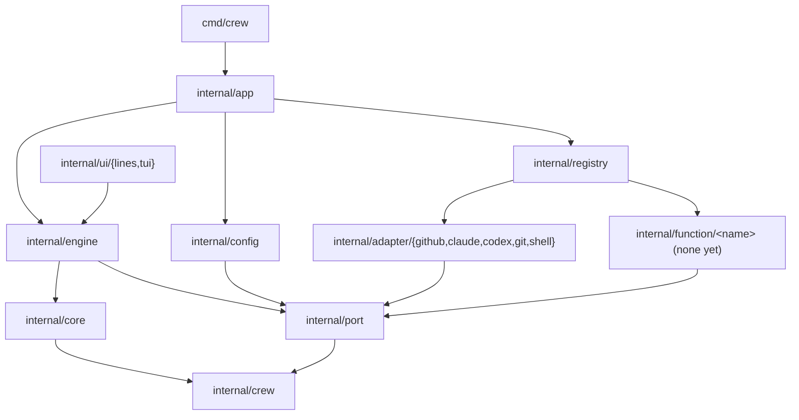
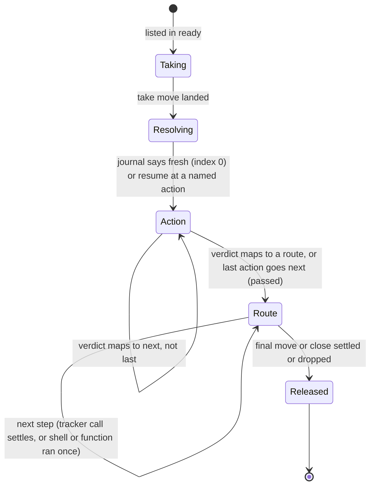
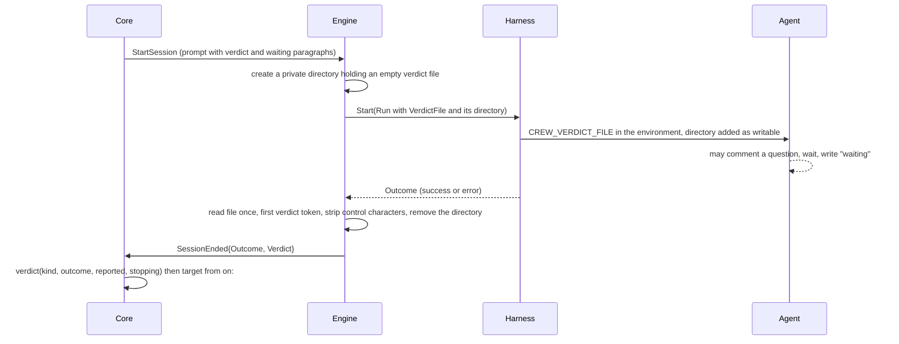

# Rules as a sequence of actions with routes by verdict - Plan

Superseded by `docs/plans/2026-10-07-0724-feat-rule-sequences-and-routes-plan.md`, which plans the same work again on the domain #237 redesigned and folds in #227.

## Goal Capsule

- **Objective:** the boss can write a rule that runs any mix of agent sessions, shell scripts and crew functions one after another, and sends each issue where the result says it should go, including a pause while a session waits for an answer, without changing crew's code for each new case.
- **Means:** a rule becomes its entry labels, a sequence of named actions and named routes. Each action ends with a verdict, its `on:` maps the verdict to the next action or to a route, and each route runs its steps and ends by moving or closing the item (KTD1, KTD4, KTD8).
- **Product authority:** the boss, through the brainstorm of #220 and the planning session that followed. The Product Contract wins on behaviour; the KTDs win on mechanism.
- **Stop conditions:** stop and report when a settled Key Decision proves unworkable, when a unit cannot keep the build and tests green without changing a requirement, or when the acceptance scenarios need changes beyond what `acceptance/README.md` lets the developer make.
- **Execution profile:** one branch, units U1 to U13 in order (expand, switch, contract), one pull request whose body carries `Closes #220`. The acceptance scenarios are then rewritten by the tester (R35).
- **Open blockers:** none.

---

## Product Contract

Product Contract preservation: changed: R18 (a route `comment` never quotes text a session or script printed, after the session-text security learning), R22 (resume after any ending other than `passed`, not only `waiting` and failure), R32 (more load checks: last-step moves, running targets, unique names, reserved `next`); added R36 (the name of a session written in a rule); the example config is rewritten in valid YAML. Each change was put to the boss and approved during planning.

### Summary

A rule keeps its `ready` and `running` labels and replaces `success`, `failure`, parallel actions and checks with three parts. Its actions run in sequence, and each is an agent session, a shell script or a built-in crew function with parameters. Each action's verdict either moves the sequence on or ends the rule through one of its named routes. A route runs effects, shell scripts and functions, then moves or closes the item. A session can ask a question on the issue and pause the rule until someone answers.

### Problem Frame

Today a rule can do one thing: run its actions, each an agent session in its own worktree, all at once, then move the item to `success` when every action succeeded or to `failure` when any failed. Shell checks after a session can only pass or fail it.

Anything else becomes a workaround. The `session-finished` check in this repository's config tells `done`, `unfinished`, `needs_person` and `stopped` apart, but it can only exit 0 or 1, so an issue that needs a person lands in the same label as a finished one. The Jev judge is a shell script of about 40 lines of `curl` and `jq`. A session cannot hand one question to a person and go on later, a rule cannot run two sessions one after the other, and nothing can run before a session.

No single blocked case drives this work. The boss wants rules flexible enough to take more complex actions and routes decided at run time as crew grows.

### Key Decisions

- **One plan for the sequence of actions and the routes by verdict.** The two could ship apart, but the boss wants them designed together. (session-settled: user-directed — chosen over planning the routes by verdict first and the sequence of actions later: the boss wants both shaped at once.)
- **Actions run in sequence; no parallel actions for now.** Governs R2. (session-settled: user-directed — chosen over keeping parallel actions behind an explicit group: no rule in this repository has more than one action, and parallel can return later as an opt-in.)
- **Everything that runs is an action.** An agent session is one kind of action, and a check becomes a shell action. Governs R3, R4. (session-settled: user-directed — chosen over a fixed action shape of steps before the session, the session, and steps after it: one concept covers more cases with less config.)
- **crew's own config style, not GitHub Actions'.** Things are defined once at the top and named where used, and `name:` picks the kind, as `agents:` and `harness:` do today. Governs R5, R6. (session-settled: user-approved — chosen over `uses:`/`with:` steps: the existing style is shorter and keeps one way of writing the config.)
- **The verdict is decided at run time; the table of destinations is fixed in the config.** Governs R10, R32. (session-settled: user-directed — chosen over an action that returns its own destination label and over `if:` conditions on outputs: a fixed table can be checked when crew loads the config.)
- **Each action maps its own verdicts.** Governs R10. (session-settled: user-directed — chosen over one verdict table per rule: two reusable actions can return the same verdict name with different meanings, and the rule that uses them must handle each.)
- **A verdict either continues the sequence or ends the rule.** Governs R10. (session-settled: user-approved — chosen over jumps to a later action and over loops back to an earlier one: no loops keeps token spend, resume and validation simple.)
- **A session may end with any verdict its `on:` names.** Governs R9. (session-settled: user-approved — chosen over sessions ending only with passed, failed or waiting: the agent itself can pick the route.)
- **A session that needs an answer waits on its own, up to a limit crew gives it, then pauses the rule.** Governs R19, R20, R21. (session-settled: user-directed — chosen over crew waiting for the answer and over a session that stays running until someone answers: a single blocking wait costs almost no tokens, a quick answer keeps the session's context, and a slow one frees the queue slot.)
- **A resumed session is a new session, not the same conversation.** Governs R23. (session-settled: user-directed — chosen over continuing the agent's previous conversation: continuing resends the whole history without cache after a long wait and needs a new capability from both harnesses.)
- **A resumed rule restarts at the action that stopped.** Governs R22. (session-settled: user-approved — chosen over running the whole sequence again: earlier sessions would redo finished work.)
- **Every ending other than `passed` resumes.** Governs R22. (session-settled: user-approved — chosen over resuming only after `waiting` and `failed`, and over a per-route setting: whoever returns an item to `ready` after any other ending expects the work to go on where it stopped.)
- **The function mechanism ships without any function.** Governs R26 to R31. (session-settled: user-directed — chosen over leaving the function kind for when a real function exists: the boss wants the mechanism in place now.)
- **Routes run effects, shell scripts and functions, but no sessions.** Governs R14. (session-settled: user-approved — chosen over routes limited to effects and over routes that can run a session: agent work belongs in the sequence.)
- **Every route ends by moving or closing the item.** Governs R15. (session-settled: user-approved — chosen over a route that ends with an action moving the label itself, backed by a fallback label: the label is crew's only record of where an item stands, and only crew's own move is checked at load, retried and known to the board.)
- **A route's comment never quotes what a session or script printed.** Governs R18. (session-settled: user-approved — chosen over letting a comment quote the ending action's reason: that text may hold secrets, and a public comment never carries session text. A session's question is a comment the agent posts itself.)
- **The old config format is refused, with no migration message.** Governs R33. (session-settled: user-directed — chosen over a message per old key and over accepting both formats: only the boss runs crew today.)
- **Nothing in this work calls an external service.** Functions are crew's own code. (session-settled: user-directed — chosen over HTTP hooks as route effects: the boss wants crew's own code, not outside calls.)
- **One worktree and branch per rule run.** The actions of a sequence share them, so each action sees what the previous one left. Governs R24, R25.

### Actors

- A1. The boss: writes the config, reads the issues, answers a session's question and returns the issue to the rule.
- A2. crew: runs the sequence, applies the routes, pauses and resumes rules.
- A3. An agent session: does the work of a session action, may ask a question on the issue and chooses its verdict.
- A4. Whoever answers a question: the boss, another agent or another rule, by commenting on the issue.

### Requirements

**Rule shape**

- R1. A rule is its `ready` and `running` labels, a list of actions and its named routes. `success` and `failure` no longer exist as labels of a rule.
- R2. A rule's actions run one at a time, in the order listed.
- R3. An action is an agent session (an agent and a prompt), a shell script or a crew function.
- R4. Checks stop being a separate concept: what a check did, a shell action does, anywhere in the sequence.
- R5. Shell scripts and functions are defined once at the top of the config by name, and a rule names them in its list. A session is written in the rule, with its agent and prompt.
- R6. A definition that is a plain string is a shell script.
- R36. A session written in a rule is named after its agent, unless its `name:` gives another name.

**Verdicts and the routes of an action**

- R7. Every action ends with a verdict. `passed` and `failed` can always happen.
- R8. A shell action passes when it exits 0 and fails otherwise, unless its definition names a verdict for an exit code.
- R9. A session passes or fails as today. It may instead end with any verdict its `on:` names, and a verdict outside that list counts as `failed`.
- R10. An action's `on:` maps each verdict to `next`, which runs the next action, or to the name of a route of the rule, which ends the rule there. Without an entry, `passed` goes to `next` and every other verdict goes to `failed`.
- R11. When the last action's verdict goes to `next`, the rule ends through its `passed` route.

**The routes of a rule**

- R12. A rule declares as many routes as it wants, with free names. A rule with actions must declare `passed` and `failed`. A rule without actions declares only `passed`, which runs as soon as crew takes the item.
- R13. A route is an ordered list of steps. A route written as a single label is a route that only moves the item to that label.
- R14. A step is an effect (`move`, `comment`, `report`, `close`), a shell action or a function. A session is never a step.
- R15. Every route ends with `move` or `close`.
- R16. A step that fails inside a route is recorded and shown, and the route goes on: the final `move` or `close` still happens.
- R17. `report` posts the failure report crew posts today, naming the action that stopped the sequence and its log.
- R18. `comment` posts text written in the config, which may name the issue, the action that ended the sequence, its verdict and its log path, and never includes text a session or a script printed.

**Waiting for an answer**

- R19. When a session's `on:` maps `waiting`, crew adds a fixed paragraph to its prompt: how to ask its question on the issue, how long to wait for an answer, and to end with the verdict `waiting` when none came.
- R20. The wait is set on the session's action and defaults to 10 minutes.
- R21. A `waiting` verdict follows its route like any other, usually to a waiting label, which frees the queue slot. crew does not watch for the answer: whoever answers returns the issue to the rule's `ready` label.

**Resume**

- R22. When an issue returns to a rule's `ready` label and that rule's last run on it ended through any route other than `passed`, crew restarts the sequence at the action that ended it. The actions before it, which went to `next`, do not run again.
- R23. A resumed session is a new session in the same worktree and branch, with a paragraph from crew. After `waiting`, the paragraph says the session asked a question and that the answers are in the issue's comments after it. After any other ending, it is today's resume paragraph, naming the route the run ended through.
- R24. A rule run has one worktree and one branch, shared by all its actions and its route steps.
- R25. crew creates the worktree only when the rule has an action that needs one.

**Functions**

- R26. A rule calls a function by name, with its parameters where it uses it.
- R27. A top-level definition can give a function a name of its own and preset parameters, and the parameters where it is used replace the preset's.
- R28. crew checks a function's parameters when it loads the config: an unknown parameter, a value of the wrong type or a value the function refuses is an error naming the file, key path and line.
- R29. A text parameter may be a template over the issue, filled in just before the function runs. A number or boolean parameter is a literal.
- R30. A function returns a verdict, and declares which verdicts it can return.
- R31. crew ships with no function yet. Only tests use one.

**Checks when crew loads the config**

- R32. crew refuses a config, naming the file, key path and line, when:
  - an `on:` names a route the rule does not declare;
  - a route does not end with `move` or `close`, or has a `move` or `close` before its last step;
  - a route is declared but nothing leads to it (`passed` and `failed` excepted);
  - a route moves the item to the rule's own `ready` label or to any rule's `running` label;
  - two actions in one rule share a name;
  - a defined action and a function share a name;
  - a route is named `next`.
- R33. A config in the old format, with `success`, `failure`, `check`, `checks:` or `actions:` as a map, is refused by the config's ordinary strict checks, with no message about the new format. The table of old keys and their replacements is removed.

**Docs and tests**

- R34. The README and `CONCEPTS.md` describe the new rule (Rule, Rule without actions, Action, Action run, Check) in the same pull request, and this repository's `.crew/config.yaml` is rewritten in the new format.
- R35. The acceptance scenarios that use the old format, including the one that pins two parallel actions, are rewritten by the tester, as the acceptance suite's rules require.

### A rule in the new format

The shape below illustrates R1 to R21 and R36. KTD13 owns the exact grammar.

```yaml
actions:
  install: pnpm install --frozen-lockfile
  pr-closes-issue: |-
    ...
  session-finished:
    script: |-
      ...
    verdicts:
      3: needs_person

rules:
  development:
    queue: developer
    labels:
      ready: "crew:development:ready"
      running: "crew:development:in progress"
    actions:
      - install
      - agent: developer
        name: lfg
        prompt: |-
          /compound-engineering:lfg {{.Issue.Ref}}
        wait: 10m
        on:
          waiting: ask
          blocked: blocked
      - session-finished:
        on:
          needs_person: needs-person
      - pr-closes-issue:
        on:
          failed: no-pr
    routes:
      passed: "crew:development:waiting review"
      failed:
        - report
        - move: "crew:development:failed"
      ask: "crew:development:waiting answer"
      blocked:
        - comment: "{{.Action}} stopped as blocked. Its log is {{.Log}}."
        - move: "crew:development:blocked"
      needs-person:
        - comment: "{{.Issue.Ref}} needs a person; see the session's comments above."
        - move: "crew:development:needs person"
      no-pr:
        - comment: "The session ended without a pull request that closes {{.Issue.Ref}}."
        - move: "crew:development:failed"
```

### Key Flows

- F1. A sequence that ends well
  - **Trigger:** an issue is in the rule's `ready` label.
  - **Actors:** A2, A3
  - **Steps:** crew moves the issue to `running` and creates the worktree. It runs each action in order, and each verdict goes to `next`. After the last action, crew runs the `passed` route.
  - **Outcome:** the issue is in the label the `passed` route moved it to.
  - **Covered by:** R2, R10, R11, R13, R24
- F2. A verdict that ends the rule early
  - **Trigger:** an action ends with a verdict its `on:` maps to a route.
  - **Actors:** A2
  - **Steps:** crew skips the remaining actions and runs the route's steps in order, ending with `move` or `close`.
  - **Outcome:** the issue is where the route sent it. The actions after the one that ended the rule did not run.
  - **Covered by:** R10, R14, R15, R16
- F3. A question, a pause and a resume
  - **Trigger:** a session whose `on:` maps `waiting` needs a decision it cannot make.
  - **Actors:** A1, A2, A3, A4
  - **Steps:** the session comments its question on the issue and waits up to its limit. With no answer, it ends with `waiting`, and the route moves the issue to a waiting label. Later, someone answers and returns the issue to `ready`. crew reopens the worktree and starts a new session at that action, with the paragraph of R23, and the sequence goes on from there.
  - **Outcome:** the work continues where it stopped, and no queue slot was held while nobody answered.
  - **Covered by:** R19 to R23

### Acceptance Examples

- AE1. **Covers R8, R10.** Given a shell action with no `on:`, when it exits 2, the rule ends through its `failed` route and the actions after it do not run.
- AE2. **Covers R8, R10.** Given `session-finished` maps exit code 3 to `needs_person` and its `on:` maps `needs_person` to `needs-person`, when it exits 3, the issue gets the comment and the label of the `needs-person` route.
- AE3. **Covers R9.** Given a session whose `on:` names `blocked`, when the agent ends with `blocked`, the rule ends through the route `blocked` names. When the agent ends with `too-big`, which its `on:` does not name, the rule ends through `failed`.
- AE4. **Covers R19, R20.** Given a session with `wait: 10m` asks a question, when someone answers within 10 minutes, the same session goes on and the rule does not pause.
- AE5. **Covers R21, R22, R23.** Given the sequence `install`, a session and `pr-closes-issue`, when the session ends with `waiting` and the issue later returns to `ready`, crew reopens the worktree, does not run `install` again and starts a new session that is told where the answers are.
- AE6. **Covers R22.** Given `pr-closes-issue` failed and the issue returns to `ready`, crew runs only `pr-closes-issue` again, in the same worktree.
- AE7. **Covers R16.** Given a route with a shell step and then `move`, when the shell step fails, the failure shows on the issue's status and the issue is still moved.
- AE8. **Covers R32.** Given a route that ends with `comment`, crew refuses the config when it loads and names the route's key and line. The same happens for an `on:` that names an undeclared route, and for a declared route nothing leads to.
- AE9. **Covers R28.** Given a function used with a parameter it does not take, crew refuses the config when it loads and names the parameter's key and line.
- AE10. **Covers R33.** Given a config whose rule still has `success:` under `labels`, crew refuses it as an unknown key, with no hint about routes.
- AE11. **Covers R22.** Given a run that ended through `needs-person` after `session-finished`, when the issue returns to `ready`, crew reopens the worktree and runs `session-finished` again, which reads the last session's message.
- AE12. **Covers R18.** Given a `comment` template that names `{{.Reason}}`, crew refuses the config when it loads, naming the key and line.

### Scope Boundaries

- Parallel actions within a rule. They may return later as an explicit group.
- Jumps forward, loops back, and `if:` conditions in actions or routes.
- An action that returns its own destination label.
- Continuing an agent's previous conversation on resume.
- crew watching the issue for an answer or returning it to `ready` on its own.
- Sessions as route steps.
- Any real crew function, the Jev judge included: the judge stays a shell script, and crew's TypeSafe layer stays a separate opt-in service.
- Calls to external services as effects or functions.
- Rules triggered by anything other than a label.
- Considered and not built: a time limit per shell action. Shell actions keep the checks' 10 minutes; a real need (a test suite that runs longer) would change the call.
- Considered and not built: a guard against two rules that route an item into each other's `ready` label forever. Today's resume plan documents this loop instead of checking it, and this plan keeps that.
- Considered and not built: checking for an earlier copy of a `comment` before retrying it. A retried comment can post twice, as the failure report already can; the cost is a duplicate comment, which a reader notices.

### Dependencies / Assumptions

- No blocked case motivates this work today. The value is flexibility for crew's next rules, so success is the boss writing rules in the new format, starting with this repository's own config.
- Only the boss runs crew, so refusing the old format breaks no one else. Runs that failed before the upgrade are not resumed: they start over in a new worktree, and the old worktree stays on disk.
- A session waits for an answer across several short commands, never one as long as the wait (KTD20): crew sets Claude Code's default command timeout to 10 minutes, the same as the default wait, and Codex has no such setting in crew.
- An issue paused in a waiting label keeps its worktree for as long as it waits.

### Sources / Research

- `internal/core/update.go` (`listIssues`, `waiting`, `take`, `start`, `judge`, `callResult`) and `internal/crew/state.go` (`RuleStates`) are where a rule's shape enters the core today; `internal/core/kind.go` and `internal/config/board.go` read only `ready` and `running`.
- `internal/core/resume.go`: a run is resumed only when it failed or never recorded its end, records are keyed by issue, rule and action, `remember` retires other records naming the same workspace, and a resumed session is new, with the paragraph of `resumeParagraph`.
- `internal/config/rules.go`: `ruleLabels`, `spellOnce` and `checkGraph`, today's label rules that R32 carries over to routes. `internal/config/agents.go` `parseAgent`: the harness section handed to a factory as `port.Decode`, the model for function parameters.
- `internal/config/legacy.go`, `internal/config/files.go` `refuseOldKeys`: the table of old keys that R33 removes.
- `internal/adapter/github/report.go`: the failure comment shows each failed action's name and log path, never its reason.
- `docs/solutions/security-issues/session-text-in-public-tracker-comments.md`: why R18 never quotes session text.
- `docs/solutions/runtime-errors/nul-in-gh-argument-freezes-status-comment.md`: strip control characters where text enters crew.
- `docs/solutions/integration-issues/moved-repository-unlists-its-worktrees.md`: `Reopen`'s three states, which matter more for worktrees that wait for days.
- `docs/solutions/logic-errors/handled-drops-issue-a-stage-holds-again.md` and `docs/solutions/design-patterns/mid-run-adapter-state-reaches-the-view-by-polling.md`: every reader of success and failure needs its own replacement; what the views show comes from core events.
- `docs/solutions/tooling-decisions/codacy-lizard-and-golangci-lint-limits.md`: functions of 50 lines and complexity 15, files of 500 lines.
- `.crew/config.yaml`, check `session-finished`: four outcomes collapsed into exit 0 or 1, with `needs_person` exiting 0.
- `acceptance/scenarios/rules/rules_test.go` (`TestRulesOneOfTwoActionsFails`) and the old-format configs in `acceptance/scenarios/{rules,cli,screen}`: the scenarios R35 hands to the tester.
- Prior plans this work overturns, which still read as current: `docs/plans/2026-10-04-2304-feat-config-keys-plan.md` (old keys named on refusal, the four labels, named checks), `docs/plans/2026-10-05-2054-feat-config-local-file-plan.md` (old keys refused per file), `docs/plans/2026-10-05-1727-feat-session-judge-check-plan.md` (checks as a list; a judgment only passes or fails), `docs/plans/2026-10-02-1810-feat-action-check-status-history-plan.md` (the check belongs to the action), `docs/plans/2026-10-02-1814-feat-resume-failed-action-plan.md` (only a failed run resumes; each action resumes on its own; one worktree per action run).

---

## Planning Contract

### Key Technical Decisions

**Domain and packages**

- KTD1. **The new rule shape lives in `internal/crew`, one file per concept.** `rule.go` keeps `Rule`, `Labels` (now `Ready` and `Running`), `Queue`, and gains `Routes`. A new `action.go` holds `Action` with a `Kind` enum (session, shell, function) and one spec per kind, plus its `On` table and `Bot`. A new `verdict.go` holds `Verdict` (`passed`, `failed`, `waiting` as constants), `Target` and `Next`. A new `route.go` holds `Route`, `Step` and a `StepKind` enum (move, comment, report, close, action). Kinds are enums, not interfaces, so the `exhaustive` linter checks every switch on them. `RuleStates` adds every route `move` target. The domain still imports nothing of crew's. Governs R1, R3, R7, R13, R14.
- KTD2. **Each kind of action reaches the outside through its own port; the core never learns how.** Sessions keep `port.Harness`. `port.Checker` becomes `port.Shell`, whose run reports the exit status, because a check no longer exists as a concept and R8 needs the code. Functions get a new `port.Function`, which runs with the call's rendered parameters and returns a verdict, and declares the verdicts it can return. Its factory takes a `port.Decode` like `HarnessFactory`. `comment` and `close` are optional tracker capabilities (`port.Commenter`, `port.Closer`), found by type assertion as AGENTS.md requires. A route that uses one against a tracker without it is refused at startup. Governs R3, R8, R14, R26 to R30.
- KTD3. **Functions are built like harnesses, and future ones get their own packages under a layering rule.** `registry` gains a third map, function name to factory, empty in `registry/default.go`. `config` decodes a use's merged parameters (preset, then place of use) into a generic tree kept in the function spec of `crew.Action`, with the YAML lines kept for errors. At startup, `app.build` calls the factory once per use with a `port.Decode` over that tree, its text leaves rendered against `sampleIssue()`, so a bad parameter fails startup with the file, key path and line (R28). Before each call, the core renders the tree's text leaves against the issue (R29). The engine then hands the function a `port.Decode` over the rendered tree, so the function decodes into the same struct it validated at startup. A real function will live in `internal/function/<name>`, importing only `crew` and `port`; a new `depguard` rule enforces that now. Tests use `fake.Function` in `internal/fake`. (session-settled: user-directed — chosen over deferring the mechanism until a real function exists: governs R26 to R31.)
- KTD4. **The core is split by responsibility so each file stays within the limits.** `sequence.go` decides what follows a verdict. `route.go` runs a route's steps. `paragraph.go` builds every paragraph crew adds to a prompt (resume, verdict choices, waiting). `action.go` keeps one action's lifecycle per kind, and `resume.go` the run records. `update.go` loses `judge` and keeps the take, calls and stop. Every new decision is a pure function over the model with table tests.

**Running a rule**

- KTD5. **The worktree, the branch and the log belong to the rule run, not to an action.** They move from `actionRun` to the held issue. The worktree is named after the rule (`issue-<key>-<rule>`, sanitized by the git adapter as today). It is created before the first action that needs one: a session or a shell action. A function gets the worktree's path when one exists. Every action writes into the run's one log, after a crew marker line naming it, as checks already do. Governs R24, R25.
- KTD6. **A verdict is computed by one pure function, and harm wins over what the action says.** The function takes the action's kind, its outcome, its exit code or reported verdict, and whether crew is stopping. A stop, a harness error, a failed start or a prompt that does not render is always `failed`. For a session that succeeded, the verdict file decides, with no file meaning `passed`. For a shell action, the exit code decides through its `verdicts` table. For a function, its returned verdict counts only when it is one the function declared. A verdict outside the action's `on:` and the built-in three becomes `failed`. Its reason is always worded by crew, never copied from what the action wrote. Governs R7 to R10.
- KTD7. **A session reports its verdict through a file crew owns.** For each session, the engine makes a fresh private directory (`os.MkdirTemp`, mode 0700) that holds only an empty verdict file, outside both the worktree and `.crew/logs/`. It passes the file's path and the directory through `port.Run`. Both adapters set `CREW_VERDICT_FILE` in the session's environment, through `shell_environment_policy` for codex, never argv. Both add the directory as a writable root with `--add-dir`, which Codex's workspace-write sandbox and Claude Code's permission mode need before the session can write there. After `Wait`, the engine reads the file once, keeps only the first token that matches a verdict name, caps its length and strips control characters, then removes the directory. Only then does the core see it. A new directory per session means an earlier session cannot plant a verdict for a later one. `.crew/logs/` stays unwritable to sessions, so no session can touch the run journal. Governs R9.
- KTD8. **A route is a list of steps; tracker steps keep today's call semantics, other steps run once.** `move`, `close`, `comment` and `report` are tracker calls with today's owed and dropped handling, and the core waits for each to settle before the next step. Shell and function steps run once. A failure is recorded on the status and an event, and the route goes on (R16). The final `move` or `close` is the verdict move that settles the run. The route chosen is written to the journal before any step runs. A shell step runs in the run's worktree, or, when the run has none, in an empty temporary directory, never the main checkout. Governs R13 to R18.
- KTD9. **`close` is one idempotent tracker call.** `Closer.Close` checks that the item is still in `from`, as `Move` does. It closes the issue or pull request, then strips crew's labels, and succeeds when the item is already closed with no crew label, so a retry is safe. Closing a merged pull request is refused and dropped. Governs R14, R15.
- KTD10. **A `comment` template reads only what crew writes.** The template data is `.Issue` (`Ref`, `Key`, `Title`, `URL`), `.Rule`, `.Action`, `.Verdict` and `.Log`. Any other name, `.Reason` included, fails to render at load, through the same restricted-struct approach `Action.Render` uses for prompts. Governs R18.
- KTD11. **Stopping and the run-time limit act between actions.** A stop ends the current action as stopped. Its verdict is `failed`, and the rule takes its `failed` route. During a stop, shell and function steps in that route are skipped and recorded as skipped, and tracker steps get their final try. When the run-time limit is reached, the current action finishes, the next one is not started, and the rule takes `failed`. A later resume starts at the action that did not run. A rule without actions keeps today's behaviour: it holds a slot and runs `passed` at the take, even while stopping. (session-settled: user-approved — chosen over letting a wound-down run finish its whole sequence: a sequence of several sessions could run hours past the limit.)
- KTD12. **Steps that are not sessions act as the run's last session's bot.** A shell action, a function and a route step use the bot of the latest session in the run, or the tracker's identity when no session ran yet. A session keeps its agent's bot. (session-settled: user-approved — chosen over a separate bot setting per action: no step outside a session needs its own identity today.)

**Configuration**

- KTD13. **The grammar keeps crew's style and refuses everything else as an ordinary shape error.**
  - Top-level `actions:` maps a name to a string (a shell script), a map with `script` and optional `verdicts` (exit code to verdict), or a map whose `name` is a function and whose other keys are its preset parameters.
  - A rule's `actions:` is a list. Each item is one of three forms:
    - a string naming a defined action;
    - a map with `agent` and `prompt`, plus optional `name`, `wait` and `on` (a session);
    - a map with exactly one key that names a defined action or a function, whose value is its parameters or empty, plus optional `on` and `name`.
  - A route is a string (a single move) or a list whose items are `report`, `close`, `move: <label>`, `comment: <template>`, or a reference in the item forms above.
  - `checks:`, `check:`, `success:`, `failure:` and an `actions:` map fail as unknown keys or wrong shapes, with no hint (R33).
- KTD14. **The config package is split by section, and `legacy.go` goes.** New files are `actions.go` (top-level definitions), `sequence.go` (a rule's action list), `routes.go` (routes and steps) and `graph.go` (every R32 check and today's `checkGraph`). `checks.go`, `legacy.go`, `legacy_test.go` and `testdata/old/` are removed, along with the `refuseOldKeys` call in `files.go`. Errors keep the one shape `keyError(path, line, msg)` and are all collected with `errors.Join`. The schema key walker in `export_test.go` learns lists whose items take several shapes. `schema/config.schema.json` and `.crew/config.example.yaml` follow, so their two-way tests still hold.
- KTD15. **A session's name is its agent's unless `name:` says otherwise.** Names are unique within a rule. This repository names its sessions `lfg` and `refine`, which `config_own_test.go` pins. Governs R36.
- KTD16. **Routes reached by `waiting` get a column on the default board.** The default board builds one column per rule from `ready` and `running`, as today, and adds one for each label a `waiting` route moves to. A paused issue then stays on screen after crew restarts. A written `board` is unchanged. (session-settled: user-approved — chosen over leaving paused issues off the default board: a question would otherwise wait unseen.)

**Resume and the journal**

- KTD17. **The run journal moves to version 2, one line per action event of a rule run.** A line carries the issue, the rule (wire name `stage`, kept), the action's name, the event, the verdict, the route chosen, the workspace, the branch and the log. The events are an action's start, an action's end and the route. The core decides what to resume from the last run of each issue and rule:
  - a run that ended through `passed`, or has no line, starts fresh;
  - otherwise the run resumes at the action that ended it, found by name. This covers a run whose last line is a start, which crashed.
  - when that name is no longer in the rule, the run starts fresh and an event says why.
  - Version 1 lines are skipped. The rule that retired other records naming a workspace no longer applies within a run, since a run's actions share it.
  (session-settled: user-approved — chosen over keeping version 1 records resumable: only the boss runs crew, and a failed run from before the upgrade can start over.) Governs R22.
- KTD18. **A worktree gone on resume restarts the sequence at its first action.** When `Reopen` finds the worktree gone, crew creates a new one, emits `WorkspaceMissing` and starts at the first action. Starting at the stopped action in a fresh worktree would skip setup actions such as `install`. `Reopen` keeps its three states and its `git worktree repair` advice. (session-settled: user-approved — chosen over resuming at the stopped action in a fresh worktree: the setup actions before it would not have run.)
- KTD19. **The latest session's prompt and last message are kept beside the run's log.** The engine writes them to two files next to the log when a session ends, and a later shell action's `CREW_PROMPT_FILE` and `CREW_LAST_MESSAGE_FILE` name them, empty before any session. A resumed `session-finished` therefore judges the same message after a restart (AE11). These files are local, under `.crew/logs/`, and never reach the tracker.
- KTD20. **Every paragraph crew adds to a session's prompt is built in `paragraph.go`.**
  - The verdict paragraph lists the verdicts the session may write to `CREW_VERDICT_FILE`, from its `on:`.
  - The waiting paragraph (R19) adds how to ask on the issue and how long to wait. An answer is a new comment after the question by a login not in `CREW_BOTS`. The session waits through repeated checks, each one command of at most 5 minutes, until an answer comes or the wait is spent, never through one command as long as the wait: crew sets Claude Code's default command timeout to 10 minutes, and a command that outlives it ends a headless session as a success with no verdict written. When no answer came, the session writes `waiting` to `CREW_VERDICT_FILE` before it ends.
  - The resume paragraphs (R23) are today's text for failures, naming the route, and a waiting text that points to the comments after the question.

**Views**

- KTD21. **Statuses, handled entries and the views speak in routes.**
  - `crew.Status` gains the route and whether the item was closed.
  - `ActionState` gains "not run" and "done in an earlier run".
  - `HandledView.NeedsAttention` means the route is not `passed`, or its final move was dropped. The keep-earlier exception in `release` applies when both entries ended through `passed`.
  - `PhaseWaiting` (the take move in flight) becomes `PhaseTaking`, so "waiting" means only a paused rule.
  - `crew.RuleEnd` and the pull request stop comment name the route instead of success or failure.
  - Every new state reaches `--plain` and the TUI as core events, never by a push from an adapter.

### High-Level Technical Design

Packages and their imports after this change. Arrows point at what a package imports; the new and changed parts are the function port, the function registry map and the future function packages.



A rule run's states, as the core holds them. A stop or the run-time limit enters through the checkpoints between actions (KTD11).



How a session's verdict travels (KTD6, KTD7):



The config grammar, as a sketch of shapes rather than a schema:

```text
actions:   name -> script | {script, verdicts?: {code: verdict}} | {name: function, <preset params>}
rule.actions: [ item ]
  item  := ref | {agent, prompt, name?, wait?, on?} | {<ref>: params?, name?, on?}
  on    := {verdict: next | route}
rule.routes: {route: label | [ step ]}
  step  := report | close | {move: label} | {comment: template} | ref | {<ref>: params?}
```

### Assumptions

- No harness reports a verdict on its own, so the verdict file of KTD7 is the only channel, and agents follow the paragraph that tells them about it.
- A function's work is short enough to run inside the engine's job without its own timeout. A function that needs one adds it when it ships.
- Runs that failed before the upgrade can start over (KTD17).

### Deferred to Implementation

- The exact file name a run without a worktree logs to, since today the log is named after the worktree: it should match the name the worktree would have.
- Whether `ShellEnded` carries the exit code or the engine maps it to a verdict before the core sees it. KTD6 needs the code in the core.
- The precise wording of each paragraph in KTD20 and of the new `--plain` lines.

### Sequencing

The work lands as expand, switch, contract, so each unit keeps the build green:

1. U1 to U3 add the new types, ports and adapters next to the old ones.
2. U4 and U5 load the new format into both shapes.
3. U6 to U10 switch the core, engine and views to the new shape.
4. U11 rewrites this repository's config and docs.
5. U12 removes the old shape.
6. U13 updates the acceptance doubles and the tests outside scenarios.
7. After merge-ready, the tester rewrites the scenarios (R35).

---

## Implementation Units

| U-ID | Title | Key files | Depends on |
|---|---|---|---|
| U1 | Domain types for actions, verdicts and routes | `internal/crew/{action,verdict,route,rule,state}.go` | none |
| U2 | Ports, fakes and the function registry | `internal/port/port.go`, `internal/fake/*`, `internal/registry/*`, `.golangci.yml` | U1 |
| U3 | Adapters: shell exit codes, comment, close, verdict file | `internal/adapter/{shell,github,claude,codex}` | U2 |
| U4 | Config: the new grammar and its load checks | `internal/config/{actions,sequence,routes,graph,rules,config}.go` | U1 |
| U5 | App wiring: functions, route labels, board | `internal/app/app.go`, `internal/config/board.go` | U2, U4 |
| U6 | Core: the sequence and verdicts | `internal/core/{sequence,action,model,update,paragraph}.go` | U1 |
| U7 | Core: routes and their steps | `internal/core/{route,update,status,pullrequest,gone}.go` | U6 |
| U8 | Core: run records and resume | `internal/core/resume.go`, `internal/core/paragraph.go` | U6, U7 |
| U9 | Engine: running the new commands | `internal/engine/{exec,journal,paths}.go` | U2, U6 to U8 |
| U10 | Views: lines and the TUI | `internal/ui/lines`, `internal/ui/tui` | U7 |
| U11 | This repository's config and the docs | `.crew/config.yaml`, `README.md`, `CONCEPTS.md`, `AGENTS.md` | U4 to U10 |
| U12 | Remove the old rule shape | `internal/crew/rule.go`, `internal/config/{checks,legacy}.go`, core and engine leftovers | U11 |
| U13 | Acceptance doubles and non-scenario tests | `acceptance/{fakegithub,fakeclaude,smoke,harness}` | U3, U12 |

### U1. Domain types for actions, verdicts and routes

- **Goal:** the domain can express a rule as entry labels, a sequence of actions of three kinds and named routes of steps.
- **Requirements:** R1, R3, R7, R10, R13, R14, R18, R36; KTD1, KTD10.
- **Dependencies:** none.
- **Files:** `internal/crew/action.go`, `internal/crew/verdict.go`, `internal/crew/route.go`, `internal/crew/rule.go`, `internal/crew/state.go`, `internal/crew/action_test.go`, `internal/crew/route_test.go`, `internal/crew/state_test.go`.
- **Approach:**
  1. Add `Verdict`, `Target`, `Next` and the three built-in verdicts.
  2. Add `Action` with its `Kind` and one spec per kind, plus `On` and `Bot`. Today's `Action` stays as the session spec's source until U12.
  3. Add `Route`, `Step` and `StepKind`, and the comment renderer over its restricted data (KTD10).
  4. Add `Routes` to `Rule`, and make `RuleStates` add route move targets after today's labels, keeping its order and dedupe.
- **Patterns to follow:** `Action.Render` and `promptIssue` in `internal/crew/rule.go`; the enum style of `FailureCause` in `internal/crew/status.go`.
- **Test scenarios:**
  - A comment template naming `.Issue.Ref`, `.Action`, `.Verdict` and `.Log` renders with those values.
  - Covers AE12. A comment template naming `.Reason` fails to render with an error naming the route.
  - `RuleStates` on a rule whose routes move to two new labels returns ready, running, then the two, each once.
  - `RuleStates` leaves out a route that only closes.
  - The target of a verdict with no `On` entry is `Next` for `passed` and `failed`'s route for any other verdict.
- **Verification:** the domain package builds alone and its tests pass; nothing outside `internal/crew` changed behaviour.

### U2. Ports, fakes and the function registry

- **Goal:** each kind of action and each new route effect has a port, a fake and a place in the registry.
- **Requirements:** R8, R14, R26 to R31; KTD2, KTD3, KTD7.
- **Dependencies:** U1.
- **Files:** `internal/port/port.go`, `internal/port/factory.go`, `internal/fake/checker.go` (renamed `shell.go`), `internal/fake/function.go`, `internal/fake/tracker.go`, `internal/fake/function_test.go`, `internal/registry/registry.go`, `internal/registry/default.go`, `internal/registry/registry_test.go`, `.golangci.yml`.
- **Approach:**
  1. Rename `Checker` and `Check` to `Shell` and its run input. Make its result carry the exit status. Keep the env-and-files contract of the shell adapter.
  2. Add `Function`, its call input (issue, a `port.Decode` over the rendered parameters, worktree path or none, log) and result (verdict), its declared verdicts, and `FunctionFactory` (KTD3).
  3. Add `Commenter` and `Closer` as optional `Tracker` capabilities, and the verdict file and its directory to `port.Run`.
  4. Teach the fake tracker to record comments and closes, and add a scripted `fake.Function` with a `FunctionFactory` helper.
  5. Add the function map to `registry.New` and a lookup that names an unknown function. `default.go` registers none.
  6. Add a `depguard` rule: `internal/function/**` imports only `crew`, `port` and the standard library.
- **Patterns to follow:** `HarnessFactory` in `internal/port/factory.go`; `Reopener` and `PullRequestFinder` as optional interfaces in `internal/port/port.go`; `fake.HarnessFactory` and `registry.Harness`.
- **Test scenarios:**
  - The registry builds a fake function by name and hands it the decoded section.
  - The registry refuses an unknown function name with an error naming it.
  - A fake function scripted to return `blocked` returns it, and records the call's parameters.
  - The fake tracker records a comment's body and a close's `from`, and refuses a close whose `from` no longer matches.
- **Verification:** `go vet` and golangci-lint pass, including the new `depguard` rule; existing tests pass with the renamed port.

### U3. Adapters: shell exit codes, comment, close, verdict file

- **Goal:** the real adapters do what the new ports promise.
- **Requirements:** R8, R9, R14, R15, R18; KTD2, KTD7, KTD9.
- **Dependencies:** U2.
- **Files:** `internal/adapter/shell/check.go` (renamed `shell.go`), `internal/adapter/shell/shell_test.go`, `internal/adapter/github/comment.go`, `internal/adapter/github/close.go`, `internal/adapter/github/close_test.go`, `internal/adapter/github/comment_test.go`, `internal/adapter/claude/command.go`, `internal/adapter/claude/command_test.go`, `internal/adapter/codex/command.go`, `internal/adapter/codex/command_test.go`.
- **Approach:**
  1. The shell adapter returns the process's exit status from `*exec.ExitError`, and keeps its timeout and stop behaviour.
  2. The GitHub tracker implements `Comment` on issues and pull requests through the comments API it already uses for reports.
  3. It implements `Close` as KTD9 says: `gh issue close` or `gh pr close`, never a merge. Errors are classified like `Move`'s.
  4. The claude and codex adapters pass `Run.VerdictFile` as `CREW_VERDICT_FILE`: in the environment for claude, through `shell_environment_policy` for codex. Both add the verdict file's directory with `--add-dir` (KTD7).
- **Execution note:** before U6 relies on it, run one real Claude Code session and one real Codex session that write a verdict to `CREW_VERDICT_FILE`, and confirm the write lands. The acceptance double does not model either harness's permissions.
- **Patterns to follow:** `postComment` and `Move` in `internal/adapter/github`; the scripted `gh` runner in the github tests; `docs/solutions/security-issues/session-environment-values-in-codex-command-line.md`.
- **Test scenarios:**
  - A script that exits 3 reports exit status 3, and one that exits 0 reports 0.
  - A script that cannot start reports a start error, not an exit status.
  - `Close` on an open issue in `from` closes it, then removes crew's labels.
  - `Close` on an issue already closed with no crew label succeeds without calling `gh` to close.
  - `Close` on an issue no longer in `from` returns `ErrMovedMeanwhile`.
  - `Close` on a merged pull request returns `ErrRefused`.
  - `Comment` posts the exact body. A body holding `\x00`, a bare `\r` and an ANSI escape is posted with them stripped.
  - The claude command's environment holds `CREW_VERDICT_FILE`, and its args add the verdict directory with `--add-dir`.
  - The codex args add the verdict directory with `--add-dir` and hold no environment value, and never name `.crew/logs`.
- **Verification:** the adapter tests pass with scripted runners; no adapter imports core, engine or config.

### U4. Config: the new grammar and its load checks

- **Goal:** crew loads a config in the new format into rules with sequences and routes, and refuses every case R32 and R33 name.
- **Requirements:** R1, R5, R6, R10, R12, R13, R15, R18, R20, R26 to R29, R32, R33, R36; KTD13, KTD14, KTD15.
- **Dependencies:** U1.
- **Files:** `internal/config/actions.go`, `internal/config/sequence.go`, `internal/config/routes.go`, `internal/config/graph.go`, `internal/config/rules.go`, `internal/config/config.go`, `internal/config/actions_test.go`, `internal/config/sequence_test.go`, `internal/config/routes_test.go`, `internal/config/graph_test.go`, `internal/config/export_test.go`, `internal/config/schema_test.go`, `schema/config.schema.json`, `.crew/config.example.yaml`.
- **Approach:**
  1. Parse the top-level `actions:` into shell definitions and function presets. A function preset's parameters are kept as a section to hand to the factory.
  2. Parse each rule's action list into `crew.Action` values: resolve references, merge preset and place-of-use parameters, and render prompts and parameter templates against `sampleIssue()`.
  3. Parse routes into `crew.Route` values, and render each comment template at load.
  4. Run every R32 check in `graph.go`, next to today's `checkGraph`.
  5. Collect every error with `errors.Join`, and make `spellOnce` cover route targets.
  6. Extend the schema walker for lists of mixed shapes, then update the schema and the example config.
- **Execution note:** write the load-error tests for R32 and R33 first; they pin the error paths and lines before the parser exists.
- **Patterns to follow:** `parseRule`, `ruleLabels` and `checkGraph` in `internal/config/rules.go`; `parseAgent`'s `split` and `bind` in `internal/config/agents.go`; `keyError` and `decodeItem` in `internal/config/decode.go`.
- **Test scenarios:**
  - A rule with a string reference, a session item and a function item with parameters loads into three actions of the right kinds and names.
  - A session item without `name` is named after its agent; with `name: lfg` it is named `lfg`.
  - A function item's parameters replace its preset's, key by key.
  - A shell definition's `verdicts: {3: needs_person}` loads as that table.
  - `wait` defaults to 10 minutes and accepts a duration.
  - A route written as one label loads as a single move.
  - Covers AE8. A route ending with `comment` is refused with the route's key path and line.
  - Covers AE8. An `on:` naming an undeclared route is refused.
  - Covers AE8. A declared route that nothing leads to is refused, and `passed` and `failed` never are.
  - A `move` before the last step is refused.
  - A move to the rule's own `ready` is refused, and so is a move to another rule's `running`.
  - Two actions named `lfg` in one rule are refused.
  - A defined action named like a function is refused.
  - A route named `next` is refused.
  - A rule with actions and no `failed` route is refused, and a rule without actions and only `passed` loads.
  - Covers AE10. `success:` under `labels` is refused as an unknown key with no hint.
  - A top-level `checks:` and an `actions:` map in a rule are refused as unknown key and wrong shape.
  - Covers AE12. A comment template naming `.Reason` is refused at load with its key and line.
  - The schema and the decoder's key tree still match both ways, and the example config sets every key.
- **Verification:** `go test ./internal/config` passes with the new tests; the old-format tests that U12 removes are the only ones left failing to compile, if any.

### U5. App wiring: functions, route labels, board

- **Goal:** crew builds every function use at startup, creates route labels on the tracker and shows paused issues on the default board.
- **Requirements:** R14, R21, R28; KTD2, KTD3, KTD16.
- **Dependencies:** U2, U4.
- **Files:** `internal/app/app.go`, `internal/app/app_test.go`, `internal/config/board.go`, `internal/config/board_test.go`.
- **Approach:**
  1. In `build`, call the function factory for each use the config lists, the way harnesses are built, joining every error.
  2. Refuse a config whose routes use `comment` or `close` when the tracker lacks that capability, naming the route.
  3. Hand `crew.RuleStates` with route labels to the tracker, so Prepare creates them and `Move` strips them.
  4. Add the waiting-label columns to the default board (KTD16).
- **Patterns to follow:** the harness loop and `BoardLister` check in `internal/app/app.go` `build`.
- **Test scenarios:**
  - Covers AE9. A function use with an unknown parameter fails startup with the file, key path and line.
  - A registered fake function is built once per use, with that use's parameters.
  - A route using `close` with a fake tracker that is not a `Closer` fails startup naming the route.
  - Prepare receives a route's `move` label among crew's states.
  - The default board of a rule whose `waiting` route moves to `crew:development:waiting answer` has a column for that label.
- **Verification:** `go test ./internal/app ./internal/config` passes; startup errors keep the existing exit code 2.

### U6. Core: the sequence and verdicts

- **Goal:** the core runs a rule's actions one at a time and decides, after each, whether to go on or which route to take.
- **Requirements:** R2, R3, R7 to R11, R19, R20, R24, R25; KTD4 to KTD7, KTD11, KTD12, KTD20; F1, F2.
- **Dependencies:** U1.
- **Files:** `internal/core/sequence.go`, `internal/core/action.go`, `internal/core/paragraph.go`, `internal/core/model.go`, `internal/core/update.go`, `internal/core/command.go`, `internal/core/input.go`, `internal/core/event.go`, `internal/core/sequence_test.go`, `internal/core/paragraph_test.go`, `internal/core/driver_test.go`.
- **Approach:**
  1. Move the worktree, branch and log to the held issue (KTD5). Each `actionRun` gains its kind, its `On` and its position.
  2. On the take, start the first action. The worktree is created before the first action that needs one.
  3. A session starts with the verdict and waiting paragraphs when its `On` asks for them.
  4. A shell action becomes `RunShell`, and a function becomes `CallFunction`. `ShellEnded` and `FunctionEnded` join `SessionEnded` as inputs, and `SessionEnded` gains the reported verdict.
  5. When an action ends, compute its verdict (KTD6) and its target. Then start the next action or hand the route to U7.
  6. Stop and the run-time limit follow KTD11.
  7. Rename `PhaseWaiting` to `PhaseTaking`, and add a phase for actions not reached.
  8. The test driver's `draft()` gains a sequence form, and the existing tests move to it.
- **Execution note:** implement `verdict` and `target` test-first as pure table tests; they carry every rule of KTD6 and R10.
- **Patterns to follow:** the scenario driver in `internal/core/driver_test.go` and its `// Covers AEn` comments; `resumeParagraph` for paragraph style.
- **Test scenarios:**
  - Covers F1. Three actions that pass run in order, each starting only after the previous ended, and the rule then takes `passed`.
  - Only one action is ever running for a held issue.
  - Covers AE1. A shell action exiting 2 with no `on:` ends the rule through `failed`, and the next action never starts.
  - Covers AE2. A shell action exiting 3 with `verdicts: {3: needs_person}` and `on: {needs_person: needs-person}` takes `needs-person`.
  - Covers AE3. A session that succeeded with reported verdict `blocked` takes the route `blocked` maps to. A reported `too-big` that no `on:` names takes `failed` with crew's reason.
  - A session whose harness failed while the file says `blocked` takes `failed`.
  - A session that succeeded with no reported verdict is `passed`.
  - A function returning a verdict it did not declare is `failed`.
  - A session whose `on:` maps `waiting` starts with the waiting paragraph naming its wait and checks of at most 5 minutes each, and one without it gets neither paragraph.
  - The worktree is created once, before the first session or shell action. A rule whose first action is a function creates none until a later action needs one.
  - A stop during action 2 of 3 ends it stopped, starts nothing more, and takes `failed`.
  - The run-time limit during action 1 of 3 lets it finish, does not start action 2, and takes `failed`.
  - A rule without actions takes `passed` at the take, also while stopping.
  - A shell action after a session acts as that session's bot, and one before any session acts as the tracker's identity.
- **Verification:** `go test -race ./internal/core` passes with the existing tests ported to sequences.

### U7. Core: routes and their steps

- **Goal:** the core runs a chosen route's steps in order and settles the run on its final move or close.
- **Requirements:** R12 to R18; KTD8 to KTD11, KTD21; F2; AE7.
- **Dependencies:** U6.
- **Files:** `internal/core/route.go`, `internal/core/update.go`, `internal/core/status.go`, `internal/core/pullrequest.go`, `internal/core/gone.go`, `internal/core/model.go`, `internal/core/route_test.go`, `internal/core/status_test.go`.
- **Approach:**
  1. Add call kinds for comment and close next to move and report. `callResult` treats only the route's final move or close as the verdict move.
  2. Run steps one at a time. A tracker step waits for its call to settle. A shell or function step runs once and its failure is recorded. A shell step without a worktree runs in a temporary directory chosen by the engine.
  3. During a stop, skip shell and function steps (KTD11).
  4. Build the handled entry and the status from the route (KTD21). A closed item has no `To`, and `gone` leaves it alone.
  5. The pull request stop comment and `RuleEnd` name the route.
- **Patterns to follow:** `judge` and `callResult` in `internal/core/update.go`; `ended` and `status` in `internal/core/status.go`.
- **Test scenarios:**
  - A route of `report` then `move` reports, waits for the report to settle, then moves.
  - Covers AE7. A route of a failing shell step then `move` records the failure on the status and still moves.
  - A `comment` that fails transiently is owed and retried at the next tick, and the move waits for it.
  - A `comment` dropped as refused is recorded, and the route goes on to its move.
  - A route ending in `close` settles the run on the close, and the handled entry has no `To`.
  - A dropped final move draws attention, and so does any route other than `passed`.
  - Two handled entries that both ended through `passed` on a rule without actions keep the earlier one, as today.
  - During a stop, a route's shell step is skipped and recorded as skipped, and its move gets its final try.
  - The status of a run that ended early lists the actions after it as not run.
- **Verification:** `go test -race ./internal/core` passes; no code path treats a non-final move as the verdict move.

### U8. Core: run records and resume

- **Goal:** the core records each action's start and end and the chosen route, and resumes a returned issue at the action that ended its run.
- **Requirements:** R22, R23; KTD17, KTD18, KTD20; F3; AE5, AE6, AE11.
- **Dependencies:** U6, U7.
- **Files:** `internal/core/resume.go`, `internal/core/paragraph.go`, `internal/core/action.go`, `internal/core/resume_test.go`.
- **Approach:**
  1. Records are keyed by issue and rule. They hold the action's name, the event, the verdict, the route, the workspace, the branch and the log.
  2. Write a start and an end for each action, and the route before any route step.
  3. On the take, read the last run of that issue and rule: fresh after `passed` or no record, otherwise resume at the named action in the reopened worktree.
  4. When the worktree is gone, start over at the first action (KTD18). When the action's name is gone, start fresh with an event.
  5. Build the waiting and failure resume paragraphs (KTD20).
- **Patterns to follow:** `remember`, `lastRun`, `resumable` and `record` in `internal/core/resume.go`; the resume tests that cover today's failed-run path.
- **Test scenarios:**
  - Covers F3 / AE5. A run that ended through `ask` after a session's `waiting` resumes at that session in the reopened worktree, skips `install`, and the session's prompt holds the waiting resume paragraph.
  - Covers AE6. A run that ended through `no-pr` at `pr-closes-issue` resumes at `pr-closes-issue` only.
  - Covers AE11. A run that ended through `needs-person` at `session-finished` resumes at `session-finished`.
  - A run that ended through `passed` starts fresh with a new worktree.
  - A run whose last record is an action's start (crashed) resumes at that action.
  - A run whose action ended `next` before a crash resumes at the action after it.
  - A resume whose worktree is gone emits `WorkspaceMissing` and starts at the first action.
  - A resume whose action name is no longer in the rule starts fresh and emits an event saying so.
  - Starting action 2 of a run keeps action 1's record.
- **Verification:** `go test -race ./internal/core` passes; the resume tests cover every ending kind.

### U9. Engine: running the new commands

- **Goal:** the engine carries out every new command through its port and owns the run's files.
- **Requirements:** R8, R9, R16, R17, R18, R24; KTD5, KTD7, KTD8, KTD17, KTD19.
- **Dependencies:** U2, U6 to U8.
- **Files:** `internal/engine/exec.go`, `internal/engine/journal.go`, `internal/engine/paths.go`, `internal/engine/engine.go`, `internal/engine/exec_test.go`, `internal/engine/journal_test.go`.
- **Approach:**
  1. `RunShell` runs through `port.Shell` with the 10-minute limit and reports the exit status. Its `CREW_PROMPT_FILE` and `CREW_LAST_MESSAGE_FILE` name the files kept beside the run's log (KTD19).
  2. `CallFunction` runs through the function built for that use.
  3. `Comment` and `Close` go through the tracker's capabilities as calls.
  4. Before each session, make a fresh private verdict directory and file. After it ends, read and clean the file, remove the directory (KTD7), and keep the prompt and last message.
  5. Before each function call, hand the function a `port.Decode` over the parameters the core rendered (KTD3).
  6. A route shell step without a worktree runs in a temporary directory that is removed afterwards.
  7. Write and read journal version 2 with the wire name `stage`, skipping version 1 lines.
  8. Strip control characters from everything that enters crew on these paths.
- **Execution note:** run the engine tests under `testing/synctest`, as the existing ones do.
- **Patterns to follow:** `check`, `lastLine`, `startSession` and the `job`/`loopJob` split in `internal/engine/exec.go`; `journalLine` and `appendJournal` in `internal/engine/journal.go`.
- **Test scenarios:**
  - A session that writes `blocked\n` to its verdict file ends with reported verdict `blocked`.
  - A verdict file holding `\x00blocked` or an ANSI escape is reported cleaned or as no verdict, never raw.
  - Each session gets a verdict directory of its own, outside the worktree and `.crew/logs/`, and the directory is gone after the session's verdict is read.
  - A function decodes the rendered parameters of its call, with a templated text parameter filled from the issue.
  - A shell action after a session reads that session's last message through `CREW_LAST_MESSAGE_FILE`, also after the engine restarts from the journal.
  - A shell action before any session gets empty prompt and last-message files.
  - A route shell step in a run without a worktree runs in a temporary directory that no longer exists afterwards.
  - Journal version 2 lines round-trip, and a version 1 line is skipped.
  - A function call returns its verdict as `FunctionEnded`.
  - A comment call's transient failure is reported as failed, so the core can owe it.
- **Verification:** `go test -race ./internal/engine` passes under synctest with no leaked goroutines.

### U10. Views: lines and the TUI

- **Goal:** the live view and `--plain` show a sequence's progress, the route a run ended through and paused issues.
- **Requirements:** R16, R21; KTD16, KTD21.
- **Dependencies:** U7.
- **Files:** `internal/ui/lines/lines.go`, `internal/ui/lines/lines_test.go`, `internal/ui/tui/actions.go`, `internal/ui/tui/card.go`, `internal/ui/tui/detail.go`, `internal/ui/tui/band.go`, `internal/ui/tui/tui_test.go`, `internal/ui/tui/testdata/`.
- **Approach:**
  1. `--plain` prints a line for each new event: an action skipped or not run, a route chosen, a route step's result, a close.
  2. The TUI cards show only the running action and the count of actions left.
  3. The detail rows show not-run and earlier-run actions and the route.
  4. Attention follows `NeedsAttention` (KTD21), and "taking" replaces "waiting" for a take in flight.
- **Patterns to follow:** the golden files in `internal/ui/tui/testdata/` and `go test ./internal/ui/tui -update`; `docs/solutions/design-patterns/mid-run-adapter-state-reaches-the-view-by-polling.md`.
- **Test scenarios:**
  - `--plain` prints the route a run ended through and each failed route step.
  - A card for a three-action rule on its second action shows that action and one left.
  - A handled entry that ended through `needs-person` draws attention, and one through `passed` does not.
  - A take in flight shows "taking".
  - The golden views change only where these scenarios say, and the diff is reviewed.
- **Verification:** `go test ./internal/ui/...` passes with the reviewed golden files.

### U11. This repository's config and the docs

- **Goal:** this repository runs on the new format, and the README and the glossary describe it.
- **Requirements:** R34; KTD15.
- **Dependencies:** U4 to U10.
- **Files:** `.crew/config.yaml`, `internal/config/config_own_test.go`, `internal/config/judge_test.go`, `README.md`, `CONCEPTS.md`, `AGENTS.md`.
- **Approach:**
  1. Rewrite `.crew/config.yaml` in the new format, with sessions named `lfg` and `refine`.
  2. `session-finished` becomes a shell action whose script exits with a code for `needs_person`. Its `verdicts` map that code, and the rule routes it to a `needs person` label.
  3. `pr-closes-issue` and `split-finished` become shell actions in the sequences that used them as checks.
  4. Update the README's rules, checks and resume sections, and the glossary entries R34 names, plus Resume, Run journal, Failure report and Stop comment.
  5. Add the function layering line to `AGENTS.md`.
- **Patterns to follow:** the existing README sections and `CONCEPTS.md` entry format.
- **Test scenarios:**
  - `config_own_test.go` loads the rewritten config and still finds the `lfg` and `refine` sessions.
  - `judge_test.go` runs the `session-finished` script and gets the `needs_person` exit code for a needs-a-person answer, 0 for done and 1 for unfinished or stopped.
- **Verification:** crew loads this repository's config; the README describes no key the decoder refuses.

### U12. Remove the old rule shape

- **Goal:** only the new shape remains in code.
- **Requirements:** R1, R4, R33; KTD14.
- **Dependencies:** U11.
- **Files:** `internal/crew/rule.go`, `internal/config/checks.go`, `internal/config/legacy.go`, `internal/config/legacy_test.go`, `internal/config/testdata/old/`, `internal/config/files.go`, `internal/core/`, `internal/engine/`.
- **Approach:**
  1. Remove `Labels.Success` and `Labels.Failure`, `crew.Check` and today's `Action` fields that the session spec replaced.
  2. Remove the checks parser, `legacy.go`, its tests and test data, and the `refuseOldKeys` call.
  3. Remove the core's leftover check phase and the engine's check job.
- **Test expectation:** none -- removal only; the tests of U1 to U11 are the proof, and they must still pass.
- **Verification:** the repository builds, `go test -race ./...` passes, and `rg 'Labels.Success|refuseOldKeys|PhaseChecking'` finds nothing outside plans.

### U13. Acceptance doubles and non-scenario tests

- **Goal:** the acceptance doubles serve the new calls, and the tests outside scenarios use the new format.
- **Requirements:** R35; KTD7, KTD9.
- **Dependencies:** U3, U12.
- **Files:** `acceptance/fakegithub/rest.go`, `acceptance/fakegithub/issues.go`, `acceptance/fakegithub/fakegithub_test.go`, `acceptance/fakeclaude/script.go`, `acceptance/smoke/smoke_test.go`, `acceptance/harness/snapshot_test.go`, `acceptance/README.md`.
- **Approach:**
  1. Teach fake GitHub `gh issue close` and `gh pr close`.
  2. Document in `acceptance/README.md` that fake claude scripts can write `CREW_VERDICT_FILE`, which it already forwards.
  3. Move the smoke and harness test configs to the new format.
  4. Leave every file under `acceptance/scenarios/` to the tester.
- **Patterns to follow:** existing handlers in `acceptance/fakegithub`; AGENTS.md "the pull request that changes how crew calls gh or claude teaches the fakes".
- **Test scenarios:**
  - Fake GitHub closes an open issue and a pull request, and refuses to close a merged one.
  - The smoke test runs crew on a new-format config end to end.
- **Verification:** `go -C acceptance vet ./...` and golangci-lint pass; the smoke test passes against a built binary.

---

## Verification Contract

| Gate | Command | Applies to |
|---|---|---|
| Format | `gofmt -l cmd internal tools acceptance` prints nothing | every unit |
| Vet | `go vet ./...` | every unit |
| Lint and layering | `go run github.com/golangci/golangci-lint/v2/cmd/golangci-lint@v2.14.0 run` | every unit; U2 adds the function `depguard` rule |
| Tests | `go test -race ./...` | every unit |
| Coverage floors | `go test -race -covermode=atomic -coverpkg=./... -coverprofile=coverage.out ./...`, then `go run github.com/vladopajic/go-test-coverage/v2@v2.19.0 --config=.testcoverage.yml` (total ≥ 90%) and `git diff -U0 origin/main...HEAD \| go run ./tools/diffcover -profile coverage.out` (changed lines ≥ 90%) | before the pull request |
| Vulnerabilities | `go run golang.org/x/vuln/cmd/govulncheck@v1.8.0 ./...` | before the pull request |
| TUI golden files | `go test ./internal/ui/tui -update`, then review the diff | U10 |
| Acceptance module | `go -C acceptance vet ./...` and golangci-lint in `acceptance/` | U13 |
| Acceptance suite | `go -C acceptance run ./cmd/acceptance -count=1` | after U13; scenarios in the old format are expected to fail until the tester rewrites them (R35) |
| Codacy limits | functions ≤ 50 NLOC and complexity ≤ 15, files ≤ 500 lines | every new or split file, especially `internal/core` and `internal/config` |

---

## Definition of Done

- Every unit's Verification holds, and every gate in the Verification Contract passes, except acceptance scenarios still in the old format, which are handed to the tester (R35).
- This repository's crew loads `.crew/config.yaml` in the new format and starts.
- README, `CONCEPTS.md`, `AGENTS.md`, `schema/config.schema.json` and `.crew/config.example.yaml` describe the new rule, and nothing in them names `checks:`, `success:` or `failure:` as a rule key.
- No code outside `docs/plans/` refers to the old rule shape (U12).
- Code from abandoned approaches is removed from the diff.
- The pull request body carries `Closes #220` and says that runs which failed before the upgrade start over.
