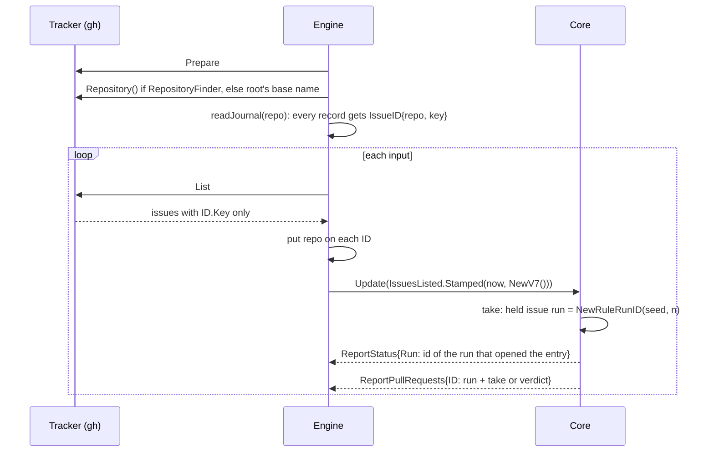

# Give issues and rule runs typed, global identities - Plan

The Product Contract below is the body of issue #238, as `/cw-split-plan` wrote it from the plan of #237. This file adds the implementation planning for this part only.

---

## Goal Capsule

- **Objective:** the database work that follows can store and reload crew's runs, and crew can later grow into a server over many repositories, without reshaping crew's domain again. Nobody using crew sees a difference.
- **Means:** typed names for every entity crew refers to, an issue identity that carries its repository, and rule-run ids minted from a seed the engine stamps on each input (KTD5, KTD6; plan KTD-P1 to KTD-P6).
- **Product authority:** the boss, through the #237 brainstorm and the planning session that followed. The Product Contract wins on behaviour; the KTDs win on mechanism.
- **Stop conditions:** stop and report when a unit cannot keep the build, the tests and the acceptance suite green without changing what users see (R20), or when a settled Key Decision proves unworkable.
- **Execution profile:** one branch, units in order (U1 expands, U2 to U5 switch, U6 documents), one pull request whose body carries `Closes #238`. #220 is not part of this work.
- **Open blockers:** none to start. The pull request cannot merge until a separate change that turns off Lizard's function metrics in Codacy is on `main` (KTD13 of #237).
- **Part:** part 1 of 6 of #237. It ships alone because it adds repository-qualified issue identities, global rule-run ids and typed references on today's core, and crew behaves as today on them.

---

## Product Contract

Product Contract preservation — restructured, no scope change: R20, which the issue's stop conditions cite but its body leaves out, is carried from #237; the Success Criteria name this part's checks, and #237's own criteria are kept as one line; Scope Boundaries add what this part leaves to later parts.

### Summary

Issues get an identity that includes their repository, rule runs get ids that are global and survive a restart, and every reference between entities becomes a typed name. The tracker names its repository through an optional capability. Nothing users see changes.

### Problem Frame

`internal/crew` is a shared vocabulary of data structs, not a model. The concepts that matter most, the rule run and the action run, exist only as `heldIssue`, `actionRun` and `call`, private to `internal/core`. Entities refer to each other by bare strings, so `Action.Agent` and `Action.Bot` are names, and a label is a `State` in rules but a `string` on the board. Some identities are unique only inside one process (`Status.Run`, `PullRequestReport.ID`), and an issue's identity carries no repository. A database, which comes right after this work, and a server over many repositories each need the opposite: runs named the same everywhere, written and read back.

### Key Decisions

- KTD5. **Identities are typed, global, and minted outside the pure layer.**
  - `Repository` names a tracker's repository, with room for a tenant later. `IssueID` is a repository plus the tracker's key, and `Issue` keeps `Ref` for display.
  - `RuleRunID` is opaque. The engine stamps every input with a fresh UUID v7 seed, as it stamps the time, and the core derives each new run's id from the seed and the run's index in that input. Core tests stamp sequential seeds, so they stay deterministic.
  - Rules, actions, checks, agents, bots, labels and workspaces are referenced by their own name types. A label is `crew.State` everywhere, the board included.
  - `Status.Run` names the status comment's entry, not the rule run. The status lane keeps today's `assignRun` rule as a per-issue projection: a new entry when the rule changes or a non-ended status follows an ended one. The entry's id is the `RuleRunID` of the run that opened it, so it is global, and the GitHub adapter compares it only as text. A resumed run therefore still opens a new entry and keeps today's "stopped following" line.
  - `PullRequestReport.ID` is derived from the `RuleRunID` and the move it reports (take or verdict), so it stays the same across retries and processes.

  (session-settled: user-approved — chosen over a bare tracker key, process-local counters and ids minted inside the core: a number belongs to its repository, and the core must stay pure and deterministic.) Governs R3, R7.
- KTD6. **A tracker names its repository through an optional capability, by an identity that survives a rename.** The GitHub adapter resolves the repository's GraphQL node `id` as its identity and `nameWithOwner` as its display name, in `Prepare`, through the `repository(owner:, name:)` field it already queries for pull requests. A tracker without the capability gets the root directory's name. The engine reads the repository right after the tracker's `Prepare` and before it loads the journal, and the journal's loader takes it: a file journal belongs to one checkout, so the loader puts the current repository on every loaded record's `IssueID`. (session-settled: user-approved — chosen over identifying a repository by `owner/name`: the node id survives a rename.) Governs R7, AE4.

### Requirements

**Concepts and types**

- R3. Every reference from one entity to another is a typed identifier, never a bare string. A label has one type, shared by rules and the board.

**Identity**

- R7. Identifiers are global: an issue's identity includes its repository and leaves room for a tenant, and no identifier is unique only within one crew process.

**Visible behaviour (carried from #237)**

- R20. Nothing users see changes: the live view, the line renderer, the tracker comments' visible text, the journal's lines, the README's promises, the acceptance suite and the TUI golden files stay as they are.

### Acceptance Examples

- AE4. **Covers R7.** Given two repositories that each have an issue keyed `42`, their rule runs have different identities.

### Success Criteria

- The acceptance suite and the TUI golden files pass unchanged.
- No field, parameter or map key in `internal/crew`, `internal/core`, `internal/port` or `internal/engine` refers to an issue, rule, action, check, agent, bot, label, queue or workspace by a bare `string`.
- Two runs of crew, or two repositories, never produce the same rule-run id, status entry id or pull request report id.
- #237's own criteria (a store adapter added without changing `internal/crew`; no "set when" field comments) are met by the six parts together; this part must not add to what they remove.

### Scope Boundaries

- Anything #220 brings: verdicts, routes, sequences of actions, functions, waiting for an answer.
- The database, a durable outbox, the server, real multi-tenancy, a distributed scheduler and a pool of session workers.
- A port for the journal and a second journal version: KTD6 names `port.Journal.Load` and version 2, neither of which exists yet. This part gives the engine's journal reader the repository; the part that makes the rule run an aggregate adds the port.
- `CallID`, the counter that pairs a core command with its result, stays process-local: it is never stored, shown or sent outside the process, and the outbox part replaces it.
- The journal's `run` field, the crew process's start time, stays as it is.
- The other parts of #237, built in their own issues: display wording out of crew's domain; session and check text types; tracker calls through an outbox; validated agent, bot and action definitions; the rule run as an aggregate.

### Dependencies / Assumptions

- No failure has come from today's model. The motivation is maintenance and expansion.
- Codacy runs on this repository, and its configuration takes effect only once merged to `main`.
- Go 1.27's standard `uuid` package provides `NewV7`; `internal/captain` already uses it.

### Sources / Research

- Split from #237.
- `internal/crew/*.go`: today's domain types.
- `internal/core/model.go`, `update.go`, `status.go` (`statusSlot`, `assignRun`), `pullrequest.go` (report ids from `lastID`), `resume.go` (`runKey`), `input.go` (`Stamped`).
- `internal/engine/engine.go` (`prepare`, `step`, `sessionKey`), `journal.go` (`readJournal`, `record`).
- `internal/adapter/github/tracker.go` (`Prepare`, `item`), `status.go` (`markerLine`, `nextStatus`), `pullrequest.go` (`pullRequestsQuery`, stop comments remembered by report id).
- `acceptance/fakegithub/schema.go`: the fake's `Repository` node, which refuses unknown fields.
- `internal/captain/captain.go`: a uuid minted outside the pure layer.
- `docs/solutions/integration-issues/closing-pull-requests-include-merged-and-foreign-ones.md`: a number belongs to its repository.
- `docs/solutions/runtime-errors/nul-in-gh-argument-freezes-status-comment.md`: the status lane's cross-run order.
- `docs/solutions/tooling-decisions/codacy-lizard-and-golangci-lint-limits.md`: functions of 50 lines and complexity 15, files of 500 lines.

---

## Planning Contract

### Key Technical Decisions

- KTD-P1. **Name types are defined string types in `internal/crew`.** `RuleName`, `ActionName`, `CheckName`, `AgentName`, `BotName`, `QueueName` and `WorkspaceName`, plus `State` for labels. A defined string type keeps untyped string constants compiling, so test literals stay as they are and only string variables need conversion. Governs R3.
- KTD-P2. **`Repository` is a struct; `IssueID` is a comparable struct.** `Repository{ID RepositoryID, Name string}`, where `RepositoryID` is a defined string; `IssueID{Repository RepositoryID, Key string}`. A tenant becomes one more field of both later. `Issue.Key` is replaced by `Issue.ID`; every `IssueKey string` field becomes `IssueID crew.IssueID`, and every map keyed by issue key is keyed by `IssueID`. Governs R7, KTD5.
- KTD-P3. **The engine qualifies issues; trackers do not.** A tracker's listing sets only `ID.Key`. The engine puts the repository it read after `Prepare` on every issue `List` and `ListBoard` return, and the journal reader puts it on every record. One rule covers trackers with and without the capability, and no adapter needs the fallback. Trackers take an `IssueID` in `Move` and use its `Key`. Governs R7, KTD6.
- KTD-P4. **The capability is `port.RepositoryFinder`.** `Repository() crew.Repository`, as `Prepare` found it, beside `CodeOwnerFinder` and `LoginFinder`. Without it the engine uses the base name of the root directory as both id and name. Governs KTD6.
- KTD-P5. **The seed rides `Stamped`; only `IssuesListed` keeps it.** `Input.Stamped(at time.Time, seed uuid.UUID)` replaces `Stamped(at)`, and the engine passes `uuid.NewV7()` with `time.Now()` for every input. Only a listing takes issues, so only `IssuesListed` stores the seed; the other inputs ignore it rather than carry a field nothing reads. A rule run's id is `crew.NewRuleRunID(seed, n)`, the seed's text and `n`, the run's 1-based index among the runs that input took, joined by a dot. Governs KTD5.
- KTD-P6. **Status entries and report ids derive from the held issue's run.** A held issue gets its `RuleRunID` at take. `status(h)` puts it on the status; `assignRun` keeps today's rule for when an entry opens, and the slot keeps the id of the run that opened it, replacing `m.runs` and the time-formatted id. A pull request report's id is the run's id plus `take` or `verdict`, replacing the `lastID` counter there. Governs KTD5.

### Assumptions

- Headless planning: no scoping confirmation ran. The decisions above are the agent's, inside the settled KTD5 and KTD6.
- The status marker's `run=` value changes format (a UUID-based id instead of a timestamp and count). It is inside a hidden HTML comment, and the GitHub adapter compares it only as text, so an entry written by an older crew simply never matches a new run's id, as today a new process's ids never match an old one's.
- The fake GitHub's repository id is a fixed string; nothing compares it with a real node id.

### High-Level Technical Design

How an issue's identity and a rule run's id flow (directional):

### Sequencing

U1 adds types nothing uses yet. U2 to U5 each switch one kind of identity across every package at once, because a changed field type breaks every user of it in the same build; each ends with the whole build, tests and acceptance suite green. U6 updates the documentation.

---

## Implementation Units

### U1. Identity and name types in the domain

**Goal:** the domain has every type the later units switch to, and nothing uses them yet.

**Requirements:** R3, R7; KTD5, KTD-P1, KTD-P2, KTD-P5.

**Dependencies:** none.

**Files:**
- Create `internal/crew/identity.go`
- Create `internal/crew/identity_test.go`

**Approach:**
- Name types of KTD-P1; `RepositoryID`, `Repository`, `IssueID` of KTD-P2; `RuleRunID` (a defined string, opaque) and `NewRuleRunID(seed, n)` of KTD-P5.
- `IssueID` has a `String()` method returning its key, documented as the display form, so a format call that prints an issue's key (`#%s`) keeps its text when its argument becomes an `IssueID` (R20).
- A pull request report's id helper (run id plus `take` or `verdict`), or leave it to U5 if it reads better in `pullrequest.go`.
- Doc comments say what each identifies and that ids are global; no comment ties a field's validity to another field.

**Patterns to follow:** `internal/crew/state.go` (a defined string type with its doc), `internal/crew/task.go` (stdlib `uuid` in the domain).

**Test scenarios:**
- Covers AE4. Two `IssueID`s with key `42` and different repositories are not equal, and work as two map keys.
- `NewRuleRunID` gives the same id for the same seed and index, and different ids for a different seed or a different index.
- Ids from sequential seeds (seed n index 2, seed n+1 index 1) do not collide.
- `fmt.Sprintf("#%s", id)` for an `IssueID` keyed `42` gives `#42`.

**Verification:** the new tests pass; nothing else changed.

### U2. Typed names across the packages

**Goal:** every reference to a rule, action, check, agent, bot, queue, workspace or label is its name type.

**Requirements:** R3, R20; KTD5, KTD-P1.

**Dependencies:** U1.

**Files:**
- Modify `internal/crew/rule.go`, `board.go`, `status.go`, `pullrequest.go`
- Modify `internal/config/agents.go`, `rules.go`, `board.go` and the files holding bots and queues
- Modify `internal/port/port.go` (`Identity.Bot`, `Space.Name`, `Workspace.Create`'s action, `Check.Name` and `Check.Action`, `BoardLister.ListBoard`'s labels)
- Modify `internal/core/*.go` (inputs, commands, events, views, `RunRecord`, `BotsConfig`, `runKey`)
- Modify `internal/engine/*.go` (`sessionKey`, harness lookup by agent, journal lines)
- Modify `internal/adapter/{github,claude,codex,git,shell}/*.go`, `internal/bots` callers in `cmd/crew`, `internal/app`, `internal/fake`, `internal/ui/lines`, `internal/ui/tui`
- Test: the existing tests of each package, updated where a string variable meets a typed field

**Approach:**
- Change the domain fields first, then follow the compiler outward. Convert with `string(x)` only where text is built for a person or a command line (renderers, gh arguments, file names, env values).
- `BoardColumn.Labels` and `BoardIssue.Labels` become `[]State`; `BoardLabels` returns `[]State`.
- `DefaultQueue` becomes a `QueueName` constant.
- No wording, ordering or output changes: renderers print the same text.

**Patterns to follow:** how `crew.State` already crosses config, core, the GitHub adapter and the TUI.

**Test scenarios:**
- Test expectation: no new behaviour. The existing suites, the TUI golden files and the acceptance suite pass unchanged, which is the proof that typing changed nothing visible (R20).

**Verification:** `go build`, `go vet`, golangci-lint and `go test -race ./...` pass; a search of the four inner packages finds no `string` field naming one of these entities.

### U3. The tracker names its repository

**Goal:** the engine knows the repository it works on, from the tracker or from the root directory.

**Requirements:** R7; KTD6, KTD-P4.

**Dependencies:** U1.

**Files:**
- Modify `internal/port/port.go` (`RepositoryFinder`, package doc's list of optional interfaces)
- Modify `internal/adapter/github/tracker.go` (`Prepare` resolves the repository; `Repository()`)
- Modify `internal/engine/engine.go` (read the repository after the ports' `Prepare`, before the journal)
- Modify `acceptance/fakegithub/schema.go` (`id` on `Repository`) and its tests; `acceptance/README.md` if it lists the fake's fields
- Test: `internal/adapter/github/prepare_test.go`, `internal/engine/prepare_test.go`

**Approach:**
- The GitHub adapter runs one `gh api graphql` query for `repository(owner:, name:) { id nameWithOwner }`, filled the way `pullRequestsQuery` fills owner and name. It reports no new `port.Step`: each step is a visible startup line that acceptance snapshots record (R20). It runs right after the existing "reading the repository's labels" step is reported, before `gh label list`. A failure returns an error that names the repository read (`tracker github: read the repository: …`) and runs no later gh call.
- The repository is kept under the adapter's mutex and returned by `Repository()`.
- The engine stores the repository it read; U4 uses it.

**Patterns to follow:** `CodeOwnerFinder`/`LoginFinder` and how `prepare` reads them; `pullRequestsQuery` in `internal/adapter/github/pullrequest.go`; the scripted gh runner in the adapter's tests.

**Test scenarios:**
- GitHub `Prepare` with a scripted reply holding an id and `nameWithOwner` makes `Repository()` return both.
- GitHub `Prepare` whose repository query fails returns an error naming the repository read, and runs no later gh call.
- The steps GitHub `Prepare` reports are the same list as before (the existing step list in `prepare_test.go` stays unchanged).
- The engine with a tracker that implements `RepositoryFinder` (a test type embedding the fake tracker) uses its repository; with the plain fake tracker it uses the root directory's base name.
- The fake GitHub answers a query for `repository { id }` with its fixed id.

**Verification:** adapter, engine and fake GitHub tests pass; the acceptance suite passes against the new query.

### U4. Issues carry their repository

**Goal:** an issue's identity is its repository plus its key everywhere crew holds, compares or sends it.

**Requirements:** R7, R20, AE4; KTD5, KTD6, KTD-P2, KTD-P3.

**Dependencies:** U2, U3.

**Files:**
- Modify `internal/crew/issue.go`, `rule.go` (`FailureReport`), `status.go`, `pullrequest.go`, `board.go`
- Modify `internal/port/port.go` (`Tracker.Move` takes an `IssueID`; `Check` carries the `IssueID`; `List` and `ListBoard` docs say the tracker sets only the key)
- Modify `internal/core/*.go` (every `IssueKey` field, `held`, `action`, the status and pull request slot maps, `otherKinds`, `runKey`, the board)
- Modify `internal/engine/engine.go`, `exec.go`, `journal.go` (qualify listed issues; `readJournal` takes the repository; `sessionKey`)
- Modify `internal/adapter/github/*.go`, `internal/adapter/git`, `internal/adapter/shell/check.go` (use `ID.Key` where the key meets gh, a branch or `CREW_ISSUE_KEY`)
- Modify `internal/fake/tracker.go`, `internal/ui/tui/*.go` (maps keyed by `IssueID`)
- Test: `internal/core/driver_test.go` helpers and the core suites; `internal/engine/journal_test.go`, `engine_test.go`; adapter and TUI tests updated mechanically

**Approach:**
- Replace `Issue.Key` by `Issue.ID`, then follow the compiler. Each test package gets a small helper that builds an `IssueID` from a key, so the change to its literals is mechanical.
- The engine puts the repository on each issue a listing or board read returns (KTD-P3), before stamping the input.
- The journal keeps its line format and version: `issue` is the key, and the reader rebuilds each record's `IssueID` with the repository it is given.
- Error messages and comments keep printing the key as today (`#42`), through `IssueID.String()` where a format call now gets the whole `IssueID`.

**Patterns to follow:** `crew.Issue.Clone`; the engine's existing scrub-then-stamp handling of results in `exec.go`.

**Test scenarios:**
- Covers AE4. One listing holding two issues keyed `42`, each from its own repository, in a rule's ready label: the core takes both as two held issues, with two moves, two status slots and different rule-run ids (the run ids once U5 lands; the issue identities here).
- The engine puts the tracker's repository on every listed issue and every board issue before the core sees them.
- The journal reader gives each record the repository it is passed, and a failed run recorded before the restart resumes for the same issue key.
- A journal line written before this change still loads and resumes (format unchanged).
- The shell check still gets `CREW_ISSUE_KEY` as the bare key.

**Verification:** every suite, the golden files and the acceptance suite pass unchanged.

### U5. Rule runs get global ids

**Goal:** each rule run has an id no other run has, in any repository or process; status entries and pull request reports take theirs from it.

**Requirements:** R7, R20, AE4; KTD5, KTD-P5, KTD-P6.

**Dependencies:** U4.

**Files:**
- Modify `internal/core/input.go` (`Stamped(at, seed)`; `IssuesListed.Seed`)
- Modify `internal/core/update.go`, `model.go` (the held issue's run, minted at take from the step's seed and count)
- Modify `internal/core/status.go` (`assignRun` keeps the opener's run id; drop `m.runs`)
- Modify `internal/core/pullrequest.go` (report id from the run and the move; `lastID` no longer used there)
- Modify `internal/crew/status.go` (`Status.Run` is a `RuleRunID`, documented as the entry's id), `pullrequest.go` (`ID` documented as stable across retries and processes)
- Modify `internal/engine/engine.go` (`Stamped(time.Now(), uuid.NewV7())`)
- Modify `internal/adapter/github/status.go`, `pullrequest.go` (compare and remember as text)
- Test: `internal/core/driver_test.go` (sequential seeds), `status_test.go`, `pullrequest_test.go`, `internal/engine/status_test.go`, `internal/adapter/github/status_entries_test.go`

**Approach:**
- The step holds the input's seed and a count of runs it took; `take` mints the run id.
- `status(h)` sets `Run` to the held issue's run; `assignRun` opens an entry under today's rule and records that run's id on the slot, and every status of that entry carries the slot's id.
- The GitHub adapter's marker writes `string(Run)`, query-escaped as now.

**Patterns to follow:** `internal/captain/captain.go` for `uuid.NewV7`; today's `assignRun` rule, kept as it is.

**Test scenarios:**
- Covers AE4. Two models, each fed a listing of an issue keyed `42` (one per repository) with different seeds, give runs with different ids; the same model fed the same seed twice gives the same ids (determinism).
- Two issues taken by one listing get different run ids (index 1 and 2 of the same seed).
- A rule run's running and ended statuses carry the same `Run`; the next run of the same issue for the same rule opens a new entry with the new run's id.
- A status of another rule while the entry is open opens a new entry with the run id of that status's run.
- A pull request report keeps its id across a failed attempt and its retry; the take report and the verdict report of one run have different ids; reports of two runs differ.
- The engine stamps a different seed on two inputs (a test reads the run ids two listings produce).
- The GitHub adapter edits the latest entry when its `run=` equals the status's run and appends otherwise, with UUID-based ids.

**Verification:** every suite, the golden files and the acceptance suite pass unchanged.

### U6. Documentation

**Goal:** the docs that describe crew's structure name the new identities.

**Requirements:** R3, R7.

**Dependencies:** U3, U5.

**Files:**
- Modify `AGENTS.md` (the `internal/port` list gains `RepositoryFinder`)
- Modify `CONCEPTS.md` (Rule run: its id is global; a short Repository entry: crew identifies an issue by its repository and key)
- Modify `acceptance/README.md` only if U3 did not already

**Approach:** one or two sentences each, in the files' existing style. The README describes no identity, so it stays as it is (R20).

**Test scenarios:** Test expectation: none -- documentation only.

**Verification:** the entries read true against the code.

---

## Verification Contract

| Gate | Command | Applies to |
| --- | --- | --- |
| Format | `gofmt -l cmd internal tools acceptance` prints nothing | every unit |
| Vet | `go vet ./...` | every unit |
| Lint and layering | `go run github.com/golangci/golangci-lint/v2/cmd/golangci-lint@v2.14.0 run` | every unit |
| Tests | `go test -race ./...` | every unit |
| Coverage | the total floor (`.testcoverage.yml`) and `tools/diffcover` on changed lines, both at least 90% | the branch |
| Acceptance | build crew, then `go -C acceptance run ./cmd/acceptance -count=1`: every scenario passes, no snapshot changes | U2, U3, U4, U5 |
| Acceptance module | `go -C acceptance vet ./...` and golangci-lint there | U3 |
| TUI golden files | `go test ./internal/ui/tui` with no `-update` | U2, U4, U5 |

---

## Definition of Done

- U1 to U6 are in, each leaving the build, the tests and the acceptance suite green.
- No `string` field, parameter or map key in `internal/crew`, `internal/core`, `internal/port` or `internal/engine` names an issue, rule, action, check, agent, bot, queue, label or workspace.
- AE4 is covered by tests in `internal/crew` and `internal/core`.
- No TUI golden file or acceptance snapshot changed; the journal's line format did not change.
- Every gate of the Verification Contract passes.
- No abandoned attempt, helper or comment from a discarded approach is left in the diff.
