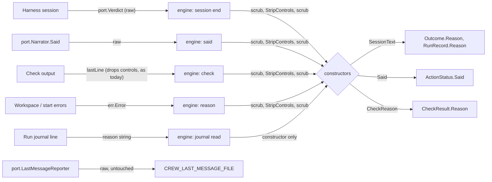

# Give session and check text their own types, stripped where it enters crew - Plan

This file is the body of issue #240, as `/cw-split-plan` wrote it from the plan of #237, followed by the implementation planning for this part.

## Goal Capsule

- **Objective:** the database work that follows can store and reload crew's runs, and crew can later grow into a server over many repositories, without reshaping crew's domain again. Nobody using crew sees a difference, and no byte a session or check prints can break a status comment or reach a terminal as a control sequence.
- **Means:** three domain types in `internal/crew` for the text crew shows from sessions and checks, each built only by a constructor that strips control characters, called after the engine's scrub (KTD11, KTD1, KTD3).
- **Product authority:** the boss, through the brainstorm and planning of #237. The Product Contract wins on behaviour; the KTDs win on mechanism.
- **Stop conditions:** stop and report when a unit cannot keep the build, the tests and the acceptance suite green without changing what users see beyond the deltas KTD4 accepts, or when a settled Key Decision proves unworkable.
- **Execution profile:** one branch, units in order (U1 adds, U2 to U6 switch one text at a time, U7 updates the learnings), one pull request whose body carries `Closes #240`. #220 is not part of this work.
- **Open blockers:** none to start. The pull request cannot merge until a separate change that turns off Lizard's function metrics in Codacy is on `main` (#237's KTD13).
- **Part:** this issue is part 3 of 6 of #237. It ships alone because it retypes the text crew shows from sessions and checks on today's model, and every comment and screen shows what it shows today.

---

## Product Contract

Product Contract preservation: unchanged. The first two Success Criteria are #237's and are met by all six parts together; this part only must not move away from them.

### Summary

An outcome's reason, what a session last said and a check's reason get their own types, stripped of control characters where the text enters crew. The failure report cannot take the outcome's reason, and the last message handed to checks stays raw.

### Problem Frame

`internal/crew` is a shared vocabulary of data structs, not a model. The concepts that matter most, the rule run and the action run, exist only as `heldIssue`, `actionRun` and `call`, private to `internal/core`. `Agent` lives in `internal/config` and `Identity` in `internal/port`. Entities refer to each other by bare strings, so `Action.Agent` and `Action.Bot` are names, and a label is a `State` in rules but a `string` on the board. Invariants live in comments: `Status.To` is "set when Kind is StatusEnded", and an issue "in exactly one" state is only a sentence. The domain also formats for the screen and the tracker (`Spend.String`, `formatTokens`, `Kind.String` "for renderers") and carries a live-view setting (`Rule.Notify`).

None of this has cost a failure yet. The cost is ahead. A database comes right after this work, and crew may become a server that runs many repositories for thousands of developers. Today a rule run "belongs to one crew process", and one reducer holds every run of a repository from one goroutine. The core's `call` mixes the decision to move a label with retrying the move (`owed`, `inFlight`, `final`). Some identities are unique only inside one process (`Status.Run`, `PullRequestReport.ID`), and an issue's identity carries no repository. A database and a server each need the opposite: runs that change on their own, can be written and read back, and are named the same everywhere.

For this part, the text is a plain `string` everywhere. Whether control characters are stripped depends on which harness produced it: a Claude reason and both harnesses' last words keep NUL and ESC, while a Codex reason and a check's line lose them. Keeping a session's words out of the failure comment holds only because `renderReport` happens not to read `ActionFailure.Reason`.

### Key Decisions

- KTD11. **Text crew shows from a session or a check has its own types.** `crew.SessionText` holds an outcome's reason; its constructor strips control characters, and the engine's scrub of tokens, keys and paths runs before it. The failure report and `RuleEnd` have no field of that type. Two separate types, built the same way, carry what tracker comments show today: `Said`, the status's "It last said" line, and a check's reason, which the status and `RuleEnd` keep as today. The last message handed to checks through `CREW_LAST_MESSAGE_FILE` is not shown by crew and stays raw, byte for byte, as the README promises. Governs R20, R23. (session-settled: user-approved — chosen over removing the status comment's "It last said:" line: removing it is a visible change R20 rules out.)
- **The last message handed to checks stays raw.** Governs R23. (session-settled: user-approved — chosen over stripping it like the shown text: crew does not show it, and the README promises the session's last message as it wrote it.)
- **This part ships alone, on today's behaviour.** (session-settled: user-approved — chosen over doing the whole #237 redesign in one pull request: the split record on #237.)

### Requirements

**Concepts and types**

- R23. Text from a session or a check that crew shows (an outcome's reason, what a session last said, a check's reason) has its own types, the failure report cannot take the outcome's reason, and their control characters are stripped where the text enters crew. The last message handed to checks stays as the session wrote it.

R20 is #237's: crew behaves exactly as it does today. KTD4 records the two deltas R23 itself causes.

### Success Criteria

- The database work adds a store adapter for rule runs and their events without changing any type or rule in `internal/crew`.
- A search of `internal/crew` for "set when" or "set only" finds no field comment that ties a field's validity to another field.
- The acceptance suite and the TUI golden files pass unchanged.

### Scope Boundaries

- Anything #220 brings: verdicts, routes, sequences of actions, functions, waiting for an answer.
- The database, a durable outbox, the server, real multi-tenancy, a distributed scheduler and a pool of session workers.
- Whether a store keeps events or state as its source of truth: the database work decides.
- Models (LLMs) as a domain concept: a model stays a harness setting (R2 of #237).
- Considered and not built: a type per phase (typestate). It gives compile-time transitions but serialises awkwardly and makes every new phase touch every switch in the core.
- Considered and not built: removing the status comment's "It last said:" line. It posts scrubbed session text in public, but removing it is a visible change R20 rules out; R23 strips its control characters instead.
- Considered and not built: moving the control-character drop out of `lastLine` (checks) and Codex's `oneLine` so the engine's scrub sees their raw bytes. It would close a token-adjacency gap that exists today, but it changes a check reason's visible text for coloured output (`[31mred[0m` becomes `red`, KTD2). Evidence that would change the call: the token-redaction follow-up below choosing to change those texts anyway.
- The other parts of #237, built in their own issues: Give issues and rule runs typed, global identities; Move display wording out of crew's domain into the renderers; Deliver tracker calls through an outbox in the core; Load agents, bots and actions into validated domain definitions; Make the rule run an aggregate that decides, journals and projects its own events.

#### Deferred to Follow-Up Work

- Token redaction next to a control byte or an ANSI code. `Engine.scrub`'s token pattern starts with `\b`, so `foo\x1b[0mghp_…` (a colour code against a token) leaks in any order, today and after this work, and `foo\x00ghp_…` leaks for check and Codex text because they drop the NUL before the scrub. Fixing it changes the scrub's pattern or the check's visible text, both outside this part.

### Dependencies / Assumptions

- No failure has come from today's model. The motivation is maintenance and expansion, and the boss treats them as a premise.
- A database comes right after this redesign, and crew may later run as a server over many repositories for thousands of developers.
- Codacy runs on this repository (`CODACY_ENABLED` is `true`), and its configuration takes effect only once merged to `main`.
- Open pull requests change the TUI (#232, #233), and a redesign across about eleven packages will conflict with work that merges first.

### Sources / Research

- Split from #237.
- `internal/crew/*.go`: today's domain types, including the comment-only invariants in `status.go`, `rule.go` and `issue.go`, and the formatting in `usage.go`.
- `docs/solutions/runtime-errors/nul-in-gh-argument-freezes-status-comment.md`: strip control characters where text enters crew; `Said` is still unfiltered.
- `docs/solutions/security-issues/session-text-in-public-tracker-comments.md`: session text never reaches a public comment.
- `docs/solutions/design-patterns/mid-run-adapter-state-reaches-the-view-by-polling.md`: `Said` reaches the core by the engine polling `port.Narrator`, coalesced with `slices.Equal`.
- `docs/solutions/tooling-decisions/codacy-lizard-and-golangci-lint-limits.md`: functions of 50 lines and complexity 15, files of 500 lines. `internal/core/update.go` is at 482 of 500 non-comment lines and `internal/adapter/github/status.go` at 439.
- `internal/engine/paths.go` (`scrub`, `lastWords`), `internal/engine/exec.go` (`check`, `saying`, `lastLine`, the session end), `internal/engine/engine.go` (`said`, `refreshSaid`): today's entry points.
- `internal/ui/tui/text.go` (`clean`): the TUI already removes whole ANSI sequences and turns control characters into spaces, which KTD2 matches.

---

## Planning Contract

### Key Technical Decisions

- KTD1. **Each type is a struct with one unexported string field, a `New…` constructor and a `String` method.** The types are `crew.SessionText`, `crew.Said` and `crew.CheckReason`, in a new `internal/crew/text.go`. A named `string` type could be converted around the constructor (`crew.SessionText("\x00")`), which defeats "stripped where it enters crew". The struct stays comparable, which `slices.Equal` in `engine.refreshSaid` and `reflect.DeepEqual` in `core.sameAction` need, and its zero value is the empty text. No crew type is JSON-encoded (the journal has its own line struct), so the unexported field costs nothing there. Governs R23.
- KTD2. **One stripping rule, shared by the three constructors and exported as `crew.StripControls`.** It drops invalid UTF-8, removes whole escape sequences the way the TUI's `clean` does (`ansi.Strip`: CSI, OSC, DCS, SOS, PM and APC strings up to their terminator or the end of the text, two-byte ESC sequences with their intermediates such as `ESC ( B` and `ESC 7`, and the 8-bit CSI), keeps tab, and turns every other control character (C0, DEL and C1) into a space. It does not trim or fold spaces, so text without controls passes through unchanged and the rule is idempotent. That is what `clean` already does on screen before it folds spaces, so the TUI shows the same text. A check's line and a Codex reason reach the constructor with their control bytes already dropped (Scope Boundaries), so their text does not change either. A space, rather than nothing, also keeps a dropped byte from joining two words into a token the scrub then misses. The matcher uses only the standard library: the domain imports no terminal package. Governs R23.
- KTD3. **The engine builds every one of these values, in the order scrub, strip, scrub.** A helper beside `scrub` in `internal/engine/paths.go` scrubs, applies `crew.StripControls`, then scrubs again, and the constructors take its result. Scrubbing first is the settled order (KTD11). Scrubbing again closes the case where the strip itself joins a token: `gh\x1b[0mp_…` passes the first scrub and becomes `ghp_…` once the sequence goes. Conflict call-out on KTD11: scrubbing only before the strip leaves that case open, so this plan adds the second pass rather than changing the settled order. Governs R23.
- KTD5. **`port.Session.Wait` returns a raw `port.Verdict`, and the engine turns it into a `crew.Outcome`.** `port.Verdict` holds `Succeeded` and a plain-string `Reason`. If the harnesses built `crew.SessionText` themselves, the strip would run before the engine's scrub, and a Claude reason such as `foo\x00ghp_…`, which today's scrub redacts, would leak. The port imports only the domain today and this keeps it so. The fake harness's `Session.End` takes a `port.Verdict`. Governs R23.
- KTD6. **`crew.ActionFailure` loses its `Reason` field.** Nothing in production reads it: `renderReport` posts the action's name and its log only, and the TUI only counts a Handled entry's failures. Without the field, no session or check text can reach the failure comment, and the compiler enforces it. Tests that observed a reason through `Failures[i].Reason` read it from the `ActionEnded` event, the journal or the status instead. Governs R23.
- KTD7. **`core.CheckEnded` carries `Passed` and a `crew.CheckReason`, not a `crew.Outcome`.** The core builds the `CheckResult` from them, and when the check ends the action, it builds the action's `crew.Outcome` with `crew.NewSessionText(reason.String())`, keeping today's text: an action's reason may be a check's reason. Governs R23.
- KTD8. **Every core input whose reason becomes an action's outcome carries a `crew.SessionText` the engine built.** These are `SessionEnded.Outcome`, `WorkspaceFailed.Reason` and `SessionFailedToStart.Reason`. The core wraps only its own words (`stoppedReason`, `crashedReason` and the prompt-render error) with `crew.NewSessionText`. Reasons that never become an outcome (listing, call, status, report and record failures) stay strings: they are crew's or a tool's words, not R23's text. Governs R23.
- KTD9. **`core.RunRecord.Reason` is a `crew.SessionText`; the journal reader builds it with the constructor.** A journal line written before this change may hold a NUL or an ESC from a Claude reason, so reading the journal is another place where text enters crew. The line format, `reason` as a JSON string, does not change. Governs R23.
- KTD10. **`CREW_LAST_MESSAGE_FILE` keeps its path untouched.** `port.LastMessageReporter.LastMessage`, `core.SessionEnded.LastMessage`, `core.RunCheck.LastMessage` and `port.Check.LastMessage` stay plain strings, unscrubbed and unstripped. Governs R23 (session-settled: user-approved — chosen over stripping it like the shown text: crew does not show it, and the README promises it as the session wrote it.)
- KTD4. **Two visible deltas follow from R23 itself and are accepted.** A reason that held a line break, such as a git error with multi-line stderr, prints on one line in `--plain`, where it printed on several. A Claude reason holding colour codes or other control bytes prints without them in `--plain`, with a space where a control byte was, where the terminal used to receive them. The TUI, the status comment's check reasons, the acceptance snapshots and the TUI golden files do not change. Governs R23.

### High-Level Technical Design

Where each text enters crew, and what builds its type. The engine is the only place outside text becomes one of the three types; the core wraps only its own fixed words.

### Assumptions

- The constructors' names are `NewSessionText`, `NewSaid` and `NewCheckReason`, and the shared rule is `StripControls`. The implementer may rename them if a linter or the code's idiom calls for it.
- The std-only matcher can reproduce what `ansi.Strip` removes for the sequences KTD2 lists; U1's property test against `clean` is the check.
- A session's or a tool's reason with no control characters reads the same before and after, so every golden file and acceptance snapshot stays unchanged.

### Sequencing

U1 adds the types without using them, so the build stays green. U2 changes the port alone. U3 to U6 each switch one text and leave the build green. U7 updates the learnings this work makes stale.

---

## Implementation Units

### U1. The three text types and their stripping rule

- **Goal:** add `crew.SessionText`, `crew.Said`, `crew.CheckReason` and `crew.StripControls`, used by nothing yet.
- **Requirements:** R23; KTD1, KTD2.
- **Dependencies:** none.
- **Files:** `internal/crew/text.go`, `internal/crew/text_test.go`, `internal/ui/tui/text_test.go`.
- **Approach:**
  1. One struct per type, each with an unexported text field, a constructor that applies `StripControls`, and a value-receiver `String`.
  2. `StripControls` follows KTD2 with a package-level pattern for the escape sequences and a rune map for the rest.
  3. Document each type with what it holds and where it is built (the engine), and `SessionText`'s note that the failure report and `RuleEnd` never carry it.
- **Patterns to follow:** `internal/crew/state.go` for small domain types; `lastLine.end` in `internal/engine/exec.go` and `clean` in `internal/ui/tui/text.go` for the existing rules; `funcorder` puts each constructor right after its type.
- **Test scenarios:**
  - Plain text such as `the check tests passed: ok` comes out unchanged from each constructor.
  - `a\x00b` gives `a b`; DEL and a C1 character (U+0085) each become one space.
  - `fatal: x\nhint: y` gives `fatal: x hint: y`; a bare `\r`, `\v` and `\f` each become one space.
  - A tab stays a tab.
  - `\x1b[31mred\x1b[0m` gives `red`; an OSC title sequence ended by BEL, one ended by `ESC \` and one left unterminated are removed whole; `\x1b(Bdone\x1b[m` gives `done`; `a\x1b7b` gives `ab`.
  - In `internal/ui/tui` (the domain cannot import the TUI): for each input above, `clean` of the built text equals `clean` of the raw text, the property that keeps the screen unchanged.
  - Invalid UTF-8 bytes are dropped.
  - Idempotence: building from the `String` of a built value gives an equal value, for each of the inputs above.
  - The zero value's `String` is empty, and equals the value built from an empty string.
- **Verification:** `go test ./internal/crew` passes, and the new file passes golangci-lint without a `nolint`.

### U2. The harness port returns a raw verdict

- **Goal:** `port.Session.Wait` returns a `port.Verdict`, and the engine builds the `crew.Outcome` (still with a string reason here).
- **Requirements:** R23; KTD5.
- **Dependencies:** none.
- **Files:** `internal/port/port.go`, `internal/adapter/claude/harness.go`, `internal/adapter/claude/stream.go`, `internal/adapter/codex/events.go`, `internal/adapter/codex/harness.go`, `internal/fake/harness.go`, `internal/engine/exec.go`, and the tests that end fake sessions or read verdicts: `internal/adapter/claude/harness_test.go`, `internal/adapter/codex/events_test.go`, `internal/adapter/codex/harness_test.go`, `internal/fake/fake_test.go`, and the `End(crew.Outcome{…})` calls in `internal/engine`, `internal/app` and `internal/ui/tui` tests.
- **Approach:**
  1. Add `port.Verdict` beside `Session`, with the `Wait` doc moved onto it.
  2. The adapters return it where they return `crew.Outcome` today, with the same text. Codex's `oneLine` keeps its control drop (Scope Boundaries).
  3. The engine's session end turns the verdict into a `crew.Outcome`, scrubbing the reason as today.
- **Patterns to follow:** the port's other plain result structs (`port.Space`).
- **Test scenarios:**
  - Existing claude and codex verdict tests pass with the new type, with the same reasons.
  - A fake session ended with a failed verdict still ends its action as failed with that reason (existing engine tests).
- **Verification:** `go build ./...` and `go test -race ./...` pass; depguard still holds (`port` imports only `crew`).

### U3. An outcome's reason is a `crew.SessionText`

- **Goal:** `crew.Outcome.Reason` and `core.RunRecord.Reason` become `crew.SessionText`, built by the engine after the scrub, and every reader uses `String`.
- **Requirements:** R23; KTD3, KTD8, KTD9, KTD4.
- **Dependencies:** U1, U2.
- **Files:** `internal/crew/rule.go`, `internal/engine/paths.go`, `internal/engine/exec.go`, `internal/engine/journal.go`, `internal/core/input.go`, `internal/core/action.go`, `internal/core/update.go`, `internal/core/resume.go`, `internal/ui/lines/lines.go`, `internal/ui/tui/detail.go`; tests in `internal/engine/shorten_test.go`, `internal/engine/journal_test.go`, `internal/engine/resume_test.go`, `internal/core/*_test.go`, `internal/ui/lines/lines_test.go`, `internal/ui/tui/popup_test.go`, `internal/app/*_test.go`.
- **Approach:**
  1. Add the scrub-strip-scrub helper to `internal/engine/paths.go` (KTD3).
  2. The engine builds `SessionText` at the session end and for `WorkspaceFailed` and `SessionFailedToStart` reasons (KTD8).
  3. The core wraps its own words with the constructor. `core/update.go` is near its line limit, so the change there replaces lines rather than adding them.
  4. The journal writes `String()` and builds the type when it reads a line (KTD9). The resume paragraph reads `String()`.
  5. lines and the TUI read `String()`; the TUI keeps `clean` as its own guard.
- **Patterns to follow:** `scrub`'s doc comment for the helper's; `TestACheckReasonCarriesNoControlBytes` for hostile-byte tests.
- **Test scenarios:**
  - A Claude-style session that ends with `exit 1 after: \x1b[31mbo\x00om\x1b[0m` gives an `ActionEnded` reason `exit 1 after: bo om`.
  - A session whose reason holds `gh\x1b[0mp_<token>` ends with the token redacted (the second scrub); so does `foo\x00ghp_<token>`.
  - A session whose reason holds the repository root's absolute path ends with `.` in its place, as today.
  - A workspace that fails with an error holding `fatal: x\nhint: y` ends its action with the reason `… fatal: x hint: y`.
  - A journal line whose `reason` holds a NUL loads as a record whose reason has none, and a resumed run's prompt quotes the stripped text.
  - A journal written and read back keeps a plain reason byte for byte, and the line's JSON shape is unchanged.
  - `--plain` prints an ended action's reason as before for plain text (existing lines tests).
- **Verification:** `go test -race ./...` passes; `go test ./internal/ui/tui` passes without `-update`.

### U4. What a session last said is a `crew.Said`

- **Goal:** `core.Said.Text` and `crew.ActionStatus.Said` become `crew.Said`, built by the engine, so the status comment's "It last said" line holds no control character.
- **Requirements:** R23; KTD1, KTD3.
- **Dependencies:** U1, U3.
- **Files:** `internal/crew/status.go`, `internal/core/input.go`, `internal/core/model.go`, `internal/core/update.go`, `internal/core/status.go`, `internal/engine/engine.go`, `internal/adapter/github/status.go`, `internal/ui/tui/memory.go`; tests in `internal/engine/said_test.go`, `internal/core/status_test.go`, `internal/crew/status_test.go`, `internal/adapter/github/status_render_test.go`, `internal/ui/tui/memory_test.go`, `internal/ui/tui/popup_test.go`.
- **Approach:**
  1. `Engine.said` runs the helper, then `lastWords`, then `NewSaid`, and skips a session whose text is empty after stripping.
  2. The core stores the type in the action run and copies it to the status as today.
  3. The GitHub adapter and the TUI read `String()`.
- **Patterns to follow:** the existing R18 tests in `internal/engine/said_test.go`.
- **Test scenarios:**
  - A running session that says `\x1b[32mrunning tests\x1b[0m` shows `running tests` under "It last said" in the status the tracker receives.
  - A session that says `a\x00b` gives a status write whose body holds no NUL.
  - A session whose last words are only control characters gives no "It last said" line, as an empty one does today.
  - A session that says more than 200 characters still shows the last 200, starting with `…`.
  - Two refreshes with the same text step the core once (the `slices.Equal` coalescing still holds).
  - The TUI test that fed an escape sequence through `core.Said` now builds its input with `crew.NewSaid` and still shows `tests fail`.
- **Verification:** `go test -race ./...` passes; the TUI golden files and `status_render_test.go`'s expected bodies are unchanged.

### U5. A check's reason is a `crew.CheckReason`; the last message stays raw

- **Goal:** `crew.CheckResult.Reason` becomes `crew.CheckReason`, `core.CheckEnded` carries `Passed` and the reason, and a test pins the raw last message.
- **Requirements:** R23; KTD7, KTD10, KTD3.
- **Dependencies:** U1, U3.
- **Files:** `internal/crew/rule.go`, `internal/crew/status.go`, `internal/core/input.go`, `internal/core/action.go`, `internal/engine/exec.go`, `internal/adapter/github/status.go`, `internal/adapter/github/report.go`; tests in `internal/engine/check_test.go`, `internal/core/checks_test.go`, `internal/core/check_test.go`, `internal/crew/status_test.go`, `internal/crew/pullrequest_test.go`, `internal/adapter/github/status_render_test.go`, `internal/adapter/github/pullrequest_test.go`.
- **Approach:**
  1. `Engine.check` returns whether it passed and a `CheckReason`: crew's words, plus the last line through the helper and `lastWords` (replacing the scrub in `saying`). `lastLine` keeps its line split and control drop.
  2. `checkEnded` builds the `CheckResult` and, when the check ends the action, its outcome as KTD7 says.
  3. `ActionStatus.FailedCheck` returns a `CheckReason`; the GitHub adapter reads `String()` where it writes code spans.
- **Patterns to follow:** `TestACheckReasonCarriesNoControlBytes`.
- **Test scenarios:**
  - `TestACheckReasonCarriesNoControlBytes` passes with its three expected reasons unchanged (`ab`, `no open pull request`, `[31mred[0m`).
  - A check that fails ends its action with an outcome reason equal to the check's reason.
  - A check that passes last ends its action as succeeded with the check's passing reason, as today.
  - A check that runs out of time, is stopped or cannot start gives today's reasons.
  - The status comment of a failed check and the pull request's stop comment show the check's reason in a code span, byte for byte as today (existing render tests).
  - Covers KTD10: a session whose last message holds `\x00`, `\x1b[31m`, a bare `\r` and the repository root's absolute path hands the check a `CREW_LAST_MESSAGE_FILE` (or `port.Check.LastMessage` in the fake checker) holding exactly those bytes.
- **Verification:** `go test -race ./...` passes.

### U6. The failure report cannot carry an outcome's reason

- **Goal:** remove `crew.ActionFailure.Reason` and move the tests that observed reasons through it to other observables.
- **Requirements:** R23; KTD6.
- **Dependencies:** U3, U5.
- **Files:** `internal/crew/rule.go`, `internal/core/update.go`; tests in `internal/core/check_test.go`, `internal/core/checks_test.go`, `internal/core/handled_test.go`, `internal/core/update_test.go`, `internal/core/stop_test.go`, `internal/core/timeup_test.go`, `internal/engine/check_test.go`, `internal/engine/shorten_test.go`, `internal/engine/stop_test.go`, `internal/engine/snapshot_test.go`, `internal/fake/tracker_test.go`, `internal/ui/tui/columns_test.go`, `internal/ui/tui/helpers_test.go`.
- **Approach:**
  1. Drop the field and its assignment in `judge`.
  2. Engine tests read reasons from the `ActionEnded` events the rig's subscription collects; core tests from the `ActionEnded` events their step returns; handled tests from the action's view.
  3. Keep `TestReportFailurePointsToEachLogWithoutTheSessionsWords` unchanged.
- **Test scenarios:**
  - A failed action's report still names the action, its workspace and its log, and the failure comment's body is unchanged (existing report tests).
  - Each reason a test read from `Failures[i].Reason` is asserted from `ActionEnded` with the same expected text.
  - A Handled entry still counts as failed when an action failed (existing TUI tests).
- **Verification:** `go test -race ./...` passes, and no test or production code refers to `ActionFailure.Reason`.

### U7. Bring the learnings up to date

- **Goal:** the two learnings this work makes stale say what is true after it.
- **Requirements:** R23.
- **Dependencies:** U3 to U6.
- **Files:** `docs/solutions/runtime-errors/nul-in-gh-argument-freezes-status-comment.md`, `docs/solutions/security-issues/session-text-in-public-tracker-comments.md`.
- **Approach:** in the first, the Prevention item that names `Said` as unfiltered now says the three types strip at the engine. In the second, the claim that the scrub only shortens paths now also names tokens and keys, and the failure report's protection is the missing field rather than a convention.
- **Test expectation:** none -- documentation only.
- **Verification:** each changed claim matches the code; `docs-verification` finds no broken path.

---

## Verification Contract

| Gate | Command | Applies to |
|---|---|---|
| Format | `gofmt -l cmd internal tools acceptance` prints nothing | every unit |
| Vet | `go vet ./...` | every unit |
| Tests | `go test -race ./...` | every unit |
| TUI goldens unchanged | `go test ./internal/ui/tui`, without `-update`, and no diff under `internal/ui/tui/testdata/` | U3, U4 |
| Lint and layering | `go run github.com/golangci/golangci-lint/v2/cmd/golangci-lint@v2.14.0 run` | every unit |
| Coverage | `go test -race -covermode=atomic -coverpkg=./... -coverprofile=coverage.out ./...`, then `go run github.com/vladopajic/go-test-coverage/v2@v2.19.0 --config=.testcoverage.yml` (total at least 90%) and `git diff -U0 origin/main...HEAD \| go run ./tools/diffcover -profile coverage.out` (changed lines at least 90%) | before shipping |
| Vulnerabilities | `go run golang.org/x/vuln/cmd/govulncheck@v1.8.0 ./...` | before shipping |
| Acceptance | `go -C acceptance run ./cmd/acceptance -count=1`, with no snapshot rewritten | before shipping |

## Definition of Done

- U1 to U7 are done and each unit's test scenarios exist and pass.
- `crew.Outcome.Reason`, `core.RunRecord.Reason`, `crew.ActionStatus.Said`, `core.Said.Text` and `crew.CheckResult.Reason` are the three new types, and nothing outside the engine builds one from outside text.
- `crew.FailureReport`, `crew.ActionFailure` and `crew.RuleEnd` have no field of type `crew.SessionText`.
- The last message reaches `CREW_LAST_MESSAGE_FILE` byte for byte.
- Every gate in the Verification Contract passes, with no golden file or acceptance snapshot changed.
- No dead code from abandoned attempts is left in the diff.
- The pull request body carries `Closes #240` and lists KTD4's two `--plain` deltas.
