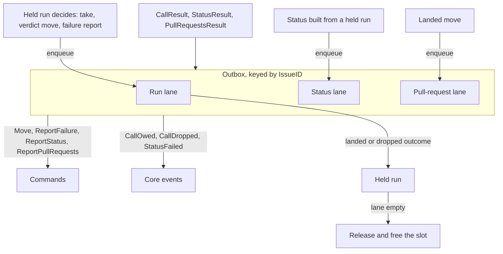
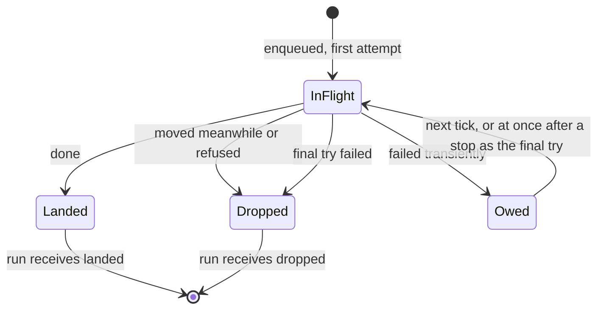

# Deliver tracker calls through an outbox in the core - Plan

The Product Contract below is the body of issue #241, which `/cw-split-plan` wrote from the plan of #237. This file adds the implementation planning for this part only.

---

## Goal Capsule

- **Objective:** the database work that follows can store and reload crew's runs, and crew can later grow into a server over many repositories, without reshaping crew's domain again. Nobody using crew sees a difference.
- **Means:** one outbox in `internal/core`, keyed by issue, whose run, status and pull-request lanes own retrying, owing and dropping every tracker write, while a held run only receives a delivery's outcome (KTD8; plan KTD-P1 to KTD-P6).
- **Product authority:** the boss, through the #237 brainstorm and the planning session that followed. The Product Contract wins on behaviour; the KTDs win on mechanism.
- **Stop conditions:** stop and report when a unit cannot keep the build, the tests and the acceptance suite green without changing what users see (R20), or when a settled Key Decision proves unworkable.
- **Execution profile:** one branch, units in order (U1 builds the run lane, U2 moves the status and pull-request lanes under the outbox, U3 documents), one pull request whose body carries `Closes #241`. #220 is not part of this work.
- **Open blockers:** none to start. The pull request cannot merge until a separate change that turns off Lizard's function metrics in Codacy is on `main` (KTD13 of #237); `.codacy/codacy.config.json` on `main` still has them on.
- **Part:** part 4 of 6 of #237. It ships alone because it moves delivery into one layer of today's core with today's waits, slots and order, and nothing users see changes.

---

## Product Contract

Product Contract preservation — restructured, no scope change: R11, which KTD8 governs, and R20, which the issue's stop conditions cite, are carried verbatim from #237 though the issue's body leaves them out; the Success Criteria name this part's checks, and #237's own criteria are kept as one line; Scope Boundaries add what this part leaves to later parts.

### Summary

Retrying, owing and dropping tracker calls move out of the core's `call` into one outbox keyed by issue, with a run lane, a status lane and a pull-request lane, keeping today's waits and slot rules. A held run sees only a delivery's outcome.

### Problem Frame

`internal/crew` is a shared vocabulary of data structs, not a model, and the rule run exists only as `heldIssue`, `actionRun` and `call`, private to `internal/core`. The core's `call` mixes the decision to move a label with retrying the move (`owed`, `inFlight`, `final`), and the status and pull-request slots repeat the same retry rules in their own shapes. A database, which comes right after this work, and a server over many repositories both need runs that change on their own and can be written and read back; a run that also carries its own retry bookkeeping cannot be stored as a plain record of decisions.

### Key Decisions

- KTD8. **Delivery is an outbox in the core, keyed by issue, with three lanes.** The run lane holds the take move, the verdict move and the failure report. The status lane holds status entries, ordered across runs of the same issue, so an earlier run's ended entry lands before the next run's. The pull-request lane holds one report in flight. The outbox owns owed, in-flight, final and dropped, gives a delivery enqueued after a stop one attempt and one final try, and reports each outcome to its run as an input. Slots follow live runs: a run whose run-lane delivery is owed still holds its slot, and an owed status or report never does. The core still refuses a second live run of an issue, of any rule. The card's "owed" comes from the first transient failure of a run-lane delivery until it settles, without flicker during retries, and `View.Owed` keeps today's contents. Governs R11, R12, AE2.

### Requirements

**Delivery**

- R11. The core keeps only what spans rule runs: slots, queues, the global limit, the stop and wind-down sequence, the per-issue projections of R14, and which commands to issue for the events a run produced. This part moves delivery out of the held run; the rest of R11 is #243's.
- R12. Making a decision is separate from delivering it. Retrying, owing and dropping tracker calls belong to a delivery layer outside the aggregate, which keeps today's waits and slot rules, and a rule run sees only a delivery's outcome.

**Compatibility**

- R20. Users see no difference: the redesign changes no config key, label move, comment, notification, `--plain` line or screen, and a failed run from before the upgrade still resumes.

### Acceptance Examples

- AE2. **Covers R12.** Given the take move fails with a transient error, the rule run stays in taking and produces no event. When a later attempt lands, the run receives the move's outcome and starts its actions.

### Success Criteria

- No field of `heldIssue` says whether a tracker call is in flight, owed or on its final try; the outbox alone holds that state.
- The core tests that pin today's command and event order around takes, verdicts, statuses, pull-request reports and stops pass with their expectations unchanged.
- The acceptance suite and the TUI golden files pass unchanged.
- #237's criteria still hold for the whole redesign: the database work adds a store adapter for rule runs without changing `internal/crew`, and no field comment in `internal/crew` ties a field's validity to another field.

### Scope Boundaries

- Anything #220 brings: verdicts, routes, sequences of actions, functions, waiting for an answer.
- The database, a durable outbox, the server, real multi-tenancy, a distributed scheduler and a pool of session workers.
- Considered and not built: a type per phase (typestate). It gives compile-time transitions but serialises awkwardly and makes every new phase touch every switch in the core.
- Considered and not built: an exported `Input` for a delivery's outcome. The engine never sends one; the outcome is a value the core hands its run inside one `Update` (KTD-P3).

#### Deferred to Follow-Up Work

- The other parts of #237, built in their own issues: Give session and check text their own types, stripped where it enters crew; Load agents, bots and actions into validated domain definitions; Make the rule run an aggregate that decides, journals and projects its own events (#243, which hands every tracker call to this outbox and turns its outcomes into the aggregate's facts).
- Splitting the core into scheduler, held runs and projections (KTD4 of #237) beyond the outbox: #243.

### Dependencies / Assumptions

- #238 (typed, global identities) is merged: the outbox is keyed by its `crew.IssueID`, and pull-request report ids come from its `RuleRunID`.
- No failure has come from today's model. The motivation is maintenance and expansion, and the boss treats them as a premise.
- Codacy runs on this repository (`CODACY_ENABLED` is `true`), and its configuration takes effect only once merged to `main`.

### Sources / Research

- Split from #237; its U7 ("Core: the outbox") is this part's seed.
- `internal/core/model.go`: `heldIssue.calls`, `call` (`inFlight`, `owed`, `final`), `Model.lastID`, `Model.statuses`, `Model.pullRequests`, `Stopped`, `View` (`Claim: h.claim`, `Owed`).
- `internal/core/update.go`: `call`, `attempt`, `callResult`, `dropped`, `taken`, `retryOwed`, `findCall`, `settle`, `stop`, `tick`; `ClaimOwed` is set only in `callResult` and replaced only by `start` (running) or `judge` (judging), or ends at `release`.
- `internal/core/status.go` (`statusSlot`, `report`, `assignRun`, `pump`, `statusResult`, `retryStatuses`) and `internal/core/pullrequest.go` (`pullRequestSlot`, `pendingReport`): per-issue lanes that outlive a held issue.
- `internal/core/call_test.go`, `stop_test.go`, `status_test.go`, `pullrequest_test.go`: the order and the claims this refactor must keep.
- `docs/solutions/runtime-errors/nul-in-gh-argument-freezes-status-comment.md`: only an ended status is owed, and while one is owed nothing else of that issue is sent; that is the status lane's cross-run order.
- `docs/solutions/logic-errors/handled-drops-issue-a-stage-holds-again.md`: earlier core changes broke because one reader of shared state was missed; every reader of the moved fields is listed in U1 and U2.
- `docs/solutions/tooling-decisions/codacy-lizard-and-golangci-lint-limits.md`: functions of 50 NLOC and complexity 15, files of 500 NLOC, and Lizard misreading Go after a type switch.

---

## Planning Contract

### Key Technical Decisions

- KTD-P1. **The outbox is a struct the model owns, with one map per lane, each keyed by `crew.IssueID`.** `Model.outbox` holds the run lanes, the status lanes (nil when status reporting is off) and the pull-request lanes (nil when reports are off), plus the `CallID` counter that leaves `Model.lastID`. Its logic is `step` methods, as the status and pull-request slots are today, so it emits `CallOwed`, `CallDropped` and `StatusFailed` and issues commands in the same step. One map per lane keeps each lane's lifetime its own: a run lane lives while its run has deliveries, a status lane for the whole process, a pull-request lane while it has reports. Governs KTD8, R11.
- KTD-P2. **A run-lane delivery carries its purpose and the `Call` it describes.** Each delivery has its `CallID`, a purpose (take, verdict move or failure report), the `Call` that `CallOwed`, `CallDropped` and `View.Owed` show (kind, issue id and ref, from, to), the failure report when it is one, and `inFlight`, `owed` and `final`. `heldIssue.calls` and the `call` type go. `CallID` stays, process-local and never stored, and a retry keeps it: a verdict move and its failure report can be in flight together for one issue, so the issue id alone cannot pair a `CallResult` with its delivery. The #238 plan's note that this part replaces `CallID` does not hold for that reason. Governs R12.
- KTD-P3. **A held run receives a delivery's outcome as an unexported value, after the outbox settled it.** `callResult` asks the outbox first. A transient failure makes the delivery owed, emits `CallOwed` and, after a stop, sends its final try; the run receives nothing (AE2). A landed delivery, or one dropped (moved meanwhile, refused, or failed on its final try, after `CallDropped`), is removed from its lane, and the run then receives `{purpose, landed or dropped, to, reason}`: a landed take starts the run (today's `taken`), a landed verdict move reports the move, the board and the pull requests, a landed failure report emits `FailureReported`, and a dropped verdict move ends the status with the move dropped. A landed take never releases its run, as today's early return in `callResult` ensures: a run whose actions start has an empty run lane and stays held, and a run judged at once has its verdict calls in the lane again. Every other outcome releases the run once it is handled and the run lane is empty, then `freed` runs. A dropped take gives the run nothing to do: no action end, run record, status or handled entry. The outbox emits `CallOwed` and `CallDropped` before the run receives the outcome; the run then emits `IssueMoved` or `FailureReported` and reports its status and pull requests, in today's order. #243 turns this value into the aggregate's fact. Governs R12, AE2.
- KTD-P4. **The card's "owed" is derived, never stored.** The stored claim stays `ClaimTaking`, `ClaimRunning`, `ClaimStopping` or `ClaimJudging`; `View` shows `ClaimOwed` while the issue's run lane is owing. A run lane becomes owing at the first transient failure of any of its deliveries, stays owing while a retry is in flight, and stops owing the moment its last delivery settles, before the run receives that outcome; a run judged at once after an owed take lands therefore shows judging, as today. That matches today exactly: `ClaimOwed` lasts until the take lands and `start` or `judge` replaces it, or until the verdict calls all settle and the issue is released. Reading "until it settles" per lane, not per delivery, keeps a verdict whose move landed while its report is still in flight showing owed, as today. `ClaimOwed` shows over any stored claim (taking, stopping or judging), and stays in the exported enumeration for the views. Governs KTD8, R20.
- KTD-P5. **Ticks and stops visit run lanes per held issue, in held order, interleaved as today.** At a tick, each held issue's owed run-lane deliveries are retried before its running status is reported. At a stop, each held issue's claim changes as today, then its owed run-lane deliveries get their final try; a run whose take is owed is now stored as `ClaimTaking`, so the stop moves it to `ClaimStopping`, which changes nothing it does next (the landed take still ends its actions unstarted). Status and pull-request lanes follow in issue id order, statuses first, as today. Every loop that stops, ticks or builds the view walks the held runs, never the outbox's lanes, since a running run has no run lane; and "held" keeps meaning a live run, never an outbox entry, so an issue whose earlier run's status is still owed can be taken again. This keeps every command list the core tests pin. Governs R11, R20.
- KTD-P6. **The status lane keeps its rules, its one final try per issue included.** Only an ended status is owed, a newer status of the same run replaces a waiting or owed one, a write in flight or owed holds back the issue's later statuses, `StatusFailed` is reported once per run of failures, and after a stop an issue's status lane gets one final try in all. The lane is per-issue memory as well as a queue (`shown`, the entry's run, `failing`), so it lives for the whole process. Giving each status its own final try, as KTD8's wording reads, would send one more status write after a stop when a second ended status of the issue fails, and that write can change what the comment shows, which R20 rules out; see Open Questions. Governs R20, KTD8.

### Assumptions

- The engine needs no change: `Move`, `ReportFailure`, `ReportStatus`, `ReportPullRequests` and their results keep their fields, and `CallID` keeps its meaning (a retried call keeps its id).
- Status and pull-request lanes keep today's type names' roles under lane names (`statusLane`, `pullRequestLane`); the exact names are the implementer's choice.
- The core's black-box tests (`package core_test`) are the right place for the new scenarios: they drive `Update` and read `View`, so they pin the behaviour and not the outbox's shape.

### Open Questions

- Deferred, not blocking: KTD8 says every delivery enqueued after a stop gets one attempt and one final try, while today's status lane gives an issue one final try in all after a stop. This part keeps today's rule (KTD-P6), because R20 wins on behaviour. Whether a second ended status of an issue should get its own final try is the boss's call, in a change of its own.

### High-Level Technical Design

How one tracker write travels inside an `Update`:

A run-lane delivery's life (KTD-P3, KTD-P6):

### Sequencing

U1 moves the run lane, the riskiest change, while the status and pull-request slots stay where they are, so a failure is local to one lane. U2 then moves the two existing slots under the outbox, each with its rules as they are. U3 updates the words that describe the core.

---

## Implementation Units

### U1. The outbox and its run lane

- **Goal:** the take move, the verdict move and the failure report are delivered by the outbox's run lane, and a held run only receives their outcomes.
- **Requirements:** R11, R12, R20, AE2; KTD-P1 to KTD-P5.
- **Dependencies:** none.
- **Files:**
  - Create `internal/core/outbox.go` (the outbox, the run lane, delivery attempts, results and retries, the owed list)
  - Modify `internal/core/model.go` (`Model.outbox` replaces `lastID`; `heldIssue.calls` and `call` go; `View` derives the claim and builds `Owed` from the outbox; `Stopped`; the package and `ClaimOwed` comments)
  - Modify `internal/core/update.go` (`take` and `judge` enqueue on the run lane; `callResult` hands over to the outbox and receives its outcome; `taken`, the landed-verdict and dropped-verdict paths become the run's outcome handling; `tick` and `stop` call the outbox per held issue; `call`, `attempt`, `dropped`, `retryOwed`, `findCall`, `settle` and `cloneReport` move or go)
  - Create `internal/core/outbox_test.go`
  - Test `internal/core/call_test.go`, `internal/core/stop_test.go`, `internal/core/timeup_test.go`, `internal/core/actionless_test.go` (unchanged; they must pass)
- **Approach:**
  1. Build the outbox and the run lane (KTD-P1, KTD-P2), with enqueue, attempt, result, retry-owed and final-try operations that emit today's events from the delivery's own `Call`.
  2. Route `take` and `judge` through enqueue; the verdict move before the failure report, as today.
  3. Rewrite `callResult` as KTD-P3 orders it: outbox first, then the run's outcome, then, except after a landed take, release when the lane is empty and `freed`.
  4. Derive the view's claim and owed list (KTD-P4, KTD-P5's order), and replace `ClaimOwed` in the stop switch with the per-issue final try (KTD-P5).
  5. Keep `update.go` under 500 NLOC and every function under 50 NLOC and complexity 15; avoid new type switches.
- **Patterns to follow:** `statusSlot`, `pump` and `statusResult` in `internal/core/status.go`; `pullRequestSlot` and `retryPullRequests` in `internal/core/pullrequest.go` for the per-lane shape and the issue-id ordering; `sortedIssueIDs`.
- **Test scenarios:**
  - Covers AE2. A take move fails transiently twice, then lands: the first failure emits one `CallOwed` and no `IssueMoved`; the issue's claim is owed from the first failure, stays owed through the retry in flight and the second failure, and the landed retry emits `IssueMoved`, creates the actions' workspaces and shows running.
  - While an owed take's retry is in flight, `View.Owed` still lists it and the claim still reads owed.
  - A rule without actions whose owed take lands shows judging at once, while its verdict move is in flight.
  - An owed take whose final try lands after a stop shows judging while its verdict calls are in flight.
  - A run whose take lands and whose actions start stays held with no run-lane delivery, and a later `WorkspaceReady` finds it.
  - A take dropped after a stop emits only `CallDropped`: no action end, run record, status or handled entry, and the model stops in the same step.
  - A verdict move fails transiently while its failure report is in flight, then lands: the claim stays owed until the report lands too, and the issue is released only then.
  - An owed verdict move holds its queue's slot: a listing with a free global slot but that queue full takes nothing from it, and the slot frees when the retry lands.
  - Two held issues, the first with an owed take and the second running, at a tick: the command list is the first's `Move` retry, then the second's `ReportStatus`, as today.
  - A stop with one issue whose take is owed and one whose session runs: the final `Move` try and the `StopSession` come out in held order; the owed issue still shows owed until its final try settles.
  - A stop gives an owed verdict move one final try; when it fails, `CallDropped` is emitted, the ended status says the move was dropped, and the model stops once nothing else is pending.
  - A refused take is dropped at once and never retried, and the issue is released.
  - A rule without actions whose take lands enqueues its verdict move in the same step and is not released before that move lands.
  - `View.Owed` lists the held issues' owed moves and reports in held order, then the owed pull-request reports, as today.
- **Verification:** `go test -race ./internal/core` passes with `call_test.go`, `stop_test.go`, `timeup_test.go` and `actionless_test.go` unchanged; `grep` finds no `inFlight`, `owed` or `final` field on `heldIssue`.

### U2. The status and pull-request lanes join the outbox

- **Goal:** the status and pull-request slots become the outbox's other two lanes, with their rules unchanged.
- **Requirements:** R11, R12, R20; KTD-P1, KTD-P5, KTD-P6.
- **Dependencies:** U1.
- **Files:**
  - Modify `internal/core/status.go` (the slot becomes the status lane held by the outbox; `statusesBusy` becomes part of the outbox's idle check)
  - Modify `internal/core/pullrequest.go` (the slot becomes the pull-request lane held by the outbox; `owedPullRequests` feeds the outbox's owed list)
  - Modify `internal/core/model.go` (`ReportingStatus` and `ReportingPullRequests` turn the outbox's lanes on; `Stopped` asks the outbox whether it is idle)
  - Modify `internal/core/outbox.go`
  - Test `internal/core/status_test.go`, `internal/core/pullrequest_test.go` (existing tests unchanged), `internal/core/outbox_test.go` (new scenarios)
- **Approach:**
  1. Move the two slot maps into the outbox (KTD-P1), keeping status building (`status`, `running`, `ended`, `sameStatus`, `ruleEnd`) where it is: it is the run's decision, not delivery.
  2. Keep every status lane rule KTD-P6 lists, and never delete a status lane.
  3. Make `Stopped` true when the core is stopping, holds no run and the outbox has no status write in flight, waiting or owed and no pull-request report not settled.
- **Patterns to follow:** today's `statusSlot` and `pullRequestSlot` themselves; the lane shape U1 introduced.
- **Test scenarios:**
  - Run 1's ended status is owed while run 2 of the same issue is taken: run 2's take move goes out at once, and run 2's first running status waits until run 1's ended status lands.
  - An owed ended status holds no slot: with one slot, the issue whose ended status is owed is released and a new issue is taken at the next listing.
  - A newer status of the same run replaces its waiting status, and the write that follows carries the newer one.
  - Two consecutive runs of a rule without actions on one issue edit one status entry, as today.
  - A status lane that went idle keeps its memory: the next status of that issue's same run repeats nothing already shown and carries the same entry id.
  - After a stop, an issue's ended status fails, gets its final try and lands; a later ended status of the same issue that fails transiently is given up without another try, and the model stops, as today.
  - A refused ended status is dropped at once and the next waiting status is sent.
  - A pull-request report that fails transiently after a stop gets one final try, then is dropped with `CallDropped`, and the next report of that issue is sent.
- **Verification:** `go test -race ./internal/core` passes with `status_test.go` and `pullrequest_test.go` unchanged; `go test -race ./...` passes.

### U3. Words that describe the core

- **Goal:** the comments, `AGENTS.md` and `CONCEPTS.md` describe the outbox where they describe the core's delivery.
- **Requirements:** R20.
- **Dependencies:** U1, U2.
- **Files:**
  - Modify `AGENTS.md` (the `internal/core` line names the outbox)
  - Modify `CONCEPTS.md` (an entry for an owed tracker write, as the live view shows it)
  - Modify `docs/solutions/runtime-errors/nul-in-gh-argument-freezes-status-comment.md` only where it names a moved field or type
- **Approach:** describe, do not restate the KTDs; the README describes no internal mechanism and needs no change, since behaviour does not change.
- **Test expectation:** none -- documentation only.
- **Verification:** the words match the code; `grep` finds no `statusSlot`, `pullRequestSlot` or `h.calls` in `AGENTS.md`, `CONCEPTS.md` or `docs/solutions/`.

---

## Verification Contract

| Gate | Command | Applies to |
| --- | --- | --- |
| Format | `gofmt -l cmd internal tools acceptance` prints nothing | every unit |
| Vet | `go vet ./...` | every unit |
| Lint and layering | `go run github.com/golangci/golangci-lint/v2/cmd/golangci-lint@v2.14.0 run` | every unit |
| Tests | `go test -race ./...` | every unit |
| Coverage | the total floor (`.testcoverage.yml`) and `tools/diffcover` on changed lines, both at least 90% | the branch |
| Acceptance | build crew, then `go -C acceptance run ./cmd/acceptance -count=1`: every scenario passes, no snapshot changes | U1, U2 |
| TUI golden files | `go test ./internal/ui/tui` with no `-update` | U1, U2 |
| Codacy locally | `pnpm exec codacy-analysis analyze --install-dependencies` shows no new finding in `internal/core` | U1, U2 |

---

## Definition of Done

- U1 to U3 are in, each leaving the build, the tests and the acceptance suite green.
- `heldIssue` has no field that says whether a tracker call is in flight, owed or on its final try, and the `call` type is gone.
- AE2 is covered by a test in `internal/core`.
- No existing core test changed its expected commands, events or view; no TUI golden file or acceptance snapshot changed.
- Every gate of the Verification Contract passes.
- No abandoned attempt, helper or comment from a discarded approach is left in the diff.
