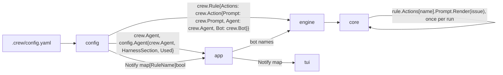

# Load agents, bots and actions into validated domain definitions - Plan

The Product Contract below is the body of issue #242, as `/cw-split-plan` wrote it from the plan of #237. This file adds the implementation planning for this part only.

---

## Goal Capsule

- **Objective:** the database work that follows can store and reload crew's runs, and crew can later grow into a server over many repositories, without reshaping crew's domain again. Nobody using crew sees a difference.
- **Means:** config loads each agent, bot and action into a validated definition in `internal/crew`, parses each prompt once, and hands `notify` to the live view outside the domain's rule (KTD15; plan KTD-P1 to KTD-P5).
- **Product authority:** the boss, through the #237 brainstorm and the planning session that followed. The Product Contract wins on behaviour; the KTDs win on mechanism.
- **Stop conditions:** stop and report when a unit cannot keep the build, the tests and the acceptance suite green without changing what users see (R20), or when a settled Key Decision proves unworkable.
- **Execution profile:** one branch, units in order (U1 expands, U2 to U4 switch, U5 documents), one pull request whose body carries `Closes #242`. #220 is not part of this work.
- **Open blockers:** none to start. The pull request cannot merge until a separate change that turns off Lizard's function metrics in Codacy is on `main` (KTD13 of #237); on this branch's base, `.codacy/codacy.config.json` still enables `Lizard_nloc-medium` and `Lizard_ccn-medium`.
- **Part:** part 5 of 6 of #237. It ships alone because it loads today's config into validated definitions that today's core runs as before, and hands notify to the view that uses it.

---

## Product Contract

Product Contract preservation — restructured, no scope change: R20, which the issue's stop conditions cite but its body leaves out, is carried from #237; the Success Criteria name this part's checks, and #237's own criteria are kept as one line.

### Summary

Config builds `crew.Agent` and `crew.Bot`, resolves each action's agent and bot to them and parses each prompt once. `notify` leaves `crew.Rule` and reaches the live view as a map from rule name, with today's default.

### Problem Frame

`internal/crew` is a shared vocabulary of data structs, not a model. `Agent` lives in `internal/config` and `Identity` in `internal/port`. An action names its agent and bot by bare names, and its prompt is a string that config parses to check it and the core parses again for every run. The domain's rule also carries a live-view setting (`Rule.Notify`). A database, which comes right after this work, needs definitions that are validated once and runs that refer to them by name.

### Key Decisions

- KTD15. **Definitions hold validated values, and runs refer to definitions by name.** `config` builds `crew.Agent` (name, harness name, bot) and `crew.Bot`, resolves each action's agent and bot to those types, and parses prompts once. A rule run stores the rule's name and action names, never the definition, so runs stay plain data. `port.Identity` stays the bot's runtime credentials, keyed by the bot's name, and never reaches the domain or the journal. `notify` leaves `crew.Rule`: config hands the TUI a map from rule name to notify, with today's default. (session-settled: user-approved — chosen over bare agent and bot names on the action, a prompt parsed again for every run, `Identity` in the domain and `Notify` on the rule: a database and a server need definitions validated once and runs that are plain data, and an identity's environment values are machine-local.) Governs R2, R5, R18.

### Requirements

**Concepts and types**

- R2. An agent in the domain is its name, its harness's name and its bot. The harness's own settings, the model included, stay opaque to crew and belong to the harness adapter.
- R5. A value the config load already validated, such as a prompt template or a name that must resolve, is held in its validated form and is not parsed or resolved again for each run.

**Presentation and boundaries**

- R18. A setting that serves only a view, today `Rule.Notify`, reaches that view without being part of the domain's rule.

**Visible behaviour (carried from #237)**

- R20. Nothing users see changes: the live view, the line renderer, the tracker comments' visible text, the journal's lines, config errors, the README's promises, the acceptance suite and the TUI golden files stay as they are.

### Success Criteria

- The acceptance suite and the TUI golden files pass unchanged.
- No code outside `internal/crew` parses a prompt, and the core parses none: it renders the action definition's parsed prompt for each run.
- `crew.Rule` has no `Notify` field, and a rule's notify reaches the TUI only through config's map.
- #237's own criteria (a store adapter added without changing `internal/crew`; no "set when" field comments) are met by the six parts together; this part must not add to what they remove.

### Scope Boundaries

- Anything #220 brings: verdicts, routes, sequences of actions, functions, waiting for an answer.
- The database, a durable outbox, the server, real multi-tenancy, a distributed scheduler and a pool of session workers.
- Whether a store keeps events or state as its source of truth: the database work decides.
- Models (LLMs) as a domain concept: a model stays a harness setting (R2).
- The core's `actionRun` keeps copying an action's name, checks, agent name and bot name at take, as today. Making the rule run an aggregate that holds only names and looks its definitions up is the last part of #237.
- The engine, `app.Options.Bots`, the core's `BotsConfig` and `port.Identity` keep naming bots by `crew.BotName`: they refer to bots, and KTD15 has runs and runtime credentials refer to definitions by name.
- The other parts of #237, built in their own issues: session and check text types; tracker calls through an outbox; the rule run as an aggregate.

### Dependencies / Assumptions

- No failure has come from today's model. The motivation is maintenance and expansion, and the boss treats them as a premise.
- Parts 1 and 2 of #237 are on `main` (#245 typed global identities, #244 display wording out of the domain), so `crew.AgentName`, `crew.BotName`, `crew.ActionName` and `crew.IssueID` exist.
- Codacy runs on this repository (`CODACY_ENABLED` is `true`), and its configuration takes effect only once merged to `main`.

### Sources / Research

- Split from #237.
- `internal/crew/rule.go`: `Rule` with `Notify`, `Action` with `Prompt string`, `Agent AgentName`, `Bot BotName`, and `Action.Render`, which parses the template on every call; `promptIssue`, the only data a template reaches.
- `internal/crew/identity.go`: the name types from #245 (`AgentName`, `BotName`), and no harness name type yet.
- `internal/config/agents.go`: `config.Agent` (name, harness, harness section, bot, used) and `agentsInUse`.
- `internal/config/rules.go`: `parseRule` (notify defaults to having actions), `parseAction` (agent and bot resolved to names, the prompt rendered against `sampleIssue()`, then `retiredVariables`).
- `internal/config/config.go`: `Config.Bot`, `Config.Bots` and `namedBots`; `parse`, which resolves the tracker's bot before the agents and rules.
- `internal/core/update.go`: `take`, which copies each action's prompt text into its `actionRun`, and `start`, which renders it with a fresh `crew.Action{...}.Render` per run and ends the action with `crew.CausePrompt` when rendering fails.
- `internal/core/bots.go`: `pairs`, which reads each action's bot from the rules.
- `internal/ui/tui/model.go` (`Config.Rules`, read only for notify) and `internal/ui/tui/outside.go` (`muted`: a rule not in the rules, or with notify off, sends nothing).
- `internal/app/app.go`: `build` (harnesses from `config.Agent`), `bots` and `engine` (bot names to `Options.Bots` and the engine), `runner.rules` (only for the TUI's notifications).
- `docs/solutions/security-issues/session-environment-values-in-codex-command-line.md`: `port.Identity`'s environment values are machine-local and never persisted.
- `docs/solutions/tooling-decisions/codacy-lizard-and-golangci-lint-limits.md`: functions of 50 lines and complexity 15, files of 500 lines.

---

## Planning Contract

### Key Technical Decisions

- KTD-P1. **A parsed prompt is a domain value, `crew.Prompt`.** `crew.ParsePrompt(action, text)` parses the template once and renders it for a sample issue, so a `Prompt` value always parses and reaches only the fields `promptIssue` has. It keeps its source text for the checks that read it (`Text`). `Prompt.Render(issue)` executes the parsed template; the zero `Prompt` renders the empty string, so a hand-built action in a test needs no prompt. The error texts stay today's ("parse prompt of action %q: …", "render prompt of action %q: …"), since config shows them to users (R20). `sampleIssue` moves from config into `internal/crew` with the constructor. Governs R5.
- KTD-P2. **`crew.Agent` is name, harness name and declared bot; `crew.Bot` is a bot's name.** `crew.Agent{Name AgentName, Harness HarnessName, Bot BotName}`, where `HarnessName` is a new defined string type in `identity.go` and `Bot` is the bot the agent's file names, empty when it names none. `crew.Bot{Name BotName}`; the zero `Bot` is you, the gh login. `config.Agent` embeds `crew.Agent` and keeps only what is config's: the harness's settings as a `Decode` (R2) and `Used`. Governs R2.
- KTD-P3. **An action holds its resolved definitions.** `crew.Action.Agent` becomes a `crew.Agent`, `Action.Bot` a `crew.Bot` (the agent's bot, or `tracker.bot` when the agent names none, as today), and `Action.Prompt` a `crew.Prompt`. `Config.Bot` and `Config.Bots` become `crew.Bot` and `[]crew.Bot`. `app` hands the engine and `Options.Bots` their names, since runs and runtime credentials refer to bots by name (KTD15). Governs R2, R5.
- KTD-P4. **The core renders the definition's prompt, by the action's name.** `take` stops copying the prompt text. `start` finds the action's definition in its rule by the action's name and renders that definition's `Prompt` for the held issue, keeping the rendered text on the `actionRun` as today for the session, its checks and the resume paragraph. A render error still ends the action with `crew.CausePrompt`. Governs R5.
- KTD-P5. **Notify is `Config.Notify`, a map from rule name to bool.** Config fills it for every rule with today's default: on when the rule has actions, unless `notify` is set. `tui.Config.Rules` becomes `tui.Config.Notify` of the same type; `muted` reads the map, so a name the map lacks stays muted, as a name not in the rules is today. `app.runner` keeps the map instead of the rules. Governs R18.

### Assumptions

- Headless planning: no scoping confirmation ran. The decisions above are the agent's, inside the settled KTD15.
- `crew.Agent.Bot` keeps the agent's declared bot rather than the resolved one: a definition refers to another by name, and the resolved bot is the action's (`Action.Bot`), so the two never disagree.
- Config tests that compare whole rules with `reflect.DeepEqual` may stop working once an action holds a parsed template. Where they do, they compare the prompt's text and the other fields instead; the implementer decides per test.

### High-Level Technical Design

Where each value comes from after this part (directional):

### Sequencing

U1 adds `crew.Prompt` beside today's `Action.Render`. U2 switches actions to it and removes the old `Render`. U3 switches agents and bots, U4 moves notify, and U5 documents. Each unit leaves the build, the tests and the acceptance suite green.

---

## Implementation Units

### U1. A parsed prompt in the domain

**Goal:** `internal/crew` has a prompt type that is parsed and checked once and rendered for each issue.

**Requirements:** R5, KTD15.

**Dependencies:** none.

**Files:**
- Create `internal/crew/prompt.go`
- Create `internal/crew/prompt_test.go`
- Modify `internal/crew/rule.go` (`promptIssue` moves out)

**Approach:**
1. Add `Prompt`, `ParsePrompt`, `Prompt.Render` and `Prompt.Text` per KTD-P1, with the sample issue beside them.
2. Move `promptIssue` from `rule.go` into `prompt.go`, so the package declares it once.
3. Leave `Action.Render` in place for now, using the moved `promptIssue`; U2 removes it.

**Patterns to follow:** `crew.NewRuleRunID` in `internal/crew/identity.go` for a constructor documented in the file's style; `Action.Render`'s data shape and error wording.

**Test scenarios:**
- A template using `.Issue.Ref`, `.Issue.Key`, `.Issue.Title` and `.Issue.URL` renders an issue's values.
- A template that does not parse is an error naming the action and starting "parse prompt of action".
- A template naming another field, such as `{{.Issue.Number}}`, is an error naming the action and starting "render prompt of action".
- The zero `Prompt` renders the empty string with no error.
- `Text` returns the source text unchanged.
- Rendering one parsed prompt for two issues gives each issue's own text.

**Verification:** `go test -race ./...` passes; no package outside `internal/crew` changed.

### U2. Actions hold their parsed prompt

**Goal:** config parses each prompt once into the action's definition, and the core renders that definition for each run.

**Requirements:** R5, R20, KTD15.

**Dependencies:** U1.

**Files:**
- Modify `internal/crew/rule.go` (`Action.Prompt` becomes `Prompt`; remove `Action.Render`)
- Modify `internal/config/rules.go` (`parseAction` builds the prompt with `crew.ParsePrompt`, keeping the error's key path and line; `retiredVariables` reads `Prompt.Text`; remove `sampleIssue`)
- Modify `internal/core/update.go` (`take`, `start`) and `internal/core/model.go` (the `actionRun.prompt` comment)
- Modify `internal/config/config_own_test.go`, `internal/config/config_test.go` and the other config tests that read a prompt
- Modify the core, engine and fake tests that build a `crew.Action` with a prompt: `internal/core/*_test.go`, `internal/engine/engine_test.go`, `internal/engine/check_test.go`, `internal/fake/fake_test.go`

**Approach:**
1. Switch the field and config per KTD-P1; config errors keep today's text, path and line.
2. Switch the core per KTD-P4.
3. Tests that need a prompt build one through a small test helper that parses it and fails the test on an error.

**Patterns to follow:** today's `parseAction` error flow (`keyError(e.path+".prompt", doc.Prompt.line, err.Error())`).

**Test scenarios:**
- A config whose prompt does not parse reports the same message, key path and line as before.
- A config whose prompt names an unknown field reports the same message as before.
- A loaded action's prompt renders the issue it is given.
- In the core, a taken issue's session starts with the rendered prompt of its action's definition.
- In the core, a resumed action's prompt still gets the resume paragraph after the rendered text.
- In the core, an action whose prompt fails to render for the held issue ends with `CausePrompt` and its error as the reason; that is reachable with a template that renders for the sample issue and fails for another, such as an `index` beyond a short title.
- The checks of an action receive the rendered prompt, as before.

**Verification:** `go test -race ./...` passes; the acceptance suite passes with no snapshot change.

### U3. Agents and bots as domain definitions

**Goal:** config builds `crew.Agent` and `crew.Bot` and resolves each action's agent and bot to them.

**Requirements:** R2, R5, KTD15.

**Dependencies:** U2.

**Files:**
- Modify `internal/crew/identity.go` (add `HarnessName`)
- Create `internal/crew/agent.go` (`Agent`, `Bot`)
- Modify `internal/crew/rule.go` (`Action.Agent`, `Action.Bot`)
- Modify `internal/config/agents.go` (`config.Agent` embeds `crew.Agent`; `agentsInUse`), `internal/config/rules.go` (`parseAction`, `ruleEnv`), `internal/config/config.go` (`Config.Bot`, `Config.Bots`, `namedBots`, `trackerSection`)
- Modify `internal/core/update.go` (`take` copies the names) and `internal/core/bots.go` (`pairs`)
- Modify `internal/app/app.go` (`build` passes the harness name as text; `bots` and `engine` pass bot names)
- Modify `internal/config/config_agents_test.go`, `internal/config/config_own_test.go`, `internal/config/export_test.go`, and the core, engine and app tests that build actions with an agent or bot

**Approach:**
1. Add the types per KTD-P2.
2. Resolve them in config per KTD-P3: `ruleEnv` carries the tracker's bot as a `crew.Bot`, and `parseAction` sets `Action.Agent` to the resolved agent's domain value and `Action.Bot` to its bot or the tracker's.
3. The core copies `Agent.Name` and `Bot.Name` into the `actionRun`; `StartSession`, the checks and the bots view are unchanged.
4. `app` turns `Config.Bot` and `Config.Bots` into names where the engine and `Options.Bots` take them.

**Patterns to follow:** `config.Agent`'s existing doc comments; `namedBots`' order (tracker bot first, then each action's in rule order, each once).

**Test scenarios:**
- An action without `agent`, with one agent declared, gets that agent with its name, harness name and bot.
- An action whose agent names a bot gets that bot; one whose agent names none gets `tracker.bot`; with neither, the zero bot.
- `Config.Bots` lists the tracker's bot first, then each action's bot in rule order, each once, as before.
- An agent no action names keeps `Used` false, and its harness name and settings still reach the registry.
- A harness name no adapter has still stops crew with the same message.
- In the core, the bots view's pairs and running actions are the same as before for actions on a bot and on you.

**Verification:** `go test -race ./...` passes; the acceptance suite passes with no snapshot change.

### U4. Notify leaves the domain's rule

**Goal:** the live view learns which rules notify from config's map, and `crew.Rule` has no `Notify`.

**Requirements:** R18, R20, KTD15.

**Dependencies:** U3.

**Files:**
- Modify `internal/crew/rule.go` (remove `Rule.Notify`)
- Modify `internal/config/rules.go` (`parseRule` no longer sets notify; the rule's notify reaches the config) and `internal/config/config.go` (`Config.Notify`)
- Modify `internal/ui/tui/model.go` (`Config.Notify` replaces `Config.Rules`) and `internal/ui/tui/outside.go` (`muted`)
- Modify `internal/app/app.go` (`runner` keeps the map)
- Modify `internal/config/config_rules_test.go`, `internal/config/config_own_test.go`, `internal/config/config_test.go`, `internal/ui/tui/outside_test.go`, `internal/ui/tui/board_test.go`, `internal/ui/tui/model_test.go`, `internal/ui/tui/text_test.go`

**Approach:**
1. Build the map per KTD-P5. `parsedRule` carries the rule's notify beside the `crew.Rule` until `rules` returns, or `rules` returns the map with the rules; the implementer picks whichever keeps `parse` within the function limits.
2. The TUI tests build their notify map from their test rules.

**Patterns to follow:** `parsedRule`, which already carries what only config needs beside the `crew.Rule`.

**Test scenarios:**
- A rule with actions and no `notify` is on in `Config.Notify`; a rule without actions and no `notify` is off; `notify: false` and `notify: true` override each default.
- Every rule of the config has an entry in `Config.Notify`.
- In the TUI, a handled entry of a rule whose notify is on sends a notification while the terminal has no focus, and one whose notify is off sends none.
- In the TUI, a handled entry of a rule the map does not name sends none.

**Verification:** `go test -race ./...` passes; `go test ./internal/ui/tui` passes with no `-update`; the acceptance suite passes with no snapshot change.

### U5. Documentation

**Goal:** the docs that describe crew's structure say where definitions and notify live.

**Requirements:** R2, R18.

**Dependencies:** U4.

**Files:**
- Modify `AGENTS.md` (the `internal/config` entry: builds `crew.Agent` and `crew.Bot`, parses each prompt once, hands the live view its notify map)

**Approach:** one clause in the entry's existing style. The README describes no internals, and `CONCEPTS.md`'s Agent and Bot entries stay true (R20).

**Test scenarios:** Test expectation: none -- documentation only.

**Verification:** the entry reads true against the code.

---

## Verification Contract

| Gate | Command | Applies to |
| --- | --- | --- |
| Format | `gofmt -l cmd internal tools acceptance` prints nothing | every unit |
| Vet | `go vet ./...` | every unit |
| Lint and layering | `go run github.com/golangci/golangci-lint/v2/cmd/golangci-lint@v2.14.0 run` | every unit |
| Tests | `go test -race ./...` | every unit |
| Coverage | the total floor (`.testcoverage.yml`) and `tools/diffcover` on changed lines, both at least 90% | the branch |
| Acceptance | build crew, then `go -C acceptance run ./cmd/acceptance -count=1`: every scenario passes, no snapshot changes | U2, U3, U4 |
| TUI golden files | `go test ./internal/ui/tui` with no `-update` | U4 |

---

## Definition of Done

- U1 to U5 are in, each leaving the build, the tests and the acceptance suite green.
- `crew.Action` holds a `crew.Prompt`, a `crew.Agent` and a `crew.Bot`; no package but `internal/crew` parses a prompt template.
- `crew.Rule` has no `Notify`; the TUI reads notify from `tui.Config.Notify`.
- `port.Identity` is unchanged and is not referenced from `internal/crew`.
- Config error messages, the TUI golden files and the acceptance snapshots did not change.
- Every gate of the Verification Contract passes.
- No abandoned attempt, helper or comment from a discarded approach is left in the diff.
