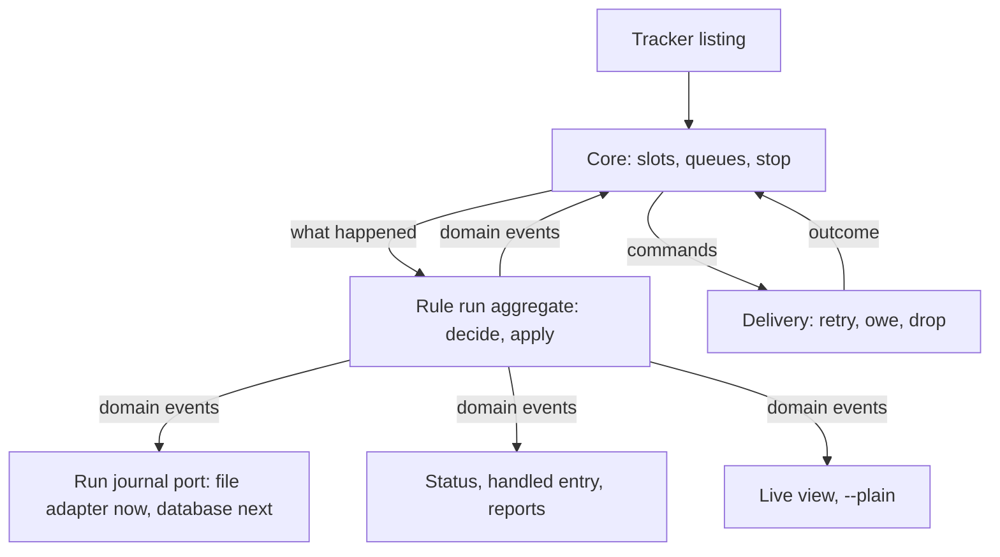
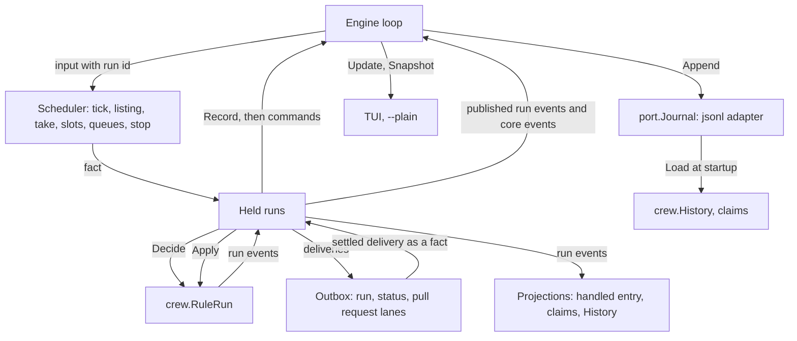
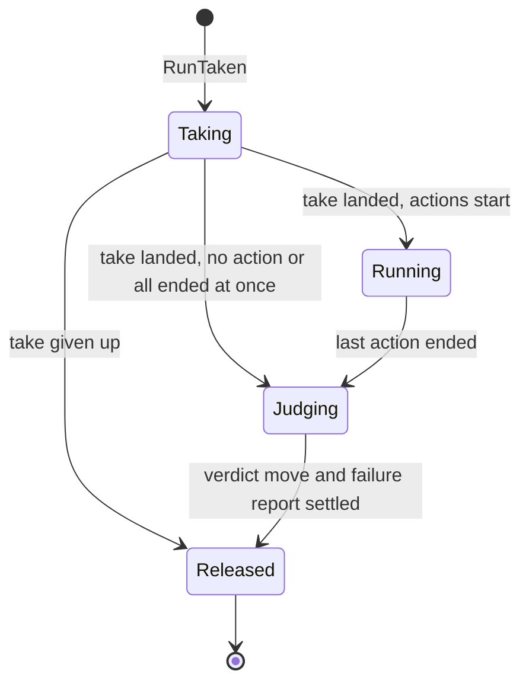
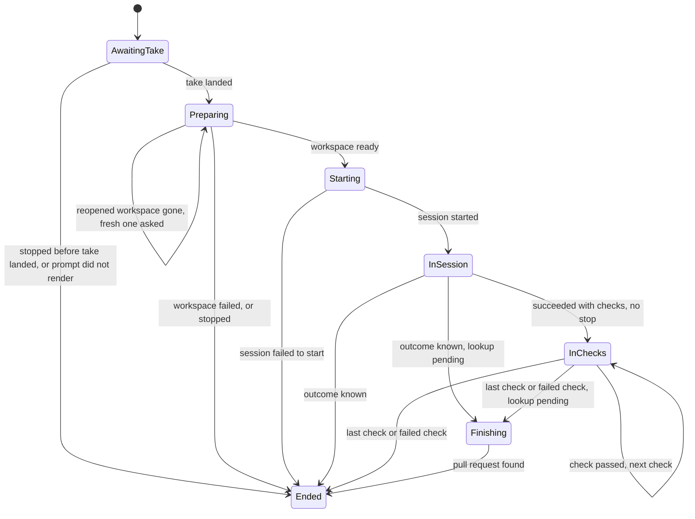

# Make the rule run an aggregate that decides, journals and projects its own events - Plan

The Product Contract below is the body of issue #243, as `/cw-split-plan` wrote it from the plan of #237. This file adds the implementation planning for this part, the last of #237's six.

---

## Goal Capsule

- **Objective:** the database work that follows can store and reload crew's runs, and crew can later grow into a server over many repositories, without reshaping crew's domain again. Nobody using crew sees a difference.
- **Means:** each rule run becomes an aggregate in `internal/crew` that decides its changes as domain events (KTD2, KTD-P3, KTD-P4); the core keeps only cross-run orchestration and projections (KTD4, KTD-P11); the run journal stores those events through a port (KTD12, KTD-P8).
- **Product authority:** the boss, through the #237 brainstorm and the planning session that followed. The Product Contract wins on behaviour; the KTDs win on mechanism.
- **Stop conditions:** stop and report when a unit cannot keep the build, the tests and the acceptance suite green without changing what users see (R20), or when a settled Key Decision proves unworkable.
- **Execution profile:** one branch, units in the order of the Unit Index (U1 to U5 expand, U6 to U9 switch, U10 contracts, U11 documents), one pull request whose body carries `Closes #243`. #220 is not part of this work.
- **Open blockers:** none to start. The pull request cannot merge until a separate change that turns off Lizard's function metrics in Codacy is on `main` (KTD13 of #237). On this branch's base, `.codacy/codacy.config.json` still enables `Lizard_nloc-medium` and `Lizard_ccn-medium`.
- **Part:** part 6 of 6 of #237. It ships alone because the aggregate, the core that drives it, the journal of its events and the projections computed from it are one flow that works only whole, and its docs describe that whole.

---

## Product Contract

Product Contract preservation: unchanged. It is the body of issue #243, whose Key Decisions keep #237's numbering (KTD1 to KTD17); this plan's own decisions are numbered KTD-P1 onward. The unit numbers KTD1 names (U2, U8 to U10) are those of #237's plan; KTD-P1 says where this plan's units apply it. Requirement and example IDs keep #237's numbering too: R2, R3, R5, R7, R12, R17, R18, R23, AE2 and AE4 belong to the other five parts and appear here only where a Key Decision of this part cites them.

### Summary

A rule run becomes an aggregate in `internal/crew` that decides its changes as domain events and applies them; the core holds one per issue and keeps only what spans runs; the journal stores the run's events through a port; statuses, reports and the handled entry are computed from runs; the docs describe the new split.

### Problem Frame

`internal/crew` is a shared vocabulary of data structs, not a model. The concepts that matter most, the rule run and the action run, exist only as `heldIssue`, `actionRun` and `call`, private to `internal/core`. `Agent` lives in `internal/config` and `Identity` in `internal/port`. Entities refer to each other by bare strings, so `Action.Agent` and `Action.Bot` are names, and a label is a `State` in rules but a `string` on the board. Invariants live in comments: `Status.To` is "set when Kind is StatusEnded", and an issue "in exactly one" state is only a sentence. The domain also formats for the screen and the tracker (`Spend.String`, `formatTokens`, `Kind.String` "for renderers") and carries a live-view setting (`Rule.Notify`).

None of this has cost a failure yet. The cost is ahead. A database comes right after this work, and crew may become a server that runs many repositories for thousands of developers. Today a rule run "belongs to one crew process", and one reducer holds every run of a repository from one goroutine. The core's `call` mixes the decision to move a label with retrying the move (`owed`, `inFlight`, `final`). Some identities are unique only inside one process (`Status.Run`, `PullRequestReport.ID`), and an issue's identity carries no repository. A database and a server each need the opposite: runs that change on their own, can be written and read back, and are named the same everywhere.

### Key Decisions

- **The redesign lands on its own, on today's behaviour, without #220.** Governs R20, R21. (session-settled: user-directed — chosen over folding it into #220's plan and pull request: a smaller plan; #220 is planned again on the new domain later.)
- **The domain is rich: the lifecycle rules of a run live in `internal/crew`.** The core only orchestrates. Governs R9, R11. (session-settled: user-approved — chosen over strong domain types with the rules kept in the core, and over treating `crew` plus `core` together as the domain.)
- **A rule run is an aggregate that emits a domain event for each change.** Its behaviour is a pure decision from the run and what happened to events, and a pure application of an event to the run. Governs R8, R9, R13. (session-settled: user-approved — chosen over an aggregate that keeps only its state: the database can then store events or state, and history stays available for audit and replay.)
- **Sum types are sealed interfaces checked by `gochecksumtype`, not enums with optional fields.** Governs R4, R10. (session-settled: user-approved — chosen over enums plus fields valid only for some values: that is the "set only when" shape R4 removes.)
- **The run journal records the rule run's domain events.** The journal moves to a version whose lines are those events, behind a port, so the database later adds a second adapter instead of a new format. Governs R16. (session-settled: user-approved — chosen over keeping a journal format of its own: the database would redesign it right after.)
- KTD1. **Sum types are sealed interfaces, and exhaustiveness is checked.** Each sealed interface carries `//sumtype:decl`, and `.golangci.yml` sets `gochecksumtype`'s `default-signifies-exhaustive` to false, so a `default:` branch no longer counts as covering every case. Today's partial dispatch switches (core `runInput` and `actionInput`, engine `job`, `loopJob` and `receive`, `lines.go`'s helpers, the TUI's `eventIssue`, and test helpers) switch over smaller sealed families instead: run inputs versus scheduler inputs, run events versus core events. The new domain interfaces carry the annotation from U2; the core's `Input`, `Command` and `Event` get it in the unit that splits their dispatch (U8 to U10), so lint stays green between units. Governs R4, R10. (session-settled: user-approved — chosen over enums plus fields valid only for some values.)
- KTD2. **The rule run is a decider in `internal/crew`.** Its state is plain data: the issue's identity, the rule's name, the run's id and the id of the run it continues, its phase, and its action runs with their workspaces, branches, logs and outcomes. `Decide` takes the run, the rule's definition and a fact, and returns run events or a refusal. `Apply` takes the run and an event and returns the next run. Facts and events for another run's id are refused (AE1). The run exposes an exported plain-data snapshot, and a constructor validates a snapshot and restores the run, so a store outside `internal/crew` can keep events or state. Run events are structs with exported value fields. Governs R8, R9, R15. (session-settled: user-approved — chosen over an aggregate that keeps only its state.)
- KTD3. **The aggregate models today's lifecycle exactly.** The phase is taking, running, judging or released. While running, each action run has its own sealed state: preparing its workspace, in its session, in its checks, or ended with an outcome and a cause. Judging starts once every action ended; the run then decides the failure report and the verdict move. A rule without actions goes from taking to judging and passes. A stop, the run-time limit, resumed workspaces and failure causes keep today's rules, now as facts the aggregate decides on. Governs R8, R10, R20.
- KTD4. **The core is split by responsibility, and the run's own rules leave it.** The core keeps four parts, each in its own files: the scheduler (listing, candidates, slots, queues, stop and wind-down, bots, board), the held runs and the commands their events call for, the outbox (KTD8) and the per-issue projections (KTD9). `update.go`, already at 482 of 500 NLOC, keeps only the dispatch of inputs to those parts. Every decision stays a pure function with table tests. Governs R9, R11.
- KTD7. **Commands and the inputs that answer them carry the rule run's id.** The core routes an input to the run it names, and the engine keys sessions and checks by run id and action, replacing `sessionKey{issue, action}`. Late answers from a released run never reach the run that resumed the same action. Governs R8, AE1.
- KTD8. **Delivery is an outbox in the core, keyed by issue, with three lanes.** The run lane holds the take move, the verdict move and the failure report. The status lane holds status entries, ordered across runs of the same issue, so an earlier run's ended entry lands before the next run's. The pull-request lane holds one report in flight. The outbox owns owed, in-flight, final and dropped, gives a delivery enqueued after a stop one attempt and one final try, and reports each outcome to its run as an input. Slots follow live runs: a run whose run-lane delivery is owed still holds its slot, and an owed status or report never does. The core still refuses a second live run of an issue, of any rule. The card's "owed" comes from the first transient failure of a run-lane delivery until it settles, without flicker during retries, and `View.Owed` keeps today's contents. Governs R11, R12, AE2.
- KTD9. **The handled entry and the status comment's order are per-issue projections in the core.** The handled projection folds each issue's run events and listings: it keeps the earlier entry for a rule without actions, sums earlier spend, takes `HeldBy` from the live run and `Gone` from later listings. Totals by bot are credited from action-end events, never summed from handled entries. Workspace ownership is a per-issue projection too: a newer action start in a workspace retires every other rule and action's claim to it, as `remember` does today, and the core removes retired workspaces from the resume points it hands a new run. Governs R14, R16, AE5.
- KTD10. **Events come in two sealed families.** Run events live in `internal/crew` and belong to one rule run. Core events cover what no run owns: bots stopping or acting again, writes falling back to the boss, listings, polls, and delivery facts (`CallOwed`, `CallDropped`, `StatusFailed`, `RunNotRecorded`). `--plain` and the TUI read both families through the engine's snapshot and print exactly today's lines. The board's read failure stays out of the events. Governs R13, R20.
- KTD11. **Text crew shows from a session or a check has its own types.** `crew.SessionText` holds an outcome's reason; its constructor strips control characters, and the engine's scrub of tokens, keys and paths runs before it. The failure report and `RuleEnd` have no field of that type. Two separate types, built the same way, carry what tracker comments show today: `Said`, the status's "It last said" line, and a check's reason, which the status and `RuleEnd` keep as today. The last message handed to checks through `CREW_LAST_MESSAGE_FILE` is not shown by crew and stays raw, byte for byte, as the README promises. Governs R20, R23.
- KTD12. **The run journal is a port that stores domain events, and a resume continues the rebuilt run.**
  - `port.Journal` appends rule-run events and loads them back. Its file adapter writes one JSON line per event, version 2, under the path the engine names in `.crew/logs/`. It reads today's version 1 lines and converts them into the equivalent events, so a failed run from before the upgrade still resumes (R20). The wire name `stage` stays for the rule.
  - An event is appended before any command that depends on it starts: an action's start before its session. A failed append emits `RunNotRecorded` and the run goes on, as today.
  - At startup the engine loads the events and the domain rebuilds each issue and rule's past runs as read-only history. Replay feeds no spend, bot totals, handled entries, statuses or `--plain` lines, holds no slot and appends nothing.
  - When a rule takes an issue, the new rule run continues the last run of that issue and rule. Each action whose last action run failed, or never recorded its end, resumes in its workspace unless another rule's action has since started there (KTD9); every other action starts fresh, as today. Inheritance is per action: an action run that ended without a workspace (a stop while reopening, an unlisted worktree, a dropped take or a stop before the take landed) passes on that action's inherited resume point, whatever the run's other actions did.
  - Action-start and action-end events carry the workspace, branch and log, as today's lines do, so each is self-contained. Rebuilding history tolerates gaps: an event that does not fit the rebuilt phase is applied as far as its own fields allow and never aborts the load.
  - A workspace gone on resume starts its action fresh with `WorkspaceMissing`; one present but unlisted fails the action and keeps the folder, as today.

  Governs R16, R20, AE3. (session-settled: user-approved — chosen over keeping a journal format of its own.)
- KTD14. **The domain stays one package.** The `domain` depguard rule keeps `internal/crew` from importing anything of crew's, its own sub-packages included. One package of about 2,000 lines, one file per concept, keeps every name in one namespace. Governs R19.
- KTD15. **Definitions hold validated values, and runs refer to definitions by name.** `config` builds `crew.Agent` (name, harness name, bot) and `crew.Bot`, resolves each action's agent and bot to those types, and parses prompts once. A rule run stores the rule's name and action names, never the definition, so runs stay plain data. `port.Identity` stays the bot's runtime credentials, keyed by the bot's name, and never reaches the domain or the journal. `notify` leaves `crew.Rule`: config hands the TUI a map from rule name to notify, with today's default. Governs R1, R2, R5, R18.
- KTD16. **Domain values are immutable by construction.** The aggregate's fields are unexported and read through accessors that return copies or iterators; its snapshot (KTD2) is a separate value, so changing a snapshot never changes a live run. Projections build fresh values each time. `Issue`, `Status`, `BoardIssue`, `PullRequestReport` and `RuleEnd` get unexported fields, a constructor and accessors that return copies or iterators, the same way. Their `Clone` methods go, and so does the core's `HandledView.clone`. Governs R6.
- KTD17. **Wording moves to the renderers.** `Spend.String`, `formatTokens`, `formatCost`, `Kind.String` and `PullRequest.String` leave `internal/crew`. The GitHub adapter words the status comment's usage itself, and `internal/ui/lines` holds the wording the TUI and `--plain` share, word for word as today. Governs R17, R20.

### Requirements

**Concepts and types**

- R1. Every concept in `CONCEPTS.md` that crew's code models has exactly one type in `internal/crew`: rule, action, check, agent, bot, queue, rule run, action run, workspace, task. No other package defines its own type for the same concept.
- R4. No field is valid only depending on another field's value. Alternative states are sum types, and the linter fails a switch that misses a case.
- R6. Views and adapters cannot change the domain values they receive, without a hand-written copy function per type.

**The rule run as an aggregate**

- R8. A rule run is one aggregate per issue and rule run. It holds its action runs, their workspaces and their outcomes, and changes independently of every other rule run.
- R9. The rule run's lifecycle rules live in the domain. Given the run and what happened, a pure decision returns the domain events it produces, or a refusal that leaves the run unchanged. Applying an event to the run returns the next run.
- R10. The rule run's phase is a sum type inside the aggregate, covering at least taking, running its actions, judging, and released.
- R11. The core keeps only what spans rule runs: slots, queues, the global limit, the stop and wind-down sequence, the per-issue projections of R14, and which commands to issue for the events a run produced.

**Projections and events**

- R13. crew has two event families: the rule run's domain events, and the core's events for facts no rule run owns (bots, listings, polls, deliveries). The views, `--plain` lines and the run journal consume only these.
- R14. A rule run's status entry, its failure report and its pull request report are computed from the rule run. The handled entry and the order of the status comment's entries are folded per issue in the core from rule-run events and listings, never stored beside a run.

**Ready for a database**

- R15. A rule run and its events can be written out and read back as plain data: no pointers between aggregates, no functions, no values that mean something only in the current process.
- R16. The run journal writes the rule run's domain events through a port, with a file adapter. A resume starts a new rule run that continues the run rebuilt from those events, resuming the same actions today's resume does.

**Presentation and boundaries**

- R19. `internal/crew` still imports nothing of crew's, and the `depguard` rules in `.golangci.yml` state the split between the domain and the core.

**Behaviour and docs**

- R20. Users see no difference: the redesign changes no config key, label move, comment, notification, `--plain` line or screen, and a failed run from before the upgrade still resumes.
- R21. The redesign ships in a pull request of its own.
- R22. `AGENTS.md`'s Architecture and Tests sections and `CONCEPTS.md` describe the new split in the same pull request.

The split after the redesign, with each derived surface computed from the rule run's events (R9, R11 to R14, R16):

### Acceptance Examples

- AE1. **Covers R9, R10.** Given a rule run that is judging, every action ended, when an "action ended" fact arrives for one of its actions, the decision refuses it and the run is unchanged.
- AE3. **Covers R16.** Given crew stopped after the journal recorded action `implement` starting and never ending, when the rule's ready label returns, a new rule run that continues the rebuilt one runs `implement` again in its workspace.
- AE5. **Covers R14.** Given a rule run whose action `review` failed, the status comment, the handled entry and the live view all say the run failed and name `review`, each from the same run.

### Success Criteria

- The database work adds a store adapter for rule runs and their events without changing any type or rule in `internal/crew`.
- A search of `internal/crew` for "set when" or "set only" finds no field comment that ties a field's validity to another field.
- The acceptance suite and the TUI golden files pass unchanged.

### Scope Boundaries

- Anything #220 brings: verdicts, routes, sequences of actions, functions, waiting for an answer.
- The database, a durable outbox, the server, real multi-tenancy, a distributed scheduler and a pool of session workers.
- Whether a store keeps events or state as its source of truth: the database work decides.
- Models (LLMs) as a domain concept: a model stays a harness setting (R2).
- Considered and not built: a type per phase (typestate). It gives compile-time transitions but serialises awkwardly and makes every new phase touch every switch in the core.
- Considered and not built: removing the status comment's "It last said:" line. It posts scrubbed session text in public, but removing it is a visible change R20 rules out; R23 strips its control characters instead.
- The other parts of #237, built in their own issues: Give issues and rule runs typed, global identities; Move display wording out of crew's domain into the renderers; Give session and check text their own types, stripped where it enters crew; Deliver tracker calls through an outbox in the core; Load agents, bots and actions into validated domain definitions.

### Dependencies / Assumptions

- No failure has come from today's model. The motivation is maintenance and expansion, and the boss treats them as a premise.
- A database comes right after this redesign, and crew may later run as a server over many repositories for thousands of developers.
- Codacy runs on this repository (`CODACY_ENABLED` is `true`), and its configuration takes effect only once merged to `main`.
- Open pull requests change the TUI (#232, #233), and a redesign across about eleven packages will conflict with work that merges first.

### Sources / Research

- Split from #237.
- `internal/crew/*.go`: today's domain types, including the comment-only invariants in `status.go`, `rule.go` and `issue.go`, and the formatting in `usage.go`.
- `internal/core/model.go`: `Model`, `heldIssue`, `actionRun` and `call`, and its statement that one goroutine owns the model; `internal/core/event.go`: the 19 events `internal/ui/lines/lines.go` words.
- `internal/core/status.go` (`statusSlot`, `assignRun`) and `internal/core/pullrequest.go` (`pullRequestSlot`): per-issue delivery lanes that outlive a held issue; `internal/core/update.go` `release` and `internal/core/gone.go`: the handled entry's fold across runs.
- `internal/adapter/github/status.go` (`markerLine`, `nextStatus`): the hidden `run=` marker the adapter reads back, which is why a resumed run needs a new id; `internal/adapter/github/pullrequest.go`: `PullRequestReport.ID` stays in adapter memory.
- `internal/core/resume.go`: records keyed by issue, rule and action; ends without a workspace are not remembered, so an earlier failed run stays resumable.
- `internal/engine/journal.go` and `internal/engine/exec.go`: journal lines today, written synchronously in the loop; `sessionKey{issue, action}`.
- `internal/config/rules.go` `parseAction` (agent and bot resolved to strings, prompt rendered against `sampleIssue()`) and `internal/core/update.go` `start` (the prompt parsed again per run).
- `internal/config/agents.go` (`Agent`) and `internal/port/port.go` (`Identity`, `Run`, `Session`, `Space`): concepts that live outside the domain today.
- `internal/captain/captain.go`: a uuid minted outside the pure layer, the precedent for rule-run ids.
- `.golangci.yml`: `default: all`, `gochecksumtype` enabled with no `//sumtype:decl` yet, and the `domain` depguard rule that also keeps `internal/crew` from having sub-packages.
- `docs/solutions/logic-errors/handled-drops-issue-a-stage-holds-again.md`: the handled entry folds across runs.
- `docs/solutions/runtime-errors/nul-in-gh-argument-freezes-status-comment.md`: strip control characters where text enters crew; the status lane's cross-run order.
- `docs/solutions/security-issues/session-text-in-public-tracker-comments.md`: session text never reaches a public comment.
- `docs/solutions/design-patterns/mid-run-adapter-state-reaches-the-view-by-polling.md`: what the views show comes from core events, polled, never pushed.
- `docs/solutions/integration-issues/moved-repository-unlists-its-worktrees.md`: `Reopen`'s three states, kept as distinct outcomes.
- `docs/solutions/integration-issues/closing-pull-requests-include-merged-and-foreign-ones.md`: a number belongs to its repository, the precedent for R7.
- `docs/solutions/security-issues/session-environment-values-in-codex-command-line.md`: `port.Identity`'s environment values are machine-local and never persisted.
- `docs/solutions/tooling-decisions/codacy-lizard-and-golangci-lint-limits.md`: functions of 50 lines and complexity 15, files of 500 lines, and Lizard misreading Go after a type switch.

<!-- cw-split-plan: part of #237 -->

---

## Planning Contract

### What parts 1 to 5 already put on main

Verified against the branch's base (`2a59c89`):

- KTD5 and KTD6 (#245): `crew.RuleRunID` is minted at take from the listing's seed (`crew.NewRuleRunID`); `crew.IssueID` carries its repository; the journal loader puts the current repository on every record.
- KTD17 (#244): `internal/crew` formats nothing; `internal/ui/lines` and `internal/adapter/github/usage.go` word spend and kinds.
- KTD11 (#246): `crew.SessionText`, `crew.Said` and `crew.CheckReason` exist; the failure report has no reason.
- KTD8 (#247): `internal/core/outbox.go`, `status.go` and `pullrequest.go` hold the three lanes. A settled delivery reaches the held run as the unexported `outcome` value in `received`, which #247's KTD-P3 left for this part to turn into the aggregate's fact.
- KTD15 (#248): `crew.Agent`, `crew.Bot` and `crew.Prompt` exist; `take` still copies each action's name, checks, agent name and bot name into the core's `actionRun`.
- KTD14 holds already: `internal/crew` is one package, and the `domain` depguard rule keeps it from importing anything of crew's.

Left for this part: KTD1 (no `//sumtype:decl` anywhere; `gochecksumtype` runs with its default, so a `default:` branch counts as exhaustive), KTD2, KTD3, KTD4, the rest of KTD7 (no command or input carries a run id; the engine keys sessions and checks by `sessionKey{issue, action}`), KTD9, KTD10, KTD12, KTD16 (`Issue.Clone`, `Status.Clone`, `BoardIssue.Clone`, `PullRequestReport.Clone` and `HandledView.clone` still exist), and every "set when" field comment in `internal/crew` (R4).

### Key Technical Decisions

- KTD-P1. **Sum types are sealed interfaces from the first unit, and a value that is only reported or not is an optional, not a sum type.** U1 sets `gochecksumtype`'s `default-signifies-exhaustive` to false and `include-shared-interfaces` to true in `.golangci.yml`; without the second, a switch whose cases are sealed sub-family interfaces (run inputs and scheduler inputs, say) reports every concrete variant as missing. Each sealed interface has an unexported marker method and `//sumtype:decl` from the unit that adds it; the core's `Event` gets it in U7, `Input` and `Command` in U8, when their dispatch splits into the smaller families KTD1 names. A value a harness may or may not report, such as a session's cost, becomes a generic `crew.Optional[T]` with unexported value and presence, built by `Some` and read by `Get`. It has no alternative fields, so a sealed interface would only add a type switch at every reader, and it stays comparable for a comparable `T`, which `Spend` and the core's `sameStatus` rely on. Governs R4, R10 (session-settled: user-approved, inherited from KTD1 — chosen over enums plus fields valid only for some values: that is the "set only when" shape R4 removes).
- KTD-P2. **Each domain value type becomes a sum type and immutable in one pass, type by type.** Doing R4 and R6 in the same unit per type touches each reader once. The shapes:
  - `Issue` and `BoardIssue`: unexported fields, built from an exported plain-data `IssueData` (and `NewBoardIssue(issue, labels)`), read through accessors; `States` and `Labels` return copies.
  - `Status`: the issue, rule, run, update time and actions, plus a sealed progress, running or ended with its target state and `MoveProgress`.
  - `ActionStatus`: name, checks and resumed workspace, plus a sealed state: pending (no session to time), running (since a start time, with what it last said), succeeded, or failed with its cause and log; the two ended states hold an optional shown usage (spend and pull request). `CauseNone` goes.
  - `PullRequest`: sealed, not looked up, none, or found with its ref and URL.
  - `Usage`: cost, tokens and turns as optionals, models as a slice.
  - `PullRequestReport` and `RuleEnd`: unexported fields and constructors; the report's end is an optional `RuleEnd`.
  - Every `Clone` method and the core's `HandledView.clone` go: a value's accessors return copies, so nothing needs a hand-written copy.
  Governs R4, R6 (session-settled: user-approved, inherited from KTD16 and KTD1).
- KTD-P3. **A rule run is a `crew.RuleRun` value: plain data, unexported fields, a sealed phase and a sealed state per action run.** It holds its id, the id of the run it continues, the issue as taken (the prompt, `CreateWorkspace`, the checks' environment, the board and the views need more than its id), the rule's name, when it was taken, whether a stop reached it (set by a stop fact that the core hands every run still taking or running, on a requested stop and on the wind-down's own stop alike; the view shows such a run as stopping), its phase (taking, running, judging with its verdict and which verdict deliveries have settled, released) and its action runs in the rule's action order. A `crew.ActionRun` holds the action's name, its inherited resume point, its workspace once ready (`crew.Workspace`, KTD-P12, with its log and whether it resumed), its session's start, its usage, its checks' results, its pull request lookup (not asked, pending, or done with the `PullRequest`) and its sealed state: awaiting the take, preparing its workspace (fresh or reopening), starting its session, in its session, in its checks (with whether a stop was sent), finishing (outcome and cause known, lookup pending), or ended with its outcome and cause. Finishing is today's `PhaseFinishing`: KTD3's "exactly today's lifecycle" needs it, since a pull request lookup can outlast the outcome. The run exposes an exported snapshot, built from the same exported variant types and optionals as the run, and `crew.RestoreRuleRun(snapshot)` validates one and restores the run. Encoding a snapshot or an event to bytes is a store adapter's job, as the `jsonl` adapter encodes events (KTD-P8), so the domain adds no JSON shape that R4 would forbid. Governs R8, R10, R15 (session-settled: user-approved, inherited from KTD2 and KTD3).
- KTD-P4. **`Decide` returns events or a refusal; `Apply` is total within the run.** `crew.Decide(run, definition, fact)` returns the run events the fact produces, or an error wrapping `crew.ErrRefused` that leaves the run as it was. The definition is the rule (`crew.Rule`) plus what the core can do for it (whether it looks up pull requests). A fact for another run's id, for an action in a state that does not wait for it, or for a released run is refused; the core drops a refused fact without an event, as today's core drops an input that answers nothing it waits for. `crew.Apply(run, event)` refuses only an event of another run; any other event applies as far as its own fields allow, so a rebuild from a journal with gaps never fails (KTD12). A new run is `Apply` of a `RunTaken` event to the zero run. `Decide` never mutates: the core applies the events it returns, in order. Governs R9, AE1 (session-settled: user-approved, inherited from KTD2).
- KTD-P5. **Process-local plumbing stays outside the run.** What a running session last said, its last message, its workspace's directory, the log's path from that directory and the rendered prompt are not run state and not in any event. The core keeps them per live action run, keyed by run id and action, to build `StartSession` and `RunCheck`. So the journal never holds a session's raw last message (KTD10 of #246 keeps it unscrubbed) or a machine path, and the run stays named the same everywhere (R15). `Decide` renders the definition's prompt to decide `CausePrompt`; the core renders it again when it starts the session (same template, same issue, same text) and appends the resume paragraph from the action's resume point. Governs R8, R15.
- KTD-P6. **Every run event is journaled; only the run events today's views word are published.** For each run event, the core issues a `Record` command (replacing `RecordRun`) before the commands that event calls for, so an action's start lands in the journal before its session starts (KTD12). The core publishes, in today's order, the run events whose lines and screens exist today (the take, a landed move, a missing workspace, a started session, an ended action, a posted failure report) and its own core events. The silent run events (a workspace asked for, a session's end, a check's end, a verdict decided, a release and the like) go to the journal only, so the `--plain` lines and the live view's recent events stay exactly today's (R20). `core.Event` becomes the sealed family of core events; the engine publishes a `core.Published` union, either a `crew.RunEvent` or a `core.Event`, which `internal/ui/lines` and the TUI switch over family by family. A `Record` that fails comes back as `RecordFailed` with its run event, and the core emits `RunNotRecorded` only for an action-start or action-end event, the two kinds today's journal wrote, so a broken journal prints today's lines. Governs R13, R16, R20 (session-settled: user-approved, inherited from KTD10 and KTD12).
- KTD-P7. **Commands about a run and their answers carry its id; the core routes by it.** `CreateWorkspace`, `ReopenWorkspace`, `StartSession`, `StopSession`, `RunCheck`, `StopCheck` and `FindPullRequest` carry `Run crew.RuleRunID` beside the issue id, and `WorkspaceReady`, `WorkspaceGone`, `WorkspaceFailed`, `SessionStarted`, `SessionFailedToStart`, `SessionEnded`, `CheckEnded`, `PullRequestFound` and `Tick`'s `Said` carry it back. The core finds the held run by that id; an input naming a run it no longer holds changes nothing, even while a newer run of the same issue runs the same action. The engine keys sessions and checks by run id and action, and `said` keeps today's order (issue, then action). Tracker writes keep `CallID` and their issue-keyed lanes (#247's KTD-P2). Governs R8, AE1 (session-settled: user-approved, inherited from KTD7).
- KTD-P8. **The journal is `port.Journal` with one file adapter, `internal/adapter/jsonl`.** `Load(repository)` returns the stored run events in order, each issue in that repository (a file journal belongs to one checkout, as today); `Append(event)` writes one. `cmd/crew` builds it through a new `app.Options.Journal`, at the path the engine names (`engine.JournalPath`, still `.crew/logs/runs.jsonl`), as it builds the `git` workspace and the `shell` checker. The adapter writes version 2: one JSON line per run event with `v`, `type`, `time`, `rule_run`, `issue`, `ref`, `stage` (the rule, the wire name KTD12 keeps) and the type's own fields. Where an event has a field a version 1 line had, it keeps that line's key (`action`, `workspace`, `branch`, `log`, `succeeded`, `reason`, `duration_ms`, the usage keys, `pull_request`, `pull_request_url`, `pull_request_lookup`), so a tool reading start and end lines keeps working. Two keys that are not part of any run event stay for the same reason: `event` (`started` or `ended`) on action-start and action-end lines, and `run`, the crew process's id (its start in RFC 3339 UTC), on every line, which `cmd/crew` hands the adapter when it builds it. The session-cost plan (`docs/plans/2026-10-02-2020-feat-session-cost-and-pull-request-plan.md`, R9 and R11) made the ended lines the boss's cost record, read with `jq`'s `select(.event == "ended")` and grouped by `run`. The reader ignores both keys. The read and append errors keep today's wording, which reaches the screen. It reads versions 1 and 2. A version 1 `started` line becomes an action-start event and an `ended` line an action-end event, in a synthetic rule run named after the line's crew run, issue and rule. A line that does not parse, of another version or of an unknown type is skipped, and so is a version 1 line without a workspace, as today. The append still starts its own line after a line cut short by a crash, and still creates `.crew/logs/`. A missing journal, or a file where `.crew/logs` goes, holds no events. Governs R16, R20 (session-settled: user-approved, inherited from KTD12).
- KTD-P9. **`crew.History` is the read-only past, folded from run events; the core's claims retire workspaces.** `History` folds every run event, replayed or live. For each issue and rule it keeps the last rule run, rebuilt with `Apply`. For each issue, rule and action it keeps the last action run that had a workspace, whether it failed or never ended, and its reason. An end without a workspace is not folded, so it passes on the earlier resume point (KTD12's per-action inheritance). An end without a session in the same workspace keeps the earlier failure's reason, as `record` does today: an action start folded over a failed action run in the same workspace carries that run's reason along, so the end that follows can take it. The core's claims projection maps each workspace name to the issue, rule and action whose action last started in it, across issues as `remember` does today (names embed the issue, so in practice it is per issue, KTD9), on replay in journal order and live on every action start, the start of an action stopped right after its workspace was ready included; a resume point whose workspace another key claims is dropped, and the core hands resume points to a new run only when the workspace can reopen. A new run continues the last run of its issue and rule: `RunTaken` carries that id and the resume points. Replay at startup folds `History` and the claims only: no spend, bot total, handled entry, status, line, slot or `Record`. Governs R16, AE3 (session-settled: user-approved, inherited from KTD9 and KTD12).
- KTD-P10. **Statuses and reports are computed by the run; the handled entry is folded by the core.** `RuleRun` computes its `Status` (given the time, what its sessions last said and whether usage is shown), its `FailureReport` and the `PullRequestReport` of a landed move, with its `RuleEnd`. The core's handled projection builds an entry when a run is released with a verdict: from the run (issue, rule, target, failures, each action's spend and pull request, taken and ended), the verdict's settlement (moved or dropped, and why) and the listing generation when it settled. It keeps today's rules: a rule without actions that ended well keeps an earlier entry that ended well and marks it `Gone`; a new entry sums the earlier spend; `HeldBy` comes from the live runs; `Gone` from later listings (`gone.go`). The core credits the run's spend and the bots' totals from live action-end events. Governs R14, AE5 (session-settled: user-approved, inherited from KTD9).
- KTD-P11. **The core is four parts in their own files, and `update.go` only dispatches.** `scheduler.go` holds the tick, listing, candidates, take, slots, queues, stop and wind-down; `runs.go` the held runs, the facts it builds from inputs, the commands and published events it derives from run events, and the session plumbing (KTD-P5); `outbox.go`, `status.go` and `pullrequest.go` the lanes, as they are; `handled.go`, `claims.go` and `gone.go` the projections; `view.go` the `View`. `update.go` switches over two sealed input families, run inputs (they carry a run id) and scheduler inputs (ticks, stops, listings, board reads, bots, delivery results, `RecordFailed`), then winds down and reports `Stopped`. Commands split into tracker commands and run commands, which the engine's `job` dispatches family by family. Governs R11, R19 (session-settled: user-approved, inherited from KTD4 and KTD1).
- KTD-P12. **A workspace has one type, `crew.Workspace`: its name and branch.** An action run holds one, and `port.Space` holds a `crew.Workspace` and its directory, the machine-local part. Today the workspace is a `WorkspaceName` in the domain and a `port.Space` with name, directory and branch in the port, two types for one concept. Governs R1.
- KTD-P13. **The core's test suite is the characterization of today's behaviour, so U6 swaps the core's internals without editing it.** U6 replaces `heldIssue`, `actionRun` and their handlers with `crew.RuleRun` while `Input`, `Command`, `Event`, `View` and `RunRecord` keep their shapes, and every test in `internal/core` passes unchanged. Later units change those types with mechanical edits to expectations whose meaning does not change. The TUI golden files, the acceptance snapshots and the expected strings of `internal/ui/lines` never change. Governs R20.
- KTD-P14. **The core's `View` keeps its shape, built from runs and projections.** `IssueView.Claim` is derived (taking or running with a stop is stopping; judging; owed from the outbox as today), `ActionView.Phase` from the action run's state, and `HandledView`, `QueueView` and `BotView` as today. Changing these renderer-facing view models would change every renderer for no gain in the domain. Governs R20.

### Assumptions

- Headless planning: no scoping confirmation ran. The decisions above are the agent's, inside the settled Key Decisions.
- R4 is enforced on `internal/crew`, its facts and its events, which is where the Success Criteria search. The core's renderer-facing view models (`ActionView.Outcome`, `HandledView.DropReason`) keep their flat shape (KTD-P14).
- `Rule.Labels.Failure` stays a label config requires on every rule with actions. A rule without actions has none, but that is config's validation, not a field whose meaning depends on another's value.
- `config.Agent` embeds `crew.Agent` and adds only config's own data (#248), and `port.Identity` is a bot's runtime credentials (KTD15); neither is a second type for its concept under R1. Config's YAML document structs are parse shapes, not domain types.
- The version 2 journal is not a format the README promises; KTD12 settles the change, and the README describes no journal lines.
- Names given in this plan for types, facts and events are directional; the implementer may rename them as long as facts and events never share a name.

### High-Level Technical Design

Where each part lives after this work, and what flows between them:

The rule run's lifecycle (KTD-P3). A stop reaches every phase but judging and released as a fact; it marks the run and ends what it can:

One action run inside a running rule run:

Facts the run decides on, and what each produces (directional; the core's tests pin the order of the resulting commands and published events):

| Fact (from) | Run events it produces | Core turns them into |
| --- | --- | --- |
| take settled, landed (outbox) | take moved; per action, in order: preparing (fresh or reopening) or ended (prompt, or stopped); judged when all ended | published move line, board move, take report, `Create`/`ReopenWorkspace`, running status |
| take settled, given up (outbox) | released | nothing more (`CallDropped` was the outbox's) |
| workspace ready | action started (workspace, branch, log), then session asked, or ended stopped | `Record`, `StartSession` |
| workspace gone | workspace missing, preparing fresh, or ended stopped | published line, `CreateWorkspace` |
| workspace failed, session failed to start | ended with that cause | `Record`, published line |
| session started | session started; stop asked when a stop reached the run | published line, `StopSession` |
| session ended | session ended (usage); check started, finishing or ended | `FindPullRequest`, `RunCheck`, `Record` |
| check ended | check ended; next check, finishing or ended | `RunCheck`, `Record` |
| pull request found | lookup done; ended when finishing | `Record` |
| stop | stop reached; per running session or check, stop asked | `StopSession`, `StopCheck` |
| verdict or report settled (outbox) | verdict moved or dropped, failure reported; released once all settled | move line, board, verdict report, ended status, handled entry |

Every action end in the table is followed by `judged` (target label, failures in action order) when it was the last; the core then enqueues the verdict move and, on failure, the failure report, and reports the ended status as pending, as `judge` does today.

### Sequencing

U1 to U3 reshape the domain's value types one family at a time, each green alone. U4 and U5 add the aggregate and `History` to `internal/crew` without callers. U6 switches the core onto the aggregate behind today's inputs, commands and events (KTD-P13). U7 publishes the two event families, U8 routes by run id, and U9 moves the journal behind its port and resume onto `History`. U10 removes what the switch left and splits the core's files; U11 documents. Each unit leaves the build, the tests, lint and the acceptance suite green.

### Risks

| Risk | Mitigation |
| --- | --- |
| The switch changes a command's or event's order inside one `Update`, which the tracker or the screen would show | U6 keeps every core test unedited (KTD-P13); `internal/ui/lines` tests, TUI golden files and acceptance snapshots never change |
| A failed run from before the upgrade no longer resumes (R20) | U9's version 1 reader; an app-level test resumes from a version 1 file written as today's engine writes it |
| Raw session text or a machine path reaches the journal | KTD-P5 keeps them out of the run; U9 tests that no version 2 line holds a last message or a directory |
| Codacy's Lizard misreads Go after the many new type switches and reports function findings golangci-lint does not | KTD13's separate change turns Lizard's function metrics off before this merges (`docs/solutions/tooling-decisions/codacy-lizard-and-golangci-lint-limits.md`); every other Codacy tool stays clean |
| `internal/core/update.go` (482 NLOC) or `internal/core/model.go` (504 lines) passes the 500-line file limit mid-switch | U6 may add `runs.go` early; U10 finishes the split (KTD-P11) |
| Open pull requests that touch the TUI or the core conflict | rebase before U6 and again before shipping; the core's tests decide every conflict |

### Alternatives considered

- Publishing every run event and letting the views skip the silent ones: the engine's 100-event `Recent` window would then hold fewer worded events on a busy run, a visible change (R20). KTD-P6 keeps publishing exactly today's set.
- Keeping each run's derived text (rendered prompt, last message, directory) in its events: simpler commands, but it writes a session's raw last message and machine paths into the journal (KTD-P5).
- Rebuilding resume points only through each run's inherited points, run by run: version 1 lines carry no run grouping, so an action absent from a synthetic run would lose its resume point. A per-action fold in `History` is equivalent for version 2 and correct for version 1 (KTD-P9).
- A bake-off: not run. The mechanisms are settled by KTD1 to KTD17, and the remaining choices (publishing set, plumbing, history fold) were settled by tracing today's code, not by developing alternatives.

---

## Implementation Units

Unit Index:

| U-ID | Title | Key files | Depends on |
| --- | --- | --- | --- |
| U1 | Sum-type check on; issues and board issues immutable | `.golangci.yml`, `internal/crew/issue.go`, `internal/crew/board.go` | none |
| U2 | Statuses as immutable sum types | `internal/crew/status.go`, `internal/core/status.go`, `internal/adapter/github/status.go` | U1 |
| U3 | Usage, pull requests and pull request reports | `internal/crew/usage.go`, `internal/crew/pullrequest.go`, adapters, `internal/engine/journal.go` | U2 |
| U4 | The rule run aggregate | `internal/crew/run.go`, `action.go`, `fact.go`, `event.go`, `workspace.go` | U3 |
| U5 | History, continuation and resume points | `internal/crew/history.go` | U4 |
| U6 | The core drives rule runs | `internal/core/runs.go`, `update.go`, `action.go`, `model.go` | U5 |
| U7 | Two published event families | `internal/core/event.go`, `internal/ui/lines/lines.go`, `internal/ui/tui/detail.go`, `internal/engine` | U6 |
| U8 | Run ids on commands and inputs | `internal/core/command.go`, `input.go`, `internal/engine/exec.go`, `engine.go` | U7 |
| U9 | The journal behind its port, resume from History | `internal/port`, `internal/adapter/jsonl`, `internal/engine`, `internal/app`, `cmd/crew`, `internal/fake` | U8 |
| U10 | Contract and split the core | `internal/core/*`, `internal/port/port.go`, `internal/adapter/git`, `.golangci.yml` | U9 |
| U11 | Documentation | `AGENTS.md`, `CONCEPTS.md` | U10 |

### U1. Sum-type check on; issues and board issues immutable

**Goal:** a switch over a sealed family must name every case, and an issue or board issue cannot be changed by whoever receives it.

**Requirements:** R4, R6; KTD1, KTD16 through KTD-P1, KTD-P2.

**Dependencies:** none.

**Files:**
- Modify `.golangci.yml` (`gochecksumtype`'s `default-signifies-exhaustive: false` and `include-shared-interfaces: true`)
- Modify `internal/crew/issue.go`, `internal/crew/board.go`; create `internal/crew/optional.go` (`Optional[T]`)
- Modify every producer and reader of `crew.Issue` and `crew.BoardIssue`: `internal/adapter/github` (listing and board), `internal/core` (`take`, board, gone, kind, views), `internal/engine/exec.go` (repository put on listed issues), `internal/fake/tracker.go`, `internal/ui/tui`, `internal/ui/lines`
- Create `internal/crew/issue_test.go`, `internal/crew/optional_test.go`; modify the tests that build issues (about a hundred literals, most through helpers such as `issue` in `internal/core/driver_test.go`)

**Approach:**
1. Turn the setting on; nothing is declared sealed yet, so lint stays green.
2. Give `Issue` and `BoardIssue` unexported fields, `IssueData` and the constructors and accessors of KTD-P2. The engine qualifies a listed issue's repository through a method that returns a new issue (`WithRepository` or similar), since it can no longer assign the field.
3. Remove `Issue.Clone`, `BoardIssue.Clone` and the core's `Clone` calls on them.
4. Add `Optional[T]` with its tests; U3 is its first user.

**Patterns to follow:** `crew.SessionText` in `internal/crew/text.go`, a struct with unexported fields, a constructor and accessors.

**Test scenarios:**
- An issue built from `IssueData` returns each field as given.
- Changing the `States` slice an issue returned, or the one it was built from, leaves the issue's states unchanged.
- Changing a board issue's returned labels leaves the board issue unchanged.
- `Optional`: `Some(v).Get()` gives `v` and true; the zero optional gives the zero value and false; two `Some` of equal values compare equal.
- The existing core, engine, adapter and TUI tests pass with only their construction of issues changed.

**Verification:** `go test -race ./...`, `go vet`, golangci-lint and gofmt pass; the TUI golden files and the acceptance snapshots do not change.

### U2. Statuses as immutable sum types

**Goal:** a status says it is running or ended, and an action in it says how it stands, without fields valid only for some states.

**Requirements:** R4, R6; KTD-P1, KTD-P2.

**Dependencies:** U1.

**Files:**
- Modify `internal/crew/status.go`; create `internal/crew/status_test.go`
- Modify `internal/core/status.go` (`running`, `ended`, `status`, `sameStatus`, `assignRun` read through accessors), `internal/core/pullrequest.go` (`ruleEnd`)
- Modify `internal/adapter/github/status.go` (`writeHeadline`, `writeState`, `writeMove`, `markerLine`'s kind), `internal/adapter/github/report.go`, `internal/adapter/github/usage.go`
- Modify `internal/fake/tracker.go` and the tests that build or read statuses: `internal/core/status_test.go`, `internal/core/usage_test.go`, `internal/core/pullrequest_test.go`, `internal/adapter/github/*_test.go`, `internal/engine/status_test.go`

**Approach:**
1. Add the sealed progress and the sealed action state of KTD-P2, each with `//sumtype:decl`, and a `FailedCheck` that only the failed state has.
2. `Status` gets unexported fields, a `StatusData` constructor and accessors; `Status.Actions` returns a deep copy.
3. The core builds the action state from its phase as `status` does today: pending for every phase but running and checking; running with the start time, and what it last said only while in its session; succeeded or failed once ended, with the shown usage only when usage is on and a session started.
4. The adapter's switches become type switches over the two families; its text does not change.

**Patterns to follow:** today's `writeState` cases map one to one onto the four action states.

**Test scenarios:**
- A running status's action that has not started reads as pending, and the adapter writes "is running." for it.
- A running action with a start time and words writes "has been running for … It last said:" with those words, as today.
- An action in its checks shows its start time and no words.
- A failed action carries its cause and log, and `FailedCheck` returns the last check's reason only when its cause is a check.
- An ended status carries its target and move, and each `MoveProgress` writes today's line.
- With usage on, an ended action whose session started shows its spend and pull request; with usage off, or without a session, it shows none.
- The core reports the same statuses, in the same order, as before: `internal/core/status_test.go` passes with only its construction of expected statuses changed.
- Changing the actions a status returned leaves the status unchanged.

**Verification:** the adapter's status comment tests produce byte-identical comments; `go test -race ./...` and lint pass; acceptance snapshots do not change.

### U3. Usage, pull requests and pull request reports

**Goal:** what a session reported, the pull request an action opened and a pull request report carry no field valid only when another is set.

**Requirements:** R4, R6; KTD-P1, KTD-P2.

**Dependencies:** U2.

**Files:**
- Modify `internal/crew/usage.go`, `internal/crew/pullrequest.go`; create `internal/crew/usage_test.go`, `internal/crew/pullrequest_test.go`
- Modify `internal/adapter/claude/stream.go`, `internal/adapter/codex/events.go` (usage), `internal/adapter/github/branchpr.go`, `internal/adapter/github/pullrequest.go`, `internal/adapter/github/usage.go`
- Modify `internal/engine/journal.go` (`lineOf` reads the optionals and the sealed lookup; the version 1 line format does not change), `internal/engine/exec.go`
- Modify `internal/core/pullrequest.go`, `internal/core/model.go`, `internal/fake/harness.go`, `internal/fake/tracker.go`, `internal/ui/lines`, `internal/ui/tui` (spend and pull request wording)
- Modify the tests that build usage, pull requests or reports in those packages

**Approach:**
1. `Usage` per KTD-P2; `Spend()` reads the optionals.
2. `PullRequest` sealed per KTD-P2; the TUI's and the adapter's wording switches over it.
3. `PullRequestReport` and `RuleEnd` immutable with constructors; a take report has no end, a verdict report of a rule with actions has one.

**Test scenarios:**
- A usage with a cost of zero reported gives a spend with one session with cost; one without a cost gives a spend whose cost is not counted, as today.
- The journal's ended line writes a reported zero cost and leaves out an unreported one (existing journal test, unchanged expectation).
- A found pull request gives its ref and URL; none and not looked up give neither, and the journal writes "found", "none" and "not looked up" as today.
- The GitHub adapter posts the stop comment only for a report with an end, as today.
- Changing the actions a report's end returned leaves the report unchanged.
- `grep -n "set when\|set only" internal/crew/*.go` finds no field comment.

**Verification:** `go test -race ./...` and lint pass; the TUI golden files and acceptance snapshots do not change.

### U4. The rule run aggregate

**Goal:** `internal/crew` decides every change of a rule run as events and applies them, with no caller yet.

**Requirements:** R1, R8, R9, R10, R15; AE1; KTD2, KTD3 through KTD-P3, KTD-P4, KTD-P5, KTD-P12.

**Dependencies:** U3.

**Files:**
- Create `internal/crew/run.go` (`RuleRun`, its phase, snapshot and restore), `internal/crew/action.go` (`ActionRun` and its state), `internal/crew/fact.go` (the sealed facts), `internal/crew/event.go` (the sealed run events), `internal/crew/decide.go` (`Decide`, `Apply`, `ErrRefused`), `internal/crew/workspace.go` (`Workspace`), `internal/crew/report.go` (the run's `Status`, `FailureReport`, `PullRequestReport`)
- Create `internal/crew/run_test.go`, `internal/crew/decide_test.go`, `internal/crew/report_test.go`
- Modify `internal/crew/rule.go` (`Action`, `Outcome` and `FailureReport` stay; the run's events reuse them), `internal/crew/state.go` (package doc: the domain now holds the rule run's rules)

**Approach:**
1. Define the state of KTD-P3 and the facts and events of the High-Level Technical Design's table, each family with `//sumtype:decl`. Every event carries its run id, its time, the issue's id and ref and the rule's name, so each journal line and each `History` fold step stands alone; the action-start and action-end events also carry the action, the workspace, branch and log, and the end its outcome, cause, session start, usage and pull request, so each is self-contained (KTD12).
2. `Decide` is a pure function of the run, the definition and the fact; it renders the action's prompt only to decide `CausePrompt` (KTD-P5). Split it by fact into functions within the 50-line and complexity-15 limits.
3. `Apply` folds one event; a phase it does not expect applies as far as the event's fields allow (KTD-P4).
4. The run's `Status`, `FailureReport` and `PullRequestReport` follow `internal/core/status.go`'s `status`, `judge`'s report and `reportPullRequests` today (KTD-P10).
5. The snapshot holds only exported value types (no pointer, function or channel); `RestoreRuleRun` rejects an empty id, an action not in the run's order twice, and a phase that contradicts its actions (judging with an action not ended).

**Execution note:** write the decision tables test-first from today's handlers in `internal/core/update.go` and `internal/core/action.go`; each row should name the handler and branch it mirrors.

**Patterns to follow:** the core's table tests (`internal/core/*_test.go`), no goroutines, no clock; today's handlers as the oracle for every row.

**Test scenarios:**
- Covers AE1. A judging run, every action ended, refuses an "action ended" fact for one of its actions, and the run is unchanged.
- A fact or an event with another run's id is refused.
- A taken run whose take lands starts each action: a fresh workspace without a resume point, a reopened one with it.
- A rule without actions is judged a success as soon as its take lands, also after a stop.
- A stop before the take lands ends every action stopped, without a workspace or a log, once the take lands, and the run is judged a failure.
- A stop reaches a judging run as a no-op: no event, and its verdict goes on.
- An action whose prompt does not render for the issue ends with `CausePrompt` and the render error as its reason; its siblings start.
- A given-up take releases the run with no verdict.
- Workspace ready: the action starts with its workspace, branch and log, and its session is asked for; after a stop it starts without a log and ends stopped.
- A reopened workspace that is gone emits workspace missing and asks for a fresh one; after a stop it still emits workspace missing, then ends stopped.
- A workspace that fails ends the action with `CauseWorkspace`, after a stop too; a session that fails to start ends it with `CauseStart`.
- A session that starts after a stop is asked to stop.
- A failed session ends the action with `CauseSession`, or `CauseStopped` after a stop; a successful one without checks succeeds, after a stop too; a successful one with checks runs the first check, or ends stopped after a stop.
- A passing check runs the next; the last passing check ends the action succeeded with that check's reason; a failing check ends it failed with `CauseCheck`; any check ending after a stop was sent ends it stopped.
- With lookups on, an action whose outcome is known before its pull request lookup returns waits in finishing, and the lookup's answer ends it with that pull request; the action-end event, and with it the spend and the bot's credit, comes only then. A lookup answered during checks is kept.
- The last action's end judges the run: success to the rule's success label, or failure to its failure label with one failure per failed action, in action order, with its workspace and log.
- A verdict landed and a failure report landed release the run, in either order; a verdict given up keeps its reason.
- A fact for a released run is refused.
- `Apply` builds a run from an action-start event with no `RunTaken` before it, keeping the action's workspace.
- A run's snapshot restores to an equal run, and holds no pointer, function or channel anywhere in its value (checked by reflection) (R15); a snapshot judging with a running action is rejected.
- The run's running status shows each action as pending, running with words, succeeded or failed, as `status` does today; its ended status carries the target and move.
- Applying the events `Decide` returned to the run never meets an event `Apply` ignores.

**Verification:** `go test -race ./internal/crew` covers every fact in every action state; lint passes with every new switch exhaustive; no package outside `internal/crew` changed.

### U5. History, continuation and resume points

**Goal:** the domain rebuilds the past from run events and says which run a new take continues and which actions resume where.

**Requirements:** R16; AE3; KTD9, KTD12 through KTD-P9.

**Dependencies:** U4.

**Files:**
- Create `internal/crew/history.go`, `internal/crew/history_test.go`

**Approach:**
1. `History` folds run events per KTD-P9: the last run per issue and rule through `Apply`, and the last action run with a workspace per issue, rule and action.
2. `ResumePoints(issue, rule)` returns, per action, the resume point of a last action run that failed or never ended: workspace, branch, log and reason (the crash reason for one that never ended, as `crashedReason` today).
3. Workspace claims stay in the core (KTD9); `History` does not retire anything.

**Patterns to follow:** `internal/core/resume.go` (`remember`, `failed`, `reason`, `record`'s reason rule), whose tests in `internal/core/resume_test.go` are the oracle.

**Test scenarios:**
- Covers AE3. An action-start event of `implement` with no end gives a resume point for `implement` in that workspace, with the crash reason.
- A failed end gives a resume point with the end's reason; a successful end gives none.
- An end without a workspace after a failed run leaves that failed run's resume point.
- An end without a session in the same workspace as an earlier failure keeps the earlier failure's reason.
- Two rules on one issue keep separate resume points; two issues too.
- The last run of an issue and rule is the one whose events came last, and its id is what a new run continues.
- Events of a run with gaps (no `RunTaken`, an end with no start) fold without error.

**Verification:** `go test -race ./internal/crew` passes; nothing outside `internal/crew` changed.

### U6. The core drives rule runs

**Goal:** the core holds a `crew.RuleRun` per held issue and turns inputs into facts and run events into commands, with today's inputs, commands, events and view.

**Requirements:** R8, R9, R11, R14, R20; KTD2, KTD4 through KTD-P4, KTD-P5, KTD-P10, KTD-P13, KTD-P14.

**Dependencies:** U5.

**Files:**
- Create `internal/core/runs.go` (held runs: input to fact, `Decide`, `Apply`, events to commands and today's events, session plumbing)
- Modify `internal/core/update.go`, `internal/core/action.go` (handlers become fact builders), `internal/core/model.go` (`heldIssue` holds a `crew.RuleRun`; `actionRun` goes; `View` built from runs), `internal/core/outbox.go` (`received` hands the run a settled-delivery fact), `internal/core/status.go`, `internal/core/pullrequest.go` (statuses and reports from the run), `internal/core/bots.go` (`runningAs` from action states), `internal/core/resume.go` (the take passes today's resume points to the run; records built from run events)
- Test: every existing file in `internal/core/*_test.go`, unedited; create `internal/core/aggregate_test.go` for the AE5 test

**Approach:**
1. `take` builds `RunTaken` with today's resume points from `lastRuns` and applies it.
2. Each run input becomes a fact for the held run its issue names (run ids come in U8), and the core applies the events `Decide` returns, in order. A refusal is silent: no event, no command.
3. For each event, the core issues today's commands and emits today's core events, in today's order (High-Level Technical Design table). `RecordRun` records are built from the action-start and action-end events, with `record`'s reason rule.
4. The handled entry, the running and ended statuses, the failure report and the pull request reports come from the run (KTD-P10).
5. Delete the replaced handlers' bodies in the same step; no path runs both.

**Execution note:** U4's decision tables, each row naming the handler it mirrors, are the per-handler check. U6 switches every run input onto `crew.RuleRun` in one step, with no bridge keeping two states in sync, and the unedited `internal/core` suite gates that step as a whole; a failing test is a behaviour change to fix in the new code, never an expectation to edit.

**Patterns to follow:** `received` in `internal/core/update.go`, the seam #247 left for this unit.

**Test scenarios:**
- Test expectation: the existing `internal/core` suite, unedited, is this unit's proof of R20: it pins the commands, events and views for takes, starts, checks, stops, wind-down, owed and dropped calls, statuses, pull request reports, resume, the board, bots and the handled entry.
- Covers AE5. A run whose action `review` failed gives a failure status naming `review`, a handled entry with `review` among its failures and an `ActionEnded` for `review`, all from the same run (a new test in `internal/core/aggregate_test.go`, since no existing one asserts all three together).

**Verification:** `go test -race ./...` passes with no existing test file in `internal/core` modified (`git diff --stat` lists only the new `aggregate_test.go`); lint passes; acceptance snapshots and TUI golden files do not change.

### U7. Two published event families

**Goal:** the views read run events from the domain and core events from the core, and print exactly today's text.

**Requirements:** R13, R20; KTD10 through KTD-P6.

**Dependencies:** U6.

**Files:**
- Modify `internal/core/event.go` (`IssueTaken`, `ActionStarted`, `WorkspaceMissing`, `ActionEnded`, `IssueMoved`, `FailureReported` leave; `Event` sealed with `//sumtype:decl`; add `Published`), `internal/core/runs.go` (publishes the run events of KTD-P6)
- Modify `internal/engine/engine.go`, `internal/engine/stream.go` (`Update.Events` and `Snapshot.Recent` hold `core.Published`)
- Modify `internal/ui/lines/lines.go` (a run-event switch and a core-event switch, each exhaustive), `internal/ui/tui/detail.go` (`eventIssue`), `internal/ui/tui/events.go`
- Modify the tests that assert those events: `internal/core/*_test.go`, `internal/engine/*_test.go`, `internal/ui/lines/lines_test.go`, `internal/ui/tui/*_test.go`

**Approach:**
1. Publish the run events of KTD-P6 where U6 emitted their core twins, at the same point in the step.
2. `lines.Text` words each published run event as its twin was worded; the silent run events return no line and never reach it.
3. Tests swap the event types they expect; the expected text of `internal/ui/lines` tests stays byte for byte.

**Test scenarios:**
- Every line `internal/ui/lines` printed before prints the same text from its run event: take, started (fresh and resumed), worktree gone, ended (succeeded, failed with reason), moved, failure reported.
- The detail popup lists an issue's events by the issue the run event names, as before.
- One `Update` publishes the same events, in the same order, as before, for a take, a start, an end and a verdict (the core tests, with types swapped).
- A silent run event never appears in `Update.Events` or `Snapshot.Recent`.

**Verification:** `go test ./internal/ui/tui` passes with no `-update`; the acceptance suite passes with no snapshot change; lint passes with the new switches exhaustive.

### U8. Run ids on commands and inputs

**Goal:** an answer reaches the run that asked, never a later run of the same issue and action.

**Requirements:** R8, R11; AE1; KTD7 through KTD-P7, KTD-P11.

**Dependencies:** U7.

**Files:**
- Modify `internal/core/command.go` (run commands carry `Run`; tracker and run command families, sealed), `internal/core/input.go` (run inputs carry `Run`; run and scheduler input families, sealed), `internal/core/runs.go` (routes by run id), `internal/core/update.go` (dispatch by family)
- Modify `internal/engine/exec.go` (`sessionKey` becomes run and action; `job` and `loopJob` dispatch by family), `internal/engine/engine.go` (`receive`, `said`)
- Modify the tests that build these commands and inputs: `internal/core/*_test.go` (through `space` and the driver's helpers), `internal/engine/*_test.go`

**Approach:**
1. Add the run id per KTD-P7; the driver's helpers fill it from the run the listing took (`d.listed`).
2. The engine's maps key by run and action; `said` sorts by issue, then action, as today.

**Test scenarios:**
- A `SessionEnded` for a released run of issue 1's `implement` changes nothing while a newer run of issue 1 runs `implement`.
- A `WorkspaceReady` naming an unknown run changes nothing.
- The engine stops the session of the run named in `StopSession`, not another run's session of the same issue and action.
- `Tick.Said` reaches the run's status as before; the said order the engine publishes is unchanged.

**Verification:** `go test -race ./...` and lint pass; acceptance snapshots do not change.

### U9. The journal behind its port, resume from History

**Goal:** the journal stores run events through `port.Journal`, crew resumes from `History`, and a failed run from before the upgrade still resumes.

**Requirements:** R15, R16, R20; AE3; KTD9, KTD12 through KTD-P6, KTD-P8, KTD-P9.

**Dependencies:** U8.

**Files:**
- Modify `internal/port/port.go` (`Journal`)
- Create `internal/adapter/jsonl/journal.go`, `internal/adapter/jsonl/v1.go`, `internal/adapter/jsonl/journal_test.go`, `internal/adapter/jsonl/v1_test.go`
- Create `internal/fake/journal.go` (in memory, appends that can be made to fail, preloaded events); modify `internal/fake/fake_test.go`
- Modify `internal/engine/engine.go` (`Config.Journal`, `JournalPath`, `prepare` loads and replays; the crew run's id moves to `cmd/crew`, which gives it to the adapter), `internal/engine/exec.go` (`Record` appends in the loop); delete `internal/engine/journal.go` once its code moved to the adapter
- Modify `internal/core/resume.go` (claims replace `lastRuns`; `Journaling(history)` replaces `RecordingRuns`), `internal/core/runs.go` (`Record` per run event; `RecordFailed` per KTD-P6; folds live events into `History` and the claims), `internal/core/input.go`, `internal/core/command.go`
- Modify `internal/app/app.go` (`Options.Journal`), `cmd/crew/main.go` (builds the `jsonl` journal)
- Modify `internal/core/resume_test.go`, `internal/core/actionless_test.go`, `internal/core/usage_test.go`, `internal/engine/journal_test.go` (moves to the adapter), `internal/engine/resume_test.go`, `internal/engine/prepare_test.go`, `internal/engine/usage_test.go` (its journal assertions move to the fake journal and the adapter's tests), `internal/app/*_test.go` (`releaseAfterTUI` in `app_stop_test.go` still waits for an `"event":"ended"` line)

**Approach:**
1. Add the port and the adapter per KTD-P8, moving `appendLine`, `startLine` and the missing-journal rules from `internal/engine/journal.go`.
2. The engine loads the events after the tracker names the repository, as it reads the journal today, and builds the core with `History` and the claims folded from them (KTD-P9).
3. The core issues `Record` per run event (KTD-P6); the engine appends in the loop, in order, and posts `RecordFailed` on error.
4. A take passes the run the resume points `History` gives, minus those whose workspace another key claims, and only when reopening; `RunTaken` carries them and the continued run's id.
5. The resume paragraph quotes the resume point's reason, as today.

**Patterns to follow:** `internal/adapter/shell` and `internal/adapter/git` for an adapter `cmd/crew` builds directly; `internal/engine/journal.go` for the file handling.

**Test scenarios:**
- Covers AE3. With a journal holding `implement`'s action start and no end, the ready label's return takes the issue in a new run that continues the rebuilt one and reopens `implement` in its workspace, with the crash reason in the resume paragraph (engine, fake journal).
- A version 1 journal written as today's engine writes it, with a failed `implement`, makes the next take resume `implement` in its workspace (app, real `jsonl` adapter, R20).
- Every run event appends and loads back equal, in order.
- `select(.event == "ended")` finds one version 2 line per ended action, each carrying the crew run's `run`.
- A version 1 file holding an older line without `run`, two runs of one issue and rule from one crew process, and an action of another rule that started in the same workspace gives the same reopen-or-create decisions as today's reader.
- A version 1 line without a workspace, a line of another version, a line of an unknown type and a line cut short by a crash are skipped; the next append starts its own line.
- A missing journal, or a file where `.crew/logs` goes, loads no events; one that cannot be read fails `Prepare`, naming the journal.
- A version 1 reason with a control byte loads with a space in its place.
- A reported zero cost is written and an unreported one left out.
- No version 2 line holds a session's last message, a workspace directory or a prompt.
- A journal whose appends fail prints, for a run with one action, the same two "could not record" lines as before, and the run goes on; a rule without actions prints none, though its run events are now journaled (`TestARuleWithoutActionsWritesNoJournalLine` changes from no record to no `RunNotRecorded`).
- A `RecordFailed` that arrives after its run was released still prints its line: it is a scheduler input, never routed to a run.
- Another rule's action that started in a workspace retires it: the first rule's failed action starts fresh.
- Replay alone takes no slot and publishes no event, status or handled entry.

**Verification:** `go test -race ./...` and lint pass (`internal/adapter/jsonl` imports only the domain and the ports); acceptance snapshots do not change.

### U10. Contract and split the core

**Goal:** nothing of the old model is left, and the core's files follow its four parts.

**Requirements:** R1, R11, R19; KTD4, KTD14 through KTD-P11, KTD-P12.

**Dependencies:** U9.

**Files:**
- Create `internal/core/scheduler.go`, `internal/core/handled.go`, `internal/core/claims.go`, `internal/core/view.go`
- Modify or delete `internal/core/update.go`, `internal/core/action.go`, `internal/core/model.go`, `internal/core/resume.go` (`RunRecord`, `RunEvent`, `runKey`, `RecordRun`, `RecordingRuns` and the `outcome` struct go)
- Modify `internal/port/port.go` (`Space` holds a `crew.Workspace`), `internal/adapter/git/workspace.go`, `internal/fake/workspace.go`, `internal/engine/exec.go`
- Modify `.golangci.yml` (the `domain` and `core` depguard rules' descriptions state the split: the domain holds the rule run's rules; the core orchestrates and imports only the domain)
- Modify the affected tests

**Approach:**
1. Move code into the files of KTD-P11; `update.go` keeps only `Update`'s dispatch, the wind-down check and `Stopped`.
2. Remove every type and function U6 to U9 left unused.
3. Switch `port.Space` per KTD-P12.

**Test scenarios:**
- Test expectation: no new behaviour. The whole suite passes; `internal/core` has no `heldIssue`, `actionRun`, `RunRecord` or `Phase` handling outside `view.go`.
- The git workspace's create and reopen tests pass with `port.Space` holding a `crew.Workspace`.

**Verification:** every Verification Contract gate passes; no file in `internal/core` exceeds 500 lines; `update.go` holds only dispatch.

### U11. Documentation

**Goal:** the docs describe the domain, the core and the journal as they now are.

**Requirements:** R22.

**Dependencies:** U10.

**Files:**
- Modify `AGENTS.md` (Architecture: `internal/crew` holds the rule run aggregate, its facts, events and `History`; `internal/core` its four parts; `internal/engine` journals through `port.Journal` and keys sessions by run; `internal/port` lists `Journal`; the adapters list `jsonl`; `internal/fake` lists the journal. Tests: the domain's decisions are table tests like the core's.)
- Modify `CONCEPTS.md` (Rule run: a resume starts a new rule run, with its own id, that continues the last one; Run journal: records each rule run's events, and reads the lines older versions wrote)

**Approach:** edit the existing entries in their style; the README describes no internals and its promises do not change (R20).

**Test scenarios:** Test expectation: none -- documentation only.

**Verification:** each edited entry reads true against the code.

---

## Verification Contract

| Gate | Command | Applies to |
| --- | --- | --- |
| Format | `gofmt -l cmd internal tools acceptance` prints nothing | every unit |
| Vet | `go vet ./...` | every unit |
| Lint and layering | `go run github.com/golangci/golangci-lint/v2/cmd/golangci-lint@v2.14.0 run` | every unit |
| Tests | `go test -race ./...` | every unit |
| Characterization | no existing file under `internal/core/*_test.go` modified by U6 (the new `aggregate_test.go` aside) | U6 |
| Coverage | the total floor (`.testcoverage.yml`) and `tools/diffcover` on changed lines, both at least 90% | the branch |
| Acceptance | build crew, then `go -C acceptance run ./cmd/acceptance -count=1`: every scenario passes, no snapshot changes | U1 to U10 |
| TUI golden files | `go test ./internal/ui/tui` with no `-update` | U1 to U10 |
| Vulnerabilities | `go run golang.org/x/vuln/cmd/govulncheck@v1.8.0 ./...` | the branch |
| Codacy | `pnpm exec codacy-analysis analyze --install-dependencies`: no finding but Lizard's function metrics, which KTD13's separate change turns off | the branch |

---

## Definition of Done

- U1 to U11 are in, each leaving the build, the tests, lint and the acceptance suite green.
- A rule run is a `crew.RuleRun` that `Decide` and `Apply` change; the core holds one per live run and keeps only the scheduler, the held runs, the outbox and the projections (R8 to R11).
- `internal/crew` has no field comment with "set when" or "set only", no `Clone` method, and every sealed family carries `//sumtype:decl` (R4, R6).
- The run journal writes version 2 lines of run events through `port.Journal`, and a version 1 journal still resumes its failed actions (R16, R20).
- The `--plain` lines, the TUI golden files, the acceptance snapshots, the status comment, the failure report and the pull request comments did not change (R20).
- `AGENTS.md` and `CONCEPTS.md` describe the split (R22).
- Every gate of the Verification Contract passes, Lizard's function findings excepted until KTD13's change merges.
- No abandoned attempt, helper or comment from a discarded approach is left in the diff.
