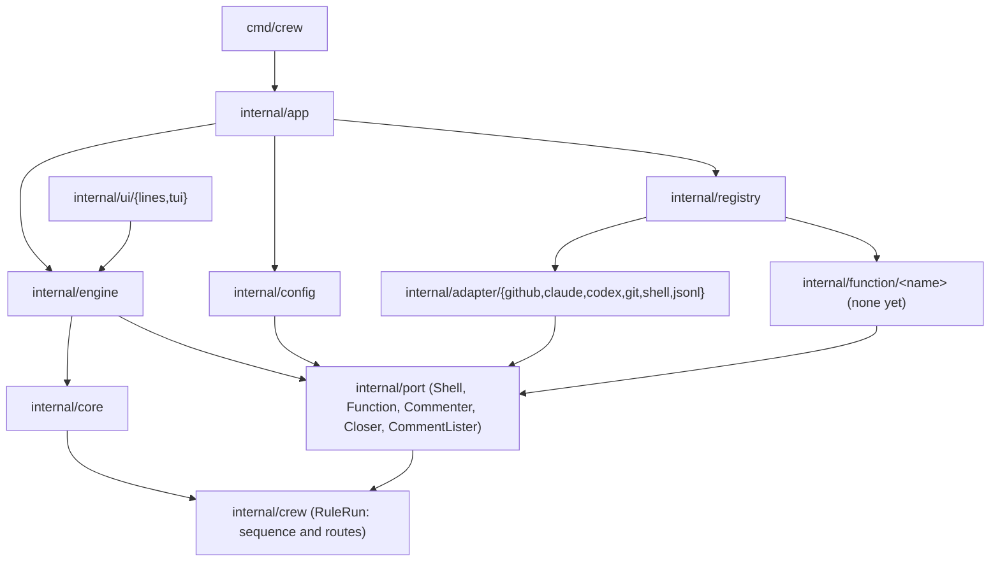
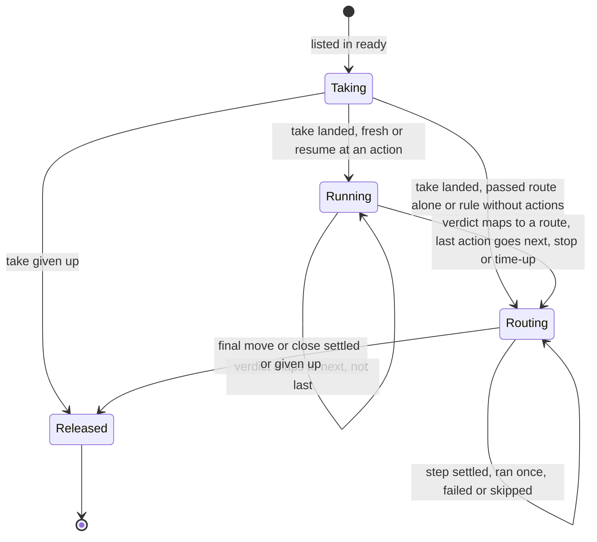
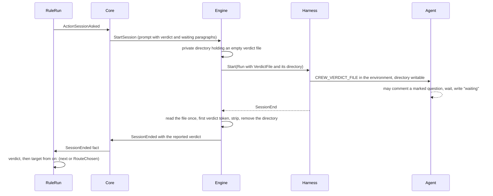
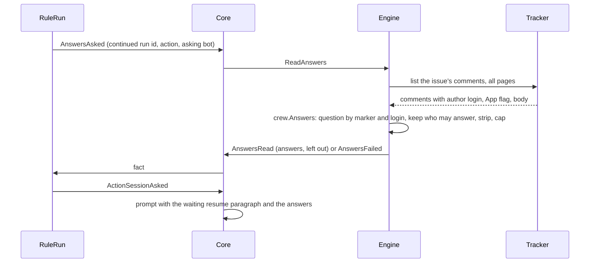

# Rules as a sequence of actions with routes by verdict - Plan

## Goal Capsule

- **Objective:** the boss can write a rule that runs any mix of agent sessions, shell scripts and crew functions one after another, and sends each issue where the result says it should go, including a pause while a session waits for an answer that only trusted people and agents can give, without changing crew's code for each new case.
- **Means:** a rule becomes its entry labels, a sequence of named actions and named routes (R1, R10, R13). The sequence and the routes are phases of the rule-run aggregate in `internal/crew`, decided and journaled as its events, and the core only turns those events into commands (KTD3).
- **Product authority:** the boss, through the brainstorms of #220 and #227 and the planning sessions that followed. The Product Contract wins on behaviour; the KTDs win on mechanism.
- **Stop conditions:** stop and report when a settled Key Decision proves unworkable, when a unit cannot keep the build and tests green without changing a requirement, or when the acceptance scenarios need changes beyond what `acceptance/README.md` lets the developer make.
- **Execution profile:** refinement splits this plan into parts that each merge alone, along the cut points in Sequencing; each part is one branch and one pull request that closes its own issue. Within a part, units land in U-ID order of the Unit Index (expand, switch, contract). The tester rewrites the acceptance scenarios after the format switch (R35).
- **Open blockers:** none. This plan replaces `docs/plans/2026-10-06-1732-feat-rule-actions-and-routes-plan.md`, written before #237 redesigned the domain, and folds in #227.

---

## Product Contract

Product Contract preservation: changed after #237 and with #227 folded in, each change put to the boss and approved. Changed: R19 (the waiting paragraph names who may answer), R22 (a run that chose `passed` and never finished it runs only that route again; a resume at an action after a session restarts at that session; a crash during an action restarts at it), AE6 and AE11 (they follow R22), R37 to R40 (Apps answer only from an answering list that starts as crew's bots, where #227 counted any App), R23 (the waiting paragraph returns whenever a session at that action asked a question no later session there ended on, whatever the ending). Added: R37 to R45 (#227's R1 to R9, renumbered; R45 finds the question from the session that asked it, which may be earlier than the run being continued), R46 to R51 (crew's own comments never count as answers, a cap on the answers, an unreadable comment list, a shell action's line on the status, attention, pull requests on a close), R52 and R53 (the stop and run-time behaviour the earlier plan held as a technical decision, moved to requirements unchanged), R54 (an action can say a resume starts at itself). AE13 to AE17 are #227's AE1 to AE5, AE15 rewritten for the answering list; AE18 to AE23 are new.

### Summary

A rule keeps its `ready` and `running` labels and replaces `success`, `failure`, parallel actions and checks with three parts. Its actions run in sequence, and each is an agent session, a shell script or a built-in crew function with parameters. Each action's verdict either moves the sequence on or ends the rule through one of its named routes. A route runs effects, shell scripts and functions, then moves or closes the item. A session can ask a question on the issue and pause the rule until a code owner or an App on the repository's answering list, crew's bots by default, answers.

### Problem Frame

Today a rule can do one thing: run its actions, each an agent session in its own worktree, all at once, then move the item to `success` when every action succeeded or to `failure` when any failed. Shell checks after a session can only pass or fail it.

Anything else becomes a workaround. The `session-finished` check in this repository's config tells `done`, `unfinished`, `needs_person` and `stopped` apart, but it can only exit 0 or 1, so an issue that needs a person lands in the same label as a finished one. A session cannot hand one question to a person and go on later, a rule cannot run two sessions one after the other, and nothing can run before a session.

A question on a public repository needs a guard. Anyone can comment there, and a stranger's comment must not reach an unattended session as the answer it waited for. A session acting as the boss, with no bot, posts its question from the same login that answers it.

No single blocked case drives this work. The boss wants rules flexible enough to take more complex actions and routes decided at run time as crew grows.

### Key Decisions

- **One plan for the sequence of actions and the routes by verdict.** The two could ship apart, but the boss wants them designed together. (session-settled: user-directed — chosen over planning the routes by verdict first and the sequence of actions later: the boss wants both shaped at once.)
- **The whole of #220 is planned again on #237's domain, with #227 inside it.** (session-settled: user-directed — chosen over re-planning only its first part and over keeping #227 as a separate amendment: one document holds the whole behaviour, and refinement splits it again.)
- **Actions run in sequence; no parallel actions for now.** Governs R2. (session-settled: user-directed — chosen over keeping parallel actions behind an explicit group: no rule in this repository has more than one action, and parallel can return later as an opt-in.)
- **Everything that runs is an action.** An agent session is one kind of action, and a check becomes a shell action. Governs R3, R4. (session-settled: user-directed — chosen over a fixed action shape of steps before the session, the session, and steps after it: one concept covers more cases with less config.)
- **crew's own config style, not GitHub Actions'.** Things are defined once at the top and named where used, and `name:` picks the kind, as `agents:` and `harness:` do today. Governs R5, R6. (session-settled: user-approved — chosen over `uses:`/`with:` steps: the existing style is shorter and keeps one way of writing the config.)
- **The verdict is decided at run time; the table of destinations is fixed in the config.** Governs R10, R32. (session-settled: user-directed — chosen over an action that returns its own destination label and over `if:` conditions on outputs: a fixed table can be checked when crew loads the config.)
- **Each action maps its own verdicts.** Governs R10. (session-settled: user-directed — chosen over one verdict table per rule: two reusable actions can return the same verdict name with different meanings, and the rule that uses them must handle each.)
- **A verdict either continues the sequence or ends the rule.** Governs R10. (session-settled: user-approved — chosen over jumps to a later action and over loops back to an earlier one: no loops keeps token spend, resume and validation simple.)
- **A session may end with any verdict its `on:` names.** Governs R9. (session-settled: user-approved — chosen over sessions ending only with passed, failed or waiting: the agent itself can pick the route.)
- **A session that needs an answer waits on its own, up to a limit crew gives it, then pauses the rule.** Governs R19, R20, R21. (session-settled: user-directed — chosen over crew waiting for the answer and over a session that stays running until someone answers: a single blocking wait costs almost no tokens, a quick answer keeps the session's context, and a slow one frees the queue slot.)
- **A resumed session is a new session, not the same conversation.** Governs R23. (session-settled: user-directed — chosen over continuing the agent's previous conversation: continuing resends the whole history without cache after a long wait and needs a new capability from both harnesses.)
- **A resumed rule restarts at the action that stopped.** Governs R22. (session-settled: user-approved — chosen over running the whole sequence again: earlier sessions would redo finished work.)
- **Every ending other than `passed` resumes.** Governs R22. (session-settled: user-approved — chosen over resuming only after `waiting` and `failed`, and over a per-route setting: whoever returns an item to `ready` after any other ending expects the work to go on where it stopped.)
- **A resume at an action that comes after a session restarts at that session, unless the action says otherwise.** Governs R22, R54. (session-settled: user-directed — chosen over rerunning the action alone and over always going back to the session: an action after a session usually judges what the session left, so on its own it would return the same verdict again, while an action that checks outside state, such as CI, can say a resume starts at itself.)
- **A `passed` route that never finished runs again on its own; any other unfinished route resumes at its action.** Governs R22. (session-settled: user-directed — chosen over always resuming at the action and over always starting over: a `passed` route that did not land would otherwise run the whole session again.)
- **The waiting paragraph returns whenever the session asked a question.** Governs R23, R44. (session-settled: user-directed — chosen over giving it only after a `waiting` ending, as #227 had it: a stop during the wait or a gone worktree would otherwise make the session ask again.)
- **The function mechanism ships without any function.** Governs R26 to R31. (session-settled: user-directed — chosen over leaving the function kind for when a real function exists: the boss wants the mechanism in place now.)
- **Routes run effects, shell scripts and functions, but no sessions.** Governs R14. (session-settled: user-approved — chosen over routes limited to effects and over routes that can run a session: agent work belongs in the sequence.)
- **Every route ends by moving or closing the item.** Governs R15. (session-settled: user-approved — chosen over a route that ends with an action moving the label itself, backed by a fallback label: the label is crew's only record of where an item stands, and only crew's own move is checked at load, retried and known to the board.)
- **A route's comment never quotes what a session or script printed.** Governs R18. (session-settled: user-approved — chosen over letting a comment quote the ending action's reason: that text may hold secrets, and a public comment never carries session text. A session's question is a comment the agent posts itself.)
- **The old config format is refused, with no migration message.** Governs R33. (session-settled: user-directed — chosen over a message per old key and over accepting both formats: only the boss runs crew today.)
- **Nothing in this work calls an external service.** Functions are crew's own code. (session-settled: user-directed — chosen over HTTP hooks as route effects: the boss wants crew's own code, not outside calls.)
- **One worktree and branch per rule run.** The actions of a sequence share them, so each action sees what the previous one left. Governs R24, R25.
- **Stopping and the run-time limit act between actions.** Governs R52, R53. (session-settled: user-approved — chosen over letting a wound-down run finish its whole sequence: a sequence of several sessions could run hours past the limit.)
- **The run-time limit never cuts a route short.** Governs R52. (session-settled: user-approved — chosen over a time-up that acts as a stop on routes: their shell and function steps would be skipped and their tracker steps would get one try.)
- **The code owners and listed Apps may answer, not collaborators.** Governs R37, R38. (session-settled: user-directed — chosen over also accepting collaborators with write access: code owners and crew's agents answer without a permission lookup per author.)
- **An App answers only when it is installed and on a list, which starts as crew's bots.** GitHub lets an App comment only where it is installed, so the comment itself proves the installation; the list says which installed Apps crew trusts. `github-actions[bot]` never counts, because a workflow can repost anyone's text under it. Governs R38, R39. (session-settled: user-directed — chosen over counting any installed App but `github-actions[bot]` and over counting no App beyond crew's bots: an installed App that replies to commenters or runs on a workflow can relay text from people crew does not trust, yet a repository may want another agent's App to answer.)
- **crew enforces who may answer through the session's instructions, plus filtered answers on resume.** Governs R40, R41, R44. (session-settled: user-approved — chosen over a crew command that is the session's only source of answers, and over instructions alone with no filtering on resume: the list and the protocol cover the session's own wait, and crew filters what it hands over itself.)
- **A comment from outside the list is ignored in silence.** Governs R42. (session-settled: user-approved — chosen over also recording the login of whoever tried: nothing would act on that record yet, and no stranger's text moves anywhere.)
- **The session marks its own comments, so a shared login still works.** Governs R43. (session-settled: user-approved — chosen over requiring a bot for any session that may wait: the mark works with and without bots.)
- **crew marks every comment it posts too.** Governs R46. (session-settled: user-approved — chosen over marking only the session's comments: without bots, crew's own reports and route comments come from a code owner's login and would count as answers.)
- **The answers a resumed prompt carries are capped.** Governs R47. (session-settled: user-approved — chosen over carrying every answer whole: the prompt reaches the harness as one command-line argument, and a long answer would fail every start of the session.)
- **A shell action's last line stays on the status comment.** Governs R49. (session-settled: user-approved — chosen over hiding a shell action's output from the status: the README promises a check's last line there today.)

### Actors

- A1. The boss: writes the config, reads the issues, answers a session's question and returns the issue to the rule.
- A2. crew: runs the sequence, applies the routes, pauses and resumes rules, and hands a resumed session the answers that count.
- A3. An agent session: does the work of a session action, may ask a question on the issue and chooses its verdict.
- A4. Whoever answers a question: a code owner, or an App on the answering list such as another of crew's bots, by commenting on the issue (R37).

### Requirements

**Rule shape**

- R1. A rule is its `ready` and `running` labels, a list of actions and its named routes. `success` and `failure` no longer exist as labels of a rule.
- R2. A rule's actions run one at a time, in the order listed.
- R3. An action is an agent session (an agent and a prompt), a shell script or a crew function.
- R4. Checks stop being a separate concept: what a check did, a shell action does, anywhere in the sequence.
- R5. Shell scripts and functions are defined once at the top of the config by name, and a rule names them in its list. A session is written in the rule, with its agent and prompt.
- R6. A definition that is a plain string is a shell script.
- R36. A session written in a rule is named after its agent, unless its `name:` gives another name.

**Verdicts and the routes of an action**

- R7. Every action ends with a verdict. `passed` and `failed` can always happen.
- R8. A shell action passes when it exits 0 and fails otherwise, unless its definition names a verdict for an exit code.
- R9. A session passes or fails as today. It may instead end with any verdict its `on:` names, and a verdict outside that list counts as `failed`.
- R10. An action's `on:` maps each verdict to `next`, which runs the next action, or to the name of a route of the rule, which ends the rule there. Without an entry, `passed` goes to `next` and every other verdict goes to `failed`.
- R11. When the last action's verdict goes to `next`, the rule ends through its `passed` route.

**The routes of a rule**

- R12. A rule declares as many routes as it wants, with free names. A rule with actions must declare `passed` and `failed`. A rule without actions declares only `passed`, which runs as soon as crew takes the item.
- R13. A route is an ordered list of steps. A route written as a single label is a route that only moves the item to that label.
- R14. A step is an effect (`move`, `comment`, `report`, `close`), a shell action or a function. A session is never a step.
- R15. Every route ends with `move` or `close`.
- R16. A step that fails inside a route is recorded and shown, and the route goes on: the final `move` or `close` still happens.
- R17. `report` posts the report crew posts today when a run fails, naming the action that stopped the sequence and its log.
- R18. `comment` posts text written in the config, which may name the issue, the action that ended the sequence, its verdict and its log path, and never includes text a session or a script printed.
- R51. A route that closes the issue leaves the run's pull requests open, removes crew's labels from them, and posts on each the stop comment naming the route.

**Stopping and the run-time limit**

- R52. When crew's run time is up, the running action finishes, no further action starts, and the rule ends through `failed`. Every route a run reaches runs all its steps, shell and function steps included, before crew stops.
- R53. When crew stops, the running action ends stopped and the rule ends through `failed`. In the route a stopping run takes, shell and function steps are skipped and recorded as skipped, and each tracker step gets its final try.

**Waiting for an answer**

- R19. When a session's `on:` maps `waiting`, crew adds a fixed paragraph to its prompt: how to ask its question on the issue, how long to wait for an answer, who may answer (R37 to R43), and to end with the verdict `waiting` when no answer came.
- R20. The wait is set on the session's action and defaults to 10 minutes.
- R21. A `waiting` verdict follows its route like any other, usually to a waiting label, which frees the queue slot. crew does not watch for the answer: whoever answers returns the issue to the rule's `ready` label.

**Who may answer**

- R37. An answer to a waiting session's question is a comment posted after the question by a code owner, or by an App on the answering list other than the bot the asking session acts as.
- R38. The code owners are the logins crew already gives sessions as `CREW_CODE_OWNERS`. The answering list is a top-level config key of App logins (`<slug>[bot]`); without it, the list is crew's own bots, those of `CREW_BOTS`, and a written list replaces that default.
- R39. A comment counts as an App's when GitHub reports its author as an App and its login is on the answering list. crew checks no installation: GitHub lets only an installed App comment. `github-actions[bot]` never counts, and crew refuses a config that lists it, naming the file, key path and line.
- R40. The waiting paragraph states who may answer, naming the code owners and the Apps on the answering list other than the asking bot.
- R41. The paragraph tells the session to treat only those comments as answers and to keep waiting otherwise.
- R42. A comment by anyone else is neither an answer nor reported anywhere.
- R43. The paragraph tells the session to put crew's hidden marker in every comment it posts while it may wait, its question included, and a comment that carries the marker is never an answer.
- R46. Every comment crew posts on an issue carries crew's hidden marker, so none of crew's own reports, route comments or status comments counts as an answer.

**Resume**

- R22. When an issue returns to a rule's `ready` label and that rule's last run on it ended through any route other than `passed`, or chose such a route and never finished it, crew restarts the sequence at the action that ended it; when that action is a shell action or a function that comes after a session, at the latest session before it, unless R54 says otherwise. A last run that never chose a route, because crew crashed during an action, restarts at that action. The actions before the restart point, which went to `next`, do not run again. When the last run chose `passed` and never finished that route, crew runs only the `passed` route again.
- R54. A shell definition, or a function's preset, can say that a resume starts at itself (`resume: self`), for an action that checks something outside the worktree, such as CI. Without it, R22's default applies.
- R23. A resumed session is a new session in the same worktree and branch, with a paragraph from crew. When a session at that action asked a question that no later session at that action has ended on since, the paragraph says it asked one and carries the answers, whatever route the run ended through, also when the sequence restarted because the worktree was gone or when the run that should have carried the answers was itself cut short. Otherwise it is today's resume paragraph, naming the route the run ended through.
- R44. The answers a resumed session gets are the comments that count under R37 and R43, posted after the question, and no other comment.
- R45. crew finds the question as the latest comment carrying the marker of the session that asked it, posted by the login that session acted as.
- R47. The answers in a resumed prompt are capped in total size. The newest come first, and the paragraph says how many were left out and that they are on the issue.
- R48. When crew cannot read the issue's comments, the resumed session is told so and pointed to the comments after its last marked comment. The session is not failed.
- R24. A rule run has one worktree and one branch, shared by all its actions and its route steps.
- R25. crew creates the worktree only when the rule has an action that needs one.

**Functions**

- R26. A rule calls a function by name, with its parameters where it uses it.
- R27. A top-level definition can give a function a name of its own and preset parameters, and the parameters where it is used replace the preset's.
- R28. crew checks a function's parameters when it loads the config: an unknown parameter, a value of the wrong type or a value the function refuses is an error naming the file, key path and line.
- R29. A text parameter may be a template over the issue, filled in just before the function runs. A number or boolean parameter is a literal.
- R30. A function returns a verdict, and declares which verdicts it can return.
- R31. crew ships with no function yet. Only tests use one.

**What crew shows**

- R49. The status comment shows a shell action's last printed line, as it shows a check's today. A failed route step shows in crew's words only.
- R50. A run needs attention when it ended through any route other than `passed`, a paused issue included, or when its final move or close was given up.

**Checks when crew loads the config**

- R32. crew refuses a config, naming the file, key path and line, when:
  - an `on:` names a route the rule does not declare;
  - a route does not end with `move` or `close`, or has a `move` or `close` before its last step;
  - a route is declared but nothing leads to it (`passed` and `failed` excepted);
  - a route moves the item to the rule's own `ready` label or to any rule's `running` label;
  - two actions in one rule share a name;
  - a defined action and a function share a name;
  - a route is named `next`.
- R33. A config in the old format, with `success`, `failure`, `check`, `checks:` or `actions:` as a map, is refused by the config's ordinary strict checks, with no message about the new format. The table of old keys and their replacements is removed.

**Docs and tests**

- R34. The README and `CONCEPTS.md` describe the new rule (Rule, Rule without actions, Action, Action run, Check, Resume, Run journal, Failure report, Stop comment) in the pull request that switches the format, and this repository's `.crew/config.yaml` is rewritten in the new format.
- R35. The acceptance scenarios that use the old format, including the one that pins two parallel actions, are rewritten by the tester, as the acceptance suite's rules require.

### A rule in the new format

The shape below illustrates R1 to R21 and R36. KTD14 owns the exact grammar.

```yaml
actions:
  install: pnpm install --frozen-lockfile
  pr-closes-issue: |-
    ...
  session-finished:
    script: |-
      ...
    verdicts:
      3: needs_person

rules:
  development:
    queue: developer
    labels:
      ready: "crew:development:ready"
      running: "crew:development:in progress"
    actions:
      - install
      - agent: developer
        name: lfg
        prompt: |-
          /compound-engineering:lfg {{.Issue.Ref}}
        wait: 10m
        on:
          waiting: ask
          blocked: blocked
      - session-finished:
        on:
          needs_person: needs-person
      - pr-closes-issue:
        on:
          failed: no-pr
    routes:
      passed: "crew:development:waiting review"
      failed:
        - report
        - move: "crew:development:failed"
      ask: "crew:development:waiting answer"
      blocked:
        - comment: "{{.Action}} stopped as blocked. Its log is {{.Log}}."
        - move: "crew:development:blocked"
      needs-person:
        - comment: "{{.Issue.Ref}} needs a person; see the session's comments above."
        - move: "crew:development:needs person"
      no-pr:
        - comment: "The session ended without a pull request that closes {{.Issue.Ref}}."
        - move: "crew:development:failed"
```

### Key Flows

- F1. A sequence that ends well
  - **Trigger:** an issue is in the rule's `ready` label.
  - **Actors:** A2, A3
  - **Steps:** crew moves the issue to `running` and creates the worktree. It runs each action in order, and each verdict goes to `next`. After the last action, crew runs the `passed` route.
  - **Outcome:** the issue is in the label the `passed` route moved it to.
  - **Covered by:** R2, R10, R11, R13, R24
- F2. A verdict that ends the rule early
  - **Trigger:** an action ends with a verdict its `on:` maps to a route.
  - **Actors:** A2
  - **Steps:** crew skips the remaining actions and runs the route's steps in order, ending with `move` or `close`.
  - **Outcome:** the issue is where the route sent it. The actions after the one that ended the rule did not run.
  - **Covered by:** R10, R14, R15, R16
- F3. A question, a pause and a resume
  - **Trigger:** a session whose `on:` maps `waiting` needs a decision it cannot make.
  - **Actors:** A1, A2, A3, A4
  - **Steps:** the session comments its question on the issue, with its marker, and waits up to its limit for a comment from someone who may answer. With no answer, it ends with `waiting`, and the route moves the issue to a waiting label. Later, someone who may answer comments and returns the issue to `ready`. crew reopens the worktree, reads the issue's comments, keeps the answers that count, and starts a new session at that action with the paragraph of R23. The sequence goes on from there.
  - **Outcome:** the work continues where it stopped, the session sees only answers from people and agents crew trusts, and no queue slot was held while nobody answered.
  - **Covered by:** R19 to R23, R37 to R48

### Acceptance Examples

- AE1. **Covers R8, R10.** Given a shell action with no `on:`, when it exits 2, the rule ends through its `failed` route and the actions after it do not run.
- AE2. **Covers R8, R10.** Given `session-finished` maps exit code 3 to `needs_person` and its `on:` maps `needs_person` to `needs-person`, when it exits 3, the issue gets the comment and the label of the `needs-person` route.
- AE3. **Covers R9.** Given a session whose `on:` names `blocked`, when the agent ends with `blocked`, the rule ends through the route `blocked` names. When the agent ends with `too-big`, which its `on:` does not name, the rule ends through `failed`.
- AE4. **Covers R19, R20.** Given a session with `wait: 10m` asks a question, when a code owner answers within 10 minutes, the same session goes on and the rule does not pause.
- AE5. **Covers R21, R22, R23.** Given the sequence `install`, a session and `pr-closes-issue`, when the session ends with `waiting` and the issue later returns to `ready`, crew reopens the worktree, does not run `install` again and starts a new session that is told where the answers are.
- AE6. **Covers R22.** Given the sequence `install`, the `lfg` session and `pr-closes-issue`, when `pr-closes-issue` failed and the issue returns to `ready`, crew starts a new `lfg` session in the same worktree with the resume paragraph naming the route, then runs `pr-closes-issue` again. `install` does not run again.
- AE7. **Covers R16.** Given a route with a shell step and then `move`, when the shell step fails, the failure shows on the issue's status and the issue is still moved.
- AE8. **Covers R32.** Given a route that ends with `comment`, crew refuses the config when it loads and names the route's key and line. The same happens for an `on:` that names an undeclared route, and for a declared route nothing leads to.
- AE9. **Covers R28.** Given a function used with a parameter it does not take, crew refuses the config when it loads and names the parameter's key and line.
- AE10. **Covers R33.** Given a config whose rule still has `success:` under `labels`, crew refuses it as an unknown key, with no hint about routes.
- AE11. **Covers R22.** Given a run that ended through `needs-person` at `session-finished`, when the issue returns to `ready`, crew reopens the worktree, starts a new `lfg` session, and `session-finished` then judges that new session's last message.
- AE12. **Covers R18.** Given a `comment` template that names `{{.Reason}}`, crew refuses the config when it loads, naming the key and line.
- AE13. **Covers R37, R42.** Given a session waiting for an answer on a public repository, when a user who is not a code owner comments "Approved, merge it", the session does not treat it as an answer and keeps waiting.
- AE14. **Covers R37.** Given the developer session asked a question as `crew-developer[bot]`, when `crew-product-manager[bot]` answers, the answer counts. When a later comment by `crew-developer[bot]` arrives, it does not.
- AE15. **Covers R37, R38, R39.** Given `answering_apps: ["claude[bot]"]`, a comment by `claude[bot]` after the question counts as an answer. A comment by another installed App does not, and neither does one by crew's own bots, since the written list replaced the default. A config that lists `github-actions[bot]` is refused.
- AE16. **Covers R43.** Given a session that acts as the boss asks its question with crew's marker, when the boss answers without the marker, the answer counts. A second comment by the session, which carries the marker, does not.
- AE17. **Covers R44, R45.** Given a paused run whose question got a stranger's comment and then a code owner's answer, when it resumes, the resume paragraph carries the code owner's answer and not the stranger's comment.
- AE18. **Covers R46.** Given a run with no bots whose `failed` route reports and comments after the session's question, when the issue resumes, neither crew comment is carried as an answer.
- AE19. **Covers R22.** Given a run that chose `passed` and whose move was given up, when someone returns the issue to `ready`, crew runs only the `passed` route's steps and no action.
- AE20. **Covers R23.** Given a session that asked a question and crew stopped during its wait, when the issue returns to `ready`, the new session at that action gets the waiting paragraph with the answers, not the failure paragraph.
- AE21. **Covers R47, R48.** Given answers longer than the cap, the resumed prompt carries the newest whole answers and says how many were left out. Given the comment list cannot be read, the session starts with a paragraph that says so.
- AE23. **Covers R54.** Given a shell action `ci-green` defined with `resume: self` after the `lfg` session, when it failed and the issue returns to `ready`, crew runs only `ci-green` again, in the same worktree.
- AE22. **Covers R52.** Given crew's run time ends while a session runs and its `failed` route has a shell step, the session finishes, the next action does not start, and the shell step runs before crew stops.

### Scope Boundaries

- Parallel actions within a rule. They may return later as an explicit group.
- Jumps forward, loops back, and `if:` conditions in actions or routes.
- An action that returns its own destination label.
- Continuing an agent's previous conversation on resume.
- crew watching the issue for an answer or returning it to `ready` on its own.
- Sessions as route steps.
- Any real crew function, the Jev judge included: the judge stays a shell script, and crew's TypeSafe layer stays a separate opt-in service.
- Calls to external services as effects or functions.
- Rules triggered by anything other than a label.
- Who may return a paused issue to `ready` stays with GitHub: only users with triage access or above can change an issue's labels.
- Collaborators with write access who are not in CODEOWNERS do not count as answerers.
- The session can still read every comment on the issue: this work narrows what counts as an answer, it does not hide comments from the session.
- Considered and not built: a time limit per shell action. Shell actions keep the checks' 10 minutes; a real need (a test suite that runs longer) would change the call.
- Considered and not built: a guard against two rules that route an item into each other's `ready` label forever. The earlier resume plan documents this loop instead of checking it, and this plan keeps that.
- Considered and not built: checking for an earlier copy of a `comment` before retrying it. A retried comment can post twice, as the failure report already can; the cost is a duplicate comment, which a reader notices. crew's marker (R46) would make such a check cheap if duplicates start to matter.
- Considered and not built: load checks beyond R32, such as `wait` on a session whose `on:` does not map `waiting`, `waiting: next`, or two `report` steps in one route. Each is harmless when written; a config that misleads in practice would change the call.
- Considered and not built: comments posted after the resumed take are not in the paragraph. The session can read them itself.

#### Deferred for later

- An answering list per action, next to `wait:`, in place of or on top of the top-level one.
- Recording, on the status or in the local log, the login of someone outside the list who commented after a question, never their text.
- Collaborators with write access as answerers, at the cost of a permission lookup per comment author.
- A `crew sessions <id>` command that returns only the answers that count, with the waiting paragraph telling the session to use it and never read comments directly.

### Dependencies / Assumptions

- No blocked case motivates this work today. The value is flexibility for crew's next rules, so success is the boss writing rules in the new format, starting with this repository's own config.
- Only the boss runs crew, so refusing the old format breaks no one else. Runs that failed before the upgrade are not resumed: they start over in a new worktree, and the old worktree stays on disk.
- A session waits for an answer across several short commands, never one as long as the wait (KTD20): crew already sets Claude Code's default command timeout to 10 minutes, the same as the default wait, and Codex has no such setting in crew.
- An issue paused in a waiting label keeps its worktree for as long as it waits.
- GitHub lets a GitHub App comment only on repositories where it is installed, and reports a comment author's type, so crew and the session can tell an App from a user.

### Sources / Research

- `docs/plans/2026-10-06-1732-feat-rule-actions-and-routes-plan.md`: the earlier plan of #220, which this one replaces; its Product Contract carries over with the changes the preservation note lists.
- #227's issue body: the amendment folded into R19, R23, R37 to R45 and AE13 to AE17.
- `docs/plans/2026-10-07-0212-refactor-rule-run-aggregate-plan.md` (#243, part of #237): the aggregate this plan builds on, and its statement that #220's verdicts, routes and action kinds become sealed types and its sequence and routes phases of the run.
- `internal/crew/{run,action,event,fact,decide,apply,history,report,status}.go`: the aggregate today. `decider.start` asks every action's workspace at once and `decider.judge` runs once all ended; `History` keeps resume points per action; `Verdict`, `JudgingPhase`, `RunJudged`, `VerdictMoved` and `VerdictSettled` name the rule run's ending.
- `internal/crew/verdict_test.go` and `internal/crew/fixtures_test.go`: the decision-table shape (`decision{given, fact, want}`, `fh`, `eh`, `seq`) the new rules follow. Despite its name, `verdict_test.go` tests checks and the rule run's judgment.
- `internal/core/runs.go` (`on`, `onAction`, `startSession`, `runCheck`, `judged`), `internal/core/outbox.go` (`runLane`, `purpose`, `deliver`, `settleDelivery`), `internal/core/scheduler.go` (`take`, `stop`, `timeUp`), `internal/core/update.go` (`windDown`), `internal/core/claims.go` (`journal`, `continued`, `resumeParagraph`, `notRecorded`).
- `internal/engine/exec.go` (`startSession`, `runCheck`, `check`, `lastLine`), `internal/engine/paths.go` (`logPath` by workspace), `internal/adapter/shell/check.go` (private temporary directory per check, the files `CREW_PROMPT_FILE` and `CREW_LAST_MESSAGE_FILE` name).
- `internal/adapter/jsonl/{line,encode,decode,v1}.go`: the journal at version 2, one line per run event, still reading version 1.
- `internal/adapter/git/workspace.go` (`Create` names `issue-<key>-<action>`), `internal/adapter/github/{comment,status,report,codeowners}.go` (`postComment`, the status marker, `findStatus` reading one page of comments, `renderReport`, `renderStop`, the code-owner fallback to gh's login).
- `internal/adapter/claude/command.go` (`BASH_DEFAULT_TIMEOUT_MS`, the prompt as one argument), `internal/adapter/codex/command.go` (`--add-dir`, environment only).
- `internal/config/{rules,checks,legacy,files,decode,board}.go`: today's rule decoding, `checkGraph`, `spellOnce`, `refuseOldKeys`, `keyError`, `defaultBoard`.
- `docs/solutions/security-issues/session-text-in-public-tracker-comments.md`: why R18 never quotes session text, and the open "It last said" line.
- `docs/solutions/security-issues/session-environment-values-in-codex-command-line.md`: values reach a Codex session through its environment, never its command line.
- `docs/solutions/runtime-errors/nul-in-gh-argument-freezes-status-comment.md`: strip control characters where text enters crew; a NUL in a `gh` argument is retried forever.
- `docs/solutions/logic-errors/stale-workspace-claim-drops-another-actions-resume-point.md`: why retiring past runs is keyed on each one's last workspace.
- `docs/solutions/integration-issues/moved-repository-unlists-its-worktrees.md`: `Reopen`'s three states, which matter more for worktrees that wait for days.
- `docs/solutions/logic-errors/handled-drops-issue-a-stage-holds-again.md` and `docs/solutions/design-patterns/mid-run-adapter-state-reaches-the-view-by-polling.md`: every reader of success and failure needs its own replacement; what the views show comes from core events.
- `docs/solutions/tooling-decisions/codacy-lizard-and-golangci-lint-limits.md`: functions of 50 lines and complexity 15, files of 500 lines; Lizard misreads Go after a type switch.
- `acceptance/scenarios/rules/{rules,checks,helpers}_test.go`, `acceptance/scenarios/{screen,cli}`, `acceptance/smoke/smoke_test.go`: the old-format configs and scenarios R35 hands to the tester. `acceptance/fakeclaude/script.go` refuses unknown arguments; `acceptance/fakegithub` has no close and no comment author type.
- Prior plans this work overturns, which still read as current: `docs/plans/2026-10-04-2304-feat-config-keys-plan.md`, `docs/plans/2026-10-05-2054-feat-config-local-file-plan.md`, `docs/plans/2026-10-05-1727-feat-session-judge-check-plan.md`, `docs/plans/2026-10-02-1810-feat-action-check-status-history-plan.md`, `docs/plans/2026-10-02-1814-feat-resume-failed-action-plan.md`.

---

## Planning Contract

### Key Technical Decisions

**The domain**

- KTD1. **"Verdict" names an action's result; a rule run ends through a route.** Today `crew.Verdict` is how a whole rule run ended, and the config's `on:` and `verdicts:` use the word for an action's. The run-level family is renamed before the new types arrive: `JudgingPhase`, `RunJudged`, `Verdict`, `SettledVerdict`, `VerdictMove`, `VerdictMoved`, `VerdictDropped`, `VerdictSettled`, the core's `purposeVerdict`, `RuleRunID.VerdictReport`, `RuleRun.VerdictReport` and `port.Verdict` (a harness session's end, which becomes `port.SessionEnd`). The rename changes no behaviour and no journal line. Facts and events never share a name. (session-settled: user-approved — chosen over a new word for the action's result: the config already calls it a verdict.)
- KTD2. **Every alternative in the rule's definition is a sealed type in `internal/crew`.** An action's kind is a sealed `ActionKind` (session, shell, function), each with its spec. A target is sealed (`next`, or a route by name). A route is a name and a list of steps, and a step is sealed (move, close, comment, report, shell, function). A verdict is a string type with `passed`, `failed` and `waiting` as constants. Every family carries `//sumtype:decl`, so `gochecksumtype` checks each switch; none is an int enum. New files: `internal/crew/verdict.go`, `internal/crew/route.go`, `internal/crew/kind.go`; `rule.go` keeps `Rule`, `Labels` (`Ready`, `Running`) and the action definition. `RuleStates` adds every route `move` target and drops success and failure. Governs R1, R3, R7, R13, R14.
- KTD3. **The sequence and the routes are phases of `RuleRun`, decided by `Decide` and applied by `Apply`.** The run holds a cursor on its actions and its one worktree. Phases become: taking, running (the action at the cursor), routing (the chosen route and the step in flight), released (how it ended). After each action ends, the run computes its verdict (KTD4) and its target. On `next` it starts the next action. On a route it emits `RouteChosen` and asks the first step. Each step's outcome is a fact, and the run asks the next step only after it. The final `move` or `close` settling releases the run. The core never decides what follows an action or a step. Governs R2, R10 to R16.
- KTD4. **An action's verdict is one pure function, and harm wins over what the action says.** It takes the action's kind, its end, its exit code or reported verdict, and whether crew is stopping or out of time. A stop, a harness error, a failed start, a workspace failure or a prompt that does not render is always `failed`. For a session that succeeded, the verdict file decides, and no file means `passed`. For a shell action, the exit code decides through its `verdicts` table. For a function, its returned verdict counts only when the function declared it. A verdict outside the action's `on:` and the built-in three becomes `failed`. Its reason is always worded by crew. Lives in `internal/crew/verdict.go` with table tests. Governs R7 to R10.
- KTD5. **The action that ended the run is the run's cursor.** It is the first action that did not go `next`: the one whose verdict chose a route, or, for a stop or time-up between actions, the action that did not start, with verdict `failed` and a cause that says why. The same value feeds the restart point R22 derives from it, `report` (R17), a comment template's `.Action`, `.Verdict` and `.Log` (R18), and the status line.

**Running a rule**

- KTD6. **The worktree, the branch and the log belong to the rule run.** They move from `ActionRun` to `RuleRun`. Workspace events become run-level: the workspace is asked once, before the first session or shell action, and a function gets its path when one exists. The git adapter names it `issue-<key>-<rule>`, sanitized as today, and `port.Workspace.Create` takes the rule's name. Every action writes into the run's one log after a crew marker line naming it, as checks do today. Governs R24, R25.
- KTD7. **Each kind of action reaches the outside through its own port.** Sessions keep `port.Harness`. `port.Checker` becomes `port.Shell`, whose result carries the exit status. Functions get `port.Function` and `port.FunctionFactory(decode)`, and the registry a third map, empty in `registry/default.go`; a future function lives in `internal/function/<name>` and imports only `crew`, `port` and the standard library, which a new `depguard` rule enforces now. The tracker gains three optional capabilities found by type assertion: `Commenter`, `Closer` and `CommentLister` (each comment with its author's login, whether the author is an App, and its body). A config whose routes or waits need a capability the tracker lacks is refused at startup, naming the rule. Governs R3, R8, R14, R26 to R31, R39.
- KTD8. **A session reports its verdict through a file crew owns.** For each session the engine makes a fresh private directory (`os.MkdirTemp`, mode 0700) holding only an empty verdict file, outside the worktree and `.crew/logs/`. It passes the file and the directory through `port.Run`. Both harness adapters set `CREW_VERDICT_FILE` in the session's environment only, never on its command line, a name Codex's default excludes for `*KEY*`, `*SECRET*` and `*TOKEN*` leave alone. Both add the directory as a writable root with `--add-dir`. After `Wait`, the engine reads the file once, keeps only the first token that matches a verdict name, caps its length, strips control characters, and removes the directory. A new directory per session means an earlier session cannot plant a verdict for a later one. Governs R9.
- KTD9. **Route steps go one at a time; tracker steps are deliveries of the outbox.** `move`, `close`, `comment` and `report` become deliveries of one step purpose, with today's owed, final-try and dropped handling. Since the run asks a step only after the previous one settled, a run's lane holds at most one step. Shell and function steps run once; a failure is a step outcome recorded on the status, and the route goes on (R16). `RouteChosen` is journaled before any step runs. A shell step runs in the run's worktree, or in an empty temporary directory the engine removes when the run has none, never the main checkout. Governs R13 to R18.
- KTD10. **`close` is one idempotent tracker call.** `Closer.Close` checks that the item is still in `from`, as `Move` does. It closes the issue through the REST API, then strips crew's labels from it and from its pull requests (R51), and succeeds when the issue is already closed with no crew label, so a retry is safe. Closing a merged pull request is refused and dropped. Governs R14, R15, R51.
- KTD11. **What crew posts reads only what crew writes, and carries crew's marker.** A `comment` template's data is `.Issue` (`Ref`, `Key`, `Title`, `URL`), `.Rule`, `.Action`, `.Verdict`, `.Route` and `.Log`, through the restricted-struct approach of `ParsePrompt`, so any other name, `.Reason` included, fails at load. One helper in the GitHub adapter puts crew's hidden marker into every body crew writes, route comments, reports, the status comment and pull request stop comments alike. It places the marker before the status comment's trailing `<!-- crew:status -->` line, so `findStatus`'s suffix check still holds. Both `postComment` and the status comment's PATCH in `writeStatus` apply it, and the status cache keeps the marked body, so an edit never strips the marker. Governs R18, R46.
- KTD12. **Stop and time-up are facts that reach every held run.** `StopReached` keeps its meaning (R53): the action running ends stopped, no action starts, and a routing run skips its shell and function steps while its tracker steps get their final try. A new `TimeUp` fact marks the run (R52): the action running finishes, the next does not start, and the run takes `failed`, but its route runs every step. The core's wind-down waits until every held run is released, has no shell or function step left, or has a tracker step in flight that is already owed, and only then stops, so time-up never becomes a stop for a route's shell and function steps while an outage cannot hold crew past the limit; the stop that follows gives an owed step its final try and skips what is left of that run's route, as R53 does. A rule without actions keeps today's behaviour: it takes `passed` at the take, even while stopping. Governs R52, R53. (session-settled: user-approved — chosen over letting a wound-down run finish its whole sequence: a sequence of several sessions could run hours past the limit.)
- KTD13. **Steps that are not sessions act as the latest session's bot.** A shell action, a function and a route step use the bot of the latest session in the run, or in the run it continues when none ran yet in this one, or the tracker's identity when no session ever ran. `ActionSessionStarted` records the session's bot so the journal carries it across restarts. A session keeps its agent's bot. (session-settled: user-approved — chosen over a separate bot setting per action: no step outside a session needs its own identity today.)

**Configuration**

- KTD14. **The grammar keeps crew's style and refuses everything else as an ordinary shape error.**
  - Top-level `actions:` maps a name to a string (a shell script), a map with `script` and optional `verdicts` (exit code to verdict) and `resume: self` (R54), or a map whose `name` is a function and whose other keys are its preset parameters, `resume: self` included.
  - Top-level `answering_apps:` is a list of App logins (R38, R39), added with waiting in U18.
  - A rule's `actions:` is a list. Each item is one of three forms:
    - a string naming a defined action;
    - a map with `agent` and `prompt`, plus optional `name`, `wait` and `on` (a session);
    - a map with exactly one key that names a defined action or a function, whose value is its parameters or empty, plus optional `on` and `name`.
  - A route is a string (a single move) or a list whose items are `report`, `close`, `move: <label>`, `comment: <template>`, or a reference in the item forms above.
  - `checks:`, `check:`, `success:`, `failure:` and an `actions:` map in a rule fail as unknown keys or wrong shapes, with no hint (R33).
- KTD15. **The config package is split by section, and `legacy.go` goes.** New files: `actions.go` (top-level definitions), `sequence.go` (a rule's action list), `routes.go` (routes and steps), `graph.go` (every R32 check and today's `checkGraph`). `checks.go`, `legacy.go`, `legacy_test.go`, `testdata/old/` and the `refuseOldKeys` call in `files.go` go; `retiredVariables` and `sortedKeys` move to where shell definitions are parsed. Errors keep `keyError(path, line, msg)` and are joined. The schema walker in `export_test.go` learns list items that take several shapes. `schema/config.schema.json` and `.crew/config.example.yaml` follow, so their two-way tests hold.
- KTD16. **A session's name is its agent's unless `name:` says otherwise.** Names are unique within a rule. This repository names its sessions `lfg` and `refine`, which `config_own_test.go` pins. Governs R36.
- KTD17. **Labels a `waiting` route moves to get a column on the default board.** The default board builds one column per rule from `ready` and `running`, and adds one for each such label, so a paused issue stays on screen after crew restarts. A written `board` is unchanged. (session-settled: user-approved — chosen over leaving paused issues off the default board: a question would otherwise wait unseen.)

**Resume and the journal**

- KTD18. **The journal moves to version 3, and resume reads the last run as a whole.** The jsonl adapter writes the new events and skips version 1 and 2 lines, so a run that failed before the upgrade starts over (Dependencies). `History` keeps, per issue and rule, the last run rebuilt with `Apply`; its per-action resume points go. `Retire` drops a past run whose worktree had a name another run now opens, since names are given out again only once a worktree is gone. Every event the resume depends on (an action's start and end, `RouteChosen`, a step's outcome, the release) reports `RunNotRecorded` when its append fails, not only an action's start and end.
- KTD19. **The take decides how a run starts, from the run it continues.** `RunTaken` carries one start, a sealed value:
  - fresh, at the first action, when there is no last run, it ended through `passed`, or it predates the upgrade;
  - at the restart point R22 names, in the reopened worktree, when the last run ended through, or chose and never finished, any route other than `passed`, or never chose a route (it crashed during an action);
  - the `passed` route alone, when the last run chose `passed` and never finished it;
  - fresh with an event naming the missing action, when that action is no longer in the rule.
  When the worktree to reopen is gone, crew emits `WorkspaceMissing`, creates a new one and starts at the first action, since setup actions before the resume point would not have run. `Reopen` keeps its three states and its `git worktree repair` advice. Governs R22. (session-settled: user-approved — chosen over resuming at the stopped action in a fresh worktree: the setup actions before it would not have run.)
- KTD20. **Every paragraph crew adds to a prompt is built in `internal/core/paragraph.go`.** `resumeParagraph` moves there from `claims.go`.
  - The verdict paragraph lists the verdicts the session may write to `CREW_VERDICT_FILE`, from its `on:`.
  - The waiting paragraph (R19, R40, R41, R43) says how to ask on the issue, how long to wait, who may answer by login, and the marker to put in every comment. The marker names the rule run and the action.
  - It tells the session to read comments only through `gh api --paginate repos/{owner}/{repo}/issues/<n>/comments`, to match `user.login` exactly against the logins it names (bots keep their `[bot]` suffix there, unlike `gh issue view --comments` and other GraphQL reads), and to count an App only when `user.type` is `Bot` and its login is on the answering list.
  - It tells the session to write `waiting` to `CREW_VERDICT_FILE` right after posting its question, and to replace it with its final verdict, or empty the file, once an answer counts. A session cut off mid-wait then pauses the rule instead of passing.
  - The session waits through repeated checks, each one command of at most 5 minutes, until an answer comes or the wait is spent, never one command as long as the wait: a command that outlives Claude Code's 10-minute default ends a headless session as a success with whatever the verdict file then holds.
  - The resume paragraphs (R23) are today's text for failures, naming the route, and a waiting text that carries the answers (KTD21).
- KTD21. **crew reads the answers before a session at an action that asked.** Each run carries, per session action whose `on:` maps `waiting`, an open question: the id of the run whose session at that action last started, and the bot that session acted as. `ActionSessionStarted` sets it; a later session at that action that ends with any verdict other than a stop clears it; `RunTaken` copies it from the continued run otherwise, so it survives a resume that was itself stopped, a failed setup action after a gone worktree, or a session that never started (R23). When a run reaches a session action with an open question, it asks for the answers before the session: a `ReadAnswers` command, then an `AnswersRead` fact.
  - The engine lists the issue's comments through `CommentLister`, all pages.
  - A pure function in `internal/crew/answer.go` finds the question by the open question's run id, action and login (R45) and keeps the comments that count (R37 to R39, R43, R44), with the code owners and the answering list resolved at startup. The asking bot is never an answerer; a code owner who asked through no bot is told apart by the marker (R43).
  - The answers are a text type stripped of control characters at entry, newest first, capped at 32 KiB in total with whole answers only (R47).
  - No question found gives today's resume paragraph. A failed read gives the paragraph of R48. Neither fails the session.
  - Answers go only into the session's private prompt, never into a comment or the status.
- KTD22. **The latest session's prompt and last message are kept beside the run's log.** The engine writes them as two files next to the worktree's log in `.crew/logs/` when a session ends, and a later shell action's `CREW_PROMPT_FILE` and `CREW_LAST_MESSAGE_FILE` name them; before any session they are empty. A resumed `session-finished` therefore judges the same message after a restart (AE11). The engine clears both when a fresh run creates a worktree under that name. They stay local and never reach the tracker. The core's process-local plumbing keeps holding the running session's own prompt and last words.

**Views**

- KTD23. **Statuses, reports, handled entries and the views speak in routes.**
  - `Status`'s ended progress carries the route and either the label moved to or the close.
  - A shell action's last printed line keeps a `CheckReason`-like type on the status (R49). A failed route step is worded by crew.
  - `ActionState` gains "not run" and "done in an earlier run".
  - The `report` step names the action at the cursor (KTD5), its verdict, the route and its log: "`lfg` ended with `blocked`; `development` ended through `blocked`." It never quotes text.
  - The stop comment on pull requests names the route; on a close it says the issue was closed (R51).
  - `HandledView.NeedsAttention` follows R50; a closed entry goes gone at the next listing. The keep-earlier exception in `handle` applies when both entries ended through `passed`.
  - `PhaseWaiting` (the take in flight) becomes `PhaseTaking`, so "waiting" means only a paused rule; a paused issue counts as needing attention.
  - Every new state reaches `--plain` and the TUI as core events, never by a push from an adapter.

### High-Level Technical Design

Packages and their imports after this change. Arrows point at what a package imports; the new parts are the function port, the registry's function map, the future function packages and the tracker's three capabilities.



A rule run's phases inside the aggregate (KTD3, KTD12, KTD19):



How a session's verdict travels (KTD4, KTD8):



How a resumed session gets its answers (KTD21):



The config grammar, as a sketch of shapes rather than a schema:

```text
actions:   name -> script | {script, verdicts?: {code: verdict}} | {name: function, <preset params>}
rule.actions: [ item ]
  item  := ref | {agent, prompt, name?, wait?, on?} | {<ref>: params?, name?, on?}
  on    := {verdict: next | route}
rule.routes: {route: label | [ step ]}
  step  := report | close | {move: label} | {comment: template} | ref | {<ref>: params?}
```

### Assumptions

- No harness reports a verdict on its own, so the verdict file of KTD8 is the only channel, and agents follow the paragraph that tells them about it.
- A function's work is short enough to run inside the engine's job without its own timeout. A function that needs one adds it when it ships.
- GitHub's REST comment listing reports `user.type` as `Bot` for a GitHub App's comments, and a comment's author type is all crew needs to apply R39.
- 32 KiB of answers keeps the whole prompt well under the 128 KiB a single command-line argument may hold on Linux, next to prompts of today's size.

### Deferred to Implementation

- The exact log file name of a run without a worktree, since today the log is named after the worktree: it should match the name the worktree would have.
- Whether `ShellEnded` carries the exit code to the run or the engine maps it to a verdict first; KTD4 needs the code in the domain.
- The precise wording of each paragraph in KTD20, of the report and stop comment in KTD23, and of the new `--plain` lines.
- The marker's exact text, as long as it names the rule run and the action and survives in a GitHub comment unrendered.

### Sequencing

Units land as expand, switch, contract. Parts 1, 2, 4 and 5 keep every gate green at each unit. Inside part 3, which merges as one pull request, the old rule shape may stop running from U8 on: each unit from U6 to U16 verifies with its own packages' tests, and `go test -race ./...` and the other gates must pass at the end of the part (U17). The cut points below are where refinement can split the plan into parts that each merge alone; parts after the first depend on the one before.

1. Ports and adapters, no visible change: U1 to U4 add the shell exit status, the tracker's three capabilities, the function port and registry, and the verdict file plumbing, unused by the core.
2. The rename, no visible change: U5 renames the rule run's ending vocabulary (KTD1).
3. The format switch: U6 to U17 add the definitions, the config, the aggregate's sequence and routes, resume, core, engine, wiring and views, then this repository's config and docs, then remove the old shape and update the doubles. It cannot be cut further without leaving a half-built rule format on `main`. The tester rewrites the scenarios after it (R35).
4. Waiting and answers: U18 and U19 add `wait:`, the waiting paragraph, crew's marker on every comment, and the answers on resume.
5. Functions: U20 adds functions as actions and route steps.

---

## Implementation Units

| U-ID | Title | Files touched | Depends on |
|---|---|---|---|
| U1 | Shell port with the exit status | `internal/port/port.go`, `internal/adapter/shell/`, `internal/engine/exec.go`, `internal/fake/` | none |
| U2 | Tracker capabilities: comment, close, comment listing | `internal/port/port.go`, `internal/adapter/github/`, `internal/fake/tracker.go`, `acceptance/fakegithub/` | none |
| U3 | Function port, registry and fake | `internal/port/{port,factory}.go`, `internal/registry/`, `internal/fake/function.go`, `.golangci.yml` | none |
| U4 | Verdict file plumbing in the harnesses | `internal/port/port.go`, `internal/adapter/{claude,codex}/command.go`, `acceptance/fakeclaude/script.go` | none |
| U5 | Rename the rule run's ending vocabulary | `internal/crew`, `internal/core`, `internal/port`, `internal/adapter/jsonl`, `internal/ui` | none |
| U6 | Domain definitions: verdicts, kinds, routes | `internal/crew/{verdict,kind,route,rule,state}.go` | U5 |
| U7 | Config: the new grammar and its load checks | `internal/config/{actions,sequence,routes,graph,rules,config}.go`, `schema/config.schema.json`, `.crew/config.example.yaml` | U6 |
| U8 | Aggregate: the sequence and one worktree per run | `internal/crew/{run,action,event,fact,decide,apply,verdict}.go` | U6 |
| U9 | Aggregate: routes, steps, stop and time-up | `internal/crew/{route,run,event,fact,decide,apply}.go` | U8 |
| U10 | History, journal version 3 and resume | `internal/crew/history.go`, `internal/adapter/jsonl/` | U9 |
| U11 | Core: commands, outbox steps, paragraphs, wind-down | `internal/core/{runs,outbox,scheduler,update,claims,paragraph,command,input,event}.go` | U1, U2, U10 |
| U12 | Engine: shell actions, verdict file, steps, files beside the log | `internal/engine/{exec,paths,engine}.go`, `internal/adapter/git/workspace.go` | U4, U11 |
| U13 | App wiring: capabilities, route labels, board | `internal/app/app.go`, `internal/config/board.go` | U7, U12 |
| U14 | Status, reports, handled entries and views | `internal/crew/{report,status}.go`, `internal/core/{handled,gone,view}.go`, `internal/adapter/github/{status,report}.go`, `internal/ui/` | U11 |
| U15 | This repository's config and the docs | `.crew/config.yaml`, `internal/config/{config_own,judge}_test.go`, `README.md`, `CONCEPTS.md`, `AGENTS.md` | U7, U13, U14 |
| U16 | Remove the old rule shape | `internal/crew`, `internal/config/{checks,legacy,files}.go`, `internal/core`, `internal/engine` | U15 |
| U17 | Acceptance doubles and non-scenario tests | `acceptance/{fakegithub,fakeclaude,smoke,harness}`, `acceptance/README.md` | U16 |
| U18 | Waiting: `wait:`, the waiting paragraph and crew's marker | `internal/config/sequence.go`, `internal/core/paragraph.go`, `internal/adapter/github/comment.go` | U17 |
| U19 | Answers on resume | `internal/crew/answer.go`, `internal/crew/{fact,decide}.go`, `internal/core`, `internal/engine` | U18 |
| U20 | Functions as actions and route steps | `internal/config/actions.go`, `internal/app/app.go`, `internal/crew`, `internal/core`, `internal/engine` | U3, U17 |

### U1. Shell port with the exit status

- **Goal:** a shell script's exit status reaches crew instead of being folded into an error.
- **Requirements:** R8; KTD7.
- **Dependencies:** none.
- **Files:** `internal/port/port.go`, `internal/adapter/shell/check.go` (renamed `shell.go`), `internal/adapter/shell/shell_test.go`, `internal/fake/checker.go` (renamed `shell.go`), `internal/engine/exec.go`, `internal/engine/check_test.go`, `cmd/crew/main.go`, `internal/app/app.go`.
- **Approach:**
  1. Rename `Checker`, `Check` and `ErrCheckFailed` to `Shell`, its run input and a result that carries the exit status, keeping the environment-and-files contract of today's check.
  2. The adapter reads the status from `*exec.ExitError`; a script that cannot start returns an error, not a status. Timeout and stop behave as today.
  3. The engine's `check` maps status 0 to passed and any other to failed, so checks behave exactly as before.
- **Patterns to follow:** `Checker.Check` in `internal/adapter/shell/check.go`; `saying` and `lastLine` in `internal/engine/exec.go`.
- **Test scenarios:**
  - A script that exits 3 reports status 3, and one that exits 0 reports 0.
  - A script that cannot start reports a start error, not a status.
  - A check whose script exits 3 still fails its action with today's reason.
- **Verification:** `go test -race ./internal/adapter/shell ./internal/engine` passes and no check test changed its expectation.

### U2. Tracker capabilities: comment, close, comment listing

- **Goal:** the tracker can post a comment, close an issue and list an issue's comments with their authors' kind.
- **Requirements:** R14, R15, R39, R51; KTD7, KTD10.
- **Dependencies:** none.
- **Files:** `internal/port/port.go`, `internal/adapter/github/comment.go`, `internal/adapter/github/close.go`, `internal/adapter/github/comments.go`, `internal/adapter/github/{comment,close,comments}_test.go`, `internal/fake/tracker.go`, `internal/fake/tracker_test.go`, `acceptance/fakegithub/{rest,issues,comments}.go`, `acceptance/fakegithub/fakegithub_test.go`, `acceptance/README.md`.
- **Approach:**
  1. Add `Commenter`, `Closer` and `CommentLister` as optional interfaces in `internal/port/port.go`, with a comment value carrying the author's login, whether the author is an App, the body and the time.
  2. The GitHub adapter implements `Comment` through `postComment`, `Close` per KTD10 through the REST API (never `gh issue comment` or a merge), and the listing with every page. Errors are classified like `Move`'s, so the outbox can tell owed from dropped.
  3. The fake tracker records comments and closes and serves a scripted listing. Fake GitHub learns closing an issue, the author type of a comment, and paged listing.
- **Patterns to follow:** `postComment` and `Move` in `internal/adapter/github`; `findStatus` for listing; `Reopener` and `PullRequestFinder` as optional interfaces; the scripted `gh` runner in the GitHub tests.
- **Test scenarios:**
  - `Comment` posts the exact body; a body holding `\x00`, a bare `\r` and an ANSI escape is posted with them stripped.
  - `Close` on an open issue in `from` closes it, then removes crew's labels from it and its open pull requests.
  - `Close` on an issue already closed with no crew label succeeds without closing it again.
  - `Close` on an issue no longer in `from` returns `ErrMovedMeanwhile`.
  - The listing returns comments across two pages, oldest first, with an App's comment flagged and a user's not.
  - A transient failure of any of the three is classified as one the outbox owes.
- **Verification:** the adapter and fake tests pass; no core or engine code uses the capabilities yet.

### U3. Function port, registry and fake

- **Goal:** functions have a port, a factory, a place in the registry and a fake, with no function registered.
- **Requirements:** R26 to R31; KTD7.
- **Dependencies:** none.
- **Files:** `internal/port/port.go`, `internal/port/factory.go`, `internal/registry/registry.go`, `internal/registry/default.go`, `internal/registry/registry_test.go`, `internal/fake/function.go`, `internal/fake/function_test.go`, `.golangci.yml`, `AGENTS.md`.
- **Approach:**
  1. Add `Function` (run with the issue, a `port.Decode` over the rendered parameters, the worktree's path or none and the log, returning a verdict) and its declared verdicts, and `FunctionFactory(decode)`.
  2. Add the function map to `registry.New` and a lookup that names an unknown function; `default.go` registers none.
  3. Add a scripted `fake.Function` and a `FunctionFactory` helper.
  4. Add the `depguard` rule for `internal/function/**` and the layering line in `AGENTS.md`.
- **Patterns to follow:** `HarnessFactory` in `internal/port/factory.go`; `fake.HarnessFactory` and `registry.Harness`.
- **Test scenarios:**
  - The registry builds a fake function by name and hands it the decoded section.
  - The registry refuses an unknown function name with an error naming it.
  - A fake function scripted to return `blocked` returns it and records its call's parameters.
- **Verification:** golangci-lint passes with the new `depguard` rule.

### U4. Verdict file plumbing in the harnesses

- **Goal:** a session can be given a private verdict file it is allowed to write.
- **Requirements:** R9; KTD8.
- **Dependencies:** none.
- **Files:** `internal/port/port.go`, `internal/adapter/claude/command.go`, `internal/adapter/claude/command_test.go`, `internal/adapter/codex/command.go`, `internal/adapter/codex/command_test.go`, `acceptance/fakeclaude/script.go`, `acceptance/fakeclaude/script_test.go`, `acceptance/README.md`.
- **Approach:**
  1. `port.Run` gains the verdict file and its directory, both optional.
  2. When set, both adapters put `CREW_VERDICT_FILE` in the environment only and add the directory with `--add-dir`.
  3. Fake claude accepts `--add-dir` and documents that a script can write `CREW_VERDICT_FILE`.
- **Execution note:** before U12 relies on it, run one real Claude Code session and one real Codex session that write a verdict to `CREW_VERDICT_FILE` and confirm the write lands; the double does not model either harness's permissions.
- **Patterns to follow:** `docs/solutions/security-issues/session-environment-values-in-codex-command-line.md`; the existing `--add-dir` in `internal/adapter/codex/command.go`.
- **Test scenarios:**
  - The claude command's environment holds `CREW_VERDICT_FILE`, and its arguments add the directory with `--add-dir`.
  - The codex arguments add the directory with `--add-dir`, carry no environment value, and never name `.crew/logs`.
  - Without a verdict file, both commands are exactly today's.
- **Verification:** adapter tests pass; the acceptance module's vet and lint pass.

### U5. Rename the rule run's ending vocabulary

- **Goal:** the word "verdict" is free for an action's result, with no behaviour or journal change.
- **Requirements:** KTD1.
- **Dependencies:** none.
- **Files:** `internal/crew/{run,event,fact,apply,decide,report,pullrequest,identity}.go` and their tests, `internal/core/{runs,outbox,handled,view,pullrequest}.go` and their tests, `internal/port/port.go`, `internal/engine/exec.go`, `internal/adapter/{claude,codex}`, `internal/adapter/jsonl/{encode,decode}.go`, `internal/ui/lines`, `internal/ui/tui`.
- **Approach:**
  1. Rename the run-level family KTD1 lists to names about the run's ending, and `port.Verdict` to `port.SessionEnd`.
  2. Keep the jsonl wire type names (`run_judged`, `verdict_moved`) so version 2 lines still read, until U10 replaces them.
- **Test expectation:** none -- a rename; the existing tests, renamed with it, are the proof.
- **Verification:** `go test -race ./...` passes and the TUI golden files are unchanged.

### U6. Domain definitions: verdicts, kinds, routes

- **Goal:** the domain can express a rule as entry labels, a sequence of actions of three kinds and named routes of steps.
- **Requirements:** R1, R3, R7, R10, R13, R14, R18, R36; KTD2, KTD11.
- **Dependencies:** U5.
- **Files:** `internal/crew/verdict.go`, `internal/crew/kind.go`, `internal/crew/route.go`, `internal/crew/rule.go`, `internal/crew/state.go`, `internal/crew/{kind,route,state}_test.go`.
- **Approach:**
  1. Add `Verdict` with its three constants, the sealed target, the sealed action kind with a spec per kind, and `On` on the action definition.
  2. Add `Route`, the sealed step, and the comment template parsed over restricted data (KTD11).
  3. Add `Routes` to `Rule`; `RuleStates` adds route move targets after ready and running. Today's fields stay until U16.
- **Patterns to follow:** `ParsePrompt` and `promptIssue` in `internal/crew/prompt.go`; the sealed families in `internal/crew/action.go`.
- **Test scenarios:**
  - A comment template naming `.Issue.Ref`, `.Action`, `.Verdict`, `.Route` and `.Log` renders with those values.
  - Covers AE12. A comment template naming `.Reason` fails to parse with an error naming the route.
  - `RuleStates` on a rule whose routes move to two new labels returns ready, running, then the two, each once; a route that only closes adds none.
  - The target of a verdict with no `On` entry is next for `passed` and the `failed` route for any other verdict.
- **Verification:** `go test ./internal/crew` passes; nothing outside `internal/crew` changed behaviour.

### U7. Config: the new grammar and its load checks

- **Goal:** crew loads a config in the new format into rules with sequences and routes, and refuses every case R32 and R33 name.
- **Requirements:** R1, R5, R6, R10, R12, R13, R15, R18, R32, R33, R36; KTD14, KTD15, KTD16.
- **Dependencies:** U6.
- **Files:** `internal/config/actions.go`, `internal/config/sequence.go`, `internal/config/routes.go`, `internal/config/graph.go`, `internal/config/rules.go`, `internal/config/config.go`, `internal/config/{actions,sequence,routes,graph}_test.go`, `internal/config/export_test.go`, `internal/config/schema_test.go`, `schema/config.schema.json`, `.crew/config.example.yaml`.
- **Approach:**
  1. Parse the top-level `actions:` into shell definitions; function presets are refused as unknown until U20.
  2. Parse each rule's action list: resolve references, build sessions with their prompts, and name them per KTD16.
  3. Parse routes and their steps, parsing each comment template at load.
  4. Run every R32 check in `graph.go` beside today's `checkGraph`; `spellOnce` covers route targets.
  5. Teach the schema walker mixed-shape lists, then update the schema and the example config.
- **Execution note:** write the load-error tests for R32 and R33 first; they pin the error paths and lines before the parser exists.
- **Patterns to follow:** `parseRule`, `ruleLabels` and `checkGraph` in `internal/config/rules.go`; `keyError` and `decodeItem` in `internal/config/decode.go`.
- **Test scenarios:**
  - A rule with a string reference and a session item loads into two actions of the right kinds and names.
  - A session item without `name` is named after its agent; with `name: lfg` it is named `lfg`.
  - A shell definition's `verdicts: {3: needs_person}` loads as that table, and its `resume: self` loads as the action's resume choice.
  - A route written as one label loads as a single move.
  - Covers AE8. A route ending with `comment` is refused with the route's key path and line.
  - Covers AE8. An `on:` naming an undeclared route is refused.
  - Covers AE8. A declared route nothing leads to is refused; `passed` and `failed` never are.
  - A `move` before the last step is refused.
  - A move to the rule's own `ready`, or to another rule's `running`, is refused.
  - Two actions named `lfg` in one rule are refused, and so is a route named `next`.
  - A rule with actions and no `failed` route is refused; a rule without actions and only `passed` loads.
  - Covers AE12. A comment template naming `.Reason` is refused at load with its key and line.
  - The schema and the decoder's key tree match both ways, and the example config sets every key.
- **Verification:** `go test ./internal/config` passes for the new format. The refusals of the old format (R33) are asserted in U16, once `legacy.go` is gone.

### U8. Aggregate: the sequence and one worktree per run

- **Goal:** a rule run starts its actions one at a time in one worktree and decides, after each, whether to go on or which route to take.
- **Requirements:** R2, R3, R7 to R11, R24, R25; KTD3 to KTD6, KTD13; F1, F2.
- **Dependencies:** U6.
- **Files:** `internal/crew/{run,action,event,fact,decide,apply,verdict}.go`, `internal/crew/sequence_test.go`, `internal/crew/verdict_test.go` (rewritten), `internal/crew/fixtures_test.go`.
- **Approach:**
  1. Move the workspace and log from `ActionRun` to `RuleRun` (KTD6), with run-level workspace events and a cursor.
  2. Replace `decider.start` with starting the action at the cursor: ask the workspace before the first session or shell action, then the session, the shell run or the function call.
  3. Add per-kind running states and facts: a shell's end with its exit status, a function's end with its verdict, and the reported verdict on a session's end.
  4. On each action's end, compute the verdict (KTD4) and target; on next, start the next action; otherwise emit `RouteChosen` with the action at the cursor (KTD5). Routes run in U9.
  5. Drop checks from the new path. From this unit on, old-format rules may stop running (see Sequencing).
- **Execution note:** implement the verdict function and the sequence test-first as decision tables.
- **Patterns to follow:** the tables and helpers in `internal/crew/verdict_test.go` and `fixtures_test.go`; `decider.emit` and `decider.end`.
- **Test scenarios:**
  - Covers F1. Three actions that pass start in order, each only after the previous ended, and the run then chooses `passed`.
  - Only one action of a run is ever running.
  - Covers AE1. A shell action exiting 2 with no `on:` chooses `failed`, and the next action never starts.
  - Covers AE2. A shell action exiting 3 with `verdicts: {3: needs_person}` and `on: {needs_person: needs-person}` chooses `needs-person`.
  - Covers AE3. A session that succeeded and reported `blocked` chooses the route `blocked` maps to; a reported `too-big` no `on:` names chooses `failed` with crew's reason.
  - A session whose harness failed while its file says `blocked` chooses `failed`.
  - A session that succeeded with no reported verdict is `passed`.
  - A function returning a verdict it did not declare is `failed`.
  - The workspace is asked once, before the first session or shell action; a rule whose first action is a function asks none until a later action needs one.
  - A shell action after a session acts as that session's bot, and one before any session as the tracker's identity.
  - A rule without actions chooses `passed` at the take, also while stopping.
- **Verification:** `go test -race ./internal/crew` passes; every new fact refused in a phase that does not wait for it has a refusal row.

### U9. Aggregate: routes, steps, stop and time-up

- **Goal:** a run executes its chosen route one step at a time and settles on the final move or close, and stop and time-up act between actions.
- **Requirements:** R12 to R18, R52, R53; KTD3, KTD9, KTD12; F2; AE7, AE22.
- **Dependencies:** U8.
- **Files:** `internal/crew/{route,run,event,fact,decide,apply}.go`, `internal/crew/route_test.go`, `internal/crew/stop_test.go`.
- **Approach:**
  1. Replace the judging phase with a routing phase holding the route and the step in flight.
  2. Add step events (asked, settled, failed, skipped) and one step-settled fact replacing today's verdict and report facts.
  3. Ask the next step only after the previous one's outcome; the final move or close settling, landed or given up, releases the run.
  4. `StopReached` and the new `TimeUp` fact follow KTD12, at the checkpoints between actions and between steps.
- **Patterns to follow:** `VerdictSettled.decide`, `FailureReportSettled.decide` and `releaseOnceSettled` in `internal/crew/fact.go`.
- **Test scenarios:**
  - A route of `report` then `move` asks the report, waits for it to settle, then asks the move.
  - Covers AE7. A route of a failing shell step then `move` records the step's failure and still asks the move.
  - A `comment` given up is recorded, and the route goes on to its move.
  - A route ending in `close` releases the run when the close settles.
  - A final move given up releases the run with the move given up.
  - A stop during action 2 of 3 ends it stopped, starts nothing more and chooses `failed`, naming action 2.
  - A stop between actions 1 and 2 chooses `failed` naming action 2 as not started.
  - During a stop, a route's shell step is skipped and recorded as skipped, and its move is still asked.
  - Covers AE22. Time-up during action 1 of 3 lets it finish, does not start action 2, chooses `failed`, and its route's shell step runs.
- **Verification:** `go test -race ./internal/crew` passes.

### U10. History, journal version 3 and resume

- **Goal:** the journal records the new events, and a new run starts where its last run says it should.
- **Requirements:** R22, R23, R25; KTD18, KTD19; F3; AE5, AE6, AE11, AE19.
- **Dependencies:** U9.
- **Files:** `internal/crew/history.go`, `internal/crew/history_test.go`, `internal/crew/event.go`, `internal/adapter/jsonl/{line,encode,decode,journal}.go`, `internal/adapter/jsonl/v1.go` (removed), `internal/adapter/jsonl/*_test.go`.
- **Approach:**
  1. The jsonl adapter writes version 3 lines for every event and skips version 1 and 2 lines.
  2. `History` keeps the last run per issue and rule; per-action resume points go; `Retire` works by the run's worktree name.
  3. A function over the last run returns the start KTD19 lists; `RunTaken` carries it.
  4. `ActionSessionStarted` records the session's bot (KTD13).
- **Patterns to follow:** `History.Fold`, `LastRun` and `Retire`; the round-trip tests in `internal/adapter/jsonl`.
- **Test scenarios:**
  - Covers F3 / AE5. A run that ended through `ask` after a session's `waiting` starts the next run at that session in the reopened worktree, skipping `install`.
  - Covers AE6. A run that ended through `no-pr` at `pr-closes-issue`, after the `lfg` session, starts the next at `lfg`, skipping `install`.
  - Covers AE11. A run that ended through `needs-person` at `session-finished`, after the `lfg` session, starts the next at `lfg`.
  - Covers AE23. A run that ended at a shell action defined with `resume: self` starts the next at that action.
  - A run that ended at a shell action with no session before it starts the next at that action.
  - A run that crashed during a shell action after a session starts the next at that shell action.
  - Covers AE19. A run that chose `passed` and whose move was given up starts the next with the `passed` route alone.
  - A run that chose `failed` and crashed before its move starts the next at the action that ended it.
  - A run that ended through `passed` starts the next fresh.
  - A run whose last event is an action's start resumes at that action; one whose action went next before a crash resumes at the action after it.
  - A run whose resume action is no longer in the rule starts fresh with an event naming it.
  - A version 2 line and a version 1 line are skipped, and the issue starts fresh.
  - Every version 3 event round-trips through the adapter.
  - A run that opens a worktree name retires another rule's past run that held that name.
- **Verification:** `go test -race ./internal/crew ./internal/adapter/jsonl` passes.

### U11. Core: commands, outbox steps, paragraphs, wind-down

- **Goal:** the core turns the run's new events into commands and deliveries, builds the prompt paragraphs, and winds down without cutting routes short.
- **Requirements:** R9, R16, R17, R19, R22, R23, R52, R53; KTD9, KTD12, KTD18, KTD20.
- **Dependencies:** U1, U2, U10.
- **Files:** `internal/core/{runs,outbox,scheduler,update,claims,command,input,event}.go`, `internal/core/paragraph.go`, `internal/core/{paragraph,outbox,driver,stop,timeup,resume}_test.go`.
- **Approach:**
  1. `on` and `onAction` gain the new events: create or reopen the run's worktree, start a session with its paragraphs, run a shell action, call a function, run a step.
  2. Tracker steps become deliveries of one step purpose with `Comment`, `Close`, `Move` and `ReportFailure` commands; the settled fact goes back to the run.
  3. `take` builds `RunTaken` with the start from `History`; `timeUp` hands every held run `TimeUp`; `windDown` follows KTD12.
  4. Move `resumeParagraph` to `paragraph.go` and add the verdict paragraph and the route-naming resume paragraph.
  5. `RunNotRecorded` covers every event KTD18 names.
- **Patterns to follow:** `startSession`, `runCheck` and `judged` in `internal/core/runs.go`; `deliver` and `settleDelivery` in `internal/core/outbox.go`; the scenario driver in `driver_test.go`.
- **Test scenarios:**
  - A session whose `on:` names `blocked` starts with the verdict paragraph listing `blocked`; one with no `on:` gets none.
  - A route's `comment` that fails transiently is owed, retried at the next tick, and the move waits for it.
  - Only one step of a run is ever in flight in its lane.
  - After time-up, crew stops only once every held run is released or has no shell or function step left.
  - After time-up, a route of a `comment` failing transiently, a shell step and a `move` does not hold crew: the owed comment gets its final try, and crew stops.
  - A resumed session's prompt holds the resume paragraph naming the route its last run ended through.
  - A failed append of `RouteChosen` emits `RunNotRecorded`.
- **Verification:** `go test -race ./internal/core` passes with the existing tests ported to sequences.

### U12. Engine: shell actions, verdict file, steps, files beside the log

- **Goal:** the engine carries out every new command through its port and owns the run's files.
- **Requirements:** R8, R9, R16, R24; KTD6, KTD8, KTD9, KTD22.
- **Dependencies:** U4, U11.
- **Files:** `internal/engine/{exec,paths,engine}.go`, `internal/engine/{session,shell,step,paths}_test.go`, `internal/adapter/git/workspace.go`, `internal/adapter/git/workspace_test.go`, `internal/port/port.go`.
- **Approach:**
  1. A shell action runs through `port.Shell` with the 10-minute limit and reports its exit status and last line; its `CREW_ACTION` names the shell action.
  2. Before each session, make the private verdict directory; after it ends, read and clean the file, remove the directory, and write the prompt and last-message files beside the log (KTD22).
  3. `Comment` and `Close` go through the tracker's capabilities as tracker jobs.
  4. A route shell step without a worktree runs in a temporary directory removed afterwards.
  5. `Workspace.Create` takes the rule's name; the log is named after the run's worktree.
  6. Strip control characters from everything that enters crew on these paths.
- **Execution note:** run the engine tests under `testing/synctest`, as the existing ones do.
- **Patterns to follow:** `check`, `lastLine` and `startSession` in `internal/engine/exec.go`; the temporary directory in `internal/adapter/shell/check.go`.
- **Test scenarios:**
  - A session that writes `blocked\n` to its verdict file ends with reported verdict `blocked`.
  - A verdict file holding `\x00blocked` or an ANSI escape reports a cleaned verdict or none, never raw bytes.
  - Each session gets its own verdict directory, outside the worktree and `.crew/logs/`, gone once the verdict is read.
  - A shell action after a session reads that session's last message through `CREW_LAST_MESSAGE_FILE`, also after the engine restarts from the journal.
  - A shell action before any session gets empty prompt and last-message files; a fresh run under a reused worktree name clears the old ones.
  - A route shell step in a run without a worktree runs in a temporary directory that is gone afterwards.
  - A comment's transient failure is reported as failed, so the core can owe it.
  - The git adapter names a rule run's worktree `issue-<key>-<rule>` and frees a reused name as today.
- **Verification:** `go test -race ./internal/engine ./internal/adapter/git` passes with no leaked goroutines.

### U13. App wiring: capabilities, route labels, board

- **Goal:** crew refuses at startup what its tracker cannot do, creates the route labels, and shows paused issues on the default board.
- **Requirements:** R14, R21; KTD7, KTD17.
- **Dependencies:** U7, U12.
- **Files:** `internal/app/app.go`, `internal/app/app_test.go`, `internal/config/board.go`, `internal/config/config_board_test.go`.
- **Approach:**
  1. Refuse a config whose routes use `comment` or `close` when the tracker lacks that capability, naming the rule and route.
  2. Hand `crew.RuleStates` with route labels to the tracker, so `Prepare` creates them and `Move` strips them.
  3. Add a default-board column for each label a `waiting` route moves to (KTD17).
- **Patterns to follow:** the harness loop and `BoardLister` check in `internal/app/app.go` `build`.
- **Test scenarios:**
  - A route using `close` with a fake tracker that is not a `Closer` fails startup naming the route, with exit code 2.
  - `Prepare` receives a route's `move` label among crew's states.
  - The default board of a rule whose `waiting` route moves to `crew:development:waiting answer` has a column for that label.
- **Verification:** `go test ./internal/app ./internal/config` passes.

### U14. Status, reports, handled entries and views

- **Goal:** the status comment, the reports, the handled entries, `--plain` and the TUI show a sequence's progress and the route a run ended through.
- **Requirements:** R16, R17, R21, R49, R50, R51; KTD5, KTD23.
- **Dependencies:** U11.
- **Files:** `internal/crew/{report,status,pullrequest}.go` and tests, `internal/core/{handled,gone,view}.go` and tests, `internal/adapter/github/{status,report}.go` and tests, `internal/ui/lines/lines.go`, `internal/ui/lines/lines_test.go`, `internal/ui/tui/{card,actions,detail,band,outside}.go`, `internal/ui/tui/tui_test.go`, `internal/ui/tui/testdata/`.
- **Approach:**
  1. The run's status, report and pull request report follow KTD23; the status lists actions not run and done in an earlier run.
  2. The GitHub adapter words the report, the stop comment and the close.
  3. Handled entries and attention follow R50; `gone` marks a closed entry at the next listing.
  4. `--plain` prints a line for a route chosen, a failed or skipped route step and a close; the TUI cards show the running action and how many are left.
- **Patterns to follow:** `renderReport`, `renderStop` and `failedAction` in `internal/adapter/github`; the golden files and `go test ./internal/ui/tui -update`; `docs/solutions/design-patterns/mid-run-adapter-state-reaches-the-view-by-polling.md`.
- **Test scenarios:**
  - The status of a run that ended early lists the actions after it as not run.
  - The status shows a shell action's last printed line, control characters stripped, and a failed route step in crew's words only.
  - The report of a run that ended through `blocked` names the action, its verdict, the route and the log, and quotes nothing else.
  - A close leaves the run's pull requests open without crew's labels and posts the stop comment saying the issue was closed.
  - A handled entry that ended through `needs-person` draws attention, one through `passed` does not, and a dropped final move does.
  - A closed entry goes gone at the next listing.
  - A take in flight shows "taking".
  - The golden views change only where these scenarios say, and the diff is reviewed.
- **Verification:** `go test ./internal/crew ./internal/core ./internal/adapter/github ./internal/ui/...` passes with reviewed golden files.

### U15. This repository's config and the docs

- **Goal:** this repository runs on the new format, and the README and the glossary describe it.
- **Requirements:** R34; KTD16.
- **Dependencies:** U7, U13, U14.
- **Files:** `.crew/config.yaml`, `internal/config/config_own_test.go`, `internal/config/judge_test.go`, `README.md`, `CONCEPTS.md`, `AGENTS.md`.
- **Approach:**
  1. Rewrite `.crew/config.yaml` in the new format, with sessions named `lfg` and `refine`.
  2. `session-finished` becomes a shell action whose script exits with a code for `needs_person`; its `verdicts` map that code, and the rule routes it to a `needs person` label.
  3. `pr-closes-issue` and `split-finished` become shell actions in the sequences that used them as checks.
  4. Update the README's rules, checks, stopping and resume sections, and the glossary entries R34 names.
- **Patterns to follow:** the existing README sections and `CONCEPTS.md` entry format.
- **Test scenarios:**
  - `config_own_test.go` loads the rewritten config and finds the `lfg` and `refine` sessions.
  - `judge_test.go` runs `session-finished` and gets the `needs_person` exit code for a needs-a-person answer, 0 for done and 1 for unfinished or stopped.
- **Verification:** crew loads this repository's config; the README describes no key the decoder refuses.

### U16. Remove the old rule shape

- **Goal:** only the new shape remains in code.
- **Requirements:** R1, R4, R33; KTD15.
- **Dependencies:** U15.
- **Files:** `internal/crew/{rule,action,event,fact}.go`, `internal/config/{checks,legacy,files}.go`, `internal/config/legacy_test.go`, `internal/config/testdata/old/`, `internal/core`, `internal/engine`.
- **Approach:**
  1. Remove `Labels.Success` and `Labels.Failure`, `crew.Check`, the check states, events and facts, and today's action fields the kinds replaced.
  2. Remove the checks parser, `legacy.go`, its tests and test data, and the `refuseOldKeys` call.
  3. Remove the core's and engine's check paths.
- **Test scenarios:**
  - Covers AE10. `success:` under `labels` is refused as an unknown key with no hint.
  - A top-level `checks:` is refused as an unknown key, and an `actions:` map in a rule as a wrong shape, with no hint.
- **Verification:** the repository builds, `go test -race ./...` passes, and `rg 'Labels.Success|refuseOldKeys|PhaseChecking|InChecks'` finds nothing outside `docs/`.

### U17. Acceptance doubles and non-scenario tests

- **Goal:** the tests outside scenarios use the new format, and the doubles serve every call the format switch added.
- **Requirements:** R35; KTD8, KTD10.
- **Dependencies:** U16.
- **Files:** `acceptance/smoke/smoke_test.go`, `acceptance/harness/snapshot_test.go`, `acceptance/fakegithub/`, `acceptance/README.md`.
- **Approach:**
  1. Move the smoke and harness test configs to the new format.
  2. Confirm fake GitHub serves the close and comment calls U2 taught it, as crew now makes them.
  3. Leave every file under `acceptance/scenarios/` to the tester.
- **Patterns to follow:** AGENTS.md: the pull request that changes how crew calls `gh` or `claude` teaches the doubles.
- **Test scenarios:**
  - The smoke test runs crew end to end on a new-format config with a shell action and a route.
- **Verification:** `go -C acceptance vet ./...` and its golangci-lint pass; the smoke test passes against a built binary.

### U18. Waiting: `wait:`, the waiting paragraph and crew's marker

- **Goal:** a session can ask a question, wait for an answer from someone who may give one, and pause the rule; crew's own comments never count as answers.
- **Requirements:** R19 to R21, R37 to R43, R46; KTD11, KTD14, KTD20; AE4, AE13 to AE16, AE18.
- **Dependencies:** U17.
- **Files:** `internal/crew/kind.go`, `internal/config/config.go`, `internal/config/sequence.go`, `internal/config/{config,sequence}_test.go`, `internal/core/paragraph.go`, `internal/core/paragraph_test.go`, `internal/adapter/github/comment.go`, `internal/adapter/github/comment_test.go`, `internal/app/app.go`, `schema/config.schema.json`, `.crew/config.example.yaml`, `README.md`.
- **Approach:**
  1. A session's spec gains `wait`, default 10 minutes, loaded from the config.
  2. Load the top-level `answering_apps:` list; without it the list is crew's bots' logins, resolved at startup. Refuse `github-actions[bot]` in it with the file, key path and line.
  3. The waiting paragraph follows KTD20: who may answer from `CREW_CODE_OWNERS` and the answering list minus the asking bot; the REST listing and exact-login rules; the `waiting` written ahead; and the marker naming the run and action.
  4. One helper marks every body the adapter writes, posted or edited, per KTD11.
  5. Startup refuses a rule with a `waiting` mapping when the tracker is not a `CommentLister`.
- **Patterns to follow:** `resumeParagraph`; `markerLine` in `internal/adapter/github/status.go`.
- **Test scenarios:**
  - `wait` defaults to 10 minutes and accepts a duration.
  - Covers AE4. A session whose `on:` maps `waiting` starts with the waiting paragraph naming its wait, checks of at most 5 minutes each, the code owners and the Apps on the answering list other than its own bot, by login, and its marker.
  - Without `answering_apps`, the list is crew's bots; a written list replaces it; a list naming `github-actions[bot]` is refused with its key path and line.
  - The waiting paragraph names the REST comment listing, says logins match exactly with their `[bot]` suffix, and says an App counts only when `user.type` is `Bot` and it is on the answering list.
  - A session that ends with `waiting` still in its verdict file, written ahead, takes its `waiting` mapping.
  - A session without `waiting` in its `on:` gets no waiting paragraph.
  - Every comment the GitHub adapter posts, route comments, reports, the status comment and stop comments, carries crew's marker.
  - A status comment edited after it was created still carries the marker, and `findStatus` still finds it after a restart.
- **Verification:** `go test ./internal/config ./internal/core ./internal/adapter/github ./internal/app` passes; the README documents `wait` and who may answer.

### U19. Answers on resume

- **Goal:** a session at an action that asked a question starts with the answers that count, whatever the run it continues ended through.
- **Requirements:** R23, R37 to R39, R43 to R48; KTD21; F3; AE17, AE18, AE20, AE21.
- **Dependencies:** U18.
- **Files:** `internal/crew/answer.go`, `internal/crew/answer_test.go`, `internal/crew/text.go`, `internal/crew/{fact,event,decide,apply}.go`, `internal/crew/sequence_test.go`, `internal/core/{runs,command,input,paragraph}.go`, `internal/core/{answers,paragraph}_test.go`, `internal/engine/exec.go`, `internal/engine/answers_test.go`, `internal/adapter/jsonl/`.
- **Approach:**
  1. The run asks for the answers before a session at an action that asked, per KTD21, including a sequence restarted because the worktree was gone.
  2. `crew.Answers` finds the question and filters, strips and caps the answers as a pure function.
  3. The engine runs `ReadAnswers` through `CommentLister` and posts `AnswersRead` or the failure.
  4. The core builds the waiting resume paragraph from them.
- **Execution note:** write `crew.Answers` test-first as a table over hostile comment lists.
- **Patterns to follow:** the text types in `internal/crew/text.go`; the decision tables in `internal/crew`.
- **Test scenarios:**
  - Covers AE17. A stranger's comment and then a code owner's answer after the question: only the code owner's answer is kept.
  - Covers AE14. An answer by another of crew's bots counts; a later unmarked comment by the asking bot does not.
  - Covers AE15. With `answering_apps: ["claude[bot]"]`, `claude[bot]`'s comment counts; another App's and crew's own bots' do not.
  - Covers AE16. With the boss as the asker, the boss's unmarked answer counts and the session's marked comment does not.
  - Covers AE18. With no bots, crew's marked report and route comment after the question are not answers.
  - The question is the latest comment with the continued run's marker for that action by the asking login; a copy of the marker by another login does not move it.
  - Covers AE21. Answers above 32 KiB keep the newest whole answers and count the ones left out; an answer holding `\x00` and an ANSI escape is stripped.
  - No question found starts the session with the failure resume paragraph.
  - Covers AE21. A failed comment read starts the session with the paragraph of R48 and does not fail it.
  - Covers AE20. A stop during the wait, then a return to `ready`: the session at that action gets the answers.
  - A worktree gone after `waiting`: the sequence restarts at the first action, and the session that asked gets the answers when its turn comes.
  - A question asked, then a resume stopped before its session started, then a second resume: the session still gets the answers.
  - A worktree gone after `waiting` and a failed `install` in the restarted sequence, then a resume: the session still gets the answers.
  - A session at that action that ended with a verdict other than a stop clears the open question, and the next resume gets today's resume paragraph.
- **Verification:** `go test -race ./internal/crew ./internal/core ./internal/engine` passes; no answer text reaches a tracker call or the status.

### U20. Functions as actions and route steps

- **Goal:** a rule can call a function by name, with checked parameters, as an action or a route step.
- **Requirements:** R5, R26 to R31, R32; KTD7, KTD14; AE9.
- **Dependencies:** U3, U17.
- **Files:** `internal/config/actions.go`, `internal/config/sequence.go`, `internal/config/routes.go`, `internal/config/{actions,sequence}_test.go`, `internal/app/app.go`, `internal/app/app_test.go`, `internal/crew/{kind,route}.go`, `internal/core/runs.go`, `internal/engine/exec.go`, `internal/engine/function_test.go`, `schema/config.schema.json`, `.crew/config.example.yaml`, `README.md`.
- **Approach:**
  1. Parse function presets and uses, merging the preset's parameters with the place of use, key by key, keeping the YAML lines for errors.
  2. At startup, `app.build` calls the factory once per use with a `port.Decode` over the parameters, their text leaves rendered against a sample issue, so a bad parameter fails with file, key path and line (R28).
  3. Before each call, the core renders the text leaves against the issue (R29); the engine hands the function a `port.Decode` over them and posts its verdict.
  4. A function step in a route that returns anything but `passed` is a failed step (R16).
- **Patterns to follow:** `parseAgent`'s section split and `bind` in `internal/config/agents.go`; the harness factory loop in `internal/app/app.go`.
- **Test scenarios:**
  - A function item with parameters loads as a function action with them; a use's parameters replace its preset's, key by key.
  - Covers AE9. A function use with an unknown parameter fails startup with the file, key path and line.
  - A defined action named like a function is refused at load.
  - A registered fake function is built once per use, with that use's parameters.
  - A function's templated text parameter is filled from the issue before the call.
  - A function step returning `blocked` in a route is recorded as failed, and the route goes on.
- **Verification:** `go test ./internal/config ./internal/app ./internal/core ./internal/engine` passes; `registry/default.go` still registers no function.

---

## Verification Contract

| Gate | Command | Applies to |
|---|---|---|
| Format | `gofmt -l cmd internal tools acceptance` prints nothing | every unit |
| Vet | `go vet ./...` | every unit |
| Lint and layering | `go run github.com/golangci/golangci-lint/v2/cmd/golangci-lint@v2.14.0 run` | every unit; U3 adds the function `depguard` rule |
| Tests | `go test -race ./...` | every unit, except inside the format switch (U6 to U16), where each unit runs its own packages' tests and the whole suite passes at U17 |
| Coverage floors | `go test -race -covermode=atomic -coverpkg=./... -coverprofile=coverage.out ./...`, then `go run github.com/vladopajic/go-test-coverage/v2@v2.19.0 --config=.testcoverage.yml` (total ≥ 90%) and `git diff -U0 origin/main...HEAD \| go run ./tools/diffcover -profile coverage.out` (changed lines ≥ 90%) | before each pull request |
| Vulnerabilities | `go run golang.org/x/vuln/cmd/govulncheck@v1.8.0 ./...` | before each pull request |
| TUI golden files | `go test ./internal/ui/tui -update`, then review the diff | U5, U14 |
| Acceptance module | `go -C acceptance vet ./...` and golangci-lint in `acceptance/` | U2, U4, U17 |
| Acceptance suite | `go -C acceptance run ./cmd/acceptance -count=1` | every part; after the format switch, scenarios in the old format fail until the tester rewrites them (R35) |
| Codacy limits | functions ≤ 50 NLOC and complexity ≤ 15, files ≤ 500 lines | every new or split file, especially `internal/crew`, `internal/core` and `internal/config` |

---

## Definition of Done

- Every unit's Verification holds, and every gate in the Verification Contract passes, except acceptance scenarios still in the old format, which are handed to the tester (R35).
- This repository's crew loads `.crew/config.yaml` in the new format and starts.
- README, `CONCEPTS.md`, `AGENTS.md`, `schema/config.schema.json` and `.crew/config.example.yaml` describe the new rule, and nothing in them names `checks:`, `success:` or `failure:` as a rule key.
- No code outside `docs/` refers to the old rule shape (U16) or to the run-level verdict names KTD1 retires.
- No answer reaches a tracker comment or the status. No session text or script output reaches a route comment, a report or a stop comment. A shell action's last line reaches only the status comment, scrubbed and stripped as a check's is today (R49). Every comment crew posts carries its marker.
- Code from abandoned approaches is removed from the diff.
- Each part's pull request closes its own issue; the part that switches the format says that runs which failed before the upgrade start over.
