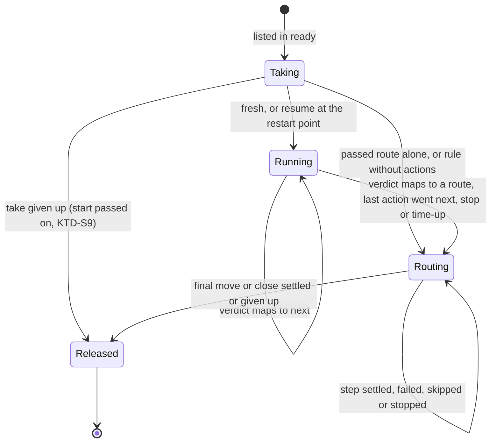
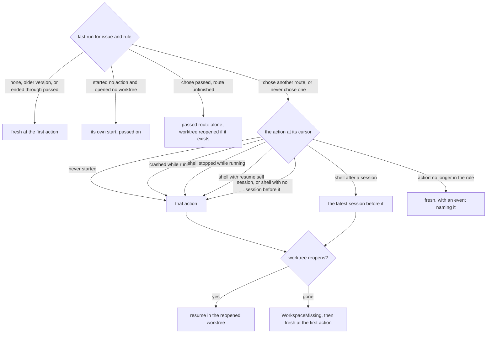

# Rules as a sequence of actions with routes by verdict, the format switch - Plan

## Goal Capsule

- **Objective:** the boss writes a rule as a list of sessions and shell scripts that run one after another, and each issue goes where the last verdict says: on to the next action, or through a named route that comments, reports, runs a script and then moves or closes the issue. This repository's own crew runs on that format, and the docs describe it.
- **Means:** the full plan's Implementation Units U6 to U17, in U-ID order, with the decisions below (KTD-S1 to KTD-S17) where the full plan left something open or the code after #257 differs from what it assumed.
- **Product authority:** the full plan, `docs/plans/2026-10-07-0724-feat-rule-sequences-and-routes-plan.md`, and issue #254. The full plan's Product Contract wins on behaviour and its KTD1 to KTD23 win on mechanism. This plan only narrows them to part 2 and settles what they left open. Where a KTD-S reads a requirement in a way the boss has not confirmed, Assumptions says so.
- **Stop conditions:** stop and report when a settled Key Decision or KTD of the full plan proves unworkable, when the whole suite cannot be made green at U17 without changing a requirement, or when the acceptance scenarios would need edits only the tester may make (beyond the smoke test and the doubles).
- **Execution profile:** one branch and one pull request whose body contains `Closes #254`. Units land in U-ID order (U6 to U17). The config grammar switches in U7, and the old `crew.Rule` fields stay only so the other packages compile until U16. Between U7 and U14, packages outside `internal/config` load the converted configs but do not run them end to end. Each unit from U6 to U16 proves itself with its own packages' tests, and every gate passes at U17.

---

## Product Contract

Product Contract preservation: narrowed, no scope change. This part builds the full plan's U6 to U17. Its R-IDs, AE-IDs and Key Decisions are the full plan's, cited as written there. The function kind (R3, R5, R14, R26 to R31, AE9) arrives with #256. Waiting and answers (R19 to R21, R23's answers, R37 to R48, AE4, AE5, AE13 to AE18, AE20, AE21) arrive with #255.

### Summary

A rule becomes its `ready` and `running` labels, a list of actions and its named routes. An action is a session or a shell script. Its verdict either moves the sequence on or ends the rule through a route, whose steps comment, report, run a script, then move or close the issue. A returned issue resumes at the action that ended its last run, in the same worktree. The old format is refused, this repository's config is rewritten, and the README and `CONCEPTS.md` describe the new rule.

### Problem Frame

See the full plan's Problem Frame. In short, a rule today runs its sessions in parallel and lands on `success` or `failure`. A check can only pass or fail, so this repository's `session-finished` judge cannot send an issue that needs a person anywhere but where a finished one goes.

### Requirements

Requirements this part builds whole: R1, R2, R4, R6, R7, R8, R9, R10, R11, R12, R13, R15, R16, R17, R18, R22, R24, R25, R32 (except the function check), R33, R34, R35 (handed to the tester), R36, R49, R50, R51, R52, R53, R54.

Requirements this part builds in part:

- R3, R5 (partial). An action is a session or a shell script. Functions are #256's.
- R14 (partial). A step is `move`, `comment`, `report`, `close` or a shell action. Function steps are #256's.
- R23 (partial). A resumed session gets today's resume paragraph, naming the route its last run ended through. The waiting paragraph and its answers are #255's.
- R32 (partial). Every check except "a defined action and a function share a name", which needs the function registry (#256).

Requirement added by this part:

- N1. A config that relied on today's behaviour keeps it once converted: a converted rule's `failed` route reports, then moves (KTD-S3).

### Key Decisions

The full plan's Key Decisions apply as written; the ones that govern this part are those with `Governs` links to the requirements above. None is changed here.

### Acceptance Examples

This part covers the full plan's AE1, AE2, AE3, AE6, AE7, AE8, AE10, AE11, AE12, AE19, AE22 and AE23. They are cited by ID in the units' test scenarios.

### Scope Boundaries

- The full plan's Scope Boundaries hold.
- Functions as actions or route steps, the function port and registry (full plan U3, U20; #256).
- `wait:`, `answering_apps:`, the waiting paragraph, crew's hidden marker on comments and the answers on resume (full plan U18, U19; #255). A session may still report `waiting` through its verdict file; here it is an ordinary verdict.
- Rewriting the acceptance scenarios under `acceptance/scenarios/` and their snapshots: the tester's (R35).
- Considered and not built: checking an issue's labels between actions. A person who moves or closes an issue mid-sequence still sees later actions run; the final move then reports the item moved. Evidence of wasted sessions on moved issues would change the call.
- Considered and not built: refusing at startup a config with shell actions when no shell adapter is built. `cmd/crew` always builds one; only tests could leave it out.
- Considered and not built: refusing at load a `report` step or `.Action`, `.Verdict` and `.Log` in a rule without actions. They render with nothing to name, which a reader sees at once.

#### Deferred to Follow-Up Work

- The tester rewrites every old-format scenario under `acceptance/scenarios/` and their snapshots, including the one that pins two parallel actions (R35). Until then the `acceptance` CI job is red on `main`; it is not a required check.
- #255 and #256 extend journal version 3 additively (KTD-S15).

---

## Planning Contract

### Key Technical Decisions

The full plan's KTD1 to KTD23 apply, except KTD3 and KTD7's function parts, KTD11's marker, KTD20's waiting paragraph and KTD21, which belong to #255 and #256. Its names predate #257: the run's ending family is now `EndingPhase`, `RunEnding`, `RunEnded`, `EndingMoved`, `EndingDropped` and `EndingMoveSettled`, the core's `runEnded` and `purposeEnding`, and the old `verdict_test.go` is `ending_test.go`. The shell port, `Commenter`, `Closer`, `CommentLister` and `port.Run`'s `VerdictFile` and `VerdictDir` exist and are not re-planned.

**The domain**

- KTD-S1. **This part's sealed families have no function variant.** `ActionKind` has a session and a shell variant; a step is move, close, comment, report or shell. #256 adds the function variants, and `gochecksumtype` then points at every switch to extend. The kind lives in `internal/crew/actionkind.go`, not `kind.go`, because `crew.Kind` is already the issue-or-pull-request enum. The comment step and its template take names other than `Comment`, which `internal/crew/comment.go` already holds. The template is its own type next to `Prompt`, sharing `promptIssue` and `sampleIssue`. Governs R3, R14; refines KTD2.
- KTD-S2. **One grammar for verdict and route names.** A name starts with a lowercase letter, followed by lowercase letters, digits, `-` or `_`, at most 64 characters. One validator in `internal/crew/verdict.go` serves the config (`on:` keys, `verdicts:` values, route names) and the engine's verdict file read. `next` is never a route name (R32).
- KTD-S4. **The verdict file decides only when it is empty or holds a valid name.** An empty or missing file means no report, so a session that succeeded is `passed`. A file whose first token is a valid verdict name reports it. A file with text but no valid first token is `failed`, with crew's reason. This follows KTD4's "harm wins". The facts carry what the domain needs: the session's end carries the report (none, a verdict, or unreadable), and a shell action's end carries its exit status and last line. The domain alone turns them into a verdict, which resolves the full plan's deferred question.
- KTD-S5. **`ActionEnded` records the verdict and the target.** History can then tell an action that went `next` from one that chose a route. It can also read the route when appending `RouteChosen` failed. Governs R22.
- KTD-S6. **The pull request lookup is once per run, when the route is chosen.** All actions share one branch (R24). When the run chooses a route and any session in the rule finds pull requests, the run asks the lookup and starts the first step only after it answers. The per-action lookup state goes.

**Resume**

- KTD-S7. **A cursor action that never started, or a shell action crew stopped while it ran, resumes at itself.** A stop or time-up between actions puts the cursor on the next action, not started (KTD5), with a new failure cause for each (stopped before it started, time up). R22's step back to the latest session applies to a shell action that ran and returned a verdict of its own. It does not apply to one that never ran or that crew stopped before it could judge. Otherwise a finished session whose judge missed its turn at a stop would run again in full. KTD22 keeps the session's last message for the judge. Conflict call-out: this reads R22's "the action that ended it" as an action that ran; see Assumptions.
- KTD-S8. **A route is finished when its final move or close landed, or was dropped because the item moved meanwhile.** A move or close given up after its final try, or never settled because crew crashed, leaves the route unfinished, so the next run runs that route alone (AE19) or resumes at its action (R22). Without this, the refine prompt's split, which strips crew's labels on purpose, would later send a returned issue to `done` without a session. Today `settleDelivery` alone tells the cases apart and `EndingGivenUp` folds them into one reason, so this part carries the distinction into the run's step outcome and the journal (U9, U10). Conflict call-out: this narrows AE19's "whose move was given up" to the outbox's give-ups; see Assumptions.
- KTD-S9. **A run that started no action and opened no worktree of its own passes its start on.** A run stopped at its take, a run whose take was given up, a take that landed after time-up, and a crash after `RunTaken` all qualify. The next run inherits that run's start: worktree, log, restart point and the route it names. A run that created a new worktree after `WorkspaceMissing` owns it and does not qualify. This keeps the carried resume point today's `History.ended` gives (`docs/solutions/logic-errors/stale-workspace-claim-drops-another-actions-resume-point.md`). Refines KTD18, KTD19.
- KTD-S10. **The `passed` route alone reopens the continued run's worktree when it still exists.** Its shell steps then see the branch the run worked on, and the lookup finds its pull requests. When the worktree is gone, the steps run in an empty temporary directory (KTD9). A run that starts with the `passed` route alone takes `passed` at the take even while stopping, as a rule without actions does (KTD12).
- KTD-S11. **Only a resumed run inherits the latest session.** A fresh run's shell actions before its first session act as the tracker's identity and see empty prompt and last-message files. A resumed run's shell actions inherit the bot and files of the latest session the continued run knew, the one it started or the one it inherited itself, so the latest session survives runs that started none. `RunTaken` carries that session's name and bot. This refines KTD13 and KTD22.

**Running a rule**

- KTD-S12. **A shell action's `CREW_ACTION` names the latest session, not the shell action.** It is empty before any session, under KTD-S11. This repository's Jev judge sends `CREW_ACTION` to Jev, and its thresholds were measured with the session's name (`internal/config/judge_test.go`). The README already promises the variable names the action whose session the check follows. This departs from the full plan's U12 step 1.
- KTD-S13. **The engine keeps the latest session's prompt and last message beside the run's log and passes their text through the shell port.** `port.Script` keeps its `Prompt` and `LastMessage` text fields, and the shell adapter keeps writing its private temporary files. No port changes for KTD22. The run's log is named after the run's worktree, and a run without one is logged under the name its worktree would have.
- KTD-S14. **A stop cancels a route shell step that is running and records it as stopped.** Steps that never started are recorded as skipped (R53). A route's `close` waits until no pull-request mirror report of the issue is in flight, then drops the pending ones, so no report can put a crew label back on a pull request `Close` stripped (R51).
- KTD-S15. **Journal version 3 is written here and extended additively later.** #255 and #256 add event types and optional fields under version 3, never a fourth version. The reader keeps skipping version 1 and 2 lines (KTD18).

**Configuration**

- KTD-S3. **The config grammar switches outright in U7, with every config that loads it.** U7 converts every YAML config in the Go tests and this repository's `.crew/config.yaml` mechanically. Each check becomes a shell action after its session. Each old success label becomes the `passed` route. Each old failure label becomes `failed: [report, move: <label>]`, so the failure report still posts (N1). A dual parser would be code the same pull request deletes. U15 then adds what is new: the judge's `needs_person` exit code, its route and the docs.
- KTD-S16. **A session item is a map with `prompt`, and the grammar reserves its own words.**
  - `agent` may be left out when exactly one agent is declared, as today, and the session takes that agent's name (KTD16).
  - A top-level action may not be named `agent`, `prompt`, `name`, `on`, `wait`, `resume`, `script`, `verdicts`, `report`, `close`, `move`, `comment` or `next`. Item and step forms stay unambiguous that way.
  - References resolve YAML aliases as `check()` does today.
  - The error for two actions with one name suggests `name:`.

**Views**

- KTD-S17. **The view speaks of taking, running and routing.** `PhaseWaiting` becomes `PhaseTaking`. `ClaimJudging` and its "judging" text go: a shell action shows as the running action, like a session, and a run in its routing phase shows the route it ends through. The status comment is rewritten on every step outcome, so a failed or skipped step reaches it (R16, R49). The handled entry's keep-earlier exception keeps today's condition: a rule without actions whose run and the earlier entry both ended through `passed`.

### High-Level Technical Design

A rule run's phases, as the full plan draws them, with this part's resume starts (KTD19, KTD-S7 to KTD-S10):

How the take picks a start from the last run (KTD19 with KTD-S7 to KTD-S10):

### Assumptions

- KTD-S7 reads R22's "the action that ended it" as an action that ran and returned its own verdict. The boss has not confirmed that a judge which never started, or which a stop cut short, resumes at itself rather than at the session before it. The PR body states the reading.
- KTD-S8 reads AE19's "whose move was given up" as the outbox giving up after its final try, not as the item having moved meanwhile. The PR body states the reading.
- KTD-S12 keeps `CREW_ACTION` on the session's name, where the full plan's U12 gave a shell action its own name. The judge's measured thresholds are the evidence. The PR body states the departure.
- A take that lands after time-up starts no action and ends through `failed` with a time-up cause (R52 as written). Having started no action and opened no worktree, it passes its start on to the next run (KTD-S9).
- A route's shell steps that a stop skipped in a `passed` route are not run again: the route finished once its final move landed (R53).
- After merge, `main`'s `acceptance` job is red until the tester rewrites the scenarios (R35). The job is not a required check; the smoke test must pass.

### Deferred to Implementation

- The exact Go names of the new events, facts, phases and step outcomes, within the families above.
- The wording of the report, the stop comment after a close, the new `--plain` lines and the two new failure causes, within KTD23 and KTD-S17.
- How the core's scheduler lists the labels a `waiting` route moves to without taking from them (KTD17): an extra listing per poll or the existing board listing, whichever keeps one `gh` call per label per poll.
- The engine's key for a route shell step, which is not an action.
- Whether `fact.go` and `event.go` split by phase into new files, as Codacy's 500-line limit and the per-fact `decide` methods suggest.

### Sequencing

Units land as expand, switch, contract, as the full plan's Sequencing describes for part 3 of its cut. U6 adds the new definitions beside the old fields. U7 switches the config grammar and converts every config (KTD-S3), so from U7 the old `crew.Rule` fields stay only for compilation and nothing outside `internal/config` runs a rule end to end. From U8 to U14 the aggregate, history, core, engine, wiring and views move to sequences and routes. U15 finishes this repository's config and the docs. U16 deletes the old shape, and U17 brings the tests outside the scenarios and the doubles in line. `go test -race ./...` and every gate pass at the end of U17.

---

## Implementation Units

| U-ID | Title | Files touched | Depends on |
|---|---|---|---|
| U6 | Domain definitions: verdicts, kinds, routes | `internal/crew/{verdict,actionkind,route,template,rule,state}.go` | none |
| U7 | Config: the new grammar, its load checks and every config converted | `internal/config/{actions,sequence,routes,graph,rules,agents,config}.go`, `schema/config.schema.json`, `.crew/config.example.yaml`, `.crew/config.yaml` | U6 |
| U8 | Aggregate: the sequence and one worktree per run | `internal/crew/{run,action,event,fact,decide,apply}.go` | U6 |
| U9 | Aggregate: routes, steps, stop and time-up | `internal/crew/{run,event,fact,decide,apply,status}.go` | U8 |
| U10 | History, journal version 3 and resume | `internal/crew/history.go`, `internal/adapter/jsonl/` | U9 |
| U11 | Core: commands, outbox steps, paragraphs, wind-down | `internal/core/{runs,outbox,scheduler,update,claims,bots,paragraph,command,input,event}.go` | U10 |
| U12 | Engine: shell actions, verdict file, steps, files beside the log | `internal/engine/{exec,paths,engine}.go`, `internal/adapter/git/workspace.go` | U11 |
| U13 | App wiring: capabilities and the board | `internal/app/app.go`, `internal/config/board.go` | U7, U12 |
| U14 | Status, reports, handled entries and views | `internal/crew/{report,status,pullrequest}.go`, `internal/core/{handled,gone,view}.go`, `internal/adapter/github/`, `internal/ui/` | U11 |
| U15 | This repository's judge, routes and the docs | `.crew/config.yaml`, `internal/config/judge_test.go`, `README.md`, `CONCEPTS.md`, `AGENTS.md` | U7, U13, U14 |
| U16 | Remove the old rule shape | `internal/crew`, `internal/config/{checks,legacy,files,config}.go`, `internal/core`, `internal/engine` | U15 |
| U17 | Acceptance doubles and non-scenario tests | `acceptance/smoke/smoke_test.go`, `acceptance/README.md` | U16 |

### U6. Domain definitions: verdicts, kinds, routes

- **Goal:** the domain can express a rule as entry labels, a sequence of session and shell actions, and named routes of steps.
- **Requirements:** R1, R7, R10, R13, R18, R36; full plan KTD2, KTD11 (template only); KTD-S1, KTD-S2.
- **Dependencies:** none.
- **Files:** `internal/crew/verdict.go`, `internal/crew/actionkind.go`, `internal/crew/route.go`, `internal/crew/template.go`, `internal/crew/rule.go`, `internal/crew/state.go`, `internal/crew/{verdict,actionkind,route,template,state}_test.go`.
- **Approach:**
  1. Add `Verdict` with `passed`, `failed` and `waiting`, its name validator (KTD-S2), the sealed target (`next` or a route), and the target an action's `On` gives a verdict (R10's defaults).
  2. Add the sealed `ActionKind` with a session spec (agent, prompt, bot) and a shell spec (script, exit-code verdicts, resume-self). The action definition gains its kind and `On`.
  3. Add `Route` and the sealed step, and the comment template parsed over `.Issue`, `.Rule`, `.Action`, `.Verdict`, `.Route` and `.Log` only.
  4. `Rule` gains `Routes`. `RuleStates` lists ready and running, then every route's move labels, each once. Today's fields stay until U16.
- **Patterns to follow:** `ParsePrompt`, `promptIssue` and `sampleIssue` in `internal/crew/prompt.go`; the `//sumtype:decl` families with value receivers in `internal/crew/run.go` and `action.go`.
- **Test scenarios:**
  - `blocked`, `needs_person` and `no-pr` are valid names; `Blocked`, `1x`, an empty name and a 65-character name are not.
  - With no `On` entry, `passed` targets next and `blocked` targets the `failed` route; with `on: {blocked: blocked}` it targets the `blocked` route.
  - A comment template naming `.Issue.Ref`, `.Action`, `.Verdict`, `.Route` and `.Log` renders with those values.
  - Covers AE12. A comment template naming `.Reason` fails to parse, with an error that names the field.
  - `RuleStates` of a rule whose routes move to two new labels returns ready, running and the two, each once; a route that only closes adds none.
- **Verification:** `go test -race ./internal/crew` passes; no other package changes behaviour.

### U7. Config: the new grammar, its load checks and every config converted

- **Goal:** crew loads the new format into rules with sequences and routes, refuses every case R32 names, and every config in the repository is in the new format.
- **Requirements:** R1, R5, R6, R10, R12, R13, R15, R18, R32, R36, N1; full plan KTD14 to KTD16; KTD-S2, KTD-S3, KTD-S16.
- **Dependencies:** U6.
- **Files:**
  - Grammar: `internal/config/actions.go`, `internal/config/sequence.go`, `internal/config/routes.go`, `internal/config/graph.go`, `internal/config/rules.go`, `internal/config/agents.go`, `internal/config/config.go`, `internal/config/files.go` (the top-level shape message).
  - Tests: `internal/config/{actions,sequence,routes,graph}_test.go`, `internal/config/export_test.go`, `internal/config/schema_test.go`, `internal/config/config_example_test.go`, and every `internal/config/config_*_test.go` that embeds a rule.
  - Test data: `internal/config/testdata/draft/.crew/config.yaml`.
  - Schema and example: `schema/config.schema.json`, `.crew/config.example.yaml`.
  - This repository's config: `.crew/config.yaml`, `internal/config/config_own_test.go`, `internal/config/judge_test.go`.
  - Configs in other packages' tests: `internal/adapter/claude/harness_test.go`, `internal/adapter/codex/harness_test.go`, `internal/adapter/github/tracker_test.go`, `internal/registry/{registry,default}_test.go`, `internal/app/{app,app_bots,app_agents}_test.go`.
- **Approach:**
  1. Parse the top-level `actions:` into shell definitions: a string, or a map with `script`, optional `verdicts` (exit code to verdict) and optional `resume: self`. Refuse reserved names (KTD-S16). A map with `name` is refused as an unknown shape until #256.
  2. Parse a rule's `actions:` list. Resolve each reference and its aliases, build sessions with their prompts and bots, and name them per KTD16 and KTD-S16.
  3. Parse routes and steps, each comment template at load. A rule's notify default follows whether its list has actions.
  4. Run every R32 check this part owns in `graph.go`, beside today's `checkGraph`. `spellOnce` covers route move labels first.
  5. `agentsInUse` and `namedBots` count sessions only. `retiredVariables` keeps guarding prompts and now shell scripts too. `sequenceItems` moves out of `legacy.go`.
  6. Teach the three key walkers lists whose items take several shapes, with one key-path convention for list items, then update the schema and the example.
  7. Convert every config listed above per KTD-S3. `config_own_test.go` and `judge_test.go` find the sessions `lfg` and `refine` and the top-level shell definitions.
- **Execution note:** write the load-error tests for R32 first; they pin the key paths and lines before the parser exists.
- **Patterns to follow:** `parseRule`, `ruleLabels`, `check` and `checkGraph` in `internal/config/rules.go`; `keyError`, `decodeItem`, `decodeFields` and `named` in `internal/config/decode.go`; the `rejectCase` tables in `internal/config/config_test.go`.
- **Test scenarios:**
  - A rule with a string reference and a session item loads into a shell action and a session, in that order.
  - A session item without `name` is named after its agent; with `name: lfg` it is `lfg`. With one agent declared, a session item without `agent` runs on it.
  - A shell definition's `verdicts: {3: needs_person}` loads as that table, and `resume: self` as its resume choice.
  - A reference written `- session-finished:` with `on:` beside it loads with that `on:`.
  - A route written as one label loads as a single move.
  - Covers AE8. A route ending with `comment` is refused, naming the route's key path and line.
  - Covers AE8. An `on:` naming an undeclared route is refused.
  - Covers AE8. A declared route nothing leads to is refused; `passed` and `failed` never are.
  - A `move` before the last step is refused.
  - A move to the rule's own `ready`, or to any rule's `running`, is refused.
  - Two actions named `lfg` in one rule are refused, with a hint to set `name:`.
  - A route named `next` is refused, and so is a top-level action named `report`.
  - A rule with actions and no `failed` route is refused; a rule without actions and only `passed` loads.
  - An `on:` key or a `verdicts:` value that is not a valid verdict name is refused.
  - Covers AE12. A comment template naming `.Reason` is refused at load with its key path and line.
  - A rule whose only actions are shell actions loads with no agent declared.
  - The schema, the decoder's key tree and the example match both ways, and the example sets every key.
  - This repository's converted config loads; its `development` rule runs `lfg`, then `session-finished` and `pr-closes-issue`, and its `failed` route reports, then moves.
- **Verification:** `go test -race ./internal/config` passes. The other packages whose test configs changed still compile and load them; their behaviour tests are ported in U8 to U14. R33's refusals are asserted in U16, once `legacy.go` is gone.

### U8. Aggregate: the sequence and one worktree per run

- **Goal:** a rule run starts its actions one at a time in one worktree and decides after each whether to go on or which route to take.
- **Requirements:** R2, R7 to R11, R24, R25; full plan KTD3 to KTD6, KTD13; KTD-S4 to KTD-S6.
- **Dependencies:** U6.
- **Files:** `internal/crew/{run,action,event,fact,decide,apply}.go` (`fact.go` split by phase into new files if it nears the size limit), `internal/crew/sequence_test.go`, `internal/crew/verdict_test.go`, `internal/crew/fixtures_test.go`, `internal/crew/run_test.go`.
- **Approach:**
  1. Move the workspace, the log and the resume point from `ActionRun` to `RuleRun`, with run-level workspace facts and events, a cursor and the run's current bot.
  2. Start the action at the cursor. Ask the workspace once, before the first action. Then start the session or the shell action.
  3. An action run's states gain "not run" and "done in an earlier run". `validate` and `ActionsEnded` stop assuming every action ends.
  4. The session's end carries its report and the shell's end its exit status and last line (KTD-S4). Compute the verdict with one pure function (KTD4) and its target. Emit `ActionEnded` with both (KTD-S5). On next, start the next action. Otherwise emit `RouteChosen` with the cursor; U9 runs the route.
  5. Replace the per-action pull request lookup with KTD-S6's lookup once per run.
  6. Drop checks from the new path. Add a sequence definition to the fixtures and keep `definition()` until U16.
- **Execution note:** implement the verdict function and the sequence test-first, as decision tables.
- **Patterns to follow:** `decision{name, given, finds, def, fact, want}` and the `refusal` table in `internal/crew/decide_test.go` and `ending_test.go`; `taken`, `preparing`, `seq` and `given` in `fixtures_test.go`; `decider.emit` and `decider.end`; the plain-data walker in `run_test.go`.
- **Test scenarios:**
  - Covers F1. Three actions that pass start in order, each only after the one before ended, and the run then chooses `passed`.
  - Only one action of a run is ever running.
  - Covers AE1. A shell action exiting 2 with no `on:` chooses `failed`, and the next action never starts.
  - Covers AE2. A shell action exiting 3 with `verdicts: {3: needs_person}` and `on: {needs_person: needs-person}` chooses `needs-person`.
  - Covers AE3. A session that succeeded and reported `blocked` chooses the route `blocked` maps to. One that reported `too-big`, which no `on:` names, chooses `failed` with crew's reason.
  - A session whose harness failed while its file says `blocked` chooses `failed`.
  - A session that succeeded with no report is `passed`; one whose file held text with no valid name is `failed`.
  - A stop during a session gives `failed`, whatever its file says.
  - The workspace is asked once, before the first action, and every action runs in it.
  - A shell action after a session acts as that session's bot. One before any session in a fresh run acts as the tracker's identity.
  - A rule without actions chooses `passed` at the take, also while stopping.
  - With pull request lookup on, a chosen route waits for the lookup before its first step.
  - Every new fact has a refusal row for each phase that does not wait for it.
- **Verification:** `go test -race ./internal/crew` passes.

### U9. Aggregate: routes, steps, stop and time-up

- **Goal:** a run runs its chosen route one step at a time and settles on the final move or close, while stop and time-up act between actions.
- **Requirements:** R12 to R17, R52, R53, F2; full plan KTD3, KTD5, KTD9, KTD12; KTD-S7, KTD-S14.
- **Dependencies:** U8.
- **Files:** `internal/crew/{run,event,fact,decide,apply,status}.go`, `internal/crew/routing_test.go`, `internal/crew/stop_test.go`.
- **Approach:**
  1. Replace `EndingPhase` with a routing phase that holds the route and the step in flight.
  2. Add step events and one step-settled fact with its outcomes: landed, failed, given up, dropped because the item moved meanwhile, skipped, stopped. They replace `EndingMoveSettled` and `FailureReportSettled`. The core maps the outbox's moved-meanwhile result to the dropped outcome, and a refused call or a failed final try to given up (KTD-S8).
  3. Ask a step only after the one before it settled. The final move or close settling, landed or given up, releases the run.
  4. `StopReached` and the new `TimeUp` act per KTD12. A stop or time-up between actions puts the cursor on the next action, with its new cause (KTD-S7). A stop cancels a running shell step (KTD-S14).
- **Patterns to follow:** `EndingMoveSettled.decide`, `FailureReportSettled.decide` and `releaseOnceSettled` in `internal/crew/fact.go`; the `acting` and `whileEnding` apply helpers.
- **Test scenarios:**
  - A route of `report` then `move` asks the report, waits for it to settle, then asks the move.
  - Covers AE7. A route of a failing shell step then `move` records the step's failure and still asks the move.
  - A `comment` given up is recorded, and the route goes on to its move.
  - A route ending in `close` releases the run once the close settles.
  - A final move given up releases the run with the move given up; one dropped because the item moved meanwhile releases it with that outcome.
  - A stop during action 2 of 3 ends it stopped, starts nothing more, and chooses `failed` naming action 2.
  - A stop between actions 1 and 2 chooses `failed` with action 2 at the cursor, not started, with the stopped-before-start cause.
  - During a stop, a route's shell step that has not started is skipped, a running one is stopped, and the move is still asked.
  - Covers AE22. Time-up during action 1 of 3 lets it finish, does not start action 2, chooses `failed`, and its route's shell step runs.
  - A take that lands after time-up starts no action and chooses `failed` with the time-up cause.
- **Verification:** `go test -race ./internal/crew` passes.

### U10. History, journal version 3 and resume

- **Goal:** the journal records the new events, and a new run starts where its last run says it should.
- **Requirements:** R22, R23 (partial), R25, R54; full plan KTD18, KTD19; KTD-S5, KTD-S7 to KTD-S11, KTD-S15.
- **Dependencies:** U9.
- **Files:** `internal/crew/history.go`, `internal/crew/history_test.go`, `internal/crew/event.go`, `internal/adapter/jsonl/{line,encode,decode,journal}.go`, `internal/adapter/jsonl/v1.go` (removed), `internal/adapter/jsonl/*_test.go` (`wire_test.go` rewritten for version 3).
- **Approach:**
  1. The jsonl adapter writes version 3 lines for every event, the new failure causes and the step outcomes included (a final move dropped because the item moved meanwhile reads apart from one given up), and skips version 1 and 2 lines.
  2. `History` keeps the last run per issue and rule, rebuilt with `Apply`. Per-action resume points go. `Retire` works by the run's worktree name.
  3. One function over the last run returns the start, following the flowchart in High-Level Technical Design. `RunTaken` carries it and replaces `ActionTaken`'s per-action resume.
  4. `ActionSessionStarted` records the session's bot (KTD13).
- **Execution note:** write the start function test-first, one row per branch of the flowchart.
- **Patterns to follow:** `History.Fold`, `LastRun`, `Retire`, and the carried-reason tests in `internal/crew/history_test.go`; the round-trip tests in `internal/adapter/jsonl`.
- **Test scenarios:**
  - Covers AE6. A run that ended through `no-pr` at `pr-closes-issue`, after `install` and the `lfg` session, starts the next at `lfg` in the reopened worktree, skipping `install`.
  - Covers AE11. A run that ended through `needs-person` at `session-finished` starts the next at `lfg`.
  - Covers AE23. A run that ended at a shell action defined with `resume: self` starts the next at that action.
  - A run that ended at a shell action with no session before it starts the next at that action.
  - A run that crashed during a shell action after a session starts the next at that shell action.
  - A run stopped between `lfg` and `session-finished` starts the next at `session-finished` (KTD-S7).
  - Covers AE19. A run that chose `passed` and whose move was given up after its final try starts the next with the `passed` route alone, in the reopened worktree.
  - A run that chose `passed` and whose move was dropped because the item moved meanwhile starts the next fresh (KTD-S8).
  - A run that chose `failed` and crashed before its move starts the next at the action that ended it.
  - A run that ended through `passed` starts the next fresh.
  - A run whose last event is an action's start resumes at that action. One whose action went next before a crash resumes at the action after it.
  - A run stopped at its take passes on the start it was given, worktree and restart point included (KTD-S9). So does a take that landed after time-up.
  - A run stopped while `session-finished` ran, after `lfg`, starts the next at `session-finished` (KTD-S7).
  - A run that resumed at `session-finished` and crashed during it starts the next at `session-finished`, whose shell action still acts as `lfg`'s bot (KTD-S11).
  - A run whose resume action is no longer in the rule starts fresh, with an event naming the action.
  - A version 2 line and a version 1 line are skipped, and the issue starts fresh.
  - Every version 3 event round-trips through the adapter.
  - A run that opens a worktree name retires another rule's past run that held that name.
- **Verification:** `go test -race ./internal/crew ./internal/adapter/jsonl` passes.

### U11. Core: commands, outbox steps, paragraphs, wind-down

- **Goal:** the core turns the run's new events into commands and deliveries, builds the prompt paragraphs, and winds down without cutting routes short.
- **Requirements:** R9, R16, R17, R22, R23 (partial), R52, R53; full plan KTD9, KTD12, KTD13, KTD17, KTD18, KTD20 (verdict and resume paragraphs); KTD-S11, KTD-S14.
- **Dependencies:** U10.
- **Files:** `internal/core/{runs,outbox,scheduler,update,claims,bots,command,input,event}.go`, `internal/core/paragraph.go`, `internal/core/pullrequest.go`, `internal/core/{paragraph,steps,sequence,timeup,stop,resume}_test.go` (new tests in files other than the existing `route_test.go`), `internal/core/driver_test.go`.
- **Approach:**
  1. `on` and `onAction` take the new events, with the route's events in their own function: create or reopen the run's worktree, start a session with its paragraphs, run a shell action, run a step.
  2. Tracker steps become deliveries of one step purpose, through `Comment`, `Close`, `Move` and `ReportFailure` commands. A run's lane holds at most one step, and its settled fact goes back to the run. A `close` step is delivered only once the issue's pull-request lane has no report in flight, and it then drops that lane's queued and owed reports (KTD-S14).
  3. `take` builds `RunTaken` with the start from `History`. `timeUp` hands every held run `TimeUp`. `windDown` follows KTD12, with a run query and the outbox's owed state.
  4. Move `resumeParagraph` to `paragraph.go`, naming the route. Add the verdict paragraph, which lists the verdicts a session's `on:` names.
  5. `bots.go` reads each run's current bot, not the rule's (KTD13, KTD-S11).
  6. The scheduler lists the labels a `waiting` route moves to for the default board and never takes from them (KTD17).
  7. `RunNotRecorded` covers every event KTD18 names, worded per event.
- **Patterns to follow:** `startSession`, `runCheck` and `runEnded` in `internal/core/runs.go`; `deliver`, `settleDelivery` and `runLane` in `internal/core/outbox.go`; `named` and `settle` in `driver_test.go`.
- **Test scenarios:**
  - A session whose `on:` names `blocked` starts with the verdict paragraph listing `blocked`; one with no `on:` gets none.
  - A route's `comment` that fails transiently is owed and retried at the next tick, and the move waits for it.
  - Only one step of a run is ever in flight in its lane.
  - After a `close`, an owed pull-request report of the take is dropped.
  - A rule without actions whose `passed` route is `close` sends the close only after the take's pull-request report settled.
  - After time-up, crew stops only once every held run is released or has no shell step left.
  - After time-up, a route of a `comment` failing transiently, a shell step and a `move` does not hold crew: the owed comment gets its final try, and crew stops.
  - A resumed session's prompt holds the resume paragraph naming the route its last run ended through.
  - A shell action after a session spends against that session's bot; one before any session in a fresh run spends against none.
  - A failed append of `RouteChosen` emits `RunNotRecorded`.
  - An issue in a `waiting` route's label is listed for the board and never taken.
- **Verification:** `go test -race ./internal/core` passes, with the existing tests ported to sequences.

### U12. Engine: shell actions, verdict file, steps, files beside the log

- **Goal:** the engine runs every new command through its port and owns the run's files.
- **Requirements:** R8, R9, R16, R24, R49; full plan KTD6, KTD8, KTD9, KTD22; KTD-S4, KTD-S12 to KTD-S14.
- **Dependencies:** U11.
- **Files:** `internal/engine/{exec,paths,engine}.go` (new code in new files, since `exec.go` is near the size limit), `internal/engine/{shell,verdict,step,paths}_test.go`, `internal/port/port.go`, `internal/adapter/git/workspace.go`, `internal/adapter/git/workspace_test.go`, `internal/fake/workspace.go`.
- **Approach:**
  1. A shell action runs through `port.Shell` with the 10-minute limit and reports its exit status and last line. `CREW_ACTION` names the latest session (KTD-S12).
  2. Before each session, make the private verdict directory and set `port.Run`'s fields. After it ends, read the file once, cap the length, apply KTD-S2 and KTD-S4 to it as written, and remove the directory. A control character makes the report unreadable; stripping applies only to text crew shows.
  3. Write the session's prompt and last message beside the run's log, and pass them to later shell actions as text (KTD-S13). A fresh run under a reused worktree name clears them.
  4. `Comment` and `Close` go through the tracker's capabilities as tracker jobs, classified like `Move` so the core can owe them.
  5. A route shell step without a worktree runs in a temporary directory the engine removes. A stop cancels a running step (KTD-S14).
  6. `Workspace.Create` takes the rule's name, and the git adapter names the worktree `issue-<key>-<rule>`, sanitized as today.
- **Execution note:** run the engine tests under `testing/synctest`, as the existing ones do.
- **Patterns to follow:** `check`, `lastLine` and `startSession` in `internal/engine/exec.go`; the private temporary directory in `internal/adapter/shell/shell.go`; `engine.ran`.
- **Test scenarios:**
  - A session that writes `blocked\n` to its verdict file ends with the report `blocked`.
  - A verdict file holding `\x00blocked` or an ANSI escape reports unreadable, so the session is `failed`, never a cleaned name or raw bytes. An empty file reports none.
  - Each session gets its own verdict directory, outside the worktree and `.crew/logs/`, gone once the verdict is read.
  - Covers AE11. A shell action after a session reads that session's last message, also after the engine restarts from the journal and the session ran in an earlier run.
  - A shell action in a fresh run before any session gets empty prompt and last-message text and an empty `CREW_ACTION`.
  - A route shell step in a run without a worktree runs in a temporary directory that is gone afterwards.
  - A comment's transient failure is reported as one the core can owe.
  - The git adapter names a rule run's worktree `issue-<key>-<rule>` and frees a reused name as today.
- **Verification:** `go test -race ./internal/engine ./internal/adapter/git ./internal/fake` passes with no leaked goroutines.

### U13. App wiring: capabilities and the board

- **Goal:** crew refuses at startup what its tracker cannot do, and the default board shows issues that wait in a `waiting` route's label.
- **Requirements:** R14; full plan KTD7 (tracker capabilities), KTD17.
- **Dependencies:** U7, U12.
- **Files:** `internal/app/app.go`, `internal/app/app_test.go`, `internal/config/board.go`, `internal/config/config_board_test.go`.
- **Approach:**
  1. Refuse a config whose routes use `comment` or `close` when the tracker lacks that capability, naming the rule and the route, with the config exit code.
  2. `crew.RuleStates` already reaches the tracker and the engine (`app.build`), so route labels get created and stripped with no new wiring; pin it with a test.
  3. The default board adds a column for each label a `waiting` route moves to, for rules with actions.
- **Patterns to follow:** the `BoardLister` check in `app.build`; `defaultBoard` in `internal/config/board.go`; `fake.NewRoutingTracker` against `fake.NewTracker` for the capability tests.
- **Test scenarios:**
  - A route using `close` with a tracker that is not a `Closer` fails startup naming the rule and the route, with exit code 2.
  - A route using `comment` with a `Commenter` starts.
  - `Prepare` receives a route's move label among crew's states.
  - The default board of a rule whose `waiting` route moves to `crew:development:waiting answer` has a column for that label.
- **Verification:** `go test -race ./internal/app ./internal/config` passes.

### U14. Status, reports, handled entries and views

- **Goal:** the status comment, the reports, the handled entries, `--plain` and the TUI show a sequence's progress and the route a run ended through.
- **Requirements:** R16, R17, R49, R50, R51; full plan KTD5, KTD23; KTD-S14, KTD-S17.
- **Dependencies:** U11.
- **Files:**
  - Domain: `internal/crew/{report,status,pullrequest}.go` and their tests.
  - Core: `internal/core/{handled,gone,view,board,status}.go` and their tests.
  - GitHub adapter: `internal/adapter/github/{status,report,pullrequest}.go` and their tests (new code in new files where `status.go` nears the limit).
  - Views: `internal/ui/lines/lines.go`, `internal/ui/lines/lines_test.go`, `internal/ui/tui/{card,actions,detail,band,outside}.go`, `internal/ui/tui/tui_test.go`, `internal/ui/tui/testdata/`.
- **Approach:**
  1. The run's status, report and pull request report follow KTD23 and KTD-S17. The status lists actions not run and done in an earlier run, and it is rewritten on each step outcome.
  2. The ended status carries the route and either the label moved to or the close. The pull request report after a close carries no label state.
  3. The GitHub adapter words the report, the stop comment (naming the route, or saying the issue was closed) and the new failure causes.
  4. Handled entries and attention follow R50. `gone` marks a closed entry at the next listing. The keep-earlier exception follows KTD-S17.
  5. `--plain` prints a line for a route chosen, a failed, skipped or stopped step and a close. TUI cards show the running action, how many are left, or the route a run ends through.
- **Patterns to follow:** `renderReport`, `renderStop` and `failedAction` in `internal/adapter/github`; `go test ./internal/ui/tui -update`; `docs/solutions/design-patterns/mid-run-adapter-state-reaches-the-view-by-polling.md`; `docs/solutions/logic-errors/handled-drops-issue-a-stage-holds-again.md`.
- **Test scenarios:**
  - The status of a run that ended early lists the actions after it as not run.
  - The status of a resumed run lists the actions before the restart point as done in an earlier run.
  - The status shows a shell action's last printed line with control characters stripped, and a failed route step in crew's words only.
  - The report of a run that ended through `blocked` names the action, its verdict, the route and the log, and quotes nothing else.
  - After a close, the pull requests keep no crew label and get a stop comment saying the issue was closed.
  - A handled entry that ended through `needs-person` draws attention. One that ended through `passed` does not. A dropped final move does.
  - A closed entry goes gone at the next listing.
  - A take in flight shows as taking; a shell action shows as the running action; a routing run shows its route.
  - The golden views change only where these scenarios say, and the diff is reviewed.
- **Verification:** `go test -race ./internal/crew ./internal/core ./internal/adapter/github ./internal/ui/...` passes with reviewed golden files.

### U15. This repository's judge, routes and the docs

- **Goal:** this repository's `session-finished` sends an issue that needs a person to its own label, and the README, the glossary and `AGENTS.md` describe the new rule.
- **Requirements:** R34; AE2; full plan KTD16; KTD-S12.
- **Dependencies:** U7, U13, U14.
- **Files:** `.crew/config.yaml`, `internal/config/config_own_test.go`, `internal/config/judge_test.go`, `README.md`, `CONCEPTS.md`, `AGENTS.md`.
- **Approach:**
  1. `session-finished` emits a third outcome for "needs a person" and exits 3. Its definition maps 3 to `needs_person`. "Not judged" stays exit 0 and a missing key exit 1.
  2. `development` and `fix` map `needs_person` to a `needs-person` route that comments and moves to `crew:<rule>:needs person`. The header comment and the commented-out example rules are rewritten in the new format.
  3. The README gains a section on rules (actions, verdicts, routes, resume) and rewrites its intro, Stopping crew and Checks sections. The Checks section becomes shell actions; it states that the prompt and last-message files persist beside the log and that `CREW_ACTION` names the latest session.
  4. `CONCEPTS.md` rewrites Rule, Rule without actions, Action, Action run, Check, Resume, Run journal, Failure report and Stop comment. It also updates Workspace, Board, Owed call, Bot and Handled entry, and flags verdict against ending.
  5. `AGENTS.md`'s config and test lines stop naming checks and `legacy.go`.
- **Patterns to follow:** the README's plain declarative sections; `CONCEPTS.md`'s entry format.
- **Test scenarios:**
  - `config_own_test.go` finds `lfg` followed by `session-finished` and `pr-closes-issue` in `development`, and the `needs-person` route.
  - `judge_test.go`: needs a person exits 3, done exits 0, unfinished or stopped exits 1, and every "not judged" case exits 0.
- **Verification:** crew loads this repository's config, and the README describes no key the decoder refuses.

### U16. Remove the old rule shape

- **Goal:** only the new shape remains in the code.
- **Requirements:** R1, R4, R33; AE10; full plan KTD15.
- **Dependencies:** U15.
- **Files:** `internal/crew/{rule,action,event,fact,status}.go`, `internal/config/{checks,legacy,files,config}.go`, `internal/config/legacy_test.go`, `internal/config/config_checks_test.go`, `internal/config/testdata/old/`, `internal/core`, `internal/engine`, `internal/adapter/jsonl`.
- **Approach:**
  1. Remove `Labels.Success` and `Labels.Failure`, `crew.Check`, `CheckName`, the check states, events, facts and causes, and the action fields the kinds replaced.
  2. Remove `checks.go`, `legacy.go`, its tests and test data, and the `refuseOldKeys` call in `config.go`.
  3. Remove the core's and engine's check paths (`RunCheck`, `StopCheck`, `CheckEnded`) and the test fixtures' old `definition()`.
- **Test scenarios:**
  - Covers AE10. `success:` under `labels` is refused as an unknown key with no hint.
  - A top-level `checks:` is refused as an unknown key, and an `actions:` map in a rule as a wrong shape, with no hint.
- **Verification:** the repository builds, `go test -race ./...` passes, and `rg 'Labels.Success|refuseOldKeys|PhaseChecking|InChecks|CheckName|CauseCheck|RunCheck|StopCheck|CheckEnded|ClaimJudging|PhaseWaiting'` finds nothing outside `docs/`.

### U17. Acceptance doubles and non-scenario tests

- **Goal:** the developer's acceptance tests use the new format, and the doubles serve every call crew now makes.
- **Requirements:** R35 (the developer's share); full plan KTD8, KTD10.
- **Dependencies:** U16.
- **Files:** `acceptance/smoke/smoke_test.go`, `acceptance/README.md` (the developer's section only).
- **Approach:**
  1. Move the smoke configs to the new format, with a shell action and a route that comments and moves.
  2. Confirm fake GitHub serves the close and comment calls as crew now makes them; part 1 taught it both.
  3. Leave every file under `acceptance/scenarios/` and the tester's sections of `acceptance/README.md` to the tester.
- **Patterns to follow:** AGENTS.md: the pull request that changes how crew calls `gh` or `claude` teaches the doubles.
- **Test scenarios:**
  - The smoke test runs crew end to end on a new-format config: one issue passes through its `passed` route, and one whose shell action fails gets the route's comment and the `failed` label.
- **Verification:** `go -C acceptance vet ./...` and golangci-lint in `acceptance/` pass, and the smoke test passes against a built binary.

---

## Verification Contract

| Gate | Command | Applies to |
|---|---|---|
| Format | `gofmt -l cmd internal tools acceptance` prints nothing | every unit |
| Vet | `go vet ./...` | every unit |
| Lint and layering | `go run github.com/golangci/golangci-lint/v2/cmd/golangci-lint@v2.14.0 run` | every unit; every new sealed family carries `//sumtype:decl` |
| Tests | `go test -race ./...` | U17; units U6 to U16 run their own packages' tests |
| Coverage floors | `go test -race -covermode=atomic -coverpkg=./... -coverprofile=coverage.out ./...`, then `go run github.com/vladopajic/go-test-coverage/v2@v2.19.0 --config=.testcoverage.yml` (total at least 90%) and `git diff -U0 origin/main...HEAD \| go run ./tools/diffcover -profile coverage.out` (changed lines at least 90%) | before the pull request |
| Vulnerabilities | `go run golang.org/x/vuln/cmd/govulncheck@v1.8.0 ./...` | before the pull request |
| TUI golden files | `go test ./internal/ui/tui -update`, then review the diff | U14 |
| Acceptance module | `go -C acceptance vet ./...` and golangci-lint in `acceptance/` | U17 |
| Acceptance smoke | `go -C acceptance run ./cmd/acceptance -count=1 -run TestSmoke` | U17; the old-format scenarios fail until the tester rewrites them (R35) |
| Codacy limits | functions of at most 50 NLOC and complexity 15, files of at most 500 lines | every new or split file, especially in `internal/crew`, `internal/core`, `internal/config` and `internal/engine` |

---

## Definition of Done

- Every unit's Verification holds, and every gate above passes, except the acceptance scenarios still in the old format, which go to the tester (R35).
- This repository's crew loads `.crew/config.yaml` in the new format and starts.
- README, `CONCEPTS.md`, `AGENTS.md`, `schema/config.schema.json` and `.crew/config.example.yaml` describe the new rule, and none of them names `checks:`, `check:`, `success:` or `failure:` as a rule key.
- No code outside `docs/` refers to the old rule shape (U16).
- No session text or script output reaches a route comment, a report or a stop comment. A shell action's last line reaches only the status comment, scrubbed and stripped as a check's is today (R49).
- Code from abandoned approaches is removed from the diff.
- The pull request body contains `Closes #254`. It says that runs which failed before the upgrade start over in a new worktree. It hands the old-format scenarios to the tester and states the readings in Assumptions.
