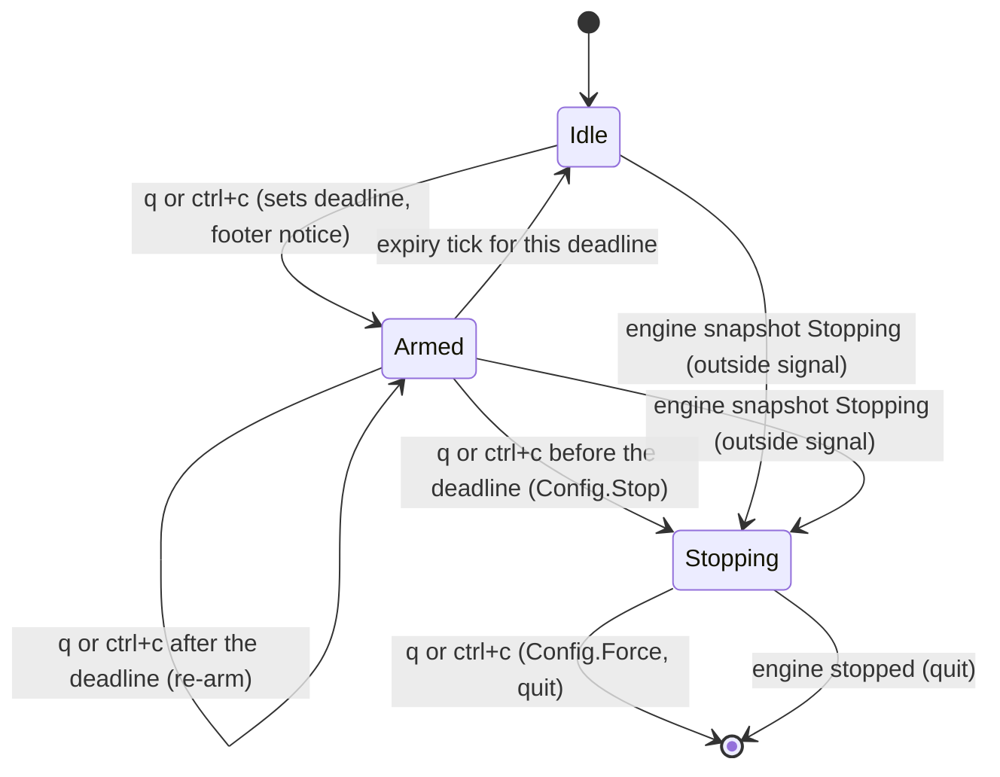

# Confirm a stop in the live view - Plan

## Goal Capsule

- **Objective:** a single stray `q` or Ctrl+C in crew's live view costs nothing: no session is stopped, no action fails, no issue has to be put back by hand. Stopping crew on purpose takes one more press.
- **Means:** the live view arms the stop on a first press and confirms it on a second within 3 seconds, kept as a deadline in the TUI model (KTD1). Once crew is stopping, one press forces the exit (KTD2).
- **Product authority:** issue #266 and the Product Contract below, copied from the issue body. The Product Contract wins on behaviour; the KTDs win on mechanism.
- **Stop conditions:** stop and report when a requirement cannot hold without changing `internal/app`'s signal handling or `--plain`'s behaviour (R8), or when the acceptance suite's tester refuses the changed snapshots.
- **Execution profile:** one branch, one pull request that closes #266. Units land in U-ID order. The developer never edits `acceptance/scenarios/`; U4 hands that to the tester.

---

## Product Contract

Product Contract preservation: Product Contract unchanged. Its deferred questions are answered in the Planning Contract (KTD2, KTD5).

### Summary

In the live view, `q` and Ctrl+C stop crew only when pressed twice within 3 seconds. The first press arms the stop and says so in the footer. Once crew is stopping, one press still forces the exit, as today. Signals from outside and the `--plain` output keep today's behaviour.

### Problem Frame

The person who runs crew in the live view stops it by accident, often. Ctrl+C is pressed out of the habit of copying text, and `q` gets hit by mistake. Either one starts a stop at once: crew takes nothing new and stops every running session. Each action whose session crew stopped fails, so its issue moves to the rule's failure label and has to be moved back by hand, and the work the session did is lost.

### Key Decisions

- **Press twice within a short window, not a dialog.** The first press only arms the stop; nothing else on screen changes. (session-settled: user-directed — chosen over a yes/no dialog, over Ctrl+C never stopping while `q` asks, and over a first press that only winds down and can be undone: the cheapest form that makes one stray press harmless; a double Ctrl+C reflex still stops crew, and that cost was accepted.) Governs R1–R4.
- **The live view only.** (session-settled: user-directed — chosen over also confirming Ctrl+C under `--plain` and outside signals: the accidental presses happen in the live view.) Governs R8.
- **Once crew is stopping, one press forces the exit.** (session-settled: user-directed — chosen over asking twice to force as well: whoever confirmed a stop and presses again wants out.) Governs R6.
- **One press forces whatever started the stop.** (session-settled: user-approved — chosen over keeping today's behaviour, where the first `q` after an outside signal does nothing and the second forces: one rule for every stop is easier to hold.) Governs R6.
- **A wind-down still asks twice.** Stopping during a wind-down kills sessions that would otherwise finish, which is exactly what a stray press must not do. (session-settled: user-approved — chosen over a single press stopping a wind-down, as today.) Governs R7.
- **The window is 3 seconds.** (session-settled: user-approved — proposed with the tradeoff shown: long enough to press again on purpose, short enough that a later stray press arms again rather than stopping.) Governs R1, R4.

### Requirements

**Arming and confirming**

- R1. In the live view, while crew runs or winds down, a first `q` or Ctrl+C does not stop crew: it arms the stop for 3 seconds, and the footer says that another `q` or Ctrl+C stops crew.
- R2. `q` and Ctrl+C count as the same key: either one arms, and either one confirms.
- R3. A second `q` or Ctrl+C while the stop is armed stops crew exactly as the first press does today: crew takes nothing new, asks each running session to stop with up to ten seconds, and shows STOPPING.
- R4. When 3 seconds pass with no second press, the footer goes back to its usual key help and crew carries on as if nothing was pressed; the next press arms again.
- R5. Other keys keep working while the stop is armed, and neither cancel nor extend the window.

**Forcing**

- R6. Once crew is stopping, one `q` or Ctrl+C forces the exit as today: crew kills every process it started, exits at once, and exits 1. This holds whether the stop came from a confirmed press or from SIGINT, SIGTERM or SIGHUP.
- R7. During a wind-down at `run_time_limit_seconds`, stopping the running sessions takes two presses, per R1–R3.

**Unchanged**

- R8. SIGINT, SIGTERM and SIGHUP from outside, and Ctrl+C under `--plain` (which reaches crew as SIGINT), keep today's behaviour: the first stops crew, the second forces the exit.

**Documentation**

- R9. The README's "Stopping crew" section, the live view's footer key help and its `?` help describe the two presses, the 3-second window and the single press that forces.

### Acceptance Examples

- AE1. A stray Ctrl+C
  - **Covers R1, R4.**
  - **Given:** the live view with two sessions running.
  - **When:** Ctrl+C is pressed once and nothing else for 3 seconds.
  - **Then:** the footer shows the armed notice, then its usual key help; both sessions still run; no issue moved.
- AE2. A deliberate stop with mixed keys
  - **Covers R2, R3.**
  - **Given:** the live view with a session running.
  - **When:** `q` is pressed, then Ctrl+C within 3 seconds.
  - **Then:** the header shows STOPPING and crew stops as it does today.
- AE3. Forcing after a confirmed stop
  - **Covers R6.**
  - **Given:** AE2's stop in progress.
  - **When:** `q` is pressed once.
  - **Then:** crew kills every process it started and exits 1 at once.
- AE4. Forcing after an outside signal
  - **Covers R6.**
  - **Given:** the live view, and crew stopping because it received SIGTERM.
  - **When:** `q` is pressed once.
  - **Then:** crew forces the exit at once (today it takes two presses).
- AE5. Two presses too far apart
  - **Covers R4.**
  - **Given:** the live view with a session running.
  - **When:** `q` is pressed, then again 4 seconds later.
  - **Then:** the second press arms the stop again; crew does not stop.
- AE6. A wind-down
  - **Covers R7.**
  - **Given:** crew winding down at its run time limit, with a session still running.
  - **When:** `q` is pressed once.
  - **Then:** the stop is armed and the session keeps running; a second `q` within 3 seconds stops crew.
- AE7. The line output
  - **Covers R8.**
  - **Given:** crew running with `--plain`.
  - **When:** Ctrl+C is pressed once.
  - **Then:** crew stops as it does today, without asking.

### Scope Boundaries

- Deferred: skipping the second press when no session or check is running.
- Deferred: a flag or config key that turns the confirmation off.
- Not in this work: confirming a stop under `--plain`, or for signals from outside (R8).
- Not in this work: changing what a confirmed stop does, such as winding down instead of stopping sessions, or letting a started stop be cancelled.
- Considered and not built: a header mark for the armed state. The Key Decision says nothing else on screen changes on a first press; the footer notice carries R1 alone. Evidence that people miss the footer notice would change this.

### Dependencies / Assumptions

- In the live view, Ctrl+C reaches crew as a key press, not as SIGINT: Bubble Tea puts the terminal in raw mode, and `acceptance/harness/screen.go` (`Send`) relies on the same fact once the first frame is drawn.
- The acceptance suite stops crew with SIGINT to its process group, not with a key in the pseudo-terminal, so its scenarios keep today's stop (R8). `acceptance/smoke/smoke_test.go` is the exception: it stops the live view with one `q` (U3).

### Sources / Research

- `internal/ui/tui/keys.go`: `q` and `ctrl+c` are one `stop` binding; `Model.key` stops on the first press and forces on the next; `keyHelp` renders the footer and its "q or ctrl+c again forces the exit" warning, only while the model's own `stopping` is set.
- `internal/ui/tui/header.go`: STOPPING shows when `m.stopping || m.snap.Stopping`, before WINDING DOWN.
- `internal/core/view.go`: `View.Stopping` is set once a stop was requested; a wind-down alone does not set it. `internal/core/scheduler.go` ignores a second stop request.
- `internal/app/app.go` (`run`, `renderer`, `force`, `forceExit`): signals stop, then force; the TUI's `Stop` is `eng.Stop` and its `Force` is `runner.force`, after which the program quits and `run` returns `forcedExit` (exit 1). No change is needed there.
- `internal/ui/tui/model.go`: the only timers are the 1-second tick and the slide animation; the clock is `Config.Now`, which the test harness (`internal/ui/tui/model_test.go`) moves by hand.
- `README.md`, "Stopping crew": the paragraph R9 rewrites.

---

## Planning Contract

### Key Technical Decisions

- KTD1. **The armed stop is a deadline in the model, cleared by a tick that names it.** A first press sets `armedUntil` to `cfg.Now()` plus a 3-second `armWindow` constant and returns a `tea.Tick(armWindow, …)` command whose message carries that deadline. A press confirms when `cfg.Now()` is before `armedUntil`, and otherwise arms again. The expiry message clears `armedUntil` only when it carries the current deadline, so the expiry of an earlier arm never clears a later one. Measuring the press against `Config.Now` keeps the model deterministic under the test harness's clock, and the tick only redraws the footer (R1, R4, R5).
- KTD2. **A press forces when either the live view or the engine says crew is stopping.** `Model.key` forces on `m.stopping || m.snap.Stopping`, the same condition the header uses for STOPPING. That makes the first press after SIGINT, SIGTERM or SIGHUP force the exit (R6). A wind-down sets neither flag, so it goes through the arm and confirm path untouched (R7).
- KTD3. **A confirmed stop calls `Config.Stop` exactly as the first press does today.** No production code outside `internal/ui/tui` changes, so the engine, `internal/app`'s signal loop and `--plain` keep today's behaviour by construction (R3, R8). Only `internal/app/app_stop_test.go`, whose tests type stop keys into the real TUI, changes in `internal/app`.
- KTD4. **No new keys and no new model mode.** The arm lives in the existing stop branch of `Model.key`; every other branch runs as before and leaves `armedUntil` alone, so other keys work while armed and neither cancel nor extend the window (R5).
- KTD5. **The wording.** The footer's armed notice, in the warning style, replaces the key help: `q or ctrl+c again within 3s stops crew`. Once crew is stopping, the footer reads `q or ctrl+c forces the exit`, shown on KTD2's condition; it takes precedence over the armed notice, so an outside signal that arrives while armed shows the forcing notice. The key help names the stop key `q q` (`q q stop`), on the board and in the popup. The `?` help lists `q q` as "stop, twice within 3s" and a display-only `q` entry as "force the exit, once stopping". The header does not change while armed (Key Decision "Press twice within a short window").

### Assumptions

- A real SIGINT that reaches crew while the live view runs is an outside signal (R8): `internal/app` stops on it, and the live view's next press forces through KTD2. No change in `internal/app`.
- The changed footer breaks the screen snapshots under `acceptance/scenarios/screen/testdata/`. Only the tester rewrites them (AGENTS.md, "Acceptance"), so U4 runs the tester rather than `-accept-snapshots` by hand.

### High-Level Technical Design

Winding down is Idle or Armed with WINDING DOWN in the header: it changes nothing in this machine (R7).

---

## Implementation Units

### U1. Arm, confirm and force the stop in the live view

- **Goal:** the stop key arms, confirms within 3 seconds, and forces once crew is stopping, whatever started the stop.
- **Requirements:** R1–R7; KTD1–KTD4.
- **Dependencies:** none.
- **Files:** `internal/ui/tui/keys.go`, `internal/ui/tui/model.go`, `internal/ui/tui/model_test.go`, `internal/ui/tui/popup_keys_test.go`, `internal/ui/tui/outside_test.go`, `internal/app/app_stop_test.go`.
- **Approach:**
  1. Add `armedUntil time.Time` to `Model`, an `armWindow` constant and an expiry message type carrying the deadline.
  2. Rewrite the stop branch of `Model.key` per KTD1 and KTD2; handle the expiry message in `Model.Update`.
  3. Update `New`'s doc comment, which describes the old first-press stop.
- **Patterns to follow:** `tick()` in `model.go` for the timer command; the harness in `model_test.go` (`h.clock`, `h.stops`, `h.forces`, `quits`, `ctrlC`).
- **Test scenarios:**
  - Covers AE1. One Ctrl+C: `Stop` is not called, the header does not show STOPPING, the footer shows the armed notice, and the command does not quit.
  - Covers AE1. After the clock moves 3 seconds and the expiry message for that deadline arrives, the footer shows the usual key help again and `Stop` was never called.
  - Covers AE2. Each pair of `q` and Ctrl+C (both orders, and each key twice) within the window calls `Stop` once and the header shows STOPPING.
  - Covers AE5. `q`, the clock moves 4 seconds with no expiry message delivered, `q` again: `Stop` is not called and the footer shows the armed notice.
  - An expiry message for an earlier deadline, delivered after a re-arm, leaves the armed notice in place.
  - Covers AE3. After a confirmed stop, one `q` calls `Force` once and quits.
  - Covers AE4. With no key pressed, an update whose snapshot has `Stopping` set, then one `q`: `Force` is called once, `Stop` is not, and the command quits.
  - Covers AE6. With a snapshot that has `TimeUp` set and `Stopping` unset, one `q` does not call `Stop`; a second within 3 seconds calls it once.
  - R5: while armed, Tab moves focus and the notice stays; a stop press at 2.5 seconds after the arm still confirms; with a Tab at 2 seconds, a press at 3.5 seconds re-arms instead.
  - The existing `TestCtrlCPostsOneStopAndKeepsRunningUntilTheEngineStops` and `TestASecondCtrlCOrQWhileStoppingForcesTheExit` press twice to stop and once more to force.
  - `TestThePopupsKeys` (`popup_keys_test.go`) presses `q` twice before expecting one `Stop`, and the window-title test in `outside_test.go` presses twice before expecting `crew · stopping`; one press leaves the window title unchanged.
  - In `internal/app/app_stop_test.go`, the exit-0 TUI test types `qq` (a confirmed stop) and the forced-exit test types `qqq` (confirm, then one press forces).
- **Verification:** `go test -race ./internal/ui/tui` passes, and the changed lines in `keys.go` and `model.go` are covered.

### U2. Describe the two presses in the footer, the `?` help and the README

- **Goal:** every place that tells a person how to stop crew says two presses within 3 seconds, and one press to force once stopping.
- **Requirements:** R9; KTD5.
- **Dependencies:** U1.
- **Files:** `internal/ui/tui/keys.go`, `internal/ui/tui/testdata/*.golden`, `internal/ui/tui/model_test.go` or `internal/ui/tui/view_test.go`, `README.md`.
- **Approach:**
  1. Set the stop binding's help to `q q` / `stop`, add the display-only force entry to `helpOverlay`'s first group, and render the two footer notices per KTD5.
  2. Rewrite the goldens with `go test ./internal/ui/tui -update` and review the diff: only the footer line may change.
  3. Rewrite the README's "Stopping crew" paragraph: in the live view, `q` or Ctrl+C stops crew only when pressed twice within 3 seconds, and the first press only says so in the footer. With `--plain`, Ctrl+C stops at once, as SIGINT, SIGTERM and SIGHUP do. Once crew is stopping, one `q` or Ctrl+C in the live view, or a second signal, kills every process crew started and exits at once. A wind-down still takes two presses.
- **Patterns to follow:** the popup footer's display-only bindings in `keyHelp`; the existing warning-styled stopping notice.
- **Test scenarios:**
  - The board footer reads `q q stop · tab focus · …`, and the popup footer ends in `q q stop`.
  - With the help overlay open, the view contains `q q` with the twice-within-3s description and the force entry.
  - While stopping, after a confirmed stop and after a snapshot with `Stopping` set, the footer reads `q or ctrl+c forces the exit`.
  - Armed with `q`, then a snapshot with `Stopping` set: the footer reads `q or ctrl+c forces the exit`, not the armed notice.
  - The goldens differ from `main` only on their footer line.
- **Verification:** the tui tests pass, the golden diff touches only footer lines, and the README paragraph states R1–R8 without contradicting the live view's text.

### U3. Stop the smoke test's live view with two presses

- **Goal:** the acceptance smoke test still stops the live view with keys and expects exit 0.
- **Requirements:** R3.
- **Dependencies:** U1.
- **Files:** `acceptance/smoke/smoke_test.go`.
- **Approach:** `TestSmokeScreen` sends `qq` in one write instead of `q`; both presses land well within the window. `acceptance/smoke/` is outside `acceptance/scenarios/`, so the developer owns it.
- **Test scenarios:** Test expectation: the existing `TestSmokeScreen` passes against a crew built from this branch.
- **Verification:** `go -C acceptance run ./cmd/acceptance -count=1 -run TestSmoke` passes.

### U4. Hand the live view's stop to the tester

- **Goal:** the acceptance suite's screen snapshots carry the new footer, and scenarios cover the two presses from the README's promises.
- **Requirements:** R1–R9 at the binary's level; AE1–AE6 where a pseudo-terminal reaches them, AE7 under `--plain`.
- **Dependencies:** U1, U2, U3 committed.
- **Files:** `acceptance/scenarios/screen/` and its `testdata/` snapshots, written only by the tester.
- **Approach:** run the repository's `cw-tester` skill with the area `screen` and `#266` in a fresh subagent that has not read crew's code. It decides which snapshots to accept and which scenarios to add, and commits them. A `snapshots refused` outcome is a stop condition; failing scenarios it reports are fixed in crew's code, never in its scenarios.
- **Test scenarios:** owned by the tester; expected to include a single press that leaves crew running, two presses that stop it, and a press after the window that re-arms.
- **Verification:** `go -C acceptance run ./cmd/acceptance -count=1` passes, with the tester's report recorded in the pull request.

---

## Verification Contract

| Gate | Command | Applies to |
| --- | --- | --- |
| Format | `gofmt -l cmd internal tools acceptance` prints nothing | U1–U3 |
| Vet | `go vet ./...` | U1, U2 |
| Lint | `go run github.com/golangci/golangci-lint/v2/cmd/golangci-lint@v2.14.0 run` | U1, U2 |
| Tests | `go test -race ./...` | U1, U2 |
| Coverage | `go test -race -covermode=atomic -coverpkg=./... -coverprofile=coverage.out ./...`, then `go run github.com/vladopajic/go-test-coverage/v2@v2.19.0 --config=.testcoverage.yml` and `git diff -U0 origin/main...HEAD \| go run ./tools/diffcover -profile coverage.out` | U1, U2 |
| Acceptance | `go -C acceptance run ./cmd/acceptance -count=1`, plus `go -C acceptance vet ./...` and golangci-lint there | U3, U4 |

## Definition of Done

- R1–R9 hold, each proven by a U1 or U2 unit test or a U4 scenario.
- Every gate in the Verification Contract passes; the changed lines are at least 90% covered.
- The golden and acceptance snapshot diffs change only the footer line, and the acceptance snapshots were rewritten by the tester.
- The README's "Stopping crew" section matches the live view's footer and `?` help.
- No code from abandoned approaches is left in the diff.
