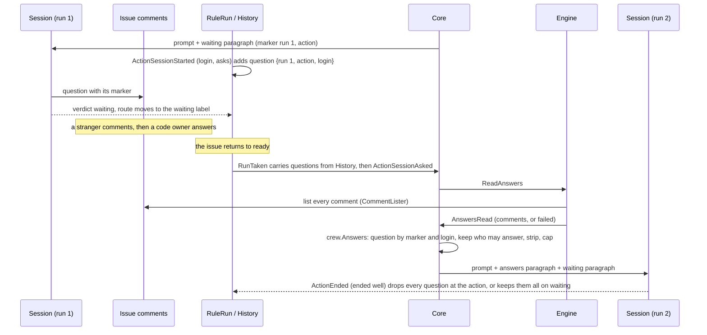
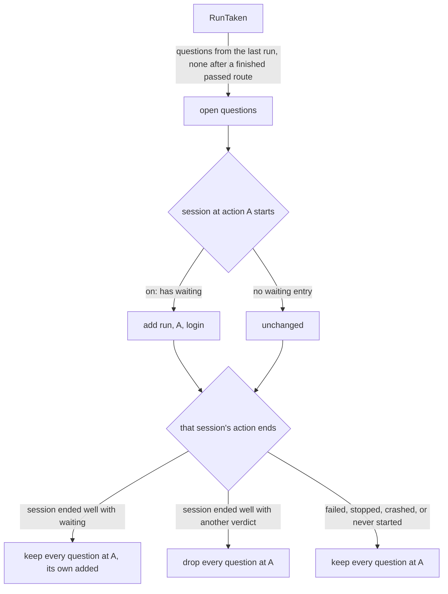

# A session waits for an answer from trusted people and agents, and resumes with the answers - Plan

## Goal Capsule

- **Objective:** a session that needs a decision can ask it on the issue, wait a while for an answer, and pause its rule when none comes. Only the code owners and the Apps the boss trusts can answer, so a stranger's comment on a public repository never reaches the session as an answer. When the issue returns to `ready`, the new session at that action starts with the answers that count.
- **Means:** the full plan's Implementation Units U18 and U19, built here as U1 to U6, with the decisions KTD-W1 to KTD-W11 where the full plan left something open or the code on `main` after #294 and #298 differs from what it assumed.
- **Product authority:** the full plan, `docs/plans/2026-10-07-0724-feat-rule-sequences-and-routes-plan.md`, and issue #255. The full plan's Product Contract wins on behaviour, and its KTD11, KTD14, KTD20 and KTD21 win on mechanism except where a KTD-W below refines them and says why. Where a KTD-W reads a requirement in a way the boss has not confirmed, Assumptions says so.
- **Stop conditions:** stop and report when a settled Key Decision proves unworkable, when a unit cannot keep `go test -race ./...` green without changing a requirement, or when the work would need edits to `acceptance/scenarios/`, which only the tester makes.
- **Execution profile:** one branch and one pull request whose body contains `Closes #255`. Units land in U-ID order. Every unit keeps every gate green; nothing here switches a format.

---

## Product Contract

Product Contract preservation: narrowed, no scope change. This part builds the full plan's U18 and U19. Its R-IDs, AE-IDs and Key Decisions are the full plan's, cited as written there and in issue #255. Functions (R3, R5 and R14 in part, R26 to R31, AE9) arrive with #256.

### Summary

A session whose `on:` maps `waiting` gets a paragraph that tells it how to ask its question on the issue, how long to wait, and whose comments count as answers. It ends with `waiting` when none came, and its route pauses the rule. Every comment crew posts carries crew's hidden marker, so none counts as an answer. When the issue returns to `ready`, crew reads the issue's comments before the session at that action starts and hands it the answers that count, capped in size. A new top-level `answering_apps:` lists the Apps that may answer, and a session's `wait:` sets how long it waits.

### Problem Frame

See the full plan's Problem Frame and issue #255. Since #294 a session can end with `waiting` and a route can move the issue to a waiting label, but nothing tells the session how to ask, how long to wait or whom to trust, and a resumed session is told only that its last run ended through a route. On a public repository anyone can comment, so a session that reads comments on its own would take a stranger's comment for the answer it waited for.

### Requirements

Requirements this part builds whole: R19, R20, R21, R37, R38, R39, R40, R41, R42, R43, R44, R45, R46, R47, R48.

Requirement this part builds in part:

- R23 (partial). The waiting resume paragraph and its answers. Today's resume paragraph, naming the route, shipped with #254 and stays as it is when no question was asked.

### Key Decisions

The full plan's Key Decisions apply as written, and those that govern this part are the ones with `Governs` links to the requirements above: the session waits on its own; a resumed session is a new session; the waiting paragraph returns whenever the session asked; code owners and listed Apps answer, not collaborators; an App answers only from a list that starts as crew's bots, never `github-actions[bot]`; crew enforces the list through the session's instructions plus filtered answers on resume; an outsider's comment is ignored in silence; the session marks its own comments; crew marks every comment it posts; the answers on resume are capped. None is changed here.

### Acceptance Examples

This part covers the full plan's AE4, AE5 (the answers part; the rest shipped with #254), AE13, AE14, AE15, AE16, AE17, AE18, AE20 and AE21. They are cited by ID in the units' test scenarios. AE13 is a promise of the session's instructions: crew proves the paragraph says it, and proves on resume that the stranger's comment is not carried.

### Scope Boundaries

- The full plan's Scope Boundaries hold.
- Functions as actions or route steps (full plan U3, U20; #256).
- Writing or rewriting acceptance scenarios under `acceptance/scenarios/`: the tester's. The pull request hands the waiting flow (F3) to the tester.
- This repository's own `.crew/config.yaml` keeps its rules as they are: its `lfg` prompt tells a headless session never to wait on a background command, so mapping `waiting` there is the boss's call, not this part's.
- Considered and not built: retrying a failed comment read before the session starts. R48 tells the session instead, and the session can read the comments itself. Evidence of sessions that cannot read them would change the call.
- Considered and not built: stopping a session's start when a stop reaches the run while crew reads the answers. The session starts and is asked to stop at once, as it is today when a stop lands while a session starts (KTD-W6). Evidence of costly starts on stops would change the call.
- Considered and not built: checking that a session put its marker on its question. A question without the marker is never found, and the resumed session gets today's resume paragraph, which a reader of the log sees.
- Considered and not built: forcing a script's `gh` comments through a crew helper that marks them. A script is the boss's own automation, acting as a trusted login; crew offers `CREW_COMMENT_MARKER` and the README asks scripts that comment to use it. A script's comment mistaken for an answer in practice would change the call.
- Considered and not built: refusing `answering_apps` entries that name an App the repository has not installed. GitHub lets only an installed App comment, so an uninstalled one never answers (R39).

#### Deferred to Follow-Up Work

- The tester writes the scenarios for F3 and AE4, AE13 to AE18, AE20 and AE21 against the built binary.
- The full plan's "Deferred for later" list holds: an answering list per action, recording outsiders' logins, collaborators as answerers, and a `crew sessions <id>` command for the answers.

---

## Planning Contract

### Key Technical Decisions

The full plan's KTD1 to KTD23 apply, read through `docs/solutions/design-patterns/rule-sequences-read-their-full-plan-narrowly.md` and the part 2 plan's KTD-S1 to KTD-S17. Since #294 the code already has `crew.Comment` (author, App flag, body, time), `port.CommentLister` with the GitHub adapter's paged REST listing, `fake.Routing` with scripted comments, `crew.Waiting`, the reserved word `wait`, `Rule.WaitingStates` and the board columns of KTD17. None is re-planned.

**Markers**

- KTD-W1. **crew's markers are one protocol owned by `internal/crew`.** Every marker is an HTML comment that starts `<!-- crew:`, which GitHub renders as nothing.
  - crew's own marker is `<!-- crew:posted -->`. The status comment already ends with `<!-- crew:status -->` and counts as marked, so its suffix check in `findStatus` holds unchanged.
  - A session's marker is `<!-- crew:session run=<run id> action=<action> -->`, its values query-escaped as `markerLine` does, so none holds a space or closes the comment.
  - A comment that holds `<!-- crew:` anywhere is never an answer (R43, R46).
  - A comment that holds crew's own marker is never a question, so a route comment whose template renders a session marker cannot move the question.
- KTD-W2. **crew's marker goes on every body crew writes, whatever it holds.** One helper in the GitHub adapter adds crew's marker on its own line to every body that `postComment` posts: route comments, failure reports and pull-request stop comments. The status comment carries it in its trailer instead: `joinStatus` writes it on the line before `<!-- crew:status -->`, which stays last, so `findStatus`'s suffix check holds, as KTD11 says. `parseStatus` strips both, so a cached or re-read body parses into the same entries, and `nextStatus`'s size check counts the marker. The helper leaves a body that already ends with that trailer as it is, so the PATCH and a new status comment carry the marker once. It runs after `Comment` strips control characters, so stripping cannot break it. Shell actions and route shell steps get the marker as `CREW_COMMENT_MARKER`, so a script that comments through `gh` can mark its comments too; without it, a script acting as a code owner would post what counts as an answer. Governs R46.

**Configuration**

- KTD-W3. **`wait:` is a Go duration on the session item, default 10 minutes.** It is written as AE4 writes it, `wait: 10m`, unlike the top-level `*_seconds` keys, because it belongs to one session and reads as a duration in the paragraph. A value that does not parse, or is not positive, is refused with its key path and line. `SessionSpec` gains `Wait`. Governs R20.
- KTD-W4. **`answering_apps:` is a top-level list of App logins, resolved once at startup.**
  - Each entry must end with `[bot]`. `github-actions[bot]`, in any case, is refused with the file, key path and line (R39).
  - Without the key, the list is the logins of crew's bots, `bots.Logins`, which `app` already reads. A written list replaces it, and `[]` means no App answers (R38).
  - `app` resolves the list and hands it to the engine, which hands the core the code owners it read at Prepare and this list, as one `crew.Answerers` value.
- KTD-W5. **A rule that may wait needs a tracker that lists comments.** `app.build` refuses, with exit code 2, a rule with a session whose `on:` has a `waiting` entry when the tracker is not a `port.CommentLister`, naming the rule and the action. This follows `routeSteps`.

**The open question**

- KTD-W6. **The core reads the answers as session plumbing, not as a phase of the run.** When the run asks for a session (`ActionSessionAsked`) at an action with open questions, the core sends `ReadAnswers` before `StartSession`, as it sends `FindPullRequest`. The engine lists the comments through `CommentLister` within the lookup timeout and posts `AnswersRead` with the comments or the failure. The core picks the answers (KTD-W9), keeps them on the held run and then starts the session. The answer text is in no run event, so it never reaches the journal, a comment or the status. This departs from KTD21's `AnswersAsked` event and `AnswersRead` fact: nothing the journal must keep depends on the read, and a crash before the session starts reads again at the next take. A stop while crew reads changes nothing here: the run's next fact, the session's start, asks it to stop.
- KTD-W7. **The run keeps a list of open questions, carried from run to run.** A question is a session that may have asked one: its run, its action and the login it acted as.
  - `ActionSessionStarted` records the session's login and whether its action's `on:` has a `waiting` entry. Applied, it adds the session to the run's questions when it has one.
  - A session ends on the questions at its action when it started in this run and ended well (`EndSucceeded`) with a verdict other than `waiting`: `ActionEnded` then drops every question at that action, its own included. One that ended well with `waiting` keeps them all, its own and the earlier ones, since it may have waited for the answers to an earlier question without asking a new one; the latest question asked wins when crew reads the answers, and the waiting paragraph's read command prints the earlier questions too.
  - A session that failed, crew stopped, crashed with crew, or never started ends on nothing: every question at its action stays, its own included, since it may have asked before it was cut short.
  - `RunTaken` carries the questions of the last run of the issue and rule, which `History` gives. A last run that ended through `passed` and finished its route passes none on.
  - `WorkspaceMissing` keeps them, and a retired run still passes them on. Like resume, they need the run journal: without one, no run inherits anything.
  - This refines KTD21, which kept one question per action and set it at each session's start. Under KTD21 a resumed session cut short before it asked again would become the question, crew would find no comment of it, and the next session would lose the answers it never read. Conflict call-out: see Assumptions.
- KTD-W8. **The core knows the login a session acts as.** `BotsConfig` gains each acting bot's login, which the engine reads from `Identities`. A session acts as its bot's login when that bot acts at startup, and as gh's login (`BotsConfig.Login`) otherwise, as the engine starts it. The core uses that login in the waiting paragraph (R40) and in the `SessionStarted` fact it hands the run (KTD-W7). An unknown login, empty, finds no question.

**Answers and paragraphs**

- KTD-W9. **`crew.Answers` picks the answers, as one pure function in `internal/crew/answer.go`.**
  - Every login is compared without case, as the GitHub adapter compares them elsewhere (`containsFold`) and as CODEOWNERS may spell them.
  - The question is the latest comment that holds the session marker of one of the open questions, by that question's login, and does not hold crew's own marker (KTD-W1, R45).
  - An answer is a comment after the question that holds no crew marker, written by a code owner who is not an App, or by an App on the answering list that asked none of the open questions (R37, R39, R43, R44).
  - Each answer keeps its author's login and its body stripped with `StripControlsKeepingLines`.
  - Answers go newest first, whole, until the next would pass 32 KiB in bytes. That one and every older one are left out and counted (R47).
  - It returns whether a question was found, the answers and the count left out.
- KTD-W10. **Every new paragraph is built in `internal/core/paragraph.go`, in a fixed order.** A session's prompt is its own text, then the answers paragraph or today's resume paragraph, then the verdict paragraph, then the waiting paragraph.
  - The waiting paragraph goes to every session whose `on:` has a `waiting` entry. It follows the full plan's KTD20 bullets, with the issue's number, the session's wait, the code owners' logins, the answering list without the session's own login (R40), its session marker, and that a comment holding `<!-- crew:` is no answer.
  - It gives the session the one command to read with: `gh api --paginate repos/{owner}/{repo}/issues/<n>/comments` with a `--jq` filter crew writes from the same logins. The filter prints only the comments after the session's latest marked comment that hold no `<!-- crew:`, written by a named code owner whose `user.type` is not `Bot` or by an App on the list whose `user.type` is `Bot`. The paragraph tells the session never to list comment bodies without it, so a stranger's text, an injected instruction among them, never enters its context while it waits.
  - It departs from KTD20 in three places. Logins match ignoring case, as `crew.Answers` matches them (KTD-W9), so the session and crew count the same answers. The session checks once more right before it ends with `waiting`, so an answer that lands at the end of the wait is not missed. Each check is one command of at most 5 minutes, and the session sets its tool's timeout above that when its tool has one: crew raises the command timeout for Claude Code only.
  - The answers paragraph goes to a session at an action with open questions once crew found a question. It says an earlier session at this action asked a question on the issue and carries the answers, newest first, each under its author's login, and how many were left out and that they are on the issue (R23, R47). A question with no answer yet is said so. When the session resumes in the reopened worktree, it keeps the resume paragraph's branch, log and `git status` guidance, and says nothing of the route or reason (AE20).
  - A failed read gives a paragraph that says crew could not read the issue's comments (R48). It names the session marker and login of every open question at this action, since the question was asked under an earlier run's marker, and gives the filtered read command for the comments after the latest of those markers by its login.
  - No question found gives today's resume paragraph when the session resumes, and nothing otherwise.
- KTD-W11. **The journal stays at version 3, with optional keys.** An `action_session_started` line gains `login` and `asks`, and a `run_taken` line gains `questions`. A line without them decodes with none, so a run journaled before this change carries no question.

Jev is not used: who may answer is decided by logins, the App flag and markers, which are exact rules, not a judgment on free text.

### High-Level Technical Design

How a question travels from one run to the next (KTD-W6 to KTD-W9):

How the run's open questions change (KTD-W7):

### Assumptions

- KTD-W7 reads R23's "no later session at that action has ended on since" as: a session ends on a question when it ended well, the asking session included, unless it ended with `waiting`. So a session that got its answer within its wait (AE4) and ended `passed` closes its question, and a later resume at that action, after a shell action failed, gets today's resume paragraph naming that route instead of the old answers. A session that failed or crashed after it was given answers ends on nothing, so the next session gets them again (R23's "cut short"). The PR body states the reading.
- The waiting paragraph's checks assume the harness lets one command run up to 5 minutes. crew sets that for Claude Code; for Codex the paragraph asks the session to set its tool's timeout, which is unverified against Codex. A Codex rule that waits should be tried once before the boss relies on it; the PR body says so.
- KTD-W9 leaves out an answer that alone passes the cap, and stops at the first answer that does not fit, so the answers carried are always the newest. R47 says whole answers; it does not say what to do with one larger than the cap.
- A question's later marked comments by the same session, such as a follow-up while it waits, move the question forward: answers before the latest marked comment are not carried (R45 as written).
- The marker text is not secret: anyone can put `<!-- crew:` in a comment, which only makes that comment no answer.
- The prompt reaches the harness as one command-line argument, which other local users can read while the session runs (`docs/solutions/security-issues/session-environment-values-in-codex-command-line.md`). "Private" means never posted on the tracker. The answers come only from people and Apps crew trusts.
- GitHub's REST listing reports `user.type` as `Bot` for an App's comment, as the full plan assumes and `acceptance/fakegithub` already does.

### Deferred to Implementation

- The exact wording of the waiting, answers and failed-read paragraphs, within KTD-W10 and the full plan's KTD20.
- How the waiting paragraph writes the wait, such as "10 minutes" rather than Go's `10m0s`.
- The exact Go names of the question type, the command, the input and the new event fields.
- Whether the answers' cap counts the author line each answer carries in the paragraph; it must keep the paragraph within 32 KiB plus a fixed frame.

### Sequencing

U1 (config and startup checks) and U2 (markers) stand alone. U3 adds the waiting paragraph on top of both. U4 adds the open questions to the run and the journal. U5 reads the answers on resume, on top of U3 and U4. U6 documents it all. Every unit keeps every gate green.

---

## Implementation Units

### U1. Config: `wait`, `answering_apps` and the startup checks

- **Goal:** crew loads a session's `wait` and the answering list, refuses `github-actions[bot]`, and refuses a rule that may wait without a tracker that lists comments.
- **Requirements:** R20, R38, R39; full plan KTD14; KTD-W3, KTD-W4, KTD-W5.
- **Dependencies:** none.
- **Files:**
  - Domain: `internal/crew/actionkind.go` (`SessionSpec.Wait`), `internal/crew/answer.go` (the `Answerers` type: code owners and Apps).
  - Config: `internal/config/sequence.go` (`sessionDoc.Wait`), `internal/config/config.go` (the top-level key and `Config.AnsweringApps`, with whether it was written), a new `internal/config/answering.go` if `config.go` nears its limit.
  - Schema and fixtures: `schema/config.schema.json`, `.crew/config.example.yaml`, `internal/config/testdata/translation/.crew/config.yaml`.
  - App: `internal/app/app.go` (resolve the list, the `CommentLister` check), `internal/engine/engine.go` (`Config.AnsweringApps`).
  - Tests: `internal/config/sequence_test.go`, `internal/config/config_test.go` (the `rejectCase` table), `internal/config/schema_test.go`, `internal/config/config_example_test.go`, `internal/app/app_test.go`.
- **Approach:**
  1. Parse `wait` on a session item with `time.ParseDuration`, default 10 minutes (KTD-W3).
  2. Parse `answering_apps` as a list of strings and run KTD-W4's checks, each error with its key path and line.
  3. In `app`, resolve the list (the written one or `bots.Logins`) and pass it to the engine.
  4. In `app.build`, refuse a rule with a waiting session when the tracker is not a `CommentLister` (KTD-W5).
  5. Add both keys to the schema, the example and the translation fixture, so the two-way schema tests hold.
- **Patterns to follow:** `parseSession` and `required` in `internal/config/sequence.go`; `positive` and `keyError` in `internal/config/config.go`; `routeSteps` in `internal/app/app.go`; the `rejectCase` tables.
- **Test scenarios:**
  - A session without `wait` has a wait of 10 minutes; `wait: 3m` gives 3 minutes.
  - `wait: soon`, `wait: 0s` and `wait: -1m` are refused, naming `rules.<rule>.actions[<i>].wait` and the line.
  - Covers AE15. `answering_apps: ["claude[bot]"]` loads as that list; `["github-actions[bot]"]` and `["GitHub-Actions[bot]"]` are refused with the file, `answering_apps[0]` and the line.
  - An entry `octocat`, without `[bot]`, is refused naming it.
  - Without `answering_apps`, `app` hands the engine the bots' logins; with `answering_apps: []`, an empty list.
  - A rule whose session maps `waiting` with a tracker that is not a `CommentLister` fails startup with exit code 2, naming the rule and the action; with `fake.NewRoutingTracker` it starts.
  - The schema, the decoder's key tree and the example match both ways, and the example sets both keys.
- **Verification:** `go test -race ./internal/config ./internal/app` passes; nothing outside config and app changes behaviour.

### U2. crew's marker on every comment it writes

- **Goal:** every comment the GitHub adapter posts or edits carries crew's marker, so none of crew's own comments can count as an answer.
- **Requirements:** R46; full plan KTD11; KTD-W1, KTD-W2.
- **Dependencies:** none.
- **Files:** a new `internal/crew/marker.go` and `internal/crew/marker_test.go` (crew's marker, the session marker, and the checks KTD-W1 names); `internal/adapter/github/comment.go`, `internal/adapter/github/status.go`; `internal/adapter/github/{comment,status,tracker,pullrequest}_test.go`; `internal/adapter/shell/shell.go` and its test.
- **Approach:**
  1. In `internal/crew`, define crew's marker, the session marker of a run and action, whether a body holds any crew marker, and whether it holds crew's own (KTD-W1).
  2. One helper adds crew's marker to every body `postComment` posts; `joinStatus` puts it in the status trailer and `parseStatus` strips it (KTD-W2).
  3. The shell adapter sets `CREW_COMMENT_MARKER` for shell actions and route shell steps.
- **Patterns to follow:** `statusMarker`, `markerLine` and `parseMarker` in `internal/adapter/github/status.go`; the scripted `gh` runner in the adapter's tests.
- **Test scenarios:**
  - Covers AE18. A route comment and a failure report are posted with `<!-- crew:posted -->` on their last line.
  - A pull-request stop comment is posted with the marker.
  - A new status comment holds crew's marker on the line before the status marker, which stays last, and `findStatus` finds it again after a restart.
  - A status comment edited after it was created still holds both markers once each, the status marker last, and its entries parse as before.
  - A status body just under GitHub's size limit continues in a new comment once crew's marker would push it over.
  - A route comment whose template renders `<!-- crew:status -->` or a session marker is still posted with crew's marker.
  - A shell action and a route shell step see `CREW_COMMENT_MARKER` holding crew's marker.
  - A comment body holding `\x00` is posted stripped, with the marker intact after it.
  - The session marker of a run and action round-trips through the check that finds it, also when the action's name holds characters that need escaping.
  - A body holding `<!-- crew:session ...` counts as marked; one holding `<!-- crew:posted -->` counts as crew's own.
- **Verification:** `go test -race ./internal/crew ./internal/adapter/github` passes.

### U3. The waiting paragraph

- **Goal:** a session whose `on:` maps `waiting` starts with the instructions to ask, wait and judge answers by login and marker.
- **Requirements:** R19, R20, R21, R40, R41, R42, R43; full plan KTD20; KTD-W8, KTD-W10.
- **Dependencies:** U1, U2.
- **Files:** `internal/core/paragraph.go`, `internal/core/runs.go` (`startSession`), `internal/core/bots.go` (each acting bot's login and the login a session acts as), a core option for the answerers, `internal/engine/engine.go` (`withBots` and the answerers at Prepare), `internal/core/paragraph_test.go`, `internal/core/waiting_test.go`, `internal/engine/engine_test.go`.
- **Approach:**
  1. `BotsConfig` gains each acting bot's login, which `withBots` fills from `Config.Identities`. The core gets the answerers, code owners and answering list, as an option the engine builds in `prepare` once it read the code owners (KTD-W4, KTD-W8).
  2. Build the waiting paragraph per KTD-W10 from the session's wait, the issue's key, the session's marker, the code owners and the answering list without the session's login.
  3. `startSession` appends it after the verdict paragraph.
- **Patterns to follow:** `resumeParagraph`, `verdictParagraph` and `oneLine` in `internal/core/paragraph.go`; `WithBots` and `identity` in `internal/core/bots.go`; the session prompt tests in `internal/core`.
- **Test scenarios:**
  - Covers AE4. A session with `wait: 10m` whose `on:` maps `waiting` starts with a paragraph naming 10 minutes, checks of at most 5 minutes each, the code owners' logins, the answering list and its own marker.
  - Covers AE14. A session acting as `crew-developer[bot]` with the default list of `crew-developer[bot]` and `crew-product-manager[bot]` is told only `crew-product-manager[bot]` may answer as an App.
  - Covers AE16. A session acting as you is told to mark its comments, and that the code owners, you among them, may answer.
  - Covers AE13. The paragraph names the REST listing, says logins match ignoring case and keep their `[bot]` suffix, that an App counts only when `user.type` is `Bot` and it is on the list, that any other comment is not an answer, and to keep waiting.
  - The paragraph tells the session to write `waiting` to `CREW_VERDICT_FILE` right after asking, to replace it or empty the file once an answer counts, and to check once more before it ends with `waiting`.
  - The paragraph tells the session to keep each check to one command of at most 5 minutes and to set its tool's timeout above that.
  - Covers AE13. The paragraph's read command, run against a scripted comment list with a stranger's comment, a crew-marked comment, an App off the list and a code owner's answer after the question, prints only the code owner's answer. The test runs the filter with `jq` when it is installed and skips otherwise.
  - A session that ends with `waiting` still in its verdict file takes its `waiting` mapping (the existing verdict path).
  - A session whose `on:` has no `waiting` entry gets no waiting paragraph.
  - With `answering_apps: []`, the paragraph says no App may answer.
  - The engine hands the core the code owners the tracker found at Prepare.
- **Verification:** `go test -race ./internal/core ./internal/engine` passes.

### U4. Open questions in the run and the journal

- **Goal:** a run knows which sessions at which actions may have asked a question no later session ended on, and passes that on to the next run of its rule on the issue.
- **Requirements:** R23, R45; full plan KTD18, KTD21; KTD-W7, KTD-W8, KTD-W11.
- **Dependencies:** U3 (the session's login).
- **Files:**
  - Domain: a new `internal/crew/question.go`; `internal/crew/{run,event,apply,fact_action,history}.go`; tests in a new `internal/crew/question_test.go` and in `internal/crew/history_test.go`, with `internal/crew/fixtures_test.go` helpers.
  - Core: `internal/core/scheduler.go` (`take`), `internal/core/claims.go` (`continued`), `internal/core/runs.go` (the `SessionStarted` fact with its login).
  - Journal: `internal/adapter/jsonl/{line,encode,decode}.go` and their tests.
- **Approach:**
  1. Add the question type and the run's list, with an accessor by action and a snapshot field.
  2. `SessionStarted` (the fact) carries the login; `ActionSessionStarted` records it and whether the action's `on:` has a `waiting` entry. Apply per KTD-W7, and drop on `ActionEnded` per KTD-W7.
  3. `History` gives the questions a new run inherits; `take` puts them on `RunTaken`, and `RunTaken.apply` sets them.
  4. The jsonl adapter writes and reads the new keys (KTD-W11).
- **Execution note:** write the question rules test-first, as decision and history tables.
- **Patterns to follow:** `LatestSession`, `inherited` and `RunTaken.apply` in `internal/crew/start.go` and `apply.go`; `startAfter`, `passedAfter` and `passesOn` in `internal/crew/history.go`; the round-trip tests in `internal/adapter/jsonl`.
- **Test scenarios:**
  - A session whose `on:` maps `waiting` starts, acting as `crew-developer[bot]`: the run has one question at that action with its run and login.
  - A session without a `waiting` entry starts: no question is added.
  - Covers AE20. A session that asked is stopped during its wait; the run released through `failed`; the next run of the rule on the issue inherits the question.
  - Covers AE4. A session asks, gets its answer within its wait and ends `passed`; a later shell action fails: the run's question at that action is dropped, and the next run inherits none.
  - A session ends with `waiting`: its own question stays.
  - A resumed session at that action ends `passed`: every question at that action is dropped.
  - A resumed session at that action ends with `waiting` again: both questions stay, and its read command prints the earlier question too.
  - A resumed session at that action is stopped before it asks again: both questions stay, and the next run inherits both.
  - A resumed session at that action fails (its harness failed) after it was given the answers: both questions stay.
  - A resume stopped before its session started passes the question on to the run after it.
  - Covers AE5. The worktree is gone after `waiting`: the run starts fresh at its first action and still holds the question; a failed `install` in that run, then a resume, still holds it.
  - A run that ended through `passed` and finished its route passes no question on.
  - A run whose worktree another run's name retired still passes its questions on.
  - A version 3 line without the new keys decodes with no question and no login; one with them round-trips.
- **Verification:** `go test -race ./internal/crew ./internal/core ./internal/adapter/jsonl` passes.

### U5. The answers on resume

- **Goal:** a session at an action with open questions starts with the answers that count, or with a note that crew could not read them.
- **Requirements:** R23, R37, R39, R42, R43, R44, R45, R47, R48; full plan KTD21; KTD-W6, KTD-W9, KTD-W10.
- **Dependencies:** U3, U4.
- **Files:**
  - Domain: `internal/crew/answer.go` (`Answers`), `internal/crew/answer_test.go`.
  - Core: `internal/core/command.go` (`ReadAnswers`), `internal/core/input.go` (`AnswersRead`), `internal/core/runs.go` (`startSession` waits for the read; the held run keeps the answers), `internal/core/paragraph.go` (the answers and failed-read paragraphs), a new `internal/core/answers_test.go`.
  - Engine: a new `internal/engine/answers.go` and `internal/engine/answers_test.go`, `internal/engine/exec.go` (the command's dispatch).
- **Approach:**
  1. Write `crew.Answers` per KTD-W9.
  2. On `ActionSessionAsked` at an action with open questions, the core sends `ReadAnswers` and waits; otherwise it starts the session at once, as today (KTD-W6).
  3. The engine lists the comments within `lookupTimeout` and posts `AnswersRead`. An input for a run the core does not hold, or whose action no longer starts its session, changes nothing.
  4. On `AnswersRead`, the core builds the paragraph per KTD-W10 and sends `StartSession`.
- **Execution note:** write `crew.Answers` test-first, as a table over hostile comment lists.
- **Patterns to follow:** `FindPullRequest`, `PullRequestFound` and `findPullRequest` in `internal/core/command.go`, `input.go` and `internal/engine/exec.go`; `StripControlsKeepingLines` and the text types in `internal/crew/text.go`.
- **Test scenarios:**
  - Covers AE17. After the question, a stranger's comment, then a code owner's answer: only the code owner's answer is kept.
  - Covers AE14. An answer by `crew-product-manager[bot]` (an App on the list) counts; a later unmarked comment by `crew-developer[bot]`, the asking bot, does not.
  - Covers AE15. With the list `claude[bot]`, `claude[bot]`'s comment counts; another App's and crew's own bots' do not.
  - Covers AE16. The boss asked as you: the boss's unmarked answer counts, and the session's marked second comment does not.
  - Covers AE18. With no bots, crew's marked report and route comment after the question, posted as a code owner, are not answers.
  - A comment by a user named like an App on the list, whose author is not an App, does not count.
  - The question is the latest comment with an open question's marker by its login; the same marker in a comment by another login does not move it, nor does one in a crew-marked comment.
  - With two open questions, the latest marked comment of either is the question.
  - A code owner listed as `Octocat` whose comment's author is `octocat` counts; the asking bot's comment under another letter case does not.
  - A question with no answer after it starts the session with a paragraph that says the question has no answer yet.
  - Covers AE21. Answers whose total passes 32 KiB keep the newest whole answers and count the rest; an answer holding `\x00` and an ANSI escape is carried stripped.
  - Covers AE20. A session stopped during its wait, then a return to `ready`: the new session's prompt has the answers paragraph and not the resume paragraph's route and reason, and keeps the worktree and log guidance.
  - Covers AE5. A run resumed after `waiting` starts at the session, after `ReadAnswers`, with its answers; `install` before it does not run again.
  - Covers AE21. A failed comment read starts the session with the paragraph of R48, and the session is not failed.
  - With two open questions, a failed read's paragraph names both earlier markers and their logins.
  - No question found starts a resumed session with today's resume paragraph.
  - A session at an action without open questions starts with no `ReadAnswers`.
  - A stop while crew reads: the session starts and is asked to stop at once.
  - No answer text appears in any run event, status, comment or tracker call of the run.
- **Verification:** `go test -race ./internal/crew ./internal/core ./internal/engine` passes.

### U6. Docs

- **Goal:** the README and the glossary describe waiting, who may answer, crew's marker and the answers on resume.
- **Requirements:** R19 to R21, R37 to R48 as documented behaviour; AGENTS.md's "Keep it true".
- **Dependencies:** U5.
- **Files:** `README.md`, `CONCEPTS.md`, `AGENTS.md`.
- **Approach:**
  1. README, Rules: a part on waiting, with `wait` and an example `waiting` route to a label, who may answer and `answering_apps`, the session's marker, the filtered read the session is told to use, crew's marker on every comment, and the answers a resumed session gets, capped, or the note when crew cannot read them. It tells whoever answers a paused issue to move it back to the rule's `ready` label (R21). Shell actions: `CREW_COMMENT_MARKER`, and that a script that comments should put it in its comments.
  2. `CONCEPTS.md`: entries for the asked question, the answer, crew's marker and the answering list. The Resume entry says a session at an action that asked gets the answers. Flagged ambiguities add "question": a session's asked question against a TypeSafe question of the question bank.
  3. `AGENTS.md`: `internal/crew`'s description names the questions and answers; `internal/core`'s paragraph line names the waiting and answers paragraphs.
- **Test expectation:** none -- documentation; U1's schema and example tests already pin the keys the README names.
- **Verification:** the README names no key the decoder refuses, and describes no behaviour U1 to U5 did not build.

---

## Verification Contract

| Gate | Command | Applies to |
|---|---|---|
| Format | `gofmt -l cmd internal tools acceptance` prints nothing | every unit |
| Vet | `go vet ./...` | every unit |
| Lint and layering | `go run github.com/golangci/golangci-lint/v2/cmd/golangci-lint@v2.14.0 run` | every unit |
| Tests | `go test -race ./...` | every unit |
| Coverage floors | `go test -race -covermode=atomic -coverpkg=./... -coverprofile=coverage.out ./...`, then `go run github.com/vladopajic/go-test-coverage/v2@v2.19.0 --config=.testcoverage.yml` (total at least 90%) and `git diff -U0 origin/main...HEAD \| go run ./tools/diffcover -profile coverage.out` (changed lines at least 90%) | before the pull request |
| Vulnerabilities | `go run golang.org/x/vuln/cmd/govulncheck@v1.8.0 ./...` | before the pull request |
| Acceptance module | `go -C acceptance vet ./...` and golangci-lint in `acceptance/` | before the pull request |
| Acceptance smoke | `go -C acceptance run ./cmd/acceptance -count=1 -run TestSmoke` | before the pull request |
| Codacy limits | functions of at most 50 NLOC and complexity 15, files of at most 500 lines | every new or changed file, especially `internal/core/runs.go`, `internal/core/paragraph.go`, `internal/config/config.go` and `internal/engine/exec.go` |

---

## Definition of Done

- Every unit's Verification holds, and every gate above passes.
- No answer text reaches a run event, the journal, a tracker comment or the status; it reaches only the session's prompt and the prompt file kept beside the run's log.
- Every comment crew posts carries crew's marker, and the status comment still ends with its own.
- README, `CONCEPTS.md`, `AGENTS.md`, `schema/config.schema.json` and `.crew/config.example.yaml` describe `wait`, `answering_apps` and the answers on resume.
- Code from abandoned approaches is removed from the diff.
- The pull request body contains `Closes #255`, hands the waiting flow's acceptance scenarios to the tester, and states the readings in Assumptions and the departures of KTD-W6 and KTD-W7 from the full plan's KTD21.
